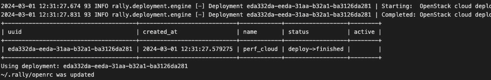
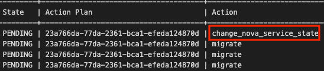

# 第九章：9

# 基准测试基础设施——评估资源容量和优化

“为将来做准备。”

—— 伊索

操作一个不断增长的基础设施时，主要挑战之一就是确保不同服务在预期的**服务级别协议**（**SLA**）内保持运行。即使已经设置了适当的监控解决方案，以便在检测到某些情况时采取主动措施，例如根据需要扩展或缩减集群节点以容纳更多租户工作负载，生产过程中仍然可能出现意外问题。在像 OpenStack 这样的复杂环境中，由于其分布式和松散的架构，达到系统性能的极限被认为是常见问题。随着更多服务加入生态系统，性能问题也会不断增加。你可能有一个监控仪表板，显示所有服务状态为绿色，但云租户用户在多次请求失败后仍无法启动**虚拟机**（**VM**）。正如我们在上一章中讨论的，日志记录有助于深入分析根本原因，但无法追踪导致用户因未发现性能问题而产生的沮丧情绪。因此，最佳实践是持续对每个小版本或大版本的生态系统进行分析。最推荐的方法之一是在每次更改时将基准测试阶段纳入你的 CI/CD 流水线。另一种方法是在每次 OpenStack 环境的软件或硬件更新时进行性能分析周期，并收集性能指标与现有的 SLA 进行比较。OpenStack 云环境并非资源无限，提前了解你的限制对于在做出扩展服务目录的业务和运营决策之前是至关重要的。

在本章中，我们将介绍在 OpenStack 中运行基准测试的不同选项，检测潜在的瓶颈，并针对避免生产环境中性能问题提出建议。以下主题将被涵盖：

+   使用缓存提升 OpenStack 中的数据库性能

+   基准测试 OpenStack 并识别性能瓶颈的来源

+   使用 Watcher 优化我们的云控制平面和数据平面

+   学习如何追踪跨 OpenStack 服务传递的请求，识别瓶颈并提高性能

# 赋能数据库

OpenStack 中的数据库被视为最关键的共享基础设施服务之一，需要额外注意。从高可用性的角度来看，基于**Galera MariaDB**的多主集群将满足对弹性数据库设置的要求，但并不能完全保证高性能的写入或读取事务。当云环境不断增长而未测量新负载时，数据库性能会成为一个问题。OpenStack 中的数据库可能会大规模增长，导致表格庞大。每次读取或写入请求和 API 调用都会增加负载，从而导致数据库不一致等常见场景。租户可能会发出 API 请求以将网络接口与实例解绑，但数据库中的记录仍然未更改。快速修复方法是登录数据库并手动更改记录，这可能是一个容易出错的过程。另一个常见模式是**多写并发**，即两个服务基于不一致的状态属性分配相同的资源 ID。例如，可能会生成新实例，并且可能无法将已从终止实例中解除关联的浮动 IP 资源关联起来。关系数据库通常面临性能挑战，通常，云操作员利用数据库管理员来管理其庞大且复杂的数据库环境。在 OpenStack 环境中，每个请求都会到达数据库进行读取或写入，正如我们在前几章中学到的那样，大多数 OpenStack 服务与数据库交互以完成请求，理想情况下在可接受的响应时间内。

除了通过硬件升级和升级可能改善 OpenStack 数据库设置的可能方法之外，还重要的是跟踪数据库的通用指标，例如读取或写入次数、输入/输出存储趋势和错误率。这将帮助您大致确定数据库何时会出现瓶颈。如果软件和配置调整无法帮助避免突增，硬件升级将更为方便，以确保下一个生产周期中少些麻烦。

## 运行与缓存

确保数据库性能最优的最快方式之一是查看运行集群的硬件。物理磁盘的特性对其执行一定数量操作的能力有很大影响。例如，使用**固态硬盘**（**SSDs**）作为数据库节点对提高访问时间、传输数据速度以及输入/输出等待因素非常有利。最新一代的设备会考虑闪存存储设备，这些设备能提高读/写操作，并且能够处理高并发操作速率。另一方面，也有更好且更具成本效益的方式来设计高性能数据库解决方案，比如通过缓存减少数据库侧的磁盘输入/输出活动。

缓存发生在每一个步骤中，从服务器到最终用户的浏览器。从最终用户的角度来看，缓存能够最小化查询传递到数据库时的无响应状态。此外，缓存可能适用于将长队列的数据库查询完全移出数据库服务器。在这种情况下，您最好使用外部缓存解决方案，如**Memcached**或**Redis**。通过暴露内存服务器，OpenStack 数据库服务器可以受益于 Horizon 缓存层来存储 OpenStack 服务数据。一个重要的考虑因素是，缓存层不存储数据。例如，一旦 Memcached 实例重新启动，数据将丢失。Memcached 是 OpenStack 中常用的缓存解决方案，可以在任何类型的配置中运行。大规模的 OpenStack 环境会将缓存层运行在专用的集群节点上，以提高性能。

一个典型的 Memcached 配置只需要使用比数据库需求更低 CPU 规格的硬件。下图展示了 Memcached 在 OpenStack 环境中的使用方式：


图 9.1 – Memcached 在 OpenStack 中的集成

该工作流程图通过获取存储在 Memcached 中的数据，同时对 MySQL 数据库执行读取操作，展示了一种**写透缓存机制**。在下一节中，我们将使用**kolla-ansible**在现有的 OpenStack 环境中部署 Memcached 层。

## 部署缓存

在开始部署 Memcached 实例到现有的 OpenStack 环境之前，必须遍历 OpenStack 中常见的涉及缓存操作的工作流程。当触发实例创建请求时，会生成多个 API 请求并与特定的服务端点对齐。此过程涉及 Horizon 到 Nova 发起 API 请求，Glance 获取镜像，Cinder 附加卷，Neutron 分配网络端口等。

每次请求时，Keystone 都会检查其数据库中的记录，以验证内部令牌的有效性。

随着大量类似的 API 请求，Keystone 将消耗更多的 CPU 资源以从数据库获取这些令牌并相应地验证它们。这会增加履行新进入请求的延迟，并导致由于过期令牌导致的数据库表查找的延迟增加。缓存可以通过不在数据库中保存令牌而使用缓存层来显著减少数据库负载。Keystone 将在 Memcached 实例中保存其所有令牌记录。

在接下来的练习中，我们将作为控制平面节点的一部分部署一个 Memcached 容器。如前所述，Memcached 层可以在专用服务器上运行，甚至可以集群以获得最高性能，并且需要单独进行集群配置，这超出了本书的范围。更新**multi_packtpub_prod**文件以将**memcached**角色分配给云控制器节点，如下所示：

```
...
[memcached:children]
control
```

接下来的步骤是在**globals.yml**文件中启用 Memcached 服务：

```
...
enable_memcached: "yes"
```

最后，请在控制节点上执行以下命令来运行管道，并确保**memcached**容器已创建并正在运行：

```
$ sudo docker ps | grep memcached
```

这是我们得到的输出：


图 9.2 – 列出 Memcached kolla 容器

确保 Keystone 已重新配置为使用缓存，可以在云控制器节点的 Keystone 配置文件中进行检查：

```
$ cat /etc/keystone/keystone.conf
[cache]
backend = oslo_cache.memcache_pool
enabled = True
memcache_servers = url:127.0.0.1:11211
```

在执行 Keystone API 调用时，可以通过观察**get_hits**值的增加来进一步检查 Memcached 实例，如下所示：

```
$ watch -d -n 1 'memcached-tool 127.0.0.1:11211 stats'
```

我们得到以下输出：


图 9.3 – 列出 Memcached 的 get_hits 统计信息

实时验证 Keystone 缓存机制的当前行为非常有用，例如以下内容：

+   **accepting_conns**：这是连接到 Memcached 服务器的已接受连接数。任何新添加的服务配置为使用 Memcached 作为缓存后端都会增加其值 1。

+   **bytes**：这是实时缓存项目使用的字节数。

+   **bytes_read**：这是传入到 Memcached 服务器的字节数。

+   **bytes_written**：这是从 Memcached 服务器传出的字节数。

+   **cmd_get**：这是 Memcached 服务器接收的获取命令的次数。

+   **cmd_set**：这是 Memcached 服务器处理的设置命令的次数。

+   **get_hits**：这是成功的缓存命中（获取请求）的次数。可以通过将**get_hits**除以**cmd_get**值并生成百分比来获取命中率。

+   **get_misses**：这是失败的缓存命中（获取请求）的次数。

大多数 OpenStack 服务都可以利用缓存层，因此 Keystone 可以使用 Memcached 服务器存储每个服务请求的令牌，而不是默认在进程内缓存它们。一旦启用，**kolla-ansible** 将推出缓存层并调整服务配置以使用 Memcached 层。

由于 Memcached 是通过云控制器节点部署的，我们可以确保其客户端由 HAProxy 负载均衡器处理，并使用多实例的 Memcached 进行 TCP 模式。我们可以简单地编辑 **kolla-ansible/ansible/group_vars/all.yml** 文件中的 **enable_haproxy_memcached** 变量，如下所示：

```
...
enable_haproxy_memcached: "yes"
```

在运行管道后，Memcached 集群将会在 HAProxy 中列出，并通过其虚拟 IP 提供服务。

我们需要告诉 Nova 服务，我们已经在三个不同的云控制器节点上运行了多个 Memcached 实例。当 **cc01.os** 不可用时，**cc02.os** 会接管，依此类推。我们将在每个控制节点和计算节点的 **/etc/nova/nova.conf** 文件中设置以下指令：

```
...
memcached_servers = cc01.os:11211,cc02.os:11211,cc03.os:11211
...
```

Memcached 对我们的仪表盘也有益处。我们可以告诉 Horizon 使用 Memcached 来进行 Django 的 web 缓存。只需要指向虚拟 IP，就可以考虑可扩展的云控制器设置。仪表盘包括 **CACHES** 设置，我们需要编辑或添加它。在你的云控制器节点上，编辑 **/etc/openstackdashboard/local_settings.py** 文件，内容如下：

```
...
 CACHES = {
     'default': {
         'BACKEND':
              'django.core.cache.backends.memcached.'
              'MemcachedCache',
         'LOCATION': '10.0.0.100:11211',
     }
 }
...
```

可选地，可以将下一个配置片段添加到每个 HAProxy 实例中，以增强可扩展的 Django 仪表盘，该仪表盘现在将使用可扩展的 Memcached 设置：

```
listen horizon 10.0.0.47:80
balance roundrobin
maxconn 10000
mode tcp
server cc01.os 10.0.0.100:80 cookie cc01.os check inter 5s rise
2 fall 3
server cc02.os 10.0.0.101:80 cookie cc02.os check inter 5s rise
2 fall 3
server cc03.os 10.0.0.102:80 cookie cc03.os check inter 5s rise
2 fall 3
```

通过执行以下命令行来重新加载 HAProxy 配置：

```
$ service haproxy reload
```

在管理数据库性能的使用场景中，有成千上万的情况是非常重要的；这是一个庞大的话题，需要更多的数据库专业知识来发现异常并立即处理。Memcached 是处理大量读取操作激增的一种方式，但这可能还不足够。当数据库性能变得更复杂，且很少有工具可以自动化数据库性能检查和修复时，问题会更加棘手。OpenStack 提供了一些工具，围绕其核心生态系统，支持云操作员进行基准测试、监控和做出架构决策，以改善服务性能。在下一部分，我们将深入探讨使用自动化工具进行 OpenStack 基准测试的技巧。

# 云基准测试

扩展硬件资源是解决容量和性能限制的标准方法。在监控系统的帮助下，云操作员可以主动反应，在定义的时间窗口内增加更多资源以适应额外的负载。然而，监控系统不足以更好地了解我们的极限。在分布式计算系统中，每个循环请求都会带来性能损耗。在 OpenStack 世界中，大量的 API 请求负载可能很难追踪，并且很难大致测量某个部分或服务能承载多少负载。

从云计算之旅的初期开始，云操作员应定义并开发战略性的方法来衡量他们的云极限和性能指标。然而，挑战在于缺乏高效的工具，这些工具能够集成到云部署的生命周期中。

为了弥补性能测量的这一空白，一个关键因素是对私有云的负载进行基准测试，分别对控制平面和数据平面进行测试。值得高兴的是，随着 OpenStack 的巨大成功，更多的基准测试工具正在围绕其生态系统以及每个平面进行开发。在下一节中，我们将探索一个复杂的基准测试工具来衡量控制平面：**Rally**工具。

## Rally 的实际应用

**kolla-ansible**不支持开箱即用的 Rally 安装，因为 Rally 最初并不是 OpenStack 生态系统的一部分。安装 Rally 有多种方式，其安装包适用于许多 Linux 发行版。我们将通过使用容器来保持平台独立性，但这并非必须。

重要提示

你仍然可以将 Rally 服务集成到**kolla-ansible**代码中。你需要构建自己的 Rally 容器，将其推送到自己的私有仓库，并编写 Ansible 角色。

在下一个安装练习中，我们将使用来自 Docker Hub 的最新 Docker Rally 镜像，该镜像包含 Rally 服务及不同的 OpenStack 插件。在其中一台云控制节点上，通过在新目录中运行以下命令来拉取 Rally 容器：

```
$ docker pull xrally/rally-openstack
```

拉取的 Rally 镜像版本为 2.3.0，这是写作时的最新版本。Rally 的数据库、配置和记录可以通过创建一个 Docker 卷来存储，方法如下：

```
$ docker volume create --name rally_storage
```

下一步命令只是通过指明 Rally 将在哪个路径下持久化数据，运行 Rally Docker 容器，该路径为**/home/rally/.rally**目录：

```
$ docker run -v rally_storage:/home/rally/.rally xrally/rally-openstack
```

重要提示

Rally 的默认配置将**'rally.sqlite'**数据库放在**/home/rally/.rally**目录下。可以通过更新**/etc/rally/rally.conf**文件中的可用选项来覆盖此默认配置。

我们需要通过提供一个部署文件来注册我们的 OpenStack 环境到 Rally，其中需要包括 OpenStack 环境变量，如管理员凭据等。

重要提示

admin 用户名、密码和租户的不同变量在**/****etc/kolla/clouds.yaml**文件中生成。

在 Rally 容器的 Bash 提示符下，创建一个**deployment.json**文件，并确保不同的变量值从**/****etc/kolla/clouds.yaml**文件中获取：

```
{
    "type": "cloud_my",
    "auth_url": "http://10.0.0.100:5000/v2.0",
    "region_name": "RegionOne",
    "admin": {
        "username": "admin",
        "password": "476212da112412",
        "tenant_name": "admin"
    }
}
```

使用 Rally 客户端命令行，通过之前创建的文件创建一个部署：

```
$ rally deployment create --file=deployment.json --name=perf_cloud
```

输出结果如下：



图 9.4 – 列出 Rally 部署状态

载入生成的**openrc**文件，该文件位于**~/.rally**：

```
$ source ~/.rally/openrc
```

使用部署检查命令验证 OpenStack 部署的可用性，如下所示：

```
$ rally deployment check
```

这是输出结果：


图 9.5 – 列出 OpenStack 服务状态

现在我们已经安装并正确配置了 Rally 服务器，以便与 OpenStack APIs 进行交互，是时候进行云端基准测试了。默认情况下，您可以在 **/rally/sample/tasks/scenarios** 中找到大量针对所有 OpenStack 服务的基准测试场景，包括其他孵化项目，如 Murano 和 Sahara。我们将集中精力对现有运行中的 OpenStack 服务进行基准测试。在开始我们的第一个基准测试之前，了解一下 Rally 是如何工作的会非常有帮助。Rally 中的场景是基于任务执行的。一个任务可以包括一组针对 OpenStack 云的运行基准测试，这些基准测试以 JSON 或 YAML 文件格式编写。前者文件通常具有以下结构：

```
ScenarioClass.scenario_method:
-
args:
...
runner:
...
context
...
sla:
...
```

每个区块的定义如下：

+   **ScenarioClass.scenario_method**：这定义了基准测试场景的名称。

+   **args**：每个对应特定类场景的方法可以通过传递参数来定制，在启动基准测试之前。

+   **runner**：这定义了工作负载频率类型和基准测试场景的顺序。runner 区块可以支持以下不同类型：

    +   **constant**：这涉及运行场景一定次数。例如，一个场景可以在总测试周期内运行 10 次。

    +   **constant_for_duration**：这涉及在固定次数内运行场景，直到达到某个时间点。

    +   **periodic**：这涉及定义一个特定周期来运行两个连续的基准测试场景。

    +   **serial**：这涉及在单一基准测试线程中运行场景一定次数。

+   **context**：这定义了我们基准测试场景可以运行的环境类型。通常，context 的概念定义了与给定 OpenStack 项目关联的租户数量和活跃用户数量。它还可以指定每个租户或用户在特定角色中的配额。

+   **sla**：这对于识别基准测试的整体场景平均成功率非常有用。

如果你希望找到一个便捷的基准测试场景，以揭示当前 OpenStack 部署中更显著的结果，你将需要继续寻找一个更加专门面向云运营商的实际用例。例如，Rally 可以帮助开发人员轻松地运行合成工作负载，如虚拟机的提供和销毁实例，且只持续有限的时间。然而，对云运营商来说，这种情况似乎更为复杂。从工作负载生成的结果通常更为高层次，但可以帮助你识别云中的瓶颈。

让我们考虑一个实际的例子：公司有多个应用程序需要根据不同的使用模式进行部署。如果我们有多个并发的应用程序实例用于 QA/dev，它们将在云端的不同版本中一天被部署多次。以大规模部署为例，设定有若干团队运行一组标准堆栈应用程序，每个应用程序将包含大量需要在一天中的特定时间进行部署的虚拟机。这种工作负载需求转化为 OpenStack 术语如下：我们将有*M*数量的用户，在特定的口味和时间段内并发地提供*N*数量的虚拟机。如我们所知，OpenStack 不是一个单体结构，它是一个分布式系统，具有不同的守护进程和服务相互通信。如果我们将提供实例的用例分解成原子操作，这有助于我们理解在虚拟机提供阶段我们花费最多时间的地方，并建立历史数据记录。例如，通过多次运行相同的基准测试，但更改数据库配置的参数或启用 Glance。在下一小节中，我们将采用相同的基准测试方法来测试 Keystone 服务。

### Keystone 压力测试

我们的示例场景是基于 Rally 方法的基准测试，名为**KeystoneBasic.authenticate_user_and_validate_token**。该场景旨在测量在特定负载下，Keystone 在认证用户时获取和验证令牌所需的时间。为了演示，重要的注意事项是负载测试将应用于一个不支持**WSGI**模块的特定 Keystone 配置，该配置用于 Apache Web 服务器。

重要提示

**kolla-ansible**的最新版本默认启用了 WSGI（**mod_wsgi**）模块配置，用于 Apache。你可以在 Keystone 配置文件中手动禁用该模块，或者创建一个新的 Kolla 容器来测试第一个 Rally 场景。请确保在单独的环境中执行负载测试，以免破坏 Keystone 配置，从而影响其他服务。

让我们创建一个名为**perf_keystone_pp.yaml**的新文件。该文件的任务内容如下：

```
KeystoneBasic.authenticate_user_and_validate_token:
- args: {}
  runner:
    type: "constant"
    times: 50
    concurrency: 50
  context:
    users:
      tenants: 5
      users_per_tenant: 10
  sla:
failure_rate:
  max:1
```

示例场景将创建一个恒定负载的 Keystone 场景，验证用户身份并验证令牌 50 次，且不中断，通过创建 5 个不同的租户，每个租户包含 10 个用户。请注意，在每次迭代中，50 个场景将同时在并发模式下运行，以模拟多个用户的访问。**sla** 部分定义了一个条件，如果某次身份验证尝试失败，任务将会中止。

让我们使用 Rally 命令行运行之前的基准测试，如下所示：

```
$ rally task start --abort-on-sla-failure perf_keystone_pp.yaml
```

请注意，这次我们为 **abort-on-sla-failure** 命令添加了一个新选项。如果您在实际的 OpenStack 生产环境中运行此类基准场景，这是一个非常有用的参数。Rally 生成了一个重负载，这可能会导致现有云环境中的性能问题。因此，我们告诉 Rally 在满足 **sla** 条件时，在某个时刻停止负载。我们执行的任务输出如下：


图 9.6 – 列出 Rally 任务统计信息

Rally 基准测试结果显示，场景测试已运行 50 次，并且以 100% 的成功率完成。要查看更详细的信息，我们可以通过运行以下命令，使用生成的 Rally 任务 ID 来可视化 HTML 报告：

```
$ rally task report c5493ee7-fba2-4290-b98c-36e47ed0fdb2 --out 
/var/www/html/bench/keystone_report01.html
```

我们的第一次测试迭代基准涉及在 Rally 任务期间满足的简单 SLA 条件：


图 9.7 – 一个 Rally SLA failure_rate HTML 报告

从相同的报告仪表板中，在**概述**标签页中，第二个相关图表，**负载配置文件**，展示了在 Rally 任务期间有多少个迭代是并行运行的：


图 9.8 – Rally 生成的 Keystone 场景的负载配置文件报告

**负载配置文件** 图表可以用来说明在工作负载周期中同时运行的迭代变化情况。这些信息对于了解系统在某些峰值时的行为非常有用，并且有助于规划在任何特定时刻系统能够承载的负载量。更多详细信息可以在第二个标签页 **详细信息** 中找到，在那里我们可以看到**原子操作时长**图表，在我们的案例中，展示了两项操作——**keystone_v2.fetch_token** 和 **keystone_v2.validate_token**：


图 9.9 – 一个 Keystone 步骤的原子操作时长图表，由 Rally 生成

该图表有助于查看每个操作的场景变化，以及迭代执行过程中持续时间的变化。如我们所见，由于获取和验证令牌是两个不同的操作，这两个操作的持续时间并不相同。如果我们的测试用例在 SLA 条件方面失败，例如场景执行时间过长，我们可以使用此图表进行详细分析，确定瓶颈出现在了哪个操作上。

我们可以在第二次迭代中稍微调整成功标准参数，以实现更严格的 SLA，从而可视化更现实的场景。例如，我们可以按如下方式修改**sla**部分：

```
...
  sla:
    max_avg_duration: 5
    max_seconds_per_iteration: 5
  failure_rate:
  max: 0
  performance_degradation:
    max_degradation: 50
    outliers:
      max: 1
```

新的**sla**部分定义了五个条件：

+   **max_avg_duration** ：如果认证的最大平均时长超过五秒，任务将终止。

+   **max_seconds_per_iteration** ：如果认证请求的最大时长超过五秒，任务将终止。

+   **failure_rate** ：如果多次认证失败，任务将根据**max**参数终止。

+   **performance_degradation** ：如果已完成迭代的最大时长与最小时长之间的差异超过 50%，任务将终止。最大值由**max_degradation**参数定义。

+   : **outlier** ：离群值限制长时间运行的迭代次数为**1**，由**max**参数定义。

一旦修改了 Rally 场景，按照以下方式重新运行任务：

```
$ rally task start --abort-on-sla-failure perf_keystone_pp.yaml
```

让我们通过生成一个不同名称的新报告再次检查我们的图表，以便比较与上次迭代结果的差异：

```
$ rally task report 980957ef-4c4c-4e9b-a9c1-573839dcad80 --out 
/var/www/html/bench/keystone_report02.html
```


图 9.10 – 由 Rally 生成的 Keystone 负载配置文件的 SLA

在测试过程中，Rally 检测到迭代的最大值为**11.27**秒，这不符合我们的 SLA 要求：


图 9.11 – Keystone 操作持续时间的堆叠概览

在新的 SLA 条件下，Rally 执行在第六次迭代时停止。验证用户并验证令牌的平均时间未能满足要求，因此，这将影响整体场景的执行时长。下一步目标是与该值竞争，并将其降到五秒以下。我们的基准测试表明，在某一工作负载峰值时，验证用户令牌的操作无法达到我们的 SLA 要求。此外，身份验证一个用户所花费的时间会增加，并且当并发水平达到某个阈值时，可能会超时。这个性能挑战可以通过重新审视我们的 Keystone 设置来调整。我们可以参考一种先进的 Keystone 设计模式，在 OpenStack 环境中增强我们的身份服务性能。由于许多 OpenStack 组件支持**eventlet-based**进程，Keystone 组件可以通过支持多线程处理来以不同方式运行，这将消耗我们云控制器的 CPU 资源。一个建议是在 Nginx 服务器下通过 WSGI 或在启用了**mod_wsgi**模块的 Apache 服务器中部署 Keystone。

使用 Web 服务器作为前端来处理 Keystone 实例，可以提供并行 HTTP 连接的处理功能，并且通过代理身份验证请求到我们的身份实例，支持多线程处理模式。默认情况下，社区版**kolla-ansible**代码启用了 WSGI 模块，将用于本次实验。WSGI Keystone 配置在**/ansible/roles/keystone/templates**目录下的**wsgi-keystone.conf.j2**模板中提供。

以下代码片段展示了在 Keystone 中使用**VirtualHost**选项的基本 WSGI 配置：

```
...
<VirtualHost *:{{ keystone_public_listen_port }}>
    ServerName {{ keystone_public_url }}
    WSGIDaemonProcess keystone-public processes={{ keystone_api_workers }} threads=1  user=keystone group=keystone display-name=keystone-public
    WSGIProcessGroup keystone-public
    WSGIScriptAlias / {{ binary_path }}/keystone-wsgi-public
    WSGIApplicationGroup %{GLOBAL}
    WSGIPassAuthorization On
...
```

请注意，WSGI 进程组定义了 Keystone 用户将运行的线程数（**threads=1**）和进程数（**keystone_api_workers**）。我们可以通过调整**keystone_api_workers**选项中定义的进程数和**WSGIDaemonProcessdirective**中的线程数来增加处理请求的数量：

```
...
WSGIDaemonProcess keystone-public processes={{ keystone_api_workers }} threads=30  user=keystone group=keystone display-name=keystone-public
...
```

由于我们进行了配置更改，请运行管道以拉取并运行新配置，并使其在 Web 服务器中生效。

现在，我们有一个由 Web 服务器支持，并通过 WSGI 模块实现多线程处理模式的 Keystone。我们已经定义了将帮助我们通过再次运行相同场景来追踪硬件和 Keystone 性能限制的进程守护程序和线程：

```
# rally task start --abort-on-sla-failure perf_keystone_pp.yaml
```

通过展示上一个 Keystone 设置，我们的云控制器应该会运行更多的**apache2**进程，从而使用更多的 CPU 资源。这可以通过身份验证和验证时长变化的新性能结果来说明：

```
# rally task report b36e4b72-0e86-4769-965d-cbe3662d647e --out 
/var/www/html/bench/keystone_report03.html
```


图 9.12 – Web 服务器线程增加时 Keystone 的 SLA

现在我们通过将每次迭代的最大秒数减少到五秒以下（4.19 秒）达到了我们的目标。由于我们已经达成了 *绿色* SLA，我们可以从 **负载** **配置文件** 图表中分析我们新的 Keystone 提升配置：


图 9.13 – 增加 web 服务器线程数后 Keystone 负载配置文件

与之前的迭代相比，多个请求可以通过线程池进行处理，因此 Keystone 能够在工作负载时间线期间处理并发迭代。尽管设置的并发水平较高，但我们可以注意到，负载测试的最大值仅为 **24**。这证明我们为 WSGI 设置的线程和进程配置走在正确的方向上，为更多的并发留出了更多空闲插槽，同时每次迭代的处理时间也更短。

Rally 还有更多可以做的事情，但上述场景已经足够复杂，可以作为我们在 OpenStack 中开始基准测试的起点。Rally 也是一个可插拔平台，允许操作员创建和定制他们的基准测试场景，以满足某些特定的使用案例。基准测试有助于了解 OpenStack 在定义的 SLA 下的表现。然而，当检测到性能异常时，基准测试不能直接帮助修复问题。因此，下一节中介绍的分析实践应该考虑到。

# 云端分析

OpenStack 生态系统由多个服务组成，这些服务彼此连接以完成请求。在某些情况下，请求可能会非常慢，甚至失败。如果请求失败的频率不断增加，云操作员必须调查并了解问题的根本原因。监控、调试和日志工具在某些情况下可以部分解决这些问题，但它们缺少请求流机制。在 OpenStack 生态系统中有一个小巧而强大的工具，名为 **OSProfiler**，它专注于服务追踪。OSProfiler 提供了请求在不同 OpenStack 服务中流动的视图，并将数据编译成时间轴图表进行可视化。云操作员可以通过比较不同条件下的追踪集，确定 OpenStack 部署中的瓶颈并提升其性能。OSProfiler 工具能够提供有价值的洞察和追踪数据，捕捉 API、数据库、驱动程序和 RPC 调用的响应时间。云操作员可以将追踪信息存储在持久存储中以便进一步分析，例如 Redis、Elasticsearch、简单文件或 MongoDB。

在像 OpenStack 这样的复杂系统中，追踪请求的大部分时间花费在哪里，对更快地排除故障、识别瓶颈并防止问题再次发生非常有帮助。使用 OSProfiler，云操作员可以找出原因，例如，为什么启动虚拟机请求需要很长时间。OSProfiler 能显示与这些请求相关的服务及其依赖关系。操作员可以得出哪个服务存在瓶颈，并了解如何改进响应时间。

下一节将说明如何在现有的 OpenStack 环境中安装和运行 OSProfiler。

## Profiler 在运行

从 Antelope 版本开始，OSProfiler 除了其他项目外，还可以追踪所有 OpenStack 核心服务。OpenStack 社区的目标是将 OSProfiler 应用于所有 OpenStack 项目，毫无例外，因为它具有轻量且强大的追踪能力。**kolla-ansible** 基础设施已经支持 OSProfiler，并且可以轻松安装。可以通过在**globals.yml**文件中配置以下设置来启用 OSProfiler：

```
enable_osprofiler: "yes"
enable_elasticsearch: "yes"
```

请注意，OSProfiler 使用 Elasticsearch 作为后端来存储追踪数据。

重要说明

如果**enable_elasticsearch**设置为**"no"**，Kolla 将安装并使用 Redis 作为 OSProfiler 的默认后端。

OSProfiler 不需要安装在专用主机上。写作时，OpenStack **kolla-ansible** 支持 Keystone、Nova、Glance、Cinder、Neutron、Placement、Swift、Heat、Trove、Senlin 和 Vitrage 等服务的 OSProfiler。

一旦更新并推送了**globals.yml**文件，运行管道，OSProfiler 库应该已经安装。在开始进行性能分析之前，我们需要从**/etc/kolla/passwords.yml**文件中获取由**osprofiler_secret**键引用的生成的 OSProfiler 密钥。该**osprofiler_secret**键将用于通过 OpenStack 客户端命令行为支持的服务创建 profiler UUID。以下示例说明了一个 Glance API 调用的追踪操作，具体步骤如下：

1.  使用在云控制器节点上运行的官方 OpenStack Python 客户端来生成追踪输出：

    ```
    $ openstack --os-profile <OSPROFILER_SECRET> image list
    ```

    这是我们得到的输出：


图 9.14 – OSProfiler 图像列表

**<OSPROFILER_SECRET>** 是从**/etc/kolla/passwords.yml**文件中检索到的 OSProfiler 密钥，参考了**osprofiler_secret**参数。

重要说明

通过配置每个对应服务的**hmac_keys**设置，可以为每个支持的服务自定义**OSPROFILER_SECRET**值。

命令行返回一个 OSProfiler 追踪命令行，如下所示：


图 9.15 – OSProfiler 追踪命令输出

1.  使用**osprofiler**命令行打印 HTML 格式的追踪图。检索到的追踪数据可以存储在创建的 Elasticsearch 实例中：

    ```
    $ osprofiler trace show --html 75da221e-ffe1-7dac-aae7-22eaed337761 --connection-string elasticsearch://localhost:9200 --out "/tmp/image_perf.html"
    ```

    HTML 报告应该可以在本地的**/****tmp**目录下找到。

1.  通过在浏览器中访问生成的**image_perf.html**文件来可视化追踪结果：


图 9.16 – OSProfiler 追踪结果示例

生成的 HTML 报告会展示每次处理调用时的请求信息，包括服务调用的性质（如 API、数据库等）及其相应的项目。**Levels**列对应一个追踪点，包含以 JSON 格式呈现的低级详细信息。

追踪是一种很好的实践，可以在低级别调试监控系统中无法检测到或日志数据中被忽略的问题。性能分析和基准测试提供了足够的信息来了解云的性能和资源利用趋势。随着云基础设施不断接纳新租户，硬件需求会增加。如果从一开始没有进行监控和分析，成本可能会上升，风险也将失控。应该为运营商提供策略和工具，自动化预算控制和管理。对于资源有限的情况，最好的方法之一就是寻求优化，这将在下一节中讨论。

# 观察云

一旦你的云环境开始扩展，并且更多的硬件资源被部署，云运营商应该寻找优化成本的方法。有些特定的使用案例，比如优化虚拟机（VM）的位置（在检测到不平衡时，虚拟机会在主机之间迁移）。

缺乏工具和高效的流程来进行资源优化演练是私有云运营商面临的一大挑战。传统上，OpenStack 管理员需要手动获取资源使用的历史指标，在定期的冲刺中分析这些指标，并根据收集的数据做出决策。然而，在大型 OpenStack 部署中，手动处理容易出错。为了自动化这一过程，OpenStack 社区提出了一个名为**Watcher**的不断发展的孵化项目。Watcher 项目的主要目标是为云运营商提供新的方法来减少云的**拥有总成本**（**TCO**）。Watcher 被设计用来基于预定义目标监控、分析并执行优化任务。下图展示了 Watcher 如何通过一系列步骤设计其持续优化循环：


图 9.17 – OpenStack 的 Watcher 步骤工作流

它从**Monitor**状态开始，在此状态下，来自各种数据源的数据指标被收集，例如 CPU 类型、内存使用率和能耗。然后，收集到的信息会被分析和汇总。Watcher 随后会启动一个分析器组件，该组件会总结出一些模式，并使用这些模式来预测虚拟机资源的使用情况。一个优化计划将由**Optimizer**组件创建，该组件以一组目标和约束为输入，例如，通过在 Nova 调度器中创建一些亲和性和反亲和性规则。Watcher 会根据这些输入做出调度决策，并可以利用其他项目定义的一些约束。下一阶段运行**Planner**组件，因此 Watcher 会构建行动项目，例如，如果虚拟机需要从一个主机迁移到另一个主机。在计划阶段，Watcher 会列出一组可以执行的步骤，并按顺序或并行执行。最后，Watcher 执行行动计划，并根据定义的目标应用基础设施的最佳状态。

下一部分将介绍如何使用 **kolla-ansible** 在现有 OpenStack 环境中安装 Watcher 项目，并演示其使用方法。

## Watcher 运行中

最新的 **kolla-ansible** 代码发布版本已经包含了用于安装 Watcher 的 Playbook。在安装 Watcher 之前，Keystone、Nova 和 Ceilometer 必须已经在运行。以下设置中，所有 Watcher 组件，包括 **watcher-api**、**watcher-engine** 和 **watcher-applier**，将成为云控制器节点组的一部分。要安装 **watcher** 组件，请通过添加以下部分来配置 **multi_packtpub_prod** 库存文件：

```
...
[watcher:children]
control
[watcher-api:children]
watcher
[watcher-engine:children]
watcher
[watcher-applier:children]
watcher
```

接下来，通过调整以下配置行，在**globals.yml**文件中启用 Watcher 服务：

```
enable_watcher: "yes"
```

Watcher 服务带有一个 Horizon 插件，一旦安装，它将在 Horizon 仪表盘上可见。提交更改并运行管道。完成后，通过在任何控制节点上运行以下命令，检查 Watcher 服务的新 Docker 容器：

```
$ sudo docker ps | grep watcher
```

以下是输出：


图 9.18 – Watcher 部署检查

在开始使用 Watcher 服务之前，重要的是要强调 Watcher 工作流的不同步骤：

1.  创建一个优化目标并将其与策略关联。

1.  创建一个与优化目标关联的审计模板。

1.  创建一个由审计模板触发的审计。

1.  通过创建的审计生成行动计划。

1.  采取手动或自动的行动。

在本节的接下来的部分，我们将演示一个预定义的 Watcher 策略，称为**VM 工作负载合并策略**。该策略的目标是将云中正在运行的工作负载进行合并，并优化运行该工作负载所需的资源数量。

要快速检查 Watcher 中预定义目标列表，请运行以下命令行并记下输出中的**服务器合并**目标**UUID**或**名称**：

```
$ openstack optimize goal list
```

输出如下：


图 9.19 – Watcher 优化目标列表

接下来，使用上一步输出中列出的目标**UUID**或**名称**获取**服务器合并**目标的可用策略列表：

```
$ openstack optimize strategy list --goal 8726da12-01da-42b5-65da-86165daca514
```

现在我们得到以下输出：


图 9.20 – Watcher 优化策略列表

从返回的策略列表中，我们将使用**vm_workload_consolidation**策略，以减少运行在与资源容量约束相关的工作负载的主机数量。在创建审计模板之前，在 Watcher 面板中应用所选的优化策略前，我们可以检查不同虚拟化管理程序机器上实例的分布：


图 9.21 – 优化应用前实例分布状态

**虚拟化管理程序**列表包括三个计算节点和它们之间实例的特定分布。

接下来，通过运行以下命令行创建与所选目标和策略关联的审计模板：

```
$ openstack optimize audittemplate create consolidation_template 8726da12-01da-42b5-65da-86165daca514 --strategy cdc1244d-0eb2-3312-9871-987daca123da
```

这是输出：


图 9.22 – Watcher 优化审计模板创建

接下来，运行从创建的审计模板中的审计，如下所示：

```
$ openstack optimize audit create -a consolidation-template
```

输出如下：


图 9.23 – Watcher 优化审计创建

请注意，审计创建可能需要更长时间才能完成。**状态**字段显示**PENDING**。在此状态下，审计请求由 Watcher 决策引擎处理，Watcher 决策引擎将审计传递到下一个状态。如果 Watcher 决策引擎在当前目标和策略的上下文中找到至少一个可应用的优化选项，则审计状态将更改为**SUCCEEDED**。

使用**optimize audit show**命令，并使用生成的审计 UUID 验证审计创建的状态是否已完成：

```
$ openstack optimize audit show da23a982-deaa-3231-3120-237dea123cba
```

这是输出：


图 9.24 – Watcher 优化审计验证

对于每个创建的审计，优化服务会生成一个行动计划。行动计划定义了为实现开始时设定的目标需要执行的任务。行动计划使用先进的算法并返回一些相关信息，如**效能指标**（基于生成的审计解决方案反映的改进得分）和全局效能（评估的行动计划的总体得分）。

一旦审计创建状态更改为**成功**，请使用审计的 UUID 运行以下命令行，以检索审计生成的行动计划：

```
$ openstack optimize actionplan list --audit da23a982-deaa-3231-3120-237dea123cba
```

输出如下：


图 9.25 – Watcher 优化行动计划列表

请注意，前面的输出中，Watcher 计划器已经创建了一个等待操作员验证的行动计划。**推荐**状态是计划器组件执行的最后一步。从**全局效能**信息来看，**watcher-planner**进程得出结论，约 33% 的计算节点可以在保持相同运行负载的情况下被撤回。

返回的行动计划行不足以列出所有不同的行动项。为此，存在单独的命令行。在应用任何行动计划之前，操作员应按如下方式查看相关的行动项。使用前一步生成的行动计划 UUID 运行以下命令行：

```
$ openstack optimize action list --action-plan 23a766da-77da-2361-bca1-efeda124870d
```

行动计划列出了所有将被执行的项目。以下列表是一个简化版本，表示在第一行中 Nova 服务状态的变化。接下来的行是基于第一项计划的行动，将按顺序执行。每个后续的行动项是 Watcher 计划器的推荐，旨在更新父行动（Nova 服务状态）后迁移一组实例：



图 9.26 – Watcher 优化行动列表

审核完成后，操作员可以继续运行 **watcher-applier** 进程，通过运行以下命令行并使用行动计划 UUID 来执行该行动计划：

```
$ openstack optimize actionplan start 23a766da-77da-2361-bca1-efeda124870d
```

由于分配给行动计划指标的值（**效能指标**和**全局效能**嵌入的 JSON 值），输出可能非常大。可以将其可视化为一个简化的截断版本，如下所示：


图 9.27 – Watcher 优化行动开始

最重要的是，请注意行动计划执行的**待处理**状态。由于后台迁移一组实例任务，这一状态预计会持续较长时间。**效能指标**和**全局效能**字段仅反映推荐的行动计划描述，概要如下：

+   **效果指标**：指的是**Applier** 组件执行优化操作的计算节点数量。在我们的示例中，我们处理的是三个节点。根据推荐，审核旨在从这三个节点中释放一个计算节点。此外，当 Nova 服务报告完成迁移时，该指标会继续计算每个迁移的实例。**instance_migrations_count** 推荐表明要执行的实例迁移数量为**2**。

+   **全局效果**：这是指在执行所有操作项后，计划释放的节点比例。该比例通过将已释放的计算节点数除以审核范围内的总计算节点数来获得。在我们的例子中，比例大约为 33%。

你可以多次运行之前的命令行，并注意到行动计划执行状态从**PENDING**变为**ONGOING**的变化。一旦所有迁移任务完成，行动计划的状态应该更新为**SUCCEEDED**，并在**效果指标**和**全局效果**字段中显示执行摘要：

```
$ openstack optimize actionplan start 23a766da-77da-2361-bca1-efeda124870d
```

输出如下：


图 9.28 – Watcher 优化行动计划开始

通过检查 Watcher 仪表板，我们可以注意到列出超管的实例数量发生了变化，其中**cn01.os**变得完全空闲。Watcher 已确定，给定的工作负载可以在两个计算节点上运行，而不是三个，从而释放了一个超管机器的资源，如下所示：


图 9.29 – 应用优化后的实例分布状态

通过这一优化成果，云运营商应该能够获取更多的空闲资源，以便将请求路由到未来的工作负载。预定义的目标是执行优化操作的一个良好开端。运营商可以根据工作负载需求以及已经配置的调度机制，为不同的情况定义自定义策略和目标。从大局观来看，精心设计的过滤和调度配置不仅有助于应对计算资源和分配的定制化，还能帮助 Watcher 规划者找到最佳的优化方案。这将节省运营开销并大幅降低成本。

# 概述

在本章中，我们通过突出了几项利用 OpenStack 性能的高级设置（例如数据库），将我们的 OpenStack 设置提升到了一个新的水平。你现在应该理解，对云平台进行严格且有效的测试是必要的。

基准测试的艺术有一定的学习曲线，它可以深入了解在 OpenStack 环境中运行的各个组件的各个方面，包括系统硬件和软件资源。本章重点介绍了一个小组件——OSProfiler，它可以轻松安装在 OpenStack 中，用于跟踪和调试在 OpenStack 服务之间传递的请求。通过对请求的全面视图，运维人员可以收集更多数据并生成详细的服务地图，进一步用于性能分析。本章的最后部分讨论了与资源优化相关的最佳实践，并在有机会减少成本和提升性能时，自动化推荐方案。借助 Watcher，运维人员无需寻找第三方解决方案，除非需要更多功能。基准测试、性能分析和优化实践应该定期执行。虽然本章没有讲解如何自动化这些实践，但强烈推荐为每个基准测试、性能分析和优化过程创建专门的管道。

本章结束了本书的第二部分。在接下来的部分，我们将探讨一些现代方法，这些方法利用了私有云和公有云的优势。在下一章中，我们将讨论一些常见的云混合设计模式，OpenStack 在这些模式中继续发挥作用。

# 第三部分：扩展 OpenStack 云

本书的最后部分将具体讲解一个趋势话题——混合云架构的采用。通过将 OpenStack 作为私有云环境，并与公有云提供商连接，本书这一部分将展示如何利用这两种云模型以最有效、最节省成本的方式分配工作负载。借助微服务设计模式和容器化技术，本部分将探讨在基于 OpenStack 的私有云和基于 AWS 的公有云上运行 Kubernetes 工作负载的不同工具和方法。

本部分包含以下章节：

+   *第十章*，*OpenStack 混合云——设计模式*

+   *第十一章*，*混合云超大规模用例——扩展 Kubernetes 工作负载*
