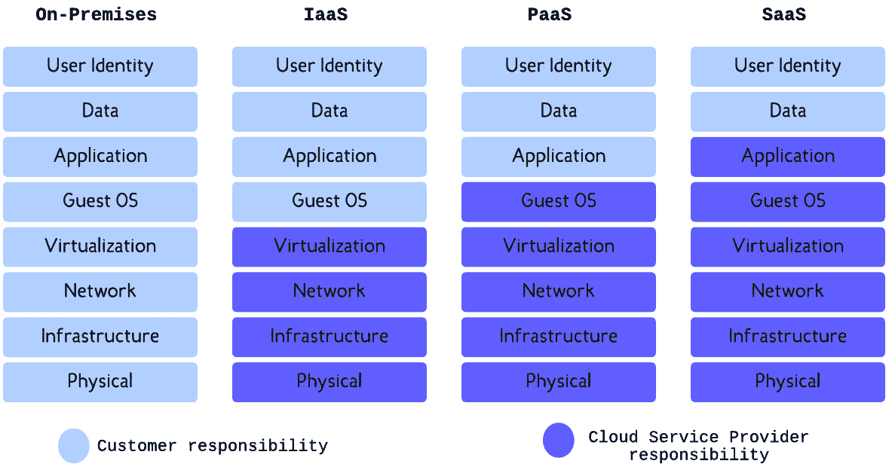
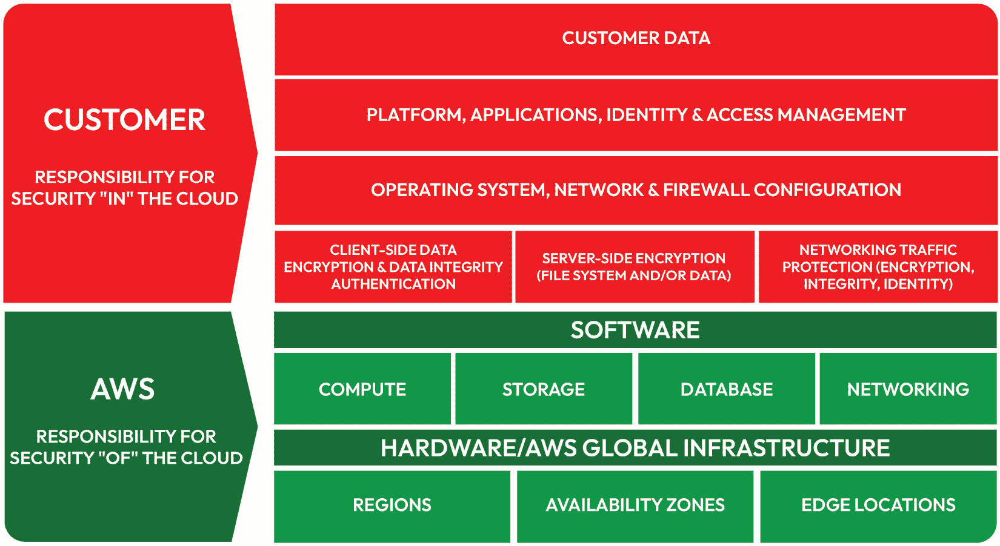
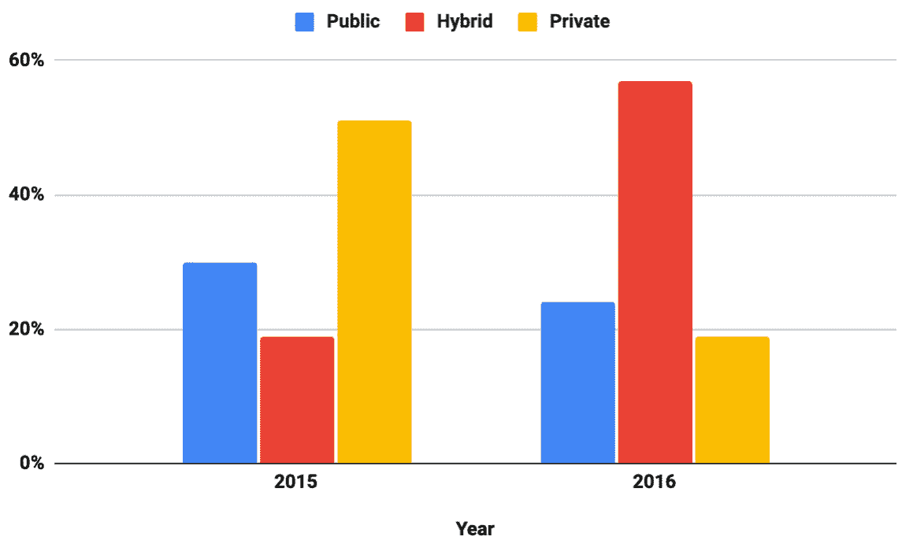
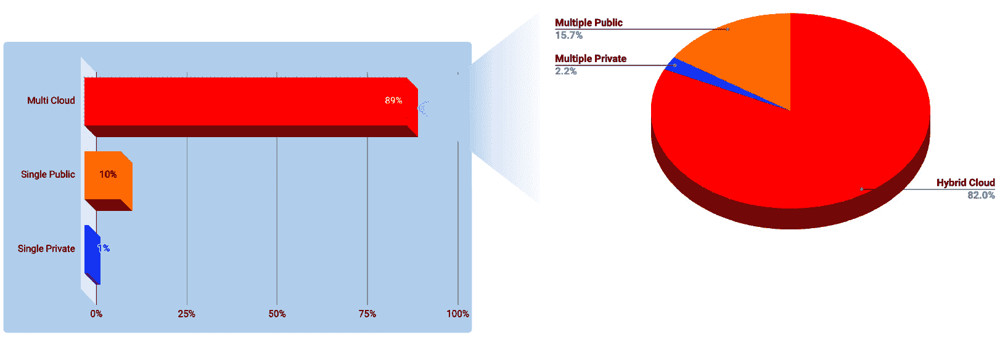
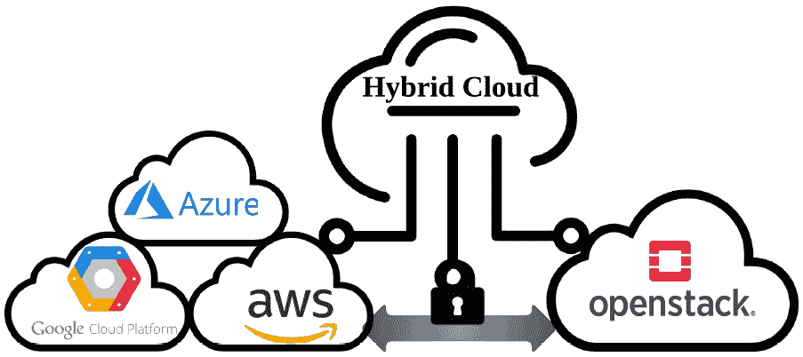
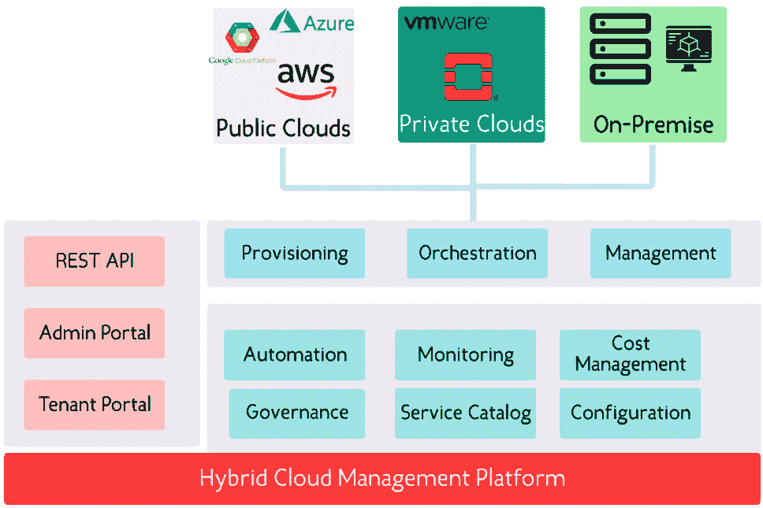
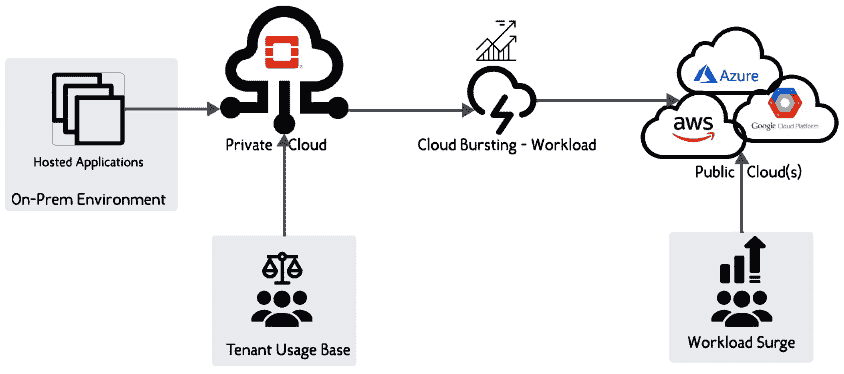

# 第十章：OpenStack 混合云——设计模式

“团结就是力量。”

— 伊索

随着组织不断利用云技术，云服务的消费方式在不同云模型之间发生了显著变化。最近的研究和经验表明，采用混合方法同时使用多个供应商的托管服务的需求不断增加。遵循**多云**路线已经成为一种趋势，企业寻求最优选择，以最有效和最优化的方式来处理其工作负载。在本书的前面部分，我们展示了 OpenStack 在云领域中的位置。然而，对于许多组织而言，仅运行一个私有云环境可能不足以满足所有业务需求。同样，公有云提供商提供了更广泛的服务层，包括**基础设施即服务**（**IaaS**）、**平台即服务**（**PaaS**）和**软件即服务**（**SaaS**）。然而，一些公司可能由于特定原因不会完全公开使用所有服务。OpenStack 的私有云可能是开始云旅程的答案，但由于各种原因，它可能不够。多个组织的妥协方案是采用混合方法，同时使用公有云和私有云。由于我们已经有一个基于 OpenStack 的私有云，本章将通过以下主题扩展 OpenStack 的边界：

+   探索混合云模型

+   重新审视公有云模型和多云战略

+   使用 OpenStack 构建混合云战略

+   迭代混合云设计模式

# 混合云范围内

云技术已经被广泛采用超过十年。在从本地环境迁移时，组织寻求通过根据 IaaS、PaaS 和 SaaS 模型找到最佳方案来提高敏捷性。除了服务交付模型的多样性，接下来开始出现的术语是私有云和公有云。在寻找最佳云战略时，其他新兴模型也被许多组织采用。在 IT 领域，我们可以看到提到一个组织是多云的，意味着它使用了多个云提供商，或者将公有云和私有云服务相结合，从而形成**混合** **云环境**。

确定正确的云战略取决于每个组织的需求，这些需求因地理位置、安全性和预算要求而有所不同。最终，并不是所有的工作负载都可以迁移到公有云环境中，例如，出于数据合规控制的原因。在其他情况下，组织会选择一个公有云提供商，在多个地理位置提供按需资源，并立即开始为业务服务。在深入了解混合云的背景之前，让我们先看看公有云模型。

## 公有云战略

云计算的使用增长更多地出现在公共云领域。由于*公共*意味着*可以通过互联网访问*，组织只需要访问自服务门户，就可以按需提供基础设施，并享受弹性和无限的可扩展性。主要的云服务提供商如**亚马逊网络服务**（**AWS**）、**微软 Azure**和**谷歌云平台**（**GCP**）不断在定期的周期中扩展管理服务的数量。公共云消费者从每一个新的管理服务中获益，这些服务减少了运营开销，并且以更少的努力，甚至更少的专业知识，来消费这些服务。全球化的覆盖是许多全球活跃的组织的另一个重要因素。大多数大型公共云提供商在全球多个区域建立了数十个数据中心，使得它们成为支持不同位置业务的有吸引力的选择。因此，开发人员可以专注于应用程序的业务逻辑。他们还可以以较低的成本进行实验，而无需提前投入大量预算。公共云还解决了*敏捷性难题*，许多初创公司和中型企业一直难以负担能够提供敏捷性的基础设施。尽管*DevOps*一词早在公共云革命之前就存在，但由于缺乏工具以及无法利用整个敏捷软件生命周期的基础设施，这一直是一个主要障碍。在公共云领域出现之前，**基础设施即代码**（**IaC**）概念仅仅是一个理论。

运营团队将不再花费相同的时间和精力在传统的行政任务上，而是会寻求更好的性能指标，如延迟和响应时间。公共云提供商提供的基础设施资源没有限制。然而，底层资源在某些时刻仍然是有限的。公共云提供商定期评估每个区域、每个可用区甚至每个服务器机架的资源使用情况。由于本地团队会积极监控并根据需求扩展资源池，云消费者无需担心限制，因为他们仍然可以在需要时请求更多资源。

如今，大多数公共云供应商提供不同的服务交付模型，包括 IaaS、PaaS 和 SaaS。如下面的图所示，从左到右，越来越多的层级落在云提供商的责任范围内。大多数云提供商旨在提供可以在主要超大规模公共云提供商（IaaS、PaaS 和 SaaS）中找到的三种服务交付模型，但并非所有的私人提供商都涵盖这三者。如下一图所示，每个服务模型定义了云提供商和云消费者之间共享的责任边界：

图 10.1 – 云服务模型的责任边界

在传统的本地环境中，组织需要全面负责管理其基础设施中运行的所有不同工作负载。通过迁移到云环境，从 IaaS 到 SaaS 模型的过渡，管理和运营的负担得到减轻。

在选择云服务提供商时，我们还应该考虑创新因素。随着每个新兴技术的兴起，公共云供应商纷纷推出托管服务，并使其可供使用。以蓬勃发展的**人工智能**（**AI**）领域为例，在撰写本版时，我们发现大多数大型公共云厂商都已推出显著的 AI 计划。AWS 推出了其**Bedrock**云服务，作为一种专门针对生成性 AI 的 PaaS 平台。微软 Azure 迅速与私营 AI 研究机构 OpenAI 合作，并最终将其纳入 Azure AI 服务套件中。GCP 则构建了自己的 AI PaaS 平台，命名为**Vertex AI**。

公共云中的 AI 托管服务有不同的名称，选择一个云服务提供商可能是一个具有挑战性的决定。答案可能很简单：*这* *真的取决于！*

这不仅回答了给定的 AI 案例，也最终涵盖了每个云服务提供商推出的类似新服务。因此，面临*选择悖论*的组织应该投入时间和预算来了解新的前沿服务，给它设定一个实验性里程碑，并得出是否符合他们需求的结论。

采用公有云方法可以带来无数的优势。另一方面，经过几个月和几年的公有云服务使用后，组织开始注意到一些不足之处。公有云的采用是基于**按需付费**模式；正是这种模式让企业相信它是减少传统基础设施成本的正确选择。然而，如果没有仔细分析，它可能比预期的更昂贵。无论一个企业是迁移到云端，还是天生就是云端企业，如同投资方法所体现的那样，建立商业案例和确定**投资回报率**（**ROI**）是必须在旅程开始时就进行的实践。一个简单的商业案例应该考虑到利用公有云资源时每个工作负载的资本支出和成本。例如，一个应用可以运行在一个或多个虚拟机之上。假设一台虚拟机 100% 的时间都在运行，那么它的成本曲线将保持线性。如果从成本角度没有仔细标记和跟踪，这样操作团队很容易失去对预算花费的控制。**超级云服务提供商**提供透明的计费选项和更细粒度的成本拆解视图，帮助客户理解他们的使用情况。然而，在大多数情况下，优化工作负载支出需要对其架构和基础设施组件进行一些更改。担心这些更改可能会导致生产环境出现问题，可能会使操作人员不敢采取实验性的成本优化措施。在公有云中，如果事先没有估算好，成本可能成为一个主要的劣势。因此，**财务运维**（**FinOps**）学科应运而生，旨在让云端的财务责任成为 IT、财务和业务团队之间的集体事务。欲了解更多有关 FinOps 的信息，您可以访问官方的 FinOps 基金会网站，网址是[`www.finops.org/`](https://www.finops.org/) 。

公有云使用中的另一个问题是安全性和合规性问题。当公有云提供商开始提供托管服务时，安全团队提出了关于数据传输和存储的地点和方式的问题。尽管公有云提供商已经澄清了其合规性认证，证明其底层基础设施的安全性，但许多组织仍不愿将数据分散存储在自己数据中心以外的地方。我们知道，一些合规控制，如**萨班斯-奥克斯利法案**（**SOX**）、**国际标准化组织**（**ISO**）等，得到了公有云提供商的良好支持。然而，全球范围内运营的组织应该拥有符合其经营所在地区的托管基础设施。以**欧洲联盟**（**EU**）内的**通用数据保护条例**（**GDPR**）合规标准为例，像 AWS 这样的云提供商必须采取严格的措施，保护数据从欧盟传输到非欧盟国家和地区。因此，欧盟以外的任何地区也必须遵守此规定。

从安全角度来看，云服务提供商将安全责任定义为提供商与消费者之间的共享模型。正如下图所示，AWS 在其**共享** **责任模型**中定义了云的安全责任边界：

图 10.2 – AWS 共享责任模型

橙色层表示提供商定义其责任，确保底层基础设施的安全，并确保其符合区域法规。这不仅涵盖了安全，还包括弹性和服务可用性，这在不同服务之间有所不同。如需了解更多关于*AWS 风险与合规*的白皮书，请参考 AWS 合规网页：[`aws.amazon.com/compliance/`](https://aws.amazon.com/compliance/)。

列表中的下一个关注点是缺乏对云基础设施的完全控制。从表面上看，前面的图表可能显得不太直观。组织选择公有云服务的主要原因是可以更快地将产品推向市场，无需深入了解硬件细节或底层网络设备。这是采用公有云的一个合理原因，但当我们需要定制底层硬件时怎么办？由于这仅由供应商管理，消费者将无法控制它。从第一反应来看，这可能显得有些奇怪，但与传统的本地部署模式相比，有时应用团队会要求某些硬件组合和细化的规格，而这些在公有云中无法找到。在某些边缘情况下，网络团队可能会被要求构建在公有云环境下不方便实现的网络拓扑图。来自本地部署环境的云消费者可能对底层基础设施有一定的控制期望，而这在初期是不可行的。这可能变成接受这些限制，代价是构建一个复杂的网络设置。另一方面，一些云服务商已经回应了许多客户的需求，提供了控制硬件配置的方式，以便运行特定工作负载。例如，AWS 提供了 **专用实例** 功能，允许在专门为单一 AWS 环境提供的硬件上运行一批 EC2 实例，并将这些实例与其他 AWS 环境中的实例隔离，避免它们共享底层物理机器。虽然云服务提供商已经意识到这些限制，这也是 **托管服务模式** 的目的，但企业仍在不断寻找更多方式来控制云环境，以达到最佳效果。

公共云的最后一个缺点是供应商锁定困境。防止被锁定的情况是大多数企业在追求*基础设施无关*之前需要*云无关*的主要要求。能够在不同环境和平台之间自由切换，是许多企业为了保持资源使用经济性并在需要时响应开发需求的奢侈驱动因素。锁定有不同的表现形式。例如，假设一个组织希望在不同的云提供商或本地环境之间迁移其运行在虚拟机上的工作负载。为了进行这种迁移，在执行之前需要更多的计划和测试，例如在云源和目标环境之间建立专用连接，构建应用程序工件，将其部署到目标环境并进行测试。好消息是，得益于一些了不起的开源倡议，容器化技术成为了推动标准化应用部署的明星，使得在环境之间的迁移变得更为简单。现在，环境之间的迁移只需要通过共享的容器注册表进行连接。另一种供应商锁定的形式是基础设施管理的方式。我们之前已经强调过，只有当公共云投入使用时，IaC（基础设施即代码）概念才开始崭露头角。随着更多的服务和资源变得难以管理，公共云提供商构建了适当的托管服务来编写基础设施代码。例如，我们可以在 AWS 中找到**CloudFormation**，在 Azure 中找到**Azure Deployment Manager**，在 GCP 中找到**Cloud Deployment Manager**。如果你进入 AWS 并开始为你的 AWS 资源编写代码模板，那么如果你以后计划在 GCP 或 Azure 中使用相同的代码抽象，这将不可行。对于许多企业而言，IaC 的云无关性几乎是一个宗教问题。在很多情况下，这些企业跳过了学习任何这些资源管理工具，而坚持使用像**Terraform**和**Pulumi**这样的云无关工具。

本节总结了为什么公共云如此重要，以及采纳公共云可能带来的担忧，接下来的部分将以相同的方式展示为什么混合云模型应该被考虑。

## 混合云战略

根据几份*云计算状态*报告，数据显示公共云服务的采用持续增长。*Flexera*的*RightScale 云计算状态报告*（最近更名为*Flexera 云计算状态报告*）一直在跟踪云计算采用的最新动态。超过 12 年来，Flexera 一直在对从小型到大型企业的企业云用户进行调查。根据 2019 年调查报告（[`resources.flexera.com/web/media/documents/rightscale-2019-state-of-the-cloud-report-from-flexera.pdf`](https://resources.flexera.com/web/media/documents/rightscale-2019-state-of-the-cloud-report-from-flexera.pdf)），一些有趣的数字被突出显示，报告显示组织在公共云上运行了超过 38%的工作负载。同时，更多的 PaaS 服务被采用，并且相比去年增长了 50%。同一份报告还显示，38%的公司将公共云视为其 IT 基础设施的首要任务，而去年为 29%。这些数字似乎在整体上推动了公共云的采用。然而，我们可能会被同一份云计算状态报告中的一些发现所惊讶，其中企业表示希望将公共云和私有云结合用于其 IT 使用。根据 2018 年的报告，51%的公司正在寻找混合云策略，而这一比例在次年增长至 58%。这一趋势可能与《福布斯 2017 年云计算采用状况报告》（[`www.forbes.com/sites/louiscolumbus/2017/04/23/2017-state-of-cloud-adoption-and-security/?sh=69d3eacd1848`](https://www.forbes.com/sites/louiscolumbus/2017/04/23/2017-state-of-cloud-adoption-and-security/?sh=69d3eacd1848)）中的另一个*云计算采用状态报告*相吻合，报告显示混合云的采用增长了大约三倍（从 19%增长到 57%）。下图展示了 2015 年至 2016 年期间混合云模型采用的增长情况，数据摘自福布斯 2017 年报告。我们可以清楚地看到，公共云和私有云的采用都有所下降，而混合云模型的采用则有所上升：

图 10.3 – 根据福布斯 2017 年云计算采用报告使用的云模型类型

尽管这些统计数据来自七年前，但 2024 年*Flexera 云计算状态报告*（ [`www.flexera.com/about-us/press-center/flexera-2024-state-of-the-cloud-managing-spending-top-challenge`](https://www.flexera.com/about-us/press-center/flexera-2024-state-of-the-cloud-managing-spending-top-challenge) ）表明，混合云的采用仍然是许多组织首选的方案。通过积累更多的云计算经验和教训，组织已经决定转向多云模式（无论是不同的公共或私有提供商，还是将两者结合）。随着每一次公共云的转移，公司将公共云与私有云相结合。如最新报告所示，约 73%的受访云决策者和云爱好者考虑将混合云战略应用于他们的 IT 基础设施：

图 10.4 – 基于 Flexera 2024 年云计算状态报告的多云采纳调查结果

有多种原因解释了混合云模型使用的扩展。最好的入门定义是 Gartner 对混合云环境的定义：*“混合云计算是指基于政策并协调的服务提供、使用和管理，涉及内部和外部云服务的混合”*（ [`www.gartner.com/en/information-technology/glossary/hybrid-cloud-computing`](https://www.gartner.com/en/information-technology/glossary/hybrid-cloud-computing) ）。简而言之，结合多个公共云和私有云解决了仅使用公共云或私有云的不足之处。我们可以看到，混合模型能够满足组织在公共云或私有云模型中无法找到的需求。接下来我们将逐步讨论采用混合云模型所带来的几个优势：

+   **成本效益**：通过稳定利用私有云资源，偶尔的高峰可以外包给公共云，从而将成本保持在最低水平。如果没有进行适当监控，概念验证和测试环境在公共云中可能会变得更昂贵。在某些情况下，开发人员可能会启动大型 EC2 实例，如果在测试后忘记终止它们，可能会非常昂贵。如果没有正确设置成本控制政策，这种情况是非常常见的。在这种情况下，运行在私有云中可能更便宜，而且由于资源不像公共云中的资源池那样无限，容易检测到。对于需要定期授权续期和维护的工作负载，公共云可能是托管这些工作负载的合适地方，并能节省与私有云相比的维护成本和管理开销。

+   **治理和合规性**：数据驻留可以更加灵活地满足每个工作负载的监管要求。并非所有数据都可以托管在公有云中，因此，私有基础设施环境可以满足这些限制，而不会影响应用的业务连续性。

+   **可定制性和控制**：在基础设施的底层没有控制权可能会成为某些工作负载的障碍。公有云无法提供直接的方法来指定低级配置，包括计算硬件和网络设备。通过在公有环境中使用私有资源，可以调整这种定制化。

+   **无锁定**：多云策略正在成为一些组织保持灵活性的一个重要方面，特别是在部署工作负载时。在混合模型中，无供应商锁定意味着可以在私有和公有基础设施之间移动工作负载，而无需完全依赖某一特定供应商。由于容器化的存在，混合云的采用得到了推动，容器化使得应用可以在多个云提供商之间运行，并在环境间迁移时，所需时间和精力最小化。

+   **增强的弹性**：跨分布式基础设施运行工作负载增加了冗余级别。一些关键应用可以同时在私有和公有环境中运行。如果私有云可用性区域出现故障，这将包含更强的灾难恢复策略；公有环境可以通过快速指向其端点来提供救援。工作负载组件可以在公有和私有环境中以*分散*模式运行。这种情况要求工作负载组件例如在私有环境中运行，并通过公有云中的安全连接与其他组件互操作，以利用托管服务。

+   **增加的可扩展性**：**云爆发**是混合架构模型的关键要素。通过结合私有和公有云世界，拥有更多的工作负载部署选项能够提高灵活性。当需求超过私有云容量时，组织可以利用云爆发来加速扩展并应对负载高峰。本章后续将更详细探讨云爆发的使用案例。

最近，超大规模云服务提供商正在跟随混合云采用趋势，并将混合云平台作为其托管云服务的一部分。例如，AWS 推出了**AWS Outposts**服务，允许云用户在组织的边界内本地运行 AWS 服务。欲了解更多关于 AWS Outposts 的案例，请参考 AWS 官方文档：[`docs.aws.amazon.com/outposts/latest/userguide/what-is-outposts.html`](https://docs.aws.amazon.com/outposts/latest/userguide/what-is-outposts.html)。

同样，我们可以在 Azure 中找到**Azure Stack**服务，在 GCP 中找到**Google Anthos**服务。

企业通过他们在公有云中的经验已经意识到，公有云并不总是最合适的选择。私有云能力的崛起，如 OpenStack，使得同时在公有云和私有云中存在成为可能。采用 OpenStack 作为私有云解决方案的组织，发现自己处于一个非常有利的位置，能够最大化利用这两种环境的优势。OpenStack 的模块化架构及其丰富的 API 使其与公有云环境协同工作成为一种理想选择，接下来我们将探讨这一点。

# OpenStack 与公有云的对接

为混合云模型进行架构设计对许多寻求上述混合云优势的组织来说可能是一个很好的选择。如果你正在基于 OpenStack 构建一个私有云，无论是为了内部使用还是为潜在客户使用，云运营商可以扩展基础设施边界，与公有云服务结合，创造有价值的成果。在混合模型中，创建一个集中的平台来管理私有云和公有云，使其像一个统一的界面一样工作是一个好的方法。该平台无需增加复杂性来与不同云提供商的 API 进行交互，而只需要一个具有代理能力的管理仪表板，用于路由跨不同环境的请求。借助现有的 OpenStack 环境，云运营商可以在 OpenStack 私有云和每个公有云端点之间建立安全的高带宽连接，正如下图所示：

图 10.5 – 通用混合云架构

将 OpenStack 私有云与公有云服务结合需要满足一定条件，才能形成一个完整的混合云图景。在这种情况下，业务工作负载应设计为在 OpenStack 环境、公有云或两者中运行。另一个重要条件是私有云与公有云之间的数据迁移准备。这需要对何时可以将数据存储在公有云或私有云基础设施中有充分的了解。例如，有些情况可能要求在公有云中存储短期数据，而将长期数据保存在私有云中。

在混合云环境中运行工作负载时，另一个需要考虑的重要方面是不同类型云之间的兼容性和差异。你可能在两个或更多不同的云之间运行工作负载，支持相同类型的多个 API，并且使用相同的技术栈。这种情况下，运行起来可能更简单，实施起来也更容易。另一个差异是不同云不支持相同类型的 API，具有不同类型的组件，例如数据库引擎或虚拟化管理程序的类型。在这种情况下，需要更多的调整来提高复杂度。好消息是，OpenStack 已经被设计为利用一些公有云的能力。它的秘密武器是其丰富的 API 曝露。作为一款私有云软件，OpenStack 被认为是一个不错的选择，能够驱动私有云和公有云的网络。OpenStack 被用于管理其他公有云提供商（如 AWS）的资源。例如，OpenStack 支持 AWS 的一些驱动程序，如 Nova 用于 EC2，Neutron 用于 VPC，以及 Cinder 驱动程序用于 AWS 的 EBS。这些驱动程序属于**OpenStack-Omni**项目，可以在 [`opendev.org/x/omni`](https://opendev.org/x/omni) 中找到。尽管这个项目的进展较慢，OpenStack 社区正在考虑将更多的能力集成到 OpenStack API 中，以管理混合云和多云环境，如 GCP 和 Azure。

理想的云混合实现方式利用统一的**云管理平台**（**CMP**）集中控制公有云、私有云和本地资源。正如下图所示，为混合云管理提供额外的层或工具有助于集中管理任何基础设施中的工作负载和数据：

图 10.6 – CMP 的能力

如今，越来越多的组织正在学习根据自己的业务需求或公共需求开发自己的 CMP。在市场中，Flexera、CloudBolt、OVHcloud 和 Nutanix（仅举几个例子）提供统一的平台，用于管理公有云和私有云中的资源。混合架构的 CMP 由编排工具提供支持，能够跨云环境运行。服务目录和可重用蓝图可以提供混合管理层，以在所有连接的云端点之间部署基础设施，并实现最大程度的自动化。

云服务提供商意识到云客户的不同需求，设计更多的服务以促进混合云部署。这些服务可以是 CMP 的一部分，也可以单独运行，跨私有云和公有云操作工作负载，正如我们在下一节中将要探讨的那样。

## 启用混合云

今天，我们可以找到由大型公共提供商提供的一系列托管服务，方便构建混合架构。AWS 一直走在前面，通过提供多种云服务来满足客户对混合模型的需求。例如，AWS Outposts 通过使用相同的 AWS API 和工具来利用 AWS 资源，但这些资源是在组织的本地部署的。在 Outposts 之上，云用户可以运行**Relational Database Service**（**RDS**）托管数据库，享受 MySQL、Microsoft SQL Server 和 PostgreSQL 的完全托管数据库服务。要了解更多关于 RDS Outposts 的内容，请访问以下链接：[`aws.amazon.com/rds/outposts/`](https://aws.amazon.com/rds/outposts/)

一些令人惊叹的混合服务已经为容器推出，包括**Elastic Container Services Anywhere**（**ECS Anywhere**），你可以在[`aws.amazon.com/blogs/containers/introducing-amazon-ecs-anywhere/`](https://aws.amazon.com/blogs/containers/introducing-amazon-ecs-anywhere/)了解更多内容，以及**Elastic Kubernetes Service Anywhere**（**EKS Anywhere**），你可以在[`aws.amazon.com/eks/eks-anywhere/`](https://aws.amazon.com/eks/eks-anywhere/)阅读更多信息。 这两项混合容器服务使云用户能够在本地运行容器化工作负载，同时保留可扩展性和编排工具集的优势。混合存储解决方案已成为许多组织在本地环境和公共环境之间执行备份、恢复和灾难恢复所必需的。AWS 提供了**AWS Storage Gateway**服务，用于混合云存储解决方案。有关 AWS Storage Gateway 服务的更多信息，请访问[`aws.amazon.com/hybrid/services/`](https://aws.amazon.com/hybrid/services/)。其他使用案例可能需要加速在私有云和公共云之间传输数据的方式。AWS 推出了**AWS Datasync**服务（[`aws.amazon.com/datasync/`](https://aws.amazon.com/datasync/)），作为一种混合存储解决方案。

## 云爆发

选择运行工作负载的位置主要取决于客户的业务和治理需求。一些组织可能会指定希望在哪个区域和云中托管其应用程序。其他组织可能更倾向于在一个云上部署其服务，但数据（包括数据库或大数据）必须存储在私有云环境中，甚至是本地裸金属环境中。任何不涉及数据的内容可以运行在公有云中。面对这些不同的需求，云运营商应当找到一个可以满足每个工作负载需求的混合模型。借助 OpenStack 提供的丰富 API 集合，与其他厂商的自动化工具和外部 API 的集成使得实现混合云变得更加简单，并且风险最小化，避免被单一厂商锁定。通过获得这种灵活性，企业应用的增长将不再担心是否能够在任何公有或私有云环境中运行。例如，假设一个组织开发了一个打包成容器镜像的服务。该镜像被部署在私有 OpenStack 云环境中，很快，应用程序的全球覆盖成为了一个业务需求，目标用户群体扩大。这时，云爆发就起到了作用。工作负载将利用公有云在最近请求区域的资源进行扩展。通过正确的设计，云架构师应能够让任何应用程序同时在两个环境中运行，并且利用混合云模型的能力，而不被某一模型锁定。云爆发是混合云中非常常见的使用案例，甚至在其他文献中被视为混合云特性。正如下图所示，云爆发利用混合云基础设施的使用率来更快速地处理应用程序的突发请求和流量高峰：

图 10.7 – 混合云使用案例中的云爆发

最终，一家公司预测其私有云基础设施的使用情况，并通过将负载分配到公有云资源来应对额外的负载。云爆发本质上是一种动态部署工作负载的方式，它能够在私有云资源需求过载时，通过弹性和可扩展性来应对高峰期的需求。云爆发的常见模式是，企业主要依赖其私有云资源，并仅在流量激增时启用云爆发以应对额外负载。一旦突发的工作负载激增结束，公有云资源将被终止，应用程序将继续在私有云环境中运行。

# 混合云中的安全性

云中的安全*和*云的安全是私有云和公有云之间没有差异的两个方面。在混合模型中，云运营商会从安全角度审查所提供的内容。在一定程度上，混合模型中的安全性可以在利用私有部分时得到更多的执行，但也可能会遇到由于不安全的 API 端点、数据泄露或缺少静态和传输加密等原因带来的额外威胁。在 OpenStack 世界中，云运营商应该考虑私有云的安全*性*，而云中的安全*性*则是用户的责任。遵循安全纪律在处理混合云环境时与纯私有云或公有云并无不同。从**零信任**原则开始，云架构师应该在设计混合环境的最早阶段就将安全性作为核心原则，这与构建私有云时的做法相同。在混合配置中，更多的组件参与到安全配置中。基于零信任方法，架构中的任何实体默认都被视为威胁，包括用户访问、工作负载、数据、网络设备和流量。如果你已经确保基于 OpenStack 的私有云遵循相同的方法，你只需结合云服务提供商的安全边界和共享责任模型即可。好消息是，大多数超大规模提供商已经定义了共享责任模型。在混合云之旅开始时，应明确责任边界。例如，如果用户正在查看一个不受私有 OpenStack 云支持的 SaaS 解决方案，那么安全责任将转移到目标公有云提供商。定义基于混合云设置的共享责任时，会涉及多个实体，包括硬件、存储、加密、物理网络、客户操作系统、网络和平台安全、数据位置、用户认证和授权等。

在接下来的章节中，我们将采用迭代的方法，展示在混合云环境中运行的工作负载周围建立安全模式时涉及的不同实体。这包括在 OpenStack 环境和公有云之间扩展在 Kubernetes 上运行的应用程序的用例。

## 治理优先

数据保护是鼓励组织采用混合环境设置的主要动因之一。企业和决策者定义数据隐私要求的规则，而云用户则负责遵守这些规则。云服务提供商应遵守定义好的数据保护规则，这些规则会因地区不同而有所差异。以 GDPR 规则为例，混合云应在欧盟范围内提供数据保护的保障，包括数据隐私、存储地和保留期。在混合云环境中，基于 OpenStack 的私有云与公共云的结合应该符合以下简化的要求列表：

+   透明地定义共享责任模型的扩展版本。

+   记录混合环境中安全配置的不同方面。这包括如何连接私有云和公共云，以及数据如何传输和存储。

+   提供用户访问和利用最佳实践的方法，使用访问策略、最小权限原则和加密。

+   定义数据生命周期标准和数据分类的衡量标准。

最终，托管在混合云中的工作负载不应仅符合单一的合规性要求，而应符合多个要求，因为这种公私结合的特性。若在接收工作负载之前未能检查所有治理措施，这样的过程可能容易出错。为此，在私有云与公共云之间建立一个安全的平台至关重要，必须花时间确保两者之间的安全。容器化应用程序在私有云和公共云之间的部署会更容易。我们在前几章已经讨论了 OpenStack 生态系统在处理容器时的成熟度。例如，在 OpenStack 私有云和公共云环境中分布一个容器化应用程序时，应考虑以下治理和合规性问题：

+   我的 Kubernetes 集群将如何以及在哪里运行，短期和长期的安排是什么？

+   是否会有数据存储在私有云和公共云中？

+   混合云如何控制对我的 Kubernetes 集群的访问，从而控制在其上运行的应用程序？

+   混合云是否提供一个统一的界面来监控和记录我的应用程序？

+   是否有标准的事件管理流程，用于在发生数据泄露或未经授权访问时报告安全问题？

混合云中的合规性和治理可能更复杂，因为每个工作负载都会有不同的合规性要求。标准化云基础设施的规则可以减少这种复杂性，但需要深入理解每个公共云提供商的责任边界。从私有云的角度来看，运行 OpenStack 时，你应该已经对安全拼图的各个部分有了更全面的了解，尤其是在设计私有云时。

## 网络安全

网络通常是云消费者部署工作负载时讨论的下一个要点。公共云提供了无数种方式来为工作负载设计网络，而最终由云用户定义网络边界。如果应用程序是公开可访问的，云用户将利用互联网网关或设备将应用程序暴露在其虚拟网络中。混合环境将被要求提供最大的灵活性以支持网络选项。正如我们在 OpenStack 世界中所看到的，基础设施不仅包括物理路由器和交换机，还有在物理网络基础设施上方的覆盖网络层（软件定义网络）。由于两个网络层（物理和覆盖层）都是虚拟的，私有云运营商应考虑在保持完全控制的情况下对网络进行分段。在托管任何工作负载之前，必须存在一个云用户无法看到的基础网络安全层。可以通过利用防火墙或部署 Web 应用防火墙来防御 DDoS 威胁来实现这一目标。同样，公共云提供商根据共享责任模型确保一定程度的网络安全，包括硬件和流量管理。公共提供商骨干网络中的流量被视为可信的，但如何隔离应用程序或将其公开，仍然由云用户定义。无论哪种方式，都会提供网络服务以控制其网络边界内或更广泛暴露范围内的流量类型。如果您在私有云和公共云之间扩展应用程序，必须存在多种网络安全机制，可以总结如下：

+   确保到达任何支持**传输层安全性**（**TLS**）协议（v2 和 v3）云端点的流量是安全的。

+   确保应用程序容器已部署并加密静态数据。

+   提供安全机制，保护通过负载均衡器公开访问的应用程序。

+   通过利用**Web 应用防火墙**（**WAF**）解决方案，强制执行应用程序安全，保护多个云环境中的应用程序。

+   通过将应用程序网络划分为不同子网以运行在每个层级上，实现分层网络架构。分散环境（公共和私有）可以配置为使用私有地址空间（RFC 1918）。这样，不同部分的应用程序仍然可以相互访问，同时被隔离在独立的网络中，从而降低公共暴露的风险。

+   在不同的云环境之间建立私有连接。这是前一个要点的延伸，其中应用程序可以通过私有连接而非互联网访问混合环境中的任何云。例如，在 Kubernetes 集群中，OpenStack 环境中的 Pod 可以通过如**DirectConnect**或**VPN**等私有连接访问 AWS 中同一集群上下文的其他 Pod。云运营商需要定义不同的路由，以便即使在不同的云环境之间，应用组件的互联互通仍然保持私密。

混合云可以设计为使用不同类型的连接和网络实现。考虑到网络安全方面，需要为私有云和公有云的端点安全做好充分准备。私有部分需要更多的加固，因为云运营商对网络基础设施有完全的控制权。在我们的案例中，必须确保 OpenStack 私有云中每个服务的 API 端点安全。OpenStack 社区会在每次新版本发布时提供更新的安全指南，值得参考。API 端点安全指南可以在[`docs.openstack.org/security-guide/api-endpoints/api-endpoint-configuration-recommendations.html`](https://docs.openstack.org/security-guide/api-endpoints/api-endpoint-configuration-recommendations.html)找到。

## 加固操作安全。

应用跨不同云基础设施的分布式架构的特点，可能会在操作时带来挑战。在混合架构中利用云溢出技术，虽然能提高灵活性，但也需要明确操作安全责任的定义。通过继承**DevSecOps**的实践，混合环境中的操作复杂性可以大大简化。我们在本章中专门介绍了 DevSecOps 如何成为自动化 OpenStack 基础设施操作安全的关键风格。当处理跨多个基础设施分布的工作负载时，我们只需应用相同的方法。一个在混合云环境中运行的 Kubernetes 集群中的应用案例，要求进行以下额外检查，以确保以最安全的方式运行：

+   使用 CI/CD 管道自动扫描镜像中的漏洞。

+   干运行测试，以检测并警告任何潜在的安全漏洞。

+   使用仅限私有访问的容器镜像注册表。

+   使镜像注册表仅通过私有连接对公有云或私有云端点可用。

+   加固并自动化容器镜像的创建，定期发布并仅分享稳定且经过充分测试的版本给其他云端点。

+   从单一的 CI/CD 管道部署应用容器镜像。

+   设置日志管道以收集不同基础设施中的日志。这可以通过集中式方式实现，拉取网络流量、应用日志和防火墙日志来分析潜在问题。

+   配置监控和指标，集中报告每个云基础设施端点的安全问题。

混合模型中的安全性可能会更加复杂，因为数据流动在不同的基础设施中，需要额外的控制措施。数据处理应谨慎执行，因为不当的数据流动可能会引发重大数据泄露，而这些问题难以恢复。混合实施的另一个挑战是访问管理的复杂性。用户需要以灵活的方式进行身份验证和授权，以便在多个基础设施中授予访问权限。使用**身份与访问管理**（**IAM**）并结合单点登录工具，可以帮助解决访问复杂性问题。

# 总结

本章揭示了混合云的新颖性。除了 OpenStack 私有云的功能外，总有机会接入公共云环境并构建混合环境，正如我们在本章中所学到的那样。后者作为一种新的云模式持续扩展，因为企业已经意识到，结合不同云模式以享受各自的云优势是非常必要的。我们了解到，最近的云体验表明，单一的多云战略仍然不足以填补成本差距，还需要解决合规性问题。混合模型的主导地位日益增加，并伴随着更多的 OpenStack 私有云实现。掌握构建和管理 OpenStack 私有云的技能是过渡到混合模型的基石之一，这也是我们在本章中重点讨论的内容。此外，我们还学到，OpenStack 提供了多种云能力，凭借其丰富的 API，我们的私有云能够很好地融入混合云模型。

在下一章中，我们将展示如何基于 OpenStack 构建私有云环境，以确保成功的混合云体验，其中 OpenStack 将继续发挥重要作用。
