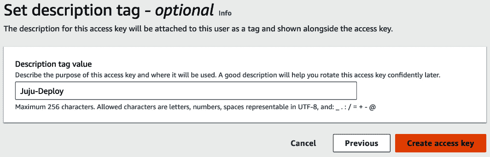

# 第十一章：混合云超大规模用例——扩展 Kubernetes 工作负载

“虽然味觉的基本味道不超过五种，但它们的组合产生的风味远超过能尝试的种类。”

– 孙子，《孙子兵法》

在上一章中，我们简要探讨了混合云设计模式，以及混合部署如何成为许多组织的云趋势。混合云模型反映了服务的复杂混合，这些服务协同工作以满足不同的工作负载需求。当你加入 OpenStack 私有环境时，由于私有云和公有云中分布的资源的动态混合，混合模型的搭建可能更具挑战性。构建混合云网络是组织面临的第一个挑战，这需要公有云和私有云之间稳定、专用和一致的连接。此外，能够在裸金属、虚拟机或容器上运行的应用程序需要一种方法来确保不同云环境之间的配置一致性。在上一章中提到的若干实施挑战仍然是许多组织享受混合云优势的障碍。好消息是，随着**应用架构模式**的演进，**容器化**技术已经改变了应用程序的部署方式和位置。如果我们寻求应用迁移、云爆发或备份与灾难恢复策略，采用容器化技术是最佳选择。在本章中，我们将实践上一章所涉及的内容，并通过以下主题揭示容器化在混合云设置中的强大力量：

+   设计 OpenStack 私有云与公有云环境（如 AWS）之间的混合云网络

+   简要回顾 Kubernetes（也称为 K8s）的主要概念，为 OpenStack 和 AWS 云之间的云无关工作负载模型做准备

+   探索实现混合云设置的不同方法

+   在 OpenStack 私有云和 AWS 公有云之间部署 Kubernetes

+   学习使用 Juju 进行混合云部署的编排工具

+   通过联邦控制平面连接私有和公有云中的 Kubernetes 集群，并运行混合部署

# 资格验证混合架构

本节将探讨采用混合云实施的主要动机。我们将简要说明容器化如何帮助实现混合模型的大部分优势，并使企业能够在云环境之间高效地迁移。连接的云环境的网络和安全性是采用混合方法时必须仔细考虑的另一个重要支柱。

## 采用云无关堆栈

云中立性是许多组织在进入云计算旅程时，寻求最佳云体验的关键动因。得益于**按需付费**模式，组织可以使用云资源，并仅为实际使用的部分付费。然而，一些业务负载可能需要进行调整，切换或扩展到另一个云服务提供商可能变得必要。云服务提供商之间的自由迁移一开始可能并不简单。这是由于每个云服务提供商所提供的技术，业务负载自然会被绑定到某个特定云服务提供商的更多依赖上。迁移或扩展到另一个云服务提供商可能是一个昂贵、复杂且容易出错的过程。因此，云中立性应提前考虑，从负载架构本身开始着手。一个很好的例子就是新兴的**微服务架构**。选择微服务设计的主要好处之一是它将应用程序拆分为更小且独立的模块，使得它们可以单独进行测试和部署，而无需依赖特定的技术栈。微服务设计的另一个好处是其运行的基础设施。这就是容器化的作用所在。与虚拟机相比，容器具有更高效的计算资源利用和时间优化。这使得微服务与容器化概念成为实现云中立性的理想组合。因此，混合云模型在加入一些附加功能后，更容易实现。如以下图所示，这些附加功能包括容器编排层和自动化部署，使得云中立模型几乎完整：  


图 11.1 – 混合模型的云中立架构

容器编排引擎几乎不需要管理即可管理工作负载的生命周期。大多数著名的容器编排引擎，如 Docker 和 Kubernetes，都被视为云无关的容器编排平台的一部分。虽然容器编排本身带来了更多的容器管理自动化，但没有**基础设施即代码**（**IaC**）概念，它的价值将大大降低。每个云服务商都提供自己的基础设施模板机制（AWS 的**CloudFormation**，Google 的**Cloud Deployment Manager**，Azure 的**Deployment Manager**，以及 OpenStack 的**Heat**）。每个服务的厂商特定语法构成了一个挑战，因为在不同云部署环境之间切换变得更加复杂。显然，解决方案是采用云无关的方法，通过使用第三方工具来实现，这些工具允许我们在多个云环境中部署相同的工作负载基础设施，并使用相同的代码来抽象基础设施层。这些工具只有在 IaC 概念作为 DevOps 原则出现后才得以实现。Hashicorp 的**Terraform**已成为最常用的云无关工具，用于基础设施管理。今天，更多的开源项目受到了 Terraform 的启发，最近，**Pulumi**工具已经出现在 DevOps 领域。除了使用代码管理基础设施外，Pulumi 还允许使用 Python、Java、Go、.NET 和 Typescript 等最流行的编程语言来描述基础设施。

重要提示

2023 年 8 月 10 日，Hashicorp 宣布 Terraform 不再受 Mozilla 公共许可证 v2.0 的约束。Pulumi 已成为 Terraform 在开源世界中的继任者，并在过去一年里获得了极大的关注和流行。欲了解更多关于 Pulumi 的信息，请访问其官方网站 [`www.pulumi.com/docs/get-started/`](https://www.pulumi.com/docs/get-started/)。

为了协调整个基础设施管理过程，CI/CD 工具定义了在不同云环境中自动化一切的引擎。

现在我们已经涵盖了混合云拼图的不同部分，我们将重点讨论如何连接两个云环境——在我们的案例中是 OpenStack 和 AWS 之间的连接。

## 准备混合模型

建立混合云架构首先需要私有云和公有云之间的适当网络连接。这种网络连接对于保持业务连续性至关重要。因此，必须对连接进行持续评估，评估内容包括延迟、正常运行时间和带宽。安全性是混合连接的另一个关键方面。根据用于此类连接的硬件和网络服务，操作员应确保启用传输加密并考虑冗余。当使用云网络托管服务时，实现云混合连接可以大大简化。如下一张简化的网络图所示，OpenStack 私有云终端通过两种不同的连接与 AWS **虚拟私有云**（**VPC**）相连：


图 11.2 – OpenStack 与 AWS 云之间的混合连接

图上方的连接类型展示了通过互联网使用 IPSec 隧道的站点到站点 VPN 连接。在两个云环境（OpenStack 私有网络范围和 AWS VPC）中没有暴露任何资源的情况下，通信发生在通过互联网传输的加密隧道中。OpenStack 租户环境和 AWS VPC 之间的 VPN 连接实现比经典数据中心更加自动化。正如我们在 *第六章* 中提到的，*OpenStack 网络 – 连接性和托管服务选项*，Neutron 提供了一种托管网络服务 VPNaaS，可以在几分钟内部署为站点到站点 VPN 连接。AWS 提供类似的托管 VPN 功能，作为其 VPC 服务的一部分，只需创建 VPN 网关并配置客户网关（即 OpenStack 终端）即可建立 VPN 连接。

重要提示

使用 AWS 中的站点到站点 VPN 连接时，将创建两个隧道以实现冗余。每个隧道终止于不同的可用区。如果一个隧道出现故障，流量会自动切换到第二个活动隧道。

VPN 可以是建立这种混合云连接的最快方式。连接两个不同地区的不同位置的站点到站点 VPN 连接的一个主要陷阱是性能有限。在 AWS 的情况下，每个 VPN 隧道最多可以支持 1.25 Gbps 的带宽。其他公共云提供商可能提供不同的选项。例如，Azure 允许云用户指定所需的 VPN 网关类型，根据其大小，带宽可以在 100 Mbps 到 10 Gbps 之间变化。

在 OpenStack 端，Neutron 会配置一个具有特定带宽限制的虚拟设备。Neutron 提供了 **服务质量**（**QoS**）功能，可用于设置网络流量策略，以更好地控制网络带宽。

在处理需要在不同云环境之间存在并移动的复杂和大规模工作负载时，有限的带宽容量可能会成为瓶颈。此外，使用简单的 VPN 连接来保持两个云环境之间的一致连接并不总是能够得到保障。这是因为数据需要经过共享的互联网设备，路径较长。因此，公共云服务提供商提供了第二种类型的网络连接，以便与私有环境建立连接。在 AWS 世界中，当需要稳定、专用、隔离且高性能的连接时，**DirectConnect** 是一个理想的选择。

实施 DirectConnect 连接需要比 VPN 连接设置更多的部署步骤。云操作员可以通过 AWS 控制台或 CLI 订购 DirectConnect 连接，并决定要使用哪种类型的连接。DirectConnect 提供两种类型的连接：

+   **托管连接**：AWS 合作伙伴将处理物理连接，并将其链接到位于 OpenStack 私有云环境边缘的设备。

+   **专用连接**：这建立了从 OpenStack 端点到 AWS DirectConnect 位置的物理连接。此类型的连接提供多个带宽容量选项。

选择这些连接选项中的哪一种取决于许多因素，如成本、地理位置和带宽吞吐量。要了解有关 AWS DirectConnect 技术细节的更多信息，请查看以下 AWS URL：[`docs.aws.amazon.com/directconnect/latest/UserGuide/Welcome.html`](https://docs.aws.amazon.com/directconnect/latest/UserGuide/Welcome.html)

混合连接需要一定程度的冗余。如果一条链路失败，你仍然可以使用第二条链路来传输流量，即使带宽吞吐量较低。之前的架构图展示了经典的网络设计，利用 DirectConnect 和 VPN 建立了两条连接。操作员可以在 OpenStack 私有云端配置设备，主要通过 DirectConnect 接口接收流量。这将把两条连接终止到同一位置端点的两个不同设备上。如果由于某种原因，DirectConnect 连接失败，流量将切换到通过 VPN 连接传输，作为备份。这种设计模式被认为是一种良好的折衷方案，能够在合理的价格下提供高可用性。如果混合连接需要相同的一致带宽，并且两个链路的配置完全一致，那么将会配置两条 DirectConnect 链路。这样可以最大化关键生产工作负载的弹性。然而，当然这也会带来更高的费用。AWS 建议使用动态路由，以便连接能够自动故障转移，并利用最佳可用路径。此路由功能要求 OpenStack 硬件端点支持动态路由和自动故障转移功能。

现在我们已经介绍了混合云设计中最关键的部分之一——网络，我们将继续讨论设计容器化混合云设置的不同方法。

# 设计容器化混合云

容器技术是开发现代应用程序的最佳选择，具备可移植性、快速部署和更少操作开销等优势。容器化的发展使得组织能够以几乎零接触、可靠和快速的方式运行和扩展其工作负载。随着 Docker 和 LXD 等多种容器引擎的兴起，Kubernetes、Mesos 和 Docker Swarm 等容器编排系统也应运而生，推动了应用开发的方式。如今，组织部署生产工作负载的信心比以往任何时候都要强。容器编排系统通过微服务架构的演变，改变了应用程序开发的方式。公共云服务商抓住了这个机会，提供了运行完全容器化环境的平台。例如，AWS（截至本文写作时）提供了三大主要的与容器相关的服务，概述如下：

+   **弹性容器服务** (**ECS**)：通过完全托管的容器编排服务，部署和管理容器化工作负载。

+   **弹性 Kubernetes 服务** (**EKS**)：运行和管理 Kubernetes 控制平面，负责容器部署、调度和可用性。

+   **Fargate**：充当一种无服务器服务，部署和管理应用程序，而无需管理底层基础设施。

Azure 也提供类似的托管容器服务，例如 **Azure 容器实例** (**ACI**)、**Azure 容器应用** (**ACA**) 和 **Azure Kubernetes 服务** (**AKS**)。Kubernetes 对 GCP 来说至关重要，GCP 开发了 **Google Kubernetes Engine** (**GKE**)，用于可靠且高效地部署和扩展容器化工作负载。Kubernetes 的采用历史足以写成一本书。

在混合云架构中部署容器化应用程序需要对一些设计模式有较好的理解。组织应该选择适合其战略目标的工具，以利用混合模型。在接下来的章节中，我们将探讨几种实现的设计模式，用于使用 Kubernetes 部署混合容器化架构。在处理不同的设计模型之前，我们将选择 Kubernetes 作为容器化平台。选择 Kubernetes 的众多原因之一是它被广泛使用，且其生态系统中有许多功能和工具。采用 Kubernetes 的另一个重要好处是它在设计集群和运行容器方面的灵活性，周围有多个稳定的开源容器管理工具，跨平台使用，并且支持适应混合云架构的联合功能。在深入探讨前面提到的构建混合模型的设计优势之前，让我们简要了解 Kubernetes 的术语。

## Kubernetes 简介

今天，Kubernetes 无处不在。八年前，企业对于使用 Kubernetes 开始生产旅程犹豫不决，因为它刚刚由 Google 公布在市场上，还是个新生事物。容器编排引擎的概念在当时并不新鲜，因为 Docker Swarm 和 Mesos 已经相当成熟并被广泛使用。正如预期的那样，Kubernetes 提供了一种不同的引擎概念。理解其基本概念如何运作是自信地在生产环境中运行 Kubernetes 的重要一步。

对于容器爱好者来说，使用云服务将有助于采用基于 Kubernetes 的容器化模型。如前一节所述，云超大规模厂商提供支持 Kubernetes 的托管服务。Kubernetes PaaS 模型简单地消除了管理和安装容器编排引擎的开销。这还包括额外的网络、存储和可用性方面。

如下图所示，Kubernetes 旨在在集群内运行不同类型的节点：


图 11.3 – Kubernetes 引擎架构（高层次）

节点类别可以总结如下：

+   **主节点** ：它负责运行管理 Kubernetes 集群的大多数关键进程，包括以下内容：

    +   **调度器** ：它运行 **kube-scheduler** 进程，管理容器根据资源可用性和负载在适当的主机上部署。

    +   **控制器管理器** ：它运行 **kube-controller-manager** 进程，负责监控集群活动。

    +   **API 服务器** ：它运行 **kube-apiserver** 进程，允许 Kubernetes 客户端与集群之间进行通信。可以通过 API 服务器访问主节点。

    +   **etcd** ：这是一个键值存储系统，用于处理集群的状态。

+   **工作节点**：这是运行容器中的工作负载的节点，包含两个组件：

    +   **Kubelet 服务**：这是运行**Kubelet**进程的服务，允许集群内部的通信。Kubelet 进程还会从 API 服务器监听，管理工作节点中的容器。

    +   **Kube-proxy 服务**：这是运行**kube-proxy**服务的组件，负责 Kubernetes 集群中服务之间的网络通信。

Kubernetes 术语引入了几个概念，以及与其基于集群架构描述相关的内容，如下图所示：


图 11.4 – Kubernetes 引擎的低级架构

不同的集群组件可以描述如下：

+   **Pod**：这是定义为 Kubernetes 环境中最小且最基本的组件。Pod 将容器结合在一起并运行，按需附加存储，并为网络通信分配唯一的 IP 地址。

+   **控制器**：这是容器编排引擎的主要部分。它管理 Pod 的各个方面，如创建、删除、复制和发布。Kubernetes 控制器跟踪工作负载的位置和分配的资源。控制器有不同的类型，包括**ReplicaSet**、**StatefulSet**、**DaemonSet**、**Deployment**、**Job**和**CronJob**。每种控制器类型有不同的用途，针对特定的 Pod 管理需求。例如，**ReplicaSet**控制器创建一组运行相同应用程序的 Pod。**CronJob**更专注于创建定时任务。要了解更多关于 Kubernetes 控制器类型的信息，请参考 Kubernetes 官方网站的页面：[`kubernetes.io/docs/concepts/workloads/controllers/`](https://kubernetes.io/docs/concepts/workloads/controllers/)。

+   **Service**：这是暴露在一个或多个 Pod 中运行的应用程序，以便接收传入请求。Kubernetes 服务将每个请求路由到相应的 Pod，并提供额外的功能，如 DNS 和负载均衡来访问 Pod。

+   **Namespace**：这是一个作用域逻辑层，用于隔离 Kubernetes 资源名称，从而避免在多个用户在*同一*物理集群中启动多个 Kubernetes 集群时发生名称冲突。

+   **Volume**：当 Pod 中的工作负载需要时，提供持久存储。Kubernetes 的最新版本支持更多存储和卷功能，以及一个详尽的卷类型列表。可以在[`kubernetes.io/docs/concepts/storage/volumes/`](https://kubernetes.io/docs/concepts/storage/volumes/)找到受支持的卷类型的完整列表。

现在我们已经涵盖了 Kubernetes 世界中的大部分重要方面，我们可以通过探索两种最广泛采用的部署模型，验证它如何适应混合云架构。

## 设计去中心化模型

去中心化的 Kubernetes 模型，适用于云混合架构，称为*爆发*模型。组织采用这种设计，通过利用公共云资源来克服其私有云中资源的过度配置。在这种布局中，每个云环境都有自己的 Kubernetes 基础设施，分别进行部署和管理。在第二次迭代中，操作员需要管理位于两个云环境中的集群之间的网络连接。下图展示了在混合设置中，私有云中运行的 Kubernetes 集群通过接入公共资源（额外的工作节点）来扩展其资源的公共云爆发。


图 11.5 – OpenStack 和公共云提供商的混合爆发模型

根据每个公共 Kubernetes 托管服务，操作员需要定义额外的参数，例如 DNS、集群 API 端点和命名空间配置，以便在同一工作负载或应用上下文中使用公共资源。实现这种模型可能并不复杂，但需要额外的调整来正确同步 Kubernetes 集群资源，如服务和部署。操作员必须确保两个集群在配置、身份管理和工作负载部署方面的一致性。

正如本节开头所强调的，AWS 提供了两种托管服务，供基于 Kubernetes 的工作负载使用：EKS 和 Fargate。在设计一个结合 OpenStack 和 AWS 环境的爆发式 Kubernetes 布局之前，必须认识到每个 AWS EKS 和 AWS Fargate 服务的使用场景，如下所示：

+   如果你需要执行以下操作，请使用 EKS：

    +   由 AWS 提供托管的 Kubernetes 集群，无需管理其控制平面，并且可以操作其底层基础设施及扩展和安全配置。

    +   在网络、存储和扩展选项上有更多的灵活性。

    +   部署复杂和大型工作负载。

    +   更好地控制跨区域、本地部署以及私有云和公共云的部署。

    +   与 AWS 原生服务有更广泛的集成，支持高级配置，如弹性负载均衡和 AWS App Mesh。

+   如果你*不*需要执行以下操作，请使用 Fargate：

    +   提供 Kubernetes 基础设施及其相关资源

    +   通过任务定义来管理工作负载并提供资源（EC2 实例）。

    +   基于集群和实例大小运行容器，但使用你所需的 CPU 和 RAM 资源。

    +   不专注于管理集群节点，而是专注于管理工作负载。

    +   包括 Kubernetes 引擎附带的额外功能。

如果你需要支持云无关设置和更多网络定制的高级配置，那么 EKS 将是适合混合布局的选择。

另一个关键考虑因素是，在采用 Kubernetes 混合分布式模型时，两个存储（卷）端点应该具有相同的数据。有几种方法可以通过利用一些公共云托管存储服务来确保两个存储端点之间的数据同步。例如，附加到 OpenStack 中 Kubernetes 集群上运行的 Pods 的卷，可以通过私有连接使用 **DataSync**（[`aws.amazon.com/datasync/`](https://aws.amazon.com/datasync/)）复制到 AWS。

如下图所示，DataSync 需要一个端点用于从私有云存储端点传入数据。你可以在 AWS VPC 中创建一个 **弹性文件系统**（**EFS**）作为目标位置。EFS 位置可以在 **DataSync** 任务中配置，以便从私有云中位于卷上的任何数据都能同步到 EFS 共享。需要注意的是，虽然可以在 Fargate 上挂载 EFS 文件系统，但仅限于卷静态配置，而在 EKS 节点上，则可以使用动态持久卷配置。


图 11.6 – 具有卷同步的混合 Kubernetes 溢出模型

这种混合模型适用于不要求低延迟和在高峰需求期间动态立即扩展资源的工作负载。在这种模型中，云运营商应该预期需要更多的网络管理，并确保混合云环境中的数据一致性。即使你使用像 EKS 和 Fargate 这样的公共 Kubernetes 托管服务，管理跨不同云环境的多个 Kubernetes 集群也可能会感到压力很大。好消息是，一些基于 Kubernetes 生态系统的开源工具和封装器已经被开发出来，以支持更广泛的设计。**Kubernetes 云实例提供商**（**KIP**）使你能够通过一个简化的接口管理云实例中的 Pods。下一节将探索一个抽象的布局，展示使用 KIP 在 AWS 和 OpenStack 之间实现去中心化混合 Kubernetes 布局。

### 混合云溢出

在本节中探讨 KIP 背后的思想之前，有必要简要介绍 *Kubelet* 这一 Kubernetes 框架中的另一个关键概念。Kubelet 只是一个在节点级别运行 Kubernetes 的代理。它提供了处理 Pods 的各种功能，如部署、管理以及节点与 Pods 之间的通信。Kubelet 可以被看作是 Kubernetes 控制平面与运行在节点上的容器之间的协调者。

重要提示

要了解更多关于 Kubelet 的内容，请参阅官方 Kubernetes 页面：[`kubernetes.io/docs/reference/command-line-tools-reference/kubelet/`](https://kubernetes.io/docs/reference/command-line-tools-reference/kubelet/)

基于相同的 Kubelet 概念，**云原生计算基金会**（**CNCF**）发起了一个专注于**虚拟 Kubelet**的开源项目。该项目的官方网站可以在[`virtual-kubelet.io/`](https://virtual-kubelet.io/)找到。它将其定义为*“一种开源的 Kubernetes Kubelet 实现，伪装成一个 Kubelet。”* 术语*伪装*具有相当的隐喻性，但理解其概念的一种方式是考虑 Kubelet 和虚拟 Kubelet 之间的区别。虚拟 Kubelet 通过调度在其他云解决方案中提供容器的资源，但不在节点上执行，从而提供比标准 Kubelet 更多的功能。在幕后，虚拟 Kubelet 是高度可定制的，允许用户使用其他云环境并通过自己的 API 部署 Pod。虚拟 Kubelet 的另一个部分是**Kubelet 提供者**。虚拟 Kubelet 提供者是一个可插拔接口，提供所有必要的操作特性和 Pod 及容器的管理。用于支持云容器平台上 Kubernetes 节点的一些常见提供者包括 AWS Fargate、Azure 容器实例和 OpenStack 的 Zun。一个最新的支持提供者列表可以在[`virtual-kubelet.io/docs/providers/#current-providers`](https://virtual-kubelet.io/docs/providers/#current-providers)找到。

下图展示了一个简单的云爆发示例，从私有的 OpenStack 云环境到 AWS 公共云。在 OpenStack 租户环境中，一个 Kubernetes 集群与一个虚拟 Kubelet pod 一起运行。


图 11.7 – 通过 KIP 在 OpenStack 和 AWS 之间的混合 Kubernetes 云爆发

混合去中心化模型的另一种用途是通过一个单一部署者在多个云环境（私有和公共）中部署不同的 Kubernetes 集群。这种设置需要额外的网络连接来在网络层连接不同的集群。然而，集群的控制和操作是独立执行的。为了集中管理在多个云环境中运行的工作负载，我们需要提供一个公共的控制平面层。这种设计通过在混合模型中加入集中的控制层次，提升了云爆发模型的层次，下一小节将详细探讨这一点。

## 设计一个集中式模型

第二种混合模型整合了在私有云和公有云中运行的不同 Kubernetes 集群。这种架构被称为**Kubernetes 联邦**，它主要基于多集群部署，并具有额外的共用控制平面。在 Kubernetes 联邦设置下，单一的工作负载部署源会应用到**主集群**，作为一个集中部署位置，能够覆盖跨越不同云端点的多个集群。应用的部署随后会传播到所有环境，且视图呈现为单一目标集群。这消除了在每个集群中分别配置或维护应用状态的需求。**联邦模型**是一个理想的混合选项，特别是在你需要通过单一 API 接口管理多个集群时。应用从单一源打包并部署，且将其部署均匀分布在所有可见集群中。从主集群（主配置主机）的角度来看，所有其视野下的连接集群都被视为成员集群，因此每个已部署的应用将在所有工作节点上按比例拥有副本。Kubernetes 联邦也可以在应用部署过程中进行自定义。一些成员集群属于不同环境，可能需要特定的本地变量，比如网络策略。这类特定于成员集群的配置可以由持有联邦配置的主集群进行补充。

有多种工具可以部署混合 Kubernetes 集中模型。在接下来的部分，我们将专注于使用一些流行的开源解决方案，在 OpenStack 和 AWS 云上部署生产级 Kubernetes 集群。

### 到处部署 Kubernetes

有多种方式可以编排 Kubernetes 集群的部署。使用**PaaS**和**SaaS**可以是最快且操作开销最小的方式。开源界也为跨云部署提供了便利，但这涉及到准备工作和理解每种解决方案的底层实现。在接下来的部分，我们将重点介绍 Canonical 提供的一个名为**Juju**的开源解决方案。

Juju 与混合云部署模型非常契合，尤其是在跨不同云环境的 Kubernetes 工作负载方面。在底层，每个环境应该有一个**Juju 控制器**主机，而**Juju 客户端**则执行部署操作和其他功能。如下面的图所示，Juju 云控制器在每个云环境中运行，并支持包括 AWS 和 OpenStack 在内的多个云环境。


图 11.8 – 混合部署模型中的 Juju 工作流

最新的 Juju 支持的云列表可以在[`juju.is/docs/juju/juju-supported-clouds`](https://juju.is/docs/juju/juju-supported-clouds)找到。这个架构可以与**Puppet**或**Chef**系统管理工具进行比较。Puppet 使用主从架构，其中从组件可以与 Juju 客户端进行比较，主组件则类似于 Juju 云控制器。

重要说明

存在多个支持使用容器的混合云和多云架构的项目和开源解决方案。使用容器的混合部署用例可以在[`openinfra.dev/hybrid-cloud/`](https://openinfra.dev/hybrid-cloud/)找到。

Juju 类似于 Puppet（清单）或 Chef（食谱），使用其自己的脚本操作符，这些操作符被称为**charms**。Charms 在不同的基础设施资源上部署应用程序，包括容器、虚拟机，甚至裸金属机器。Juju charms 设计得非常灵活，支持多种编程语言进行编写。

以下步骤描述了如何在公有云和私有云之间部署混合 Kubernetes 集群：

1.  在管理/部署主机上安装 Juju 客户端。

1.  在管理主机中配置 Juju 客户端，以引导 AWS 和 OpenStack 云。

1.  在 AWS 公有云中部署 Juju 云控制器。

1.  在 OpenStack 私有云中部署 Juju 云控制器。

1.  使用 Juju 在私有云和公有云之间部署 Kubernetes 集群。

1.  连接两个 Kubernetes 集群。

1.  配置两个 Kubernetes 集群进行联合。

在*第 1 步*中，我们需要选择一台专门用于 Juju 云管理的主机，并安装 Juju 客户端。这可以是任何一台能够连接 OpenStack 和 AWS 环境的机器。Juju 客户端支持多个操作系统，可以在[`juju.is/docs/juju/install-juju`](https://juju.is/docs/juju/install-juju)找到支持的操作系统列表。以下逐步指南展示了如何在运行 macOS 的机器上安装 Juju 客户端：

```
$ brew install juju
```

在运行 Ubuntu 操作系统的 Linux 主机上安装 Juju 客户端时，使用以下命令行：

```
$ sudo add-apt-repository ppa:juju/stable
$ sudo apt update
$ sudo apt install juju
```

可以通过运行交互式命令行界面来检查 Juju 客户端的安装情况，具体如下：

```
$ sudo juju
```

以下是输出：


图 11.9 – 验证 Juju 安装

重要说明

Juju 命令行不会返回任何 Juju 云控制器，因为我们是全新安装的，到目前为止，还没有在任何云中配置云控制器。Juju 会自动注册每个新配置的云控制器，稍后我们将看到。

你还可以通过运行以下命令行列出当前支持的云环境列表：

```
$ sudo juju list-clouds --all
```

我们得到以下输出：


图 11.10 – Juju 支持的云服务提供商列表

下一步是使用 Juju 引导我们的云环境。为了与 AWS 资源进行交互并引导第一个 Juju 云控制器，我们需要生成 AWS 中 EC2 实例的密钥对，密钥对由访问密钥和密钥 ID 构成。

重要说明

OpenStack 没有列出在此处，因为 Juju 仅列出公共云提供商。包括 OpenStack 在内的私有云将需要通过 Juju 命令行界面添加，这将在接下来的章节中讲解。

以下部分的操作步骤需要你拥有一个 AWS 账户，并且需要一个具有编程访问权限的**身份与访问管理**（**IAM**）用户。访问你的 AWS 账户，确保你拥有足够的 IAM 权限来创建一个具有编程访问权限的 IAM 用户。从主控制台的服务标签中，点击**IAM**，然后在控制台左下角的**访问管理**下拉菜单中选择**用户**：


图 11.11 – AWS IAM 控制台

接下来，点击**创建** **用户**按钮：


图 11.12 – 在 AWS 控制台中创建 IAM 用户

在**用户名**字段中提供一个 IAM 用户名，然后点击**下一步**。保持**提供用户访问 AWS 管理控制台**复选框不选中，因为我们只需要一个具有编程访问权限的用户：


图 11.13 – 在 AWS 控制台中指定用户详细信息

下一步是允许我们的 Juju 用户在 AWS 资源上执行操作。Juju 客户端将在 EC2 实例中引导一个云控制器。为了简单起见，并且基于最小权限原则，我们将通过附加**AmazonEC2FullAccess**策略来为创建的用户分配对 AWS 中 EC2 资源的完全权限，如下所示：


图 11.14 – 在 AWS 控制台中为 Juju IAM 用户分配 IAM 策略

重要说明

从 AWS 最佳安全实践的角度来看，不建议向 IAM 用户或角色附加一整套权限。自定义策略可以限制对服务和资源的允许操作。作为经验法则，在创建策略和分配权限时，始终遵循最小权限原则。

点击**下一步**，然后在**审查并创建**页面上，点击**创建用户**：


图 11.15 – 在 AWS 控制台中审查并创建 Juju IAM 用户

在**IAM** | **用户**仪表板中，选择新创建的 Juju IAM 用户。在**摘要**标签下，点击**创建访问** **密钥**链接：


图 11.16 – 在 AWS 控制台中为 Juju IAM 用户创建访问密钥

IAM 用户向导的下一页将要求你选择凭证的使用案例。请选择 **在 AWS 外部运行的应用程序** 选项：


图 11.17 – 在 AWS 控制台中为 Juju IAM 用户选择访问密钥用例

创建 IAM 用户凭证的最后一步是可选的：为 AWS 凭证资源提供标签值。添加标签值并点击**创建** **访问密钥**：



图 11.18 – 在 AWS 控制台中为 Juju IAM 用户添加 AWS 标签资源

这将生成一对访问密钥和秘密密钥。你可以将它们复制并保存在安全的位置，或者下载包含凭证的 CSV 文件到本地：


图 11.19 – 在 AWS 控制台中检索为 Juju IAM 用户生成的密钥

切换回管理主机中的 Juju 命令行界面，并运行以下命令行，提供一对密钥，包括在前一步中创建的访问密钥和秘密密钥：

```
$  sudo juju add-credential aws
```

输出如下：


图 11.20 – 使用 Juju 客户端添加 AWS IAM 用户云凭证

之前的命令行将可选地请求提供 Juju 将要操作的区域，通过提供先前生成的访问密钥和秘密密钥。Juju 将创建一个名为 **packetpub-kube** 的本地 AWS 配置文件。

下一步是通过运行以下命令行，在 AWS 中创建我们的第一个 Juju 云控制器：

```
$ sudo juju  bootstrap aws juju-controller
```

我们得到以下输出：


图 11.21 – 在 AWS 中创建 Juju 云控制器

在后台，Juju 执行 API 调用至 AWS 环境，并启动一个 EC2 实例。可以通过 AWS 控制台中的 EC2 仪表盘查看云控制器实例的初始化状态：


图 11.22 – 在 AWS 控制台中创建的 Juju 云控制器 EC2 实例

请注意，Juju 使用默认配置引导 Juju 控制器，例如实例的大小（**m7g.medium**）。确保在 Juju 命令行输出中，启动过程完成，如下图所示：


图 11.23 – Juju 云控制器在 AWS 中引导完成

我们创建的控制器主机被分配了一个公共 IP 地址（**34.233.124.117**），Juju 客户端与其通信。

重要提示

Juju 引导命令可以通过指定实例大小和云控制器部署的区域来进一步定制。可以通过在 Juju 命令行界面中使用**constraint**选项来实现，选项采用键值格式。有关 Juju 约束的完整列表，请访问[`juju.is/docs/juju/constraint`](https://juju.is/docs/juju/constraint)。

可以通过运行以下命令行列出 Juju 云控制器：

```
$ juju list-controllers
```

以下是输出结果：


图 11.24 – 使用 Juju CLI 列出已部署的 Juju 控制器

Juju 部署的另一个惊人优势是支持用户图形界面，提供了多个功能，例如交互式创建控制器系统和部署状态。用户界面链接默认可以通过 EC2 实例分配的公共 IP 访问，该 IP 通过运行 Juju 仪表板命令行生成。如果你运行的是 Juju 版本 3.0 或更高版本，你需要将**juju-dashboard**魅力添加到已部署的控制器。

重要提示

在版本 3.0.0 之前，Juju 控制器安装时默认会部署 Juju 仪表板魅力，并通过运行**$ juju guis**命令行生成访问详情。此命令行已从 Juju 3.0.0 及更高版本中删除，取而代之的是**$ juju dashboard**命令行选项。

由于我们计划公开 Kubernetes 资源，我们将添加 Kubernetes 仪表板魅力。通过运行以下命令行切换到已创建的控制器：

```
$ juju switch juju-controller
```

输出结果如下：


图 11.25 – 使用 Juju CLI 切换 Juju 控制器

在选定的控制器上部署**juju-dashboard**魅力以支持 Kubernetes：

```
$ juju deploy juju-dashboard-k8s dashboard
```

接下来，通过以下方式将仪表板链接到选定的控制器：

```
$ juju integrate dashboard juju-controller
```

最后，通过运行以下命令行使仪表板可访问：

```
$ juju expose dashboard
```

Kubernetes 的 Juju 仪表板应部署在控制器实例上，并通过指向前述输出中生成的 URL 及登录凭证进行访问。

重要提示

仪表板链接的输出和相关的登录凭证不再有效。请确保使用自己生成的链接和凭证来访问已部署的仪表板。

一旦 Juju 客户端和云控制器配置完成，我们就可以开始在 AWS 中部署第一个 Kubernetes 集群。Juju 提供了不同的选项，通过简单地部署相应的 charm 来在 AWS 中部署 Kubernetes 集群。可以通过托管的 Kubernetes 服务（例如 EKS）部署集群，或者在 EC2 实例上运行自定义的 Kubernetes 集群。上述任何一种选项都可以通过 Juju charms 轻松部署。在接下来的步骤中，我们将部署一个自管理的 Kubernetes 集群在 AWS 中。Juju charms 提供了一个生产级的 Kubernetes 集群，只需在部署主机上运行以下命令行即可部署：

```
$ juju deploy charmed-kubernetes
```

**charmed-kubernetes** Juju charm 会在 AWS 中部署多个组件，包括以下内容：

+   Kubernetes 主节点

+   Kubernetes 从节点

+   证书颁发机构

+   etcd

+   Kubernetes API 负载均衡器

+   Containerd 引擎

+   运行 Calico 的虚拟网络服务

每个组件的完整列表及相应链接可以在 Juju Charmhub 上找到，地址是[`charmhub.io/charmed-kubernetes`](https://charmhub.io/charmed-kubernetes)。之前的命令行将会在创建的云控制器上部署 Kubernetes 集群。我们可以通过在 Juju 部署主机上运行以下命令来检查每个组件的状态和详细信息：

```
$ juju status
```

下面是输出结果：


图 11.26 – 使用 Juju CLI 列出 AWS 中的 K8s 集群状态

另外，可以通过已安装的仪表板检查新的 Kubernetes 集群。首先，确保在本地安装了**kubectl**：

```
$ brew install kubectl
```

安装完成后，在**127.0.0.1**和端口**8001**上本地运行**kubectl**代理命令：

```
$ kubectl proxy --address='127.0.0.1' --port=8001
```

在浏览器中输入[`localhost:8001/api/v1/namespaces/kube-system/services/https:kubernetes-dashboard:/proxy/`](http://localhost:8001/api/v1/namespaces/kube-system/services/https:kubernetes-dashboard:/proxy/)。这将显示一个图形用户界面，展示不同的 K8s 集群组件，如下所示：


图 11.27 – AWS 中部署的 K8s 集群的 Juju 仪表板

一旦我们在 AWS 中实现了完全部署并正在运行的 Kubernetes 集群，就可以开始在 OpenStack 私有云中执行相同的步骤。

如前所述，**juju list-clouds**命令默认不会返回 OpenStack 作为支持的云。作为第一步，通过运行以下命令将 OpenStack 私有云添加到 Juju：

```
$ juju add-cloud
```

我们得到的输出是：


图 11.28 – 使用 Juju 客户端添加 OpenStack 云

一旦添加了 OpenStack 云，使用相同的**juju add-credentials**命令行对 OpenStack API 进行身份验证：

```
$ juju add-credential awesome-openstack
```

运行以下命令行以引导 Juju 中的 OpenStack 云：

```
$ juju bootstrap awesome-openstack juju-controller2
```

与 AWS 中的引导过程类似，Juju 将在 OpenStack 中创建一个名为**juju-controller2**的新云控制器实例。

一旦创建完成，我们可以使用在 AWS 中部署的相同 Juju 魅力部署 Kubernetes 集群。使用以下**juju deploy**命令行，目标是 OpenStack Juju 模型：

```
$ juju deploy charmed-kubernetes -m juju-controller2
```

部署过程可能需要几分钟，可以通过运行带有控制器名称标志的 Juju 状态命令行来检查，如下所示：

```
$ juju status -m juju-controller2
```

这将是输出：


图 11.29 – 使用 Juju 客户端检查 OpenStack 中的 K8s 集群状态

由于我们在 OpenStack 中部署的 Kubernetes Juju 魅力与 AWS 中相同，因此在过程成功完成后，应该看到与 AWS 中相同的组件正在运行。之前的命令行提供了 Kubernetes 集群中每个单元的当前状态。当每个单元中的所有代理都显示**idle**值时，集群即完全部署。

重要提示

部署过程可能需要一些时间，并且可以通过运行**watch -c juju status**命令行来实时查看部署状态。

一旦集群部署完成，可以从 Kubernetes 主节点或工作节点访问它。要控制集群，我们需要设置客户端和凭证访问权限。在部署工作站中创建一个专用的配置目录：

```
$ mkdir -p ~/.kube
```

下一步的目标是通过相同的配置位置，集中管理在 AWS 和 OpenStack 中创建的两个集群。为此，我们将通过**scp**命令行复制每个在 AWS 和 OpenStack 环境中部署的 Kubernetes 主节点的配置文件。以下命令行将切换 Juju 控制器到相应的 Kubernetes 环境，并将配置文件复制到**~/.kube**目录。我们从 AWS 的 Juju 控制器开始：

```
$ juju switch aws
$ juju scp kubernetes-master/0:config ~/.kube/aws-config
```

运行之前的命令，但切换到 OpenStack Juju 控制器：

```
$ juju switch awesome-openstack
$ juju scp kubernetes-master/0:config ~/.kube/os-config
```

要查询两个云环境中的 Kubernetes 资源，我们可以运行默认安装在每个主节点和工作节点中的**kubectl**本地工具。在管理主机中，确保**kubectl**已安装（如果之前未安装），可以在 macOS 机器上运行以下命令行：

```
$ brew install kubectl
```

提示

其他平台的 Kubectl 设置指南详见 Kubernetes 官网页面：[`kubernetes.io/docs/tasks/tools/#kubectl`](https://kubernetes.io/docs/tasks/tools/#kubectl)。

然后，我们可以通过指定每个云环境的相应配置路径，从 Juju 客户端机器查询每个 Kubernetes 集群。以下命令行显示了在 AWS 中部署的 Kubernetes 集群的状态：

```
$ kubectl cluster-info --kubeconfig=~/.kube/aws-config
```

这是输出：


图 11.30 – 使用 kubectl 列出在 AWS 中部署的 K8s 集群组件

重要提示

或者，您也可以通过在 Juju 客户端机器上运行 **$ kubectl** **proxy 127.0.0.1:8001** 来访问 Kubernetes 仪表盘。

现在我们已经在 AWS 和 OpenStack 云中部署了两个完全的 Kubernetes 集群，我们将重点关注如何连接它们。为了使用混合 Kubernetes 术语，我们将依赖于 Federation 功能。

### 将集群连接在一起

Kubernetes 联邦，一个被称为 **KubeFed** 的功能，使工作负载可以跨多个集群运行，分布在多个数据中心和地理位置之间。KubeFed 利用从一个中央主机对不同集群的控制，将任何配置更改传播到所有集群或选定的集群成员。从架构的角度来看，联邦控制平面利用一组标准 API 来控制和管理集群范围的操作。由于孤立的集群可以与 DNS 条目关联，KubeFed 会自动配置所有发现的节点的 DNS，负责管理它们。如下图所示（在我们的混合模型中），KubeFed 使得可以通过一个控制平面管理多个集群：


图 11.31 – OpenStack 和 AWS 云中的 Kubernetes 联邦布局

KubeFed 可以协调运行标准 Kubernetes API 的多个集群的状态和配置。在我们的使用案例中，对于 AWS 公有云，任何部署在 EC2、EKS 或 Fargate 上的 Kubernetes 集群都可以进行联合，并与部署在 OpenStack 私有云中的集群链接。

在我们查看联邦实现之前，让我们快速绕道，看看 KubeFed 的一些技术概念。Kubernetes 联邦部分会在 Kubernetes 集群中运行一个常规的 Pod。**Federation Pods** 完全用于联邦目的，并且存在于创建的联邦服务内。服务部署、健康监控和 DNS 管理等功能由联邦 Pods 处理。

以下步骤将演示如何使用 KubeFed 将 AWS 和 OpenStack 世界连接在一起。

要开始使用 Federation，我们需要在主集群上部署一个专用的 Kubernetes 集群。最简单快捷的方式是通过 Juju 设置一个 Federation 控制器。Kubernetes 的 Federation 集群可以部署在 OpenStack 或 AWS 中。您也可以选择在其他管理环境中部署，并通过稍后可以安装的本地客户端与其交互。为了简单起见，我们将使用 OpenStack 环境来运行 Federation 集群。通过 Juju，我们可以切换到 OpenStack 私有云环境并部署一个新的 Federation 集群，使用与之前相同的 Kubernetes charm，如下所示：

```
$ juju switch awesome-openstack
$ juju deploy charmed-kubernetes -m juju-controller-fed
```

确保使用**$juju status**命令行跟踪集群部署状态。一旦九个组件的集群部署完成，我们就可以继续在本地设置联邦集群。使用我们为 OpenStack 和 AWS Kubernetes 集群所用的相同命令行，使用**scp**从~/.kube/目录下的任意节点复制集群配置文件：

```
$ juju scp kubernetes-master/0:config ~/.kube/fed-config
```

提示

我们通过重命名复制了配置文件，就像我们处理 AWS 和 OpenStack Kube 文件一样，重命名为**fed-config**。

处理多个 Kubernetes 集群时，好的做法是将它们的管理集中在一个命令行中。这将消除每次需要操作特定集群时切换集群的额外开销。实现这一点的一种方法是将所有 Kubernetes 配置文件合并成一个文件。**kubectl**的最新版本支持管理多个集群视图。如果配置文件尚未存在，请首先创建一个空的配置文件：

```
$ touch ~/.kube/config
```

然后，设置**KUBECONFIG**环境变量，并列出所有配置文件的路径，如下所示：

```
$ export KUBECONFIG=~/.kube/config:~/.kube/os-config:~/.kube/aws-config: ~/.kube/fed-config
```

导出后，运行以下命令将所有**kubeconfig**文件合并为一个：

```
$ kubectl config view --flatten > ~/.kube/config
```

使用**kubectl get-contexts**命令，我们可以显示从合并配置步骤中获取的可用上下文：

```
$ kubectl config get-contexts
```

以下是输出：


图 11.32 – Juju 控制器的 K8s 上下文列表

提示

我们可以通过运行**kubectl config get-clusters**命令来显示**kubeconfig**文件中定义的所有集群。

在构建联邦控制平面之前，我们需要通过 DNS 名称暴露联邦服务控制器。在我们的案例中，我们已在 OpenStack 环境中部署了联邦集群。因此，应该为联邦服务控制器提供一个 DNS 提供商配置。在其他云提供商中部署联邦服务控制器时，如果部署的主机集群与 DNS 提供商相同，则 DNS 提供商配置将自动生成。例如，如果联邦服务控制器在 AWS 上运行，并且已预先配置 Route 53 托管区域，则 DNS 提供商将自动生成并将 DNS 名称传递给联邦服务控制器。在以下设置中，我们将在 OpenStack 联邦集群中将**CoreDNS**配置为联邦 DNS 提供商。要在**juju-controller-fed**上启用 CoreDNS，请运行以下命令：

```
$ juju switch juju-controller-fed
$ juju config kubernetes-master enable-coredns=True
```

然后，创建一个包含 etcd 服务 IP 地址的**coredns-provider.conf**文件，该 IP 地址通过**juju-controller-fed**集群的集群状态和 DNS 区域获得。**CoreDNS**文件的内容配置如下：

```
[Global]
etcd-endpoints = http://10.0.0.54:2379
zones = kube-fed.com.
```

重要提示

本示例中配置的区域基于 OpenStack 环境中的本地 DNS 配置。你可以使用自定义 DNS 提供商或选择一个本地 DNS 提供商来创建和管理私有云资源的区域。公共云提供商也提供托管的 DNS 服务来创建区域和 DNS 记录，例如 AWS 的 Route53 和 Azure 云的 Azure DNS。

现在，是时候在 **juju-controller-fed** 上部署联邦控制平面了。我们简要讨论了 Kubefed，它是用于 Kubernetes 联邦的工具，但我们还没有安装它。为此，请在 macOS 上运行以下命令行以安装 Kubefed：

```
$ curl -LO https://github.com/kubernetes-sigs/kubefed/releases/download/v0.10.0/kubefedctl-0.10.0-darwin-amd64.tgz
```

接下来，将二进制文件提取到其中一个目录并设置 Kubefed 二进制文件所需的可执行权限：

```
$ tar -xzvf kubefedctl-0.10.0-darwin-amd64.tgz
$ sudo cp kubernetes/client/bin/kubefed /usr/local/bin
$ sudo chmod +x /usr/local/bin/kubefed
```

运行 **kubefed init** 命令行来部署并初始化联邦集群中的必要服务：

```
$ kubefed init hybridfed --host-cluster-context=juju-controllerfed --dns-provider="coredns" --dns-zone-name="kube-fed.com" --dns-provider-config=coredns-provider.conf
```

这是输出结果：


图 11.33 – 运行 Kubefed 联邦控制平面

**kubefed init** 联邦命令行将通过暴露联邦服务来安装一个新的 API 服务器，如前所示。它还会安装联邦控制器管理器，并为主机集群创建一个专用的命名空间，称为 **federation-system**。现在我们已经准备好使用联邦功能，可以开始控制 Kubernetes 集群进行联邦操作。接下来，切换到联邦上下文：

```
$ kubectl config use-context hybridfed
```

接下来，将运行在 OpenStack 和 AWS 云上的 Kubernetes 集群添加到已加入的联邦上下文中。首先从添加 AWS 开始：

```
$ kubefed join aws --host-cluster-context=juju-controller-fed
```

输出结果如下：


图 11.34 – 将 AWS K8s 集群加入联邦

下一条命令行将加入运行在 OpenStack 上的 Kubernetes 集群：

```
 $ kubefed join awesome-openstack \
    --host-cluster-context=jujucontroller-fed
```

这是输出结果：


图 11.35 – 将 OpenStack K8s 集群加入联邦

之前的两条命令行将向联邦控制平面中添加必要的配置，以便我们可以通过联邦 API 与新构建的集群进行交互，具体如下：

```
$ kubectl get clusters
```

输出结果如下：


图 11.36 – 列出在 OpenStack 和 AWS 上运行的联邦 K8s 集群

在这一层级，我们已经构建了几个运行在公共 AWS 和私有 OpenStack 云上的联邦 Kubernetes 集群。可以使用标准 Kubernetes API 对这两个集群进行进一步操作。该联邦支持部署所有 Kubernetes 基本组件，如命名空间、服务、部署、ConfigMaps 等。例如，通过相同的联邦端点，我们可以部署一个 Kubernetes 命名空间，这个命名空间将跨混合云环境进行扩展。我们来创建一个新的 YAML 命名空间，命名为 **fed-ns.yaml**，内容如下：

```
apiVersion: v1
kind: Namespace
metadata:
  name: fed-ns
```

然后，运行以下命令行，在联邦上下文中创建命名空间，如下所示：

```
$ kubectl --context= hybridfed create –f fed-ns.yaml
```

这里是输出结果：


图 11.37 – 创建一个联邦的 K8s 命名空间

让我们看看在 AWS 和 OpenStack 环境中创建命名空间的过程。从 AWS 开始，只需通过获取已部署命名空间的列表来切换上下文：

```
$ kubectl --context=aws get ns
```

以下是输出结果：


图 11.38 – 列出在 AWS 上运行的 K8s 上下文的命名空间

类似地，运行相同的命令行，但切换到 OpenStack 上下文：

```
$ kubectl --context=awesome-openstack get ns
```

这里是输出结果：


图 11.39 – 列出在 OpenStack 上运行的 K8s 上下文的命名空间

恭喜！我们的联邦已经准备好在混合环境中处理 OpenStack 和 AWS 云上的工作负载。部署服务和 Pods 只需要通过联邦上下文创建，它将由联邦控制器负责在私有云和公有云上共享服务。

# 总结

本章探讨了使用 OpenStack 的更多云机会。利用容器技术跨多个云环境部署工作负载已经被一些组织采纳，这些组织寻求最佳使用*云*范式。本章重点介绍了部署基于容器的混合云的一些方法。去中心化模型可以看作是集中式模型的简化版本，云运营商可以在多个云环境中部署工作负载。通过集中式模型，从一个地方触发一次部署就能将工作负载传播到多个环境。本章展示了 AWS 和 OpenStack 之间混合模型的用例。这两个世界可以互通，能够在两个云平台之间切换是一个极好的*云能力*。容器化使公司能够在多个云环境中部署、管理和扩展其工作负载，正如我们在本章中所学到的那样。联邦模式已被证明是一种快速、可靠、无需接触的操作方式，用于管理 Kubernetes 管理的工作负载，这也是我们在本章中了解的内容。我们进一步了解到，OpenStack 再次抓住了机会，随着近年来混合云的普及，OpenStack 已经崭露头角。由于其生态系统的成熟和丰富的 API 集，OpenStack 已成为管理私有云基础设施的需求对象。我们了解到，私有云和公有云的结合到目前为止是一次成功的经验。让我们保持*云端*，让 OpenStack 一直*闪耀*。
