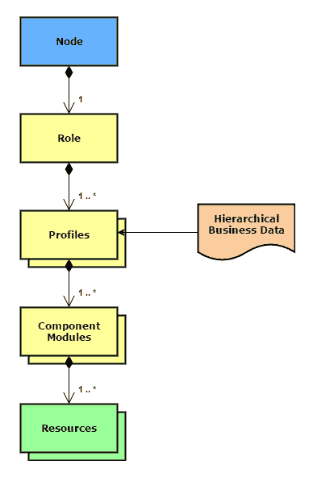
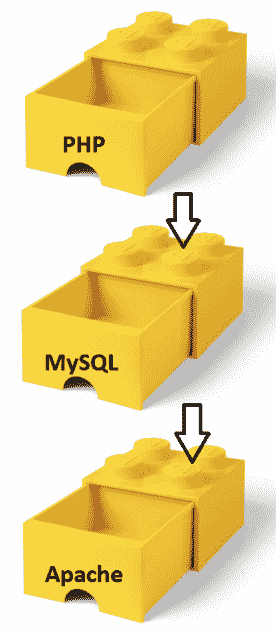
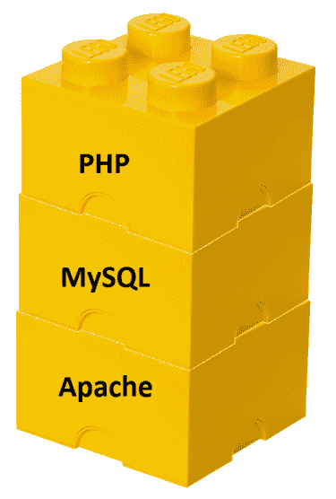

# 角色与配置文件

*角色和配置文件模式*在 Puppet 社区中成为了常识，起初是由 Craig Dunn 的开创性博客文章（[`www.craigdunn.org/2012/05/239/`](https://www.craigdunn.org/2012/05/239/)）普及的，并且迅速被社区的其他成员采纳。它现在已经成为一个广泛采用的模式或最佳实践。这是一种可靠的方法，用于构建可重用、可配置和可重构的全站配置代码，同时它也是处理基础设施接口的一种方式——使用*封装*和*抽象*的 软件开发范式。

在模式发展之前，Puppet 语言本身只提供了两个抽象层级，如下所示：

+   组件模块（[`puppet.com/docs/puppet/5.3/modules_fundamentals.html`](https://puppet.com/docs/puppet/5.3/modules_fundamentals.html)）

+   节点定义（[`puppet.com/docs/puppet/5.3/lang_node_definitions.html`](https://puppet.com/docs/puppet/5.3/lang_node_definitions.html)）

但很快就清楚了，需要进一步的中间抽象来拆解、重构并澄清这两者。

让我们考虑一下整体任务：我们希望将类（及其对应的业务数据）分配给节点，并且我们希望以一种方式来实现，在这个抽象过程的每个阶段都能够封装并隐藏复杂性：从在整个基础设施中的上下文中查看节点，作为一个软件栈，并深入了解其中包含的技术组件及其配置，这些组件构成了该软件栈的一部分。

我见过节点仅使用这两层抽象的非常详细的定义方式。我也见过其他方法，例如使用基于 Hiera 的微型**外部节点分类器**（**ENC**）。我曾帮助公司过渡到使用角色和配置文件模式，并且我曾使用 Puppet Enterprise 控制台和 Foreman 作为 ENC。我在 Puppet 代码中定义节点，使用 Hiera 的多种方式来辅助节点分类，甚至使用 PE 控制台 API 进行节点分类，因此我希望我在这个过程中能积累一些最佳实践，现在能够传授给你。

在本章中，让我们一起看看角色和配置文件模式，以及它是如何帮助你专业地管理基础设施并实现我们在*Mastering Puppet 5*中的下一个里程碑的。

# 模式总结

角色和配置文件模式在你的*节点分类*（在最高层）和*组件模块*（在最低层）之间增加了两个额外的抽象层，从而在你的 Puppet 模块中提供了三个抽象层。以下描述从最复杂到最简单：

+   **组件模块**：这些是用于管理您业务的软件的模块。毫无疑问，您从 Forge 下载了一些（例如，puppetlabs/apache、puppetlabs/mysql、hunner/wordpress 等），也可能有一些是您为自己特定业务目的开发的模块。

我们已经在第一章中详细讨论过这些内容，*编写模块*，所以问题是：

+   **配置文件**：一组封装的*技术特定*类，这些类使用一个或多个组件模块和相应的业务数据来配置解决方案堆栈的一部分。

+   **角色**：一组封装的*业务特定*类，这些类包含配置文件，用于构建完整的系统配置。

这两层额外的抽象和改进的接口使得层次化的业务数据更容易集成，使系统配置更容易被业务人员和技术人员阅读，并且使得重构变得更加容易。

以下 UML 图展示了模式中各元素之间的关系，更加清晰：



从前面的图中，我们可以看到以下内容：

+   一个节点*恰好*包含一个角色。

+   一个角色包含*一个或多个*配置文件。

+   配置文件由*一个或多个*组件模块和相应的层次化业务数据组成。

+   组件模块由*许多*资源组成。

Puppet 资源应该已经对您非常熟悉，我们已经在第一章中讨论过组件模块，*编写模块*，所以在接下来的两个部分，我们将深入探讨*配置文件*和*角色*部分的模式。

# 配置文件

首先，让我们后退一步，考虑一下我们想通过配置文件实现什么目标。

总体任务是产生可用的技术块，这些技术块可以像拼装积木一样组合在一起，形成我们今天业界所称的*技术堆栈*或*解决方案堆栈*。最著名的堆栈示例是 LAMP 堆栈（Linux、Apache、MySQL、PHP），最近，Ruby 或 Python 有时取代了 PHP 成为主要的脚本语言。Node.js 在业界也被迅速采用。

考虑到 LAMP 堆栈，我们希望做的是为 Apache、MySQL 和 PHP 组件创建技术块。因此，配置文件是这些较小的技术块，它们最终将组成这些完整的解决方案堆栈。配置文件是我们拼接在一起的三个*构建砖块*，如下所示：



让我们看看这个 LAMP 堆栈，使用一些完全功能的 Puppet **领域特定语言**（**DSL**）代码：

```
# LAMP stack profiles

# apache profile
class profile::web::apache (
  String $directory = '/var/www',
  String $vhost,
) {
  include apache
  apache::vhost { $vhost:
    port    => '80',
    docroot => "/var/www/${vhost}",
  }
}

# mysql profile
class profile::db::mysql (
  String $username = '/var/www',
  String $password,
) {

  include mysql::server
  mysql::db{ 'mysqldb':
     user     => $username,
     password => $password,
     grant    => 'ALL',
  }
}

# php profile
class profile::programming::php
{
  class { '::php':
    ensure       => latest,
    manage_repos => true,
    fpm          => true,
    dev          => true,
    composer     => true,
    pear         => true,
    phpunit      => false,
    settings   => {
      'PHP/max_execution_time'  => '90',
      'PHP/max_input_time'      => '300',
      'PHP/memory_limit'        => '64M',
      'PHP/post_max_size'       => '32M',
      'PHP/upload_max_filesize' => '32M',
      'Date/date.timezone'      => 'Europe/Berlin',
    },
  }
}
```

如你所见，在这些类中，我们为 LAMP 堆栈中剩余的 AMP 部分创建了一个*抽象*，并*封装*了底层组件模块的功能。当然，Linux 已经安装好了！

# 配置文件最佳实践总结

以下是你在开发自己配置文件时应注意的最佳实践，以下 LAMP 栈为例：

+   设计时使用 `include` 关键字

+   使用子目录来组织合理且易读的配置文件类组

+   通过参数、默认值和抽象来隐藏复杂性

+   决定如何设置组件类的参数

+   决定使用自动类参数查找或 `lookup` 函数

现在我们来逐一讨论这些最佳实践。

# 设计时使用 `include` 关键字

配置文件的单一接口应该是它们在使用 Puppet `include` 关键字的相应角色部分中的应用。写配置文件时请记住这一点。我们只需在任何需要安装 PHP 的角色中写入如下内容：

```
...
 include profile::programming::php
 ...
```

关于 Puppet 的 `include` 关键字：

+   多个声明是可以的

+   它依赖于外部数据来获取参数

语法：接受单个类名（例如，`include apache`）或类引用（例如，`include Class['apache']`）

# 使用子目录来组织合理且易读的配置文件类组

我们正在使用组件模块 puppetlabs/apache、puppetlabs/mysql 和 mayflower/php，并将它们分别封装为配置文件 `classes web::apache database::mysql` 和 `programming::php`。你可以看到，我使用了一些合理的子目录和类名来反映它们对栈的贡献，即 `web`、`db` 和 `programming` 子目录位置分别对应 Apache、MySQL 和编程配置文件。

# 通过参数、默认值和抽象来隐藏复杂性

你可以看到，在 Apache 配置文件中，我们已经相当大程度地隐藏了 vhost 定义类型的复杂性，因此你只需要提供 vhost 的名称作为字符串。此外，你可以覆盖根`internet`目录的值。我相信这个位置在所有 Linux 操作系统中都是相同的。接口大小的减少确实降低了复杂性，并提供了一个简单、整洁的抽象，如果你不需要多个 Apache vhost，这完全没问题。

# 决定如何设置组件类的参数

正如 Puppet 文档中关于角色和配置文件的说明所说（[`puppet.com/docs/pe/2017.3/managing_nodes/roles_and_profiles_example.html#the-rules-for-profile-classes`](https://puppet.com/docs/pe/2017.3/managing_nodes/roles_and_profiles_example.html)），在如何设置提供给组件模块的参数时，存在一定的权衡，我们应该根据*代码的可读性*与*业务数据的灵活性需求*来做出决策。

也就是说，如果我们始终为某个参数使用相同的值，我们可以将其*硬编码*（高度可读），我们可以根据例如事实来计算参数的值（相当可读且具有一定灵活性），或者我们可以在业务数据层次结构中查找参数的值（高度灵活）。

# 决定使用自动类参数查找还是使用`lookup`函数

对于前面最佳实践中的第三个考虑点，还有另一个关于如何将数据从业务数据层次结构传入`profile`类的决策：

+   在这些`profile`中，我们使用了自动类参数查找（[`puppet.com/docs/puppet/5.3/hiera_automatic.html`](https://puppet.com/docs/puppet/5.3/hiera_automatic.html)）从我们的业务数据层次结构中请求数据。使用`profile`的参数接口是一种可靠且广为人知的方式来查找`profile`的配置设置，并且允许更好地与外部工具集成，比如 Puppet Strings（[`github.com/puppetlabs/puppet-strings`](https://github.com/puppetlabs/puppet-strings)），这是一个基于 YARD 的（[`yardoc.org`](https://yardoc.org)）文档提取和展示工具。

+   当我们为`profile`类编写代码时，我们本来也可以省略所有参数，改用`lookup`函数：

```
$jenkins_port = lookup('profile::jenkins::jenkins_port', {value_type => String, default_value => '9091'})
$java_dist    = lookup('profile::jenkins::java_dist',    {value_type => String, default_value => 'jdk'})
$java_version = lookup('profile::jenkins::java_version', {value_type => String, default_value => 'latest'})
# ...
```

如果你不习惯自动类参数查找的自动化特性，这种方法是一个替代选择。我个人发现，做一个显式的数据查找，并在更强大的 Puppet DSL 中直接处理返回值，更让我感到舒适。早期版本的 Hiera 在追踪错误时经常令人困惑（[`puppet.com/blog/debugging-hiera`](https://puppet.com/blog/debugging-hiera)），而这种方法确实有所帮助。你可以直接检查数据类型并进行进一步的验证。通过在`profile`中完整地写出查找键，我们可以在整个 Puppet DSL 代码库中全局`grep`它，从而在 Puppet 清单和为其提供服务的业务数据之间建立明确的联系：

```
grep -nr 'profile::web::apache::vhost*' .
```

然后，你可以使用新的`Puppet lookup`（[`puppet.com/docs/puppet/5.3/man/lookup.html`](https://puppet.com/docs/puppet/5.3/man/lookup.html)）命令（之前是`hiera`命令行调用）。由于它是`lookup`函数的命令行等效物，你可以在调试时确信你得到了*完全*符合要求的业务数据值：

```
Puppet lookup ' profile::web::apache::vhost *' .
```

实际上，我对 YAML 作为一种语言本身也有一些问题（例如，参见 [`arp242.net/weblog/yaml_probably_not_so_great_after_all.html`](https://arp242.net/weblog/yaml_probably_not_so_great_after_all.html)），而能够依赖于更明确的 Puppet DSL 的鲁棒性弥补了我在调试过程中认为 YAML 本身存在的弱点。

仔细阅读这篇博客文章：[`puppet.com/blog/debugging-hiera-redux`](https://puppet.com/blog/debugging-hiera-redux)，它更新了使用最新命令来调试 Hiera 的方法，当然也确保你至少在使用一个 YAML 解析器。

同时，请记住，Hiera 确实有它的局限性，特别是在大型且多样化的基础架构中（[`www.craigdunn.org/2015/09/solving-real-world-problems-with-jerakia`](https://www.craigdunn.org/2015/09/solving-real-world-problems-with-jerakia)）。

接下来，让我们看看模式中的更高层次抽象：*角色*。

# 角色

让我们再退一步，考虑一下我们希望通过角色部分的模式实现什么。总的任务是将这些*像积木一样的*配置文件类组合成完整的技术堆栈，这些我们称之为*角色*，它们现在是我们完整模式的第二部分：



在这里，你可以看到我们已经将之前示例中的组合配置文件堆叠起来，生成了完整的技术堆栈。我们还使用了两个额外的共享配置文件：

+   `profile::base`被包含在所有机器中，包括工作站。它管理安全基准等，并使用条件逻辑处理特定操作系统的配置文件；例如，`profile::base::ubuntu`、`profile::base::redhat`等，按需使用。

+   `profile::server`被包含在所有提供网络服务的机器中，并配置诸如 NTP、防火墙、监控、日志记录等服务。

让我们再看一遍 Puppet DSL 中完整功能的 LAMP 堆栈作为例子：

```
# LAMP stack

class role::lamp {
  include profile::web::apache
  include profile::db::mysql
  include profile::programming::php
  include profile::server
  include profile::base
}
```

# 角色最佳实践总结

在开发你自己角色时，以下是你应该注意的最佳实践，以之前提到的 LAMP 堆栈为例：

+   仅使用`include`关键字构建角色

+   使用你业务的通用命名来命名角色

+   决定节点角色的粒度

现在让我们逐一检查这些最佳实践。

# 仅使用`include`关键字构建角色

如同 Puppet 文档中关于角色的说明，规则（[`puppet.com/docs/pe/2017.2/r_n_p_full_example.html#the-rules-for-role-classes`](https://puppet.com/docs/pe/2017.2/r_n_p_full_example.html#the-rules-for-role-classes)）中指出，角色应该做的唯一事情就是使用 Puppet 的`include`关键字声明配置文件类。也就是说，角色本身不应该拥有任何类参数。角色也不应该声明任何组件类或资源——这正是配置文件的目的。

# 使用你业务的通用命名来命名角色

角色的名称应该基于你业务中用于管理该类型节点的通用名称。因此，如果你通常称机器为*Web 服务器*，你应该使用诸如`role::web`这样的名称，而不是根据任何底层的配置文件技术命名，如`web::apache`或`web::nginx`。这样可以增加抽象层次，隐藏配置文件代码的复杂性，符合良好的编程实践。

这种最佳实践的另一个优势是它能促进组织内部的沟通：测试人员、项目经理甚至业务人员可以理解角色的简单语言，而 Puppet 开发人员则更容易在更深层次的*配置文件*抽象级别进行沟通。

配置文件向角色暴露了适当的接口。相应地，角色也向你的 ENC 暴露了整洁的接口，这使得即使是技术背景较少的公司人员也能负责节点分类。

# 决定节点角色的粒度

你应该从完全细粒度的角色开始，每个角色只是包含它所包含的简单配置文件列表。

如果你有很多只略有不同的节点，可以开始引入更复杂的角色，每行仅包含一个配置文件，例如条件逻辑甚至嵌套角色。

# 摘要

在本章中，我们拓宽了编写 Puppet 模块的技能，涵盖了角色和配置文件模式，并参考了两个特殊案例，这些案例提供了一种可靠的方式来构建可重用、可配置和可重构的全站配置代码。

接下来，我们保持开发的思维方式，但看看如何处理那些可能需要扩展 Puppet 超出常规使用场景的边缘情况。
