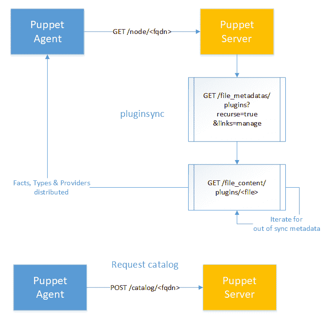

# 扩展 Puppet

Puppet 生态系统已有超过 10 年的历史，最初是用 Ruby 编写的。

尽管已经在将主代码库迁移到 Clojure 语言方面取得了很大进展（特别是主 Puppet 服务器和 PuppetDB 组件），但生态系统的某些部分仍然可以通过 Ruby 层进行访问，以便根据更高级的使用案例扩展 Puppet，具体如下：

+   自定义 Facts

+   自定义函数

+   Types 和 Providers

让我们逐一考虑这些内容，看看如何利用最初的一些基础知识以及稍后的 Ruby 代码的更深入理解，在客户端和服务器端扩展 Puppet。

# 自定义 Facts

自定义 Facts 是一种客户端技术，用于在执行代理运行期间从节点提取任意信息，并且可以在 Puppet 清单或模板中与任何其他分发的 facts 一起使用。Facts 在 Puppet 代理上执行。

创建和分发新的自定义 fact 的最佳方式是将其放置在一个模块中，放在`lib`目录的`facter`子目录中，然后通过`pluginsync`将其分发到代理机器。

这篇文档页面[`puppet.com/docs/puppet/5.3/plugins_in_modules.html#adding-plug-ins-to-a-module`](https://puppet.com/docs/puppet/5.3/plugins_in_modules.html#adding-plug-ins-to-a-module)准确地展示了在模块中放置代码的位置，而同一文档中的[`puppet.com/docs/puppet/5.3/plugins_in_modules.html#installing-plug-ins`](https://puppet.com/docs/puppet/5.3/plugins_in_modules.html#installing-plug-ins)部分则展示了`pluginsync`的技术细节。

下图展示了在正常目录请求之前的`pluginsync`过程。通常，通过使用 FQDN 在 Puppet 服务器上调用`GET`方法，然后启动`pluginsync`过程，将适当的 facts、types 和 providers 分发回代理：



你可以查看 Puppet 代理和 Puppet 服务器之间所有 HTTPS 通信的详细信息，访问[`puppet.com/docs/puppet/5.3/subsystem_agent_master_comm.html`](https://puppet.com/docs/puppet/5.3/subsystem_agent_master_comm.html)。

大多数时候，我发现 fact 通常只是执行一个任意的命令行表达式，这也是一般理解 facts 的好方法：它们实际上是一个 Ruby 包装器，通常围绕一个命令行表达式，使其通过 Facter 对 Puppet 生态系统可用。

以下代码是一个不错的代码片段，可以作为进一步开发的模板：

```
# <modulepath>/lib/facter/mycustomfact.rb
Facter.add(:mycustomfact) do
   confine :kernel => "Linux"
   ...
   myvar = Facter::Core::Execution.exec("foo")
  ...
 end
```

确保你适当地`confine`你的事实。没有什么比当你为基础设施引入一个新操作系统时，发现因为它们没有使用特定的命令语法而执行失败的事实更糟糕了。或者，如果我们突然引入一批 Windows 节点，结果发现 Windows 当然不理解大多数 Linux 命令，那该怎么办？

在编写自定义事实时，请记住这一点。

# 调试事实

你可以通过在自定义事实的 Ruby 代码中使用`facter.debug`语句来调试 Facter，如下所示：

```
Facter::Type.newtype(:mycustomfact) do
   ...
   Facter.debug "foo is the value: #{foo}"
   ...
 end
```

在调试过程中，单独运行 Facter 不会识别你新增的自定义事实，因为它通常需要`pluginsync`过程来分发。你必须设置`FACTERLIB`环境变量，以便在开发和调试新代码时简化这个过程。假设你在个人工作目录中有`some_facts`和`some_other_facts`子目录，里面是你正在编辑的新事实的 Ruby 代码。你可以按如下方式设置代码：

```
$ ls ~/some_facts
 mycustomfact.rb
$ ls ~/some_other_facts
 myothercustomfact.rb
$ export FACTERLIB="~/some_facts: ~/some_other_facts"
$ facter mycustomfact myothercustomfact –debug
```

# 自定义函数

自定义事实允许我们在客户端运行任意代码。这是一个*服务器端*技术，帮助你编译目录。函数在 Puppet 服务器上执行。Puppet 已经包含了多个内置函数，额外的函数可以通过 Puppet Forge 模块获得，尤其是`stdlib`模块（参见[`forge.puppet.com/puppetlabs/stdlib`](https://forge.puppet.com/puppetlabs/stdlib)）。

事实上，有三种可能的方式来创建自定义函数，尽管你不太可能使用前两种方式，所以我会提供一些链接到 Puppet 文档，以供参考这些选项：

+   你可以使用 Puppet DSL 编写函数（参见[`puppet.com/docs/puppet/5.3/lang_write_functions_in_puppet.html`](https://puppet.com/docs/puppet/5.3/lang_write_functions_in_puppet.html)），尽管你将无法利用更强大的 Ruby API。

+   你可以使用旧版 Ruby 函数 API 来编写函数（参见[`puppet.com/docs/puppet/5.3/functions_legacy.html`](https://puppet.com/docs/puppet/5.3/functions_legacy.html)），尽管除非你必须特别支持 Puppet 3，否则应该避免使用这种方式。

+   你可以使用现代 Ruby 函数 API 来编写函数。这也是我们在本节剩余部分将要集中讨论的内容。

创建和分发新自定义函数的最佳方式是将其放在模块中，在`lib`目录下的`puppet/functions/<modulename>`子目录中，然后通过`pluginsync`进行分发，如下所示：

```
#<modulepath>/lib/puppet/functions/mymodule/myfunction.rb
Puppet::Functions.create_function(:'mymodule::myfunction') do
  dispatch :up do
    param 'String', :a_string
  end
  def up(a_string)
    a_string.upcase
  end
end
```

# 类型和提供者

Puppet 已经有一个非常丰富的内置资源类型词汇表（请参见 [`puppet.com/docs/puppet/5.3/type.html`](https://puppet.com/docs/puppet/5.3/type.html)），这些词汇表也通过额外的模块得到了扩展。Windows 特定的资源类型就是 Puppet 成功扩展其资源类型的一个很好的例子（请参见 [`puppet.com/docs/puppet/5.3/resources_windows_optional.html`](https://puppet.com/docs/puppet/5.3/resources_windows_optional.html)）。

以下是一些你可能需要考虑编写类型和提供程序，作为 Puppet DSL 中常规模块和清单的替代方案的迹象：

+   你的 Puppet DSL 中有多个 `exec` 语句，带有复杂的 `onlyif` 和 `unless` 条件属性

+   Puppet 在以下情况的处理并不理想：

    +   你的 Puppet DSL 不是一个足够强大的 API，你需要访问纯 Ruby 来操作数据。

    +   你的 Puppet DSL 代码具有复杂且相当复杂的条件逻辑。

# 类型

按照以下步骤创建你的类型：

1.  创建并分发类型

1.  添加 `namevar` 特殊属性

1.  添加额外的类型属性

1.  添加可选的`ensure`属性

1.  添加类型参数

1.  设置属性和参数的默认值

1.  使用验证块检查输入值

1.  检查输入值是否与`newvalues`数组匹配

1.  使用 `munge` 检查数据类型兼容性

1.  使用`AutoRequire`来处理隐式关系

1.  使用`Arrays`来列出属性的值。

1.  使用`desc`方法添加内联文档

查看官方文档页面上的 Puppet 类型：[`puppet.com/docs/puppet/5.3/custom_types.html`](https://puppet.com/docs/puppet/5.3/custom_types.html)。Gary Larizza 的博客也提供了一组有用的类型示例：[`garylarizza.com/blog/2013/11/25/fun-with-providers/`](http://garylarizza.com/blog/2013/11/25/fun-with-providers/)。

现在，让我们逐步查看每个步骤，在接下来的部分中更详细地创建你的新类型。

# 创建并分发类型

创建和分发一个新的自定义类型的最佳方式是将其放入模块中，放在 `lib` 目录下的 `puppet/type` 子目录中，然后通过 `pluginsync` 将其分发到代理机器，就像我们在上一节中看到的自定义事实一样。

文件名应与正在开发的类型名称相匹配，如下方代码所示：

```
 <modulepath>/lib/puppet/type/mynewtype.rb

 Puppet::Type.newtype(:mynewtype) do
 ...
 end
```

# 添加 `namevar` 特殊属性

在使用类型的特殊属性后，也就是它的`namevar`，我们就可以实际使用 Puppet DSL 来声明我们的资源。`namevar` 应该唯一地标识底层操作系统中的资源，并且必须是可以预先指定的，如下方代码所示：

```
Puppet::Type.newtype(:mynewtype) do

   mynewparam(:name, :namevar => true) do
   end

 end
```

现在，我们可以在 Puppet DSL 中声明我们的资源。在这种情况下，`namevar` 默认为资源标题，如下方代码所示：

```
mynewtype { ‘foo': }
```

资源标题用于在 Puppet 目录中唯一地引用该资源。因此，`namevar` 表示底层系统中该资源的名称，如以下代码所示：

```
mynewtype { 'foo':
   name => 'bar',
 }
```

然后，运行以下命令：

```
$ puppet apply -e "mynewtype { 'foo': }"
notice: Finished catalog run in 0.09 seconds
```

# 添加额外的类型属性

类型属性是反映底层操作系统中该资源当前状态的属性。

在 Puppet 执行过程中，这些值会被积极执行，因此它们应该是*可发现的*和*可更新的*。如果属性不能更新，它可以作为只读属性来实现。在以下代码中，我们正在扩展示例类型的接口以定义一个版本属性：

```
Puppet::Type.newtype(:mynewtype) do
   ...
   mynewproperty(:version) do
   end
   ...
 end
```

现在我们开始在 Puppet DSL 中使用该属性，如以下代码所示：

```
mynewtype{ 'foo':
   version => '2.2',
 }
```

但它还无法使目录编译，因为在任何相应的提供者中都没有该属性的实现，如以下命令所示：

```
$ puppet apply -e "mynewtype { 'foo': version => '2.2' }"
err: /Stage[main]// Mynewtype[foo]: Could not evaluate: undefined method 'version' for nil:NilClass
notice: Finished catalog run in 0.04 seconds
```

# 添加可选的 ensure 属性

尽管是可选的，大多数原生 Puppet 资源类型确实有 `ensure` 属性，但也有一些例外——例如 `. exec` 和 `notify`。你只需通过立即调用 `ensurable` 来为资源类型添加 `ensure` 属性：

```
 Puppet::Type.newtype(:mynewtype) do
   ensurable
   ...
 end
```

该类型的相应提供者随后将通过使用 `create`、`exists?` 和 `destroy` 方法实现 `ensure` 属性。

在 Puppet DSL 中，`ensure` 属性应该是资源中的第一个属性（根据 Puppet 风格指南），它支持 `present` 和 `absent` 关键字（`present` 是默认值，因此为了简洁可以省略），如以下代码所示：

```
mynewtype { 'foo':
   ensure => absent,
 }
```

# 添加类型参数

`Type` 参数不同于属性，因为它们不直接与底层系统上的实际可发现和可更新资源相关联。相反，它们执行以下两种操作之一：

+   允许你为与底层系统上的属性和资源交互提供额外的信息上下文

+   提供一个抽象层，允许你覆盖底层系统上的预期行为

让我们使用 `newparam` 方法向我们的新类型添加一个 `source` 参数：

```
Puppet::Type.newtype(:mynewtype) do
   ...
   newparam(:source) do
   end
   ...
 end
```

# 设置属性和参数默认值

假设我们想要添加一个额外的 `override` 参数，我们希望它的默认值为 `false`。以下是表达该功能的 Ruby 代码：

```
Puppet::Type.newtype(:mynewtype) do
   ...
   newparam(:override) do
     defaultto :false
   end
   ...
 end
```

# 使用验证块检查输入值

我们可以使用 `validate` 块和例如 `regex` 表达式来验证新属性 `version` 的提供值，如以下代码所示：

```
Puppet::Type.newtype(:mynewtype) do
   ...
   newproperty(:version) do
     validate do |value|
       fail("Invalid version specified") unless value =~
         /^(\d+\.)?(\d+\.)?(\*|\d+)$/
     end
   end
   ...
 end
```

# 将输入值与 newvalues 数组进行检查

我们还可以使用 `newvalues` 方法，用值数组验证属性提供的值，如以下代码所示：

```
Puppet::Type.newtype(:mynewtype) do
   ...
   newparam(:override) do
     defaultto :true
     newvalues(:true, :false)
   end
   ...
 end
```

# 使用 munge 检查数据类型兼容性

为了决定是否更新底层提供程序的属性，会对提供的值与通过提供程序获取的值进行简单的相等性比较。

`munge`方法可以确保用户提供的数据与预期返回的提供程序数据类型一致。例如，我们可以调用`munge`方法，确保用户提供的`integer`或`numeric string`数据类型与提供程序要求的`integer`兼容，如以下代码所示：

```
Puppet::Type.newtype(:mynewtype) do
   ...
   newparam(:identifier) do
     munge do |value|
       Integer(value)
     end
   end
   ...
 end
```

# 使用`autorequire`来处理隐式关系

为了使您的类型用户更方便，您可以使用`autorequire`来避免在资源之间冗长地指定许多显式关系。`autorequire`方法在目录中建立了资源之间的隐式排序。一个典型的例子是文件资源依赖于其父目录。

例如，在我们的类型中，如果`source`参数是文件路径，那么我们应该确保首先管理相应的`file`资源，如以下代码所示：

```
Puppet::Type.newtype(:mynewtype) do
   ...
   autorequire(:file) do
     self[:source]
   end
   ...
 end
```

在 Puppet DSL 中手动指定的依赖关系比通过`autorequire`方法建立的隐式依赖关系具有更高的优先级。

# 使用数组将值列表分配给属性

当属性的预期值是数组时，`array_matching`选项应包含在调用`newproperty`时，并且其值应为`all`。然后，数组中的所有值都将用于该属性，如以下代码所示：

```
Puppet::Type.newtype(:mynewtype) do
   ...
   newproperty(:myarray, :array_matching => :all) do
   end
   ...
 end
```

# 使用`desc`方法添加内联文档

您的新类型的用户可以使用`puppet describe`和`puppet doc`命令来获取您配置的内联文档。要获取当前环境中所有已配置类型的完整描述，包括自定义资源，请运行以下命令：

```
$ puppet describe –list
```

现在，让我们通过使用`desc`方法添加一些内联文档来完成我们的类型示例：

```
Puppet::Type.newtype(:mynewtype) do

   ensurable

   newparam(:override) do
     desc 'whether or not to override'
     defaultto :true
     newvalues(:true, :false)
   end

   newproperty(:version) do
     desc 'the version to use for mynewtype'
     validate do |value|
       fail("Invalid version") unless value =~
         /^(\d+\.)?(\d+\.)?(\*|\d+)$/
     end
   end

   newparam(:identifier) do
     desc 'the identifier for mynewtype'
     munge do |value|
       Integer(value)
     end
   end

 end
```

# 提供程序

提供程序是资源在系统上的实现。类型表达了描述资源时使用的接口，而提供程序则提供了资源如何与底层系统交互的实现。

接口与其实现之间的分离使得可以为一个类型开发多个提供程序。

作为 Puppet 安装的一部分提供的`package`类型，包含许多与系统交互的独立提供程序，例如`rpm`、`apt`、`yum`、`zipper`、`chocolatey`等。开发新的提供程序所需的唯一条件是它遵循在其类型中定义的接口。

您可以查看 Puppet 提供者的官方文档页面：[`puppet.com/docs/puppet/5.3/custom_types.html#providers`](https://puppet.com/docs/puppet/5.3/custom_types.html#providers)和[`puppet.com/docs/puppet/5.3/provider_development.html`](https://puppet.com/docs/puppet/5.3/provider_development.html)。Gary Larizza 的博客也提供了一组有关提供者的有用示例：[`garylarizza.com/blog/2013/11/26/fun-with-providers-part-2/`](http://garylarizza.com/blog/2013/11/26/fun-with-providers-part-2/)。

按照以下步骤为您的类型创建新提供者：

1.  创建并分发您的提供者

1.  以下方式可以指示提供者是否适合该类型：

    +   使用`confine`方法

    +   使用`defaultfor`方法

    +   使用`commands`方法

1.  实现`ensure`属性

    +   使用`exists?`方法

    +   使用`create`和`destroy`方法

1.  使用`GET`和`SET`方法来管理类型属性

1.  实现`self.instances`方法

接下来，我们将详细介绍创建新提供者的每个步骤。

# 创建并分发提供者

创建和分发新提供者的最佳方式是将其放入相同模块中，位于`lib`目录下的`puppet/provider/<typename>`子目录中，然后通过`pluginsync`将其分发到代理机器。请注意，文件名应与提供者的名称匹配，如下代码所示：

```
# <modulepath>/lib/puppet/provider/mynewtype/myprovider.rb

 Puppet::Type.type(:mynewtype).provide(:myprovider) do
   ...
 end
```

# 指示提供者是否适合该类型

`confine`和`commands`方法用于确定哪些提供者对该类型有效，而`defaultfor`方法用于在有多个提供者时指示默认提供者。我们来看看这些方法的使用。

# 使用`confine`方法

`confine`方法可以与 fact 一起使用，如下代码所示：

```
Puppet::Type.type(:mynewtype).provide(:myprovider) do
   ...
   confine :osfamily => :redhat
   ...
 end
```

`confine`方法也可以使用`exists`来基于系统管理下是否存在特定文件作为条件。以下示例演示了如何将提供者限制为仅在 Puppet 的`.config`文件存在的系统上：

```
Puppet::Type.type(:mynewtype).provide(:myprovider) do
   ...
   confine :exisits => Puppet[:config]
   ...
 end
```

另一种可能性是基于某些 Puppet 特性来设置`confine`方法的条件（这些特性都列在源码目录的[`github.com/puppetlabs/puppet/tree/master/lib/puppet/feature`](https://github.com/puppetlabs/puppet/tree/master/lib/puppet/feature)中），如下代码所示：

```
Puppet::Type.type(:mynewtype).provide(:myprovider) do
   ...
   confine :feature => :selinux
   ...
 end
```

最后，`confine`可以接受一个布尔表达式来限制您的提供者，如下代码所示：

```
Puppet::Type.type(:mynewtype).provide(:myprovider) do
   ...
   confine :exisits =>  Puppet[:config]
   ...
   confine :true => begin
     if File.exists?(Puppet[:config])
       File.readlines(Puppet[:config]).find {|line| line =~ /^\s*\[agent\]/ }
     end
   end
   ...
 end
```

# 使用`defaultfor`方法

`confine`方法很好，但其使用可能仍会导致特定资源类型有多个有效的提供者。在这种情况下，类型应该使用`defaultfor`方法指定其首选提供者。

`defaultfor`方法使用事实名称和值作为其参数，随后用于确定某些类型底层系统的默认提供者。

例如，在 Red Hat 系统上，`yum`和`rpm`都可以作为包资源类型的有效提供者，但`defaultfor`方法将用于指示对于 Red Hat 系统，`yum`实际上是默认提供者，如以下代码所示：

```
Puppet::Type.type(:mynewtype).provide(:yum) do
   ...
   confine :osfamily =>  :redhat
   defaultfor: osfamily => :redhat
   ...
 end
```

# 使用`commands`方法

限定提供者也可以基于系统路径中某些命令的可用性，通过`commands`方法来实现。

更重要的是，通过使用`commands`生成的特殊方法，我们还可以告知 Puppet 与底层系统交互的正确命令。这比使用 Ruby 自带的命令执行方法（如`%x{cmd}`或`cmd`）更为可取，原因如下：

+   当设置`--debug`标志时，Puppet 会显示以这种方式调用的命令

+   它们作为提供者的要求已被记录

+   异常通过抛出`Puppet::ExecutionFalure`一致地处理

以下代码展示了这一点：

```
Puppet::Type.type(:mynewtype).provide(:yum) do
   ...
   commands :yum => 'yum', :rpm => 'rpm'
   ...
 end
```

# 实现`ensure`属性

为了实现`ensure`属性，提供者需要能够判断资源是否存在，在不存在时创建资源，并在存在时销毁资源。这是通过`exists?`、`create`和`destroy`方法实现的，接下来的部分将会详细介绍这些方法。

# 使用`exists?`方法

`exists?`方法检索资源的`ensure`状态。返回布尔值，如以下代码所示：

```
Puppet::Type.type(:mynewtype).provide(:yum) do
   ...
   confine :osfamily =>  :redhat
   defaultfor: osfamily => :redhat
   ...
   def exists?
     begin
       rpm('-q', resource[:name])
     rescue Puppet::ExecutionFailure => e
```

```
       false
     end
   end
   ...
 end

```

# 使用`create`和`destroy`方法

资源的存在状态通过参考用户在 Puppet DSL 中声明的带有`ensure`属性的资源声明，使用`create`和`destroy`方法进行修改。

当满足以下两个条件时，调用`create`方法：

+   在资源声明中，`ensure`属性已设置为`present`

+   `false`值由`exists?`方法返回（表示资源不存在）

当满足以下两个条件时，调用`destroy`方法：

+   在资源声明中，`ensure`属性已设置为`absent`

+   `true`值由`exists?`方法返回（表示资源已存在）

以下代码展示了如何使用这些方法：

```
Puppet::Type.type(:mynewtype).provide(:yum) do
   ...
   def create
     package=resource[:version] ?
       “#{resource[:name]}-#{resource[:version]}]” : resource[:name]
     yum(‘install', ‘-y, package')
   end
   ...
   def destroy
     yum(‘erase', ‘-y', resource[:name])
   end
   ...
 end
```

# 使用`GET`和`SET`方法来管理类型属性

类型中定义的每个属性应在提供者中实现`GET`和`SET`方法。

Puppet 随后会在运行期间调用这些方法来管理属性，如下所示：

1.  `GET`方法最初被调用以检索当前值

1.  这随后与用户在 Puppet DSL 中声明的值进行比较

1.  如果值不同，则调用`SET`方法根据需要更新该值。

这在以下代码中有所展示：

```
Puppet::Type.type(:mynewtype).provide(:yum) do
   ...
   def version
     version = rpm('-q', resource[:name])
     if version =~ /^#{Regexp.escape(resource[:name])}-(.*)/
       $1
     end
   end

   def version=(value)
     yum('install', "#{resource[:name]}-#{resource[:version]}")
   end
   ...
 end
```

# 实现`self.instances`方法

Puppet 提供了额外的操作模式，即使用 `puppet resource` 命令来发现资源。`self.instances` 方法应实现返回提供程序能够在底层系统上找到的特定资源类型的任何实例。

以下示例演示了如何使用 `rpm -qa` 命令查询底层 Red Hat 系统上安装的所有软件包：

```
Puppet::Type.type(:mynewtype).provide(:yum) do
   ...
   def self.instances
     pkgs = rpm('-qa','--qf','%{NAME} %{VERSION}-%{RELEASE}\n')
     pkgs.split("\n").collect do |entry|
       name, version = entry.split(' ', 2)
       new( :name => name,
         :ensure => :present,
         :version => version
       )
     end
   end
   ...
 end
```

`self.instances` 返回的每个资源都会将属性存储在 `@property_hash` 实例变量中。提供程序中的所有其他方法都可以访问该属性哈希，因此我们可以以更简单的方式实现 `exists?` 和 `version` 方法，如以下代码所示：

```
Puppet::Type.type(:mynewtype).provide(:yum) do
   ...
   def exists?
     @property_hash[:ensure] == :present
   end

   def version
     @property_hash[:version]
   end
   ...
 end
```

# 总结

在本章中，我们探讨了如何通过客户端事实、服务器端自定义函数以及自定义类型和提供程序来扩展 Puppet。你可以看到，凭借一些 Ruby 知识，你可以轻松地扩展 Puppet 生态系统，以满足你自己独特的需求。

在下一章中，我们将探讨 Hiera 5，我们将使用它在代码与业务数据之间创建分离。
