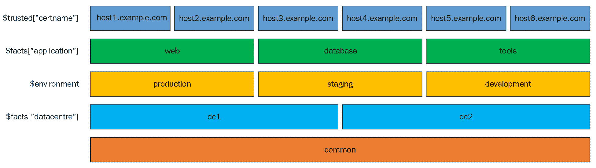

# Hiera 5

Hiera 5 现在已成为 Puppet 生态系统的一个完全成熟的成员。我们已经使用 Hiera 好几年了，用于实现 Puppet 代码和配置数据之间的所谓*关注点分离*。本质上，Hiera 使我们能够将*如何做*（Puppet 模块和清单）与*做什么*（配置数据）分离。这使我们能够将所有特定站点和业务的数据与我们的清单分开，从而使我们的 Puppet 模块更加可移植。我记得很久以前，Kelsey Hightower 在 Puppet 社区中首次给我们做了一个关于将清单与数据分离的演讲。好吧，Hiera 5 在这个版本中终于成熟了，现在可以让我们完全掌握这一基础设施设计方面的工作。

Hiera 提供了一个用于配置数据的键/值查找功能，允许外部查找值，然后将这些数据暴露给 Puppet DSL，从而传递给 Puppet 编译器。Hiera 数据保存在一个可插拔的数据库中，通常只包含简单的文本文件。我们应该努力实现的是设计一个数据层次结构，基本上通过我们的服务器类别级联。Hiera 然后会在这个层次结构中的所有层级中搜索，将所有结果合并成一个单一值、数组或哈希。

尽管 Hiera 通常具有可插拔设计，但 Hiera 数据的来源是用易读的 YAML 编写的。这意味着 Puppet 开发人员通常不需要始终参与站点配置，因此一些服务器配置现在可以由你组织中的其他、技术要求较低的专业人员来完成。

# 代码和数据的关注点分离

Hiera 将 Puppet DSL 与业务数据分开，使我们能够反复使用一些相同的通用 Puppet DSL。事实上，大多数组织使用的 Puppet DSL 中，约 80% 是完全通用的；只有业务数据有所不同。Hiera 使我们能够实现功能和业务数据之间的完全关注点分离，而是将业务数据方便地作为参数传递给我们的模块。

Hiera 的工作原理是首先在最广泛的范围内设置业务值（即在整个站点范围内，或在 Puppet 术语中称为*common*），然后向上移动层次结构，在适当的级别覆盖这个全局值。

专门针对基础设施的数据非常适合使用层次模型。基础设施通常由一组可配置的属性组成：IP 地址、端口、主机名和 API 端点。我们在基础设施中配置了大量设置，其中大多数最好通过层次结构表示。

很多基础设施数据都有一个默认值，例如，数据中心使用的 DNS 解析器。你首先将其作为键值对设置在 `common.yaml` 数据文件中。在 Puppet 初次安装后，`hiera.conf` 中的层次结构哈希最初仅提供这个常见（默认）级别：

```
---
version: 5
hierarchy:
  - name: Common
    path: common.yaml
defaults:
  data_hash: yaml_data
  datadir: data
```

# 引入环境框架

这是 Hiera 的一个典型场景：你可能需要覆盖开发环境的 DNS 设置，因为该环境无法连接到网络中的生产解析器。然后你在第二数据中心部署生产环境，并且需要该位置有所不同。Hiera 允许我们建模像是 *生产 DNS 解析器是* `10.20.1.3`*，而开发 DNS 服务器是* `10.199.30.2` 的设置。

为了适应这种场景，我们可以在 Hiera 层次结构中引入最好的环境 *框架*，如下所示：

```
---
version: 5
 hierarchy:
   - name: "Per-node data"
     path: "nodes/%{trusted.certname}.yaml"

   - name: "Per-environment data"
     path: "%{server_facts.environment}.yaml"

 - name: Common
     path: common.yaml
```

百分号括号 `%{variable}` 语法表示 Hiera 插值标记。无论你在哪里使用这些插值标记，Hiera 都会评估变量的值，并将其适当地插入到层次结构中。

请查看 Puppet 文档，了解 Hiera 5 配置语法的具体细节：[`puppet.com/docs/puppet/5.3/hiera_config_yaml_5.html#config-file-syntax-hierayaml-v5`](https://puppet.com/docs/puppet/5.3/hiera_config_yaml_5.html#config-file-syntax-hierayaml-v5)。

如果我们使用数据 `datadir` 并且默认使用 YAML 后端，我们可以完全省略 defaults 哈希，因为这些是默认设置。

# 一个更完整的层次结构

我们只处理简单的层次结构，因此我们可以构建一个最能代表我们基础设施的层次结构，例如以下内容，而不是在 Puppet DSL 中编写复杂的条件语句来确定如何解析 DNS 解析器：



这个示例层次结构将通过以下 `hiera.yaml` 表示：

```
---
version: 5
  hierarchy:
    - name: "Per-node data"
      path: "nodes/%{trusted.certname}.yaml"

    - name: "Per application data"
      path: "%{facts.application}.yaml"

    - name: "Per environment data"
      path: "%{server_facts.environment}.yaml"

    - name: "Per datacenter data"
      path: "%{facts.datacenter}.yaml"

    - name: "Common data"
      path: common.yaml
```

`facts`、`trusted` 和 `server_facts` 哈希是最有用的可在 `hiera.yaml` 中插值的哈希。

注意，如果你需要引用节点的 `fqdn`，请使用 `trusted.certname`。为了引用节点的环境，`server_facts.environment` 事实是可用的。

请查看 Puppet 文档，了解关于 Hiera 插值的更多细节：[`puppet.com/docs/puppet/5.3/hiera_merging.html#interpolation`](https://puppet.com/docs/puppet/5.3/hiera_merging.html#interpolation)。

# Hiera 5 概要

让我们现在一步步来看一下 Hiera 3 和 Hiera 5 之间的一些关键区别，具体如下：

+   全局、环境和模块层

+   加密的 YAML 后端

+   查找函数

+   调试 Hiera

# 全局、环境和模块层

Hiera 的早期版本（版本 3 或更早）使用单一的、完全全局的 `hiera.yaml`。由于其层次结构完全是全局的，实际上不可能在不同时改变所有环境的情况下更改它。环境通常用于控制代码更改，因此这使得单一的 `hiera.yaml` 文件非常不适合。Hiera 5 使用三层配置和数据：

+   全局层：

    +   在 Hiera 3 中，这是唯一的层次

    +   对于非常临时的覆盖非常有用，例如，当你的运维团队必须绕过常规的变更流程时

    +   仍然支持遗留的 Hiera 3 后端——因此在迁移到 Hiera 5 的过程中可以继续使用。

    +   现在应该避免使用这个层。所有常规数据应该在环境层中指定。

+   环境层：

    +   环境层现在是大多数 Hiera 数据定义发生的地方。

    +   在环境中的所有模块可用

    +   覆盖模块层

+   模块层：

    +   正如我们在第一章《模块编写》中讨论的那样，模块层现在可以为模块的类参数配置默认值和合并行为。这是一个非常方便的替代方案，代替使用`params.pp`模式。

    +   为了实现我们习惯的`params.pp`模式的相同行为，建议使用`default_hierarchy`设置，因为这些绑定在合并中并不包含。

    +   在环境层中的数据集会覆盖模块作者配置的默认数据。

# 加密的 YAML 后端

在 Puppet 4.9.3 中，添加了`hiera-eyaml`后端到 Hiera 功能中，这样你就可以存储加密的数据值。这样，你现在可以隐藏所有的秘密值，如密码、证书等，而不是在 Hiera 数据文件中使用纯文本。接下来，让我们一步步介绍如何启用这一功能。

# 安装 hiera-eyaml

使用 Puppet Server 设置`eyaml`，可以通过以下命令安装`hiera-eyaml` gem：

```
$ sudo /opt/puppetlabs/bin/puppetserver gem install hiera-eyaml
```

你还需要第二次使用以下命令安装 Ruby gem：

```
$ sudo /opt/puppetlabs/puppet/bin/gem install hiera-eyaml
```

# 创建加密密钥

使用`eyaml createkeys`命令创建公钥和私钥，如下所示：

```
$ eyaml createkeys
```

此命令将在默认的`./keys`目录中创建公钥和私钥，并使用默认名称。

# 安全地存储加密密钥

现在让我们将两个密钥复制到`/etc/puppetlabs/puppet/eyaml`目录，并设置适当的权限，赋予 Puppet 用户所有权，并排除所有其他用户无法访问这两个密钥：

```
$ mv -t /etc/puppetlabs/puppet/eyaml ./keys/*.pem
$ chown -R puppet:puppet /etc/puppetlabs/puppet/eyaml
$ chmod -R 0500 /etc/puppetlabs/puppet/eyaml
$ chmod 0400 /etc/puppetlabs/puppet/eyaml/*.pem
$ ls -lha /etc/puppetlabs/puppet/eyaml
-r-------- 1 puppet puppet 1.7K Apr 25 08:08 private_key.pkcs7.pem
-r-------- 1 puppet puppet 1.1K Apr 25 08:08 public_key.pkcs7.pem
```

# 更改 hiera.yaml

在`hiera.yaml`中进行以下设置，以启用`hiera-eyaml`后端，并提供对密钥和数据文件的访问：

+   设置`lookup_key`属性为`eyaml_lookup_key`，以便使用新的`eyaml`后端。

+   将加密密钥的位置添加到`options`哈希中

+   将所有的文件路径更改为`eyaml`，而不是 YAML 文件扩展名：

```
---
 version: 5
 hierarchy:
   - name: "Encrypted and regular data"
     lookup_key: eyaml_lookup_key    paths:
       - “nodes/%{trusted.certname}.eyaml”
       - “%{facts.application}.eyaml”
       - “%{server_facts.environment}.eyaml”
       - “%{facts.datacenter}.eyaml”
       - "common.eyaml"
     options:
       pkcs7_private_key: /etc/puppetlabs/puppet/eyaml/private_key.pkcs7.pem
       pkcs7_public_key:  /etc/puppetlabs/puppet/eyaml/public_key.pkcs7.pem
 defaults:
   datadir: data
```

使用此配置，你可以将加密和纯文本的密钥和值存储到`eyaml`数据文件中。

# 查找函数

值得一提的是，我们现在应该在 Puppet DSL 中使用新的`lookup()`函数来获取 Hiera 值。`lookup()`函数替代了现在已废弃的一组 Hiera 函数：

+   `hiera( )`

+   `hiera_hash( )`

+   `hiera_array( )`

+   `hiera_include( )`

这些每一个都有一种等效的方式来实现相同的结果，因此对 Puppet DSL 代码库做一些简单的查找和替换工作，很快你就能摆脱已废弃的路线。

# 查找函数语法

`lookup` 函数语法有三种特定的使用方式，如下所示：  

+   必须包含强制性的 `<name>` 和三种可选参数：`<value type>`、`<merge behavior>` 和 `<default value>`，按照给定顺序并以逗号分隔。例如，`lookup( <name>, [<value type>], [<merge behavior>], [<default value>] )`。  

+   必须包含可选的 `<name>` 和强制性的 `<options hash>` 参数。例如，`lookup( [<name>], <options hash> )`。  

+   必须包含 `<name>` 和 `<lambda expression>` 参数。例如，`lookup( <name>, <lambda expression> )`。  

# 查找函数参数  

显示在 `[ ]` 中的 `lookup` 函数参数不是强制性的，如前一部分所述。  

+   `<name>`：  

    +   必须是 `string` 或 `array` 类型。  

    +   在 Hiera 层级中要检索的键名。  

    +   也可以提供一个包含多个键的数组。如果最终的 Hiera 查找无法为第一个键返回结果，它将依次尝试后续给定键的查找，最后如果数组中的键都没有返回值，则回退到默认值。  

+   `<value type>`：  

    +   必须是有效的数据类型  

    +   如果返回值的数据类型与此处给定的数据类型不匹配，Hiera 查找（因此目录编译）将会失败。  

    +   默认为 `Data`（即任何正常值不会使 Hiera 查找失败）  

+   `<merge behavior>`：  

    +   必须是 `string` 或 `hash` 类型（请参阅以下 *深度合并查找设置说明* 部分）。  

    +   解释是否以及如何合并在不同层级遇到的多个值。这将覆盖在 Hiera 数据源中指定的合并行为。  

    +   默认为无值，意味着如果存在，Hiera 将首先使用在数据源中定义的合并行为；否则，它将简单地使用第一个查找策略（请参阅以下 *查找策略* 部分）。  

+   `<default value>`：  

    +   如果提供，当 Hiera 查找无法在 Hiera 层级找到值时，查找将返回此处提供的值。  

    +   Hiera 查找找到的值从不与给定的默认值合并。  

    +   `default type` 和 `value type` 必须匹配  

    +   `no value` 是默认值；意味着每当 Hiera 查找无法检索到正常值时，Hiera 查找（因此编译）将会失败。  

如 *查找函数语法* 部分所述，也可以使用 `<options hash>` 提供查找函数参数：  

+   `<options hash>`：  

    +   必须是 `hash` 类型  

    +   如果使用这种替代的 `<options hash>` 语法样式，则不能与任何前面的常规参数结合使用，除了 `<name>`。  

    +   可用的选项哈希键如下：  

        +   `name`：与前面描述的第一个 `<name>` 参数相同。你可以将其作为参数传递或放在选项 `hash` 中，但不能同时使用两者。

        +   `value_type`：与前面描述的第二个 `<value type>` 参数相同。  

        +   `merge`：这与之前描述的第三个 `<merge behavior>` 参数相同。

        +   `default_value`：这与之前描述的第四个 `<default_value>` 参数相同。

        +   `default_values_hash`：这是一个查找键及其相应默认值的哈希表。如果无法从 Hiera 查找中检索到正常值，则在 Hiera 放弃之前会检查该哈希表中的键。可以将其与 `default_value` 或 lambda 表达式结合使用，如果无法从 Hiera 层次结构中检索到值，将替换为该值。空哈希表是默认值。

        +   `override`：该值是一个包含 Hiera 查找键及其相应重写设置的哈希表。Hiera 在重写哈希表中查找该键；如果找到，它最终返回该值，忽略任何合并行为。空哈希表是默认值。

此外，正如在 *查找函数语法* 部分所解释的，提供 `lookup()` 函数参数的第三种方式是使用单个 lambda 表达式。如果 Hiera 查找无法检索到值，请将请求的键传递给 lambda 表达式，lambda 表达式的结果将成为 `default_value`：

```
lookup(‘my::key’) |$my_key| {"Hiera couldn't find '${my_key}'. Did you forget to add this key-value pair to your hierarchy?"}
```

在这里，`<lambda_expression>` 返回一个自定义字符串，向用户提供反馈，并优雅地处理 Hiera 无法检索所需键的情况，而在 Hiera 的早期版本中，如果检索失败，它会静默失败，导致各种问题。

我们还可以添加我们的事实值等，帮助用户找到合适的位置来插入他们的键值对（请参考本章开头的 *更完整的层次结构* 部分）：

```
lookup(‘my::key’) |$my_key| {"Hiera couldn't find '${my_key}' using certname  ‘${trusted.certname}’, application ‘${facts.application}’, environment ${server_facts.environment}, and datacenter ${facts.datacenter}. Did you forget to add this key-value pair to your hierarchy?"}
```

# 查找函数示例

让我们快速浏览一下 `lookup()` 函数的主要用例，同时展示旧的 `hiera()` 函数的等效用法：

+   以下用法是一个完全常规的查找：

```
lookup('ntp::user')
 # equivalent to hiera('ntp::user')
```

+   以下用法是常规查找，同时提供默认值：

```
lookup('ntp::user','root')
 # equivalent to hiera('ntp::user','root')
```

+   以下用法是数组查找：

```
lookup('my_ntp_servers', Array, 'unique')
 # equivalent to hiera_array('ntp_servers')
```

+   以下是一个深度合并查找：

```
lookup('users', Hash, 'deep')
 # equivalent to hiera_hash('users') with deep
```

+   以下是一个分类查找：

```
lookup('classes', Array[String], 'unique').include
 # equivalent to hiera_include('classes')
```

# 查找策略

合并策略不再像早期版本的 Hiera 那样在全局范围内设置，这是一个很大的改进。有效的合并策略如下：

+   `first`：检索第一个匹配项；这等同于传统的 `hiera()` 默认行为。

+   `unique`：这是一个数组合并，相当于旧的 `hiera_array()` 函数。

+   `hash`：这相当于没有启用深度合并的旧 `hiera_hash()` 函数。

+   `deep`：这等同于启用了 `deeper` 合并的旧 `hiera_hash()` 函数（`deep` 不再被支持）

查阅官方的 Hiera 3.3 文档，深入理解深度合并和更深合并的概念：[`puppet.com/docs/hiera/3.3/lookup_types.html#example`](https://puppet.com/docs/hiera/3.3/lookup_types.html#example)。请注意，Hiera 3 中的 `deeper` 合并相当于 Hiera 4+ 中的 `deep` 合并。

`deep` 合并不再被支持。

# 深度合并查找设置说明

现在，让我们一起看看这些常常被误解的合并设置，以确保我们掌握 Hiera 的使用技巧。

# knockout_prefix 设置

这是一个深度合并的示例，使用`knockout_prefix`设置指定一个前缀，用于指示某个值应该从结果中移除：

```
# common.yaml
 ---
 classification:
   classes:
     - paessler
     - other
# mynode.myorg.net.yaml
 classification:
   classes:
     - -- paessler
     - nagios
     - webserver
```

在这里，我们表示`mynode.myorg.net.yaml`并没有使用 Paessler 进行监控，而是使用了 Nagios。这个查找会返回正确的值，如下所示：

```
lookup({
 'name' => 'classification',
 'merge' => {
 'strategy' => 'deep',
 'knockout_prefix' => '--',
 },
 })
```

# sort_merge_arrays 设置

我们还可以通过`sort_merge_arrays`设置对合并后的数组进行排序，并移除匹配`knockout_prefix`的数据。可以从结果哈希中移除数组成员或整个键：

```
 lookup({
   'name'  => 'classification',
   'merge' => {
     'strategy'          => 'deep',
     'knockout_prefix'   => '--',
     ‘sort_merge_arrays’ => true,
   },
 })

```

# merge_hash_arrays 设置

如果某个数组成员包含一个哈希，并且你希望将这些内容合并在一起，可以通过使用`merge_hash_arrays`设置来实现。

# unpack_arrays 设置

最后，还有`unpack_arrays`设置。让我们再次修改节点的数据，保持公共数据不变，修改后的数据如下：

```
# mynode.myorg.net.yaml
 classification:
   classes:
     - --paessler,nagios
     - webserver

```

`unpack_arrays`设置会将每个字符串根据`,`分隔符拆分，创建一个数组，例如`[“–-paessler”, “nagios”]`，然后将其合并；在我们的示例中，`paessler`值会被移除，因为它是通过`knockout_prefix`设置标记的，如下所示：

```
lookup({
   'name'  => 'classification',
   'merge' => {
     'strategy'        => 'deep',
     'knockout_prefix' => '--',
     unpack_arrays     =>’,’,
   },
 })
```

# 调试 Hiera

Hiera 的数据查找都是基于被配置节点的详细信息进行的，正是这个节点的作用域告知 Hiera 应选择哪些数据集，如何排序数据，以及如何插值某些值。

查看 Hiera 文档，获取更多关于调试和查找功能的详细信息：[`puppet.com/docs/puppet/5.3/hiera_quick.html#testing-hiera-data-on-the-command-line`](https://puppet.com/docs/puppet/5.3/hiera_quick.html#testing-hiera-data-on-the-command-line) 和 [`puppet.com/docs/puppet/5.3/man/lookup.html`](https://puppet.com/docs/puppet/5.3/man/lookup.html)。

# 旧的调试技巧

之前，我们曾通过命令行运行`hiera`并使用`–debug`参数，提供了设置（例如，`mysetting`）来查找，如下所示：

```
$ hiera -c /etc/puppetlabs/puppet/hiera.yaml --debug mysetting
```

上述命令以所需的调试详细级别运行`hiera`，但我们还需要收集节点的事实信息以及其他相关数据（特别是环境和`fqdn`）：

```
$ hiera -c /etc/puppetlabs/puppet/hiera.yaml --debug --json facts.json mysetting environment=production fqdn=mynode.example.local
```

另一种早期的调试方法是使用`hiera`查找功能，通过`puppet apply`使用`-e`（执行）参数：

```
$ puppet apply --debug -e '$foo = hiera(mysetting) notify { $foo: }'
```

# 等效的调试技巧

`hiera`命令现已完全被`puppet lookup`命令取代，因此我们可以运行以下命令，并使用`--node`参数来提供查找所涉及的节点：

```
$ puppet lookup --node mynode.example.local --debug mysetting
```

这里的主要区别是，`puppet lookup`功能现在会查询`puppetdb`，以收集与给定`node`参数相关的所有事实数据。

我们现在还可以使用 `--explain` 参数来详细描述 Hiera 如何在其层级中获取数据。

# 超越 Hiera 使用 Jerakia

如果你想超越单一客户和小规模的层级数据分类，并开辟更大、更复杂、多样化环境建模的可能性，你应该考虑使用 Jerakia（[`jerakia.io`](http://jerakia.io)），将 Jerakia 用作 Hiera 后端，或者配置 Puppet 接受 Jerakia 作为数据绑定终端。

# Jerakia 高级用例

以下是关于 Jerakia 高级用例的一些问题：

+   我该如何仅为某个模块使用不同的 Hiera 后端？

+   我该如何允许某个团队使用独立的层级，仅用于他们自己的应用程序？

+   我该如何允许某个用户或团队访问更小范围的数据？

+   我该如何在不强制使用 YAML 的情况下使用 `eyaml` 加密？

+   我该如何实现一个动态层级，而不是硬编码它？

+   我该如何将应用程序特定的数据分组到单独的 YAML 文件中？

Jerakia 使我们能够实现一些特殊的情况。

# 安装 Jerakia

Jerakia 是通过 RubyGem 安装的。只需运行以下命令：

```
$ gem install jerakia
```

# 配置 Jerakia

按如下方式设置 `jerakia.yaml` 配置文件：

```
$ mkdir /etc/jerakia
$ vim /etc/jerakia/jerakia.yaml
```

这是最简单的配置：

```
--- 
policydir: /etc/jerakia/policy.d 
logfile: /var/log/jerakia.log 
loglevel: info 
eyaml:   
 private_key: /etc/puppetlabs/puppet/eyaml/private_key.pkcs7.pem         
 public_key: /etc/puppetlabs/puppet/eyaml/public_key.pkcs7.pem
```

如果你打算使用加密，你还应该在 `private_key` 和 `public_key` 设置中提供密钥，如所示。

# 创建你的默认 Jerakia 策略

所有来自 Jerakia 的数据请求都是按照所谓的 **policy** 处理的。策略的文件名应与策略的实际名称相同，并从 `jerakia.yaml` 配置文件中 `policydir` 设置所指定的目录加载。如果查找请求中未指定某个策略名称，则使用 `default` 作为默认名称。我们来创建默认策略，如下所示：

```
$ mkdir /etc/jerakia/policy.d
$ vim /etc/jerakia/policy.d/default.rb
```

Jerakia 的 `policy` 是一个容器，包含所谓的 `lookup`，按指定的顺序执行。一个查找包括一个应当用于数据查找的 `datasource`，以及任何插件功能。

以下是一个简单的示例，使用 `file` 数据源从简单的 YAML 文件提供数据：

```
policy :default do

   lookup :default do
     datasource :file, {
       :format     => :yaml,
       :docroot    => "/var/lib/jerakia",
       :searchpath => [
         "hostname/#{scope[:fqdn]}",
         "environment/#{scope[:environment]}",
         "common",
        ],
     }
   end

 end
```

让我们修改默认策略，以适应另一个配置团队的设置，假设该团队位于 `denmark`：

```
policy :default do

   lookup :denmark do
     datasource :file, {
       :format     => :yaml,
       :docroot    => "/var/external/data/ie",
       :searchpath => [
         "project/#{scope[:project]}",
         "common",
       ]
     }

     confine scope[:location], "dk"

     confine request.namespace[0], [
       "apache",
       "php",
     ]
     stop

   end

   lookup :default do
     datasource :file, {
       :format     => :yaml,
       :docroot    => "/var/lib/jerakia",
       :searchpath => [
         "hostname/#{scope[:fqdn]}",
         "environment/#{scope[:environment]}",
         "common",
        ],
     }
   end

 end
```

# 使用 Vault 作为加密后端

Jerakia 的 2.0 版本现在支持通过 transit secret 后端与 Vault 集成。

Vault 是一个开源平台，用于加密、保护、存储并严格控制密码、令牌、证书以及基础设施的其他秘密设置的访问权限。Vault 还处理秘密管理中的一些复杂问题，例如租赁、轮换、撤销和审计。

因此，Vault 提供了类似 *加密即服务* 的后端供 Jerakia 使用。

# 安装和配置 Vault

查看 Vault 文档以安装和配置 Vault：[`www.vaultproject.io/docs/install/index.html`](https://www.vaultproject.io/docs/install/index.html)

# 解封 Vault

按照 Vault 文档中的步骤解封 Vault：[`www.vaultproject.io/docs/concepts/seal.html`](https://www.vaultproject.io/docs/concepts/seal.html)

# 启用传输后端

通过如下方式挂载来启用传输后端：

```
$ ./vault mount transit
```

# 创建加密密钥

让我们创建一个 Jerakia 用于加密和解密的密钥。默认情况下，密钥被称为 `jerakia`：

```
$ ./vault write -f transit/keys/jerakia
```

# 创建加密和解密策略

现在我们需要创建一个策略，限制 Jerakia 仅能使用加密和解密端点。

为了创建这个策略，我们将创建一个新的文件 `jerakia_policy.hcl`，然后使用 `policy-write` Vault 命令将其导入 Vault：

```
# jerakia_policy.hcl 
path "transit/decrypt/jerakia" {
   policy = "write"
 }
 path "transit/encrypt/jerakia" {
   policy = "write"
 }
$ ./vault policy-write jerakia jerakia_policy.hcl
```

# 检查加密是否正常工作

现在，我们可以尝试使用 Jerakia 传输密钥和刚刚创建的策略在命令行中加密一个值：

```
$ echo -n "Lorem ipsum dolor sit amet" | base64 | ./vault write transit/encrypt/jerakia plaintext=- -policy=jerakia
vault:v1:Xv3R5CugxnCLhL/T2eJ+rN+UilHzo78evxd0tf5efx0M2U2qIgaI
```

查看 Vault 文档，了解 `read` 和 `write` 命令的更多细节：[`www.vaultproject.io/docs/commands/read-write.html`](https://www.vaultproject.io/docs/commands/read-write.html)。

# 允许 Jerakia 使用我们的 Vault 进行身份验证

AppRole 身份验证是与 Vault 认证的推荐方法。

使用这种身份验证方法时，Jerakia 配置了角色 ID（`role_id`）和密钥 ID（`secret_id`），并使用这些值从 Vault 获取一个有限生命周期的令牌，以便与传输后端的 API 进行交互。

当令牌过期时，Jerakia 将再次使用 `role_id` 和 `secret_id` 请求新的令牌。

首先，我们将为 Jerakia 创建一个 AppRole，并为其设置 15 分钟的 TTL。这个角色必须与我们之前创建的访问策略相关联，使用 `policies` 参数：

```
$ ./vault write auth/approle/role/jerakia token_ttl=15m policies=jerakia
```

现在，我们可以检查 Jerakia 的 AppRole 并确认 `role_id`：

```
$ ./vault read auth/approle/role/jerakia/role-id
Key     Value
 ---     -----
 role_id bfce3860-0805-43dc-ab6d-fe789559fe32
```

我们还需要创建一个 `secret_id`：

```
$ ./vault write -f auth/approle/role/jerakia/secret-id
Key                 Value
 ---                 -----
 secret_id           94f23dba-7355-426c-ae1e-5768dbb70280
 secret_id_accessor  f7b0f10a-99f4-4c7e-b69d-7bbd27a3c016
```

现在我们拥有了 `role_id` 和 `secret_id`，可以继续将 Jerakia 与 Vault 集成。

# 配置 Jerakia 进行加密

在 `jerakia.yaml` 配置文件中，我们使用 Vault 作为加密提供者，并配置该提供者所需的特定配置：

```
encryption:
   provider: vault
   vault_addr: http://127.0.0.1:8200
   vault_use_ssl: false
   vault_role_id: bfce3860-0805-43dc-ab6d-fe789559fe32
   vault_secret_id: 8a2fa99c-7811-5e65-a74a-8ab2ba9b6389
   vault_keyname: jerakia
```

我们现在应该能够使用 Jerakia 进行 `加密` 和 `解密`：

```
$ jerakia secret encrypt mySecret
 vault:v1: d3HftM8HAJDwWeSfLkBcdpAdTFy8fBu3mj4Kf3mHADSLuevwCbjZ
$ jerakia secret decrypt vault:v1:d3HftM8HAJDwWeSfLkBcdpAdTFy8fBu3mj4Kf3mHADSLuevwCbjZ
 mySecret
```

# 启用 Jerakia 查找加密

我们通过在策略中使用 `output_filter` 方法来启用加密：

```
policy :default do

   lookup :default do
     datasource :file, {
       :format     => :yaml,
       :docroot    => "/var/lib/jerakia",
       :searchpath => [
         "hostname/#{scope[:fqdn]}",
         "environment/#{scope[:environment]}",
         "common",
        ],
     }
     output_filter :encryption
   end

 end
```

这指示 Jerakia 将所有内容传递给加密过滤器，并将所有检索到的值与加密提供者的签名进行匹配。如果匹配成功，加密提供者将在返回值之前用于解密。

# 总结

在本章中，我们详细探讨了 Hiera 5 与其早期版本之间的主要区别。我们还描述了如何快速设置加密的 YAML 后端，这样您就不再需要以明文方式保存您的秘密 Hiera 值。

我们还看了 Jerakia，您可以使用它来处理更高级的用例，比如为不同的团队提供不同的层级结构，并集成 Vault，为 Jerakia 提供类似 *加密即服务* 的后端。

在下一章中，让我们继续通过研究 Puppet 代码的管理来进行我们的高级课程。
