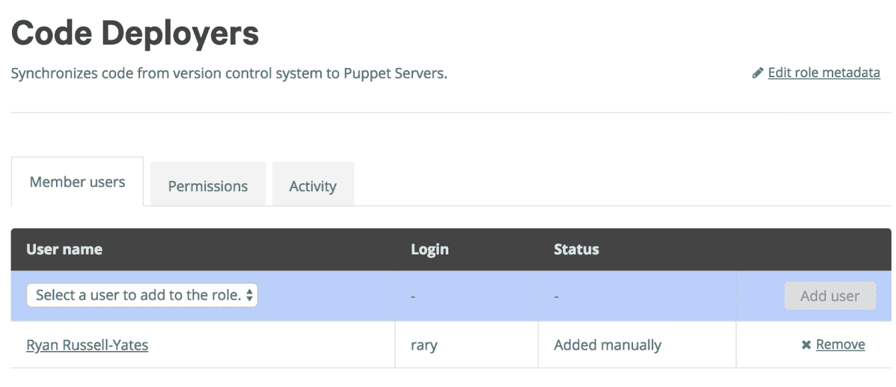

# 管理代码

代码管理在 Puppet 的生命周期中经历了很多变化。在 Puppet 的早期版本中，代码管理主要由个人用户负责。大多数用户开始时只是直接在 Puppet Master 上编辑代码。我曾为一个组织工作过，该组织为每个模块创建了 Yum RPM 包，在引入 Puppet 环境之前，允许我们在多个 Puppet Master 之间回滚和前进。许多用户将 Puppet 代码存储在 Git 或 Subversion 中，并将代码签出到 Puppet Master 的目录中。

这些模型每个都有显著的开销管理，在从 Puppet 2 到 Puppet 3 的过渡过程中，两个解决方案脱颖而出，成为 Puppet 社区的首选：Puppet Librarian 和 r10k。Puppet Librarian 像 Ruby 的 bundle 文件一样管理代码，使用一个命令就能引入所有列出的模块和依赖项。来自 Forge 的自动依赖管理也有一些问题。一些模块包括所有操作系统的依赖列表，包括那些不在你基础设施中的操作系统。一些模块在一段时间内没有收到更新，导致它们链接到依赖的旧版本，而你的组织却使用了较新的版本。最后，Puppet 模块中的依赖项通常列出一个版本范围而不是单一版本，如果这些模块跨多个清单使用，解决冲突可能会变得非常困难。

一些 Puppet Librarian 的用户使用`puppet-librarian-simple`，它不管理依赖项。尽管`puppet-librarian-simple`比 r10k 更容易安装，但它与 r10k 的功能不完全匹配；r10k 已经成为最常用的代码管理解决方案，无论是企业用户还是开源用户。r10k 允许用户指向一个包含构建 Puppet 环境的指令集的远程仓库。Puppet Enterprise 带有 r10k 的扩展，称为 Puppet 代码管理器。

本章将涵盖以下主题：

+   高效管理代码

+   代码管理器

+   Git

+   r10k

+   控制库

+   安装并使用 r10k

+   多租户控制库

# 高效管理代码

尽管直接在 Puppet Master 上编写代码是开始使用 Puppet 的最简单方式，但它是管理基础设施变化时最低效的模型。手动更改让用户单独管理以下问题：

+   备份与恢复

+   变更管理

+   Puppet Masters 的复制

+   Puppet 环境的复制

没有代码管理时，备份通常通过磁盘快照进行，或者通过简单地将代码打包并移到一个独立的位置以防紧急情况。手动放置代码使得组织需要负责维护备份和恢复的节奏与流程，并进行变更管理。没有任何代码管理时，将代码复制到 Puppet Masters 和 Puppet 环境的过程完全是手动的，这使得所有 Puppet 代码的测试和实现都依赖于危险的手动流程，而不是受控环境中的流程。

尽管将代码放入 RPM 中可以解决备份和恢复问题、变更管理和 Puppet Masters 的复制问题，但它在 Puppet 环境中存在困难。每个 Puppet 环境都需要创建一个 RPM，这会导致一组混乱的构建文件，这些文件会不断将代码放入多个环境中。此外，RPM 不适用于用来测试单独代码功能的短期环境。

使用 Code Manager 或 r10k 来管理代码能大大简化这些问题。代码从不直接写入磁盘；相反，它从一个远程仓库拉取需求列表，所有相关代码会被放置到 Puppet Master 上。这个模型的主要好处之一是每个代码变更都可以在 Git 中版本化，每次变更都可以通过标签、分支或提交哈希进行明确引用并放置到主服务器上。所有代码始终存储在远程，并且不依赖 Puppet Master 本身来进行备份和恢复。回滚现在只需在远程仓库中更改一个文件。代码管理还允许多个 Puppet Masters 的扩展，无论是长期存在的环境还是短期环境。

# Code Manager

Code Manager 提供了企业级 RBAC 和额外的代码分发功能给 r10k。Code Manager 会自动为你设置 r10k，但使用它要求你了解 r10k 如何调用代码，以及如何将代码存储在 Git 仓库中。

# Git

本书并非旨在成为 Git 的完整资源，但要有效使用 Code Manager，你应该了解一些 Git 的基础知识。

Git 是一个现代的代码仓库，它允许多个用户在同一代码集上进行异步工作。它通过将每次代码提交区分为与上次提交之间的差异来实现这一点。每次提交都是上次提交和当前更改之间的独特差异。第一次提交可能会向代码库添加数百行代码，但接下来的提交可能仅仅是删除一行并替换成另一行。当这段代码被另一个用户克隆（或复制）时，它会下载最新的代码，并允许用户回滚到之前的提交。

作为 Git 的入门，我们通过一个场景来演示。假设你使用 Git 来重新装修你的客厅。当前的提交就是你客厅现在的样子。如果你喜欢去年夏天的装修，替换沙发之前的样子，你可以回退到之前的提交，将客厅恢复到以前接受的状态。提交应该被视为代码的已接受状态，或者在这个例子中，是你客厅的已接受状态。

首先，我们最不希望在打造新客厅的同时破坏现有的客厅，因此我们会使用 `git clone` 克隆现有客厅。这样就会复制当前的客厅，并将整个更改历史一并打包。为了简化操作，我们将使用最新版本的客厅。如果我们想要对客厅进行更改，我们可以购买新的沙发、电视和两盏新的灯具。假设我们非常喜欢这些灯具，但对沙发和电视不太确定。如果我们对灯具使用 `git add`，它将把这些灯具添加到暂存目录中。Git 将报告以下信息：

```
$ git status
On branch master
Changes to be committed:
 (use "git reset HEAD <file>..." to unstage)

new object: Lamps

Changes not staged for commit:
 (use "git add <file>..." to update what will be committed)
 (use "git checkout -- <file>..." to discard changes in working directory)

 modified: Couch
 modified: Television
```

我们已经要求 Git 跟踪我们喜欢的新的灯具的更改。当我们输入 `git commit` 时，系统会要求我们写下更改的内容，然后 Git 会将新的客厅状态提交到记忆中：

```
$ git commit -m 'Beautiful New Lamps'

[master 0b1ae47] Beautiful New Lamps
 1 object changed, 0 insertions(+), 0 deletions(-)
 create mode 100644 Lamps
```

请注意，沙发和电视并未包含在这次更改清单中。在我们的工作目录中，或者说我们的当前客厅，沙发和电视仍然存在，但它们并不是永久的更改，直到我们也将它们添加并提交。我们还可以选择将新的提交（灯具）推送回远程仓库以备份，并让其他装饰者使用我们最新的客厅组合，使用命令 `git push`。

简而言之，我们克隆（复制）一个客厅的格式。我们随意地对这个格式进行更改。我们确定喜欢的更改会被添加并提交。那些不确定的更改仍然存在，但只在当前的工作目录中（或当前的客厅状态）。我们可以选择添加并提交沙发和电视，或者简单地使用 `git stash` 将客厅恢复到最后一个已知的良好状态，也就是我们之前的客厅，再加上新的灯具。这种模式给了我们尝试大幅度更改的选项，并且只提交我们确定的那些更改作为时间的检查点。一旦我们有了一个愿意支持的提交（检查点），我们就可以将其推送到所有人都能看到的客厅版本中。

让我们来讲解如何在代码上使用 Git，而不是在客厅里。第一步是克隆，或复制一个仓库。命令 `git clone` 会复制整个仓库及其历史记录，并将其带到本地工作站。这份代码的副本与它被克隆的地方（原始位置）完全独立。`git clone` 会创建一个完全独立的原始仓库副本。

当用户第一次进入代码仓库时，所有的代码都在工作目录中。用户可以在这里随意更改代码，Git 会跟踪上次提交与当前仓库之间的差异。Git 有一个叫做`git status`的命令，可以让用户查看哪些文件与上次提交不同。在以下示例中，一个模块已被克隆，`init.pp`中的值已被更改，用户在模块目录内运行了`git status`：

```
Changes not staged for commit:
 (use "git add <file>..." to update what will be committed)
 (use "git checkout -- <file>..." to discard changes in working directory)

 modified: init.pp
```

你可能已经注意到`Changes not staged for commit`。Git 会识别工作目录、已暂存的更改以及仓库历史中的每次提交。标准工作流是克隆一个仓库，进行更改，将其暂存，创建一个新的原子提交，然后再推送回中央仓库。

尽管我们通常不会对从 Puppet Forge（Puppet 代码的主要外部仓库）获得的模块进行修改，但我们还是来看看克隆、修改、提交和（可选地）将代码推送回原始仓库的过程，Git 会自动将原始仓库标记为`origin`。

首先，我们将克隆并在本地创建`puppetlabs/ntp`的副本：

```
$ git clone git@github.com:puppetlabs/puppetlabs-ntp.git
Cloning into 'puppetlabs-ntp'...
remote: Counting objects: 7522, done.
remote: Compressing objects: 100% (13/13), done.
remote: Total 7522 (delta 5), reused 18 (delta 5), pack-reused 7504
Receiving objects: 100% (7522/7522), 1.64 MiB | 0 bytes/s, done.
Resolving deltas: 100% (4429/4429), done.
```

请注意，它克隆了仓库并应用了 4,429 个差异。现在我们在 GitHub 上有了一个完整的本地仓库副本。它会创建一个名为`puppetlabs-ntp`的目录，我们必须通过使用`cd`命令进入该目录，才能继续在本地仓库中操作。

接下来，我们将编辑我们打算修改的文件。在这种情况下，我在仓库的`manifests/init.pp`中添加了一个注释。我可以通过运行命令`git status`来查看 Git 如何查看仓库：

```
$ git status
On branch master
Your branch is up-to-date with 'origin/master'.
Changes not staged for commit:
 (use "git add <file>..." to update what will be committed)
 (use "git checkout -- <file>..." to discard changes in working directory)

 modified: init.pp

 no changes added to commit (use "git add" and/or "git commit -a")
```

Git 现在看到了本地仓库的更改。我想确保将这个更改提交到仓库，所以接下来，我会将其添加到暂存目录，使用`git add manifests/init.pp`将其标记为提交。如果我们再次运行`git status`命令，我们会注意到代码不再是`not staged for commit`，而是进入了`Changes to be committed`状态：

```
$ git status
On branch master
Your branch is up-to-date with 'origin/master'.
Changes to be committed:
 (use "git reset HEAD <file>..." to unstage)

 modified: manifests/init.pp
```

在暂存目录中有了`init.pp`后，我可以将这段代码提交为一个新版本。运行命令`git commit`会打开默认编辑器，允许你对提交进行注释和命名。我将带上`-m`参数运行命令，这样我就可以直接在命令行中传递提交信息，而无需打开默认编辑器：

```
$ git commit -m 'Simple Clarification Comment added to init.pp feature'
[master 4538890] Simple Clarification Comment added to init.pp feature
 1 file changed, 1 insertion(+)
```

现在，我的本地仓库中已经有了新的提交。我可以使用命令`git log`查看这个提交：

```
commit 45388902ef5cf125ea2109197e115f050d603406 (HEAD -> master)
Author: Ryan Russell-Yates <rary@packt.com>
Date: Sun Apr 8 16:28:26 2018 -0700

Simple Clarification Comment added to init.pp feature
```

最显著的是，这个更改仅存在于我笔记本上的本地仓库中。为了共享这段代码，我需要将我的提交推送回原始代码所在的位置。当你在本地运行`git clone`时，它也会记录代码的来源，并默认将远程仓库命名为`origin`。如果我运行命令`git remote -v`，我实际上可以看到仓库的来源 URL：

```
$ git remote -v
origin git@github.com:puppetlabs/puppetlabs-ntp.git (fetch)
origin git@github.com:puppetlabs/puppetlabs-ntp.git (push)
```

如果我有权限直接推送到这个仓库，我可以使用简单的命令`git push origin master`将我的新提交推送到源代码中。Master 是分支的名称，或者说是我在仓库中所工作的特定代码集。

分支是 Git 中的一个概念，它允许我们创建代码的副本并在类似独立目录的地方进行工作。默认情况下，Git 创建一个主分支，这是存放最新功能代码的地方。我们可以在 Git 中创建一个新分支并修改代码，而不会影响它原来的分支。Git 最有效的使用方式是基于主干的开发模型，我们从主分支开始，创建一个包含新特性的分支，测试这些特性，最终将分支合并回主分支。这个模型使我们能够在不影响原始代码集的情况下进行工作、共享、测试，甚至实现代码。

当我们输入`git checkout -b new_branch`时，我们创建了一个新的分支，它基于我们之前所在的原始分支。我们可以在这里进行工作，添加额外的提交，甚至将其推送回源代码，而不会影响原始代码。只有当代码被合并回原始分支时，才会对该分支产生影响。可以将其视为 Git 中相当于将一套代码复制到新目录中，进行工作、测试，然后在完成后将其复制回原始源代码的操作。

# r10k

r10k 是 Puppet Enterprise Code Manager 的主要驱动程序。它围绕一个单一的仓库展开，称为**控制仓库**。控制仓库包含描述整个 Puppet 环境的文件。这些文件的集合整体上构成了一个版本的 Puppet 代码，旨在推送到特定的一组节点。每次运行 r10k 时，它会重新部署控制仓库中的所有内容。

# 控制仓库

控制仓库是 r10k 和 Code Manager 代码管理的核心。它是一个单一的入口点，作为 Git 仓库表示，描述了一个或多个 Puppet Master 的一个或多个环境。

r10k 旨在为 Puppet 环境提供以下内容，来源于控制仓库：

+   通过 `Puppetfile` 创建代码集所需的每个 Puppet 模块

+   一个 Hiera 层级结构

+   Hiera 数据

+   环境特定的配置

+   任何额外的代码（例如 `site.pp`、角色或配置文件）

在单个 Puppet Master 上实现多个状态，可以通过使用 Puppet 3 中推出的一个概念来实现：Puppet 环境。在 Puppet 3 中，我们获得了使用多个目录来存储代码的能力，并可以为每个代理选择单独使用的代码目录。Code Manager 和 r10k 在此基础上扩展了这个概念，将控制仓库的每个分支视为完全独立的环境。

如果一个控制仓库包含多个分支，r10k 可以单独部署每个分支，作为一个独立的环境。这确实使得我们的控制仓库分支与标准的 Git 仓库有所不同。传统上，最佳模型是基于主干的开发，这使得我们有一个主分支，用于接收所有完成的代码更改。一个 Puppet 控制仓库通常包含多个长期和短期存在的分支，且分支之间有不同程度的代码合并意图。在最佳情况下，我们将代码与不同层次的环境合并，直到最终进入生产环境。我们将在本章后面介绍的 `Puppetfile` 通常是各个环境之间差异最大的文件。

在一个组织拥有正式的生产、预生产和开发环境，并且用户积极编写 Puppet 代码的情况下，我们可能会看到以下几个分支：

+   `生产环境`

+   `预生产环境`

+   `开发环境`

+   `功能 1`

+   `功能 2`

`功能 1` 和 `功能 2` 被认为是短期分支，修改的目的是为了合并到开发环境中。Puppet 环境不需要与组织所认为的环境一一对应，且通常不应当如此。不要觉得需要将 Puppet 环境完全符合服务器的组织边界。

查看这些环境的最简单方法之一是将你的 `control-repo` 分支内部分类为 `生产环境相似` 和 `非生产环境相似`。

# 生产环境相似的环境

`生产环境相似`的环境是组织可以预期获取并为各个 Puppet 代理提供稳定代码集的正式代码通道。当我与组织首次设置这些环境时，我常常将它们描述为，*如果在夜间或周末出现故障，需要你前去处理的任何环境*。一个组织可能有一个`开发环境`，但如果需要基础设施团队的支持来维护，该环境应当被视为生产环境。任何被其他团队在组织内日常使用的环境，应当比`非生产环境相似`的环境受到更严格的控制。

管理 `生产环境相似` 分支的一些关键要点如下：

+   如果你在 CI/CD 方面很强，并且经常将代码部署到生产环境中，请通过分支部署你的模块。

+   如果你在常规周期（例如季度）中部署更新，请通过标签部署模块，作为版本号。

+   将这些分支设置为 Git 仓库中的受保护分支。

+   确定组织的 RBAC（基于角色的访问控制）和治理策略。

更多关于通过标签和分支部署模块的信息将在本章的 *Puppetfile* 部分详细讲解。

如果你正在使用托管 Git 解决方案，如 Bitbucket、GitLab 或 GitHub，启用控制库中`生产环境`分支的受保护分支。受保护分支确保只有提升了权限的管理员账户可以直接推送到该分支，或批准从其他分支生成的合并请求。这确保了代码在接受进入这些受控环境之前，已经经过同行评审。

组织应当决定一个 RBAC（角色基础访问控制）和治理政策，围绕这些受保护的分支，并应选派技术人员来审查代码并正式将代码接受到这些`类似生产环境`中。像开源项目一样，这允许任何组织成员通过 Git 向受控环境推荐更改，但需要可信任的个人将代码接受到受控代码库中。

另一方面，`非生产环境`的管理需求显著较低，可以在将代码合并到支持直接业务需求的环境之前，用于测试新特性。

# 非生产环境

我们对待`非生产环境`与`生产环境`的方式不同。`生产环境`需要管理以确保仅有受信任的代码被部署，而我们的`非生产环境`分支则受限于这些相同的保护措施。

这些`非生产环境`分支的主要目标是促进快速的代码部署和测试周期。像受保护分支和治理政策这样的模式故意放慢开发速度，以增加稳定性，但不应在这些“西部片”风格的开发分支上使用。

`非生产环境`最常见的两个例子是 Puppet 暂存环境和功能分支。Puppet 暂存环境旨在允许所有 Puppet 用户在一个环境中集成和测试更改，然后再将代码发送到`生产环境`。

如果你的组织需要一个暂存环境，你应只使用一个暂存环境，因为在多个暂存环境之间合并代码可能会比较困难。功能分支专门用于在隔离的环境中构建和测试新代码，然后再将其发送到暂存环境，或者在没有暂存环境的情况下，直接将其发送到`生产环境`分支，对于拥有强大 CI/CD 实践的组织。我们希望减少这些分支的开销，以便于异步提交代码和测试，而不需要一个受信任的代理来批准每个变更。

在大型组织中开发 Puppet 代码的常见工作流如下：

+   克隆控制库

+   检出一个新分支，基于你打算修改的分支（通常是 staging 分支）

+   通过 PE 控制台将一个或多个节点添加到该环境，或者在代理的`puppet.conf`中设置环境。

+   对代码进行迭代：编写代码并测试

+   将你的代码与暂存环境合并，并删除短期分支

+   通过多级类似生产环境的分支来推广暂存环境

在了解这些概念之后，接下来我们来检查 Puppet 控制仓库中包含的内容。

# Puppetfile

控制仓库的核心是 `Puppetfile`。`Puppetfile` 作为一个 Puppet 模块的列表，在每次运行 r10k 时都会被导入，并将模块部署到与控制仓库分支名称相匹配的 Puppet 环境中。它允许我们从两个地方导入模块：Puppet Forge 和远程 Git 仓库。

从 Puppet Forge 拉取模块可以使用简写形式，在文件的最顶部，你可以选择一个位置来搜索 Forge 模块。默认情况下，控制仓库会将我们指向 [`forge.puppet.com`](https://forge.puppet.com)，这使得我们可以以简写形式编写我们想要引入的模块。在 `Puppetfile` 中输入 `mod "puppetlabs/ntp"` 会拉取最新版本。通过简单地添加一个版本号，例如 `mod "puppetlabs/ntp", "7.1.1"`，r10k 将确保只部署 Forge 中的特定版本到环境中。通常认为最佳实践是始终包含 Forge 模块的版本，以避免意外地将新的主要版本部署到环境中。

此外，我们还可以直接指向 Git 仓库。这种用法最常见于用户或组织内部开发的 Puppet 模块。像 Forge 一样，我们可以专门指定一个 Git 仓库的版本，并将其部署到一个环境中。以下是一个示例：

```
mod 'ourapp',
  :git => 'git@git.ourcompany.com:ourapp.git',
  :ref => '1.2.2',
```

这个 `Puppetfile` 中的每一行实际上都代表着 r10k 的某个指令。第一行，`mod 'ourapp'`，告诉 r10k 以 `'ourapp'` 这个名称部署该仓库，并将该模块作为该名称进行部署。这个名称必须与模块的命名空间匹配，在本例中，`config.pp` 需要包含 `class ourapp::config`。

`:git` 引用告诉 r10k 到哪里去获取代码。r10k 必须具备 SSH 密钥才能访问这个仓库，除非仓库允许匿名克隆。`ref` 标签实际上会搜索提交、`git` 标签和分支，直到找到与引用匹配的一个。如果这个仓库包含名为 `1.2.2` 的 `git` 标签，r10k 将使用该特定版本的代码。请注意，如果存在名为 `1.2.2` 的分支和标签，调用仓库的这种方法可能会引起问题。`ref` 是一种简写方式，允许你调用标签、分支或提交，但它们也可以通过 `:tag`、`:branch` 或 `:commit` 直接调用。

以下代码是一个 `Puppetfile` 的示例，它提供了以下内容：

+   将 Forge 设置为 `forge.puppet.com` 的 HTTPS 版本

+   包含最新的 `puppetlabs/ntp`

+   包含 `puppetlabs/stdlib` 版本 4.25.1

+   包含 `puppetlabs/nginx` 版本 0.11.0

+   包含三个内部应用程序，可以通过分支、标签或提交进行调用

```
forge "https://forge.puppet.com"

# Forge Modules
# Always take latest version of NTP, notice no version listed
mod "puppetlabs/ntp"

# Specific versions of stdlib and nginx.
mod "puppetlabs/stdlib", "4.25.1"
mod "puppetlabs/nginx", "0.11.0"

# Modules from Git

# Pointing to Master Branch
mod 'ourapp',
  :git    => 'git@git.ourcompany.com:ourapp.git',
  :branch => 'master',

# Pointing to the 1.2.2 tag
mod 'ourapp2',
  :git => 'git@git.ourcompany.com:ourapp2.git',
  :tag => '1.2.2',

# pointing to an explicit git commit
mod 'ourapp3',
  :git    => 'git@git.ourcompany.com:ourapp3.git',
  :commit => '0b1ae47d7ff83489299bb7c9da3ab7f4ce7e49a4',
```

# hiera.yaml

Hiera 在 Puppet 5 中的最佳功能之一是它默认包含在内，不需要额外安装。正如上一章所述，Puppet 5 为我们提供了三个 Hiera 层级：全局、环境和模块中的数据。环境级别的 Hiera 包含在控制仓库中，为我们提供每个环境的独立数据，并允许我们将所有 Hiera 数据存储在一个仓库中。

这种模型允许我们轻松地在 Puppet 5 中进行数据层的版本控制，甚至可以在不同分支之间合并我们的数据。如果我们希望像迭代开发 Puppet 代码一样迭代开发 Hiera 数据，我们可以使用第四章中展示的相同的 Hiera v5 配置，*Hiera 5*，如下所示，在各个环境中设置我们的数据：

```
---
version: 5
 hierarchy:
 - name: "Per-node data"
 path: "nodes/%{trusted.certname}.yaml"
- name: "Per-environment data"
 path: " %{server_facts.environment}.yaml"
- name: Common
 path: common.yaml
```

这将使用`control-repo`中的默认`datadir`（数据目录）来存储我们的 Hiera 数据。如果我们使用这个层级结构，我们的控制仓库可能包含以下内容：

```
├── data
│   ├── common.yaml
│   ├── development.yaml
│   ├── nodes
│   │   ├── server1.ourcompany.net.yaml
│   │   └── server2.ourcompany.net.yaml
│   ├── preprod.yaml
│   ├── production.yaml
│   └── staging.yaml
└── hiera.yaml
```

# site.pp

`site.pp`是现代 Puppet Master 中最古老的文件之一。`site.pp`的最初目的是对节点进行分类，将类和资源分配给节点以创建目录。它接受正则表达式和字符串匹配名称，如果用于直接在系统上放置代码和资源，它将包含如下代码：

```
node 'application.company.com' { include role::application }
```

如今，大多数用户不再将分类存储在`site.pp`中。分类由**外部节点分类器**（**ENC**）处理，例如 Puppet Enterprise 控制台。Hiera 也成为了一种常见的分类方法，取代了 ENC。任何未在`site.pp`中限定为节点的代码，都将应用于 Puppet 环境中的所有节点。以下代码，在节点规格外部放置时，会在节点的 Hiera 层级结构中搜索名为`classes`的数组中的唯一类，移除任何包含在名为`class_exclusions`的数组中的内容，并将它们应用于每个节点。这使得 Hiera 能够充当 Puppet 节点的分类器。

以下代码启用 Hiera 作为分类策略，当它放置在`site.pp`中时：

```
#This section ensures that anything listed in Hiera under classes can be used as classification

$classes = lookup('classes', Array[String], 'unique')
$exclusions = lookup('class_exclusions', Array[String], 'unique')
$classification = $classes - $exclusions

$classification.include
```

如果我们有一个名为`snowflake.ourcompany.com`的服务器，且以下内容包含在我们的 Hiera 层级结构中，我们将包括`role::ourapp`和`profile::partners::baseline`，但排除`profile::baseline`，即使它在`common.yaml`中列为一个类。这确保了`profile::baseline`会在整个基础设施中应用，除了那些被显式排除的地方：

```
# common.yaml
---
classes:
  - profile::baseline
```

我们还可以使用上面的类排除来从特定节点中移除基线：

```
# nodes/snowflake.ourcompany.com.yaml
---
classes:
  - profile::partners::baseline
  - role::ourapp
class_exclusions:
  - profile::baseline
```

`site.pp` 还允许我们为整个环境的 Puppet 代码设置一些合理的默认值。在以下示例中，任何 Windows 机器将默认使用 `Chocolatey` 作为包管理器。`Chocolatey` 是一个免费的开源解决方案，类似于 Linux 中的 Yum 包管理器。如果你还没有在 Windows 环境中试过它，它是一个比直接从 `.msi` 或 `.exe` 安装要好得多的选择：

```
# Set Default Package Provider to Chocolatey on Windows

if $::kernel = 'windows' {
  Package {
    provider => 'chocolatey'
  }
}
```

# environment.conf

`environment.conf` 文件是控制库中的一个可选文件，允许你覆盖 Puppet 环境中的某些设置。从 5.5 版本开始，`environment.conf` 提供了五个设置，如下所示：

+   `modulepath`：搜索 Puppet 模块的位置。

+   `manifest`：搜索 `site.pp` 的位置，或按字母顺序解析的节点清单文件目录。

+   `config_version`：用户定义的脚本，用于生成通过运行 Puppet 代理所产生的版本。

+   `environment_timeout`：Puppet 环境缓存环境数据的时间长度。

+   `static_catalogs`：一个高级配置，内部版本化从 Puppet 主服务器提供的文件。默认启用。

此外，`environment.conf` 能够使用从 Puppet 配置生成的变量。在以下示例中，我们设置了 `environment.conf` 文件中最常见的两个设置：

```
# Extend Modulepath
# Using $basemodulepath to ensure all default modulepaths are still preserved
# This will now search for modules at $codedir/site, allowing us to place modules
# directly into the control repo. Often used for Roles and Profiles
modulepath = site:$basemodulepath
# Set version that appears during a Puppet run with a custom script
# Contained in base on control repo config_version = 'scripts/version.sh'
```

# 角色与配置文件

在前一章中，我们讨论了角色与配置文件。对于许多小型组织来说，将角色和配置文件放在控制库中是一个常见做法，因为这是一个简单的地方，可以开始为组织编写 Puppet 代码。使用之前的 `environment.conf`，我们的角色和配置文件将位于 `/etc/puppetlabs/code/environments/<environment>/site`，作为角色目录和配置文件目录。这些将包含在 Git 仓库中，位于仓库根目录下的 `site` 文件夹中。

对于许多较大的组织，接受单独角色和单独配置文件模块的提交，比将它们打包到控制库中更容易维护。这为每个环境提供了调用特定标记版本的角色和配置文件模块的能力。这两种方法都是有效的，并且在使用代码的代理上产生相同的结果。

本章结束时，你将找到一个关于多租户控制库的指南，如果角色和配置文件模块与控制库分开，将更容易管理。

# 控制库示例

如果我们按照前面示例中的设计使用控制库中的所有内容，我们的控制库的单个分支将如下所示：

```
$ tree control-repo
control-repo
├── data
│   ├── common.yaml
│   ├── development.yaml
│   ├── nodes
│   │   ├── server1.ourcompany.net.yaml
│   │   └── server2.ourcompany.net.yaml
│   ├── preprod.yaml
│   ├── production.yaml
│   └── staging.yaml
├── environment.conf
├── hiera.yaml
├── manifests
│   └── site.pp
└── site
 ├── profile
 │   └── manifests
 │   └── application.pp
 └── role
 └── manifests
 └── webserver.pp
```

# 安装和使用 r10k

通常，如果你拥有 Puppet Enterprise，你应该使用 Code Manager 而不是 r10k。如果你是 Puppet 开源用户，或者你的环境是开源和企业节点的混合体，可以考虑直接安装 r10k。Forge 上有一个 Puppet 模块，Vox Pupuli 提供的该模块可以在现有的 Puppet Master 上安装 r10k，地址是 [`forge.puppet.com/puppet/r10k`](https://forge.puppet.com/puppet/r10k)。

一旦安装了 r10k，可以通过以 root 用户或具有 `sudo` 权限的用户身份在每个 master 上运行 `r10k deploy environment <branch> -p` 来部署环境。通常，当 r10k 代替 Code Manager 使用时，CI/CD 系统会被用来自动化通过 r10k 的部署。

# Code Manager

现在已经详细介绍了 r10k，我们来探讨一下它的 Puppet Enterprise 版本：Code Manager。Code Manager 为 r10k 添加了以下四个主要特性：

+   文件同步与从 **Master of Masters** (**MoM**) 的 Rsync 跨主机同步

+   RBAC 和 pe-client-tools 提供 RBAC 访问

+   自动环境隔离

+   简单安装

在 Puppet Enterprise 中使用 Code Manager 而不是 r10k 的主要原因是 Puppet Enterprise 提供的强大 RBAC 模型。没有 Git 时，r10k 钩子要求你通过 SSH 或控制台登录到 Puppet Master，运行命令部署一个或多个环境。Puppet 提供的 PE 客户端工具允许用户生成一个短期有效的 RBAC 访问令牌，并通过远程检查与 Puppet Enterprise Console 中的 RBAC 进行匹配。这个远程 RBAC 模型不仅可以为不同的人员分配不同级别的环境部署权限，而且完全不需要用户登录到 Puppet Master。PE 客户端工具可以从本地工作站运行，并通过 Puppet Enterprise Web API 部署环境。

第二个主要特性是文件同步。r10k 直接将代码部署到单个 Puppet Master 的代码目录中。如果一个组织有多个 Puppet Masters，并由 Master of Masters（MoM）进行控制，使用单一命令即可将代码库部署到 MoM 上的代码暂存目录中，然后该代码会同步部署到环境中的所有 Puppet Masters。这样，你无需登录到多个 Puppet Masters，而是可以远程运行一次命令，让 MoM 将代码分发到所有的 Puppet Masters 上。

Code Manager 还确保在系统中运行所有环境隔离命令，确保类型资源不会意外地溢出到其他环境。该命令的开源等效命令是 `puppet generate types --environment <environment>`。

Code Manager 的最后一个主要特性是简易安装。启用 Code Manager 所需的一切都包含在 Puppet Enterprise 中。

# 启用 Code Manager

在 Puppet Enterprise 中启用 Code Manager 非常简单，因为它已经预先捆绑在系统中。每个主节点上必须生成的唯一制品是用于访问控制库和任何其他 `Puppetfile` 中 Git 仓库的 SSH 密钥。这些 SSH 密钥应该在没有密码的情况下创建，并应在 Puppet Master 上进行保护。此外，如果你使用的 Git 服务支持它，请将此密钥作为部署密钥，而不是用户密钥。部署密钥仅具有检出代码的权限，不能将代码提交回 Git 服务器。对于单个主节点，可以作为 root 用户或使用 `sudo` 运行以下命令来生成 SSH 密钥：

```
# Create SSH Directory
$ sudo mkdir -p /etc/puppetlabs/puppetserver/ssh

# Generate SSH Key - With No Password
$ sudo ssh-keygen

Generating public/private rsa key pair.
Enter file in which to save the key (/var/root/.ssh/id_rsa): /etc/puppetlabs/puppetserver/ssh/id-control_repo.rsa
Enter passphrase (empty for no passphrase):
Enter same passphrase again:
Your identification has been saved in /etc/puppetlabs/puppetserver/ssh/id-control_repo.rsa.
Your public key has been saved in /etc/puppetlabs/puppetserver/ssh/id-control_repo.rsa.pub.
The key fingerprint is:
SHA256:Random key root@server
The key's randomart image is:
+---[RSA 2048]----+
Random Art
+----[SHA256]-----+

# Ensure pe-puppet owns the directory and the keys
$sudo chown -R pe-puppet:pe-puppet /etc/puppetlabs/puppetserver/ssh
```

启用 Code Manager 的最简单方法是在生成密钥后，进入 Puppet Enterprise 控制台中 PE 基础设施下的 PE Master 分类。在 `puppet_enterprise::profile::master` 类下添加以下参数：

+   `r10k_private_key`: 生成并在 Puppet Master 上提供的私钥的位置。

+   `r10k_remote`: 控制库的位置——应为 Git URL。

+   `code_manager_auto_configure`: 设置为 true。这让 Puppet 自动进行配置。

+   `r10k_proxy`（可选）：设置访问 Forge 的代理 URL，如果你的主节点只能通过代理访问互联网。

没有代理的此分类示例如下：


一些组织更愿意将他们对 Puppet 的更改存储在代码中，而不是在 PE 控制台中。以下代码也代表了前述更改，但 Puppet Master 在删除 `puppet_enterprise::profile::master` 类后，才会成功编译清单。要通过配置文件而不是通过控制台启用 Code Manager，请在删除控制台中的相同类后，将以下内容应用到主节点：

```
class profile::pe_master {

  sshkey {'codemanager':
    ensure => present,
    key    => 'Long String of Private Key',
    target => '/etc/puppetlabs/puppetserver/ssh/id-control_repo.rsa',
    type   => 'ssh-rsa',
  }

  class puppet_enterprise::profile::master {
    code_manager_auto_configure => true,
    r10k_remote                 => 'git@git.ourcompany.com:control-repo.git',
    r10k_private_key            => '/etc/puppetlabs/puppetserver/ssh/id-control_repo.rsa',
  }

}

```

这些方法中的每一种都可以在主节点上启用 Code Manager，允许远程 PE 客户端工具从单独的工作站部署环境。

# Code Manager RBAC

启动 Code Manager 和 RBAC 的最简单方法是将用户添加到现有的用户角色 Code Deployers。Code Deployers 可以使用 PE 客户端工具部署任何环境。虽然一开始这看起来限制过于宽松，但请记住，Code Manager 仅部署控制库的现有分支。强烈建议不要在 Git 中预先存储代码，指望用户不会执行代码部署并部署最新版本的代码。代码部署应被视为幂等的，用户应该可以随意部署环境，通常在出现错误时不会覆盖任何代码。

在以下示例中，我已经将自己添加为用户，并将该用户添加到 **Code Deployer** 角色中，保持能够部署任何环境的权限：



你可以在以下截图中查看权限详情：


# PE 客户端工具

Code Manager 是通过 PE 客户端工具来使用的。这些工具默认安装在 Puppet Master 上，但出于安全考虑，我们更倾向于将它们安装在用户工作站上，以便进行远程代码部署，并避免用户直接使用 Puppet Master。PE 客户端工具为我们提供了两个新命令：`puppet-access login` 和 `puppet-code deploy <environment>`。

`puppet-access login` 为我们提供一个 RBAC 令牌，默认生命周期为 5 分钟。用户可以通过为 `puppet-access` 添加 `--lifetime=<time>` 标志来覆盖这个生命周期。时间可以用分钟、小时、天或年表示，分别以 `m`、`h`、`d` 或 `y` 为单位。例如，要设置半天的登录时间，用户可以运行 `puppet-access login --lifetime=4h`。这些令牌的最大值和默认生命周期由 `puppet_enterprise::profile::console` 类来决定。`rbac_token_auth_lifetime` 参数设置用户接收到的默认令牌生命周期。`rbac_token_maximum_lifetime` 设置用户通过 `--lifetime` 标志请求的令牌最大生命周期。组织在设置此值之前应考虑其标准登录安全实践。

`puppet-code deploy <environment>` 从控制仓库部署特定的环境，并且只能使用 `puppet-access` 提供的有效令牌执行。一旦令牌过期，用户需要重新通过 `puppet-access` 请求访问权限。通过为 `puppet-code deploy` 添加 `-w` 标志，可以让部署等待并返回部署状态的消息。建议用户在手动部署时使用 `-w` 标志，而在系统自动执行部署时，如 CI/CD 系统或 Git 钩子，可以省略该标志。

第一步是从 Puppet 的下载页面下载 PE 客户端工具。它支持多种操作系统，包括 Linux、macOS X 和 Windows。

PE 客户端工具可以设置系统级配置文件和用户级配置文件。用户配置会覆盖系统配置。我们必须管理两个 PE 客户端工具的文件：`puppet-access.conf` 和 `puppet-code.conf`。

系统级配置文件位于 Windows 的 `C:/ProgramData/PuppetLabs/client-tools/` 和所有其他操作系统的 `/etc/puppetlabs/client-tools`。用户配置文件位于所有操作系统的 `~/.puppetlabs/client-tools`，并会覆盖系统级配置。

`puppet-access` 和 `puppet-login` 都需要一个有效的 CA 来进行 Web API 调用。默认情况下，这个文件可以在任何连接到相应 Puppet Master 的代理上找到，路径为 `/etc/puppetlabs/puppet/ssl/certs/ca.pem`。如果在非 Puppet 管理的机器上进行开发，你应该将此文件复制到本地。

`puppet-access.conf` 用于提供 `puppet-access login` 命令的配置，该命令连接到 Puppet Enterprise 的 RBAC API，并授予一个临时登录令牌，用于部署代码。`puppet-access.conf` 通常包含至少以下两个属性：

+   `service-url`：Puppet Enterprise 安装的 RBAC API URL

+   `certificate-file`：由主节点提供的有效 SSL 证书

```
#puppet-access.conf
{
  "service-url": "https://pemaster.ourcompany.com:4433/rbac-api",
  "certificate-file": "/etc/puppetlabs/puppet/ssl/certs/ca.pem"
}
```

`puppet-code.conf` 与 `puppet-access.conf` 类似，都需要证书和 `service-url` 进行调用。有两点需要注意的是，与 `puppet-access.conf` 相比，`puppet-code.conf` 的服务 URL 会有所不同。`puppet-access` 调用 RBAC API，而 `puppet-code` 调用代码管理 API。此外，尽管两者都使用来自 Puppet Master 的相同证书，但你会注意到，`puppet-code.conf` 使用的是 `cacert`，而不是 `certificate-file`：

```
#puppet-code.conf
{
  "service-url": "https://pemaster.ourcompany.com:8170/code-manager",
  "cacert": "/etc/puppetlabs/puppet/ssl/certs/ca.pem"
}
```

一旦设置完成，用户可以使用 Code Manager 工作流执行以下操作：

+   查看代码

+   进行更改

+   推送回源仓库

+   运行 `puppet-access login` 获取令牌

+   运行 `puppet-code deploy` 部署环境

+   检查结果

+   如有必要，重复操作

# 多租户控制仓库

较大的组织可能需要 Puppet Enterprise Code Manager 的多租户设置。虽然从根本上说，工作流是相同的，但我们结构化控制仓库的方式略有不同。

我们尽量减少控制仓库的影响，将其转化为类似库的调用。我们希望将控制仓库定位为存储代码引用，而非代码本身。将角色和配置文件清单移动到外部仓库，可以让我们将它们作为版本化的工件进行管理，并直接声明每个环境可以使用的版本。我们的控制仓库仅包含 `Puppetfile`、使用 `site.pp` 全局应用的内容，以及我们希望对整个组织开放的值，以供在 Hiera 中使用。

我们对工作流做了一些小改动，以便支持更大的团队，具体如下：

+   角色和配置文件会被导出到独立模块中，标记上版本，并通过 `Puppetfile` 导入。

+   只有用于多个模块之间共享的值，如 LDAP 设置，才会保存在环境级别的 Hiera 中。所有直接调用类的操作，例如 `profile::ntp::servers`，都会存储在数据中，位于适当仓库中的模块中（在本例中是配置仓库）。

角色和配置文件被迁移为独立模块，并且每个团队也会获得自己的模块。这些模块然后在模块中加入自己的强大 Hiera 层次，并可用于为每个团队提供角色和配置文件。如果我们有一个开发名为`myapp`的应用程序的团队，他们将创建一个名为`myapp`的模块，并包含`role`和`profile`文件夹。我们的命名空间会发生一些变化，但这使得我们可以将模块视为每个团队的角色和配置文件集合。原始的`role`和`profile`仓库变成了整个组织常用代码的存放地，如安全基线或 Web 服务器默认配置。

以下代码可以由`myapp`团队生成，它为这些仓库提供了 Hiera、角色和配置文件的强大功能：

```
class myapp::role::app_server {
  # Global Baseline used by entire organization
  include profile::baseline
  # Profile generated specifically by myapp team
  include myapp::profile::application
}

class myapp::profile::application {
  # Profile has some custom code from the Myapp Team
  include myapp::application
  # Profile also uses the standard Webserver profile of the organization
  include profile::webserver
}
```

这种方法论结合了本章中的其他实践，如受保护分支，使得团队可以在不同的项目上以不同的速度工作，同时不会拖慢组织中其他团队的进度。它将控制库限制为仅描述环境，并开放角色和配置文件，以便从组织的任何地方接收代码贡献，同时通过 RBAC 和治理措施确保在接受代码之前进行适当的代码审查。

我们大大缩小后的控制库现在如下所示：

```
$ tree control-repo
control-repo
├── hiera.yaml
├── environment.conf
├── Puppetfile
├── data
│   ├── common.yaml
│ . └── datacenter
│       ├── us.yaml
│       ├── uk.yaml
│       └── can.yaml
└── manifests
 └── site.pp 
```

我们的团队模块就像是一个小型的控制库，具有 Hiera 层次结构、角色和配置文件：

```
$ tree team
team
├── README.md
├── hiera.yaml
├── data
│   ├── common.yaml
│   └── os
│       ├── RedHat.yaml
│       ├── Ubuntu.yaml
│       └── Windows.yaml
│   └── datacenter
│       ├── us.yaml
│       ├── uk.yaml
│       └── can.yaml
├── files
├── manifests
│ ├── profile
│ │ └── myapp.pp #team::profile::myapp
│ └── role
│ └── myapp.pp #team::role::myapp which includes team::profile::myapp
├── metadata.json
└── templates
```

# 总结

在本章中，我们讨论了 Git、r10k 和 Code Manager。我们强调了`生产环境类`和`非生产环境类`的逻辑分离。我们列出了控制库的内容：`Puppetfile`、`hiera.yaml`、`environment.conf`、`site.pp`以及各种类型的代码，如`roles`和`profiles`。我们介绍了启用 Code Manager 并使用 PE 客户端工具与 Puppet Code Manager 进行交互的过程。最后，我们讨论了一种多租户、面向企业的控制库格式，该格式将角色和配置文件导出为独立的模块，并使用模块中的数据为组织中的每个团队提供 Hiera 层次结构。

在下一章中，我们将专注于将工作流整合到我们的代码开发中。我们将扩展我们的工作到 PDK，并检查良好的开发实践。
