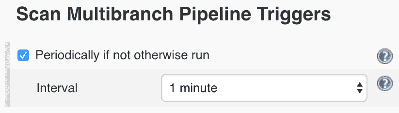

# 持续集成

持续集成作为一种实践，确保每次提交代码时，代码都能以一致的方式进行构建和测试。我们使用持续集成系统来自动化这一实践，使其可以在每次提交时都能实际使用。一些持续集成管道最终会演变为持续交付或持续部署管道。持续集成与交付的关键区别在于，交付确保每次提交代码时，代码也会被打包并交付到所需运行的服务器上。持续交付要求能够通过单一的协调命令一致地部署整个基础设施和应用程序。持续部署要求为基础设施中的每个组件提供端到端的测试套件，但它的任务非常简单，就是在每个测试通过时自动执行该单一协调命令。

这些系统如何为单个应用程序和基础设施提供价值，对每个公司和组织来说都是独一无二的，就像任何其他业务规则一样。有一些常见的使用案例和几乎在每个人的持续集成管道中普遍存在的业务规则，也有一些是团队所追求的目标。

在本章中，我们将做以下几件事：

+   使用 Puppet 设置一个持续集成系统（Jenkins）

+   为配置模块创建一个作业

+   设置我们的第一个测试

+   集成**Puppet 开发工具包**（**PDK**）测试套件

+   编写 RSPec 单元测试

+   使用 Test Kitchen 设置 Puppet 集成测试

# 持续集成系统

我们的持续集成系统是一个面板，用于跟踪我们的代码仓库。对于每个这些仓库，你将看到通常所称的作业。作业是一系列步骤，通常是用代码编写的，用来告诉系统在通过按钮或命令行触发构建时应该做什么。构建只是该作业的一个实例，正在运行或已运行。最后，构建包含日志文件、关于构建的关键信息以及任何你希望系统存储或发送到终端的工件（对象）。

我们将使用 Puppet 构建我们的 CI 系统，最终由它来管理我们的 Puppet 代码。这是当你在一个已有环境中开始使用 CI 时的常见场景。

# Puppet Pipelines

Puppet Pipelines 是 Puppet 推出的新产品。2017 年 9 月，Puppet 收购了 Distelli，以便开发新的 Puppet Pipelines 程序。这个 CI 系统仍然主要面向容器和应用程序，但也在努力改善其 Puppet 功能。Puppet Pipelines 仍然可以用于 Puppet 代码的持续集成系统，但在未来一年中，关于 Puppet 代码的功能可能会经历很多变化。本章中，我们将使用一个非常流行的开源持续集成系统：Jenkins。

# Jenkins

Jenkins 是目前最古老、最常用的持续集成系统之一。它最初是作为 Hudson 于 2005 年开始的，并逐渐发展成我们今天看到的 Jenkins 分支。与大多数其他持续集成系统相比，Jenkins 因其高度插件化的特性，既强大又复杂。有大量的 Jenkins 插件用于为持续集成系统添加功能，从源代码管理、图表和视图，到编排、自动化测试和几乎所有编程语言的代码风格检查。凭借这些广泛的功能集，Jenkins 也常常变得复杂。开箱即用的 Jenkins 除了在系统上运行 shell 命令外并没有太多功能。在本节中，我们将探索如何使用 Puppet 构建一个基本的 Jenkins 配置，以便管理我们的 Puppet 代码。

# 使用 Puppet 管理 Jenkins

我们使用 Puppet 来管理持续集成系统，因为它是一个系统。我们使用 Jenkins 来管理我们的配置管理代码，因为它是代码。这就是为什么我们要用 Puppet 来构建 Jenkins，然后将我们的 Puppet 代码提交到 Jenkins。

# rtyler/jenkins

在构建新软件时，我们应该始终寻找现成的模块，因此我打算从 Forge 中使用 `rtyler/jenkins` 模块。这个模块将覆盖我们安装 Jenkins LTS 服务器、安装 Jenkins 插件和每个运行构建所需包的基本需求。

在较大的基础设施中，我们不会在 Jenkins 服务器上运行构建，而是在附加的 Jenkins 代理上运行构建。由于此设置没有代理，Jenkins 将充当我们的构建代理并为我们运行作业。因此，我们需要安装 Git 和 PDK，以便它可以为我们运行命令。我们使用 Git 插件来直接连接到我们的代码，而 Pipelines 插件为我们提供了一种 DSL 来编写我们的步骤。

我们将通过创建一个配置文件目录、在其中创建一个 manifests 目录，并在该文件夹中创建一个 `jenkins.pp` 来使用 PDK 构建一个新模块：

```
#profile/manifests/jenkins.pp
class profile::jenkins {

  class { 'jenkins': lts => true }

  package {'git': ensure => latest }

  file {'/tmp/pdk.rpm':
    ensure => file,
    source => 'https://puppet-pdk.s3.amazonaws.com/pdk/1.7.0.0/repos/el/7/puppet5/x86_64/pdk-1.7.0.0-1.el7.x86_64.rpm',
  }

# Install latest PDK directly from Puppet Source
  package {'pdk':
    ensure => installed,
    source => '/tmp/pdk.rpm',
    require => File['/tmp/pdk.rpm'],
  }

}
```

我们将手动安装插件。`rtyler/jenkins` 确实支持 Jenkins 插件，但不支持插件依赖性。构建流水线中有相当多的依赖关系，因此我们将手动安装插件，以突出显示两个主要插件。

在我们的配置文件应用到节点后，我们就拥有了一个全新的 Jenkins 安装，并且安装了我们所需的插件。我们可以通过 `8080` 端口的网页 URL 访问我们的新 Jenkins 节点：


# 管理我们的插件

如果你想为每个插件实现 Puppet 化，你可以使用这个 Jenkins 模块提供的`jenkins::plugin`资源。你可以在`/var/lib/jenkins/plugins`文件中，或者在 Jenkins 实例的已安装插件选项卡中找到每个安装的插件。

资源语法如下：

```
jenkins::plugin {'<plugin': version => 'version' } 
```

在本节中，我们将获取 CI/CD 工作流的两个关键插件：Git 和 Pipeline。我们可以通过点击屏幕左侧的“管理 Jenkins”，然后在菜单底部点击“管理插件”来进入插件页面。Jenkins 的插件数量不断增加，我们需要选择合适的插件：

仅通过名称定位插件可能会很困难，因此可以尝试使用一些描述信息在列表中查找这些插件。


一旦我们选择了这些插件，并点击“下载并安装（重启后）”，我们将被带到一个页面，列出所有待安装、正在安装或安装成功的插件。在这个页面的底部有一个复选框，允许我们在整个下载完成后重启服务器。确保勾选该复选框：


# 创建我们的第一个构建

在 Jenkins 中安装了所需的插件后，我们可以开始构建我们的第一个构建。我们将从代码仓库的最低要求开始，然后演示如何让 Jenkins 读取该仓库并在新的代码被提交时自动运行构建。

这个项目将需要一个可供 Jenkins 访问的 Git 仓库。如果你没有现成的 Git 仓库，可以在 GitHub 上开设一个账户并使用公共仓库。我们没有写任何敏感信息，所以让世界看到你的仓库是可以的。

# 构建我们的个人资料模块

我们在本章开始时写了一些代码，通过个人资料的形式定义了我们的 Jenkins 服务器。首先，让我们检查一下我们当前工作目录的结构，看看我们现有代码所在的目录：

```
profile/
└── manifests
    └── jenkins.pp
```

这是一个非常简化的个人资料模块，只有一个清单。我们将首先把这个简单的模块转换为 Git 仓库：

```
[rary@workstation ~]# cd profile/
[rary@workstation profile]# git init
Initialized empty Git repository in ~/profile/.git/
```

如果我们运行`git status`，我们会看到`manifests`目录已经被检查。此仓库中的每个文件目前都是新的，因此我们需要将每个文件添加并提交到我们的第一次提交中，这通常被称为`'initial commit'`：

```
[rary@workstation profile]# git add -A
[rary@workstation profile]# git commit -m 'initial commit'
[master (root-commit) 64f24a1] initial commit
 1 file changed, 19 insertions(+)
 create mode 100644 manifests/jenkins.pp
[root@pe-puppet-master profile]# git status
# On branch master
nothing to commit, working directory clean
```

然后我们准备将初始提交发送到远程仓库：

```
[rary@workstation profile]# git remote add origin git@github.com:RARYates/cicd-walkthrough-profile.git
[rary@workstation profile]# git push origin master
Counting objects: 4, done.
Delta compression using up to 2 threads.
Compressing objects: 100% (2/2), done.
Writing objects: 100% (4/4), 519 bytes | 0 bytes/s, done.
Total 4 (delta 0), reused 0 (delta 0)
To git@github.com:RARYates/cicd-walkthrough-profile.git
 * [new branch] master -> master
```

# 构建我们的 Jenkinsfile

我们在 Jenkins 节点上安装的 Pipeline 插件允许我们直接在与代码相同的仓库中声明流水线，作为一个名为 Jenkinsfile 的脚本。这个 Jenkinsfile 描述了我们的构建步骤的细节，Jenkins 可以自动读取它来执行我们的构建。我们将从一个非常简单的 Jenkinsfile 开始，确保我们的所有清单都通过`puppet parser validate`：

```
pipeline {
    agent any

    stages {
        stage('Test') {
            steps {
                sh 'find manifests -name *.pp -exec /usr/local/bin/puppet parser validate {} +;'
            }
        }
    }
}
```

这个 Jenkinsfile 描述了一个可以在任何代理上运行的流水线（我们只有一个代理：我们的 Jenkins 节点）。它有多个阶段，但只有一个名为`Test`的阶段，并且只有一个步骤，该步骤在每个以`.pp`结尾的文件上运行`puppet parser validate`（每个清单）。

然后，我们将这个文件发送到远程仓库，以便 Jenkins 通过我们一直在使用的正常 Git 工作流程找到它。

# 将 Jenkins 连接到我们的仓库

现在我们在 Jenkinsfile 中声明了构建任务，可以开始构建我们的第一个作业。我们从点击左上角的“新建项目”开始，并创建一个新的多分支流水线作业，命名为 profile：


对于我们的构建，我们需要通过添加项目仓库来编辑分支源，并将扫描间隔设置为每分钟运行一次。这个对我来说是一个公共仓库，所以我不需要附加任何凭证。我将使用默认行为和属性策略：


一些托管的 Git 仓库，例如 GitHub Enterprise，允许扫描组织中的所有仓库。如果所有仓库都能被自动发现，这将节省大量管理 Jenkins 的时间。



在我点击扫描后，将立即运行一个任务来发现该仓库中的分支。尽管这个界面看起来就像是 Jenkins 构建，它的通过或失败状态完全取决于是否能够连接到 Git 仓库并在分支上找到 Jenkinsfile。让我们返回主页查看我们的第一次构建：


我们的启动页面展示了我们的第一次构建！太阳图标代表一次成功的构建，表示构建中的每一步都返回了正向的退出状态。在构建的最右侧是一个运行构建按钮，点击它可以再次运行构建。现在，点击名称档案并进入构建的详细信息。因为这是一个多分支流水线，我们还需要点击主分支以查看我们的状态。你会看到我们的构建已经运行，并且你可以从这个菜单检查每一步的详细情况。

为了确保这个操作不需要将我们的 Jenkins 放到一个公开可访问的地方，我们将使用仓库轮询。虽然这对于大多数情况有效，但最有效的策略是使用 Git 钩子，在每次构建后触发 Jenkins 运行。

在这个阶段，我们有一组可以按需执行的命令。为了让持续集成真正发挥作用，我们需要让我们的代码自行测试。在我们的作业中，我们可以选择查看配置来进入配置页面。我们将设置我们的构建触发器，以每分钟轮询 SCM：


一旦我们保存了这个配置，Jenkins 将自动每分钟检查一次我们的远程仓库是否有变化。现在我们拥有了最简单形式的持续集成：每次提交时，代码都会进行自我测试。由于代码覆盖范围很小，我们的持续集成流水线并未为我们提供太多价值，除了在我们创建了格式错误的清单时提醒我们。

# 集成 PDK

Puppet PDK 为我们提供了一个可重复的持续集成框架。我们将把我们的基础模块转换为 PDK 模块，然后我们将开始使用 PDK validate 来替代我们基本的 `puppet parser validate` 命令。因为 PDK 已经在我们的 Jenkins 主节点上可用，所以所有 PDK 命令也可以使用。

我们的第一步是切换分支，以便在添加新代码时不会影响主分支：

```
[root@pe-puppet-master profile]# git checkout -b pdk
Switched to a new branch 'pdk'
```

接下来，让我们使用 PDK convert 命令转换我们现有的模块。我们会被提示一系列问题，这些问题主要用于将模块发布到 Forge。最后一个问题询问该模块适用于哪个操作系统，实际上有助于形成我们的测试绑定，因此我们将其最小化为仅针对目标操作系统：基于 Red Hat 的 Linux。只需运行 `pdk convert` 并按照提示进行操作。

默认的 PDK 模板包含三个与我们无关的文件：`.gitlab-ci.yml`、`.travis.yml` 和 `appveyor.yml`，这些文件用于其他 CI 系统。接下来，我们将添加我们的新文件并将其提交到新的代码提交中：

```
[rary@workstation profile]# rm .gitlab-ci.yml .travis.yml appveyor.yml
rm: remove regular file ‘.gitlab-ci.yml’? y
rm: remove regular file ‘.travis.yml’? y
rm: remove regular file ‘appveyor.yml’? y
[rary@workstation profile]# git add -A
[rary@workstation profile]# git commit -m 'Initial PDK integration'
[pdk 7eb5009] Initial PDK integration
 10 files changed, 350 insertions(+)
 create mode 100644 .gitignore
 create mode 100644 .pdkignore
 create mode 100644 .rspec
 create mode 100644 .rubocop.yml
 create mode 100644 .yardopts
 create mode 100644 Gemfile
 create mode 100644 Rakefile
 create mode 100644 metadata.json
 create mode 100644 spec/default_facts.yml
 create mode 100644 spec/spec_helper.rb
```

然后，我们将修改我们的 Jenkinsfile 中的 `Test` 阶段，使用 `pdk validate` 工具：

```
pipeline {
  agent any
    stages {
        stage('Test') {
            steps {
                sh '/usr/local/bin/pdk validate'
            }
        }
    }
}
```

我们将通过 Git 工作流将其推送回我们的远程仓库，Jenkins 实例将在通过 `git push origin pdk` 远程发送后自动接收我们在新 PDK 分支上的作业。在我们的配置文件页面上，我们现在会看到一个新的分支：


这个 PDK 分支的内部应该与我们之前的分支类似，但我们想查看我们测试的日志。在日志中，我们会看到一些 `puppet-lint` 警告被触发，但并未导致构建失败。默认情况下，Puppet lint 警告的退出状态为 `0`，这允许构建仍然通过：

```
warning: puppet-lint: manifests/jenkins.pp:1:1: class not documented
warning: puppet-lint: manifests/jenkins.pp:14:12: indentation of => is not properly aligned (expected in column 13, but found it in column 12)
warning: puppet-lint: manifests/jenkins.pp:15:12: indentation of => is not properly aligned (expected in column 13, but found it in column 12)
```

我喜欢使用 Warnings 插件来查看 lint 语法。它展示了随时间变化的趋势，但对于适当的持续集成来说，它并不是必需的。

在我们将这段代码通过拉取请求合并到 master 之前，先通过在清单的顶部添加注释并对齐 PDK 包中的箭头来清理我们的 lint 警告：

```
# Jenkins Profile
class profile::jenkins {

  class { 'jenkins': lts => true }

  package {'git': ensure => latest }

  file {'/tmp/pdk.rpm':
    ensure => file,
    source => 'https://puppet-pdk.s3.amazonaws.com/pdk/1.7.0.0/repos/el/7/puppet5/x86_64/pdk-1.7.0.0-1.el7.x86_64.rpm',
  }

# Install latest PDK directly from Puppet Source
  package {'pdk':
    ensure  => installed,
    source  => '/tmp/pdk.rpm',
    require => File['/tmp/pdk.rpm'],
  }

}
```

然后，我们可以添加这些更改并将其推送回远程仓库。我们的 Jenkins 扫描将在一分钟内捕获这些更改并给出清晰信号。一旦我们对这些结果感到满意，就可以通过远程仓库上的拉取请求将代码合并回主分支，并再次观察该测试在主分支上的运行。

现在我们已经有了一些基本的验证，可以开始构建一些基本的测试覆盖率，以确保我们的配置文件不会随着时间的推移而失去功能，或者发生回归。

# 使用 Puppet RSpec 进行单元测试

单元测试是围绕最小的代码单元进行的测试。在 Puppet 中，最小的功能单元是清单。RSpec 为我们提供了一个用于 Puppet 代码的单元测试框架，它能够快速有效地检查我们的 Puppet 代码是否生成了我们预期的 Puppet 清单。不论我们在 RSpec 中编写什么测试，实际上我们是在问：*当我执行这段代码时，所需的内容是否会出现在 Puppet 清单中？*

RSpec 作为一个系统是在命令行上运行的，并不涉及新的虚拟机或容器。它现在已经包含在 Puppet PDK 中，通过命令 `pdk test unit` 运行。我们将查看运行单元测试和使用 PDK 提供的模板编写简单单元测试所涉及的文件。

我们正在开始一个新的功能集，因此我们需要从主分支开始，拉取远程提交，并开始一个新分支：

```
[rary@workstation profile]# git checkout master
Switched to branch 'master'

[rary@workstation profile]# git pull origin master
remote: Counting objects: 1, done.
remote: Total 1 (delta 0), reused 0 (delta 0), pack-reused 0
Unpacking objects: 100% (1/1), done.
From github.com:RARYates/cicd-walkthrough-profile
 * branch master -> FETCH_HEAD
Updating 1b91eec..639f8f6
Fast-forward
 ...

[rary@workstation profile]# git checkout -b rspec
Switched to a new branch 'rspec'
```

在我们开始使用 RSpec 之前，我们需要一组可以操作的示例文件。在撰写本书时，PDK 中没有命令可以创建单元测试而不创建新的清单。为了克服这个限制，我们只需重命名我们的`jenkins.pp`文件，使用 PDK 创建一个新类，然后将现有文件重新放回原位覆盖它：

```
[rary@workstation profile]# mv manifests/jenkins.pp manifests/jenkins.pp.bak;pdk new class jenkins;mv manifests/jenkins.pp.bak manifests/jenkins.pp
pdk (INFO): Creating '/root/profile/manifests/jenkins.pp' from template.
pdk (INFO): Creating '/root/profile/spec/classes/jenkins_spec.rb' from template.
mv: overwrite ‘manifests/jenkins.pp’? y
```

现在，我们的 `jenkins_spec.rb` 文件已经根据模板构建完成，准备开始编写 RSpec 单元测试。

# 相关的 RSpec 文件

文件就位后，让我们检查一下在测试类时，我们将使用的最相关的文件：

+   `.fixtures.yml`

+   `spec/classes/jenkins_spec.rb`

`spec/spec_helper.rb` 为测试套件中的每个测试提供配置和变量。我们在本例中不会编辑它，但请注意，这基本上是所有模块测试的全局配置文件。

# .fixtures.yml

我们的 `fixtures` 文件让我们的测试知道清单所需的依赖项。它位于仓库的根目录，命名为 `profile/.fixtures.yml`。对于我们特定的配置文件，我们将构建一个包含 `rtyler/jenkins` 及其所有依赖项的配置文件，以支持我们的测试：

```
#profile/.fixtures.yml
fixtures:
  repositories:
    jenkins:
      repo: "git://github.com/voxpupuli/puppet-jenkins.git"
      ref: "1.7.0"
    apt: "https://github.com/puppetlabs/puppetlabs-apt"
    stdlib: "https://github.com/puppetlabs/puppetlabs-stdlib"
    java: "https://github.com/puppetlabs/puppetlabs-java"
    zypprepo: "https://github.com/voxpupuli/puppet-zypprepo.git"
    archive: "https://github.com/voxpupuli/puppet-archive.git"
    systemd: "https://github.com/camptocamp/puppet-systemd.git"
    transition: "https://github.com/puppetlabs/puppetlabs-transition.git"

```

我们使用这个文件在测试中声明一个模块，并通过指向仓库的引用来找到它。在前面的例子中，我们获取了每个模块的最新版本，除了 Jenkins，我们将其固定在 1.7.0，因为我们在 Puppetfile 中使用了这个版本。根据你的代码策略，你可能会选择或不选择指定特定版本的引用，就像我之前所做的那样。

关于配置文件的文档可以在 `spec_helper.rb` GitHub 仓库中找到，地址是 [`github.com/puppetlabs/puppetlabs_spec_helper#fixtures-examples`](https://github.com/puppetlabs/puppetlabs_spec_helper#fixtures-examples)。

# jenkins_spec.rb

在我们的配置文件就位之后，让我们检查一下 PDK 提供的 `jenkins_spec.rb` 文件：

```
# Brings in our Global Configuration from spec/spec_helper.rb
require 'spec_helper'

# Tells RSpec with manifest to check, in this case: profile/manifests.jenkins.pp
describe 'profile::jenkins' do

# Runs the test once for each operating system listed in metadata.json, with a suite of default facts
  on_supported_os.each do |os, os_facts|
    context "on #{os}" do
      let(:facts) { os_facts }

# The manifest should compile into a catalog
      it { is_expected.to compile }
    end
  end
end
```

前面的简单测试只是确保目录在`metadata.json`中列出的每个操作系统上都能编译。通常，我们会运行这个测试，并收到一个通过的状态。在这个特定的情况下，`rtyler/jenkins`要求我们提供一个额外的`systemd`事实，而这个事实在基础的`on_supported_os`函数中不可用。

在 forge 上检查流行模块的代码示例，尤其是在你将配置文件与现有模块进行测试时。通常，上游模块已经有了修复，就像我们即将实现的修复一样。

我们将编辑现有的`spec`类，向我们的系统引入一个新事实，以支持`systemd`：

```
require 'spec_helper'

describe 'profile::jenkins' do
  on_supported_os.each do |os, os_facts|
     context "on #{os}" do

# Add a new ruby variable that returns true when the OS major release version is 6
      systemd_fact = case os_facts[:operatingsystemmajrelease]
                     when '6'
                       { systemd: false }
                     else
                       { systemd: true }
                     end
# Change our facts to merge in our systemd_fact
      let :facts { os_facts.merge(systemd_fact) }

      it { is_expected.to compile }
    end
  end
end
```

现在，我们的测试将能够编译，因为上游的 Jenkins 模块将拥有它需要的`systemd`事实。我们来编译一下我们的测试：

```
[root@pe-puppet-master profile]# pdk test unit
pdk (INFO): Using Ruby 2.4.4
pdk (INFO): Using Puppet 5.5.2
![] Preparing to run the unit tests.
![] Running unit tests.
 Evaluated 4 tests in 3.562477833 seconds: 0 failures, 0 pending.
```

你可能已经注意到，我们有四个通过的测试。尽管我们只写了一个测试，但我们的`on_supported_os`函数查看了我们的`metadata.json`文件，并为每个列出的操作系统提供了一个测试，所有这些操作系统都属于红帽（Red Hat）家族。

# 扩展我们的 Jenkinsfile

我们将更改我们的 Jenkinsfile，以支持我们新的 RSpec 测试。我们将删除原来的`测试`阶段，并通过创建`验证`和`单元测试`阶段来更加清晰。我们将这两个阶段简单地整合为`pdk validate`和`pdk test unit`：

```
pipeline {
    agent any

    stages {
        stage('Validate') {
            steps {
                sh '/usr/local/bin/pdk validate'
            }
        }
        stage ('Unit Test') {
            steps {
                sh '/usr/local/bin/pdk test unit'
             }
        }
    }
}
```

这将把我们的流水线分为三个独立的阶段：`SCM`检出、`验证`和`单元测试`。我们将能够看到在 Jenkins 中每个步骤的构建是通过还是失败。

现在我们已经为测试奠定了基本框架，让我们将代码推送回远程仓库：

```
[root@pe-puppet-master profile]# git commit -m 'Initial RSpec Framework'
[rspec 2bc4765] Initial RSpec Framework
 3 files changed, 37 insertions(+), 1 deletion (-)
 create mode 100644 .fixtures.yml
 create mode 100644 spec/classes/jenkins_spec.rb
[root@pe-puppet-master profile]# git push origin rspec
Counting objects: 8, done.
Delta compression using up to 2 threads.
Compressing objects: 100% (5/5), done.
Writing objects: 100% (6/6), 892 bytes | 0 bytes/s, done.
Total 6 (delta 1), reused 0 (delta 0)
remote: Resolving deltas: 100% (1/1), completed with 1 local object.
To git@github.com:RARYates/cicd-walkthrough-profile.git
 * [new branch] rspec -> rspec
```

回到我们的 Jenkins 实例，我们可以看到新的 RSpec 分支和我们测试的日志。请注意每个部分，此外，我们还可以看到我们的 Jenkins 实例通过了我们的四个 RSpec 测试。

# 扩展我们的测试

现在我们已经能够编写测试了，我们将编写一个简单的测试，这个测试只是简单地镜像我们的清单。这个测试将帮助我们防止回归，因为更改现有的值或删除现有资源会导致测试失败。如果这是一个预期的更改，测试也必须进行相应的修改。虽然直观上感觉这会拖慢开发速度，但在集成时它能节省更多的时间，因为你可以确保没有引入新的错误。

这是我们的 RSpec 测试，包含我们原始配置文件的镜像：

```
require 'spec_helper'

describe 'profile::jenkins' do
  on_supported_os.each do |os, os_facts|
    context "on #{os}" do
      systemd_fact = case os_facts[:operatingsystemmajrelease]
                     when '6'
                       { systemd: false }
                     else
                       { systemd: true }
                     end
      let :facts do
        os_facts.merge(systemd_fact)
      end

      ####  NEW CODE  ####

      context 'With Defaults' do
        it do
          # Jenkins must be the LTS
          is_expected.to contain_class('jenkins').with('lts' => 'true')

          # We're unsure if we want latest git, but we want to make sure it's installed
          is_expected.to contain_package('git')

          # Download this particular version of the PDK
          is_expected.to contain_file('/tmp/pdk.rpm').with('ensure' => 'file',
                                                           'source' => 'https://puppet-pdk.s3.amazonaws.com/pdk/1.7.0.0/repos/el/7/puppet5/x86_64/pdk-1.7.0.0-1.el7.x86_64.rpm')

          # Install PDK from Disk. We'll change this test if we place this in a proper yumrepo one day
          # Also not that that_requires, and  the lack of quotes within the File array
          is_expected.to contain_package('pdk').with('ensure'  => 'installed',
                                                     'source'  => '/tmp/pdk.rpm').that_requires('File[/tmp/pdk.rpm]')
        end
      end

      ### END NEW CODE ###

      it { is_expected.to compile }
    end
  end
end
```

当我们创建一个包含此新测试的提交，并将其推送到 Jenkins 时，我们将看到构建实际上会执行这个测试。到目前为止，我们从未故意让测试失败。现在我们来证明我们的测试。注释掉原始清单中的一个资源，或者在将该仓库提交到远程服务器之前更改某些配置。推送后，你应该能在 Jenkins 中看到一个失败的测试！只需取消注释你的资源，并向远程仓库推送一个新的提交，你将看到 Jenkins 通过这个构建。一旦构建通过，继续合并到主分支，以便我们可以继续进行下一部分的集成测试。

关于编写 RSpec 测试的文档可以参考 [`rspec-puppet.com/`](http://rspec-puppet.com/)。

# 使用 Test Kitchen 进行验收测试

验收测试是为了验证是否满足需求而执行的测试。虽然 RSpec 是一种快速检查目录是否按预期编译的方式，但它并不实际在系统上运行目录，也无法验证是否能够看到预期的结果。在 Puppet 中，验收测试是将你选择的清单应用到系统上，并验证在目录应用后系统是否满足要求，最好使用一种不是 Puppet Agent 本身的方法。

在本章中，我们将为我们的 Jenkins 配置文件构建一个验收测试，确保 Jenkins 正在运行，并且我们可以通过端口`8080`访问它，以便查看网页。这超出了 RSpec 的能力，因为 RSpec 实际上并没有构建一个我们可以验证的节点。当我们在 Puppet 中使用验收测试工具时，我们还将它与一个虚拟机管理器（hypervisor）绑定，以便它能够管理一个节点，或称为**被测试系统**（**SUT**）。

# Beaker

Puppet 提供了一个完全足够的验收测试工具——Beaker。Beaker 旨在连接到虚拟机管理器并根据配置文件中的定义启动节点，应用 Puppet 测试。它使用一种简单的语言叫做 Serverspec 来定义测试。它还有一个优点是通过再次运行测试来检查幂等性。Puppet 本身也将它与另一个名为 VMPooler 的应用程序连接，VMPooler 会预先启动一池虚拟机作为 SUT，并在测试完成后替换它们，从而为验收测试提供快速响应时间。如果你所在的组织已经在 CI/CD 流程中走得很远，并且需要虚拟机，我强烈推荐 Beaker。在本节中，我们将在 Test Kitchen 中进行验收测试，仅仅因为我认为它更容易使用，并且提供更多的工作站开发选项。

# Test Kitchen 和 kitchen-puppet

测试厨房实际上是 Chef 构建的测试框架。它非常简单易用，而且使用一种比 Serverspec 更容易操作的语言，叫做 Inspec。我们将扩展测试厨房，使用 `rubygem kitchen-puppet` 来支持 Puppet，该项目可以在 [`github.com/neillturner/kitchen-puppet`](https://github.com/neillturner/kitchen-puppet) 找到。我们需要准备我们的 Jenkins 节点，以便开始利用测试厨房并运行另一组验证测试。

# 在我们的 Jenkins 节点上准备测试厨房

测试厨房直接支持我们 Puppet 代码的开发活动。在我们的 CI/CD 运行中，我们将使用来自测试厨房的一个复合命令：`kitchen test`。Kitchen test 是 destroy、create、converge、setup、verify 等命令的编排，带领我们完成清理、构建、应用代码以及测试每一次运行。你可以在本地运行测试厨房，也可以在我们的 CI/CD 系统上运行，这是使用 kitchen-puppet 的最大优势之一。在本节中，我们将添加大量代码，从更新我们的 Jenkins 配置文件到支持测试厨房，再到构建测试和测试厨房配置。

# Jenkins 配置文件

我们首先将修改我们的配置文件。在以下示例中，我们将添加以下资源和功能：

+   如果节点尚未是 Docker 容器，则安装 Docker

+   安装 RVM、Ruby 2.4.1 及所有测试厨房所需的 RubyGems

我们已经在以下代码中添加了前述资源和功能：

```
# Jenkins Profile
class profile::jenkins {

  class {'jenkins':
    lts => true,
  }

  package {'git': ensure => latest }

  file {'/tmp/pdk.rpm':
    ensure => file,
    source => 'https://puppet-pdk.s3.amazonaws.com/pdk/1.7.0.0/repos/el/7/puppet5/x86_64/pdk-1.7.0.0-1.el7.x86_64.rpm',
  }

# Install latest PDK directly from Puppet Source
  package {'pdk':
    ensure => installed,
    source => '/tmp/pdk.rpm',
    require => File['/tmp/pdk.rpm'],
  }

  if $::virtual != 'docker' {
    class {'docker':
      docker_users => ['jenkins']
    }
  }

  include rvm

  rvm::system_user { 'jenkins':}

  rvm_system_ruby {'ruby-2.4.1':
    ensure => 'present',
    default_use => true,
  }

  rvm_gem {['ruby-2.4.1/librarian-puppet',
            'ruby-2.4.1/test-kitchen',
            'ruby-2.4.1/executable-hooks',
            'ruby-2.4.1/kitchen-inspec',
            'ruby-2.4.1/kitchen-puppet',
            'ruby-2.4.1/kitchen-docker']:
    ensure => installed,
    require => Rvm_system_ruby['ruby-2.4.1'],
    notify => Service['jenkins'],
  }

}
```

在我们继续执行本节的其余部分之前，我们需要将这个新配置文件部署到我们的 Jenkins 节点。确保在继续编辑构建之前，将其部署到你的 Puppet Master 上。与 CI/CD 系统的工作有时会让人感觉像是一系列“先有鸡还是先有蛋”的情境。这是正常现象，但这些概念不仅仅局限于我们的 CI/CD 系统。

# .kitchen.yml

我们将处理的第一个文件是 `.kitchen.yml`。这个文件决定了测试厨房如何执行构建。这个 YAML 文件为我们提供了以下内容：

+   **Driver**：用于以特权用户身份在 Docker 中运行构建，启动时从 init 进程开始。如果你不熟悉容器的工作方式，我们这样设置是为了让它更像传统的虚拟机，而不是仅仅作为一个应用程序的包装器。

+   **Provisioner**：我们正在设置测试厨房，使用 Puppet 配置器并指定本地清单和模块路径来构建。

+   **Verifier**：使用 Inspec 进行测试。

+   **Platforms**：我们将配置我们的容器以使用 CentOS SystemD 容器。我们传递额外的命令以确保 SSH 正常工作，并且初始化脚本可供 Jenkins 运行使用。

+   **套件**：这个术语用于描述我们运行的每一个测试套件。第一个套件是通过我们测试目录中的 `jenkins.pp` 定义的，这是一个简单的 `include profile::jenkins`，就像我们在 `example.pp` 中可能看到的那样。请注意这个套件中的预验证阶段，它给我们的 Jenkins 实例 30 秒的时间来完成启动，然后再进行测试：

```
---
driver:
  name: docker
  privileged: true
  use_sudo: false
  run_command: /usr/sbin/init

provisioner:
  name: puppet_apply
  # Not installing chef since inspec is used for testing
  require_chef_for_busser: false
  manifests_path: test
  modules_path: test/modules

verifier:
  name: inspec

platforms:
- name: centos
  driver_config:
    image: centos/systemd
    platform: centos
    run_command: /usr/sbin/init
    privileged: true
    provision_command:
      - yum install -y initscripts
      - sed -i 's/UsePAM yes/UsePAM no/g' /etc/ssh/sshd_config
      - systemctl enable sshd.service

suites:
  - name: default
    provisioner:
      manifest: jenkins.pp
    lifecycle:
      pre_verify:
      - sleep 30
```

`.kitchen.yml` 也适用于本地环境，让我们可以在将代码推送到远程代码库之前运行测试并验证它们。如果我们想检查本地系统上的最终状态，我们也可以使用 `kitchen converge` 来构建机器并应用代码。

# Puppetfile

kitchen-puppet gem 通过 Puppetfile 运行。在后台，它使用一个叫做 librarian-puppet 的工具来拉取 Puppetfile 中的所有模块和依赖项。Librarian 和 r10k 是同时出现的，r10k 不提供自动依赖解析，更倾向于显式命名。由于我们使用了 Puppet Librarian，我们明确添加了对 Java 和 Apt 的排除，因为我们两年前的 Puppet 模块锁定了旧版本。我们的 Jenkins 模块在现代 Java 和 Apt 版本下运行得很好，但必须禁止自动依赖解析，以避免构建失败：

```
forge 'https://forge.puppetlabs.com'
mod 'rtyler/jenkins',
  :git => 'https://github.com/voxpupuli/puppet-jenkins.git',
  :ref => 'v1.7.0'

#mod 'puppetlabs-stdlib'
mod 'darin-zypprepo'
mod 'puppet-archive'
mod 'camptocamp-systemd'
mod 'puppetlabs-transition'
mod 'maestrodev-rvm'
mod 'puppetlabs-docker'

mod 'puppetlabs-java'
mod 'puppetlabs-apt'

exclusion 'puppetlabs-apt'
exclusion 'puppetlabs-java'
```

# Jenkinsfile

我在我们的 Jenkinsfile 中添加了两个新对象：一个由 shell 脚本提供的集成测试，以及一个后置操作，告诉 Jenkins 清理我们的工作空间。我们使用外部脚本而不是内联执行，是为了更容易进行管理，因为每个 `sh` 步骤都是 Jenkins 中的独立 shell。我们的后置清理操作确保我们不会保留来自上次构建的任何遗留物：

```
pipeline {
    agent any

    stages {
        stage('Validate') {
            steps {
                sh '/usr/local/bin/pdk validate'
            }
        }
        stage ('Unit Test') {
            steps {
                sh '/usr/local/bin/pdk test unit'
             }
        }
        stage ('Integration Test') {
            steps {
                sh './acceptance.sh'
             }
        }
    }
```

```
post {
        always {
            deleteDir()
        }
    }
}
```

# acceptance.sh

我们的接受脚本相对较小，但允许 Jenkins 在运行 Kitchen 测试之前，在 RVM 中为这个构建和源代码提供路径。我们希望确保构建保持一致，因此也希望控制构建周围的环境：

```
#profile/acceptance.sh
#!/bin/bash
PATH=$PATH:/usr/local/rvm/gems/ruby-2.4.1/bin/:/usr/local/bin
source /usr/local/rvm/bin/rvm
/usr/local/rvm/gems/ruby-2.4.1/wrappers/kitchen test
```

# 测试

我们的实际测试本身是我们新迭代中最简单的文件之一。我们将其放置在默认文件夹中，这样它就能被我们之前提到的默认套件找到。我们正在构建一个单一的控制或测试集，共包含三个测试：

+   确保 Jenkins 包已安装

+   确保 Jenkins 服务正在运行

+   确保 Jenkins 可以在本地主机的 `8080` 端口访问，并返回 200 的退出状态：

```
# profile/integration/default/jenkins_spec.rb
control 'Jenkins Status' do
  describe package('jenkins') do
    it { is_expected.to be_installed }
  end

  describe http('http://localhost:8080', open_timeout: 60, read_timeout: 60) do
    its('status') { is_expected.to cmp 200 }
  end

describe service('jenkins') do
    it { is_expected.to be_running }
  end
end
```

# 执行测试

现在我们已经把所有组件准备好，接下来让我们把代码部署到我们的代码库，并让 Jenkins 运行任务。如果你还没有运行新的 Jenkins 配置文件，你需要确保它已经部署到主机，并且 Jenkins 节点已经同步完毕。一旦我们将测试推送到 CI/CD 系统，它将读取我们的代码并开始测试。特别需要注意的是，这个测试将比我们之前编写的测试花费显著更长的时间，因为容器需要被下载、构建、启动、同步和测试，而不像我们的 PDK 命令仅仅检查语法或编译快速目录。

本章我们创建了许多文件，接下来快速回顾一下我们管理过的文件，忽略软件自动生成的文件：

```
rary at Ryans-MacBook-Pro-3 in ~/workspace/packt
$ tree cicd-walkthrough-profile
cicd-walkthrough-profile
├── Jenkinsfile # Test to be Performed
├── Puppetfile # Dependencies for Kitchen Tests
├── acceptance.sh # Command to run Test Kitchen for Jenkins
├── manifests
│   └── jenkins.pp # Jenkins Profile
├── spec
│   ├── classes
│   │   └── jenkins_spec.rb # Our Inspec test for the Kitchen Phase
└── test
 ├── integration
 │   └── default
 │       └── jenkins_spec.rb # Our RSpec Test, checking the Catalog
 └── jenkins.pp # Our example manifest that applies the Profile for Kitchen

13 directories, 18 files
```

# 总结

本章我们专注于构建 CI 系统（Jenkins）并执行验证检查、单元测试和验收测试。CI/CD 是一个持续的过程，我们的工作流总是有改进的空间。持续集成为我们提供了一个宝贵的安全网，让我们在开发过程中无需担心功能丢失或回归问题。

从这里开始，有哪些地方可以去呢？通过使用 Git 钩子将 Git 系统与 Jenkins 更紧密地集成，部署代码并在拉取请求添加之前提供状态反馈。你还可以向开发者发送通知，提醒他们测试结果从通过变为失败。如果你觉得这些警告有些过多，可以调整提供警告的系统，以避免某些错误的出现。每个人的 CI/CD 之路都是不同的，所以自己去探索，找出适合你的方法！

下一章将介绍 Puppet 任务和 Puppet 探索。Puppet 任务让我们可以运行临时命令，并将其作为命令式脚本的构建块。我们将构建一个任务来检查日志文件，并计划为我们的 Puppet 主机构建一个汇总的日志文件。Puppet 探索让我们能够检查现有的基础设施，并确定虚拟机或容器中的软件包、服务、用户以及其他各种组件的真实情况。
