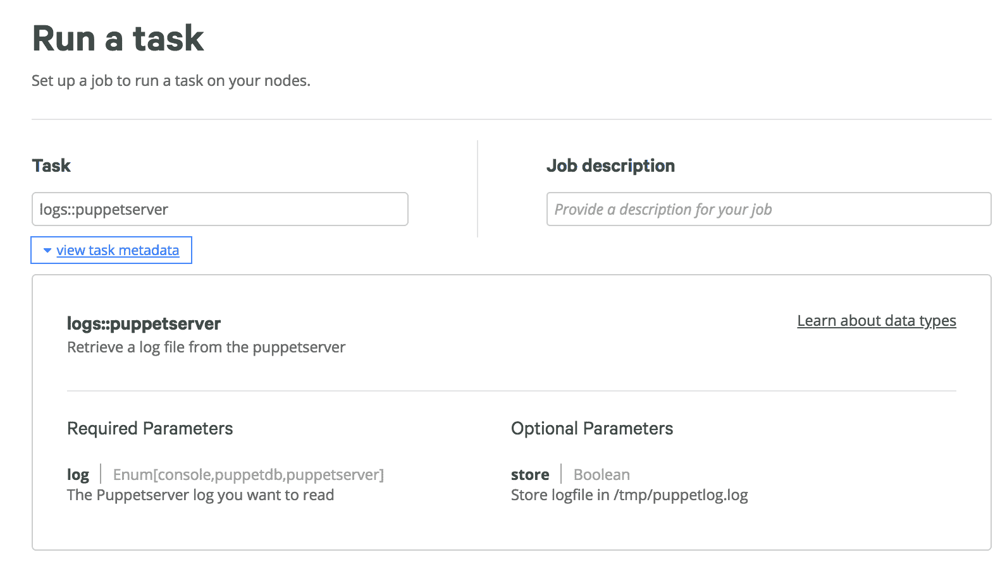
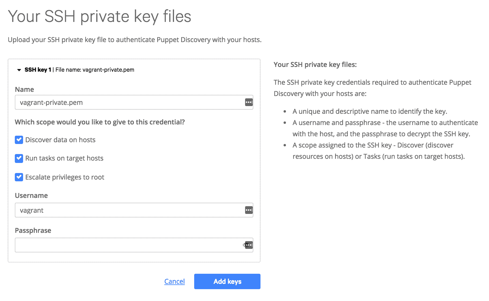

# 通过任务和发现扩展 Puppet

自从 Puppet 5 发布以来，Puppet 宣布了三项新服务：任务、发现和流水线。Puppet 任务为我们提供了一个命令式的解决方案，用于自动化临时任务。Puppet 发现使我们能够发现基础设施的状态。Puppet 流水线将在下一章简要讨论，涵盖应用程序级别的 CI/CD。

在本章中，我们将研究并使用 Puppet 任务来帮助管理 Web 服务器。我们将介绍一些最佳实践，并探讨使用 Puppet 任务的合适时机。接下来，我们将深入了解 Puppet 发现并检查我们的基础设施。我们将使用 Puppet 发现来做出智能决策，决定在基础设施中自动化哪些内容。

# Puppet 任务

Puppet 旨在在基础设施中的节点上持续执行最终状态的强制执行。虽然 Puppet 可以涵盖大多数基础设施任务，但有些任务最好留给临时任务来处理。Puppet 任务是可以在节点和容器上按需运行的操作。你可以像编写脚本一样编写任务，并且它们可以用目标节点上任何可用的语言编写。在选择任务还是 Puppet 清单时，我有一个简单的思考过程：这是我希望永久存在的东西，还是一个单次执行的操作？

让我们考虑一些在正常工作场所中是永久性或状态性的事物。我工作地点的物理地址、建筑物、房间和家具是我希望永久强制执行的物理事物的例子。像每周会议或每日站会也应该是持续强制执行的内容，作为业务规则。所有这些事物都有组成部分，从砖瓦到每周站会的时间和地点。如果我们能用 IT 工具管理现实世界，Puppet 将是描述我们办公室和业务规则的完美工具，这些规则预计会保持不变。

在同样的背景下，一次临时会议或下班后的活动由一系列任务组成，这些任务只执行一次，但每次大多数情况下都以相同的方式执行（带有变量）。如果客户订购某些东西，我们会使用任务来交付请求。如果请求是定制的，我们将使用一系列任务来构建整个复合体。这些是我们一贯做的事情，但会有变化，并且发生在不确定的时间点。一个外部事件或人推动了这项工作的创建，但我们尝试通过自动化的方式来重复这些操作，以节省时间并提高一致性。

任务和 Puppet 在管理上的主要区别在于命令式和声明式模型。在本节中，我们将设置 Bolt（驱动任务的技术），使用 Puppet 构建一个 Web 服务器，然后通过 Bolt 根据需求部署我们的网站。

# Bolt

Bolt 是 Puppet 任务的主要驱动程序，它是一个用 Ruby 编写的开源项目，用于通过 SSH 和 WinRM 远程执行任何语言的脚本。你可以用任何受目标主机支持的语言编写任务，例如在 Windows 和 Linux 上使用 PowerShell 和 Bash，或者如果有解释器的话，可以使用 Ruby 和 Python。Bolt 被设计为一个无代理的系统，通过标准协议分发脚本并执行远程命令，使用 SSH 公钥加密或用户名和密码。此外，还有一个内置的命令行工具，用于通过 PuppetDB 查询构建库存文件。Bolt 还支持任务计划，打包在 forge 模块中，将多个任务连接在一起，提供更复杂的任务。

# 安装 Bolt

可以通过多种方法安装 Bolt，所有方法的描述都可以在[`puppet.com/docs/bolt/0.x/bolt_installing.html`](https://puppet.com/docs/bolt/0.x/bolt_installing.html)中找到：

+   从[`downloads.puppet.com/`](http://downloads.puppet.com/)下载的软件包

+   一个公共的 Chocolatey 软件包

+   OSX Homebrew 安装

+   Linux 本地软件包仓库

+   Rubygems

Bolt 通过标准连接协议远程工作。尝试在本课中将其安装并在工作站上使用，而不是在 Puppet Master 上使用。

在我的 MacBook 上，我将使用 Homebrew 安装 Bolt：

```
rary at Ryans-MacBook-Pro in ~/workspace/packt
$ brew cask install puppetlabs/puppet/puppet-bolt
==> Tapping puppetlabs/puppet
Cloning into '/usr/local/Homebrew/Library/Taps/puppetlabs/homebrew-puppet'...
remote: Counting objects: 15, done.
remote: Compressing objects: 100% (14/14), done.
remote: Total 15 (delta 1), reused 8 (delta 1), pack-reused 0
Unpacking objects: 100% (15/15), done.
Tapped 3 casks (49 files, 54.9KB).
==> Satisfying dependencies
==> Downloading https://downloads.puppet.com/mac/puppet5/10.13/x86_64/puppet-bolt-0.22.0-1.osx10.13.dmg
######################################################################## 100.0%
==> Verifying SHA-256 checksum for Cask 'puppet-bolt'.
==> Installing Cask puppet-bolt
==> Running installer for puppet-bolt; your password may be necessary.
==> Package installers may write to any location; options such as --appdir are ignored.
Password:
installer: Package name is puppet-bolt
installer: Installing at base path /
installer: The install was successful.
puppet-bolt was successfully installed!
```

然后，我会关闭我的终端，重新打开并验证`bolt`命令是否在我的路径中：

```
$ bolt
Usage: bolt <subcommand> <action> [options]

Available subcommands:
 bolt command run <command> Run a command remotely
 bolt file upload <src> <dest> Upload a local file
 bolt script run <script> Upload a local script and run it remotely
 bolt task show Show list of available tasks
 bolt task show <task> Show documentation for task
 bolt task run <task> [params] Run a Puppet task
 bolt plan show Show list of available plans
 bolt plan show <plan> Show details for plan
 bolt plan run <plan> [params] Run a Puppet task plan
 bolt puppetfile install Install modules from a Puppetfile into a Boltdir

Run `bolt <subcommand> --help` to view specific examples.
```

# 管理节点

在 Bolt 中，我们必须明确列出要管理的节点。我们可以通过`--nodes`命令标志来实现，或者提供一个库存文件。库存文件是一个包含节点组和已经设置好的配置选项的 YAML 文件。默认情况下，Bolt 会使用放在`~/.puppetlabs/bolt/inventory.yaml`的`inventory`文件。在这一部分中，我们将只针对 Puppet Master，因此我会确保它出现在`inventory`文件中：

```
# ~/.puppetlabs/bolt/inventory.yaml
---
groups:
 - name: puppetserver
 nodes:
 - pe-puppet-master.puppet.net
 config:
 transport: ssh
 ssh:
 user: root
```

在我可以将 Bolt 运行到服务器之前，我需要确保我的 SSH 密钥作为 root 用户在该系统上可用。我将使用`ssh-copy-id`工具将其从我的 UNIX 系统传输到 root 用户：

```
rary at Ryans-MacBook in ~/workspace/packt
$ ssh-copy-id root@pe-puppet-master.puppet.net

/usr/bin/ssh-copy-id: INFO: attempting to log in with the new key(s), to filter out any that are already installed
/usr/bin/ssh-copy-id: INFO: 1 key(s) remain to be installed -- if you are prompted now it is to install the new keys
root@pe-puppet-master.puppet.net's password:

Number of key(s) added: 1

Now try logging into the machine, with: "ssh 'root@pe-puppet-master.puppet.net'"
and check to make sure that only the key(s) you wanted were added.
```

# 临时命令

在 Puppet Bolt 的核心功能中，我们执行远程命令、发送脚本并运行脚本。Bolt 提供了三个简单的命令来实现这一点：`bolt command run`、`bolt file upload`和`bolt script run`。为了测试我们之前的 SSH 密钥，让我们使用`bolt command run`运行一个简单的命令：

```
rary at Ryans-MacBook-Pro-3 in ~/workspace/packt/bolt
$ bolt command run "echo 'Hello World'" --nodes puppetserver --no-host-key-check
Started on puppetserver.puppet.net...
Finished on puppetserver.puppet.net:
 STDOUT:
 Hello World
Successful on 1 node: pe-puppet-master.puppet.net
Ran on 1 node in 0.40 seconds
```

对于简单的临时任务，运行`bolt`命令是检查系统的好方法。当我们需要发送更多的指令时，我们就需要编写脚本并远程运行它。这里是一个简单的脚本，返回用户和所有开放端口：

```
#./inspect.sh

#!/bin/bash

echo 'Users:'
cat /etc/passwd | cut -f 1 -d ':'
echo 'Ports:'
netstat -tulpn
```

当我们通过`bolt script run`运行这个脚本时，我们会看到如下输出：

```
$ bolt script run inspect.sh --nodes puppetserver --no-host-key-check
Started on puppetserver.puppet.net...
Finished on puppetserver.puppet.net:
 STDOUT:
 Users:
 root
 ...
 vboxadd
 vagrant
 Ports:
 Active Internet connections (only servers)
 Proto Recv-Q Send-Q Local Address Foreign Address State PID/Program name
 tcp 0 0 0.0.0.0:22 0.0.0.0:* LISTEN 1258/sshd
 ...
Successful on 1 node: puppetserver.puppet.net
Ran on 1 node in 0.85 seconds
```

最后，如果我想将这个脚本提供给 Puppet 服务器上的本地用户，我可以通过`bolt script upload`将其发送过去：

```
rary at Ryans-MacBook in ~/workspace/packt/bolt
$ bolt file upload inspect.sh /tmp/inspect.sh --nodes puppetserver --no-host-key-check
Started on puppetserver.puppet.net...
Finished on puppetserver.puppet.net:
 Uploaded 'inspect.sh' to 'puppetserver.puppet.net:/tmp/inspect.sh'
Successful on 1 node: puppetserver.puppet.net
Ran on 1 node in 0.66 seconds
```

# Bolt 任务

Bolt 任务允许我们编写并扩展脚本，加入额外的元数据参数。这些参数可以通过环境变量、PowerShell 命名参数或在更复杂的情况下作为 JSON 输入提供。Bolt 任务类似于 Puppet 中的资源，允许我们参数化某个操作，并以可重复的方式使用该命令。我们将编写一个简单的任务，允许我们通过名称检查 Puppet Master 上的特定日志文件。这个任务将是名为 `puppetserver` 的日志模块的一部分。

# task.json

这个 JSON 参数文件是任务的可选组件，允许将参数作为环境变量传递给我们的脚本。我们也可以使用这个文件限制用户输入，如果需要，可以仅提供少数几个选项。在下面的示例中，我们的脚本将接受一个日志并存储该参数。日志参数将只允许三种选择，用于确定用户要查找的日志文件位置。store 参数默认关闭，但将允许我们聚合日志，用于我们将在下一节中构建的计划：

```
#logs/tasks/puppetserver.json
{
  "puppet_task_version": 1,
  "supports_noop": false,
  "description": "Retrieve a log file from the puppetserver",
  "parameters": {
    "log": {
      "description": "The Puppetserver log you want to read",
      "type": "Enum[console,puppetdb,puppetserver]"
    },
    "store": {
      "description": "Store logfile in /tmp/puppetlog.log",
      "type": "Optional[Boolean]"
    }
  }
}
```

参数使用与 Puppet 相同的数据类型。你可以使用 Puppet 支持的任何数据类型作为 Puppet 任务的数据类型。

# 任务

我们的任务将是一个简单的 shell 脚本，基于我们的输入参数读取一个指定的文件，决定是否存储输出，然后将输出以 JSON 格式返回给 Bolt。返回为 JSON 格式非常重要，这样它才能被 Bolt 接收。在更复杂的用例中，我们甚至可以使用这个 JSON 将键值对传递给计划中的后续任务，这部分将在下一节中讲解。

任务可以用系统支持的任何语言编写。这个示例将使用 Bash，因为几乎每个管理员都使用过它。如果你还没有尝试过用 Python、Ruby、Golang 或任何其他脚本语言（除了 shell）写脚本，试试看。这些任务在更高级的语言中实际上更容易编写。

在我们的 shell 脚本中有几个需要注意的事项：

+   从我们的 JSON 参数文件返回的值会成为环境变量，并以 `PT_` 开头。我们的脚本通过 `$PT_log` 和 `$PT_store` 来检查通过命令行传递的值。

+   我们使用了一个 case 语句将 `$PT_log` 映射到一个日志文件。这种用法类似于 Puppet 中的选择语句。

+   如果 `$PT_store` 为真，我们将生成一个可以追加的日志文件。

+   最后一行的日志以 JSON 格式打印出来，以便 Puppet Tasks 知道它是一个有效的命令行输出：

```
# logs/tasks/puppetserver.sh
#!/bin/sh

# Map $PT_log to a $logfile variable
case "$PT_log" in
 'console') logfile='/var/log/puppetlabs/console-services/console-services.log' ;;
 'puppetdb') logfile='/var/log/puppetlabs/puppetdb/puppetdb.log' ;;
 'puppetserver') logfile='/var/log/puppetlabs/puppetserver/puppetserver.log' ;;
esac

# Variable that stores all the text from inside the logfile
log=`cat $logfile`

# If store is true, build a header and then print out $log
if [ $PT_store == 'true' ]
then
 echo "${PT_log}\r============" >> /tmp/puppetlog.log
 echo $log >> /tmp/puppetlog.log
fi

# print out the key value of "<chosen log>":"all log contents" in JSON to be
# read by the Bolt interpreter
echo -e "{'${PT_log}':'$log'}"
```

在运行命令之前，让我们再检查一下我们写的文件是否在正确的位置：

```
logs
├── files
├── manifests
├── tasks
│   ├── puppetserver.json
│   └── puppetserver.sh
└── templates
```

然后我们可以在命令行上运行我们的命令。我们添加了一些有助于执行的参数：

+   `nodes`：这决定了基于我们的清单文件，在哪些节点上执行任务。

+   `modulepath`：查找模块的路径。由于我们直接在这个模块上工作，因此我们将 `modulepath` 设置为模块上级目录。

+   `--no-host-key-check`：你可能不需要这个标志，但为了简化本节中 SSH 故障排除的过程，我们将使用这个标志。

+   `log=puppetdb`：这是我们在 JSON 文件中写入的参数。它将被转换为 `$PT_log` 并用于我们的 shell 脚本：

```
$ bolt task run logs::puppetserver --nodes puppetserver --modulepath .. log=puppetdb --no-host-key-check

Started on pe-puppet-master.puppet.net...
Finished on pe-puppet-master.puppet.net:
 {'puppetdb':'2018-09-23T00:20:55.115Z INFO [p.p.command] [8-1537662054876] [212 ms] 'replace facts' command processed for pe-puppet-master
 2018-09-23T00:21:12.077Z INFO [p.p.command] [9-1537662071679] [370 ms] 'store report' puppet v5.5.2 command processed for pe-puppet-master
 2018-09-23T00:21:53.936Z INFO [p.p.c.services] Starting sweep of stale nodes (threshold: 7 days)
 ...'}
 {
 }
Successful on 1 node: pe-puppet-master.puppet.net
Ran on 1 node in 0.89 seconds
```

尝试自己运行这个命令。它会为每个命令返回不同的日志文件，如果你传递 `store=true`，它甚至会开始将这个日志附加到 `/tmp` 中名为 `puppetlog.log` 的文件里。

# Bolt 计划

如果 Puppet 任务是我们的命令资源，那么 Puppet 计划就是我们的 Puppet 清单。在这里，我们结合多个任务和命令来形成一个协调的计划。这些计划采用与 Puppet 代码相同的 DSL 编写，尽管在写这本书时，只能使用 puppet 函数，而且没有包含像资源或类这样的对象。

在我们的示例计划中，我们将引入两个参数：

+   `$enterprise`：这个参数用于确定是否在计划中检查 `pe-console-services`（也可以使用目标或 PuppetDB 中的 facts）。

+   `$servers`：这是一个服务器列表，作为一个以逗号分隔的列表传递。

我们的任务将清理现有的日志并生成一组新的日志。这个脚本会为每个部分运行我们在上一节中构建的日志抓取任务，并将所有日志聚合在一起。Enterprise 作为一个可选标志，将决定是否也包含 `pe-console-services.log`。在我们构建完日志之后，我们将简单地读取日志文件，并确保它通过 `return` 函数返回到命令行。最后，我们会清理我们自己，并清理我们刚刚在 `/tmp` 中生成的聚合日志：

```
# logs/plans/puppetserver.pp
plan logs::puppetserver (
  Boolean $enterprise,
  TargetSpec $servers,
) {

  run_command('rm -f /tmp/puppetlog.log', $servers)
  run_task('logs::puppetserver', $servers, log => 'puppetserver', store => true)
  run_task('logs::puppetserver', $servers, log => 'puppetdb', store => true)

  if $enterprise == true {
    run_task('logs::puppetserver', $servers, log => 'console', store => true)
  }

  return run_command('cat /tmp/puppetlog.log', $servers)
  run_command('rm -f /tmp/puppetlog.log', $servers)

}
```

一旦我们构建好计划，就可以运行 `bolt plan run`，并传入我们的 `modulepath` 和参数：

```
rary at Ryans-MacBook-Pro-3 in ~/workspace/packt/logs
$ bolt plan run logs::puppetserver --modulepath .. --no-host-key-check enterprise=false servers=root@pe-puppet-master
Starting: plan logs::puppetserver
Starting: command 'rm -f /tmp/puppetlog.log' on root@pe-puppet-master
Finished: command 'rm -f /tmp/puppetlog.log' with 0 failures in 0.38 sec
Starting: task logs::puppetserver on root@pe-puppet-master
Finished: task logs::puppetserver with 0 failures in 0.39 sec
Starting: task logs::puppetserver on root@pe-puppet-master
Finished: task logs::puppetserver with 0 failures in 0.45 sec
Starting: command 'cat /tmp/puppetlog.log' on root@pe-puppet-master
Finished: command 'cat /tmp/puppetlog.log' with 0 failures in 0.15 sec
Finished: plan logs::puppetserver in 1.39 sec
[
 {
 "node": "root@pe-puppet-master",
 "status": "success",
 "result": {
 "stdout": "puppetserver\n============\n2018-09-23T00:20:54.905Z INFO [qtp417202273-69] [puppetserver] Puppet 'replace_facts' command for pe-puppet-master submitted to PuppetDB with UUID fc691079-debf-4c99-896b-3244f353a753\n2018-09-23T00:20:55.268Z ERROR [qtp417202273-69] [puppetserver] Puppet Could not find node statement with name 'default' or 'pe-puppet-master' on node pe-puppet-master\n ...",
 "stderr": "",
 "exit_code": 0
 }
 }
]
```

你可能会注意到日志以一个大的 JSON 对象的形式返回，且没有显示行间断。如果你想查看这个聚合的日志文件，可以尝试运行以下命令并检查新的 `puppetlog.log` 文件：

```
$ rm -f *.log;bolt plan run logs::puppetserver --modulepath .. --no-host-key-check enterprise=false servers=root@pe-puppet-master > compressed.log; head -n 6 compressed.log | tail -n 1 | awk '{gsub("\\\\n","\n")};1' > puppetlog.log
```

# Puppet Enterprise 任务管理

Bolt 是一个功能齐全的开源产品。它在你的环境中运行良好，并不需要 Puppet Enterprise。话虽如此，Puppet Enterprise 的控制台与 Bolt 非常契合。在控制台的左侧有一个任务页面，点击后将带你进入主要的任务页面。一旦进入，你将看到“运行任务”页面，如果你在组织内共享任务，这些页面会为你提供一些便利的功能。

本节仅对 Puppet Enterprise 用户相关。此模块需要通过 r10k 或手动放置到 `/etc/puppetlabs/code/environments/production/modules` 目录下，才能被 Puppet Enterprise 控制台读取。

第一个主要特性是能够在运行任务之前直接查看支持的 JSON 参数文件。请注意，当我们添加`logs::puppetserver`时，描述和可选参数会在任务中呈现，这样能方便其他用户查看文档：



每个参数也以下拉菜单的形式呈现。由于我们在`puppetserver.json`中选择了 Enum[console,puppetdb,puppetserver] 作为我们的类型，因此在控制台中，用户只能选择这些选项。Store 也仅是一个真假值的下拉选项，这要归功于我们的布尔选择：


一旦我们运行任务，我们将得到一个清理过的日志版本，如果您所在的组织较大，您可以将该任务加入库存，并允许管理员远程查看日志文件，而无需登录到服务器或管理代码：


这个任务本意是一个简单的示例。对于复杂的任务和计划，您可以在基础设施中使用 SSH 或 WinRM 自动化执行任何类型的操作，且支持任何语言。我们的任务具有导入和导出 JSON 变量的能力，这使得我们能够在任务之间构建更复杂的依赖关系。Puppet Tasks 对 Puppet 生态系统来说仍然相对较新，但它是一个有前景的新功能，允许在组织内部快速共享管理自动化任务。

# Puppet Discovery

Puppet Discovery 是 Puppet 推出的新产品。Puppet Discovery 是一个独立的容器化应用程序，旨在实时发现关于容器和虚拟机的信息。该平台的设计目标是拥有所有 IT 资源的库存，发现每个资源的详细信息，并对这些机器采取行动。尽管仍处于开发初期阶段，但我预计 Discovery、Puppet Tasks 以及更广泛的 Puppet 生态系统之间会有更紧密的集成。

Puppet Discovery 一般是安全的，可以用于检查生产级别的系统。Puppet Discovery 会对所有来源进行主动扫描，可能会在您的组织中触发安全警告。如果您决定在公司资源上使用 Puppet Discovery，请确保与安全团队协调。

在本节中，我们将安装 Puppet Discovery，并查看我们可以使用的功能。我们将首先安装系统，然后添加我们基础设施机器的 IP CIDR 块，接着使用凭据连接到机器。然后，我们将探索 Puppet Discovery，查看我们基础设施中各个节点和包的详细信息。

如果没有提前通知安全团队，这可能会在生产环境中触发安全警报。

# 安装 Puppet Discovery

Puppet Discovery 不是**自由开源软件**（**FOSS**）。我们需要从 Puppet 获得一个许可证，可以在[licenses.puppet.com](http://licenses.puppet.com/)获取。选择一个可用的 Puppet Discovery 许可证以开始使用，然后将其下载到你运行 Puppet Discovery 的目标机器上。此 JSON 文件将在 Puppet Discovery 应用程序的安装过程中使用。

你需要在机器上安装 Docker。为了安装 Puppet Discovery，主机上必须安装 Docker。

# 准备 Puppet Discovery

在[`puppet.com/download-puppet-discovery`](https://puppet.com/download-puppet-discovery)下载适用于你的操作系统的 Puppet Discovery。本节将帮助我们将二进制文件放入路径中，并首次设置 Puppet Discovery。

下载 Puppet Discovery 后，我们需要将二进制文件移动到路径中。在大多数基于 Unix 的操作系统中，`/usr/local/bin` 已经包含在路径中。我们需要将二进制文件放入路径，确保它可执行，并确保我们可以作为本地用户运行它：

如果 `/usr/local/bin` 不在你的路径中，你可以使用 `echo $PATH` 查看系统路径中包含的目录。返回的结果将是以冒号分隔的目录列表。

```
rary at Ryans-MacBook-Pro in ~/workspace
$ mv ~/Downloads/puppet-discovery /usr/local/bin

rary at Ryans-MacBook-Pro in ~/workspace
$ chmod a+x /usr/local/bin/puppet-discovery

rary at Ryans-MacBook-Pro in ~/workspace
$ puppet-discovery
A discovery application for cloud-native infrastructure

 Find more information at https://puppet.com/products/puppet-discovery

Usage:
 puppet-discovery [command]

...
```

一旦验证二进制文件工作正常，我们将运行 `puppet-discovery start` 启动服务。系统会提示我们提供许可证密钥，阅读最终用户许可协议（该协议将在浏览器中弹出）并生成管理员密码：

```
rary at Ryans-MacBook-Pro in ~
$ puppet-discovery start
Please enter the path to your Puppet Discovery license: Documents/License-puppet-discovery-trial-2018-10-23.puppet_discovery.json

By continuing with installation, you agree to terms outlined in the Puppet Discovery End User License Agreement located here: /Users/rary/.puppet-discovery/data/puppet-discovery-eula-1537730629.html

Do you agree? [y/n]: y

*************************************************************************
* NOTE: If you forget your password you lose all of your discovery data *
*************************************************************************

Password requirements:
* Password must have at least 6 characters
* Password must use at least 3 of the 4 character types: lowercase letters, uppercase letters, numbers, symbols
* Password cannot be the same as current password

Please create an admin password: **************
Verify by entering the same password again: **************

Puppet Discovery: started 15s [====================================================================] 100%
Puppet Discovery: pulled [8/8] 1m3s [====================================================================] 100%
Opening Puppet Discovery at https://localhost:8443 ...
```

一旦完成此步骤，Puppet Discovery 将在目标机器上的 `8443` 端口以 Docker 容器的形式运行。

在撰写本书时，许可证提示使用的是相对路径，而不是绝对路径，因此确保你从能够找到该 JSON 文件的位置运行此命令。

# 管理源

我们初次登录时，除非提供了目标机器的基本列表和凭证，否则不会进入欢迎界面。Puppet Discovery 能够连接到整个 Amazon Web Services、Google Compute Platform、Microsoft Azure 或 VMWare VSphere 帐户，并执行可用资源的自动发现。如果没有可用的 API 驱动平台，我们也可以提供一个直接的 IP 地址列表。

在本节中，我们将向 Discovery 添加一个 CIDR 地址块，该地址块将对所有用户可用，无论平台和虚拟化技术如何。

# 通过 IP 地址添加源

如果你使用云服务提供商进行测试，可以直接使用云提供商的服务。此节的其余部分将不依赖于我们连接到机器的具体方法。

在本书编写期间，我的 Puppet 基础设施中创建了多个节点，以便我们能够检查它们。我使用的是 Vagrant 和 VirtualBox 作为平台，并且我将使用我的本地网络 `10.20.1.0/24` 来发现我所有的 Puppet 基础设施。在选择你将用来演示这一部分的 IP 地址时，确保你安装了 Docker 的机器能够在提供的网络上找到节点：


# 管理凭证

在我们第一次列出要发现的节点后，Puppet Discovery 会自动带我们进入一个欢迎页面，让我们选择一个身份验证方法。在编写本书时，有三种方法可用：SSH 私钥、SSH 凭证和 WinRM 凭证。SSH 私钥通常是最安全的方法，但如果远程系统上没有 SSH 密钥，则可以通过 SSH 凭证（用于 Linux）或 WinRM 凭证（用于 Windows）输入用户名和密码。

在这一部分，我们将使用 SSH 密钥提供与我们在前一步中发现的机器的连接。

# SSH 密钥文件

如果你在测试中使用 vagrant，而不是云服务提供商，我只是使用 vagrant 提供的默认不安全密钥。这个密钥可以在[`github.com/hashicorp/vagrant/tree/master/keys`](https://github.com/hashicorp/vagrant/tree/master/keys)找到。

在添加凭证时，我们也在限定凭证的作用范围。在 SSH 私钥凭证中，你需要从本地硬盘选择你希望使用的 PEM 文件。我们有三种可用的 RBAC 选项：

+   **在主机上发现数据**：这个密钥是否应该用于发现信息？

+   **在目标主机上运行任务**：这个密钥是否应该能够运行和执行任务？

+   **提升权限至 root**：这个用户是否应该成为发现和任务的 root 用户？

最后，我们有一个用户名和密码短语。我们的用户名是我们希望连接到远程机器的用户。由于我的机器都是在 vagrant 上，我也会使用 vagrant 作为我连接的用户。密码短语用于解密 SSH 密钥，如果你的密钥没有密码短语，就像我的一样，则可以选择不使用：



一旦我们设置了第一组主机和凭证，我们就可以开始使用 Puppet Discovery。

# 正在发现

Puppet Discovery 可能需要一些时间来收集你基础设施的所有信息。此外，浏览器缓存可能会导致发现后该页面无法显示数据。你可能需要等待并清除缓存，然后才能在仪表盘上看到数据填充。

我们的欢迎页面现在显示了所有主机、软件包和容器，这些可以在我们提供的所有来源和所有输入的身份验证方法下找到。这个仪表盘是交互式的，点击任意框将带你进入一个视图，展示所有代表仪表盘上信息的节点：


如果你对发现这些节点的过程感兴趣，你可以点击发现页面左上角的“历史事件”图标，查看发现日志。

# 查看发现结果

在我的原始示例中，我提供了 `10.20.1.0/24` 的 CIDR 块进行扫描。Puppet Discovery 使用我提供的凭据尝试连接整个 IP 范围，并返回了我的所有节点。你可能已经注意到我有一个失败的节点，实际上它是我的网关，不能使用我的凭据登录：


# 发现主机

返回仪表板后，我们可以选择“主机”来查看所有主机的列表，而不限定具体信息。我们将看到关于这些主机的基本信息，包括操作系统和机器本身的运行时间：


如果我们选择任何单个节点的超链接，我们将获得一个更有用的对象列表，可以帮助我们获得每个主机的详细信息。每个标签页将向我们展示不同的信息：

+   **属性**：Puppet Discovery 本身使用的主要属性，包括主机名、DNS 名称和操作系统详细信息

+   **服务**：节点上的所有服务及其当前状态（运行中，已停止）

+   **用户**：系统上的所有用户及其主目录

+   **组**：系统上所有可用的组

+   **软件包**：系统上的每个软件包、它们的版本以及安装它们所使用的方法

+   **标签**：云提供商列出的任何标签

+   **容器**：主机系统上运行的所有容器

# 发现软件包

我们可以在 Puppet Discovery 中整体查看软件包。当你从仪表板选择软件包时，将会跳转到一个页面，列出所有软件包、它们的版本、包管理器，以及最重要的，它们运行的实例数量。我们可以利用这些信息查看软件是否已经在我们的基础设施中广泛安装，或者跟踪基础设施中的版本变化。这些信息在安全修复中尤其有用，特别是在尝试确定基础设施中存在漏洞的系统时：


# 执行动作

Puppet Discovery 还允许我们对基础设施执行一小部分操作：安装 Puppet 代理和管理服务。在未来，Puppet Discovery 可能还会包括通过基础设施联合执行任务的能力。你可以通过选择 Puppet Discovery 顶部栏中的 **Act +** 图标来访问这些操作。你将被重定向到选择任务页面：


# 安装代理

使用 Puppet Discovery 安装代理是通过基础设施安装 Puppet 代理的最简便方法之一。你现在可以提供以下参数，并将任务应用于主机列表：

+   `master`：要使用的 Puppet 主机。这是唯一的必选参数。

+   `cacert_content`：主机应返回的预期 CA 证书。

+   `certname`：代理的证书名称。

+   `environment`：节点应运行的环境。

+   `dns_alt_names`：内置在代理证书中的 DNS 替代名称。

+   `custom_attributes`：任何自定义的 CSR 属性。

+   `extension_request`：任何特定的扩展请求（如 `pp_role`），用于添加到证书中。

# 管理服务

Puppet Discovery 也提供了服务管理功能，并仅提供两个字段供我们使用：**操作**和**名称**。使用这两个字段可以在机器上查找服务，并启动、停止或重启节点上的任何服务。这是一种在每个节点上引入 Puppet 之前，进行基础基础设施管理的便捷无代理方式。

# Discovery 的用途

Discovery 在 Puppet 生态系统中仍然是一个相对较新的工具。它应该是安装的第一步，帮助你决定如何继续推进更大的 Puppet 基础设施部署。也就是说，Puppet Discovery 有几个关键用途：

+   确定你在环境中已经拥有的资源

+   确保目标机器正确安装了安全补丁

+   在更高层次上检查资源，而不是直接对其执行操作

# 总结

在本章中，我们介绍了 Puppet 任务和 Puppet Discovery。Bolt 和 Puppet 任务让我们能够在目标机器上执行远程临时命令。我们可以对这些临时命令进行参数化，并构建高度可共享的任务，这些任务可以在我们组织中被广泛使用。我们甚至可以将这些任务串联成 Puppet 计划，构建更复杂的操作，并在整个基础设施中共享。我们检查了 Puppet Discovery，安装了它并查看了现有的基础设施。我们学习了如何查看和部署代理，以及如何通过 Puppet Discovery 管理服务。

下一章我们将介绍 Puppet 中的虚拟资源和导出资源。
