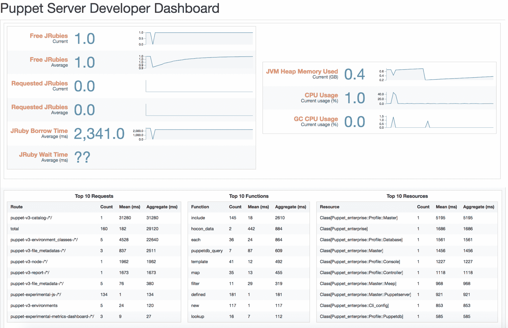
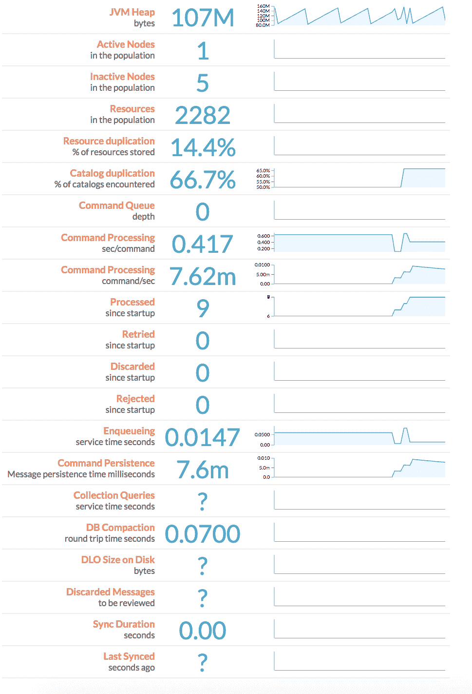
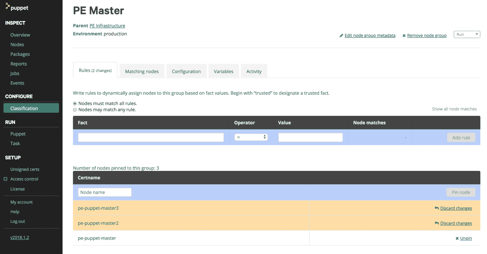
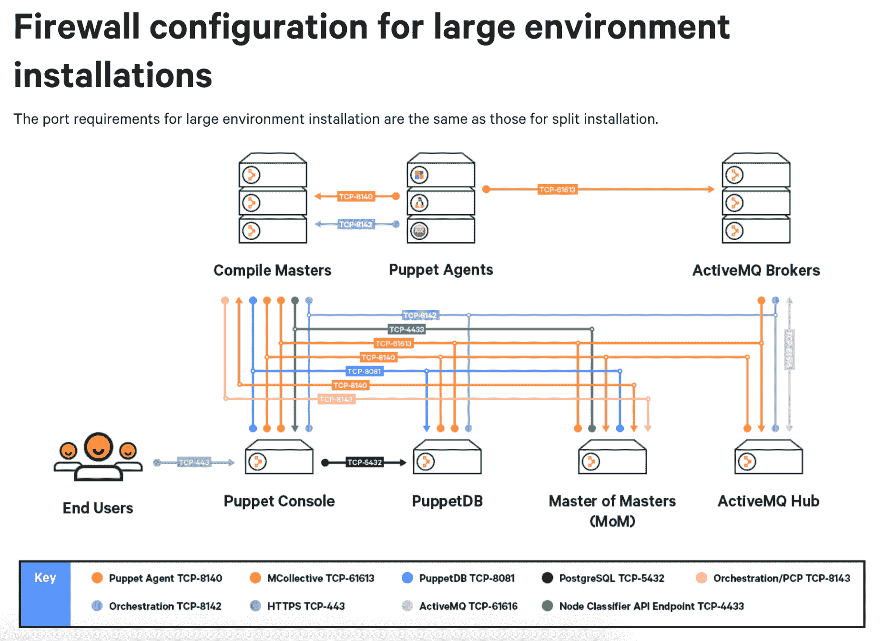

# 第十一章：扩展 Puppet

Puppet 用于集中管理组织中的所有服务器。在一些组织中，节点总数可能达到数百个。其他组织则拥有成千上万的服务器。对于较少的服务器，我们可以在一台服务器上配置单一的整体 Puppet Master（Puppetserver、PuppetDB 或 PE Console）。一旦达到一定规模，我们可以将 Puppet Enterprise 的组件导出到独立的服务器上。随着服务器规模的增大，我们可以开始逐个扩展每个组件。本章将介绍安装 Puppet Enterprise 的模型、扩展到三台服务器，并最终通过负载均衡多个 Puppet 组件来支持非常大的 Puppet 安装。

在支持较小子集的服务器时，第一阶段是优化我们在单一主节点上的设置。

本章将主要讲解如何扩展 Puppet Enterprise。开源技术也将在扩展的背景下讨论，但完整的实施方法将留给 Puppet 开源的用户自行完成。

# 检查

在我们开始扩展服务之前，首先了解如何收集和理解这些系统的指标。PuppetDB 和 Puppet Enterprise 控制台都提供了仪表板。我们可以使用这些仪表板检查系统的指标并识别问题。随着环境的增长，我们希望确保 Puppet 有足够的系统资源，以确保能够编译并提供目录给代理。在 PuppetDB 和 Puppetserver 上分别提供了独立的仪表板。

# Puppetserver

Puppetserver 是 Puppet 的主要驱动程序，是开源 Puppet 中唯一必需的组件。Puppetserver 开发者仪表板用于跟踪 Puppet Master 为代理提供目录的能力。该仪表板的主要关注点是 Puppetserver 上的 JRuby。Puppetserver 中的 JRuby 只是包含在**Java 虚拟机**（**JVM**）中的小型 ruby 实例，专门用于为代理编译目录。

你可以通过以下链接访问 Puppetserver 开发者仪表板：`https://<puppetserver>:8140/puppet/experimental/dashboard.html`。

仪表板包含一些关于 Puppetserver 的实时指标，分为当前指标和平均指标：

+   **空闲 JRuby**：可用于提供 Puppet 目录的可用 JRuby 实例数量。

+   **请求的 JRuby**：代理请求的 JRuby 数量。

+   **JRuby 借用时间**：Puppetserver 为单个请求从代理方保留的时间（毫秒）。

+   **JRuby 等待时间**：代理平均需要等待 JRuby 的时间。

+   **JVM 堆内存使用量**：JVM 中包含 JRuby 的系统内存使用量。

+   **CPU 使用率**：Puppetserver 所使用的 CPU。

+   **GC CPU 使用率**：Puppetserver 上**垃圾回收**（**GC**）所使用的 CPU 量。



我们可以检查这些数据，获取关于 Puppetserver 主要任务的许多信息，这些任务包括编译和提供目录。首先要查看的关键组件之一是**JRuby 等待时间**。我们的节点是否经常等待接收目录？如果我们发现等待时间增加，可能需要更多的 JRuby 来处理代理请求。这也可能表现为低平均空闲 JRuby 数量，或当前请求的 JRuby 状态较高。我们还可以检查**JRuby 借用时间**，以了解我们的目录有多大，以及每个节点需要多少时间与 Puppetserver 进行通信。最后，我们还可以查看一些指标，以了解是否已为 Puppetserver 分配足够的内存和 CPU。

我们还可以获取一些关于 API 使用的有用数据，例如**前 10 个请求**，让我们了解在我们的基础设施中最常用的 API。**前 10 个功能**有助于识别在主服务器上最常使用的 Puppet 功能，而我们的**前 10 个资源**则可以帮助我们了解在环境中最常用的代码。

# PuppetDB 仪表盘

PuppetDB 拥有自己的仪表盘，旨在展示服务器的运行情况。它主要用于帮助理解 PuppetDB 存储的数据。它涵盖了一些性能指标，如 JVM 堆，还能快速展示活动和非活动节点的数量。以下是 PuppetDB 提供的信息：

+   **JVM 堆**：数据库的总内存堆大小

+   **活动和非活动节点**：PuppetDB 中包含信息的节点

+   **资源**：PuppetDB 中看到的总资源数

+   **资源重复**：PuppetDB 可以提供的重复资源总数（数量越高越好）

+   **目录重复**：PuppetDB 可以提供的重复目录总数（数量越高越好）

+   **命令队列**：等待执行的命令数量

+   **命令处理**：执行命令时与数据库交互的耗时

+   **已处理**：自启动以来已处理的查询数量

+   **重试**：需要多次执行的查询数量

+   **丢弃**：没有返回值的查询数量

+   **拒绝**：被拒绝的查询数量

+   **排队**：等待写入数据库的平均时间

+   **命令持久化**：将数据从内存移动到磁盘所需的时间

+   **集合查询**：集合查询服务时间（秒）

+   **数据库压缩**：数据库压缩的往返时间

+   **磁盘上的 DLO 大小**：磁盘上动态大对象的大小

+   **丢弃的消息**：未进入 PuppetDB 的消息

+   **同步时长**：同步数据到数据库之间所需的时间

+   **最后同步**：自上次数据库同步以来的秒数

默认情况下，PuppetDB 在端口 `8080` 上运行 PuppetDB 仪表盘，但将此限制为本地主机。我们可以通过将 Web 端口转发到工作站，在本地访问它。命令 `ssh -L 8080:localhost:8080 <user>@<puppetdb-server>` 将允许你在运行该命令的同一工作站上访问 PuppetDB 仪表盘，地址为 `http://localhost:8080`。



我们可以使用这些信息检查 PuppetDB 服务器的状态。我们希望看到高资源重复和目录重复，这能加速使用 PuppetDB 运行 Puppet 的整体速度。我们的 JVM 堆内存可以告诉我们内存使用情况。活动和非活动节点帮助我们了解存储在 PuppetDB 中的内容，以及即将被淘汰的内容。其他大多数数据是围绕数据库本身的指标，帮助我们了解 PostgreSQL 服务器的健康状况。一旦我们了解一些简单的实时指标，就可以开始着手调整环境。

# 调优

在进行服务的横向扩展之前，我们应该先优化现有的工作负载。最好的横向扩展是你根本不需要做的扩展。不要在你还可以用单个大型单体实例支持工作负载时就构建更多的 Puppet 组件节点。为 Puppet 添加更多资源可以让它服务更多的代理。对于一个单体 Puppet 主节点能够服务多少代理没有硬性规定，即使有额外的编译主节点也是如此。每个组织的 Puppet 目录大小都不同，这也是大多数组织的主要不确定变量。

如果你只需要一些简单的设置来入门，Puppet 为小型单体主节点以及带有附加编译主节点的单体主节点提供了标准的推荐设置，详情请见：[`puppet.com/docs/pe/latest/tuning_monolithic.html`](https://puppet.com/docs/pe/latest/tuning_monolithic.html)。

# Puppetserver 调优

Puppetserver 为每个代理生成目录，使用存放在我们环境中的代码并通过 JRuby 提供服务。我们将配置 JVM 并在企业版和开源版本的 Puppet 中实施我们的更改。

Puppetserver 在我们基础设施中的主要工作是处理代理请求并返回目录。在 Puppet 的旧版本中，常用 RubyGem Passenger 来并发处理多个代理的请求。今天，Puppet 在 Puppetserver 上运行多个 JRuby 实例来处理并发请求。虽然 Ruby 本身是使用操作系统的本地编译器运行的，但 JRuby 在一个独立的 JVM 实例中运行 Ruby。这些 JRuby 实例可以提供更好的扩展性，支持 Puppet 的多个并发和线程安全的运行。每个 JRuby 每次只能服务一个代理，Puppet 会将代理排队，直到有 JRuby 可用。

每个 JVM（包含 JRuby 实例）都有最小和最大堆大小。最大堆大小确定 JVM 在垃圾收集开始前可以消耗多少内存。垃圾收集只是从最旧的数据到最新的数据开始清除内存的过程。最小堆大小确保新的 JVM 分配足够的内存来运行应用程序。如果 JRuby 无法为 Puppet 实例分配足够的内存，将触发 `OutOfMemory` 错误并关闭 Puppetserver。通常我们将我们的 Java 最大堆大小（有时称为 -Xmx）和最小堆大小（-Xms）设置为相同的值，以便新的 JRuby 以所需的内存启动。我们还可以使用 `max-active-instances` 设置最大 JRuby 实例数。Puppet 通常建议此数字接近 Puppetserver 可用的 CPU 数量。

# Puppet Enterprise 实现

在 Puppet Enterprise 中，我们可以通过 Hiera 中的以下设置配置我们的 Java 设置：

```
puppet_enterprise::profile::master::java_args:
  Xmx: 512m
  Xms: 512m
```

# 开源实现

在开源中，我们需要使用自己的模块来管理我们的设置。幸运的是，`camptocamp/puppetserver` 提供了我们所需的一切！我们可以使用此模块创建适用于我们 Puppetserver 的配置文件：

```
class profile::puppetserver {

  class { 'puppetserver':
    config => {
      'java_args'     => {
        'xms'         => '4g',
        'xmx'         => '6g',
        'maxpermsize' => '512m',
      },
    }
  }

}
```

在开源安装中，较大安装中每个组件所需的 ulimits 可能不存在。如果您的主节点正在为大量节点提供服务且无法在 Linux 操作系统上打开更多文件，则可以按照 [`puppet.com/docs/pe/latest/config_ulimit.html`](https://puppet.com/docs/pe/latest/config_ulimit.html) 上的说明操作。

# 调整 PuppetDB

PuppetDB 安装在一个 PostgreSQL 实例上，通常可以像管理任何 PostgreSQL 服务器一样进行管理。我们有一些配置选项可以帮助调整您的 PostgreSQL PuppetDB 实例以适应您的环境：

+   停用和清除节点

+   调整最大堆大小

+   调整线程数

# 停用和清除节点

PuppetDB 保存每个节点在您的 Puppet Enterprise 安装中检查的记录。在节点经常出现和消失的环境中，例如不可变基础设施中，可能会堆积大量有关影响数据库和基础设施性能的节点数据。默认情况下，Puppet 将过期未在七天内检查的节点，并将停止从目录导出对象。此设置可以在 `puppet.conf` 的 `[database]` 部分下管理 `node-ttl` 设置。另一个设置 `node-purge-ttl` 让数据库知道何时删除节点的记录。默认情况下，Puppet Enterprise 的清除时间为 14 天。我们也可以使用 `puppet node deactivate` 和 `puppet node purge` 手动执行这些任务。

我们可以使用 `puppetlabs/inifile` 如下所示来管理默认设置：

```
# This profile will clean out nodes much more aggressively, deactivating nodes not seen for 2 days, and purging nodes not seen for 4.

class profile::puppetdb {

  ini_setting { 'Node TTL':
    ensure  => present,
    path    => '/etc/puppetlabs/puppet/puppet.conf',
    section => 'database',
    setting => 'node-ttl',
    value   => '2d',
  }

  ini_setting { 'Node Purge TTL':
    ensure  => present,
    path    => '/etc/puppetlabs/puppet/puppet.conf',
    section => 'database',
    setting => 'node-purge-ttl',
    value   => '4d',
  }

}
```

# 管理堆大小

我们的 PuppetDB 的最大堆大小将取决于节点总数，Puppet 运行的频率以及 Puppet 管理的资源量。确定堆大小需求的最简单方法是估计或使用默认值，并监视性能仪表板。如果您的数据库触发 `OutOfMemory` 异常，只需提供更大的内存分配并重新启动服务。如果 JVM 堆指标经常接近最大值，则需要使用 Java args 增加最大堆大小，由 PostgreSQL 的 init 脚本管理。PuppetDB 将从服务死亡时的队列相同点开始处理请求。在开源安装中，此文件将被命名为 `puppetdb`，在 Puppet Enterprise 安装中将被命名为 `pe-puppetdb`。在 Enterprise Linux 发行版（如 Red Hat）中，这些文件将位于 `/etc/sysconfig`。像 Ubuntu 这样的基于 Debian 的系统将把此文件放在 `/etc/default` 中。

在 Puppet Enterprise 安装中，我们可以使用以下 Hiera 值设置我们的堆大小：

```
puppet_enterprise::profile::puppetdb::java_args:
  Xms: 1024m
  Xmx: 1024m
```

在开源安装中，最好使用来自 Forge 的 `puppet/puppetdb`，我们可以简单地通过 `puppetdb` 类设置 Java args：

```
class profile::puppetdb {

  class {'puppetdb':
    java_args => {
      '-Xmx' => '1024m',
      '-Xms' => '1024m',
    },
  }

}
```

# 调整 CPU 线程

对 PuppetDB 进行 CPU 线程调整并不总是一个简单的情况，*添加更多并且它将表现更好*。PuppetDB 上的 CPU 正在使用 PostgreSQL 实例、**消息队列**（**MQ**）和 PuppetDB 提供的 Web 服务器。如果您的服务器确实有可用的 CPU 资源，请考虑添加更多 CPU 线程以一次处理更多消息。如果增加 CPU 数量到 PuppetDB 实际上降低了吞吐量，那么确保更多的 CPU 资源可供 MQ 和 Web 服务器使用。CPU 线程的设置也可以在 `puppet.conf` 的 `[command-processing]` 部分找到。

在 Puppet Enterprise 安装中，此设置将由 Hiera 管理：

```
puppet_enterprise::puppetdb::command_processing_threads: 2
```

在开源安装中，我们将再次使用 `puppetlabs/puppetdb` 来管理此设置：

```
class profile::puppetdb {

  class {'puppetdb':
    command_threads => '2',
  }

}
```

# 自动确定设置

现在我们已经看过一些设置，我们可以看一些工具，帮助我们利用我们的硬件提供一个体面的基线。首先，我们将自动调整我们的完整 Puppet Enterprise 安装，并使用 PGTune 调整我们的 PuppetDB 实例。

# Puppet Enterprise

在检查和调整系统之前，我们将找到一组基于可用硬件的推荐设置。Puppet 的 Thomas Kishel 设计了一个 Puppet Face，用于查询 PuppetDB 以获取 Puppet Enterprise 基础设施。此命令检查系统上可用的资源，并为以下 Puppet Enterprise 安装提供合理的默认设置：

+   单体基础架构

+   带有编译主服务器的单体结构

+   带有外部 PostgreSQL 的单体结构

+   带有外部 PostgreSQL 的单体结构

+   带有高可用性的单体结构

+   带有编译主服务器和高可用性的单体结构

+   分割基础架构

+   带有编译主服务器的分割结构

+   带有外部 PostgreSQL 的分割结构

+   使用外部 PostgreSQL 拆分编译主服务器

要开始使用`tkishel/pe_tune`，我们需要将 Git 仓库克隆到主服务器上的 Puppet Enterprise 中，并使`tune.rb`脚本可执行：

```
git clone https://github.com/tkishel/pe_tune.git
chmod +x ./pe_tune/lib/puppet_x/puppetlabs/tune.rb 
```

当我们克隆并使二进制文件可执行后，我们将运行`tune.rb`来获取有关系统的信息，并在 Hiera 中返回合理的 Puppet Enterprise 设置：

```
[root@pe-puppet-master ~]# ./pe_tune/lib/puppet_x/puppetlabs/tune.rb
### Puppet Infrastructure Summary: Found a Monolithic Infrastructure

## Found: 4 CPU(s) / 9839 MB RAM for Primary Master pe-puppet-master
## Specify the following optimized settings in Hiera in nodes/pe-puppet-master.yaml

---
puppet_enterprise::profile::database::shared_buffers: 3072MB
puppet_enterprise::puppetdb::command_processing_threads: 2
puppet_enterprise::master::puppetserver::jruby_max_active_instances: 2
puppet_enterprise::master::puppetserver::reserved_code_cache: 1024m
puppet_enterprise::profile::master::java_args:
 Xms: 2048m
 Xmx: 2048m
puppet_enterprise::profile::puppetdb::java_args:
 Xms: 1024m
 Xmx: 1024m
puppet_enterprise::profile::console::java_args:
 Xms: 768m
 Xmx: 768m
puppet_enterprise::profile::orchestrator::java_args:
 Xms: 768m
 Xmx: 768m

## CPU Summary: Total/Used/Free: 4/4/0 for pe-puppet-master
## RAM Summary: Total/Used/Free: 9839/8704/1135 for pe-puppet-master
## JVM Summary: Using 768 MB per Puppet Server JRuby for pe-puppet-master
```

然后，我们可以将这些值放入 Hiera 中的任何地方，Puppet Enterprise 安装可以从那里获取。我建议使用`common.yaml`，除非你有专门为 Puppet 设置而保留的 Hiera 层。

默认情况下，该脚本将在少于 4 个 CPU 或 8GB 内存的基础设施主机上无法运行。即使在小于推荐的 4 个 CPU 和 8GB 内存的节点上，你也可以使用`--force`标志来运行命令，获取结果。

# PuppetDB – 使用 PGTune 的 PostgreSQL

当不确定如何调整 PostgreSQL 服务器时，尝试使用 PGTune。该项目会读取当前的`postgresql.conf`并输出一个新的配置文件，包含为当前机器设计的调优设置。值得注意的是，这不会考虑消息队列或 Web 服务器所需的内存，因此通过稍微调低这些设置来留下少量额外资源，可以帮助提升性能。

请注意，PGTune 假设它运行的节点唯一的目的是提供 Postgres 服务器。这些设置在单一的整体主服务器上使用会比较困难，而`tkishel/pe_tune`会是配置这些服务器时更有用的工具。

我们将从克隆并进入当前的 PGTune 项目开始：

```
git clone https://github.com/gregs1104/pgtune.git
Cloning into 'pgtune'...
remote: Counting objects: 112, done.
remote: Total 112 (delta 0), reused 0 (delta 0), pack-reused 112
Receiving objects: 100% (112/112), 66.21 KiB | 0 bytes/s, done.
Resolving deltas: 100% (63/63), done.
cd pgtune
```

然后我们将对 Puppet Enterprise 的`postgresql.conf`运行 PGTune：

```
./pgtune -i /opt/puppetlabs/server/data/postgresql/9.6/data/postgresql.conf
#------------------------------------------------------------------------------
# pgtune for version 8.4 run on 2018-08-19
# Based on 3882384 KB RAM, platform Linux, 100 clients and mixed workload
#------------------------------------------------------------------------------

default_statistics_target = 100
maintenance_work_mem = 224MB
checkpoint_completion_target = 0.9
effective_cache_size = 2816MB
work_mem = 18MB
wal_buffers = 16MB
checkpoint_segments = 32
shared_buffers = 896MB
max_connections = 100
```

这些设置以手动管理`postgresql.conf`的形式返回。我们将这些值转换为 Puppet Enterprise Hiera 设置，并可以放入`common.yaml`中来驱动我们的 PuppetDB：

```
---
puppet_enterprise::profile::database::maintenance_work_mem: 224MB
puppet_enterprise::profile::database::checking_completion_target = 0.9
puppet_enterprise::profile::database::effective_cache_size: 2816MB
puppet_enterprise::profile::database::work_mem: 18MB
puppet_enterprise::profile::database::wal_buffers: 16MB
puppet_enterprise::profile::database::checkpoint_segments: 32
puppet_enterprise::profile::database::shared_buffers: 896MB

# PgTune recommends just 100 max_connections, but Puppet Enterprise 
# generally recommends a higher amount due to the number of nodes that 
# can connect to the system. I'll tune it for that purpose.
puppet_enterprise::profile::database::max_connections: 400
```

使用开源时，我们将依赖于`puppetlabs/postgresql`模块，它是`puppetlabs/puppetdb`的一个依赖。我们想要设置的每个值都是一个独立的资源，可以在 PuppetDB 级别的 Hiera 中表示。如果你在环境中有其他 PostgreSQL 服务器，建议不要将这些特定设置放在`common.yaml`中：

```
---
postgresql::server::config_entries:
  maintenance_work_mem: 224MB
  checkpoint_completion_target: 0.9
  effective_cache_size: 2816MB
  work_mem: 18MB
  wal_buffers: 16MB
  checkpoint_segments: 32
  shared_buffers: 896MB
  max_connections: 400
```

理解这些关键概念可以让我们配置各个节点以最大化性能。对于许多用户来说，这已经足够在他们的环境中运行 Puppet。如果是更为极端的情况，我们可以转向水平扩展，允许更多的 Puppetserver 和 PuppetDB 副本支持更多的代理。

# 水平扩展

当单一的整体主服务器无法再满足我们的环境需求时，我们将主服务器拆分为独立的组件：控制台、Puppetserver 和 PuppetDB。这使我们能够以更小的足迹服务更多的客户端。在不断增长的环境中，即便是这种设置，也可能无法满足所有代理的需求。

在本节中，我们将讨论如何扩展 Puppetserver、PuppetDB 和证书授权中心，以便为更多的代理提供服务。通过垂直调优和水平扩展的概念，我们可以为大量节点提供服务，最多可在单一设置中支持数万个单独的服务器。

# Puppetserver

一般来说，在任何 Puppet 设置中，首个需要扩展的组件是 Puppetserver。Puppetserver 承担了 Puppet 中的大部分工作，负责将目录编译传输到代理。在本节中，我们将探讨一些关于 Puppetserver 能支持多少个代理的理论，如何创建新的 Puppetservers，以及围绕 Puppet 主节点的一些负载均衡策略。我们将从开源和企业版的角度来进行分析。

# 估算一个 Puppetserver 能支持的代理数量

Puppet 有一个数学公式用于估算一个 Puppetserver 能够支持多少个节点。这个公式只是一个估算值，不能替代实际的基准测试，因为如目录编译大小等因素通常会随着时间的推移发生变化。

Puppetserver 的估算公式表示为 *j = ns/mr*。在这个公式中，我们看到以下的值：

+   *j*：每个主节点的 JRuby 实例数量

+   *m*：编译主节点数量（Puppetservers）

+   *n*：主节点服务的节点数量

+   *s*：目录编译大小（秒）

+   *r*：运行间隔（秒）

使用这个公式，我们可以设定一个简单的指标来进行计算：一台拥有一个 JRuby 实例的 Puppetserver，平均目录编译时间为 10 秒，默认运行间隔为 30 分钟，最多能为多少个节点提供服务？我们的公式如下：*1 = n10 / 1*1800*。我们可以简化为 *1 = n10 / 1800*。将公式两边相乘得到 *1800 = n10*。通过将两边同时除以 10，我们得到 *n = 180*。

一台主节点，拥有一个 JRuby 实例，运行间隔为 30 分钟，目录编译时间为 10 秒，可以为 180 个代理提供服务。如果我们想要支持更多代理，可以选择以下方式：

+   增加每个主节点的 JRuby 实例数量

+   增加编译主节点数量

+   减少运行间隔

+   使用更高效的代码减少目录编译时间

只需将这个小型服务器升级为具有 8 个 CPU 的服务器，并将 `jruby_max_active_instances` 设置为 8，就可以在此服务器上支持 1,440 个代理。再增加两个具有相同数量 CPU 的编译主节点后，可以支持 4,320 个代理。我们可以不断增加更多的 Puppetservers，直到能够为我们基础设施中的所有节点提供服务。

# 添加新的编译主节点

在 Puppet Enterprise 安装中，增加新的编译主节点非常容易。只需将新节点添加到 PE Master **分类**组下的 PE 基础设施中：



这些节点将接收与主节点相同的配置，包括代码管理器配置和与 PuppetDB 的必要连接。管理 Puppet Enterprise 中额外编译主节点没有任何隐藏的技巧。只需将它们分类并添加到负载均衡器中。

在开源版本中，我们需要确保每个 Puppet Master 都配置为使用 PuppetDB。幸运的是，`puppetlabs/puppetdb`为我们提供了这个连接：

```
class profile::puppetserver {
  class { 'puppetdb::master::config':
    puppetdb_server => <hostname of PuppetDB>,
  }
}

```

我们仍然需要确保这个开源安装能够检索代码。与 Code Manager 不同，r10k 不能跨服务器进行联邦管理，因此你需要确定将代码部署到这些主节点的策略。管理此问题的一种简便方法包含在`puppet/r10k 模块`中！`puppet/r10k`模块不仅可以在每个 Puppetserver 上以相同方式配置 r10k，还可以在该模块中使用新的 Puppet 任务来部署代码。可以从命令行运行此任务，或者最好是在 CI/CD 服务器上进行提交时运行：

```
$ puppet task run r10k::deploy environment=production -n puppet-master1,puppet-master2,puppet-master3
```

# 负载均衡

当我们有多个 Puppetserver 时，重要的是要决定代理如何确定连接到哪个服务器。我们将检查一种简单的策略，即将 Puppetserver 放置在最接近它们所服务节点的位置，以及适用于更大基础设施需求的负载均衡策略。如果存在隔离主节点的安全需求和更多 Puppetserver 进行目录编译的技术需求，这两种方法可以结合使用。

# 简单设置 – 直接连接

许多组织使用的最简单的设置之一是隔离数据中心并为每个数据中心提供一个 Puppetserver。一些组织在全球各地都有数据中心，无论是在云中不同的区域，还是在不同地点的本地数据中心。为这些单独的数据中心提供编译主节点是一个相对简单的任务，只需要做几件事：

+   代理知道编译主节点的完全限定域名（FQDN）并具有与其的网络连接。

+   编译主节点与主节点有连接，主节点有时被称为**主节点的主节点**。

在这个设置中，在配置过程中，代理会联系本地的编译主节点进行代理安装。在 Puppet Enterprise 安装中，代理只需在配置过程中运行`curl -k https://<compile_master>:8140/packages/current/install.bash`命令，它将通过在 PE Master 节点组中找到的`pe_repo`分类来获取代理。该代理不需要与 PuppetDB、主节点或 PE 控制台的网络连接，因为信息将由中间的编译主节点处理。

以下是来自 Puppet 的图示，展示了在 Puppet Enterprise 的大型环境安装中，每个组件所需的防火墙连接：



在开源安装中，这些端口依然适用，尽管从 Puppet 控制台无法访问节点分类器 API 端点。

如果单个数据中心发展到需要多个编译主机，或者我们希望为每个数据中心集中管理编译主机，那么我们就需要关注负载均衡。在负载均衡的集群中，本节的所有内容仍然适用，但在负载均衡器后面有一些新要处理的内容。

# 负载均衡

在非常大的环境中，我们可能会担心是否有足够的资源为所有代理提供服务。我们开始构建更多的编译主机，代理需要连接到它们。当将编译主机放置在负载均衡器后时，只有几个关键的附加问题需要关注：证书管理和负载均衡策略。

Puppet 在编译时使用自签名证书在代理和主机之间建立受信任的 SSL 连接。默认情况下，主机和代理的 FQDN 会被记录在各自的证书中。在每次连接时，代理会检查证书以确保请求的域名包含在证书中。如果我们的代理通过 DNS 或负载均衡的 VIP 连接到`puppet.example.com`，但证书中没有明确包含该名称，代理将拒绝连接。我们需要为我们的编译主机池确定一个通用名称（通常只是一个短名称，例如`puppet`），并将其嵌入到证书中。我们可以在每个编译主机的`puppet.conf`文件的主配置部分中包含多个 DNS 备用名称：

```
[main]
dns_alt_names = puppet,puppet-portland
...
```

当我们第一次连接到 Puppet Master 时，这些`dns_alt_names`将被嵌入到我们的证书中。对于企业用户，这些证书不会出现在 Puppet Enterprise 控制台中，以防止有人意外地通过 GUI 批准 DNS 备用名称。您需要登录到 Puppet Master 并运行`puppet cert sign <name> --allow-dns-alt-names`来签署证书，并接受带有备用名称的证书。如果您已经构建了这个编译主机并需要重新生成证书，您可以在 Master of Masters 上运行`puppet cert clean <name>`，并在重新运行代理之前，在编译主机上使用`sudo rm -r $(puppet master --configprint ssldir)`删除 SSL 目录。

通常认为，在任何代理上，包括编译主机，删除 SSL 目录是安全的。然而，在作为集中式证书授权机构的主机上执行此操作，将会导致所有 SSL 连接和所有 Puppet 运行在环境中停止。如果这样做，您将需要在主机上重建证书授权。相关的操作说明可以参考：[`docs.puppet.com/puppet/4.4/ssl_regenerate_certificates.html`](https://docs.puppet.com/puppet/4.4/ssl_regenerate_certificates.html)。

现在你的代理应该通过它们的公共 DNS 替代名称引用所有编译主机。你需要决定负载均衡策略：使用 DNS 轮询、DNS SRV 记录，或使用专用的负载均衡器。主要的 DNS 提供商都提供了 DNS 轮询和 SRV 记录机制，你应该参考他们的文档。我们将通过一个示例，设置 HAProxy 作为我们的编译主机的软件负载均衡器，假设它们都在一个单独的池中。我们将使用`puppetlabs/haproxy`及其使用示例来为多个编译主机构建一个 HAProxy 实例。我们也可以使用从第九章中导出的资源示例，*导出的资源*，但是由于我们通常不会将 Puppet 主机添加到负载均衡器中，所以我们将使用一个简单的示例。

```
class puppet::proxy {

  include ::haproxy

  haproxy::listen { 'puppetmaster':
    collect_exported => false,
    ipaddress        => $::ipaddress,
    ports            => '8140',
  }

  haproxy::balancermember { 'master00':
    listening_service => 'puppetmaster',
    server_names      => 'master00.packt.com',
    ipaddresses       => '10.10.10.100',
    ports             => '8140',
    options           => 'check',
  }
  haproxy::balancermember { 'master01':
    listening_service => 'puppetmaster',
    server_names      => 'master01.packt.com',
    ipaddresses       => '10.10.10.101',
    ports             => '8140',
    options           => 'check',
  }
}

```

使用此配置，我们的 HAProxy 将能够为所有请求连接到编译主机的代理提供服务。

# 证书颁发机构

在 Puppet Enterprise 安装中，编译主机的证书颁发机构部分相对容易解决。Puppet Enterprise 为 CA 和编译主机使用不同的节点组。通过将额外的编译主机添加到 PE 主分类组中，每个主机都配置为使用 Master of Masters 上的集中式证书颁发机构。

在 Puppet 开源版本中，我们需要在每个编译主机上禁用证书颁发机构（CA），可以通过 Trapperkeeper 来完成。你只需打开`/etc/puppetlabs/puppetserver/services.d/ca.cfg`文件，注释掉`puppetlabs.services.ca.certificate-authority-service/certificate-authority-service`这一行，并取消注释`#puppetlabs.services.ca.certificate-authority-disabled-service/certificate-authority-disabled-service`。最后，你需要在基础设施中的每个代理（包括编译主机）上，在`puppet.conf`的`[main]`部分中添加`ca_server`设置，指向 Master of Masters。请注意，这要求通过 CA 端口与 Master of Masters 建立网络连接，默认端口是`8140`，但可以通过`ca_port`设置进行调整。

此配置的最终目标是每个编译主机都有一个 DNS 替代名称，并且每个代理都通过该 DNS 替代名称连接到主机，同时使用 Master of Masters 作为所有节点的证书颁发机构。

# PuppetDB

扩展 PuppetDB 通常是扩展 PostgreSQL。一个单独的 PuppetDB 可以覆盖大量的节点和编译主机，但如果需要扩展 PuppetDB，请参考 PostgreSQL 文档和组织数据库指导。已知的扩展 PostgreSQL 方法，包括与 Puppet 配合使用的有：

+   高可用性设置

+   负载均衡

+   数据库复制

+   数据库集群

+   连接池

# 概述

在本章中，我们讨论了如何扩展 Puppet。我们首先学习了如何监控 Puppet 内部组件，并如何调整单个 Puppet 组件的性能。接着，我们讨论了横向扩展，增加更多的编译主机以服务更多的代理。我们还讨论了如何通过 HAProxy 对 Puppet 服务器进行负载均衡，并提到 PuppetDB 可以像任何 PostgreSQL 数据库一样进行扩展。

在下一章中，我们将探讨 Puppet Enterprise 的故障排除。学习如何阅读和理解 Puppet 中可能出现的错误，将帮助你成为更好的实践者，并让你真正理解 Puppet 系统。
