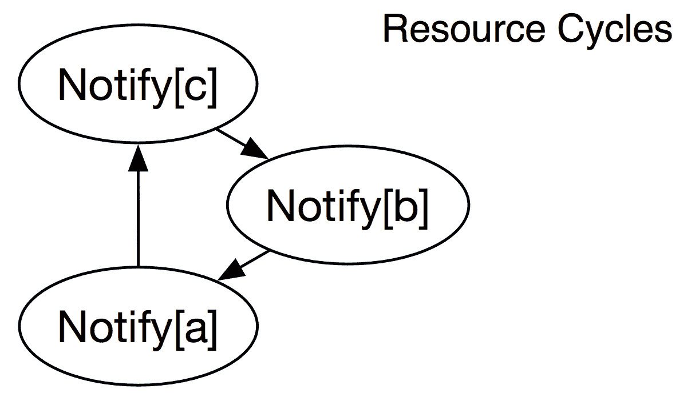

# 故障排除与性能分析

有时，我们的 Puppet 基础设施和代码似乎并没有与我们协同工作。在本章中，我们将专注于排查一些常见问题。

本章将涵盖的主要主题如下：

+   Puppet 基础设施组件错误

+   常见的目录编译错误

+   日志记录

虽然这不是一个总是很令人兴奋的话题，但知道如何处理这些问题是成功管理任何系统和语言（包括 Puppet）的关键。在我们深入到代码之前，我们会确保我们的 Puppet 基础设施已经准备好。

# 常见组件错误

本节将讨论健康的 Puppet 安装。我们将主要关注我们在代理节点上看到的常见问题，以及这些问题可能对您的 Puppet 系统意味着什么。我们将在编写、测试和部署代码到服务器时常见的错误情况进行排查。我们将主要从 Puppet 代理的角度进行故障排除，因此您将看到团队成员在处理 Puppet 部署时最常遇到的问题。

# Puppet 代理和 Puppetserver

Puppet 基础设施中的所有节点都包含一个 Puppet 代理。在分布式安装中，每个组件都与 Puppetserver 进行通信，就像基础设施中管理的其他节点一样。在单体安装中，Puppet 代理与自身进行通信。Puppet 管理的每个节点都必须使用代理来检索配置。由于代理无处不在，了解一些常见的代理错误将对故障排除具有普遍的帮助。以下是一些常见的导致代理故障的原因：

+   证书重用

+   连接到主节点时的错误用户上下文

+   网络连接

+   DNS 替代名称

# 等待证书签署

运行代理第一次时，您会看到一个简单的错误信息，`failed to retrieve certificate and waitforcert is disabled`：

```
Exiting; failed to retrieve certificate and waitforcert is disabled
```

这个特定的消息很容易解决。我们的代理正在通知我们，它没有收到来自主节点的签名证书。我们可以通过简单地以 root 用户登录到 Puppet Master 并签署我们的证书来解决这个问题。我们可以使用命令 `puppet cert list` 查看在 Puppet Master 上待处理的证书，如下所示：

```
[root@wordpress puppetlabs]# puppet agent -t
Exiting; no certificate found and waitforcert is disabled
```

在上面的代码中，我们可以看到我们的 `wordpress` 节点尚未签名，我们只需要使用 `puppet cert sign` 来批准该节点：

```
[root@pe-puppet-master ~]# puppet cert list
 "wordpress" (SHA256) F4:9E:56:9E:07:3F:66:B3:B4:CE:81:9E:1E:ED:FC:43:B9:A2:CC:88:78:8D:C5:30:CA:B0:B7:6D:0F:77:86:20

[root@pe-puppet-master ~]# puppet cert sign wordpress
Signing Certificate Request for:
 "wordpress" (SHA256) F4:9E:56:9E:07:3F:66:B3:B4:CE:81:9E:1E:ED:FC:43:B9:A2:CC:88:78:8D:C5:30:CA:B0:B7:6D:0F:77:86:20
Notice: Signed certificate request for wordpress
Notice: Removing file Puppet::SSL::CertificateRequest wordpress at '/etc/puppetlabs/puppet/ssl/ca/requests/wordpress.pem'
```

如果我们没有通过 `autosign.conf` 自动签署证书，或者没有使用提供自动签署功能的 ENC，我们将始终需要记得为新节点签署证书。

# 证书重用

有时，我们通过使用之前已知的 `cert` 名称来启动一个新节点，尤其是在不可变基础设施中。我们的 Puppet 基础设施在设计时考虑了证书安全，因此拥有一个 Puppet Master 已知名称的新节点时，会显示如下消息：

```
[root@wordpress puppet]# puppet agent -t
Error: Could not request certificate: The certificate retrieved from the master does not match the agent's private key. Did you forget to run as root?
Certificate fingerprint: 88:7F:B2:88:15:20:0A:55:3F:DE:2A:36:2C:B1:52:50:F1:77:96:EA:79:75:A1:00:B9:D6:3E:0B:93:45:D8:1C
To fix this, remove the certificate from both the master and the agent and then start a puppet run, which will automatically regenerate a certificate.
On the master:
 puppet cert clean wordpress
On the agent:
 1a. On most platforms: find /etc/puppetlabs/puppet/ssl -name wordpress.pem -delete
 1b. On Windows: del "\etc\puppetlabs\puppet\ssl\certs\wordpress.pem" /f
 2\. puppet agent -t

Exiting; failed to retrieve certificate and waitforcert is disabled
```

解决此错误的简单方法是，在重新运行代理之前，先清理 Puppet Master 上的证书，并重新签署证书，如下所示：

```
[root@pe-puppet-master manifests]# puppet cert clean wordpress
Notice: Revoked certificate with serial 18
Notice: Removing file Puppet::SSL::Certificate wordpress at '/etc/puppetlabs/puppet/ssl/ca/signed/wordpress.pem'
Notice: Removing file Puppet::SSL::Certificate wordpress at '/etc/puppetlabs/puppet/ssl/certs/wordpress.pem'
```

此外，Puppet 不允许我们重新运行代理，直到我们删除最近生成的证书。错误消息提供了删除证书的最佳命令，这样可以在代理上重新生成证书：`find /etc/puppetlabs/puppet/ssl -name <fqdn>.pem -delete`。在大多数代理上，实际上删除整个 SSL 目录是更安全的，使用命令 `rm -rf /etc/puppetlabs/puppet/ssl`。

删除 Puppet Master 上的 SSL 目录会删除整个证书链，导致需要一整套新的证书。在 Puppet 的旧版本中，这个问题更难解决；现在，我们可以通过遵循以下指南来解决它：[`puppet.com/docs/puppet/latest/ssl_regenerate_certificates.html`](https://puppet.com/docs/puppet/latest/ssl_regenerate_certificates.html)。确保不要不小心删除 Master 上的 SSL 证书，而是删除代理的证书。

防止此错误的方法很简单，只需在退役任何连接到 Puppet Master 的节点后，在 Puppet Master 上运行 `puppet cert clean <nodename>`。

# 错误的 Puppet 用户

当我们编写代码时，我们通常会登录到测试机器上手动运行代理，并了解发生了什么情况。我们很少直接以 root 身份登录，而很容易忘记将用户切换为 root。这个问题尤其让人沮丧，因为它表现为证书错误。我们的个人用户生成了一个新的证书，无法通过 SSL 错误连接到 Master。你在错误日志中会注意到的关键区别是建议删除本地证书。

这种情况通常发生在测试时，将代理作为错误的用户身份运行。注意生成新密钥，以及第 1 行中的用户上下文和证书清理消息：在以下示例中，注意到一个新的 SSL 密钥正在生成，并且我正在以自己的用户身份而非 root 身份运行此命令：

```
[rary@wordpress ~]$ puppet agent -t
Info: Creating a new SSL key for wordpress
Info: Caching certificate for ca
Info: Caching certificate for wordpress
Error: Could not request certificate: The certificate retrieved from the master does not match the agent's private key. Did you forget to run as root?
Certificate fingerprint: 0C:10:48:BB:F9:F4:12:4A:66:52:FD:BB:33:DF:54:67:98:B4:D1:01:96:DE:6B:A4:D1:29:19:3C:C8:83:15:8C
To fix this, remove the certificate from both the master and the agent and then start a puppet run, which will automatically regenerate a certificate.
On the master:
 puppet cert clean wordpress
On the agent:
 1a. On most platforms: find /home/rary/.puppetlabs/etc/puppet/ssl -name wordpress.packt.com.pem -delete
 1b. On Windows: del "\home\rary\.puppetlabs\etc\puppet\ssl\certs\wordpress.packt.com.pem" /f
 2\. puppet agent -t

Exiting; failed to retrieve certificate and waitforcert is disabled
```

# 网络连接问题

在 Puppet 中，网络连接问题可能会非常嘈杂。以下代码示例中的代理无法与 Master 通信，原因可能是网络路由问题或防火墙阻止了与 Puppet Master 的流量。在以下示例中，防火墙阻止了代理与 Master 连接：

```
[root@wordpress ~]# puppet agent -t
Warning: Unable to fetch my node definition, but the agent run will continue:
Warning: Failed to open TCP connection to pe-puppet-master:8140 (No route to host - connect(2) for "pe-puppet-master" port 8140)
Info: Retrieving pluginfacts
Error: /File[/opt/puppetlabs/puppet/cache/facts.d]: Failed to generate additional resources using 'eval_generate': Failed to open TCP connection to pe-puppet-master:8140 (No route to host - connect(2) for "pe-puppet-master" port 8140)
Error: /File[/opt/puppetlabs/puppet/cache/facts.d]: Could not evaluate: Could not retrieve file metadata for puppet:///pluginfacts: Failed to open TCP connection to pe-puppet-master:8140 (No route to host - connect(2) for "pe-puppet-master" port 8140)
Info: Retrieving plugin
Error: /File[/opt/puppetlabs/puppet/cache/lib]: Failed to generate additional resources using 'eval_generate': Failed to open TCP connection to pe-puppet-master:8140 (No route to host - connect(2) for "pe-puppet-master" port 8140)
Error: /File[/opt/puppetlabs/puppet/cache/lib]: Could not evaluate: Could not retrieve file metadata for puppet:///plugins: Failed to open TCP connection to pe-puppet-master:8140 (No route to host - connect(2) for "pe-puppet-master" port 8140)
Info: Loading facts
Error: Could not retrieve catalog from remote server: Failed to open TCP connection to pe-puppet-master:8140 (No route to host - connect(2) for "pe-puppet-master" port 8140)
Warning: Not using cache on failed catalog
Error: Could not retrieve catalog; skipping run
Error: Could not send report: Failed to open TCP connection to pe-puppet-master:8140 (No route to host - connect(2) for "pe-puppet-master" port 8140)
```

你可能会注意到前面示例中的重复主题：`No route to host`（无法连接到主机）和`Failed to open TCP Connection`（无法打开 TCP 连接）。我们的目录编译的每个组件都会单独打印一条消息，提醒我们连接失败。当我们看到“无法连接到主机”时，说明在代理和主服务器之间有防火墙，或者没有通往主机的网络路径。这也可能是由于代理在尝试连接主服务器时，DNS 或`/etc/hosts`条目配置不正确导致的。

# DNS 备用名称

DNS 备用名称在大型 Puppet 基础架构中非常方便。它们可以有效地为我们的服务器单独命名，或者作为一个整体命名。常见的 DNS 备用名称可能是`puppet`，这样你就可以使用负载均衡器来服务所有单独的 Puppetservers。

在以下示例中，我们尝试使用名称`alt-name.puppet.net`连接到我们的 Puppetserver，而这个名称在最初签署 Puppet 服务器时并没有包含在证书中：

```
[root@wordpress puppet]# puppet agent -t --server=alt-name.puppet.net
Warning: Unable to fetch my node definition, but the agent run will continue:
Warning: SSL_connect returned=1 errno=0 state=error: certificate verify failed: [ok for /CN=pe-puppet-master]
Info: Retrieving pluginfacts
Error: /File[/opt/puppetlabs/puppet/cache/facts.d]: Failed to generate additional resources using 'eval_generate': SSL_connect returned=1 errno=0 state=error: certificate verify failed: [ok for /CN=pe-puppet-master]
Error: /File[/opt/puppetlabs/puppet/cache/facts.d]: Could not evaluate: Could not retrieve file metadata for puppet:///pluginfacts: SSL_connect returned=1 errno=0 state=error: certificate verify failed: [ok for /CN=pe-puppet-master]
Info: Retrieving plugin
Error: /File[/opt/puppetlabs/puppet/cache/lib]: Failed to generate additional resources using 'eval_generate': SSL_connect returned=1 errno=0 state=error: certificate verify failed: [ok for /CN=pe-puppet-master]
Error: /File[/opt/puppetlabs/puppet/cache/lib]: Could not evaluate: Could not retrieve file metadata for puppet:///plugins: SSL_connect returned=1 errno=0 state=error: certificate verify failed: [ok for /CN=pe-puppet-master]
Info: Loading facts
Error: Could not retrieve catalog from remote server: SSL_connect returned=1 errno=0 state=error: certificate verify failed: [ok for /CN=pe-puppet-master]
Warning: Not using cache on failed catalog
Error: Could not retrieve catalog; skipping run
Error: Could not send report: SSL_connect returned=1 errno=0 state=error: certificate verify failed: [ok for /CN=pe-puppet-master]
```

解决此问题有两种可能的方法：要么设置代理通过已知的 DNS 名称调用主服务器，要么在 Puppetserver 上使用新的 DNS 备用名称重建证书。可以通过在受影响的主服务器上使用`find /etc/puppetlabs/puppet/ssl -name <fqdn>.pem -delete`删除 SSL 证书，然后在主服务器上运行`puppet agent -t --dns-alt-names=<name1>,<name2>,<etc>`，连接到主服务器的主节点，并生成一个新的证书。这个证书必须通过命令行在 CA（通常是主节点的主服务器）上签署，不能在 PE 控制台中签署，因为存在 DNS 备用名称的问题。

# 日期和时间

时间是保持 SSL 连接完整性的重要因素。`puppetlabs/ntp`通常是 Puppet 最常使用的模块，因为 Puppet 在每个节点的事务中都需要准确的日期和时间。如果你收到消息称证书吊销列表（CRL）在你的运行中尚未生效，请确保 NTP 在你的节点上正确配置：

```
[root@wordpress puppet]# puppet agent -t
Warning: Unable to fetch my node definition, but the agent run will continue:
Warning: SSL_connect returned=1 errno=0 state=error: certificate verify failed: [CRL is not yet valid for /CN=Puppet Enterprise CA generated on pe-puppet-master at +2018-06-15 02:28:12 +0000]
Info: Retrieving pluginfacts
Error: /File[/opt/puppetlabs/puppet/cache/facts.d]: Failed to generate additional resources using 'eval_generate': SSL_connect returned=1 errno=0 state=error: certificate verify failed: [CRL is not yet valid for /CN=Puppet Enterprise CA generated on pe-puppet-master at +2018-06-15 02:28:12 +0000]
Error: /File[/opt/puppetlabs/puppet/cache/facts.d]: Could not evaluate: Could not retrieve file metadata for puppet:///pluginfacts: SSL_connect returned=1 errno=0 state=error: certificate verify failed: [CRL is not yet valid for /CN=Puppet Enterprise CA generated on pe-puppet-master at +2018-06-15 02:28:12 +0000]
Info: Retrieving plugin
Error: /File[/opt/puppetlabs/puppet/cache/lib]: Failed to generate additional resources using 'eval_generate': SSL_connect returned=1 errno=0 state=error: certificate verify failed: [CRL is not yet valid for /CN=Puppet Enterprise CA generated on pe-puppet-master at +2018-06-15 02:28:12 +0000]
Error: /File[/opt/puppetlabs/puppet/cache/lib]: Could not evaluate: Could not retrieve file metadata for puppet:///plugins: SSL_connect returned=1 errno=0 state=error: certificate verify failed: [CRL is not yet valid for /CN=Puppet Enterprise CA generated on pe-puppet-master at +2018-06-15 02:28:12 +0000]
Info: Loading facts
Error: Could not retrieve catalog from remote server: SSL_connect returned=1 errno=0 state=error: certificate verify failed: [CRL is not yet valid for /CN=Puppet Enterprise CA generated on pe-puppet-master at +2018-06-15 02:28:12 +0000]
Warning: Not using cache on failed catalog
Error: Could not retrieve catalog; skipping run
Error: Could not send report: SSL_connect returned=1 errno=0 state=error: certificate verify failed: [CRL is not yet valid for /CN=Puppet Enterprise CA generated on pe-puppet-master at +2018-06-15 02:28:12 +0000]
```

# PE 控制台服务宕机

如果 Puppet Enterprise 控制台超载，可能会触发`OutOfMemory`错误并崩溃。我通常在虚拟机或容器中启动小规模的 Puppet Enterprise 安装时看到这个问题，尤其是在我的本地笔记本电脑上。当控制台出现故障时，Puppet Enterprise 用户会收到错误信息，告知节点管理服务未运行。如果这个信息在代理运行中开始出现，用户应该检查 PE 控制台的状态和相关日志：

```
[root@wordpress ~]# puppet agent -t
Warning: Unable to fetch my node definition, but the agent run will continue:
Warning: Error 500 on SERVER: Server Error: Classification of wordpress failed due to a Node Manager service error. Please check /var/log/puppetlabs/console-services/console-services.log on the node(s) running the Node Manager service for more details.
Info: Retrieving pluginfacts
Info: Retrieving plugin
Info: Retrieving locales
Info: Loading facts
Error: Could not retrieve catalog from remote server: Error 500 on SERVER: Server Error: Failed when searching for node wordpress: Classification of wordpress failed due to a Node Manager service error. Please check /var/log/puppetlabs/console-services/console-services.log on the node(s) running the Node Manager service for more details. 
Warning: Not using cache on failed catalog
Error: Could not retrieve catalog; skipping run
```

本节仅适用于 Puppet Enterprise 用户。

# 目录错误

当触发目录编译错误时，Puppet 解析器会提醒我们，它无法从提供的代码中构建目录。Puppet 运行将失败，并且代理不会在无法编译目录的节点上进行配置。当 Puppet 无法读取代码，或者无法确定如何应用目录中提供的资源时，就会触发这些错误。在接下来的部分中，我们将涵盖以下常见的失败：

+   语法错误

+   重复资源声明

+   缺失资源

+   自动加载格式

+   循环依赖

企业用户：分类组中的配置选项卡无法读取包含语法错误、缺失类或未按自动加载格式找到的类。

# 语法错误

语法错误是我们在开发代码时最常见的错误。当输入代码时，很容易忽视简单的语法错误，并将错误代码推送到测试环境中。在以下示例中，文件末尾缺少了类的闭括号：

```
[root@wordpress puppet]# puppet agent -t
Info: Using configured environment 'production'
Info: Retrieving pluginfacts
Info: Retrieving plugin
Info: Retrieving locales
Info: Loading facts
Error: Could not retrieve catalog from remote server: Error 500 on SERVER:
```

```
 Server Error: Syntax error at end of input (file: /etc/puppetlabs/code/environments/production/modules/profile/manifests/baseline.pp) on node wordpress
```

我们可以在部署到 Puppet Master 之前很久就测试这个错误。命令 `puppet parser validate` 如果我们在清单上运行它，将给出与代理相同的错误信息。PDK 的用户会发现，`pdk validate` 会在检查中运行这一项。以下代码演示了 Puppet 解析器验证的代理运行错误：

```
[root@pe-puppet-master manifests]# puppet parser validate baseline.pp
Error: Could not parse for environment production: Syntax error at end of input (file: /etc/puppetlabs/code/environments/production/modules/profile/manifests/baseline.pp)
```

这是将良好实践应用到 CI/CD 流水线中的最简单示例之一。你可以在第八章中找到更多有关添加此简单检查的好示例，*通过任务和发现扩展 Puppet*。

像 Puppet 解析器验证这样的语法错误检查器会扫描代码，直到它们找到无法解析的行。通常，这些错误出现在报告的错误行上方！请始终检查报告行上方的代码。以下错误实际上是 `example.pp` 文件第 4 行缺少逗号：`Error: Could not parse for environment production: Syntax error at 'source' (file: /Users/rary/workspace/packt/manifests/example.pp, line: 5, column: 5)`。

# 重复资源声明

Puppet 根据我们在清单中声明的每个资源构建目录。在良好的 Puppet 代码设计中，我们有包含或包含其他类的类。在开发过程中，有时我们会尝试声明一个已经在系统中应用的类中声明的资源，这是很常见的。按照设计，Puppet 会在遇到重复的资源声明时失败，原因很简单：目录如何决定应用哪个资源是正确的呢？在以下示例中，一个资源在两个不同的类中声明，并且这些类都应用到我的节点上：

```
[root@pe-puppet-master production]# puppet agent -t
Info: Using configured environment 'production'
Info: Retrieving pluginfacts
Info: Retrieving plugin
Info: Retrieving locales
Info: Loading facts
Error: Could not retrieve catalog from remote server: Error 500 on SERVER: Server Error: Evaluation Error: Error while evaluating a Resource Statement, Duplicate declaration: File[/var/log/custom] is already declared at (file: /etc/puppetlabs/code/environments/production/modules/profile/manifests/baseline.pp, line: 6); cannot redeclare (file: /etc/puppetlabs/code/environments/production/modules/profile/manifests/logging.pp, line: 3) (file: /etc/puppetlabs/code/environments/production/modules/profile/manifests/logging.pp, line: 3, column: 3) on node pe-puppet-master
Warning: Not using cache on failed catalog
Error: Could not retrieve catalog; skipping run
```

在前面的案例中，我在我的基准配置文件中设置了日志目录。我迭代并围绕日志设计了整个配置文件，并将我的目录包含在日志配置文件中。为了解决这个错误，我只需从基准配置文件中移除自定义的日志目录资源。

如果你需要声明一个资源，并可能在多个清单中使用它，你可能想使用虚拟资源。第九章，*导出资源*也涵盖了虚拟资源的内容。

# 缺失资源

当我们尝试使用 Puppet Master 或 Puppet 环境中不可用的资源时，可能会触发缺失资源错误，导致目录编译失败。虽然这些问题通常是由于拼写错误的资源类型引起的，但它们也可能是由于环境中缺失模块造成的。在以下示例中，我尝试使用 `include ntp` 引入 NTP 模块。记住，类也是资源：

```
[root@wordpress puppet]# puppet agent -t
Info: Using configured environment 'production'
Info: Retrieving pluginfacts
Info: Retrieving plugin
Info: Retrieving locales
Info: Loading facts
Error: Could not retrieve catalog from remote server: Error 500 on SERVER: Server Error: Evaluation Error: Error while evaluating a Function Call, Could not find class ::ntp for wordpress (file: /etc/puppetlabs/code/environments/production/modules/profile/manifests/baseline.pp, line: 3, column: 3) on node wordpress 
Warning: Not using cache on failed catalog
Error: Could not retrieve catalog; skipping run
```

我在环境中只是缺少了 NTP 类。我可以通过手动执行 `puppet module install` 来解决这个问题，但如果你使用的是 r10k 或 Code Manager，只需在环境的 Puppetfile 中添加模块条目及其所有依赖项：

```
mod 'puppetlabs/ntp'
mod 'puppetlabs/stdlib'
```

使用 Puppet 模块 `install` 方法确实能使模块对所有环境可用，但我只建议在用于测试代码的临时 Puppet Master 上使用它：

```
[root@pe-puppet-master manifests]# puppet module install puppetlabs/ntp
Notice: Preparing to install into /etc/puppetlabs/code/environments/production/modules ...
Notice: Downloading from https://forgeapi.puppet.com ...
Notice: Installing -- do not interrupt ...
/etc/puppetlabs/code/environments/production/modules
└─┬ puppetlabs-ntp (v7.2.0)
 └── puppetlabs-stdlib (v4.25.1)
```

Puppet 模块 `install` 默认会为我们获取所有的依赖项，而 R10k 和 Code Manager 不会，所以确保在 Puppetfile 中包含所有依赖项。

# 自动加载格式

如果我们包含类和定义类型的清单文件不在正确的目录中，主服务器将无法找到它们。在以下示例中，我尝试使用一个新的类：

```
[root@wordpress puppet]# puppet agent -t
Info: Using configured environment 'production'
Info: Retrieving pluginfacts
Info: Retrieving plugin
Info: Retrieving locales
Notice: /File[/opt/puppetlabs/puppet/cache/locales/ja/puppetlabs-ntp.po]/ensure: defined content as '{md5}7265ff57e178feb7a65835f7cf271e2c'
Info: Loading facts
Error: Could not retrieve catalog from remote server: Error 500 on SERVER: Server Error: Evaluation Error: Error while evaluating a Function Call, Could not find class ::profile::baseline::linux for wordpress
(file:/etc/puppetlabs/code/environments/production/modules/profile/manifests/baseline.pp, line: 4, column: 3) on node wordpress
```

我知道我已经编写了 `linux.pp` 清单文件，但主服务器找不到它。如果我在目录中运行 `tree` 命令，我会看到 `profile::baseline::linux` 实际上位于 `profile::linux` 的自动加载目录中。记住，目录为我们的命名空间提供了额外的层次：

```
profile/
└── manifests
    ├── baseline.pp # profile::baseline
    └── linux.pp # profile::baseline::linux <-- Can't find this
```

通过简单地将我的 Linux 基准清单移到 `baseline` 文件夹中，主服务器将能够找到这个清单：

```
profile/
└── manifests
    ├── baseline
    │   └── linux.pp # profile::baseline::linux <-- Found!
    └── baseline.pp # profile::baseline
```

# 循环依赖

循环依赖在 Puppet 开发中并不常见，但一旦出现，排查起来可能非常棘手。循环依赖发生在我们创建了一个依赖链（使用箭头指示符 `->`）或排序元参数时。在以下示例中，我的三个通知语句相互依赖，形成了一个循环链 —— `a -> b -> c -> a`：

```
class profile::baseline::linux {

# notify {'baseline': message => 'Applying the Linux Baseline!' }

  notify {'a':
    message => 'Resource A',
    require => Notify['b']
  }

  notify {'b':
    message => 'Resource B',
    require => Notify['c']
  }

  notify {'c':
    message => 'Resource C',
    require => Notify['a']
  }

}
```

当这个目录应用到节点时，我们将收到一条信息，告诉我们哪些资源在依赖链中：

```
[root@wordpress puppet]# puppet agent -t
Info: Using configured environment 'production'
Info: Retrieving pluginfacts
Info: Retrieving plugin
Info: Retrieving locales
Info: Loading facts
Info: Caching catalog for wordpress
Info: Applying configuration version '1535603400'
Error: Found 1 dependency cycle:
(Notify[a] => Notify[c] => Notify[b] => Notify[a])\nTry the '--graph' option and opening the resulting '.dot' file in OmniGraffle or GraphViz
Error: Failed to apply catalog: One or more resource dependency cycles detected in graph
```

注意代理中指示的 `--graph` 标志。如果我们再次运行代理，使用 `puppet agent -t --graph`，我们将得到一个 dot 文件，其中详细列出了我们的排序，并且能够突出显示我们的依赖循环。这个文件会写入 `/opt/puppetlabs/puppet/cache/stage/graphs/cycles.dot`。我可以在 GraphViz（开源软件）或 OmniGraffle 中打开这个文件，并以图形形式查看我的依赖链。下图显示了 OmniGraffle 中表示的这个通知循环：



# 调试模式 – 目录

有时，Puppet 会抛出一个并不立刻明显的错误。在下一个示例中，我尝试安装 `apache httpd`，但我拼写错了包名。如果你没有花很多时间在使用 Yum 的系统上工作，错误 `Nothing to do` 其实并不是一个非常清晰的错误：

```
[root@pe-puppet-master manifests]# puppet agent -t
Info: Using configured environment 'production'
Info: Retrieving pluginfacts
Info: Retrieving plugin
Info: Retrieving locales
Info: Loading facts
Info: Caching catalog for pe-puppet-master
Info: Applying configuration version '1535778801'
Notice: Applying the Linux Baseline!
Notice: /Stage[main]/Profile::Baseline::Linux/Notify[baseline]/message: defined 'message' as 'Applying the Linux Baseline!'
Error: Execution of '/usr/bin/yum -d 0 -e 0 -y install http' returned 1: Error: Nothing to do
Error: /Stage[main]/Profile::Baseline/Package[http]/ensure: change from 'purged' to 'present' failed: Execution of '/usr/bin/yum -d 0 -e 0 -y install http' returned 1: Error: Nothing to do
https://yum.puppet.com/puppet5/puppet5-release-el-7.noarch.rpm' returned 1: Error: Nothing to do
Info: Stage[main]: Unscheduling all events on Stage[main]
```

我可能想检查一下 Puppet 尝试让我系统做什么。我可以在代理上使用 `--debug` 标志，检查 Puppet 在系统底层执行的所有操作。我可以看到 Puppet 使用 `rpm -q` 检查软件包是否已安装在系统上。如果没有找到，它会执行特定的 Yum 命令：以不记录错误日志（`-e 0`）或调试（`-d 0`）的方式运行 Yum，并假设默认选择（`-y`）安装 `http`。最后，由于该资源失败，任何依赖它的资源都会失败安装：

```
Debug: Executing: '/usr/bin/rpm -q http --nosignature --nodigest --qf '%{NAME} %|EPOCH?{%{EPOCH}}:{0}| %{VERSION} %{RELEASE} %{ARCH}\n''
Debug: Executing: '/usr/bin/rpm -q http --nosignature --nodigest --qf '%{NAME} %|EPOCH?{%{EPOCH}}:{0}| %{VERSION} %{RELEASE} %{ARCH}\n' --whatprovides'
Debug: Packagehttp: Ensuring => present
Debug: Executing: '/usr/bin/yum -d 0 -e 0 -y install http'
Error: Execution of '/usr/bin/yum -d 0 -e 0 -y install http' returned 1: Error: Nothing to do
Error: /Stage[main]/Profile::Baseline/Package[http]/ensure: change from'purged' to 'present' failed: Execution of '/usr/bin/yum -d 0 -e 0 -y
```

```
 install http' returned 1: Error: Nothing to do
Debug: Class[Profile::Baseline]: Resource is being skipped, unscheduling all events
```

错误 `Nothing to do` 实际上没有解决。通过快速搜索你最喜欢的论坛可以找到一些可能的罪魁祸首，在这种情况下，`http` 不是 Yum 中的一个包。`httpd`，即 Apache Web 服务器，才是我想要安装的。

# 日志记录

日志记录是最有用的故障排除形式之一，前提是要主动监控。我们通常可以在问题成为用户报告的故障之前，识别出我们基础设施中的问题。通过了解 Puppet 可用的日志记录，你将知道在哪里查看系统退化的指示。在本节中，我们将探讨 Puppet 及其子组件可用的日志文件，并配置 Puppetserver 中的日志级别。

# logback.xml 文件

除了 Puppet agent 之外，我们将记录的每个组件都将使用 Logback。虽然这不是一本关于 `logback` 的书，但我们会查看一些现有的 `logback.xml` 部分，以及我们可以修改的一些常见设置。

# 主要配置

主要配置包括以下 XML 文件的第一行和最后一行：

```
<configuration scan="true" scanPeriod="60 seconds">
```

`scan` 设置告诉 `logback` 重新扫描配置文件是否有更改，并在检测到更改时重新加载服务。`scanPeriod` 设置让配置知道多长时间扫描一次。我们使用这些设置，以便我们的日志配置能够随着文件动态更新；无需重启服务。

# Appender

appender 配置部分管理日志文件。我已在 `puppetserver.log` 的 appender 中添加了注释，说明各行的作用：

```
<!-- Setting the name for future reference and making a Rolling Log File -->
    <appender name="F1" class="ch.qos.logback.core.rolling.RollingFileAppender">

<!-- Logging to /var/log/puppetlabs/puppetserver/puppetserver.log -->
        <file>/var/log/puppetlabs/puppetserver/puppetserver.log</file>

<!-- Appending to, not replacing the log -->
        <append>true</append>

<!-- Roll the file over based on Size and Time -->
        <rollingPolicy class="ch.qos.logback.core.rolling.SizeAndTimeBasedRollingPolicy">

<!-- What to name the file as it's rolled over, with date variables -->
            <fileNamePattern>/var/log/puppetlabs/puppetserver/puppetserver-%d{yyyy-MM-dd}.%i.log.gz</fileNamePattern>

<!-- Maximum size of log file before rolling over -->
            <maxFileSize>200MB</maxFileSize>

<!-- Maximum Number of Files to keep - 90 logs -->
            <maxHistory>90</maxHistory>

<!-- Maximum Filesize of all files that will be kept. Up to 5 files with 200 MB -->
            <totalSizeCap>1GB</totalSizeCap>
        </rollingPolicy>
<!-- What to print for date and time with the message -->
        <encoder>
            <pattern>%d{yyyy-MM-dd'T'HH:mm:ss.SSSXXX} %-5p [%t] [%c{2}] %m%n</pattern>
        </encoder>
    </appender>
```

在前面的示例中，我们正在创建具有滚动策略的 `puppetserver.log`。我们将保留最多 90 个日志，但每当日志达到 200 MB 大小时就进行轮换，如果日志总大小超过 1 GB，则删除日志。我们将日期附加到我们滚动的日志中，并打印日志的时间戳。

你可能会看到一个指向 `STDOUT` 的 appender。这实际上是输出到 `System.out` 和 `System.error`，本质上是附加到终端。

# 日志记录器

`logback.xml` 中的日志记录器充当应用程序生成的日志的指针：

```
    <logger name="puppetlabs.pcp" level="info" additivity="false">
      <appender-ref ref="PCP"/>
    </logger>
```

这个示例连接到 Puppetserver 应用程序中的`puppetlabs.pcp`日志，并收集信息级别的日志。`additivity=false`标志告诉日志替换文件，而不是附加到文件末尾。最后，`appender-ref`标签告诉日志记录器使用哪个附加器来进行日志记录配置。

# 根日志记录器

还有一种特殊类型的日志记录器，称为根日志记录器：

```
    <root level="info">
        <appender-ref ref="${logappender:-DUMMY}" />
        <appender-ref ref="F1" />
    </root>
```

根日志记录器充当默认值，允许你选择日志级别并提供 `appender-refs` 列表，以应用默认设置。可以把它看作是一个默认的组策略日志记录器，而不是应用于单个日志配置的设置。所有其他日志记录器会覆盖根日志记录器中的每个值。

# Puppet 代理

Puppet 代理在每个节点上，并且 Puppet 代理的日志存储在该节点的本地。 这是我们使用的唯一不使用 logback 的日志文件，而是使用系统消息进行日志记录。Puppet 代理记录到它所运行的操作系统的`syslog`。每个操作系统使用不同的位置，如下所示：

+   Linux: `/var/log/messages`

+   macOS X: `/var/log/system.log`

+   Solaris: `/var/adm/messages`

+   Windows: 事件查看器

这里记录的信息与 Puppet 运行期间输出的信息相同。你可以在此日志文件中检查成功和失败的资源应用到节点的情况。

企业用户：你还可以在 Puppet Enterprise 控制台中查看代理日志，并可以使用过滤器来帮助缩小问题或状态的范围。你可以在每个节点页面的报告部分找到此日志。

# PuppetDB

PuppetDB 的日志记录由位于 PuppetDB 服务器的配置文件`/etc/puppetlabs/puppetdb/logback.xml`管理。这个 `logback` 文件包含以下日志的条目，这些日志默认位于 `/var/log/puppetlabs/puppetdb/`：

+   `puppetdb.log`：有关 PuppetDB 应用程序的信息

+   `puppetdb-access.log`：有关用户和机器访问 PuppetDB 的信息

+   `puppetdb-status.log`：PuppetDB 的当前状态

如果你在寻找 PostgreSQL 的日志，它们存储在`/var/log/puppetlabs/postgresql`中。这是标准的 PostgreSQL 日志记录。

# Puppetserver

Puppetserver 的日志记录由位于 PuppetDB 服务器的配置文件`/etc/puppetlabs/puppetserver/logback.xml`管理。这个 `logback` 文件包含以下日志的条目，这些日志默认位于 `/var/log/puppetlabs/puppetserver`：

+   `puppetserver.log`：包含编译错误的应用程序活动日志

+   `pcp-broker.log`：Puppet 上 PCP 经纪人活动的日志文件

+   `pcp-broker-access.log`：用户访问 Puppet 上 PCP 经纪人的日志文件

+   `puppetserver-status.log`：Puppetserver 状态指示器

# Puppet Enterprise 控制台

控制台日志记录由位于 PuppetDB 服务器的配置文件`/etc/puppetlabs/console-services/logback.xml`管理。这个 `logback` 文件包含以下日志的条目，这些日志默认位于 `/var/log/puppetlabs/console-services`：

+   `console-services.log`：Puppet Enterprise 控制台的日志

+   `console-services-status.log`：控制台的状态指示器

本节内容仅对 Puppet Enterprise 用户有用。

# 摘要

在本章中，我们讨论了故障排除 Puppet 的方法。我们回顾了 Puppetserver 和 Puppet 代理之间连接时常见的错误，分析了常见的清单编译失败以及如何调试它们。我们还介绍了 `logback` 以及主机上的日志文件。
