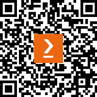

# 前言

基础设施即代码（Infrastructure as Code）已成为配置和维护云基础设施的事实标准方法。尽管这种方法已经存在一段时间，但它在多年的发展中已经成熟并不断完善。最初，它主要遵循命令式编程模型，并通过代理来促进变更。然而，随着基于 API 的云服务的出现，它转变为主要通过声明式配置所需状态，并将其转化为云服务及其配置——而 Terraform 就是这个领域的黄金标准。

Terraform 对于应用程序开发团队（那些创建令终端用户满意的应用和服务）以及平台团队（那些赋能企业和组织实现顺畅高效运作的团队）至关重要。因此，Terraform 已成为这些团队构建和管理支持其目标的环境的首选方式。

本书《掌握 Terraform》认识到，要真正掌握 Terraform，首先必须深入理解将通过 Terraform 和基础设施即代码来自动化的云服务和架构。本书将重点解决现实世界中的问题——无论是通过 Terraform 构建新环境，还是管理现有环境。

我们生活在一个多云的世界中。这就是为什么书中会平等地对待 AWS、Azure 和 Google Cloud 三大主流超大规模云平台。无论您计划使用其中一个、两个，还是全部三个云平台，本书都会将您视为优先用户。

本书中接受的另一个现实是，Terraform 并不是工具箱中唯一的工具。实践者通常需要集成多个工具以实现他们的目标。因此，我们将探索三种不同的云计算范式：虚拟机、容器和无服务器。每种范式都有其独特的设计特性、部署机制和工具链动态，您需要在使用它们时有所了解。

# 本书适合人群

本书面向云计算、DevOps、平台和基础设施工程师、SRE、开发人员以及希望使用 Terraform 自动化云基础设施并简化软件交付的云架构师。您将从对基础设施即代码（如 Terraform、Ansible 和 AWS CDK）、云架构、开发工具和平台的基本理解中受益。这一基础将帮助您通过本书中涉及的概念和实践提升您的技能。

# 本书内容

*第一章*，*理解 Terraform 架构*，深入探讨了 Terraform 架构的核心要素，重点介绍了 Terraform 状态、模块化、命令行工具以及构成 Terraform 的配置语言。

*第二章*, *使用 HashiCorp 配置语言*，深入探讨了 Terraform 的功能语言 **HashiCorp Configuration Language** (**HCL**) 的关键语言结构。它分享了常见情景的最佳实践和实际用例。

*第三章*, *利用 HashiCorp 实用程序提供者*，深入探讨了扩展 Terraform 核心和您选择的云提供商的实用程序提供者。它分享了帮助您简化常见云无关操作的最佳实践和常见用例。

*第四章*, *云架构基础 – 虚拟机和基础设施即服务*，提供了开始设计和构建基于 Terraform 的基础设施即代码解决方案所需的核心概念概述。这些关键概念超越了云平台，将帮助您准备自动化这类解决方案，无论您选择的云是什么。

*第五章*, *超越虚拟机 – 容器和 Kubernetes 的核心概念*，提供了开始设计和构建与 Docker 和 Kubernetes 集成的基础设施即代码解决方案所需的核心概念概述——这是一个在当今日益流行的情景。本章探讨了使用原生客户端工具和适用于 Kubernetes 和 Helm 的相关 Terraform 提供者的 Docker 和 Kubernetes 集成策略。

*第六章*, *连接所有内容 – GitFlow、GitOps 和 CI/CD*，提供了使用 GitFlow 进行软件开发流程概述以及这种方法对基础设施即代码操作的影响。最后，我们探讨使用 GitHub Actions 为虚拟机、Kubernetes 和无服务器工作负载实施 CI/CD 流水线。

*第七章*, *AWS 入门 – 使用 AWS EC2 构建解决方案*，提供了一种为 AWS 开发的端到端解决方案，使用由 EC2 提供动力的虚拟机。本章探讨了使用 Packer 自动化操作系统级配置、使用 Terraform 部署基础设施和工作负载，并最终使用 GitHub Actions 自动化整个过程。

*第八章*, *AWS 上的容器化 – 使用 AWS EKS 构建解决方案*，提供了一种为 AWS 开发的端到端解决方案，使用由 EKS 提供动力的 Kubernetes。本章探讨了使用 Docker 自动化操作系统级配置、使用 Terraform 部署基础设施和工作负载，并最终使用 GitHub Actions 自动化整个过程。

*第九章*，*使用 AWS 无服务器架构 – 使用 AWS Lambda 构建解决方案*，提供了一个为 AWS Lambda 开发的端到端无服务器解决方案。本章探讨了必要的应用程序代码更改，以适应 AWS Lambda 的框架，使用 Terraform 来配置基础设施并部署工作负载，最后使用 GitHub Actions 来自动化整个过程。

*第十章*，*在 Azure 上入门 – 使用 Azure 虚拟机构建解决方案*，提供了一个使用 Azure 虚拟机开发的端到端解决方案。本章探讨了使用 Packer 来自动化操作系统级配置，使用 Terraform 来配置基础设施并部署工作负载，最后使用 GitHub Actions 来自动化整个过程。

*第十一章*，*在 Azure 上容器化 – 使用 Azure Kubernetes 服务构建解决方案*，提供了一个为 Azure 开发的端到端解决方案，使用由 AKS 提供支持的 Kubernetes。本章探讨了使用 Docker 来自动化操作系统级配置，使用 Terraform 来配置基础设施并部署工作负载，最后使用 GitHub Actions 来自动化整个过程。

*第十二章*，*在 Azure 上使用无服务器架构 – 使用 Azure Functions 构建解决方案*，提供了一个为 Azure Functions 开发的端到端无服务器解决方案。本章探讨了必要的应用程序代码更改，以适应 Azure Functions 的框架，使用 Terraform 来配置基础设施并部署工作负载，最后使用 GitHub Actions 来自动化整个过程。

*第十三章*，*在 Google Cloud 上入门 – 使用 GCE 构建解决方案*，提供了一个为 GCP 开发的端到端解决方案，使用由 GCE 提供支持的虚拟机。本章探讨了使用 Packer 来自动化操作系统级配置，使用 Terraform 来配置基础设施并部署工作负载，最后使用 GitHub Actions 来自动化整个过程。

*第十四章*，*在 Google Cloud 上容器化 – 使用 GKE 构建解决方案*，提供了一个为 GCP 开发的端到端解决方案，使用由 GKE 提供支持的 Kubernetes。本章探讨了使用 Docker 来自动化操作系统级配置，使用 Terraform 来配置基础设施并部署工作负载，最后使用 GitHub Actions 来自动化整个过程。

*第十五章*，*在 Google Cloud 上使用无服务器架构 – 使用 Google Cloud Functions 构建解决方案*，提供了一个为 Google Cloud Functions 开发的端到端无服务器解决方案。本章探讨了必要的应用程序代码更改，以适应 Google Cloud Functions 的框架，使用 Terraform 来配置基础设施并部署工作负载，最后使用 GitHub Actions 来自动化整个过程。

*第十六章*，*已经预配置？导入现有环境的策略*，深入探讨了将现有资源和环境纳入 Terraform 管理的不同方法。本章探讨了内置导入功能的使用以及使用第三方工具的策略，并提供了关于何时以及如何使用这些技术的实际建议，以及它们的权衡。

*第十七章*，*使用 Terraform 管理生产环境*，提供了如何使用基础设施即代码（IaC）通过 Terraform 管理长期存在的环境的深入指导。本章探讨了不同的现实世界操作模型，帮助组织更好地协调大规模的基础设施管理。然后，深入探讨了第 2 天操作，提供了管理变更和故障修复的最佳实践。

*第十八章*，*展望未来 – 认证、 emerging trends 及后续步骤*，提供了如何准备并参加 Terraform 认证考试的实用指南。本章还探讨了 emerging trends 以及那些希望将 Terraform 技能提升到更高水平的人的潜在后续步骤。

# 如何最大化本书的价值

你应该熟悉在 Windows 或 Linux 上使用命令行界面、使用代码编辑器（如 Visual Studio Code）以及使用 Git 源代码仓库（如 GitHub）。

虽然本书提供了云计算概念的概述，例如虚拟网络、虚拟机、Docker 和 Kubernetes，但熟悉这些技术将有助于填补空白，提升你的学习体验。

此外，了解基本的命令式和面向对象的编程语言（如 Java、C# 或 Python）将对无服务器章节的学习有所帮助。

| 本书中涵盖的软件/硬件 | 操作系统要求 |
| --- | --- |
| Terraform v1.8.4 | Windows, macOS 或 Linux |
| Packer v1.10.3 | Windows, macOS 或 Linux |
| Kubectl v1.26.2 | Windows, macOS 或 Linux |
| Helm v3.13.2 | Windows, macOS 或 Linux |
| .NET 6 | Windows, macOS 或 Linux |
| AWS CLI v2.15.58 |  |
| Azure CLI v2.58.0 |  |
| Google Cloud SDK v469.0.0 |  |

# 下载示例代码文件

本书提供了三个全面的端到端解决方案，分别适用于每个主要云平台：AWS、Azure 和 Google Cloud。每个解决方案都附带一个专用的 GitHub 仓库，包含所有必要的代码，帮助你快速启动并运行各个平台：

+   亚马逊网络服务：

    +   *第七章* - 虚拟机解决方案: [`github.com/markti/aws-vm-demo`](https://github.com/markti/aws-vm-demo)

    +   *第八章* - Kubernetes 解决方案: [`github.com/markti/aws-k8s-demo`](https://github.com/markti/aws-k8s-demo)

    +   *第九章* - 无服务器解决方案: [`github.com/markti/aws-serverless-demo`](https://github.com/markti/aws-serverless-demo)

+   Microsoft Azure:

    +   *第十章* - 虚拟机解决方案: [`github.com/markti/azure-vm-demo`](https://github.com/markti/azure-vm-demo)

    +   *第十一章* - Kubernetes 解决方案: [`github.com/markti/azure-k8s-demo`](https://github.com/markti/azure-k8s-demo)

    +   *第十二章* - 无服务器解决方案: [`github.com/markti/azure-serverless-demo`](https://github.com/markti/azure-serverless-demo)

+   Google Cloud:

    +   *第十三章* - 虚拟机解决方案: [`github.com/markti/gcp-vm-demo`](https://github.com/markti/gcp-vm-demo)

    +   *第十四章* - Kubernetes 解决方案: [`github.com/markti/gcp-k8s-demo`](https://github.com/markti/gcp-k8s-demo)

    +   *第十五章* - 无服务器解决方案: [`github.com/markti/gcp-serverless-demo`](https://github.com/markti/gcp-serverless-demo)

您可以从 GitHub 下载本书的附加示例代码文件，地址为 [`github.com/PacktPublishing/Mastering-Terraform`](https://github.com/PacktPublishing/Mastering-Terraform)。如果代码有更新，GitHub 仓库中的内容也会随之更新。

我们还有其他来自丰富书籍和视频目录的代码包，您可以在[`github.com/PacktPublishing/`](https://github.com/PacktPublishing/)找到。赶快查看吧！

# 使用的约定

本书中使用了多种文本约定。

`文本中的代码`：表示文本中的代码词汇、数据库表名、文件夹名称、文件名、文件扩展名、路径名、虚拟 URL、用户输入和 Twitter/X 账号。以下是一个示例：“当你运行`terraform init`时，Terraform 会将当前工作目录转变为工作区的根模块。”

代码块设置如下：

```
  app_settings = {
    "SCM_DO_BUILD_DURING_DEPLOYMENT" = "false"
    "WEBSITE_RUN_FROM_PACKAGE"       = "1"
```

当我们希望引起你对代码块中特定部分的注意时，相关行或项目会设置为粗体：

```
  app_settings = {
    "SCM_DO_BUILD_DURING_DEPLOYMENT" = "false"
    "WEBSITE_RUN_FROM_PACKAGE"       = "1"
```

任何命令行输入或输出如下所示：

```
terraform import 'ADDRESS["key"]' ID
```

**粗体**：表示新术语、重要词汇或在屏幕上看到的词汇。例如，菜单或对话框中的词汇会以**粗体**显示。以下是一个示例：“两个主要的云平台，**亚马逊 Web 服务**（**AWS**）和**微软 Azure**，已经在各自的 IaC 解决方案中采用了资源类型。”

提示或重要说明

以这种方式显示。

# 联系我们

我们始终欢迎读者的反馈。

**常规反馈**：如果您对本书的任何方面有疑问，请通过电子邮件联系 customercare@packtpub.com，并在邮件主题中注明书名。

**勘误表**：虽然我们已尽力确保内容的准确性，但错误总是难以避免。如果你发现本书中有错误，我们非常感谢你向我们报告。请访问 [www.packtpub.com/support/errata](http://www.packtpub.com/support/errata) 并填写表格。

**盗版**：如果你在互联网上发现我们作品的任何非法版本，恳请你告知我们其位置或网站名称。请通过 copyright@packt.com 联系我们，并提供相关链接。

**如果你有兴趣成为作者**：如果你在某个领域具有专业知识，并且有兴趣编写或为书籍做出贡献，请访问 [authors.packtpub.com](http://authors.packtpub.com)。

# 分享你的想法

一旦你阅读了《掌握 Terraform》，我们很想听听你的想法！请[点击这里直接进入亚马逊评论页面](https://packt.link/r/1835086012)并分享你的反馈。

你的评论对我们和技术社区都很重要，它将帮助我们确保提供优质的内容。

# 下载本书的免费 PDF 版本

感谢购买本书！

你喜欢随时阅读但又无法随身携带印刷版书籍吗？

你的电子书购买与所选设备不兼容？

别担心，现在每本 Packt 书籍，你都可以免费获得该书的 DRM-free PDF 版本。

在任何地方、任何设备上阅读。可以搜索、复制并将你最喜欢的技术书籍中的代码直接粘贴到你的应用程序中。

好处不止于此，你还可以独家获得折扣、新闻通讯以及每天发送到你邮箱的精彩免费内容。

按照这些简单的步骤，你将能获得以下好处：

1.  扫描二维码或访问以下链接



[`packt.link/free-ebook/9781835086018`](https://packt.link/free-ebook/9781835086018)

2. 提交你的购买证明

3. 就这样！我们会将你的免费 PDF 和其他福利直接发送到你的邮箱。

# 第一部分：Terraform 基础

在我们开始旅程之前，我们需要建立 Terraform 的概念模型、架构和能力，并了解如何利用它来开发和维护你的云架构。

本部分包括以下章节：

+   *第一章**，理解 Terraform 架构*

+   *第二章**，使用 HashiCorp 配置语言*

+   *第三章**，利用 HashiCorp 工具提供商*
