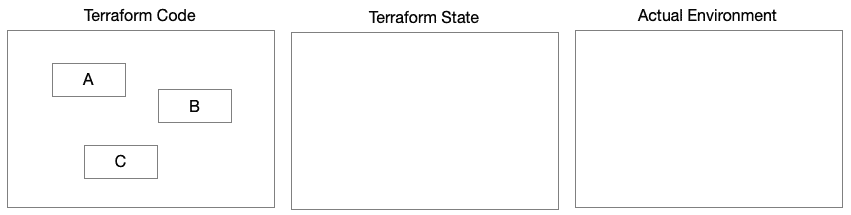

# 第一章：1

# 理解 Terraform 架构

从本质上讲，**Terraform** 是一个简单的命令行程序，它评估源代码，该源代码描述了期望状态应该是什么样的，随后将其与实际状态进行比较，构建一个计划，将实际状态转变为期望状态，并能够执行该计划。但不要让它表面上的简单性欺骗了你。Terraform 的内部复杂性体现在它的外部简单性中。

Terraform 是一个由 Go 编写的开源项目，维护着命令行可执行文件。它提供了诸如**HashiCorp 配置语言**（**HCL**）解析、状态管理、计划创建和执行等基础功能。

Terraform 极其强大，但具有讽刺意味的是，它本身做的很少。但有一个令人兴奋的部分：Terraform 的超能力来自于其可扩展性，这种能力不仅限于其创造者。实际的 Terraform 可执行文件本身不能做太多事情，但当与其插件——称为**提供者**——捆绑在一起时，Terraform 就能做很多事情！这种可扩展性证明了 Terraform 社区的协作性质，每个人都可以为它的成长和能力做出贡献。

本章将涵盖以下主题：

+   理解 Terraform 架构

+   理解 Terraform 状态

+   理解如何构建和使用模块

+   理解如何有效使用**命令行界面**（**CLI**）

Terraform 有四个超能力，使其与其他工具区分开来：*规划*、*可扩展性*、*配置语言*和*模块化*。一些工具可能共享其中的一些功能，但它们并不具备所有这些功能。拥有这些能力的组合，Terraform 在云自动化中是一款改变游戏规则的工具。

# 理解 Terraform 架构

Terraform 最显著的差异化特点是，它能够提前规划。让我们详细了解 Terraform 如何处理规划。

## 计划

在使用 Terraform 时，你将遵循一个过程，Terraform 用于分析现有环境。在进行此分析时，Terraform 确定代码中需要应用的（如果有的话）变更，以使实际环境保持最新。Terraform 将这些变更作为操作项列出在计划中。尽管 Terraform 代表我们执行这项分析，生成计划，并完全能够在环境中执行该计划，但我们仍然有责任审查计划，确定计划中的变更是否是我们所期望的：


图 1.1 – Terraform 资源是具有输入和输出的简单机器

Terraform 在这个分析中将环境中的每个组件表示为一个资源。资源是极其简单的机器。它们接受输入并产生输出。它们还可以连接在一起，从而在环境中的组件之间创建明确的关系。这些关系为 Terraform 对环境的分析和计划中列出的行动顺序提供了信息。

一旦我们决定这个计划是我们所期望的，我们会请求 Terraform 执行它。然后，Terraform 会将该计划应用到我们的实际环境中。这个过程的结果是，Terraform 会将我们的环境更新为代码中的描述。

Terraform 的设计鼓励开发者重复这一过程。因此，随着开发者更新代码，每次将代码应用到环境中时，我们将不断评估当前状态，并确定未来状态，以匹配代码所描述的环境。每次运行 Terraform 来评估环境时，它都会生成一个计划。这个计划是在评估实际环境与代码库之间差异时生成的。

在*第 1 天*，由于环境尚不存在，Terraform 必须创建开发者在代码中描述的所有内容。然而，到了*第 2 天*，事情变得更复杂了。在*第 1 天*，我们开始了清理工作。但在*第 2 天*，我们仍然需要确定我们的起点，因为 Terraform 已经提前配置过一次环境。自*第 1 天*以来，许多事情可能发生了变化。我们可能故意修改了代码库来更改环境。同样，*gremlins* 可能在夜间改变了我们的环境，从而引入了漂移，迫使我们回滚这些变化。

要分析现有环境，Terraform 会参考两个信息来源：**Terraform 状态**和环境本身——通过提供者（该提供者同样受 Terraform 状态的影响）。如果 Terraform 状态为空，Terraform 会假定环境不存在，并创建一个计划以创建所有内容：



图 1.2 – 资源计划，第 1 天：所有内容都需要被创建

如果 Terraform 状态已存在，事情就变得有趣了，Terraform 将不得不证明其价值。Terraform 会使用 Terraform 状态来分析环境，向提供者查询每个声明资源的健康状态和配置。根据这些结果，Terraform 会构建一组指令。一旦 Terraform 执行了这些指令，当前环境将与代码中描述的期望环境一致。然而，在 Terraform 第一次成功执行您的计划之后，如果您再次要求 Terraform 创建一个计划，它会查询 Terraform 状态并使用提供者来检查实际环境，看到不需要进行任何更改：


图 1.3 – 资源计划，第二天：环境中没有变化

为了生成这样的指令集，Terraform 必须生成一个完整的资源依赖关系图，以确定必须按什么顺序执行指令。资源之间的关系推断出这些依赖关系。如果一个资源将另一个资源的输出变量作为输入变量，Terraform 会判断这两个资源之间存在依赖关系：


图 1.4 – 依赖关系：一个资源的输入是另一个资源的输出

有时，Terraform 只有在执行完指令后才能知道其结果。因此，必然会有一个警告信息 `apply 后才知道`。然而，这个依赖关系图和随后的计划是 Terraform 机器的关键所在。

这个过程使得 Terraform 成为一个幂等工具，意味着它可以多次应用，而不会改变初次应用后的结果。幂等性并不仅仅是 Terraform 独有的，许多自动化工具也具有类似的功能。**Ansible** 就是一个很好的例子，它也确保重复操作不会改变状态，除非必要时进行更改。

### 执行阶段

Terraform 的核心工作流遵循三个阶段的过程：*初始化*、*规划* 和 *应用*：


图 1.5 – Terraform 执行阶段

让我们逐一检查每个阶段，看看我们的代码库中哪些部分正在被使用，以及 Terraform 正在执行哪些操作。

#### 初始化

首先，使用 `terraform init` 命令初始化 Terraform 工作空间，它会加载并配置所有引用的提供者和模块：


图 1.6 – Terraform 初始化加载提供者和模块依赖关系，并验证后台连接性

#### 规划

一旦 Terraform 初始化了其工作区，它可以使用 `terraform plan` 命令生成计划。尽管这个命令看起来简单，但它是一个非常复杂的过程。

首先，使用隐式（有时是显式）关系建立所有资源的依赖图。然后，Terraform 检查状态文件，确定是否已经配置了该资源。假设该资源存在于状态文件中，在这种情况下，Terraform 将通过相应的提供者与资源进行通信，并将所需状态与存储在状态文件中的预期状态以及提供者报告的实际状态进行比较。Terraform 会记录任何差异，并为每个资源创建操作计划。操作可以是*创建*、*更新*或*销毁*：


图 1.7 – terraform plan 使用一组输入变量评估当前代码库，并与工作区的 Terraform 状态进行比较。

#### 应用

一旦 Terraform 生成了计划，它可以选择使用 `terraform apply` 命令在实际环境中执行该计划。通过依赖图，Terraform 将按顺序执行每个资源操作。如果资源操作之间没有相互依赖，则 Terraform 会并行执行它们。在此阶段，Terraform 会不断与每个提供者进行通信，发出命令并检查相关提供者的状态。随着 Terraform 完成资源操作，它会不断更新 Terraform 状态：


图 1.8 – terraform apply 通过与提供者的通信执行计划，更新 Terraform 状态，并返回输出变量。

### 资源操作

当 Terraform 生成计划时，它会评估每个资源，确定是否需要更改以实现基础设施的期望状态。Terraform 会根据多种不同的情况判断是否需要对特定资源执行操作。

#### 创建

创建操作可以在三种情况下发生：

+   该资源是全新的。

+   某些非 Terraform 的操作删除了资源。

+   开发者以一种方式更新了资源的代码，以至于提供者要求销毁并重新创建该资源。

下面是添加新资源的示例：


图 1.9 – 添加新资源

当一个资源是全新的，它并不存在于 Terraform 状态文件中。例如，我们想创建一个 `vm001`。在这种情况下，Terraform 不会使用提供者来检查该资源是否存在。因此，您可能会遇到这种情况：计划生成成功，但当 Terraform 执行计划时，它会失败。这种情况通常是因为资源命名冲突，当另一个用户已为与 Terraform 计划创建的资源无关的资源分配了相同的名称（即某人已经创建了名为 `vm001` 的虚拟机）。这种情况可能发生在某人手动创建资源，或者即使资源是通过 Terraform 创建的，但位于不同的 Terraform 工作区，从而导致使用不同的 Terraform 状态文件。

**漂移**概念的一个典型例子是，当某人手动删除了 Terraform 之外的资源时：


图 1.10 – 漂移

当开发者更改资源时，有时提供者要求将其销毁并重新创建。例如，我们想将虚拟机的硬件配置从 4 核 CPU 和 16 GB 内存更改为 8 核 CPU 和 32 GB 内存。这种逻辑存在于提供者的资源级代码库中。您应仔细查看所使用资源的文档，以确保了解在更新过程中强制销毁并重新创建资源时可能出现的任何中断或数据丢失。

#### 更改

变更操作可以发生在两种情况下：

+   该资源已在代码中发生变化

+   该资源已在 Terraform 之外被修改

以下是更改现有资源的情况：


图 1.11 – 更新现有资源

这种更改不需要销毁并重新创建资源。它可能是一些简单的操作，比如更改资源的标签。这类更改也可能是由漂移引起的。例如，某人使用云平台的管理门户手动添加了一个新标签，但没有更新 Terraform 代码库。

#### 销毁

销毁操作可以发生在两种情况下：

+   开发者已从代码中删除了该资源

+   开发者更新了资源的代码，以至于提供者要求将其销毁并重新创建

以下是移除现有资源的情况：


图 1.12 – 移除现有资源

这可能是一个简单的操作，比如移除一个不再使用的资源——或者更可能的是，已经不再使用的资源。例如，移除对整个互联网的多余的 `22` 端口——这可能是个好主意！

资源操作计划可能会产生级联效应。自然地，如果一个资源是全新的，那么其依赖的资源也会变成新的。然而，最好在资源需要销毁并重新创建时保持谨慎。这个操作被称为**丢弃重建**（drop-create）操作。当资源在环境中扮演关键角色时，当发生丢弃重建操作时，通常会有一大片资源图也会被销毁并重新创建——通常是任何依赖于被丢弃重建资源的资源。

## 配置语言

当 Terraform 最初只是在 Armon Dadgar 和 Mitchell Hashimoto 的脑海中闪现时，业界已经有两种**基础设施即代码**（**IaC**）的范式：命令式，该范式通过 Chef 和 Puppet 等工具占主导地位，使用传统的编程语言，如 Ruby 和 Python。然而，也有声明式的方法，但大多数方法都只是编写大型复杂 JSON 文档的练习。

两大云平台，**亚马逊网络服务**（**AWS**）和**微软 Azure**，已经在各自的 IaC 解决方案中采用了资源类型化。AWS CloudFormation 和**Azure 资源管理器**（**ARM**）模板采用了一致的架构来描述各种类型的资源。每种资源类型都有一套标准属性，帮助平台定位适当的资源提供商来处理请求。同样，每种资源类型也有自己特定的属性和架构来配置其独特性。但是，这些解决方案仍然局限于各自的云平台内。

因此，在许多方面，业界已经为一个采用资源类型化的方法的解决方案做好了准备，从而打破了云服务提供商之间的壁垒，至少提供了一个能够在同一上下文中描述多个云平台上资源的工具。命令式和声明式方法都有各自的挑战。

命令式方法导致代码过于复杂、嵌套结构过多，并且复杂的状态检查逻辑使得代码库难以维护，快速变成“意大利面条代码”。此外，编程语言和平台的遗产可能会激起开发者阵营之间的宗教性竞争。

声明式解决方案则依赖于行业标准的文档格式，如**JSON**和**YAML**。这些格式鼓励简单的自上而下的方式，并由于其中立性避免了部落主义。然而，它们使得表示复杂表达式以及实现简单的迭代和循环变得困难，甚至像给代码添加注释这样的简单操作也无法实现，或者做起来非常繁琐。

Terraform 通过引入命令式语言的元素，如表达式和循环，并将其与声明式模型的优势相结合，从而带来了两者的最佳结合。声明式模型鼓励以简单的自上而下的方式定义环境中的资源。

**HCL** 使用简单的块定义，相比其他声明式解决方案，它能够更简洁地表示资源，但语法更像代码，所有块之间的链接都体现了云计算本质上基于资源类型的特点：

```
    resource "random_string" "foo" {
      length  = 4
      upper   = false
      special = false
    }
```

一个块的定义有三个部分：`resource`、资源类型是`random_string`，以及引用名称是`foo`。为了在资源之间创建依赖关系，我们使用引用名称和类型来访问资源的输出值：

```
resource "azurerm_resource_group" "bar" {
  name     = "rg-${random_string.foo.result}"
  location = var.location
}
```

在前面的代码中，我们通过引用名为`foo`的随机字符串的`result`输出值来创建一个 Azure 资源组。

这个简单的模式描述了我们如何将几十个，有时是上百个资源组合在一起，构建复杂的云架构：


图 1.13 – Terraform 资源的链式连接，其中一个资源的输出作为另一个资源的输入

使用这种模式在 HCL 中，Terraform 可以确定资源之间的关系，并构建一个计划来配置它们。最有趣和最聪明的地方在于，这其实只是一个连接点的精妙游戏。

## 模块化

一切都存在于模块中。当你创建第一个 Terraform 项目时，你无意中创建了第一个 Terraform 模块。这是因为每个 Terraform 项目都是一个根模块。在根模块中，你声明提供者，

Terraform 中的一个普遍模式是，当你编写资源、模块或数据源时，你会处理输入和输出。每个 Terraform 资源和数据源都以这种方式工作，你的整个 Terraform 工作区也是如此，这使得 Terraform 可以被整齐地嵌入到管道中的工具链中，以配置环境。

根模块并不一定是你编写的唯一模块。你可以创建可重用的模块，设计用来封装解决方案中可重复使用的部分，并可以跨根模块共享。根模块和可重用模块之间的区别在于，根模块是为部署一个或多个环境而设计的入口点。可重用模块只是定义有用模式或最佳实践的组件，它们可以帮助你节省每次创建新环境或类似解决方案时重复创建它们的时间。

现在我们已经高层次地了解了 Terraform 的架构，并理解了其核心技术，我们知道它包括 Terraform 命令行应用程序和 HCL 函数语言。我们还知道，Terraform 的超能力在于，核心技术的设计通过利用提供者来扩展，非常适应不同的平台和技术，并且内置的模块化使得实践者能够轻松创建简单或复杂的 IaC 解决方案，这些解决方案可以被打包并在不同团队和组织之间重用。

接下来，我们将深入探讨一个关键子系统，使 Terraform 能够在各种平台和技术上实现一致的、幂等的基础设施即代码（IaC）操作。

# 理解 Terraform 状态

Terraform 使用状态来记住在给定工作区中之前已配置的内容。一些 Terraform 的批评者在将其与 AWS CloudFormation 或 ARM 模板进行比较时指出，这些技术并不依赖于将状态保存在外部文件中的概念。当然，这仅仅是因为这些工具只支持单一的目标平台，并且可以与这些平台维护状态的专有方式紧密耦合。然而，Terraform 通过其灵活的插件架构，不能假设任何关于平台及其为每个目标平台配置的资源。因此，Terraform 需要回到最基本的层面，并确保它以统一和一致的方式知道自己之前配置了什么。

这种维护状态的方法提供了几个好处。首先，它统一地记录了 Terraform 在那些维护内部状态的以及那些不维护状态的平台上的配置内容。其次，它允许 Terraform 定义受管理和未受管理资源之间的边界。

这个问题就是经典的**侏罗纪公园问题**。在*侏罗纪公园*中，他们基因工程化了所有这些恐龙。他们在设计时考虑了种群控制——这样它们就无法交配——或者他们以为如此。在公园里，他们有所有这些复杂的系统来追踪恐龙的位置和数量。然而，他们设计的一个大缺陷是，他们只让系统查找他们基因工程化的恐龙。因此，他们的系统运行得完美无缺，能告诉他们所有他们创造的恐龙在哪里。你猜怎么着？恐龙的数量总是和他们预计的数量相符。这对侏罗纪公园来说是坏事，因为由于这个缺陷，他们没有意识到基因工程中的问题，使得恐龙能够交配。侏罗纪公园的恐龙数量过多，事情变得——嗯——有点失控：

f


图 1.14 – 侏罗纪公园问题

Terraform 只会查找它所管理的资源。它能做到这一点是因为它维护着一个状态文件。这个状态文件就像《侏罗纪公园》认为自己拥有的恐龙清单。对于《侏罗纪公园》来说，这种做法很糟糕。但对于 Terraform 来说，这是件好事：


图 1.15 – Terraform 忽略外部创建的资源，即便这些资源与 Terraform 创建的资源有依赖关系

为什么？因为并非所有资源都会——或需要——由 Terraform 创建和管理。通过清晰地界定 Terraform 负责的内容（以及它不负责的内容），它使 Terraform 在允许组织选择与 Terraform 互动的程度上更加灵活。一些团队和组织会从小处开始，只使用 Terraform 部署少量内容。与此同时，其他团队可能会非常积极，使用 Terraform 管理一切。不过，仍然可能存在 Terraform 无法识别的操作。Terraform 的状态文件构建了防护栏，确保 Terraform 只在其许可范围内工作，明确它可以处理哪些内容。这样做使得 Terraform 能够与其他工具兼容，并给予团队和个人在环境控制方面使用任何方法或工具的自由。

## 状态文件

Terraform 状态文件是一个 JSON 数据文件，存储在 Terraform 知道如何访问的某个位置。这个文件维护了一个资源列表。每个资源都有一个资源类型标识符和该资源的所有配置信息。

状态文件反映了我们在代码中描述的内容，但比代码中声明的内容要详细得多。以下代码生成一个长度为四个字符的随机字符串，且不包含大写字母和特殊字符：

```
    resource "random_string" "foo" {
      length  = 4
      upper   = false
      special = false
    }
```

运行 `terraform apply` 后，Terraform 会生成一个状态文件，其中包含相同的资源，但会提供更多上下文信息：

```
    {
      "mode": "managed",
      "type": "random_string",
      "name": "foo",
      "provider":
"provider[\"registry.terraform.io/hashicorp/random\"]",
      "instances": [
        {
          "schema_version": 2,
          "attributes": {
            "id": "vyoi",
            "keepers": null,
            "length": 4,
            "lower": true,
            "min_lower": 0,
            "min_numeric": 0,
            "min_special": 0,
            "min_upper": 0,
            "number": true,
            "numeric": true,
            "override_special": null,
            "result": "vyoi",
            "special": false,
            "upper": false
          },
          "sensitive_attributes": []
        }
      ]
    }
```

`provider` 和 `type` 实例有助于识别该资源的类型以及开发者使用的 Terraform 提供者。

资源属性中的 `schema_version` 参数有助于识别当前资源是否与提供者的当前版本兼容。如果不兼容，它可以帮助提供者判断如何将资源升级到最新版本的架构。

## 部分资源管理

由于 Terraform 本身是一个 **开源软件** (**OSS**)，并且内置假设这些云服务商是各自独立的软件，在不断演化，与 Terraform 提供者的更新速度不同，因此会有一段时间，云服务商会推出 Terraform 无法识别的功能。

当这种情况发生时，我们不希望 Terraform 与云提供商争论禁用这些功能，仅仅因为 Terraform 无法识别它们。这个场景非常常见，因为当一个环境由 Terraform 和特定版本的 Terraform 提供程序管理时，它自然而然地会出现。随着 Terraform 提供程序不断增加新功能以跟上目标云平台的步伐，提供程序版本在 Terraform 代码中并不总是保持最新——而且它不必一直保持最新。

假设我们使用 Terraform 和 v1.0 提供一个环境，使用的是我们最喜欢的云平台的 Terraform 提供程序。第二天，我们最喜欢的云提供商增加了一个令人惊叹的功能，Feature X。我们依然使用相同的代码和 Terraform 状态文件，但我们非常渴望尝试 Feature X。然而，我们使用的是最新版本的 Terraform 提供程序——v1.0——它并不支持 Feature X。

我们该怎么办呢？嗯，我们可以等着我们那些贡献于 Terraform 提供程序开源项目的友好的互联网陌生人来增加对 Feature X 的支持。但是，我们不知道什么时候会有支持。

我们提到过我们非常渴望尝试 Feature X 吗？如果我们实在等不及，我们可以直接在我们最喜欢的云平台上启用 Feature X。*这样不会造成偏差吗*，你可能会问？在正常情况下——是的——因为我们在使用最喜欢的云平台的网页界面修改 Terraform 管理的资源。通常，下次我们运行 `terraform apply` 时，Terraform 会检测到资源在外部环境发生了变化，并将这些更改回滚。但是，由于我们使用的是 v1.0 版本的 Terraform 提供程序，Terraform 对 Feature X 幸灾乐祸地一无所知。因此，我们对 Feature X 配置所做的任何更改都不会被 Terraform 注意到。这也意味着，如果你删除了那个 `terraform destroy` 资源并重新创建它，你将不得不再次去门户网站手动重新配置 Feature X。

也就是说，直到我们升级到 v1.1 版本的 Terraform 提供程序，而该版本是在我们手动在资源上设置 Feature X 的第二天发布的。现在，我们正在使用 v1.1 版本的 Terraform 提供程序，Terraform 用来将该服务部署到我们最喜欢的云平台的资源现在已经知道了 Feature X。如果我们的代码没有变化，它会认为 Feature X 不应该被启用，并且会将其移除。

为了避免这种情况，我们需要仔细使用 v1.1 版本的 Terraform 提供程序运行 `terraform plan`，查看 Terraform 在使用这个升级版本的提供程序时计划做出哪些更改。然后，我们需要更新我们的代码以按现有配置配置 Feature X。一旦我们完成这个操作，Terraform 会看到无需做出更改，且 Terraform 将会将 Feature X 纳入管理：


图 1.16 – 管理随着新云平台功能的创建、通过 Terraform 提供者暴露并在 Terraform 代码库中采纳所发生的持续变化

现在我们已经了解了 Terraform 如何维护状态以及这一架构方面如何影响 Terraform 创建和执行计划，让我们转向一个更实际的话题：开发和使用模块。

# 理解如何构建和使用模块

Terraform 最强大的功能之一是它组织和打包可重用代码的便捷性，这增加了代码库的可维护性并提高了架构中常见模式的可重用性。

传统开发者相对容易——你只需要创建一个新方法来封装可重用的代码块。而在其他基础设施即代码（IaC）工具中，实现同样的功能却是一个挑战。在 Terraform 中，你所需要的只是一个新文件夹。

Terraform 将每个模块作用域限定在一个文件夹内。当你运行`terraform init`时，Terraform 会将当前工作目录转变为工作区的根模块。你可以通过使用相对路径来引用存储在同一仓库内其他文件夹中的模块。在 Terraform 社区中，将本地模块存储在接近根模块目录的`modules`目录下是一种标准约定。

考虑一下这个文件夹结构：

```
     /terraform
          /modules
               /rando
          /root
```

根模块的路径是`/terraform/root`。`rando`模块的路径是`/terraform/modules/rando`。

考虑根模块的内容：

```
     main.tf
     outputs.tf
     variables.tf
     versions.tf
```

上述文件列表是模块文件结构的典型约定。在`versions.tf`文件中，你应该声明`terraform`块，该块包含 Terraform 版本及每个引用的 Terraform 提供者和它们对应的版本。

在`variables.tf`文件中，你应该声明该模块期望的所有输入变量。将所有输入变量集中声明在一个地方是非常重要的，这样可以让模块的使用者更容易理解该模块的合同。

同样，在`outputs.tf`文件中，你应该声明该模块将生成的所有输出值。

由于可以在文件夹内的任何 `.tf` 文件中声明输入变量和输出，因此没有什么阻止你采用这种方法。然而，你不希望其他开发者需要扫描模块文件夹中的每个文件，寻找 `variable` 块，以便清楚了解模块的接口。

在`main.tf`文件中，你应该声明模块的*核心*内容。这是发生魔法的地方。然而，你并不局限于只有一个文件。根据需要，你可以创建额外的`.tf`文件，将更复杂的模块更好地组织成相关资源的不同部分或分组。

我们需要理解相对路径，以便从根模块引用 `rando` 模块。这个相对路径是基于根模块的工作目录来计算的。因此，`rando` 模块的声明应该如下所示：

```
    module "foo" {
      source = "../modules/rando"
    }
```

`source` 元素是每个 `module` 块的必需属性。你会注意到，声明模块与声明资源或数据源稍有不同。例如，声明模块时省略了资源类型。这是因为 `module` 块既是一个块类型，也是一个资源类型。因此，除了模块块的定义外，我们只需要一个引用名称。

我们可以通过简单地认识到 `module` 是资源类型来引用模块的输出值：

```
    locals {
      dynamic_name = "foo-${module.rando.result}"
    }
```

如你在前面的代码中看到的，我们引用了名为 `foo` 的模块上的 `result` 属性，因为模块不像资源类型那样具有描述性，因此在引用名称中提供更多的细节就显得尤为重要。

现在我们已经理解了创建和引用自定义模块的基础知识，让我们更深入地探讨模块设计的问题。

## 模块设计

在许多方面，在 Terraform 中创建模块的决定与在传统编程语言（如 Java 或 C#）中决定编写新方法相同。

就像在传统编程语言中一样，你可以在一个文件中从头到尾编写所有代码，使用一个方法，如果有重复的部分，你会复制粘贴它们。

就像在传统编程语言中一样，编写封装重复代码块的方法是有原因的。否则，如果你没有将这些代码封装到方法中，就必须反复复制粘贴。

关于何时创建模块与仅将其放在根模块中的决定是一个重要的决策。你应该有充分的理由来创建模块。你应该始终关注价值。当某人使用你的模块时——可能是你自己或你的团队——使用它是否让他们的生活更轻松？

### 根模块

在 Terraform 中有许多不同的方式来设置根模块。关于哪种方法最好，辩论仍在继续，有些人强烈支持一种方法。了解不同的方法很重要，这样你就能在看到它们时识别出来，并评估哪种方法最适合你。

#### 每个环境一个文件夹

一种常见的根模块结构化方法是为每个你想要提供和维护的环境设置不同的文件夹。在这种方法中，每个长期存在的环境都有一个文件夹。这个文件夹包含一个可以独立于其他环境的根模块。考虑以下文件夹结构：

```
     /terraform
          /dev
               main.tf
               versions.tf
               variables.tf
               terraform.tfvars
          /test
               main.tf
               versions.tf
               variables.tf
               terraform.tfvars
          /prod
               main.tf
               versions.tf
               variables.tf
               terraform.tfvars
```

上述文件夹结构包含三个环境：`dev`、`test` 和 `prod`。每个环境都有自己的根模块，完全与其他模块隔离。它有自己的 `required_providers` 块，并定义了自己的提供程序声明。这种方法在每个环境之间有强隔离，几乎每个部署的方面都可以在不同环境中进行调整。Terraform 版本、提供程序版本以及解决方案中使用的其他模块版本、输入参数及其值都在对应环境文件夹中的文件内进行定制。

这种方法更常见于那些不熟悉使用 GitFlow、管理其他分支并跟随 `develop` 到更成熟分支（例如，`main`——生产代码所在的分支）的实践者。

#### 每个环境的变量文件

另一种技术是维护一个单一的 Terraform 代码库，并为每个环境使用多个输入变量文件。这种方法侧重于在环境之间保持一致性和兼容性。采用这种方法时，更难在环境之间做出大规模的结构差异，因为合并分支之间的更改会变得困难。

请考虑以下文件夹结构：

```
     /terraform
          /modules
               /solution
                    main.tf
                    versions.tf
                    variables.tf
          /env
               dev.tfvars
               test.tfvars
               prod.tfvars
          main.tf
          versions.tf
          variables.tf
          terraform.tfvars
```

与之前的方法一样，我们为每个环境创建了明确的文件夹，这种方法仍然允许环境之间的变化，但需要你为每个环境维护长期存在的分支，以便在你对根模块的核心结构进行更改时。这种方法更符合一种名为 GitFlow 的软件开发流程（更多内容请参见 *第六章*）。

这种方法的关键特点是，环境差异通过不同的输入变量值保存在对应的 `.tfvars` 文件中。目标是将环境之间的任何变化最终存储在这些文件中，并且每个环境的代码库——存储在几个长期存在的源代码分支中——最终会相互镜像。这使我们能够在生产环境和开发环境之间拥有不同的大小和数量，并在每个环境中保持架构和配置的一致性。

### 可重用模块

现在我们已经控制了根模块，是时候开始思考何时创建可以在根模块中使用的可重用模块，从而构建精密的云架构，推动我们的应用程序和解决方案。

#### 复杂性的封装

你计划在模块中封装的资源数量是一个重要的衡量标准，因为它可以表明你通过创建模块是在减少复杂性，还是在增加复杂性（剧透警告：增加复杂性是不好的）。模块的资源数量可以从一个资源到几十个，甚至是成百上千个资源不等。在考虑将资源放入模块时，你应该考虑当有人使用这个模块时，你所带来的价值。

如果你的模块仅封装了一个资源块，那么通过直接引用该资源，你的代码可能会更简单。在这种情况下，模块只是对你正在配置的基础资源增加了一层抽象。如果仅仅是这样做，那么你需要进一步简化复杂性，以证明创建模块的必要性。

假设你的模块封装了一些紧密相关的资源，这些资源高度依赖于彼此，并且与其他资源的集成点有限。例如，创建一个 NSG 和一组规则。当你创建一个封装这些紧密耦合资源的模块时，这可能是个好主意，因为它将使得开发人员创建 NSG 变得更加简洁和容易。在这种情况下，这就是创建模块的最佳时机。你可能需要为一个或两个额外的输入变量换取一个或两个额外的相应资源块。这是一个不错的权衡：


图 1.17 – 模块设计：封装复杂性

前面的图示显示，该模块正在配置三种资源类型。我们的模块定义了一个单一的接口，用来配置这一组资源。一些简单的输入变量，`A` 和 `B`，被传递到主资源和子资源 1 中。一个更复杂的输入对象，`C`，它恰好是一个数组，被传入并用来为列表中的每个项构建资源块。

#### 重复模式

另一种常见的情况是，当你有许多资源，并希望根据集合的大小（无论是列表还是映射）进行重复。在这种情况下，你应该告诉每个资源你希望它重复多少次，并传入所有的输入变量以满足其需求：


图 1.18 – 模块设计：在模块内重复

然而，如果你将重复使用的资源封装进模块，而不是重复每个资源，你将重复模块。这种方法可以显著提高代码的可读性和可维护性：


图 1.19 – 模块设计：在模块外重复

模块的外部消费者负责对模块资源本身进行迭代：

```
    module "foo" {
      source = "../modules/rando"
      count  = 5
    }
```

通过将迭代器应用到模块本身，我们能够实现与在模块中为每个资源添加`count`并将资源数量作为输入变量传入模块相同的结果。然而，在模块内操作每个资源会变得更加困难。

当你设计模块以便由父模块重复使用时，你的模块不需要考虑父模块希望在集合中创建多少个资源的复杂性。每个模块实例只需关心每个资源的一个实例。

它是否以某种方式简化或扁平化资源，使得资源更容易使用？

如果你是从零开始，最好让这些模式随着时间的推移自然形成。方法中的代码本质上是具有强烈个人观点的代码。一旦你确定了一个模式，所需的只是销毁、重构和重新应用，你就可以使用你的新模块了。

销毁整个环境并重新开始并非总是一个可行的选择。这种方法只能在开发或测试环境中使用。在生产环境中，你需要采取不同的方法。

有时，你可以编写一个在多种场景中都能使用的方法。这种方法在开发框架代码时最为常见，尤其是当框架处理的是一个横向问题空间。但有时方法的设计是为了完成某些非常特定的任务。

同样的原则适用于 Terraform 模块设计。有些模块非常灵活，设计成框架化的，而另一些模块则更像是*嘿，我想做这个特定的事情，并且想让它保持简单*。对于场景驱动的模块，其接口会非常简单，因为它只是将依赖输入导入模块的作用域，模块所需的那些依赖，而模块自身在其作用域内没有这些依赖。

框架模块通常具有更复杂的接口；因此，它会有更多的杠杆，供模块使用者操控。有时，这些输入不再是简单的基本类型（`string`、`bool`、`number`）；它们是你需要构造并传入的复杂对象。随着模块支持的场景数量增加，模块的复杂性也会增加。你需要传入更多的参数来配置它。随着这些复杂对象的增加，传递它们会变得更加繁琐且容易出错，因为你可能需要使用局部变量实现更多的对象构造逻辑。

大多数 Terraform 提供者的资源都不需要你构造复杂的对象来使用。你将使用基本类型，有时是集合类型和嵌套块。

然而，在构建模块时，你确实可以创建复杂对象作为输入变量。你应该避免过于复杂的数据结构，因为它会增加复杂性。通常，资源之间的依赖关系较小。所以，如果你只需要小路径来连接两个对象，为什么要创建庞大的 **数据传输对象**（**DTOs**）来传递上下文呢？这样会让代码更易于理解和维护。未来的开发者和你的模块使用者会像在糟糕的传统软件中那样诅咒你的名字。

我曾见过一些软件，在这些软件中，方法是将所有内容都定义为字符串，而不是使用正确的原始类型，如 `bool` 和 `number`。这样可以吗？当然可以。但这使得理解变得容易吗？是否会增加额外的复杂性，例如不断将输入值在字符串和其正确类型之间进行类型转换？你应该使用正确的类型并简化接口。

我们需要在使用复杂类型和模块输入变量过多之间找到平衡，因为过多的输入变量会影响环路复杂度，使得维护变得困难。然而，与其他语言不同，使用复杂对象时，HCL 的工作方式具有挑战性。在构建和转换大型复杂数据类型时，开发人员可能效率较低。HCL 在声明和关联资源时非常适合开发人员，尤其是通过将输出变量传递到输入变量。

## 使用模块

现在我们理解了在设计模块时的考虑因素，以及如何设计良好的模块，让我们来看看如何使用和管理模块，从小型场景驱动的模块到强版本控制的框架模块。

### 本地模块

本地模块可以在 Terraform 解决方案中最大化代码重用，而无需建立和维护单独的模块仓库。

使用本地模块来实现特定于应用程序的模式，例如架构中的组件或层，是组织 Terraform 代码的一个好方法。部署到云中的一个典型模式是活跃-活跃、多区域部署。在这种情况下，您应该设计模块来将应用程序部署到单一区域，然后使用 `count` 或 `for_each` 元参数将该模块部署到一组可配置的区域：


图 1.20 – 使用模块封装云平台单一区域中提供的资源

通过这种方法，你可以在根模块中创建负载均衡资源，将流量分配到各个区域的端点，同时在所需区域的多个实例中部署区域模块。

当当前项目中只使用该模块时，这种消费方式是理想的。这个场景可以在分层或多区域架构中体现出来。

### 远程仓库

使用外部模块是充分利用你架构中高度可复用模式的最佳方式。Terraform 允许你引用一个不存储在项目源代码仓库中的模块。引用远程模块最常见的方式是通过 Git 仓库。这种方法适用于任何 Git 兼容的仓库，从 GitHub 到 Azure DevOps 再到 GitLab。

将你的模块公开发布到开放的互联网上使得从任何源代码仓库（无论是公共的还是私有的）引用它们变得极为简单。然而，在一些企业场景中，公共仓库是不允许的——公司治理可能只允许私有仓库。在这些情况下，你必须选择一种身份验证机制，以便作为最终用户以及在你的流水线中访问这些模块。你可以使用 SSH 密钥或公共访问令牌来验证私有的远程 Terraform 模块仓库。

一旦你完成了对存储模块的 Git 仓库的身份验证，你就必须在源代码中引用该模块：

```
    module "foo" {
      source = "git::ssh://git@ssh.dev.azure.com/v3/{AZDO_ORG}/{AZDO_PROJECT}/{AZDO_REPO}//{MODULE_PATH}"
    }
```

上述示例展示了如何引用托管在 Azure DevOps 上 Git 仓库中的特定模块。采用这种方法，你将访问 Git 仓库的默认分支，通常为 `main`，并获取该分支的最新提交——这通常不是一个好主意。

正确的方法是为特定模块版本指定一个引用。当你使用 `ref` 查询字符串参数来指定 Git 仓库 URL 时，你可以定位到 Git 仓库中的特定标签、分支或提交：

```
    module "foo" {
      source = "git::ssh://git@ssh.dev.azure.com/v3/{AZDO_ORG}/{AZDO_PROJECT}/{AZDO_REPO}//{MODULE_PATH}?ref={AZDO_TAG}"
    }
```

标签是保证特定版本的理想方法，因为在 Git 仓库中创建标签不需要更改分支策略。一旦你完成模块的测试，就可以推送一个标签，并放心地知道当你将该标签作为 `ref` 参数时，你总是能获取到该模块的确切版本。

### Terraform 注册表

HashiCorp 提供了一种机制，供第三方模块发布者分发他们的模块。这个仓库可以通过 `registry.terraform.io` 访问，并且在一个公开可访问、稳定且版本化的环境中，存放了大量的 Terraform 模块。当你在此发布模块时，必须满足特定要求，以便你和其他人可以通过简单的名称和版本来引用该模块：

```
    module "caf" {
      source  = "aztfmod/caf/azurerm"
      version = "~>5.5.0"
    }
```

Terraform 模块注册表最终在后台使用 GitHub，因此你实际上是在引用 GitHub 仓库中的模块。然而，它允许你使用简化的模块名称和版本，而无需 GitHub 仓库的额外复杂信息。

现在我们知道如何使用模块构建更易管理的 IaC 解决方案，并理解模块可以在不同的上下文中提供不同的功能，接下来我们将更好地理解 CLI，以便我们可以围绕 Terraform 构建自动化，将其集成到我们的发布管道和 CI/CD 过程中。

# 理解如何有效使用 CLI

现在我们已经了解了 Terraform 的核心架构，接下来我们将研究其 CLI 以及如何与之互动。有很多不同的命令，但我们将重点讨论实现核心 Terraform 工作流的重要命令。我建议你探索 HashiCorp 的文档，以了解一些更冷门的命令，稍后在 *第十七章* 中，当我们讨论如何使用 Terraform 管理现有环境时，我们将介绍一些在此上下文中有用的命令。

## init

这是一个重要的命令，可能是你在使用 Terraform 时执行的第一个命令。原因在于，Terraform 是在工作目录中运行的，而不像其他工具（例如 ARM 或 CloudFormation）在单个文件上操作，或者像 Ansible 在入口文件上操作。Terraform 还依赖于隐藏目录来加载关于工作空间的重要上下文。这种方法与 Git 在克隆仓库时的工作方式非常相似。因此，我们必须允许 Terraform 设置一切，使其所需的所有东西都在正确的位置并使其能够正常运行。`terraform init` 命令正是执行这一操作：

```
    terraform init
```

Terraform 初始化命令完成了几项工作：

+   提供程序安装

+   模块安装

+   后端初始化

### 提供程序安装

首先，它分析目录并搜索提供程序声明，下载并安装这些提供程序。它不会连接到这些提供程序，所以成功的 `init` 过程并不表示你的提供程序凭证是有效的。它表示你指定的提供程序及其特定版本存在，并且已被安装。作为 Terraform 的扩展，每个提供程序只是一个 Terraform 与之交互的 Golang 可执行文件。因此，Terraform 需要下载并将该可执行文件放置在某个位置，以便在需要时执行它。

每个提供程序的二进制文件会被下载并存储在 `init` 过程创建的隐藏目录中。这些隐藏目录及其内容使得其他 Terraform 操作能够正常运行。然而，这些文件并不需要特殊保护，所以如果你不小心删除了它们（或者故意删除），也不必过于担心。要恢复它们，只需重新运行 `init`，Terraform 会像之前一样重新生成这些文件。

### 模块安装

第二，Terraform 会分析工作目录并搜索代码库中的模块声明。然后，它会从各自的源位置下载并安装这些模块。无论你是使用相对路径还是远程的 GitHub 仓库引用模块，都无关紧要；Terraform 会下载该模块文件夹的本地副本，并将其存储在 Terraform 执行时使用的隐藏目录中。与提供程序二进制文件类似，这些模块文件必须存在，才能确保将来 Terraform 操作的成功。同样，像提供程序二进制文件一样，这些文件无需保护，因为 Terraform 会通过一次 `terraform init` 调用自动带回它们。

如果你正在开发可复用的模块，你很可能同时在一个根模块中使用这些模块来进行测试。你在根模块的文件夹中运行 `terraform init`，而根模块会引用你的可复用模块。需要注意的是，如果你修改了模块，仅仅重新运行 `init` 并不会自动带入这些更新。如果模块引用的版本没有变化，Terraform 会检查加载模块的文件夹，看到它已经下载了该模块的版本。要强制重新下载模块的副本，你需要增加模块的版本（在模块开发期间，这可能会显得繁琐），或者通过从 `.terraform` 目录中手动删除模块来清空它们。

### 后端初始化

最后，Terraform 会在工作目录的 `.tf` 文件中的 `terraform` 块里寻找一个 `backend` 块。大多数后端需要一些配置设置才能工作。最终，Terraform 后端提供了一个存放 Terraform 状态文件的位置，因此这些配置设置会引导 Terraform 后端如何找到 Terraform 状态文件。

例如，要使用 ARM 后端，你必须指定一种方式来三角定位到正确的 Azure Blob 存储账户容器状态文件。Terraform 在到达目标状态文件位置的过程中会经过多个标志：首先是存储账户所在的资源组，然后是存储容器所在的存储账户，再接着是状态文件所在的存储容器，最后是状态文件的名称，Terraform 通过 `key` 值和当前的 Terraform 工作区名称来定位它。

完整的 Azure Terraform 后端配置会使用 `key` 值和当前的 Terraform 工作区名称。

完整的 Azure Terraform 后端配置如下所示：

```
    terraform {
      backend "azurerm" {
        resource_group_name  = "rg-foo"
        storage_account_name = "stfoo"
        container_name       = "tfstate"
        key                  = "foo.tfstate"
      }
    }
```

Azure 后端将使用`resource_group_name`、`storage_account_name`和`container_name`来找到 Azure 上存储文件的位置。然后，`key`和工作区名称将用于制定状态文件的名称。如果你使用的是默认工作区，那么状态文件的名称将是`key`的值。然而，如果你使用一个命名工作区，Azure 后端将生成一个类似`foo.tfstate:env:prod`的状态文件名称，表示一个名为`prod`的工作区。

每个 Terraform 后端插件都有不同的策略来读取和写入状态文件，以及生成最终存储状态文件的状态文件名的逻辑。了解你的提供者、可用的后端以及如何配置它是至关重要的。

## 验证

`terraform validate`是一个有用的方法，实际上它是最接近编译器的东西。它分析作用范围内的所有代码文件，验证引用和语法。如果有任何对数据源或资源的引用断裂，运行此命令将帮助你在无需初始化后端的情况下找到它们。因此，`validate`命令是一个有用的命令，作为早期警告，用于在你继续其他步骤之前检测代码中的任何问题。

## 工作区

`terraform workspace`是关于创建同一个 Terraform 解决方案的分支，以便拥有不同的实例或分支的 Terraform 状态。就像在源代码中一样，当你创建一个分支时，目标是修改代码，这些修改将长期保持。因此，你可能永远不会将新分支的代码库合并到`main`分支。

不管你是否意识到，你正在使用 Terraform 工作区。只是你没有使用自定义命名的工作区。你可以通过运行`terraform workspace show`命令来发现这一点，它会显示`default`。

为每个长期存在的环境创建一个新的工作区是一个好主意——即使你计划将后端进行分段。

运行`terraform workspace new dev`将为你的开发环境创建一个新的工作区。你可以对生产环境运行相同的命令，例如`terraform workspace new prod`。从此以后，任何利用状态的 Terraform 操作都将使用所选工作区的状态文件。你可以通过像这样切换工作区来在这些状态文件之间来回切换：`terraform workspace select dev`或`terraform workspace select prod`。

使用工作区时，你可能会创建一个工作区来测试某些内容，目的是最终在原始工作区中进行相同的更新。

工作区代表完全不同的环境，因为开发环境总是与测试、预发布或生产环境略有不同。这些环境将生活在孤立的工作区中，并在它们的状态文件中具有相同的隔离性。

共同的主题是工作空间基于相同的代码库。其思想是你将拥有相同的代码库，并利用它部署多个环境——很可能是长期存在的环境，但不一定如此。

## 计划

`terraform plan` 是一个只读操作，它需要访问你的后端状态，并要求你先执行 `terraform init`。此外，如果你使用的是非默认工作空间，你应该在运行 `plan` 之前选择你的工作空间。`terraform workspace select` 命令可以让你做到这一点。

`terraform plan` 将执行一个只读操作，检查状态文件并与状态文件中的每个资源进行核对。这个过程可能需要一些时间，具体取决于状态文件中有多少资源以及提供程序与其交互的响应时间。因此，为了保持你的 Terraform 项目精简和高效，考虑将一个 Terraform 工作空间的作用范围限制在多大范围内。

如果代码块太大，你可以考虑将其拆分为子工作空间。我见过一些项目，其中一个完整的解决方案放在一个 Terraform 状态文件中，执行一个计划就需要 45 分钟。如果工作空间隔离过于宽泛，会变得非常痛苦，我强烈建议你考虑系统组件的边界，并组织你的 Terraform 工作空间，使其成为较小、半依赖的工作空间。工作空间之间有依赖关系是可以的，但你需要通过数据源来明确这些依赖关系，避免出现两个 Terraform 工作空间之间的循环引用问题。

Terraform 需要在运行 `plan` 操作之前设置所有输入变量。你可以通过三种方式完成：通过单个命令行参数、变量文件和环境变量。

**单个命令行参数**对于具有交互式命令行会话的小项目非常有帮助，但当环境变得更加复杂或你希望使用管道工具时，这种方法很快就变得难以管理——这是我们本书的主要讨论场景。

**环境变量**方法在管道工具方法中起着重要作用，因为它允许你在不修改命令参数的情况下执行 Terraform 命令。

## 应用

`terraform apply` 是工具集中的最关键操作。在执行之前，该命令需要先成功执行 `terraform init`。选择与指定输入参数对应的正确工作空间也至关重要。

`terraform apply` 与其他操作相比也有其独特之处：你可以通过指向单个文件来执行它，而不是一个工作目录。`terraform plan` 命令输出计划文件。如果没有指定计划文件，`terraform apply` 会在 `apply` 阶段之前执行计划。

最佳实践是在执行 `apply` 时总是传入一个计划文件。这样做可以确保您在执行时没有任何意外。然而，仍然有可能在您上次运行 `plan` 和最终执行 `apply` 之间，环境中发生了变化。

这在多个团队成员可能对环境进行更改时尤为重要，无论是通过本地使用 Terraform 还是通过 CI/CD 管道。更改也可能通过云平台管理门户中的手动更改引入到 Terraform 之外。当您运行 `terraform apply` 时，使用 Terraform 计划文件将有助于确保您执行的计划与您在资源配置时的意图保持一致，并且利用了当时可用的最佳信息。

与 `plan` 一样，输入变量的值可以通过多种方式进行设置。

## 销毁

`terraform destroy` 是您可以完全删除整个环境的命令。具备此能力在您的解决方案跨多个目标平台的逻辑组或使用多个提供商时尤为有利。

### 逻辑容器删除

一些平台使管理相关资源的生命周期变得简单。例如，Microsoft Azure 要求每个资源在资源组内进行配置，在 **Google Cloud Platform** (**GCP**) 中，所有资源都在项目的上下文中进行配置。Azure 资源组和 Google Cloud 项目是您可以用来快速清理的逻辑容器，通过级联删除操作实现。缺乏此功能的平台则会使清理工作变得非常繁琐，比如在 AWS 中，您必须导航到许多不同的门户页面，以确保删除所有资源。精明的命令行高级用户可以通过精心设计的标签方案将清理脚本串联起来。然而，像 Terraform 这样的工具在通过单一命令删除您所配置的所有资源时，提供了极大的价值。

### 跨平台删除

即使在具有逻辑容器的云平台上，为了共同管理相关资源的生命周期，您仍然需要处理在其他系统或平台中配置的关联资源。

# 总结

在本章中，我们深入探讨了 Terraform 的架构，重点关注两个关键的架构组件：状态和模块化。充分理解 Terraform 的架构对您有效使用 Terraform 至关重要。最后，我们还介绍了 Terraform 的命令行接口（CLI），这将使您在准备好后能够将 Terraform 与您自己的 CI/CD 管道集成。在下一章中，我们将探索 HCL，以便为使用 Terraform 构建基础设施即代码（IaC）奠定基础。
