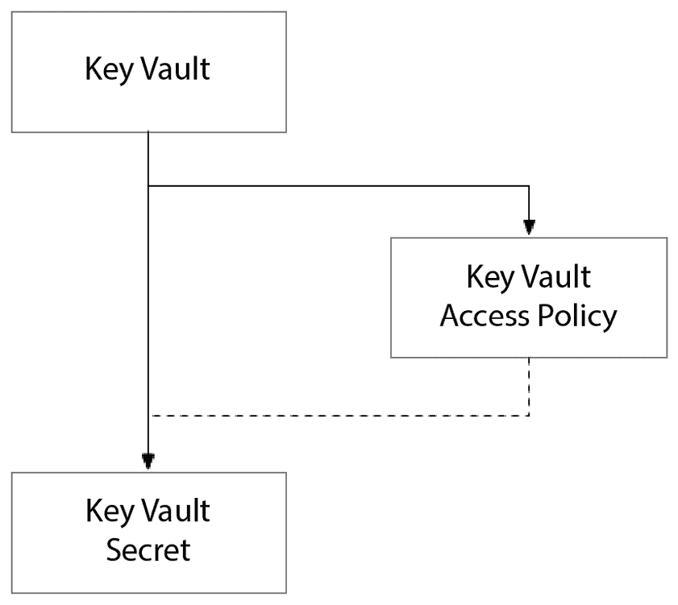
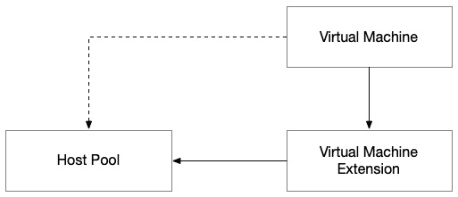
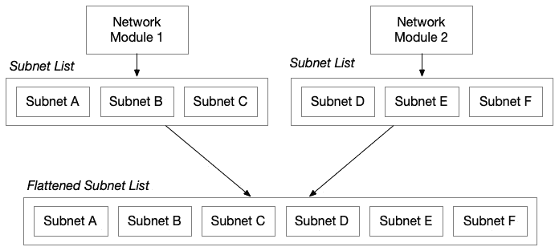
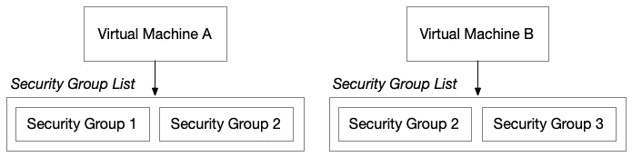
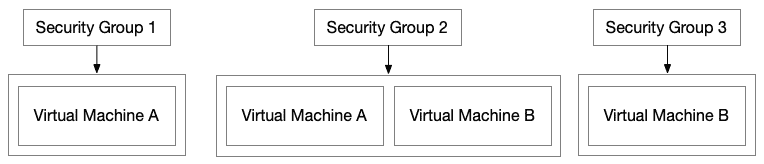
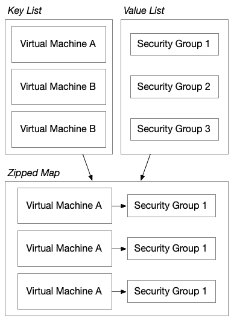

# 2

# 使用 HashiCorp 配置语言

在第一章中，我们研究了 Terraform 的架构。它是一个简单的命令行工具，接收代码并创建一个计划，之后可以根据用户的要求执行。在这一章中，我们将研究如何利用 Terraform 的语言——**HashiCorp 配置语言**（**HCL**）——来定义基础设施作为代码，以便我们可以使用 Terraform 构建复杂的云架构。

本章涵盖以下主题：

+   资源和数据源

+   本地变量和类型

+   变量和输出

+   元参数

+   循环和迭代

+   表达式

+   函数

# 资源和数据源

资源和数据源在 Terraform 中扮演着至关重要的角色，它们可能是最重要的语言构造，理解它们非常关键，因为它们允许你访问现有资源并创建新资源。

## 资源

资源是你在 HCL 编程时最常使用的块。`resource` 块就是 Terraform 的核心。你可以将每个资源视为 Terraform 将在现实世界中配置的某物的数字双胞胎：

```
    resource "random_string" "foobar" {
      length  = 4
      upper   = false
      special = false
    }
```

块的定义包含三个部分：`resource`，资源类型是 `random_string`，引用名称是 `foobar`。为了在资源之间创建依赖关系，我们使用引用名称和类型来访问资源的输出值：

```
    resource "azurerm_resource_group" "foobar" {
      name     = "rg-${random_string.foobar.result}"
      location = var.location
    }
```

在前面的代码中，我们通过引用 `foobar` 随机字符串的输出值 `result` 来创建一个 Azure 资源组。

每个 Terraform 提供者中的资源都是一个小型的半独立计算机程序，旨在管理特定的底层系统架构。这些资源定义了一个架构，允许你控制这些底层组件的配置。有时，这个架构是简单的；而有时，它可能非常复杂，由原始类型属性和额外的自定义块定义组成，嵌套在资源块中。

这些嵌套块允许你在一个资源中声明一个或多个子资源。资源决定了它期望的每种类型的嵌套块的数量。有时，资源允许多个相同的嵌套块实例，而有时，它们可能只允许一个。

例如，Azure Cosmos DB 服务允许你创建超大规模的 NoSQL 数据库，并迅速在多个地理位置之间设置复制。每个地理位置都是 Cosmos DB `resource` 块中的嵌套块：

```
    resource "azurerm_cosmosdb_account" "db" {
      name                = "cosmos-foobar"
      location            = azurerm_resource_group.foobar.location
      resource_group_name = azurerm_resource_group.foobar.name
      offer_type          = "Standard"
      kind                = "MongoDB"
      consistency_policy {
        consistency_level = "Eventual"
      }
      geo_location {
        location          = "westus"
        failover_priority = 0
      }
      geo_location {
        location          = "eastus"
        failover_priority = 1
      }
    }
```

正如你所看到的，`geo_location` 块在 `azurerm_cosmosdb_account` 块内被重复多次。每个 `geo_location` 嵌套块的实例告诉这个 Cosmos DB 账户在哪里复制 MongoDB 数据库，以及故障转移优先级。

## 数据源

从最基础的形式来看，Terraform 主要是用来配置资源的，但正如我们所看到的，它远不止这些。一旦 Terraform 配置了资源，接下来会发生什么？当你通过其他方式配置资源时会发生什么？你还能从 Terraform 中引用它吗？资源创建的是新的东西，而数据源访问的是已经存在的东西。

数据源虽然不如资源普遍，但仍然扮演着关键角色。首先，它们允许你引用在当前 Terraform 工作区外部配置的资源，无论它们是如何配置的——通过 GUI、其他自动化工具或其他 Terraform 工作区：

```
    data "azurerm_resource_group" "bar" {
      name     = "rg-foo"
      location = "westus"
    }
```

和资源一样，数据源块的定义有三部分：块类型、资源类型和引用名称。在上面的示例中，块类型是 `data`，资源类型是 `azurerm_resource_group`，引用名称是 `bar`。为了在资源和数据源之间创建依赖关系，我们使用引用名称和类型来访问数据源中的输出值，就像我们在资源中做的那样，但我们还需要在引用前加上 `data`，以明确告诉 Terraform 该引用的是新项还是现有项：

```
resource "azurerm_storage_account" "fizzbuzz" {
name                     = "stfizzbuzz"
resource_group_name      = data.azurerm_resource_group.bar.name
location                 = data.azurerm_resource_group.bar.location
account_tier             = "Standard"
account_replication_type = "GRS"
}
```

在上述代码中，我们通过引用 `bar` Azure 资源组的输出值（`name` 和 `location`）来创建一个 Azure 存储账户。

现在我们已经理解了 Terraform 负责的核心组件（资源和数据源——新东西和旧东西），让我们来看一下我们将用于内部和外部数据结构的数据类型。

# 局部变量和类型

在资源和数据源之后，下一个最重要的内容是如何使用局部变量，这使我们能够在 Terraform 解决方案中创建内部变量和类型，以便操作数据。

## 局部变量

Terraform 允许你对多种类型执行复杂的操作。有时，有必要使用中间值来存储计算出的值，以便在整个代码库中进行引用。理解如何做到这一点，以及在模块内部处理内部数据时和在定义 Terraform 模块之间契约时可用的数据类型，至关重要。

`locals` 块允许你声明局部变量。你可以把它们想象成类中的成员变量或函数中的局部变量，只不过它们在 Terraform 工作区的扁平化作用域中合并成一个构造。

你可以通过声明一个 `locals` 块，并在其中声明和定义局部变量，在 HCL 代码中的任何位置定义一个局部变量。在声明局部变量时，你必须指定一个值：

```
    locals {
      foo = "bar"
    }
```

上面的代码声明了一个名为`foo`的局部变量。Terraform 通过使用双引号来推断该类型为 `string`。

你可以在任何 `.tf` 文件中声明任意数量的 `locals` 块。像其他语言一样，你可以将局部变量嵌套在其他局部变量的值中。你可以通过使用 `local` 对象前缀来做到这一点。使用元素的类型从代码中的其他地方引用它，类似于引用资源和数据源：

```
    locals {
      foo = "foo"
      bar = "bar"
      foobar = "${local.foo}${local.bar}"
    }
```

记住可能有些棘手，但局部变量总是以复数块名称（`locals` 而不是 `local`）声明，并在单数中引用，`local.*`。复数和单数术语的混合可能会显得奇怪，因为 Terraform 中的大多数块是以单数块声明并以单数形式引用的。

## 原始数据类型

由于设计原因，HCL 仅支持有限数量的数据类型。这个设计鼓励代码简洁，并避免在类型转换上使用过于复杂的逻辑。原则上，你应该避免在 HCL 中进行复杂逻辑运算，依赖 Terraform 模块化架构中内建的一致输入输出模型，在 Terraform 之外完成繁重的工作，然后传递已知有效的值作为输入，并使用支持的类型。

只有三种原始数据类型：`string`、`number` 和 `bool`。

### 字符串

虽然有 `number` 和 `bool`，它们的使用或功能并不复杂。然而，`string` 很容易变得非常复杂。如果你在 GitHub 上查找 HCL 代码，会发现代码中通常嵌入了复杂的字符串操作。仅仅因为你能做，并不意味着你应该这么做。这就是方式。

尽量避免复杂的字符串操作，必要时将其封装成局部值，以便在运行`apply`之前，方便测试输出。

#### 字符串插值

`string` 对象：

```
    resource "aws_vpc" "main" {
      cidr_block       = "10.0.0.0/16"
      tags {
        Name = "${var.application_name}-${var.environment_name}"
      }
    }
```

在前面的例子中，我们传入两个变量并将它们连接起来构造 `Name` 标签，这是 AWS 控制台常用的标签：

```
    locals {
      name = "${var.application_name}-${var.environment_name}"
    }
```

或者，我们可以声明一个构造名称的`local`，并直接使用`local`的值来设置标签：

```
    resource "aws_vpc" "main" {
      cidr_block       = "10.0.0.0/16"
      tags {
        Name = local.name
      }
    }
```

它简化了我们 AWS VPC 的资源块，通过消除了字符串插值语法（由两个双引号 `"` 和两个插值块 `${ ... }` 组成）。它还创建了一个可复用的 `local`，我们可以用来一致地标记我们的资源。这能提高代码的可读性，最终提升代码的可维护性，特别是当字符串需要在多个资源中重用时。

#### 跨越多行的字符串

根据使用的提供者和资源，有时必须嵌入跨越多行的大字符串。Terraform 使用`heredoc`风格来声明多行字符串：

```
    locals {
      shopping_list = <<EOT
    apples
    oranges
    grapes
    bananas
    EOT
    }
```

字符串内容可以是结构化的，也可以是非结构化的。如果 HCL 支持字符串的结构，您应该考虑使用本地语法来表示内容。嵌入 HCL 中的结构化内容最常见的形式是 JSON 或 YAML 格式的字符串，因为许多云平台的服务定义了其配置架构，您必须以这两种格式之一提供。在这种情况下，您应该使用`jsonencode`或`yamlencode`函数将本地 HCL 声明的对象转换为适当格式的字符串。后续章节将进一步介绍此内容。

另一个考虑因素是是否有充分的理由保持内容的原始字符串格式。以下是一些可能需要保持原格式的情况：

+   **太大**：如果内容庞大，且转换为 HCL 相当繁琐，进行转换可能并不具备成本效益。

+   `file`函数。

## 集合类型

HCL 只支持两种集合类型：`list`和`map`。

### List

如果您在使用 Terraform 之前有过开发经验，或者在编程时使用过 HCL，您一定对数组的概念非常熟悉。每种编程语言使用不同的语法、类型和类来表示这一概念。**列表**是一个有序的对象列表，可以通过列表中项的索引来访问该项：

+   `string[] array = { "westus", "``eastus" }`

+   `array := [``4]string{"westus", "eastus"}`

+   `array = ["``westus", "eastus"]`

+   `var array = ["``westus", "eastus"];`

+   `array = ["``westus", "eastus"]`

你注意到与我们所看过的语言有任何相似之处吗？Python 无疑是最相似的语言。JavaScript 紧随其后，只是多了一些分号等。

正如预期的那样，HCL 列表中的项在这些语言中具有相似的访问方式：

```
    a = array[1]
```

`a`的值将是`eastus`。

`list`对象类型在需要为列表中的每个项配置一个对应资源的场景中非常有用。

### Map

类似于数组的概念，HCL 中的`map`对应着其他编程语言中许多名称所指的另一种常见集合类型。从`Dictionary`到`KeyValuePair`再到`map`。它们都共享一个概念：键——在集合中是唯一的——与对应的值相关联。要查找值时，您不通过其在集合中的索引来访问它，而是通过`key`值来访问：

```
    networks = {
      "westus" = "10.0.0.0/16"
      "eastus" = "10.1.0.0/16"
    }
```

当我们希望访问特定网络的值时，我们指定所使用的区域名称：

```
    a = networks["westus"]
```

`a`的值将是`10.1.0.0/16`。

这个解决方案仅在集合的键是唯一时有效。在前面的示例中，这允许我们快速为我们选择的每个区域设置一个网络；然而，按照当前设计，如果我们想为同一区域设置两个网络，便无法做到：

```
    networks = {
      "westus" = "10.0.0.0/16"
      "eastus" = "10.1.0.0/16"
      "eastus" = "10.2.0.0/16"
    }
```

我们不能这么做，因为为任何区域添加第二个条目会导致错误。这个错误非常隐蔽。当我们尝试在我们的`map`中访问`eastus`的值时，只有最后匹配的条目会返回。因此，结果就像是`10.1.0.0/16`并不存在一样。代码中与 Terraform 配置之间的这种不一致可能导致困惑和预期不一致，因此请记住，在使用`map`时，应该仅在键是唯一的情况下使用它。

## 复杂对象

HCL 不是面向对象的；因此，它不像其他语言那样有定义类的机制来表示复杂类型。然而，它支持复杂对象。它使用动态类型，这意味着 Terraform 会在运行时评估对象的类型。

**动态类型**既是福也是祸。它是福，因为我们不需要遵守严格的对象结构。如果我们需要另一个属性，可以迅速添加它。它是祸，因为这意味着我们需要一个官方的结构定义来源，并且在重构从一个模块或资源传递到另一个模块或资源的对象结构时，我们不得不依赖引用追踪。

```
    network_config = {
      name    = "westus"
      network = "10.0.0.0/16"
    }
```

定义一个对象就像声明对象引用并将其设置为一个块的值一样简单——这个块由`{`和`}`符号表示。这个块可以包含任何数量的原始类型、集合或复杂对象。

现在我们理解了 Terraform 识别的数据类型以及如何使用它们构造内部`local`变量，我们可以从外部来看看如何定义我们模块与外部世界之间的数据契约：即它的输入和输出。

# 输入与输出

接下来，让我们看看如何使用输入变量和输出将数据传入和传出 Terraform。

## 输入

正如我们在上一章中学习的那样，Terraform 在模块的上下文中运行。这个模块在物理上被限定在一个目录内。**根模块**是一个特殊的情况，它的目录与 Terraform 的工作目录相同。无论你是在写根模块还是其他模块的 HCL，你都在模块的上下文中进行编写；因此，你需要考虑如何将数据传入模块以及如何将数据从模块传出。

输入变量是一个重要的设计考虑因素，因为 Terraform 模块是简单的机器，它们接受输入并生成输出。

输入完全是关于模块需要什么信息来进行配置，这些输入可以来自任何地方。在设计输入时，它们应该是原子的。

模块应该能够接收输入，而无需任何额外的操作或逻辑来解析输入变量的值。你应该在模块之外解析值。这并不意味着输入不能是复杂对象或集合，但保持接口尽可能简单是个好主意。输入越复杂，你的模块也会越复杂——无论是根模块还是你在工作区间共享的可重用模块。

你的根模块可能具有最复杂的输入。考虑根据如何将参数注入到变量中的方式，来设计根模块的输入结构。如果你使用的是以 HCL 编写的变量文件，使用跨越多行的复杂类型，无论是列表、映射还是复杂对象，都非常简单。然而，如果你计划使用**Linux 环境变量**或命令行参数的方法来传入参数，那么你应该重新考虑使用复杂对象作为输入，因为它们可能会导致故障排除变得困难，并且很难验证你是否将正确的值传递到了该输入中。

当你使用 Linux 环境变量时，记住它们并不适合存储具有复杂模式的结构化数据是很重要的。你在 Linux 环境变量中看到的最复杂的模式是某些分隔文本。`PATH` 就是一个很好的例子，它是一个分隔文本值。你可以使用分隔文本值作为输入变量来简化值的注入。缺点是，你必须在将值传入 Terraform 后进行解析。

对于根模块来说，这可能是理想的，因为它减少了两个工具（Terraform 和其他可执行文件）接口的复杂性。这种集成在自动化流水线中很常见，其中独立的流水线任务执行不同的工具，并将一个工具的输出传递到另一个工具的输入中。从命令行界面将值传递到 Terraform，类似于我们将一个模块的输出传递到另一个模块的输入。然而，这在 Terraform 中更加无缝，因为可以使用 HCL 来传递值。相比之下，使用命令行工具时，你需要额外的解析步骤，将值转换为 Terraform 可以快速处理的所需格式：

```
    variable "foo" {
      type        = string
      description = "This is the value for foo. It is needed because 'reasons'. Its value must be less than 6 characters."
    }
```

在上述代码中，我们声明了一个输入变量 `foo`，类型为 `string`，并在 `description` 中向模块的用户提供了关于如何使用该输入变量的指导。

### 敏感数据

有时，你可能需要输入敏感数据，如密码、连接字符串或访问密钥。你必须对输入变量进行标注，以确保 Terraform 不会在其输出中显示它们，因为这可能会导致通过 Terraform 发出的操作日志泄露秘密：

```
    variable "super_secret_password" {
      type        = string
      description = "Password that I get from somewhere else"
      sensitive   = true
    }
```

在上述代码中，我们使用 `sensitive` 属性标注了我们的超级机密密码，以防止 Terraform 输出该机密。

### 可选

在构建可以支持多种场景的模块时，你通常需要提供输入变量，以支持每个场景的数据需求。每个支持的场景可能只需要指定输入变量的一个子集。在这种情况下，我们应该将输入变量设置为可选。

对于原始类型，你可以通过将默认值设置为`null`来简单地实现这一点：

```
    variable "totally_optional_field" {
      type        = string
      description = "Yes, No, or Maybe"
      default     = null
    }
```

在前面的代码中，我们将`default`设置为`null`，允许用户完全忽略此输入变量。

当处理复杂对象时，将输入变量设置为可选可能更加复杂，因为我们可能希望整个对象或其属性都为可选。

请考虑以下代码：

```
    variable "person" {
      type = object({
        first_name  = string
        middle_name = string
        last_name   = string
      })
    }
```

在前面的代码中，我们声明了一个名为`person`的变量。不幸的是，它不仅是一个非可选的输入变量，而且`person`对象上的每个属性都必须被指定。

让我们看看是否能放宽一些限制：

```
    variable "person" {
      type = object({
        first_name  = string
        middle_name = optional(string)
        last_name   = string
      })
      default = null
    }
```

在前面的代码中，请注意，添加`default = null`到`person`变量块，允许使用此模块的用户完全忽略此输入变量。此外，如果用户提供了`person`对象，则`middle_name`属性不是必需的。现在，支持的输入对于用户来说更加灵活。

以下值将整个对象设置为`null`：

```
person = null
```

以下值将输入变量设置为对象，但省略了`middle_name`属性：

```
    person = {
      first_name = "Keyser"
      last_name  = "Söze"
    }
```

最后，我们将输入变量设置为对象，并为所有属性指定值：

```
    person = {
      first_name  = "Keyser"
      middle_name = ""
      last_name   = "Söze"
    }
```

多亏了在输入变量声明中包含了`default`和`optional`，所有这些都是我们模块有效的参数值。

### 验证

在创建你将在组织中更广泛使用的模块时，考虑在模块的输入中添加一些基本的验证。`validation`块提供了一种方法，可以对传入的输入变量值进行基本的数据验证。

添加验证可以显著减少应用时的失败，特别是当输入值有来自底层提供者的要求时，而这些要求可能无法通过模块的界面显现出来。例如，云平台可能对资源强制执行命名约定，如只能使用字母和数字、全部小写、少于 30 个字符等等。除非使用者了解平台特定的限制，否则他们在尝试弄清楚如何提供正确的输入值时，可能会遇到困难——尤其是当你的模块以某种方式抽象了底层云平台的资源时：

```
    variable "name" {
      type        = string
      description = "Name of the thing"
      validation {
        condition     = length(name) < 30
        error_message = "Length of name must be less than 30"
      }
    }
```

在前面的代码中，我们指定了一个条件，检查输入变量的长度是否小于`30`。我们可以使用任何有效的布尔表达式。如果返回`true`或`false`，都可以。我们可以使用 Terraform 支持的任何函数。然而，在 Terraform 1.9.0 版本之前，我们只能引用定义`validation`块所在的变量——这意味着我们无法引用其他变量来创建复杂的多变量输入验证，也无法使验证基于 Terraform 中声明的其他元素（无论是其他变量、资源、数据源、局部变量等）有条件。这一切在 Terraform 1.9.0 版本中发生了变化，输入变量验证可以引用模块内的其他块。这使得你可以使用局部变量和数据源等来实现更加复杂的验证，帮助验证输入。

## 输出

输出变量也是一个至关重要的考虑因素。只输出你需要的值非常关键。你应该避免输出不必要的内容——这一点在根模块中比较容易遵循，但在编写可重用模块时会更难，因为你更难预测模块的使用者会需要什么：

```
    output "foo" {
      value       = "bar"
      description = "This is my output for foo"
    }
```

在前面的代码中，我们声明了一个名为`foo`的输出，它返回一个常量值`bar`。尽管这个示例可以更具实际意义，但它的简洁性具有教学意义。也就是说，输出值可以是 HCL 中的任何有效表达式。我特别提到这一点，因为你无疑会遇到许多示例，它们输出资源上的某个属性，但输出块远比这强大。结合 HCL 中可用的所有工具——我们将在本章后面详细介绍——你可以构建任何你需要的值。了解这一能力对于帮助你平滑地整合 Terraform 和其他工具至关重要。

为了告知模块的使用者（无论是通过命令行工具使用模块的用户，还是通过其他 Terraform 模块使用的用户）你打算输出的内容及其用途，并且告知他们可以期待的数据类型，建议给输出加上`description`属性进行注释。

### 敏感数据

有时，你可能需要输出敏感数据，例如密码、连接字符串或访问密钥。大多数资源都会定义哪些属性被视为敏感，因此 Terraform 如果需要，会发出警告：

```
    output "super_secret_password" {
      value        = "NewEnglandClamChowder"
      is_sensitive = true
    }
```

在前面的代码中，我们使用`is_sensitive`属性来标注我们超级秘密的密码，告知 Terraform 这不是我们希望它大声公布于世的数据！

现在我们了解了如何在 Terraform 模块中声明输入和输出，以及我们经常使用的基本结构——资源、数据源和本地变量——我们可以继续学习语言中的一些更复杂的结构。我们的第一站是元参数。听起来很有趣，对吧？

# 元参数

**元参数** 是你可以在任何资源块上设置的属性。它们允许你控制与资源相关的不同方面，如上下文、依赖关系和生命周期。每个元参数都允许更精细的控制，开发者可以向 Terraform 提供非常专注的资源特定指令。

## 提供者

`provider` 元参数是一个引用，它允许你指定在哪个提供者上下文中部署资源。上下文的范围取决于你使用的提供者。最常见的两个范围是你要部署到的公共云区域和你正在使用的认证凭证。

你需要理解你所使用的提供者的特定作用域机制。本书将使用 `aws`、`azurerm` 和 `google` 提供者。每个提供者定义的作用域不同。AWS 提供者的作用域是 AWS 账户和 AWS 区域。GCP 提供者的作用域是 GCP 项目和 GCP 区域。Azure 提供者的作用域仅限于 Azure 订阅：

```
    provider "aws" {
      region = "us-east-1"
    }
    provider "aws" {
      alias  = "secondary"
      region = "us-west-1"
    }
```

然后，在附加到资源时，如果你没有指定 `provider` 元参数，所有你声明的资源将由 Terraform 使用默认的 `aws` 提供者进行部署：

```
    resource "aws_instance" "foo" {
    }
```

当你想要将资源部署到 `aws` 提供者的 `secondary` 实例时，你需要在 `resource` 块中使用 `provider` 元参数进行声明：

```
    resource "aws_instance" "bar" {
      provider = aws.secondary
    }
```

因此，当使用 AWS 和 GCP 进行多区域部署时，你会看到 `provider` 元参数用于将资源部署到不同的 AWS 和 GCP 区域。然而，在 Azure 上，你只会看到 `provider` 元参数用于跨多个订阅进行部署——这是一种非常独特的部署方式。

## 依赖于

有时候，当 Terraform 进行计划时，它需要帮助来正确获取依赖图。这是因为 Terraform 只能检测显式依赖关系——但有时，依赖关系是隐式的，取决于提供者和该提供者下的资源。这些隐式依赖关系发生在某个资源需要另一个资源时，但资源之间没有直接关系：



图 2.1 – Key Vault 密钥和 Key Vault 访问策略之间的隐式依赖关系

一个很好的例子是，当你使用 Azure Key Vault 时。在创建机密之前，你需要在密钥保管库本身中获得权限。因此，默认情况下，运行 Terraform 的身份无法在它刚创建的密钥保管库中创建机密：

```
    resource "azurerm_key_vault" "top_secret" {
      name     = "kv-top-secret"
      sku_name = "standard"
    }
    resource "azurerm_key_vault_secret" "foo" {
      name         = "foo"
      value        = "bar"
      key_vault_id = azurerm_key_vault.top_secret.id
    }
```

上述代码会失败。你需要显式地授予 Terraform 所运行的身份访问 Key Vault 的权限，以便创建机密。你可以通过添加一个 **访问** **策略资源** 来实现这一点：

```
    data "azurerm_client_config" "current" {}
    resource "azurerm_key_vault_access_policy" "terraform" {
      key_vault_id = azurerm_key_vault.top_secret.id
      tenant_id    = data.azurerm_client_config.current.tenant_id
      object_id    = data.azurerm_client_config.current.object_id
      secret_permissions = [
        "Get", "List", "Set"      ]
    }
```

不幸的是，在添加了这个访问策略资源后，我的代码仍然无法正常工作。当我运行 `apply` 时，它会告诉我代码中出现了问题！因为机密和访问策略之间没有显式的依赖关系，Terraform 认为它们可以并行创建——从而在 Terraform 尝试创建机密时导致竞争条件并最终失败。

因此，我们需要确保定义机密对访问策略的依赖关系，这样 Terraform 才知道它需要在尝试创建机密之前先创建访问策略：

```
    resource "azurerm_key_vault_secret" "foo" {
      name         = "foo"
      value        = "bar"
      key_vault_id = azurerm_key_vault.top_secret.id
      depends_on = [azurerm_key_vault_access_policy.terraform]
    }
```

通过显式声明机密和访问策略之间的依赖关系，我们将在我们的 Terraform 计划中解决它们之间的竞争条件问题。

## 生命周期

`lifecycle` 元数据参数是可以出现在任何资源块中的一段代码，用于改变该资源的生命周期控制——即资源的创建与删除——诞生与消亡。每个选项允许你处理那些希望 Terraform 按照不同于通常行为的方式处理的边缘情况。

### 创建先于销毁

这种情况让我想起了经典电影场景《*印第安纳·琼斯与失落的宝藏*》中的一幕，印第安纳在一个布满陷阱的秘鲁神庙里。为了获得金色雕像，他必须用某个东西替换它。首先，印第安纳需要制作一袋泥土来替换金色雕像。然后，他必须小心翼翼地将金色雕像替换成这袋泥土。我们英雄印第安纳所面临的情境就是 `create_before_destroy` 的精髓。在这种情况下，你需要在销毁旧物之前先获得新物。这个场景有很多例子，适用于证书、安全组等。

### 锁定资源

对于某些资源，你可能不希望冒险让一个不够小心的管理员在没有彻底分析 `terraform plan` 的情况下销毁它们——这种情况不幸地很常见。在这种情况下，`prevent_destroy` 就派上用场了。通过将这个元数据参数添加到你的资源中，你就添加了另一个用户必须明确删除的门槛，才能销毁该资源。许多云服务原生支持此功能，但并非所有云服务都支持。因此，Terraform 允许你在 HCL 代码中为任何对环境健康至关重要或可能包含状态数据的资源启用此功能，这些数据在销毁时会丢失。

### 忽略更改

有时，Terraform 是多个在同一环境中操作的工具之一，或者你希望在部署后手动管理某个特定功能。在这种情况下，`ignore_changes` 选项允许你用 Terraform 配置资源，但忽略 Terraform 外部做出的更改：

```
    lifecycle {
      ignore_changes = [
        tags
      ]
    }
```

忽略更改是相对于你定义的 `resource` 块的对象引用数组。你可以想象在列表中的任何引用前都有 `this`。如果尝试引用外部资源，你将会收到错误。

### 替换触发条件

许多 Terraform 资源已经知道在什么情况下应触发 Terraform 替换资源。通常，触发替换的原因是某个关键属性的值发生了变化。然而，有时你希望在更新或替换另一个资源时触发 Terraform 替换资源。通常，这种情况发生在资源之间没有直接依赖关系时，这使得 Terraform 难以判断是否发生了破坏性操作。

例如，对于 Azure 虚拟桌面主机池，主机池及其 **虚拟机**（**VMs**）是独立声明的。但它们与一个名为 VM 扩展的第三方资源相关联，VM 扩展会启动虚拟机与主机池的连接。在这种情况下，Terraform 知道虚拟机与 VM 扩展的关系，以及 VM 扩展与主机池的关系。然而，由于你通过 VM 扩展中的一个属性来创建主机池与虚拟机的关系，如果该属性被更新，也不会触发替换。因此，如果虚拟机发生变化，它将不会重新连接到主机池：



图 2.2 – 主机池与虚拟机之间的隐式依赖关系阻止 Terraform 在主机池变化时替换虚拟机

现在我们理解了如何通过元参数修改 Terraform 的默认行为，我们可以更好地处理与云资源相关的边缘情况，无论使用哪个提供商。接下来，是时候通过学习如何将 Terraform 转变为资源工厂，从而批量生成复杂的配置，而无需复制粘贴所有内容了！

# 循环和迭代

在 HCL 中有三种不同的迭代方式。最常用的是两个元参数 `for_each` 和 `count`，它们作用于资源、模块或数据源块。同时，第三种选项是使用 `for` 表达式，它作用于任何集合。

数量

`count` 元参数是 Terraform 最早的资源迭代方法：虽然是老方法，但依然非常好用。`count` 元参数非常适合当你需要多次创建相同的资源块，并且没有唯一标识符作为依据时。在这种情况下，你将使用列表中的项的索引来确定其唯一性。如果列表中的项发生变化，从而导致每个项的索引发生变化，可能会带来挑战。

管理此问题的最佳方法是将你的列表视为仅追加（append-only）的方式，因为这样可以避免替换相关的资源。从列表中间添加或删除项目将导致该项下方的所有项目其索引发生变化，进而导致销毁和重建。

例如，如果你想配置一个五节点集群，当你缩减节点时，你不会从集群中删除一个特定的节点，而是减少节点的数量。你不在乎删除哪些节点，只在乎节点的数量。在这种情况下，使用 `count` 是理想的选择：

```
    resource "aws_instance" "node" {
      count = var.node_count
      # the rest of the configuration
    }
```

## 每个

`count` 的替代方法是 `for_each` 元参数，它允许你从 `map` 集合中创建多个块。与 `count` 技术相比，这种方法有显著的改进，因为集合中项目的顺序并不重要，只有键才重要。如果你更新代码以删除某个键，Terraform 将删除相应的项。如果该项与集合中的其他项交换了顺序，它不会影响 Terraform 的计划。

这种方法仅适用于 `map` 类型的集合，因为对于 `map` 集合类型，每个项目必须有一个唯一的键来标识它。

因此，使用 `for_each` 在部署到多个区域时效果很好，因为通常情况下，你不会在同一地区进行多个部署；因此，区域名称作为驱动 `for_each` 循环的 `map` 的唯一键非常适用。你可以添加或删除区域而不必担心移动集合中项目的索引。

```
    locals {
      regions = {
        westus = {
          node_count = 5
        }
        eastus = {
          node_count = 8
        }
      }
    }
```

考虑前面的 `map` 配置。使用它作为集合，我们可以驱动任意数量的资源、数据源或模块：

```
    module "regional_deployment" {
      for_each = local.regions
      node_count = each.value.node_count
      # the rest of the configuration
    }
```

在前面的代码中，我们看到我们将 `for_each` 源设置为存储在 `local.regions` 中的 `map`。然后，我们可以在模块块中的任何位置使用 `each` 前缀来访问键或值，分别使用 `each.key` 和 `each.value`。无论值的类型如何，我们都可以像平常一样通过 `each.value` 来引用对象。

## `for` 表达式

`for` 表达式是 Terraform 中一种迭代方式，它不需要你将其附加到一个块（例如，资源、数据源或模块）中。你可以使用 `for` 表达式在内存中构造对象，并应用对象转换来简化基于块的迭代或用于输出。

### 遍历一个列表

在遍历 `list` 时，你必须只为 `for` 表达式指定一个参数。这个参数将代表你 `list` 中的每个项，以便你可以在输出块中访问每个项：

```
region_names_list = [
for s in var.regions : 
upper("${s.region}${s.country}")]
```

在前面的例子中，我们遍历了 `var.regions` 中的所有对象。在每次迭代中，当前的值可以通过 `s` 参数访问。我们可以使用输出块生成我们希望在这个 `for` 表达式创建的新列表中创建的任何对象。

### 遍历一个 `map`

在迭代一个`map`时，必须改变`for`表达式的结构。你需要在`for`关键字后立即指定两个参数，而不是一个：

```
      region_array_from_map = [
        for k, v in var.regions :
        {
          region        = k,
          address_space = v.address_space
          node_count    = v.node_count
        }
      ]
```

在前面的示例中，你会看到我们为`for`表达式指定了两个参数：`k`和`v`。我们选择这些名称作为一种约定，帮助我们记住这些变量在`for`表达式范围内的含义。`k`表示映射的键，而`v`表示值。值可以是任何类型，无论是基本类型、集合还是复杂对象。如果我们想访问`value`对象，我们根据它的类型来访问它。在这个示例中，值是一个具有两个属性的复杂对象。在`for`表达式的输出块中，我们指定了我们希望结果数组中每个项的对象结构。

在这种情况下，我们正在创建一个包含三个属性的对象数组：`region`、`address_space`和`node_count`，基本上是将原始的`map`扁平化为一个对象数组。输出如下所示：

```
    region_array_from_map = [
      {
        "address_space" = "10.0.1.0/24"
        "node_count" = 5
        "region" = "eastus"
      },
      {
        "address_space" = "10.0.0.0/24"
        "node_count" = 8
        "region" = "westus"
      },
    ]
```

### 输出一个列表

`for`表达式将始终输出一个`list`或一个对象。你可以通过将`for`块包裹在特定字符中来选择你想要的输出类型。如果将`for`表达式包裹在方括号中，则该表达式将输出一个`list`：

```
    region_list = [for s in var.regions : "${s.region}${s.country}"]
```

上面的`for`表达式将生成以下输出：

```
    region_list = [
      "westus",
      "eastus",
    ]
```

有时，模块或资源输出的名称与其他资源所需的输入不完全对齐。因此，使用`for`表达式并输出一个列表可以帮助将这些不一致的输出值转换为适合在代码的另一部分中使用的格式。

### 输出一个对象

将`for`表达式包裹在大括号中将输出一个对象：

```
    locals {
      region_config_object = {
        for s in var.regions : "${s.region}${s.country}" =>
        {
          node_count = s.node_count
        }
      }
    }
```

这种方法将输出一个对象，其中包含`regions`输入变量中每个区域项的属性。每个属性将采用区域和国家名称的连接作为名称，其值将是一个具有单个属性`node_count`的对象。输出结果如下所示：

```
    region_config_object = {
      "eastus" = {
        "node_count" = 8
      }
      "westus" = {
        "node_count" = 8
      }
    }
```

输出一个对象在需要生成 JSON 或 YAML 负载的场景中非常有用。你可以在另一个资源中引用该负载，或者将其输出，以便通过`terraform`的`output`命令让另一个工具从 Terraform 中提取该值。

### 将列表转换为映射

一个常见问题是将列表转换为映射。这是必要的，因为尽管列表有时是存储简单集合的最简洁方式，但它不能与`for_each`迭代器一起使用。因此，如果你想两者兼得，就需要将该列表转换为一个映射。这可以通过一个简单的`for`表达式来完成，该表达式在内存中迭代列表并输出一个映射：

```
    locals {
      foo_list = ["A", "B", "C"]
      foo_map = {
        for idx, element in local.foo_list : element => idx
      }
    }
```

在前面的代码中，我们调用了 `for` 表达式并使用大括号 (`{}`) 输出一个对象。我们将列表中的每个元素设为 `map` 的键，将该元素在 `list` 中的索引设为值。需要注意的是，这只有在 `list` 中的项目不是重复项时才有效。

现在，我们已经了解了如何进行循环、跳跃、迭代和交叉组合，可以通过利用 Terraform 的三种极其强大的迭代器——`count`、`for_each` 和 `for`——来构建资源、数据源或任何事物的动态集合，从而避免了复制粘贴的陷阱！

我们即将结束对 HCL 深入探讨的旅程。接下来，我们将看看一些语言表达式，这些表达式帮助我们在使用动态集合和条件逻辑来丰富模块时应对挑战！

# 表达式

HCL 有一些独特的表达式，用于处理复杂的场景，比如条件逻辑、引用动态类型以及迭代嵌套块。在深入了解该语言中的函数库之前，我们将学习这些最终的语言结构。

## 条件表达式

在其他编程语言中，这种技术称为三元条件运算符——即命令式的那种。这个术语其实是在说 HCL 中的 `if` 语句。通常，一个 `if` 块会跨越多行代码，并使用某种方式来作用域化这两个条件：

```
    if (x == 5) {
      // do something
    } else {
      // do something else
    }
```

这个经典例子展示了条件语句在命令式语言中的表现形式。大括号提供了代码作用域，当布尔表达式为 `true` 或 `false` 时，计算机会执行相应的代码。在命令式代码中，你可以在这些作用域内做任何事情。

这种方法与使用 **三元条件运算符** 的区别在于，前者的目标始终是生成一个值。

使用三元条件运算符时，每个条件必须返回一个值。请考虑以下表达式：

```
    y = x == 5 ? x * 10 : 0
```

上述表达式会在 `x` 为 `5` 时将 `y` 的值设置为 `50`，对于 `x` 的其他任何值，它会将值设置为 `0`。等效的命令式代码如下所示：

```
    int y;
    if (x == 5) {
      y = x * 10
    } else {
      y = 0
    }
```

这种命令式替代方案与三元条件运算符语句的区别在于，开发者可以在作用域区域内做其他与设置 `y` 值相关或无关的事情。

## 展开表达式

附加了 `count` 或 `for_each` 元参数：

```
    resource "aws_instance" "node" {
      count = var.node_count
      # the rest of the configuration
    }
```

考虑这个 AWS EC2 实例集合。该块使用 `count` 元参数动态创建这些资源，从 `0` 到 `n`，其中 `n` 是 `var.node_count` 的值。因此，我们不能像通常那样直接访问该资源的输出值，因为它不是单个资源。我们需要使用索引来指定要访问的 `resource` 块的实例：

```
    locals {
      first_instance_id = aws_instance.node[0].id
    }
```

在这种情况下，我们指定索引`0`并访问其`id`属性。但如果我们想要同时获取所有 EC2 实例的`id`值呢？使用`for`表达式，我们可以遍历`aws_instance`资源的列表。然而，有一种更好的方法——使用 splat 表达式：

```
    locals {
      all_instance_ids = aws_instance.node[*].id
    }
```

使用`*`而不是实际的数字索引，告诉 Terraform 我们想要激活一个 splat 表达式。我们不再访问单一对象，而是想访问数组中的所有对象。完成后，`id`返回一个`list`，包含我们所有 EC2 实例的`id`值。

## 动态块

我们知道，Terraform 将它所提供的对象表示为`resource`块，而我们也知道，`resource`块支持嵌套块。当嵌套块支持多个实例时，有时使用基于对象集合的`resource`块动态声明它们会更有帮助。

让我们以 Cosmos DB 账户的示例来说明，它需要在多个地理位置之间复制数据库。我们可以根据需要添加任意数量的`geo_location`嵌套块，并相应地配置它们，但这可能会变得繁琐——尤其是当每个块的配置相对一致时：

```
    resource "azurerm_cosmosdb_account" "db" {
      name                = "cosmos-foobar"
      location            = azurerm_resource_group.foobar.location
      resource_group_name = azurerm_resource_group.foobar.name
      offer_type          = "Standard"
      kind                = "MongoDB"
      geo_location {
        location          = "westus"
        failover_priority = 0
      }
      geo_location {
        location          = "eastus"
        failover_priority = 1
      }
    }
```

我们也可以使用动态块来实现相同的效果。假设我们声明一个映射，定义我们希望跨区域复制的区域和每个区域的故障转移优先级。在这种情况下，我们可以使用这个映射来驱动一个动态块，正确且简洁地设置我们的 Cosmos DB 账户：

```
    locals {
      regions = {
        westus = 0
        eastus = 1
      }
    }
```

现在，配置了包含我们复制区域设置的`map`后，我们可以使用动态块来指示 Cosmos DB 资源如何设置其`geo_location`嵌套块：

```
    resource "azurerm_cosmosdb_account" "db" {
      name                = "cosmos-foobar"
      location            = azurerm_resource_group.foobar.location
      resource_group_name = azurerm_resource_group.foobar.name
      offer_type          = "Standard"
      kind                = "MongoDB"
      dynamic "geo_location" {
        for_each = local.regions
        content {
          location          = geo_location.key
          failover_priority = geo_location.value
        }
      }
    }
```

请注意，`geo_location`在我们遍历`local.regions`时，变成了对`local.regions`中每个项的引用，因为`local.regions`是一个`map`，这意味着`geo_location`是这个`map`中的一项。也就是说，每个`geo_location`都是一个键值对，我们可以使用`key`和`value`来访问它们，在我们为嵌套块的`content`设置`location`和`failover_priority`时。

就这样！我们已经完成了 HCL 中的所有概念、语法和修饰符。我们已经准备好征服 Terraform 世界了，对吧？

等一下——在我们做这个之前，让我们给我们的**战斗腰带**装上能帮助我们应对各种棘手情况的工具：函数！

# 函数

HCL 包括了许多可以帮助你使用 Terraform 开发基础设施的函数。然而，我不打算一一讲解每个函数，因为我认为很多函数涉及的概念超出了本书的范围。我会专注于开发优质云基础设施中最相关和实用的函数。Terraform 1.8.0 版本的一个新特性是引入了提供商特定的函数。这允许提供商的作者（如`aws`、`azurerm`等）创建特定于该提供商的有用功能。这些功能可以是常用工具，比如解析 AWS ARN 或 Azure 资源标识符。

## 数值函数

数值函数作用于`number`类型的对象。常见的数值操作包括绝对值、向上取整/向下取整、最小值/最大值等。

鉴于这些函数涉及到数学中的基础概念，因此它们主要不在本书的讨论范围之内。我建议你查看 HashiCorp 提供的关于这些函数的优秀文档。

## 字符串函数

字符串函数作用于`string`类型的对象。和数值函数一样，常见的字符串操作都可以用这些函数实现。

有一些与字符串处理相关的函数，比如`split`、`replace`和`join`。

### 拆分

`split`函数在处理逗号分隔的值时非常有用，尤其是当你将其作为输入变量传入时。你可以使用`string`类型的输入变量传递一组值。使用环境变量或命令行参数使得可靠地传入像`list`、`map`或`object`这样的复杂结构变得困难。因此，简化这些复杂结构为多个逗号分隔的`string`输入变量是很常见的做法。

有一些函数用于清除数据中不必要的空格，这些空格可能是字符串处理时产生的。

### 格式化

`format`函数可以作为一种更简洁的字符串处理方式，避免了真正难看的字符串插值—那些额外的`${}`符号可能会影响代码的可读性，并将对象标记分隔开：

```
    locals {
      foo = "rg-${var.fizz}${var.buzz}${var.wizz}"
    }
```

你可以用以下代码替换之前的代码：

```
    locals {
      foo = format("rg-%s%s%s, var.fizz, var.buzz, var.wizz)
    }
```

`fizz`、`buzz`和`wizz`值被传递到相应的`%s`中。`%s`符号是一个标记，用来插入具有特定格式指令的传入值。不同的数据类型和格式选项有不同的动词。

这个函数的一个变种叫做`formatlist`，它的功能相同，但作用于`list(string)`。它是一个便捷函数，避免了在`for`表达式中包裹`format`函数的额外复杂性。

### 替换

`replace`函数是另一种常用的字符串函数。许多云服务对命名约定有特定要求，因此当你想要清除无效字符以使命名在不同服务中一致时，`replace`非常有用：

```
    locals {
      full_name = "foo-bar"
    }
```

例如，Azure 存储账户不允许在名称中使用连字符，而 Azure 资源组则允许。因此，如果你传递一个输入变量以在所有资源中设置一个公共前缀并包含连字符，当 Terraform 尝试创建 Azure 存储账户时，你将遇到问题：

```
    locals {
      storage_account_name = replace(local.full_name, "-", "")
    }
```

替换（Replace）可以快速消除这种命名约定的失误。

## 集合函数

集合函数是一组允许你操作`list`或`map`类型对象的函数。它们包含日常的集合操作、布尔检查和访问器。

### 长度

`length`函数可能是最常见的集合函数。它通常与`count`元参数一起使用，因为它提供了一种简单而动态的方法来获取列表中项目的数量：

```
    locals {
      fault_domains = [1, 2, 3, 4, 5]
      fault_domain_count = length(local.fault_domains)
    }
```

在前面的代码中，我们使用`length`方法来计算`fault_domains`列表中的故障域数量。此方法将为`fault_domain_count`局部变量生成一个值`5`。

### 范围

`range`函数对于计算数量并为其创建索引数组非常有用。它有三个重载，其中最有用的重载如下：

```
    range(start, limit)
```

`range`函数的这个重载接受一个`start`数值和一个`limit`数值。这种功能很有用，因为云平台通常有部署边界，这对于我们如何构建架构至关重要。这些边界显著影响架构的可靠性——比如地区、可用区、故障域等等——所以我们必须认真对待它们。

当我们在这些边界内外工作时，常见的一个问题是，我们的部署往往需要非常具体地指定目标边界中的某个区域。例如，我需要指定我的子网位于可用区 2，或者我的虚拟机需要位于故障域 3。

问题的根源在于，云平台通常没有一种统一或一致的方式告诉我们特定边界的值域。例如，云平台可能不会给我们一个*可用区 1*、*可用区 2*和*可用区 3*的列表——这些是我们需要的值，以便将资源准确地定位到目标区域——而是可能会给我们一个更为晦涩的*“该区域有 5 个可用区，祝你好运！”*。当我们需要具体信息时，它们却给了我们笼统的信息。这种不一致性往往不能产生理想的结果。

如果我们在硬编码资源时，这种做法是可以接受的。但当你希望为动态的可用区列表进行部署时，这将允许你遍历可用区列表并为每个可用区部署一些资源，你就需要以某种方式将范围转换为一个离散的元素列表，以便你能对列表中的每个项目进行对齐。听音乐吧，`range`来拯救你了！

```
    locals {
      max_fault_domains = 5
      fault_domains = range(1, local.max_fault_domains)
    }
```

在前面的代码中，假设云平台提供了硬编码的故障域数量。我们需要创建一个可以迭代的列表，为每个故障域配置一个虚拟机。多亏了 `range`，我们可以生成以下列表：

```
    fault_domains = [1, 2, 3, 4, 5]
```

使用前面的列表，我们可以快速迭代，利用 `count` 元参数和 `fault_domains` 列表的长度在正确的子网中创建虚拟机。

### Flatten

`flatten` 函数在处理存储在不同数组中的同质数据元素时非常有用。当一个模块返回一组子资源时，可能会出现这种情况：



图 2.3 – 网络模块；每个模块生成其子网列表，您需要将其聚合为一个单一的子网列表

在前面的图示中，我们可以看到有一个模块用于配置网络。该模块输出一个子网列表。通常，我们希望一个模块能够封装与模块的主资源紧密相关的子资源。尽管这种方法使代码更具可维护性，但如果我们希望在其输出的所有子资源上统一操作，也会带来上游的困难。

使用 `flatten`，我们可以将多个列表压缩成一个单一的平铺列表，其中每个子网作为一个项目。这样做将使我们能够统一处理从我们正在开发的消费模块中获取的所有子网。

### Transpose

`transpose` 函数在处理具有复杂父子关系的对象层次结构时也非常有用：



图 2.4 – 与一组安全组关联的资源虚拟机

例如，在前面的图示中，两个虚拟机与一组安全组关联。我们在这种情况下将其设置为一个 `map` 集合。键将是虚拟机，值将是一个安全组集合。

当我们想要迭代顶级对象——虚拟机时，这个 `map` 表现得非常好，但如果我们想要迭代子对象——安全组呢？我们使用 `transpose` 函数翻转这个关系！



图 2.5 – 与一组虚拟机关联的安全组

前面的图示表明，与其将顶级对象设置为虚拟机，现在是安全组。`transpose` 操作还将子对象替换为虚拟机。然而，您会注意到，该函数保持了父子关系——我们只是通过不同的视角来看待这种关系。

### Zipmap

`zipmap` 函数在你有两个 `list` 对象时非常有用，一个包含键，另一个包含相应的值。两个列表的对应项位于相同的索引处，且这两个列表的长度必须相同。

这个名称很有趣，因为它尝试进行文字描绘。想象一下拉链的构造：两个独立但平行的凹槽列表，当拉链依次应用时，左侧的每个凹槽都与右侧的对应凹槽连接：



图 2.6 – 虚拟机列表及其对应的安全组列表

在前面的图示中，我们有两个列表，一个包含虚拟机，另一个包含安全组。通过 `zipmap` 函数，我们可以创建一个新的 `map` 对象，将虚拟机和安全组列表中的每个元素关联起来。

## 编码函数

编码函数让你能够处理各种编码格式的文本，并在它们之间进行相互转换。这些包括基于字符串的操作，如 Base64，以及字符串到对象的编码格式，如 JSON 和 YAML。

许多服务通常要求将输入数据编码为 Base64，以简化复杂数据的传输，对应的两个 `encode` 和 `decode` 函数如你所料地工作。

JSON 和 YAML 的 `encode` 和 `decode` 函数像典型的序列化器一样工作，`encode` 函数接收一个对象并生成一个字符串，而 `decode` 函数接收一个字符串并生成一个对象。

## 文件系统函数

文件系统函数提供了一组工具，使得与本地文件的操作更加简便。如果你需要为自动化管道的下一步创建一个配置文件，或者需要访问包含资源配置所需内容的文件，这些工具将非常有用。

### 文件

`file` 函数会简单地将磁盘上指定路径的文件内容加载到一个字符串中。`path.module` 特殊变量用于指定当前模块的工作目录。在模块开发过程中，这非常有用，因为它允许你嵌入并使用文件来存储模块内所需的内容：

```
locals {
  template_content = file("${path.module}/template.json")
}
```

该方法通常与 `jsondecode` 和 `yamldecode` 函数一起使用，将字符串内容转换为一个可以更轻松地在 HCL 中使用的对象：

```
locals {
  template = jsondecode(
    file("${path.module}/template.json")
  )
}
```

### 模板文件

`templatefile` 函数与 `file` 函数的作用相似，但有所不同。它允许你传入参数，并将这些参数替换文件中相应的占位符：

```
locals {
  template = jsondecode(
    templatefile(
      "${path.module}/template.json",
      {
        hostname   = "foo"
        ip_address = "10.0.1.8"
      }
    )
  )
}
```

`hostname` 和 `ip_address` 参数表示文件中应替换为其对应值（`foo` 和 `10.0.1.8`）的令牌。如果文件内容包含 `${hostname}` 或 `${ip_address}` 令牌，它们将被替换为相应的值。这是将重要配置细节动态注入到基础设施中，在 Terraform 执行其计划后才可使用的一种非常方便的方法。

## 日期/时间函数

日期/时间函数提供了一组用于创建时间戳的工具。这些函数可以帮助为短期访问令牌设置过期日期，或将日期/时间字符串转换为特定资源所期望的正确格式。

在 Terraform 中处理时间时，重要的是要注意没有显式的日期/时间类型。Terraform 使用 `string` 类型处理日期/时间值。Terraform 使用的默认格式是 RFC 3339 格式，格式如下：

```
2023-09-14T13:24:19Z
```

上述值具有以下格式：

```
{YYYY}-{MM}-{DD}T{HH}:{mm}:{ss}Z
```

了解这个行为非常重要，因为所有可用的日期/时间函数都会接收或生成这种格式的时间戳。

## 哈希/加密函数

就像编码函数一样，哈希和加密函数也有多个选项。这些函数实现了多种哈希算法，如 MD5 和 SHA，以及加密算法，如 RSA。还有对应的基于文件的操作，允许你从文件中读取内容。

重要的是要记住，哈希（hashing）与加密（encryption）是不同的，当使用加密时，应该确保你在 Terraform 状态文件中使用的密钥在内外部都得到保护。

## IP 网络函数

IP 网络函数使得操作 CIDR 块更容易，将地址空间划分为子网。

尽管 Terraform 的网络函数支持 IPv4 和 IPv6，我们的示例将聚焦于 IPv4 地址，以便更容易理解。

IPv4 地址是一个 32 位值，包含 4 个字节，每个字节 8 位。我们构造 CIDR 块来识别一组 IP 地址，这些地址分配给虚拟网络或该虚拟网络内的子网。

Terraform 有一个 `cidrsubnet` 函数，它计算这些 CIDR 块范围，使得动态生成 CIDR 块范围变得更加容易，而不是硬编码它们或使用字符串操作来构建它们：

```
cidrsubnet(prefix, newbits, netnum)
```

`prefix` 参数是你想要拆分的网络空间。`newbits` 参数是你希望拆分后每个子块的大小——它的值与地址空间块的大小成反比。随着 `newbits` 值的增大，子块的大小会减小；而随着 `newbits` 值的减小，子块的大小会增大：

```
locals {
  cidr_block_start    = "10.0.0.0/16"
  cidr_chunk_size     = 8
  cidr_block_list     = range(0, 4)
  dynamic_cidr_blocks = [for i in local.cidr_block_list :
cidrsubnet(local.cidr_block_start, local.chunk_size, i)]
}
```

在上述代码中，我们正在使用`10.0.0.0/16`的地址空间进行划分，每个块增加了`8`个额外的位。这意味着我们正在寻找大小为`/24`的块 — 即 256 个 IP 地址。如果我们使用`6`，我们将寻找大小为`/22`的块 — 即 1,024 个 IP 地址。正如你所见，额外的位数越少，每个块中的 IP 地址就越多，我们能够容纳的块数就越少，因为它们占用了主地址空间：

```
resource "aws_subnet" "subnet" {
  count      = 4
  cidr_block = cidrsubnet(var.cidr, local.chunk_size, count.index)
}
```

在上述代码中，我们可以使用此函数在 AWS VPC 中为每个子网构建地址空间。由于`count`元参数的存在，我们不需要`for`表达式来构建地址空间列表。我们可以使用`count.index`来指定`netnum`输入，以选择我们希望我们的子网使用的块。

## 类型转换函数

明确的类型转换在 Terraform 中非常少见，但如果有必要，可以使用多个函数来帮助你，例如`tonumber`、`tobool`、`tolist`等。

# 摘要

在本章中，我们深入研究了驱动 Terraform 的语言：HCL。我们看了它的核心结构：资源、数据源、本地变量和模块。我们查看了输入和输出，这将帮助我们在模块和外部世界之间设计更好的合同。我们看了允许我们构建动态资源集合的语言结构 — 这帮助我们在没有所有复制粘贴的情况下扩展我们的代码。最后，我们看了一系列函数，这些函数可以帮助我们在 HCL 中编码，快速高效地解决复杂问题。

在下一章中，我们将探讨 HashiCorp 发布的实用程序提供程序，这些提供程序为我们的 Terraform 解决方案提供关键的跨平台功能。
