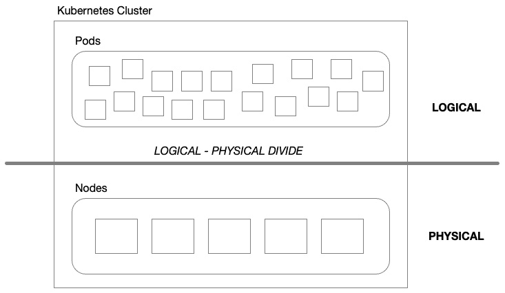
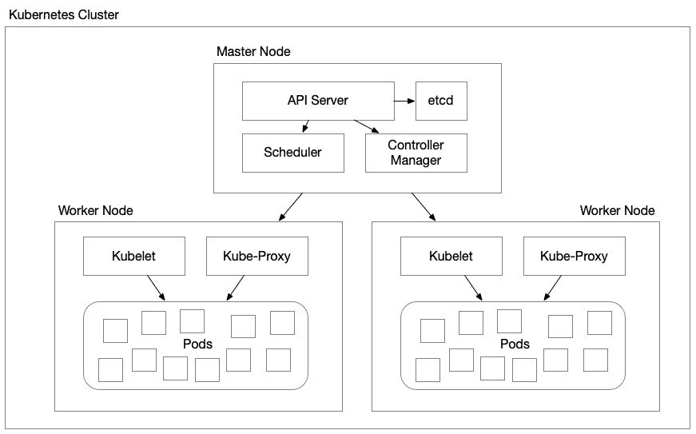
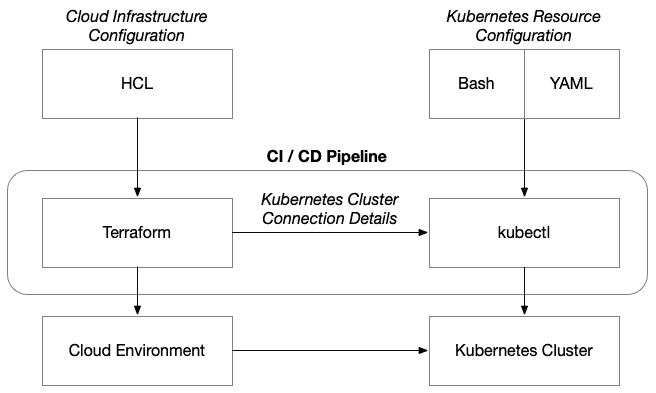
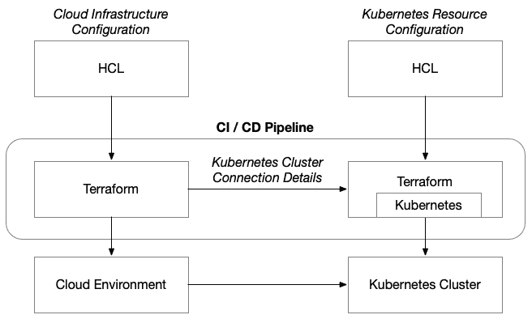
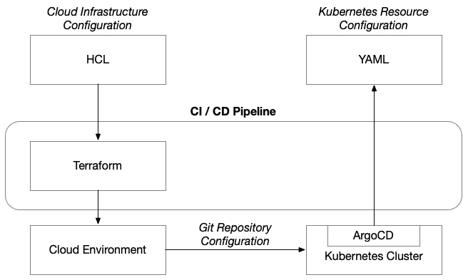
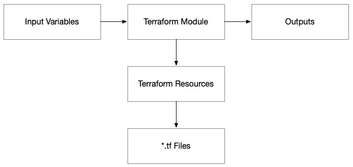
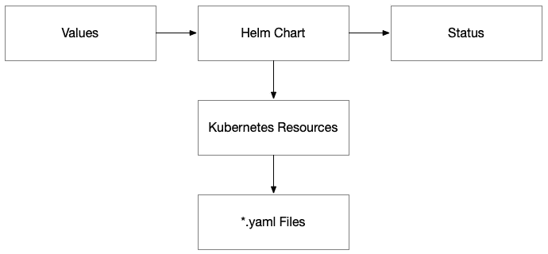
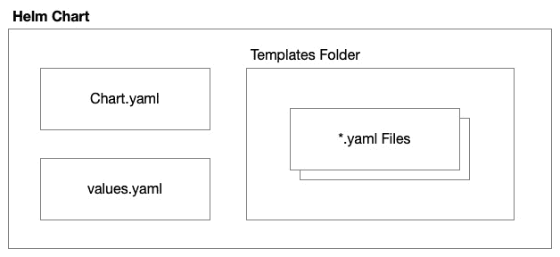
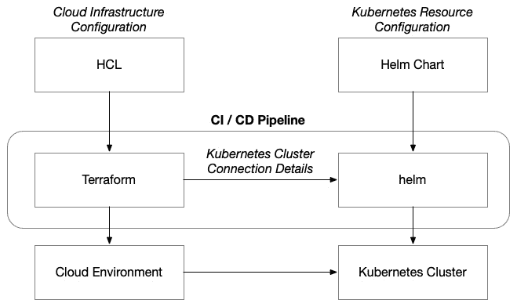
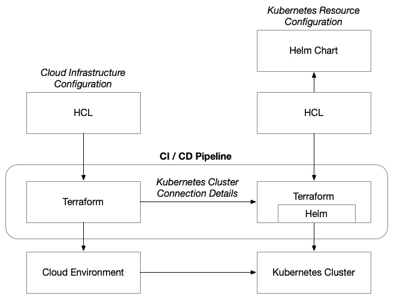

# 5

# 超越虚拟机——容器和 Kubernetes 的核心概念

在上一章中，我们熟悉了**虚拟机（VM）**架构和自动化基于虚拟机的解决方案所需的核心概念和机制。在本书中，我们将构建端到端的解决方案，涵盖三大超大规模云服务提供商——**亚马逊 Web 服务（AWS）**、Azure 和 **谷歌云平台（GCP）**——并涵盖三种云计算范式：虚拟机、容器和无服务器。在本章中，我们将探讨使用各云平台提供的托管 Kubernetes 服务来解决基于容器的架构问题所需的核心概念。

为了实现这一目标，我们必须了解容器、Kubernetes 的基础知识，以及它们如何融入 Terraform 生态系统。就像虚拟机和用于配置管理的工具链，以及**构建与烘焙**的困境一样，在基于容器的架构中，我们需要做出一些决策，关于 Terraform 与其他工具之间的边界在哪里，以及如何最好地将容器和容器编排工具的配置管理与我们提供的云基础设施进行集成，以托管这些容器。

本章涵盖以下主题：

+   理解容器架构的关键概念

+   利用 Docker 构建容器镜像

+   使用容器注册表

+   理解容器编排和 Kubernetes 的关键概念

+   理解 Kubernetes 清单

+   利用 Kubernetes 提供者来配置 Kubernetes 资源

+   利用 Helm 提供者来配置 Kubernetes 资源

# 理解容器架构的关键概念

**虚拟机（VM）** 在你希望最小化对应用程序和软件操作变更时，在云中运行是非常有效的，但它们也有缺点。通过拥有完整的虚拟机（无论你配置的是何种大小），你可以自由使用虚拟机的任何资源（多或少）。然而，许多组织发现，即使在遵循工作负载隔离的最佳实践或**单一职责原则（SRP）**的情况下，它们的虚拟机阵列仍然面临低利用率的问题。

反过来，当最大化利用率成为目标时，组织会将许多不同的服务和组件加载到一个单一的虚拟机中，以至于每个虚拟机——虽然被高度利用——却变成了一种难以管理和维护的困境。虚拟机会有无数的依赖冲突，并且在同一个虚拟机内，独立但共存的进程之间会出现资源争用。

这种工作负载隔离与资源利用之间的矛盾是容器技术旨在解决的问题，也是容器编排工具（如 Kubernetes）通过提供弹性和可扩展性来帮助解决的地方。

在本书中，我们将使用基于 Kubernetes 的容器技术，在 AWS、Azure 和 GCP 上构建端到端的解决方案。为此，你需要理解一些关键概念，这些概念超越了云平台，帮助你在各个云平台的 Terraform 提供者中导航架构和相关的 Terraform 资源。

## 容器

**容器** 允许你将应用程序打包到一个逻辑上与其他应用程序隔离的环境中，而无需虚拟化底层物理硬件和完整操作系统所带来的开销。无论是 Windows 还是 Linux，操作系统都会消耗资源，影响你的计算能力。

容器使用两个 Linux 内核原语：*命名空间* 和 *控制组*。这些构造使容器运行时能够在 Linux 操作系统中设置一个隔离的环境。命名空间的核心是隔离，它允许我们将操作系统分割成多个虚拟操作系统，每个虚拟系统都有自己的进程树、根文件系统、用户等。每个容器可能感觉像一个常规操作系统，但实际上并不是。控制组负责监管主机系统资源的分配——包括 CPU、内存和磁盘 I/O——以确保实际的物理服务器不会因容器消耗的资源而被压垮。

启用容器的最后一个组件是分层文件系统。这类似于我们以前构建虚拟机镜像的方式——只是层之间有更好的隔离。当我们构建虚拟机层时，当我们对虚拟机镜像进行更改并创建新的镜像时，我们无法再将基础层从顶层分离出来。容器可以应用只包含下层差异的文件系统层。这种方法创造了一种极为紧凑且高效的方式，将更改分层到每个容器镜像上，从而组成容器操作的最终文件系统——最顶层是可由容器本身写入的。

容器的一个关键优势是它们的高效性。与虚拟机不同，虚拟机需要为每个实例分配独立的操作系统和资源，而容器直接利用主机系统的内核。这意味着它们消耗的资源更少，并且启动速度比虚拟机更快。多个容器可以在单个主机上同时运行，从而更有效地利用系统资源。这使得我们能够创建更高密度的工作负载——从而减少宝贵的系统资源（如 CPU 和内存）空闲时的浪费，而在云端工作时，这种浪费就像把钱倒进水沟里！

现在我们已经对容器是什么以及它与虚拟机的区别有了清晰的理解，让我们来看看管理单个容器配置的事实标准工具：**Docker**。虽然本书的主题并非专门关于 Docker，但如果你打算精通 Terraform 并与基于容器的架构一起工作，你不可避免地会直接接触到这个工具，或者需要将其集成到 **持续集成/持续部署**（**CI/CD**）过程中。

# 利用 Docker 构建容器镜像

Docker 引擎使得容器设置过程更加简单。它提供了一种一致的元语言来描述容器，并提供命令行工具来构建、查询和运行容器镜像。

## 编写 Dockerfile

Docker 使用一种简单的语法，你可以用它来定义容器的基本信息。这个基本结构包括构建基础镜像的指令（`FROM`）、作者（`MAINTAINER`）、要复制的文件和执行的命令（`COPY` 和 `RUN`），以及入口点进程（`CMD`）。

这与 Packer 模板的结构相似，除了入口点的过程。使用 Packer 时，它只是一个虚拟机；无论运行哪些进程，都会根据你的配置启动。而在 Docker 中，你需要明确指出要启动哪个进程，因为容器在隔离中只运行一个进程。

你还可以通过设置工作目录、添加环境变量以及暴露网络端口来进一步配置运行时。

一个简单的 Dockerfile 看起来像这样：

```
# Use an official Python runtime as a parent image
FROM python:3.7-slim
# Set the working directory in the container to /app
WORKDIR /app
# Copy the current directory contents into the container at /app
COPY . /app
# Install any needed packages specified in requirements.txt
RUN pip install --no-cache-dir -r requirements.txt
# Make port 80 available to the world outside this container
EXPOSE 80
# Run app.py when the container launches
CMD \["python", "app.py"]
```

请注意，我们正在从一个名为 `python:3-7slim` 的基础镜像构建，并将当前文件夹的内容复制到容器的 `/app` 目录中。这一步将 `app.py` 脚本复制到容器中，以便我们在文件底部设置它作为执行点时可以使用。这个 Python 脚本设置了一个 Web 服务器，并将其暴露到端口 `80`。

## 构建 Docker 镜像

就像 Terraform 一样，Docker 使用当前工作目录来推导其上下文。因此，在构建 Docker 镜像时，你需要从 Dockerfile 所在的同一目录执行 `docker build` 命令。然而，你可以通过指定不同的路径来覆盖这一点：

```
docker build -t your-image-name .
```

`-t` 标志让你为镜像打上一个易于记住的标签。` . ` 实例可能看起来不太合适，但它告诉 Docker 在当前目录中查找 Dockerfile。

构建完成后，你可以运行以下命令查看镜像：

```
docker images
```

## 运行 Docker 镜像

Docker 镜像就像我们使用 Packer 构建的虚拟机镜像，它们代表一个尚未启动的虚拟机。它们有潜在的能量，但需要作为虚拟机的操作系统磁盘启动，才能转化为动能，变成一个运行中的虚拟机。Docker 镜像对于容器也是一样的。我们需要使用镜像启动一个容器，并指定运行时配置：

```
docker run -p 4000:80 your-image-name
```

在这种情况下，由于我们在容器中暴露了端口`80`，我们需要将一个端口映射到容器的端口`80`。`-p`标志将容器内部的网络端口映射到主机机器的端口。这个设置将把主机的`4000`端口的流量路由到容器的`80`端口。

你可以运行任意数量的容器，前提是主机机器能够承载。你唯一的限制是主机机器的技术资源。有时，云平台会根据你主机所运行的虚拟机 SKU 强加一些限制。

要查看正在运行的容器，你可以执行以下 Docker 命令：

```
docker ps
```

本节内容应帮助你理解与 Docker 镜像合作的基本原理。虽然 Docker 提供了许多其他命令和标志来管理你的镜像和容器，但这些超出了本书的范围。我将为你提供足够的理论和实践，使你能够高效地构建基于容器的架构，并使用 Terraform 进行管理。

在这一部分中，我们熟悉了用于创建容器镜像的命令行工具：Docker。

在接下来的部分，我们将探讨如何将我们使用 Docker 创建的容器镜像发布到容器注册表，以便我们可以使用它们部署容器。

# 与容器注册表合作

**容器注册表**只是一个服务器端应用，作为中央存储并允许你将容器镜像分发到需要运行这些镜像的主机机器。采用这种方法在利用 CI/CD 流水线时非常有优势，因为你需要一个中央位置来拉取容器镜像。

它们通常提供版本控制、标签和共享机制，允许你跟踪不同版本的容器镜像、保持稳定的发布版本，并与他人共享镜像——无论是在你的组织内部，还是公开共享。

就像`git`一样，任何人都可以自行设置容器注册表，但多个托管服务在各自的云平台上提供最佳服务。此外，还有一个云无关且面向社区的解决方案：Docker Hub。Docker Hub 是 Docker 查找镜像的默认注册表，你可以用它来共享你希望公开的镜像，或将其私密用于内部目的。它提供免费套餐以及更多存储和功能的付费套餐。

## Docker Hub

与容器注册表交互的机制大体相似，具体取决于所使用的服务——只有少许差异。举个例子，因为它是 Docker 默认使用的容器注册表，我将展示如何使用**Docker Hub**进行身份验证、标记、推送和拉取镜像。

首先，你需要进行身份验证。根据你的注册表服务，这一步可能需要额外的工具。然而，使用 Docker Hub 时，你不需要安装其他工具，但你需要在 Docker Hub 上注册一个帐户：

```
docker login
```

前面的命令将启动一个交互式登录过程，你需要提供你的 Docker Hub 用户名和密码。

在将镜像推送到注册表之前，你必须用注册表的地址对其进行标记：

```
docker tag foo:1.0 markti/foo:1.0
```

前面的命令首先指定了特定版本`1.0`的`my-image`源镜像。然后，它指定了同一镜像和版本在我的`markti` Docker Hub 账户下的目标镜像。保持本地和远程环境之间的镜像名称和版本同步对于确保环境的一致性至关重要。在镜像标记完成后，你可以将其推送到注册表：

```
docker push markti/foo:1.0
```

前面的命令将镜像推送到远程容器注册表。现在，你可以使用合适的权限，通过使用 Docker Hub 用户名作为注册表名称、容器镜像名称和标签来拉取镜像：

```
docker pull markti/foo:1.0
```

请记住，容器注册表可能会有稍微不同的命名规范和认证流程。

在本节中，我们学习了如何使用容器注册表，它们是容器架构中至关重要的基础设施。在下一节中，我们将准备好从架构角度和开发者、运维人员以及 CI/CD 流水线中的实际使用来学习 Kubernetes。

# 理解容器编排和 Kubernetes 的关键概念

**Kubernetes** 是一个扩展容器运行时职责的平台，容器运行时在单个主机级别操作。Kubernetes 的工作是跨多个节点执行这一任务。正如我们在本章第一节中学到的，容器运行时使用 Linux 操作系统构造——控制组——通过确保容器运行的物理（或虚拟）主机保持健康，从而保护操作系统的健康。Kubernetes 基本上做的就是同样的事情，只不过是跨多个服务器进行。

大多数应用程序或系统通常会被组织成不同的组件、层或微服务——每个组件都有自己的责任、相应的应用程序代码和技术栈来实现其功能。系统中的每个组件都会有自己的容器，里面安装了相应的软件。

当我们使用虚拟机（VM）部署系统时，我们会以这样的方式部署：同一个组件会部署到两个或更多的虚拟机上，并确保这些虚拟机不共享相同的底层物理设备。这种隔离可以是简单的不同物理主机在同一机架上，甚至可以是完全不同数据中心中的不同物理主机——有时这些主机之间可能相距数十，甚至数百英里。这使得我们能够在发生故障或影响底层硬件组件的问题时，实现**高可用性**（**HA**）和恢复力。

与使用虚拟机时不同，我们的应用程序组件并不是在独立的虚拟机上运行，而是部署在集群节点上，通常与来自其他应用程序的 pod 一起运行。

Kubernetes 尝试确保我们的应用程序容器不会部署在同一节点上。这样，如果集群中的某个节点发生故障，我们的应用程序就不会宕机。Kubernetes 还进一步智能地将容器重新安排到其他健康节点上。为了实现这一点，Kubernetes 在其内部**逻辑层**和底层**物理层**之间保持分隔，并通过分配逻辑部署或 pod 到物理部署和节点来映射设备。这种逻辑层与物理层的分离是 Kubernetes 的巨大优势之一，也是它在管理应用程序和服务时能在潜在的无限物理基础设施之上发挥如此高效的原因。



图 5.1 – 逻辑-物理分离

这就是全部内容，但我们可以通过多种方式自定义应用程序组件在 Kubernetes 上的部署，以满足我们应用程序的特定需求。

Kubernetes 足够灵活，能够在云提供商的虚拟机群或物理裸金属服务器上运行，甚至可以在单台计算机上运行——例如你的笔记本电脑。这种灵活性使它成为混合云场景的理想选择。它通过允许开发人员在本地运行整个解决方案的副本，轻松模拟生产环境，从而简化了集成测试的繁琐工作。

Kubernetes 提供了丰富的功能集，满足大部分大规模运行工作负载的需求，例如服务发现、密钥管理、水平扩展、自动化发布和回滚，以及自愈能力——使其成为运行无状态和有状态应用程序的大规模解决方案，同时避免供应商锁定的理想候选。

Kubernetes 架构由一组松散耦合且可扩展的组件构成。这种模块化设计使得可以根据不同的云提供商进行适配，整合它们特定的网络、存储、服务网格等解决方案。

与 Terraform 一样，谷歌设计 Kubernetes 的目的是通过采用声明式方法来鼓励**基础设施即代码**（**IaC**）的使用，以定义应用程序的运行时环境。由于 Terraform 和 Kubernetes 都具有扩展性，因此存在多种集成选项。在本章中，我们将讨论其中的一些方法及其伴随的权衡——但在此之前，我们需要介绍 Kubernetes 内部架构和操作模型的一些关键概念。只有在掌握这些基础知识之后，我们才能最大化地发挥 Terraform 和 Kubernetes 联合使用的潜力。

## Kubernetes 架构

Kubernetes 是一个分布式软件系统，它的设计与其他类似系统相似。因为它的责任范围涵盖一个由互联计算机系统组成的集群，这个集群的规模可以从几个节点扩展到几千个节点，所以它的组织方式就像一支军队。里面有军官、士兵和中央指挥部。士兵们被分成较小的子群体，每个子群体都需要与中央指挥部保持持续的联系，以便通过接收新的命令和提供当前情况的状态来有效地运作。中央指挥部接收来自各个军官的状态报告，这些军官负责监管他们的士兵以及执行命令，判断是否需要在不同战区增兵或减兵，并下达命令将不同的士兵小组重新部署到战场的不同位置。让我们深入了解每个组件及其角色。

### 主节点

**主节点**是 Kubernetes 集群的中央指挥——它本质上就是军队的将军们所在的地方。对于较小的冲突，通常只有一个中央指挥，但对于真正史诗般的交战，你可能需要为每个战区配备多个指挥部。它负责监管整个系统并做出高层决策。像任何好的中央指挥部一样，它必须执行几个重要职能：

+   **API 服务器**：任何军队都必须接收来自其民间政府的指令，政府为其提供任务目标并定义什么才算成功。从某种程度上讲，这与 API 服务器的角色非常相似。它不像通过红色电话从政治家那里获取指令，而是通过基于 REST 的接口从最终用户（通常是系统管理员或软件开发者）处获取输入。成功的定义也有所不同，这个定义就是最终用户的应用程序和服务应该如何部署，以及如何判断它们是否健康。

+   **控制器管理器**：拿破仑·波拿巴曾经名言：“*一支军队依赖粮草*”，这突显了在战争中良好后勤的重要性。一支军队不仅仅是靴子和枪支，还需要食物、水、制服和帐篷，甚至卡车和火车的燃料。控制器管理器执行的功能类似，它负责监控资源库存并分配资源，以确保军队的理想状态得以维持，并且能够执行任务。

+   **调度器**：我们的乔治·华盛顿曾名言：“*纪律是军队的灵魂*”——为了加强纪律，一支军队必须有一个有效的指挥系统，能够在战场上执行命令，合理分配士兵到最需要的地方。从这个意义上讲，调度器根据资源的可用性和任务目标的不同，将容器组（pods）分配到合适的节点上。

+   `etcd` 在 Kubernetes 中扮演这一角色，通过维护配置数据、集群状态，并创建一个**单一真实数据源**（**SSOT**）。

### 工作节点

**工作节点**是这个军队的战场，士兵们在这里完成必须执行的任务，以实现目标。它们是物理（或虚拟）机器，容器就在这些机器上运行。在任何战场上，都必须有一名指挥士兵的小队长。在 Kubernetes 中，小队长被称为 **Kubelet**。像小队长一样，Kubelet 在其战场区域内具有自主性，执行从指挥部接收到的命令，并指挥其小队——Pods——同时它保持与上级指挥部（或主节点）的指挥链，接收并执行新的指令。

节点中运行的容器在 Kubelet 的精心监控下需要一个容器运行时来运行。有多种容器运行时，例如 `containerd`、**CRI-O** 或 Docker，我们在本章的第一部分已经了解过它们。虽然有许多容器运行时，我们仍然使用相同的工具——Docker——来构建镜像。运行时实际上只负责运行容器，虽然其中有一些其他细节，绝对是一个深入的领域，但在本书的背景下，这就是我们需要了解的内容。

在战场上，士兵们分布广泛，因此需要有一种方式将信息在士兵、指挥官和指挥部之间传递。在战场上，这种方式随着历史的变化从旗帜、横幅、烟雾信号、鼓声、号角到现代的电报、电台和卫星通信不断演变。对于 Pods 来说，这就是被路由到节点的网络流量。**kube-proxy** 就像 Kubelet 一样，运行在每个节点上，负责将网络流量路由到正确的目的地。

### Pods

说了这么多关于“大人物”的事情，接下来该谈谈士兵了。士兵是战场上最小的参与者，而士兵们共同构成了军事行动中的主要力量。在 Kubernetes 中，Pods 就是这一角色。**Pods** 是所有工作实际发生的地方。集群中的其他一切运作，都是为了支持 Pods 达成其各自的目标，就像战场上许多角色通过制定明智的战略决策、分配资源、组织士兵成单位并下达命令，支持我们前线的战士一样。

Pod 不是容器，而是 Kubernetes 特有的构造，就像士兵一样，它是集群中最小的部署单元。一个 Pod 可以包含一个或多个容器，这些容器共享资源和配置，执行共同的目标。

与其直接部署单个容器，不如创建一个 Pod 并将容器放入其中。当你在同一个 Pod 内声明多个容器时，你实际上是在将它们紧密地绑定在一起——因为它们共享相同的网络命名空间、**进程间通信**（**IPC**）、命名空间和文件系统。

下图展示了 Kubernetes 架构的核心组件：



图 5.2 – 关键的 Kubernetes 架构组件

现在我们已经了解了架构的核心组件，接下来将深入探讨其他几个重要主题。我想特别指出，本书的核心是掌握 Terraform，尽管这一过程的一部分是了解你将要设计和配置的架构，但本书并不打算成为 Kubernetes 的深入指南。因此，我将重点关注在使用 Terraform 构建解决方案时需要了解的关键概念。

### 服务

对于更复杂的军事行动，我们可能需要分配更大的军事单位来完成任务。这就像是有一个中尉指挥多个小队。中尉将命令下达给适当的小队，每个小队被部署到战场的不同区域。这与 Kubernetes 中的 **服务** 角色类似，它允许我们将多个 Pod 组在一起，赋予它们共同的目标，并分布到多个节点上。服务负责在 Pod 之间进行负载均衡，任何针对这些 Pod 的传入请求都会首先被路由到服务，就像上级指挥官下达的命令通过中尉传达给小队，后者再将命令分配给自己指挥的小队一样。

通过这种方式，服务在需要与 Pod 进行稳定通信的工作负载中起着至关重要的作用，例如 Web 应用或 REST API。因为 Kubernetes 会为服务分配一个稳定的 IP 地址和 DNS 名称，即使底层的 Pod 发生变化，这些信息也保持不变，从而使得集群内外的其他应用或服务能够与该服务建立可靠的连接。

### 命名空间

最后，我们需要讨论 Kubernetes 逻辑模型中的一个重要概念：**命名空间**。命名空间在逻辑层面上提供了与集群中所有服务和 Pod 的完全隔离。命名空间不适用于集群的物理资源，例如节点或持久卷。它们仅适用于 Kubernetes 逻辑范围内与 Pod 和其他相关资源相关的内容。你可以把它看作是军队中的不同兵种。不同命名空间中的资源，就像不同兵种中的士兵，虽然共享一个中央指挥，但它们在指挥链和资源分配上是隔离的。因此，不同命名空间中的 Pod 可以在同一节点上运行，但不能共存于同一服务中，因为服务本身也有一个命名空间。

我们已经介绍了 Kubernetes 架构的关键组件。虽然还有很多内容超出了本书的范围，但这些概念应该足够让你从高层次上理解 Kubernetes 架构。接下来，我们将深入探讨一些用于配置 Pod 和服务的资源。

## 配置和机密

Terraform 和 Kubernetes 可能会交互的一个关键领域是配置和机密。这是因为，Terraform 经常负责配置其他资源，这些资源将提供端点 URL、身份验证凭证、日志记录或身份配置。因此，理解应该使用哪些 Kubernetes 资源来将这些配置设置连接到 Kubernetes 部署中的适当位置非常重要。

### ConfigMaps

**ConfigMap** 是一种特殊的 Kubernetes 资源，可以用来为 Pod 提供非敏感的配置。配置以一组键值对的形式存储，可以用来配置容器的环境变量，或配置你希望在容器内运行的应用程序的命令行参数。

一个 Pod 可以引用一个或多个 ConfigMap 对象，然后应用程序可以引用键值对中的键来获取其值。这种方式实现了将运行在 Pod 中的应用程序与存储在 ConfigMap 中的配置分离。这意味着同一个 ConfigMap 可以被多个 Pod 规范共享。

默认情况下，只有同一命名空间内的其他 Pod 可以访问 ConfigMap。如果你需要更精细的安全控制，可以申请**基于角色的访问控制**（**RBAC**）。

### 机密

虽然 Kubernetes 确实有一种内部方法来存储机密并使其可供您的 pod 使用，但在将应用部署到云环境时，您通常会使用云特定的机密提供程序。利用外部机密存储有许多优点。首先，使用外部机密存储，您将拥有更集中化的管理，这将使操作员更容易管理环境。其次，大多数外部机密提供程序提供 Kubernetes 内建的机密存储所不具备的功能和能力，比如支持机密的版本控制和轮换。最后，将机密存储外包会减轻集群中 `etcd` 数据库的负担，从而释放更多资源给您的 pod 中运行的工作负载。

当您使用外部机密存储时，Terraform 很可能会同时配置该存储及您的 pod 所需的机密。为了利用外部机密存储，您需要配置一个 `SecretProviderClass` 资源，它是您计划使用的外部机密存储特定的资源。它将为您的 pod 和存储在外部机密存储中的机密之间提供一个桥梁。根据您使用的云平台，通常会有平台本地的配置来配置此提供程序。大多数托管 Kubernetes 服务提供商都为相应的机密存储服务提供内建支持，并简化了 pod 访问机密所需的身份验证和授权。

在本书中，我们将使用三大云平台的托管 Kubernetes 服务：Amazon **弹性 Kubernetes 服务**（**EKS**）、**Azure Kubernetes 服务**（**AKS**）和 **Google Kubernetes 引擎**（**GKE**）。

## 持续部署（CD）

Kubernetes 提供了多种资源配置方式。它既支持命令式，也支持声明式，通过 `kubectl` 命令行工具和 Kubernetes YAML 清单（同样使用 `kubectl` 命令行工具）分别实现。因为这是一本关于 Terraform 的书，我想大家应该清楚我们更倾向于哪种方式！没错——声明式！由于 Kubernetes 也有自己的 REST API，因此完全可以构建一个与之通信的 Terraform 提供程序。所有这些方法，无论是通过 `kubectl` 执行命令式命令或 YAML 清单，还是使用 `terraform` 和 `kubernetes` Terraform 提供程序，都是传统的推送模型的例子。

### 推送模型

`kubectl` 命令，可以是普通的 `bash` 或 YAML 清单文件，使用 `kubectl apply -f foo.yaml`：



图 5.3 – 使用 Terraform 和 Kubernetes 命令行接口的 CI/CD 管道

在这种情况下，云环境在 `kubectl` 中定义，执行该命令以在新创建或现有的 Kubernetes 集群上创建部署。Kubernetes 集群的存在将取决于是否第一次执行了 `terraform apply`。

下一个方法是使用 Terraform 完成这两个阶段，将 `kubectl` 阶段替换为第二个 Terraform 阶段，这次使用一个仅使用 Terraform Kubernetes 提供程序的第二个 Terraform 根模块。提供云环境的 Terraform 根模块保留在自己的文件夹中，并与第二个 Terraform 代码库完全隔离：



图 5.4 – 使用 Terraform 和 Kubernetes 提供程序的 CI/CD 管道

第一个 Terraform 阶段仍然使用我们目标云平台的 Terraform 提供程序来配置 Kubernetes 集群和云环境中的其他所需资源。同样，CI/CD 管道仍然将从第一个 Terraform 阶段输出的 Kubernetes 集群配置传递给第二个 Terraform 阶段，在该阶段我们使用 Terraform 的 Kubernetes 提供程序将 Kubernetes 资源配置到我们的 Kubernetes 集群中。

### 拉取模型

推送模型的替代方案是 **拉取模型**，它将事情颠倒过来。与 Kubernetes 资源由集群外部的某个实体配置不同，CI/CD 管道将在集群上安装一个 CD 服务，该服务连接到一个包含 Kubernetes YAML 清单的指定源代码库，并在 Kubernetes 集群上配置资源：



图 5.5 – 使用 Terraform 和 ArgoCD 的 CI/CD 管道

这种方法利用了基于 YAML 的 Kubernetes 部署的不可变性和声明性，并在 Git 源代码库中为 Kubernetes 部署创建了一个 SSOT。因此，这种方法越来越被认为是完全拥抱 GitOps 的最佳实践，接下来我们将在下一章中更详细地探讨这个主题。

在本节中，我们从高层次了解了 Kubernetes——它的作用，它是如何工作的，以及它如何将我们的容器与我们所配置的底层基础设施互联。这些都是我们在使用 Terraform 配置和管理 Kubernetes 基础设施时必须理解的关键内容，接下来，让我们看一下 Kubernetes 如何原生处理部署，然后与我们使用 Terraform 的 Kubernetes 提供程序的做法进行对比。

# 理解 Kubernetes 清单

正如我们在前一节中讨论的，`kubectl` 是一个命令行应用程序，可以用来命令式或声明式地执行对 Kubernetes 集群的命令。你可以使用 `kubectl` 来部署资源、检查和管理集群资源等常见操作活动。

## Kubernetes 清单

在将资源部署到 Kubernetes 集群时，你可以直接使用`kubectl`命令执行操作以提供资源，或者使用 YAML 清单来定义资源的期望状态，并使用`kubectl`来执行这些清单。这两种使用`kubectl`的方式类似于通过相应的命令行工具为 AWS 和 Azure 等云平台提供资源的命令式方法，以及 Terraform 在`terraform apply`过程中为资源提供期望状态的方式。

当你直接使用`kubectl`命令时，你是在命令行中直接给出指令。例如，如果你想创建一个部署，可能会发出如下命令：

```
kubectl run nginx --image=nginx
```

在这种情况下，`kubectl`将使用大部分默认设置创建`nginx`的部署，并立即执行。

这种方法对于快速、一时性的创建或需要立即修改时非常有用。

使用 YAML 清单时，你是在声明性地编写资源的期望状态。例如，部署可以在 YAML 文件中像这样编写：

```
apiVersion: apps/v1
kind: Deployment
metadata:
  name: nginx-deployment
spec:
  replicas: 3
  selector:
    matchLabels:
      app: nginx
  template:
    metadata:
      labels:
        app: nginx
    spec:
      containers:
      - name: nginx
        image: nginx:1.14.2
        ports:
        - containerPort: 80
```

然后，你可以使用`kubectl`来应用这个文件，方法如下：

```
kubectl apply -f my-deployment.yaml
```

这告诉 Kubernetes 将集群的实际状态与文件中描述的期望状态进行匹配。

这种方法的好处是，文件作为资源配置的**事实来源**（**SOT**）。这些文件可以进行版本控制，便于跟踪变更、回滚（如有需要）以及重复使用配置。

通常，建议使用配置文件来管理你的 Kubernetes 资源，特别是在生产环境中。话虽如此，直接使用`kubectl`命令对于调试和快速原型设计任务是有用的，但从长远来看，你应该考虑使用声明性方法来管理资源。

### 部署清单

在 Kubernetes 中创建应用程序时，使用部署来指定你希望如何配置它。然后，Kubernetes 会自动调整应用程序的当前状态，使其与期望的配置相匹配：

```
apiVersion: apps/v1
kind: Deployment
metadata:
  name: my-app
spec:
  replicas: 3
  selector:
    matchLabels:
      app: my-app
  template:
    metadata:
      labels:
        app: my-app
    spec:
      containers:
      - name: my-app
        image: my-app:1.0
        ports:
        - containerPort: 8080
```

该部署清单描述了一个期望的状态，其中包括运行`my-app`应用程序的三个实例（或副本）。

### 服务清单

**服务**是一种将一组 Pod 组合在一起形成应用程序的方法，使它们能够作为网络服务进行展示：

```
apiVersion: v1
kind: Service
metadata:
  name: my-service
spec:
  selector:
    app: my-app
  ports:
    - protocol: TCP
      port: 80
      targetPort: 8080
```

该服务清单将创建一个网络服务，将流量路由到`my-app`的`8080`端口的 Pods。

## 配置和秘密（Secrets）

因为 Kubernetes 是我们托管应用程序和服务的地方，我们需要提供运行时配置设置，包括非敏感和敏感的配置。

### 配置映射（ConfigMaps）

正如我们在上一节中讨论的那样，ConfigMap 是我们将非敏感数据传递到 Pod 中的方式。ConfigMap 是 Terraform 和 Kubernetes 集成的关键区域，因为许多配置设置很可能是由 Terraform 生成的。在设计如何将资源配置到 Kubernetes 时，这是一个重要的考虑因素，因为你希望尽量减少手动步骤。我们将在未来的章节中探讨如何避免这种情况，特别是关于 Kubernetes 和 Helm 提供程序的内容：

```
apiVersion: v1
kind: ConfigMap
metadata:
  name: my-config
data:
  my-value: "Hello, Kubernetes!"
```

这个 ConfigMap 被命名为`my-config`，它包含一个键值对`my-value:` `Hello, Kubernetes!`。

现在，当我们想要在我们的部署中引用这个 ConfigMap 时，我们只需要使用`configMapRef`块来从 ConfigMap 中提取正确的值，并在我们的容器内部设置环境变量：

```
apiVersion: apps/v1
kind: Deployment
metadata:
  name: my-app
spec:
  replicas: 1
  selector:
    matchLabels:
      app: my-app
  template:
    metadata:
      labels:
        app: my-app
    spec:
      containers:
      - name: my-app
        image: my-app:1.0
        env:
        - name: MY_VALUE
          valueFrom:
            configMapKeyRef:
              name: my-config
              key: my-value
```

在此部署中，`my-app`应用有一个名为`MY_VALUE`的环境变量，其值从`my-config` ConfigMap 中提取，当 Pod 运行时，它可以从该环境变量中获取`Hello, Kubernetes!`的值。

### 密钥

就像处理非敏感配置设置一样，我们的许多密钥将通过 Terraform 使用目标云平台的秘密管理服务进行配置。因此，我们将不会使用 Kubernetes 的`Secret`资源，而是将定义一个`SecretProviderClass`资源，该资源将启用与云平台的秘密管理服务的集成，并拉取所需的密钥。由于这与云平台特定相关，我们将在接下来的 AWS、Azure 和 GCP 的解决方案中详细介绍这些内容，使用它们各自的托管 Kubernetes 服务。

在本节中，我们探讨了 Kubernetes 如何本地处理部署——既通过其自身的`kubectl`命令行工具，也通过基于 YAML 的部署清单，允许我们以声明式的方式描述我们希望在 Kubernetes 中配置的资源——这类似于 Terraform 在底层云基础设施中的作用。在下一节中，我们将介绍 Kubernetes 提供程序，它为我们提供了使用 Terraform 本地管理 Kubernetes 资源的方式。

# 使用 Kubernetes 提供程序来配置 Kubernetes 资源

Terraform 的 Kubernetes 提供程序是一个插件，允许 Terraform 管理 Kubernetes 集群中的资源。这包括创建、更新和删除如部署、服务和 Pod 等资源。

使用 Kubernetes Terraform 提供程序时，你的基础设施描述将采用 HCL 而非 YAML。这是 Terraform 用于描述基础设施和服务配置的语言。

## Kubernetes Terraform 提供程序

正如我们在上一节中讨论的那样，由于 Kubernetes 拥有一个 REST API，作为所有管理操作的统一控制平面，因此可以创建一个 Terraform 提供程序，我们可以像在 AWS、Azure 和 GCP 云平台中一样使用它来进行自动化。

就像其他云平台一样，我们需要对控制平面进行身份验证。与 Kubernetes 的一个重大区别是，管理控制平面托管在 Kubernetes 集群本身上——更具体地说，正如我们在本章的*理解容器编排和 Kubernetes 的关键概念*部分中讨论的那样，它位于主节点上。这意味着我们需要指定 Kubernetes 集群的端点地址。通常，这个地址由在目标云平台上配置 Kubernetes 集群的 Terraform 资源提供。

为了与 Kubernetes 集群进行身份验证，我们通常需要使用集群证书，但一些云平台支持更复杂的身份验证方法，这些方法与您的组织目录系统（例如 Microsoft Entra ID）相连接。

下面是使用基于证书的身份验证时，提供程序配置的典型示例：

```
provider "kubernetes" {
  host                   = var.cluster_endpoint
  client_certificate     = file(var.client_cert_path)
  client_key             = file(var.client_key_path)
  cluster_ca_certificate = file(var.cluster_ca_cert_path)
}
```

这里是每个字段的用途：

+   `host`：Kubernetes 主节点的主机名（以 URI 形式）。可以通过 `KUBE_HOST` 环境变量获取。

+   `client_certificate`：用于对 Kubernetes REST API 进行客户端身份验证。

+   `client_key`：与 `client_certificate` 配对使用，作为**传输层安全性**（**TLS**）握手的一部分，该握手发生在 Terraform 提供程序和 Kubernetes REST API 之间。

+   `cluster_ca_certificate`：这是 Kubernetes 集群的**证书颁发机构**（**CA**），用于验证 Kubernetes 集群 REST API 的真实性。

另一种常见的配置 Terraform Kubernetes 提供程序的方法是使用 `kube_config` 文件：

```
provider "kubernetes" {
  load_config_file = true
  config_path      = "~/.kube/config"
  context          = "foo"
}
```

在这种情况下，连接和身份验证所需的所有详细信息都存储在文件中。我们只需将提供程序指向该文件所在的位置。默认情况下，该位置是 `~/.kube/config`。当然，这个文件可以包含多个集群连接，每个连接称为一个 *context*。因此，我们可能需要指定上下文。不过，如果您在 CI/CD 流水线中运行，这种情况很不常见，因为您很可能会使用自定义路径。

## Kubernetes 资源

当您使用 Terraform 的 Kubernetes 提供程序时，我们会获得与 Kubernetes 原生 YAML 清单相同的声明式模型，但我们还能够使用 HCL 的所有特性和功能。这使我们可以传递输入变量，生成动态的本地值，并使用字符串插值——一应俱全！

然而，这一切的缺点是我们必须使用 HCL 来定义 Kubernetes 资源。这与 Kubernetes 生态系统的主流做法相悖，因为大多数 Kubernetes 文档和在线提问或回答问题的实践者都使用 YAML。如果我们能够忍受从 YAML 到 HCL 的转换，那么可以考虑使用 Terraform 的 Kubernetes 提供程序：

```
resource "kubernetes_deployment" "my_app" {
  metadata {
    name = "my-app"
  }
  spec {
    replicas = 3
    selector {
      match_labels = {
        app = "my-app"
      }
    }
    template {
      metadata {
        labels = {
          app = "my-app"
        }
      }
      spec {
        container {
          image = "my-app:1.0"
          name  = "my-app"
          port {
            container_port = 8080
          }
        }
      }
    }
  }
}
```

上面的示例是 Kubernetes YAML 的 HCL 等效版本，用于配置 Kubernetes 部署资源。请注意大量使用大括号，这对于习惯于查看 YAML 的人来说可能显得有些突兀。

## 评估权衡

在这种方法下，您的 Kubernetes 资源是在 HCL 中定义的，接着您使用 `terraform apply` 命令来创建或更新这些资源，而不是使用 `kubectl` 无论是命令式地还是声明式地。

与 Kubernetes 的原生 YAML 方法一样，这个过程也是声明式的，意味着您描述想要的内容，但利用 Terraform 来确定如何实现。这类似于 Kubernetes 本身的工作方式，不过您使用 Terraform 提供程序来生成计划并完成工作。

尽管使用一种语言——HCL——来管理基础设施的其他部分（如 AWS 或 GCP 上的云资源）并用它来管理 Kubernetes 资源似乎是一个不错的选择，但由于大多数 Kubernetes 文档和示例都是基于 YAML 的，您将花费大量时间将 YAML 映射到 HCL。这会使得在大规模上学习和有效管理 Kubernetes 变得困难。

因此，通常最好让 Terraform 管理 Kubernetes 所依赖的底层基础设施，同时使用 Kubernetes 自身的声明式方法（通过 YAML 和 `kubectl`）来管理 Kubernetes。然而，如果您能克服将 YAML 转换为 HCL 的问题——或者是我们稍后将讨论的一个更好的选择：将 Kubernetes 部署封装为 Helm charts——那么使用 Terraform 的 Kubernetes 提供程序可能更容易，避免了在 `terraform apply` 操作结束时需要与嵌入在 `bash` 脚本中的 `kubectl` 命令进行额外集成。

也许还有一些 Kubernetes 资源，它们与您的云平台以及 Terraform 为您管理的配置紧密耦合。这些资源可能是单独的或独立的资源，用于将 Kubernetes 服务帐户连接到云平台身份，或者是一个将大部分值从 Terraform 输出获取的 ConfigMap。

在这一节中，我们讨论了如何使用 Terraform 来配置 Kubernetes 资源，并将这种方法与使用 `kubectl` 的 Kubernetes 原生选项进行了对比和比较——无论是命令式还是使用基于 YAML 的清单进行声明式配置。在下一节中，我们将查看 Helm 提供程序，看看它是否提供了比我们目前评估的选项更好的替代方案。

# 利用 Helm 提供程序来配置 Kubernetes 资源

正如我们之前讨论的，Kubernetes 有一个基于 YAML 的内建声明式模型，允许你为集群提供资源。然而，正如我们所见，使用这个模型的一个挑战是，你无法在基于 YAML 的规范中使用动态值。这就是 Helm 的作用。在这一节中，我们将详细了解 Helm 的定义、基本结构、使用方法，以及如何将其与 Terraform 流水线集成，或者如何直接通过 Terraform 的 Helm 提供程序使用它。

## 什么是 Helm？

Helm 被广泛称为 Kubernetes 的包管理器，但作为一名习惯于使用软件库的包管理器（如 Maven、NuGet 或 `npm`）或操作系统包管理器（如 `apt` 或 Chocolatey）的软件开发人员，我发现这个定义有些令人困惑。我想在某些层面上，它们的确有相似之处，都将多个组件聚合成一个版本化的包，并提供了一个方便的方式将这些包拉入其他项目进行重用。

然而，我认为 Helm 架构的一个重大区别和独特之处在于模板引擎的性质。Helm 的核心允许你创建包含一个或多个 Kubernetes YAML 清单的模板，并在 Kubernetes 资源中注入更多动态自定义，从而使 Kubernetes 部署更加可重用，并且更易于管理和维护。这些模板被称为 **图表** 或 **Helm 图表**。

从许多方面来看，Helm 图表更让我联想到 Terraform 模块，而非传统的软件包管理工具——无论是 `apt` 还是 NuGet。在将 Terraform 模块与 Helm 图表进行对比时，相似之处非常多。它们都在一个文件夹内运行，并定义了一种接收输入变量并生成输出的方法：



图 5.6 – Terraform 模块的输入、输出和资源

Terraform 模块封装了多个 Terraform 资源（或其他模块）的聚合，这些资源在 `.tf` 文件中定义，而 HCL 允许你利用语言内置的功能实现任意数量的动态配置：



图 5.7 – Helm 图表的输入、输出和资源

如前所述，Helm 图表执行类似的聚合，但它聚合的是定义在 `.yaml` 文件中的 Kubernetes 资源，并使用基于 Kubernetes YAML 的标记语言。Helm 定义了一个基于 Go 模板的自有模板引擎，提供了广泛的功能，允许你实现与 HCL 相似水平的动态配置。

如您所见，Helm 图表的基本结构相当简单。与 Terraform 模块不同的是，我们有嵌套文件夹，这些文件夹不允许用户将 Helm 图表清晰地嵌套在彼此内。子图表需要在特殊的 `charts` 目录中创建，并且可以完全封装在此文件夹内，或者简单地引用托管在其他地方的现有图表。这与 Terraform 模块的工作方式类似，您可以引用本地模块或托管在多个远程位置。微妙的差异在于 Terraform 模块可以在任何 `.tf` 文件中声明，并且它们的定义仅需存储在另一个本地文件夹或远程位置：



图 5.8 – Helm 图表解剖

`Chart.yaml` 文件是 Helm 图表内的特殊文件，作为包含关键标识元数据和其他依赖项（如本地或远程位置定义的其他 Helm 图表）的主要入口点文件：

```
apiVersion: v2
name: my-webapp
version: 0.1.0
description: A basic web application Helm chart
```

`values.yaml` 文件是定义 Helm 图表输入变量的文件。这是一个例子，在 HCL 中，我们没有限制输入变量的放置位置，按照约定——也是为了我们自己的清晰起见，我们将输入变量放入 `variables.tf` 文件中。在 Helm 中，这种隔离输入变量声明的约定被正式化为一个公认的文件，远远超出了简单的约定：

```
replicaCount: 1
image:
  repository: nginx
  tag: stable
  pullPolicy: IfNotPresent
service:
  type: ClusterIP
  port: 80
ingress:
  enabled: false
  annotations: {}
  path: /
  hosts:
    - my-webapp.local
  tls: []
```

`templates` 文件夹是所有基于 YAML 的清单文件的存放位置。然而，YAML 有所不同，因为它很可能会使用 Go 模板约定（`{{` 和 `}}`）将许多动态值注入其中，Helm 将使用 Go 模板引擎解析这些值：

```
apiVersion: apps/v1
kind: Deployment
metadata:
  name: {{ template "my-webapp.fullname" . }}
  labels:
    app: {{ template "my-webapp.name" . }}
spec:
  replicas: {{ .Values.replicaCount }}
  selector:
    matchLabels:
      app: {{ template "my-webapp.name" . }}
  template:
    metadata:
      labels:
        app: {{ template "my-webapp.name" . }}
    spec:
      containers:
        - name: {{ template "my-webapp.name" . }}
          image: "{{ .Values.image.repository }}:{{ .Values.image.tag }}"
          imagePullPolicy: {{ .Values.image.pullPolicy }}
          ports:
            - containerPort: 80
```

使用另一个称为 `helm` 的命令行工具，可以将 Helm 图表安装到 Kubernetes 集群上。该工具执行多种不同的功能，包括自动生成基本图表结构、打包图表以进行分发、管理图表仓库以及将图表安装到集群上：

`kubectl` 和 `helm` 在认证 Kubernetes 集群时使用相同的方法，但在管理集群时用途不同，就像 `kubectl` 一样，它可以使用以下命令应用声明式 Kubernetes 配置：

```
kubectl apply -f <file>.yaml
```

可以使用 `helm` 命令将 Helm 图表配置到 Kubernetes 集群中，命令如下：

```
helm install my-webapp ./my-webapp
```

在这方面，Helm 类似地可以集成到 Terraform CI/CD 管道中，该管道首先使用 Terraform 和相关的云平台提供商（例如 `aws`、`azurerm` 或 `googlecloud`）来配置云环境，然后使用 `helm` 命令行工具根据 Terraform 管道阶段输出提供的连接和身份验证信息将 Helm 图表安装到 Kubernetes 集群上：



图 5.9 – Helm 图表解剖：Terraform 和 Helm 在 CI/CD 流水线中的集成

在下一小节中，我们将探讨如何通过使用 Terraform 的 Helm 提供程序来简化相同的过程，从而取代那些执行 `helm` 命令的 `bash` 脚本，并使用 Terraform 进行管理。

## Helm Terraform 提供程序

在上一节中，我们了解了 Helm 的工作原理、Helm 图表的结构，以及它的结构和功能与 Terraform 模块的对比。现在，我们将看看如何使用 Terraform 来管理我们的 Kubernetes 环境，并使用 Terraform 的 Helm 提供程序。这个提供程序与 Terraform 的 Kubernetes 提供程序关系密切，因为它们都通过 Kubernetes 的 REST API 作为控制平面来管理 Terraform 资源。

使用 Terraform 与 Helm 的优势在于，它使你能够将 Kubernetes 应用程序与其他基础设施一起管理，使用相同的配置语言和工具集。正如我们所知，Helm 允许我们使用 Kubernetes 的声明式 YAML 清单和模板语言来创建参数化的模板，但我们仍然需要使用 `bash` 脚本来执行 `helm` 命令并传递参数给 Helm 图表。有些 Helm 图表可能具有非常复杂的配置，包含数十个参数。因此，使用 Terraform 消除了与外部 `bash` 脚本的额外集成，这些脚本用于执行 `helm` 命令。

同时，它还允许 Kubernetes 从业者在他们的本地工具集中开发 Kubernetes 模板。所以，如果你们组织中有希望构建自己定制 Helm 图表的 Kubernetes 专家，这将允许他们在使用 Terraform 进行声明式部署的同时，继续做他们自己的工作。这也使你能够利用现有的庞大生态系统，无需额外将其转换为 HCL。

与 Kubernetes 提供程序一样，你需要首先通过声明它为必需的提供程序来初始化该提供程序：

```
terraform {
    required_providers {
        helm = {
            source = "hashicorp/helm"
            version = "~> 2.0.0"
        }
    }
}
```

然后，在你的根模块中，你需要创建一个提供程序的实例。Helm 提供程序的配置与 Kubernetes 提供程序的配置非常相似：

```
provider "helm" {
    kubernetes {
        config_path = "~/.kube/config"
    }
}
```

实际上，Helm 和 Kubernetes 提供程序可以在同一个 Terraform 模块中并行使用，以便在需要为 Helm 图表本身提供额外的 Kubernetes 资源时进行扩展。

Helm 提供程序可以用于创建一个两阶段的 Terraform CI/CD 流水线，其中第一阶段使用 Terraform 和相应云平台的提供程序来配置云环境。第二阶段使用第一阶段输出的集群连接和身份验证设置来配置 Helm 提供程序，并使用包含 Helm 配置的不同 Terraform 代码库再次运行 `terraform apply`：



图 5.10 – Helm 图表结构：Terraform 与 Helm 在 CI/CD 管道中的集成

第二阶段的 Terraform 代码库通常非常小，仅使用一个资源。`helm_release`资源是该提供程序中的唯一资源——如果你曾经使用过 AWS、Azure 或 GCP 等云平台提供商，你会发现这与之有很大的不同！

`helm_release`资源只是接受我们期望传递给`helm install`命令的输入，通过指定图表名称和版本，以及外部仓库（如果需要）：

```
resource "helm_release" "my_application" {
    name       = "my-application"
    repository = https://kubernetes-charts.storage.googleapis.com/
    chart      = "my-application-chart"
    version    = "1.0.0"
}
```

这部分内容讲解了 Helm 提供程序的相关知识。

# 总结

在本章中，我们学习了理解容器、容器编排器以及如何通过`kubectl`和 Helm 使用 Kubernetes 原生工具以及相应的 Terraform 提供程序来配置和管理基于容器的基础设施所需的基本概念。

这标志着跨平台、云中立的知识的结束，我们需要这些知识来构建基于 VM 和容器的架构，涵盖所有三大超大规模云平台。由于无服务器架构本质上是平台特定的，并且提供了对底层基础设施的显著抽象，我将在各自的章节中介绍每个超大规模云平台的服务。

在下一章中，我们将超越云架构范式，花些时间了解团队如何通过 CI/CD 管道交付 IAC 解决方案，这些管道将基础设施配置、管理和应用程序部署过程融合成一个统一的端到端工作流。
