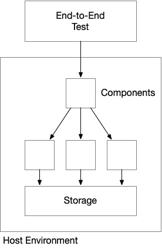

# 6

# 将所有内容连接起来——GitFlow、GitOps 和 CI/CD

**GitOps** 是一种现代的软件开发与运维方法，旨在使基础设施和应用管理变得更加简单高效。它通过使用 **Git** 作为主要的真实状态来源，并尽可能采用声明式方法来实现这一目标。这种方法结合了版本控制和持续交付的原则，优化软件开发生命周期，并促进开发和运维团队之间更好的协作——有时甚至将两者的职能融合成一个真正的 **DevOps** 团队。

本章涵盖以下主题：

+   理解 GitOps 的关键概念

+   利用 GitHub 进行源代码管理

+   利用 GitHub Actions 实现 **持续集成/持续部署**（**CI/CD**）管道

# 理解 GitOps 的关键概念

实现 GitOps 的方法有很多，我们将在本章中探讨几种，但从本质上讲，GitOps 是将软件开发生命周期应用于应用程序源代码和基础设施配置——即**基础设施即代码**（**IaC**）。Git 仓库成为生产环境中真实状态的来源，包含了当前生产环境、*曾经*的生产环境以及*即将*投入生产的内容。为了实现这一点，Git 仓库必须包含配置文件、应用程序代码、基础设施定义和部署清单——所有必要的内容，以便重新生成一个完全可工作的应用程序版本。

相较于编译后的构件，声明式表示更为优选，但当源代码被编译成构件时，需要对这些构件进行版本控制，并且与 Git 仓库中的提交关联。诸如 Terraform、Docker 和 Kubernetes 等工具会解释这些声明式文件，并自动将变更应用到系统中，以使其符合预期状态。

对 Git 仓库的任何更改都会自动且持续地应用到目标环境中，无论该环境处于生命周期的哪个阶段——开发、测试还是生产环境。这个自动化过程确保了一致性，并减少了手动错误的风险。

这可以通过 **推送** 或 **拉取** 模型实现，前一章我们在讨论基于 Kubernetes 的解决方案的 CI/CD 管道时已经看到了这两种方法。由于 Kubernetes 在 GitOps 领域的影响，通常情况下，我们预设的目标是建立拉取模型。然而，实现 GitOps 并不一定需要拉取模型。实现 GitOps 的方式有很多，每种方法都有不同的权衡，应该根据你所在的具体环境进行评估。

无论你使用推送模型还是拉取模型，GitOps 的一个主要优点是它通过在常规源代码管理过程中保留所有部署和更新的日志，提供对系统变更的透明度和可视化。Git 提交历史被转化为审计追踪，使得理解何时发生了哪些变更以及由谁做出的变更变得更加容易。完整配置和代码结合生产出端到端工作的系统，并且拥有版本化的副本，这使得在遇到问题时相对容易回滚到先前的状态。当然，你系统中的有状态部分可能需要额外的工程设计，以确保新的部署和回滚都能顺利进行。

使用这种方法可以改进软件交付过程，从而提高效率、可靠性和可扩展性，同时促进开发、运维和其他团队之间的协作。这就是为何采用这种方法对推动组织内 DevOps 文化至关重要的关键原因。

由于 Git 的使用依赖较重——Git 通常是软件开发工具——没有应用开发背景的团队成员可能会感到困难。因此，如果你来自非开发者背景，比如系统管理员、网络或安全工程师，或者其他基础设施领域，那么花时间学习基本的 Git 命令和**Gitflow**流程是非常重要的，因为这些知识将对你在团队中的有效性至关重要。

Terraform 及类似工具是 GitOps 工具链中的一个关键组成部分，因为 IaC（基础设施即代码）的使用是这种方法的一个重要支柱，但必须记住，Terraform 通常只是整个方案中的一个组成部分，源代码管理和管道工具在促进整个过程中的作用更为关键。这就是为什么在本书中，我们将使用 Terraform 和 CI/CD 管道来设置复杂的架构并进行配置。在我们深入探讨之前，我们需要明确理解 CI/CD 管道是什么以及如何构建一个，这正是我们在下一节中将要讨论的内容。

## 理解 CI/CD

CI/CD 管道是一套自动化的步骤和过程，帮助软件开发团队快速且可靠地构建、测试和部署他们的应用程序。它是实现 GitOps 流程的基本组成部分，因为它在促进从开发到生产的持续变更流动中发挥着至关重要的作用，确保新代码被自动集成、测试，并以工作系统的形式交付给最终用户：


图 6.1 – CI/CD 管道的结构概览

正如其名字所示，CI/CD 流水线实际上由两个过程组成，并将它们结合在一起。首先是**持续集成**流水线，负责构建和确保系统应用代码的内建质量；其次是**持续部署**流水线，负责将应用代码部署到相应环境中。

CI/CD 流水线将这两个历史上不同的过程聚合在一起：**集成测试**和**部署**。然而，通过将它们结合，它提供了一种系统化和自动化的方法，能够持续不断地将新特性和 bug 修复交付给用户，减少了与手动部署相关的时间和风险。这反过来又促进了开发团队内的合作文化、频繁反馈和快速创新。

使用 Terraform 来配置基础设施并将最新代码版本部署到该基础设施的 CI/CD 流水线通常有两个目标。首先，生成经过测试并验证具有令人满意的内建质量的软件版本；其次，配置一个环境——无论其样貌如何——来托管与软件需求兼容并能够正确高效运行的应用程序。第三步也是最后一步是将应用程序部署到该环境中。

流水线并不会对你的云架构的稳健性做出评判。根据你的需求，你可以选择牺牲解决方案架构的某些特性来追求便捷或降低成本。流水线的工作是提供你所需的环境，并将软件部署到该环境中，因此一旦流水线完成，应用程序就准备好接受用户的访问流量。

在接下来的部分中，我们将深入探讨 CI/CD 流水线的内部结构，并讨论沿途发生的机制。

## 流水线结构

在前面的部分中，我们了解了 GitOps 的基本原理，并知道 CI/CD 流水线是基于像 Git 这样的版本控制系统建立的，开发人员在该系统中提交他们的代码更改。我们可以配置 CI/CD 流水线，使其在代码库中发生某些关键事件时触发，例如将更改推送到特定分支。

一旦版本控制系统中发生某些关键事件，比如开发者将更改推送到特定的分支或路径，CI/CD 流水线便会触发。它将拉取最新的代码，构建应用程序，并运行一系列自动化测试以验证应用程序代码的功能和完整性：


图 6.2 – CI/CD 流水线结构

可以进行多种测试，包括单元测试、集成测试，有时甚至是验收测试，以确保代码符合质量标准并且没有引入回归问题。

**单元测试**在单独的组件上操作，并使用模拟对象（mocks）来隔离测试结果，针对单一组件通过注入占位符来替代该组件的下游依赖项：


图 6.3 – 单元测试孤立于单一组件

**集成测试**跨越两个或更多组件进行操作。它们可以使用模拟对象，也可以不使用，重点是组件间交互的可靠性。有时，对于非常复杂或复杂的组件，你可能希望进行集成测试，重点关注围绕它们的各种使用场景，同时使用模拟对象保持其他组件的输出可预测：


图 6.4 – 集成测试关注两个或更多组件及它们如何交互

**系统测试**引入了现实世界的依赖项，如数据库或消息传递子系统，并允许你在不完全部署系统的情况下，实现跨系统的更真实的覆盖：


图 6.5 – 系统测试

系统测试的关注范围更广，通常会引入现实世界的依赖项，如数据库和外部系统

**端到端测试**是指提供整个应用程序的宿主环境——如同它在生产环境中的表现——并执行尽可能接近实际客户端应用程序或最终用户的测试：



图 6.6 – 端到端测试

端到端测试尝试尽可能真实地模拟最终用户活动，在系统完全运行的情况下，进行从头到尾的测试。

这取决于特定应用程序和组织的要求，需要进行什么样的测试，以及在应用程序上需要做多少工作。Terraform 还可以在持续集成过程中发挥关键作用，通过为系统或端到端测试环境提供**及时**（**JIT**）环境。Terraform 允许你动态创建适合目的的环境，执行测试，然后关闭所有资源。

根据你希望在发布过程中的可靠性水平，你可以选择在启动持续部署过程之前进行更深入、更强大的测试。

在持续集成过程成功完成后，应用程序被打包成一个部署包（例如 Docker 容器或 JAR 文件），其中包含所有必要的依赖项和配置，并准备好进行部署。

在持续部署过程中，Git 源代码和部署包都会被用来提供环境并将包部署到目标环境中。Terraform 在提供或更新所需基础设施方面至关重要，如虚拟机、容器或无服务器资源。正如我们在前几章中所看到的，Terraform 还可以选择通过预构建的虚拟机镜像或预构建的容器镜像进行应用程序的部署。

部署完成后，CD 流水线可以运行额外的验证测试，通过应用程序和基础设施中内建的健康检查，确保应用程序在目标环境中正确运行。

无论架构如何，CD 流水线的结果是将特定环境的配置应用到工件上——这些配置通常来源于 Terraform 输出，包含重要的配置细节——从而将工件定制为目标环境。这些配置可能包括数据库连接字符串、API 端点或其他在不同环境之间有所不同的设置。

正如你所看到的，Terraform 在这一过程中发挥着至关重要的作用，但并不是唯一的参与者。该过程中的每一步都同样重要，并在持续发布具备内建质量的软件方面发挥着关键作用。在本书中，我们将回顾三种架构以及与之对应的三种部署技术，针对三种云托管范式：虚拟机、容器和无服务器。我们将使用 GitHub 作为源代码仓库，并使用 GitHub Actions 作为我们实现 CI/CD 流水线的工具。根据软件架构及其在环境中的托管方式，部署技术可能会有所不同。

在接下来的章节中，我们将讨论 GitOps 的源代码管理方面，包括为我们的 DevOps 团队提供结构的开发者工作流，这些团队以这种方式执行任务。

# 利用 GitHub 进行源代码管理

GitHub 只是源代码管理软件的一种选择。在本书中我们将使用它，但你需要理解的是，无论你最终使用哪个源代码控制提供商，使用 GitHub 实现的概念和模式是一致的。尽管实现和执行流水线的语法和机制可能有所不同，但源代码管理系统在背后仍然是`git`。

源代码管理的一个重要部分是如何在团队中——无论是大团队还是小团队——以结构化的方式使用它。这些是你们团队可以采用的约定，从而确保团队在新功能通过开发过程并最终进入生产时，能有一致的预期。

Gitflow 是一种常见的模型，使用了知名的、长期存在的、且一致的命名规范来管理短期生命周期的分支。正如我们将在下一小节中看到的，它具有高度的可定制性，稍显像是*选择你自己的冒险*，这也是它成为全球各地开发团队最常见的操作模型之一的原因，无论团队规模如何。

我们还将了解一种名为 GitHub flow 的简化变体，它是基于主干开发的一个例子。该模型主张保持`main`分支始终可部署，并最小化长期存在的分支使用。开发者直接在`main`分支上工作，使用短暂的`feature`分支，快速合并回`main`，而不是为各种目的和设计创建长期存在的稳定分支。

在下一部分，我们将更深入地了解 Gitflow，看看开发者的实际体验如何，以及它如何与我们使用 Terraform 构建的自动化系统集成。

## Gitflow

Gitflow 是全球开发团队最受欢迎的分支模型和工作流之一。它的广泛应用促使了各种变体和适配的出现，以适应不同的开发环境和团队的需求。在其核心，Gitflow 利用`main`分支表示生产质量的代码，`develop`分支为开发团队提供了一个安全的合并和集成测试的环境：


图 6.7 – Gitflow 的最简形式

在 Gitflow 中，`main`是表示生产就绪代码的主要分支。只有准备好投入生产的代码才能存在于此分支中。处于开发中的功能由开发者在自己的`feature/*`分支上创建，随后合并到共享的`develop`分支，这个分支有点像是一个预发布环境，之后再合并到`main`。

然而，正如前面所提到的，Gitflow 具有高度的可定制性，多年来已经出现了几种对这个核心模型的扩展，且在不同的环境中有不同程度的采用。

有时，`release`分支用于准备和测试发布，起始于`develop`并合并回`develop`和`main`。这样可以让团队更好地控制何时以及如何将一组功能发布到生产环境。

现实世界变化迅速。因此，有时需要快速对生产环境进行关键修改，以解决特定问题。这时，`hotfix`分支从`main`开始，经过完全测试后再合并回`develop`和`main`。


图 6.8 – Gitflow 扩展版

Gitflow 高度可定制：

+   `main`: 仅生产代码（1）

+   `release`: 发布准备（2）

+   `develop`: 集成测试（3）

+   `feature/*`: 功能开发（4）

+   `hotfix/*`: 生产环境的关键补丁（5）

Gitflow 不指定特定的版本控制方案，但通常使用语义化版本（例如，`{主版本}.{次版本}.{修订版本}`）表示每个发布中所做更改的重要性。Gitflow 提供了任务的清晰分离，适合需要严格控制开发和发布流程的大型团队和项目。然而，这种结构对于较小的团队或实验性项目可能会感到压倒性：


图 6.9 – Gitflow 与 CI/CD 流水线集成

Gitflow 过程有几个关键事件可以触发自动化：

1.  `feature/*` 分支合并到 `develop`。这通常会触发包括应用代码、内建质量、单元和集成测试的 CI/CD 流水线。合并此拉取请求会启动一个部署到开发环境的发布流水线。

1.  `develop` 分支合并到 `release`。这通常包括额外的测试，如系统甚至端到端测试。合并此拉取请求会启动一个部署到暂存或发布环境的发布流水线。

1.  `release` 分支合并到 `main`。这通常包括额外的端到端测试变体，检查性能或负载，并可能包括升级或版本测试。合并此拉取请求会启动一个部署到生产环境的发布流水线。

1.  `hotfix/*` 分支合并到 `main`。这可能执行一个较小的测试套件目录，但可能包括版本或升级测试。合并此拉取请求会启动一个部署到生产环境的发布流水线。

值得指出的是，这可能是 Gitflow 最复杂的配置，但是作为人类，我相信肯定有人已经提出了更复杂的 Gitflow 版本。在下一节中，让我们通过回顾 GitHub 流程来看一些更简单、更轻量的内容。

## GitHub 流程

正如我们所讨论的，GitHub 流程是 Gitflow 的小兄弟。它更简单、更轻量，非常适合小团队或实验。它专注于仅有一个分支—`main`—新功能从个别`feature/*`分支引入。开发人员从 `main` 创建 `feature` 分支，进行修改，然后提交拉取请求将它们合并回 `main` 分支。在彻底测试后，版本通常从 `main` 打上标签：


图 6.10 – 适用于小团队或实验的 GitHub 流程

主要的区别在于，没有官方的流程来创建像 `develop` 或 `release` 这样的阶段分支，通常在这些分支上进行集成测试。集成测试的责任由每个功能开发者在他们自己的 `feature` 分支上承担——本质上是对他们的改动在生产环境中能否正常工作负责。

这也意味着我们触发 CI/CD 流水线的关键事件变少了。我们只有从 `feature/*` 分支提交到 `main` 的拉取请求，然后合并到 `main`，来触发事件。额外的测试可以在 `feature/*` 分支上进行，或者团队可以选择为生产版本发布引入手动触发器，这样就能有更多时间在 `main` 上进行测试。

如前所述，GitHub flow 非常适合没有专门负责集成测试的小团队！

每种 Gitflow 变体都有其优缺点，工作流的选择取决于项目的具体需求、团队规模、开发流程以及用于版本控制的工具或平台。评估团队和项目的需求与偏好，选择最合适的分支模型是至关重要的。在本书中，我会更详细地介绍一些选项，但大多数情况下，我会使用 GitHub Flow 来简化我的示例。

# 使用 GitHub Actions 进行 CI/CD 流水线

**GitHub Actions** 是 GitHub 提供的 CI/CD 服务，为你提供一个平台，可以在你选择的任何工作流中实现自动化，围绕你的源代码管理过程进行操作。

为了挂钩到 GitHub Actions，你需要定义 YAML 文件，指定你希望自动化的任务。这些文件被称为 `.github/workflows` 目录，位于你的源代码仓库中。一个工作流的基本结构由多个 jobs 组成。每个 job 包含多个 steps。步骤可以是你执行的简单脚本，或者是更复杂的打包在一起的 action：

```
jobs:
  build:
    runs-on: ubuntu-latest # The type of runner (virtual machine) that the job will run on
    steps:
    - name: Checkout code # Name of the step
      uses: actions/checkout@v2 # Use a pre-built action to checkout the current repo
    - name: Run a command
      run: echo "Hello, World!" # Commands to run
  test:
    needs: build # Specifies that this job depends on the 'build' job
    runs-on: ubuntu-latest
    steps:
    - name: Checkout code
      uses: actions/checkout@v2
    - name: Run tests
      run: |
        npm install
        npm test**
```

上面的代码包含了两个 jobs：`build` 和 `test`。这些 jobs 被归类在 `jobs:` 部分，每个 job 下有多个 steps，归类在 `steps:` 部分。你可以通过 `runs-on` 属性自定义 job 运行的镜像。这允许你指定一个符合需求的容器镜像，使用合适的 Linux 发行版或软件配置。

默认情况下，步骤只是通过 `run` 属性执行一个 bash 脚本，但你可以通过指定 `uses` 属性来使用一个 action。

要执行 Terraform，你只需在代理上安装它。可以使用 HashiCorp 提供的一个名为 `hashicorp\setup-terraform@v2` 的 action 来轻松实现。以下代码片段展示了如何在指定 Terraform 的特定版本的同时完成此操作：

```
steps:
- uses: hashicorp/setup-terraform@v2
  with:
    terraform_version: 1.5.5
```

还有其他一些属性，但它们更多是针对边缘案例，超出了本书的范围。我建议你查看该操作的文档，了解所有可用的选项：[`github.com/hashicorp/setup-terraform`](https://github.com/hashicorp/setup-terraform)。

你必须始终将敏感数据存储为机密，以确保数据不会暴露在日志中。这可以通过利用 GitHub 环境或其他机密管理服务轻松实现。

## 虚拟机工作负载

在构建自动化流水线以配置虚拟机托管的工作负载时，你的工具链应该包括能够设置虚拟机初始配置、配置虚拟机以及随时间推移更新虚拟机配置的工具。本书将涵盖用于这些目的的工具：Packer、Terraform 和 Ansible。

### Packer 构建流水线

正如我们在讨论 Packer 模板开发时提到的，开发人员使用**HashiCorp 配置语言**（**HCL**）编写并提交 Packer 配置文件到其 Git 仓库。

当对存放 Packer 配置文件的文件夹进行更改并推送到版本控制系统时，会触发一个独立的流水线。在该流水线中，Packer 用于为每个服务器角色（例如，前端、后端和数据库）构建虚拟机镜像。Packer 会根据应用程序中每个角色的最新配置进行配置，包括每一层独有的必要软件和设置。在成功构建每个镜像后，Packer 会创建优化后的机器镜像，适配所选云服务提供商（例如，**Amazon Machine Images**（**AMIs**）用于**Amazon Web Services**（**AWS**）或用于 Azure 的 Azure 管理镜像）。

有时候，Packer 可能会因虚拟机本身的暂时性问题或脚本中的错误而失败。你可以在 Packer 中使用**调试模式**，该模式允许你在临时虚拟机上暂停构建过程。这将允许你连接到该机器，手动执行失败的命令，并排查环境中的问题。

根据目标云平台的不同，生成的机器镜像会被存储在制品库中，或直接存储在云服务提供商的镜像仓库中，以便 Terraform 后续使用。

### Terraform 应用流水线

现在，虚拟机镜像已发布到镜像仓库，Terraform 只需引用正确的镜像，就能为虚拟机配置合适的镜像。类似于 Packer 构建流水线，开发人员将 Terraform 配置文件提交到其 Git 仓库，并且每当对存储 Terraform 配置文件的文件夹进行更改并推送时，都会触发一个独立的流水线。

Terraform 配置定义了网络基础设施，包括子网、安全组和负载均衡器，所有虚拟机都需要这些资源。Terraform 从工件仓库或云提供商的镜像仓库中拉取 Packer 构建的机器镜像，并为每个角色配置所需数量的虚拟机，设置任何必要的负载均衡器，以便在多台服务器之间分配负载，从而确保高可用性和容错性。

Terraform 有时可能会失败，既可能是由于临时问题，也可能是因为你尝试配置的资源之间存在潜在的竞争条件，这些资源是相互依赖的。我们将在*第十七章*中详细讨论更复杂的故障排除场景，但现在，重要的是要认识到 Terraform 是幂等的，这意味着你可以反复运行它以达到期望的状态——因此，有时候，重新运行任务就能帮助你解决最初遇到的问题。

### Ansible 应用管道

最后，在 Terraform 应用基础设施更改并使用 Packer 镜像设置虚拟机后，环境已准备就绪。然而，环境尚未完全投入使用，因为可能还需要对特定于环境的配置进行一些更改，这些更改在 Packer 镜像构建阶段无法获得。这就是我所说的*最后一公里*配置——我们通过应用在 Terraform `apply` 执行后才能得知的配置设置来对环境做最后的调整。执行这些最后一公里配置更改有不同的选择。你可以使用 Terraform 动态配置用户数据，直接传递给虚拟机，或者使用其他工具来完成这项工作。

由于大多数虚拟机也需要执行一些常规维护，因此考虑使用配置管理工具是很好的，它可以在不关闭或重启虚拟机的情况下，通过更改使用的 Packer 镜像版本来更新环境。这就是像 Ansible 这样的工具派上用场的地方。

Ansible 可以作为配置管理工具，除了对虚拟机执行持续维护外，还可以在虚拟机上执行最后一公里配置。Ansible 脚本会应用于已部署的虚拟机，设置特定于环境的值、配置服务，并执行其他必要任务。这样，环境现在已准备好供操作员使用已建立的 Ansible 配置执行常规维护。

与 Terraform 类似，Ansible 也是幂等的，并且可能会遭遇类似的暂时性错误。然而，像 Packer 一样，Ansible 会在操作系统内部进行变更。因此，你只需连接到其中一台虚拟机，排查 Ansible 执行脚本时失败的命令。

通过采用这种方法，可以有效地基于虚拟机的解决方案进行配置和操作，贯穿应用的生命周期。这使得部署过程具有可复制性、可扩展性和自动化，并为不同的环境提供必要的灵活性，同时确保解决方案中每个角色的设置一致且可靠。

## 容器工作负载

在构建自动化流水线以配置容器基础的工作负载时，您的工具链应包括可以用来设置需要部署的各个容器的初始配置、配置 Kubernetes 集群以托管容器以及支持 Kubernetes 集群操作的底层基础设施的工具，最后，通过多种选项使用 Kubernetes 的 REST API 来向 Kubernetes 控制平面配置 Kubernetes 资源。

由于容器镜像的不可变性及其轻量级和快速特性，实施复杂的滚动更新变得非常容易，可以在现有的部署中推出新版本的容器镜像。因此，容器基础的工作负载的配置和维护机制实际上就是构建新的容器镜像，并在 Kubernetes 配置中引用所需的镜像，以触发部署更新。

### Docker 构建流水线

正如我们在讨论 Docker 原理以及它如何工作的过程中提到的，开发者使用 Git 仓库编写并提交 Docker 文件。

当向版本控制系统推送更改并影响存储 Docker 配置文件的文件夹时，会触发一个独立的流水线。在该流水线中，Docker 用于为应用中的每个服务器角色（例如，前端、后端和数据库）构建容器镜像。Docker 配置了每个角色的最新配置，包括每一层独有的必要软件和设置。生成的 Docker 镜像充当我们的部署包。因此，它被版本化并存储在名为容器注册表的包仓库中（我们在*第五章*中讨论过）。一旦新的 Docker 镜像存储完成，我们可以从 Kubernetes 配置中引用它，并通过多种方式在 Kubernetes 中触发部署。

### Kubernetes 清单更新流水线

在这个管道中，开发人员修改清单，以引用在上一步中构建并发布的新的 Docker 镜像版本，并提交拉取请求以更新更改。我们使用的触发器可以是推送模型或拉取模型。如果你还记得，在*第五章*《*基于容器的架构*》中，我们讨论了实现推送模型的几种不同方法。一些选项使用`kubectl`和 Kubernetes YAML 清单，另一些则使用带有一组 YAML 清单的 Helm Chart，这些清单通过 Helm 转化为更动态的模板。

作为替代方案，使用拉取模型，我们可以使用托管在 Kubernetes 集群上的持续部署代理，例如 ArgoCD，它会监控 Git 仓库中的更改并将其应用于集群。因为 ArgoCD 持续监控包含 Kubernetes 清单（或 Helm Charts）的 Git 仓库，每当仓库中有新的提交时，它将自动触发部署过程。ArgoCD 并没有做什么神奇的事情；它只是使用`kubectl apply`将最新版本的清单应用到 Kubernetes 集群中。

### Terraform 应用管道

正如我们在*第五章*中所讨论的，由于 Kubernetes 的架构，Kubernetes 集群通常是一个共享资源，多个团队会通过针对集群中的各自命名空间来部署他们自己的工作负载。这也是为什么这个管道通常由与拥有 Docker 构建和 Kubernetes 清单管道的团队不同的团队来管理。这个管道由负责提供和维护 Kubernetes 集群的团队管理。他们的责任是确保集群正常运行，并随时准备接受 ArgoCD 的部署。

Terraform 可以作为可选项用于管理集群上的 Kubernetes 资源，但正如我们在*第五章*中所讨论的，这在所有情况下可能并不理想，因为团队和组织的动态因素。在这种情况下，最好根据你的具体背景来做出适合你团队和组织的决策。

在大多数情况下，Terraform 仅用于在所选的云平台上提供 Kubernetes 集群和周围的基础设施。开发人员会将 Terraform 配置文件提交到他们的 Git 仓库，每当对存储 Terraform 配置的文件夹进行更改时，管道会被触发。

这种方法使开发人员能够专注于代码开发和测试，而无需担心底层基础设施和部署过程。开发团队可以依赖 Kubernetes 集群中的隔离环境进行部署，实际上只需要维护他们的代码库和用于配置应用程序的 Docker 文件。

## 无服务器工作负载

在无服务器架构中，部署过程可以大大简化。通常，您需要有两个主要的管道来管理无服务器框架及周边服务，以及实际的函数代码。

### Terraform 应用管道

该管道负责为支持无服务器工作负载提供基础设施。它使用 Terraform 来定义和管理基础设施组件。管道可能会创建诸如负载均衡器、API 网关、事件触发器以及其他作为无服务器函数基础的逻辑组件。这些通常是轻量级的云服务，能够极其快速地配置。

### 无服务器部署管道

该管道负责将单个无服务器函数部署到目标平台（例如 AWS Lambda 或 Azure Functions）。每个无服务器函数通常都有自己的管道来处理其部署、测试和版本控制。这确保了不同组件之间的自治，并允许团队根据他们如何管理代码库来组织责任。这条管道实际上仅涉及打包函数代码、定义配置并将其部署到选定的云平台。

无服务器方法简化了代码的部署和管理，开发人员可以更多地专注于编写应用程序逻辑，同时依赖自动化部署管道来处理基础设施的配置和无服务器函数的部署。

## Terraform 工具

有很多工具可以帮助提升 Terraform 代码的美观性、功能性和可维护性。我不会在这里面面俱到，但我会提到一些对任何 Terraform 持续集成过程绝对必需的关键工具。

### 格式化

在开发过程中，您应安装 HashiCorp Terraform 插件到 Visual Studio Code 中。这将启用编辑器中的大量有用的生产力功能，同时它还会在每次保存文件时自动执行 Terraform 内置的格式化功能 `terraform fmt`。这将极大地帮助在代码库中保持一致的格式化。这是一种主动的做法，依赖开发人员采取措施正确配置他们的开发环境。

为了验证每个开发人员是否采用这种技术以保持项目的 Terraform 代码整洁，您需要在拉取请求流程中使用一个代码检查工具。将 `tflint` 添加到您的拉取请求流程中将有助于防止格式不良的代码进入您的 `main` 分支！

### 文档

现在代码格式已经正确，我们应该为我们的模块生成一些文档。无论你是编写根模块还是可重用模块，这都会非常有用。当`terraform-docs`工具指向一个 Terraform 模块目录时，它将生成一个 markdown 格式的`README`文件，记录 Terraform 模块的关键方面，包括 Terraform 和所使用的提供者的版本要求，以及输入和输出变量的详细信息。这个工具非常适合设置为预提交操作，确保每次合并代码时都能自动生成文档。它会读取 HCL 中的注解，如`description`、`type`、`required`和任何默认值。

你可以在[`terraform-docs.io/user-guide/introduction/`](https://terraform-docs.io/user-guide/introduction/)了解更多。

### 安全扫描

**Checkov**是一个静态代码分析工具，可以扫描你的 Terraform 计划文件，检测安全性和合规性违规。它内置了成千上万的策略，覆盖了许多平台，最重要的是包括本书中探索的云平台：AWS、Azure 和 Google Cloud。然而，在写作时，AWS 的策略覆盖最为全面，而 Azure 和 Google Cloud 的覆盖范围相对较少。

你可以在[`github.com/bridgecrewio/checkov`](https://github.com/bridgecrewio/checkov)了解更多。

# 总结

在这一章中，我们学习了源代码控制管理的基本概念，包括对大型和小型团队使用的不同分支和工作流策略的详细拆解。我们还讨论了我们的自动化系统，即 CI/CD 管道，如何在关键事件时与这些流程进行集成。

在下一章中，我们将从概念知识转向实际操作，开始着手第一个解决方案，即利用第一个公共云 AWS 上的虚拟机。

# 第三部分：在 AWS 上构建解决方案

在掌握了 Terraform 的概念知识和跨越主要公共云平台实现细节的架构概念后，我们将探索如何在**亚马逊云服务**（**AWS**）上构建解决方案，涵盖三种云计算范式：虚拟机、使用 Kubernetes 的容器以及使用 AWS Lambda 的无服务器架构。

本部分包括以下章节：

+   *第七章*，*在 AWS 上入门 – 利用 AWS EC2 构建解决方案*

+   *第八章*，*使用 AWS 容器化 – 利用 AWS EKS 构建解决方案*

+   *第九章*，*使用 AWS 无服务器架构 – 利用 AWS Lambda 构建解决方案*
