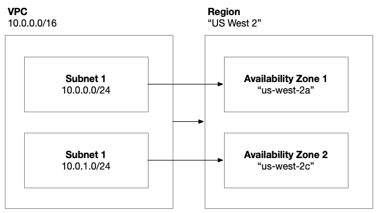
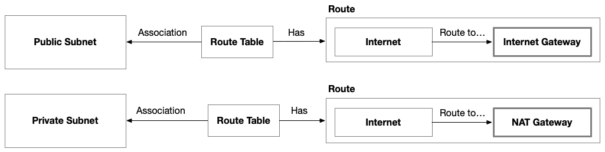

# 第七章：7

# 在 AWS 上入门 – 使用 AWS EC2 构建解决方案

现在我们已经掌握了构建现实世界云解决方案并使用 Terraform 进行基础设施即代码（IaC）自动化所需的概念基础，我们将从目前最受欢迎的云平台之一 – Amazon Web Services（AWS）开始我们的旅程。

在本章中，我们将采取逐步的方法来设计、构建和自动化使用 AWS 的虚拟机服务 – Elastic Cloud Compute（EC2）或简称 EC2 的解决方案。我们还将探讨几个其他对确保我们解决方案稳健性和生产就绪性至关重要的 AWS 服务，如密钥管理、日志记录和网络安全。

我们有很多工作要完成，但这正是实践真正开始的地方。我们将开始真正应用我们讨论过的概念，并在 AWS 上实际应用它们。

本章涵盖以下主题：

+   奠定基础

+   设计解决方案

+   构建解决方案

+   自动化部署

# 奠定基础

云基础设施的好坏取决于部署到其上的应用程序和服务，因此在本书中，我们将围绕一个名为 Söze Enterprises 的虚构公司的功能用例构建我们的样例架构。Söze Enterprises 是由一个神秘的土耳其亿万富翁 Keyser Söze 创立的，他希望通过建立一个平台将自动驾驶车辆推向新的高度，使地面和空中的车辆（来自任何制造商）协调行动，以提高安全性和效率。不知何故，Keyser 已经获得了 Elon 的支持，所以其他电动车供应商很快也会效仿。

我们继承了 Söze Enterprises 的另一个部门的团队，这个团队有一支强大的 C# .NET 开发人员核心团队，所以我们将使用.NET 技术构建平台的 1.0 版本。这位神秘的 CEO Keyser 上周末在摩纳哥与 Jeff Bezos 交际，公司的消息称我们将使用 AWS 来托管这个平台。因为团队对容器的经验不多，时间又很紧，我们决定建立一个简单的三层架构，并在 AWS 的 EC2 服务上托管。我们决定使用 Linux 操作系统，以便将来更容易转换容器：


图 7.1 – 自动驾驶车辆平台的逻辑架构

平台将需要一个前端，这将是一个使用 ASP.NET Core Blazor 构建的 Web 用户界面。前端将由一个 REST API 后端提供支持，该后端将使用 ASP.NET Core Web API 构建。将核心功能封装到 REST API 中将允许自动驾驶车辆直接与平台通信，并使我们能够通过将客户端接口与其他前端技术（如原生移动应用和未来的虚拟或混合现实）结合，进行扩展。后端将使用 PostgreSQL 数据库进行持久存储，因为它轻量、符合行业标准且相对便宜。

# 设计解决方案

由于团队面临紧迫的时间表，我们希望保持云架构的简单性。因此，我们将保持简单，并使用 AWS 的经过验证的服务来实现平台，而不是尝试学习新东西。我们需要做出的第一个决定是每个逻辑架构组件将托管在哪个 AWS 服务上。

我们的应用架构由三个组件组成：前端、后端和数据库。前端和后端是应用组件，需要托管在提供通用计算的云服务上，而数据库则需要托管在云数据库服务上。两种类型的服务都有很多选择：


图 7.2 – 自动驾驶车辆平台的逻辑架构

由于我们已经决定使用虚拟机（VM）来托管我们的应用，因此我们已缩小了可以用来托管应用的不同服务的选择范围，并决定 AWS EC2 是我们当前情况的理想选择。还有其他选项，例如**Elastic Beanstalk**，它们也使用虚拟机，但我们希望对解决方案有完全的控制权，并尽可能保持跨平台的能力，以防我们未来需要迁移到不同的云平台：


图 7.3 – 我们仓库的源代码控制结构

这个解决方案将由六个部分组成。我们仍然有前端和后端的应用代码以及 Packer 模板。接着，我们有 GitHub Actions 来实现我们的 CI/CD 流程，以及使用 Terraform 来配置我们的 AWS 基础设施，并引用 Packer 构建的 VM 镜像来部署我们的 EC2 实例。

## 云架构

我们设计的第一部分是将我们解决方案的架构适配到目标云平台：AWS。这涉及到将应用架构组件映射到 AWS 服务，并深入思考这些服务的配置，以确保它们符合我们解决方案的要求。

### 虚拟网络

虚拟机必须部署在虚拟网络内。在 AWS 上，我们使用 AWS EC2 服务提供虚拟机，并使用 AWS **虚拟私有云**（**VPC**）提供虚拟网络。在 AWS 上工作时，术语*EC2 实例*与*虚拟机*可以互换使用。同样，术语*VPC*也可以与*虚拟网络*互换使用。在本书中，我将尽量使用行业标准术语。你应该养成这种思维习惯，因为这将使你在不同的云平台之间更好地过渡：



图 7.4 – AWS 虚拟网络架构

正如我们之前所讨论的，虚拟网络被划分为一组子网。在 AWS 上，虚拟网络的范围限定在特定的区域内，而子网的范围限定在该区域内的可用区。因此，为了在 AWS 上构建高可用的系统，我们必须将工作负载分布在多个可用区。如果一个可用区发生故障，我们将工作负载部署到另一个可用区，以避免对最终用户的干扰。

我们应用程序的虚拟机需要在虚拟网络中的子网中进行部署。我们的应用程序前端需要可以通过互联网访问，而后端只需要对前端可访问。因此，我们应该为可通过互联网访问的前端和私有后端分别配置子网。这是创建*公有*和*私有*子网的常见模式：


图 7.5 – 前端和后端应用组件的公有子网与私有子网

在这种模式下，创建了两对公有子网和私有子网。每一对都部署在相同的可用区内。每对子网共享同一可用区的原因是前端和后端之间存在依赖关系。例如，如果后端所在的可用区发生故障，前端将无法运行。同样，如果前端所在的可用区发生故障，将无法将流量路由到后端。我们可以根据区域内的可用区数量创建任意多对公有/私有子网。大多数区域有四到五个可用区，但通常，两个到三个可用区就足以应对大部分工作负载。之后，您更有可能从设置多区域部署中受益。

### 网络路由

还有一些其他组件需要在此虚拟网络中进行配置，以确保虚拟机能够正常运行。在 AWS 中，当你在虚拟网络中配置虚拟机时，虚拟机将无法访问互联网！对于大多数连接的应用程序来说，互联网访问是必需的，因为它允许连接到第三方服务。没有这个功能，操作员将会面临不便，因为他们无法使用托管在互联网上的软件包仓库来进行操作系统的升级和修补：


图 7.6 – 互联网和 NAT 网关为子网内的虚拟机提供互联网访问

互联网网关连接到区域级别的虚拟网络，为整个 VPC 提供互联网访问，而 NAT 网关则部署在每个公有子网的可用区级别，允许私有子网中的 EC2 实例访问互联网，同时不会直接暴露给互联网。每个 NAT 网关还需要拥有自己的静态公共 IP 地址才能提供访问权限。这可以通过使用 AWS 的弹性 IP 服务来实现：



图 7.7 – 路由表与子网关联，将流量引导到正确的网关

在为私有子网中的虚拟机建立互联网访问的最后一步中，我们需要将面向互联网的流量路由到每个子网的正确 NAT 网关；而公有子网中的虚拟机可以直接访问互联网。这可以通过路由表来实现。在公有子网中，我们将互联网流量路由到互联网网关；在私有子网中，我们将互联网流量路由到 NAT 网关。

### 负载均衡

现在，我们的子网已经设置完毕，并通过适当的路由表进行了连接，我们可以开始配置虚拟机（VMs）。为了实现高可用性，我们需要为每个子网配置至少一台虚拟机，前端和后端都需要如此。我们可以通过增加每个子网中的虚拟机数量来实现更高的可靠性或扩展性：


图 7.8 – 为我们的虚拟网络配置的虚拟机

当前设计的问题在于，我们需要一种方式让系统能够正确响应影响其中一个可用区的故障。这时，负载均衡器发挥了作用。它允许我们获得双重好处：将流量路由到健康的终端，并将负载均匀分配到我们的资源上。

在 AWS 中，**应用负载均衡器**（**ALB**）服务执行此功能。负载均衡器的任务是作为客户端发送请求的单一接入点。负载均衡器随后将流量转发到虚拟机，并将相应的响应从请求来源返回给客户端：


图 7.9 – 负载均衡器将流量转发到跨可用区的虚拟机

在 AWS ALB 中，我们首先需要设置监听器。在这个监听器上，你需要指定端口、协议以及在接收到请求时希望执行的一个或多个操作。最基本的操作类型是将请求转发到目标组。

在我们的解决方案中，目标组将由一组虚拟机（VM）组成。目标组指定请求应该发送到哪个端口和协议，以及一个具有特定应用路径的健康探测。健康探测可以选择性地设置在不同的端口和协议上，它提供了几个不同的设置来控制探测频率以及如何评估端点是否健康或不健康。健康通常通过 HTTP 状态码`200`表示，其他任何情况都被视为不健康。

对于我们的前端和后端，我们为目标组设置了一组简单的虚拟机，端点配置为 HTTP 协议，端口为`5000`（ASP.NET Core 的默认端口）。

前端是**ASP.NET Core Blazor**应用程序。因此，它使用**SignalR**（抽象了 WebSocket 通信）来提供浏览器和服务器之间的实时连接。因此，我们需要启用粘性会话，以便其能够正常工作。粘性会话将允许客户端继续使用相同的虚拟机，从而保持 WebSocket 连接不受更改与哪个 Web 服务器通信的影响。

对于健康探测，前端将使用 Web 应用程序的根路径，而后端将使用一个特殊路径，该路径会路由到一个已配置响应健康探测的控制器。

### 网络安全

现在，我们的虚拟网络已经完全配置好，虚拟机也已经设置在负载均衡器后面，我们需要思考希望允许哪些网络流量通过系统。在 AWS 中，可以通过创建安全组来控制这一点，安全组允许在特定端口和协议上，组件之间的流量传输。

这个过程的第一步是思考网络流量在通过解决方案时的逻辑停靠点：


图 7.10 – 我们架构的逻辑组件

应用组件，包括前端和后端，列在此列表中，后面是数据库。然而，这些并不是我们网络流量流动的唯一地方。由于我们在前端和后端前面引入了负载均衡器，因此我们有两个额外的网络流量停靠点。

下一步是思考每个组件如何与其他组件通信。这不仅包括端口和协议，还包括流量的方向。为此，我们需要从每个组件的角度思考网络流量：


图 7.11 – 前端负载均衡器网络流量

从前端负载均衡器的角度来看，我们将通过端口`80`使用 HTTP 协议接收来自互联网的流量。这些入站流量称为`5000`，使用 HTTP 协议。这些出站流量称为**egress**：


图 7.12 – 前端网络流量

从前端的角度来看，我们将通过端口`5000`使用 HTTP 协议接收来自前端负载均衡器的流量。C#应用程序代码将向后端托管的 REST Web API 发出请求，但我们将通过后端负载均衡器将所有请求通过端口`80`使用 HTTP 协议路由到后端：


图 7.13 – 后端负载均衡器网络流量

从后端负载均衡器的角度来看，我们将通过端口`80`使用 HTTP 协议接收来自前端的流量。由于目标组配置，我们将把这些请求转发到后端的端口`5000`，并使用 HTTP 协议：


图 7.14 – 后端网络流量

从后端的角度来看，我们将通过端口`5000`使用 HTTP 协议接收来自后端负载均衡器的流量。C#应用程序代码将使用 HTTPS 协议向 PostgreSQL 数据库发出请求，端口为`5432`。

### 秘密管理

像数据库凭证或服务访问密钥这样的秘密需要安全存储。每个云平台都有提供此功能的服务。在 AWS 上，这项服务称为**AWS** **Secrets Manager**：


图 7.15 – 存储在 AWS Secrets Manager 中的秘密可以在虚拟机具备必要的 IAM 权限后进行访问

你只需在此服务上使用一致的命名约定创建秘密，然后构建一个具有访问这些秘密权限的 IAM 角色。以下 IAM 策略将仅授予以`fleetportal/`开头的秘密的权限：

```
{
    “Version”: “2012-10-17”,
    “Statement”: [
        {
            “Effect”: “Allow”,
            “Action”: “secretsmanager:GetSecretValue”,
            “Resource”:
“arn:aws:secretsmanager:region:account
id:secret:fleetportal/*”
        }
    ]
}
```

`region`和`account-id`的值需要更改，以反映秘密创建的地点。需要注意的是，AWS 账户通常作为应用程序和环境的安全边界。因此，我们可能会为解决方案的开发和生产环境使用不同的 AWS 账户，此外还有可能需要的其他环境。这将使我们的秘密管理器的秘密在 AWS 账户和区域的上下文中得到隔离。

我们用来授予权限的两个主要属性是`action`和`resource`。在实施最小权限原则时，尽可能具体地定义某个身份所需的操作非常重要。如果不需要访问，就不要授予。类似地，我们还应该确保授予这些权限的资源尽可能狭窄。很容易懒惰，留下`*`作为资源或操作，但我们需要意识到，恶意攻击者可能会利用过于宽泛的权限在我们的环境中横向移动。

### 虚拟机

现在我们已经准备好了所有解决方案所需的内容，接下来可以讨论我们的应用组件将运行在哪里：在使用 AWS EC2 配置的虚拟机中。

在 AWS 上配置虚拟机（VM）时，您有两种选择。首先，您可以提供静态虚拟机。在这种方式中，您需要为每个虚拟机指定关键特性。或者，您可以使用**AWS 自动扩展组**来动态配置和管理虚拟机。在这种方式中，您提供自动扩展组一些配置和参数，说明何时进行扩展，何时进行缩减，然后自动扩展组将处理其余的所有事情。

在 AWS 上配置静态虚拟机时，您需要将其与**AWS 密钥对**关联，以确保您可以连接到其操作系统。这将允许操作员执行诊断、更新或修补软件和操作系统。

所有虚拟机都需要连接到虚拟网络，因此，当您设置静态虚拟机时，您需要指定网络配置。这可以通过创建网络接口并将其与虚拟机关联来实现。网络接口将虚拟机连接到适当的子网，子网是您附加一个或多个安全组的地方。

您虚拟机的内部配置由两个关键属性控制：虚拟机镜像和用户数据。正如我们在*第四章*中讨论的那样，虚拟机镜像可以是操作系统的原始安装版本，也可以是您的应用程序的完全配置版本。**构建与烘焙**的决定由您决定。

用户数据允许您在虚拟机启动时执行*最后一公里*配置。这可以通过使用业界标准的`cloud-init`配置来完成，执行各种任务，例如设置用户/组、设置环境变量或挂载磁盘：


图 7.16 – 静态创建的资源虚拟机

AWS 可以根据虚拟机负载的变化动态管理你的虚拟机。这是通过 Auto Scaling 组来完成的。Auto Scaling 组负责虚拟机的配置，因此，Auto Scaling 组需要在启动模板中定义虚拟机集的关键特性。Auto Scaling 组使用该启动模板来指定每个虚拟机的配置：


图 7.17 – 使用 Auto-Scaling 组动态创建和管理的虚拟机

除了这个启动模板，Auto Scaling 组只需要告知哪些子网应该为虚拟机（VM）提供服务，以及在什么情况下它应该为当前管理的虚拟机集群提供或移除虚拟机。

### 监控

AWS 有一个跨服务的工具叫做 **CloudWatch**，它可以捕获你在解决方案中使用的各种 AWS 服务的日志和遥测数据。在本书中，我们将使用它作为主要的日志记录机制。许多服务开箱即用支持 CloudWatch，几乎不需要配置就能开始使用。同时，其他服务和场景则需要授权才能让该服务在 CloudWatch 中记录日志。

## 部署架构

现在我们已经对解决方案在 AWS 上的云架构有了清晰的了解，我们需要制定一个计划，来决定如何配置环境和部署我们的代码。

### 虚拟机配置

在我们的解决方案中，有两个虚拟机角色：前端角色负责处理终端用户浏览器的网页请求，后端角色负责处理来自 Web 应用程序的 REST API 请求。这些角色有不同的代码和配置，且每个角色需要单独的 Packer 模板来构建一个虚拟机镜像，我们可以用它来在 AWS 上启动虚拟机：


图 7.18 – 使用 Packer 管道构建前端的虚拟机镜像

一个 GitHub Actions 工作流会根据前端应用程序代码和前端 Packer 模板的变化触发执行 `packer build`，并为解决方案的前端创建一个新的虚拟机镜像。

前端和后端都会有一个相同的 GitHub 工作流来执行 `packer build`。工作流之间的主要区别在于它们执行的代码库。前端和后端可能有稍微不同的操作系统配置，并且都需要不同的部署包来处理各自的应用程序组件：


图 7.19 – 使用 Packer 管道构建后端的 VM 镜像

需要注意的是，应用程序代码将被集成到虚拟机（VM）镜像中，而不是复制到已经运行的虚拟机中。这意味着，为了更新运行在虚拟机上的软件，每个虚拟机需要重启，以便使用包含最新代码副本的新虚拟机镜像。

这种方法使得虚拟机镜像成为一个不可变的部署工件，每次发布需要部署的应用程序代码时，它都会被版本化和更新。

### 云环境配置

一旦为前端和后端构建完成虚拟机镜像，我们就可以执行最终工作流，既配置又部署我们的解决方案到 AWS：


图 7.20 – 虚拟机镜像作为 Terraform 代码的输入，Terraform 在 AWS 上配置环境

Terraform 代码库将包含两个输入变量，分别对应前端和后端的虚拟机镜像版本。当需要部署应用软件的新版本时，这些版本的输入参数将递增，以反映目标版本。工作流执行时，`terraform apply`将用新的虚拟机镜像替换现有虚拟机。

现在我们已经有了如何使用 AWS 实现云架构和使用 GitHub Actions 实现部署架构的明确计划，接下来就开始构建吧！在下一节中，我们将详细解析用于实现 Terraform 和 Packer 解决方案的 HashiCorp 配置语言代码。

# 构建解决方案

设计已定，接下来我们只需编写实现该设计的代码。

## Packer

我们的解决方案包含前端和后端应用程序组件。尽管应用程序代码有很大不同，但我们构建虚拟机镜像的方式是相同的。

### AWS 插件

正如我们在*第四章*中讨论的，Packer——与 Terraform 类似——是一个可扩展的命令行可执行文件。每个云平台为 Packer 提供一个插件，用于封装与其服务的集成：

```
packer {
  required_plugins {
    amazon = {
      source  = “github.com/hashicorp/amazon”
      version = “~> 1.2.6”
    }
  }
}
```

插件需要在 Packer 解决方案中声明。截止目前，AWS Packer 插件的最新版本是`1.2.6`。

AWS Packer 插件提供了一个`amazon-ebs`构建器，它通过从基础镜像创建一个新虚拟机、执行配置程序、拍摄**弹性块存储**（**EBS**）磁盘镜像快照，并从中创建**Amazon Machine Image**（**AMI**），来生成一个 AMI。此行为由 Amazon 构建器控制：

```
data “amazon-ami” “ubuntu2204” {
  filters = {
    architecture        = “x86_64”
    virtualization-type = “hvm”
    root-device-type    = “ebs”
    name                = “ubuntu/images/hvm-ssd/ubuntu-jammy-22.04-amd64-server-*”
  }
  owners      = [“099720109477”]
  most_recent = true
  region      = var.aws_primary_region
}
```

Amazon `amazon-ebs` 构建器的第一个输入是创建初始虚拟机时所使用的基础镜像，Packer 模板的配置程序将在该虚拟机上执行。上述代码引用了目标 AWS 区域内最新版本的 Ubuntu `22.04` 虚拟机镜像：

```
source “amazon-ebs” “vm” {
  region        = var.aws_primary_region
  ami_name      = “${var.image_name}-${var.image_version}”
  instance_type = var.aws_instance_type
  ssh_username  = “ubuntu”
  ssh_interface = “public_ip”
  communicator  = “ssh”
  source_ami    = data.amazon-ami.ubuntu2204.id
}
```

`amazon-ebs`构建器引用`amazon-ami`数据源，以确保在执行提供者之前使用正确的基础镜像。在此，`ami_name`可能是该块中最重要的属性，因为它决定了虚拟机镜像在`terraform` `apply`操作中引用的版本名称。

### 操作系统配置

为了避免访问控制问题，最好为要执行的提供者（provisioners）建立一个执行环境：

```
locals {
  execute_command = “chmod +x {{ .Path }}; {{ .Vars }} sudo -E sh ‘{{ .Path }}’”
}
```

这是一个标准的`execute_command`参数，可以用来设置所有提供者的执行环境。它使得你可以在安装脚本中消除不必要的`sudo`命令。前面的`execution_command`参数将允许 Packer 模板脚本以特权用户身份执行。

我们的解决方案是使用 ASP.NET Core 构建的。因此，为了确保解决方案在虚拟机上正常运行，我们需要安装 .NET 6.0 SDK。Ubuntu，像其他基于 Debian 的 Linux 发行版一样，使用`apt`命令行应用程序来执行软件包管理。默认情况下，Ubuntu 包括了几个公共仓库，这些仓库包含了大多数常见的软件包。然而，有时当默认仓库无法使用时，我们需要设置额外的软件包仓库。微软为`apt`提供了一个软件包仓库，里面包含了我们需要安装 .NET 6.0 的正确软件包。因此，在使用`apt`安装 .NET 6.0 之前，我们需要先添加该仓库。

我们的 Packer 模板包括一个名为`dotnet.pref`的文件，内容如下：

```
Package: *
Pin: origin “packages.microsoft.com”
Pin-Priority: 1001
```

我们使用 Packer 的`file`提供者将此文件复制到虚拟机的正确位置：

```
provisioner “shell” {
  execute_command = local.execute_command
  inline = [
    “cp /tmp/dotnet.pref /etc/apt/preferences.d/dotnet.pref”
  ]
}
```

接着，我们执行`install-dotnet6-prereq.sh` Bash 脚本，它会下载一个`.deb`文件并使用`dpkg`工具进行安装。这个操作将会通过 Debian 包管理工具注册微软提供的第三方仓库。

现在，我们可以简单地运行`apt-get update -y`，从所有仓库中获取软件包的最新版本，之后就可以准备安装 .NET 6.0 了：

```
provisioner “shell” {
  execute_command = local.execute_command
  inline = [
    “apt-get install dotnet-sdk-6.0 -y”
  ]
}
```

如果我们没有包括`packages.microsoft.com`仓库，那么`apt-get install`命令将会失败，并显示错误信息，提示找不到`dotnet-sdk-6.0`软件包。

### 在 Linux 中设置服务

大多数应用程序在 Linux 中以进程的形式运行，并且通常是持续运行的。这种情况通常发生在应用程序需要监听网络流量时——比如 Web 服务器。设置 Linux 服务的另一个好处是，操作系统可以在每次虚拟机重启时自动启动服务。为此，你需要设置一个服务定义文件：

```
[Unit]
Description=Fleet Portal
[Service]
WorkingDirectory=/var/www/fleet-portal
ExecStart=/usr/bin/dotnet /var/www/fleet-portal/FleetPortal.dll
Restart=always
RestartSec=10  # Restart service after 10 seconds if the dotnet service crashes
SyslogIdentifier=fleet-portal
User=fleet-portal-svc
Environment=ASPNETCORE_ENVIRONMENT=Production
Environment=DOTNET_PRINT_TELEMETRY_MESSAGE=false
[Install]
WantedBy=multi-user.target
```

这个服务文件需要被复制到`/etc/systemd/system`文件夹中。通过运行`systemctl`命令，它会被启用，这样操作系统就会在机器重启时自动启动该服务。`systemctl`命令还可以用于`start`、`stop`以及检查服务的`status`状态。

最佳实践是使用其自己的身份运行服务。这样可以仅将服务访问需要的 VM 上的资源：

```
  provisioner “shell” {
    execute_command = local.execute_command
    inline = [
      “groupadd fleet-portal-svc”,
      “useradd -g fleet-portal-svc fleet-portal-svc”,
      “mkdir -p /var/www/fleet-portal”,
      “chown -R fleet-portal-svc:fleet-portal-svc /var/www/fleet-portal”
    ]
  }
```

前面的代码设置了一个本地用户和组，用于服务运行，并更改了应用程序文件夹 `/var/www/fleet-portal` 的所有者，以便服务的用户帐户有足够的访问权限来访问应用程序的可执行文件和支持文件。用户和应用程序的工作目录都在服务定义文件中指定。

一旦用户准备好，我们可以安装服务定义文件并启用服务：

```
provisioner “shell” {
  execute_command = local.execute_command
  inline = [
    “cp /tmp/fleet-portal.service /etc/systemd/system/fleet-portal.service”,
    “systemctl enable fleet-portal.service”
  ]
}
```

这部分内容涉及操作系统配置，可以集成到虚拟机镜像中。任何额外的配置步骤都需要来自 Terraform 所提供的云环境的更多信息。

## Terraform

正如我们在设计中讨论的那样，我们的解决方案由两个应用程序组件组成：前端和后端。每个组件都有一个需要部署的应用程序代码库。因为这是我们第一次使用 `aws` 提供程序，我们将首先查看基本的提供程序设置以及在查看架构的每个组件的细节之前如何配置后端。

### 提供者设置

我们需要在 `required_providers` 块中指定我们打算在此解决方案中使用的所有提供者：

```
terraform {
  required_providers {
    aws = {
      source  = “hashicorp/aws”
      version = “~> 5.17”
    }
    cloudinit = {
      source  = “hashicorp/cloudinit”
      version = “~> 2.3.2”
    }
  }
}
```

我们还需要配置 AWS 提供程序以确保它使用所需的目标区域，使用 `primary_region` 输入变量：

```
provider “aws” {
  region = var.primary_region
}
```

有时，您可能希望在将来添加次要区域，因此在启动项目时建立主要区域是一个好主意。即使您只部署到一个区域，您仍然有一个 *主要区域*。

AWS 提供程序确实需要一些额外的参数来指定连接到 AWS 所使用的凭据，但因为这些是敏感值，我们不想将它们嵌入到代码中。稍后在自动化部署时，我们将传递这些值，使用标准的 AWS `AWS_ACCESS_KEY_ID` 和 `AWS_SECRET_ACCESS_KEY` 环境变量。需要注意的是，有许多不同的方法可以配置 AWS 提供程序与 AWS 进行身份验证。我建议使用环境变量，因为这是跨云平台和其他 Terraform 提供程序的一种一致方法，并且可以轻松集成到不同的流水线工具中，例如我们将在下一节和将来的章节中使用的 GitHub Actions。

### 后端

因为我们将使用 CI/CD 流水线来长期进行环境的配置和维护，所以我们需要为我们的 Terraform 状态设置一个远程后端。因为我们的解决方案将托管在 AWS 上，我们将使用 AWS **简单存储服务** (**S3**) 后端来存储我们的 Terraform 状态。

就像 AWS 提供程序一样，我们不想在代码中硬编码后端配置，因此我们将简单地为后端设置一个占位符：

```
terraform {
  ...
  backend “s3” {
  }
}
```

我们将在 CI/CD 管道中运行 `terraform init` 时，使用 `-backend-config` 参数来配置后端的参数。

确保用于身份验证的 AWS IAM 身份有权访问该 S3 存储桶非常重要。否则，您将遇到身份验证错误。

### 输入变量

最好的做法是传入能够标识应用程序名称和环境的短名称。这可以让您在组成解决方案的资源上嵌入一致的命名规范，从而使您更容易在 AWS 控制台中识别和追踪这些资源。

`primary_region`、`vpc_cidr_block` 和 `az_count` 输入变量驱动部署的关键架构特性。它们不能硬编码，因为那样会限制 Terraform 代码库的可重用性。

`vpc_cidr_block` 输入变量建立了虚拟网络地址空间，这通常是由企业治理机构严格管理的。通常会有一个流程，确保组织内部的各个团队不会使用冲突的 IP 地址范围，从而避免未来无法使这两个应用程序集成，或者无法与企业内的共享网络资源进行集成。

`az_count` 输入变量允许我们配置解决方案中的冗余度。这个设置将影响解决方案的高可用性以及部署的成本。正如你可以想象的那样，成本也是云基础设施部署中严格管控的一个特性。

### 一致的命名和标记

AWS 控制台的设计方式使得从应用程序角度查看部署变得相当困难。因此，确保在部署的资源中留下能够指示它们所属应用程序和环境的线索至关重要。几乎所有 AWS 提供的资源都拥有一个名为 `tags` 的 `map` 属性：

```
resource “aws_vpc” “main” {
  cidr_block = var.vpc_cidr_block
  tags = {
    Name        = “${var.application_name}-${var.environment_name}-network”
    application = var.application_name
    environment = var.environment_name
  }
}
```

你应该养成习惯，为你的设备设置 AWS 控制台识别的 `Name` 标签，并采用一种标记方案，以确定该资源属于哪个应用程序和环境。对于我们的解决方案，我们使用两个顶级输入变量 `application_name` 和 `environment_name` 来设定这个上下文，并将这些值嵌入到我们所有的资源中。

AWS 可以通过称为资源组的功能，在 AWS 控制台中创建一个应用程序中心的视图。与其他平台不同，AWS 中的资源组并不是一组资源的强边界，而是基于公共标记方案所衍生的资源之间的松耦合关系：

```
resource “aws_resourcegroups_group” “main” {
  name = “${var.application_name}-${var.environment_name}”
  resource_query {
    query = jsonencode(
      {
        ResourceTypeFilters = [
          “AWS::AllSupported”
        ]
        TagFilters = [
          {
            Key    = “application”
            Values = [var.application_name]
          },
          {
            Key    = “environment”
            Values = [var.environment_name]
          }
        ]
      }
    )
  }
}
```

上述代码创建了一个 AWS 资源组，为您提供了一个中央位置，从一个地方访问所有相关资源。只需在所有资源上添加 `application` 和 `environment` 标签即可包含它们。

### 虚拟网络

因为我们的解决方案是标准的三层架构，我们将虚拟网络配置为公共和私有子网，分别对应前端和后端应用组件。

我们希望将虚拟机分布到不同的可用区，以确保解决方案的高可用性。与其硬编码可用区或仅选择前两个可用区，不如使用`aws_availability_zones`数据源和`random`提供商中的`random_shuffle`资源，从给定区域的可用可用区列表中随机选择所需的可用区数量：

```
data “aws_availability_zones” “available” {
  state = “available”
}
resource “random_shuffle” “az” {
  input        = data.aws_availability_zones.available.names
  result_count = var.az_count
}
```

如果`az_count`输入变量的值为`2`，则上述代码将随机选择当前 AWS 提供商区域中的两个可用区。请记住，AWS 提供商是针对特定区域的，当我们初始化提供商时，我们使用`primary_region`输入变量来设置该值。

与其为我们的子网硬编码地址空间，不如利用 HCL 的内置函数来计算子网的地址空间。`cidrsubnet`函数允许我们将地址空间拆分成更小的地址空间：

```
locals {
  azs_random = random_shuffle.az.result
  public_subnets = { for k, v in local.azs_random :
    k => {
      cidr_block        = cidrsubnet(var.vpc_cidr_block, var.cidr_split_bits, k)
      availability_zone = v
    }
  }
  private_subnets = { for k, v in local.azs_random :
    k => {
      cidr_block        = cidrsubnet(var.vpc_cidr_block, var.cidr_split_bits, k + var.az_count)
      availability_zone = v
    }
  }
}
```

上述代码将生成两个映射，一个用于公共子网，另一个用于私有子网。它通过选择随机的可用区，并使用`cidrsubnet`为每个可用区抓取下一个可用的`/24`或`256`个 IP 地址块来实现（这足够让我们的应用在每个可用区的前端和后端扩展到大量虚拟机）：

```
public_subnets = {
  “0” = {
    “availability_zone” = “us-west-2c”
    “cidr_block” = “10.0.0.0/24”
  }
  “1” = {
    “availability_zone” = “us-west-2a”
    “cidr_block” = “10.0.1.0/24”
  }
}
private_subnets = {
  “0” = {
    “availability_zone” = “us-west-2c”
    “cidr_block” = “10.0.2.0/24”
  }
  “1” = {
    “availability_zone” = “us-west-2a”
    “cidr_block” = “10.0.3.0/24”
  }
}
```

上述代码是当使用`vpc_cidr_block`值为`10.0.0.0/16`、`cidr_split_bits`值为`8`和`az_count`值为`2`时，`public_subnets`和`private_subnets`映射的评估值。

通过操作这些输入变量，我们可以合理地确定虚拟网络及其相应子网的大小，以便不会独占可用地址空间，给其他可能在更广泛组织内部署的应用程序留出空间。例如，将`vpc_cidr_block`设置为`10.0.0.0/22`为我们的应用分配了总计`1024`个 IP 地址。设置`az_count`值为`2`和`cidr_split_bits`值为`2`，我们可以为四个子网分配地址空间，每个子网的地址为`/24`，有`256`个 IP 地址。这为我们的应用提供了足够的扩展空间，而不会过度分配宝贵的 IP 地址空间：

```
resource “aws_subnet” “frontend” {
  for_each = local.public_subnets
  vpc_id            = aws_vpc.main.id
  availability_zone = each.value.availability_zone
  cidr_block        = each.value.cidr_block
}
```

我们通过遍历相应的子网地址空间映射来创建每个子网。上述代码演示了如何使用此映射为每个子网设置正确的可用区和地址空间。

### 网络路由

根据我们的设计，公共子网将互联网流量路由到互联网网关：

```
resource “aws_route_table” “frontend” {
  vpc_id = aws_vpc.main.id
  route {
    cidr_block = “0.0.0.0/0”
    gateway_id = aws_internet_gateway.main.id
  }
}
resource “aws_route_table_association” “frontend” {
  for_each = aws_subnet.frontend
  subnet_id      = each.value.id
  route_table_id = aws_route_table.frontend.id
}
```

我们使用`aws_route_table`资源定义路由，然后使用`aws_route_table_association`将路由表与相应的子网关联。

私有子网将它们的互联网流量路由到 NAT 网关，该网关在每个私有子网中进行配置：

```
resource “aws_eip” “nat” {
  for_each = local.private_subnets
}
resource “aws_nat_gateway” “nat” {
  for_each = local.private_subnets
  allocation_id = aws_eip.nat[each.key].id
  subnet_id     = aws_subnet.backend[each.key].id
  depends_on = [aws_internet_gateway.main]
}
```

因为每个私有子网都有自己的 NAT 网关，我们需要为每个子网配置一张路由表，以将流量路由到正确的 NAT 网关：

```
resource “aws_route_table” “backend” {
  for_each = local.private_subnets
  vpc_id = aws_vpc.main.id
  route {
    cidr_block     = “0.0.0.0/0”
    nat_gateway_id = aws_nat_gateway.nat[each.key].id
  }
}
resource “aws_route_table_association” “backend” {
  for_each = local.private_subnets
  subnet_id      = aws_subnet.backend[each.key].id
  route_table_id = aws_route_table.backend[each.key].id
}
```

请注意，与共享相同路由表的公共子网不同，我们需要遍历`private_subnets`映射，为每个私有子网创建一个不同的路由表，并使用`each`符号将其与相应的私有子网关联。

### 负载均衡

根据我们的设计，我们需要两个 AWS ALB 实例——一个用于前端，另一个用于后端。我们将使用`aws_lb`资源以及带有`aws_lb`前缀的相关资源来配置目标组和监听器：

```
resource “aws_lb_target_group” “frontend_http” {
  name                          = “${var.application_name}-${var.environment_name}-frontend-http”
  port                          = 5000
  protocol                      = “HTTP”
  vpc_id                        = aws_vpc.main.id
  slow_start                    = 0
  load_balancing_algorithm_type = “round_robin”
  stickiness {
    enabled = true
    type    = “lb_cookie”
  }
  health_check {
    enabled             = true
    port                = 5000
    interval            = 30
    protocol            = “HTTP”
    path                = “/”
    matcher             = 200
    healthy_threshold   = 3
    unhealthy_threshold = 3
  }
}
```

请注意，ASP.NET Core Blazor Web 应用程序的 WebSocket 配置所需的粘性会话配置是通过一个嵌套的`stickiness`块实现的。同样，健康检查是通过一个嵌套的`health_check`块实现的。这个结构对于前端和后端都是相同的，但配置会有所不同，后端不需要粘性会话，并且健康检查的路径不同。

虚拟机通过`aws_lb_target_group_attachment`资源明确地包含在目标组中：

```
resource “aws_lb_target_group_attachment” “frontend_http” {
  for_each = aws_instance.frontend
  target_group_arn = aws_lb_target_group.frontend_http.arn
  target_id        = each.value.id
  port             = 5000
}
```

请注意，我们正在遍历相应的`aws_instance`资源映射，并使用`each.value.id`引用 AWS EC2 实例 ID。

最后，我们必须配置 AWS ALB 本身：

```
resource “aws_lb” “frontend” {
  name               = “${var.application_name}
${var.environment_name}-frontend”
  internal           = false
  load_balancer_type = “application”
  subnets            = [for subnet in values(aws_subnet.frontend) : subnet.id]
  security_groups    = [aws_security_group.frontend_lb.id]
  tags = {
    Name        = “${var.application_name}-${var.environment_name}-frontend-lb”
    application = var.application_name
    environment = var.environment_name
  }
}
```

请注意，我们正在动态构建一个子网列表，通过相应的`aws_subnet`资源映射。当资源块通过`count`值进行配置时，该资源块变成一个列表，而当它通过`for_each`迭代器进行配置时，它变成一个映射。当你想从其他资源引用它时，这个细节非常重要。

最后，我们必须通过监听器将我们的 AWS ALB 连接到目标组：

```
resource “aws_lb_listener” “frontend_http” {
  load_balancer_arn = aws_lb.frontend.arn
  port              = “80”
  protocol          = “HTTP”
  default_action {
    type             = “forward”
    target_group_arn =
aws_lb_target_group.frontend_http.arn
  }
}
```

### 网络安全

根据我们的设计，我们的解决方案架构有三个逻辑组件，网络流量将通过这些组件传输。每个组件需要自己的安全组和规则集，以允许入站和出站流量：

```
resource “aws_security_group” “frontend_lb” {
  name        = “${var.application_name}-${var.environment_name}-frontend-lb-sg”
  description = “Security group for the load balancer”
  vpc_id      = aws_vpc.main.id
}
```

安全组是通过`aws_security_group`资源创建的，并附加到虚拟网络上。

并不是架构中的所有组件都需要入站和出站规则，但思考网络流量应该如何在系统中流动是非常重要的：

```
resource “aws_security_group_rule” “frontend_lb_ingress_http” {
  type              = “ingress”
  from_port         = 80
  to_port           = 80
  protocol          = “tcp”
  security_group_id = aws_security_group.frontend_lb.id
  cidr_blocks       = [“0.0.0.0/0”]
}
resource “aws_security_group_rule” “frontend_lb_egress_http” {
  type                     = “egress”
  from_port                = 5000
  to_port                  = 5000
  protocol                 = “tcp”
  security_group_id        = aws_security_group.frontend_lb.id
  source_security_group_id = aws_security_group.frontend.id
}
```

上面的代码建立了我们为前端负载均衡器设计的规则，允许来自互联网的流量（例如，`0.0.0.0/0`）进入，并允许流量流向前端虚拟机（例如，`aws_security_group.frontend.id`）。

### 密钥管理

为了让我们的虚拟机访问 AWS Secrets Manager 资源，我们需要定义一个 IAM 角色，并将其与我们的虚拟机关联。这将使我们的虚拟机在由 IAM 策略定义的安全上下文中操作：

```
resource “aws_iam_role” “backend” {
  name = “${var.application_name}-${var.environment_name}-backend”
  assume_role_policy = jsonencode({
    Version = “2012-10-17”
    Statement = [
      {
        Action = “sts:AssumeRole”
        Effect = “Allow”
        Sid    = “”
        Principal = {
          Service = “ec2.amazonaws.com”
        }
      },
    ]
  })
}
```

上述代码为后端虚拟机创建了 IAM 角色，这些虚拟机需要访问我们将存储在 AWS Secrets Manager 中的 PostgreSQL 数据库连接字符串。除非定义了策略，否则 IAM 角色本身不会做任何事情。我们需要将策略定义附加到角色上，以授予虚拟机特定的权限：

```
resource “aws_iam_role_policy” “backend” {
  name = “${var.application_name}-${var.environment_name}-backend”
  role = aws_iam_role.backend.id
  policy = jsonencode({
    Version = “2012-10-17”
    Statement = [
      {
        Action = [
          “secretsmanager:GetSecretValue”,
        ]
        Effect   = “Allow”
        Resource = “arn:aws:secretsmanager:secret:${var.application_name}/${var.environment_name}/*”
      },
    ]
  })
}
```

上述代码授予所有操作的虚拟机访问权限，这些虚拟机与访问 AWS Secrets Manager 中以`fleet-ops/dev`前缀开头的机密相关联。我们必须使用我们的标准命名约定输入变量`application_name`和`environment_name`来构建此前缀，分别将`fleet-ops`和`dev`作为值。当我们配置`fleet-ops`平台的生产版本时，`environment_name`输入变量将设置为`prod`，确保`dev`环境中的虚拟机无法访问`prod`环境中的机密。将我们应用程序的不同环境部署到隔离的 AWS 账户中，也会创建一个更安全的安全边界。

### 虚拟机

在配置静态虚拟机时，我们可以更好地控制每台机器的配置。一些虚拟机有特定的网络和存储配置，以满足工作负载需求：

```
resource “aws_network_interface” “frontend” {
  for_each = aws_subnet.frontend
  subnet_id = each.value.id
}
resource “aws_network_interface_sg_attachment” “frontend” {
  for_each = aws_instance.frontend
  security_group_id    = aws_security_group.frontend.id
  network_interface_id = each.value.primary_network_interface_id
}
```

上述代码创建了一个网络接口，我们可以将其附加到虚拟机上。请注意，我们正在遍历前端子网。这将确保每个子网中有正好一个虚拟机（因此每个可用区中都有一个）。这个网络接口是我们附加给前端虚拟机的安全组所在的位置。

最后，我们使用`aws_instance`资源来配置虚拟机，并确保使用正确的实例类型、网络接口和 AWS AMI：

```
resource “aws_instance” “frontend” {
  for_each = aws_subnet.frontend
  ami           = data.aws_ami.frontend.id
  instance_type = var.frontend_instance_type
  key_name      = data.aws_key_pair.main.key_name
  user_data     = data.cloudinit_config.frontend.rendered
  monitoring    = true
  network_interface {
    network_interface_id = aws_network_interface.frontend[each.key].id
    device_index         = 0
  }
}
```

AWS 有一个跨服务的服务，叫做 CloudWatch，它收集各种 AWS 服务的日志和遥测数据。要在 EC2 实例上启用 CloudWatch，您只需要添加`monitoring`属性并将其设置为`true`。

### 监控

根据服务及其在用于配置的 Terraform 资源中的可用配置选项，要启用 CloudWatch，您可能需要经过配置额外资源并设置额外 IAM 权限的过程，以授予相应的资源写入 CloudWatch 的权限。

我们需要设置的第一件事是一个 IAM 策略，它将允许特定服务访问并假设一个 IAM 角色。在这种情况下，我们正在授予 VPC 流日志访问权限来假设一个 IAM 角色：

```
data “aws_iam_policy_document” “vpc_assume_role” {
  statement {
    effect = “Allow”
    principals {
      type        = “Service”
      identifiers = [“vpc-flow-logs.amazonaws.com”]
    }
    actions = [“sts:AssumeRole”]
  }
}
```

我们将在设置 IAM 角色时使用此策略，以授予 VPC 流日志服务访问该特定 IAM 角色的权限。稍后当我们将所有内容链接在一起时，这将变得非常重要：

```
resource “aws_iam_role” “vpc” {
  name               = “${var.application_name}-${var.environment_name}-network”
  assume_role_policy = data.aws_iam_policy_document.assume_role.json
}
```

上述代码允许 VPC Flow Logs 假设该角色，从而最终授予它将日志写入 CloudWatch 的权限。

接下来，我们需要设置另一个 IAM 策略，该策略将授予写入 CloudWatch 日志的权限。你可以通过限制允许的操作和策略授予访问权限的资源，进一步缩小访问策略的范围：

```
data “aws_iam_policy_document” “cloudwatch” {
  statement {
    effect = “Allow”
    actions = [
      “logs:CreateLogGroup”,
      “logs:CreateLogStream”,
      “logs:PutLogEvents”,
      “logs:DescribeLogGroups”,
      “logs:DescribeLogStreams”,
    ]
    resources = [“*”]
  }
}
```

在前面的代码中，我们通过指定特定的操作（例如 `logs:PutLogEvents`）来明确我们希望授予访问权限的操作类型。然而，资源设置为 `*`，这是一种非常广泛的访问级别。我们应该考虑将其限制到仅需要的资源。

下一步是将策略附加到 IAM 角色：

```
resource “aws_iam_role_policy” “cloudwatch” {
  name   = “${var.application_name}-${var.environment_name}-network-cloudwatch”
  role   = aws_iam_role.vpc.id
  policy = data.aws_iam_policy_document.cloudwatch.json
}
```

此时，我们已经有一个允许写入 CloudWatch 的 IAM 角色，并且我们已经允许 VPC Flow Logs 假设该角色。

接下来，我们需要创建一个 CloudWatch 日志组，以存储来自 VPC 的日志：

```
resource “aws_cloudwatch_log_group” “vpc” {
  name = “${var.application_name}-${var.environment_name}-network”
}
```

最后，我们将把 VPC Flow Logs 连接到日志组，并分配它应该使用的 IAM 角色以获得写入 CloudWatch 的权限：

```
resource “aws_flow_log” “main” {
  iam_role_arn    = aws_iam_role.vpc.arn
  log_destination = aws_cloudwatch_log_group.vpc.arn
  traffic_type    = “ALL”
  vpc_id          = aws_vpc.main.id
}
```

上述代码还将我们的 VPC 与 VPC Flow Logs 服务关联，从而完成流动并将网络日志放入相应的 CloudWatch 日志组中。

至此，我们已经实现了 Packer 和 Terraform 解决方案，并且有了一个工作代码库，该代码库将为我们的前端和后端应用组件构建 VM 镜像，并将我们的云环境配置到 AWS。在下一节中，我们将深入探讨 YAML 和 Bash，并实现 GitHub Actions 工作流。

# 自动化部署

正如我们在设计中讨论的，我们的解决方案由两个应用组件组成：前端和后端。每个组件都有一个代码库，其中包含应用程序代码和一个封装在 Packer 模板中的操作系统配置。然后，这两个应用组件被部署到 AWS 云环境中，这个环境在我们的 Terraform 代码库中定义。

还有一个我们尚未讨论的额外代码库：我们的自动化管道。我们将使用 GitHub Actions 来实现我们的自动化管道：


图 7.21 – 我们 GitHub 仓库中的源代码结构

在 GitHub Actions 中，自动化管道被称为工作流，并且它们存储在源代码库中的特定文件夹中，即 `/.github/workflows`。我们的每个代码库都存储在一个单独的文件夹中。我们的解决方案源代码库的文件夹结构如下所示：

```
- .github
    - workflows
- dotnet
    - backend
    - frontend
- packer
    - backend
    - frontend
- terraform
```

根据我们的设计，我们将拥有 GitHub Actions 工作流，这些工作流将执行 Packer 并构建前端（例如，`packer-frontend.yaml`）和后端（例如，`packer-backend.yaml`）的 VM 镜像。我们还将拥有运行 `terraform plan` 和 `terraform apply` 的工作流：

```
- .github
    - workflows
        - packer-backend.yaml
        - packer-frontend.yaml
        - terraform-apply.yaml
        - terraform-plan.yaml
```

每个文件夹路径将允许我们控制哪些 GitHub Actions 工作流应该触发，这样我们就不会在没有相关变更的情况下不必要地运行工作流。

因为我们遵循 GitFlow，所以我们将有一个主分支，所有生产版本的代码都将在该分支上。开发人员，无论是在应用代码（例如 C#）的更新、操作系统配置（例如 Packer 模板）还是云环境配置（例如 Terraform 模板）上进行工作，都将从 `main` 分支创建一个以 `feature/*` 命名约定的分支。

一旦完成这些操作，开发人员可以提交拉取请求。这表明开发人员认为他们的代码更改已经准备好合并回 `main` 分支——换句话说，他们的代码更改已经准备好投入生产！


图 7.22 – GitFlow 的拉取请求流程

拉取请求是检查我们解决方案代码的好时机。对于应用代码，这可以表现为构建、静态代码分析以及单元测试或集成测试。这些操作分别测试了应用代码的不同方面。构建（即编译 C# 代码库）是我们可以执行的最基本的测试之一。它只是测试应用代码是否是有效的 C# 代码，并且没有固有的语言语法错误。静态代码分析可以涵盖广泛的代码质量检查，包括可读性、可维护性，或安全性和漏洞评估。单元和集成测试检查软件组件的功能，确保它们单独工作和共同工作来实现软件的基本业务目标。定期执行这些测试被称为**持续集成**(**CI**)，它是著名且经常令人困惑的**CI/CD 管道**的一部分，其中**CD**代表**持续交付**。

CI 管道减少了与应用代码内建质量相关的例行工作。如果没有它，这些检查需要通过人工代码审查和手动测试来执行。我们仍然需要进行代码审查和手动测试，但一个好的 CI 管道将减少人力所需的工作量。

现在我们已经讨论了可以在应用代码上实现的内建质量控制，我们可以对操作系统和云环境配置做些什么呢？是否有办法在不部署基础设施的情况下测试基础设施即代码（IaC）？有的，但存在一些限制。

## Packer

因为虚拟机镜像充当着不可变的工件，包含了应用代码和操作系统配置的版本化副本，所以每当应用代码或操作系统配置发生变化时，我们都需要更新这个工件：

```
on:
  push:
    branches: 
    - main
    paths:
    - ‘src/packer/frontend/**’
    - ‘src/dotnet/frontend/**’
```

这意味着我们需要在两个代码库上设置触发器，以影响 Packer 的最终制品，包括应用程序代码和 Packer 模板本身中的操作系统配置。在 GitHub Actions 中，我们可以添加一个 `paths` 列表，触发我们的工作流。

每次有拉取请求或推送到 `main` 时，我们应该构建一个新的虚拟机镜像。当 Packer 执行时，本质上是在进行一个相当严格的集成测试。因此，将其作为我们的 CI 过程的一部分进行执行是非常有用的。这意味着我们需要有一个经过测试并验证为生产就绪的虚拟机镜像，然后才能将代码推送到 `main` 分支：


图 7.23 – 虚拟机镜像版本控制

我们的 Packer 工作流将为它生成的每个虚拟机镜像创建一个唯一的名称和版本。我们可以在 Packer 模板中构建测试，验证 Web 服务器是否正在运行，并监听端口 `5000`。使用该版本的镜像，我们还可以启动一个新的虚拟机，并亲自检查操作系统的配置，以确保一切正常。

当我们确信应用程序代码或操作系统配置的代码更改完全正常时，我们可以批准拉取请求，并将其合并到 `main` 分支。这将触发一个新的虚拟机镜像版本，从 `main` 分支中的生产就绪代码生成。我们可以使用该生产就绪虚拟机镜像的新版本来更新我们的云环境配置，当我们准备好将这些更改部署到环境时。

GitHub Actions 工作流需要建立一些基本规则，以控制软件的特定版本和代码库中的关键位置。始终明确是非常重要的。这意味着要使用特定版本的软件，而不是依赖互联网的神明来决定你将使用哪个版本。当你在本地计算机上运行代码并解决不可避免的问题和冲突时，这可能会很好用，但对于自动化流水线来说，那里没有人类来在问题发生时进行修正；只有假设——关于你正在使用的软件版本的假设。

我们将使用两款软件：.NET SDK 和 Packer。同样，我们有两个代码库：用于应用程序的 C# .NET 代码库和用于 Packer 的 HCL 代码库。因此，我们必须非常明确和提前地确定这些代码库的位置。为它们设置流水线变量是实现这一目标的一个非常有用的方法，因为它确保它们在 YAML 文件中突出显示，并且存储在可重复使用的变量中，以防需要多次重复使用：

```
env:
  DOTNET_VERSION: ‘6.0.401’ # The .NET SDK version to use
  PACKER_VERSION: ‘1.9.4’ # The version of Packer to use
  WORKING_DIRECTORY: “./src/packer/frontend”
  DOTNET_WORKING_DIRECTORY: “./src/dotnet/frontend/FleetPortal”
```

现在我们已经为工作流设置了触发器和一些变量，接下来需要构建作业结构。对于每个 Packer 模板，我们将有两个作业：一个是构建 C# .NET 应用程序代码并生成部署包，另一个是运行`packer build`以生成虚拟机镜像：

```
jobs:
  build:
    runs-on: ubuntu-latest
    steps:
      ...
  packer:
    runs-on: ubuntu-latest
    steps:
      ...
```

`build`作业执行一个相当标准的.NET 构建过程，包括从 NuGet（.NET 包管理器）恢复包依赖、构建代码、运行单元测试和集成测试、发布可部署的工件，并存储该工件，以便将来管道中的其他作业使用：


图 7.24 – Packer 工作流

`packer`作业会立即下载包含部署工件的`.zip`文件，并将其放入 Packer 模板的`file`提供程序期望的位置。然后，它会生成一个唯一版本的虚拟机镜像名称，成功的话将被生产出来：

```
- id: image-version
  name: Generate Version Number
  run: |
   echo “version=$(date +’%Y.%m’).${{ github.run_number }}” >> “$GITHUB_OUTPUT”
```

它通过使用 Bash 生成当前的年份和月份，并附加`github.run_number`来确保唯一性，以防我们一天内多次运行该管道。

接下来，它获取运行 GitHub Actions 工作流的虚拟机的公共 IP 地址：

```
- id: agent-ipaddress
  name: Check Path
  working-directory: ${{ env.WORKING_DIRECTORY }}
  run: |
    ipaddress=$(curl -s http://checkip.amazonaws.com)
    echo $ipaddress
    echo “ipaddress=$ipaddress” >> “$GITHUB_OUTPUT”
```

它这么做是为了在运行`packer build`时，配置 Packer 的 AWS 插件，打开防火墙以允许来自 GitHub Actions 机器到运行在 AWS 上的临时虚拟机的 SSH 流量，Packer 提供程序将在该虚拟机上执行。

接下来，它安装特定版本的 Packer：

```
- id: setup
  name: Setup `packer`
  uses: hashicorp/setup-packer@main
  with:
    version: ${{ env.PACKER_VERSION }}
```

最后，它执行`packer build`，确保指定`AWS_ACCESS_KEY_ID`和`AWS_SECRET_ACCESS_KEY`环境变量，这些是 AWS 插件依赖于它们来认证 AWS 的 REST API：

```
- id: build
  name: Packer Build
  env:
    AWS_ACCESS_KEY_ID: ${{ vars.AWS_ACCESS_KEY_ID }}
    AWS_SECRET_ACCESS_KEY: ${{ secrets.AWS_SECRET_ACCESS_KEY }}
    PKR_VAR_image_version: ${{ steps.image-version.outputs.version }}
    PKR_VAR_agent_ipaddress: ${{ steps.agent-ipaddress.outputs.ipaddress }}
  working-directory: ${{ env.WORKING_DIRECTORY }}
  run: |
    packer init ./
    packer build -var-file=variables.pkrvars.hcl ./
```

它还通过使用以`PKR_VAR_`为前缀的环境变量技术，指定了两个输入变量给 Packer 模板，这样就包括了镜像版本和构建代理 IP 地址，这两个值在 GitHub Actions 工作流中动态生成。

## Terraform

随着两个虚拟机镜像构建完成并将其版本输入到我们的`tfvars`文件中，Terraform 自动化管道已经准备好接管，不仅能够配置我们的环境，还能部署我们的解决方案（虽然技术上说不完全是）。部署实际上是在`packer build`过程中完成的，物理部署包被复制到主目录，并且 Linux 服务设置已经准备就绪。Terraform 通过使用这些镜像启动虚拟机来完成任务：

```
on:
  push:
    branches: 
    - main
    paths:
    - ‘src/terraform/**’
```

这意味着我们只需要在 Terraform 代码库发生变化时触发 Terraform 自动化管道。这可能包括对资源的配置更改，简单来说，就是`tfvars`文件中更新了虚拟机镜像版本：


图 7.25 – Terraform apply 工作流

结果是，Terraform 流水线非常简单。我们只需要执行 `terraform plan` 或 `terraform apply`，具体取决于我们是想评估还是执行针对云环境的更改。

继续秉承 *始终具体* 的原则，我们必须恭敬地指定想要使用的 Terraform 版本，并使用流水线变量指定 Terraform 代码库的位置：

```
env:
  TERRAFORM_VERSION: ‘1.5.7’
  WORKING_DIRECTORY: “./src/terraform”
```

接下来，我们必须使用 HashiCorp 发布的 `setup-terraform` GitHub Action 安装特定版本的 Terraform，它将为我们处理安装的细节：

```
    - id: setup
      name: Setup `terraform`
      uses: hashicorp/setup-terraform@main
      with:
        version: ${{ env.TERRAFORM_VERSION }}
```

最后，它再次执行 `terraform apply`，确保包括 AWS 凭证和 Terraform 状态的目标后端位置：

```
- id: apply
  name: Terraform Apply
  env:
    AWS_ACCESS_KEY_ID: ${{ vars.AWS_ACCESS_KEY_ID }}
    AWS_SECRET_ACCESS_KEY: ${{ secrets.AWS_SECRET_ACCESS_KEY }}
    BACKEND_BUCKET_NAME: ${{ vars.BUCKET_NAME }}
    BACKEND_REGION: ${{ vars.BUCKET_REGION }}
  working-directory: ${{ env.WORKING_DIRECTORY }}
  run: |
    terraform init \
      -backend-config=’bucket=’$BACKEND_BUCKET_NAME \
      -backend-config=’region=’$BACKEND_REGION \
      -backend-config=”key=aws-vm-sample”
    terraform apply -target “random_shuffle.az” -auto-approve
    terraform apply -auto-approve
```

后端配置是通过 `-backend-config` 命令行参数设置的，这样我们就不必在源代码中硬编码这些设置。

请注意，我们执行了两次 `terraform apply`。第一次，我们对 `random_shuffle.az` 资源进行有针对性的应用，之后再执行一般性的应用。有针对性的应用确保我们在计算网络的 IP 地址空间之前，已经选择了目标的可用区。这是由于使用 `cidrsubnet` 函数动态计算地址空间的需要。如果我们想避免这种有针对性的应用方式，可以选择一种更硬编码的方式，指定可用区和相应的地址空间。

就这样！随着我们完成 Terraform GitHub Actions 工作流的配置，我们为端到端 CI/CD 流水线画上了完美的句号。我们基于 AWS 的解决方案将迅速启动并运行我们的虚拟机云架构。

# 摘要

在本章中，我们使用 AWS 和虚拟机构建了一个多层云架构，建立了一个完全可操作的 GitFlow 流程，并使用 GitHub Actions 创建了端到端的 CI/CD 流水线。

在下一章中，Söze Enterprises 的无畏领导者将把我们推入混乱，带来一些新的重大创意，我们将不得不响应他的行动号召。原来，我们的 CEO Keyser 最近熬夜看了一些关于下一个大趋势——容器——的 YouTube 视频，经过与他的好友 Jeff 在超级游艇上的交谈，他决定我们需要重构整个解决方案，使其能够在 Docker 和 Kubernetes 上运行。幸运的是，亚马逊的好心人提供了一项可能帮助我们的服务：AWS **弹性 Kubernetes** **服务**（**EKS**）。
