# 第八章：8

# 使用 AWS 容器化——使用 AWS EKS 构建解决方案

在上一章中，我们在 AWS 上构建并自动化了我们的解决方案，同时使用了**弹性云计算**（**EC2**）。我们使用 Packer 构建了虚拟机镜像，并通过 Terraform 对虚拟机进行配置。在本章中，我们将沿着类似的路径前进，但这次，我们不再使用虚拟机，而是将把我们的应用程序托管在 Kubernetes 集群中的容器里。

为了实现这一目标，我们需要改变策略，放弃 Packer，改用 Docker 来创建我们应用程序的可部署制品。我们仍将使用`aws`提供程序来运行 Terraform，但这次，我们将引入一个新的内容：`kubernetes`提供程序，它将在使用`aws`提供程序为 Terraform 配置完 AWS 基础设施后，将资源配置到 Kubernetes 集群中。

再次说明，在这种方法中，我们将仅关注新的和不同的部分。我会指出我们在哪些部分是在之前章节的基础上构建的，以及哪些内容是完全新的。

本章涉及以下主题：

+   打下基础

+   设计解决方案

+   构建解决方案

+   自动化部署

# 打下基础

我们的故事通过 Söze Enterprises 的视角继续进行，该公司由神秘的土耳其亿万富翁 Keyser Söze 创办。我们的团队一直在努力构建下一代自动驾驶汽车编排平台。此前，我们希望通过利用亚马逊坚如磐石的平台，借助团队现有的技能，专注于功能开发，从而超越竞争对手。团队刚刚开始步入正轨时，却迎来了一个意外的挑战。

事实证明，在周末，我们那位难以捉摸的高管受到了与 AWS 首席执行官 Andy Jassy 的会面影响，他们在加拉帕戈斯群岛海岸附近潜水时，接触到了稀有而奇特的海洋生物。Keyser 听说了更高效的资源利用方式，这带来了更好的成本优化以及更快的部署和回滚时间，他被吸引住了。他的新型自动驾驶平台需要利用云的力量，而基于容器的架构就是实现这一目标的方式。所以，他决定加快采用云原生架构的计划！

转向基于容器的架构的消息意味着需要重新评估他们的方法，深入了解新技术，甚至可能重新调整团队的动态。对于团队来说，容器一直是长期计划，但现在，事情需要加快进度，这将需要大量的时间、资源和培训投资。

当团队忙于调整计划时，他们不禁感到一种兴奋与不安的交织。他们知道，在 Keyser 的领导下，他们正在参与一项开创性的工作。他对于自动驾驶未来的愿景大胆而具有变革性。尽管他的做法可能不拘一格，但他们已经学会了他的直觉往往是正确的。在本章中，我们将探讨从 VM 到容器的转变，使用 AWS 来实现这一目标。

# 设计解决方案

正如我们在前一章中所见，我们使用 AWS EC2 构建了解决方案，并通过 Packer 配置的 VM 镜像完全控制操作系统。现在，我们将转向在 AWS **弹性 Kubernetes 服务**（**EKS**）上托管我们的解决方案，我们需要引入一个新工具，将 VM 镜像替换为容器镜像——**Docker**：

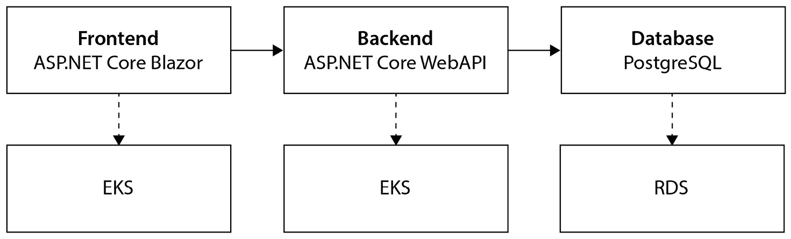

图 8.1 – 自动驾驶平台的逻辑架构

我们的应用架构，包括前端、后端和数据库，将保持不变，但我们需要使用 Terraform 来配置不同的资源，并利用 Docker 和 Kubernetes 的新工具来自动化将解决方案部署到这一新基础设施中：

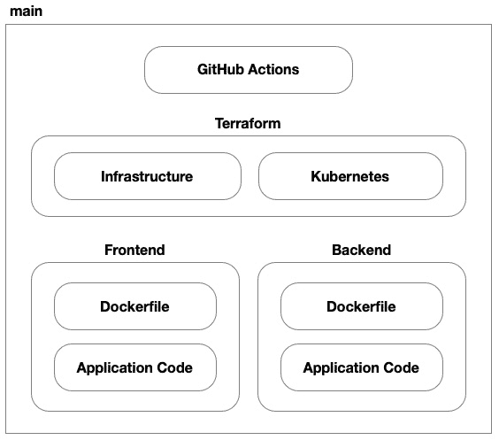

图 8.2 – 我们代码库的源代码控制结构

在这个解决方案中，我们将有七个部分。我们依然保留前端和后端的应用代码和 Dockerfile（替代基于 Packer 的 VM 镜像）。我们仍然使用 GitHub Actions 来实施我们的 CI/CD 流程，但现在我们有两个 Terraform 代码库——一个用于配置 AWS 的基础设施，另一个用于将我们的应用部署到 EKS 上托管的 Kubernetes 集群中。然后，我们还有两个代码库，分别用于应用的前端和后端。

## 云架构

在前一章中，我们的云托管解决方案是由一组专用 VM 组成的。在本章中，我们的目标是利用 AWS EKS，使用由 Kubernetes 管理的共享 VM 池来托管我们的应用。为了实现这一目标，我们将使用一些新的资源，这些资源专为基于容器的工作负载设计。然而，网络、负载均衡及其他组件大部分将保持不变。

### 虚拟网络

回顾我们在*第七章*中使用 EC2 实例和虚拟网络的工作，为 AWS EKS 设置**虚拟私有云**（**VPC**）遵循类似的流程。核心网络依然存在，依旧充满了繁琐的细节，从子网——包括公有和私有子网——到路由表、互联网网关和 NAT 网关等一系列细节，我们为 EKS 集群构建的虚拟网络将与我们之前创建的网络大致相同。唯一的不同是我们如何使用它：

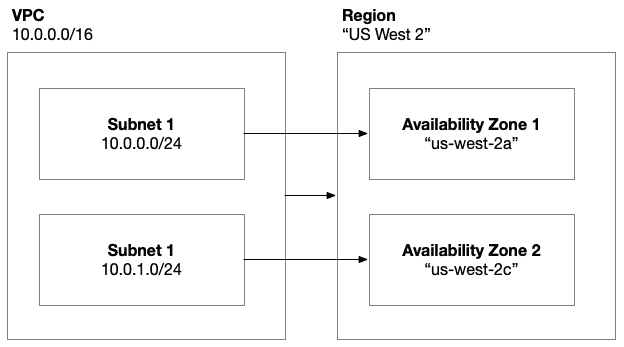

图 8.3 – AWS 虚拟网络架构

之前，我们为前端 VM 使用了公共子网，而为后端使用了私有子网。正如我们在*第五章*中所学到的，当我们将 Kubernetes 引入时，我们将过渡到一个共享的 VM 池，托管我们作为 Pod 运行的应用程序。这些 VM 将托管在私有子网中，负载均衡器将托管在公共子网中。

### 容器注册表

基于我们在*第五章*中对容器架构的探讨，我们知道我们需要构建容器镜像，并将它们存储在容器注册表中。为此，AWS 提供了**弹性容器注册表**（**ECR**）。这是一个私有容器注册表，不同于我们在*第五章*中提到的公共注册表，例如 Docker Hub。

我们需要利用 Docker 命令行工具来构建和推送镜像到 ECR。为了实现这一点，我们需要授予某个身份必要的权限。正如我们在上一章所看到的，当我们使用 Packer 构建 VM 镜像时，我们可能会有一个 GitHub Actions 工作流，用于构建并将容器镜像推送到 ECR。GitHub Actions 工作流执行的身份需要具备这些权限。将这些 Docker 镜像上传到 ECR 后，最后一步是授予我们的集群访问权限，从注册表中拉取镜像：

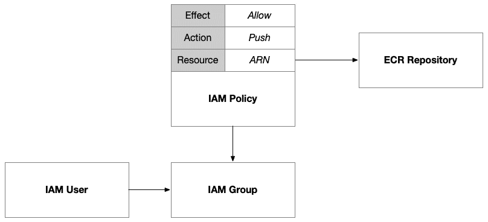

图 8.4 – IAM 策略授予一个组推送容器镜像到 ECR 的权限

我们将设置一个 IAM 组，并授予该组相应权限。这样，我们就可以将 GitHub Action 的用户以及任何其他希望直接从命令行推送镜像的用户添加到该组。在 AWS 中，IAM 策略非常灵活；它们可以独立声明，或者与它们附加的身份内联声明。这使得我们可以创建可重用的策略，并将其附加到多个身份上。在这个案例中，我们将定义一个授予推送镜像到 ECR 的权限的策略，然后将其附加到该组。接着，加入该组的成员将获得这些权限。

最后一步是授予集群访问权限，以便它在节点内调度 Pod 时可以从我们的 ECR 拉取镜像。为此，我们可以使用 AWS 提供的内建策略 `AmazonEC2ContainerRegistryReadOnly`。我们需要使用其完全限定的 ARN 来引用它，即 `arn:aws:iam::aws:policy/AmazonEC2ContainerRegistryReadOnly`。内建策略的 ARN 前缀通常是 `arn:aws:iam::aws:policy`，这标识它们是由 AWS 发布的，而非某个具体用户在其 AWS 账户内发布的。当我们发布自己的策略时，完全限定的 ARN 会包含我们的账户号码。

### 负载均衡

与上一章中我们配置和管理自己的 AWS **应用负载均衡器**（**ALB**）不同，使用 Amazon EKS 的一个优点是 EKS 承担了大部分配置和管理负载均衡器的责任。我们可以使用 Kubernetes 注解来引导和影响其操作，但大部分工作已由 EKS 为我们处理。在我们的解决方案中，为了简化流程，我们将使用 NGINX 作为入口控制器，并配置它为我们设置一个 AWS **网络负载均衡器**（**NLB**）：

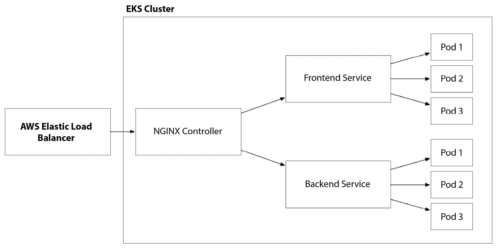

图 8.5 – 弹性负载均衡器与 NGINX 入口控制器协同工作，将流量路由到我们应用的 Pod

要将此责任委托给 EKS，我们需要授予其配置和管理这些资源所需的 IAM 权限。因此，我们需要配置一个 IAM 策略并将其附加到 EKS 集群。我们可以使用分配给集群节点组的 IAM 角色来完成此操作：

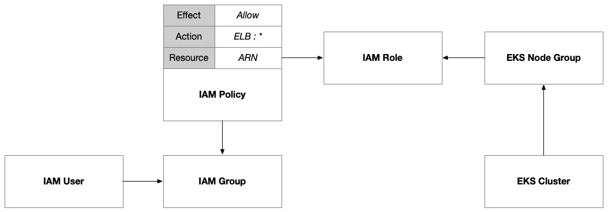

图 8.6 – 允许 EKS 配置和管理弹性负载均衡器的 IAM 策略

然后，我们为 Kubernetes 资源（例如服务和入口控制器）配置资源，并添加注解，以告知我们希望 EKS 代表我们实施的弹性负载均衡器的具体配置。

### 网络安全

在 Kubernetes 上托管服务并使其可在集群外部访问有很多种方式。在我们的解决方案中，我们将使用 AWS 弹性负载均衡器，通过我们的 NGINX 控制器将外部流量引入集群。还有其他选项，例如 NodePort，允许你通过节点上暴露的端口直接访问 Pod。这需要集群节点的公共访问，而且从安全性和可扩展性角度来看，这并不是首选方法。

如果我们希望使用`kubectl`访问集群，那么我们需要开启公共端点访问。这在你自己开发一些小项目时很有用，但在企业环境中并不理想。你很可能已经有了私有网络基础设施，因此永远不需要启用公共端点。

### 机密管理

将机密信息集成到 Amazon EKS 集群中的 Pod 可以通过多种方式实现，每种方式都有其优缺点。正如我们在上一章中处理虚拟机时所做的那样，我们将探索的方式是使用 AWS Secrets Manager 中的机密信息。Kubernetes 也有一种内置的方法，使用 Kubernetes Secrets。这种方法简单明了，直接集成到 Kubernetes 中，但在安全性方面有局限性，因为机密信息是用 Base64 编码的，任何具有集群访问权限的人都可以访问。

与 AWS Secrets Manager 的集成可以帮助解决这个问题，但为了访问我们存储在其中的机密，我们需要使我们的 Kubernetes 部署能够与 AWS **身份与访问管理** (**IAM**) 进行身份验证。这通常被称为工作负载身份，它是一个在各大云平台中相对常见的方法：

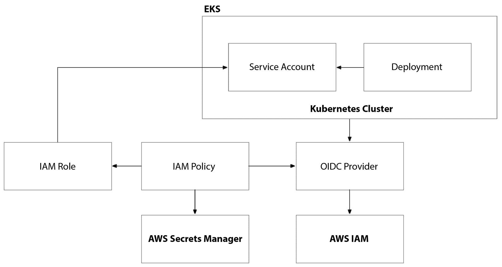

图 8.7 – AWS EKS 与工作负载身份

要在 EKS 上设置工作负载身份，我们需要使用 **OpenID Connect** (**OIDC**) 提供程序来配置集群。然后，我们必须设置一个 IAM 角色，该角色有一个策略，允许 Kubernetes 服务账户假设该角色。然后，可以为此 IAM 角色授予对 Kubernetes 部署所需的任何 AWS 权限和资源的访问权限，包括 Secrets Manager 的机密。最后，我们需要在 Kubernetes 中使用相同名称配置一个 Kubernetes 服务账户，并为其添加特殊注释以将其连接到 IAM 角色。

完成这些步骤后，我们的 Kubernetes 部署将被允许访问 AWS Secrets Manager 的机密，但它们不会使用该访问权限。最后一步是配置 Kubernetes 部署以拉取机密并使其对运行在 Pod 中的应用程序代码可访问：

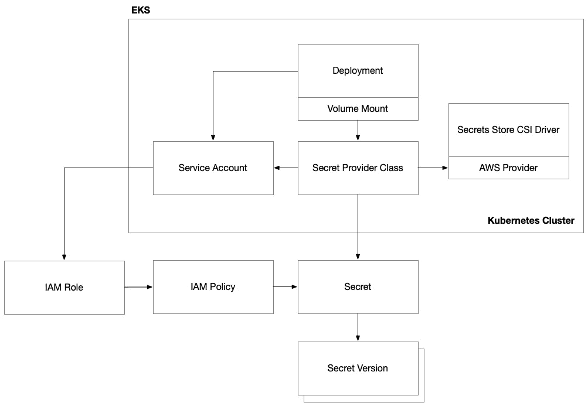

图 8.8 – AWS EKS 与 Secrets Manager 集成

Kubernetes 通常使用卷挂载的方式来实现这一点。因此，存在一个名为 secrets store **容器存储接口** (**CSI**) 提供程序的常见 Kubernetes 提供程序。这是一种与云平台无关的技术，可以将 Kubernetes 与外部秘密存储（如 AWS Secrets Manager）集成。此方法提供了增强的安全性和可扩展性，但需要更多的设置和维护。

为了使其正常工作，我们需要将两个组件部署到我们的 EKS 集群中：秘密存储 CSI 驱动程序，然后是该驱动程序的 AWS 提供程序，允许它与 AWS Secrets Manager 进行交互。这两个组件可以通过 `SecretProviderClass` 部署到我们的 EKS 集群中。这是一种资源类型，通过 CSI 驱动程序连接到 AWS Secrets Manager，从而访问特定的机密。它使用我们通过 IAM 角色及其权限授予访问权限的服务账户连接到 Secrets Manager 中的特定机密。

### Kubernetes 集群

Amazon EKS 提供了一项托管的 Kubernetes 服务，简化了容器化应用程序在 AWS 上的部署和管理。EKS 集群是此架构的核心。EKS 负责设置、操作和维护 Kubernetes 控制平面和节点，这些节点本质上是 EC2 实例。在设置 EKS 集群时，用户定义节点组，这些节点组表现为 EC2 实例集合，EKS 服务负责为其配置和管理。

有几种选项可以用来承载您的工作负载的节点组。最常见的例子是 AWS 管理的节点组和自管理的节点组。AWS 管理的节点组本质上是为 EKS 集群分配的按需 EC2 实例。AWS 简化了这些节点的管理，但这也会对可以使用的 AWS 特性施加一些限制。自管理节点本质上也是按需 EC2 实例，但它们提供了更大的控制权，允许对可用的特性和配置选项进行更精细的调整。

优化成本的一个好方法是使用 Fargate 节点组。这个选项利用了 AWS 的无服务器计算引擎，省去了配置和管理 EC2 实例的需求。然而，这可能更适用于不可预测的工作负载，而不是那些需要保持稳定状态的工作负载。在这种情况下，您可以利用自动扩展、现货实例和预留实例的组合，从而获得显著的折扣和成本降低：

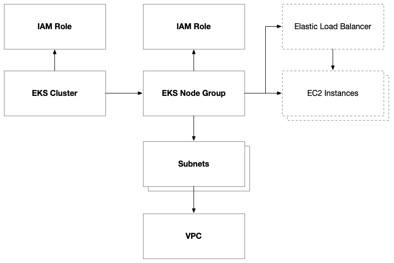

图 8.9 – AWS EKS 集群结构

IAM 策略是 EKS 配置的重要部分，因为服务的特性以及我们如何委派责任来管理 AWS 资源。这与我们在 AWS 自动扩展组中的做法类似，但更加重要。IAM 策略附加在集群和单独的节点组上。根据您希望在集群和节点组中启用的功能，您可能需要额外的策略。

`AmazonEKSClusterPolicy` 策略授予集群访问权限，以控制集群内部的工作方式，包括节点组、CloudWatch 日志和集群内的访问控制。

`AmazonEKSVPCResourceController` 策略授予集群访问权限，以管理网络资源，例如网络接口、IP 地址分配和安全组附加到 VPC 的操作。

有四个策略（`AmazonEKSWorkerNodePolicy`、`AmazonEKS_CNI_Policy`、`AmazonEC2ContainerRegistryReadOnly` 和 `CloudWatchAgentServerPolicy`）对于 EKS 工作节点的运行至关重要。这些策略必须附加到您分配给 EKS 节点组的 IAM 角色上。它们授予访问 EKS 集群控制平面的权限，并允许节点组内的节点与集群提供的核心基础设施集成，包括网络、容器注册表和 CloudWatch。如前所述，我们还添加了一个可选的策略，允许 EKS 集群管理弹性负载均衡器。

## 部署架构

现在我们已经对在 AWS 上构建的解决方案的云架构有了一个清晰的了解，我们需要制定计划，如何配置环境并部署代码。

### 云环境配置

基于我们在*第七章*中为 EC2 实例配置建立的方法，我们在配置 AWS EKS 环境时将采用类似的模式。此过程的核心在于利用 GitHub Actions，其基本设置和操作将保持不变：

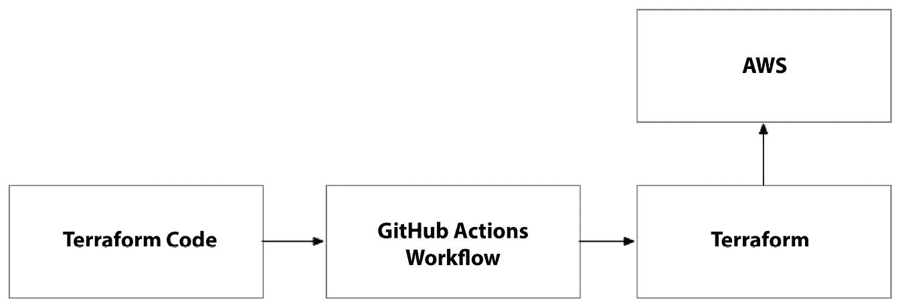

图 8.10 – Terraform 代码在 AWS 上配置环境

然而，与我们之前配置 EC2 实例不同，Terraform 代码将根据 EKS 环境的需要进行定制。这包括创建 EKS 集群和 ECR。GitHub Action 将自动执行此 Terraform 代码，遵循我们之前使用的相同工作流模式。

通过复用 GitHub Actions 工作流并使用不同的 Terraform 脚本，我们在保持部署过程一致性的同时，适应了 EKS 环境不同的基础设施需求。此步骤需要在独立模式下执行，以确保某些先决条件已到位，例如容器注册表。只有在容器注册表配置完成后，我们才能构建并将容器镜像推送到容器注册表中，用于前端和后端应用组件。

此步骤还将配置托管 Kubernetes 控制平面的 EKS 集群。我们将在最后一步与容器镜像一起使用它来部署我们的应用程序。

### 容器配置

与 Packer 不同，Packer 不依赖任何现有基础设施来配置应用程序部署工件（例如，由 Packer 构建的 AMI），我们的容器镜像在配置之前需要有一个容器注册表：

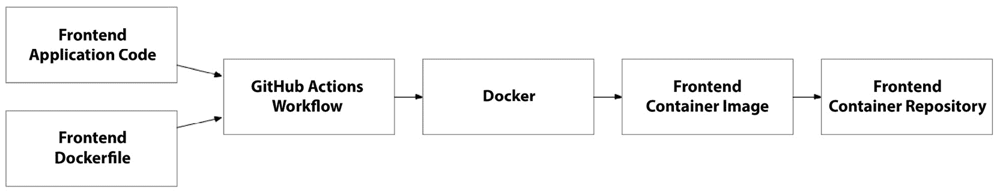

图 8.11 – 构建前端容器镜像的 Docker 流水线

工作流与 Packer 非常相似，我们将应用程序代码与存储操作系统配置的模板结合。在这种情况下，它存储的是 Dockerfile，而不是 Packer 模板。

### Kubernetes 配置

一旦我们发布了前端和后端的容器镜像，就可以通过添加一个最终步骤来完成部署，该步骤使用 Kubernetes 提供程序执行 Terraform，从而将我们的应用程序部署到 EKS 集群：

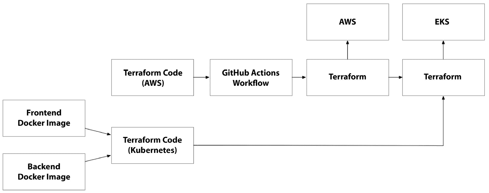

图 8.12 – 容器镜像作为 terraform 代码的输入，terraform 代码在 EKS 的 Kubernetes 控制平面上配置环境

我们将输出前一个 Terraform 步骤中配置 AWS 基础设施的关键信息。这将包括关于 ECR 仓库和 EKS 集群的详细信息。我们可以将这些作为最终 Terraform 执行步骤的输入，在该步骤中我们将使用 Kubernetes 提供程序。我们已经将此步骤分离到不同的 Terraform 工作空间，以将其与 AWS 基础设施解耦。这考虑到了 Kubernetes 控制平面层和底层基础设施之间的硬依赖关系。它使我们能够独立管理底层基础设施，而不需要更改 Kubernetes 部署，同时可以在 Kubernetes 控制平面中进行隔离的更改，从而加快发布过程。

在这一部分中，我们回顾了架构中的关键变化，即从基于虚拟机的架构转向基于容器的架构。在下一部分中，我们将采取战术性的步骤来构建解决方案，但我们会小心地基于上一章中我们第一次在 AWS 上使用 EC2 启动虚拟机时所构建的基础，继续构建。

# 构建解决方案

在这一部分中，我们将把理论知识应用于一个具体的、可运行的解决方案，同时利用 AWS 平台上的 Docker、Terraform 和 Kubernetes 的力量。这个过程的某些部分将需要重大更改，例如我们使用 Terraform 配置 AWS 基础设施时；其他部分将会有一些小的更改，例如我们用来将应用程序部署到 Kubernetes 集群的 Kubernetes 配置；还有一些部分将是全新的，例如构建并推送 Docker 镜像到容器注册表的过程。

## Docker

正如我们在上一章中看到的，当我们在 Packer 中构建虚拟机镜像时，需要进行一定的操作系统配置。在 Docker 中，我们基本上做的是相同的事情，但我们是为特定的进程进行配置。这意味着我们在设置 Linux 服务时所做的很多工作被省略了，因为容器运行时控制着应用程序是否运行。这与配置 Linux 操作系统将可执行文件作为服务运行是根本不同的。因此，许多冗余的配置被省略了。

另一个主要区别是，使用 Packer 镜像时，我们在 Packer 外部构建应用程序，并将一个包含应用程序的压缩工件作为 Packer 构建的一部分。而使用 Docker 时，我们将在容器构建过程中构建应用程序并生成工件。这个过程完成后，我们将遵循一个类似的过程，将部署包放入干净的容器镜像层中，以消除任何残留的构建工件：

```
FROM mcr.microsoft.com/dotnet/sdk:6.0 AS build-env
WORKDIR /app
```

以下这一行设置了构建阶段的基础镜像。它使用了官方的 Microsoft .NET SDK 镜像（版本 `6.0`），来自**Microsoft 容器** **注册表**（**MCR**）：

```
COPY ./FleetPortal/FleetPortal.csproj ./FleetPortal/
RUN dotnet restore ./FleetPortal/FleetPortal.csproj
```

在我们构建项目之前，需要解决其依赖关系。`dotnet restore`命令会通过从 NuGet（.NET 包管理器）拉取所有依赖项来完成此操作：

```
COPY . ./
RUN dotnet publish ./FleetPortal/FleetPortal.csproj -c Release -o out
```

在这里，我们执行`dotnet publish`命令，创建项目的二进制文件。`-c Release`选项指定构建应该为生产环境优化。我们将文件放入`out`文件夹中，供后续步骤使用：

```
FROM mcr.microsoft.com/dotnet/aspnet:6.0
WORKDIR /app
COPY --from=build-env /app/out .
```

我们以.NET 运行时镜像作为基础，启动一个新的构建阶段，并将我们从上一个阶段构建的二进制文件复制到这个新的构建阶段。这将确保任何中间构建的工件不会层叠到容器镜像中：

```
ENTRYPOINT [“dotnet”, “FleetPortal.dll”]
```

最后，我们为容器设置启动命令。当容器启动时，它将运行`dotnet FleetPortal.dll`，这将启动我们的 ASP.NET 应用程序，并开始监听传入的 Web 服务器流量。

## Terraform

正如我们在设计中讨论的那样，我们的解决方案由两个应用程序组件组成：前端和后端。每个组件都有一个需要部署的应用程序代码库。然而，使用 Kubernetes 解决方案时，基础设施变得更简单，因为我们只需要一个 Kubernetes 集群（以及一些其他组件）。重要的部分是 Kubernetes 平台本身的配置。

结果是，Terraform 的设置与我们在上一章所做的非常相似，因此我们只会关注为我们的解决方案所需的新资源。如果你想使用完整的解决方案，可以在 GitHub 上查看本书的完整源代码。

### 容器注册表

首先，我们将使用 AWS ECR 为应用程序的前端和后端设置仓库。为了简化 ECR 仓库的动态创建，我们可以设置一个名为`repository_list`的本地变量，该变量包含我们需要仓库的两个容器镜像的常量：

```
locals {
  repository_list = [“frontend”, “backend”]
  repositories    = { for name in local.repository_list : name => name }
}
```

然后，我们将使用`for`表达式从这个列表中生成一个映射，接着使用`for_each`迭代器来创建相应的 ECR 仓库：

```
resource “aws_ecr_repository” “main” {
  for_each = local.repositories
  name                 = “ecr-${var.application_name}-${var.environment_name}-${each.key}”
  image_tag_mutability = “MUTABLE”
}
```

接下来，我们将设置一个 IAM 组，授予其推送容器镜像的权限：

```
resource “aws_iam_group” “ecr_image_pushers” {
  name = “${var.application_name}-${var.environment_name}-ecr-image-pushers”
}
```

现在，我们需要生成一个 IAM 策略，该策略授予对每个 ECR 仓库的访问权限，并将其附加到我们之前创建的 IAM 组：

```
resource “aws_iam_group_policy” “ecr_image_pushers” {
  for_each = local.repositories
  name  = “${var.application_name}-${var.environment_name}-${each.key}-ecr-image-push-policy”
  group = aws_iam_group.ecr_image_pushers.name
  policy = jsonencode({
    Version = “2012-10-17”,
    Statement = [
      {
        Effect = “Allow”,
        Action = [
          “ecr:GetDownloadUrlForLayer”,
          “ecr:BatchGetImage”,
          “ecr:BatchCheckLayerAvailability”,
          “ecr:PutImage”,
          “ecr:InitiateLayerUpload”,
          “ecr:UploadLayerPart”,
          “ecr:CompleteLayerUpload”
        ],
        Resource = aws_ecr_repository.main[each.key].arn
      }
    ]
  })
}
```

最后，我们必须授予该组访问权限。我们将向我们团队中的开发人员身份或将作为 CI/CD 过程的一部分推送新镜像的 GitHub Actions 工作流授予访问权限：

```
resource “aws_iam_group_membership” “ecr_image_pushers” {
  name  = “${var.application_name}-${var.environment_name}-ecr-image-push-membership”
  users = var.ecr_image_pushers
  group = aws_iam_group.ecr_image_pushers.name
}
```

### Kubernetes 集群

现在，我们的容器注册表已经设置完毕，且能够向其中推送镜像，我们需要设置我们的 Kubernetes 集群。AWS EKS 就是为此而来。集群的配置相对简单，但我们需要在 IAM 方面做一些工作，以使其正常运作。

在我们配置 EKS 集群之前，我们需要设置它将用来与 AWS 平台其余部分交互的 IAM 角色。这个角色不是我们的节点或 Kubernetes 部署将使用的角色，而是 EKS 将用于在所有 AWS 资源上执行对集群进行的配置更改的角色：

```
data “aws_iam_policy_document” “container_cluster_assume_role” {
  statement {
    effect = “Allow”
    principals {
      type        = “Service”
      identifiers = [“eks.amazonaws.com”]
    }
    actions = [“sts:AssumeRole”]
  }
}
```

因此，EKS 服务将承担此角色。因此，`assume` 策略需要允许一个 `Service` 类型的主体，其标识符为 `eks.amazonaws.com`：

```
resource “aws_iam_role” “container_cluster” {
  name               = “eks-${var.application_name}-${var.environment_name}-cluster-role”
  assume_role_policy = data.aws_iam_policy_document.container_cluster_assume_role.json
}
```

通过这个角色，我们将使 EKS 能够在我们的 AWS 账户中配置和管理它所需的资源。因此，我们需要附加内置的 `AmazonEKSClusterPolicy` 和 `AmazonEKSVPCResourceController` 策略：

```
resource “aws_iam_role_policy_attachment” “eks_cluster_policy” {
  policy_arn = “arn:aws:iam::aws:policy/AmazonEKSClusterPolicy”
  role       = aws_iam_role.container_cluster.name
}
```

上述代码是如何为其中一个策略执行此操作的示例。你可以为每个策略创建一个 `aws_iam_role_policy_attachment` 资源，或者使用迭代器遍历我们需要附加的策略集合。

现在这个 IAM 角色已经准备好，我们可以使用 `aws_eks_cluster` 资源来设置我们的集群：

```
resource “aws_eks_cluster” “main” {
  name                      = local.cluster_name
  role_arn                  = aws_iam_role.container_cluster.arn
  vpc_config {
    security_group_ids = [
      aws_security_group.cluster.id,
      aws_security_group.cluster_nodes.id
    ]
    subnet_ids              = local.cluster_subnet_ids
    endpoint_public_access  = true
    endpoint_private_access = true
  }
  // Other configurations like logging, encryption, etc.
}
```

配置的大部分内容是在 `vpc_config` 块中完成的，它引用了我们在上一章中配置的许多相同的结构。

有一点你可能想要记住的是，IAM 策略对于成功配置 EKS 集群的重要性。由于 IAM 角色的策略附件之间没有直接关系，你应该确保在我们尝试配置 EKS 集群之前，先创建 IAM 角色权限。以下代码演示了如何使用 `depends_on` 属性，它允许我们显式地定义这种关系：

```
  depends_on = [
    aws_iam_role_policy_attachment.eks_cluster_policy,
    aws_iam_role_policy_attachment.eks_vpc_controller_policy,
    aws_cloudwatch_log_group.container_cluster
  ]
```

EKS 集群只是控制平面。为了使我们的集群具有实用性，我们需要添加工作节点。我们可以通过添加一个或多个节点组来实现。这些节点组将由一组 EC2 实例组成，这些实例将作为工作节点加入。这些节点也需要它们自己的 IAM 角色：

```
data “aws_iam_policy_document” “container_node_group” {
  statement {
    sid     = “EKSNodeAssumeRole”
    actions = [“sts:AssumeRole”]
    principals {
      type        = “Service”
      identifiers = [“ec2.amazonaws.com”]
    }
  }
}
```

一个关键区别在于，由于该角色将由工作节点承担，而工作节点是 EC2 实例，因此 IAM 角色的 `assume` 策略需要与此事实保持一致。

就像之前设置 EKS 集群时需要设置 IAM 角色作为前提条件一样，节点组也是如此。现在节点组的 IAM 角色已经准备好，我们可以使用以下代码来创建一个与先前定义的集群关联的 EKS 节点组。它指定了节点组的期望大小、最小大小和最大大小，以及其他配置，如 AMI 类型和磁盘大小：

```
resource “aws_eks_node_group” “main” {
  cluster_name    = aws_eks_cluster.main.name
  node_group_name = “ng-user”
  node_role_arn   = aws_iam_role.container_node_group.arn
  subnet_ids      = local.cluster_subnet_ids
  scaling_config {
    desired_size = 3
    min_size     = 1
    max_size     = 4
  }
  ami_type       = var.node_image_type
  instance_types = [var.node_size]
}
```

同样，像 EKS 集群一样，IAM 角色的策略附件对于使节点组功能正常至关重要。因此，您需要确保在开始配置节点组之前，将所有策略附件附加到 IAM 角色上。正如我们在前一节中讨论的那样，有四个策略（`AmazonEKSWorkerNodePolicy`、`AmazonEKS_CNI_Policy`、`AmazonEC2ContainerRegistryReadOnly` 和 `CloudWatchAgentServerPolicy`）对于 EKS 工作节点的操作至关重要：

```
  depends_on = [
    aws_iam_role_policy_attachment.eks_worker_node_policy,
    aws_iam_role_policy_attachment.eks_cni_policy,
    aws_iam_role_policy_attachment.eks_ecr_policy,
    aws_iam_role_policy_attachment.eks_cloudwatch_policy
  ]
```

当您为 EKS 集群添加额外功能时，您可能会引入额外的 IAM 策略，授予集群及其工作节点在 AWS 中的不同权限。当您这样做时，别忘了在这些`depends_on`属性中也包含这些策略，以确保操作顺利进行。

### 日志记录和监控

我们可以通过简单地将`enabled_cluster_log_types`属性添加到`aws_eks_cluster`资源中来启用集群的 CloudWatch 日志：

```
enabled_cluster_log_types = [“api”, “audit”]
```

这个属性可以接受一个或多个不同的日志类型。我建议查看文档以了解所有支持的不同选项。接下来，我们需要为集群配置一个 CloudWatch 日志组：

```
resource “aws_cloudwatch_log_group” “container_cluster” {
  name              = “/aws/eks/${local.cluster_name}/cluster”
  retention_in_days = 7
}
```

这要求使用特定的命名约定，并且需要与您为集群使用的名称匹配。因此，最好将传递给`aws_eks_cluster`资源的`name`属性的值提取为本地变量，以便在两个地方使用。

### 工作负载身份

配置好集群后，我们需要从集群中获取 OIDC 发行者证书，以便将其用于配置 AWS IAM 的 OpenID Connect 提供商。以下代码使用来自`tls`实用程序提供商的`tls_certificate`数据源，正如我们在*第三章*中介绍的那样，获取关于证书的附加元数据：

```
data “tls_certificate” “container_cluster_oidc” {
  url = aws_eks_cluster.main.identity[0].oidc[0].issuer
}
```

有了这些额外的元数据，我们可以使用`aws_iam_openid_connect_provider`资源，通过引用`sts.amazonaws.com`，将集群连接到 AWS IAM OIDC 提供商：

```
resource “aws_iam_openid_connect_provider” “container_cluster_oidc” {
  client_id_list  = [“sts.amazonaws.com”]
  thumbprint_list = [data.tls_certificate.container_cluster_oidc.certificates[0].sha1_fingerprint]
  url             = data.tls_certificate.container_cluster_oidc.url
}
```

我们已经设置了几个 IAM 角色，包括一个用于 EKS 集群的角色和另一个用于集群工作节点的角色。因此，我不会重复创建工作负载身份的`aws_iam_role`资源。然而，这个新角色需要有一个非常明确的假设策略。工作负载身份 IAM 角色需要引用 OIDC 提供商和一个尚未配置的 Kubernetes 服务账户：

```
data “aws_iam_policy_document” “workload_identity_assume_role_policy” {
  statement {
    actions = [“sts:AssumeRoleWithWebIdentity”]
    effect  = “Allow”
    condition {
      test     = “StringEquals”
      variable = “${replace(aws_iam_openid_connect_provider.container_cluster_oidc.url, “https://”, “”)}:sub”
      values   = [“system:serviceaccount:${var.k8s_namespace}:${var.k8s_service_account_name}”]
    }
    principals {
      identifiers = [aws_iam_openid_connect_provider.container_cluster_oidc.arn]
      type        = “Federated”
    }
  }
}
```

如您所见，在前面的代码中，服务帐户遵循非常具体的命名约定：`system:serviceaccount:<namespace>:<service-account-name>`。我们用 Kubernetes 命名空间的名称替换 `<namespace>`，同样，用服务帐户的名称替换 `<service-account-name>`。需要指出的是，我们正在引用尚未存在的资源。因此，在工作负载身份 IAM 角色的假设策略中对这些资源的引用是指向或占位符，指向这些尚未创建的资源。Kubernetes 命名空间和服务帐户都是需要在 Kubernetes 控制平面中创建的资源。我们将在下一节中使用 `kubernetes` Terraform 提供者来处理这一问题。

### 秘密管理

现在我们已经为工作负载身份创建了 IAM 角色，我们只需要授予它访问我们希望使用的 AWS 资源的权限。因此，我们将再次使用 `aws_iam_policy_document` 数据源来生成一个 IAM 策略，并将其附加到工作负载身份的 IAM 角色上。在这里，我们有机会授予它对 AWS 中任何我们应用代码所需资源的访问权限。对于我们的解决方案，我们将首先授予它访问 AWS Secrets Manager 秘密的权限，允许它通过 `secretsmanager:GetSecretValue` 操作读取秘密：

```
data “aws_iam_policy_document” “workload_identity_policy” {
  statement {
    effect = “Allow”
    actions = [
      “secretsmanager:GetSecretValue”,
      “secretsmanager:DescribeSecret”,
    ]
    resources = [
      “arn:aws:secretsmanager:${var.primary_region}:${data.aws_caller_identity.current.account_id}:secret:*”,
    ]
  }
}
```

该策略将授予 IAM 角色对该帐户内秘密的访问权限。我们可以通过增强 `*` 通配符路径来进一步细化其访问权限，以确保它仅访问某些秘密。这可以通过实施一种命名约定来完成，使用唯一的前缀为您的秘密命名。`application_name` 和 `environment_name` 变量是实现此命名约定的完美方式，并能加强对 AWS Secrets Manager 中 Kubernetes 工作负载的访问控制。

现在，我们只需要使用正确的命名约定将秘密配置到 Secrets Manager 中：

```
resource “aws_secretsmanager_secret” “database_connection_string” {
  name        = “${var.application_name}-${var.environment_name}-connection-string”
  description = “Database connection string”
}
```

AWS Secrets Manager 使用名为 `aws_secretsmanager_secret` 的父资源作为秘密本身的逻辑占位符，但认识到秘密的值可能随着时间的推移而发生变化：

```
resource “aws_secretsmanager_secret_version” “database_connection_string” {
  secret_id     = aws_secretsmanager_secret.database_connection_string.id
  secret_string = random_password.database_connection_string.result
}
```

秘密的不同值存储在 `aws_secretsmanager_secret_version` 资源中。您可以使用 `random` 提供者生成复杂的秘密，但通常更常见的做法是从其他资源的输出中获取 `secret_string`。

## Kubernetes

在 *第五章* 中，我们介绍了使用 YAML 和 **HashiCorp 配置语言**（**HCL**）的 Kubernetes 架构和自动化技术。在本书中的解决方案中，我们将使用 Terraform 提供者来自动化应用程序的部署。这使我们能够将 Kubernetes 配置参数化，避免被硬编码到 YAML 文件中，并使用相同的部署过程配置 Kubernetes 原语和 Helm 图表的组合。

### 提供者设置

按讽刺意味来说，我们设置 `kubernetes` 提供程序的第一步是初始化 `aws` 提供程序，以便我们能够获取有关 EKS 集群的信息。我们可以通过使用提供的数据源和一个输入变量来完成此操作：集群名称。当然，AWS 区域也是此操作的一个隐含参数，但它是 `aws` 提供程序配置的一部分，而不是数据源的输入参数：

```
data “aws_eks_cluster” “cluster” {
  name = var.eks_cluster_name
}
```

我们将使用 `aws_eks_cluster` 和 `aws_eks_cluster_auth` 数据源来获取初始化 `kubernetes` 提供程序所需的数据：

```
provider “kubernetes” {
  host                   = data.aws_eks_cluster.cluster.endpoint
  cluster_ca_certificate = base64decode(data.aws_eks_cluster.cluster.certificate_authority[0].data)
  token                  = data.aws_eks_cluster_auth.cluster.token
  load_config_file       = false
}
```

有趣的是，Helm 提供程序的设置几乎与 Kubernetes 提供程序配置完全相同。看起来有点冗余，但其实相对简单：

```
provider “helm” {
  kubernetes {
    host                   = data.aws_eks_cluster.main.endpoint
    cluster_ca_certificate = base64decode(data.aws_eks_cluster.main.certificate_authority[0].data)
    token                  = data.aws_eks_cluster_auth.main.token
  }
}
```

### 命名空间

创建 Kubernetes 命名空间非常简单：

```
resource “kubernetes_namespace” “main” {
  metadata {
    name = var.k8s_namespace
    labels = {
      name = var.k8s_namespace
    }
  }
}
```

它将充当我们为应用程序配置的所有 Kubernetes 资源的逻辑容器。

### 服务账户

在上一部分中，当我们在 AWS 内设置 OpenID Connect 提供程序配置，并提前指定 Kubernetes 命名空间和服务账户名称时，我们已经搭建了这座桥梁的一半。现在，我们将通过配置 `kubernetes_service_account` 并确保 `namespace` 和 `name` 与我们的 AWS 配置匹配，来完成这座桥梁的搭建：

```
resource “kubernetes_service_account” “workload_identity” {
  metadata {
    name      = var.k8s_service_account_name
    namespace = var.k8s_namespace
    annotations = {
      “eks.amazonaws.com/role-arn” = var.workload_identity_role
    }
  }
}
```

我们还需要添加一个注释，引用工作负载身份的 IAM 角色的唯一标识符（或 ARN）。我们可以将其设置为我们 Terraform 工作空间中的输出变量，该工作空间负责配置 AWS 基础设施，并将其值路由到 Kubernetes 配置的 Terraform 工作空间中的输入变量。这是一个很好的例子，展示了如何使用 Terraform 的 `kubernetes` 提供程序来配置与云平台紧密耦合的 Kubernetes 资源。

### 密钥存储 CSI 驱动程序

设置好服务账户后，我们的应用程序离能够访问 AWS Secrets Manager 中的密钥又近了一步。然而，在我们能做到这一点之前，我们需要设置密钥存储 CSI 驱动程序。如前所述，这是一个常见的 Kubernetes 组件，它提供了一种标准机制，通过使用卷挂载来分发远程管理的密钥给运行在 Kubernetes 中的工作负载。该驱动程序具有极高的灵活性，可以通过充当不同外部密钥管理系统适配器的提供程序进行扩展。

首先，我们需要安装密钥存储 CSI 驱动程序的 Helm 图表：

```
resource “helm_release” “csi_secrets_store” {
  name       = “csi-secrets-store”
  repository = “https://kubernetes-sigs.github.io/secrets-store-csi-driver/charts”
  chart      = “secrets-store-csi-driver”
  namespace  = “kube-system”
  set {
    name  = “syncSecret.enabled”
    value = “true”
  }
}
```

我们可以选择通过使用 `syncSecret.enabled` 属性启用密钥同步，使得密钥可以从 Kubernetes 密钥中访问。这使得将密钥注入到我们应用程序的 Pod 中变得非常方便，无需自定义代码从挂载的卷中检索它们。

接下来，我们需要为 CSI 驱动程序安装 AWS 提供程序：

```
resource “helm_release” “aws_secrets_provider” {
  name       = “secrets-provider-aws”
  repository = “https://aws.github.io/secrets-store-csi-driver-provider-aws”
  chart      = “secrets-store-csi-driver-provider-aws”
  namespace  = “kube-system”
}
```

这两个 Helm 图表会在`kube-system`命名空间下为你的集群配置多个不同的 Kubernetes 资源。如果遇到错误，检查托管这些组件的 Pod 是调试配置的好地方。

### 秘密提供者类

一旦我们安装了 CSI 驱动程序及其 AWS 提供程序，就可以准备连接到 AWS Secrets Manager。到目前为止，我们只是启用了这个功能；我们还没有通过访问秘密来实际使用它。

这正是`SecretProviderClass`资源的作用。它连接到 AWS Secrets Manager 中的一组特定秘密。你会注意到，这种类型的资源配置方式与 Kubernetes 中的其他资源不同。虽然其他资源类型有相应的 Terraform 资源，`SecretProviderClass`使用的是`kubernetes_manifest`资源。

这是因为该资源类型是通过 Kubernetes **自定义资源定义**（**CRD**）进行管理的；它不是 Kubernetes 内置的类型：

```
resource “kubernetes_manifest” “secret_provider_class” {
  manifest = {
    apiVersion = “secrets-store.csi.x-k8s.io/v1”
    kind       = “SecretProviderClass”
    metadata = {
      name      = “${var.application_name}-${var.environment_name}-secret-provider-class”
      namespace = var.k8s_namespace
    }
    spec = {
      provider = “aws”
      parameters = {
        objects = yamlencode([ ... ])
      }
      secretObjects = [ ... ]
    }
  }
}
```

`SecretProviderClass`的结构分为两部分。首先，`parameters`是我们声明希望导入的秘密的地方：

```
{
  objectName         = “fleet-portal-dev-connection-string”
  objectType         = “secretsmanager”
  objectVersionLabel = “AWSCURRENT”
}
```

在这里，`objectName`对应的是 Secrets Manager 秘密的相对名称或秘密的完全合格 ARN。接下来，`objectType`表示应使用哪个 CSI 驱动程序提供程序来访问秘密，而`objectVersionLabel`允许我们在 Secrets Manager 中选择秘密的特定版本。对于 AWS，若要访问最新版本（可能是最常见的用例），你需要指定`AWSCURRENT`作为值。

接下来，有一个`secretObjects`集合，用于定义相应的 Kubernetes 秘密对象：

```
{
  data = [
    {
      key        = “fleet-portal-dev-connection-string”
      objectName = “fleet-portal-dev-connection-string”
    }
  ]
  secretName = “fleet-portal-dev-connection-string”
  type       = “Opaque”
}
```

这些`secretObjects`稍后将在我们应用的部署规范中使用，用来为 Pod 中的每个秘密创建环境变量。

### 部署

Kubernetes 部署是我们必须在 Kubernetes 中配置的最重要的资源之一。因此，它可能会有些令人生畏，因为其中包含一些复杂的嵌套部分。部署中最重要的部分是容器规范。它为我们的 Pod 设置了实际的运行时环境。

最重要的信息是我们希望在 Pod 中使用的容器镜像。为了配置这个，我们需要构建指向存储在 ECR 中的容器镜像的完全合格路径。为此，我们需要两项信息。首先，我们需要 AWS 账户编号，其次，我们需要 ECR 存储库所在的 AWS 区域名称：

```
locals {
  account_id         = data.aws_caller_identity.current.account_id
  container_registry = “${local.account_id}.dkr.ecr.${var.primary_region}.amazonaws.com/”
}
```

AWS 账户编号可以很容易地从`aws_caller_identity`数据源中获取。这个数据源非常简单，提供关于 Terraform 使用`aws`提供程序的 AWS 账户和 IAM 身份的上下文信息。因此，要创建这个数据源，你只需创建它而不带任何参数：

```
data “aws_caller_identity” “current” {}
```

这是访问 Terraform 提供程序认证上下文和云平台配置范围的常见模式 – 在本例中，我们正在为哪个 AWS 帐户和哪个区域进行配置。

这是将相同 YAML 代码版本转换为使用输入变量在实体上设置不同属性的 HCL 的版本：

```
resource “kubernetes_deployment” “web_app” {
  metadata {
    name      = local.web_app_name
    namespace = var.k8s_namespace
  }
  spec {
    replicas = 3
    selector {
      match_labels = {
        app = local.web_app_name
      }
    }
    template {
      metadata {
        labels = {
          app = local.web_app_name
        }
      }
      spec {
        service_account_name = kubernetes_service_account.workload_identity.metadata[0].name
        container {
          image = local.web_app_image_name
          name  = local.web_app_name
          port {
            container_port = 5000
          }
          env_from {
            config_map_ref {
              name = kubernetes_config_map.web_app.metadata.0.name
            }
          }
        }
      }
    }
  }
}
```

我们用于容器镜像名称的本地变量是我们在 ECR 中容器镜像的完全限定路径。它遵循 `<account>.dkr.ecr.<region>.amazonaws.com/<repository>:<tag>` 的结构。在这里，`<account>` 是 AWS 帐户号码，可以使用 `aws_caller_identity` 数据源访问。然后，`<region>` 是 AWS 区域，可以从输入变量中访问。最后，`<repository>` 是 ECR 仓库名称，`<version>` 是容器镜像的特定版本的标签。

我们可以通过引用此 Terraform 工作空间中提供的其他 Kubernetes 资源来设置 `service_account_name`。这是使用 YAML 和 Terraform 的 `kubernetes` 提供程序之间的关键区别。如果我们使用 YAML，这将不得不硬编码，而在 HCL 中，我们可以引用 Terraform 工作空间中的其他资源。

要引用 AWS Secrets Manager 秘密，我们需要修改 `container` 块，以便包含另一个 `env` 块：

```
env {
  name = “DB_CONNECTION_STRING”
  value_from {
    secret_key_ref {
      name = “fleet-portal-dev-connection-string”
      key  = “fleet-portal-dev-connection-string”
    }
  }
}
```

这使我们能够引用我们在 `SecretProviderClass` 中声明的 `secretObjects` 对象之一，并为其提供一个环境变量名称，我们的应用程序代码可以引用以访问该密钥。

### Service

Kubernetes 服务主要是一种网络路由机制。它定义了服务应向外部客户端公开的端口以及应将网络流量转发到 pod 上的哪个端口：

```
resource “kubernetes_service” “web_app” {
  metadata {
    name      = “${local.web_app_name}-service”
    namespace = var.k8s_namespace
  }
  spec {
    type = “ClusterIP”
    port {
      port        = 80
      target_port = 5000
    }
    selector = {
      app = local.web_app_name
    }
  }
}
```

在这里，`selector` 指定应将流量转发到哪些 pod，并且它应该与服务选择器的 `app` 标签设置为相同的值匹配。

### ConfigMap

正如我们从 *第五章* 中所知道的，ConfigMap 资源是将非敏感配置设置传递给您的 pod 的绝佳方法：

```
resource “kubernetes_config_map” “web_app” {
  metadata {
    name      = “${local.web_app_name}-config”
    namespace = var.k8s_namespace
  }
  data = {
    BackendEndpoint = “”
  }
}
```

通常，提供基础设施的 Terraform 工作空间将输出需要包含在 Kubernetes ConfigMap 中的几个不同值（URI、AWS ARN、DNS 等）。

### Ingress

Ingress 控制器是 Kubernetes 的一个组件，用于将外部网络流量路由到集群中。它与 Kubernetes Ingress 一起工作，后者定义了为特定服务路由流量的具体规则。这与 CSI 驱动程序和 `SecretProviderClass` 的结构非常相似。一个提供基础子系统，从而实现能力，而另一个使用该底层子系统实现特定配置。

最受欢迎的 ingress 控制器之一是名为 NGINX 的负载均衡器。我们可以使用 Helm chart 来设置 NGINX ingress 控制器。该 Helm chart 部署的组件正是我们需要额外的 IAM 策略来允许 EKS 集群配置 AWS ELB 资源的原因。因为 ingress 控制器和 ingress 资源的 Kubernetes 配置将由 EKS 解释，并以 AWS ELB 资源的配置和提供形式体现出来。这意味着，不需要显式地使用 `aws` Terraform 提供程序来配置 ELB 资源，你将注解 Kubernetes 部署，必要的 ELB 资源会自动为你提供和配置。

我们需要做的第一件事是使用 Helm chart 安装 NGINX ingress 控制器：

```
resource “helm_release” “ingress” {
  name       = “ingress”
  repository = “https://charts.bitnami.com/bitnami”
  chart      = “nginx-ingress-controller”
  create_namespace = true
  namespace        = “ingress-nginx”
  set {
    name  = “service.type”
    value = “LoadBalancer”
  }
  set {
    name  = “service.annotations”
    value = “service.beta.kubernetes.io/aws-load-balancer-type: nlb”
  }
}
```

这将安装 NGINX，并在我们指定的命名空间下部署一个 Kubernetes 服务。下一步是为我们的应用配置 ingress：

```
resource “kubernetes_ingress_v1” “ingress” {
  metadata {
    name      = “${local.web_app_name}-ingress”
    namespace = var.k8s_namespace
    annotations = {
      “kubernetes.io/ingress.class” = “nginx”
    }
  }
  spec {
    rule {
      http { ... }
    }
  }
}
```

ingress 资源相对简单。你需要设置命名空间并指定要使用的 ingress 控制器。然后，你需要指定路径，以便将网络流量路由到正确的 Kubernetes 服务：

```
path {
  path      = “/”
  path_type = “Prefix”
  backend {
    service {
      name = kubernetes_service.web_app.metadata[0].name
      port {
        number = 80
      }
    }
  }
} 
```

对于前端和后端应用部署以及 ingress 控制器，建立明确的 `depends_on` 语句也非常重要，因为我们在 HCL 配置中并未直接引用它们：

```
depends_on = [
  kubernetes_service.web_app,
  kubernetes_service.web_api,
  helm_release.ingress
]
```

现在，我们已经构建了架构的三个组件，在下一节中，我们将探讨如何使用 Docker 来构建和发布容器镜像，并通过 Terraform 来配置我们的基础设施，将解决方案部署到 Kubernetes 上，从而实现自动化部署。

# 部署自动化

在本节中，我们将把重点从构建应用和环境转移到实现部署自动化，以便高效地将解决方案提供给 AWS。基于容器的架构涉及三项核心部署操作。首先，我们必须创建并发布容器镜像到容器注册表。接着，我们需要为容器托管创建并配置 Kubernetes 集群环境。最后，我们需要部署 Kubernetes 资源，以便在 Kubernetes Pods 中创建容器并引用我们发布的容器镜像。

## Docker

就像我们在上一章中用 Packer 构建的虚拟机镜像一样，容器镜像作为一个不可变的工件，包含了应用代码和操作系统配置的版本化副本。每当应用代码或操作系统配置发生变化时，我们需要更新这个工件：

```
on:
  push:
    branches: 
    - main
    paths:
    - ‘src/dotnet/frontend/**’
```

就像在 Packer 中一样，我们需要每次在 Dockerfile 中配置应用代码和操作系统时触发新的容器镜像构建。通过 GitHub Actions，我们可以添加一份 `paths` 列表来触发我们的工作流：

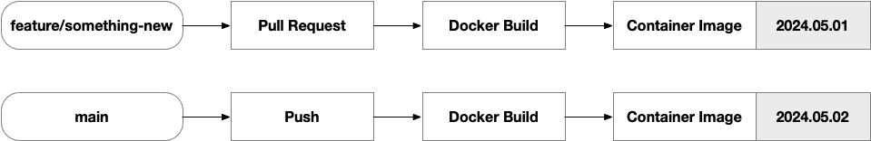

图 8.13 – 虚拟机镜像版本控制

现在我们已经设置了触发器和一些变量，接下来我们需要构建 `jobs`。对于每个 Packer 模板，我们将有两个作业：一个构建 C# .NET 应用代码并生成部署包，另一个运行 `packer build` 生成虚拟机镜像：

```
jobs:
  build:
    runs-on: ubuntu-latest
    steps:
      ...
  packer:
    runs-on: ubuntu-latest
    steps:
      ...
```

`build` 作业执行一个相当标准的 .NET 构建过程，包括从 NuGet（.NET 包管理器）恢复包依赖项、构建代码、运行单元测试和集成测试、发布可部署的构件，并存储该构件，以便未来的作业可以在流水线中使用：

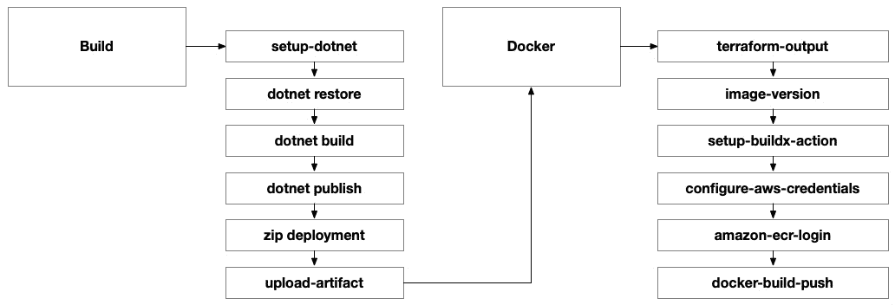

图 8.14 – Docker 工作流

`docker` 作业立即运行 Terraform 以获取我们要目标的 ECR 容器仓库的输出。我们不必在这里运行 Terraform，但我们可以明确指定 ECR 仓库的完全限定路径。

然后，它生成一个唯一的容器镜像名称版本，如果成功生成的话。我们将根据当前日期和 GitHub Action 的运行号来生成这个镜像版本。这将确保镜像版本唯一，以便我们不必手动设置或担心在推送到仓库时发生冲突：

```
    - id: image-version
      name: Generate Version Number
      run: |
        echo “version=$(date +’%Y.%m’).${{ github.run_number }}” >> “$GITHUB_OUTPUT”
```

接下来，我们需要设置 Docker：

```
    - name: Set up Docker Buildx
      uses: docker/setup-buildx-action@v1
```

现在，我们必须使用官方的 AWS GitHub Action 配置 AWS 凭证。我们将使用 GitHub 环境设置指定的 AWS 访问密钥和密钥访问密钥：

```
    - name: Configure AWS Credentials
      uses: aws-actions/configure-aws-credentials@v4
      with:
        aws-access-key-id: ${{ vars.AWS_ACCESS_KEY_ID }}
        aws-secret-access-key: ${{ secrets.AWS_SECRET_ACCESS_KEY }}
        aws-region: ${{ vars.PRIMARY_REGION }}
```

配置好凭证后，我们可以使用 `amazon-ecr-login` Action 来连接到 ECR：

```
    - name: Log in to Amazon ECR
      id: login-ecr
      uses: aws-actions/amazon-ecr-login@v2
```

最后，我们将使用官方的 Docker GitHub Action 来构建并推送镜像。需要注意的是，这个 Action 并不特定于 AWS。它使用标准的容器注册表协议，通过我们在 `tags` 参数中指定的 ECR 仓库的完全限定路径与 ECR 进行通信：

```
    - name: Build and push Docker image to ACR
      uses: docker/build-push-action@v5
      with:
        context: ${{ env.DOCKER_WORKING_DIRECTORY }}
        push: true
        tags: ${{ steps.terraform.outputs.registry_endpoint }}:${{ steps.image-version.outputs.version }}
```

我们的两个应用组件（前端和后端）将各自有一个仓库，因此注册表终端会根据我们推送的容器镜像不同而有所不同。

## Terraform

在 *第七章* 中，我们已经全面介绍了创建与 AWS 认证的 Terraform GitHub Action 的过程。因此，我们不会进一步深入讨论。建议你回顾 *第七章* 来复习该过程。

## Kubernetes

当我们使用 Terraform 自动化 Kubernetes 时，我们只需再次运行 `terraform apply`，并使用不同的根模块。这次，根模块将配置 `kubernetes` 和 `helm` 提供程序，以及 `aws` 提供程序。然而，我们不会使用 `aws` 提供程序创建新资源；我们只会从我们在之前的 `terraform apply` 命令中配置的现有资源中获取数据源，该命令将基础设施部署到 AWS。

结果是，执行此过程的 GitHub Action 将与我们在 AWS 中执行 Terraform 的方式非常相似。某些变量可能会发生变化，加入像容器镜像详情和集群信息等内容。

# 摘要

在本章中，我们设计、构建并自动化了一个完整的端到端解决方案，采用了基于容器的架构。我们在*第七章*的基础上进行了扩展，在第七章中，我们与 AWS VPC 的基础设施打交道，但这次我们增加了 AWS EKS 来托管我们的容器化应用程序。在 AWS 之旅的下一步，也是最后一步，我们将探索无服务器架构，超越基础设施本身，让平台本身带领我们的解决方案迈向新的高度。
