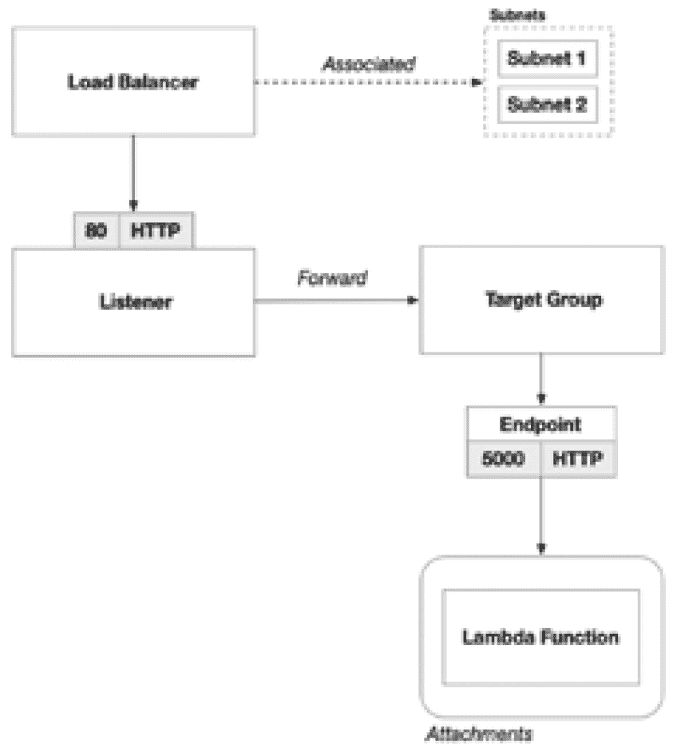

# 第九章：9

# 使用 AWS 实现无服务器 – 利用 AWS Lambda 构建解决方案

在本章中，我们将翻开三部分系列的最后一章，探讨 **Amazon Web Services**（**AWS**）的无服务器解决方案。此前，我们在 *第七章* 使用 **虚拟机**（**VMs**）在 AWS 上构建了解决方案，又在 *第八章* 使用容器进行过构建，现在我们将探索在 AWS 上构建真正的无服务器解决方案的样子。

尽管前几章的基础概念和实践对我们有所帮助，但解决方案的某些方面在这里完全没有涉及。具体来说，我们不需要担心任何操作系统的配置，无论是在 Packer 还是 Docker 中。

我们现在的重点转向调整应用代码以适应 **Lambda** 的应用模型。虽然这需要对应用代码进行修改，以与 Lambda 的方法保持一致，但也为我们提供了在不再需要管理服务器的情况下提升可扩展性和效率的机会。焦点的转变意味着更简化和高效的流程。我们将花更多的时间来调整应用代码以符合 Lambda 模式，而不是使用 Terraform 配置新服务。

本章涉及以下主题：

+   奠定基础

+   设计解决方案

+   构建解决方案

+   自动化部署

# 奠定基础

我们的故事通过 Söze Enterprises 公司的视角继续展开，这家公司由神秘的土耳其亿万富翁 Keyser Söze 创办。我们的团队一直在努力构建下一代自动驾驶车辆编排平台。最初，我们的策略是尽量减少变动，让团队专注于将功能快速推进到产品中。然而，我们那位难以捉摸的 CEO 则有着不同的想法，他推动我们采用容器技术，以使我们的产品在未来变得更加灵活和可扩展。与 Keyser 一起工作，永远不会无聊，但如此迅速地管理如此激进的变革也令人感到沮丧。

与此同时，在瑞士达沃斯，世界经济论坛正在如火如荼地进行着，Keyser 在意大利浓缩咖啡吧与 Werner Vogels 偶遇，并立即与他聊得非常投机。当 Werner 看到 Keyser 对自动驾驶平台的宏大愿景时，他随意地建议 Keyser 不必再为基础设施问题操心，利用 AWS 的无服务器产品可以将他从基础设施管理的枷锁中解脱出来，让他专注于实现他的宏大愿景。

多亏了 Werner 的洞察力和 Keyser 独特的决策方式，我们的团队更深入地进入了 AWS，明确地从 Amazon **Elastic Kubernetes Service**（**EKS**）过渡到 AWS Lambda，实现无服务器计算。这可能需要对我们的应用架构进行彻底重新思考，但它也可能将我们从管理底层基础设施的巨大操作负担中解脱出来。

# 设计解决方案

在本节中，我们将考虑我们的解决方案的整体设计，鉴于从基于虚拟机和容器的架构转向无服务器架构的转变。无服务器架构的核心目标是消除堆栈中沉重的基础设施。因此，我们将寻找方法，去除任何需要高额固定成本的 AWS 服务，如 EC2 实例或 EKS 集群，并用无服务器选项替代。这种在操作环境和技术领域的变化将要求我们重新思考解决方案的设计、实现和部署策略：


图 9.1 – 自动驾驶平台的逻辑架构

我们应用程序的架构并不会发生显著变化，但我们将使用不同的 Azure 服务来托管它。在这种情况下，我们将使用 Azure 存储来托管应用程序的前端，使用 Azure Functions 来托管应用程序的后端：


图 9.2 – 我们仓库的源代码控制结构

在这个解决方案中，我们将有四部分代码库。前两部分是用于配置环境的 Terraform 代码和执行部署过程的 GitHub Actions 代码。然后是我们应用程序前端和后端的两个代码库。

## 云架构

在 *第七章* 中，我们的云托管解决方案是由一组专用的 EC2 实例组成。在 *第八章* 中，它是由我们的 Kubernetes 集群的节点池管理的一组共享 EC2 实例。无论是独立的虚拟机，还是作为 Kubernetes 节点池一部分的虚拟机，使用虚拟机的沉没成本是最高的。

在 *第八章* 中，我们的整个解决方案是通过容器执行的，前端和后端作为同一虚拟机上的一组容器共存。这节省了一些费用，但我们仍然需要服务器来托管工作负载。在本章中，我们有一个新的目标：通过利用云原生服务的力量，抽象掉底层基础设施，从而只为我们使用的部分付费。AWS 的无服务器服务将在这一过程中对我们至关重要。

### 前端

在之前的章节中，我们将前端托管在面向公众的服务器上，这些服务器返回构成我们 Web 应用程序的 HTML 和 JavaScript。然而，在两种解决方案中，我们仍然需要一个云托管的解决方案来托管这些文件并响应请求。

然而，由于 Web 应用程序运行在最终用户的浏览器中，我们不需要使用云托管的虚拟机来托管本质上是静态文件的内容。我们可以使用简单的云存储来托管前端作为静态网站，并依赖云平台承担返回 Web 内容的负载。

在 AWS 上，我们可以使用 **简单存储服务** (**S3**)。该服务允许我们托管可通过互联网访问的静态网页内容。S3 处理所有的负载均衡、SSL 终止，并且根据需求波动进行自动扩展：


图 9.3 – S3 处理网页请求，Lambda 处理 REST API 请求

为了实现这一点，我们需要一个 S3 存储桶，并且需要启用对其内容的公共互联网访问。这将需要 S3 和 IAM 配置的组合。所有 S3 存储桶都有一个可通过互联网访问的公共域名。当我们启用 S3 的静态网站功能时，互联网流量将被路由到托管在存储桶中的内容。

这样做将带来巨大的优势，因为 S3 没有沉没成本。创建一个 S3 存储桶每月完全不收取任何费用。像其他无服务器服务一样，它采用微交易来衡量你的活动，并按实际使用量收费。在 S3 中，这可能有些复杂，因为多个度量标准会产生费用：

| **度量** | **单位** | **规模** | **价格** |
| --- | --- | --- | --- |
| 存储 | GB | 1,000 | $0.023 |
| 读取交易 | 交易次数 | 10,000 | $0.0004 |
| 写入交易 | 交易次数 | 10,000 | $0.005 |
| 其他操作 | 交易次数 | 10,000 | $0.01 |

表 9.1 – AWS S3 的微交易定价

上表展示了使用 AWS 托管静态网站时会遇到的所有费用。所列价格适用于写作时的 AWS 美国西部（俄勒冈）区域。在你阅读此内容时，价格可能已发生变化，因此最好检查最新价格以获得最准确的费用估算。

我列出这些价格是为了说明一个问题。我们可以在一个三节点的 Kubernetes 集群上以大约每月 $300 的费用托管一个静态网站，或者在 AWS S3 上托管每月不到 $0.01。你会选择哪种方式？

### 后端

与我们的前端相似，在之前的章节中，我们的后端也以两种不同的方式托管在虚拟机上：专用虚拟机和 Kubernetes 集群中的节点池共享虚拟机。

与前端不同，我们的后端无法完全在最终用户的 Web 浏览器中运行客户端代码。在后端，我们有需要在服务器上运行的自定义代码。因此，我们需要找到一种托管这些组件的解决方案，而不必承受大量虚拟机带来的开销。

我们可以在 AWS 上使用 Lambda 函数来完成此任务。AWS Lambda 是一项托管服务，允许你部署代码而无需为底层虚拟机支付沉没成本。与 S3 类似，它采用微交易定价模型，按实际使用量收费：

| **度量** | **单位** | **规模** | **价格（$）** |
| --- | --- | --- | --- |
| 执行时间 | GB/s | 1 | $0.0000166667 |
| 总执行次数 | 交易次数 | 1,000,000 | $0.020 |

表 9.2 – AWS Lambda 的微交易定价

上表显示了将代码部署到 Lambda 函数所产生的费用。你可能会注意到，和 S3 类似，这些价格非常低，而且只衡量平台上极少量的活动。

例如，执行时间度量的单位是 GB/s，表示 Lambda 函数每秒使用的内存量（单位为 GB）。鉴于它是按秒进行度量的，你不需要长时间运行 Lambda 函数就能产生相当多的费用。执行时间费用可以根据你分配的内存量进行调整。你可以选择分配从 128 MB 到 10 GB 之间的任意内存。

尽管过程简单，**总执行次数**度量受 AWS Lambda 内置限制的影响，包括执行时间限制。例如，每次执行的时间限制为 15 分钟。假设你正在尝试响应来自 Web 应用程序的请求，在这种情况下，你可能不希望将 Lambda 函数设计成运行 15 分钟，因为这对于 Web 浏览器的最终用户来说体验非常差。在这种情况下，你会希望 Lambda 函数在几秒钟内返回结果。然而，Lambda 函数可以用于许多不同的任务，除了响应来自浏览器的 HTTP 请求。在这些情况下，你必须小心设计 Lambda 解决方案，以确保不会超过此执行时间限制。这可能需要你考虑如何将工作分解，以便它能够通过成百上千个 Lambda 函数实例进行更并行的处理：



图 9.4 – 使用 Lambda 的后端架构

之前，我们的 ASP.NET REST API 是通过传统的 ASP.NET 项目设置的，该项目使用控制器来实现 REST API 端点。然而，在过渡到 Lambda 函数时，我们预计代码结构会有很大的不同。为了将我们的 REST API 托管为 Lambda 函数，我们需要遵循 Lambda 所要求的框架。因此，ASP.NET 控制器类必须进行重构，以符合这一标准。在下一节中，我们将深入探讨使这一切成为可能的代码。

## 部署架构

现在我们对 AWS 上解决方案的云架构有了清晰的了解，我们需要制定一个计划来配置我们的环境并部署代码。

在*第七章*中，当我们将应用程序部署到 VM 时，我们使用 Packer 将编译的应用程序代码嵌入到 VM 映像中。同样，在*第八章*中，当我们将应用程序部署到我们的 Kubernetes 集群上的容器时，我们使用 Docker 将应用程序代码嵌入到容器映像中。使用无服务器计算时，这完全改变了，因为 AWS 的无服务器提供完全抽象化的操作系统。这意味着我们唯一需要负责的是生成兼容的部署包。

### 创建部署包

正如我们在上一节中讨论的那样，我们的应用程序有两个组件：前端和后端。每个组件有不同的部署目标。对于前端，我们将作为静态网站部署到 AWS S3，而后端将作为 AWS Lambda 函数部署。由于两者都是.NET 项目，我们将使用.NET 和 AWS 平台特定的工具来创建部署包并将其部署到目标 AWS 服务。下图显示了我们将执行的环境配置、应用程序代码打包和部署到 AWS 目标环境的流程：


图 9.5 – 用于构建我们的.NET 应用程序代码以部署到 AWS 的资源部署流水线

对于前端，这意味着启用将我们的 ASP.NET Blazor Web 应用程序部署为 Web 程序集的功能。这将允许前端作为完全客户端运行的静态网站进行托管，而无需服务器端渲染。这仅有可能是因为我们设计的前端 Web 应用程序的方式，它使用 HTML、CSS 和 JavaScript 与服务器端 REST API 进行交互。值得注意的是，ASP.NET Blazor 支持两种托管选项。但我们选择了仅客户端的路径，并消除了对服务器端页面渲染的任何依赖。因此，当我们使用.NET CLI 发布我们的 ASP.NET Blazor 项目时，它将生成一个包含静态 Web 内容的文件夹。然后，使用 AWS CLI，我们可以将此文件夹的内容上传到我们的 S3 存储桶以完成部署。

使用.NET CLI，我们将发布我们的后端项目，这会生成 AWS Lambda 服务所需的所有文件，以便识别和执行我们的 Lambda 函数。

完成此操作后，我们必须将此文件夹压缩为 ZIP 存档。最后，我们可以使用 AWS CLI 将此 ZIP 存档部署到我们的 Lambda 函数。

现在，我们已经制定了关于如何实现使用 AWS 的云架构和使用 GitHub Actions 的部署架构的坚实计划，让我们开始构建吧！在接下来的章节中，我们将分解使用的 HashiCorp 配置语言代码来实现 Terraform，并修改应用程序代码以符合 AWS Lambda 的框架。

# 构建解决方案

现在我们有了一个稳固的解决方案设计，可以开始构建它。正如前一部分所讨论的，由于我们将使用 AWS 的无服务器服务，如 AWS S3 和 Lambda 函数来托管我们的应用程序，我们需要对应用程序代码做一些更改。在*第七章*和*第八章*中我们从未需要做这件事，因为我们能够通过将应用程序打包为虚拟机镜像（使用 Packer）或容器镜像（使用 Docker）来将应用程序部署到云端。因此，我们需要编写一些 Terraform 代码，并更新我们在 C#中的应用程序代码来构建我们的解决方案。

## Terraform

正如我们在设计中所讨论的，我们的解决方案由两个应用程序组件组成：前端和后端。每个组件都有自己需要部署的应用程序代码。在前几章中，我们也有操作系统配置。现在，由于我们使用的是无服务器服务，这不再是我们的责任，因为平台会为我们处理这些。

Terraform 的设置与我们在前几章中做的非常相似，因此我们将只关注为我们的解决方案所需的新资源。如果你想使用完整的解决方案，可以查看本书的完整源代码，代码在 GitHub 上可用。

### 前端

首先，我们需要创建一个 AWS S3 桶来部署我们的前端。S3 桶是最常见的 Terraform 资源之一，因为许多其他 AWS 服务都使用 S3 桶来执行不同的任务：

```
resource "aws_s3_bucket" "frontend" {
  bucket        = "${var.application_name}-${var.environment_name}-frontend"
  tags = {
    Name        = "${var.application_name}-${var.environment_name}-frontend"
    application = var.application_name
    environment = var.environment_name
  }
}
```

然而，我们需要通过使用一些额外的资源来配置我们的 S3 桶。首先，我们需要使用`aws_s3_bucket_public_access_block`资源来配置公共访问权限。然后，我们需要使用`aws_s3_bucket_website_configuration`资源来配置我们的静态网站：

```
resource "aws_s3_bucket_public_access_block" "frontend" {
  bucket = aws_s3_bucket.frontend.id
  block_public_acls       = false
  block_public_policy     = false
  ignore_public_acls      = false
  restrict_public_buckets = false
}
```

配置相当简单，但对于使我们的 S3 桶可以通过互联网访问至关重要。通过在这里更改配置，我们还可以选择托管不对互联网开放的静态网站。这对于我们只希望在私人网络上访问的内部网站来说可能是理想的：

```
resource "aws_s3_bucket_website_configuration" "frontend" {
  bucket = aws_s3_bucket.frontend.id
  index_document {
    suffix = "index.html"
  }
  error_document {
    key = "error.html"
  }
}
```

这会配置 S3 桶，以指定当它将 Web 流量重定向到存储在桶中的内容时的默认网页。`index.html`页面与我们的 ASP.NET Blazor Web 应用程序默认使用的页面一致。

最后，我们需要配置`aws`提供程序，使用数据源资源来生成 IAM 策略文档，然后可以将其附加到其他已创建的资源：

```
data "aws_iam_policy_document" "frontend" {
  statement {
    actions   = ["s3:GetObject"]
    resources = ["${aws_s3_bucket.frontend.arn}/*"]
    principals {
      type        = "*"
      identifiers = ["*"]
    }
  }
}
```

上述数据源会生成正确的策略文档，我们可以在使用`aws_s3_bucket_policy`资源配置 S3 桶的策略时使用它：

```
resource "aws_s3_bucket_policy" "frontend" {
  bucket = aws_s3_bucket.frontend.id
  policy = data.aws_iam_policy_document.frontend.json
  depends_on = [aws_s3_bucket_public_access_block.frontend]
}
```

### 后端

Lambda 函数被部署到一个 `aws_lambda_function` 资源中，但首先需要设置的最重要的事情是你将为 Lambda 函数使用的 IAM 角色。这将是我们允许 Lambda 函数访问 AWS 上其他资源（如密钥和日志）的方式。它也是我们允许 Lambda 函数与数据库以及应用程序代码需要通信的其他服务进行通信的方式：

```
data "aws_iam_policy_document" "lambda" {
  statement {
    effect = "Allow"
    principals {
      type        = "Service"
      identifiers = ["lambda.amazonaws.com"]
    }
    actions = ["sts:AssumeRole"]
  }
}
```

我们将从一个 `sts:AssumeRole` 权限的 IAM 策略文档开始，并将其作用域限定为 Lambda 函数。然后，我们定义 IAM 角色并将其用作 `assume_role_policy`：

```
resource "aws_iam_role" "lambda" {
  name               = "${var.application_name}-${var.environment_name}-lambda"
  assume_role_policy = data.aws_iam_policy_document.lambda.json
}
```

我们可以通过定义额外的策略并将其附加到这个 IAM 角色来授予更多权限；稍后会详细介绍。现在，是时候配置我们的 Lambda 函数了：

```
resource "aws_lambda_function" "main" {
  function_name = "${var.application_name}-${var.environment_name}"
  role          = aws_iam_role.lambda.arn
  runtime       = "dotnet6"
  filename      = "deployment.zip"
  handler       = "FleetAPI::FleetAPI.Function::FunctionHandler"
  tags = {
    Name        = "${var.application_name}-${var.environment_name}-lambda"
    application = var.application_name
    environment = var.environment_name
  }
}
```

和前两章一样，我们必须始终为我们的 AWS 资源打上 `application` 和 `environment` 标签。这些标签将我们的部署组织成一个 AWS 资源组，便于集中管理。

这里的一个关键属性是 `runtime`，在我们的案例中是 .NET 6。根据你的技术栈，当然会有所不同。然而，也许最重要的属性是 `handler`。这是设置起来最棘手的，因为它需要与我们的应用程序代码严格对齐。`handler` 是应用程序代码中某个组件的路径。在 .NET 中，这个路径由三部分组成：命名空间、完全限定的类名和方法名。

我们还可以使用一个可选的嵌套块来设置额外的环境变量，以帮助配置 Lambda 函数：

```
environment {
  variables = {
    SECRET_SAUCE = random_string.secret_sauce.result
  }
}
```

这可以是传递配置给 Lambda 的一种有用方式，这些配置是由其他 Terraform 资源输出的。

### 日志记录

正如我们所见，AWS 使用 IAM 策略来授予访问平台上其他基础服务的权限。这对于日志记录等操作也是必要的：

```
resource "aws_iam_policy" "lambda_logging" {
  name        = "${var.application_name}-${var.environment_name}-lambda-logging-policy"
  description = "Allow Lambda to log to CloudWatch"
  policy = jsonencode({
    Version = "2012-10-17"
    Statement = [
      {
        Action = [
          "logs:CreateLogGroup",
          "logs:CreateLogStream",
          "logs:PutLogEvents"
        ]
        Effect   = "Allow"
        Resource = "arn:aws:logs:*:*:*"
      }
    ]
  })
}
```

在前面的代码中，我们正在创建一个允许 Lambda 函数写入 CloudWatch 的策略。

最后，我们必须将这个策略附加到我们为 Lambda 函数创建的 IAM 角色上：

```
resource "aws_iam_role_policy_attachment" "lambda_logging" {
  role       = aws_iam_role.lambda.name
  policy_arn = aws_iam_policy.lambda_logging.arn
}
```

它的样子是这样的：


图 9.6 – IAM 策略以授予对 CloudWatch 日志的访问权限

这将允许我们使用 CloudWatch 查看每次 Lambda 函数执行时应用程序代码中发生了什么，这对于故障排除和调试至关重要。

### 秘密管理

我们看到可以为 Lambda 函数设置环境变量。然而，如果我们想要更好地控制我们的秘密信息，可能需要使用 AWS Secrets Manager 来管理它们，然后配置 Lambda 函数从那里访问它们。

例如，我们将使用来自`random`工具提供商的`random_password`资源来设置密码，该提供商我们在*第三章*中已经讨论过。有时，AWS 服务会为你生成密钥，有时它们允许你指定自己的密钥。在这种情况下，`random_password`资源就非常有用：

```
resource "random_password" "secret_sauce" {
  length  = 8
  lower   = false
  special = false
}
```

上面的代码声明了我们将用作密钥的密码。接下来，我们需要创建一个 Secrets Manager `secret` 来存储这个密钥：

```
resource "aws_secretsmanager_secret" "secret_sauce" {
  name = "secret-sauce"
  tags = {
    application = var.application_name
    environment = var.environment_name
  }
}
```

上面的代码生成了密钥，但你必须将密钥值存储在`aws_secretsmanager_secret_version`子资源中：

```
resource "aws_secretsmanager_secret_version" "secret_sauce" {
  secret_id     = aws_secretsmanager_secret.secret_sauce.id
  secret_string = random_string.secret_sauce.result
}
```

你还可以启用其他功能，以处理自动旋转和自定义加密，值得考虑。

现在我们的密钥已经在 Secrets Manager 中创建并存储，我们必须创建一个 IAM 策略来授予 Lambda 函数访问权限：

```
resource "aws_iam_policy" "lambda_secrets" {
  name        = "${var.application_name}-${var.environment_name}-secrets-policy"
  description = "Policy to allow Lambda function to access secrets."
  policy = jsonencode({
    Version = "2012-10-17",
    Statement = [
      {
        Action = ["secretsmanager:GetSecretValue"],
        Effect = "Allow",
        Resource = [
          aws_secretsmanager_secret.secret_sauce.arn
        ]
      }
    ]
  })
}
```

我们将使用`aws_iam_role_policy_attachment`将策略附加到 Lambda 函数的 IAM 角色，就像我们为 CloudWatch 日志权限所做的那样。如果你需要使用额外的密钥，可以继续将它们添加到`secret_sauce`已经添加的资源数组中。


图 9.7 – 资源 IAM 策略以授予访问 Secrets Manager 密钥的权限

如你所见，Lambda 函数的部署要简单得多。我们不需要虚拟网络或我们在前几章中配置的其他周边资源就能启动。对于大多数应用程序来说，Lambda 函数和 Secrets Manager 的内建安全性已经足够。如果我们希望启用私有网络，因为我们的应用程序需要遵循某些合规要求，我们也可以这么做。然而，这是可选的。

## 应用程序代码

AWS Lambda 本质上是事件驱动的。每个 Lambda 函数都由不同类型的事件触发。AWS Lambda 服务提供了许多不同的事件类型，可以从各种 AWS 服务触发 Lambda 函数。这使得设计可以响应 AWS 环境中各种活动的 Lambda 函数变得容易。为了本书的目的，我们将只关注应用程序负载均衡器。如果你对这个话题感兴趣，我建议你查看 AWS Lambda 的其他选项——它们非常丰富。


图 9.8 – 资源 ASP.NET MVC 控制器类结构

在传统的 ASP.NET REST API 解决方案中，你会有控制器类，表示特定的路由，并实现该路由下的不同操作。控制器类必须使用`ApiController`特性进行装饰，告知 ASP.NET 运行时该类应当用于处理指定在`Route`特性中的路由上的传入 Web 请求。

每个方法都用一个装饰器标记，指示该方法应响应的 HTTP 动词。在前面的例子中，我们使用了 `HttpGet`，但对于每个支持的 HTTP 动词，都有相应的装饰器。该方法可以接收强类型参数，这些参数可以是路由、查询字符串或请求体的一部分。该方法默认返回一个 `IActionResult`，允许我们根据请求的结果返回不同的数据结构。

要使用 Lambda 函数实现 REST API，我们需要使用 SDK Lambda 函数实现一个类。这要求我们稍微调整类和方法的实现方式。我们将采用不同的类和方法属性来实现类似的目标：定义一个在特定路由上响应 Web 请求的端点。

Lambda 函数类没有使用任何装饰器。一个方法应该接收一个请求对象和一个 `ILambdaContext` 对象。该方法还应该返回一个对应的响应对象。根据你设计 Lambda 函数响应的事件类型，你将需要为请求和响应对象使用不同的类。AWS 已发布了一些库，封装了这些不同类型的常见结构，使其更容易构建：


图 9.9 – 资源 AWS Lambda 函数类结构

本书中，我们使用的是应用程序负载均衡器（Application Load Balancer）；因此，我们使用了 `Amazon.Lambda.ApplicationLoadBalancerEvents` 库来提供请求和响应对象的标准实现。如你所见，我们接收一个 `ApplicationLoadBalancerRequest` 并返回一个 `ApplicationLoadBalancerResponse`。

如果我们想实现一个更复杂的 Lambda 函数，支持不同的功能或操作，我们可以围绕 `ApplicationLoadBalancerRequest` 对象的 `Path` 和 `HttpMethod` 属性实现路由逻辑。这些属性对应于 ASP.NET 框架中装饰每个控制器类及其方法的路由和 HTTP 动词属性。

如我们所见，云架构大大简化了系统。然而，一个权衡是我们的后端代码需要适配 AWS Lambda 框架。这将需要开发和测试工作，将我们的代码库转化为这种新的托管模型。这与我们在前几章中探索的内容形成鲜明对比，在那些章节中，我们将应用托管在虚拟机或容器中，并且部署在 Kubernetes 集群上。虽然符合 AWS Lambda 应用模型确实需要一些工作，但它的好处是双重的。首先，它让我们可以利用几乎为零的沉没成本。其次，它完全将底层基础设施抽象给我们，让 AWS 平台负责可扩展性和高可用性。这使得我们可以更多地专注于解决方案的功能，而不是维持系统正常运行所需的复杂设置。

现在我们已经实现了 Terraform 来配置我们的解决方案，并对应用程序代码进行了更改，使其符合 AWS Lambda 框架，接下来我们将深入学习 YAML 和 Bash，并实现 GitHub Actions 工作流。

# 自动化部署

如前一节所讨论的，像 AWS Lambda 和 S3 这样的无服务器服务抽象了操作系统配置。因此，当我们部署时，我们只需要一个与目标平台兼容的应用程序包。在这一节中，我们将使用 GitHub Actions 创建一个自动化管道，将我们的应用程序部署到 AWS 的新的无服务器环境中。

## Terraform

我们需要做的第一件事是将我们的环境部署到 AWS。这将与我们在前几章中做的非常相似。在*第七章*中，我们需要确保在执行 Terraform 之前我们的虚拟机镜像已经构建并可用，因为 Terraform 代码库在配置虚拟机时引用了这些镜像。对于我们的虚拟机架构，应用程序的部署发生在 Terraform 配置环境之前：


图 9.10 – Packer 生成的虚拟机镜像是 Terraform 的前提

在*第八章*中，我们在没有这样的前提条件下，通过 AWS EKS 配置了我们的 Kubernetes 集群。事实上，应用程序的部署发生在 Kubernetes 集群上线之后。这意味着，在基于容器的架构下，应用程序的部署是在 Terraform 配置环境之后发生的：


图 9.11 – Docker 生成的容器镜像在 Terraform 执行后被部署到 Kubernetes

使用 AWS 的无服务器服务时，部署过程与我们将应用程序作为容器部署到 Kubernetes 时所看到的过程类似。就像这种方法一样，我们需要为 AWS 的无服务器服务构建一个部署工件。对于前端，这意味着只需生成静态 Web 内容。对于后端，这意味着生成一个 Lambda 函数的 ZIP 存档。这些工件与 Docker 镜像的作用类似，它们都是一种兼容目标服务的应用程序打包方式：


图 9.12 – .NET CLI 生成的部署工件在 Terraform 执行后被部署到 AWS

正如你所看到的，无服务器部署与使用基于容器的架构时的方法非常相似。这是因为 AWS 在无服务器方法中承担了 Kubernetes 的角色。AWS 只不过有定制化的工具来帮助应用程序的部署。

## 部署

既然 Terraform 已经为我们的无服务器解决方案提供了所需的 AWS 基础设施，我们需要采取最后一步，将部署工件部署到 AWS 中的适当位置。

我们将使用 .NET 和 AWS 自定义工具来生成并部署工件到这些目标位置。

### 前端

正如我们在其他章节中看到的，我们的 .NET 应用程序代码需要遵循持续集成流程，即使用自动化单元测试和其他内置质量控制构建和测试代码。唯一不同的是，我们需要为这些流程生成的部署工件添加一些特殊处理，以确保它能够被我们的 GitHub Action 作业获取，进而部署到适当的位置。

`dotnet publish` 命令输出 .NET 应用程序代码的部署工件。对于 ASP.NET Blazor Web 应用程序，这个输出是一个文件夹容器：其中包含 HTML、JavaScript 和 CSS 的一系列松散文件。为了高效地将这些文件从一个 GitHub Actions 作业传递到另一个作业，我们需要将它们打包成一个单一的文件：

```
    - name: Generate the Deployment Package
      run: |
        zip -r ../deployment.zip ./
      working-directory: ${{ env.DOTNET_WORKING_DIRECTORY }}/publish
```

既然静态网页内容已被打包成 ZIP 存档，我们将使用 `upload-artifact` GitHub Action 将此文件保存到 GitHub Actions 中。这将使该文件可以供未来在管道中执行的作业使用：

```
    - name: Upload Deployment Package
      uses: actions/upload-artifact@v2
      with:
        name: dotnet-deployment
        path: ${{ env.DOTNET_WORKING_DIRECTORY }}/deployment.zip
```

未来的作业可以简单地使用相应的 `download-artifact` GitHub Action 和上传时使用的相同名称来下载工件：

```
    - uses: actions/download-artifact@v3
      with:
        name: dotnet-deployment
```

由于 ASP.NET Blazor Web 应用程序将作为静态网页内容托管在我们的 AWS S3 存储桶中，我们需要在上传内容之前确保解压它。如果我们将 ZIP 存档上传到 S3，Web 应用程序将无法正确工作，因为所有网页内容都会被困在存档文件中：

```
    - name: Unzip Deployment Package
      run: |
        mkdir -p ${{ env.DOTNET_WORKING_DIRECTORY }}/upload-staging
        unzip ./deployment.zip -d ${{ env.DOTNET_WORKING_DIRECTORY }}/upload-staging
```

既然静态网页内容已经被解压到暂存目录，我们可以使用 `aws s3 sync` 命令将该目录中的所有文件部署到 S3 存储桶：

```
      - id: deploy
        name: Upload to S3 Bucket
        env:
          AWS_ACCESS_KEY_ID: ${{ vars.AWS_ACCESS_KEY_ID }}
          AWS_SECRET_ACCESS_KEY: ${{ secrets.AWS_SECRET_ACCESS_KEY }}
          AWS_REGION: ${{ vars.BACKEND_REGION }}
        working-directory: ${{ env.DOTNET_WORKING_DIRECTORY }}/upload-staging
        run: |
          aws s3 sync . s3://${{ needs.terraform.outputs.frontend_bucket_name }}
```

### 后端

要部署 Lambda 函数，必须遵循完全相同的流程，将从 GitHub Actions 作业中构建的部署工件传递到实际部署它的作业。

唯一的不同之处是，我们将使用 `aws lambda update-function-code` 命令将 ZIP 存档部署到 Lambda 函数：

```
      - name: Deploy
        env:
          AWS_ACCESS_KEY_ID: ${{ vars.AWS_ACCESS_KEY_ID }}
          AWS_SECRET_ACCESS_KEY: ${{ secrets.AWS_SECRET_ACCESS_KEY }}
          AWS_REGION: ${{ vars.BACKEND_REGION }}
          FUNCTION_NAME: ${{needs.terraform.outputs.lambda_function_name}}
        run: |
          aws lambda update-function-code --function-name $FUNCTION_NAME --zip-file fileb://deployment.zip
```

与我们为前端提供服务的方式不同，我们不需要为 Lambda 函数解压部署包。AWS Lambda 期望我们的应用程序代码以 ZIP 存档的形式打包。

就是这样！现在我们的应用程序已完全部署到 AWS S3 和 Lambda！

# 概述

在本章中，我们开始了一项雄心勃勃的旅程，从一个先前在虚拟机和 Kubernetes 上架构的.NET 解决方案（使用 Amazon EKS）过渡到一个完全的无服务器架构，利用 AWS Lambda Functions。这一变革性步骤涉及将我们传统的.NET REST API 转换为一套 Lambda Functions，并将前端托管为 Amazon S3 上的静态网站，标志着我们虚拟公司自动驾驶车队平台的云原生开发之旅迈出了重要的一步。

在我们结束本章时，我们已在 AWS 上构建了三个独立的解决方案，涵盖了虚拟机、Kubernetes 以及现在的无服务器架构。我们还展示了在 AWS 的多样化能力下，如何根据不断变化的需求进行导航并加以利用。

展望未来，我们准备在 Microsoft Azure 的云之旅中迈出新的一步。在我们那位难以捉摸且富有远见的 CEO Keyser Söze 的指导下，他现在已与微软建立了合作关系，我们站在探索 Azure 生态系统中类似架构的门槛上。随着我们将目光投向 Azure，我邀请你继续与我们一起进入这个全新的世界，准备迎接新的挑战，并在这个完全不同的云平台上发掘新的可能性。

# 第四部分：在 Azure 上构建解决方案

凭借对 Terraform 概念性知识和超越主要公共云平台实现细节的架构概念的掌握，我们将探索在 Microsoft Azure 上构建解决方案的三种云计算范式：虚拟机、使用 Kubernetes 的容器以及使用 Azure Functions 的无服务器架构。

本部分包含以下章节：

+   *第十章*，*在 Azure 上入门——使用 Azure 虚拟机构建解决方案*

+   *第十一章*，*在 Azure 上进行容器化——使用 Azure Kubernetes Service 构建解决方案*

+   *第十二章*，*在 Azure 上实现无服务器架构——使用 Azure Functions 构建解决方案*
