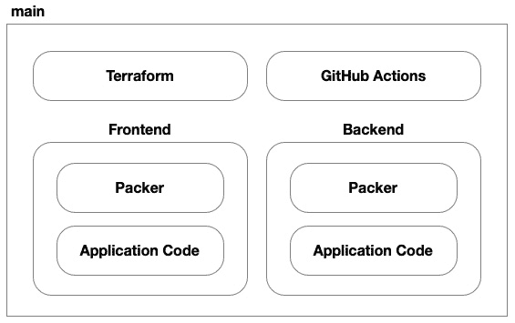

# 10

# 在 Azure 上入门——使用 Azure 虚拟机构建解决方案

现在，我们已经在 AWS 平台上从头到尾构建了解决方案，并跟随团队的旅程，从他们最初的虚拟机架构，到 Kubernetes，最后到无服务器，我们准备切换思路，进入另一个现实，在那里 Keyser 与他在微软的亲密朋友们并肩作战。在接下来的几章中，我们将遵循与*第七章*到*第九章*类似的路径，但在这个替代版本中，我们将与微软 Azure 合作。

本章将从我们在 AWS 上的旅程开始的地方接续；在*第七章*，我们使用 AWS 构建了一个双胞胎解决方案。在那一章中，我们详细讲解了完全不依赖云平台的解决方案要素。包括如何使用 Packer 将基于.NET 的应用程序代码部署到 Linux 虚拟机上，以及如何为虚拟机上的 CI/CD 管道设置 GitHub Actions 的详细说明。

由于大多数内容在转移到 Azure 时保持不变，我们不会在本章中以相同的长度重新讨论这些话题。然而，我建议你在*第七章*中做个书签，并经常参考它。

本章涉及以下主题：

+   打好基础

+   设计解决方案

+   构建解决方案

+   自动化部署

# 打好基础

我们在 Söze 企业的团队为他们成功应对无畏领导者 Keyser Söze 的技术路线调整而喝彩，并对他们成功在 AWS 上成功推出产品的成就与运气感到惊叹。在这里，他们使用了虚拟机、Kubernetes 和无服务器技术。当 AWS 控制台的舒适橙色外观开始消退时，空气中突然弥漫着一种既陌生又熟悉的声音：doodle-oo doodle-oo doodle-oo。一个意外的二人组合出现在眼前——一位是戴着黑色棒球帽、披肩发的棕发男，穿着简单的黑色 T 恤；另一位则是典型的书呆子魅力，金色乱发，戴着厚重的黑框眼镜，穿着红蓝格子法兰绒衬衫，下面是白色 Aerosmith T 恤。他们开始熟悉的吟唱：doodle-oo doodle-oo doodle-oo。突然间，我们被带到了另一个世界——也许是另一个宇宙，在那里 Azure 的深蓝色取代了 AWS 的亮橙色。Söze 企业与微软合作开发他们的下一代自动驾驶平台。

和之前一样，我们从 Söze 企业的其他部门接管了一支拥有强大核心团队的 C# .NET 开发者团队，因此我们将使用.NET 技术构建平台的 1.0 版本。那位神秘的 CEO Keyser 上周末在纽约市的 Met Gala 盛会上被看到与 Satya Nadella 亲密交谈，企业总部已经下令我们将使用 Microsoft Azure 来托管平台。由于团队对容器的经验并不丰富，而且时间紧迫，我们决定构建一个简单的三层架构并托管在 Azure 虚拟机上：


图 10.1 – 自动驾驶平台的逻辑架构

该平台将需要一个前端，前端将是一个使用 ASP.NET Core Blazor 构建的 Web UI。前端将由 REST API 后端提供支持，后端将使用 ASP.NET Core Web API 构建。将核心功能封装成 REST API 将使自动驾驶汽车能够直接与平台进行通信，并允许我们通过在未来添加客户端接口（如原生移动应用和虚拟或混合现实）来扩展功能。后端将使用 PostgreSQL 数据库进行持久化存储，因为它轻量级、行业标准且相对便宜。

# 设计解决方案

由于团队面临紧迫的时间表，我们希望保持云架构的简单性。因此，我们将保持简单，使用经过验证的 Microsoft Azure 服务来实现该平台，而不是尝试学习新东西。我们必须做出的第一个决定是，每个逻辑架构组件将托管在 Azure 的哪个服务上。

我们的应用架构由三个组件组成：前端、后端和数据库。前端和后端是应用程序组件，需要托管在提供通用计算的云服务上，而数据库则需要托管在云数据库服务上。两种服务都有许多选择：


图 10.2 – 自动驾驶平台的逻辑架构

由于我们已经决定使用虚拟机（VMs）来托管我们的应用程序，我们已经缩小了可以用来托管应用程序的不同服务，并决定 Azure 虚拟机服务是当前情况下的理想选择。其他选项，如 Azure 应用服务，也使用虚拟机，但我们希望对解决方案有完全的控制，并尽可能保持跨平台的能力，以防我们将来需要迁移到其他云平台：



图 10.3 – 我们的代码库的源代码控制结构

在这个解决方案中，我们将有六个部分。我们仍然需要前端和后端的应用程序代码以及 Packer 模板。然后，我们需要 GitHub Actions 来实现 CI/CD 过程，使用 Terraform 来部署 Azure 基础设施，并引用 Packer 构建的虚拟机镜像用于我们的 Azure 虚拟机。

## 云架构

在*第七章*中，我们使用 AWS 和其相应的虚拟机服务开发了一个类似的解决方案。因此，我们为 Azure 的设计将会非常相似。我们在 AWS 上使用的许多云服务在 Microsoft Azure 上都有对应的服务。这主要是因为虚拟机、网络和网络安全在行业中的认知已经趋于稳定。不要期望在命名约定和工作方式上看到太大的差异。在使用这种云计算范式时，各个平台之间的差异通常非常细微。在本书中，我将尽力突出不同云平台之间的同义词，帮助您更好地将概念知识从一个云平台迁移到另一个云平台。

### 虚拟网络

虚拟机必须部署在虚拟网络中。正如您可能记得的，在我们*第七章*中，当我们在 AWS 上部署这个解决方案时，我们需要为我们的解决方案设置多个子网，以便跨可用区展开。这是因为 AWS 上虚拟网络的结构、虚拟网络的范围与 AWS 区域的关系，以及子网的范围与 AWS 可用区的关系。Azure 不同。

在 Azure 上，虚拟网络和子网的范围限定在一个区域内。区域弹性内置于虚拟网络中。Azure 有两种弹性模式：一种基于故障域或*区域*，另一种基于可用区或*区域性*。虚拟机可以在这两种模式下进行部署。

要提供区域虚拟机解决方案，您需要创建一个可用性集并指定要分布虚拟机的故障域数量。当虚拟机在此可用性集中部署时，Azure 平台会确保它们部署到不共享相同电源和网络交换机的硬件上，从而降低整个工作负载因单一故障域中的故障而发生故障的可能性。如果不使用可用性集，Azure 将根据可用容量分配虚拟机，并不会保证您的虚拟机不会位于同一个故障域。

要提供区域虚拟机解决方案，您只需要指定要使用的可用区来部署虚拟机，并确保您的虚拟机分布在多个可用区中。与故障域相比，可用区提供了更高的弹性，因为它不仅保证您的虚拟机不会共享相同的电源和网络交换机，还保证您的虚拟机位于区域内不同的物理数据中心。在本书中，我们将专注于确保我们的解决方案实现区域弹性：


图 10.4 – 资源 Azure 虚拟网络架构

在前面的图示中，您可以看到我们的虚拟网络及其两个子网可以支持该区域内所有可用性区域中的虚拟机：


图 10.5 – 前端和后端应用组件的隔离子网

这意味着我们不需要像在 AWS 上那样，根据云平台的可靠性边界来设计我们的子网；我们可以根据工作负载的需求来设计我们的子网。在这种情况下，我们需要为解决方案的前端设计一个子网，前端托管了 ASP.NET Core Blazor Web 应用程序；还需要为解决方案的后端设计一个子网，后端托管了 ASP.NET Core Web API。无论我们选择按区域部署虚拟机，利用 Azure 的故障域，还是按可用区部署虚拟机，利用 Azure 的可用性区域，都不会影响网络设计。我们在决定部署虚拟机时，都可以选择这两种方式。

### 网络路由

在*第七章*中，当我们在 AWS 上设置此解决方案时，我们需要为我们的虚拟机配置互联网网关、NAT 网关和路由表，以便虚拟机能够访问互联网。而在 Azure 上，我们不需要配置等效的组件，因为 Azure 提供了默认网关并自动配置虚拟机使用它。如果我们想阻止互联网访问或以其他方式路由互联网流量，我们则需要配置额外的资源。

### 负载均衡

在讨论**负载均衡器**作为我们架构的一部分时，我们不可避免地会使用一些成熟且熟悉的术语，但我们会在不同的上下文中使用它们，这可能会让人感到困惑。因此，我希望能先解决这个难题。我们的解决方案有前端——为最终用户的 Web 浏览器提供网页的 Web 应用程序。我们的解决方案还有后端——Web 应用程序调用的 REST Web API，用于与数据库交互并执行有状态操作。我们的解决方案还将使用两个负载均衡器：一个分配负载到运行 Web 应用程序的前端 Web 服务器，另一个分配负载到运行 Web API 的后端 Web 服务器：


图 10.6 – 前端和后端过多

在每个负载均衡器的上下文中，每个负载均衡器都会有一个前端和后端。需要注意的是，使用这些术语时要理解上下文，因为我们解决方案的前端指的是一个完全不同架构粒度的不同架构组件。我们需要明白，当我们提到我们解决方案的前端时，我们是在谈论所有确保解决方案前端正常工作的组件，而当我们提到*前端*负载均衡器的前端时，我们指的是接受流量的网络端点，专门为我们解决方案的*前端*服务。

在*第七章*中，当我们在 AWS 上设置此解决方案时，我们使用了 AWS **应用负载均衡器**（**ALB**）服务。在 Azure 上，我们将使用 Azure Load Balancer 服务。这两项服务功能非常相似，但它们的结构略有不同，并且使用不同的术语来描述相似的概念：

| **AWS** | **Azure** | **描述** |
| --- | --- | --- |
| ALB | Azure Load Balancer | 负载均衡器 |
| 监听器 | 前端 IP 配置 | 接受负载均衡器传入流量的单一端点 |
| 目标组 | 后端地址池 | 一组将接收传入流量的虚拟机 |
| 健康检查 | 健康探针 | 每个后端虚拟机发布的一个端点，表明它是健康的并且准备好处理流量 |

表 10.1 – AWS 和 Azure 之间负载均衡器组件的同义映射

正如我们在*第四章*中讨论的，负载均衡器提供了一个单一的前端端点，并将网络流量分配到多个后端虚拟机。在 AWS 中，虽然他们称这个前端端点为**监听器**，而在 Azure 中，它被称为**前端 IP 配置**。同样，AWS 中的后端虚拟机被称为**目标组**，而在 Azure 中，它们被称为**后端地址池**：


图 10.7 – 前端和后端应用组件的资源隔离子网

Azure Load Balancer 使用规则来决定如何将传入的流量路由到后端池。

Azure Load Balancer 使用规则来组织如何路由传入流量。每个规则都有一个协议、一个前端组件和一个后端组件。规则的前端组件配置了网络流量应如何进入负载均衡器。这包括暴露的端口，在哪个前端 IP 配置上暴露端口，以及使用哪个健康探针来判断哪些后端节点是健康的并且准备好接收流量。规则的后端组件指定了将流量路由到哪个后端地址池，并且指定了使用的端口。

`/`）以及后端 – REST Web API – 将继续使用我们在 `/health` 设置的自定义健康检查端点。

### 网络安全

在 *第七章*中，我们为 AWS 设置了四个安全组，用于管理网络流量在解决方案架构中的每个逻辑节点。Azure 中我们只需要两个安全组，因为 Azure 负载均衡器会根据我们在其中配置的规则自动授予虚拟机访问权限：


图 10.8 – 前端节点池网络流量流向

从前端处理流量的虚拟机（VMs）角度来看，它们将通过 HTTP 协议在端口 `5000` 上接收流量。C# 应用程序将向后端托管的 REST Web API 发起请求，但我们会通过后端负载均衡器在端口 `80` 上使用 HTTP 协议将所有请求路由到后端。在 Azure 中，我们不需要在网络中显式允许这种出站流量：


图 10.9 – 后端节点池网络流量流向

从后端处理流量的虚拟机（VMs）角度来看，它们将通过 HTTP 协议在端口 `5000` 上接收流量。C# 应用程序代码将通过 HTTPS 协议向端口 `5432` 上的 PostgreSQL 数据库发起请求。在 Azure 中，我们不需要在网络中显式允许这种出站流量。

### 机密管理

像数据库凭据或服务访问密钥这样的机密需要被安全地存储。每个云平台都有提供此功能的服务。在 Azure 中，这项服务称为 **Azure** **Key Vault**：

| **AWS** | **Azure** | **描述** |
| --- | --- | --- |
| IAM | Microsoft Entra | 身份提供者 |
| Secrets Manager | Key Vault | 安全的机密存储 |
| IAM 角色 | 用户分配的托管身份 | 机器间交互的身份 |
| IAM 策略 | **基于角色的访问** **控制** (**RBAC**) | 提供对特定服务或资源执行特定操作的权限 |
| IAM 角色策略 | 角色分配 | 将特定权限与特定身份关联 |

表 10.2 – 映射 AWS 和 Azure 之间的同义身份和访问管理组件

存储在 Azure Key Vault 中的机密可以在虚拟机获得必要的 RBAC 权限后访问。在 *第七章*中，我们使用 AWS IAM 角色分配来允许虚拟机执行此操作。Azure 也类似，通过将一个或多个用户分配的托管身份附加到虚拟机，然后为这些托管身份创建角色分配，以便它们拥有授予必要权限的特定角色：


图 10.10 – 密钥保管库架构

将附加到虚拟机的托管身份授予 **Key Vault Secrets User** 角色，将允许虚拟机从密钥保管库中读取机密值。这不会将机密存储在机器上。虚拟机将需要使用 Azure CLI 来访问密钥保管库中的机密。

### 虚拟机

现在我们已经为解决方案准备好了所需的一切，我们可以继续讨论应用程序组件将运行的位置：在 Azure 的虚拟机服务上配置的虚拟机。当在 Azure 上配置虚拟机时，你有两种选择。首先，你可以配置静态虚拟机。在这种方式下，你需要为每个虚拟机指定关键特性。第二种选择是配置一个**虚拟机规模集**（**VMSS**）。这样，你可以根据需求动态扩展或缩减，并且在虚拟机失败时自动修复：

| **AWS** | **Azure** | **描述** |
| --- | --- | --- |
| EC2 | 虚拟机 | 虚拟机服务 |
| AMI | 虚拟机镜像 | 来自市场或自定义构建的虚拟机镜像（例如，使用工具如 Packer） |
| IAM 角色 | 用户分配的托管身份 | 用于机器间交互的身份 |
| **自动扩展** **组**（**ASG**） | VMSS | 一组可以通过虚拟机配置模板动态扩展/缩减的虚拟机 |
| 启动模板 | 虚拟机配置文件 | 用于创建新虚拟机的配置模板 |

表 10.3 – AWS 与 Azure 之间相似虚拟机服务组件的映射

在 *第七章* 中，我们使用 AWS **弹性云计算**（**EC2**）配置了我们的解决方案。Azure 虚拟机的结构与 EC2 实例类似。像在 AWS 上一样，Azure 虚拟机通过虚拟网络接口连接到它们对应的子网。然而，在 Azure 上，我们有两种类型的网络安全规则：**网络安全组**（**NSG**）和**应用程序安全组**（**ASG**）。虽然这两者都用于控制 Azure 上的流量，NSG 侧重于指定低级别的网络规则，如端口和协议过滤，适用于定义为 IP 地址范围的网络级资源。而 ASG 提供了更高层次的抽象，允许你根据应用程序内角色将资源分组：


图 10.11 – Azure VM 架构

或者，你可以使用 Azure VMSS 来动态配置和管理虚拟机。在这种方式下，你为 VMSS 提供一些配置和参数，指明何时扩展和何时缩减，VMSS 会处理其他所有事情：


图 10.12 – Azure VMSS 架构

Azure VMSS 允许你为它将代表你启动的每个虚拟机提供细粒度的配置。它还提供了一组策略，让你控制 VMSS 的行为，比如在实例意外失败时、Azure 需要更新它们时，或是否根据需求扩展或缩减虚拟机的数量。

## 部署架构

现在我们已经对我们的解决方案在 Azure 上的云架构有了一个清晰的概念，我们需要制定一个计划，来配置我们的环境并部署我们的代码。

### 虚拟机配置

在我们的解决方案中，我们有两个虚拟机角色：前端角色，负责处理来自最终用户浏览器的网页请求；后端角色，负责处理来自网页应用的 REST API 请求。每个角色都有不同的代码和不同的配置需要设置。每个角色都需要自己的 Packer 模板来构建虚拟机镜像，以便我们在 Azure 上启动虚拟机：


图 10.13 – 使用 Packer 管道构建前端虚拟机镜像

一个 GitHub Actions 工作流会在前端应用代码和前端 Packer 模板发生变化时触发，执行 `packer build`，并为解决方案的前端创建一个新的虚拟机镜像。

前端和后端将有相同的 GitHub Actions 工作流，执行 `packer build`。工作流之间的主要区别在于它们执行的代码库。前端和后端可能有稍微不同的操作系统配置，并且它们分别需要不同的部署包来部署各自的应用组件：


图 10.14 – 使用 Packer 管道构建后端虚拟机镜像

需要注意的是，应用代码会被集成到虚拟机镜像中，而不是复制到已经运行的虚拟机上。这意味着，要更新虚拟机上运行的软件，每台虚拟机都需要重新启动，以便使用包含最新代码的新的虚拟机镜像重新启动。

这种方法使得虚拟机镜像本身成为一个不可变的部署产物，每次有应用代码发布时，都会对其进行版本控制和更新。

### 云环境配置

一旦前端和后端的虚拟机镜像构建完成，我们就可以执行最终的工作流，既配置环境又将我们的解决方案部署到 Azure 上：


图 10.15 – 虚拟机镜像作为输入到 Terraform 代码中，Terraform 会在 Azure 上配置环境

Terraform 代码库将有两个输入变量，分别用于前端和后端虚拟机镜像的版本。当需要部署新的应用软件版本时，这些版本的输入参数将会递增，以反映目标版本。当工作流执行时，`terraform apply` 将会用新的虚拟机镜像替换现有的虚拟机。

现在我们已经有了一个完整的计划，说明如何使用 Azure 实现云架构，如何使用 GitHub Actions 实现部署架构，让我们开始构建吧！在下一节中，我们将详细解析用于实现 Terraform 和 Packer 解决方案的 HCL 代码。

# 构建解决方案

现在我们有了一个稳固的解决方案设计，可以开始构建它了。正如上一节所述，我们将使用 Azure 虚拟机。就像我们在 *第七章* 中使用 AWS 一样，我们需要使用 Packer 将我们的应用程序打包成虚拟机镜像，然后使用这些虚拟机镜像来配置一个环境。

## Packer

在本节中，我们将学习如何实现 Packer 模板中的配置工具，以便我们可以在 Linux 虚拟机上安装我们的 .NET 应用程序代码。如果你因对 AWS 不感兴趣而跳过了 *第七章* 到 *第九章*，我不会因此责怪你——尤其是如果你读这本书的主要目的是在 Microsoft Azure 云平台上工作。然而，我还是建议你回顾一下 *第七章* 中的相关部分，看看我们如何使用 Packer 的配置工具配置基于 Debian 的 Linux 虚拟机，并在其上部署 .NET 应用程序代码。

### Azure 插件

正如我们在 *第四章* 中讨论的那样，Packer —— 就像 Terraform —— 是一个可扩展的命令行可执行文件。每个云平台都为 Packer 提供了一个插件，封装了与其服务的集成：

```
packer {
  required_plugins {
    azure = {
      source  = "github.com/hashicorp/azure"
      version = "~> 2.0.0"
    }
  }
}
```

在 *第七章* 中，我们学习了如何将 Packer 插件声明为 AWS 所需的插件。前面的代码演示了如何声明 Azure 插件——截至本文撰写时，最新版本是 `2.0.0`。

Packer 的 Azure 插件提供了一个 `azure-arm` 构建器，它通过从基础镜像创建一个新的虚拟机，执行配置工具，拍摄 Azure 托管磁盘的快照，并从中创建一个 Azure 托管镜像，从而生成 Azure 虚拟机镜像。与 AWS 插件类似，这种行为被封装在 Azure 构建器中。

就像 AWS 插件封装了在 AWS 上构建虚拟机的逻辑，并且其配置采用 AWS 中心的术语一样，Azure 插件也封装了在 Azure 上构建虚拟机的所有逻辑，并且其配置采用 Azure 中心的术语。Packer 并不试图为不同的云平台创建一个标准化的构建器接口——而是将特定平台的配置封装在构建器中。这使得熟悉目标平台的用户能够简化操作，并允许构建器在不增加额外复杂性的情况下利用任何平台特有的功能，而不是通过在每个平台之间尝试统一语法来增加复杂度。

因此，AWS 和 Azure 构建器的结构几乎在所有方面都截然不同——从它们如何进行身份验证，到它们如何看待市场镜像。虽然它们有一些共同的字段和相似之处，但它们是截然不同的存在。

第一个重大区别是它们传递身份验证凭证的方式。正如我们在 *第七章* 中看到的，AWS 插件允许我们使用环境变量传递 AWS 访问密钥和密钥进行身份验证，而 Azure 提供者不支持这种方法，要求传递所有四个属性以使用 Microsoft Entra（前身为 Azure Active Directory）服务主体进行身份验证。这四个属性如下：

+   **租户 ID**：Microsoft Entra 租户的唯一标识符

+   **订阅 ID**：Microsoft Azure 订阅的唯一标识符

+   **客户端 ID**：Microsoft Entra 服务主体的唯一标识符，我们将其作为 Terraform 的身份使用

+   **客户端密钥**：Microsoft Entra 服务主体的密钥

以下代码展示了如何通过输入变量将四个 Microsoft Azure 凭证属性传递到 Azure 构建器：

```
source "azure-arm" "vm" {
client_id       = var.arm\_client\_id
client\_secret   = var.arm\_client\_secret
subscription\_id = var.arm\_subscription\_id
tenant\_id       = var.arm\_tenant\_id
...
}
```

以下代码展示了如何引用 Azure 市场版的 Ubuntu 22.04 虚拟机：

```
source "azure-arm" "vm" {
  ...
  image_offer     = "0001-com-ubuntu-server-jammy"
  image_publisher = "canonical"
  image_sku       = "22_04-lts"
  ...
}
```

请注意，与 AWS 版本不同，在 AWS 中我们使用 `amazon-ami` 数据源来查找特定 AWS 区域中的相同镜像，而在 Microsoft Azure 中我们无需这么做。由于 Azure 市场镜像的结构方式，我们不需要查找 VM 镜像的区域特定唯一标识符。

Azure 构建器的最后部分应该与 AWS 版本非常相似：

```
source "azure-arm" "vm" {
  ...
  location                     = var.azure_primary_location
  communicator                 = "ssh"
  os_type                      = "Linux"
  vm_size                      = var.vm_size
  allowed_inbound_ip_addresses = [var.agent_ipaddress]
}
```

在前面的代码中，我们看到相同的 `communicator` 属性被设置为 `ssh`，一个与 AWS 等效的 `vm_size` 属性，对应于 AWS 的 `instance_type`，以及一个与 AWS 等效的 `allowed_inbound_ip_addresses` 属性，对应于 AWS 的 `temporary_security_group_source_cidrs`，这个属性在安全组中打了一个孔，允许 GitHub Actions 执行的机器访问 Packer 部署的临时虚拟机。

### 操作系统配置

要配置操作系统，我们必须安装软件依赖项（如 .NET 6.0），将应用程序代码的部署包复制并部署到本地文件系统的正确位置，配置一个在启动时运行的 Linux 服务，并设置一个具有必要访问权限的本地用户和组，以便该服务能够以该身份运行。

我在 *第七章* 的相关章节中详细展开了这些步骤，因此如果你想刷新记忆，建议回顾这一章节。

### 平台特定的构建任务

Packer 提供了一种只在特定构建器上执行配置程序的方法。这使得即使在操作系统配置中，也能适应平台特定的差异。

在 Microsoft Azure 中，我们需要执行一个平台特定的命令，作为 Packer 关闭虚拟机并创建镜像之前的最后一步。那些有设置 Microsoft Windows 虚拟机镜像经验的朋友应该会熟悉一个叫做 `sysprep` 的工具。这个工具用于准备虚拟机，以便我们可以从其磁盘创建镜像。尽管我们并没有使用 Windows 操作系统，但 Microsoft Azure 需要我们执行一个类似的命令，以便我们能够准备好 Linux 虚拟机以创建镜像：

```
provisioner "shell" {
  execute_command = local.execute_command
  inline = ["/usr/sbin/waagent -force -deprovision+user && export HISTSIZE=0 && sync"]
  only = ["azure-arm"]
}
```

过时的 `waagent` 命令并不重要。你只需要知道，这个命令需要作为最后一步执行，以确保从 Packer 构建的虚拟机镜像在启动新虚拟机时可以正常引导。但是，请注意 `only` 属性，它接受一个 `list` 类型的 `string` 值。在这个 `list` 中，我们设置的唯一值是 `azure-arm`。这表示 Packer 只在我们使用该插件构建镜像时执行此配置器。正如我们所知，同一个 Packer 模板可以用于多目标构建，这意味着你可以在同一个模板中构建多个镜像，同时针对不同的云平台或区域进行构建。这也意味着你可以在 AWS、Azure 和 Google Cloud 上同时构建相同的虚拟机镜像，甚至可以在 AWS 的所有 30 多个区域中构建相同的虚拟机镜像。尽管这并不实用，因为有更好的方法可以跨区域复制虚拟机镜像，但它是可行的。

## Terraform

正如我们在设计中讨论的那样，我们的解决方案由两个应用组件组成：前端和后端。每个组件都有需要部署的应用程序代码库。由于这是我们第一次使用 `azurerm` 提供商，我们将在介绍架构各组件的具体内容之前，先了解基本的提供商设置和后端配置。

### 提供商设置

我们需要在 `required_providers` 区块中指定我们打算在此解决方案中使用的所有提供商：

```
terraform {
  required_providers {
    azurerm = {
      source  = "hashicorp/azurerm"
      version = "~> 3.75.0"
    }
    cloudinit = {
      source  = "hashicorp/cloudinit"
      version = "~> 2.3.2"
    }
  }
  backend "azurerm" {
  }
}
```

我们还需要配置 Azure 提供商。与 AWS 提供商不同，Azure 提供商不局限于特定区域。这意味着您可以在所有 Azure 区域中配置资源，而无需声明不同的 Azure 提供商区块：

```
provider "azurerm" {
  features {}
}
```

Azure 提供商需要一些额外的参数来指定用于连接 Azure 的凭据，但由于这些是敏感信息，我们不希望将它们嵌入到代码中。我们稍后会在自动化部署时，通过标准的 Azure 凭据环境变量传递这些值：

+   `ARM_TENANT_ID`

+   `ARM_SUBSCRIPTION_ID`

+   `ARM_CLIENT_ID`

+   `ARM_CLIENT_SECRET`

### 后端

因为我们将使用 CI/CD 流水线来长期配置和维护我们的环境，所以我们需要为 Terraform 状态设置一个远程后端。由于我们的解决方案将托管在 Azure 上，我们将使用 Azure Blob 存储后端来存储 Terraform 状态。

就像 Azure 提供商一样，我们不想在代码中硬编码后端配置，所以我们将简单地设置一个后端占位符：

```
terraform {
  ...
  backend "azurerm" {
  }
}
```

我们将在 CI/CD 流水线中运行 `terraform init` 时，使用 `-backend-config` 参数来配置后端的参数。

### 输入变量

最佳实践是传入能够标识应用程序名称和环境的简短名称。这可以让你在组成解决方案的资源中嵌入一致的命名规范，从而更容易在 Azure 门户中识别和跟踪资源。

`primary_region`、`vnet_cidr_block` 和 `az_count` 输入变量驱动部署的关键架构特性。它们不能被硬编码，因为这会限制 Terraform 代码库的重用性。

`vnet_cidr_block` 输入变量用于建立虚拟网络地址空间，这通常由企业治理机构严格管理。通常会有一个流程，确保组织内部的团队不会使用冲突的 IP 地址范围，这样将来就无法将这两个应用程序集成，或与企业内部的共享网络资源进行集成。

`az_count` 输入变量允许我们配置解决方案中所需的冗余程度。这将影响解决方案的高可用性，也会影响部署的成本。正如你可以想象的那样，成本也是云基础设施部署中一个严格管理的特性。

### 一致的命名和标签

与 AWS 控制台不同，Azure 的设计使得获得应用程序中心的部署视图变得非常容易。为此，你可以使用资源组：

```
resource "aws_vpc" "main" {
  cidr_block = var.vpc_cidr_block
  tags = {
    Name        = "${var.application_name}-${var.environment_name}-network"
    application = var.application_name
    environment = var.environment_name
  }
}
resource "azurerm_virtual_network" "main" {
  ...
  tags = {
    application = var.application_name
    environment = var.environment_name
  }
}
```

仍然很重要的是对你部署的资源进行标签标注，指明它们属于哪个应用程序和环境。这有助于满足其他报告需求，比如预算和合规性。几乎所有 Azure 提供商中的资源都有一个 `map` 属性叫做 `tags`。与 AWS 不同，每个资源都有一个 `name` 值作为必需属性。

### 虚拟网络

就像我们在*第七章*中做的那样，我们需要构建一个虚拟网络，并将其地址空间保持尽可能紧凑，以避免未来为更广泛的组织浪费不必要的地址空间：

```
resource "azurerm_virtual_network" "main" {
  name                = "vnet-${var.application_name}-${var.environment_name}"
  location            = azurerm_resource_group.main.location
  resource_group_name = azurerm_resource_group.main.name
  address_space       = [var.vnet_cidr_block]
}
```

在 Azure 中创建网络比我们在 AWS 中做的要简单，因为我们不需要根据可用区来细分子网：

```
resource "azurerm_subnet" "frontend" {
  name                 = "snet-frontend"
  resource_group_name  = azurerm_resource_group.main.name
  virtual_network_name = azurerm_virtual_network.main.name
  address_prefixes     = [cidrsubnet(var.vnet_cidr_block, 2, 1)]
}
```

### 负载均衡

正如我们在设计中讨论的那样，Azure 负载均衡器服务与 AWS 对应服务的结构差异很大：

```
resource "azurerm_public_ip" "frontend" {
  name                = "pip-lb-${var.application_name}-${var.environment_name}-frontend"
  location            = azurerm_resource_group.main.location
  resource_group_name = azurerm_resource_group.main.name
  allocation_method   = "Static"
  sku                 = "Standard"
  zones               = [1, 2, 3]
}
resource "azurerm_lb" "frontend" {
  name                = "lb-${var.application_name}-${var.environment_name}-frontend"
  location            = azurerm_resource_group.main.location
  resource_group_name = azurerm_resource_group.main.name
  sku                 = "Standard"
  frontend_ip_configuration {
    name                 = "PublicIPAddress"
    public_ip_address_id = azurerm_public_ip.frontend.id
    zones                = [1, 2, 3]
  }
}
```

需要特别指出的是，要实现区域弹性，我们需要确保架构中的所有组件都以区域弹性的方式部署。这通常需要设置 `zones` 属性，并指定我们希望部署的可用区。

Azure 负载均衡器的后端配置是一个简单的逻辑容器，用于存放后端地址池：

```
resource "azurerm_lb_backend_address_pool" "frontend" {
  loadbalancer_id = azurerm_lb.frontend.id
  name            = "frontend-pool"
}
```

这个逻辑容器必须链接到静态虚拟机或虚拟机规模集（VMSS）：

```
resource "azurerm_network_interface_backend_address_pool_association" "frontend" {
  count = var.az_count
  network_interface_id    = azurerm_network_interface.frontend[count.index].id
  ip_configuration_name   = "internal"
  backend_address_pool_id = azurerm_lb_backend_address_pool.frontend.id
}
```

在前面的后端地址池关联资源中，我们正在遍历 `var.az_count`。这个数字与我们遍历虚拟机的数量相同，这使得我们可以将每个虚拟机放入每个可用区。与 AWS 不同，AWS 的负载均衡规则将监听器和目标组配置拆分开来，而 Azure 的负载均衡规则将二者结合，并将其链接到相应的健康探针：

```
resource "azurerm_lb_probe" "frontend_probe_http" {
  loadbalancer_id = azurerm_lb.frontend.id
  name            = "http"
  protocol        = "Http"
  port            = 5000
  request_path    = "/"
}
resource "azurerm_lb_rule" "frontend_http" {
  loadbalancer_id                = azurerm_lb.frontend.id
  name                           = "HTTP"
  protocol                       = "Tcp"
  frontend_port                  = 80
  backend_port                   = 5000
  frontend_ip_configuration_name = "PublicIPAddress"
  probe_id                       = azurerm_lb_probe.frontend_probe_http.id
  backend_address_pool_ids       = [azurerm_lb_backend_address_pool.frontend.id]
  disable_outbound_snat          = true
}
```

注意负载均衡规则是如何连接多个组件的，包括前端 IP 配置、AWS 上的监听器、健康探针和后端地址池——AWS 上的目标组。

### 网络安全

首先，我们需要为每个应用程序架构组件设置逻辑 ASG。我们将为前端和后端分别设置一个：

```
resource "azurerm_application_security_group" "frontend" {
  name                = "asg-${var.application_name}-${var.environment_name}-frontend"
  resource_group_name = azurerm_resource_group.main.name
  location            = azurerm_resource_group.main.location
}
```

接下来，我们需要创建 NSG，以允许必要的流量进入每个 ASG：

```
resource "azurerm_network_security_group" "frontend" {
  name                = "nsg-${var.application_name}-${var.environment_name}-frontend"
  resource_group_name = azurerm_resource_group.main.name
  location            = azurerm_resource_group.main.location
}
resource "azurerm_network_security_rule" "frontend_http" {
  resource_group_name                        = azurerm_resource_group.main.name
  network_security_group_name                = azurerm_network_security_group.frontend.name
  name                                       = "allow-http"
  priority                                   = "2001"
  access                                     = "Allow"
  direction                                  = "Inbound"
  protocol                                   = "Tcp"
  source_port_range                          = "*"
  destination_port_range                     = "5000"
  source_address_prefix                      = "*"
  destination_address_prefix                 = "*"
  destination_application_security_group_ids = [azurerm_application_security_group.frontend.id]
}
```

### 秘密管理

首先，我们将设置 Key Vault：

```
resource "azurerm_key_vault" "main" {
  name                       = "kv-${var.application_name}-${var.environment_name}"
  location                   = azurerm_resource_group.main.location
  resource_group_name        = azurerm_resource_group.main.name
  tenant_id                  = data.azurerm_client_config.current.tenant_id
  soft_delete_retention_days = 7
  purge_protection_enabled   = false
  sku_name                   = "standard"
  enable_rbac_authorization  = true
}
```

然后，我们将为每个应用程序架构组件设置托管身份：

```
resource "azurerm_user_assigned_identity" "frontend" {
  name                = "${var.application_name}-${var.environment_name}-frontend"
  location            = azurerm_resource_group.main.location
  resource_group_name = azurerm_resource_group.main.name
}
```

接下来，我们将使用 Azure 角色分配授予托管身份必要的权限：

```
resource "azurerm_role_assignment" "frontend_keyvault" {
  scope                = azurerm_key_vault.main.id
  role_definition_name = "Key Vault Secrets User"
  principal_id         = azurerm_user_assigned_identity.frontend.principal_id
}
```

### 虚拟机

首先，我们将从输入变量中获取虚拟机镜像。我们使用 Packer 构建了这个虚拟机镜像，并将其部署到一个不同的 Azure 资源组中：

```
data "azurerm_image" "frontend" {
  name                = var.frontend_image.name
  resource_group_name = var.frontend_image.resource_group_name
}
```

然后，我们将通过遍历 `var.az_count` 输入变量来为每个虚拟机创建网络接口：

```
resource "azurerm_network_interface" "frontend" {
  count = var.az_count
  name                = "nic-${var.application_name}-${var.environment_name}-frontend${count.index}"
  location            = azurerm_resource_group.main.location
  resource_group_name = azurerm_resource_group.main.name
  ip_configuration {
    name                          = "internal"
    subnet_id                     =azurerm_subnet.frontend.id
    private_ip_address_allocation = "Dynamic"
  }
}
```

最后，我们将设置虚拟机，配置所有必要的属性，并将其链接到网络接口、虚拟机镜像和托管身份：

```
resource "azurerm_linux_virtual_machine" "frontend" {
  count = var.az_count
  name                = "vm-${var.application_name}-${var.environment_name}-frontend${count.index}"
  resource_group_name = azurerm_resource_group.main.name
  location            = azurerm_resource_group.main.location
  size                = "Standard_F2"
  admin_username      = var.admin_username
  zone                = count.index + 1
  network_interface_ids = [
    azurerm_network_interface.frontend[count.index].id
  ]
  admin_ssh_key {
    username   = var.admin_username
    public_key = tls_private_key.ssh.public_key_openssh
  }
  os_disk {
    caching              = "ReadWrite"
    storage_account_type = "Standard_LRS"
  }
  source_image_id = data.azurerm_image.frontend.id
  user_data       = data.cloudinit_config.frontend.rendered
}
```

在此基础上，我们已实现了 Packer 和 Terraform 解决方案，并且有了一个可工作的代码库，该代码库将为我们的前端和后端应用程序组件构建虚拟机镜像，并将我们的云环境部署到 Azure。接下来，我们将深入研究 YAML 和 Bash，并实现 GitHub Actions 工作流。

# 自动化部署

正如我们在设计中讨论的那样，我们的解决方案由两个应用程序组件组成：前端和后端。每个组件都包含应用程序代码和操作系统配置，这些内容都被封装在 Packer 模板中。这两个应用程序组件随后被部署到定义在 Terraform 代码库中的 Azure 云环境中。

就像我们在 *第七章* 讨论 AWS 解决方案时所做的那样，还有一个额外的代码库需要讨论：我们的 GitHub Actions 自动化流水线。

在 *第七章* 中，我们回顾了代码库的文件夹结构以及 GitHub Actions 如何适应其中，确保我们知道我们的自动化流水线被称为工作流，并存储在 `/.github/workflows` 中。我们的每个代码库都存储在各自的文件夹中。我们的解决方案源代码仓库的文件夹结构将如下所示：

+   `.``github`

    +   `workflows`

    +   `dotnet`

        +   `backend`

        +   `frontend`

    +   `packer`

        +   `backend`

        +   `frontend`

    +   `terraform`

根据我们的设计，我们将会有 GitHub Actions 工作流来执行 Packer 并为前端（例如 `packer-frontend.yaml`）和后端（例如 `packer-backend.yaml`）构建虚拟机镜像。我们还会有工作流来运行 `terraform plan` 和 `terraform apply`：

+   `.``github`

    +   `workflows`

        +   `packer-backend.yaml`

        +   `packer-frontend.yaml`

        +   `terraform-apply.yaml`

        +   `terraform-plan.yaml`

在*第七章*中，我们更详细地讲解了 GitFlow 流程及其如何与我们的 GitHub Actions 工作流交互，因此现在让我们深入探讨这些流水线在面向 Azure 平台时的差异。

## Packer

在*第七章*中，我们详细介绍了执行 Packer 来构建虚拟机镜像的 GitHub Actions 工作流的每一个步骤。由于 Packer 的云无关架构的特性，这些内容基本上保持不变。唯一变化的是我们执行 Packer 的最后一步。

由于 Packer 需要配置以在 Microsoft Azure 上构建虚拟机，因此我们需要传入一些特定于 Azure 的输入变量。这些变量包括 Microsoft Azure 凭证属性、Azure 区域以及 Azure 资源组名称。

就像我们为 AWS 的 Packer 模板准备输入变量一样，我们必须确保所有 Azure 输入变量都以 `azure_` 为前缀。如果我们将来想要引入多目标支持，这将非常有帮助，因为许多云平台将具有相似的必需输入，比如目标区域和虚拟机大小。虽然大多数云平台有相似的输入要求，但输入值并不是可以互换的。

例如，Azure 和 AWS 都要求您指定 Packer 将临时虚拟机放置在的区域，并且最终的虚拟机镜像将存储在哪里。在 Azure 上，区域的值为 `westus2`，而在 AWS 上，则为 `us-west-2`。它们看起来非常相似，但实际上相距甚远（玩笑话）。Azure 的西部美国 2 区域与 AWS 的西部美国 2 区域完全不同——事实上，除了在不同的云平台上，它们物理位置也不同，Azure 的西部美国 2 区域位于华盛顿州，而 AWS 的西部美国 2 区域则位于俄勒冈州。虽然邻近，但绝对不是同一个地方。

这又回到了 Packer 将平台特定配置隔离在构建器中的策略。因此，如果我们要做多目标支持，AWS 插件需要特定于 AWS 的输入变量，而 Azure 插件需要特定于 Azure 的输入变量。因此，当我们将这些插件合并成一个 Packer 模板时，我们需要为两者都准备输入变量。

结果是，我们的 `aws_primary_region`，其值为 `us-west-2`，可以与 `azure_primary_region`（值为 `westus2`）并排显示，而不会产生任何冲突或混淆。同样，我们的 `aws_instance_type`，值为 `t2.small`，也可以与 `azure_vm_size`，值为 `Standard_DS2_v2`，并排显示。随着我们在构建器中利用更多平台特定的功能，差异可能会更加明显。

GitHub Actions 工作流 YAML 文件与 Azure 相同，唯一不同的是需要指定的额外输入变量：

```
- id: build
  name: Packer Build
  env:
    PKR_VAR_arm_subscription_id: ${{ vars.ARM_SUBSCRIPTION_ID }}
    PKR_VAR_arm_tenant_id: ${{ vars.ARM_TENANT_ID }}
    PKR_VAR_arm_client_id: ${{ vars.PACKER_ARM_CLIENT_ID }}
    PKR_VAR_arm_client_secret: ${{ secrets.PACKER_ARM_CLIENT_SECRET }}
    PKR_VAR_image_version: ${{ steps.image-version.outputs.version }}
    PKR_VAR_agent_ipaddress: ${{ steps.agent-ipaddress.outputs.ipaddress }}
  working-directory: ${{ env.WORKING_DIRECTORY }}
  run: |
    packer init ./
    packer build -var-file=variables.pkrvars.hcl ./
```

上述代码引用了四个 Azure 凭证属性，这些属性作为 GitHub Actions 变量和秘密存储，并通过带有 `PKR_VAR_` 前缀的环境变量传递给 Packer。

## Terraform

在构建完我们的两个虚拟机镜像并将其版本输入到 `tfvars` 文件后，我们的 Terraform 自动化流水线已经准备好接管工作，不仅能够配置我们的环境，还能部署我们的解决方案（尽管从技术上讲，部署过程是在 `packer build` 中完成的，物理部署包被复制到主目录，并且 Linux 服务已准备就绪）。Terraform 完成了工作，通过实际启动这些镜像来创建虚拟机。

在*第七章*中，我们详细介绍了执行 Terraform 来配置云环境和部署应用程序代码的 GitHub Actions 工作流的每一步。得益于 Terraform 的云无关架构，这些步骤大体保持不变。唯一变化的是我们执行 Terraform 的最后一步。

就像在*第七章*中与 AWS 提供商一起做的一样，我们可以使用特定于 `azurerm` 提供商的环境变量来设置身份验证上下文。在这种情况下，四个 Azure 凭证属性通过以下环境变量传递：

+   `ARM_TENANT_ID`

+   `ARM_SUBSCRIPTION_ID`

+   `ARM_CLIENT_ID`

+   `ARM_CLIENT_SECRET`

就像在*第七章*中与 AWS 提供商一起做的一样，我们需要使用 `-backend-config` 命令行参数配置用于存储 Terraform 状态的 Azure 特定后端。与只需指定一个 S3 存储桶名称来配置 AWS 后端保存 Terraform 状态到 S3 不同，为了配置 Azure 后端，我们需要指定三个字段，以便在 Azure Blob 存储中三角定位存储 Terraform 状态的位置——资源组、存储账户和 Blob 存储容器。

Azure 资源的层次结构如下所示：

+   资源组

    +   存储账户

        +   Blob 存储容器

            +   Terraform 状态文件

与 AWS 提供商类似，后端使用*密钥*和 Terraform 工作区名称来唯一标识存储状态文件的位置：

```
- id: apply
  name: Terraform Apply
  env:
    ARM_SUBSCRIPTION_ID: ${{ vars.ARM_SUBSCRIPTION_ID }}
    ARM_TENANT_ID: ${{ vars.ARM_TENANT_ID }}
    ARM_CLIENT_ID: ${{ vars.TERRAFORM_ARM_CLIENT_ID }}
    ARM_CLIENT_SECRET: ${{ secrets.TERRAFORM_ARM_CLIENT_SECRET }}
    BACKEND_RESOURCE_GROUP_NAME: ${{ vars.BACKEND_RESOURCE_GROUP_NAME }}
    BACKEND_STORAGE_ACCOUNT_NAME: ${{ vars.BACKEND_STORAGE_ACCOUNT_NAME }}
    BACKEND_STORAGE_CONTAINER_NAME: ${{ vars.BACKEND_STORAGE_CONTAINER_NAME }}
    TF_BACKEND_KEY: ${{ env.APPLICATION_NAME }}-${{ env.ENVIRONMENT_NAME }}
  working-directory: ${{ env.WORKING_DIRECTORY }}
  run: |
    terraform init \
      -backend-config="resource_group_name=$BACKEND_RESOURCE_GROUP_NAME" \
      -backend-config="storage_account_name=$BACKEND_STORAGE_ACCOUNT_NAME" \
      -backend-config="container_name=$BACKEND_STORAGE_CONTAINER_NAME" \
      -backend-config="key=$TF_BACKEND_KEY"
    terraform apply -auto-approve
```

注意，与 AWS 解决方案不同的是，我们不需要执行特定的 `terraform apply`。这是因为我们不需要根据区域中的可用区数量来动态计算，从而配置我们的虚拟网络。这是因为 Azure 虚拟网络及其子网跨越了区域内所有的可用区，而在 AWS 中，子网被限制在父虚拟网络区域的特定可用区内。

云平台之间这些微妙的架构差异，即使使用相同的技术部署相同的解决方案，也可能会带来根本性的结构变化。这提醒我们，虽然我们在*第四章*至*第六章*中学习的核心概念有助于我们超越单一云平台，走向多云视角，但要实施实际解决方案，我们需要理解每个平台的微妙差异。

# 总结

在本章中，我们使用 Azure 虚拟机构建了一个多层次云架构，并配备了完整的 GitFlow 流程和基于 GitHub Actions 的端到端 CI/CD 管道。

在下一章中，我们在 Söze Enterprises 的无畏领导者将带领我们进入动荡的新局面，提出一些大新想法，我们将不得不回应他的号召。原来，我们的 CEO Keyser 最近熬夜看了一些关于下一大热点——容器——的 YouTube 视频，在与他的朋友 Satya 一起乘坐超级游艇时，他决定我们需要重新构建整个解决方案，使其能够在 Docker 和 Kubernetes 上运行。幸运的是，微软的好心人提供了一项可能帮助我们的服务：**Azure Kubernetes** **服务**（**AKS**）。
