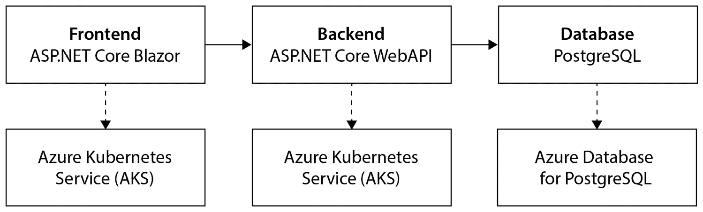
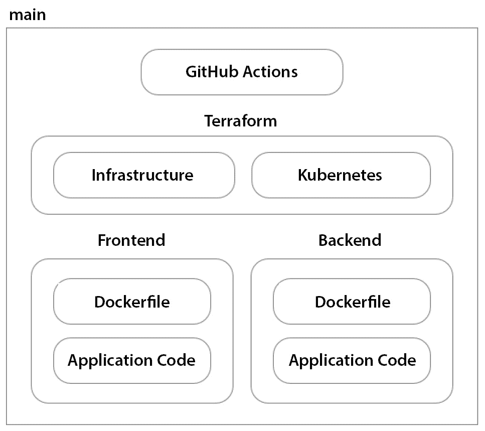
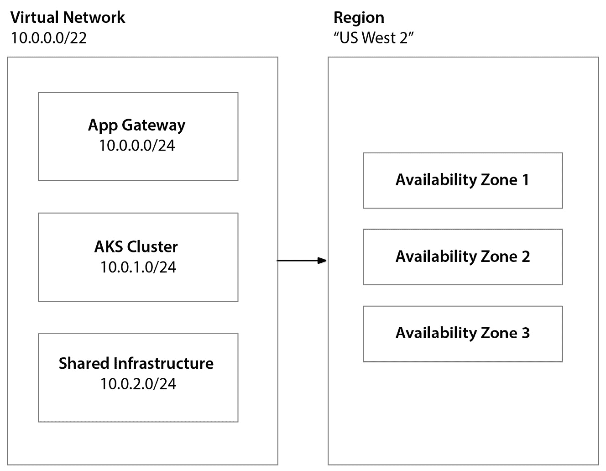
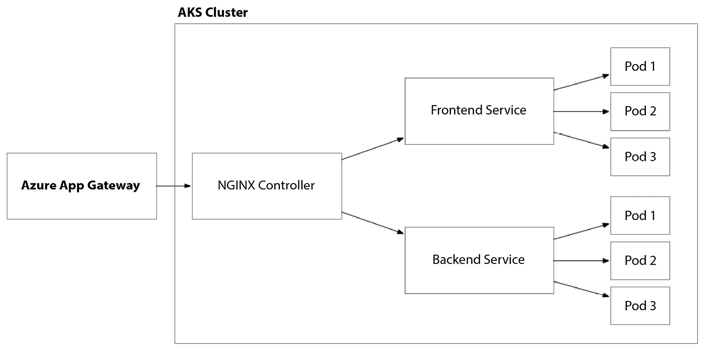
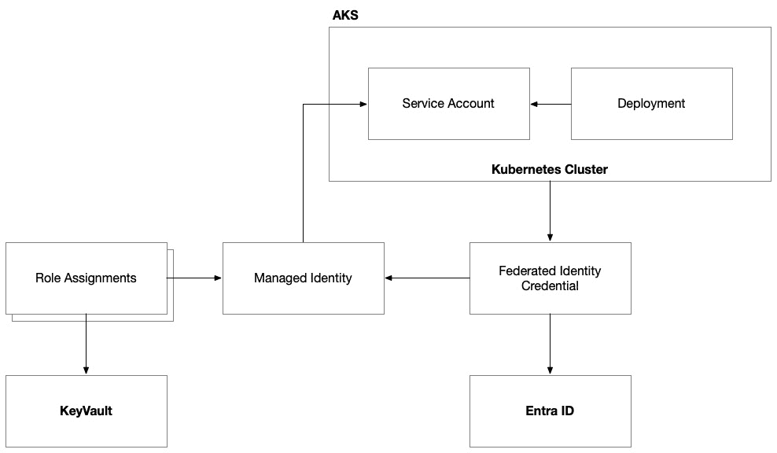
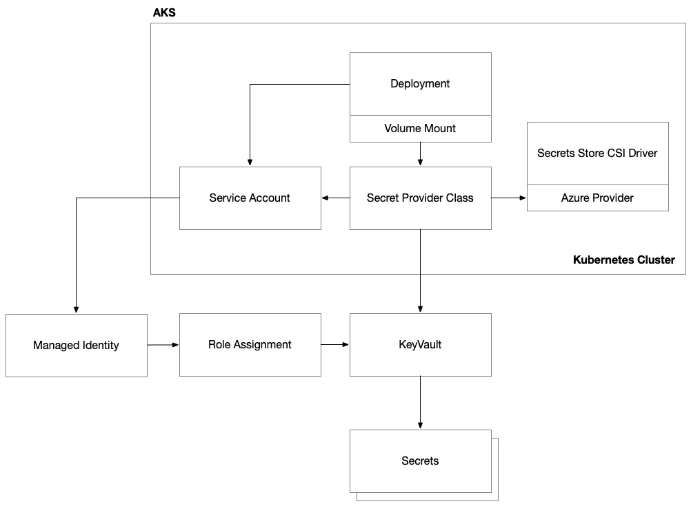
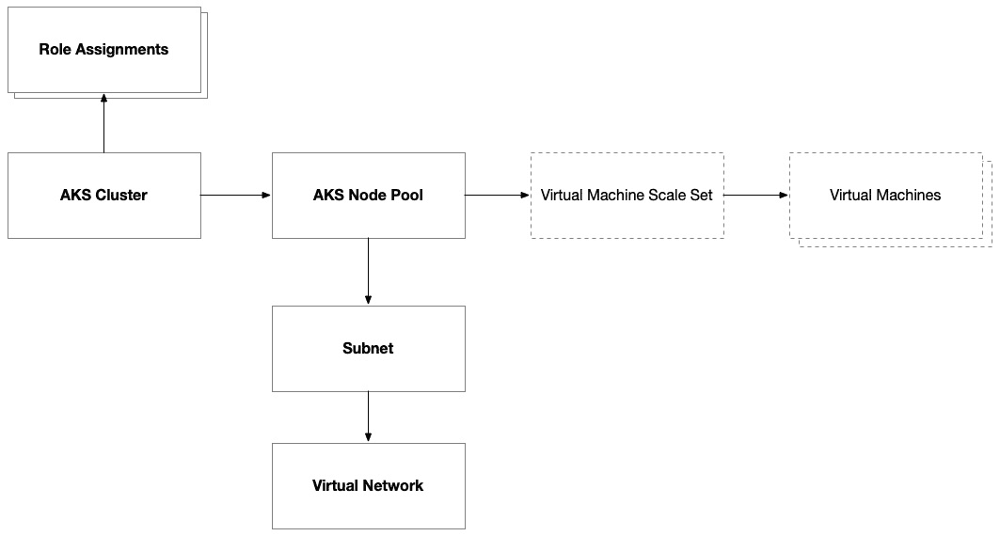

# 第十一章：在 Azure 上容器化 – 使用 Azure Kubernetes 服务构建解决方案

在上一章中，我们使用 Azure 虚拟机（VM）构建并自动化了我们的解决方案。我们通过 Packer 构建虚拟机镜像，并使用 Terraform 配置虚拟机。在本章中，我们将走类似的路径，但不再使用虚拟机，而是考虑将我们的应用程序托管在 Kubernetes 集群中的容器里。

为了实现这一目标，我们需要改变方法，摒弃 Packer，改用 Docker 来为我们的应用程序创建可部署的工件。我们将再次使用 Terraform 的`azurerm`提供程序，并重新回顾在与 AWS 合作时使用过的 Terraform 的`kubernetes`提供程序。

由于迁移到 Azure 后，大多数内容保持不变，我们在本章中将不会再详细回顾这些主题。然而，我建议你将*第八章*标记为书签，并经常参考。

本章内容包括以下主题：

+   打下基础

+   设计解决方案

+   构建解决方案

+   自动化部署

# 打下基础

我们的故事通过 Söze 企业的视角展开，该公司由神秘的土耳其亿万富翁凯瑟·索泽（Keyser Söze）创立。我们的团队一直在努力构建下一代自动驾驶车辆编排平台。此前，我们曾希望通过利用 Azure 稳定的平台，发挥我们团队现有的技能，并专注于功能开发，从而超越竞争对手。就在团队刚进入状态时，一个意外的变故出现了。

在这个周末，我们那位难以捉摸的高管在阿布扎比与微软云与 AI 部门总裁 Scott Guthrie 的会面中受到了影响。亚斯马里纳赛道充满了活力，夕阳西下，金色的光芒洒在赛道上，粉丝和名人们聚集在一起，等待赛季结束的阿布扎比大奖赛。凯瑟在独特的 Paddock 俱乐部里看见 Scott “Gu”穿着标志性的红色 polo 衫，靠近开胃小菜的地方。Scott 兴奋地分享了有关**Azure Kubernetes 服务**（**AKS**）的一些最新改进消息。凯瑟被更高效的资源利用率、成本优化的改进，以及更快速的部署和回滚时间所吸引，他顿时心动。为了他的全新自动驾驶平台，他需要利用云计算的力量，而基于容器的架构正是实现这一目标的途径。因此，他决定加速推进云原生架构的采纳计划！

转向容器化架构的消息意味着重新评估他们的方法，深入研究新技术，甚至可能重新调整团队的动态。对团队而言，容器化一直是长期规划，但现在，事情需要加速推进，这将需要大量的时间、资源和培训投入。

当团队急忙调整计划时，他们不禁感到一阵兴奋与不安的混合情绪。他们知道，在 Keyser 的领导下，他们正在参与一项开创性的工作。他对自动驾驶汽车未来的愿景大胆且具有变革性。尽管他的做法可能不拘一格，但他们已经学会了，他的直觉往往是正确的。在本章中，我们将探讨如何通过 Microsoft Azure 从虚拟机（VM）迁移到容器的过程。

# 设计解决方案

正如我们在上一章中所见，我们使用 Azure 上的虚拟机构建了解决方案，并通过我们使用 Packer 配置的虚拟机镜像完全控制操作系统配置。就像在 *第八章* 我们在 AWS 上经历相同的过程时所做的那样，我们将需要引入一个新工具，使用容器镜像替代虚拟机镜像——Docker：



图 11.1 – 自动驾驶平台的逻辑架构

我们的应用架构，包括前端、后端和数据库，将保持不变，但我们需要使用 Terraform 配置不同的资源，并利用 Docker 和 Kubernetes 中的新工具来自动化将我们的解决方案部署到这套新基础设施上：



图 11.2 – 我们的代码库的源控制结构

在这个解决方案中，我们将有七个部分。我们仍然拥有前端和后端的应用代码和 Dockerfile（替代基于 Packer 的虚拟机镜像）。我们依旧使用 GitHub Actions 来实施我们的 CI/CD 流程，但现在我们有了两个 Terraform 代码库——一个用于配置 Azure 上的基础设施，另一个用于将我们的应用程序部署到托管在 AKS 上的 Kubernetes 集群。接着，我们有两个代码库，分别用于我们应用的前端和后端。

## 云架构

我们在 *第八章* 中所做的工作与我们在 AWS 上进行的虚拟机到容器的过渡有很多相似之处。我们将专注于关键的差异，避免重复讨论相同的内容。为了获得完整的多云视角，我建议你阅读 *第八章*（如果你跳过了它的话），以及接下来的章节，我们将讨论如何在 **Google Cloud** **Platform**（**GCP**）上解决同样的问题。

### 虚拟网络

在上一章中，我们为两组不同的虚拟机设置了一个虚拟网络，然后将我们的应用程序连接到一个数据库托管服务。在为 Kubernetes 集群设置虚拟网络时，我们将采用类似的方法。然而，考虑的因素略有不同。我们不再有独立的、松散的虚拟机来托管应用程序的不同组件。然而，根据 Kubernetes 集群的配置，我们可能需要考虑配置的不同节点池的放置，以及我们希望在该网络内配置的其他服务，以便允许我们在 Kubernetes 上托管的工作负载访问它们：



图 11.3 – 使用 AKS 时，虚拟网络子网沿着基础设施边界而非应用边界组织

在最简单的形式中，单一子网可以为 AKS 集群内的所有节点池指定，但随着工作负载随时间扩展，这可能会非常限制。在更高级的场景中，您应根据节点池设计和每个工作负载的规模考虑仔细划分子网。通过这样做，您可以为集群上托管的各种工作负载提供更好的网络隔离。

正如我们在*第八章*与亚马逊 Kubernetes 产品合作时所看到的那样，Azure 的 Kubernetes 产品也支持两种网络模式：**Kubenet**和**CNI**。本书中，我们将重点讨论 Kubenet，因为它是最常用的选项。

### 容器注册表

正如我们在 AWS 中看到的那样，Azure 也提供了一个强大的容器注册服务，称为**Azure 容器注册表**（**ACR**）。它充当一个私有注册表，用于托管和管理您的容器镜像和 Helm 图表。正如我们在亚马逊探险中所做的那样，我们将使用 Docker 将我们的容器镜像发布到该仓库，以便稍后从为 AKS 集群配置资源的 Terraform 代码中引用它们。我们需要使用 Azure 托管标识和 Azure **基于角色的访问控制**（**RBAC**）来授予集群访问权限，这类似于我们使用 AWS 的 IAM 服务策略授予 Amazon EKS 访问权限的方式。

### 负载均衡

使用 Kubernetes 托管服务托管基于容器的工作负载的最大优势之一是，大部分底层基础设施会自动为您配置和维护。该服务解析您的 Kubernetes 资源配置，并在集群内配置必要的资源，以正确配置 Azure 以支持您的工作负载。有时，这一过程是透明处理的，其他时候，则会有特殊的挂钩让您对 Azure 上底层资源的配置拥有更多控制。

通过这种方式，AKS 在幕后使用基本的 Azure 负载均衡器或功能更丰富的 Azure 应用程序网关来简化负载均衡。AKS 在 Kubernetes 集群中创建`LoadBalancer`类型服务时，会自动管理这些负载均衡器的创建和配置。为了获得更多的控制，用户还可以利用 Ingress 控制器，如 NGINX 或 Azure **应用程序网关入口控制器**（**AGIC**），以实现高级路由、SSL 终止和其他功能：



图 11.4 – AKS 集群的网络流量流向

正如我们在*第八章*中所看到的，在使用 AWS 时，我们将使用 NGINX 入口控制器，但这一次，我们将配置一个 Azure 应用程序网关服务来将流量路由到 NGINX。与在 AWS 上不同，NGINX 入口控制器通过 Kubernetes 注解自动配置 ALB。在 Azure 上，我们需要先设置 NGINX 入口控制器，然后配置 Azure 应用程序网关，将流量转发到 NGINX。

### 网络安全

在 AKS 中，网络安全的管理方式类似于在*第十章*中描述的虚拟机的实践，因为它们被部署在 Azure 虚拟网络中，从而允许它们与现有的 Azure 网络功能无缝集成。然而，由于 Kubernetes 有一个名为 Kubenet 的叠加网络，这是我们的工作负载（或 Pod）所在的网络，我们需要使用 Kubernetes 网络策略来基于 Kubernetes 标签或命名空间控制工作负载之间的网络流量。当你使用 Azure CNI 和其他开源解决方案（如 Calico）时，有更多高级的网络安全功能，但这些内容超出了本书的范围。

### 密钥管理

就像我们在亚马逊的巡游中看到的那样，Azure 的 Kubernetes 服务也与其他 Azure 服务集成，例如 Azure 的密钥管理服务——**Azure Key Vault**。这种集成通过在集群本身启用 AKS 扩展以及在集群内配置 Kubernetes 资源来完成，从而为我们的 Pod 创建可以用作访问 Azure Key Vault 上托管的密钥的通道。同样，使用本地的 Kubernetes 密钥也没有问题，但 Azure Key Vault 提供了一个更加简化且安全的机制来访问 Azure 密钥。它使我们能够保持密钥的最新状态，以避免在密钥轮换时发生停机，并且它允许我们使用托管身份来访问密钥，而不是将密钥存储在集群本身。

就像我们在 *第八章* 中使用 AWS EKS 构建解决方案时看到的那样，我们需要在 Kubernetes 和云平台的身份管理系统之间架设一座桥梁。在 AWS 上，这个系统是 IAM；在 Azure 上，是 Entra ID。过程大致相同，但术语有所不同：



图 11.5 – AKS 与 Workload Identity

首先，我们需要创建一个托管身份来代表工作负载。这是一个 Azure 资源，表示一个由 Azure 平台管理的 Entra ID 身份。像我们在 EKS 中做的那样，我们需要在 Kubernetes 集群和 Entra ID 之间进行联合。在 Azure 上，我们通过创建一个联合身份凭证来实现这一点，该凭证链接了托管身份、AKS 集群的内部 Open ID Connect 提供程序和 Entra ID。与 AWS 类似，我们为这个托管身份植入一个种子，以便它可以与 Kubernetes 中稍后创建的 Kubernetes 服务帐户资源进行关联：



图 11.6 – AKS Secrets Manager 集成

在 Workload Identity 建立之后，我们可以授予对 Azure 资源的访问权限，例如 Key Vault 和数据库，如 Azure Cosmos DB 或 Azure SQL 数据库。正如我们在 *第八章* 中与 EKS 一起做的那样，我们将使用秘密存储 CSI 驱动程序和 Azure 提供程序，将我们的 Kubernetes 部署与 Azure Key Vault 集成。

### Kubernetes 集群

最后，使用 AKS 创建一个 Kubernetes 集群涉及一些关键组件。正如我们已经确认的，我们需要一个虚拟网络、托管身份以及足够的 RBAC 权限来访问集群所需的资源，例如容器注册表和 Azure Key Vault 秘密。然而，我们 Kubernetes 集群的主要组件是节点池，它们提供计算资源来托管我们的 Pods：



图 11.7 – AKS 集群的结构

默认情况下，每个 AKS 集群都有一个默认节点池，用于托管 Kubernetes 的系统服务。我们可以添加额外的节点池，以隔离我们的应用工作负载或提供不同类型的计算资源，例如不同的硬件配置，以满足不同工作负载的特定需求。

## 部署架构

正如我们在云架构中看到的那样，我们在 *第八章* 与 AWS 一起完成的工作有许多相似之处。部署架构也将与我们在 *第八章* 中看到的相似。在上一章中，我们看到了 Terraform 提供程序的差异，当时我们配置了 `azurerm` 提供程序，将我们的解决方案部署到 Azure 虚拟机上。

现在，使用基于容器的架构时，与我们在 *第八章*中使用 AWS 部署的方式相比，唯一真正的区别将是我们如何进行容器注册表和 Kubernetes 集群的身份验证。我鼓励你查看 *第八章*中相应部分描述的部署架构方法。在接下来的部分，我们将深入讨论如何在 Azure 上构建相同的解决方案，但再次强调，我们会小心避免重复相同的内容。

在本节中，我们回顾了当我们从基于虚拟机的架构过渡到基于容器的架构时，架构中发生的关键变化。我们小心避免重复 *第八章*中已经讨论的内容，因为我们已经在 AWS 上进行了这一转变。在接下来的部分，我们将开始实施具体的解决方案，但同样，我们会小心地基于上一章中我们在使用虚拟机设置 Microsoft Azure 解决方案时所打下的基础进行构建。

# 构建解决方案

在本节中，我们将把理论知识应用到一个切实可行的解决方案中，同时利用 Docker、Terraform 和 Kubernetes 在 Microsoft Azure 平台上的强大功能。这个过程中有些部分需要进行重大更改，例如我们使用 Terraform 配置 Azure 基础设施时；其他部分会有小的变化，比如我们用来将应用程序部署到 Kubernetes 集群的 Kubernetes 配置；还有一些几乎没有变化的部分，比如我们构建并推送 Docker 镜像到容器注册表时。

## Docker

在本节中，我们将学习如何实现我们的 Dockerfile，它将安装我们的 .NET 应用程序代码并在容器中运行服务。如果你因为对 AWS 缺乏兴趣而跳过了*第七章*到*第九章*，我不会怪你——特别是如果你读这本书的主要目的是在 Microsoft Azure 云平台上工作。然而，我鼓励你查看 *第八章*中的相关部分，看看我们如何使用 Docker 来配置一个容器并运行我们的 .NET 应用程序代码。

## 基础设施

正如我们在前一节中所讨论的，使用基于容器的架构时，基础设施大部分保持不变。因此，在本节中，我们将重点关注使用 Azure 的 Kubernetes 管理服务时的不同之处。

### 容器注册表

我们需要配置的第一个组件是我们的 **容器注册表**。容器注册表通常作为单独的部署部分进行配置，专门用于跨多个应用程序共享的基础设施。当你有一组通用的自定义构建镜像，多个团队或项目需要在它们的应用程序或服务中使用时，这种方式非常有用。然而，你应该记住，容器注册表作为一个重要的安全边界，因此，如果你希望确保应用程序团队只能访问为他们的应用程序构建的镜像，你应该为每个项目团队配置一个隔离的容器注册表：

```
resource "azurerm_container_registry" "main" {
  name                    = replace("acr${var.application_name}${var.environment_name}", "-", "")
  resource_group_name     = azurerm_resource_group.main.name
  location                = azurerm_resource_group.main.location
  sku                     = "Premium"
  admin_enabled           = true
  zone_redundancy_enabled = true
}
```

上面的代码配置了 Azure 容器注册表。需要注意的是，此资源对名称有非常具体的要求：

```
resource "azurerm_role_assignment" "acr_push" {
  count = length(var.container_registry_pushers)
  scope                = azurerm_container_registry.main.id
  role_definition_name = "AcrPush"
  principal_id         = var.container_registry_pushers[count.index]
}
```

上面的代码创建了一个角色分配，允许不同的用户将容器镜像推送到这个容器注册表。这是一个关键要求，它允许我们的 GitHub Action 将我们构建的 Docker 镜像发布到 Azure 容器注册表。在这里，`principal_id` 必须设置为 GitHub Action 模拟的服务帐户的身份。在这种情况下，我传递了一组这些身份，并使用 `count` 元参数遍历了这组身份。对于角色分配来说，由于这些资源非常轻量级，因此使用 `for_each` 或 `count` 不太重要，因为使用 `count` 时的频繁创建删除操作对部署影响较小。

### Kubernetes 集群

下一步是使用 `azurerm_kubernetes_cluster` 资源来配置一个 Kubernetes 集群。这个资源将在我们的 AKS 基础设施中扮演核心角色：

```
resource "azurerm_kubernetes_cluster" "main" {
  name                      = "aks-${var.application_name}-${var.environment_name}"
  location                  = azurerm_resource_group.main.location
  resource_group_name       = azurerm_resource_group.main.name
  dns_prefix                = "${var.application_name}-${var.environment_name}"
  node_resource_group       = "${azurerm_resource_group.main.name}-cluster"
  sku_tier                  = "Standard"
  ...
}
```

上面的代码配置了一些重要的顶级属性，这些属性会影响定价、网络和内部管理的资源分配。AKS 将为两个资源组配置资源。一个是 AKS 资源所在的资源组，另一个是 AKS 配置内部 Azure 资源以组成集群内部结构的资源组。这个次级资源组的名称由 `node_resource_group` 属性控制。我总是建议将 `node_resource_group` 的名称设置为与 AKS 集群资源本身的命名约定一致的名称。

正如我们在 *第五章* 中学到的，Kubernetes 有几个系统服务需要部署并保持良好状态，才能确保集群正常运行。我们的 AKS 集群需要有一个或多个节点池来承载系统和用户工作负载。默认的节点池是承载这些系统服务的理想位置：

```
resource "azurerm_kubernetes_cluster" "main" {
  ...
  default_node_pool {
  name                        = "systempool"
  vm_size                     = var.aks_system_pool.vm_size
  enable_auto_scaling         = true
  min_count                   = var.aks_system_pool.min_node_count
  max_count                   = var.aks_system_pool.max_node_count
  vnet_subnet_id              = azurerm_subnet.kubernetes.id
  os_disk_type                = "Ephemeral"
  os_disk_size_gb             = 30
  orchestrator_version        = var.aks_orchestration_version
  temporary_name_for_rotation = "workloadpool"
  zones = [1, 2, 3]
  upgrade_settings {
    max_surge = "33%"
  }
  ...
}
```

可以创建额外的节点池，如下所示，以便我们将自定义部署隔离到专用的计算资源上，从而避免它们影响集群的日常操作：

```
resource "azurerm_kubernetes_cluster_node_pool" "workload" {
  name                  = "workloadpool"
  kubernetes_cluster_id = azurerm_kubernetes_cluster.main.id
  vm_size               = var.aks_workload_pool.vm_size
  enable_auto_scaling   = true
  min_count             = var.aks_workload_pool.min_node_count
  max_count             = var.aks_workload_pool.max_node_count
  vnet_subnet_id        = azurerm_subnet.kubernetes.id
  os_disk_type          = "Ephemeral"
  orchestrator_version  = var.aks_orchestration_version
  mode  = "User" # Define this node pool as a "user" aka workload node pool
  zones = [1, 2, 3]
  upgrade_settings {
    max_surge = "33%"
  }
  node_labels = {
    "role" = "workload"
  }
  node_taints = [
    "workload=true:NoSchedule"
  ]
}
```

通过在该节点池中的节点上设置污点，我们可以确保只有明确指定要调度到此节点池的 Kubernetes 部署才会在此处进行调度。通过对额外的节点池应用污点，您可以将 Kubernetes 系统服务与默认节点池隔离开，并将工作负载保留在自己的空间中。尽管这会增加额外的成本，但它将大大提高集群的健康状况和性能。如果您计划将生产工作负载部署到集群中，建议这么做——但如果只是简单地试用集群，完全可以跳过这一步！

### 身份与访问管理

托管身份在 AKS 配置中发挥着至关重要的作用，具体表现在多个方面。首先也是最重要的一点是，AKS 用于提供内部资源的托管身份：

```
resource "azurerm_kubernetes_cluster" "main" {
  ...
  identity {
    type         = "UserAssigned"
    identity_ids = [azurerm_user_assigned_identity.cluster.id]
  }
  ...
}
```

这个身份需要被分配 `Managed Identity Operator` 角色才能执行此功能：

```
resource "azurerm_role_assignment" "cluster_identity_operator" {
  scope                = azurerm_resource_group.main.id
  role_definition_name = "Managed Identity Operator"
  principal_id         = azurerm_user_assigned_identity.cluster.principal_id
}
```

上述代码使用 **用户分配的托管身份** 创建了这个角色分配。我们在上一章中讨论过这个话题，所以我们知道这是一种特殊类型的托管身份，我们显式地进行配置并分配角色。这与系统分配的身份不同，后者是由平台自动配置和管理的托管身份。

还有一个需要在 AKS 集群中设置的重要身份：每个节点中部署的 kubelet 系统服务所使用的托管身份：

```
resource "azurerm_kubernetes_cluster" "main" {
  ...
  kubelet_identity {
    client_id                 = azurerm_user_assigned_identity.cluster_kubelet.client_id
    object_id                 = azurerm_user_assigned_identity.cluster_kubelet.principal_id
    user_assigned_identity_id = azurerm_user_assigned_identity.cluster_kubelet.id
  }
}
```

上述代码配置了集群的 kubelet 身份。与在 `azurerm` 提供程序中通常附加托管身份的方式稍有不同，因此从用户分配的身份到 `kubelet_identity` 块的正确属性获取正确的输出非常重要。

正如我们在 *第五章* 中学到的，kubelet 系统服务会处理来自调度器的命令。为了做到这一点，kubelet 需要访问我们的 ACR 来拉取容器镜像。这将要求将 `AcrPull` 角色分配给前述的托管身份：

```
resource "azurerm_role_assignment" "cluster_kubelet_acr" {
  principal_id         = azurerm_user_assigned_identity.cluster_kubelet.principal_id
  role_definition_name = "AcrPull"
  scope                = azurerm_container_registry.main.id
}
```

### 密钥管理

为了与 Azure 的密钥管理服务 Key Vault 集成，我们需要采取几个步骤。第一个步骤是仅仅在集群本身启用该子系统。AKS 对此类功能采用了可扩展的模型——包括但不限于启用与其他 Azure 服务以及 Kubernetes 功能的集成，例如 **Kubernetes 事件驱动架构**（**KEDA**）、**Azure Monitor** 和 **Open** **Service Mesh**：

```
resource "azurerm_kubernetes_cluster" "main" {
  ...
  key_vault_secrets_provider {
    secret_rotation_enabled  = true
    secret_rotation_interval = "5m"
  }
  ...
}
```

上述代码启用了并配置了密钥旋转。这只是启用 AKS 与 Azure Key Vault 集成的第一步；我们还需要为 Pods 设置 CSI 提供程序，以便从 Key Vault 中提取机密。在下一节中，我们将开始为 Kubernetes 控制平面配置资源时详细介绍这一点。

### 工作负载身份

为了允许我们的 Pods 访问部署到 Azure 的其他资源，我们需要允许它们模拟一个托管身份。像与 Key Vault 的集成一样，我们首先需要在 AKS 集群上启用此扩展：

```
resource "azurerm_kubernetes_cluster" "main" {
  ...
  oidc_issuer_enabled       = true
  workload_identity_enabled = true
  ...
}
```

上述代码激活了一个内部**OpenID Connect**（**OIDC**）端点，用于为集群内的服务账户签名并颁发**JSON Web Tokens**（**JWTs**）。启用此功能后，我们还需要 Azure 联邦身份凭证，一旦将其与 AKS 集群的 OIDC 颁发者端点以及将由工作负载使用的托管身份链接，就在集群和 Microsoft Entra ID 之间创建了联邦。这使得使用相应 Kubernetes 服务账户的 Pods 能够利用托管身份的权限与 Azure 服务进行交互：

```
resource "azurerm_federated_identity_credential" "main" {
  name                = azurerm_user_assigned_identity.workload.name
  resource_group_name = azurerm_resource_group.main.name
  audience            = ["api://AzureADTokenExchange"]
  issuer              = azurerm_kubernetes_cluster.main.oidc_issuer_url
  parent_id           = azurerm_user_assigned_identity.workload.id
  subject             = "system:serviceaccount:${var.k8s_namespace}:${var.k8s_service_account_name}"
}
```

正如我们在*第八章*中与 AWS 配合使用时所做的那样，接下来在将资源配置到 Kubernetes 时，我们将其与 Kubernetes 服务账户关联。

## Kubernetes

正如我们在*第八章*中看到的，我们使用 Kubernetes 的 Terraform 提供者构建了 Kubernetes 部署。像 Packer 和 Docker 一样，Kubernetes 以其独特的方式提供了一个在多个云平台之间始终如一运行的控制平面。因此，不论你选择哪个云平台，Kubernetes 部署的许多过程都是可复用的。这也是 Kubernetes 作为实现云无关或云便携工作负载的方式之一，能够利用 Kubernetes 托管服务提供的效率和弹性。

在本章中，我们不会重复相同的主题。如果你因为对 AWS 不感兴趣而跳过了*第七章*到*第九章*，我强烈推荐你回去复习*第八章*中的相关部分，了解更多关于 Kubernetes 部署的实现细节。

### 提供者设置

正如我们在*第八章*中看到的，当使用 Kubernetes 提供者执行 Terraform 来向 Kubernetes 控制平面配置资源时，我们不需要做太多修改。我们仍然通过目标云平台进行身份验证，我们依然遵循 Terraform 的核心工作流，并且我们仍然传入针对特定平台的额外输入参数，以便引用我们需要的资源。最重要的是，集群信息、其他 Azure 服务，如 ACR、Key Vault 和托管身份，以及其他细节，可能需要放入 Kubernetes ConfigMaps 中，供 Pods 使用，指向它们的数据库端点：

```
data "azurerm_kubernetes_cluster" "main" {
    name                = var.kubernetes_cluster_name
    resource_group_name = var.resource_group_name
}
```

在这里，我们采用分层方法首先配置基础设施，然后再配置 Kubernetes。因此，我们可以引用由负责 Azure 基础设施的 Terraform 工作区配置的资源的数据源，从而可以访问重要的连接细节，而无需在部署过程中导出并传递它们。

上述代码是对先前部署阶段中配置的 AKS 集群的引用。通过这个引用，我们可以使用多个数据片段初始化 `kubernetes` 提供程序，以用于与集群进行身份验证：

```
provider "kubernetes" {
    host                   = data.azurerm_kubernetes_cluster.main.kube_admin_config[0].host
    client_key             = base64decode(data.azurerm_kubernetes_cluster.main.kube_admin_config[0].client_key)
    client_certificate     = base64decode(data.azurerm_kubernetes_cluster.main.kube_admin_config[0].client_certificate)
    cluster_ca_certificate = base64decode(data.azurerm_kubernetes_cluster.main.kube_admin_config[0].cluster_ca_certificate)
}
```

客户端密钥是用于身份验证的私钥，客户端证书是与私钥配对以执行身份验证的证书，集群的 CA 证书是用于验证 Kubernetes API 服务器的证书颁发机构的证书。

另外，可以使用相同的参数配置 `helm` 提供程序。这有助于通过 Helm charts 提供 Kubernetes 资源的预打包模板：

```
provider "helm" {
  kubernetes {
    ...
  }
}
```

### 秘密

在前一节中，我们在集群本身上启用了密钥保管库扩展。现在，我们需要提供一种方式，使 Pod 能够连接到 Azure Key Vault。这要求我们使用 Kubernetes secrets store **Container Storage Interface** (**CSI**) 驱动程序。此配置充当了一个通道，授予工作负载身份从指定的 Key Vault 中读取特定秘密所需的权限：

```
resource "kubernetes_manifest" "secret_provider_class" {
  manifest = {
    apiVersion = "secrets-store.csi.x-k8s.io/v1"
    kind       = "SecretProviderClass"
    metadata = {
      name      = "web-app-secrets"
      namespace = var.namespace
    }
    spec = {
      provider = "azure"
        secretObjects = [
        {
          data = [
            {
              key        = "db-admin-password"
              objectName = "db-admin-password"
            }
          ]
          secretName = "db-admin-password"
          type       = "Opaque"
        }
      ]
      parameters = {
        usePodIdentity = "false"
        clientID       = var.service_account_client_id
        keyvaultName   = var.keyvault_name
        cloudName      = ""
        objects = yamlencode([
          {
            objectName    = "db-admin-password"
            objectType    = "secret"
            objectVersion = ""
          }
        ])
        tenantId = var.tenant_id
      }
    }
  }
}
```

在上述代码中，我们需要将此 Kubernetes 资源配置到我们计划部署 Pod 的命名空间中，并指定 Key Vault、我们与 Azure 联合身份凭证配置的托管身份以及 Kubernetes 服务账户。

### 工作负载身份

为了确保我们的 Pod 使用托管身份，我们需要执行几个操作，这些操作同时使用 Azure 特定的架构和标准的 Kubernetes 架构，在 Kubernetes 内部和 Pod 部署规范中配置资源。

我们需要做的第一件事是创建一个 Kubernetes 服务账户。这是 Kubernetes 中的一个标准资源，但我们使用 Azure 特定的架构将其与 Azure 联合身份凭证关联起来：

```
resource "kubernetes_service_account" "main" {
  metadata {
    namespace = var.namespace
    name      = var.service_account_name
    annotations = {
      "azure.workload.identity/client-id" = var.service_account_client_id
    }
  }
}
```

使用 Terraform 允许我们替换在前期的配置过程中创建的动态值。Kubernetes 有自己的工作方式，但它涉及使用 Helm，并有额外的实施开销。

现在，服务账户在 Kubernetes 中已存在，并链接到适当的 Azure 托管身份凭证，下一步是在部署中启用 Azure Workload Identity。为此，我们需要指定一个特殊标签，`azure.workload.identity/use`，并将其值设置为 `true`：

```
labels = {
    "azure.workload.identity/use" = "true"
}
```

这将指示 AKS 将此部署中的 pod 连接到通过 Azure 联邦身份凭证链接的托管身份。

下一步是指定相应的 Kubernetes 服务账户，我们已经在上一节中将其链接到 Azure 联邦身份凭证。此服务账户在部署中的 pod 规范中进行设置：

```
spec {
    ...
    service_account_name = "workload"
    ...
}
```

现在我们已经构建了架构的三个组件，在下一节中，我们将学习如何使用 Docker 自动化部署过程，这样我们就可以构建并发布容器镜像。然后，我们将使用 Terraform 来配置基础设施并将解决方案部署到 Kubernetes。

# 自动化部署

在本节中，我们将学习如何自动化基于容器的架构的部署过程。我们将使用在 *第八章* 中看到的类似技术，当时我们走过了同样的过程。结果，我们将专注于当我们想要部署到 Microsoft Azure 和 AKS 时需要做出的更改。

## Docker

在 *第八章* 中，我们详细介绍了 GitHub Actions 工作流的每个步骤，该工作流执行 Docker 来构建、标记并推送我们的 Docker 容器镜像。得益于 Docker 的云无关架构，这一过程大体保持不变。唯一变化的是我们必须如何配置 Docker，以便它能够指向我们的 Azure 容器注册表。

与 *第八章* 中一样，我们需要连接到我们通过 Terraform 配置的容器注册表。在 Azure 上，这意味着我们需要 Entra ID 服务主体的客户端 ID 和客户端密钥：

```
- name: Login to Azure Container Registry
    uses: docker/login-action@v3
    with:
    registry: ${{ steps.terraform.outputs.registry_endpoint }}
    username: ${{ vars.DOCKER_ARM_CLIENT_ID }}
    password: ${{ secrets.DOCKER_ARM_CLIENT_SECRET }}
```

这个服务主体与我们在 Terraform 中配置为输入的身份相同，用于配置基础设施。作为该过程的一部分，`AcrPush` 角色分配已与该身份关联。这授予其将镜像发布到 ACR 的权限：

```
- name: Build and push Docker image to ACR
    uses: docker/build-push-action@v5
    with:
    context: ${{ env.DOCKER_WORKING_DIRECTORY }}
    push: true
    tags: ${{ steps.terraform.outputs.registry_endpoint }}/${{ env.DOCKER_IMAGE_NAME }}:${{ steps.image-version.outputs.version }}
```

前面的代码使用 `docker\build-push-action` 将我们在这个 GitHub Action 中构建的容器镜像推送到 Azure 容器注册表。正如我们在 AWS 中所做的那样，我们引用 Terraform 基础设施阶段的输出，以获取 ACR 端点。

## Terraform

在 *第十章* 中，我们全面介绍了创建一个 Terraform GitHub Action 的过程，该过程通过 Microsoft Entra ID 服务主体在 Azure 上进行身份验证。因此，我们不会再深入探讨这个内容。我鼓励你回顾 *第十章* 以复习该过程。

## Kubernetes

当我们用 Terraform 自动化 Kubernetes 时，我们只是使用不同的根模块再次运行 `terraform apply`。这次，根模块除了配置 `azurerm` 提供者之外，还会配置 `kubernetes` 和 `helm` 提供者。然而，我们不会使用 `azurerm` 提供者创建新资源；我们只会获取数据源，以获取我们在之前的 `terraform apply` 命令中为 Azure 配置的现有资源的信息。

结果是，执行此过程的 GitHub Action 将与我们使用 Azure 执行 Terraform 的方式非常相似。某些变量可能会发生变化，包括容器镜像详情和集群信息等内容。

# 总结

在本章中，我们设计、构建并自动化了一个完整的端到端解决方案，采用基于容器的架构。我们在*第十章*的基础上进行扩展，该章节中我们处理了 Azure 虚拟网络的基础设施，但这次我们在 AKS 上运行容器来托管我们的应用程序。在我们 Azure 之旅的下一个也是最后一步中，我们将探讨无服务器架构，超越基础设施本身，让平台本身将我们的解决方案提升到新的高度。
