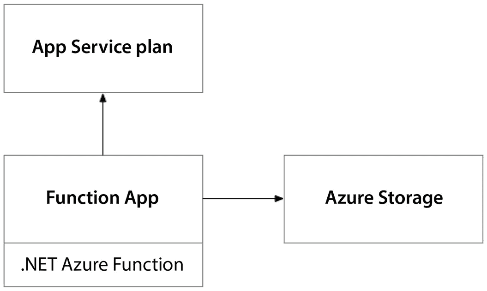

# 12

# 在 Azure 上使用无服务器架构——用 Azure Functions 构建解决方案

你准备好了吗？我们即将翻开微软 Azure 的新篇章——但只有在将我们的应用迁移到无服务器架构的最后一步完成后，才会开始。如同在**亚马逊云服务**（**AWS**）平台上，我们在过去的两章中，努力通过**虚拟机**（**VMs**）和容器来实施解决方案。

我们花了一些时间对比了 AWS 和微软 Azure 上的工作方式，帮助我们理解这两种云平台之间微妙甚至有时并不那么微妙的差异。

我们注意到，尽管我们的 Terraform 代码在不同云平台之间发生了相当一致的变化，但我们的应用代码和操作系统配置——无论是在 Packer 还是 Docker 中——都没有发生变化。当我们迈出微软 Azure 的最后一步时，我们将经历与将应用迁移到**AWS Lambda**时类似的过程。我们将不得不彻底重构应用代码。

本章涵盖以下主题：

+   打下基础

+   设计解决方案

+   构建解决方案

+   自动化部署

# 打下基础

我们的故事通过 Söze 企业的视角继续展开，该公司由神秘的土耳其亿万富翁凯泽·索泽（Keyser Söze）创立。我们的团队一直在努力构建下一代自动驾驶车辆编排平台。我们的初步策略是尽量减少变化，以便团队能够专注于将功能加入到产品中。然而，我们那位难以捉摸的 CEO 有其他想法，他推动我们采用容器技术，使我们的产品在未来更加灵活和可扩展。与凯泽一起工作，永远不会有无聊的时刻，但如此迅速地管理如此剧烈的变化，有时确实令人沮丧。

与此同时，在圣巴特岛，随着加勒比海的日落和鸡尾酒会的热烈进行，凯泽在酒吧偶遇微软 Azure 的首席技术官马克·鲁西诺维奇（Mark Russinovich）。两人一见如故，边喝莫吉托边聊天。当马克看到凯泽对自动驾驶平台的宏大愿景时，他随口提到，凯泽或许根本不需要担心基础设施问题。马克解释说，通过利用 Azure Functions 和其他无服务器服务，可以将凯泽从基础设施管理的束缚中解放出来，让他能够全身心地专注于宏伟的愿景。

多亏了马克的洞察力和凯泽的异想天开，我们的团队更深入地进入了微软 Azure，明确地从**Azure Kubernetes Service**（**AKS**）过渡到**Azure Functions**进行无服务器计算。这可能需要我们完全重新考虑应用架构，但这将使我们摆脱管理低层基础设施的重大运营负担。

# 设计解决方案

在本节中，我们将考察解决方案的整体设计，考虑到从基于虚拟机和容器的架构转向无服务器架构的转变。正如我们在*第九章*中看到的那样，服务器无服务器架构的核心目标是消除堆栈中的重型基础设施。因此，我们将寻找方法来摆脱任何需要较大固定成本的 Azure 服务，例如虚拟机或 Kubernetes 集群，并将它们替换为无服务器选项。这种操作环境和技术景观的变化可能需要我们重新思考一些关于解决方案的设计、实现和部署策略：


图 12.1 – 自动驾驶平台的逻辑架构

我们应用程序的架构没有显著变化，但我们将使用不同的 Azure 服务来承载它。在这种情况下，我们将使用 Azure Storage 来承载应用程序的前端，使用 Azure Functions 来承载应用程序的后端：


图 12.2 – 我们代码库的源控制结构

在这个解决方案中，我们的代码库将由四个部分组成。首先，我们将有用于配置环境的 Terraform 代码和执行部署过程的 GitHub Actions 代码。接着，我们将有用于应用程序前端和后端的两部分代码库。

## 云架构

在*第十章*中，我们的云托管解决方案是一组专用虚拟机，在*第十一章*中，它是我们 Kubernetes 集群节点池中的一组共享虚拟机。使用虚拟机带来最大的沉没成本，无论它们是独立的虚拟机还是 Kubernetes 节点池的一部分。

在*第十一章*中，我们的整个解决方案是在容器中执行的，这些容器允许前端和后端作为一组容器共存于相同的虚拟机上。这为我们节省了一些资金，但我们仍然需要服务器来承载工作负载。在这一章中，我们有了新的目标：利用云的力量，通过使用云原生服务，抽象化底层基础设施，并真正按需付费。Azure 的无服务器服务将在这一过程中对我们至关重要。

### 前端

在前几章中，我们将前端托管在面向公众的服务器上，这些服务器返回构成我们 Web 应用程序的 HTML 和 JavaScript。在那里，我们仍然需要一个云托管解决方案来托管文件并响应请求。

然而，由于 web 应用程序运行在最终用户的浏览器中，我们不需要使用云托管的虚拟机来托管这些本质上是静态文件的内容。我们可以使用简单的云存储来托管前端作为静态网站，并依赖云平台来承担返回网页内容的负担。

对此，我们可以使用 Azure 存储。该服务内置了几种不同的存储功能，但对于我们的静态网站，我们将使用 Azure Blob 存储。Blob 存储允许我们托管互联网可访问的静态网页内容，并且 Azure 存储处理所有负载均衡、SSL 终止以及应对巨大需求峰值时的扩展：


图 12.3 – Azure 存储处理网页请求，而 Azure Functions 处理 REST API 请求

为此，我们需要一个 `$web`，以便发布网页内容。所有 Azure 存储帐户都有一个可以公开访问的互联网域。当我们启用 Azure 存储的静态网站功能时，互联网流量将被路由到存储在 `$web` 存储容器中的内容。

这将为我们带来巨大的优势，因为 Azure 存储没有任何沉没成本。当您创建一个 Azure 存储帐户时，每月的费用为零（$0）。像其他无服务器服务一样，它使用一套微交易来衡量您的活动并根据您的使用量收取费用。在**Azure Blob 存储**中，这可能有些复杂，因为多个计量项会产生费用。

以下表格显示了当使用 Azure 存储来托管静态网站时，您可能遇到的所有费用：

| **计量** | **单位** | **规模** | **价格** |
| --- | --- | --- | --- |
| 存储 | GBs | 1,000 | $0.0518 |
| 读取事务 | 事务数 | 10,000 | $0.004 |
| 写入事务 | 事务数 | 10,000 | $0.1125 |
| 其他操作 | 事务数 | 10,000 | $0.004 |

表 12.1 – Azure 存储微交易定价

我选择的定价是最昂贵的选项，具有地理冗余、区域冗余存储以及在备用区域的只读访问权限。这里列出的价格适用于 Azure 的西美国 2 区域，尽管在您阅读本文时价格可能已经发生变化，因此最好检查最新的价格，以获得最准确的成本估算。

我列出了这些价格是为了说明一个问题。我们可以在一个三节点的 Kubernetes 集群上托管一个静态网站，费用大约为每月 $300，或者我们可以在 Azure 存储上托管一个静态网站，费用不到每月 $0.01，使用 Azure 提供的最稳定的存储层。你会选择哪种方式？

### 后端

就像我们的前端一样，在前几章中，我们的后端也以两种不同的方式托管在虚拟机上：专用虚拟机和在 Kubernetes 集群节点池中的共享虚拟机。

与前端不同，我们的后台没有完全在最终用户的 Web 浏览器中客户端运行的选项。在后台，我们有需要在服务器上运行的自定义代码。因此，我们需要找到一种解决方案，在没有大量虚拟机开销的情况下托管这些组件。

在 Azure 上，我们可以使用 Azure Functions 来完成此任务。Azure Functions 是一项托管服务，允许你部署代码，而无需为任何底层虚拟机支付沉没成本。与 Azure 存储类似，它采用微交易定价模式，只针对你实际使用的部分收费。

以下表格展示了将代码部署到 Azure Functions 时会产生的费用：

| **度量** | **单位** | **规模** | **价格** |
| --- | --- | --- | --- |
| 执行时间 | GB/s | 1 | $0.000016 |
| 总执行次数 | 交易 | 1,000,000 | $0.020 |

表 12.2 – Azure Functions 微交易定价

你可能首先注意到的是，与 Azure 存储一样，这些价格非常低，但它们衡量的是平台上非常少量的活动。

例如，执行时间度量单位是 GB/s，表示你的 Azure Function 每秒使用的内存量（以 GB 为单位）。由于它是按*每秒*进行测量的，因此你不需要长时间运行 Azure Functions 就能累积相当多的费用。

总执行次数是一个相对简单的度量，似乎没有限制，但 Azure Functions 本身有自然的限制。例如，每个执行的时间限制为 10 分钟。如果你正在尝试响应来自 Web 应用的请求，你可能不希望将 Azure Function 设计为 10 分钟，这对于最终用户在浏览器中的体验来说显然是非常差的。在这种情况下，你希望 Azure Function 能在几秒钟内返回。然而，除了响应浏览器中的 HTTP 请求，Azure Functions 还可以用于许多其他任务，有时，长时间运行的活动也是合适的。在这些情况下，你可以选择将 Azure Functions 托管在高级 Azure Functions 服务计划上，这样就能移除执行时长限制，因为你支付的不是按交易计费，而是预留容量。

Azure Functions 有多种托管选项。我们之前讨论过的**高级服务计划**允许你预留容量，连接到私人网络，移除 Azure Function 执行时长的 10 分钟限制，并允许 Azure Functions 最长运行 60 分钟。由于这些高级计划需要预先分配 Azure 资源以确保 Azure Functions 最大性能运行，因此它们具有沉没成本。你甚至可以选择不同的硬件配置（CPU 和内存），以更好地适应工作负载的需求：



图 12.4 – Azure Functions 被部署到功能应用中，功能应用托管在应用服务计划上

与此形成鲜明对比的是**消费服务计划**，它没有沉没成本，但在使用上有更多的限制，且无法控制主机环境的扩展和资源配置。消费服务计划非常适合开发和测试，但如果你打算运行生产工作负载，我强烈建议选择高级服务计划。

之前，我们的 ASP.NET REST API 是使用传统的 ASP.NET 项目设置的，该项目通过控制器来实现 REST API 端点。然而，当过渡到 Azure Functions 时，这种解决方案结构与 Azure Functions 框架不兼容。为了能够将我们的 REST API 托管为 Azure Functions，我们需要遵循 Azure Functions 所要求的框架。这意味着，ASP.NET 控制器类需要进行重构，以符合这一标准。在下一节中，我们将深入探讨使这一切成为可能的代码。

## 部署架构

现在我们对 Azure 上的云架构有了一个清晰的了解，我们需要制定一个计划，来确定如何配置环境并部署我们的代码。

在*第十章*中，当我们将应用程序部署到虚拟机时，我们通过 Packer 将编译后的应用程序代码打包到虚拟机镜像中。同样，在*第十一章*中，当我们将应用程序部署到 Kubernetes 集群中的容器时，我们使用 Docker 将应用程序代码打包成容器镜像。对于无服务器架构，这完全改变了，因为 Azure 的无服务器服务完全抽象了操作系统。这意味着我们只需要负责生成一个兼容的部署包。

### 创建部署包

如我们在上一节中讨论的，我们的应用程序有两个组成部分：前端和后端。它们各自有不同的部署目标。我们将把前端部署为静态网站，而后端则作为 Azure Function 部署。由于这两者都是 .NET 项目，我们将使用 .NET 和 Azure 平台特定的工具来创建部署包并将其部署到目标 Azure 服务。下图展示了我们将要经历的过程，涉及到如何配置环境、打包应用程序代码并将其部署到 Azure 的目标环境中：


图 12.5 – 部署管道：构建我们的 .NET 应用程序代码并部署到 Azure

对于前端，这意味着启用功能将我们的 ASP.NET Blazor Web 应用程序部署为 WebAssembly。这将允许前端作为静态网站托管，并且可以完全在客户端运行，而不需要任何服务器端渲染。之所以能做到这一点，是因为我们设计前端 Web 应用程序的方式，它使用 HTML、CSS 和 JavaScript 与服务器端 REST API 进行交互。需要注意的是，ASP.NET Blazor 支持两种托管选项，但我们特别选择了只使用客户端的路径，并消除了对服务器端页面渲染的任何依赖。因此，当我们使用 .NET CLI 发布我们的 ASP.NET Blazor 项目时，它将生成一个包含静态 Web 内容的文件夹。然后，我们可以使用 Azure CLI 将该文件夹的内容上传到我们的 Azure Blob 存储帐户的 `$web` 容器中，完成部署。

对于后端，再次使用 .NET CLI，我们需要发布我们的项目。这将生成所有需要的文件，以便正确地将我们的 Azure 函数告知 Azure Functions 服务。一旦完成，我们需要将这个文件夹压缩成一个 zip 压缩包。最后，我们可以使用 Azure CLI 将这个 zip 压缩包部署到我们的 Azure Function。

现在我们已经有了一个坚实的计划，来实施通过 Azure 构建云架构和使用 GitHub Actions 实现部署架构，接下来就开始构建吧！在接下来的部分中，我们将详细解析我们可以使用的**HashiCorp 配置语言**（**HCL**）代码，用来实现 Terraform 代码，并修改应用程序代码，使其符合 Azure Functions 框架。

# 构建解决方案

现在我们有了一个稳固的解决方案设计，我们可以开始构建它了。正如我们在上一部分中讨论的那样，由于我们将使用 Azure 的无服务器服务，如 Azure 存储和 Azure Functions 来托管我们的应用程序，因此我们需要对应用程序代码进行一些修改。这是我们在*第十章*和*第十一章*中不需要做的事情，因为那时我们可以通过将应用程序打包成 VM 镜像（使用 Packer）或容器镜像（使用 Docker）来部署到云端。因此，为了构建我们的解决方案，我们需要编写一些 Terraform 代码，并更新我们用 C# 编写的应用程序代码。

## Terraform

正如我们在设计中讨论的那样，我们的解决方案由两个应用程序组件组成：前端和后端。每个组件都有一个需要部署的应用程序代码库。与前几章不同，那时我们还需要操作系统配置，但现在我们使用无服务器服务时，这不再是我们的责任，因为平台会为我们处理这一部分。

Terraform 设置的大部分内容与我们在前几章中做的非常相似，所以我们将只关注解决方案所需的新资源。如果你想使用完整的解决方案，可以查看本书的 GitHub 仓库中的完整源代码。

### 前端

首先，我们需要配置一个存储帐户，用来部署我们的前端。Azure 存储帐户是最常见的 Terraform 资源之一，因为许多其他 Azure 服务都使用存储帐户来实现不同的目的。然而，我们需要通过使用一个名为 `static_website` 的可选块来不同地配置我们的存储帐户。此块将启用静态网站功能，并默认将 `$web` 容器放置在我们的存储帐户中：

```
resource "azurerm_storage_account" "frontend" {
  name                     = "st${var.application_name}${var.environment_name}${random_string.main.result}"
  resource_group_name      = azurerm_resource_group.main.name
  location                 = azurerm_resource_group.main.location
  account_tier             = "Standard"
  account_replication_type = "LRS"
  static_website {
    index_document     = "index.html"
    error_404_document = "404.html"
  }
}
```

### 后端

Azure Functions 被部署到一个叫做功能应用程序的资源上。它们有两种类型——一种是 Windows 类型，另一种是 Linux 类型。这可能会让人困惑——使用无服务器产品的主要目的不就是为了不用考虑操作系统吗？然而，底层操作系统可能会影响 Azure Function 支持的运行时类型。

要提供一个功能应用程序，我们需要一个服务计划。正如我们在上一节中提到的，有多种类型的服务计划。主要有两种类型：消费型（Consumption）和高级型（Premium）。使用消费型服务计划时，你需要使用 `Y1` 作为 SKU 名称，而使用高级型服务计划时，你需要选择 `EP1`、`EP2` 或 `EP3` 作为 SKU 名称。每种高级服务计划的 SKU 都有不同的计算和内存资源：

```
resource "azurerm_service_plan" "consumption" {
  name                = "asp-${var.application_name}-${var.environment_name}-${random_string.main.result}"
  resource_group_name = azurerm_resource_group.main.name
  location            = azurerm_resource_group.main.location
  os_type             = var.function_app_os_type
  sku_name            = var.function_app_sku
}
```

现在我们有了服务计划，我们可以为其配置一个或多个功能应用程序。功能应用程序不需要共享相同的资源组，因此你可以让一个中央团队管理服务计划，并让各个团队管理其在服务计划中托管的功能应用程序：

```
resource "azurerm_windows_function_app" "main" {
  name                       = "func-${var.application_name}-${var.environment_name}-${random_string.main.result}"
  resource_group_name        = azurerm_resource_group.main.name
  location                   = azurerm_resource_group.main.location
  service_plan_id            = azurerm_service_plan.consumption.id
  storage_account_name       = azurerm_storage_account.function.name
  storage_account_access_key = azurerm_storage_account.function.primary_access_key
  site_config {
    application_stack {
      dotnet_version = "v6.0"
    }
    cors {
      allowed_origins     = ["https://portal.azure.com"]
      support_credentials = true
    }
  }
}
```

重要的是，服务计划的操作系统应该与功能应用程序的 Terraform 资源类型匹配。只有 `azurerm_windows_function_app` 资源应该部署到操作系统类型为 `Windows` 的服务计划上，同样，只有 `azurerm_linux_function_app` 资源应该部署到操作系统类型为 `Linux` 的服务计划上。

功能应用程序也需要一个存储帐户。这个存储帐户应该与用于配置前端的存储帐户不同。虽然为功能应用程序配置一个专用存储帐户是一个常见做法，但技术上可以使用同一个存储帐户来同时配置功能应用程序和前端。然而，由于额外的存储帐户没有额外费用，你只需为存储付费。因此，我建议配置一个专用的存储帐户，以保持架构中两个组件之间的分离。

### 密钥管理

功能应用程序的一个重要块是 `app_settings` 块。在这里，我们可以将密钥传递给 Azure Functions，以及其他影响部署策略和运行时配置的参数：

```
  app_settings = {
    "SCM_DO_BUILD_DURING_DEPLOYMENT" = "false"
    "WEBSITE_RUN_FROM_PACKAGE"       = "1"
    "STORAGE_CONNECTION_STRING"      = azurerm_storage_account.function.primary_connection_string
    "QUEUE_CONNECTION_STRING"        = azurerm_storage_account.function.primary_connection_string
  }
```

在这里，我们正在设置用于连接到应用程序中的 Blob 和队列存储的 Azure Storage 帐户连接字符串。我们还可以使用 Key Vault 存储这些机密，使用特殊语法：

```
@Microsoft.KeyVault(VaultName=kv-fleetops-dev;SecretName=QUEUE_CONNECTION_STRING)
```

如果我们用新的设置替换之前的设置，我们将不再在 Azure Function 应用中存储机密。机密只存在于 Key Vault 中：

```
  app_settings = {
    "QUEUE_CONNECTION_STRING" = "@Microsoft.KeyVault(VaultName=${azurerm_keyvault.main.name};SecretName=${azurerm_keyvault_secret.queue_connection_string.name})"
  }
```

这也要求我们设置角色分配，以授予 Azure Function 用户分配的身份必要的权限，从而访问存储在 Key Vault 中的机密。没有这个必要的角色分配，即使我们使用特殊语法正确引用 Key Vault 秘密，Azure Functions 也无法访问这些机密：


图 12.6 – Azure Functions 资源结构

如你所见，Azure Function 是一个更为简洁的部署。我们不需要虚拟网络或我们在前几章中配置的其他周边资源就可以启动。对于大多数应用程序，Azure Functions 和 Key Vault 的内建安全性就足够了。然而，如果我们想启用私有网络，因为我们的应用必须遵守某些法规合规要求，我们是可以做到的，但除此之外并不需要。

## 应用程序代码

Azure Functions 本质上是基于事件的。每个 Azure Function 都是由不同类型的事件触发的，Azure Functions SDK 提供了一个可扩展的框架，用于根据不同类型的事件进行触发。Azure Functions 已经为各种不同的 Azure 服务实现了多个不同的触发器，这使得设计能够响应 Azure 环境中发生的各种活动的 Azure Functions 变得容易。对于本书，我们只关注 HTTP 触发器，但如果你有兴趣，我建议你查看 Azure Functions 提供的所有其他选项——它非常广泛。

在传统的 ASP.NET REST API 解决方案中，你有控制器类，它们体现了特定的路由，然后是实现该路由下不同操作的方法：


图 12.7 – ASP.NET MVC 控制器类结构

控制器类需要使用`ApiController`特性进行装饰，以通知 ASP.NET 运行时该类应用于处理指定在`Route`特性中的路由的传入 Web 请求。

每个方法都用一个特性进行装饰，表示该方法应响应哪种 HTTP 动词。在上面的示例中，我们使用了`HttpGet`，但每个支持的 HTTP 动词都有相应的特性。方法可以采用强类型参数，这些参数可以是路由的一部分、查询字符串的一部分或请求体的一部分。方法默认返回`IActionResult`，这使得我们可以根据请求的结果返回不同的数据结构。

要使用 Azure Functions 实现一个 REST API，我们需要使用 Azure Function SDK 实现一个类。这要求我们稍微调整实现类和方法的方式。我们将使用不同的类和方法属性来实现一个类似的结果：定义一个响应特定路由的网页请求的端点。

Azure Function 类没有被修饰任何属性：


图 12.8 – Azure Function 类结构

只有方法需要使用`FunctionName`属性进行修饰，这将使它们与 Azure Function 框架中的命名范围相关联。这个属性类似于`Route`属性，它告知所有在此命名上下文中实现的方法的基础路由。Azure Function 类可以实现为静态类或非静态类。我推荐使用非静态类，因为它们允许你使用依赖注入，极大地提高了 Azure Function 的可测试性。

Azure Function 类中的方法是我们与 Azure Functions 的事件触发框架结合的地方。在响应网页请求时，我们需要方法的第一个参数为`HttpRequest`类型，并且我们需要在该方法参数上使用`HttpTrigger`属性。由于我们已经使用`FunctionName`属性修饰了该方法，Azure Function 框架会知道检查此方法是否有可用的事件触发器。因此，提供附加`HttpTrigger`属性的`HttpRequest`将满足匹配条件，Azure Function 会将该方法与传入的网页流量连接，以便做出相应响应。

这种模式与传统的 ASP.NET 实现使用控制器类非常相似。然而，它采用了略有不同的结构。所有相同的解剖元素都存在，只是位置不同：HTTP 动词、端点路由、输入参数（可以是查询字符串或请求体中的一部分）以及响应体。

与传统的 ASP.NET 项目不同，HTTP 动词不是方法级别的属性。它是`HttpTrigger`属性的一个参数。该方法确实允许我们将额外的输入参数作为查询字符串或路由的一部分添加，但不能作为请求体的一部分。

如我们所见，云架构大大简化了事情，但其权衡是我们的后台代码需要适应 Azure Functions 框架。这将需要开发和测试工作来将我们的代码库转换为这种新的托管模型。这与我们在前几章中探讨的内容形成鲜明对比，在前几章中，我们是托管在虚拟机上，或者将应用程序容器化并托管在 Kubernetes 集群上。虽然适应 Azure Functions 模型需要一定的工作，但它的好处是双重的：首先，它使我们能够利用接近零的沉没成本；其次，它让我们可以完全抽象化底层基础设施，Azure 平台可以负责可伸缩性和高可用性。这使得我们能够更多地专注于解决方案的功能，而不是维持系统运行所需的底层基础设施。

现在我们已经实施了 Terraform 来配置我们的解决方案，并修改了应用程序代码以使其符合 Azure Functions 框架，接下来的章节中，我们将深入探讨 YAML 和 Bash，并实施必要的 GitHub Actions 工作流。

# 自动化部署

正如我们在前一节中讨论的那样，无服务器服务，如 Azure Functions 和 Azure Storage，抽象化了操作系统的配置。因此，当我们进行部署时，我们只需要一个与目标平台兼容的应用程序包。在本节中，我们将使用 GitHub Actions 创建一个自动化流水线，将我们的应用程序部署到 Azure 中新的无服务器环境。

## Terraform

我们首先需要做的是将环境配置到 Azure。这将与我们在前几章中所做的非常相似。在*第十章*中，我们需要确保虚拟机镜像已经构建并可用，然后才能执行 Terraform，因为 Terraform 的代码库在配置虚拟机时引用了这些虚拟机镜像。这意味着，在我们的虚拟机架构中，应用程序部署发生在 Terraform 配置环境之前：


图 12.9 – Packer 生产的虚拟机镜像是 Terraform 的前提条件

在*第十一章*中，当我们使用 Azure Kubernetes 配置 Kubernetes 集群时，并没有这样的前提条件。应用程序部署发生在 Kubernetes 集群上线之后。这意味着，在基于容器的架构中，应用程序部署发生在 Terraform 配置环境之后：


图 12.10 – Docker 生产的容器镜像在 Terraform 执行后被提供给 Kubernetes

在使用 Azure 的无服务器服务时，部署过程与我们将应用程序部署为容器到 Kubernetes 时看到的过程相似。就像这种方法一样，我们需要为 Azure 的无服务器服务构建部署工件。对于前端，这意味着仅仅生成静态网页内容，而对于后端，这意味着生成 Azure Functions 的 ZIP 压缩包。这些工件与 Docker 镜像类似，都是将我们的应用程序打包为目标服务兼容的部署方式。

如下图所示，无服务器部署与我们在基于容器的架构中使用的方法非常相似：


图 12.11 – .NET CLI 生成的部署工件，在 Terraform 执行后被提供到 Azure

这是因为 Azure 在使用无服务器方法时，扮演了 Kubernetes 的角色。Azure 只是提供了自定义工具来促进应用程序的部署。

## 部署

现在，Terraform 已经为我们的无服务器解决方案提供了所需的 Azure 基础设施，我们需要执行最后一步，将这两个部署工件部署到 Azure 中的相应位置。

我们将使用 .NET 和 Azure 自定义工具来生成工件并将其部署到这些目标位置。

### 前端

正如我们在其他章节中看到的，我们的 .NET 应用程序代码需要遵循一个持续集成的过程，其中代码通过自动化单元测试和其他内置的质量控制进行构建和测试。在这里没有什么变化，唯一需要注意的是，我们需要为这些过程生成的部署工件添加一些特殊处理，确保它能够在将工作负载部署到合适位置的 GitHub Action 工作中可用。

`dotnet publish` 命令用于输出 .NET 应用程序代码的部署工件。对于 ASP.NET Blazor Web 应用程序，这个输出是一个文件夹容器，包含 HTML、JavaScript 和 CSS 等松散的文件。为了高效地将这些文件从一个 GitHub Actions 工作传递到另一个，我们需要将它们打包成一个单独的文件：

```
    - name: Generate the Deployment Package
      run: |
        zip -r ../deployment.zip ./
      working-directory: ${{ env.DOTNET_WORKING_DIRECTORY }}/publish
```

现在，静态网页内容已经被压缩成一个 ZIP 文件，我们可以使用 `upload-artifact` GitHub Action 将此文件保存到 GitHub Actions 中。这将使得文件可以在未来的工作中被使用，该工作将在流水线中执行：

```
    - name: Upload Deployment Package
      uses: actions/upload-artifact@v2
      with:
        name: dotnet-deployment
        path: ${{ env.DOTNET_WORKING_DIRECTORY }}/deployment.zip
```

未来的工作可以使用相应的 `download-artifact` GitHub Action，通过上传时使用的相同名称简单地下载工件：

```
    - uses: actions/download-artifact@v3
      with:
        name: dotnet-deployment
```

因为 ASP.NET Blazor Web 应用程序将作为静态网页内容托管在我们的 Azure 存储帐户中，所以我们需要确保解压缩它以将内容上传到 Azure Blob 存储。如果我们直接将 ZIP 文件上传到 Blob 存储，Web 应用程序将无法正常工作，因为所有网页内容都被困在压缩包内：

```
    - name: Unzip Deployment Package
      run: |
        mkdir -p ${{ env.DOTNET_WORKING_DIRECTORY }}/upload-staging
        unzip ./deployment.zip -d ${{ env.DOTNET_WORKING_DIRECTORY }}/upload-staging
```

现在静态网页内容已经被解压到暂存目录，我们可以使用 `az storage blob upload-batch` 命令将所有文件部署到 `$``web` 容器中：

```
    - id: deploy
      name: Upload to Blob
      env:
        ARM_SUBSCRIPTION_ID: ${{ vars.ARM_SUBSCRIPTION_ID }}
        ARM_TENANT_ID: ${{ vars.ARM_TENANT_ID }}
        ARM_CLIENT_ID: ${{ vars.TERRAFORM_ARM_CLIENT_ID }}
        ARM_CLIENT_SECRET: ${{ secrets.TERRAFORM_ARM_CLIENT_SECRET }}
      working-directory: ${{ env.DOTNET_WORKING_DIRECTORY }}
      run: |
        az login --service-principal -u $ARM_CLIENT_ID -p $ARM_CLIENT_SECRET --tenant $ARM_TENANT_ID
        az account set --subscription $ARM_SUBSCRIPTION_ID
        az storage blob upload-batch -s ./upload-staging/wwwroot -d \$web --account-name ${{ steps.terraform.outputs.frontend_storage_account_name }}
```

我们需要确保与 Azure 进行身份验证，并确保我们正在使用具有目标 Azure 存储帐户的正确 Azure 订阅。因此，我们需要执行 `az login` 命令进行身份验证，然后使用 `az account set` 来确保我们正在使用正确的订阅。完成这些操作后，我们就可以执行 `az storage blob upload-batch` 命令，将暂存目录中的所有文件递归上传。

### Azure Function

要部署 Azure Function，必须遵循相同的流程，将从 GitHub Actions 作业中构建的部署工件传递到部署工件的作业中。

像 `az storage blob upload-batch` 命令一样，我们还需要进行身份验证并设置正确的 Azure 订阅。唯一的区别是，我们使用的是 `az functionapp deployment source config-zip` 命令来将 ZIP 文件部署到 Azure Function：

```
      - name: Deploy
        env:
          ARM_SUBSCRIPTION_ID: ${{ vars.ARM_SUBSCRIPTION_ID }}
          ARM_TENANT_ID: ${{ vars.ARM_TENANT_ID }}
          ARM_CLIENT_ID: ${{ vars.TERRAFORM_ARM_CLIENT_ID }}
          ARM_CLIENT_SECRET: ${{ secrets.TERRAFORM_ARM_CLIENT_SECRET }}
          RESOURCE_GROUP_NAME: ${{needs.terraform.outputs.resource_group_name}}
          FUNCTION_NAME: ${{needs.terraform.outputs.function_name}}
        run: |
          az login --service-principal -u $ARM_CLIENT_ID -p $ARM_CLIENT_SECRET --tenant $ARM_TENANT_ID --output none
          az account set -s $ARM_SUBSCRIPTION_ID --output none
          az functionapp deployment source config-zip -g $RESOURCE_GROUP_NAME -n $FUNCTION_NAME --src ./deployment.zip
```

与我们为前端提供的方式不同，我们不需要解压部署包来为 Azure Function 服务。Azure Functions 期望我们的应用代码已被打包成 ZIP 文件：

```
  app_settings = {
    "SCM_DO_BUILD_DURING_DEPLOYMENT" = "false"
    "WEBSITE_RUN_FROM_PACKAGE"       = "1"
  }
```

你可能还记得在上一节中我们在 Azure Function 上设置的 `app_settings`，我们设置了两个配置项——`SCM_DO_BUILD_DURING_DEPLOYMENT` 和 `WEBSITE_RUN_FROM_PACKAGE`。这两个配置项告诉 Azure Functions，我们的应用代码已经预编译并打包成一个 ZIP 文件。

就这样！通过这个步骤，我们的应用程序已经成功部署到 Azure 存储和 Azure Functions！

# 总结

在这一章中，我们设计、构建并自动化了使用 Azure Functions 构建完整端到端解决方案的部署。为了实现这一点，我们最终需要对应用程序代码进行一些重大更改，以便它符合无服务器运行时的要求。在采用无服务器服务时，你必须做出这个明显且重要的决策，因为它将你的应用代码与目标云平台紧密耦合。

在这整个过程中，我们通过利用虚拟机、通过**Azure Kubernetes 服务**（**AKS**）的 Kubernetes，以及现在的无服务器架构（Azure Functions），在 Azure 平台上精心构建了三种不同的解决方案。

随着我们结束这个以 Azure 为中心的叙述，我们站在一个令人兴奋的新替代现实的边缘。在我们神秘的 CEO Keyser Söze 的远见引领下，我们准备开始与 Google 展开一次冒险性的合作。这个伙伴关系将在无限可能的领域中展开，反映我们在 Azure 上的成就，迁移到 Google Cloud 上。我们的叙述将转向探索 Google Cloud 上的类似架构，敬请关注，随着我们与 Keyser Söze 一起进入这个*替代宇宙*，深入挖掘 Google Cloud 的服务，并继续创新我们的云计算解决方案。

# 第五部分：在 Google Cloud 上构建解决方案

我们将以 Terraform 的概念知识和超越主要公共云平台实现细节的架构概念为武器，探索使用三种云计算范式在 Google Cloud 上构建解决方案：虚拟机、使用 Kubernetes 的容器以及 Google Cloud Functions 的 Serverless 架构。

本部分包括以下章节：

+   *第十三章*，*在 Google Cloud 上入门 – 使用 GCE 构建解决方案*

+   *第十四章*，*在 Google Cloud 上容器化 – 使用 GKE 构建解决方案*

+   *第十五章*，*在 Google Cloud 上使用 Serverless – 使用 Google Cloud Functions 构建解决方案*
