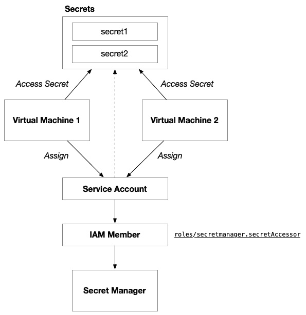

# 13

# 在 Google Cloud 上入门——使用 GCE 构建解决方案

你成功了。在前六章中，我们使用了两个不同的云平台和三种不同的云计算范式，构建了六个不同的解决方案，现在我们终于准备好通过将我们的解决方案适应**Google Cloud** **Platform**（**GCP**）来踏上最后的旅程。

像之前的两次冒险一样，在这个平行宇宙中，我们将通过在 Google Cloud 上使用**虚拟机**（**VM**）架构来开始我们的旅程。正如我们在 AWS 和 Azure 之间迁移时所看到的，当我们比较在两个不同的云平台上如何构建相同的解决方案架构时，有些东西变化很大，而有些东西变化很小——或者根本没有变化。我们注意到，在所有章节中，我们的 Terraform 代码几乎保持一致。然而，其他的一些内容，比如 Packer、Docker 和 GitHub Actions 工作流，只是稍微发生了变化。我们的基于.NET 的应用程序代码无论是在虚拟机还是容器中托管，都没有变化，但当我们进入无服务器时，应用程序代码经历了彻底的重构。

同样的情况也适用于我们将解决方案移到 GCP 时。因此，我们在本章中不会再详细讨论这些主题。不过，我鼓励你收藏*第七章*和*第八章*，并经常参考它们。本章将重点介绍我们在 GCP 上部署解决方案时必须做出的更改。

本章涵盖以下内容：

+   奠定基础

+   设计解决方案

+   构建解决方案

+   自动化部署

# 奠定基础

我们在 Söze 企业的团队对他们响应他们无畏的领导者 Keyser Söze 的技术调整，取得的成就表示赞赏，并且对他们在微软 Azure 上成功推出产品的成功和运气感到惊讶。他们使用了虚拟机（VM）、Kubernetes，最终还使用了无服务器技术。Azure 门户的深蓝色渐渐褪去，突然，空气中充满了一种神秘而又熟悉的声音：doodle-oo doodle-oo doodle-oo。熟悉的二重奏出现在我们面前——坐在一个温馨的木质面板地下室里，仿佛是 90 年代末和 2000 年代初郊区地下室的典型装饰。墙上挂着海报和纪念品，其中一个显眼的芝加哥熊队旗帜突出展示了 Wayne 对摇滚音乐和体育的热爱。他们开始熟悉的咒语：doodle-oo doodle-oo doodle-oo。突然间，我们被传送到了另一个世界——也许是另一个宇宙，在这个宇宙里，Google Cloud 的光滑多彩标志取代了 Azure 的深蓝色。Söze 企业现在已经与 Google Cloud 合作，打造下一代自动驾驶平台。

正如之前所说，我们从 Söze Enterprises 的其他部门继承了一个拥有强大核心团队的 C# .NET 开发人员团队，因此我们将使用 .NET 技术构建平台的 1.0 版本。据信，神秘的 CEO Keyser 曾和 Google 联合创始人 Sergey Brin 一起在阿马尔菲海岸附近的超级游艇 Dragonfly 上，公司的消息传下来，我们将使用 Google Cloud 来托管平台。由于团队对容器技术不太熟悉，而且时间紧迫，我们决定构建一个简单的三层架构并托管在 Azure 虚拟机上：


图 13.1 – 自动驾驶平台的逻辑架构

平台需要一个前端，它将是一个使用 ASP.NET Core Blazor 构建的 Web UI。前端将由一个 REST API 后端提供支持，后端将使用 ASP.NET Core Web API 构建。将我们的核心功能封装到 REST API 中将允许自动驾驶车辆直接与平台进行通信，并使我们能够通过添加客户端接口（例如原生移动应用程序和未来的虚拟或混合现实技术）进行扩展。后端将使用 PostgreSQL 数据库进行持久存储，因为它轻量、行业标准且相对廉价。

# 设计解决方案

由于团队面临紧迫的时间表，我们希望保持云架构的简单性。因此，我们将保持简单，使用 Google Cloud 服务，这将允许我们利用熟悉的虚拟机技术进行资源配置，而不是尝试学习新技术。我们需要做出的第一个决策是，确定我们的逻辑架构中每个组件将托管在 Google Cloud 的哪个服务上。

我们的应用架构由三个组件组成：前端、后端和数据库。前端和后端是应用程序组件，需要托管在提供通用计算的云服务上，而数据库则需要托管在云数据库服务上。对于这两种类型的服务，有很多选择：


图 13.2 – 自动驾驶平台及其主机的逻辑架构

由于我们已经决定使用虚拟机来托管我们的应用程序，我们已缩小了可以用来托管应用程序的不同服务范围。我们已决定 **Google Compute Engine** (**GCE**) 是当前情况下的理想选择：


图 13.3 – 我们代码库的源控制结构

该解决方案将包括六个部分。我们仍然需要前端和后端的应用代码以及 Packer 模板。然后，我们使用 GitHub Actions 来实现我们的 CI/CD 流程，并使用 Terraform 来配置我们的 Google Cloud 基础设施，并引用 Packer 构建的 VM 镜像用于我们的 GCE 实例。

## 云架构

我们设计的第一部分是将解决方案架构适配到目标云平台：Google Cloud。这涉及到将应用架构组件映射到 GCP 服务，并深入思考这些服务的配置，以确保它们符合我们解决方案的要求。

### 项目和 API 访问

在开始之前，我们需要在组织内创建一个项目，用于为 Terraform 创建服务账户。该服务账户需要被授予 `roles/resourcemanager.projectCreator` 组织角色的访问权限。这样，你就可以使用 Terraform 创建项目，保持整个解决方案的完整性，避免使用命令行界面在 Terraform 外部执行额外的样板代码。

完成这些设置后，你需要在 Terraform 服务账户所在的项目中启用 **Cloud Resource Manager API**。由于 Google Cloud 在项目级别通过特定方式授予对平台不同功能的访问权限，因此该 API 在 Google Cloud 项目上下文中是必需的。它为 Google Cloud 身份访问 GCP 上的资源创建了另一道关卡。

你的 Terraform 服务账户还需要访问 Cloud Storage，你计划用它来存储 Terraform 状态。在使用 AWS 和 Azure 提供程序时，你可以使用与配置环境时不同的凭证来访问 Terraform 后端。在 Google Cloud 上，可以通过设置 `GOOGLE_BACKEND_CREDENTIALS`，指定与 Google Cloud Storage 存储桶进行通信所用的身份凭证，和设置 `GOOGLE_APPLICATION_CREDENTIALS`，指定与 Google Cloud 进行通信以配置环境时所用的身份凭证来实现。

### 虚拟网络

虚拟机必须部署在虚拟网络中。你可能还记得在 *第七章* 中，当我们在 AWS 上配置这个解决方案时，我们需要为解决方案设置多个子网，以跨越多个可用区。在 *第八章* 中，当我们将解决方案部署到 Azure 时，我们只需要两个子网——一个用于前端，一个用于后端。这是因为 Azure 的虚拟网络架构与 AWS 不同，Azure 上的子网跨越多个可用区。

Google Cloud 的虚拟网络服务结构也不同。与 AWS 和 Azure 都只将虚拟网络范围限定于特定区域不同，GCP 上的虚拟网络默认跨多个区域。子网范围限定于区域，这意味着，像 Azure 一样，GCP 上的子网可以承载来自多个可用区的虚拟机。

以下图示显示，Google 计算网络不像在 AWS 和 Azure 中那样与区域绑定：


图 13.4 – Google Cloud 网络架构

尽管这看起来是部署层次结构根本上的一个显著差异，但它并不会实质性地影响设计，因为子网（或*子网络*）仍然与一个区域相关联：


图 13.5 – 前端和后端应用组件的隔离子网

在构建单区域解决方案时，Google Cloud 的多区域功能可能显得有些过剩。然而，自动跨越多个区域的功能简化了基础设施管理，因为企业不必手动设置和维护跨区域连接。这不仅减少了管理开销，还通过使得活跃-活跃的多区域部署更易于构建和维护，支持了企业对变化需求的更敏捷和可扩展的响应。

### 网络路由

在 Google Cloud 网络内，默认设置旨在提供简便且安全的连接。如我们所知，默认情况下，Google Cloud 网络是全球资源，这意味着同一网络中的所有子网（或*子网络*）都可以相互通信，无论它们位于哪个区域，而无需显式路由或 VPN。这种子网间通信使用网络中的系统生成路由。

对于路由配置，Google Cloud 有 **routes**，其功能类似于 AWS 的路由表，根据 IP 范围来引导流量。对于需要发起出站连接到互联网但又不希望暴露其 IP 的实例，Google Cloud 提供了 Cloud NAT，这类似于 AWS 的 **NAT gateways**。

像 Azure 一样，Google Cloud 没有一个直接等效的名为 **internet gateway** 的组件。相反，GCP 中的互联网连接是通过系统生成的路由和防火墙规则的组合进行管理的。

### 负载均衡

Google Cloud 有两种负载均衡器选项：全球和区域。全球负载均衡器将流量分配到多个区域，确保用户从最靠近或最适合的区域获得服务，而区域负载均衡器则在单个区域内分配流量。选择使用哪种通常取决于应用程序的用户分布以及低延迟访问的需求。然而，有时候，其他的限制条件也会迫使你做出选择：


图 13.6 – Google Cloud 区域负载均衡器

不幸的是，区域负载均衡器的目标池不允许您为后端实例指定不同的端口。这意味着目标池将把流量转发到接收流量时使用的相同端口。例如，如果转发规则在端口`80`上监听，目标池将把流量发送到后端实例的端口`80`。

要实现从端口`80`转发到端口`5000`的目标，您需要使用全球负载均衡器，而不是区域负载均衡器：


图 13.7 – Google Cloud 全球负载均衡器

全球负载均衡器要求您设置实例组，以组织负载将要分配到的虚拟机（VM）。Google Cloud 实例组类似于 AWS 的自动扩展组和 Azure 的**虚拟机规模集**（**VMSS**），但它们更具灵活性，您可以提供虚拟机模板并允许 GCP 来*管理*实例，或者您可以显式地配置实例并稍后将它们添加到实例组中。这种双模式能力类似于 Azure 的 VMSS，而不是 AWS 的自动扩展组，后者只能在*管理*模式下运行。

正如我们在比较 AWS 和 Azure 时所看到的，负载均衡器的所有基本组成部分都存在并得到体现——它们可能只是使用不同的名称，并以略微不同的方式连接。下表扩展了我们在 AWS 和 Azure 之间的映射，并包括了 GCP 的对应项：

| **AWS** | **Azure** | **GCP** | **描述** |
| --- | --- | --- | --- |
| **应用负载均衡器**（**ALB**） | Azure 负载均衡器 | URL 映射 | 负载均衡器 |
| 监听器 | 前端 IP 配置 | 全球转发规则 | 接受负载均衡器传入流量的单一端点 |
| 目标组 | 后端地址池 | 后端服务 | 传入流量被转发到的虚拟机集合 |
| 健康检查 | 健康探针 | 健康检查 | 每个后端虚拟机发布的端点，指示其健康且准备好处理流量 |

表 13.1 – AWS、Azure 与 GCP 之间同义负载均衡器组件的映射

URL 映射和目标 HTTP 代理共同构成了全球负载均衡器，它连接到转发规则，后者充当单一端点，以及后端服务，后端服务代表着用于分配负载的虚拟机集合。

### 网络安全

为了控制网络流量，Google Cloud 提供了防火墙规则，允许用户指定哪些数据包可以进出实例。虽然 Google Cloud 的防火墙规则与 AWS 的**网络访问控制列表**（**NACLs**）有一些相似之处，但需要注意的是，GCP 防火墙规则是有状态的，而 AWS NACLs 是无状态的。

### 秘密管理

像数据库凭证或服务访问密钥这样的秘密需要安全存储。每个云平台都有提供此功能的服务。在 GCP 中，这项服务称为 Google Cloud Secret Manager。

再次，我们会看到命名约定的细微差别，但所有的结构部分都在其中。以下表格扩展了我们在 AWS 和 Azure 之间所做的映射，并包括了 GCP 的等效项：

| **AWS** | **Azure** | **GCP** | **描述** |
| --- | --- | --- | --- |
| IAM | Microsoft Entra | Cloud Identity | 身份提供者 |
| Secret Manager | Key Vault | Secret Manager | 安全的秘密存储 |
| IAM 角色 | 用户分配的托管身份 | 服务账户 | 机器间交互的身份 |
| IAM 策略 | **基于角色的访问控制** (**RBAC**) | IAM 成员 | 执行特定操作所需的权限 |
| IAM 角色策略 | 角色分配 | IAM 成员 | 将特定权限关联到特定身份 |

表 13.2 – AWS、Azure 和 GCP 之间同义 IAM 组件的映射

存储在 Google Cloud Secret Manager 中的秘密可以通过虚拟机（VM）访问，前提是它们已获得必要的访问权限。在 *第七章* 中，我们使用了 AWS IAM 角色分配来允许 VM 执行此操作，而在 Azure 中，我们使用了用户分配的托管身份和角色分配。在 GCP 中，我们需要使用服务账户并授予它对特定秘密的权限：



图 13.8 – Key Vault 架构

授予附加到 VM 的托管身份对 **Key Vault Secrets User** 角色的访问权限将允许 VM 从 Key Vault 中读取密钥值。这不会将秘密存储到机器上。VM 需要使用 Azure CLI 来访问 Key Vault 中的秘密。

### 虚拟机（VM）

现在我们已经准备好了解决方案所需的所有内容，我们可以最后讨论应用程序组件将运行的位置：在 Google Cloud 的 Compute Engine 服务上配置的虚拟机（VM）。在 GCP 上配置 VM 时，有两种选择。首先，可以提供静态 VM。在这种方法中，需要为每个 VM 指定关键特征。可以将这些 VM 组织到实例组中，以更好地管理其健康状况和生命周期。第二种选择是配置实例组管理器。这将允许根据需求动态地进行扩展和缩减，并且可以自动修复失败的 VM：


图 13.9 – Google Cloud Compute Engine 实例架构

类似于 Azure，Google Cloud 将通过应用生命周期将 VM 组织在一起的概念与其健康管理和动态配置区分开来。在 Azure 中，**可用性集**是一个逻辑组，可以将单独的 VM 放入其中，使其关系被底层平台考虑：


图 13.10 – 实例组管理器架构

在 Google Cloud 上，这就是一个实例组。两者都允许你轻松地将虚拟机池附加到其他相关服务，这些服务有助于多个虚拟机共同解决问题，例如负载均衡器和健康监测。为了添加动态配置和管理，在 Azure 上，你需要一个 VMSS。在 Google Cloud 上，这被称为实例组管理器。

再次强调，正如我们之前看到的那样，名称已经更改以保护无辜者，但请不要误解，它们的工作方式是相同的。下表扩展了我们在 AWS 和 Azure 之间所做的映射，并包括了 GCP 的等效项：

| **AWS** | **Azure** | **GCP** | **描述** |
| --- | --- | --- | --- |
| EC2 | 虚拟机 | 计算实例 | 虚拟机服务 |
| AMI | 虚拟机映像 | Google 计算映像 | 来自市场或自定义构建的虚拟机映像（例如，使用 Packer 等工具） |
| IAM 角色 | 用户分配的托管身份 | 服务账户 | 用于机器到机器交互的身份 |
| 自动伸缩组 | VMSS | 实例组管理器 | 一组动态配置的虚拟机，可以使用虚拟机配置模板进行扩展/缩减 |
| 启动模板 | 虚拟机配置 | 实例模板 | 用于创建新虚拟机的配置模板 |

表 13.3 – AWS、Azure 和 GCP 之间的虚拟机服务组件同义词映射

在 *第七章* 中，我们使用 AWS **弹性云计算**（**EC2**）服务配置了我们的解决方案，而在 *第八章* 中，我们做了同样的事情，但使用的是 Azure 虚拟机服务。像这两个平台一样，在 GCP 上，虚拟机通过网络接口连接到虚拟网络。与 AWS 和 Azure 不同的是，这些网络接口不能独立于虚拟机进行配置，而是在后期附加。

我们还讨论了 Azure 和 AWS 在处理网络安全方面的细微差别，其中 AWS 通过 NACL 处理低级别的网络安全，这些 NACL 附加在子网中，并通过更具逻辑性的安全组附加在实例上，按状态方式处理网络流量。Azure 有类似的构造，网络安全组更多关注物理端点之间的网络流量（IP 地址范围和网络网关），而应用程序安全组则关注逻辑应用程序端点之间的网络流量。Google Cloud 将两者结合起来，使用 Google Compute 防火墙资源，能够利用物理网络特性（如 IP 地址范围）和逻辑构造（如服务账户和标签）控制网络流量。

使用标签来附加行为或授予权限的模式是 GCP 中常见的模式，你应该注意这一点，因为其他平台并不将标签视为建立安全边界的方法。

## 部署架构

现在我们已经有了一个大致的 Google Cloud 云架构方案，我们需要制定一个计划，来配置我们的环境并部署我们的代码。

### VM 配置

在我们的解决方案中，我们有两个 VM 角色：前端角色，负责处理来自终端用户网页浏览器的网页请求，以及后端角色，负责处理来自 Web 应用程序的 REST API 请求。这两个角色有不同的代码和配置，需要进行设置。每个角色都需要自己的 Packer 模板来构建一个 VM 镜像，我们可以用这个镜像在 Google Cloud 上启动 VM：


图 13.11 – 使用 Packer 管道为前端构建 VM 镜像

一个 GitHub Actions 工作流，触发前端应用程序代码和前端 Packer 模板的更改，执行 `packer build` 并为解决方案的前端创建一个新的 VM 镜像。

前端和后端将有相同的 GitHub 工作流，执行 `packer build`。这两个工作流的主要区别在于它们执行的代码库。前端和后端可能有稍微不同的操作系统配置，并且它们分别需要不同的部署包来部署各自的应用组件：


图 13.12 – 使用 Packer 管道为后端构建 VM 镜像

需要注意的是，应用程序代码将被“烘焙”进 VM 镜像，而不是复制到已经运行的 VM 上。这意味着，要更新运行在 VM 上的软件，每个 VM 都需要重新启动，以便用包含最新代码副本的新 VM 镜像重新启动。

这种方法使得 VM 镜像成为一个不可变的部署工件，每次发布需要部署的应用程序代码时，镜像都会进行版本更新和更新。

### 云环境配置

一旦为前端和后端构建了 VM 镜像，我们就可以执行最终的工作流，该工作流将同时配置并将我们的解决方案部署到 Google Cloud：


图 13.13 – VM 镜像作为 Terraform 代码的输入，用于在 Google Cloud 上配置环境

Terraform 代码库将有两个输入变量，分别表示前端和后端的 VM 镜像版本。当需要部署新版本的应用软件时，这些版本的输入参数将增加，以反映目标版本。当工作流执行时，`terraform apply` 将简单地用新的 VM 镜像替换现有的 VM。

现在我们已经有了一个明确的计划，如何使用 Google Cloud 来实现云架构，以及如何使用 GitHub Actions 来实现部署架构，让我们开始构建吧！在下一节中，我们将解析我们将用于实现 Terraform 和 Packer 解决方案的**HashiCorp 配置语言**（**HCL**）代码。

# 构建解决方案

现在我们已经有了一个坚实的解决方案设计，我们可以开始构建它了。正如在前一节中讨论的那样，我们将使用由 Google Cloud Compute Engine 提供支持的虚拟机。正如我们在*第七章*和*第十章*中分别做的那样，我们需要使用 Packer 将应用程序打包成虚拟机镜像，然后再配置一个使用这些虚拟机镜像的环境。

## Packer

在本节中，我们将介绍如何实现 Packer 模板配置器，以便我们能够在 Linux 虚拟机上安装我们的.NET 应用程序代码。如果你由于对 AWS 不感兴趣而跳过了*第七章*到*第九章*，我不怪你——特别是如果你阅读本书的主要兴趣是在 GCP 上工作。然而，我建议你查看*第七章*中的相关部分，看看我们如何使用 Packer 的配置器在基于 Debian 的 Linux 虚拟机上配置.NET 应用程序代码。

### Google Cloud 插件

正如我们在*第四章*中讨论的，Packer – 与 Terraform 类似 – 是一个可扩展的命令行可执行文件。每个云平台都为 Packer 提供了一个插件，封装了与其服务的集成：

```
packer {
  required_plugins {
    googlecompute = {
      source  = "github.com/hashicorp/googlecompute"
      version = "~> 1.1.2"
    }
  }
}
```

在*第七章*和*第十章*中，我们展示了如何声明 AWS 和 Azure 的 Packer 插件（分别）作为必需插件。前面的代码演示了如何声明 Google Cloud 的插件——截至写作时，最新版本是 1.1.2。

Packer 的 Google Cloud 插件提供了一个`googlecompute`构建器，该构建器将通过从基础镜像创建新虚拟机、执行配置器、拍摄 Google Cloud 实例启动磁盘的快照，并从中创建 Google Cloud 计算镜像来生成 Google Cloud 计算镜像。像 AWS 和 Azure 插件一样，这一行为被封装在 Google Cloud 的构建器内部。

就像其他插件封装了在各自平台上构建虚拟机的逻辑一样，其配置使用了特定平台的术语。Packer 并不试图在各云平台之间创建一个标准的构建器接口 – 而是将特定平台的配置封装在构建器内部。这使得对于熟悉目标平台的用户来说，操作更为简单，同时允许构建器利用平台特有的功能，而不需要通过在每个平台之间统一语法来增加额外的复杂性。

因此，AWS、Azure 和 Google Cloud 的构建器在几乎每个方面都存在根本差异——从它们的身份验证方式到如何查找市场镜像。虽然它们有一些共同的字段和相似性，但它们实质上是完全不同的：

```
source "googlecompute" "vm" {
  project_id   = var.gcp_project_id
  source_image = "ubuntu-pro-2204-jammy-v20220923"
  ssh_username = "packer"
  zone         = var.gcp_primary_region
  image_name   = "${var.image_name}-${var.image_version}"
}
```

上述代码展示了我们如何引用 Google Cloud 市场版的 Ubuntu 22.04 虚拟机。请注意，与其他提供者不同，后者有相对复杂的查找机制，Google Cloud 只需一个字符串来表示所需的镜像。每种方式都能产生相同的结果：我们选择一个由云平台托管的市场镜像作为我们的启动磁盘，但我们能看到三种不同的云平台展现出不同的组织理念。

### 操作系统配置

我们必须配置操作系统，以便它安装软件依赖项（例如 .NET 6.0），将我们的应用程序代码的部署包复制并部署到本地文件系统中的正确位置，配置一个在启动时运行的 Linux 服务，并设置一个具有必要访问权限的本地用户和组，以便该服务能够运行。

我在*第七章*的相应部分详细扩展了这些步骤，因此如果你想刷新记忆，建议查看该部分。

## Terraform

正如我们在设计中讨论的那样，我们的解决方案由两个应用组件组成：前端和后端。每个组件都有需要部署的应用代码库。由于这是我们第一次使用`google`提供者，我们将首先了解基本的提供者设置以及如何配置后端，然后再深入讨论我们架构中每个组件的细节。

### 提供者设置

首先，我们需要在`required_providers`块中指定所有我们打算在此解决方案中使用的提供者：

```
terraform {
  required_providers {
    google = {
      source  = "hashicorp/google"
      version = "~> 5.1.0"
    }
    cloudinit = {
      source  = "hashicorp/cloudinit"
      version = "~> 2.3.2"
    }
    random = {
      source  = "hashicorp/random"
      version = "~> 3.5.1"
    }
  }
  backend "gcs" {
  }
}
```

我们还将配置 Google Cloud 提供者。与 AWS 不同，Google Cloud 提供者像 Azure 一样，并不限于某个特定区域。Google Cloud 提供者甚至不需要限定为某个项目。通过这种方式，它非常灵活，可以用于在不同项目和多个区域之间使用相同的提供者声明来配置资源：

```
provider "google" {
  project = var.gcp_project
  region  = var.primary_region
}
```

Google 提供者与 AWS 和 Azure 提供者之间的一个主要区别是身份验证的方式。虽然 Azure 和 AWS 有环境变量指定身份，但 Google Cloud 提供者依赖于认证文件，因此这将改变我们的管道工具与 Terraform 集成的方式，以确保 Google Cloud 解决方案具有正确的身份。`GOOGLE_APPLICATION_CREDENTIALS`环境变量指定该文件的路径。需要注意的是，这个文件是一个 JSON 文件，但它包含机密信息，因此应当将其视为凭证并加以保护。

### 后端

因为我们将使用 CI/CD 流水线来长期提供和维护我们的环境，所以我们需要为我们的 Terraform 状态设置一个远程后端。由于我们的解决方案将在 Google Cloud 上托管，我们将使用 Google Cloud Storage 后端来存储 Terraform 状态。

就像 Google Cloud 提供商一样，我们不希望在代码中硬编码后端配置，因此我们将简单地为后端设置一个占位符：

```
terraform {
  ...
  backend "gcs" {
  }
}
```

我们将在 CI/CD 流水线中运行 `terraform init` 时，使用 `-backend-config` 参数来配置后端的参数。

### 输入变量

传递短名称来标识应用程序的名称和环境是良好的实践。这使得你可以在构成解决方案的资源中嵌入一致的命名约定，从而更容易在 Google Cloud 控制台中识别和跟踪资源。

`primary_region`、`network_cidr_block` 和 `az_count` 输入变量驱动部署的关键架构特征。它们不应硬编码，因为这样会限制 Terraform 代码库的可重用性。

`network_cidr_block` 输入变量建立了虚拟网络地址空间，通常会受到企业治理机构的严格控制。通常会有一个流程来确保组织内的各个团队不会使用冲突的 IP 地址范围，从而避免将来无法让这两个应用程序集成，或无法与企业内部共享的网络资源集成。

`az_count` 输入变量允许你配置在解决方案中所需的冗余度。这将影响解决方案的高可用性，但也会影响部署的成本。正如你可以想象的那样，成本也是云基础设施部署的一个严格受控的特性。

### 一致的命名和标签

与 AWS 控制台不同，并且与 Azure 非常相似，Google Cloud 的设计方式使得你通过项目非常容易获得应用程序中心的部署视图。因此，为应用程序指定标签并不是像组织策略那样重要。默认情况下，你将获得一个项目中心的视图，查看 Google Cloud 上的所有资源：

```
resource "google_compute_network" "main" {
  ...
  tags = {
    application = var.application_name
    environment = var.environment_name
  }
}
```

标记你部署的资源仍然很重要，这些资源可以指示它们属于哪个应用程序和哪个环境。这有助于其他报告需求，如预算和合规性。几乎所有 Google Cloud 提供商中的资源都有一个名为 `tags` 的 `map` 属性。像 Azure 一样，每个资源通常都有 `name` 作为必填属性。

### 虚拟网络

正如我们在 *第七章* 和 *第八章* 中所做的那样，我们需要构建一个虚拟网络，并尽可能将其地址空间保持紧凑，以避免在将来为更广泛的组织吞噬不必要的地址空间：

```
resource "google_compute_network" "main" {
  name                    = "${var.application_name}-${var.environment_name}"
  auto_create_subnetworks = false
}
```

在 Google Cloud 中创建网络比我们在 AWS 中所做的更简单，因为我们无需根据可用区来划分子网。这种方式类似于 Azure 如何结构化子网以跨可用区展开：

```
resource "google_compute_subnetwork" "frontend" {
  name          = "frontend"
  region        = var.primary_region
  network       = google_compute_network.main.self_link
  ip_cidr_range = cidrsubnet(var.network_cidr_block, 2, 1)
}
```

### 负载均衡

正如我们在设计中讨论的，Google Cloud 的负载均衡服务与 AWS 和 Azure 的类似服务结构差异较大。

全局转发规则充当全局负载均衡器的主要入口点：

```
resource "google_compute_global_forwarding_rule" "frontend" { name = "my-forwarding-rule" ip_protocol = "TCP" port_range = "80" target = google_compute_target_http_proxy.http_proxy.self_link }
```

然后，它会引用一个目标 HTTP 代理：

```
resource "google_compute_target_http_proxy" "http_proxy" {
  name    = "my-http-proxy"
  url_map = google_compute_url_map.url_map.self_link
}
```

随后，这将引用一个 URL 映射：

```
resource "google_compute_url_map" "url_map" {
  name            = "my-url-map"
  default_service = google_compute_backend_service.backend_service.self_link
}
```

URL 映射指向一个后端服务，最终定义哪些 Google Cloud 服务将处理请求：

```
resource "google_compute_backend_service" "backend_service" {
  name        = "my-backend-service"
  port_name   = "http"
  protocol    = "HTTP"
  timeout_sec = 10
  dynamic "backend" {
    for_each = google_compute_instance_group.frontend
    content {
      group = backend.value.self_link
    }
  }
  health_checks = [google_compute_http_health_check.frontend.self_link]
}
```

在前面的代码中，你可以看到我们正在将后端连接到健康检查和包含虚拟机的实例组，最终这些虚拟机会处理传入的请求：

```
resource "google_compute_http_health_check" "frontend" {
  name = "${var.application_name}-${var.environment_name}-hc"
  port         = 5000
  request_path = "/"
}
```

健康检查为平台提供配置，以判断后端服务是否健康，请求会发送到相应后端服务的健康检查端点，以确定该服务是否足够健康以接收传入流量。

### 网络安全

首先，我们需要为每个应用程序架构组件设置逻辑防火墙。我们将为前端和后端分别设置一个：

```
resource "google_compute_firewall" "default-hc-fw" {
  name    = "${var.application_name}-${var.environment_name}-hc"
  network = google_compute_network.main.self_link
  allow {
    protocol = "tcp"
    ports    = [5000]
  }
  source_ranges = ["130.211.0.0/22", "35.191.0.0/16"]
  target_tags   = ["allow-lb-service"]
}
```

Google Cloud 通常具有一些特定的知名 IP 地址，必须将这些地址包括在你的防火墙规则中，以便它们授予服务之间必要的通信权限。

### 密钥管理

在*第七章*中，我们使用 AWS Secrets Manager 设置了密钥，在*第八章*中，我们在 Microsoft Azure 的 Key Vault 中也做了类似的设置。正如你可能还记得的，在*第八章*中，Azure Key Vault 是在一个区域内配置的。密钥的创建是在这个上下文中进行的。Google Cloud 的 Secret Manager 服务与 AWS 相似，因为不需要配置逻辑端点来划定密钥的范围。以下代码展示了如何在 Google Cloud Secret Manager 中配置密钥：

```
resource "google_secret_manager_secret" "db_password" {
  secret_id = "db-password-secret"
  replication {
    automatic = true
  }
}
```

这是一个用于存储密钥的逻辑容器，由于定期的密钥轮换，它的生命周期内可能有许多不同的值。以下代码展示了如何定义密钥的特定版本：

```
resource "google_secret_manager_secret_version" "db_password_version" {
  secret      = google_secret_manager_secret.db_password.id
  secret_data = "abc1234"
}
```

这可能是一个我们从其他 Google Cloud 资源中提取的值。以下代码授予服务帐户访问我们在 Google Cloud Secret Manager 中的密钥：

```
resource "google_secret_manager_secret_iam_member" "secret_iam" {
  secret_id = "YOUR_SECRET_ID"
  role      = "roles/secretmanager.secretAccessor"
  member = "serviceAccount:YOUR_SERVICE_ACCOUNT_EMAIL"
}
```

### 虚拟机

在配置静态虚拟机时，我们可以更好地控制每台机器的配置。一些虚拟机具有特定的网络和存储配置，以满足工作负载的需求。

首先，我们将从输入变量中获取虚拟机镜像。这是我们使用 Packer 构建并部署到另一个 Google Cloud 项目的虚拟机镜像：

```
data "google_compute_image" "frontend" {
  name = var.frontend_image_name
}
```

接下来，我们将在 Google Cloud 实例中创建虚拟机。该资源将包含网络接口、磁盘和服务帐户配置，以设置我们的虚拟机并将其连接到虚拟网络中的正确子网：

```
resource "google_compute_instance" "frontend" {
  count = var.frontend_instance_count
  name         = "vm${var.application_name}-${var.environment_name}-frontend-${count.index}"
  machine_type = var.frontend_machine_type
  zone         = local.azs_random[count.index % 2]
  boot_disk {
    initialize_params {
      image = data.google_compute_image.frontend.self_link
    }
  }
  // Local SSD disk
  scratch_disk {
    interface = "NVME"
  }
  network_interface {
    subnetwork = google_compute_subnetwork.frontend.self_link
    access_config {
      // Ephemeral public IP
    }
  }
  service_account {
    # Google recommends custom service accounts that have cloud-platform scope and permissions granted via IAM Roles.
    email  = google_service_account.main.email
    scopes = ["cloud-platform"]
  }
  tags = ["ssh-access", "allow-lb-service"]
}
```

然后，我们将通过遍历`var.az_count`输入变量来为每个虚拟机创建网络接口：

```
locals {
  zone_instances = { for z in local.azs_random : z =>
    {
      instances = flatten([
        for i in google_compute_instance.frontend :
        i.zone == z ? [i.self_link] : []
      ])
    }
  }
}
```

此时，我们可以为每个区域设置实例组：

```
resource "google_compute_instance_group" "frontend" {
  count = var.az_count
  named_port {
    name = "http"
    port = 5000
  }
  name      = "frontend-${count.index}"
  zone      = local.azs_random[count.index]
  instances = local.zone_instances[local.azs_random[count.index]].instances
}
```

最后，我们将设置虚拟机的所有必要属性，然后将其与网络接口、虚拟机镜像和托管身份关联。

通过这些步骤，我们已经实现了 Packer 和 Terraform 解决方案，并且拥有一个可以为前端和后端应用程序组件构建虚拟机镜像的工作代码库，同时将我们的云环境部署到 Google Cloud 中。在下一节中，我们将深入探讨 YAML 和 Bash，并实现所需的 GitHub Actions 工作流。

# 自动化部署

正如我们在设计中所讨论的，我们的解决方案由两个应用程序组件组成：前端和后端。每个组件都有一个封装在 Packer 模板中的应用程序代码和操作系统配置。这两个应用程序组件随后被部署到我们 Terraform 代码库中定义的 Azure 云环境中。

就像我们在*第七章*和*第八章*中讨论的 AWS 和 Azure 解决方案一样，还有一个额外的代码库需要讨论：我们在 GitHub Actions 上的自动化流水线。

在*第七章*中，我们讨论了代码库的文件夹结构以及我们的 GitHub Actions 如何适应其中，从而了解到我们的自动化流水线被称为工作流，它们存储在`/.github/workflows`中。我们的每个代码库都存储在各自的文件夹中。我们解决方案的源代码仓库的文件夹结构如下所示：

+   `.``github`

    +   `workflows`

    +   `dotnet`

        +   `backend`

        +   `frontend`

    +   `packer`

        +   `backend`

        +   `frontend`

    +   `terraform`

根据我们的设计，我们将拥有 GitHub Actions 工作流，执行 Packer 并为前端（例如，`packer-frontend.yaml`）和后端（例如，`packer-backend.yaml`）构建虚拟机镜像。我们还将拥有执行`terraform plan`和`terraform apply`的工作流：

+   `.``github`

    +   `workflows`

        +   `packer-backend.yaml`

        +   `packer-frontend.yaml`

        +   `terraform-apply.yaml`

        +   `terraform-plan.yaml`

在*第七章*中，我们更详细地讨论了 GitFlow 流程及其如何与我们的 GitHub Actions 工作流交互。因此，现在让我们深入了解这些流水线在面向 Azure 平台时将如何不同。

## Packer

在*第七章*中，我们详细介绍了执行 Packer 以构建虚拟机镜像的 GitHub Actions 工作流的每一步。由于 Packer 具有云平台无关的架构，这部分基本保持不变。唯一的变化是在最后一步，我们执行 Packer。

因为 Packer 需要配置在 Google Cloud 上构建虚拟机，所以我们需要传入一些 Google Cloud 特有的输入变量。这些变量包括 Google Cloud 凭证文件的文件路径、Google Cloud 区域以及 Google Cloud 项目 ID。

就像我们在为 AWS 配置 Packer 模板时使用输入变量一样，我们必须确保所有 Google Cloud 输入变量都以 `gcp_` 为前缀。如果我们将来想要实现多目标支持，这将非常有帮助，因为许多云平台需要相似的输入，例如目标区域和虚拟机大小。虽然大多数云平台需要类似的输入，但这些输入值是不能互换的。

例如，每个云平台都要求你指定一个区域，以便 Packer 将临时虚拟机提供到该区域，并将生成的虚拟机镜像存储到该区域。在 Google Cloud 上，区域的值为`us-west2-a`，正如我们在 Azure 和 AWS 中看到的那样，每个云平台都会有令人恼火的相似且略有不同的区域名称。

Google Cloud 在凭证指定方式上有一个重要的区别。与 AWS 和 Azure 通常使用特定的环境变量来存储上下文和凭证不同，Google Cloud 使用一个文件。因此，在运行 Packer 之前，我们需要确保 Google Cloud 密钥文件已经被放置在一个已知的位置，以便我们的 Packer 操作可以找到它：

```
- name: Create Secret File
  env:
    GOOGLE_APPLICATION_CREDENTIALS: ${{ secrets.GOOGLE_APPLICATION_CREDENTIALS }}
  working-directory: ${{ env.WORKING_DIRECTORY }}
  run: |
    # Create a local file with the secret value
    echo -n "$GOOGLE_APPLICATION_CREDENTIALS" > gcp.json
```

GitHub Actions 工作流 YAML 文件对于 Google Cloud 来说是相同的，唯一的区别是需要使用一个输入变量来指定凭证文件的路径——即 `gcp.json`：

```
- id: build
  name: Packer Build
  env:
    GOOGLE_APPLICATION_CREDENTIALS: "gcp.json"
    PKR_VAR_gcp_project_id: ${{ vars.GOOGLE_PROJECT }}
    PKR_VAR_image_version: ${{ steps.image-version.outputs.version }}
    PKR_VAR_agent_ipaddress: ${{ steps.agent-ipaddress.outputs.ipaddress }}
  working-directory: ${{ env.WORKING_DIRECTORY }}
  run: |
    packer init ./
    packer build -var-file=variables.pkrvars.hcl ./
```

上述代码引用了我们从 GitHub Actions 秘密中创建的密钥文件。Packer 的 Google Cloud 插件将使用 `GOOGLE_APPLICATION_CREDENTIALS` 环境变量加载密钥文件，以便进行 Google Cloud 认证。

## Terraform

我们的虚拟机镜像已经构建完成，并且它们的版本已经输入到`.tfvars`文件中，Terraform 自动化管道已经准备好接管，不仅可以配置我们的环境，还可以部署我们的解决方案（尽管严格来说，部署是在`packer build`过程中完成的）。部署实际上是在`packer build`过程中完成的，物理部署包被复制到主目录，Linux 服务已设置并准备就绪。Terraform 通过实际启动虚拟机并使用这些镜像来完成剩余的工作。

在*第七章*中，我们介绍了执行 Terraform 来配置云环境并部署应用代码的 GitHub Actions 工作流的每一步。由于 Terraform 的云无关架构的特性，这部分几乎保持不变。唯一不同的是最终一步，我们执行 Terraform。

就像我们在*第七章*和*第八章*中与 AWS 和 Azure 提供程序一样，我们需要使用特定于`google`提供程序的环境变量来设置身份验证上下文。在这种情况下，传递单一的`GOOGLE_APPLICATION_CREDENTIALS`属性来连接提供程序，并指定如何与 Terraform 进行身份验证以配置环境：

```
- name: Create Secret File for Terraform
  env:
    GOOGLE_APPLICATION_CREDENTIALS: ${{ secrets.GOOGLE_APPLICATION_CREDENTIALS }}
  working-directory: ${{ env.WORKING_DIRECTORY }}
  run: |
    # Create a local file with the secret value
    echo -n "$GOOGLE_APPLICATION_CREDENTIALS" > gcp-terraform.json
```

上述代码生成了 Terraform 所需的密钥文件，以便与 Google Cloud 进行身份验证，从而配置环境。

就像我们在*第七章*和*第八章*中与 AWS 和 Azure 提供程序一样，我们需要通过使用`-backend-config`命令行参数配合`terraform init`命令来配置存储 Terraform 状态的 Google Cloud 特定后端。额外的`GOOGLE_BACKEND_CREDENTIALS`参数告知 Terraform 如何与我们用来存储 Terraform 状态的 Google Cloud Storage 后端进行身份验证：

```
- name: Create Secret File for Backend
  env:
    GOOGLE_BACKEND_CREDENTIALS: ${{ secrets.GOOGLE_BACKEND_CREDENTIALS }}
  working-directory: ${{ env.WORKING_DIRECTORY }}
  run: |
    # Create a local file with the secret value
    echo -n "$GOOGLE_BACKEND_CREDENTIALS" > gcp-backend.json
```

上述代码生成了 Terraform 所需的密钥文件，以便与 Google Cloud 进行身份验证，从而可以存储和检索环境的 Terraform 状态。

与 AWS 和 Azure 提供程序不同——并且强调 Terraform 后端实现的差异有多大——该后端使用*前缀*和 Terraform 工作区名称来唯一标识存储状态文件的位置：

```
- id: plan
  name: Terraform Apply
  env:
    GOOGLE_BACKEND_CREDENTIALS: gcp-backend.json
    GOOGLE_APPLICATION_CREDENTIALS: gcp-terraform.json
    BACKEND_BUCKET_NAME: ${{ vars.BACKEND_BUCKET_NAME }}
    TF_VAR_gcp_project: ${{ vars.GOOGLE_PROJECT }}
  working-directory: ${{ env.WORKING_DIRECTORY }}
  run: |
    terraform init \
      -backend-config='bucket='$BACKEND_BUCKET_NAME \
      -backend-config="prefix=gcp-vm-sample"
    terraform apply -auto-approve
```

注意到与 Azure 解决方案类似，我们不需要执行有针对性的`terraform apply`命令。这是因为我们无需根据区域中的可用性区域数量进行动态计算来配置虚拟网络。

这些云平台之间微妙的架构差异可能会产生根本性的结构变化，即使我们使用相同的技术部署相同的解决方案。这提醒我们，虽然我们在*第四章*到*第六章*中学到的核心概念将帮助我们提升到多云视角，但要实现实际的解决方案，我们需要理解每个平台的微妙差异。

# 摘要

在本章中，我们使用 Google Cloud Compute Engine 提供的虚拟机构建了一个多层次的云架构，并结合完全运作的 GitFlow 流程和使用 GitHub Actions 的端到端 CI/CD 管道。

在下一章，我们的无畏领袖——Söze 企业的首席执行官，将会带给我们一些令人激动的新想法，我们将不得不响应他的号召。原来，我们的 CEO，Keyser，最近熬夜观看了一些关于下一个大热趋势——容器的 YouTube 视频，在与他的小伙伴 Sundar 在超级游艇上讨论后，他决定重构整个解决方案，使其能够在 Docker 和 Kubernetes 上运行。幸运的是，Google 的好心人提供了一项可能对我们有所帮助的服务：**Google Kubernetes** **Engine** (**GKE**)。
