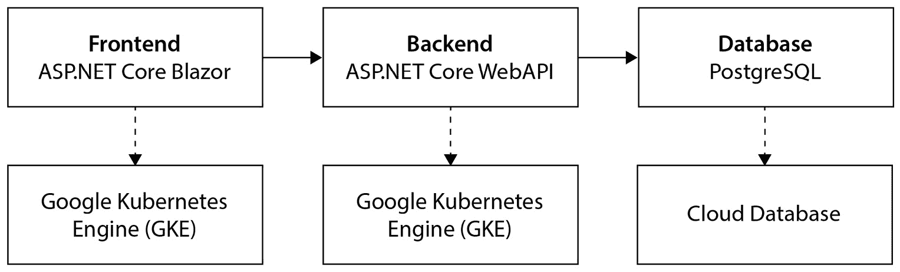
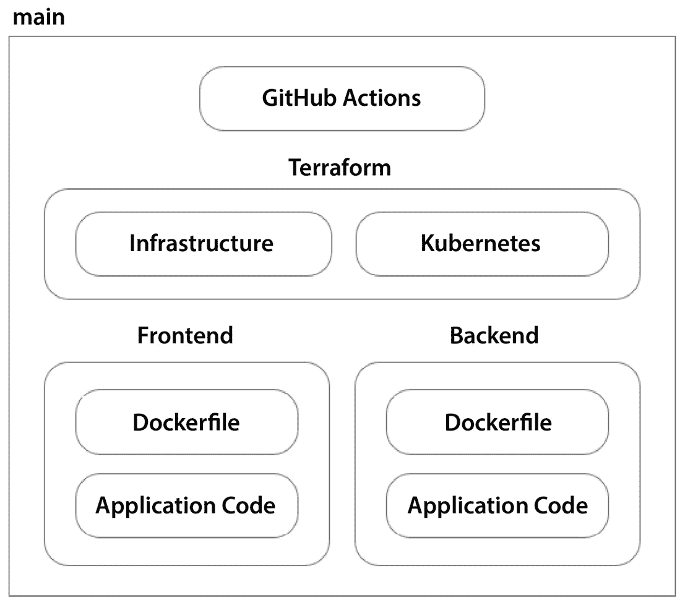
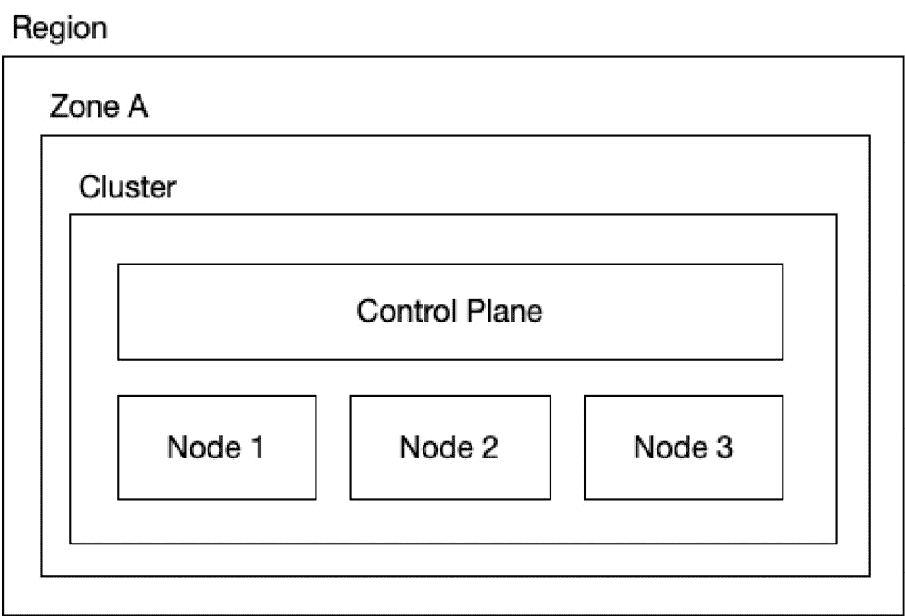
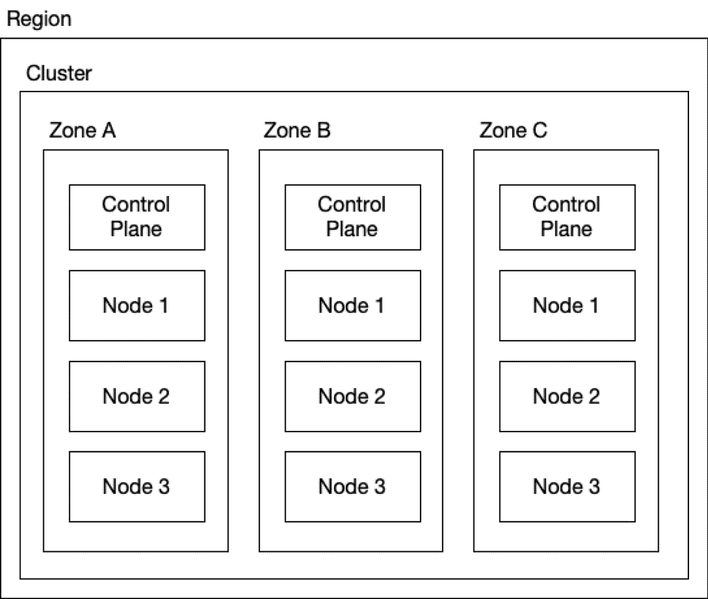
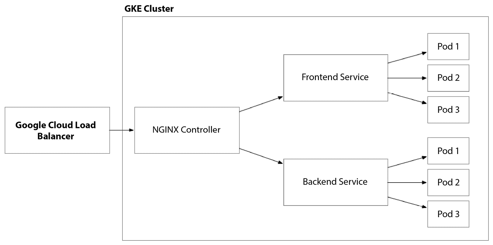

# 14

# 在 Google Cloud 上容器化 – 使用 GKE 构建解决方案

在上一章中，我们通过利用 **Google Compute Engine**（**GCE**）在 Google Cloud 上构建并自动化了解决方案。我们使用 Packer 构建了 **虚拟机**（**VM**）镜像，并通过 Terraform 配置了我们的虚拟机。在本章中，我们将采取类似的路径，但我们不再使用虚拟机，而是将重点放在在 Kubernetes 集群中托管我们的应用程序。

为了实现这一目标，我们需要通过放弃 Packer 并用 Docker 替代它来创建可部署的应用程序工件。我们将再次使用 Terraform 的`google`提供程序，并重新审视我们在使用 AWS 和 Azure 进行相同操作时所用的 Terraform `kubernetes` 提供程序。

由于当我们迁移到 Google Cloud 时，大部分内容保持不变，因此我们在本章中不会对这些话题进行重复深入的讨论。然而，我建议你收藏 *第八章* 并经常参考。

本章涵盖以下主题：

+   打下基础

+   设计解决方案

+   构建解决方案

+   自动化部署

# 打下基础

我们的故事通过 Söze Enterprises 的视角继续，Söze Enterprises 是由神秘的土耳其亿万富翁 Keyser Söze 创立的。我们的团队一直在努力构建下一代自动驾驶汽车编排平台。之前，我们希望通过利用 Google Cloud 的强大平台、发挥团队现有技能并专注于功能开发，来超越竞争对手。团队刚刚找到节奏时，一个意外的变故突然出现。

在周末，我们神秘的高管受到与 Alphabet 和 Google 母公司 CEO Sundar Pichai 在新加坡会面的影响。据称，Keyser 和 Sundar 一起在 Satay Street 街头品尝街头小吃。在这次简短而愉快的会面中，Sundar 大力赞扬了 Kubernetes 的优点和强大功能，以及 Google 作为开源技术的原始开发者的独特地位。Keyser 被 Kubernetes 所带来的更高效资源利用的前景所吸引，从而改善了成本优化、加快了部署和回滚速度，他深深地被打动了。他的新自动驾驶平台需要利用云的力量，而基于容器的架构正是实现这一目标的方式。因此，他决定加速推进采纳云原生架构的计划！

转向基于容器的架构的消息意味着需要重新评估他们的方法，深入研究新技术，甚至可能需要重新调整团队动态。对于团队来说，容器一直是长期计划，但现在，事情需要加速，这将需要大量的时间、资源和培训投入。

当团队匆忙调整计划时，他们不禁感到一阵兴奋与忧虑的混合情绪。他们知道，在凯泽的领导下，他们正参与一项具有突破性的工作。他对自动驾驶未来的愿景既大胆又具变革性。尽管他的方法可能不同寻常，但他们已经学会了，他的直觉通常是正确的。在本章中，我们将探讨如何利用 Google Cloud 将解决方案从虚拟机转向容器。

# 设计解决方案

正如我们在前一章中看到的，我们在 Google Cloud 上构建的解决方案，通过我们用 Packer 提供的虚拟机镜像，完全控制操作系统配置。就像我们在*第八章*和*第十一章*的 AWS 和 Azure 之旅中所做的那样，我们现在需要引入一个新工具，用容器镜像替代虚拟机镜像——**Docker**：



图 14.1 – 自动驾驶平台的逻辑架构

我们的应用架构，包括前端、后端和数据库，保持不变，但我们需要通过 Terraform 配置不同的资源，并借助 Docker 和 Kubernetes 的新工具来自动化部署到这一新基础设施上：



图 14.2 – 我们仓库的源代码控制结构

该解决方案将包括七个部分。我们依然拥有前端和后端的应用代码和 Dockerfile（取代基于 Packer 的虚拟机镜像）。我们依然使用 GitHub Actions 来实现 CI/CD 流程，但现在我们有两个 Terraform 代码库——一个用于在 Google Cloud 上配置基础设施，另一个用于将我们的应用部署到托管在 GKE 上的 Kubernetes 集群中。然后，我们有两个代码库，分别用于前端和后端的应用。

## 云架构

**Google Kubernetes Engine**（**GKE**）是一个复杂的产品，它允许你以多种方式提供管理的 Kubernetes 集群，具体取决于你的目标，无论是最大化操作简便性，还是高度自定义的配置。

### 自动驾驶

在 Google Cloud 上操作 Kubernetes 集群最简单的方式之一是使用 GKE 的 Autopilot 功能。开启 Autopilot 功能可以将 Kubernetes 集群管理中的许多复杂性抽象化。这个选项彻底改变了操作模式，甚至可以说，它更像是其他云提供的基于容器的无服务器选项，而不是我们在前几章中深入探讨的托管 Kubernetes 服务。因此，这超出了本书的范围。然而，如果这种方式对你有吸引力，我建议你在 Google 的文档中进一步研究 ([`cloud.google.com/kubernetes-engine/docs/concepts/autopilot-overview`](https://cloud.google.com/kubernetes-engine/docs/concepts/autopilot-overview))。我之所以提到这一点，是因为与 AWS 和 Azure 提供的独立品牌的服务不同，**Google Cloud Platform** (**GCP**) 将这种功能与其托管 Kubernetes 服务结合在一起。

### 区域集群与单区集群

GKE 支持两种主要的集群类型：区域集群和单区集群。集群类型会影响集群底层物理基础设施在 GCP 中的部署方式，这进而影响 Kubernetes 集群的弹性：



图 14.3 – GKE 区域集群托管控制平面和所有节点在单一可用区内

单区集群部署在给定区域内的单一可用区内。如我们所知，每个区域都有一个名称，例如 `us-west1`。为了引用特定的可用区，我们将在区域名称后面加上可用区的编号。例如，要引用西美国 1 区的 A 可用区，我们可以通过其名称来引用——即 `us-west1-a`：



图 14.4 – GKE 区域集群在该区域的所有可用区内复制控制平面和节点

区域集群部署在给定区域内的多个可用区中。当你部署区域集群时，默认情况下，集群会在该区域的三个可用区内部署。这种方式可以提高高可用性和弹性，以防某个可用区发生故障。

### 虚拟网络

正如我们在上一章中讨论的，当我们在 Google Cloud 上设置基于虚拟机的解决方案时，我们需要一个虚拟网络来托管我们的 GKE 集群。这将允许我们配置一个私有的 GKE 集群，使得 Kubernetes 控制平面和节点拥有私有 IP 地址，并且无法直接从互联网访问。

在前一章节中，我们设置了基于 VM 的解决方案，配置了两个子网：一个用于前端，一个用于后端。然而，在使用 Kubernetes 集群托管我们的解决方案时，前端和后端将托管在相同的 Kubernetes 节点上。

这种简单的方法，其中多个节点池共享一个子网，适用于较简单的配置。然而，尽管这种设置简化了网络管理，但由于共享网络资源和地址空间的限制，它可能会限制单个节点池的可扩展性。

对于更具可扩展性和灵活性的架构，特别是在较大或动态变化的环境中，通常会为不同的节点池分配单独的子网。这种方法使得每个节点池可以独立扩展，优化了网络组织，提供了更好的资源分配和隔离。随着 Kubernetes 部署的复杂性和规模的增加，这种结构化的子网划分变得越来越重要，成为 GKE 网络规划和配置中的关键考虑因素。

### 容器镜像仓库

像我们在本书中深入探讨的其他云平台一样，Google Cloud 也提供了一个强大的容器镜像仓库服务，称为 **Google Artifact Registry**，它是一个用于托管和管理容器镜像和 Helm 图表的私有仓库。Artifact Registry 除了支持容器镜像之外，还支持许多其他格式，但我们只会在这个功能下使用它。

Google Artifact Registry 的设置方式与其他云提供商非常相似。然而，它与 **Azure Container Registry** 更为相似，因为它可以托管多个仓库，允许你在同一个 Artifact Registry 中托管多个容器镜像。

### 负载均衡

GKE 与我们在本书中查看的其他托管 Kubernetes 服务提供商有非常相似的体验。默认情况下，当 Kubernetes 服务被部署到私有集群时，GKE 会自动为该服务配置一个内部负载均衡器。这将使 Kubernetes 服务在虚拟网络内可用，但无法访问外部网络。

这对于我们的后端 REST API 很有效，但对于我们的公共 Web 应用程序则不适用，因为该应用程序旨在可以从公共互联网访问。像在 AWS 和 Azure 上一样，要使前端服务能够访问互联网，我们需要在集群上配置一个入口控制器，并配置一个具有公共 IP 地址的公共负载均衡器，该负载均衡器将流量路由到 GKE 集群上的入口控制器：



图 14.5 – 配置了 NGINX 入口控制器的 GKE 集群，自动化 Google Cloud 负载均衡器

正如我们在前几章中所做的那样，我们将设置一个 NGINX 入口控制器，并配置它以自动配置所需的外部负载均衡器。

### 网络安全

在使用 GKE 时，网络安全的管理方式类似于**第十三章**中描述的虚拟机实践，利用 Google Cloud 生态系统中的相似概念和工具。GKE 集群通常部署在虚拟网络中，允许它们与其他 Google Cloud 服务无缝集成。

与其他托管的 Kubernetes 服务类似，虚拟网络作为网络安全的主要边界，GKE 在其中拥有其内部网络，Pods 和服务在该网络内进行通信。Google Cloud 防火墙用于在子网级别定义安全规则，控制进出流量，类似于在虚拟机中使用的方式。

此外，GKE 利用原生 Kubernetes 网络策略对集群内部进行更细粒度的控制，允许管理员定义 Pods 如何相互通信以及如何与虚拟网络中的其他资源通信。这种双层方法将虚拟网络的外部安全控制与 GKE 的内部机制结合起来，为 Kubernetes 部署创建了一个全面且强大的网络安全环境。

### 工作负载身份

就像我们在前几章中对 AWS 和 Azure 的处理方式一样，我们将设置工作负载身份，使我们的应用程序的 Pods 能够通过 Google Cloud 身份提供者与其他 Google Cloud 服务进行身份验证。这将使我们能够使用内置的基于角色的访问控制，授予 Kubernetes 服务帐户访问其他 Google Cloud 资源的权限。

### 密钥管理

与其他云平台不同，GKE 没有与 Google Secrets Manager 进行直接集成。相反，你可以选择利用原生 Kubernetes 密钥，或通过应用程序代码本身访问 Google Secrets Manager。这种方式确实具有一些安全优势，但由于它将应用程序与 GCP SDK 紧密耦合，因此并不理想。

### Kubernetes 集群

使用 GKE 构建 Kubernetes 集群涉及一些关键决策，这些决策决定了集群的模式。正如我们在本书中讨论的那样，为了与本书中讨论的其他云平台的托管 Kubernetes 服务保持一致，我们将省略使用 Autopilot。所以，我们将专注于构建一个拥有自己虚拟网络的私有 Kubernetes 集群。

与其他托管的 Kubernetes 服务类似，GKE 提供了根据工作负载类型配置节点池的灵活性，但与这些服务不同的是，你无需为运行核心 Kubernetes 服务设置节点池。GKE 会为你处理所有这些！这种抽象极大地简化了集群设计。总体而言，GKE 的简单性和强大的功能集使我们能够以最小的努力构建高度可扩展的 Kubernetes 集群。

## 部署架构

正如我们在云架构中所看到的那样，在使用 AWS 和微软 Azure 时，我们在*第八章*和*第十一章*的工作有许多相似之处。部署架构也将与我们在这些章节中看到的架构相一致。在上一章中，我们看到了在配置 `google` 提供程序时，Terraform 提供程序的差异，用于将我们的解决方案通过 GCE 部署到虚拟机。

在基于容器的架构中，与我们之前在 AWS 和 Azure 上的部署相比，唯一显著的区别将是我们如何进行容器注册表和 Kubernetes 集群的身份验证。回顾我们在*第八章*中概述的部署架构方法是非常重要的。在接下来的部分，我们将在 GCP 上构建相同的解决方案，确保我们不会重复相同的信息。

在本节中，我们回顾了从基于虚拟机的架构过渡到基于容器的架构时，架构中的关键变化。我们小心避免重复*第八章*中的内容，该章节中我们首次在 AWS 平台上进行了这一转型。在接下来的部分，我们将具体实施解决方案，但仍会小心地基于我们在上一章中首次使用虚拟机在 GCP 上搭建解决方案时打下的基础。

# 构建解决方案

在本节中，我们将把理论知识应用到一个具体且可操作的解决方案上，同时在 GCP 上利用 Docker、Terraform 和 Kubernetes 的强大功能。这个过程中有些部分将需要显著的变化，例如当我们使用 Terraform 配置 Google Cloud 基础设施时；其他部分则会有较小的变化，比如我们用来将应用程序部署到 Kubernetes 集群的 Kubernetes 配置，而有些部分几乎不会有任何变化，例如当我们构建并推送 Docker 镜像到容器注册表时。

## Docker

在本节中，我们将详细介绍如何实现我们的 Dockerfile，它安装我们的 .NET 应用程序代码并在容器中运行服务。如果你因为对 AWS 缺乏兴趣而跳过了*第七章*到*第九章*的内容，我不能怪你——特别是如果你主要是为了在 GCP 上工作而阅读本书的话。不过，我还是建议你查看*第八章*中的相关部分，看看我们如何使用 Docker 来配置带有 .NET 应用程序代码的容器。

## 基础设施

正如我们所知，Terraform 不是一个一次写入、到处运行的解决方案。它是一个高度可扩展的 **基础设施即代码** (**IaC**) 工具，采用定义良好的策略模式来促进多个云平台的管理。这提供了概念上非常相似的解决方案，但在每个云平台的不同实现细节和术语中嵌入了显著的差异。

正如我们在上一节中讨论的，虚拟网络配置基本相同，负载均衡器将通过 GKE 的 NGINX ingress 控制器自动配置。因此，在本节中，我们将只关注需要替换我们的虚拟机（VM）以构建 Kubernetes 集群的新资源。

### 容器注册表

我们需要的第一件事是一个 Google Cloud Artifact Registry，用于将 Docker 镜像推送到其中。我们将在后续的 Docker 构建过程中使用它，当我们构建并推送 Docker 镜像以供 GKE 集群使用时：

```
resource "google_artifact_registry_repository" "main" {
  project       = google_project.main.project_id
  location      = var.primary_region
  repository_id = "${var.application_name}-${var.environment_name}"
  format        = "DOCKER"
}
```

### 服务账户

为了授予我们的应用程序和服务能够隐式地与 Google Cloud 进行身份验证并访问其中托管的其他服务和资源的能力，我们需要设置一个服务账户，并将其与集群上运行的工作负载关联起来。这类似于我们在 AWS 和 Azure 上指定的 IAM 角色和托管身份：

```
resource "google_service_account" "cluster" {
  project      = google_project.main.project_id
  account_id   = "sa-gke-${var.application_name}-${var.environment_name}-${random_string.project_id.result}"
  display_name = "sa-gke-${var.application_name}-${var.environment_name}-${random_string.project_id.result}"
}
```

### Kubernetes 集群

这段 Terraform 代码创建了一个带有自定义名称的 GKE 集群——也就是 Google Cloud 区域。`location` 属性非常关键，因为它的值可以决定集群是区域性的还是按可用区划分的。仅仅将 `us-west1` 更改为 `us-west1-a` 就能产生如下效果：

```
resource "google_container_cluster" "main" {
  project  = google_project.main.project_id
  name     = "gke-${var.application_name}-${var.environment_name}-${random_string.project_id.result}"
  location = var.primary_region
  remove_default_node_pool = true
  initial_node_count       = 1
}
```

默认情况下，GKE 将自动配置一个默认节点池。这是一种常见做法，不幸的是，它优先考虑了通过 Google Cloud 控制台提供的图形用户体验，而忽视了基础设施即代码（IaC）体验。这个问题并非 Google Cloud 独有；AWS 和 Azure 也有类似的摩擦点，自动化往往是事后的考虑。结果，我们至少拥有了一些属性，可以让我们绕过这种行为。通过将 `remove_default_node_pool` 设置为 `true`，我们可以确保消除这种默认行为。此外，将 `initial_node_count` 设置为 `1` 可以进一步加速这个过程。

正如我们之前讨论的，GKE 抽象化了 Kubernetes 主节点服务，这样我们就不需要担心为这些 Kubernetes 系统组件部署节点池。因此，我们只需要为我们的应用程序和服务定义节点池以运行：

```
resource "google_container_node_pool" "primary" {
  project    = google_project.main.project_id
  name       = "gke-${var.application_name}-${var.environment_name}-${random_string.project_id.result}-primary"
  location   = var.primary_region
  cluster    = google_container_cluster.main.name
  node_count = var.node_count
  node_config {
    ...
  }
}
```

节点池资源的基本配置将其连接到相应的集群，并指定一个`node_count`值。`node_config`块用于配置节点池中节点的更多细节。节点池配置应类似于我们在*第八章*和*第十一章*中配置 AWS 和 Azure 的托管 Kubernetes 服务时所看到的。节点池有一个计数，控制我们可以启动多少个虚拟机，以及一个虚拟机大小，指定每个节点的 CPU 核心数和内存。我们还需要指定节点池将运行的服务账户：

```
node_config {
  machine_type = var.node_size
  preemptible  = false
  spot         = false
  service_account = google_service_account.cluster.email
  oauth_scopes = [
    "https://www.googleapis.com/auth/cloud-platform",
    "https://www.googleapis.com/auth/logging.write",
    "https://www.googleapis.com/auth/monitoring"
  ]
}
```

在这里，`oauth_scopes`用于指定节点应具有的访问权限。为了启用 Google Cloud 日志记录和监控，我们需要添加范围，以允许节点访问这些现有的 Google Cloud 服务。

### 工作负载身份

要启用工作负载身份，我们需要修改集群和节点池的配置。集群需要定义`workload_identity_config`块，并设置`workload_pool`，它将使用特定的魔法字符串在集群内配置 GKE 元数据服务：

```
resource "google_container_cluster" "main" {
  ...
  workload_identity_config {
    workload_pool = "${google_project.main.project_id}.svc.id.goog"
  }
}
```

一旦 GKE 元数据服务在集群内可用，我们需要配置我们的节点池，使其通过`workload_metadata_config`块与该服务进行集成。我们可以通过将`GKE_METADATA`指定为模式来实现这一点：

```
node_config {
  ...
  workload_metadata_config {
    mode = "GKE_METADATA"
  }
}
```

## Kubernetes

在*第八章*和*第十一章*中，我们分别使用 AWS 和 Azure 上的 Kubernetes Terraform 提供程序构建了 Kubernetes 部署。在这里，我们将沿用相同的方法，基于上一节中配置的基础设施继续构建。

### 提供程序设置

正如我们在*第十一章*中看到的，当使用 Kubernetes 提供程序执行 Terraform 以向 Kubernetes 控制平面提供资源时，几乎没有什么变化。我们仍然会对目标云平台进行身份验证，遵循 Terraform 的核心工作流，并传入额外的输入参数，以引用我们需要的特定平台资源。最重要的是，关于集群和其他 GCP 服务的信息，例如 Secrets Manager 等，可能需要放入 Kubernetes 的 ConfigMaps 中，供 Pod 使用并指向其数据库端点。

正如我们在*第八章*和*第十一章*中所看到的，当我们在 AWS 和 Azure 上完成相同的任务时，我采用了一种分层的方法，先配置基础设施，然后再部署到 Kubernetes。因此，我们可以使用 Terraform 工作空间中的数据源引用 Kubernetes 集群，该工作空间提供 Google Cloud 基础设施。这使我们能够访问重要的连接详细信息，而无需将其导出到 Terraform 外部并在部署过程中传递。

```
data "google_container_cluster" "main" {
  name     = var.cluster_name
  location = var.primary_region
}
```

正如你所见，在前面的代码中，当使用数据源时，我们只需要指定集群名称及其目标区域。使用这个数据源后，我们可以初始化`kubernetes`提供程序：

```
provider "kubernetes" {
  token                  = data.google_client_config.current.access_token
  host                   = data.google_container_cluster.main.endpoint
  client_certificate     = base64decode(data.google_container_cluster.main.master_auth.0.client_certificate)
  client_key             = base64decode(data.google_container_cluster.main.master_auth.0.client_key)
  cluster_ca_certificate = base64decode(data.google_container_cluster.main.master_auth.0.cluster_ca_certificate)
}
```

这个配置与我们在之前章节中与 AWS 和 Azure 使用的提供者初始化技术略有不同，增加了 `token`。类似于我们如何在其他云平台上初始化 `helm` 提供者，我们可以传递相同的输入来设置 Helm 提供者。

### 工作负载身份验证

正如我们在*第八章*和*第十一章*中讨论的，在 AWS 和 Azure 上实现工作负载身份验证，我们需要一种方法让我们的 Kubernetes 工作负载能够隐式地与 Google Cloud 的服务和资源进行身份验证。为此，我们需要在 Google Cloud 中设置一个身份，在本章的前一节中已经看到，但我们还需要在 Kubernetes 中设置一些内容，将我们的 Pod 规范连接到 Google Cloud 的服务账号：

```
resource "kubernetes_service_account" "main" {
  metadata {
    namespace = var.namespace
    name      = var.service_account_name
    annotations = {
      "iam.gke.io/gcp-service-account" = var.service_account_email
    }
  }
  automount_service_account_token = var.service_account_token
}
```

前面的代码将会配置 Kubernetes 服务账号，完成与我们在前一节中配置的 Google Cloud 配置的连接。

现在我们已经构建了架构的三个组件，在下一节中，我们将继续讨论如何使用 Docker 自动化部署，以便构建和发布容器镜像。我们还将探讨如何使用 Terraform 来实现这一点，以便为 Kubernetes 部署基础设施和解决方案。

# 自动化部署

在这一节中，我们将看看如何自动化容器化架构的部署过程。我们将采用类似的技术，就像我们在*第八章*中采取了相同的方法时，这一旅程是在亚马逊上。因此，我们将关注当我们希望部署到 Microsoft Azure 和 Azure Kubernetes 服务时需要做哪些改变。

## Docker

在*第八章*中，我们详细介绍了 GitHub Actions 工作流程的每个步骤，导致 Docker 构建、标记和推送我们的 Docker 容器镜像。由于 Docker 的云无关架构的特性，这一过程基本上保持不变。

唯一变化的是 Google Cloud 将服务账号的凭据封装到一个 JSON 文件中，该文件从 Google Cloud 控制台下载，而不是像 AWS 或 Azure 上的密钥字符串。因此，大部分 Google Cloud 的工具设置是要在特定路径位置查找此文件。

因此，我们需要使用一个特殊的用户名 `_json_key` 并引用存储在 GitHub Actions 秘密中的 JSON 文件的值：

```
    - name: Login to Google Container Registry
      uses: docker/login-action@v3
      with:
        registry: ${{ needs.terraform-apply.outputs.container_registry_endpoint }}
        username: _json_key
        password: ${{ secrets.GOOGLE_APPLICATION_CREDENTIALS }}
```

唯一变化的是我们必须配置 Docker 以便它能够对准 Google Artifact Registry。

## Terraform

在*第十三章*中，我们全面讲解了创建一个 Terraform GitHub 动作的过程，该动作使用服务账号在 GCP 上进行身份验证。因此，我们不会进一步深入讨论它。我鼓励您参考*第十章*以回顾这个过程。

## Kubernetes

当我们使用 Terraform 自动化 Kubernetes 时，只需使用不同的根模块再次运行 `terraform apply`。这一次，根模块将配置 `kubernetes` 和 `helm` 提供程序，除了 `google` 提供程序之外。然而，我们不会使用 `google` 提供程序创建新的资源；我们只会获取先前 `terraform apply` 命令中提供的基础设施的数据源。

因此，执行此流程的 GitHub Action 看起来与我们如何在 Google Cloud 中执行 Terraform 非常相似。一些变量可能会改变，包括容器映像详细信息和集群信息。

# 摘要

在本章中，我们使用基于容器的架构设计、构建和自动化部署了一个完整的端到端解决方案。我们在 *第十三章* 的基础上构建，那里我们处理了 Google Cloud 网络的基础设施，但在 GKE 上承载我们的应用程序容器。在我们的 GCP 旅程的下一步和最后一步中，我们将探讨无服务器架构，从而超越底层基础设施，让平台本身将我们的解决方案推向新的高度。
