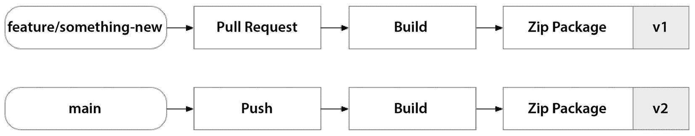

# 第十五章：在 Google Cloud 上实现无服务器计算 – 使用 Google Cloud Functions 构建解决方案

我们快要完成了！在本章中，我们将构建本书中将要构建的九个解决方案中的最后一个。我们即将关闭 Google Cloud 的大门——但只有在我们完成将应用程序迁移到无服务器架构的最后一步之后，就像我们在 AWS 和 Azure 上所做的那样。在前两章中，我们努力使用虚拟机和容器在 Google Cloud 上实现了解决方案。

我们花时间对比了三大云平台之间的工作方式，帮助我们理解它们之间的微妙差异，有时候甚至是那些不那么微妙的差异。

我们注意到，虽然我们的 Terraform 代码在不同的云平台之间发生了持续变化，但我们的应用程序代码和操作系统配置——无论是在 Packer 还是 Docker 中——并没有发生变化。当我们完成在 Google Cloud 上的最后一步时，我们将经历与当初将应用程序迁移到 AWS Lambda 和 Azure Functions 时类似的过程。我们将不得不完全重构应用程序代码。

本章涵盖以下主题：

+   奠定基础

+   设计解决方案

+   构建解决方案

+   自动化部署

# 奠定基础

我们经验丰富的团队刚刚完成了 Kubernetes 配置中最后一个 ConfigMap 的最终调整，接到了一通不那么意外的电话。看起来 Keyser 似乎又有了灵感，这次是在与 Larry Page 一起闲逛时。

在走过 Larry 的私人终端，前往他等待的个人波音 767 时，Keyser 和 Larry 讨论了 Keyser 的新业务。Larry 顺便提到，*“Keyser，你为什么要投资基础设施呢？现在大家都在做无服务器计算。专注于你的平台，让 Google Cloud 专注于如何* *扩展它。”*

*“尤里卡！”* Keyser 大叫道，嘴里塞了一些温暖的腰果后接着说道，*“哦天啊，Larry，你说得太对了！我需要立即让我的团队着手这个！我当时在想什么呢？我们没有时间做管道工作；我们需要快速行动，保持领先于* *竞争对手！”*

回到总部，团队正在适应这个激动人心却又突如其来的方向变化。现在，得益于 Keyser 大胆的新战略，他们正准备深入探索无服务器计算。这一转变不仅仅需要重新包装应用程序——他们必须完全重构代码！

# 设计解决方案

在本节中，我们将考虑解决方案的整体设计，考虑到从虚拟机和基于容器的架构转向无服务器架构的变化。正如我们在之前的转型中所见，无服务器的核心目标是从堆栈中去除繁重的基础设施。因此，我们将寻找替代方案，剔除任何需要显著固定成本的 Google Cloud 服务，例如**虚拟机**或**Kubernetes 集群**，并用无服务器选项替代。我们操作环境和技术架构的这种变化可能会让我们重新思考解决方案的一些方面，包括其设计、实现和部署策略：


图 15.1 – 自动驾驶平台的逻辑架构

尽管我们应用的架构没有发生显著变化，但我们将使用不同的 Google Cloud 服务来托管它。在这种情况下，我们将使用 Google Cloud Storage 来托管应用的前端，并使用 Google Cloud Functions 来托管应用的后端，如*图 15.2*所示：


图 15.2 – 我们仓库的源代码控制结构

在这个解决方案中，我们将有四部分代码库：用于配置环境的 Terraform 代码、执行部署过程的 GitHub Actions 代码，以及应用前端和后端的两部分代码库。

## 云架构

在*第十三章*中，我们的云托管解决方案是一组专用的虚拟机，而在*第十四章*中，它是我们 Kubernetes 集群节点池中的一组共享虚拟机。使用虚拟机会产生最大程度的沉没成本，无论它们是独立的虚拟机还是 Kubernetes 节点池的一部分。

在*第十四章*中，我们的整个解决方案是在容器上执行的，这些容器使前端和后端能够作为一组容器共存在同一虚拟机上。这节省了一些费用，但我们仍然需要服务器来托管工作负载。在这一章中，我们有一个新的目标：通过利用云原生服务来发挥云计算的优势，这些服务将底层基础设施从我们身上抽象出来，让我们真正只为我们使用的部分付费。Google Cloud 的无服务器服务将在这个过程中对我们至关重要。

### 前端

在前面的章节中，我们将前端托管在面向公众的服务器上，这些服务器返回组成我们 Web 应用的 HTML 和 JavaScript，我们仍然需要一个云托管的解决方案来托管文件并响应请求。

然而，由于网页应用在最终用户的浏览器中运行的特性，我们实际上不需要使用云托管的虚拟机来托管本质上是平面文件的内容。我们可以使用简单的云存储来托管前端作为静态网站，并依赖云平台来承担返回网页内容的工作。

我们可以在 Google Cloud 上使用 Google Cloud Storage 服务。该服务允许我们托管可以通过互联网访问的静态网页内容。正如我们在前几章中对 AWS 和 Azure 所做的那样，所有这些功能通过添加一个**存储桶**并启用其托管网页内容来实现。然而，与我们在 AWS 和 Azure 上处理的方式不同，我们需要添加自己的负载均衡器，以确保我们的网页应用正常运行，正如*图 15.3*所示：


图 15.3 – Google Cloud Storage 处理网页请求，而 Google Cloud Functions 处理 REST API 请求

正如我们在其他平台上看到的，我们将获得巨大的优势，因为 Google Cloud Storage 完全没有沉没成本。当你创建一个 Google Cloud Storage 存储桶时，每月的费用为零美元（$0）。像其他无服务器服务一样，它通过一系列微交易来衡量你的活动，并按你实际使用的量收费。在 Google Cloud Storage 中，这可能有些复杂，因为有几个衡量指标会产生费用。

*表 15.1* 显示了你在使用 Google Cloud Storage 托管静态网站时可能遇到的所有费用：

| **度量** | **单位** | **规模** | **价格** |
| --- | --- | --- | --- |
| 存储 | GB | 1,000 | $0.023 |
| 写入事务 | 事务 | 1,000 | $0.01 |
| 读取事务 | 事务 | 1,000 | $0.0004 |

表 15.1 – Google Cloud Storage 微交易定价

注意

在本文撰写时，所列出的价格适用于 Google Cloud 的西部美国 2 区域。到你阅读本文时，价格可能已经发生变化，因此最好查看最新价格以获取最准确的成本估算。

我列出这些价格是为了强调一个观点。我们可以在一个三节点的 Kubernetes 集群上托管一个静态网站，每月大约需要 $300，或者我们可以在 Google Cloud Storage 上托管一个静态网站，每月费用不到 $0.01，并且使用的是 Google Cloud 提供的最稳定的存储层。你会选择哪种方式？

### 后端

与我们的前端一样，在前几章中，我们的后端也托管在虚拟机上，采用两种不同的方式：专用虚拟机和在 Kubernetes 集群节点池中的共享虚拟机。

与我们的前端不同，我们的后端不能完全在最终用户的 Web 浏览器内以客户端方式运行。在后端，我们有需要在服务器上运行的自定义代码。因此，我们需要找到一种解决方案来托管这些组件，而不需要使用一整套虚拟机带来的额外开销。在 Google Cloud 上，我们可以使用 Google Cloud Functions 来实现这一点。Google Cloud Functions 是一种托管服务，允许你部署代码而无需支付任何基础虚拟机的沉没成本。像 Google Cloud Storage 一样，它有自己的微交易定价模型，根据你实际使用的量收费。

*表 15.2* 显示了将代码部署到 Google Cloud Functions 时可能产生的费用：

| **指标** | **单位** | **规模** | **价格** |
| --- | --- | --- | --- |
| 计算 | GHz/s | 1 | $0.00001 |
| 内存 | GB/s | 1 | $0.0000025 |
| 总执行次数 | 交易 | 1,000,000 | $0.40 |

表 15.2 – Google Cloud Functions 微交易定价

你可能首先注意到的是，像 Google Cloud Storage 一样，这些价格非常低，但它们衡量的是平台上非常小的一部分活动。

例如，**计算**和**内存**指标的单位对应于该资源每秒的度量单位。计算指标的单位是每秒 GHz，内存指标的单位是每秒 GB。这些度量单位使你能够在执行时灵活调整云函数可以访问的计算和内存资源量。由于它是以*每秒*为间隔进行度量的，因此你无需长时间运行 Google Cloud Functions，就能产生相当多的费用。*图 15.4* 展示了 Google Cloud Functions 将应用程序代码部署到 Google Cloud Storage：


图 15.4 – Google Cloud Functions 运行应用程序代码，该代码被部署到 Google Cloud Storage

以前，我们的 ASP.NET REST API 是通过传统的 ASP.NET 项目设置的，该项目使用控制器实现 REST API 端点。然而，在过渡到 Google Cloud Functions 时，这种解决方案结构与 Google Cloud Functions 框架不兼容。为了能够将我们的 REST API 托管为 Google Cloud Functions，我们需要遵循 Cloud Functions 所规定的框架。这意味着，ASP.NET 控制器类需要重构以符合这一标准。在下一节中，我们将深入探讨实现这一点的代码。

## 部署架构

现在我们已经对在 Google Cloud 上的解决方案的云架构有了清晰的了解，我们需要制定一个计划来配置环境并部署代码。

在*第十二章*中，当我们将应用程序部署到虚拟机时，我们使用 Packer 将编译后的应用程序代码打包成虚拟机镜像：


图 15.5 – 使用 Packer 构建的虚拟机镜像进行虚拟机部署过程

同样，在*第十三章*中，当我们将应用程序部署到 Kubernetes 集群上的容器时，我们使用 Docker 将应用程序代码打包成容器镜像：


图 15.6 – 使用 Docker 构建的容器镜像进行 Kubernetes 部署过程

使用无服务器架构时，情况完全改变，因为 Google Cloud 的无服务器服务抽象化了操作系统。这意味着我们需要负责的仅仅是生成兼容的部署包。

### 创建部署包

如前一节所述，我们的应用程序有两个组件：前端和后端。它们有不同的部署目标。对于前端，我们将作为静态网站进行部署，而后端将作为 Google Cloud 函数进行部署。由于这两者都是.NET 项目，我们将使用.NET 和 Google Cloud 平台特定的工具来创建部署包并将其部署到目标 Google Cloud 服务。下图展示了我们为配置环境、打包应用程序代码并将其部署到 Google Cloud 目标环境的整个过程：


图 15.7 – 构建我们的.NET 应用程序代码并部署到 Google Cloud 的部署管道

对于前端，这意味着启用将我们的 ASP.NET Blazor Web 应用程序部署为 WebAssembly 的功能。这将允许前端作为静态网站托管，完全在客户端运行，而无需任何服务器端渲染。之所以能够实现这一点，是因为我们设计前端 Web 应用程序的方式，它使用 HTML、CSS 和 JavaScript 与服务器端 REST API 进行交互。需要注意的是，ASP.NET Blazor 支持两种托管选项，但我们特别选择了仅客户端路径，并消除了对服务器端页面渲染的任何依赖。因此，当我们使用.NET CLI 发布我们的 ASP.NET Blazor 项目时，它将生成一个包含静态 Web 内容的文件夹。然后，使用 Google Cloud CLI，我们可以将该文件夹的内容上传到我们的 Google Cloud Storage 桶中以完成部署，如*图 15.8*所示：


图 15.8 – 使用自定义构建部署包部署 Google Cloud Functions 的过程

对于后端，与 AWS 和 Azure 不同，Google Cloud 上的应用代码不应该被编译，因为它需要由 Google Cloud Functions 处理。这意味着需要上传实际的源代码文件，而不是以前我们做过的已编译的构件。因此，我们必须将源代码文件夹压缩为 ZIP 归档文件。另一个主要的不同之处在于，Google Cloud 的 Terraform 提供程序要求此 ZIP 归档文件由 Terraform 上传：



图 15.9 – GitFlow 流程创建新的版本化构件

这个过程将与*第六章*中讨论的 GitFlow 流程很好地结合。在我们开发每一个新特性时，我们将打开一个新的特性分支，当我们准备好将更新合并到主要工作中时，我们将提交一个拉取请求：


图 15.10 – GitFlow 流程创建新的版本化构件

这个拉取请求将触发 GitHub Actions，运行内置的质量检查，检查我们的应用代码，并运行`terraform plan`来评估对我们长期运行环境的影响。在代码合并之前，我们可以进行任意数量的测试，这有助于验证我们的更新——无论是应用代码还是基础设施代码——都不会对目标环境产生负面影响。一旦我们的拉取请求被批准并合并，它将触发额外的 GitHub Actions，应用更改到目标环境。

现在我们已经有了一个完善的计划，来实现使用 Google Cloud Platform 的云架构和使用 GitHub Actions 的部署架构，让我们开始构建吧！在下一节中，我们将分解我们用来实现 Terraform 的**HashiCorp 配置语言**（**HCL**）代码，并查看我们需要对应用代码进行的更改，以便通过 Google Cloud Functions 使我们的应用程序上线。

# 构建解决方案

现在我们已经有了一个坚实的解决方案设计，我们可以开始构建它。正如我们在前一节中讨论的，因为我们将使用 Google Cloud 的无服务器服务（如 Google Cloud Storage 和 Google Cloud Functions）来托管我们的应用，因此我们需要对应用代码做一些更改。这是我们在*第十三章*和*第十四章*中从未遇到过的事情，因为我们曾通过将应用打包成虚拟机镜像（使用 Packer）或容器镜像（使用 Docker）来部署我们的应用到云中。因此，为了构建我们的解决方案，我们需要编写一些 Terraform 代码，并对我们的应用代码进行 C#更新。

## Terraform

如我们在设计中讨论的那样，我们的解决方案包括两个应用组件：前端和后端。每个组件都有自己的应用代码库需要部署。不同于之前的章节，我们不再需要操作系统配置，因为现在我们正在使用无服务器服务，平台会替我们处理这部分：


图 15.11 – 谷歌云函数资源结构

大部分的 Terraform 设置与之前的章节非常相似，因此我们只关注解决方案所需的新资源。如果您希望使用完整的解决方案，请查看本书的完整源代码，这些代码可以在 GitHub 上找到。

### 前端

正如我们在之前的章节中看到的，在使用谷歌云时，我们需要激活所需的谷歌 API 来为新项目提供资源。对于前端，我们主要将使用谷歌云存储，但我们还需要 `compute.googleapis.com` API。

首先，我们需要为前端部署一个谷歌云存储桶。但是，我们需要使用一个名为 `website` 的可选块来不同配置我们的谷歌云存储桶，以启用静态网站功能：

```
resource "google_storage_bucket" "frontend" {
  project  = google_project.main.project_id
  name     = "${var.application_name}-${var.environment_name}-frontend-${random_string.project_id.result}"
  location = "US"
  website {
    main_page_suffix = "index.html"
    not_found_page   = "404.html"
  }
  cors {
    origin          = ["*"]
    method          = ["GET", "HEAD"]
    response_header = ["Authorization", "Content-Type"]
    max_age_seconds = 3600
  }
}
```

为了允许匿名的互联网流量访问存储桶中存储的内容，我们需要与身份和访问管理服务设置绑定。这将授予 `allUsers` 访问权限以查看存储桶内的对象：

```
resource "google_storage_bucket_iam_binding" "frontend" {
  bucket = google_storage_bucket.frontend.name
  role   = "roles/storage.objectViewer"
  members = [
    "allUsers"
  ]
}
```

在之前的章节中，我们已经设置了谷歌云负载均衡，该负载均衡器作为前端并允许配置多种不同类型的后端：


图 15.12 – 谷歌云负载均衡将流量路由到托管在谷歌云存储上的前端

在这种情况下，负载均衡器的后端变得非常简单；它只是一个谷歌云存储桶：

```
resource "google_compute_backend_bucket" "frontend" {
  project = google_project.main.project_id
  name        = "${var.application_name}-${var.environment_name}-frontend-${random_string.project_id.result}"
  bucket_name = google_storage_bucket.frontend.name
  enable_cdn  = true
}
```

谷歌云存储桶需要设置为负载均衡器的后端，这将允许流量路由到适当的位置。

### 后端

我们的后端将托管在谷歌云函数上，因此我们需要启用 `logging.googleapis.com`，以便从谷歌云控制台访问谷歌云函数的遥测数据。

正如我们在前一节讨论的那样，谷歌云函数要求我们上传源代码，而不是编译后的工件；这是由于谷歌云函数处理我们应用程序包装的方式所造成的。因此，这创建了对 `cloudbuild.googleapis.com` 的依赖，谷歌云函数使用它来基于我们上传的源代码创建打包工件。

为了使我们的 Google Cloud Functions 执行，我们需要两个额外的 Google API：Cloud Run API（即 `run.googleapis.com`）和 Cloud Functions API（即 `cloudfunctions.googleapis.com`）。Google Cloud Functions 是建立在 Cloud Run API 之上的一层，提供了额外的抽象层和更多功能来创建事件驱动的工作流，而 Cloud Run API 提供了一个基础服务来运行无状态容器，这些容器可以通过 HTTP 请求进行调用。

Google Cloud Functions 拥有相对简单的部署模型。像 AWS Lambda 一样，您必须声明一个资源来为函数本身提供支持。该资源有两个主要的配置组件——构建配置和服务配置——如下所示：

```
resource "google_cloudfunctions2_function" "backend" {
  project  = google_project.main.project_id
  name = "func-${var.application_name}-${var.environment_name}-backend-${random_string.project_id.result}"
  location = var.primary_region
  description = "a new function"
}
```

构建配置控制执行运行时的类型（例如，Python、Java 或 .NET）、应用程序代码中的入口点，以及可以找到应用程序代码的存储位置：

```
  build_config {
    runtime     = "dotnet6"
    entry_point = "FleetAPI.Function"
    source {
      storage_source {
        bucket = google_storage_bucket.backend.name
        object = google_storage_bucket_object.deployment.name
      }
    }
  }
```

服务配置控制云函数在被调用时可以访问多少资源。因此，这个配置也是成本的主要驱动因素：

```
  service_config {
    max_instance_count = 1
    available_memory   = "256M"
    timeout_seconds    = 60
  }
```

服务配置块还允许你设置环境变量，供云函数用来传递非敏感的配置设置：

```
  service_config {
    ...
    environment_variables = {
        SERVICE_CONFIG_TEST = "config_test"
    }
  }
```

### 密钥管理

正如我们在前几章看到的，我们只有在启用了 `secretmanager.googleapis.com` API 后，才能使用 Google Cloud Secrets Manager 配置密钥。

首先，我们需要定义一个带有唯一密钥标识符的密钥，以便我们可以从应用代码中查找密钥的值。如果我们正在构建多区域部署，我们还可以设置希望将此密钥复制到的区域：

```
resource "google_secret_manager_secret" "sauce" {
  secret_id = "sauce"
  replication {
    user_managed {
      replicas {
        location = var.primary_region
      }
    }
  }
}
```

正如我们在前面章节中看到的 `aws` 提供程序，密钥只是一个占位符，一种查找密钥值的独特方式。我们需要创建密钥的版本来存储实际的密钥值：

```
resource "google_secret_manager_secret_version" "sauce" {
  secret = google_secret_manager_secret.secret.name
  secret_data = "secret"
  enabled = true
}
```

在配置好密钥和密钥版本后，我们可以从 Google Cloud Functions 中访问它。注入密钥到云函数中有两种方法；第一种是使用环境变量：

```
    secret_environment_variables {
      key        = "sauce"
      project_id = google_project.main.project_id
      secret     = google_secret_manager_secret.sauce.secret_id
      version    = "latest"
    }
```

前面的代码演示了我们如何将一个密钥添加到云函数的服务配置块中，利用密钥的标识符将存储在 Google Secret Manager 中的密钥注入到云函数中。

第二种方法可能更安全，因为它避免了将密钥暴露在进程的环境中：

```
    secret_volumes {
      mount_path = "/etc/secrets"
      project_id = google_project.main.project_id
      secret     = google_secret_manager_secret.secret.secret_id
    }
```

前面的代码演示了如何在文件系统中设置挂载点，并使用密钥的标识符将密钥值存放在那里。

## 应用程序代码

Google Cloud Functions 天生是基于事件的。每个云函数都由来自多种 Google Cloud 服务的不同类型事件触发。为了本书的目的，我们将仅关注 HTTP 触发器，但如果你有兴趣，我建议你查看 Google Cloud Functions 提供的所有其他选项——它们非常广泛：


图 15.13 – ASP.NET MVC 控制器类结构

在传统的 ASP.NET REST API 解决方案中，你会有控制器类，它代表一个特定的路由，然后方法在该路由上实现不同的操作。控制器类需要用 `ApiController` 属性修饰，以告知 ASP.NET 运行时该类应该用于处理指定 `Route` 属性中路由的传入 Web 请求。

每个方法都用一个属性修饰，表示该方法应该响应哪种 HTTP 动词。在前面的示例中，我们使用 `HttpGet`，但也有对应的属性用于每个支持的 HTTP 动词。方法可以接收强类型参数，这些参数可以是路由的一部分、查询字符串的一部分或请求体的一部分。方法默认返回 `IActionResult`，这使我们能够根据请求的结果返回不同的数据结构。

为了使用 Azure Functions 实现一个 REST API，我们需要使用 Azure Function SDK 来实现一个类。这要求我们稍微调整实现类和方法的方式。我们将采用不同的类和方法属性，以便实现类似的结果，定义一个端点，在特定路由下响应 Web 请求：


图 15.14 – Google Cloud Functions 类结构

Google Cloud Functions 有一个非常简单的集成底层云服务驱动运行时的方法。唯一的要求是实现 `IHttpFunction` 接口。该接口只有一个要求，即实现一个名为 `HandleAsync` 的方法，该方法以 `HttpContext` 对象作为唯一参数。没有返回对象。因此，我们唯一能响应客户端的方式是通过向可以从 `HttpContext` 对象访问的响应对象写入数据。

如我们所见，云架构大大简化了，但一个权衡是我们的后端代码需要适应 Google Cloud Functions 框架。这将需要开发和测试工作，以便将我们的代码库转变为这种新的托管模型。这与我们在前几章中探索的内容形成鲜明对比，前几章我们是在虚拟机上托管，或将应用容器化并托管在 Kubernetes 集群上。虽然遵循 Google Cloud Functions 模型确实需要付出一些努力，但它的好处是双重的。首先，它让我们能够利用几乎为零的沉没成本；其次，它使我们能够完全抽象掉底层基础设施，由 Google Cloud Platform 负责可扩展性和高可用性。这使我们可以更多地专注于解决方案的功能性，而不是管理底层基础设施的繁杂工作。

现在，我们已经实现了 Terraform 来配置我们的解决方案，并修改了应用程序代码以使其符合 Google Cloud Functions 框架。在下一节中，我们将深入探讨 YAML 和 Bash，并实现 GitHub Actions 工作流。

# 自动化部署

正如我们在前一节中讨论的那样，像 Google Cloud Functions 和 Google Cloud Storage 这样的无服务器产品抽象了操作系统配置。因此，当我们进行部署时，只需要一个与目标平台兼容的应用程序包。在本节中，我们将使用 GitHub Actions 创建一个自动化管道，将我们的应用程序部署到 Google Cloud 的全新无服务器环境中。

## Terraform

我们需要做的第一件事是将我们的环境配置到 Google Cloud。这将与我们在前几章中做的非常相似。在*第十三章*中，我们需要确保在执行 Terraform 之前，我们的虚拟机镜像已经构建并可用，因为 Terraform 代码基在配置虚拟机时引用了这些虚拟机镜像。这意味着，采用虚拟机架构时，应用程序部署发生在 Terraform 配置环境之前，如*图 15.15*所示：


图 15.15 – Packer 生成的虚拟机镜像是 Terraform 的先决条件

在*第十四章*中，我们使用**Google Kubernetes Engine** (**GKE**)来配置我们的 Kubernetes 集群，且没有这样的先决条件。实际上，应用程序部署是在 Kubernetes 集群上线后进行的。这意味着，采用基于容器的架构时，应用程序部署是在 Terraform 配置环境后进行的：


图 15.16 – Docker 生成的容器镜像在 Terraform 执行后被配置到 Kubernetes

当使用 Google Cloud 的无服务器产品时，部署过程被拆分。虽然我们的应用程序的前端和后端都需要创建部署包，但它们的部署方式是不同的。对于前端，像在其他平台一样，我们只是生成静态网页内容。然而，针对后端，由于 Google Cloud Functions 在打包和部署方面的独特方法，我们需要生成一个包含应用程序源代码的 ZIP 归档文件。这些工件与 Docker 镜像的用途相似，它们是符合目标服务的应用程序打包方式，以便部署，如*图 15.17*所示：


图 15.17 – 包含源代码的 ZIP 存档作为部署文件，在 Terraform 执行时被部署到 Google Cloud

如你所见，后端部署与基于虚拟机架构的方法非常相似。Terraform 代码引用打包好的部署文件，并负责将其部署到它所配置的 Google Cloud Functions 中。

## 部署

既然 Terraform 已经为我们的无服务器解决方案配置好了所需的 Google Cloud 基础设施，接下来我们需要完成最后一步，将部署文件部署到 Google Cloud 的适当位置。

我们将使用 .NET 和 Google Cloud 自定义工具生成部署文件并部署前端。然而，后端将由 Terraform 配置。

### 前端

正如我们在其他章节中所见，我们的 .NET 应用程序代码需要遵循持续集成过程，在该过程中代码会通过自动化单元测试和其他内建的质量控制进行构建和测试。这里没有变化，唯一的不同是我们需要对这些流程生成的部署文件进行一些特别处理，以确保它能够供负责将工作负载部署到适当位置的 GitHub Actions 作业使用：

```
      - name: Upload to Google Cloud Storage Bucket
        working-directory: ${{ env.DOTNET_WORKING_DIRECTORY }}/upload-staging
        run: |
          gsutil -o Credentials:gs_service_key_file=../gcp-terraform.json -m cp -r . gs://${{ needs.terraform.outputs.frontend_bucket_name }}
```

我们需要确保与 Google Cloud 进行身份验证，并将目标设置为正确的 Google Cloud 项目以及正确的 Google Cloud Storage 存储桶。我们使用的 Google Cloud 命令行工具叫做 `gsutil`。它可以通过多种方式进行配置以获取凭证，但最安全的做法是指定 Google Cloud 凭证文件的路径。我们可以使用 GitHub Actions 密钥生成一个文件，然后在调用 `gsutil` 时引用该文件。完成后，我们可以执行 `gsutil` 来递归上传暂存目录中的所有文件。

### 后端

为了部署 Google Cloud function，我们需要修改我们的 Terraform 配置，以便为要上传的 ZIP 存档指定位置，并指定包含应用程序源代码的 ZIP 存档：

```
resource "google_storage_bucket" "backend" {
  project  = google_project.main.project_id
  name     = "${var.application_name}-${var.environment_name}-backend-${random_string.project_id.result}"
  location = "US"
}
```

在 Google Cloud Storage 存储桶配置完成后，我们必须上传部署包：

```
resource "google_storage_bucket_object" "deployment" {
  name   = "deployment.zip"
  bucket = google_storage_bucket.backend.name
  source = "deployment.zip"
}
```

上述代码将引用 Terraform 根目录中的 `deployment.zip` 文件，并将其上传到 Google Cloud Storage 存储桶。

就这样！现在，我们的应用程序已经完全部署到 Google Cloud Functions！

# 总结

在本章中，我们设计、构建并自动化了一个完整的端到端解决方案，使用了基于 Google Cloud Functions 的无服务器架构。为了实现这一目标，我们最终不得不对应用程序代码进行一些重大更改，以符合无服务器运行时的要求。在采用无服务器产品时，必须做出这个明确且重要的决定，因为它将你的应用程序代码与目标云平台紧密耦合。

在我们结束本章以及以 Google Cloud 为中心的叙述时，我们已经成功地在三个不同的云平台上实现了云架构——**亚马逊 Web 服务**（**AWS**）、微软 Azure 和 Google Cloud Platform。

在与神秘的 CEO Keyser Söze 一起的旅程中，我们看到许多从一个云平台到另一个云平台的相似之处，但我们也看到各云平台之间的显著差异，从小的命名约定差异、设计和实现变动，到整个云平台分类法中的大规模结构性变化。除了探索这三个云平台外，我们还见证了许多组织在云迁移过程中所面临的挑战——是坚持使用他们熟悉的技术，还是跳入新功能和服务，这些新服务虽然面临学习曲线带来的挑战，但也为简化运营并更好地利用公共云的规模经济提供了潜在的机会。

在下一章，我们将转换话题，探讨当我们不是从零开始，而是尝试将现有环境和架构适配到基础设施即代码（Infrastructure-as-Code）世界时所面临的独特挑战。

# 第六部分：第 2 天操作及以后

在本部分中，我们将探讨使用 Terraform 时，操作现有环境时的挑战和常见陷阱，既包括导入最初通过 Terraform 之外的方式创建的现有环境，也包括使用 Terraform 长期管理环境。

本部分包括以下章节：

+   *第十六章*，*已经部署？导入现有环境的策略*

+   *第十七章*，*使用 Terraform 管理生产环境*

+   *第十八章*，*展望未来——认证、 emerging trends 和下一步*
