# 第十七章：使用 Terraform 管理生产环境

本书的核心内容是使用 Terraform 来管理你的环境，因为这可能是我们解决方案基础设施中最重要的操作方面：管理它。常常情况下，基础设施即代码被当作一种权宜之计，将系统扩展并快速部署到云端，却未考虑到第二天以及之后的日常运维。

这种 *第 1 天运维* 思维方式很常见，尽管从心理学角度来看可以理解，但从事基础设施即代码的人天生是建设者。我们热衷于构建新事物，并不断寻求改进的方式。但我认为，基础设施即代码解决方案中最重要（且常被忽视）的设计考量之一，不是可扩展性、性能、安全性，甚至是高可用性——而是可操作性。

我们能否在没有宕机或延迟的情况下有效地操作我们的环境，避免影响环境健康，最终影响我们对客户的承诺？如果答案是否定的，那么我们作为基础设施即代码开发者、云工程师和云架构师就失败了。

在本章中，我们将探讨如何将基础设施即代码与通过 Terraform 实现的流程和技术相结合，以达成这些目标。

本章涵盖以下主题：

+   操作模型

+   应用变更

+   故障修复

# 操作模型

在本节中，我们将深入探讨适合使用 Terraform 来配置和管理基础设施的团队和组织的不同操作模型。让我们从 Terraform 操作的基础开始：**状态管理**。接着，我们将探索团队如何将 Terraform 融入其操作模型中。根据团队在组织中的角色以及他们所管理的云基础设施，团队的动态可能会有所不同。这也可能影响他们与其他不使用 Terraform 的组织部分之间的合作方式。

## 状态管理

在开始使用 Terraform 管理长期运行的环境时，无论是用于开发、测试，还是实际的生产工作负载，操作模型的基础性变化是引入了**Terraform 状态**。我们在本书的 *第一章* 中讨论过 Terraform 状态，深入分析了 Terraform 的架构，因此我们已经知道它作为环境状态判定标准的价值，但创建状态并管理它是使用 Terraform 管理环境时日常操作的一部分。

### 拒绝手动状态操作

如我们所述，Terraform 状态文件本质上只是包含在上次 Terraform Apply 中创建的资源清单的 JSON 文本文件。你可能会想通过打开它并手动修改内容来操作状态文件。然而，这是不建议的做法。Terraform CLI 提供了许多命令，能够安全地执行状态操作，而 HashiCorp 甚至开始积极推广 HashiCorp 配置语言（HCL）功能，以便通过代码本身进行状态操作，而不是让管理员通过 CLI 进行手动操作。除了从命令式方法转向声明式方法外，它还为模块作者提供了额外的好处，使版本升级路径更加顺畅，构建了安全的更新方式，无需进行成本高昂的蓝绿部署或实施会演变为长期问题的短期*修复*。

### 访问控制

由于 Terraform 本身具备可扩展的特性，作为一个能够通过其提供者插件适应每个目标平台的基础设施即代码工具，它还通过使用的后端提供者来适应目标平台。默认情况下，Terraform 使用本地文件系统来存储状态，但在管理长期存在的环境时，显然不会使用这一方式。如我们所讨论的，当我们在本书中涉及的三大云平台上实现解决方案时，我们使用了不同的后端提供者，在相应的云平台上存储状态。

在 AWS 中，我们使用了 `s3` 后端，它将我们的状态存储在 AWS 的 `azurerm` 后端上，而在 Google Cloud Platform 中，当我们使用 `gcs` 后端时，Terraform 会将状态文件存储在各自云平台的相应存储服务中。像 AWS 一样，其他云平台也实现了类似的访问控制，以防止未经授权的访问。在 Azure 中，这种访问控制表现为在资源组或订阅级别指定的 Azure **基于角色的访问控制**（**RBAC**）。在 Google Cloud 中，这种控制则表现为在项目级别驱动的访问控制列表。

### 加密

除了可以应用于托管 Terraform 状态文件的云服务的基于身份的访问控制外，我们还可以利用这些服务的内建功能，采用不同层级的加密。最简单的加密方式是内建的透明数据加密，它可以保护我们免受云服务提供商的物理数据泄漏攻击。这是一种不错的保险，但它也是比较不太可能的攻击途径。

更有可能导致我们的 Terraform 状态文件暴露的方式是，如果我们的身份和访问管理控制存在漏洞。为数据增加额外安全层的一种方法是利用存储服务本身的加密功能。当你这样做时，访问文件本身不再足够，你还需要访问加密密钥本身。

在 AWS 上，这通过使用 AWS **密钥管理服务**（**KMS**）来实现，该服务允许你创建和管理自己的密钥，用于加密 Terraform 状态文件。类似的功能在 Azure 和 Google Cloud 上也存在。在 Azure 上，你将使用在 Azure 密钥保管库中创建的客户管理密钥，而在 Google 上，你将采用相同的方法，但当然使用等效的 Google Cloud 服务，称为 Google Cloud KMS。如果你希望采用一个与云平台无关的方法，你可以利用多云密钥管理解决方案，例如 HashiCorp Vault。

### 备份

在上一章中，我们探讨了如何将现有环境导入到 Terraform，并看到即使有内置工具来执行此操作，仍然可能会繁琐且容易出错。不幸的是，唯一将你的环境保持在“由 Terraform 管理”的分类中的东西就是状态文件。如果你丢失了状态文件，或者文件损坏或与实际环境完全不同，那么你原本由 Terraform 配置的干净环境很容易变成一个孤立环境，变得不再由 Terraform 管理，你需要考虑是否需要重新导入或重新配置。

不要让这种情况发生！你应该保持状态文件的备份。我们查看的绝大多数 Terraform 后端都支持以几种不同的方式开箱即用地进行备份。首先，它通过启用版本控制来实现这一点，这样你就可以在存储服务本身内拥有一个版本化的状态文件历史。这是一种非常方便且具成本效益的方法，帮助你解决一些小问题，例如人为错误或暂时的部署失败。

然而，你还应考虑更高级的跨区域复制功能，来帮助你应对更大范围的故障。Terraform 状态暂时下线或不可用并不会影响你的解决方案的可用性，但它会影响你在故障发生时对环境的控制能力。因此，思考如何实现跨区域复制和备份策略，以确保覆盖所有可能的场景是非常重要的。

### 组织

你可以控制的最简单的事情之一就是 Terraform 工作空间的存储位置。如果你正确地划分了 Terraform 工作空间，并在云平台提供的安全边界内工作，那么保护状态文件并不需要太多复杂的手段。

在 AWS 上，你可能希望创建更多的 S3 存储桶，并将这些存储桶放入不同的 AWS 账户中，以确保不会因为过于宽松的 IAM 策略而发生机密泄露。

同样，在 Azure 上，你可以创建更多的存储帐户，并将这些帐户放置在 Azure 订阅中，以便更有效地通过隔离它们来避免过于宽松的订阅级别权限。

在 Google Cloud 上，要仔细考虑将 Google Cloud Storage 服务部署到哪个项目中，并选择一个隔离的项目来存储 Terraform 状态。这将确保应用程序及其管理员不必访问 Terraform 状态文件中的机密信息。

## 独立应用程序

在本书的大部分时间里，我们一直作为一个小团队，在神秘的亿万富翁凯泽·索泽的公司构建下一代车队运营平台。在这些场景中，我们跨多个云工作，并在整个过程中使用三种不同的云计算范式来实现我们的解决方案：

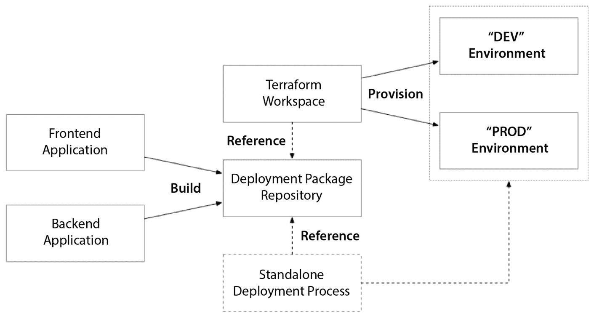

图 17.1 – 小团队部署独立应用程序的操作模型

在这种情况下，我们看到一个应用程序开发团队正在开发一个典型的 N 层架构应用程序。这个团队大约有 6-8 人，他们是软件开发人员或软件测试人员。最终目标不是提供基础设施，而是为团队正在开发的应用软件提供发布过程的支持。

在这些类型的团队中，应用程序代码和基础设施即代码通常会保存在同一个源代码库中。这种简单的做法承认了基础设施和应用程序之间的自然依赖关系，源自部署过程。基础设施即代码会提供已知的密钥，但在应用程序初始化时会被引用。将这一切保存在我们的源代码库中，可以让我们最小化在单个功能分支、拉取请求中进行更改并最终合并到`main`分支时，跨基础设施和应用程序代码库的变化机制。

我们有一个单一的 Terraform 根模块，用于部署我们的环境，并且我们更改输入变量以适当配置它，以适应不同环境实例的需求：`DEV` 和 `PROD`。这使得我们能够通过简单地更改工作区，来管理多个环境，方法是使用 `terraform workspace` 命令，或者通过更改我们用来在后端中划分工作区的后端键。

我们构建并部署的解决方案是一个端到端的解决方案，包含多个架构组件，构成了整个应用程序——在本例中，是一个具有网页前端和 REST API 后端的应用程序，这并不罕见。由于我们的解决方案非常简单，我们能够以完全自包含的方式运行。在更大的团队和更大的环境中，尤其是在企业中，情况并不总是如此——稍后我们会看到。

在我们*第七章*至*第十五章*的解决方案开发过程中，我们并没有真正讨论如何在生产环境中管理这些环境。在正常的产品开发过程中，我们需要为各种目的配置多个环境，并在这些环境中管理我们的发布生命周期，直到我们最终通过将产品部署到生产环境中来发布产品。

正如我们在这个过程中所看到的，除了云平台之间那些细微的，甚至有时并不那么细微的差异外，根据云计算范式的不同，我们会使用不同的媒介来打包我们的应用部署，这有时使我们能够通过引用虚拟机镜像或容器镜像将部署产物集成到我们的 Terraform 配置中；但有时，如在无服务器情况下，我们不得不实现一个额外的独立部署过程，该过程将在 Terraform 配置完我们的环境后执行。

## 共享基础设施

与我们跟随的应用开发团队不同，这些工程团队并不编写应用代码，但它们仍然是 Terraform 的重度用户。这些团队管理着一个组织的共享基础设施。这些团队可能由传统的基础设施工程师组成，他们之前可能管理过本地虚拟化环境、网络安全或其他类似的 IT 基础设施领域。根据组织的规模，这可能是一个庞大的工作，涉及多个团队和组织，每个团队和组织都有自己负责的范围和职责，或者这可能是一个单一的团队：

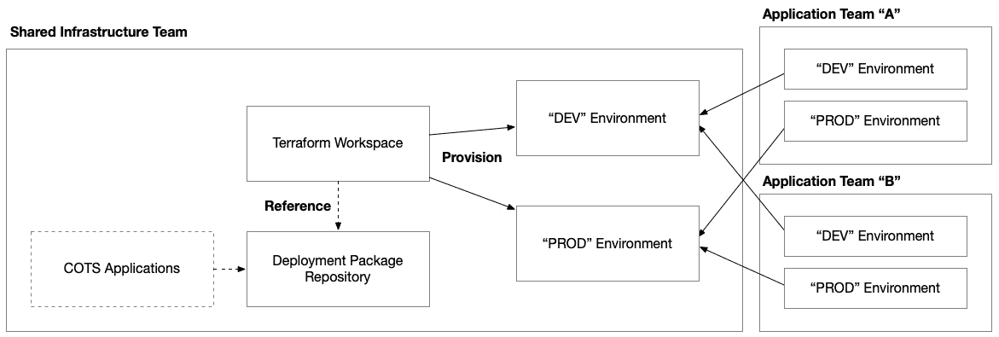

图 17.2 – 用于部署支持组织内一个或多个应用团队的基础设施的共享基础设施团队操作模型

这种操作模型与简单的独立应用开发项目不同，因为该团队与组织中的其他团队之间存在一些固有的依赖关系。这些外部团队在没有承诺任何符合共享基础设施团队操作模型的模式下，拉取它们的依赖关系。因此，这些团队可能并未使用 Terraform 或任何自动化工具。

他们正在管理的环境可能是共享网络、集中监控和日志记录、数据库、数据湖、数据仓库，甚至是共享计算池，例如 Kubernetes 集群。在大多数情况下，他们不会有自己的应用程序代码，但通常会有自己的部署包——无论这些包是他们自己创建的虚拟机还是容器镜像，还是软件供应商通过商业或开源关系提供给他们的第三方**商业外包**（**COTS**）软件包。

在大型组织中，虚拟机和容器镜像仓库本身通常作为共享基础设施由平台团队构建和管理，以便在整个组织中重复使用。

这些工作负载可能也会有多个环境，但可能没有应用开发团队那么多，并且可能选择仅通过非生产/生产维度来划分环境。这种方法可以最大程度地为非生产工作负载重复使用，并减少了为依赖团队可能有的每个用例进一步分割共享基础设施的开销。

由于缺少应用程序代码，部署过程变得简化，但共享基础设施团队应仔细考虑如何组织他们的 Terraform 工作区，以最小化外部团队之间的摩擦，这些团队对他们有依赖。这是爆炸半径在设计和将共享基础设施工作负载分割成离散和可管理的 Terraform 工作区中起重要作用的地方。

## 共享服务

最后，最复杂的操作模型是**共享服务**。在这种场景中，我们结合了独立应用和共享基础设施的各个方面。共享服务不仅具有它们需要构建和部署的应用程序代码库，还有组织内其他团队对它们的依赖。然而，与共享基础设施团队不同的是，这些依赖可能在应用接口层上，嵌入在两个系统用于互操作性的基于消息的协议中。共享服务团队很可能由负责维护一种（或多种）微服务组合中的服务的开发人员和测试人员组成：

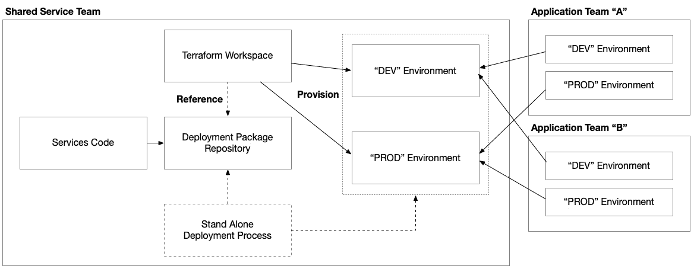

图 17.3 – 共享服务团队

共享服务团队在大型组织中很常见，因此，他们通常在一个环境中运作，可能会依赖组织内其他共享服务和共享基础设施团队的服务。这有助于减少共享服务团队的责任范围，因为他们可以将一些责任交给负责底层基础设施的共享基础设施团队，比如广域网、安全性、日志记录和监控，以及更高层次的基础设施，如 Kubernetes，甚至是共享 Kafka 或 Cassandra 集群。

尽管这种责任的分配有助于将共享服务团队的精力集中于其服务的开发和维护，但它也创造了额外的协调工作，需要同步变更和发布流程，以及下游和上游服务之间的版本兼容性。

现在我们已经了解了几种使用 Terraform 管理现有环境的不同操作模型，我们将深入探讨在管理环境时需要执行的一些常见操作。无论你的团队是什么样子，或者你用 Terraform 管理的是哪种工作负载，这些场景都是不可避免的！

# 应用变更

当我们管理一个长期存在的环境时，最终我们不得不对这个环境进行更改——无论是大是小。变化是不可避免的。这可能是与我们解决方案本身相关的变更，也可能是由于工具和底层平台本身的升级所需的变更。变化可以是预期的——比如计划中的发布——也可以是意外的——比如区域或区域性的故障。在本节中，我们将探讨经常发生在我们环境中的各种类型的变更，并讨论在使用 Terraform 管理环境时我们应该如何最好地处理它们。

## 修补

在使用 Terraform 时，我们的代码中有多个地方需要我们明确决定使用哪些版本的组件。这些地方包括 Terraform 可执行文件的版本，以及你在配置中使用的提供程序和模块。

### 升级 Terraform 可执行文件

我们首先需要考虑的是我们想要使用哪个版本的 Terraform。这可能让你感到惊讶——我意思是，为什么你不总是想使用最新最好的 Terraform 版本呢？然而，当你管理现有系统时，升级你所使用的 Terraform 版本有一些非常重要的原因，应该谨慎对待。

你使用的 Terraform 版本可能会影响你所使用的提供程序版本是否受支持，这可能会导致级联的升级需求，迫使你在代码库中进行比最初计划更多的更改。

虽然 Terraform 的新版本常常带来令人兴奋的新特性、功能和 bug 修复，但它们也可能带来弃用和向后不兼容的变更。这是 HashiCorp 一直做得很好的事情，他们通过最小化变更的影响来管理这些问题，但它仍然是需要关注的事情，因为偶尔会发生。Terraform 版本对操作有重大影响的最新例子是 Terraform 的版本 `0.12`。在这种情况下，如果你使用的是 `aws` 提供商，且升级到 Terraform 版本 `0.12`，你将需要升级到 `aws` 提供商的版本 `2.20.0`。

Terraform 的版本通常会在根模块和可重用模块的 `required_versions` 块中引用。因此，你还应该评估升级对你 Terraform 管理环境的影响，以及任何你所引用的模块。

## 升级提供商

像 Terraform 本身一样，我们用来为各种云平台和其他平台配置资源的每个提供商也有自己的版本。这使得我们在升级 Terraform 时遇到的问题更加复杂，因为我们需要在每个使用的提供商中进行升级。然而，大多数 Terraform 部署只使用一个云平台的提供商，但可能还包括其他针对不同控制平面的提供商。

云平台特别有问题，因为它们发展迅速且覆盖面广。例如，AWS、Azure 和 Google Cloud 的资源提供商分别有超过 700、600 和 400 种不同的资源类型！现在，你可能不会在某个 Terraform 解决方案中使用所有这些资源类型，但由于每个提供商提供了这么多不同的资源类型，任何一个服务添加新特性时，都可能带来变更。因此，它们经常变化，提供商的新版本每周发布，甚至有时更频繁！

在升级提供商的版本时，最好有目的性地进行。虽然你不一定要遵循提供商的每周发布节奏，但最好不要让提供商的版本停滞不前，因为这样会不断积累技术债务，直到变成紧急情况。紧急情况可能会以两种方式出现。首先，你可能会在配置中使用被弃用的资源、块或属性，这些内容最终会被移除支持。其次，你可能想利用你正在使用的某个资源的新特性或功能，但在当前版本中不被支持。

## 升级模块

模块是另一个需要考虑版本的地方。当你从 Terraform 注册表引用一个模块时，你需要明确设置你想使用的版本。如果你使用的是存储在其他、不太结构化的位置的模块，比如 Git 仓库，你应该小心地使用特定的标签来引用它们。

升级模块版本的影响，就像提供程序中的每个资源类型一样，取决于模块新版本中的破坏性更改——或者没有破坏性更改。有时，模块在版本之间可能会发生巨大的变化，这可能会对这些模块的消费者产生显著的负面影响，尤其是当他们天真地升级时，认为一切都会正常工作。

对于模块来说，Terraform Plan 通常足以检测是否引入了重大变化，但当提供程序和模块版本更改重叠时，执行测试部署来验证升级通常是个好主意。这对于任何你试图引入环境中的更改都适用。

## 重构

随着我们开发更高级的配置，通常会发现我们模块中的一些组件——无论是根模块还是可重用模块——理想情况下可以被提取到自己的模块中，因为它们实现了可重复的模式，这些模式可以在更细粒度的上下文中，在其他模块和部署中重复使用。

正是在这些情况下，我们可能需要将资源从一个模块移动到另一个模块。如果我们在代码中这样做，任何我们立即配置的新环境都可以从中受益，但现有环境将受到影响，因为它们会检测到更改。我们从一个模块移动到另一个模块的资源，在 Terraform 执行计划时，将会有一个全新的路径。从 Terraform 的角度来看，旧位置的资源已被删除，需要在新位置创建一个新的资源。这种删除-创建操作在管理现有环境时会带来巨大的干扰。

与导入资源类似，我们有两种方法来移动资源。一种是 `terraform state mv` 命令行操作，另一种是 `moved` 块，我们可以在 HCL 配置中定义后者：

```
moved {
  from = module.foo.azurerm_network_security_rule.nsg_443
  to   = module.bar.azurerm_network_security_rule.main[0]
}
```

命令行操作非常简单，结构如你所预期的那样：

```
terraform state mv SOURCE DESTINATION
```

`SOURCE` 和 `DESTINATION` 命令行参数分别对应 `moved` 块中的 `from` 和 `to` 属性。

让我们看一个具体的例子。在我们使用 Kubernetes 构建解决方案的章节中，我们看到多个资源在前端和后端组件的配置中重复，几乎是相同的配置。这些资源包括 `kubernetes_deployment`、`kubernetes_service` 和 `kubernetes_config_map`：

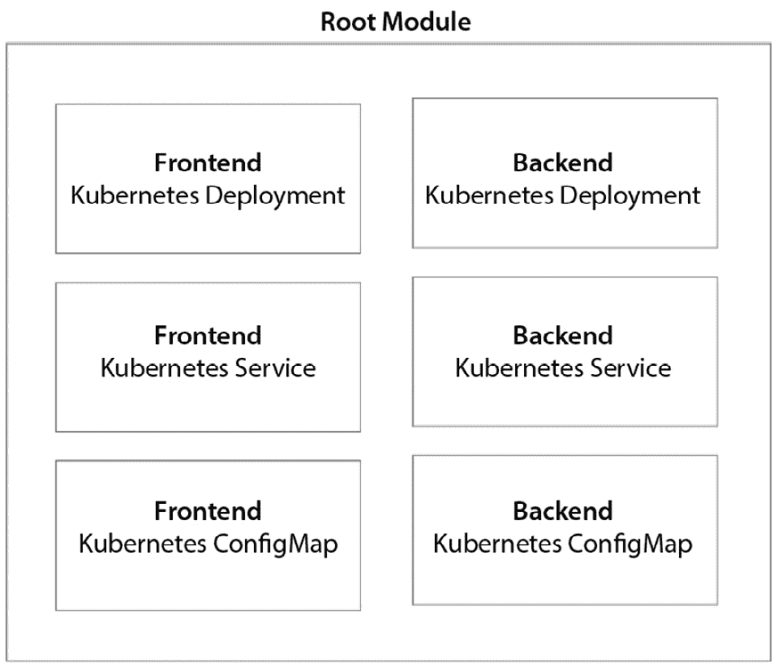

图 17.4 – 资源的可见重复模式

在我们进行重构之前，我们需要创建一个模块，替代这三个重复的资源：

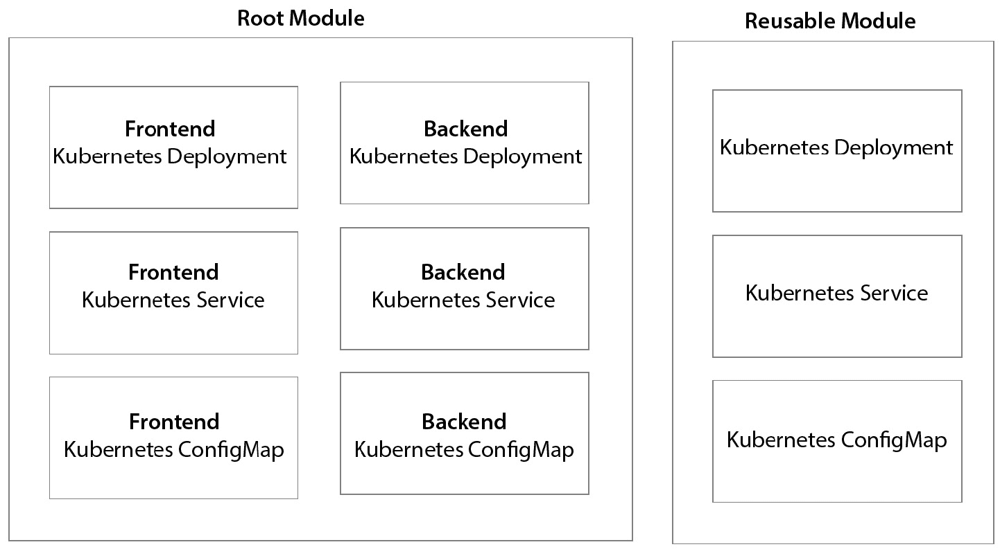

图 17.5 – 重构步骤 2 – 构建一个可重复使用的模块，可以配置以替换重复模式中的每个实例

现在，模块已创建，我们需要在根模块中创建模块实例，并删除重复模式中的先前资源：

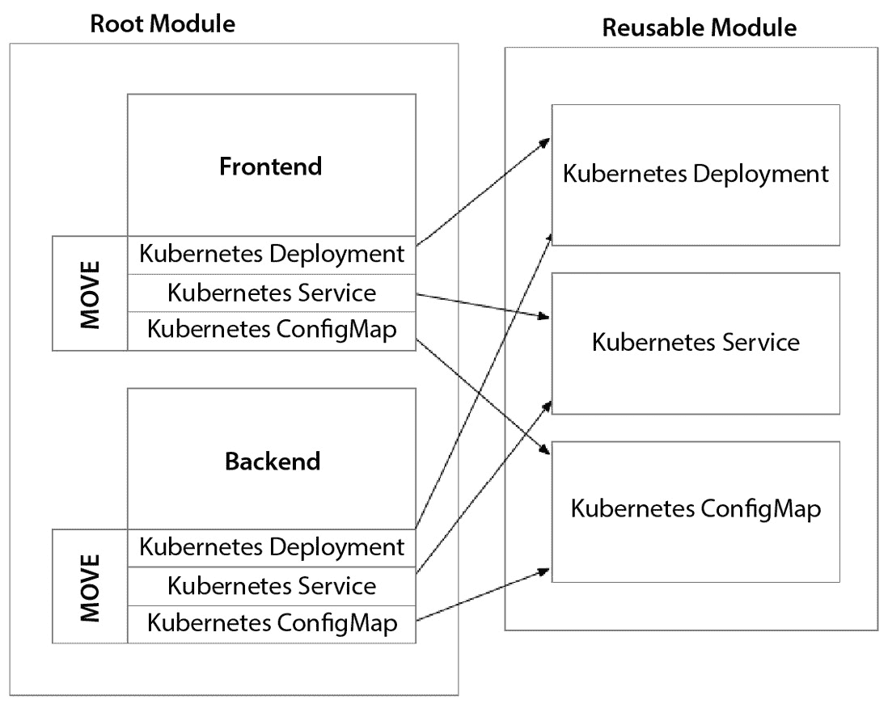

图 17.6 – 重构步骤 3 – 用模块引用和移动的块替换松散的资源

最后，我们创建`moved`块，帮助 Terraform 识别这些资源不需要被销毁和重新创建，因为它们已经被配置，但路径发生了变化。

## 失败规划

有时，意外的情况发生，部分基础设施受到影响，因为目标云平台出现某种故障。在这些情况下，我们需要能够快速响应并对现有环境进行更改，以最小化损失或从故障中恢复。

### 主动-被动

首先，我们来看看在单个 Terraform 工作区内部署的主动-被动工作负载：

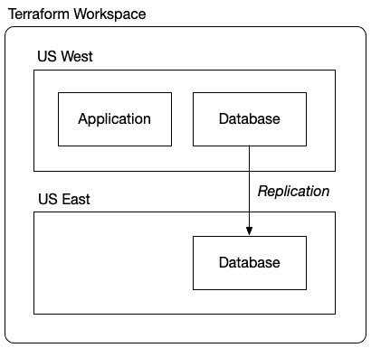

图 17.7 – 在单一 Terraform 工作区内部署的主动-被动工作负载

下面是在故障期间的情况：

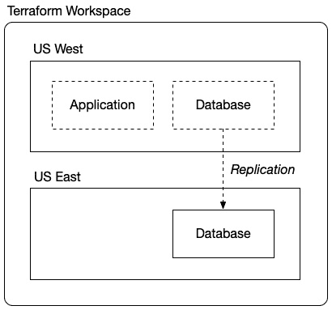

图 17.8 – 灾难发生时的主动-被动工作负载！

美国西部的应用程序和数据库不可用。幸运的是，我们有美国东部的数据库，之前正在进行复制。然而，我们需要创建一个在线环境，开始使用这个数据库为我们的客户提供服务：

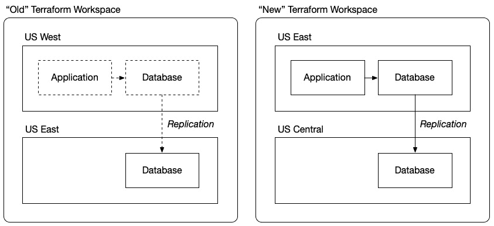

图 17.9 – 恢复步骤 1：在不同区域中配置新环境

我们使用 Terraform 在新的 Terraform 工作区中配置一个新环境。我们将新的根模块配置为使用美国东部作为主要区域，并将美国中部作为另一个健康的次要区域。这个环境是健康的，但缺少我们的数据。

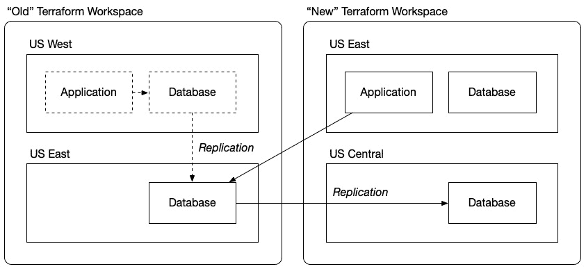

图 17.10 – 恢复步骤 2：从旧环境向新环境复制数据

我们重新配置我们的新工作区，以通过将*旧*数据库导入到状态中来引用它，实际上是用旧数据库替换了新的空数据库。这也可能导致复制配置的替换，开始从旧数据库到位于美国中部地区的新灾难恢复数据库的复制：

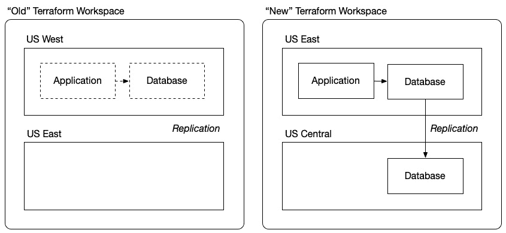

图 17.11 – 恢复步骤 3：切换到新环境并完全停用旧环境

现在，位于美国东部的旧灾难恢复数据库是我们的主要生产数据库，我们在美国中部有一个新的灾难恢复站点，以备我们需要再次执行相同操作时使用。此时，我们已经准备好通过允许流量回到我们的应用来恢复与客户的服务。由于之前从美国西部到美国东部的复制，数据库将是最新的。由于请求在美国西部被记录下来但可能未通过复制传输到美国东部，在这短暂的时间窗口期间，某些客户可能会有轻微的数据丢失。

### 活跃-活跃

现在，这是在没有使用任何模块的情况下，在单一 Terraform 工作区内的活跃-活跃部署：

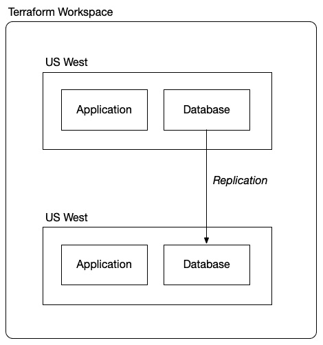

图 17.12 – 在单一 Terraform 工作区内的活跃-活跃部署，不使用任何模块

为了实现更高的系统可用性，我们可以选择进行活跃-活跃跨区域部署。在这种情况下，我们将在两个区域部署我们的应用实例，并在数据库之间进行复制。这样可以确保如果一个区域发生故障，我们的客户将通过将流量路由到健康的区域继续获得服务。

在之前的方法中，我们在单一 Terraform 工作区内创建了我们的多区域部署，这意味着两个区域都会在一个 Terraform 应用中进行更新。这可能会带来问题，因为如果一个区域出现故障，那么我们的部署的一半可能会无法响应，从而影响我们在整个环境中执行更改的能力。这可能会影响我们进行故障切换、增加容量或调整未受影响区域的自动扩展设置的能力。

为了开始避免将所有区域部署到一个单一的 Terraform 工作区，最好将整个区域的部署封装到一个可重用的模块中。这样做会让我们更容易根据区域划分 Terraform 工作区，并且随着我们扩展时，可以轻松添加额外的区域：

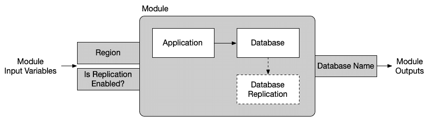

图 17.13 – 模块设计，封装我们的应用部署到单一地区

该模块会将需要部署到单个区域的所有内容都包含在内。此外，可能会有可选组件，如数据库复制配置，这些组件可能不需要启用，具体取决于该区域是否为主区域或次要区域之一。因此，我们的模块需要两个输入变量。首先是该实例将要部署的区域。其次是一个功能标志，用于启用或禁用数据库复制。当该区域为主区域时，将启用此功能；当它作为次要区域时，将禁用此功能。

这是一个示例；根据你使用的数据库或技术，你的情况可能会有所不同，但重要的是要认识到，在这样的模块中，利用功能标志来允许定制模块的每个实例以完成其特定角色是一个常见的场景：

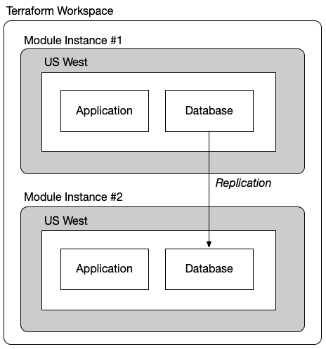

图 17.14 – 使用模块在单个 Terraform 工作空间中部署主动-主动配置以为每个区域提供资源

现在我们有了模块，我们可以在单个 Terraform 工作空间中使用它为两个区域提供资源。这种方法使得在单个 Terraform Apply 中可以轻松为其他区域提供资源，但在发生故障时可能会受到操作影响。如果你已经设计了故障转移机制，并且确保备用区域能够自给自足，那么这种方法也许并不不合理，但请记住，发生故障时你可能会失去执行 Terraform Apply 操作的能力。

即使在执行定向应用时，它也会在整个工作空间中执行计划。因此，虽然理论上，定向的`terraform apply`只会改变你所定向的资源，因为它必须执行完整的计划，如果你所定向的控制平面在某些区域或可用区受到影响，你将无法执行该操作。

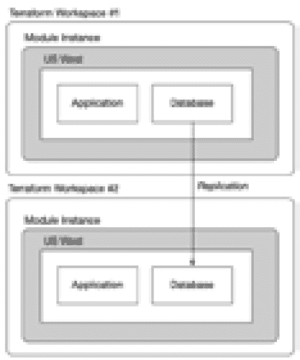

图 17.15 – 分离工作空间的主动-主动配置

过渡到完全分离的工作空间来为每个区域管理，可以帮助你通过 Terraform 更好地控制环境，因为你将在每个区域的上下文中执行`terraform apply`操作。这会在稳定状态下增加额外的操作开销，因为它会创建额外的 Terraform 工作空间来管理，并且在日常维护环境时会有额外的机制。因此，许多人仍然选择使用单一工作空间来管理多区域环境。

正如我们在本节中看到的，即使是计划中的变更，事情也可能充满挑战。我们构建和使用的模块会发生变化，我们所使用的云服务的设计和能力也会发生变化，这将导致我们使用的各个资源发生变化，最后，Terraform 执行文件本身也会发生变化。这些变化都是我们计划和控制的！此外，还可能会出现额外的变化，比如我们部署解决方案的可用区或区域内出现意外的故障。在下一节中，我们将讨论如何应对意外错误并执行一些常规的**修复**。

# 修复

现在，我们已经了解了我们知道会发生的变化，以及我们知道会发生但无法控制何时发生的变化，我们需要从更具战术性的角度来看待，以帮助我们应对在使用 Terraform 管理现有环境的过程中不可避免的*小*波折。这些通常是较小的问题，虽然不会造成巨大的影响，但如果我们准备不足，确实会变得负担沉重。但一旦你习惯了这些问题——并学会了如何应对——它们就变得容易管理了！

## 应用时故障

虽然 `terraform plan` 为我们提供了有关需要对环境进行哪些变更（或没有变更）的出色信息，但即使是最有意图的计划，在 `terraform apply` 操作过程中，有时事情也会以意想不到的方式出错。你可以做一些事情，尽量提前预防这些问题，并减少遇到它们的频率。

正如我们所知道的，Terraform 会在我们所针对的云平台上的某个身份下执行，因此，Terraform 拥有该身份的权限或特权。了解 Terraform 身份的权限以及你的代码正在做什么，能够帮助你识别是否存在可能导致授权失败的权限差距，因为这些差距通常是隐式的，很难被 Terraform 检测到。一些云平台甚至要求你在使用某些服务之前，显式启用整个类别的云服务。正如我们在*第十三章*到*第十五章*中看到的，Google Cloud 就以此著称，我们需要在 Google Cloud 项目中启用相关的 Google Cloud API，才能尝试进行资源配置。在 Azure 上，大多数常见服务默认启用，但一些较为冷门的资源提供者需要显式启用。

除了仅仅启用您想使用的服务外，所有云平台都会实现默认配额，这些配额会限制您在某些上下文中能够配置的资源量。这些上下文通常基于区域或 SKU。它们为云平台提供了容量规划方面的联合保护，同时也为我们作为客户提供保护，防止我们不小心配置非常昂贵的资源或某一种资源过多。配额并不是云平台强加的唯一限制，通常每个服务在给定部署上下文中（例如在 AWS 账户、Azure 订阅或 Google Cloud 项目中）都会设置资源限制。

除了配额和服务限制外，当使用涉及私有网络的云服务时，如果网络设置配置错误，您可能会遇到问题，例如虚拟网络和子网配置错误，或者安全组规则阻止资源的创建或访问。有时，Terraform 在云服务的数据平面上操作，而当您将其配置为私有网络时，该数据平面可能无法访问。确保 Terraform 配置了适当的私有网络，以便能够访问必要的数据平面。

另一些问题可能出现在 Terraform 无法通过配置和计划确定的隐式资源依赖关系上。这种情况可能发生在某个资源依赖另一个资源时，但这种关系或依赖关系并没有通过资源之间的直接引用在配置中为 Terraform 所知。还可能存在与现有资源的冲突，比如尝试创建已存在的、名称相同的资源，或者在给定范围内不能存在多个资源的其他设置——无论是在网络层面还是在云平台的控制平面层面。

操作可能比预期的时间更长，其他暂时性平台错误可能导致超时。超时可能导致资源最终成功配置，但因为发生在操作超时之后，Terraform 并不知道这一点。当配置大型资源或发生网络延迟时，这种情况可能会发生。

## 从状态中移除

在上一节中，我们讨论了应用时失败及其对 Terraform 基础设施管理的影响。另一个常见的情况是，在使用 Terraform 管理环境时，可能需要从状态中移除资源。正如我们在前面的章节中讨论的那样，这可以通过命令`terraform state rm`以命令式方式完成，或者通过在您的 HashiCorp 配置语言代码中使用`removed`块以声明式方式完成。

其中一种情况是你需要退役资源。如果你在 Terraform 之外手动删除了一个资源，需要从状态文件中将其移除，以避免下次`terraform apply`时出现错误。同样地，如果某个资源被错误地导入到 Terraform 配置中的错误位置，它可以在重新正确导入之前被移除。

在团队协作中，如果其他人已经删除了某个资源，但你的本地状态文件尚未更新，解决这种差异可能需要从状态文件中移除该资源。清理孤立资源是另一个重要的使用场景。如果一个资源由于手动更改或配置错误变成了孤立资源（不再由 Terraform 管理），就可以将其从状态文件中移除。

你可能还需要移除资源的另一个情况是重构过程。当然，正如我们之前讨论的，通常在这种情况下更常见的是移动资源，但也有可能需要移除资源的情况，例如将一个大配置拆分成多个小模块；也就是说，可能需要从状态文件中移除资源，然后再将它们导入到新的位置。此外，如果某个资源需要被新资源替代（例如，由于资源配置更改而需要重新创建），旧资源可能需要从状态文件中移除，然后再创建新资源。在测试或调试过程中，暂时从状态文件中移除资源有助于隔离问题或测试特定场景。如果你正在将多个类似的资源合并为一个资源（例如，将多个安全组合并为一个），旧资源可能会被移除出状态文件。

## 导入到状态

在*第十六章*中，我们深入探讨了如何导入那些在 Terraform 之外已经配置好的现有环境。在本章继续探索管理现有环境时，我们将遇到一些需要导入资源的情况，这对于在已经由 Terraform 管理的环境中进行故障修复至关重要。

即使是在最初通过 Terraform 配置的环境中，导入资源也是一种必要的操作，尤其是在`terraform apply`过程中发生临时错误时。这些错误可能会导致一种奇怪的状态，其中资源被配置好了，但 Terraform 报告它们为不健康状态，从而导致`terraform apply`失败。然而，这些资源可能会在稍后完成配置或被云平台恢复。在这种情况下，我们面临的选择是删除这些资源并重新运行`terraform apply`，或者将它们导入状态。

在这种情况下，导入资源作为一种修复故障的形式，类似于修补润滑良好的机器中的漏洞。它允许我们协调实际云环境与 Terraform 对其理解之间的差异，就像我们通过确保适当的权限、配额和网络配置来解决应用时失败一样。

另一种可能需要导入资源的场景是在处理在 Terraform 之外手动或自动化创建或修改的资源时。这可能会导致 Terraform 状态与实际基础设施之间的漂移，类似于云服务限制或网络设置中的意外更改可能导致的问题。这可能源于人为操作员在基础设施即代码流程之外工作，也可能源于自动化系统执行企业治理标准。通过将新创建或修改的资源导入到 Terraform 状态中，我们可以使配置与基础设施的当前状态重新对齐，确保随后的 Terraform 操作顺利进行。

# 摘要

在本章中，我们探讨了如何使用 Terraform 管理现有环境。我们首先全面检视了团队在各种组织规模中扮演不同角色和责任的各种运作模式。我们研究了这些团队如何将 Terraform 整合到他们的日常运营中——从管理简单的独立应用程序到处理诸如集中网络等共享基础设施服务的复杂性，并解决在企业各处交织的构建共享服务的细微差异。我们讨论了在共享基础设施中遇到的相互依赖性挑战，以及它们自己的应用程序开发发布过程。

本章的一个重要部分是简单应用更改到我们现有的环境中。这包括看似单调的过程，例如升级我们的 Terraform 工具——从 Terraform 可执行文件本身到我们使用的 Terraform 提供程序和我们解决方案中使用的模块。我们还讨论了我们自己代码可能需要的重构，并讨论了如何处理未计划的更改——例如遇到灾难时如何准备。这个讨论类似于为风暴做好准备；正如人们会确保他们的窗户和门安全一样，我们探讨了如何使用 Terraform 来准备我们的环境，以便在需要采取行动时使用。

我们通过讨论更常见的故障修复场景来结束了这一章，这些场景在您日常管理现有环境中使用 Terraform 时会经常遇到。

在下一章中，我们将讨论一些重要的事项，帮助您在掌握 Terraform 的下一步工作时考虑。
