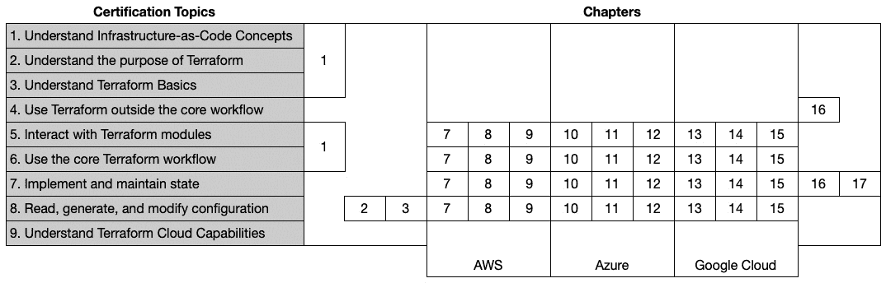
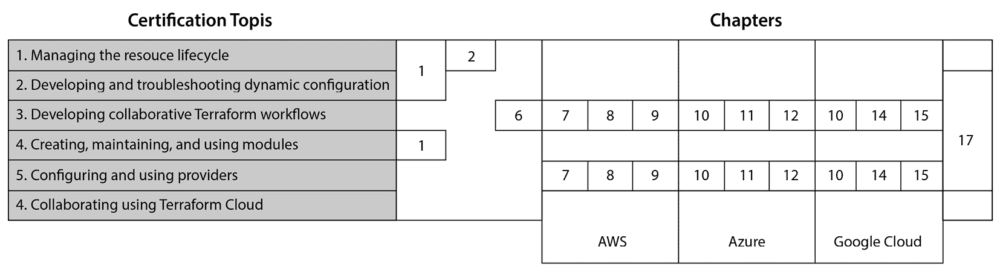
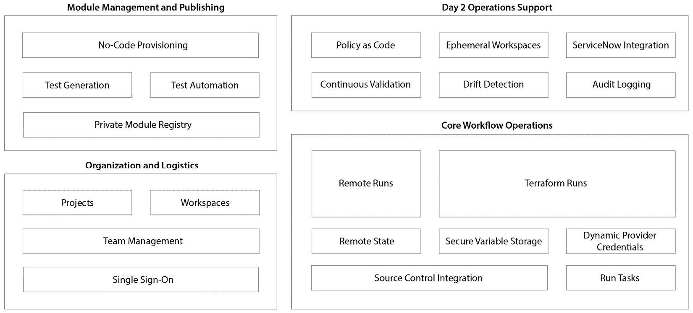
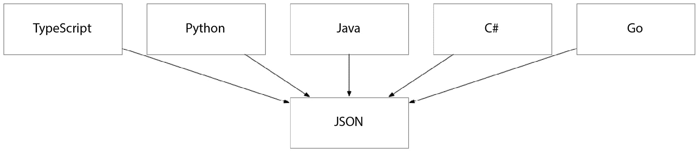
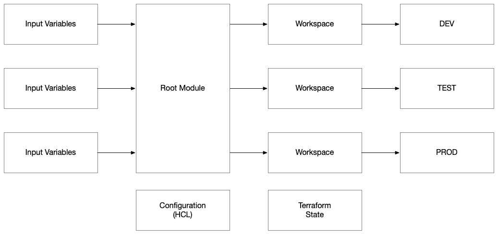
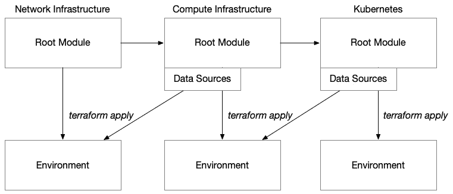
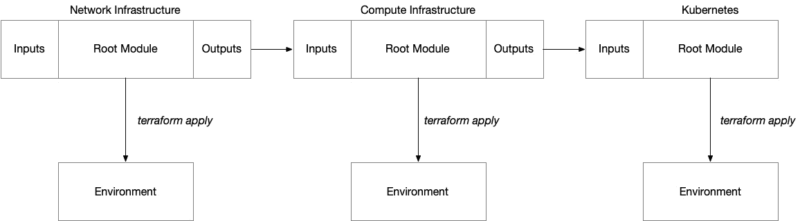
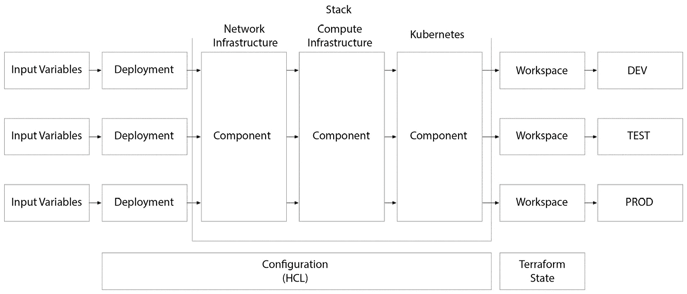

# 18

# 展望未来 – 认证、 emerging trends 和下一步

我们已经走到了一个阶段，必须停下来问自己，*接下来是什么？* 在此之前，让我们回顾一下我们走过的路。

我们已经学习了 Terraform 是什么以及如何使用它。我们学习了一些跨越你当前可能使用的特定云平台的云架构基本概念。我们在三大主要超大规模云平台——AWS、Azure 和 GCP 上构建了三种复杂的架构，最后，我们还学习了如何与现有环境合作，无论是将它们导入 Terraform，还是将其作为长期生产环境或其他环境与 Terraform 管理。

这可真不简单！这一路走来可谓非凡，那么接下来该往哪里走呢？答案就在你自己身上。我希望这意味着你在这段旅程中学到了东西，并且你能将这些带入到日常工作中，构建出能够解决现实世界问题的惊人系统，并且借助 Terraform 的力量，更好地构建和管理这些系统。

在本章结束之前，我想讨论一些可能的下一步，无论是个人成长还是扩展学习。你已经投入了大量的时间阅读这本书，并且开始了掌握 Terraform 的旅程。你可能想要考虑通过认证来验证你的技能和知识，并向潜在的雇主展示你的专业能力。

此外，随着你继续深化对 Terraform 的掌握，你可能还想考虑一些其他技术。我们将探讨一些这些选项，包括与 Terraform 相辅相成的工具和平台，以及它们如何增强你的 **基础设施即代码** (**IaC**) 能力。到本章结束时，你应该已经有了一个清晰的学习路线图，并为你在云基础设施管理领域的未来努力打下了坚实的基础。

本章涵盖以下主题：

+   准备考试

+   Terraform Cloud

+   接下来是什么？

# 准备考试

在你通读本书并掌握 Terraform 的过程中，你已经获得了丰富的知识和实践经验。那么，如何将你的专业能力展示给世界呢？最有效的方式之一就是通过认证。在本节中，我们将深入探讨如何为 Terraform 认证考试做准备。我们将涵盖你需要掌握的关键主题，考试的形式，以及优化你的学习时间和方法的策略。本节结束时，你将具备足够的工具和信心，能够应对认证考试，并在掌握 Terraform 的过程中迈出重要的一步。

## 范围和主题

**HashiCorp Terraform 助理认证**是一个入门级认证，它将测试你对 IaC 的一般概念、Terraform 与其他工具的竞争地位、使用**HashiCorp 配置语言**（**HCL**）编写代码的能力，以及使用核心 Terraform 工作流程和通过各种子命令在**命令行界面**（**CLI**）中支持的其他工作流程。

有一项新的考试即将推出，名为**Terraform 编写与操作专业认证**。这项考试是为那些在管理生产系统、开发可重用模块以及在成熟企业 IaC 环境中操作方面具有丰富经验的资深从业者设计的。它旨在验证那些高效编写和管理大规模 Terraform 配置所需的高级技能和深刻理解。考生可以预期会在实施复杂基础架构架构、优化工作流程以及确保企业环境中的最佳实践方面接受测试。此认证是那些希望展示在复杂且动态的基础架构环境中充分利用 Terraform 全部功能的专业知识的人的绝佳机会。

本书旨在帮助你超越助理认证考试中涵盖的许多基础概念，并帮助你为专业认证考试做准备。因此，本书的内容采用了高度实用的方式，实际构建了使用 Terraform 的云架构，并实现了与 Terraform 和自动化流水线工具（在本书中为 GitHub Actions）协作的流程。

如下图所示，我将本书中的章节映射到助理认证考试中实际涵盖的主题：



图 18.1 – 将助理认证主题与本书章节的映射

在本书的前三章中，我们快速浏览了 IaC 的基础概念层、Terraform 的架构和 HCL。这是经过精心设计的，因为本书面向的是中级到高级的读者，而不是初学者指南。

这使我们能够在*第四章*到*第六章*中花时间关注大多数 Terraform 从业者实际操作的概念层——他们在设计和配置的云架构，这些架构是我们在所有三大云平台中设置的云计算范式基础。

然后，我们开始实际动手，针对每个云平台构建三个真实世界的解决方案。正如你所看到的，我们在本书中大部分时间都花在了在所有三个云平台——AWS、Azure 和 GCP——以及三种云计算模式——虚拟机、容器和无服务器——上实现 HCL 代码。在这九个解决方案中，我们实现了 Terraform 模块，并深入研究了使用三个相应 Terraform 提供程序：`aws`、`azure` 和 `GCP` 的配置。

在*第十六章*和*第十七章*中，我们重点讨论了涉及状态管理和配置导入的非核心工作流，这些内容在处理现有环境时是常见且必要的——无论它们是否最初是使用 Terraform 配置的。

在专业考试中，这仍然涵盖了所有关键主题，唯一的一个关键例外是：



图 18.2 – 本书中专业认证主题与章节的对应关系图

特别的例外是**Terraform Cloud**，我选择将其作为本书的重点内容排除，因为我认为目前掌握 Terraform 并不需要了解 Terraform Cloud。我们将在本章的下一部分讨论 Terraform Cloud，因为我认为这是一个有趣的主题，如果你想利用它的一些功能来简化组织的协作工作流，可以进一步研究。

## 准备工作

去看看关于初级和专业考试的学习指南。这些学习指南中包含了指向官方文档的有用链接，可以补充本书的内容。记住，这本书旨在成为那些希望掌握 Terraform 以进行云架构配置的人的实用指南。这并不意味着需要记住 Terraform CLI 的每个细节。我特意选择专注于那些能够帮助你无论使用何种云和云计算模式都能开始开发真实世界解决方案的技能。

考试可能会有一些棘手的边缘情况或鲜少使用的命令，所以要为此做好准备，但我不会建议花大量时间在这些内容上。你可以为这些不常用的命令做一个快速的备忘单，记录它们的使用方法。如果觉得有必要，可以使用闪卡帮助记忆它们。如果你对 Terraform 的架构有扎实的理解并且有实际操作经验，应该可以应对得很好。

我最好的建议是通过动手实践来学习。拿本书中的项目，随时从我的 GitHub 仓库中克隆它们，但为了最大化你自己的掌握能力，在 GitHub 上自己的仓库中从头开始开发它们。重建这些项目，为你自己和环境配置好必要的资源，然后加以改进。考虑如何将其中的组件模块化，以便更具可重用性。去实施这些模块，然后重构你的环境以使用新模块。把你的环境当作生产环境来看待，通过确保避免替换现有环境中的资源来减少对环境的影响，同时尝试重构以使用你的新模块。

我是在 2023 年 10 月的 HashiConf 大会期间参加的考试。我没有学习，没有准备，甚至没有读学习指南。我以 84.21%的分数通过了考试。我对此感到非常高兴。我告诉你这些是为了炫耀吗？不是。好吧，可能有一点，但说真的，我的意思是，最好的准备方式是通过实践。怎么做到完全不学习就能通过？因为我已经使用 Terraform 好几年，深知其内外。我知道 Terraform CLI 中的每个晦涩命令吗？当然不是。我曾经使用过 Terraform Cloud 吗？一点也没有。你必须问问自己，你是想通过考试，还是想提升自己，成为云自动化领域中一个强大的力量，掌握世界上最强大的自动化工具之一？我认为答案很明显。专注于主要目标，以羚羊般的专注度，辅以研究一些晦涩的知识，你一定会做得很好。

现在，你已经充满了动力，感受到通过这本书学到的所有内容赋予你的力量，并准备参加 Terraform Associate 或即将到来的 Professional 考试，让我们一起期待一些每个 Terraformer（不仅仅是 Azure 方面的）都应该了解的有趣话题。

# Terraform Cloud

在本节中，我们将探讨 Terraform Cloud，这是一个强大的平台，旨在增强 Terraform 在团队和企业环境中的功能。Terraform Cloud 提供了一个集中式的中心，用于管理和自动化 Terraform 工作流程，提供如版本控制集成、远程状态管理和协作式 IaC 开发等功能。

我们将简要了解 Terraform Cloud 的核心组件，包括一些高级功能，如工作区管理、私有模块注册表、成本估算和策略执行。

通过了解 Terraform Cloud 的功能和使用案例，你将能够洞察它如何简化你的基础设施管理流程，并促进团队成员之间的协作。如果你希望快速提升组织的 IaC 成熟度，它绝对是一个值得考虑的选择。

## 功能

Terraform Cloud 的使命是简化使用基础设施即代码（IaC）管理环境的过程。这将包括处理使用 Terraform 时日常操作问题的功能，以及与赋能团队和在大型企业中扩展相关的更高级功能。以下是展示这些功能分组的图表：



图 18.3 – Terraform Cloud 功能

这些分组涵盖了四个功能领域：

+   核心工作流操作

+   组织和物流

+   模块管理与发布

+   第二天操作支持

我们将单独探讨这些功能领域，以便更好地了解 Terraform Cloud 所提供的价值。

### 核心工作流操作

正如我们所知道的，Terraform 本身是一个简单的命令行工具，处理 HCL 代码，并利用多个提供者生成计划，然后通过在多个提供者之间协调资源创建来执行该计划。Terraform Cloud 是一个多租户 SaaS 服务，它封装了命令行工具的功能，并将其作为托管服务提供。

因此，Terraform Cloud 的一个重要价值来源于 Terraform 本身——也就是那个完成所有工作的命令行工具。然而，Terraform Cloud 提供了许多超出命令行工具内建功能的内容。作为一个托管服务，它建立在我们的版本控制系统之上，充当一个流水线工具，执行 Terraform 的 `plan` 和 `apply` 命令。在本书中，我们与 GitHub Actions 一起工作，将 Terraform 命令行工具集成到我们的工作流中，运行核心的 Terraform 工作流，包括 `plan` 和 `apply`。

Terraform Cloud 在 *核心工作流操作* 类别中的功能侧重于提供 Terraform 作为一种服务，类似于 **GitHub Actions** 等流水线工具为通用流水线所做的工作，但这是专门为 Terraform 定制的。这意味着 Terraform Cloud 本质上是一个自动化托管平台，专门执行 Terraform 配置。因此，该服务针对 Terraform 的特定需求进行了优化，包括远程状态管理等功能。然而，它还包括了通用流水线工具中常见的一些基本功能，例如源代码管理集成、云平台凭据管理和安全的变量存储。它还提供了与外部工具集成的扩展点，使其能够融入更广泛的自动化编排中。

### 组织和物流

Terraform Cloud 的组织和物流方面设计旨在促进组织内部团队的协作和管理，无论组织大小。它提供了一个结构化的环境，用于跨逻辑项目组织用户、角色和权限，从而创建和操作 Terraform 工作空间—确保团队成员拥有适当的访问权限和权限，有效地执行任务。像**Azure DevOps**和**GitHub Enterprise**等其他通用的自动化平台一样，在这些协作环境中维持秩序和控制是基础功能。

### 模块管理和发布

Terraform Cloud 在模块管理和发布方面的功能使团队和组织能够在整个组织内构建、维护和共享自己的 Terraform 模块库。正如我们所讨论的，Terraform 模块通常封装了组织认可的最佳实践，并通常由负责其实现和内建质量的中央组织进行维护。Terraform Cloud 通过集成 Terraform 模块测试和验证来支持这一发布过程，以确保在 Terraform 模块的新版本在组织内分发之前达到质量标准。此外，这些模块可以在无代码环境中提供，向最终用户提供类似服务目录的体验。这使得团队能够标准化并扩展其基础设施管理工作，同时也让那些不熟悉基础设施即代码（IaC）或 Terraform 的组织部门能够使用他们构建的解决方案。

### 第 2 天操作支持

Terraform Cloud 中的第 2 天操作支持功能旨在管理和维护生产环境中现有的系统。它包括持续验证，以确保环境与代码中描述的期望状态保持一致，并且具备漂移检测功能，以识别 Terraform 代码之外的更改。此外，还提供了更高级的企业功能，如审计日志记录，帮助大型组织满足合规性标准并实施风险管理策略，以检测和防止环境中未经计划的更改。另一个关键特性是**Sentinel**提供的基于代码的策略功能，它允许对 Terraform Cloud 管理的环境进行治理和安全控制。

### 定价层级

*Free* 版本提供了 Terraform 的所有基础设施即代码（IaC）功能作为开箱即用的托管服务，包含所有核心工作流操作功能——包括远程状态、安全变量存储、动态提供者凭证和源代码控制集成。这是一个很好的方式，让你初步了解平台，并学习如何以 Terraform Cloud 为基础，而不是作为一个通用管道工具来工作。正如预期的那样，它的功能有限，只有一个并发作业，并且对更高级的企业功能（如政策即代码和运行任务）有限制，这些功能旨在帮助你将 Terraform Cloud 扩展到一个更大、更复杂的基于 IaC 的组织。免费版允许你最多配置 500 个资源。

*Standard* 版本增加了团队管理，并将并发作业的数量从一个提高到三个，这在团队环境中可能是合适的。定价模型是按每个资源每小时计费，这意味着你在 Terraform 配置中声明的每个资源都会计入使用量。根据当前的定价，每个资源每小时的费用为 $0.00014。为了让你了解这将花费多少，我管理的一个环境是一个小型 Kubernetes 集群及其所有相关的支持基础设施。我在这个环境中使用 Terraform 配置了正好 110 个资源：

*110 个资源 x 每个资源每小时 $0.00014 = 每小时 $0.0154*

*每小时 $0.0154 * 每天 24 小时 * 每月 30 天 = 每月 $11.088*

所以，每月大约 11 美元，我就可以使用 Terraform Cloud 来管理我的环境。这还不包括我为源代码管理系统支付的费用和环境的云托管费用。

*Plus* 版本引入了第 2 天操作支持场景，例如审计日志、漂移检测、持续验证、临时工作区、ServiceNow 集成和无限制的政策即代码（Policy-as-Code），帮助你更好地管理环境并与日常操作集成。

*Enterprise* 版本本质上是托管服务，允许你将 Terraform Enterprise 部署到自己的数据中心，这对于不愿意利用 HashiCorp 的多租户产品 Terraform Cloud 降低运营成本的大型企业来说非常重要。

在这一部分，我们介绍了 Terraform Cloud，包括它在功能方面提供的内容，并且认识到与更通用的自动化平台不同，它专门为使用 Terraform 的 IaC 管理和协作量身定制。与这些更通用的管道工具相比，Terraform Cloud 通过提供一些专门为 Terraform 工作流设计的功能，如远程状态管理、安全变量存储和集成模块管理，使其脱颖而出。专注于 Terraform 特定功能使其成为那些希望将 IaC 流程提升到下一个层次的团队的理想选择。接下来，我们将探讨一些其他值得关注的关键趋势，虽然它们超出了本书的范围，但对于任何希望真正掌握 Terraform 的人来说，应该引起足够的关注。

# 接下来是什么？

在这一部分，我们将探索 Terraform 社区中的一些新兴趋势，这些趋势对于任何与 Terraform 打交道的人来说都至关重要。虽然这些话题技术上超出了本书的范围，包括尚未最终确定并可能随时间发展而变化的即将发布的功能，理解这些新兴话题能够为你提供有关 Terraform 未来发展方向的宝贵背景知识，并帮助你在掌握 Terraform 的过程中走在前沿。

## CDK

Terraform **Cloud 开发工具包**（**CDK**）是一种使用你已经知道并在应用程序开发中使用的命令式编程语言开发 Terraform 配置的方法。可以使用任何语言，从 Python 到 C#，从 TypeScript 到 Java。任何 Terraform 提供程序和 Terraform 模块也都可以使用。它本质上与使用 HCL 相同，但可以使用你选择的编程语言。



图 18.4 – 使用你选择的编程语言

无论你选择哪种语言，最终都会编译成一个 Terraform 兼容的 JSON 文件，然后 Terraform 会像处理 HCL 文件一样进行解释。

这个选项非常适合已经使用编程语言的现有开发团队，他们不想花时间学习 HCL。然而，对于非开发人员来说，HCL 绝对是最佳选择，因为它提供了一种简单、功能强大的语言，更容易上手，并且已经有一个庞大的生态系统，很多从业者正在使用它，提出问题、回答问题并在公共 GitHub 仓库上共享代码，这些都可以帮助你在学习过程中前进。

## Terraform 堆栈

**Terraform 堆栈**，这是 Terraform 未来的一项备受期待的功能，承诺将彻底改变我们在多个控制平面上设计和管理复杂架构的方式。预计这一创新功能将为使用 Terraform Cloud 和**Terraform 社区版**（命令行工具）的用户提供无缝集成的体验。通过允许更复杂的基础设施即代码（IaC）组织和模块化，Terraform 堆栈旨在简化大规模、多层次环境的部署和管理过程。我们将深入了解目前 HashiCorp 公开的信息，并探讨它发布时预计的功能。

### 当前状态

在当前的 Terraform 使用环境中，单一的根模块作为基础设施部署的基石。这个根模块包含提供者配置，并与各种 Terraform 资源进行交互，既可以直接交互，也可以通过模块引用进行交互。通过为根模块提供不同的输入参数，根模块的多功能性得以增强，从而根据所需的部署环境进行定制。为了进一步隔离每个根模块实例的部署，Terraform 工作区被用来生成单独的 Terraform 状态文件。这些状态文件将与特定的环境（如`DEV`、`TEST`或`PROD`）唯一关联，有效地封装了每个环境中部署的基础设施的配置和状态：



图 18.5 – 当前状态：Terraform 工作区和根模块

在使用 Terraform 配置复杂环境的过程中，通常需要使用多个根模块来根据其依赖关系划分架构层次，例如考虑爆炸半径或具体的控制平面依赖关系，例如云平台与 Kubernetes 控制平面之间的依赖关系。这并不是唯一会遇到控制平面依赖的场景，但随着托管 Kubernetes 服务的日益普及，这已经成为一个常见的情况。依赖关系可能会在你使用两个或更多提供者配置资源时产生，其中一个提供者配置的资源将用于配置另一个 Terraform 提供者。根据该依赖提供者的初始化方式，你可能会遇到冲突，因为依赖于其他提供者资源中的控制平面来进行配置的提供者，可能会在`terraform apply`和`terraform destroy`时发生死锁。这是因为 Terraform 无法规划尚未存在的控制平面资源。

我遇到的其他常见场景是使用 `grafana` 提供程序在 Terraform 中为其配置资源。这与 `kubernetes` 提供程序创建的依赖关系类似。无论你使用哪个云平台，都没关系。许多云平台都有类似的托管服务，能通过它们相应的提供程序进行配置，并产生一个可以通过为该控制平面设计的 Terraform 提供程序自动化的端点。即使是像 `minecraft` 提供程序这样有趣的情况也是如此——无论你使用的是 EC2、Azure 虚拟机，还是 GCE！

尽管有两种主要方法可以实现这一点，但两者都需要多次执行 `terraform apply`。第一种方法是独立配置每个阶段的部署，然后通过数据源将上游依赖关系链接到下游阶段，并由输入变量提供值。这种方法允许不同的团队相对独立地部署不同阶段，但也增加了配置管理的负担，因为每个下游依赖关系必须显式引用之前配置的上游阶段。因此，这种方法导致了高度串行的部署模式，要求每个上游依赖关系在进行下一个下游依赖关系之前必须先部署并稳定：



图 18.6 – 当前状态：独立部署与数据源依赖

使用 Terraform 配置复杂环境的另一种方法偏离了独立部署，而是采用了一个单体流水线，顺序执行 `terraform apply`。在此模型中，依赖关系通过直接将上游依赖关系的 Terraform 输出传递到下游依赖关系的输入，从而无缝集成。尽管这种方法简化了自动化，但也导致了环境的紧密耦合。无论是哪种方法——无论是独立部署还是单体流水线——都需要实现大量的 *粘合* 以连接多个 `terraform apply` 步骤。这意味着需要编写 Bash 脚本或类似的自动化工具，作为连接的“粘合剂”，确保正确的值从一个流水线作业传递到下一个作业，从而在不同阶段之间保持部署过程的完整性。



图 18.7 – 当前状态：集成部署与基于输出的依赖

### 堆栈

在 `.tfstack` 文件中定义，堆栈允许你声明一个或多个 `component` 块，这些块本质上定义了当前的根模块。这些组件代表了部署中的离散且确定的配置阶段：



图 18.8 – 未来状态：Terraform Stacks

在前面的图示中，我们看到了构成我们堆栈的三个组件：

+   网络基础设施

+   计算基础设施

+   Kubernetes 部署

这将在 `.tfstack` 文件中以如下方式定义：

```
component "network" {
  source = "./network"
  inputs = {
    region = var.region
  }
  providers = {
    aws = providers.aws.this
  }
}
```

计算基础设施将在同一文件中定义，但这次将引用它依赖的网络组件的输出。这告知 Terraform 首先配置 `network` 组件，并首先解决该阶段的部署，然后再尝试部署 `compute` 基础设施组件：

```
component "compute" {
  source = "./compute"
  inputs = {
    region = var.region
    network_name = component.network.network_name
  }
  providers = {
    aws = providers.aws.this
  }
}
```

在 `compute` 组件部署完毕后，我们将拥有一个准备好部署我们的应用和服务的 Kubernetes 集群。因此，我们声明堆栈的最后一个组件，即应用组件：

```
component "app" {
  source = "./app"
  inputs = {
    region = var.region
    cluster_name = component.compute.cluster_name
  }
  providers = {
    aws = providers.aws.this
    kubernetes = providers.kubernetes.this
    helm = providers.helm.this
  }
}
```

这使我们能够在必要的步骤完成以配置 Kubernetes 集群之后再初始化 `kubernetes` 和 `helm` 提供者，而 Kubernetes 集群在我们开始执行计划之前是绝对必要的。

### 部署

在 `.tfdeploy` 文件中定义的部署允许你声明一个或多个 `deployment` 块，这些块本质上定义了一个 Terraform 工作区，一旦部署完成，它就会表现为一个独立的 Terraform 状态文件，代表一个已配置的环境。引入部署使我们能够在配置中声明性地建立不同的环境，而不是通过组织 Terraform 工作区和执行 Terraform 核心工作流操作（如 `plan` 和 `apply`）的上下文隐式实现。

部署充当了提供者配置的核心位置。这包括将每个提供者的首选身份验证方法与之关联。这是通过一个名为 `identity_token` 的新块完成的，该块会像这样为 AWS 定义：

```
identity_token "aws" {
  audience = ["aws.workload.identity"]
}
```

这将在 `.tfdeploy` 文件中以如下方式定义：

```
deployment "dev" {
  variables = {
    region = "us-west-2"
    identity_token_file = identity_token.aws.jwt_filename
  }
}
```

如你所见，`deployment` 块允许我们建立多个 Stacks 实例，并使用它们各自的输入变量和提供者上下文进行配置，包括相关的身份验证和授权上下文。

Terraform Stacks 是 Terraform Cloud 中一种令人兴奋的新功能，正在预览阶段，计划发布至 Terraform Cloud 和 Terraform Community Edition。正如你所见，通过这种方法，我们将能够消除目前在管道中投入的大量 *复杂操作*（即 **GitHub Actions**，**Azure DevOps**，**Jenkins** 等），并将其替换为可以通过我们在 *第六章* 中学到的 **Gitflow** 标准来管理的 Terraform 配置。如果你计划使用 Terraform 管理复杂解决方案，这是一个值得关注的功能，未来的版本中会有！

# 总结

在《*掌握 Terraform*》的最后一章中，我们探讨了那些希望加深对 Terraform 掌握并跟上社区新兴趋势的读者的下一步发展。我们讨论了 Terraform 认证的重要性，重点介绍了助理级和专业级考试。

我们还深入探讨了 Terraform Cloud，它可以增强 IaC 过程中的自动化和协作，建立在我们在本书中覆盖的工作流和概念之上。

Terraform 社区充满活力，并不断发展，新的趋势和替代路径定期涌现。我们探讨了一些最新的进展，包括 Terraform CDK，它允许你使用熟悉的编程语言来使用 Terraform，最后，我们还展望了一些 Terraform 的令人兴奋的即将推出的功能，例如 Terraform Stacks，它承诺通过提供更多的灵活性和模块化，革新我们通过 IaC 管理环境的方式，从而更好地定义和部署复杂的分层云架构。

# 结语

我们走得很远，也走得很长。我们探索了 Terraform，它的架构，它的能力，以及它的形式和功能。除了学习 Terraform，真正成为 Terraform 的大师，我们需要将自己扎根于作为 IaC 从业者所期望的架构和工作模式中。这意味着我们需要深入了解云架构，以便充分发挥 Terraform 的潜力。这包括我们在实际环境中会遇到的各种事物——从虚拟机到容器，再到无服务器架构——以及所有支持这些架构的辅助资源。一旦我们掌握了这些核心概念知识，我们将能够更好地在当今的多云世界中航行，真正超越当前所选的云服务商，做好迎接未来的准备——无论未来是什么。

感谢你与我一同踏上这段旅程。我希望你喜欢我这种非常专注和实用的 Terraform 掌握方法。我认为最好的学习方式就是通过实践，所以我鼓励你前往 GitHub，克隆本书中描述的任何或所有解决方案，开始你的 Terraform 掌握之旅！
