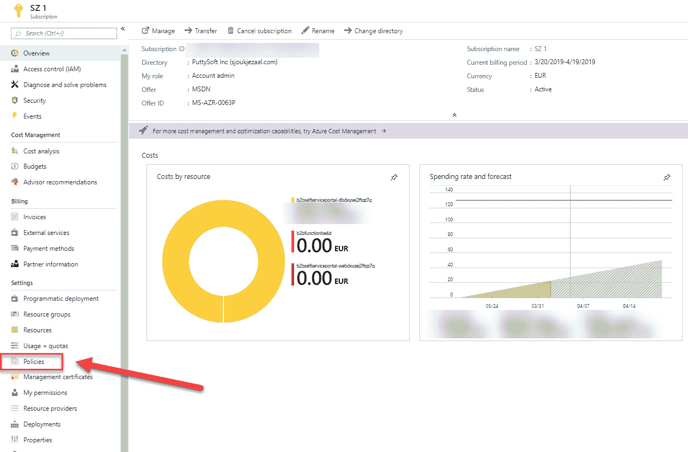

# 管理 Azure 订阅和资源组

本书将覆盖 AZ-103 考试的所有考试目标。在相关时，我们将为您提供关于本书中不同主题的额外信息和进一步阅读指导。

本书的第一章将介绍第一个目标，即如何管理 Azure 订阅和资源。在本章中，我们将专注于为管理员分配权限，以便他们可以管理您的 Azure 订阅和资源组。您将学习如何配置策略，以符合您的组织标准和 SLA。我们还将设置资源组的标记，您将学习如何配置成本中心配额和资源锁定。在完成本章时，我们将介绍如何在创建后将资源移动到不同的资源组中，以及如何完全从 Azure 订阅中删除资源组。

简而言之，本章将涵盖以下主题：

+   Azure 订阅和资源组

+   分配管理员权限

+   配置 Azure 订阅策略

+   在资源组上实施和设置标记

+   配置成本中心配额

+   配置资源锁定

+   移动资源到不同的资源组中

+   删除资源组

# Azure 订阅和资源组

在我们开始涉及用于考试的目标之前，这些目标包括如何管理 Azure 订阅和资源组，我们将介绍一些关于 Azure 订阅和资源组的高级信息。

# Azure 订阅

Azure 订阅基本上是 Azure 中的计费账户。除了计费之外，通过使用 Azure 订阅，可以访问 Azure 门户并在门户中创建不同的 Azure 服务。

如果您查看 Azure 账户层次结构，您将看到 Azure 订阅实际上适合哪里。下图显示了账户层次结构：

Azure 中的账户层次结构

它分为 **企业**、**部门**、**账户** 和 **订阅** 级别。在以下概述中，您将了解这些不同级别的用途：

+   **企业**：也称为 **企业协议**，仅由组织使用。可以从单独的门户 ([`ea.azure.com`](https://ea.azure.com)) 访问，用于为整个组织创建不同的部门。

+   **部门**：在部门级别，为组织中的不同部门创建子账户。您还可以按功能方式分组部门，如 IT 和财务部门，或按地理方式分组，如北美和欧洲。您可以在此处添加部门所有者，负责管理部门预算等。

+   **账户**：这是不同部门可以在其部门内部创建多个账户的地方。他们还可以添加额外的所有者来管理这些账户。当你在 Azure 中创建个人账户时，这是创建订阅的起始点。你用来登录 Azure 门户的 Microsoft 账户将作为所有者添加到此账户中。

+   **订阅**：你可以在一个账户中创建多个订阅。这是实际计费发生的层级，也是创建不同 Azure 资源的地方。你可以添加额外的订阅所有者，管理这些订阅，创建不同的资源，并将其他用户分配到订阅中。订阅总是与 Azure Active Directory 实例建立信任关系。

在 Azure 订阅内部，你可以创建多个资源组。将在下一节中介绍。

# Azure 资源组

你在 Azure 内创建的每个资源都必须属于一个资源组。资源组是一个逻辑容器，用于将多个资源组合在一起。例如，所有共享相似生命周期的资源，比如某个应用程序的所有资源，可能包括虚拟机、Azure 数据库、Azure 中的虚拟网络等，这些都可以被放入同一个资源组中。然后，你可以将这些资源作为一个整体进行管理和删除。

如果你还没有 Azure 账户，并且想要开始使用，你可以参考以下网站来创建 Azure 免费试用账户：[`azure.microsoft.com/en-us/free/.`](https://azure.microsoft.com/en-us/free/)

在接下来的章节中，我们将为用户分配管理员权限。

# 分配管理员权限

有两种方法可以将管理员权限分配给用户。第一种方法是在 Azure Active Directory 内进行，主要用于分配全局管理员权限。第二种方法是使用**基于角色的访问控制**（**RBAC**），并且可以从订阅级别进行设置。

在接下来的章节中，我们将讨论这两种方法。

# 分配全局管理员权限

拥有全局管理员权限后，你可以管理所有的订阅和管理组。管理组提供了一种高于权限的作用域级别，可以用于一起管理多个订阅。

当一个用户被分配为全局管理员角色时，他将能够查看组织中的所有 Azure 订阅和管理组，允许自动化应用访问所有 Azure 订阅和管理组，在用户失去访问权限时重新获得对 Azure 订阅或管理组的访问权限，并授予其他用户（或自己）访问 Azure 订阅或管理组的权限。

要在订阅级别为用户分配管理员权限，请按照以下步骤操作：

1.  通过打开[`portal.azure.com`](https://portal.azure.com)来导航到 Azure 门户。

1.  在左侧菜单中，选择 Azure Active Directory 以打开 Azure AD 刀片。

1.  然后，在 **管理** 下，选择 **属性**。

1.  在 **目录** **属性** 刀片中，启用 **Azure 资源访问管理**：

选择属性

1.  点击 **保存**。

在接下来的部分中，我们将为用户在订阅级别分配所有者权限。

# 分配所有者权限

订阅的所有者对订阅内的所有资源具有完全访问权限，并能够将访问权限委派给其他人。要在订阅级别使用 RBAC 分配所有者权限，请执行以下步骤：

1.  通过打开 [`portal.azure.com`](https://portal.azure.com) 导航到 Azure 门户。

1.  在左侧菜单中，选择所有服务并选择 **订阅** （您也可以将其添加到收藏夹中，这样它会显示在左侧菜单中）：

选择订阅

1.  选择您的订阅，在订阅概览刀片中，点击 **访问控制 (IAM)**：

访问控制设置

1.  要添加具有管理员权限的用户，请点击 **添加** | **添加角色分配**，以打开 **添加角色分配** 面板。

1.  在 角色下拉列表中，选择 **所有者** 角色。

1.  然后，在 **选择** 列表中，选择用户。如果列表中没有该用户，您可以通过名称和电子邮件地址在文本框中搜索该用户：

选择用户

1.  点击 **保存**，将用户添加到所有者角色。

在本演示中，我们为用户添加了管理员权限。在接下来的部分中，我们将配置 Azure 订阅策略。

# 配置 Azure 订阅策略

使用 Azure 策略，您可以创建、分配和管理策略。这些策略可以确保您通过强制执行不同的规则和效果，以符合企业标准和服务级别协议（SLA）。分配的策略会评估您的资源是否符合规定。例如，您可以创建一个策略，仅允许在您的环境中使用某个特定 SKU 大小的虚拟机。分配该策略后，所有新资源和现有资源都会被评估是否符合该策略。

要配置订阅策略，请执行以下步骤：

1.  通过打开 [`portal.azure.com`](https://portal.azure.com/) 导航到 Azure 门户。

1.  在左侧菜单中，选择 **订阅** （如果您已将其添加到收藏夹中；否则，请按照我们在上一个演示中描述的步骤操作）。

1.  在订阅概览刀片中，在左侧菜单下的 **设置** 中选择 **策略**：

选择订阅策略

1.  在策略概览刀片中，选择 **分配策略** 以创建新策略：

创建新策略

1.  在下一个屏幕中，我们将为我们的策略创建一个定义。添加以下值以创建策略，以便此订阅的资源只能在选定的区域内创建：

    +   **范围**：订阅名称。

    +   **排除项**：请留空；我们将创建一个适用于整个订阅的策略。

    +   **策略定义**：选择此项后，您可以从可用的多个策略中进行选择，并将其应用到您的订阅。微软为您创建了这些 JSON 模板，基于不同企业的最佳实践。您也可以在此处创建自己的模板。从列表中选择一个策略（例如，允许的地区），然后点击**选择**。

    +   **分配名称**：选择策略后，这个字段会自动填写。

    +   **参数**：在这里，您可以选择允许用户部署资源的地区。例如，选择中部美国、东部美国、东部美国 2、西部美国和西部美国 2。

1.  选择不同的区域后，点击**分配**按钮：

分配新策略

应用此策略后，此订阅的资源只能在选定的区域内创建。如果您想要添加额外的区域或从该策略中删除某些区域，您可以稍后编辑此设置。

您也可以在资源组级别应用策略。其操作方式与在订阅级别添加策略完全相同。一旦创建了资源组，您可以进入概述面板并从左侧菜单中选择**策略**。在那里，您可以在资源组级别应用策略。

在接下来的部分，我们将实施一个资源组并为其添加标签。

# 实施并设置资源组的标签

您可以对所有 Azure 资源应用标签。通过这种方式，您为资源组添加了额外的元数据，可以将它们逻辑性地组织成一个分类法。每个标签由名称和值对组成。例如，您可以将名称设置为 `Environment`，值设置为 `Demo`，或者将名称设置为 `Maintenance Window`，值设置为 `Saturday 9 AM`。应用这些标签后，您可以轻松地检索所有具有相同标签名称和值的资源。这对于计费或管理目的来说是一个非常有用的功能。

基于标签的计费，您可以使用分配的标签对某些资源的计费进行分组；例如，如果您为不同的环境（测试、预生产和生产）运行虚拟机和数据库，您可以使用标签对成本进行分类。这些标签将在不同的成本报告视图中显示。例如，它们会在创建后立即出现在成本分析视图中，并在第一个计费周期后出现在详细使用的 `.csv` 文件中。

您可以使用 Azure 门户、PowerShell 和 CLI 创建资源组。在此演示中，我们将通过 Azure 门户在订阅中创建一个 Azure 资源组。您还可以在资源组级别设置标签，因此我们也会执行此操作。请按照以下步骤进行：

1.  通过打开 [`portal.azure.com`](https://portal.azure.com) 进入 Azure 门户。

1.  在左侧菜单中，选择 **资源组**：

Azure 门户概览页面

1.  在资源组界面中，点击顶部菜单中的 **添加** 按钮：

创建新资源组

1.  填写以下值：

    +   **订阅**: 选择您希望添加资源组的订阅。

    +   **名称**: `PacktResourcegroup`。

    +   **区域**: 保持默认设置（在我的情况下是美国中部）。如果您更喜欢其他区域，也可以选择。

1.  接下来，在顶部菜单中选择 **标签**：

向资源组添加标签

1.  添加以下值以创建此资源组的标签：

    +   **名称**: `环境`

    +   **值**: `Demo`

1.  点击 **查看 + 创建**，然后点击 **创建**。

1.  对订阅中的一些资源重复这些步骤。在我的情况下，我已将相同的标签添加到虚拟机（VM）。

现在我们已经创建了一个新的资源组并为其应用了标签。您还可以通过资源组的标签界面管理您的标签。在下一部分中，我们将探讨如何配置成本中心配额。

# 配置成本中心配额

Azure 中的配额基本上是创建资源数量的限制。例如，一个 Azure 订阅中可以创建最多 2,000 个可用性集。然而，如果您希望增加此配额，可以联系 Microsoft 支持。我们需要执行以下步骤：

1.  通过打开 [`portal.azure.com`](https://portal.azure.com) 进入 Azure 门户。

1.  在左侧菜单中，选择 **订阅**。

1.  选择正确的订阅。在订阅概览界面中，选择 **设置** 下的 **使用情况 + 配额**。在那里，您可以选择一个提供商：

使用情况和配额概览

1.  选择 **Microsoft.Compute**。

1.  您将看到此订阅中可用的可用性集的数量。如果您想增加此数量，请选择屏幕右侧的 **请求增加** 按钮：

增加配额

1.  将打开一个新的界面，在其中您可以创建一个新的支持请求，以增加 Azure 资源的配额。

在下一部分中，我们将配置资源锁定和资源策略。

# 配置资源锁定

管理员可以为您的 Azure 资源设置锁定，以防止其他用户删除资源或对其进行任何更改。您可以在订阅、资源组或资源上设置两种不同的锁定级别：

+   **无法删除**：此级别防止授权用户删除资源。他们仍然可以读取和修改资源。

+   **只读**：在此级别下，授权用户可以读取资源，但无法删除或更新它。此级别类似于使用 RBAC 将所有授权用户分配为阅读者角色。

要在资源组上应用锁定，您需要执行以下步骤：

1.  打开[`portal.azure.com`](https://portal.azure.com)导航到 Azure 门户。

1.  在左侧菜单中，选择**资源组**。选择我们在前面的演示中创建的资源组。

1.  在资源组概览面板中，点击**设置**下的**锁定**：

资源组概览

1.  在下一屏幕中，点击顶部菜单中的**添加**以为此资源创建新锁定。

1.  添加以下值：

    +   **名称**：`No-Deletion`

    +   **锁定类型**：删除：

创建锁定

1.  点击**确定**以创建锁定。

我们已经为此资源组创建了锁定，以防止授权用户删除它。在下一部分中，我们将看看如何在不同的资源组之间移动资源。

# 在资源组之间移动资源

您可以通过使用 Azure 门户、PowerShell、CLI 和 REST API 轻松地将资源移动到不同的资源组和订阅中。在移动操作期间，源组和目标组都会被锁定。这会阻止所有写入和删除操作，直到移动完成。这意味着您不能更新、添加或删除资源，但资源不会被冻结。这些资源不会出现停机时间。然而，即使新的资源组在不同的区域创建，资源的位置仍然保持不变。

将资源移动到不同的资源组和订阅之间有一定的限制。例如，部署在可用区内的具有托管磁盘的虚拟机无法移动。有关这些限制的更多信息，您可以参考以下文章：[`docs.microsoft.com/en-us/azure/azure-resource-manager/resource-group-move-resources`](https://docs.microsoft.com/en-us/azure/azure-resource-manager/resource-group-move-resources)。

在接下来的演示中，我们将使用 Azure 门户将资源从一个资源组移动到另一个资源组。对于本次演示，我已将一台虚拟机添加到该资源组，并创建了一个名为`PacktResourceGroup1`的新资源组。要移动此虚拟机，请执行以下步骤：

1.  打开[`portal.azure.com`](https://portal.azure.com)导航到 Azure 门户。

1.  在左侧菜单中，选择**资源组**。选择我们在上一个演示中创建的`PacktResourceGroup`。从列表中选择所有虚拟机资源，在顶部菜单中选择**移动**：

移动资源

1.  你有两种选择：**移动到另一个资源组** 和 **移动到另一个订阅**。点击“移动到另一个资源组”，在下一屏幕中，选择`PacktResourceGroup1`作为资源组，并勾选下面的复选框：

移动资源

1.  点击**确定**将资源移动到另一个资源组。

移动资源后，你可以打开`PacktResourceGroup1`的概览面板。你会看到所有资源都已被移动。

在本章的下一部分（也是最后一部分），我们将删除资源组。

# 删除资源组

资源组可以通过 Azure 门户、PowerShell、CLI 和 REST API 删除。你可以一次性删除资源组及其所有资源。

在接下来的演示中，我们将删除我们在前一个演示中使用的`PacktResourceGroup1`：

1.  通过打开[`portal.azure.com`](https://portal.azure.com)导航到 Azure 门户。

1.  在左侧菜单中，选择**资源组**。选择`PacktResourceGroup1`。在顶部菜单中，选择**删除资源组**：

删除资源组

1.  要确认删除资源组，你必须输入资源组的名称。输入资源组的名称并选择**删除**：

确认删除

资源组现在将被删除。

# 总结

在本章中，我们介绍了 Azure 订阅和资源组的各个方面。我们分配了管理员权限并描述了如何创建策略以保持合规。我们还介绍了成本中心配额和资源锁定。在本章结束时，我们完全移动并删除了资源组。

在下一章，我们将通过描述如何分析资源的利用率和消耗来涵盖本考试目标的第二部分。

# 问题

请回答以下问题，测试你对本章内容的理解。你可以在本书末尾的*评估*部分找到答案：

1.  假设你有一个使用托管磁盘的虚拟机，它部署在一个可用性集中，并且你想将资源移动到另一个资源组。这可能吗？

    +   是

    +   否

1.  假设你想使用 PowerShell 创建一个资源组。这可能吗？

    +   是

    +   否

1.  假设你想使用 CLI 删除一个资源组。这可能吗？

    +   是

    +   否

# 进一步阅读

你可以查看以下链接，了解本章中涉及的主题的更多信息：

+   *将 Azure 订阅关联或添加到您的 Azure Active Directory 租户*: [`docs.microsoft.com/en-us/azure/active-directory/fundamentals/active-directory-how-subscriptions-associated-directory`](https://docs.microsoft.com/en-us/azure/active-directory/fundamentals/active-directory-how-subscriptions-associated-directory)

+   *Azure 中的资源访问管理*: [`docs.microsoft.com/en-us/azure/architecture/cloud-adoption/getting-started/azure-resource-access`](https://docs.microsoft.com/en-us/azure/architecture/cloud-adoption/getting-started/azure-resource-access)

+   *提升访问权限以管理所有 Azure 订阅和管理组*: [`docs.microsoft.com/en-us/azure/role-based-access-control/elevate-access-global-admin`](https://docs.microsoft.com/en-us/azure/role-based-access-control/elevate-access-global-admin)

+   *了解 Azure 策略效果*: [`docs.microsoft.com/en-us/azure/governance/policy/concepts/effects`](https://docs.microsoft.com/en-us/azure/governance/policy/concepts/effects)

+   *使用 Azure 计费和成本管理防止意外费用*: [`docs.microsoft.com/en-us/azure/billing/billing-getting-started`](https://docs.microsoft.com/en-us/azure/billing/billing-getting-started)

+   *使用标签来组织您的 Azure 资源*: [`docs.microsoft.com/en-us/azure/azure-resource-manager/resource-group-using-tags`](https://docs.microsoft.com/en-us/azure/azure-resource-manager/resource-group-using-tags)

+   *锁定资源以防止意外更改*: [`docs.microsoft.com/en-us/azure/azure-resource-manager/resource-group-lock-resources`](https://docs.microsoft.com/en-us/azure/azure-resource-manager/resource-group-lock-resources)

+   *将资源移动到新的资源组或订阅*: [`docs.microsoft.com/en-us/azure/azure-resource-manager/resource-group-move-resources`](https://docs.microsoft.com/en-us/azure/azure-resource-manager/resource-group-move-resources)
