# 分析资源利用率和消耗情况

在上一章中，我们介绍了如何创建和管理 Azure 订阅和资源的各个方面。

本章将涵盖*管理 Azure 订阅和资源*目标的第二部分。在本章中，我们将展示如何使用 Azure Monitor 监控不同的 Azure 资源。你将了解 Azure Monitor 的不同功能，如何创建和分析不同的度量标准和警报，从而使用 Azure Monitor 提供关于你所有 Azure 资源的性能和行为的有价值见解。为了完成本章，我们将介绍 Azure Log Analytics 以及它如何集成在 Azure Monitor 中。你还将学习如何创建日志搜索查询功能。

本章将涵盖以下主题：

+   Azure 监控

+   创建和分析度量标准与警报

+   创建操作组

+   配置资源的诊断设置

+   Azure 日志分析

+   使用日志搜索查询功能

# Azure 监控

Azure Monitor 是 Azure 门户中的一种监控解决方案，它提供了一个全面的解决方案，用于收集、分析和对云环境和本地环境的遥测数据进行处理。它可用于监控各个方面（例如应用程序的性能），并识别影响这些应用程序以及依赖它们的其他资源的问题。

Azure Monitor 收集的数据分为两种基本类型：度量标准和日志。度量标准描述系统在某个特定时间点的一个方面，并以数值形式显示。它们能够支持接近实时的场景。日志与度量标准不同。它们包含按记录组织的数据，每种类型的记录有不同的属性集。像事件、追踪和性能数据等信息通常以日志的形式存储，然后可以将其组合进行分析。

Azure Monitor 支持从各种 Azure 资源收集数据，所有数据都会显示在 Azure 门户的概览页面中。Azure Monitor 提供以下度量标准和日志：

+   **应用程序监控数据**：这将包括关于应用程序功能和性能的数据，以及所编写代码的数据，无论其平台是什么。

+   **客户操作系统监控数据**：这将包括关于你的应用程序运行的操作系统的数据。这些操作系统可能运行在任何云环境或本地环境中。

+   **Azure 资源监控数据**：这将包括关于 Azure 资源运行的数据。

+   **Azure 订阅监控数据**：这将包括关于 Azure 订阅的运行和管理的数据，以及关于 Azure 本身的健康状况和运行数据。

+   **Azure 租户监控数据**：这将包括关于租户级别 Azure 服务的运行数据，例如 Azure Active Directory。

现在，Azure Monitor 集成了日志分析和应用程序洞察的功能。你也可以继续单独使用日志分析和应用程序洞察。

现在我们对 Azure Monitor 有了基本了解，接下来我们将看看如何分析跨订阅的警报和度量。

# 创建和分析度量及警报

要分析 Azure Monitor 中的警报和度量，我们需要进入 Azure 门户中的监控资源。在接下来的部分中，我们将设置度量和警报，并展示如何分析它们。

# 度量

度量描述了系统在特定时刻的某个方面，并以数值形式显示。它们能够支持接近实时的场景。

# 创建度量

若要显示 Azure Monitor 中各个 Azure 资源的度量，请执行以下步骤：

1.  通过打开[`portal.azure.com`](https://portal.azure.com)访问 Azure 门户。

1.  在左侧菜单中，选择“监控”以打开 Azure Monitor 概览面板：

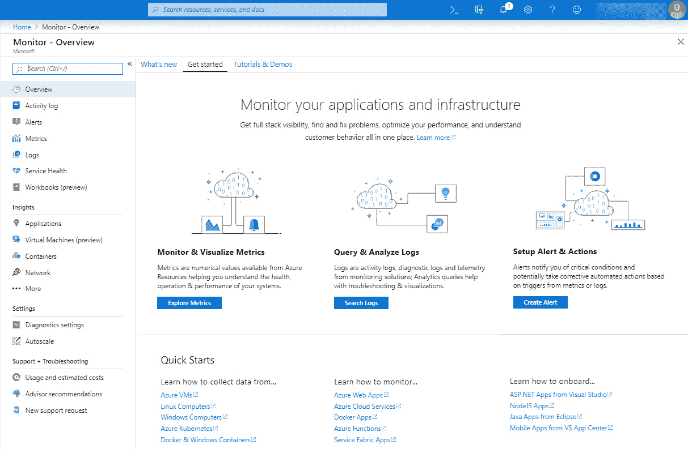

Azure Monitor 概览

1.  首先，我们将查看度量。因此，在左侧菜单中，选择**度量**，或从概览面板中选择**探索度量**按钮。

1.  在度量概览面板中，点击**+ 选择资源**按钮。会弹出一个新面板，你可以在其中选择订阅、资源组和资源类型。选择前一章节演示中使用的订阅，选择`PacktResourceGroup`，然后选择虚拟机（在我的案例中是 Linux）。你还可以按其他资源类型进行筛选：

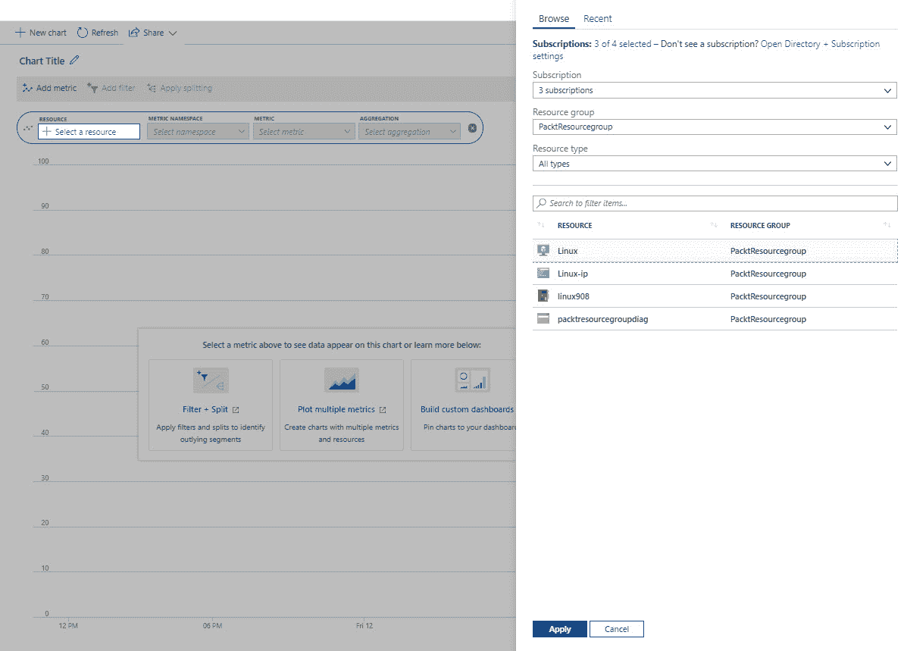

选择资源

1.  点击**应用**。

1.  然后，你可以选择度量类型。例如，选择**CPU 信用消耗**：

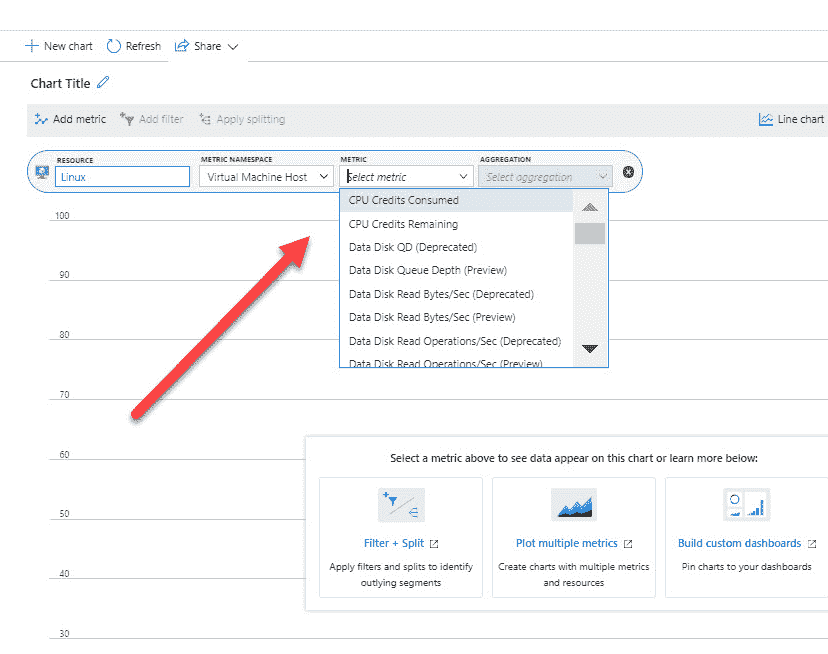

度量类型

花点时间浏览你可以选择的不同度量，这可能是考试题目的部分内容。

1.  你还可以在筛选框中选择其他类型的聚合，如计数、平均值等。在面板的右上角，你还可以为你的度量选择不同的时间范围：

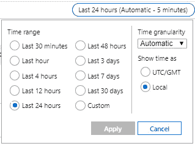

时间范围

1.  你还可以将该度量固定到 Azure 门户的概览仪表板中。因此，点击**固定到仪表板**按钮，然后选择将其固定到当前仪表板或为其创建一个新仪表板。此时，选择**固定到当前仪表板**：

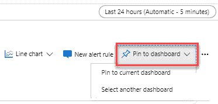

将度量固定到仪表板

1.  如果现在从左侧菜单选择**仪表板**，你会看到该度量已被添加到仪表板中。这样，你就可以轻松地分析该度量，而无需打开 Azure Monitor。

指标也可以直接从 Azure 资源页面获取。例如，如果你有一个虚拟机，可以通过选择它进入虚拟机资源页面。然后，在左侧菜单中的 **监控** 下，你可以选择 **指标**。

在下一部分，我们将讨论如何在 Azure Monitor 中设置和分析警报。

# 警报

通过警报，Azure 可以在 Azure 或本地环境发生关键条件时主动通知你。警报还可以尝试自动采取纠正措施。基于指标的警报规则将提供近实时的警报，基于该指标。基于日志创建的警报可以将不同资源的数据合并在一起。

Azure Monitor 中的警报使用操作组，操作组是一个独特的接收者和操作集合，可以跨多个规则共享。这些操作组可以使用 **Webhooks** 启动外部操作，基于为此警报设置的要求。然后，这些外部操作可以被不同的 Azure 资源拾取，如运行簿、函数或逻辑应用。**Webhooks** 也可以用于将这些警报添加到外部 **IT 服务管理** (**ITSM**) 工具中。

你还可以为所有不同的 Azure 资源设置警报。在接下来的部分中，我们将创建一个警报。

# 创建警报

创建警报，按照以下步骤操作：

1.  在 Azure Monitor 概览页面的左侧菜单中，选择 **警报**。你也可以通过点击 **创建警报** 来直接创建一个警报**。

1.  在警报页面中，点击顶部菜单中的 **+ 新建警报规则**：

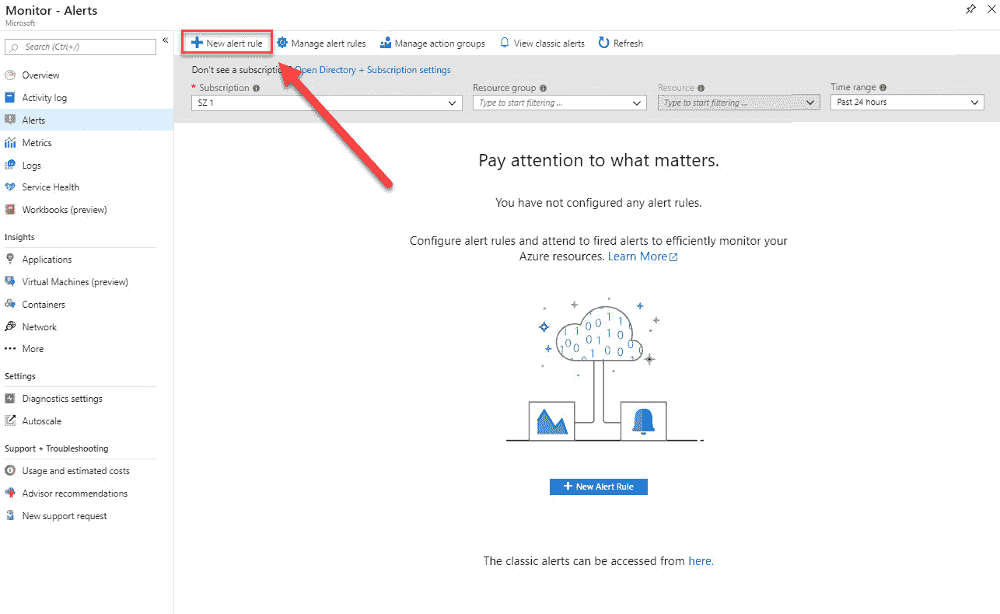

创建新警报

1.  **创建规则** 页面被显示。在这里，你可以创建规则和操作组。要创建一个新规则，首先需要选择资源。点击 **选择** 按钮，在资源部分下：

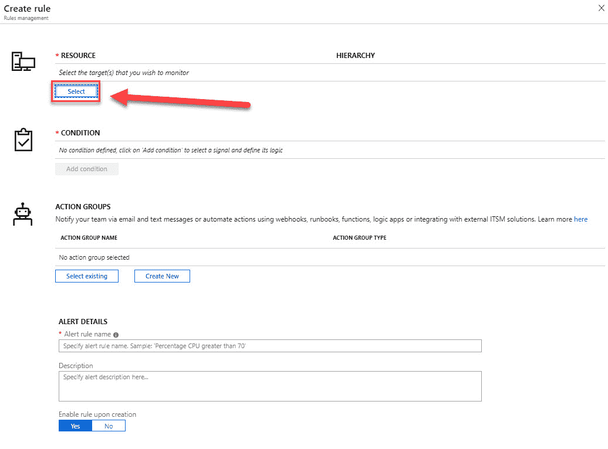

创建新规则

1.  在下一个页面中，你可以按订阅和资源类型进行过滤。选择虚拟机：

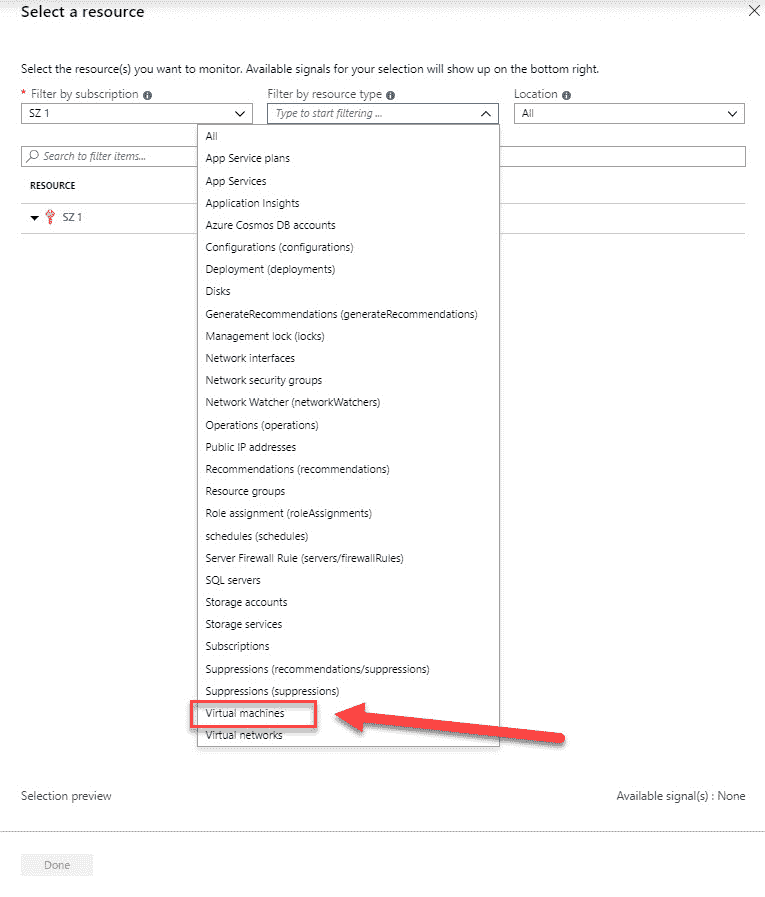

按订阅和资源类型过滤

1.  从列表中选择我们在上一章中创建的虚拟机并点击 **完成**。

1.  现在我们已经选择了资源，接下来我们将设置条件。点击 **添加条件**。

1.  条件页面已打开，我们可以按特定信号进行过滤。选择 **CPU 百分比** 并点击 **完成**：

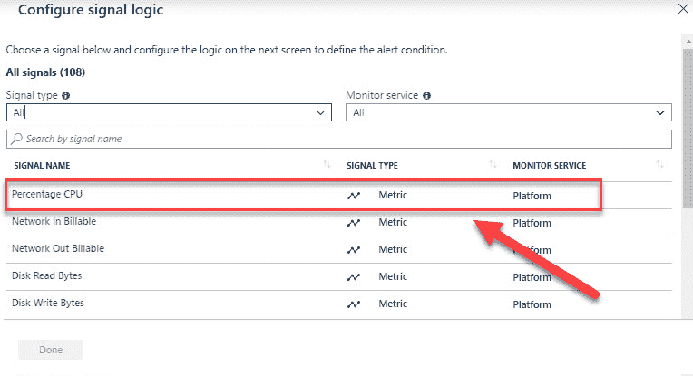

按信号过滤

1.  接下来，你可以为此警报设置逻辑。你可以选择多个运算符，设置聚合类型，并为此警报设置阈值。设置如下：

    +   **运算符**：大于

    +   **聚合类型**：平均

    +   **阈值**：90%

1.  保留 **基于评估** 的默认设置。

1.  当虚拟机的 CPU 使用率在五分钟内超过 90% 时，Azure Monitor 将每分钟检查一次并通知你：

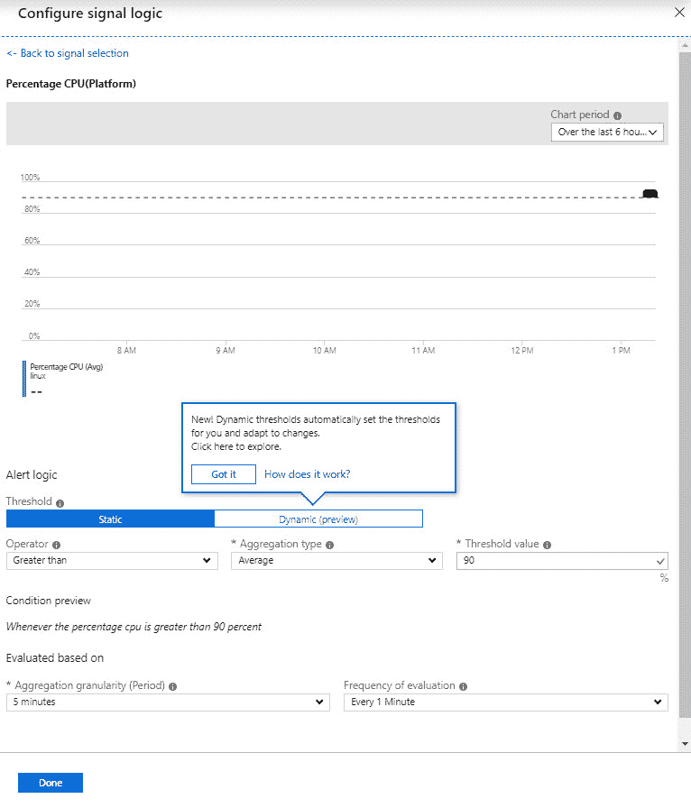

设置条件值

1.  点击**完成**以创建此条件。

1.  现在，我们需要创建一个操作组来接收警报。这个操作组将负责处理警报并采取进一步行动。你在这里创建的操作组可以在其他警报中重复使用。所以，在我们的案例中，我们将创建一个电子邮件操作组，向某个电子邮件地址发送邮件。创建完成后，你可以将这个现有的操作组添加到其他警报中。在**操作组**下，选择**创建新建**按钮。

1.  在“操作组”页面中，添加以下设置：

    +   **操作组名称**：`发送电子邮件`

    +   **简短名称**：`email`

    +   **订阅**：选择创建虚拟机的订阅

    +   **资源组**：选择 Default-ActivitiyLogAlerts（待创建）

1.  然后，我们需要提供实际的操作。添加以下值：

    +   **操作名称**：`email`

    +   **操作类型**：电子邮件/SMS/推送/语音

1.  然后，选择“编辑详情”并勾选“电子邮件”复选框。提供一个电子邮件地址并点击“确定”按钮：

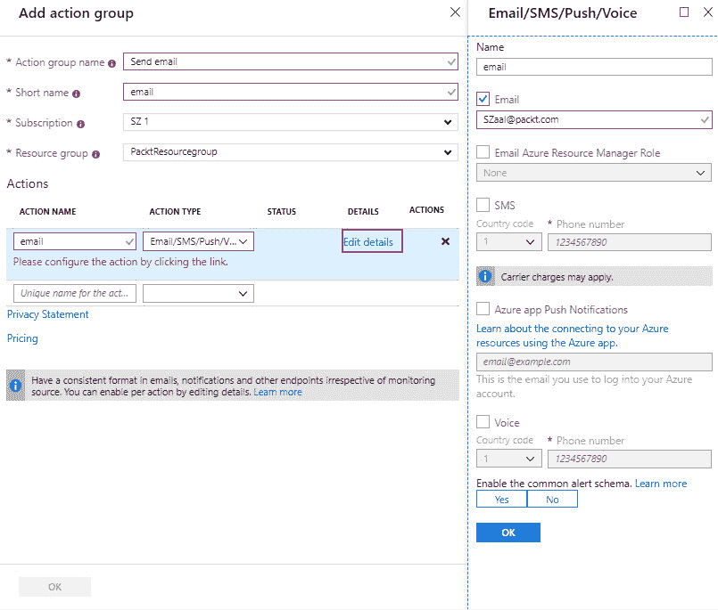

创建操作组

1.  再次点击**确定**。

1.  最后，你需要指定一个警报名称，设置警报的严重性级别，并点击**创建警报规则**：

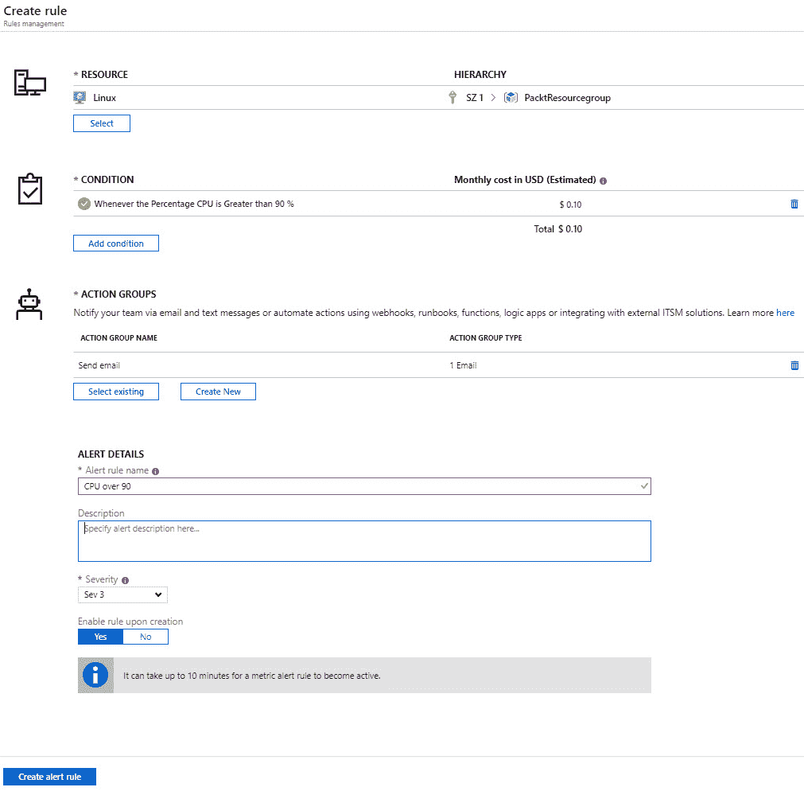

警报设置

我们现在已经创建了一个警报和一个操作组，当 CPU 使用率超过 90% 时，该操作组会通过电子邮件通知用户。在接下来的部分中，我们将配置资源的诊断设置。

# 配置资源的诊断设置

你还可以为不同的 Azure 资源配置诊断设置。Azure Monitor 提供了两种类型的诊断日志：

+   **租户日志**：这些日志包括所有存在于 Azure 订阅之外的租户级别服务。例如，Azure Active Directory 日志。

+   **资源日志**：这些日志包含所有部署在 Azure 订阅中的资源数据；例如，虚拟机、存储账户和网络安全组。

这些日志的内容对每个 Azure 资源都不同。这些日志不同于来宾操作系统级别的诊断日志。要收集操作系统级别的日志，必须在虚拟机上安装代理。诊断日志则不需要安装代理，可以直接通过 Azure 门户访问。

可以访问的日志存储在存储账户中，可用于审计或手动检查目的。您可以通过使用资源诊断设置指定保留时间（以天为单位）。您还可以将日志流式传输到事件中心，以便在 PowerBI 中分析，或将其插入到第三方服务中。这些日志也可以通过 Azure Monitor 进行分析。这样，就无需先将其存储在存储账户中。

# 启用诊断设置

要启用资源的诊断设置，请执行以下步骤：

1.  打开[`portal.azure.com`](https://portal.azure.com)来导航到 Azure 门户。

1.  再次转到我们在上一章创建的虚拟机。确保虚拟机正在运行，在左侧菜单中，选择**监视**下的**诊断设置**。

1.  诊断设置面板将打开。您需要选择一个存储账户来存储这些指标。

1.  单击**启用客户级监视**按钮以更新虚拟机的诊断设置：

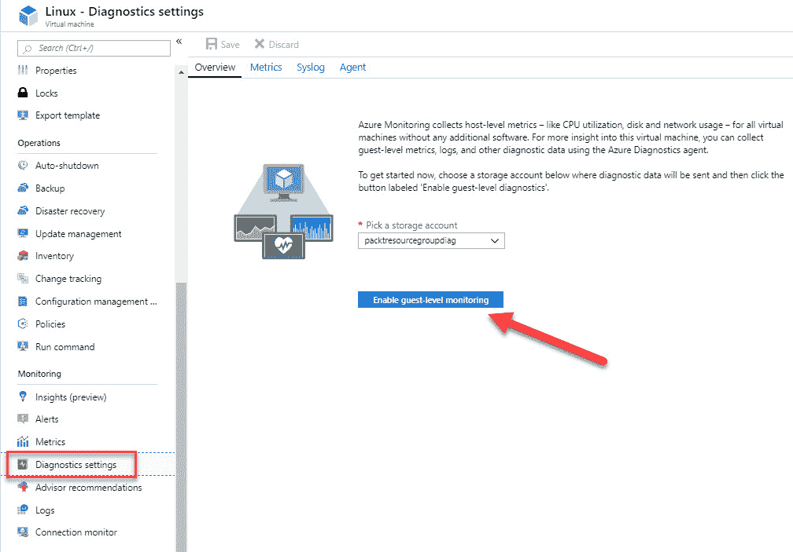

启用虚拟机的诊断设置

1.  当设置更新后，您可以转到顶部菜单中的“指标”以设置收集的指标。syslog 面板用于设置最低日志级别。

1.  启用 Azure Monitor 中的诊断日志后，新的指标将可以从指标面板中查看。您可以像本章前面一样分析它们，在*指标*部分中进行分析。

在下一部分，我们将查看 Azure Log Analytics 服务，它现在也是 Azure Monitor 的一部分。

# 在 Log Analytics 中查看警报

Azure Log Analytics 是一个从各种 Azure 资源和本地资源收集遥测数据的服务。所有这些数据存储在 Log Analytics 工作区中，该工作区基于 Azure 数据资源管理器。它使用 Kusto 查询语言，该语言也用于 Azure 数据资源管理器来检索和分析数据。

分析这些数据可以通过 Azure Monitor 来完成。所有的分析功能都集成在其中。术语 Log Analytics 现在主要指的是 Azure 门户中用于分析指标数据的面板。

在我们能够显示、监视和查询来自 Azure Monitor 的日志之前，我们需要创建一个 Log Analytics 工作区。为此，我们需要执行以下步骤：

1.  打开[`portal.azure.com`](https://portal.azure.com)来导航到 Azure 门户。

1.  单击**创建新资源**。

1.  在搜索框中键入`Log Analytics`并创建一个新的工作区。

1.  添加以下值：

    +   **Log Analytics 工作区**：`PacktWorkspace`

    +   **订阅**：选择一个订阅

    +   **资源组**：创建一个新的资源组并命名为`PacktWorkspace`

    +   **位置**：美国西部

    +   **定价层**：保持默认的**按 GB 计费**

1.  单击**确定**按钮以创建工作区。

你也可以从 Azure Monitor 创建此工作区。进入 Azure Monitor 面板，在左侧菜单中的 **Insights** 下，选择 **More**。当没有创建工作区时，Azure 会要求创建一个。

现在我们已经创建了 Log Analytics 工作区，可以在 Azure Monitor 中使用它来创建查询以检索数据。我们将在下一部分中执行此操作。

# 利用日志搜索查询功能

现在，Azure Monitor 已与 Log Analytics 提供的功能和能力集成。这也包括使用 Kusto 查询语言在不同的日志和指标中创建搜索查询。

要从 Azure Monitor 检索任何类型的数据，必须使用查询。无论是配置警报规则、在 Azure 门户中分析数据、使用 Azure Monitor 日志 API 检索数据，还是接收特定条件的通知，都需要使用查询。

以下列表概述了 Azure Monitor 中查询的所有不同使用方式：

+   **门户**：在 Azure 门户中，可以对日志数据进行交互式分析。在这里，你可以创建和编辑查询，并以多种格式和可视化方式分析结果。

+   **仪表板**：查询的结果可以固定到仪表板上。这样，结果可以进行可视化，并与其他用户共享。

+   **视图**：通过使用 Azure Monitor 中的视图设计器，你可以创建数据的自定义视图。这些数据也是通过查询提供的。

+   **警报规则**：警报规则也是由查询组成的。

+   **导出**：导出到 Excel 或 PowerBI 的数据是通过查询创建的。查询定义了要导出的数据。

+   **Azure Monitor 日志 API**：Azure Monitor 日志 API 允许任何 REST API 客户端从工作区中检索日志数据。API 请求包含用于检索数据的查询。

+   **PowerShell**：你可以从命令行或 Azure 自动化运行簿运行 PowerShell 脚本，使用 `Get-AzOperationalInsightsSearchResults` 从 Azure Monitor 检索日志数据。你需要为此 cmdlet 创建一个查询，以便检索数据。

在接下来的部分，我们将创建一些查询来从 Azure Monitor 的日志中检索数据。

# 在 Azure Monitor 中查询日志

要查询 Azure Monitor 中的日志，请执行以下步骤：

1.  通过打开 [`portal.azure.com`](https://portal.azure.com)，导航到 Azure 门户。

1.  在左侧菜单中，选择 Monitoring 打开 Azure Monitor 概览面板。在 **Insights** 下，选择 **More**。这将打开我们在上一步创建的 Log Analytics 工作区。

1.  在概览页面中，点击顶部菜单中的 **Logs**。这将打开 Azure Monitor 查询编辑器：

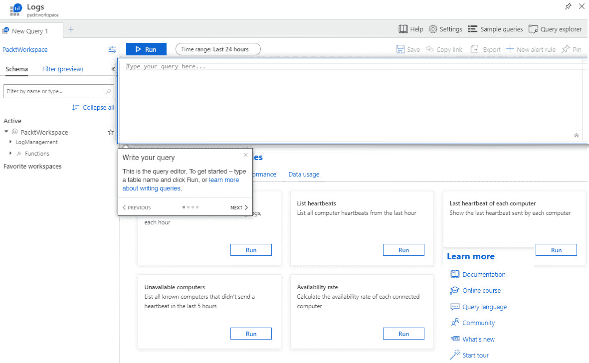

Azure Monitor 查询编辑器

1.  在这里，你可以选择一些默认查询。这些查询显示在屏幕的底部。包括查询不可用计算机、计算机的最后心跳信息等等。将以下查询添加到查询编辑器窗口，以获取数据：

+   +   这个查询将检索过去一天内错误事件最多的前 10 台计算机：

```
Event | where (EventLevelName == "Error") | where (TimeGenerated > ago(1days)) | summarize ErrorCount = count() by Computer | top 10 by ErrorCount desc
```

+   +   这个查询将创建一个折线图，显示上周每台计算机的处理器使用情况：

```
Perf | where ObjectName == "Processor" and CounterName == "% Processor Time" | where TimeGenerated between (startofweek(ago(7d)) .. endofweek(ago(7d)) ) | summarize avg(CounterValue) by Computer, bin(TimeGenerated, 5min) | render timechart 
```

关于如何开始使用 Kusto 查询语言的详细概述和教程超出了本书的范围。如果你想了解更多关于此查询语言的信息，可以参考[`docs.microsoft.com/en-us/azure/azure-monitor/log-query/get-started-queries`](https://docs.microsoft.com/en-us/azure/azure-monitor/log-query/get-started-queries)。

# 摘要

本章中，我们讲解了*管理 Azure 订阅和资源*目标的第二部分。我们涵盖了 Azure Monitor 的各个方面，以及如何使用指标来监控所有 Azure 资源和警报，以便在 Azure 资源发生某些事件时收到通知。我们还使用了 Azure Log Analytics 并创建了查询，以便从日志中提取有价值的数据。

在下一章，我们将讲解本考试目标的第三部分（也是最后一部分）。在那一章中，我们将介绍如何管理**基于角色的访问控制**（**RBAC**）。

# 问题

请回答以下问题，以测试你对本章内容的理解。你可以在本书末尾的*评估*部分找到答案：

1.  Azure Log Analytics 现在是 Azure Monitor 的一部分吗？

    +   是

    +   否

1.  假设你想创建一个查询以从虚拟机中检索特定的日志数据。你需要编写 SQL 语句来检索吗？

    +   是

    +   否

1.  行动组是否用于启用 Azure Monitor 的指标？

    +   是

    +   否

# 进一步阅读

你可以查看以下链接，获取有关本章内容的更多信息：

+   *Azure Monitor 概述*：[`docs.microsoft.com/en-us/azure/azure-monitor/overview`](https://docs.microsoft.com/en-us/azure/azure-monitor/overview)

+   *从你的 Azure 资源收集和使用日志数据*：[`docs.microsoft.com/en-us/azure/azure-monitor/platform/diagnostic-logs-overview`](https://docs.microsoft.com/en-us/azure/azure-monitor/platform/diagnostic-logs-overview)

+   *在 Azure Monitor 中分析日志数据*：[`docs.microsoft.com/en-us/azure/azure-monitor/log-query/log-query-overview`](https://docs.microsoft.com/en-us/azure/azure-monitor/log-query/log-query-overview)

+   *使用 Azure Monitor 中的视图设计器创建自定义视图*：[`docs.microsoft.com/en-us/azure/azure-monitor/platform/view-designer`](https://docs.microsoft.com/en-us/azure/azure-monitor/platform/view-designer)

+   *Azure Monitor 命名和术语变更*： [`docs.microsoft.com/en-us/azure/azure-monitor/terminology`](https://docs.microsoft.com/en-us/azure/azure-monitor/terminology)
