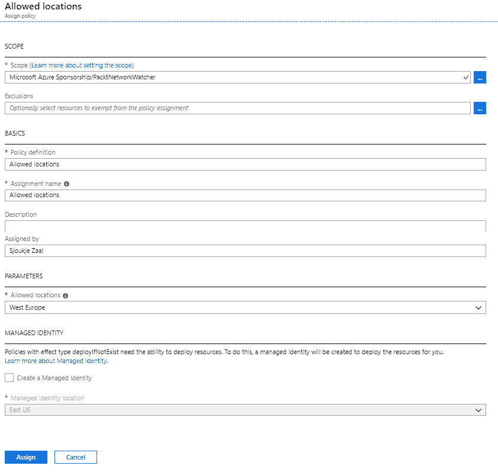

# 管理基于角色的访问控制

在上一章中，我们通过分析 Azure 中的资源利用和消耗，完成了本书目标的第二部分。我们介绍了如何使用 Azure Monitor 监控不同的 Azure 资源，以及如何使用 Azure Log Analytics 查询日志。

本章将涵盖《管理 Azure 订阅和资源》目标的最后部分，通过介绍**基于角色的访问控制**（**RBAC**）。你将学习如何通过 Azure 门户分配 RBAC 角色来配置 Azure 资源的访问权限。你还将学习如何通过将全局管理员分配给 Azure 订阅和其他资源来配置管理访问。你将学习如何创建自定义角色，当用户需要自定义权限时可以应用这些角色。本章最后将介绍 Azure 策略以及如何将其应用于 Azure 资源。

本章将涉及以下主题：

+   RBAC

+   通过分配角色配置对 Azure 资源的访问

+   配置 Azure 的管理访问

+   创建自定义角色

+   Azure 策略

+   实施和分配 Azure 策略

# 技术要求

本章将使用 Azure PowerShell（[`docs.microsoft.com/en-us/powershell/azure/install-az-ps?view=azps-1.8.0`](https://docs.microsoft.com/en-us/powershell/azure/install-az-ps?view=azps-1.8.0)）作为示例。

示例应用程序的源代码可以从[`github.com/PacktPublishing/Microsoft-Azure-Administrator-Exam-Guide-AZ-103/tree/master/Chapter03`](https://github.com/PacktPublishing/Microsoft-Azure-Administrator-Exam-Guide-AZ-103/tree/master/Chapter03)下载。

# RBAC

使用 RBAC，你可以管理谁有权访问你租户内的不同 Azure 资源。你还可以设置用户对不同 Azure 资源的操作权限。

分配权限的最佳实践是使用最小权限原则；这意味着只授予用户完成工作所需的确切权限。用户、组和应用程序被添加到 Azure 中的角色中，这些角色具有特定的权限。你可以使用 Azure 提供的内置角色，也可以在 RBAC 中创建自定义角色。

Azure 中的角色可以添加到特定的作用域中。这个作用域可以是 Azure 订阅、Azure 资源组或 Web 应用程序。Azure 然后使用访问继承；添加到父资源的角色会自动授予对子资源的访问权限。例如，添加到 Azure 订阅中的组将获得对该订阅中所有资源组和基础资源的访问权限。而添加到**虚拟机**（**VM**）的用户只会获得对该虚拟机的访问权限。

让我们从查看内置角色开始，详细了解 RBAC。

# 内置角色

Azure 提供了多种内置角色，可以用于将权限分配给用户、组和应用程序。RBAC 提供以下三种标准角色，可以分配给每个 Azure 资源：

+   **所有者（Owner）**：此角色中的用户可以管理一切，并且可以创建新资源。

+   **贡献者（Contributor）**：此角色中的用户可以管理一切，像所有者角色中的用户一样，但他们不能将访问权限分配给其他人。

+   **读取者（Reader）**：此角色中的用户可以读取所有内容，但不允许进行任何更改。

除了标准角色，每个 Azure 资源还有一些作用域限定在特定资源上的角色。例如，你可以将用户、组或应用程序分配到 SQL 安全管理器角色，从中他们可以管理所有与 Azure SQL Server 相关的安全策略，或者你可以将他们分配到虚拟机贡献者角色，允许他们管理虚拟机，但不能管理连接到虚拟机的 VNet 或存储帐户。

要查看 Azure 提供的所有内置角色，你可以参考 [`docs.microsoft.com/en-us/azure/role-based-access-control/built-in-roles`](https://docs.microsoft.com/en-us/azure/role-based-access-control/built-in-roles)。

尽管这些内置角色通常涵盖了所有可能的用例，但它们无法满足组织中的每一个需求。为了在角色分配中提供灵活性，RBAC 提供了创建自定义角色的能力。让我们来看看这个功能。

# 自定义角色

当没有任何内置角色符合需求时，你还可以在 RBAC 中创建自定义角色。自定义角色可以分配给与内置角色相同的资源，并且只能通过 PowerShell、CLI 和 REST API 创建，不能在 Azure 门户中创建。在每个 Azure 租户中，你最多可以创建 2,000 个角色。

自定义角色在 JSON 中定义，部署后，它们存储在 Azure AD 租户中。通过将它们存储在 Azure AD 租户中，可以在连接到 Azure AD 租户的所有不同 Azure 订阅中使用它们。

# 通过分配角色来配置对 Azure 资源的访问

如果你所在组织的用户需要访问 Azure 资源的权限，你需要将该用户分配到 Azure 中的相应角色。在本演示中，我们将为用户分配虚拟机的管理员访问权限。要配置用户对虚拟机的访问权限，你需要执行以下步骤：

1.  通过打开 [`portal.azure.com`](https://portal.azure.com) 导航到 Azure 门户。

1.  打开 `PacktNetworkWatcher` 资源组并从列表中选择 VM1：


PacktNetworkWatcher 资源

1.  你将被重定向到虚拟机设置窗口。

1.  在设置窗口中，选择访问控制（IAM），然后点击顶部菜单中的 **添加 | 添加角色分配**：


访问控制设置

1.  在添加角色分配窗口中，指定以下值：


添加角色分配刀片

1.  点击 **保存**。

1.  现在该用户拥有虚拟机的管理员权限。

在此演示中，我们为一个用户分配了虚拟机的管理员权限。接下来，我们将展示如何配置 Azure 管理访问。

# 配置 Azure 管理访问

Azure 的管理访问可以在订阅级别配置。为此，请执行以下步骤：

1.  访问 Azure 门户，通过打开 [`portal.azure.com`](https://portal.azure.com)。

1.  选择 **所有服务**，并在搜索框中输入 `subscriptions`。然后，选择 **订阅**，如以下截图所示：


选择订阅

1.  从列表中选择您希望授予管理访问权限的订阅。

1.  在 **订阅设置** 刀片中，选择 **访问控制 (IAM)**，然后点击顶部菜单中的 **添加 | 添加共同管理员**：


访问控制设置

1.  在 **添加共同管理员** 刀片中，指定以下值：


添加共同管理员

1.  点击 **添加**。

现在我们已经配置了 Azure 的管理访问，接下来我们将介绍如何为用户创建自定义角色。

# 创建自定义角色

在以下示例中，我们将创建一个仅能重新启动 Azure 中虚拟机的自定义角色。为此，您需要创建一个 JSON 文件，使用 PowerShell 部署该文件。我们将在 JSON 文件中将该角色分配给一个用户账户，如下所示：

1.  您可以使用以下 JSON 代码定义自定义角色。您应该将 `Id` 设置为 null，因为在创建时会为自定义角色分配一个 ID。我们将自定义角色添加到两个 Azure 订阅中，如下所示（请在 `AssignableScopes` 部分替换为您的订阅 ID）：

```
 { 
"Name": "Packt Custom Role",
 "Id": null,
 "IsCustom": true,
 "Description": "Allows for read access to Azure Storage, Network and Compute resources and access to support",
    "Actions": [
        "Microsoft.Compute/*/read",
        "Microsoft.Storage/*/read",
        "Microsoft.Network/*/read",
        "Microsoft.Resources/subscriptions/resourceGroups/read",
        "Microsoft.Support/*"
    ],
    "NotActions": [
    ],
    "AssignableScopes": [
    "/subscriptions/********-****-****-****-***********",
    "/subscriptions/********-****-****-****-***********"
    ]
}
```

1.  将 JSON 文件保存在计算机 `C:` 盘的名为 `CustomRoles` 的文件夹中。然后，运行以下 PowerShell 脚本来创建角色。首先，按照以下方式登录您的 Azure 账户：

```
Connect-AzAccount
```

1.  如有必要，选择正确的订阅：

```
Select-AzSubscription -SubscriptionId "********-****-****-****-***********"
```

1.  然后，通过将 JSON 文件导入 PowerShell 来在 Azure 中创建自定义角色：

```
New-AzRoleDefinition -InputFile "C:\CustomRoles\PacktCustomRole.json"
```

在此演示中，我们创建了一个自定义角色，仅能重新启动 Azure 中的虚拟机。接下来，我们将展示如何使用 Azure Policy 创建策略。

# Azure Policy

使用 Azure Policy，您可以创建对 Azure 资源执行规则的策略。通过这种方式，资源将保持符合服务级协议和企业标准。使用 Azure Policy，您可以评估所有不同的 Azure 资源是否符合规定。例如，您可以创建一个策略，仅允许在 Azure 环境中使用特定大小的虚拟机（VM）。当该策略创建后，Azure 会检查所有新的和现有的虚拟机，看看它们是否符合该策略。

Azure 策略与 RBAC 不同，因为 Azure 策略关注现有资源及其部署过程中的资源属性，而 RBAC 关注在不同范围内的用户操作。例如，用户可以被添加为资源组的所有者角色，这将赋予该用户对该资源组的完全权限。

Azure 提供了内置策略和自定义策略。以下是一些内置策略的示例：

+   **允许的虚拟机 SKU**：此策略指定了一组可以在 Azure 中部署的虚拟机大小和类型。

+   **允许的位置**：此策略限制了资源可以部署的可用位置。

+   **不允许的资源类型**：此策略禁止某些资源类型的部署。

+   **允许的资源类型**：此策略定义了您可以部署的资源类型列表。未列入该列表的资源类型无法在 Azure 环境中部署。

+   **允许的存储帐户 SKU**：此策略指定了一组可以部署的存储帐户 SKU。

如果内置策略不符合您的需求，您可以创建自定义策略。自定义策略是以 JSON 格式创建的，格式如下所示。代码的第一部分设置了不同的属性：

```
{
    "properties": {
        "displayName": "Deny storage accounts not using only HTTPS",
        "description": "Deny storage accounts not using only HTTPS. Checks the supportsHttpsTrafficOnly property on StorageAccounts.",
        "mode": "all",
        "parameters": {
            "effectType": {
                "type": "string",
                "defaultValue": "Deny",
                "allowedValues": [
                    "Deny",
                    "Disabled"
                ],
                "metadata": {
                    "displayName": "Effect",
                    "description": "Enable or disable the execution of the policy"
                }
            }
        },

```

在这部分代码中，我们查看的是策略规则：

```
       "policyRule": {
            "if": {
                "allOf": [
                    {
                        "field": "type",
                        "equals": "Microsoft.Storage/storageAccounts"
                    },
                    {
                        "field": "Microsoft.Storage/storageAccounts/supportsHttpsTrafficOnly",
                        "notEquals": "true"
                    }
                ]
            },
            "then": {
                "effect": "[parameters('effectType')]"
            }
        }
    }
}
```

策略可以在管理组级别、订阅级别或资源组级别分配。

# 实施和分配 Azure 策略

要实施 Azure 策略，您必须先分配它们。在本演示中，我们将向 Azure 资源组分配一个允许的位置策略。为此，您需要执行以下步骤：

1.  通过打开 [`portal.azure.com`](https://portal.azure.com) 进入 Azure 门户。

1.  打开 `PacktNetworkWatcher` 资源组。

1.  然后，在“设置”下，选择“策略”：


策略

1.  单击“开始使用”菜单项。您将看到一个与以下页面类似的页面：


开始使用 Azure 策略

1.  第一步是查看并选择策略定义。单击页面上的“查看定义”链接。

1.  您将进入订阅中可用的内置和自定义策略。在右侧的搜索框中输入 `Locations`：


搜索位置策略

1.  然后，选择“允许的位置”策略；您将被重定向到可以查看 JSON 格式策略定义并分配该策略的页面：


策略定义

1.  单击顶部菜单中的“分配”。

1.  要分配该策略，您需要填写以下值：

    +   **范围**：选择一个订阅，并可以选择一个资源组。为了演示，我选择了 `PacktNetworkWatcher` 资源组。

    +   允许的位置：仅选择西欧，如以下截图所示：



分配策略定义

1.  点击“分配”。该策略将分配给资源组。

1.  现在，当我们向资源组中添加新资源（例如新虚拟机）并将位置设置为“东部美国”时，我们会注意到屏幕左上方出现了验证错误。点击它后，你将在屏幕右侧看到以下详细信息：


验证错误

本节中，我们介绍了如何在 Azure 中分配策略。

# 摘要

本章中，我们通过介绍如何通过分配角色来配置对 Azure 资源的访问、如何配置管理访问、如何创建自定义角色、如何分配 RBAC 角色以及如何实施和分配 Azure 策略，涵盖了*管理 Azure 订阅和资源*目标的第三部分内容。

在下一章，我们将介绍实施和管理存储的新目标，内容包括如何创建和配置存储帐户。

# 问题

回答以下问题，测试你对本章内容的理解。你可以在本书最后的*评估*部分找到答案：

1.  使用 Azure 策略时，你可以为用户分配权限，从而让他们访问你的 Azure 资源吗？

    +   是

    +   不是

1.  假设你想检查你的 Azure 订阅中的所有虚拟机是否使用了托管磁盘。你可以使用 Azure 策略来做到这一点吗？

    +   是

    +   不是

1.  自定义策略是用 XML 创建的吗？

    +   是

    +   不是

# 进一步阅读

你可以查看以下链接，获取有关本章中涵盖的主题的更多信息：

+   *什么是 Azure 资源的基于角色的访问控制（RBAC）?*: [`docs.microsoft.com/en-us/azure/role-based-access-control/overview`](https://docs.microsoft.com/en-us/azure/role-based-access-control/overview)

+   *排查 Azure 资源的 RBAC 问题*: [`docs.microsoft.com/en-us/azure/role-based-access-control/troubleshooting`](https://docs.microsoft.com/en-us/azure/role-based-access-control/troubleshooting)

+   *Azure 策略服务概述*: [`docs.microsoft.com/en-us/azure/governance/policy/overview`](https://docs.microsoft.com/en-us/azure/governance/policy/overview)

+   *创建自定义策略定义*: [`docs.microsoft.com/en-us/azure/governance/policy/tutorials/create-custom-policy-definition`](https://docs.microsoft.com/en-us/azure/governance/policy/tutorials/create-custom-policy-definition)
