# 第四章：创建和配置存储帐户

在上一章中，我们介绍了如何在 Azure 中配置**基于角色的访问控制**（**RBAC**），如何创建自定义角色，以及如何实施和分配 Azure 策略。

本章将介绍一个新的目标，即实施和管理存储*。在本章中，我们将覆盖不同类型的存储帐户，你将学习哪些类型适用于在 Azure 中存储你的数据。我们还将介绍如何安装 Azure Storage Explorer，它可以用来管理 Azure 存储帐户中的数据。我们将探讨如何使用**共享访问签名**（**SAS**）来保护数据，以及如何实施存储复制来确保数据安全。

本章将覆盖以下主题：

+   Azure 存储帐户

+   创建和配置存储帐户

+   安装和使用 Azure Storage Explorer

+   配置存储帐户的网络访问

+   生成和管理 SAS

+   实施 Azure 存储复制

# 技术要求

本章将使用 Azure PowerShell([`docs.microsoft.com/en-us/powershell/azure/install-az-ps?view=azps-1.8.0`](https://docs.microsoft.com/en-us/powershell/azure/install-az-ps?view=azps-1.8.0))作为示例。

我们的示例应用程序的源代码可以从[`github.com/PacktPublishing/Microsoft-Azure-Administrator-Exam-Guide-AZ-103/tree/master/Chapter04`](https://github.com/PacktPublishing/Microsoft-Azure-Administrator-Exam-Guide-AZ-103/tree/master/Chapter04)下载。

# Azure 存储帐户

Azure 提供了多种类型的存储帐户，可以用于在 Azure 中存储各种文件。你可以存储文件、文档和数据集，也可以存储 Blob 和**虚拟硬盘**（**VHDs**）。甚至还有专门用于归档的存储帐户类型。在下一节中，我们将讨论 Azure 提供的不同类型的存储帐户以及存储帐户复制类型。

# 存储帐户类型

Azure 存储提供三种不同的帐户类型，可用于 Blob、表格、文件和队列存储。

# 一般用途 v1

**一般用途 v1**（**GPv1**）存储帐户是最古老的存储帐户类型。它提供页面 Blob、块 Blob、文件、队列和表格的存储，但它不是最具成本效益的存储帐户类型。它是唯一可以用于经典部署模型的存储帐户类型。它不支持最新的功能，例如访问层。

# Blob 存储

Blob 存储帐户提供`StorageV2`帐户的所有功能，除了它仅支持块 Blob（和附加 Blob）。不支持页面 Blob。它提供访问层，包括热存储、冷存储和归档存储，后面会在本章中进一步讨论。

# 一般用途 v2（GPv2）

`StorageV2` 是最新的存储账户类型，它将 V1 存储与 Blob 存储结合在一起。它提供了所有最新功能，如 Blob 存储的访问层，并且降低了成本。微软推荐使用这种账户类型，而非 V1 和 Blob 存储账户类型。

V1 存储账户可以轻松升级为 V2。

如需了解不同账户类型的定价和计费信息，请参考以下定价页面：[`azure.microsoft.com/en-us/pricing/details/storage/`](https://azure.microsoft.com/en-us/pricing/details/storage/)。

# 存储复制类型

存储在 Azure 中的数据始终会进行复制，以确保数据的持久性和高可用性。这样可以保护数据免受计划外和计划内事件的影响，例如网络或电力故障、自然灾害以及恐怖袭击。它还确保在这些事件发生时，您的存储账户仍然能满足 SLA。数据可以在同一数据中心内进行复制，跨同一区域的不同可用区的数据中心之间进行复制，或者跨不同的区域进行复制。这些复制类型分别被称为 **本地冗余存储** (**LRS**)、**可用区冗余存储** (**ZRS**)、**地理冗余存储** (**GRS**) 和 **读取访问地理冗余存储** (**RA-GRS**)，这些将在接下来的章节中详细讲解。

在创建新的存储账户时，你需要选择一个复制类型。存储账户可以在 Azure 门户中创建，也可以通过 PowerShell 或 CLI 创建。

# LRS

LRS 是最便宜的选项，会在同一数据中心内将数据复制三次。当你向存储账户发出写入请求时，数据会在请求期间同步写入所有三个副本。当数据完全复制时，请求将被提交。使用 LRS，数据将在一个存储规模单元内跨多个更新域和故障域进行复制。

# ZRS

ZRS 当前处于预览阶段，仅在 US East 2 和 US Central 可用。它在两个或三个数据中心之间复制三个副本。数据会同步写入所有三个副本，分布在一个或两个区域。它还会像 LRS 一样，在数据所在的同一数据中心内将数据复制三次。

# GRS

GRS 在同一区域内将数据复制三次，像 ZRS 一样，并且还将数据异步复制到其他区域的三个副本。

# RA-GRS

RA-GRS 提供跨两个区域的地理复制，并且在辅助位置提供对数据的只读访问。这将最大化存储账户的可用性。当启用 RA-GRS 时，您的数据将在主端点和辅助端点之间同时可用。辅助端点与主端点类似，但会在其后添加 **secondary** 后缀。为存储账户生成的访问密钥可以用于两个端点。

现在我们已经介绍了在创建存储帐户时设置的不同存储复制类型，我们可以看看 Azure 提供的不同存储帐户。

# Azure Blob 存储

Azure Blob 存储提供了云中的非结构化数据存储。它可以存储各种数据，如文档、VHD、图像和音频文件。你可以创建两种类型的 Blob。第一种类型是页面 Blob，用于存储磁盘。因此，当你有一个需要存储并附加到虚拟机（VM）的 VHD 时，你需要创建一个页面 Blob。页面 Blob 的最大大小为 1 TB。

另一种类型是块 Blob，它基本涵盖了你可以在 Azure 中存储的所有其他数据类型，如文件和文档。块 Blob 的最大大小为 200 GB。然而，还有第三种 Blob 类型，称为追加 Blob，但这个 Blob 是 Azure 内部使用的，不能用来存储实际文件。有几种方法可以将 Blob 复制到 Blob 存储帐户。你可以使用 Azure 门户（一次只能复制一个）或 Azure Storage Explorer，或者你可以通过 .NET、PowerShell、CLI 或调用 REST API 以编程方式复制文件。

# 访问层

Blob 存储帐户使用访问层来确定数据的访问频率。根据该访问层，你将会收到账单。Azure 提供了三种存储访问层：热、Cool 和存档。

# 热

热访问层最适合存储经常访问的数据和正在积极使用的数据。例如，你可以将网站的图像和样式表存储在热访问层中。该访问层的存储成本高于其他访问层，但访问文件的费用较低。

# Cool

Cool 访问层最适合存储不常访问的数据（30 天内访问少于一次）。与热访问层相比，Cool 访问层的存储成本较低，但访问文件的费用更高。这个访问层适合存储备份和较旧的内容，这些内容不常被查看。

# 存档

存档存储层是在 Blob 层面设置的，而不是在存储层面设置的。与热访问层和 Cool 访问层相比，它具有最低的数据存储成本和最高的访问数据成本。这个存储层适用于至少会在存档中保存 180 天的数据，并且在访问之前会有几个小时的延迟。这个存储层最适合长期备份或合规性和存档数据。存档层中的 Blob 是离线的，不能读取（除元数据外）、复制、覆盖或修改。

# Azure 文件存储

使用 Azure 文件，你可以在云端创建文件共享。你可以使用**服务器消息块**（**SMB**）协议访问文件，这是一个行业标准，支持在 Linux、Windows 和 macOS 设备上使用。Azure 文件也可以像本地驱动器一样挂载在这些设备上，并且可以使用 Azure 文件同步在 Windows Server 上进行缓存，以加速访问。

文件共享可以跨多个机器使用，这使得它们非常适合存储多个机器访问的文件或数据，如开发机器的工具、配置文件或日志数据。Azure 文件共享是 Azure 存储客户端库的一部分，并提供 Azure 存储 REST API，开发者可以在他们的解决方案中利用该 API。

有关如何配置 Azure 文件存储的详细信息，将在第六章，*配置 Azure 文件并实现 Azure 备份*中详细讲解。

# Azure 磁盘存储

用于虚拟机的磁盘存储在 Azure Blob 存储中，作为页面 Blob。Azure 为每个虚拟机存储两个磁盘：虚拟机的实际操作系统（VHD）和一个临时磁盘，用于短期存储。这些数据会在虚拟机关闭或重启时被擦除。

Azure 提供两种不同的性能层级：标准磁盘存储和高级磁盘存储。

# 标准磁盘存储

标准磁盘存储使用 HDD 驱动器来存储数据，是你可以选择的最具成本效益的存储层级。它只能使用 LRS 或 GRS 来支持数据和应用程序的高可用性。

# 高级磁盘存储

使用高级磁盘存储时，数据存储在 SSD 上。并非所有 Azure 虚拟机系列都可以使用此类型存储。它只能与 DS、DSv2、GS、LS 或 FS 系列的 Azure 虚拟机一起使用，提供高性能和低延迟的磁盘支持。

# 非托管磁盘与托管磁盘

托管磁盘会自动为你处理存储账户的创建。而对于非托管磁盘（即传统的虚拟机磁盘），你需要手动创建一个存储账户，并在创建虚拟机时选择该存储账户。而使用托管磁盘时，这一负担由 Azure 为你处理。你只需选择磁盘类型和性能层级（标准或高级），然后托管磁盘将被创建。它还会自动为你处理扩展。

Microsoft 推荐使用托管磁盘而非非托管磁盘。

现在我们已经涵盖了关于不同存储账户的所有背景信息，接下来我们将创建一个新的存储账户。

# 创建和配置存储账户

在将任何数据或文件上传到 Azure 存储之前，必须创建一个存储账户。这可以通过 Azure 门户、PowerShell、CLI、ARM 模板或 Visual Studio 完成。

在本演示中，我们将使用 PowerShell 创建一个存储账户：

1.  首先，我们需要登录 Azure 账户：

```
Connect-AzAccount
```

1.  如果需要，选择正确的订阅：

```
Select-AzSubscription -SubscriptionId "********-****-****-****-***********"
```

1.  创建资源组：

```
New-AzResourceGroup -Name PacktPubStorageAccount -Location EastUS
```

1.  创建存储账户：

```
New-AzStorageAccount -ResourceGroupName PacktPubStorageAccount -AccountName packtpubstorage -Location "East US" -SkuName Standard_GRS -Kind StorageV2 -AccessTier Hot
```

在这个演示中，我们使用 PowerShell 创建了一个新的存储账户。如果您是存储账户的新手，我强烈建议您也从 Azure 门户创建存储账户。这样，您将看到所有可用的存储账户类型、存储复制类型、可以选择的访问层级、不同的性能层级（标准或高级），以及它们之间的关联。

现在我们已经创建了一个新的存储账户，我们可以安装 Azure 存储资源管理器工具。

# 安装和使用 Azure 存储资源管理器

Azure 存储资源管理器是一个独立的应用程序，可用于轻松处理存储在 Azure 存储账户中的不同类型的数据。您可以使用 Azure 存储资源管理器上传、下载和管理文件、队列、表、块、数据湖存储和 Cosmos DB 实体。除此之外，您还可以使用该应用程序配置和管理存储账户的跨域资源共享（CORS）规则。此应用程序可在 Windows、Linux 和 macOS 设备上使用。

要安装该应用程序，您需要执行以下步骤：

1.  转到 [`azure.microsoft.com/en-us/features/storage-explorer/`](https://azure.microsoft.com/en-us/features/storage-explorer/) 下载应用程序。

1.  下载完成后，安装应用程序。

1.  安装应用程序后，打开应用程序。您将提示连接到 Azure 环境。有几个选择可供选择。您可以通过使用管理员凭据连接到 Azure 环境添加 Azure 账户，使用共享访问签名（稍后在本章中介绍），使用存储账户名称和密钥，还可以选择“连接到本地仿真器”选项。对于此演示，请保持默认选项并点击“**登录**”：

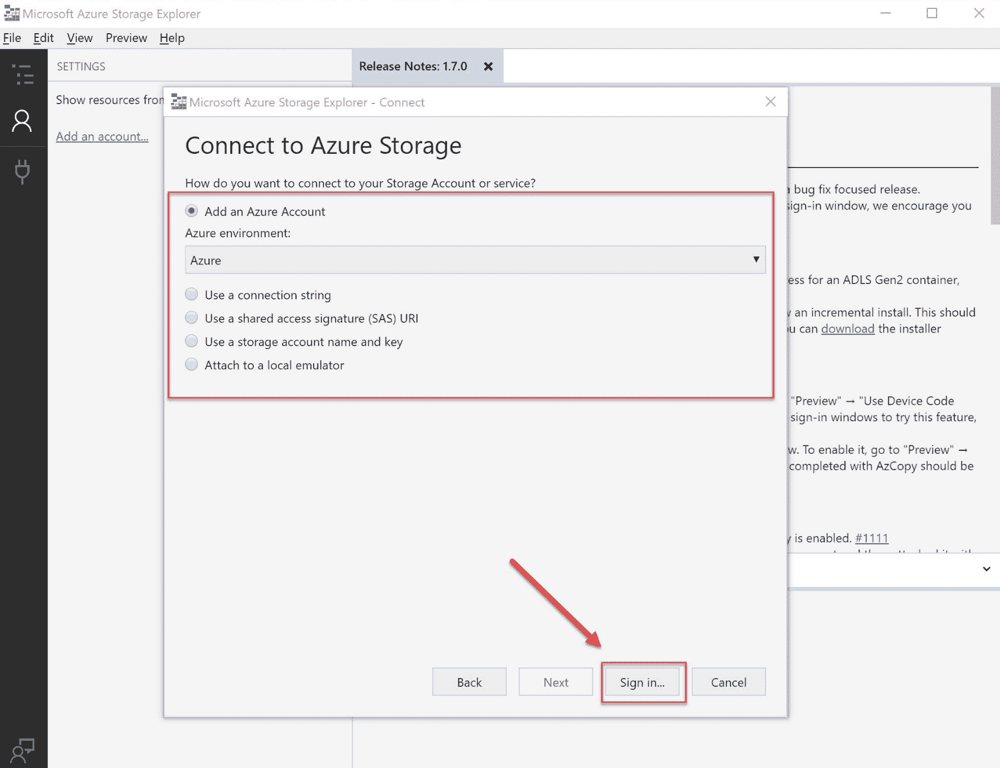

连接到 Azure 存储

1.  输入您的凭据并登录。

1.  所有订阅都将添加到左侧窗格。完成后，点击“应用”：

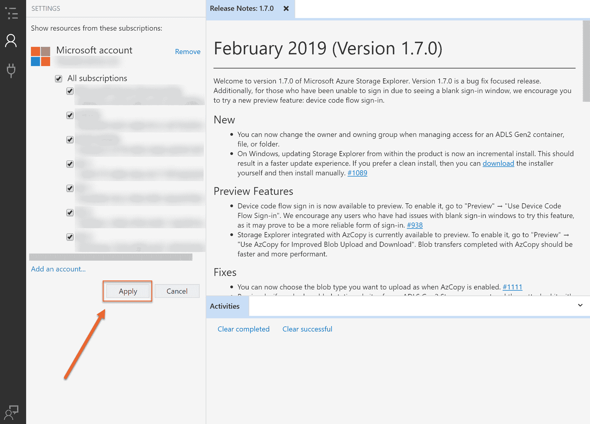

应用订阅

1.  您现在可以从左侧窗格深入查看我们在第一个演示中创建的订阅和存储账户。选择存储账户。从那里，您可以访问块容器、文件共享、队列和表：

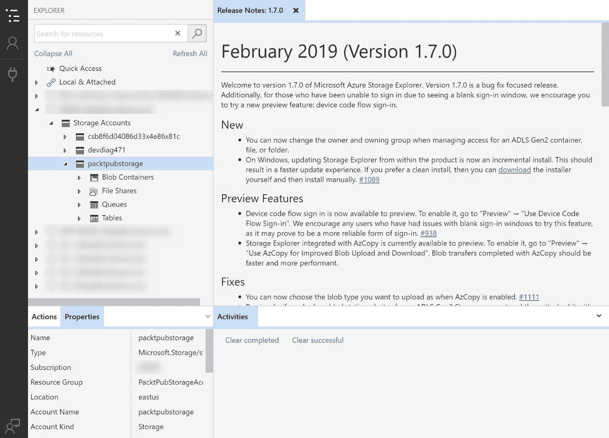

存储账户设置

1.  要将一些文件添加到 Blob 容器，我们需要在存储帐户中创建一个 Blob 容器。因此，在左侧菜单中右键单击**Blob 容器**，然后选择**创建 Blob 容器**。命名容器为`packtblobcontainer`；现在，您可以将文件上传到该容器。在顶部菜单中点击**上传**按钮，点击**上传文件**，并从本地计算机中选择一些文件：

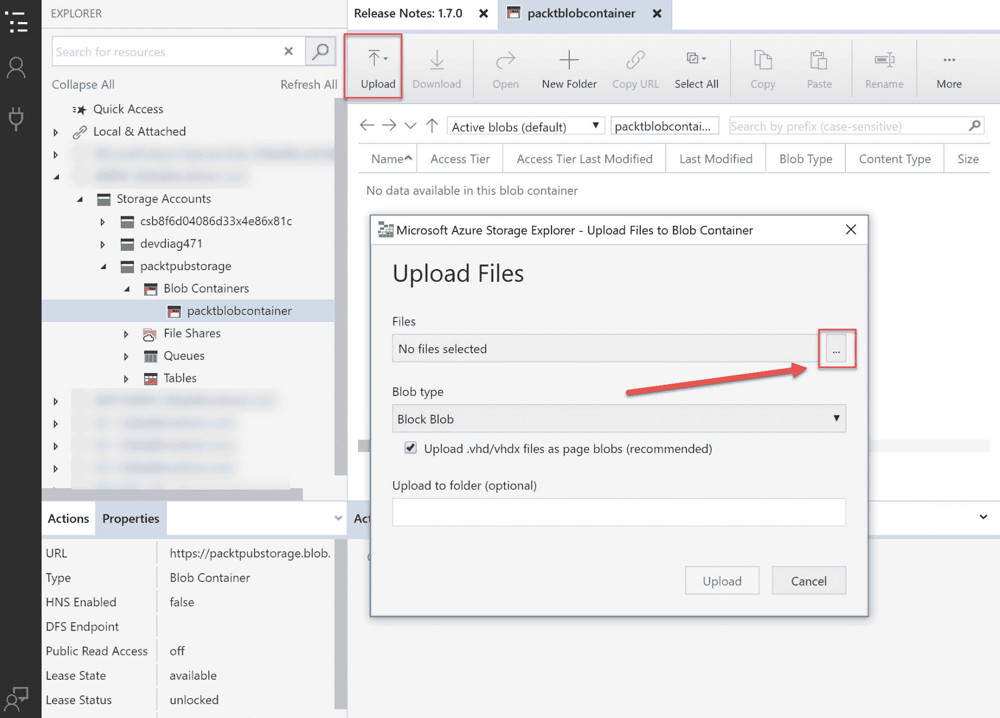

上传文件到 Blob 容器

您将看到文件被上传到 Blob 容器中。

如果您在 Azure 门户中导航到存储帐户的概述窗格，您会看到顶部菜单中有一个按钮，标记为**在资源管理器中打开**。这将打开 Azure 存储资源管理器，您可以使用它轻松管理存储帐户中的所有数据。

现在我们已经安装了 Azure 存储资源管理器工具，并将一些文件上传到了 Blob 容器，我们可以配置存储帐户的网络访问权限。

# 配置对存储帐户的网络访问

您可以将存储帐户的访问权限限制为一组特定的受支持网络。为此，您必须配置网络规则，以便只有通过特定网络集群请求数据的应用程序才能访问存储帐户。当这些网络规则生效时，应用程序需要在请求中使用适当的授权。这种授权可以通过 Azure Active Directory 凭证提供，适用于 Blob 和队列，使用 SAS 令牌或有效的帐户访问密钥。

在接下来的演示中，我们将配置对前一步中创建的存储帐户的网络访问权限。您可以通过 Azure 门户、PowerShell 或 CLIv2 管理存储帐户。我们将通过 Azure 门户设置此配置。因此，我们需要执行以下步骤：

1.  通过打开[`portal.azure.com`](https://portal.azure.com)访问 Azure 门户。

1.  转到我们在前一步中创建的存储帐户。

1.  在概述窗格中，在左侧菜单中选择**防火墙和虚拟网络**：

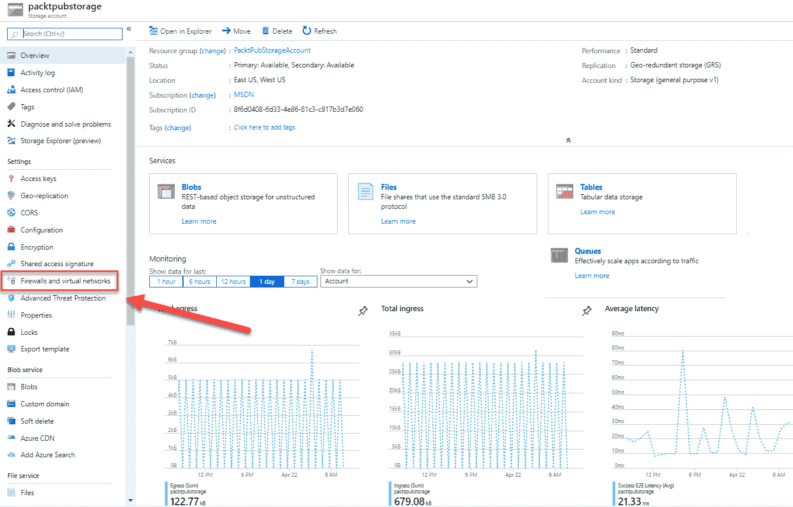

存储帐户概述窗格

1.  要通过新的网络规则授予对虚拟网络的访问权限，在虚拟网络下，有两个可供选择的选项：**所有网络**，允许来自所有网络（包括虚拟网络和本地网络）以及互联网的流量访问数据；和**选定网络**。如果选择此选项，您可以配置哪些网络可以从存储帐户访问数据。选择**选定网络**。然后，您可以选择是否要添加现有的虚拟网络或创建一个新的。对于本演示，请点击**+ 添加新虚拟网络**：

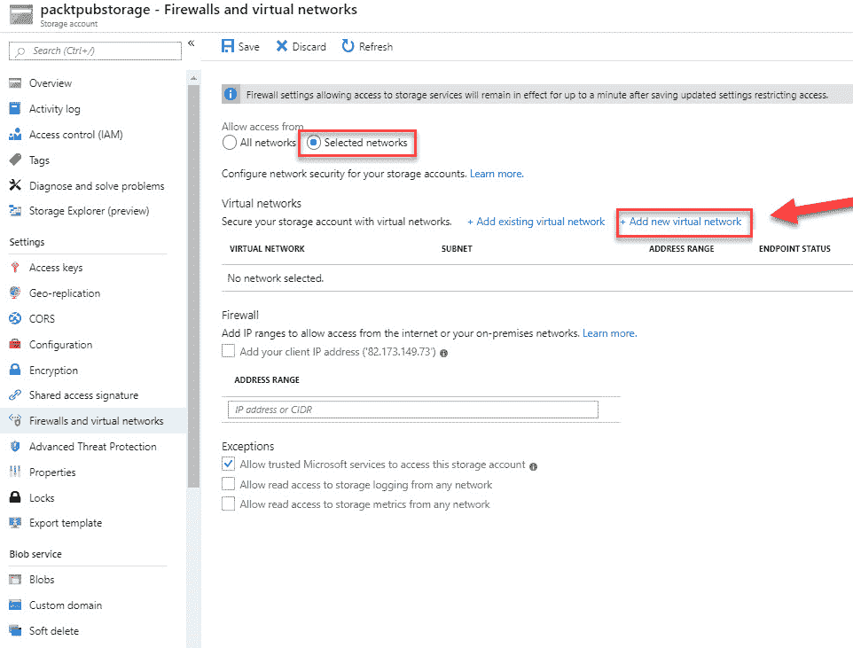

创建一个新网络

1.  将打开一个新的窗格，您需要在其中指定网络配置。指定如下截图所示的配置：

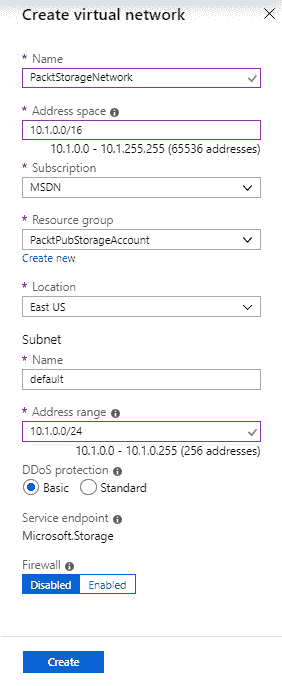

网络配置设置

1.  点击**创建**。

1.  虚拟网络将被添加到概览面板中。此存储帐户现在已加固，只能从使用此虚拟网络的应用程序和其他资源访问。在同一面板中，你还可以配置防火墙，并仅允许来自互联网或本地环境的特定 IP 范围：

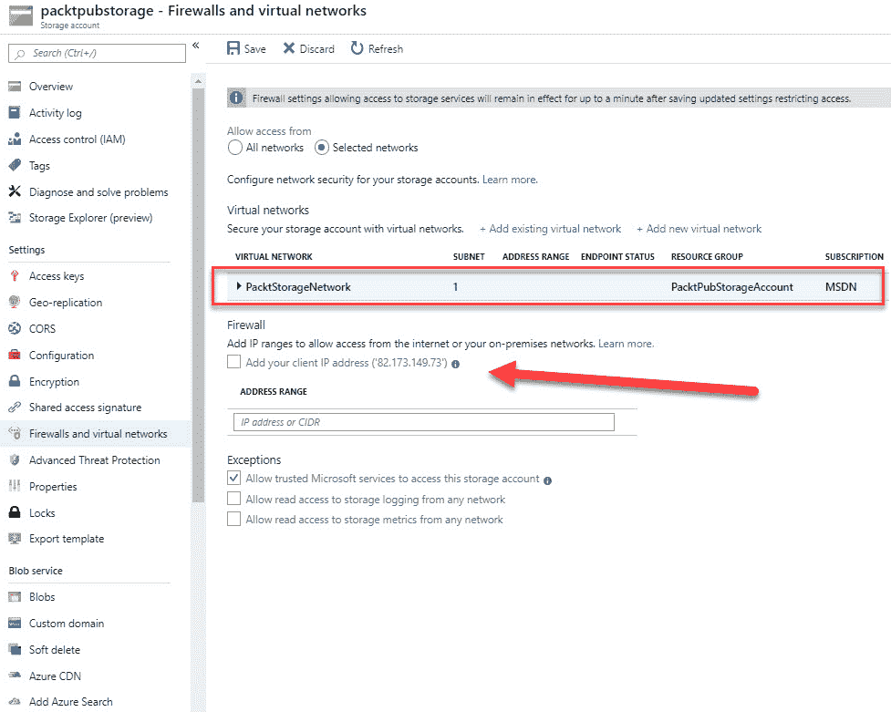

IP 范围

演示到此为止。在下一次演示中，我们将生成和管理 SAS。

# SAS 和访问密钥

使用 SAS，你可以为连接到存储帐户的客户端提供一种方式，授予对存储帐户中对象和数据的有限访问权限。使用 SAS，你无需将**访问密钥**暴露给客户端。

创建存储帐户时，将创建主密钥和次密钥。这两个密钥都可以授予对帐户及其所有资源的管理权限。暴露这些密钥也可能会让你的存储帐户受到疏忽或恶意使用的威胁。SAS 提供了一个安全的替代方案，可以让客户端根据你明确授予的权限，读取、写入和删除存储帐户中的数据，而无需使用帐户密钥。

在下一节中，我们将学习如何管理访问密钥，以及如何为存储帐户生成 SAS。

# 管理访问密钥

要管理访问密钥，请执行以下步骤：

1.  通过打开[`portal.azure.com`](https://portal.azure.com)访问 Azure 门户。

1.  再次进入我们在上一步创建的存储帐户。

1.  打开概览面板后，在**设置**下，选择**访问密钥**。

1.  在这里，你可以看到在创建存储帐户时为你生成的两个访问密钥。Azure 之所以为你生成两个访问密钥，是因为如果你重新生成一个新密钥，所有与该密钥相关的 SAS 将不再有效。然后，你可以让应用程序使用第二个密钥访问数据，一旦密钥重新生成，你可以将新密钥与客户端共享。你可以通过点击两个密钥旁边的按钮生成新密钥：

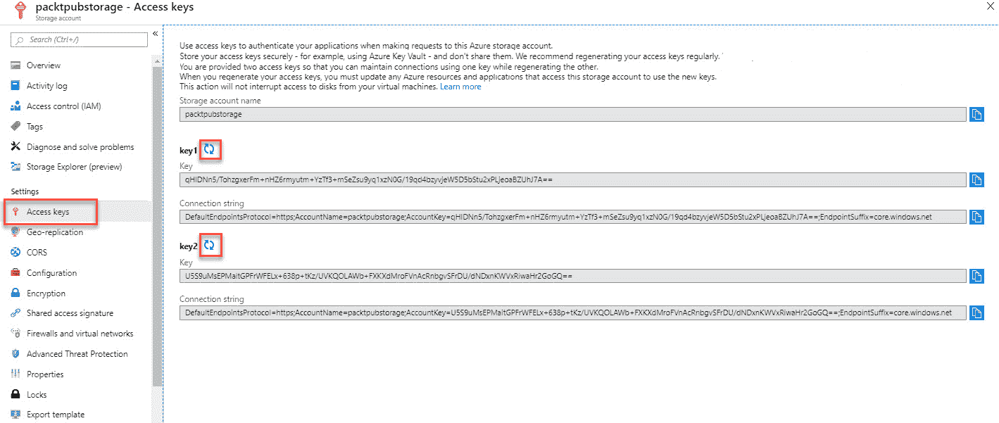

访问密钥

1.  每个密钥还会提供一个连接字符串，客户端应用可以使用该字符串访问存储帐户。

在下一节中，我们将为访问密钥生成 SAS。

# 生成 SAS

在本演示中，我们将为我们的 Blob 存储生成 SAS。要生成 SAS，请执行以下步骤：

1.  通过打开[`portal.azure.com`](https://portal.azure.com)访问 Azure 门户。

1.  再次进入我们在上一步创建的存储帐户。

1.  打开概览面板后，在**设置**下，选择**共享访问签名**：

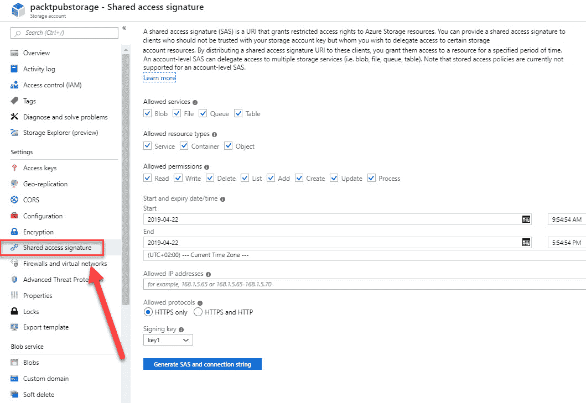

选择共享访问签名

1.  若只允许访问 Blob 存储，请禁用文件、队列和表。保留默认权限，然后选择过期日期和时间。你还可以在这里设置允许的协议。屏幕底部，你可以将这些权限应用于不同的密钥。保留**key1**被选中，然后点击**生成 SAS 和连接字符串**：

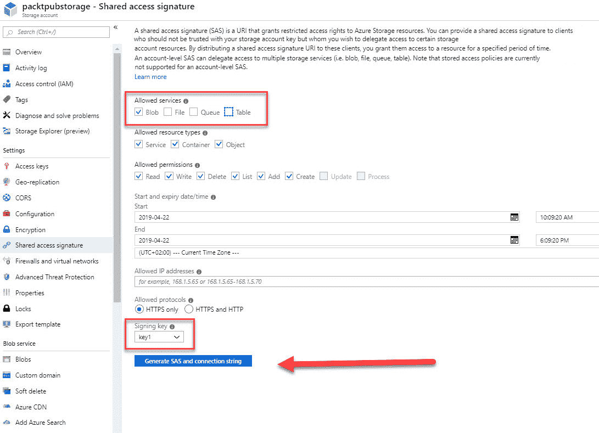

生成 SAS 和连接字符串

1.  现在你可以使用这个令牌从 Blob 存储请求数据。

本演示到此结束。在下一部分，我们将介绍如何实现 Azure 存储复制。

# 实现 Azure 存储复制

Azure 中的数据始终会进行复制，以确保数据的持久性和高可用性。Azure 存储会复制你的数据，以防止计划内和计划外事件的影响，包括临时硬件故障、网络或电力中断以及重大自然灾害。我们已经介绍了 Azure 为你的存储账户提供的不同复制类型。

存储复制可以在创建存储账户时进行设置。你也可以通过 Azure 门户、PowerShell 或 CLI 后续更改复制类型。要在 Azure 门户中更改此设置，你需要执行以下步骤：

1.  打开 [`portal.azure.com`](https://portal.azure.com)，导航到 Azure 门户。

1.  转到我们在上一步骤中创建的存储账户。

1.  在**设置**下，选择**配置**。在此面板中，点击**复制**，你可以更改复制类型：

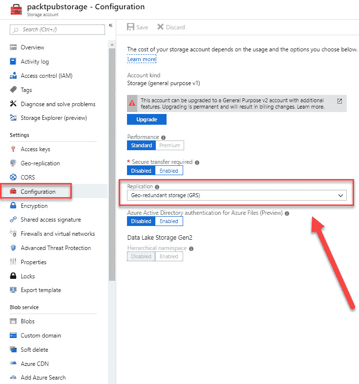

更改复制类型

# 总结

在本章中，我们介绍了*实现和管理存储*目标的第一部分。我们介绍了在 Azure 中可用的不同存储类型，以及何时使用它们。我们还介绍了如何使用 Azure 存储资源管理器管理数据，以及如何使用 SAS 保护我们的数据。最后，我们介绍了如何从存储账户进行数据复制。

在下一章中，我们将介绍本考试目标的第二部分。在该章中，我们将介绍如何将数据导入和导出到 Azure。

# 问题

回答以下问题以测试你对本章内容的掌握情况。你可以在本书结尾的*评估*部分找到答案：

1.  Azure 存储资源管理器应用程序只能在 Windows 设备上使用吗？

    +   是的

    +   不是

1.  你可以配置存储账户使其仅能从特定的虚拟网络访问，而不能从本地网络访问吗？

    +   是的

    +   不是

1.  你只能在创建存储账户时设置存储账户的复制类型吗？

    +   是的

    +   不是

# 进一步阅读

你可以查阅以下链接，了解更多关于本章内容的详细信息：

+   *Azure 存储文档*：[`docs.microsoft.com/en-us/azure/storage/`](https://docs.microsoft.com/en-us/azure/storage/)

+   *开始使用存储资源管理器*: [`docs.microsoft.com/en-us/azure/vs-azure-tools-storage-manage-with-storage-explorer?tabs=windows`](https://docs.microsoft.com/en-us/azure/vs-azure-tools-storage-manage-with-storage-explorer?tabs=windows)

+   *配置 Azure 存储防火墙和虚拟网络*: [`docs.microsoft.com/en-us/azure/storage/common/storage-network-security`](https://docs.microsoft.com/en-us/azure/storage/common/storage-network-security)

+   *Azure 存储冗余*: [`docs.microsoft.com/en-us/azure/storage/common/storage-redundancy`](https://docs.microsoft.com/en-us/azure/storage/common/storage-redundancy)
