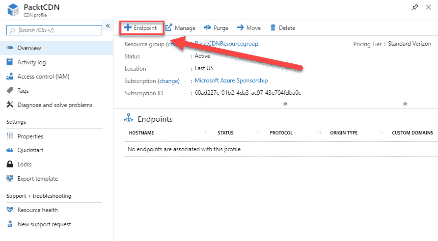

# 第五章：将数据导入到 Azure 和从 Azure 导出数据

在上一章中，我们介绍了 Azure 中可用的不同存储类型以及何时使用它们。我们还讲解了如何安装和使用 Azure 存储资源管理器来管理你的数据。

本章继续介绍 *实施与管理存储* 目标的第二部分。 本章的第一部分，我们将通过配置 Azure Blob 存储来创建存储帐户。本章的第二部分将讲解如何将数据导入到 Azure 以及从 Azure 导出数据。你将学习如何使用 Azure 作业导入和导出数据。本章的第三部分将聚焦于 Azure 中的 **内容交付网络（CDN）**。你将学习如何创建和配置 CDN， CDN 可用于在 Azure 边缘服务器上缓存静态内容。在本章的最后部分，我们将简要介绍 Azure Data Box。

本章将覆盖以下主题：

+   配置和使用 Azure Blob 存储

+   创建导入到 Azure 以及从 Azure 导出的作业

+   Azure CDN

+   配置 Azure CDN 终结点

+   Azure Data Box

# 技术要求

本章中的示例使用了 Azure PowerShell（[`docs.microsoft.com/en-us/powershell/azure/install-az-ps?view=azps-1.8.0`](https://docs.microsoft.com/en-us/powershell/azure/install-az-ps?view=azps-1.8.0)）。

我们的示例应用程序的源代码可以从 [`github.com/PacktPublishing/Microsoft-Azure-Administrator-Exam-Guide-AZ-103/tree/master/Chapter05`](https://github.com/PacktPublishing/Microsoft-Azure-Administrator-Exam-Guide-AZ-103/tree/master/Chapter05) 下载。

# 配置和使用 Azure Blob 存储

在上一章中，我们使用 PowerShell 创建了一个 Azure 存储帐户，并且通过 Azure 存储资源管理器，我们为该存储帐户创建了一个 Blob 容器，并上传了一些文件。

在本节中，我们将从 PowerShell 配置 Azure Blob 存储。我们将使用上一章中创建的相同存储帐户，但现在我们将使用 PowerShell 向其中添加一个 Blob 容器。我们还将提供一个示例，展示如何一次创建多个 Blob 容器。因此，请执行以下步骤：

1.  首先，我们需要按照以下步骤登录到 Azure 帐户：

```
Connect-AzAccount
```

1.  如果需要，请按如下选择合适的订阅：

```
Select-AzSubscription -SubscriptionId "********-****-****-****-***********"
```

1.  选择我们在上一章中创建的存储帐户，并将其添加到一个变量中，如下所示：

```
$accountObject = Get-AzStorageAccount -ResourceGroupName "PacktPubStorageAccount" -AccountName "packtpubstorage" 
```

1.  然后检索存储帐户的上下文：

```
$Context = $accountObject.Context
```

1.  为其创建一个具有公共访问权限的 Blob 容器，如 `Blob` 所示：

```
new-AzStoragecontainer -Name "packtblobcontainerps" -Context $Context -Permission blob
```

我们将在下一节中使用这个 Blob 容器，在那里我们将创建一个导入和导出作业，使用 Azure 作业。

# 创建导入到 Azure 以及从 Azure 导出的作业

您可以为您的 Azure Blob 存储（以及 Azure 文件存储）帐户创建导入和导出作业，将本地数据磁盘上的数据上传到 Azure。此服务可用于将大量数据导入到您的 Azure Blob 存储中。它要求您将包含数据的加密磁盘驱动器运送到 Azure 数据中心。

即将运送到 Azure 数据中心的磁盘驱动器需要在发货前进行准备。需要启用 BitLocker 加密，并且一旦卷加密完成，您就可以将数据复制到磁盘中。加密后，磁盘需要使用`WAImportExport.exe`工具进行准备。通过运行此工具，会在运行工具的同一文件夹中自动创建一个*日志文件*。同时还会创建两个其他文件，一个`.xml`文件和一个`drive-manifest.xml`文件。您稍后需要这些文件来创建导入/导出作业。磁盘现在已准备好运送到 Azure。

在磁盘运送到 Azure 后，您可以从 Azure 门户创建导入或导出作业。因此，您需要采取以下步骤：

1.  通过打开[`portal.azure.com/`](https://portal.azure.com/)导航到 Azure 门户。

1.  在左侧菜单中，点击所有服务 | 存储 | 导入/导出作业。

1.  如下截图所示，点击创建导入/导出作业：


创建导入/导出作业

1.  在下一个页面中，您可以选择创建导入作业或导出作业。选择**导入到 Azure**，为作业命名，并选择资源组或创建一个新的资源组，如下所示：


定义作业类型

1.  点击**确定**。

1.  在下一个页面中，您需要上传在准备磁盘时创建的日志文件。从本地计算机选择日志文件，并选择导入目标，如下所示：


上传日志文件

1.  点击**确定**。

1.  在最后两个步骤中，您可以提供磁盘的回邮信息并进行配置。数据现在可以上传到您在前一步中选择的存储帐户。

1.  创建导出作业的步骤与创建导入作业的步骤相似。只需在第一步选择导出作业，并填写所需的字段。您无需上传日志文件，只需选择您希望导出数据的存储帐户，如下所示：


导出作业设置

1.  然后再次提供运输详情，微软会将数据复制到磁盘并将其运送回来给您。

这结束了导入和导出 Azure 作业的目标。在下一部分，我们将介绍 Azure CDN 以及如何配置它。

# Azure CDN

CDN 是一种可以用于将您的应用程序全球扩展的服务。它将您的静态内容（如 HTML 页面、样式表、图像、文档、文件和客户端脚本）缓存到不同地区的边缘服务器上。这样，由于内容物理上更靠近用户，下载所需的时间更短，从而提高了应用程序的性能。

Azure CDN 提供以下定价层级：Azure CDN Standard from Microsoft、Azure CDN Standard from Akamai、Azure CDN Standard from Verizon 和 Azure CDN Premium from Verizon。

Azure CDN 提供以下主要功能：

+   **动态站点加速**：通常，CDN 能够将文件缓存到离终端用户更近的位置，从而加速文件加载的性能。然而，对于动态 web 应用程序，内容是根据用户行为生成的。在这种情况下，加速加载过程更加复杂，且需要一种不同的解决方案，其中每个内容元素都需要在从创作到交付的完整数据路径中进行微调。此功能是*Azure CDN from Akamai*和*Azure CDN from Verizon*的一部分。

+   **CDN 缓存规则**：通过使用缓存规则，可以全局设置或修改默认的缓存过期时间，并通过使用自定义条件（如 URL 路径和文件扩展名）来调整。Azure CDN 提供了以下两种不同的文件缓存控制方式：

    +   **缓存规则**：提供以下全局和自定义缓存规则：

        +   **全局缓存规则**：对于 CDN 配置文件中的每个端点，您可以设置一个全局缓存规则。这将影响所有对该端点的请求。如果设置了此规则，它将覆盖任何 HTTP 缓存指令头。

        +   **自定义缓存规则**：您可以为 CDN 配置文件中的每个端点设置一个或多个自定义缓存规则。这些规则匹配特定的文件扩展名和路径，按顺序处理，并在设置时覆盖全局缓存规则。

    +   **查询字符串缓存**：Azure CDN 也可以调整如何处理带有查询字符串的请求的缓存设置。如果根据缓存规则和 CDN 默认行为，该文件本身不可缓存，则查询字符串缓存设置不会产生影响。

+   **HTTPS 自定义域名支持**：如果您在自定义域名（例如`https:az-103.com`）上为您的应用程序使用 HTTPS 协议（通过安装 SSL 证书），则会通过 TLS/SSL 建立安全连接。默认情况下，Azure CDN 支持在 CDN 端点主机名上使用 HTTPS。因此，如果您创建一个 CDN 端点（例如`https://https:az-103.azureedge.net`），则 HTTPS 会自动启用。此功能在 Azure CDN Standard from Akamai 产品中不可用。

+   **Azure 诊断日志**：您可以查看核心分析并将其保存到多种不同的源。Azure 诊断日志使您能够将 CDN 端点的基本使用指标导出到 Azure 存储帐户，然后转储到 CSV 文件中，您可以在 Excel 中创建图表，将其导入到 Azure 事件中心，并将来自其他 Azure 服务的数据关联到日志分析工作区，在那里查看数据。此功能适用于所有定价层。

+   **文件压缩**：文件压缩是加速文件传输和提升应用页面加载性能的有效方法。文件在从服务器发送之前会先进行压缩，这样可以为您的应用提供更流畅的体验，并减少带宽成本。文件压缩有以下两种可用选项：

    +   **启用源服务器上的压缩**：Azure CDN 会传递已在服务器上压缩的文件并将其交付给客户端。

    +   **启用 CDN POP 服务器上的压缩（动态压缩）**：CDN 自行压缩文件并将其交付给客户端。

+   **地理过滤**：使用 Azure CDN，您可以根据国家/地区限制对内容的访问。您可以在 CDN 端点上为特定路径创建规则，以阻止或允许特定国家的内容访问。此功能不适用于 Microsoft 的 Azure CDN Standard。

要比较不同 CDN 产品在 Azure 上的功能和特点，您可以参考以下文章：[`docs.microsoft.com/en-us/azure/cdn/cdn-features`](https://docs.microsoft.com/en-us/azure/cdn/cdn-features)。

在下一部分中，我们将配置 Azure CDN 端点。

# 配置 Azure CDN 端点

在此演示中，我们将通过在 Azure 门户中创建一个新的 CDN 配置文件和 CDN 端点来设置 Azure CDN。因此，我们需要执行以下步骤：

1.  打开 [`portal.azure.com/`](https://portal.azure.com/) 以导航到 Azure 门户。

1.  从左侧菜单中点击 **创建资源**。在搜索框中输入 `CDN`，然后点击 **创建** 按钮。

1.  按照下图所示，添加以下值：

    +   **名称**：`PacktCDN`。

    +   **订阅**：选择与我们创建 blob 存储帐户时相同的订阅。我们将使用此订阅来存储 CDN 可以访问的图像。

    +   **资源组**：创建一个新的资源组，命名为 `PacktCDNResourcegroup`。

    +   **资源组位置**：东部美国。

    +   **定价层级**：从下拉列表中选择 **标准 Verizon**。

    +   **立即创建新的 CDN 端点**：保持未选中状态；我们稍后将执行此操作：


创建新的 CDN 配置文件

1.  点击 **创建**。

1.  现在将创建 CDN 配置文件。创建完成后，我们可以为其配置新的 CDN 端点。

1.  打开 CDN 概览页面并从顶部菜单中选择 **端点**，如以下所示：



创建新的 CDN 端点

1.  对于端点，指定以下值，如下图所示：

    +   **名称：** `PacktCDNEndpoint`。

    +   **源类型：** 存储。

    +   **源主机名：**此名称必须唯一。请选择上一节中使用的存储帐户；在我的案例中是 `packtpubstorage.blob.core.windows.net`。

    +   **源路径：**保持为空。

    +   **源主机头：**保留默认生成的值。

    +   **协议：**保留默认的 HTTP 和 HTTPS 选项选中。

    +   **源端口：**在此处保留默认设置。

    +   **优化为**：在此处保留默认设置，即**通用 Web 传输**：


添加端点

1.  点击**添加**将端点添加到配置文件中。

1.  我们现在已经创建了一个 CDN 配置文件和一个端点，可以用来访问存储帐户中的 blob 容器中存储的图像或其他文件。您可以使用为您生成的端点来请求图像和其他文件，如下所示：


已生成的端点

1.  请求我们生成的端点中的图像的示例如下所示：

```
https://PacktCDNEndpoint.azureedge.net/images/image.png
```

1.  可以在浏览器窗口中进行测试。

在接下来的章节中，我们将介绍 Azure Data Box。

# Azure Data Box

通过网络传输到 Azure 的数据并不总是足够快速以满足组织的需求。使用 Azure Data Box 解决方案，您可以快速将数 TB 的数据传输到 Azure。您可以通过 Azure 门户订购此 Data Box 解决方案。然后，您将收到一个具有存储容量的 Data Box 存储设备，可用于安全地传输数据。

Azure 提供以下三种不同类型的存储设备：

+   **Data Box**：该设备具有 100 TB 的容量，使用标准的**网络附加存储**（**NAS**）协议和常用的复制工具。它具有 AES 256 位加密，以确保更安全的传输。

+   **Data Box Disk**：该设备具有 8 TB 的存储容量，采用 SSD 存储（最多可以有 5 个设备，总计 40 TB）。它具有 USB/SATA 接口，并支持 128 位加密。

+   **Data Box Heavy（预览）**：这是一个自包含的设备，设计用于将 1 PB 的数据迁移到云端。

您可以将这些数据从服务器复制到其中一个设备上，然后将其邮寄回 Azure。微软会从该设备将数据上传到 Azure 数据中心。整个过程会由 Azure 门户中的 Data Box 服务进行跟踪，以便提供数据迁移过程各个步骤的洞察。

这个 Data Box 解决方案非常适合网络连接有限或没有网络连接的场景，特别是在需要迁移超过 40 TB 数据的情况下。它也是一次性迁移的理想解决方案，适用于初始的大规模传输，之后通过网络进行增量传输。

对于通过网络的增量传输，Azure 提供以下两种不同的服务：

+   **Azure Data Box Gateway**：Data Box Gateway 是一个基于虚拟机的虚拟设备，部署在你的虚拟化环境或虚拟机监控程序中。虚拟设备位于你的本地环境中，你可以使用 **网络文件系统** (**NFS**) 和 **服务器消息块** (**SMB**) 协议将数据写入该设备。设备随后将数据传输到 Azure 块 Blob、页面 Blob 或 Azure 文件。

+   **Azure Data Box Edge**：Azure Data Box Edge 是微软提供的一个物理设备，用于安全数据传输。该设备位于你的本地环境中，你可以使用 NFS 和 SMB 协议将数据写入该设备。Data Box Edge 具备 Data Box Gateway 的所有网关功能。此外，Data Box 配备了 AI 驱动的边缘计算能力，帮助分析、处理或过滤数据，直到它被传输到 Azure 块 Blob、页面 Blob 或 Azure 文件。

下图概述了将数据存储到设备上并将其运输回 Azure 的步骤：


Azure Data Box

我们现在已经了解了 Azure Data Box 以及将数据运输到 Azure 的不同方法。本章到此结束。

# 总结

在本章中，我们讨论了 *实施和管理存储* 目标的第二部分。我们讨论了使用磁盘和 Azure Data Box 将大量数据迁移到 Azure 的不同方法。我们还讨论了如何设置 Azure Blob 存储，以及如何配置 Azure CDN。

在下一章中，我们将讨论本考试目标的第三部分和最后一部分。在这一章中，我们将介绍如何配置 Azure Files 和实施 Azure Backup。

# 问题

回答以下问题，以测试你对本章信息的掌握程度。你可以在本书末尾的 *评估* 部分找到答案：

1.  如果你想通过 Azure 导入作业导入数据，首先需要在磁盘上启用 BitLocker。

    +   是的

    +   否

1.  默认情况下，Azure CDN 不支持 CDN 终结点主机名上的 HTTPS。

    +   是的

    +   否

1.  Azure Data Box 是一个物理设备，可用于上传大量数据。该设备将被运送到 Azure，微软会将数据上传到 Azure 数据中心。

    +   是的

    +   否

# 进一步阅读

你可以查阅以下链接，了解有关本章所讨论主题的更多信息：

+   *什么是 Azure 上的内容分发网络？*：[`docs.microsoft.com/en-us/azure/cdn/cdn-overview`](https://docs.microsoft.com/en-us/azure/cdn/cdn-overview)

+   *通过 Azure CDN 的动态站点加速*：[`docs.microsoft.com/en-us/azure/cdn/cdn-dynamic-site-acceleration`](https://docs.microsoft.com/en-us/azure/cdn/cdn-dynamic-site-acceleration)

+   *教程：在 Azure CDN 自定义域上配置 HTTPS*: [`docs.microsoft.com/en-us/azure/cdn/cdn-custom-ssl?tabs=option-1-default-enable-https-with-a-cdn-managed-certificate`](https://docs.microsoft.com/en-us/azure/cdn/cdn-custom-ssl?tabs=option-1-default-enable-https-with-a-cdn-managed-certificate)

+   *通过压缩 Azure CDN 中的文件提高性能*: [`docs.microsoft.com/en-us/azure/cdn/cdn-improve-performance`](https://docs.microsoft.com/en-us/azure/cdn/cdn-improve-performance)

+   *按国家/地区限制 Azure CDN 内容*: [`docs.microsoft.com/en-us/azure/cdn/cdn-restrict-access-by-country`](https://docs.microsoft.com/en-us/azure/cdn/cdn-restrict-access-by-country)

+   *比较 Azure CDN 产品功能*: [`docs.microsoft.com/en-us/azure/cdn/cdn-features`](https://docs.microsoft.com/en-us/azure/cdn/cdn-features)

+   *内容分发网络（CDN）*: [`docs.microsoft.com/en-us/azure/architecture/best-practices/cdn`](https://docs.microsoft.com/en-us/azure/architecture/best-practices/cdn)

+   *什么是 Azure Data Box?*: [`docs.microsoft.com/en-us/azure/databox/data-box-overview`](https://docs.microsoft.com/en-us/azure/databox/data-box-overview)

+   *什么是 Azure Data Box Gateway?*: [`docs.microsoft.com/en-us/azure/databox-online/data-box-gateway-overview`](https://docs.microsoft.com/en-us/azure/databox-online/data-box-gateway-overview)

+   *什么是 Azure Data Box Edge?*: [`docs.microsoft.com/en-us/azure/databox-online/data-box-edge-overview`](https://docs.microsoft.com/en-us/azure/databox-online/data-box-edge-overview)

+   *使用 Azure 导入/导出服务将数据导入 Azure Blob 存储*: [`docs.microsoft.com/en-us/azure/storage/common/storage-import-export-data-to-blobs?toc=%2fazure%2fstorage%2fblobs%2ftoc.json`](https://docs.microsoft.com/en-us/azure/storage/common/storage-import-export-data-to-blobs?toc=%2fazure%2fstorage%2fblobs%2ftoc.json)
