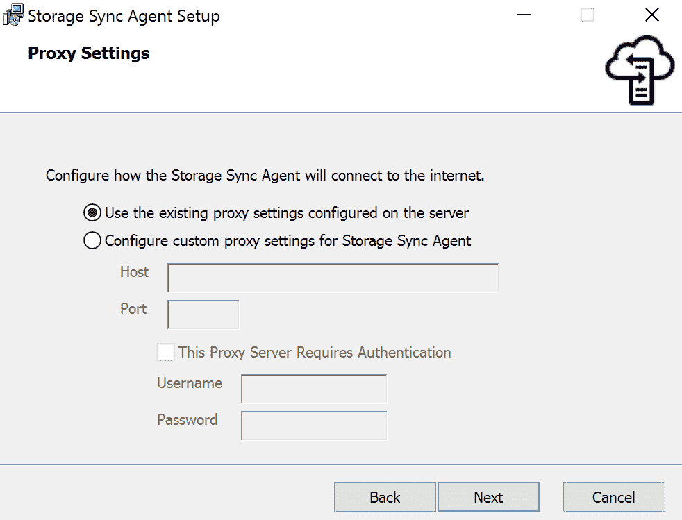

# 配置 Azure 文件和实施 Azure 备份

在上一章中，我们介绍了通过磁盘和 Azure 数据盒将大量数据迁移到 Azure 的不同方式。我们还讲解了如何配置 Azure **内容分发网络**（**CDN**）来缓存静态和动态内容，并更快地将其交付给用户。

本章继续讲解*实现和管理存储*目标的最后部分。在本章中，我们将介绍如何创建 Azure 文件共享，并如何排查它们的问题。我们还将了解 Azure 的备份和恢复功能。你将学习 Azure 备份和 Azure 站点恢复，并将执行一次 Azure 文件共享的备份和恢复操作。

本章将涵盖以下主题：

+   创建 Azure 文件共享和 Azure 文件共享同步服务

+   Azure 备份

+   Azure 站点恢复

+   执行备份和恢复操作

+   创建恢复服务库

+   创建和配置备份策略

# 技术要求

本章的示例使用了 Azure PowerShell ([`docs.microsoft.com/en-us/powershell/azure/install-az-ps?view=azps-1.8.0`](https://docs.microsoft.com/en-us/powershell/azure/install-az-ps?view=azps-1.8.0))。

本章的源代码可以从[`github.com/PacktPublishing/Microsoft-Azure-Administrator-Exam-Guide-AZ-103/tree/master/Chapter06`](https://github.com/PacktPublishing/Microsoft-Azure-Administrator-Exam-Guide-AZ-103/tree/master/Chapter06)下载。

# Azure 文件共享和 Azure 文件共享同步服务

Azure 文件在第四章中已简要介绍，*创建和配置存储账户*。在本章中，我们将创建和配置一个 Azure 文件共享。

使用 Azure 文件，你可以在云中创建文件共享。你可以使用**服务器消息块**（**SMB**）协议访问文件，这是一个行业标准，可以在 Linux、Windows 和 macOS 设备上使用。Azure 文件还可以像本地驱动器一样在这些设备上挂载，并可以通过 Azure 文件同步在 Windows Server 上进行缓存，以便快速访问。

在接下来的部分，我们将从 Azure 门户创建一个 Azure 文件共享。

# 创建 Azure 文件共享

要创建一个 Azure 文件共享，我们首先需要在 Azure 门户中创建一个新的存储账户。在第四章，我们已经创建了一个存储账户，*创建和配置存储账户*。在本次演示中，我们将按照以下步骤在 Azure 门户中创建一个：

1.  打开[`portal.azure.com`](https://portal.azure.com)，进入 Azure 门户。

1.  在左侧菜单中，点击 + 创建资源 | 存储 | 存储账户。

1.  添加以下值：

    +   **订阅**：选择您要创建存储帐户的订阅。

    +   **资源组**：创建一个新的资源组，并命名为`PacktFileShareResourceGroup`。

    +   **存储帐户名称**：`packtfileshare`。

    +   **位置**：美国东部。

    +   **性能**：标准。

    +   **帐户类型**：StorageV2。

    +   **复制**：选择读取访问地理冗余存储（RA-GRS）。这将使数据的六个副本分布在不同的 Azure 区域。

    +   **访问层**：热存储，因为这些数据将频繁访问。

这些值在以下截图中显示：


创建一个新的存储帐户

1.  点击**审查 + 创建**。审核后，点击**创建**按钮。

1.  创建后，打开该资源，您将被重定向到存储帐户的概览页面。在这里，我们可以创建我们的文件共享。在左侧菜单中，选择**文件服务**下的**文件**。然后，在文件页面中，点击顶部菜单中的**+ 文件共享**，如以下截图所示：


创建一个新的文件共享

1.  添加以下值，如以下截图所示：

    +   **名称**：`packtfileshare`

    +   **配额**：`` `10` ``


设置文件共享属性

1.  点击**创建**。

1.  创建后，在概述页面中点击上下文菜单按钮。之后，选择**连接**，如下所示：


连接到文件共享

1.  将打开一个新页面，显示如何从 Windows、Linux 和 macOS 机器连接到该文件共享，具体如以下截图所示：


连接信息

1.  现在我们通过命令行提示符将这个文件共享连接到本地计算机。在命令行提示符窗口中复制并粘贴上面截图中高亮的命令。运行该命令后，将生成以下输出：


将驱动器添加到本地文件系统

驱动器现在已添加到您的本地文件系统。

现在我们已经创建了文件共享并将其添加到本地计算机，接下来可以继续使用 Azure 文件共享同步服务。

# Azure 文件共享同步服务

Azure 文件共享同步服务是一项可以将本地文件共享数据与 Azure 文件同步的服务。通过这种方式，您可以保持本地文件服务器的灵活性、兼容性和性能，同时也将所有数据的副本存储在 Azure 的文件共享中。您可以使用任何 Windows Server 上可用的协议来本地访问数据，包括**服务器消息块**（**SMB**）、**网络文件系统**（**NFS**）和**通过 TLS 的文件传输协议**（**FTPS**）。

在接下来的演示中，我们将配置 Azure 文件同步。为此，以下几件事情需要到位：

+   Windows Server。为此，我在 Azure 中创建了一个 Windows Server 2016 虚拟机。确保启用服务器上的**远程桌面**（**RDP**）。

在创建虚拟机时开启 RDP 端口的步骤在*第七章：为 Windows 和 Linux 创建和配置虚拟机*中的“从 Azure 门户部署 Windows 虚拟机”部分有详细介绍。

+   存储帐户（此存储帐户需要在 Azure File Sync 支持的区域之一中创建）。您可以参考以下网站了解可用区域：[`docs.microsoft.com/en-us/azure/storage/files/storage-sync-files-planning#region-availability`](https://docs.microsoft.com/en-us/azure/storage/files/storage-sync-files-planning#region-availability)。

+   在与存储帐户相同区域创建的 Azure 文件共享。

一旦前面的资源创建完成，我们就可以开始在 Azure 中创建 Azure File Sync 服务，并在 Windows Server 上安装 Azure File Sync。

首先，我们将在 Azure 中创建 Azure File Sync 服务。请按照以下步骤操作：

1.  打开[`portal.azure.com`](https://portal.azure.com)，进入 Azure 门户。

1.  在左侧菜单中，点击**+ 创建资源**，在搜索框中输入`Azure File Sync`。创建一个新服务。

1.  添加以下值：

    +   **名称：** `PacktFileSync`。

    +   **订阅：** 选择与存储帐户和文件共享相同的订阅。

    +   **资源组：** 选择与存储帐户和文件共享相同的订阅。

    +   **位置：** 选择与存储帐户和文件共享相同的位置。

以下截图展示了这些值：


创建文件同步服务

1.  点击**创建**。

1.  部署完成后，打开存储同步服务并点击顶部菜单中的**+ 同步组**。我们将创建这个组以连接同步服务到文件共享，如下所示：


创建同步组

1.  添加以下值：

    +   **名称：** `packtsyncgroup`。

    +   **订阅：** 选择存储帐户和文件共享所在的订阅。

    +   **存储帐户：** 选择创建文件共享的存储帐户。

以下截图展示了这些值：


配置同步组

1.  远程桌面连接到 Windows Server 并登录。我们首先需要禁用**IE 增强型安全配置**。打开**服务器管理器** | **本地服务器**并为管理员和用户都禁用此配置。

1.  从以下网站下载 Azure File Sync 代理：[`www.microsoft.com/en-us/download/details.aspx?id=57159`](https://www.microsoft.com/en-us/download/details.aspx?id=57159)。

1.  在服务器上安装代理。保持默认路径安装代理。在下一个屏幕中，启用**使用服务器上配置的现有代理设置**，如下图所示：



代理设置

1.  点击“下一步”。

1.  启用 Windows 更新并安装工具。

1.  一旦工具安装完成，打开安装文件夹，路径为`C:\Program Files\Azure\StorageSyncAgent`。

1.  从安装文件夹运行`ServerRegistration`工具。

1.  现在，我们可以注册服务器。首先需要登录。点击登录按钮，如下所示：


选择 Azure 环境

1.  使用 Azure 管理员凭据登录。

1.  现在我们可以选择之前在 Azure 门户中创建的 Storage Sync 服务。因此，你需要选择订阅、资源组以及实际的 Storage Sync 服务，如下所示：


选择 Storage Sync 服务

1.  点击**注册**。

1.  注册成功后，本地服务器与 Azure 中的 Storage Sync 服务之间建立了信任关系。点击**确定**。

1.  现在，我们需要返回到 Azure 门户中的同步服务，创建一个端点。再次进入 Storage Sync 服务，并选择之前创建的同步组。在同步组设置面板中，选择顶部菜单中的**添加服务器端点**，如下所示：


添加服务器端点

1.  选择已注册的服务器并提供以下路径：`D:\Data`。保持云分层和离线数据传输功能关闭，然后点击“创建”，如下所示：


端点值

现在服务器端点已创建。

1.  如果现在返回到我们安装了同步代理的虚拟机并打开 `D` 盘，你会看到添加了一个名为 `Data` 的文件夹。你可以像下面的截图所示，将文件复制到该文件夹中：


存储在数据文件夹中的图像

1.  当你切换回 Azure 中的文件共享时，你会看到所有文件已经同步到 Azure 存储账户，如下图所示：


同步的文件到 Azure 文件存储

这部分介绍了 Azure 文件存储和 Azure 文件共享同步服务。接下来的部分，我们将探讨 Azure 备份和恢复。

# Azure 备份

Azure 备份服务用于备份 Azure 中的资源和数据。它可以用于仅云或混合场景，适用于你希望将本地虚拟机备份到 Azure 的情况。你本地的备份解决方案也可以与 Azure 备份结合使用，扩展到云端。Azure 备份可以为虚拟机、文件、文件夹、应用程序、工作负载、系统状态和卷创建备份。

Azure 备份包括以下功能和能力：

+   **将本地资源备份到 Azure**：Azure 备份提供短期和长期备份。这可以替代磁带和**异地**备份。

+   **备份 Azure 虚拟机**：Azure 备份提供独立且隔离的备份。这些备份存储在恢复服务库中。该库内置了恢复点的管理功能。

+   **自动扩展**：您可以在没有维护开销的情况下获得无限扩展。可以设置警报来传递有关事件的信息。

+   **无限数据传输**：在备份过程中，进出流量的传输量没有限制。然而，如果您使用 Azure 导入/导出服务来导入大量数据，则进站数据会产生费用。

+   **数据加密**：数据可以使用加密密码短语进行加密。密码短语会被本地存储，并且恢复数据时需要使用。

+   **短期和长期保留**：恢复服务是备份存储的地方，提供短期和长期备份。Azure 不限制数据在恢复服务库中的存储时间或时长。

+   **多种存储选项**：Azure 备份提供两种类型的复制—**本地冗余存储**（**LRS**），数据会在同一地区通过创建三份副本进行三次复制，和**地理冗余存储**（**GRS**），这是默认选项，数据会复制到一个备用地区。

您可以使用 Azure 备份来备份以下产品保护的数据：

+   **系统中心数据保护管理器（DPM）**：DPM 可以在本地或 Azure 中的物理服务器或虚拟服务器上运行。DPM 服务器也可以备份到恢复服务库中。DPM 服务器及其机器需要在同一网络中。本地机器只能由本地 DPM 服务器保护，而 Azure 机器只能由在 Azure 中运行的 DPM 服务器保护。

+   **Microsoft Azure 备份服务器（MABS）**：MABS 可以在本地或 Azure 中的物理服务器或虚拟服务器上运行。它提供与 DPM 类似的功能，不同的是，MABS 可以备份到磁带，且不需要系统中心许可证。与 DPM 相似，本地机器只能由本地 MABS 服务器保护，而 Azure 机器只能由在 Azure 中运行的 MABS 服务器保护。

# Azure 站点恢复

Azure 站点恢复可以从 Azure 虚拟机及其他工作负载进行复制，例如不同 Azure 区域之间的 Azure 文件存储，以及本地虚拟机、物理（文件）服务器和 Azure Stack 虚拟机。

Azure 恢复服务提供以下功能：

+   **站点恢复服务**：站点恢复确保在停机期间你的虚拟机（VM）、应用程序和工作负载仍在运行。它将运行在机器上的工作负载（无论是虚拟的还是物理的）从主站点复制到备用站点。当主站点发生故障时，你可以切换到备用站点。主站点恢复后，你可以再切换回主站点。

+   **备份服务**：此服务通过将数据备份到 Azure 来保障数据安全。

你还可以使用 Azure 站点恢复将本地机器迁移到 Azure 虚拟机。这与灾难恢复的不同之处在于：

+   **灾难恢复**：在灾难恢复中，机器会定期进行复制。在发生停机时，机器会从主站点切换到 Azure 中的备用站点。然后可以从备用站点访问这些机器。当主站点恢复时，你可以从备用站点切换回主站点。

+   **迁移**：本地机器被复制到 Azure，或将 Azure 虚拟机复制到备用区域。之后，虚拟机会从主站点切换到备用站点，完成迁移过程而无需执行失败回退过程。

在下一部分中，我们将执行 Azure 文件共享的备份和恢复操作。

# 执行备份和恢复操作

在本演示中，我们将为 Azure 文件共享执行备份和恢复操作。我们将备份本章中创建的文件共享，并从恢复服务库中恢复它。

在第八章，*管理 Azure 虚拟机和虚拟机备份*，我们将从 Azure 门户设置 Azure 虚拟机的备份和恢复。你可以参考本章，了解更多关于备份和恢复的信息。

# 创建恢复服务库

我们将要在 Azure 中创建恢复服务库。你可以通过 Azure 门户、PowerShell 或 CLI 来创建这个库。我们将使用 PowerShell 来创建这个库。按照以下步骤来创建它：

1.  首先，我们需要按照以下步骤登录 Azure 账户：

```
Connect-AzAccount
```

1.  如有必要，按照以下方式选择正确的订阅（确保此处使用的订阅与创建文件共享时使用的订阅相同）：

```
Select-AzSubscription -SubscriptionId "********-****-****-****-***********"
```

1.  为恢复服务库创建一个资源组，如下所示：

```
New-AzResourceGroup -Name PacktRecoveryServicesGroup -Location EastUS
```

1.  按如下方式创建一个新的恢复服务库：

```
New-AzRecoveryServicesVault -Name PacktFileVault -ResourceGroupName PacktRecoveryServicesGroup -Location EastUS
```

1.  现在，你可以按照以下方式设置库存储的冗余类型：

```
$vault1 = Get-AzRecoveryServicesVault `
 -Name PacktFileVault

Set-AzRecoveryServicesBackupProperties -Vault $vault1 `
 -BackupStorageRedundancy GeoRedundant
```

我们现在已经创建了恢复服务库。在下一部分，我们将为 Azure 文件共享创建一个备份策略。

# 配置备份策略

备份策略指定了备份的时间表，以及备份恢复点应该保存多长时间。它至少与一个保留策略相关联，该策略定义了恢复点在被删除之前将保存多久。

在以下示例中，我们将通过 PowerShell 创建一个备份策略，它会进行每日备份并保留 30 天：

1.  首先，我们需要将保管库 ID 存储在一个变量中，以便稍后在创建策略时传递，如下所示：

```
$vaultID = Get-AzRecoveryServicesVault `
 -ResourceGroupName PacktRecoveryServicesGroup `
 -Name PacktFileVault `
 | select -ExpandProperty ID 
```

1.  接下来，我们将设置两个变量，用于存储计划和保留策略。然后我们将使用这些值创建一个新的备份策略：

```
$packtSchPol = Get-AzRecoveryServicesBackupSchedulePolicyObject -WorkloadType "AzureFiles"
$packtRetPol = Get-AzRecoveryServicesBackupRetentionPolicyObject -WorkloadType "AzureFiles"

$afsPol = New-AzRecoveryServicesBackupProtectionPolicy -Name "PacktFSPolicy" `
 -WorkloadType "AzureFiles" `
 -RetentionPolicy $packtRetPol `
 -SchedulePolicy $packtSchPol `
 -VaultId $vaultID `
 -BackupManagementType AzureStorage
```

1.  最后，我们可以按如下方式为 Azure 文件存储账户启用此策略：

```
Enable-AzRecoveryServicesBackupProtection -VaultId $vaultID `
 -Policy $afsPol `
 -Name "packtfileshare" `
 -StorageAccountName "packtfileshare"
```

我们现在已经创建了一个备份策略，用于备份本章开始时创建的文件共享。此备份策略将进行每日备份。你还可以触发按需备份。为此，请保持 PowerShell 打开，因为我们需要 Vault ID 来触发按需任务。我们将在下一个部分讲解这一点。

# 触发按需备份

在本演示中，我们将使用 PowerShell 触发一个按需备份。保持 PowerShell 会话打开，并执行以下步骤：

1.  首先，我们需要检索备份容器：

```
$afsPacktContainer = Get-AzRecoveryServicesBackupContainer -FriendlyName "packtfileshare" `
 -ContainerType AzureStorage `
 -VaultId $vaultID
```

1.  然后我们需要从容器中检索备份项：

```
$afsPacktBackupItem = Get-AzRecoveryServicesBackupItem `
 -Container $afsPacktContainer `
 -WorkloadType "AzureFiles" `
 -Name "packtfileshare" `
 -VaultId $vaultID
```

1.  最后，我们可以安排任务：

```
$job = Backup-AzRecoveryServicesBackupItem -Item $afsPacktBackupItem -VaultId $vaultID
```

现在我们已经创建了备份，可以使用 PowerShell 恢复它。我们将在下一个部分进行操作。

# 恢复备份

要恢复我们在之前 PowerShell 演示中创建的备份，我们必须采取以下步骤：

1.  生成可用恢复点的列表：

```
$startDate = (Get-Date).AddDays(-7)
$endDate = Get-Date
$rp = Get-AzRecoveryServicesBackupRecoveryPoint -Item $afsPacktBackupItem `
 -StartDate $startdate.ToUniversalTime() `
 -EndDate $enddate.ToUniversalTime() `
 -VaultId $vaultID

$rp[0] | fl
```

1.  恢复备份。在这个示例中，我们将在原始目标位置恢复备份。你也可以使用替代目标，比如另一个存储账户。我们首先需要重新设置保管库上下文，然后才能恢复备份：

```
Get-AzRecoveryServicesVault -Name "PacktFileVault" | Set-AzRecoveryServicesVaultContext

Restore-AzRecoveryServicesBackupItem `
 -RecoveryPoint $rp[0] `
 -TargetStorageAccountName "packtfileshare" `
 -TargetFileShareName "packtfileshare" `
 -TargetFolder "AzureFS_restored" `
 -ResolveConflict Overwrite
```

# 总结

在本章中，我们涵盖了实现和管理存储目标的第三部分和最后一部分。我们介绍了 Azure 文件共享，并且我们讲解了如何安装和配置 Azure 文件共享同步服务。我们还查看了在 Azure 中共享文件的备份和恢复。

在下一章中，我们将介绍 *部署和管理虚拟机* 目标，讲解如何为 Windows 和 Linux 创建和配置虚拟机。

# 问题

回答以下问题，测试你对本章信息的掌握程度。你可以在本书结尾的 *评估* 部分找到答案：

1.  你可以使用 Azure 备份来备份 Azure 文件共享吗？

    +   是

    +   否

1.  你可以将 Azure 备份与 MABS 一起使用吗？

    +   是

    +   否

1.  你可以使用 Azure 文件共享同步服务将 Azure 文件共享挂载到本地计算机吗？

    +   是

    +   否

# 进一步阅读

你可以查看以下链接，了解更多关于本章中涉及主题的信息：

+   *什么是 Azure 文件？*: [`docs.microsoft.com/en-us/azure/storage/files/storage-files-introduction`](https://docs.microsoft.com/en-us/azure/storage/files/storage-files-introduction)

+   *Azure 文件同步部署规划*: [`docs.microsoft.com/en-us/azure/storage/files/storage-sync-files-planning`](https://docs.microsoft.com/en-us/azure/storage/files/storage-sync-files-planning)

+   *部署 Azure 文件同步*: [`docs.microsoft.com/en-us/azure/storage/files/storage-sync-files-deployment-guide?tabs=azure-portal`](https://docs.microsoft.com/en-us/azure/storage/files/storage-sync-files-deployment-guide?tabs=azure-portal)

+   *什么是 Azure 备份?*: [`docs.microsoft.com/en-us/azure/backup/backup-overview`](https://docs.microsoft.com/en-us/azure/backup/backup-overview)

+   *Azure 备份功能概览*: [`docs.microsoft.com/en-us/azure/backup/backup-introduction-to-azure-backup#which-azure-backup-components-should-i-use`](https://docs.microsoft.com/en-us/azure/backup/backup-introduction-to-azure-backup#which-azure-backup-components-should-i-use)

+   *关于站点恢复*: [`docs.microsoft.com/en-us/azure/site-recovery/site-recovery-overview`](https://docs.microsoft.com/en-us/azure/site-recovery/site-recovery-overview)
