# 创建和配置 Windows 和 Linux 虚拟机

在上一章中，我们介绍了 Azure 文件共享以及如何使用 Azure 文件同步服务将本地文件共享与 Azure 同步。你还学会了如何在 Azure 中备份和恢复文件共享。

本章介绍了*部署和管理虚拟机*的目标。在本章中，我们将讨论 Azure 中的**虚拟机**（**VM**）以及可用于 Azure 和 Linux 的不同虚拟机规格。你将学习如何为 Windows 和 Linux 创建和配置虚拟机。我们还将讨论高可用性，以及如何配置虚拟机以实现高可用性。你还将学习如何使用 **Azure 资源管理器**（**ARM**）模板，通过模板部署虚拟机，并如何使用规模集自动化部署。

本章将涵盖以下主题：

+   虚拟机（VM）

+   部署 Windows 和 Linux 虚拟机

+   配置高可用性

+   部署和配置规模集

+   修改和部署 ARM 模板

# 技术要求

本章使用以下工具来做示例：

+   Azure PowerShell: [`docs.microsoft.com/en-us/powershell/azure/install-az-ps?view=azps-1.8.0`](https://docs.microsoft.com/en-us/powershell/azure/install-az-ps?view=azps-1.8.0)

+   Visual Studio Code: [`code.visualstudio.com/download`](https://code.visualstudio.com/download)

本章的源代码可以从 [`github.com/PacktPublishing/Microsoft-Azure-Administrator-Exam-Guide-AZ-103/tree/master/Chapter07`](https://github.com/PacktPublishing/Microsoft-Azure-Administrator-Exam-Guide-AZ-103/tree/master/Chapter07) 下载。

# 虚拟机（VM）

你可以在 Azure 中运行 Windows 虚拟机（VM）以及 Linux 虚拟机（VM）。虚拟机有各种规格和价格，涵盖从具有少量内存和处理能力、适用于一般用途的虚拟机，到可用于**图形处理单元**（**GPU**）密集型和高性能计算工作负载的大型虚拟机。

创建虚拟机时，可以从多个预定义镜像中选择。操作系统的镜像（如 Windows Server 或 Linux）以及预定义的应用程序（如 SQL Server 镜像和完整的虚拟机集群）均可用，这些集群由多个虚拟机组成，可以一次性部署。例如，三层 SharePoint 集群就是一种虚拟机集群。

虚拟机（VM）可以通过 Azure 门户、PowerShell 或命令行界面（CLI）创建和管理，并且它们有以下系列和规格。

# 虚拟机系列和规格

在编写本书时，以下虚拟机系列和规格可供选择：

| **系列** | **类型** | **描述** |
| --- | --- | --- |
| B, Dsv3, Dv3, DSv2, Dv2, Av2, DC | 一般用途 | 这些虚拟机具有平衡的 CPU 和内存比例，适用于测试和开发场景。它们也适合用于小型和中型数据库，以及低到中等流量的 Web 服务器。 |
| Fsv2, Fs, F | 计算优化型 | 这些虚拟机具有较高的 CPU 与内存比例，适用于中等流量的 Web 服务器、应用服务器和批处理节点的网络设备。 |
| Esv3, Ev3, M, GS, G, DSv2, Dv2 | 内存优化型 | 这些虚拟机具有较高的内存与 CPU 比例，适用于关系数据库服务器、中型至大型缓存以及内存分析。 |
| Lsv2, Ls | 存储优化型 | 这些虚拟机具有高磁盘吞吐量和 IO，适用于大数据、SQL 和 NoSQL 数据库。 |
| NV, NVv2, NC, NCv2, NCv3, ND, NDv2（预览） | GPU | 这些虚拟机适用于重型图形渲染和视频编辑、深度学习应用以及机器学习模型训练。这些虚拟机可以配置为单 GPU 或多 GPU。 |
| H | 高性能计算 | 这些是最快的虚拟机，提供最强大的 CPU，并且支持可选的高吞吐量网络接口（**远程直接内存访问**（**RDMA**））。 |

虚拟机系列会不断更新。新的系列、类型和大小经常被添加和删除。为了跟上这些变化，您可以参考以下网站了解 Windows 虚拟机的大小：[`docs.microsoft.com/en-us/azure/virtual-machines/windows/sizes`](https://docs.microsoft.com/en-us/azure/virtual-machines/windows/sizes)。对于 Linux 虚拟机的大小，您可以参考[`docs.microsoft.com/en-us/azure/virtual-machines/linux/sizes?toc=%2fazure%2fvirtualmachines%2flinux%2ftoc.json`](https://docs.microsoft.com/en-us/azure/virtual-machines/linux/sizes?toc=%2fazure%2fvirtual-machines%2flinux%2ftoc.json)。

# 托管磁盘

Azure 托管磁盘是您在 Azure 门户中创建虚拟机时默认选择的磁盘类型。它们完全处理虚拟机的存储。以前，您需要手动创建存储帐户来存储虚拟机硬盘，并且当虚拟机需要扩展时，您还需要添加额外的存储帐户，以确保不会超过每个帐户的 20,000 **每秒输入/输出操作**（**IOPS**）的限制。

使用托管磁盘后，这个负担已由 Azure 为您处理。您现在可以在一个订阅内创建 10,000 个虚拟机磁盘，这意味着一个订阅内可以拥有成千上万的虚拟机，无需在存储帐户之间复制磁盘。

# 可用性集

为了创建可靠的基础设施，将虚拟机添加到可用性集是关键。以下是可能影响 Azure 虚拟机可用性的几种场景：

+   **计划外硬件维护事件**：当硬件即将发生故障时，Azure 会触发计划外硬件维护事件。此时会使用实时迁移技术来预测故障，并将虚拟机、网络连接、内存和存储迁移到不同的物理机器，而不会断开客户端。当虚拟机被迁移时，性能会短暂下降，因为虚拟机会暂停 30 秒。网络连接、内存和打开的文件仍然会被保留。

+   **意外停机**：当此事件发生时，虚拟机会停机，因为 Azure 需要在同一数据中心内修复虚拟机。硬件或物理基础设施故障通常会导致此事件发生。

+   **计划硬件维护事件**：此类事件是微软在 Azure 中进行的定期更新，以提升平台性能。这些更新大多数对虚拟机的正常运行时间没有显著影响，但其中一些可能需要重启或重启虚拟机。

为了在此类事件发生时提供冗余，你可以将两个或更多虚拟机分组到一个可用性集中。通过利用可用性集，虚拟机会分布在集群中的多个独立硬件节点上。这样，Azure 可以确保在事件或故障发生时，只有部分虚拟机会受到影响，整体解决方案仍将保持运行并保持可用。这样，即使发生停机或其他故障，也能满足 99.95% 的 Azure **服务等级协议** (**SLA**)要求。

虚拟机只能在初次部署时分配到可用性集。

# 故障域和更新域

当你将虚拟机放入可用性集时，Azure 会保证将它们分布到故障域和更新域中。默认情况下，Azure 会为可用性集分配三个故障域和五个更新域（可以增加到最多 20 个）。

当将虚拟机分布在故障域时，虚拟机会被放置在 Azure 数据中心的三个不同机架上。因此，在发生事件或平台故障时，只有一个机架会受到影响，其他虚拟机仍然可以访问，如下图所示：

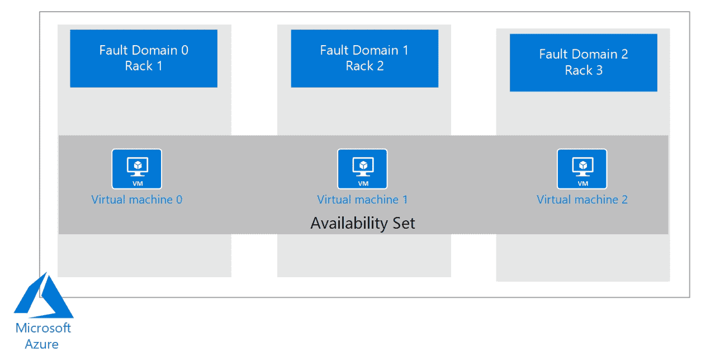

虚拟机分布在三个故障域中

更新域在操作系统或主机更新时非常有用。当你将虚拟机分布到多个更新域时，其中一个更新域会进行更新并重启，而其他更新域则保持可访问，如下图所示：

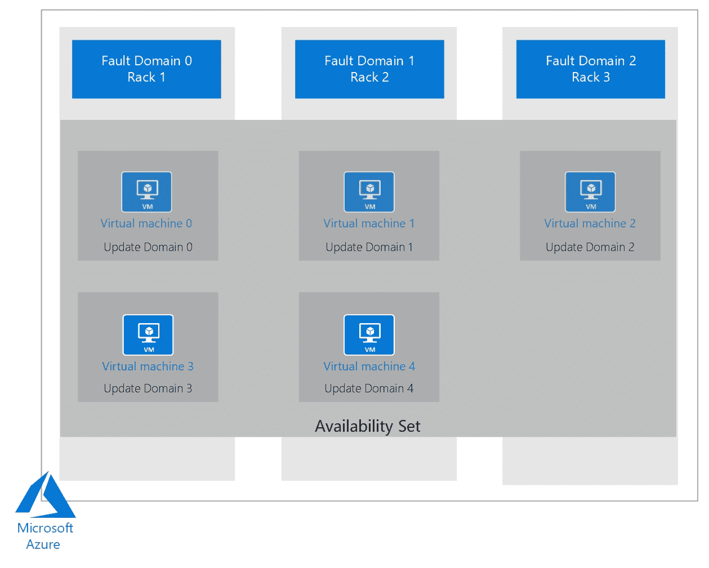

虚拟机分布在五个更新域和三个故障域中

在下一个演示中，我们将在 Azure 门户中创建一个新的 Windows 虚拟机。

# 部署 Windows 和 Linux 虚拟机

在接下来的演示中，我们将通过 Azure 门户和 PowerShell 部署一个 Windows Server 虚拟机（VM）。

部署 Linux 虚拟机与部署 Windows 虚拟机非常相似。我们不会讲解如何部署 Linux 虚拟机。有关如何在 Azure 中部署 Linux 虚拟机的更多信息，请参考本章末尾的*进一步阅读*部分。

# 从 Azure 门户部署 Windows 虚拟机

在本次演示中，我们将从 Azure 门户部署一个 Windows 虚拟机。我们将设置网络和存储，并为此虚拟机选择合适的大小。我们还将通过将其放入*可用性集*中来配置此虚拟机的高可用性。为此，请按照以下步骤操作：

1.  通过打开 [`portal.azure.com`](https://portal.azure.com) 导航到 Azure 门户。

1.  在左侧菜单中，点击虚拟机，然后在顶部菜单中点击+ 添加，如下所示：

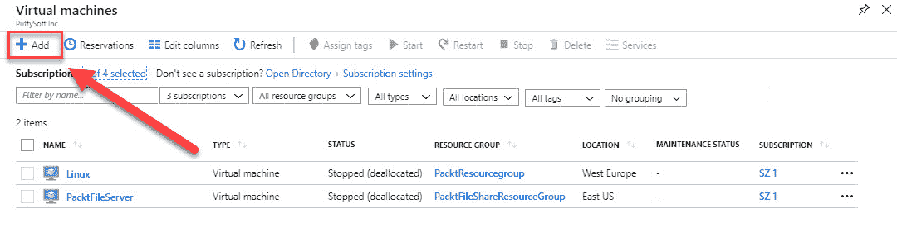

创建新的虚拟机

1.  我们将创建一台 Windows 虚拟机，因此在基础面板中，添加以下值：

    +   **订阅**：选择一个订阅。

    +   **资源组**：`PacktVMGroup`。

    +   **虚拟机名称**：`PacktWindowsVM`。

    +   **区域**：选择一个区域。

    +   **可用性选项**：在此选择**可用性集**。

    +   **可用性集**：创建新的，并命名为`PacktWindowsAS`。保持默认的容错域，并为此虚拟机更新域。

    +   **镜像**：Windows Server Datacenter 2016。

    +   **大小**：在这里，您可以选择不同的大小。点击更改大小，然后选择 Standard DS1 v2。

    +   **管理员账户**：提供用户名和密码。

    +   **入站端口规则**：选择**允许选择的端口**并启用**远程桌面协议**(**RDP**)**。** 您将需要此功能以在创建后登录服务器。

    +   **节省成本**：如果您已经拥有有效的 Windows Server Datacenter 许可证，您将获得此虚拟机的折扣。

1.  点击**下一步：磁盘**。

1.  在这里，您可以选择磁盘类型。保持默认设置如下，即 Premium SSD：

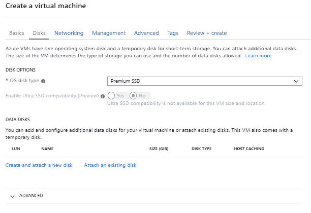

选择磁盘类型

1.  点击**下一步：网络**。

1.  在网络面板中，您可以配置虚拟网络。您可以保持此机器的默认值，如下所示：

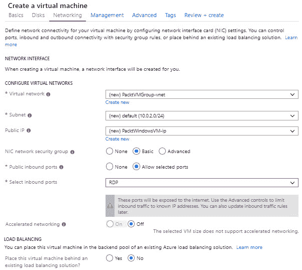

设置虚拟机的网络

1.  点击**下一步：管理**。

1.  在管理面板中，您可以配置监控，并为监控创建和选择存储账户。您还可以分配系统分配的托管身份，用于向各种 Azure 资源（例如 Azure Key Vault）进行身份验证，而无需在代码中存储任何凭证。您还可以在此启用自动关机，具体操作如下：

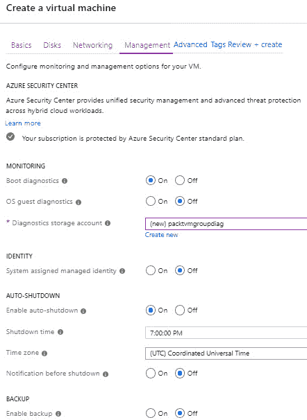

设置管理功能

1.  现在我们可以创建虚拟机了。点击**查看 + 创建**，系统将验证设置。然后，点击**创建**，实际部署虚拟机。

部署 Linux 虚拟机的步骤与创建 Windows 虚拟机类似，因此我们在本示范中将跳过这部分内容。有关如何通过 Azure 门户部署 Linux 虚拟机的更多信息，请参阅[`docs.microsoft.com/en-us/azure/virtual-machines/linux/quick-create-portal`](https://docs.microsoft.com/en-us/azure/virtual-machines/linux/quick-create-portal)。

我们现在已经部署了一台 Windows 虚拟机，将其放入了可用性集，并查看了此虚拟机的网络、存储和监控功能。在下一部分，我们将通过 PowerShell 部署一台 Windows Server 虚拟机。

# 通过 PowerShell 部署 Windows 虚拟机

在接下来的演示中，我们将通过 PowerShell 创建两个 Windows Server 虚拟机，并将它们放入一个可用性集。为此，您需要执行以下步骤：

1.  首先，我们需要按如下方式登录 Azure 账户：

```
Login-AzureRmAccount
```

1.  如有必要，请按如下方式选择正确的订阅：

```
Select-AzureRmSubscription -SubscriptionId "********-****-****-****-***********"
```

1.  为可用性集创建一个资源组，如下所示：

```
New-AzResourceGroup -Name PacktVMResourceGroup -Location EastUS
```

1.  然后，我们可以为虚拟机创建一个可用性集，方法如下：

```
New-AzAvailabilitySet `
 -Location "EastUS" `
 -Name "PacktVMAvailabilitySet" `
 -ResourceGroupName PacktVMResourceGroup `
 -Sku aligned `
 -PlatformFaultDomainCount 2 `
 -PlatformUpdateDomainCount 2
```

1.  我们需要为虚拟机设置管理员凭据，如下所示：

```
$cred = Get-Credential
```

1.  现在，我们可以在可用性集中创建两个虚拟机，如下所示：

```
 for ($i=1; $i -le 2; $i++)
{
 New-AzVm `
 -ResourceGroupName PacktVMResourceGroup `
 -Name "PacktVM$i" `
 -Location "East US" `
 -VirtualNetworkName "PacktVnet" `
 -SubnetName "PacktSubnet" `
 -SecurityGroupName "PacktNetworkSecurityGroup" `
 -PublicIpAddressName "PacktPublicIpAddress$i" `
 -AvailabilitySetName "PacktVMAvailabilitySet" `
 -Credential $cred
}
```

在最后两次演示中，我们在 Azure 门户和 PowerShell 中创建了可用性集中的虚拟机。在接下来的部分，我们将介绍扩展集。

# 虚拟机扩展集

虚拟机扩展集用于一次性部署多个虚拟机，无需手动操作或使用脚本。然后，您可以从一个地方集中管理它们。虚拟机扩展集通常用于构建大规模的基础设施，其中保持所有虚拟机同步至关重要。虚拟机的维护，包括保持同步，由 Azure 处理。虚拟机扩展集在后台使用可用性集。扩展集中的虚拟机会自动根据故障和更新域分布在底层平台上。虚拟机扩展集默认使用 Azure 自动扩展（Autoscale）。不过，您也可以选择自己添加或删除实例，而不使用自动扩展功能。

创建扩展集时，会自动为您创建一些构件。除了您指定数量的虚拟机会被添加到集群中外，还会添加一个 Azure 负载均衡器和 Azure 自动扩展，以及一个虚拟网络和一个公共 IP 地址，如下图所示：

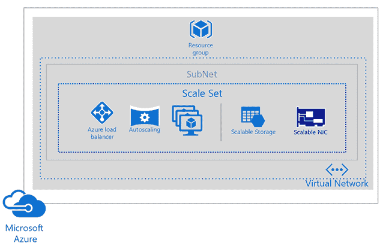

Azure 虚拟机扩展集

在接下来的章节中，我们将部署和配置扩展集。

# 部署和配置扩展集

从 Azure 门户创建虚拟机扩展集，请按照以下步骤操作：

1.  通过打开[`portal.azure.com`](https://portal.azure.com)访问 Azure 门户。

1.  点击创建资源，并在搜索栏中输入`Scale Set`。选择**虚拟机扩展集**。

1.  在下一个屏幕中，点击创建并为扩展集添加以下设置：

    +   **虚拟机扩展集名称**：`PacktScaleSet`

    +   **操作系统磁盘镜像**：Windows Server 2016 数据中心版

    +   **订阅**：选择一个订阅

    +   **资源组**：`PacktVMGroup`

    +   **位置**：美国东部

    +   **可用性区域**：无

    +   **用户名**：`SCPacktUser`

    +   **密码**：填写密码

    +   **实例数量**：`2`

    +   **实例大小**：标准 DS1 v2

    +   **使用托管磁盘**：是

    +   **启用扩展超过 100 个实例**：否

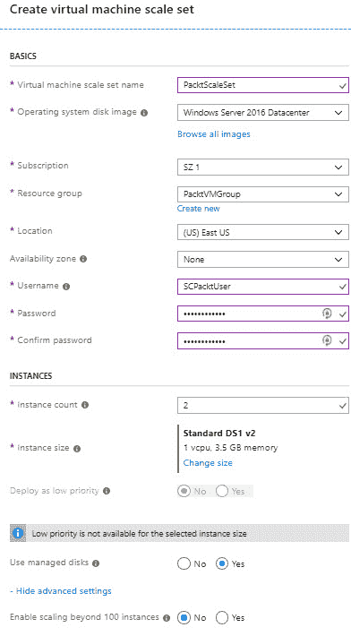

扩展集

1.  如果向下滚动，您可以配置自动扩展设置，选择不同的负载均衡设置，并按如下方式配置网络和监控功能：

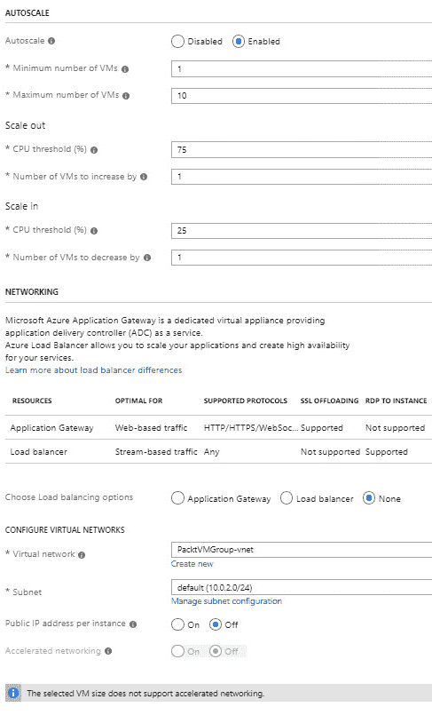

扩展集配置设置

1.  点击**创建**。现在，包含所提供数量虚拟机的扩展集已经部署完毕。

在本章的最后几个部分，我们将介绍如何使用 ARM 模板自动化虚拟机的部署。

# 修改和部署 ARM 模板

ARM 模板定义了 Azure 解决方案的基础设施和配置。Azure 通过一个 API 进行管理，这个 API 被称为资源管理器（Resource Manager）或 ARM API。你可以使用这个 API 部署基础设施作为代码，并配置你的 Azure 环境。这个 API 可以通过多种工具和资源进行调用；你可以使用 Azure 门户、PowerShell、CLI、直接调用 API，或创建 ARM 模板来实现。

你可以创建一个 JSON 格式的 ARM 模板，并使用它在 Azure 环境中以一致的状态反复部署你的解决方案。模板会像其他请求一样被资源管理器处理，资源管理器会解析模板，并将语法转换为针对相应资源提供者的 REST API 操作。REST API 使用模板中的资源部分来调用特定资源的 API。例如，`Microsoft.Storage/storageAccounts` 是一个资源提供者。

微软提供了多种预定义的 ARM 模板，可以下载并进行部署。你可以从 GitHub 下载快速启动模板，并直接从 GitHub 部署，或者下载并进行必要的调整：[`github.com/Azure/azure-quickstart-templates`](https://github.com/Azure/azure-quickstart-templates)。

在下一部分中，我们将在 Azure 门户中修改一个 ARM 模板。

# 修改 ARM 模板

在演示中，我们将创建一个存储账户的 ARM 模板并将其保存在 Azure 门户中。我们将修改这个模板，使其能够自动生成存储账户名称。然后，我们会再次部署这个模板，并使用它从 Azure 门户创建一个新的存储账户。因此，您需要执行以下步骤：

1.  通过打开 [`portal.azure.com`](https://portal.azure.com) 来导航到 Azure 门户。

1.  在左侧菜单中，选择 + **创建资源**，然后选择 **存储**，再选择 **存储账户**。

1.  添加以下值：

    +   **订阅**: 选择一个订阅

    +   **资源组**: 创建一个新的资源组，命名为 `PacktARMResourceGroup`

    +   **存储账户名称**: `packtarm`

    +   **位置**: （美国）东部美国

    +   **性能**: 标准

    +   **账户类型**: StorageV2（通用目的 v2）

    +   **复制**: 读取访问地理冗余存储（RA-GRS）

    +   **访问层**：热存储：

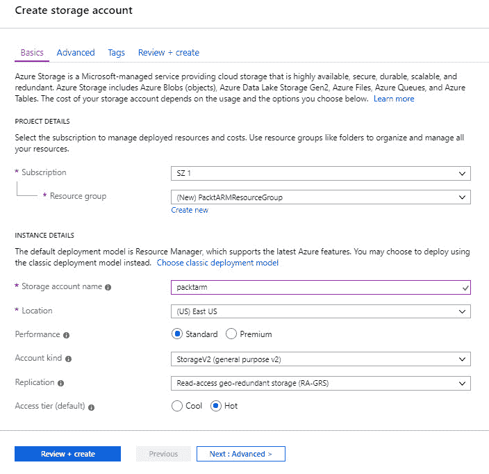

创建一个新的存储账户

1.  点击 **查看 + 创建**。不要选择 **创建**。

1.  在下一步中，选择“下载自动化模板”：

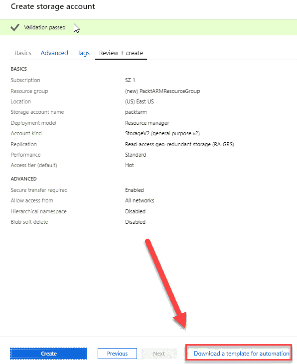

下载自动化模板

1.  编辑器将被打开，生成的模板将显示出来。主面板显示的是模板，它包含六个顶级元素：`schema`、`contentVersion`、`parameters`、`variables`、`resources` 和 `output`。还有六个参数。`storageAccountName` 在以下截图中已被突出显示。在模板中，定义了一个 Azure 资源，类型是 `Microsoft.Storage/storageAccounts`。从顶部菜单中选择 **下载**：

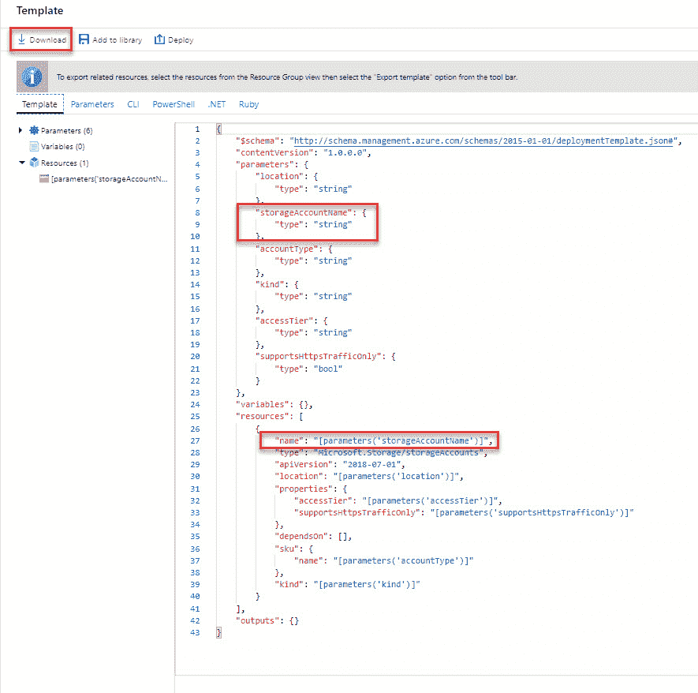

主要 ARM 模板

1.  打开下载的 ZIP 文件，然后将 `template.json` 保存到你的计算机。在下一节中，你将使用模板部署工具来编辑该模板。

1.  选择顶部菜单中的 **参数**，并查看这些值。我们稍后在部署过程中需要这些值：

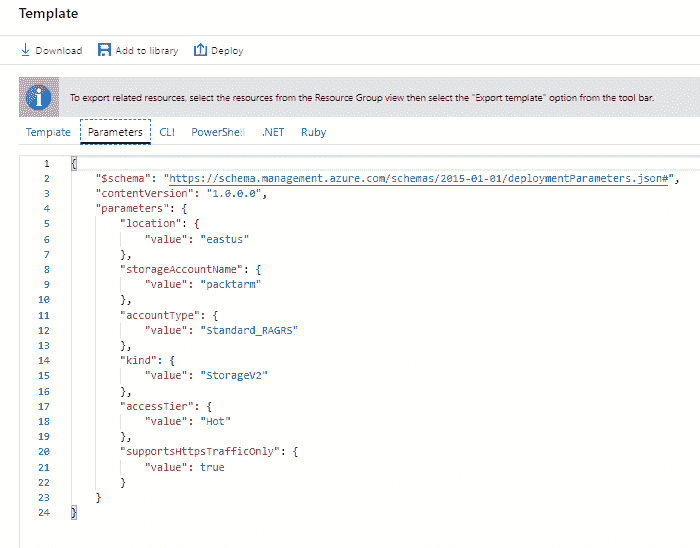

ARM 模板参数

1.  Azure 门户可用于基本的 ARM 模板编辑。对于更复杂的 ARM 模板，可以使用 Visual Studio Code 等工具进行编辑。我们将在此演示中使用 Azure 门户。因此，选择 **+ 创建资源**，然后在搜索框中输入 `Template Deployment`。接着选择 **创建**。

1.  在下一个页面中，你可以选择不同的模板加载选项。在这个演示中，选择 **在编辑器中构建自己的模板**：

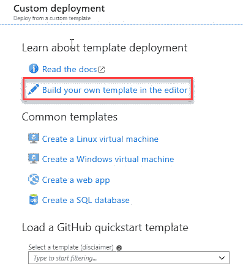

模板选项

1.  选择 **加载文件**，然后按照说明加载我们在上一节下载的 `template.json`。进行以下更改：

    1.  移除 `storageAccountName` 参数。

    1.  添加一个新变量：

```
"storageAccountName": "[concat(uniqueString(subscription().subscriptionId), 'storage')]"
```

1.  1.  将 `"name": "[parameters('storageAccountName')]"` 替换为 `"name": "[variables('storageAccountName')]"`：

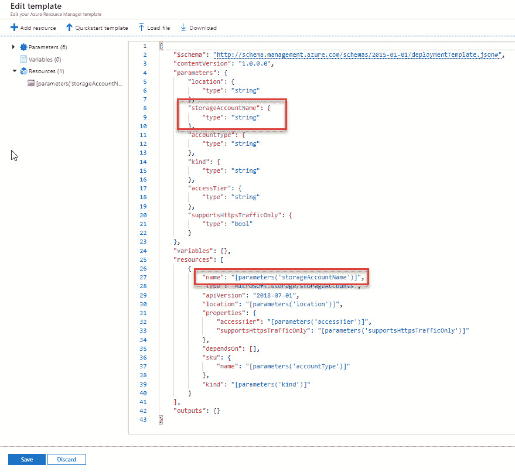

修改突出显示的部分

1.  1.  模板的代码将如下所示：

`schema` 和 `parameters` 部分：

```
{
    "$schema": "http://schema.management.azure.com/schemas/2015-01-01/deploymentTemplate.json#",
    "contentVersion": "1.0.0.0",
    "parameters": {
        "location": {
            "type": "string"
        },
        "accountType": {
            "type": "string"
        },
        "kind": {
            "type": "string"
        },
        "accessTier": {
            "type": "string"
        },
        "supportsHttpsTrafficOnly": {
            "type": "bool"
        }
    },
```

以及 `variable` 和 `resources` 部分：

```
    "variables": {
        "storageAccountName": "[concat(uniqueString(subscription().subscriptionId), 'storage')]"
    },
    "resources": [
        {
            "name": "[variables('storageAccountName')]",
            "type": "Microsoft.Storage/storageAccounts",
            "apiVersion": "2018-07-01",
            "location": "[parameters('location')]",
            "properties": {
                "accessTier": "[parameters('accessTier')]",
                "supportsHttpsTrafficOnly": "[parameters('supportsHttpsTrafficOnly')]"
            },
            "dependsOn": [],
            "sku": {
                "name": "[parameters('accountType')]"
            },
            "kind": "[parameters('kind')]"
        }
    ],
    "outputs": {}
}
```

1.  1.  然后选择 **保存**。

1.  在下一个屏幕中，填写用于创建存储帐户的值。你会看到填入存储帐户名称的参数被移除，这个值将会自动生成。填写以下值：

    +   **资源组**: 选择你在上一节创建的资源组名称。

    +   **位置**: 中部美国

    +   **帐户类型**: Standard_LRS

    +   **类型**: StorageV2

    +   **访问层**: 热

    +   **仅启用 HTTPS 流量**: true

    +   **我同意上述条款和条件**: 选择此选项：

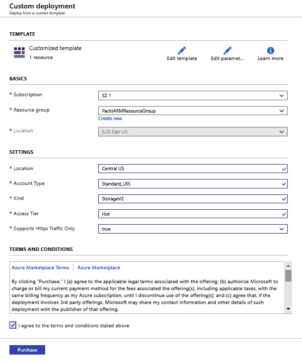

填写值

1.  选择 **购买**。

1.  ARM 模板现在将被部署。部署完成后，进入资源组的概览页面。你将看到存储帐户名称已经自动生成：

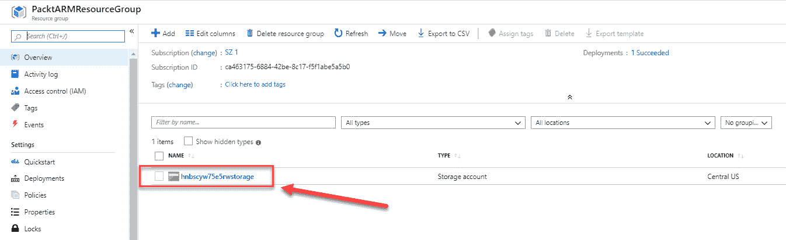

存储帐户名称

有关 ARM 模板语法和结构的更多信息，可以参考以下网站：[`docs.microsoft.com/en-us/azure/azure-resource-manager/resource-group-authoring-templates`](https://docs.microsoft.com/en-us/azure/azure-resource-manager/resource-group-authoring-templates)。

我们现在已经在 Azure 门户中修改了一个 ARM 模板，并使用修改后的 ARM 模板创建了一个新的存储帐户。在接下来的演示中，我们将保存一个部署作为 ARM 模板。

# 将部署保存为 ARM 模板

在本次演示中，我们将从 Azure 门户将部署保存为 ARM 模板。我们将导出我们在可用性集内创建的两个虚拟机的模板，使用 PowerShell 进行操作。

下载后，你可以对其进行修改，并使用 PowerShell 或代码在 Azure 中重新部署。生成的 ARM 模板包含大量代码，这使得对其进行更改非常困难。保存部署为 ARM 模板时，请按照以下步骤操作：

1.  通过打开[`portal.azure.com`](https://portal.azure.com)访问 Azure 门户。

1.  打开我们在上一演示中创建的资源组，在设置中选择导出模板，如下所示：

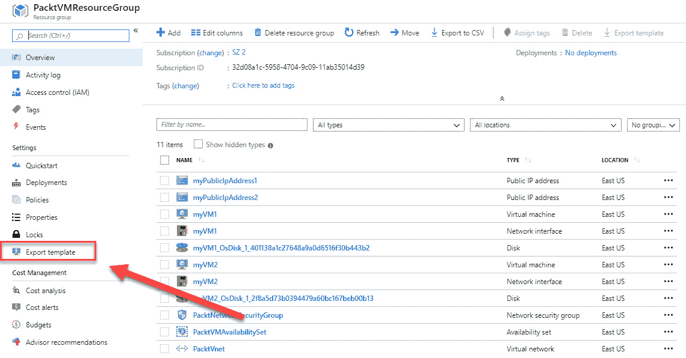

导出模板

1.  模板是根据我们在创建不同资源时所做的设置生成的。你可以从这里下载模板并重新部署。你还可以下载 CLI、PowerShell、.NET 和 Ruby 的脚本，并使用这些编程语言创建不同的资源。从顶部菜单选择**下载**，如下所示：

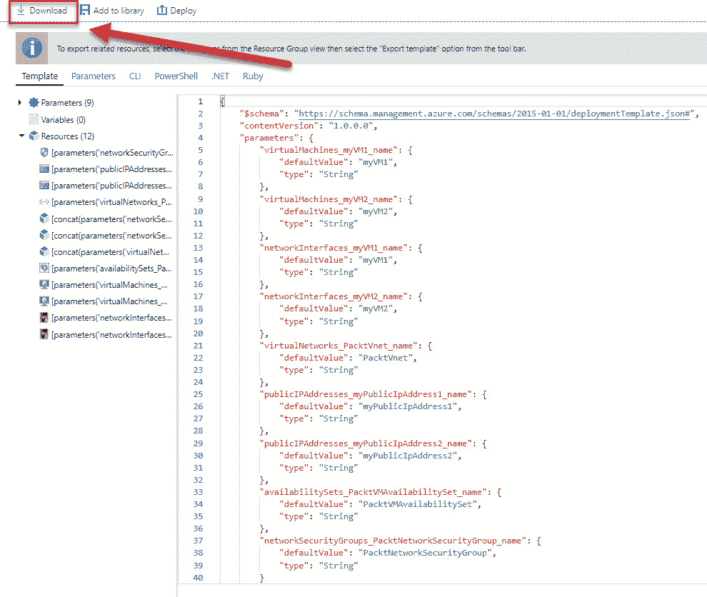

下载模板

模板作为 ZIP 文件下载到你的本地文件系统。

1.  现在，你可以从 ZIP 文件中提取模板文件并在 Visual Studio Code 中打开它们。如果你没有安装此工具，可以使用本章开始时提供的下载链接，或使用记事本或其他文本编辑工具。ZIP 文件包含三种不同语言创建的部署文件，每种语言都有一个：PowerShell、CLI 和 Ruby。它还包含一个`DeploymentHelper.cs`文件，一个`parameters.json`文件和一个`template.json`文件。

1.  在 Visual Studio Code 中，你可以对所需的参数和模板文件进行所有修改。如果你希望再次将模板部署到 Azure，请使用容器内的其中一个部署文件。以 PowerShell 为例，右键点击`deploy.ps1`并选择**使用 PowerShell 运行**。填写订阅 ID，提供资源组名称和部署名称，并使用你的 Azure 凭据登录。这将启动部署。

创建 ARM 模板可能是考试中的一部分问题，因此我强烈建议你花时间熟悉模板的语法和代码块。

# 总结

在本章中，我们介绍了 *部署和管理虚拟机* 目标的第一部分，内容涵盖了如何为 Windows 和 Linux 创建和配置虚拟机。你学习了在 Azure 部署虚拟机时会创建的各种组件和部分。我们还介绍了如何使用扩展集和 ARM 模板自动化虚拟机的部署。

在下一章中，我们将继续进行 *部署和管理虚拟机* 目标的第二部分，内容将涵盖如何管理 Azure 虚拟机和虚拟机备份。

# 问题

回答以下问题，测试你对本章内容的掌握。你可以在本书末尾的 *评估* 部分找到答案：

1.  你可以使用 VM 扩展集自动化部署多个虚拟机吗？

    +   是的

    +   不是

1.  你可以使用可用性集将虚拟机分布到更新和故障域中吗？

    +   是的

    +   不是

1.  你是否需要在 ARM 模板中定义资源提供程序以部署 Azure 中的各种资源？

    +   是的

    +   不是

# 深入阅读

你可以查看以下链接，获取更多关于本章所涉及主题的信息：

+   *Linux 虚拟机*： [`docs.microsoft.com/en-us/azure/virtual-machines/linux/`](https://docs.microsoft.com/en-us/azure/virtual-machines/linux/)

+   *快速入门：在 Azure 门户中创建 Linux 虚拟机*： [`docs.microsoft.com/en-us/azure/virtual-machines/linux/quick-create-portal`](https://docs.microsoft.com/en-us/azure/virtual-machines/linux/quick-create-portal)

+   *虚拟机扩展集文档*： [`docs.microsoft.com/en-us/azure/virtual-machine-scale-sets/`](https://docs.microsoft.com/en-us/azure/virtual-machine-scale-sets/)

+   *管理 Azure 中 Windows 虚拟机的可用性*： [`docs.microsoft.com/en-us/azure/virtual-machines/windows/manage-availability`](https://docs.microsoft.com/en-us/azure/virtual-machines/windows/manage-availability)

+   *Azure 资源管理器概述*： [`docs.microsoft.com/en-us/azure/azure-resource-manager/resource-group-overview`](https://docs.microsoft.com/en-us/azure/azure-resource-manager/resource-group-overview)

+   *理解 Azure 资源管理器模板的结构和语法*： [`docs.microsoft.com/en-us/azure/azure-resource-manager/resource-group-authoring-templates`](https://docs.microsoft.com/en-us/azure/azure-resource-manager/resource-group-authoring-templates)

+   *快速入门：通过 Azure 门户创建和部署 Azure 资源管理器模板*： [`docs.microsoft.com/en-us/azure/azure-resource-manager/resource-manager-quickstart-create-templates-use-the-portal?toc=%2Fazure%2Ftemplates%2Ftoc.json&bc=%2Fazure%2Ftemplates%2Fbreadcrumb%2Ftoc.json`](https://docs.microsoft.com/en-us/azure/azure-resource-manager/resource-manager-quickstart-create-templates-use-the-portal?toc=%2Fazure%2Ftemplates%2Ftoc.json&bc=%2Fazure%2Ftemplates%2Fbreadcrumb%2Ftoc.json)

+   *使用资源管理器模板和 Azure PowerShell 部署资源*: [`docs.microsoft.com/en-us/azure/azure-resource-manager/resource-group-template-deploy`](https://docs.microsoft.com/en-us/azure/azure-resource-manager/resource-group-template-deploy)

+   *Azure 快速入门模板*: [`azure.microsoft.com/en-us/resources/templates/`](https://azure.microsoft.com/en-us/resources/templates/)

+   *在 Azure 资源管理器模板中定义资源*: [`docs.microsoft.com/en-us/azure/templates/`](https://docs.microsoft.com/en-us/azure/templates/)
