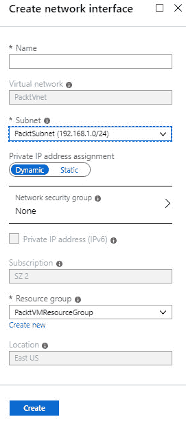

# 第八章：管理 Azure 虚拟机和虚拟机备份

在上一章节中，我们介绍了 Azure 中的**虚拟机**（**VMs**）以及如何通过 Azure 门户和 PowerShell 创建和配置虚拟机。我们还展示了如何使用 ARM 模板自动化这些步骤。

本章继续进行*部署和管理虚拟机*目标的第二部分***。*** 在本章中，我们将重点介绍在创建虚拟机后如何管理它们。您将学习如何使用 Azure 门户、PowerShell 和 CLI 调整虚拟机大小和部署虚拟机。您还将学习如何为虚拟机添加额外的数据磁盘和网络接口。我们将介绍如何自动化虚拟机的配置管理，您将学习如何配置虚拟机的备份和恢复操作。

本章将涵盖以下主题：

+   管理虚拟机大小

+   重新部署虚拟机

+   移动虚拟机

+   添加数据磁盘和网络接口

+   自动化配置管理

+   配置虚拟机备份和恢复操作

# 技术要求

本章示例使用 Azure PowerShell ([`docs.microsoft.com/en-us/powershell/azure/install-az-ps?view=azps-1.8.0`](https://docs.microsoft.com/en-us/powershell/azure/install-az-ps?view=azps-1.8.0))。

# 管理虚拟机大小

本章的第一部分，我们将讨论虚拟机的一些管理功能。创建之后，您可以通过 Azure 门户、PowerShell 和 CLI 管理并更改（垂直扩展）Windows 和 Linux 虚拟机的大小。**垂直扩展**，也叫做**扩展**和**缩减**，意味着根据不同的工作负载增大或缩小虚拟机的大小。

在接下来的演示中，我们将通过 Azure 门户和 CLI 调整虚拟机的大小。

# 在 Azure 门户中调整虚拟机大小

要通过 Azure 门户管理和更改虚拟机的大小以进行横向扩展和缩减，您需要执行以下步骤：

1.  通过打开[`portal.azure.com`](https://portal.azure.com)导航到 Azure 门户。

1.  转到我们之前创建的某个虚拟机的概览面板，或者创建一个新的虚拟机。

1.  在**设置**下，选择**大小**。

1.  在**大小**概览面板中，您可以轻松选择另一个虚拟机大小。在顶部菜单中，有不同的筛选器。您可以按不同的大小、虚拟机代际类型、不同的虚拟机类型、磁盘类型进行筛选，还可以自定义筛选器。选择虚拟机大小后，点击**调整大小**按钮实际调整虚拟机大小：


调整虚拟机大小

1.  如果虚拟机当前正在运行，则更改其大小将在虚拟机重启时生效。

在下一部分，我们将通过 CLI 调整相同虚拟机的大小。

# 使用 CLI 调整虚拟机大小

您还可以使用 CLI 调整虚拟机的大小。您可以从 Azure Cloud Shell 或本地文件系统运行 CLI 脚本。您也可以使用 Azure Cloud Shell 来运行 PowerShell 脚本和命令。在本演示中，我们将通过 Azure Cloud Shell 使用 CLI 调整虚拟机大小。

使用 CLI 调整虚拟机大小时，您需要执行以下步骤：

1.  通过打开[`portal.azure.com`](https://portal.azure.com)导航到 Azure 门户。

1.  通过点击 Azure 门户右上角菜单中的以下菜单项来打开 Azure Cloud Shell：


打开 Azure Cloud Shell

1.  确保选择了 Bash Shell。

1.  添加以下代码行，以列出您所在区域的不同可用虚拟机大小：

```
az vm list-vm-resize-options --resource-group PacktVMResourceGroup --name myVM1 --output table
```

1.  要将虚拟机（VM）调整为不同的大小，请添加以下代码行。如果该大小不可用，您可以将所需的虚拟机大小替换为您订阅或区域中可用的大小：

```
az vm resize --resource-group PacktVMResourceGroup --name myVM1 --size Standard_DS3_v2
```

我们已经使用 Azure 门户和 CLI 调整了虚拟机的大小。在下一节中，我们将跨不同区域移动虚拟机并重新部署它们。

# 重新部署虚拟机

您还可以在虚拟机创建后重新部署它们。当您遇到**远程桌面协议**（**RDP**）连接或应用程序访问 Windows 和 Linux 虚拟机的故障排除问题时，这可能会非常有用。当您重新部署虚拟机时，Azure 将关闭虚拟机，将其移动到 Azure 基础设施中的新节点，然后重新启动它。所有配置选项和关联的资源在重新部署过程中会保留下来。重新部署虚拟机后，临时磁盘会丢失，任何与虚拟网络接口关联的动态 IP 地址也会更新。

从 Azure 门户重新部署 Windows 虚拟机可以很容易地完成，也可以通过 PowerShell 和 CLI 进行。在接下来的演示中，我们将从 Azure 门户和 PowerShell 重新部署虚拟机。

# 从 Azure 门户重新部署虚拟机

要从 Azure 门户重新部署虚拟机，您需要执行以下步骤：

1.  通过打开[`portal.azure.com`](https://portal.azure.com)导航到 Azure 门户。

1.  再次进入我们之前创建的某个虚拟机的概览面板，或创建一个新的虚拟机。

1.  在**支持 + 故障排除**下，选择**重新部署**。这将打开**重新部署**面板，您可以在其中选择**重新部署**按钮来重新部署虚拟机：


重新部署虚拟机

1.  在重新部署过程中，虚拟机将不可用。

在接下来的演示中，我们将使用 PowerShell 重新部署同一虚拟机。

# 从 PowerShell 重新部署虚拟机

从 PowerShell 重新部署虚拟机时，您需要执行以下步骤：

1.  通过打开[`portal.azure.com`](https://portal.azure.com)导航到 Azure 门户。

1.  通过点击 Azure 门户右上角菜单中的以下菜单项再次打开 Azure Cloud Shell。

1.  确保这次选择了**PowerShell**。

1.  添加以下代码行以重新部署虚拟机：

```
Set-AzVM -Redeploy -ResourceGroupName "PacktVMResourceGroup" -Name "myVM1"
```

我们现在已经覆盖了大多数重新部署虚拟机的不同方式。在接下来的部分中，我们将向虚拟机添加额外的数据磁盘和网络接口。

# 移动虚拟机

您还可以将虚拟机和其他资源移动到不同的订阅和资源组之间。您可以使用 Azure 门户、Azure PowerShell、Azure CLI 或 REST API 来移动资源。

当您将虚拟机移到另一个资源组时，在操作期间源和目标都会被锁定。此外，在虚拟机完全移动完成之前，资源组中的写入和删除操作将被阻止。通过锁定这两个操作，您无法在资源组中添加、更新或删除任何资源。然而，使用这些资源的应用程序，例如将 Azure SQL 数据库移动到另一个资源组时，将不会经历任何停机时间。

移动资源仅将其移到新的资源组。实际位置将保持不变，且无法更改。即使新的资源组部署在另一个位置，已移动的资源仍会保持在原始位置。

在不同订阅和资源组之间移动资源有一定的限制。这可能是考试中的问题之一。更多信息，请参考文档：[`docs.microsoft.com/en-us/azure/azure-resource-manager/resource-group-move-resources`](https://docs.microsoft.com/en-us/azure/azure-resource-manager/resource-group-move-resources)。

# 添加数据磁盘和网络接口

您可以通过 Azure 门户、PowerShell 和 CLI 向 Windows 虚拟机添加新的托管数据磁盘和额外的网络接口。虚拟机的大小决定了您可以附加多少数据磁盘到一个虚拟机上。

# 添加数据磁盘

要从 Azure 门户添加数据磁盘，您需要执行以下步骤：

1.  打开[`portal.azure.com`](https://portal.azure.com)进入 Azure 门户。

1.  转到我们之前创建的某个虚拟机的概述面板。

1.  在**设置**下，选择**磁盘**。单击**添加数据磁盘**按钮：


添加数据磁盘

1.  您现在可以添加现有磁盘或创建新磁盘。我们没有额外的磁盘，所以请选择**创建磁盘**：


创建新磁盘

1.  在创建托管磁盘面板中，添加以下值：

    +   **磁盘名称**：`PacktDisk2`。

    +   **资源组**：保持默认选择的组。

    +   **帐户类型**：在此处，您可以选择三种不同的选项：标准 HHD、标准 SSD 和高级 SSD。请选择其中任意一个。

    +   **大小**：保持默认大小。

    +   **源类型**：在此处，您也可以选择三种不同的选项：无、快照、存储 Blob。请选择**无**：


磁盘设置

1.  单击**创建**以创建磁盘。

现在，磁盘已添加到虚拟机中。要初始化新的数据磁盘，你可以登录到服务器并在**磁盘管理**中创建一个新卷。完成后，你可以格式化磁盘以完成初始化。

# 添加网络接口

要从 Azure 门户为虚拟机添加额外的网络接口，你需要执行以下步骤：

1.  从虚拟机的概览面板，在**设置**下选择**网络**。然后，点击**附加网络接口**：


添加网络接口

1.  弹出窗口将显示，你需要点击**创建网络接口**来创建一个新的网络接口。你也可以在这里添加现有的网络接口：


创建新的网络接口

1.  在“创建网络接口”面板中，添加以下值：

    +   **名称**：`PacktNIC`。

    +   **子网**：在这里选择默认子网。

    +   **私有 IP 地址分配**：选择**动态**或**静态**。

    +   **资源组**：在这里保留默认选项：



网络接口设置

1.  点击**创建**。

网络接口现在已添加到虚拟机，并可以通过登录虚拟机并配置网络适配器来进行配置。

在前面的章节中，我们通过手动操作或单个脚本来管理虚拟机。在本章的下一部分，我们将探讨如何实现虚拟机配置管理的自动化。

# 自动化配置管理

在 Azure 中，有多种方法可以自动化基础设施的创建和配置。你可以使用 ARM 模板将基础设施作为代码进行部署，或者使用 Azure 自动化、PowerShell 脚本等。

当不同的 Azure 资源被部署时，有一些工具可以用来管理资源的配置。例如，当你想要自动化虚拟机的配置时，Azure 提供了以下工具：

+   **Chef**：Chef 是一个第三方解决方案，为 Linux、Windows 和 macOS 设备提供 DevOps 自动化平台。它可以用于虚拟机和物理服务器配置。它需要在虚拟机或服务器上安装一个代理，该代理连接到 Chef 服务器，检查是否有可用的更新和其他配置。你还可以使用**Chef Automate**平台来打包和部署应用程序。

+   **Puppet**：Puppet 也是一个第三方解决方案，它具有类似于 Chef 的功能。你可以在从 Azure 门户自动创建虚拟机时启用对 Puppet 的支持。你可以在创建新虚拟机时将其作为扩展添加。它将安装 Puppet 代理，并连接到 Puppet 主服务器。

+   **期望状态配置** (**DSC**)：DSC 是强制对系统进行配置的过程。它使用包含 PowerShell 脚本的配置文件。这些脚本负责对系统进行所需的配置，并确保这些系统保持同步。因此，例如，当你创建了一个 DSC 文件来配置 Windows Server 上的 IIS，而该配置被管理员删除时，DSC 文件将重新安装并再次配置 IIS。

+   **自定义脚本扩展**：你可以使用自定义脚本扩展配置软件安装任务及各种后部署、配置和管理任务。脚本可以从 Azure 存储或 GitHub 下载，或者在扩展运行时提供给 Azure 门户，并在虚拟机上执行。你可以将自定义脚本扩展与 ARM 模板集成，并通过 PowerShell、CLI、VM REST API 和 Azure 门户运行它们。

# 配置虚拟机备份和恢复操作

在本演示中，我们将执行虚拟机的备份和恢复操作。我们将备份本章中使用的虚拟机，并从恢复服务库中恢复它。

# 创建恢复服务库

第一步是创建一个恢复服务库，该库可用于存储备份。

我们将在 Azure 中创建恢复服务库。你可以使用 Azure 门户、PowerShell 和 CLI 来创建它。我们将通过 Azure 门户来创建该库。为此，请执行以下步骤：

1.  打开[`portal.azure.com`](https://portal.azure.com)进入 Azure 门户。

1.  创建一个新的资源。然后，选择**管理工具**，接着选择**备份和站点恢复**。

1.  添加以下值以创建新的库：

    +   **名称**：`PacktVMVault`。

    +   **订阅**：在此选择一个订阅。

    +   **资源组**：创建一个新的资源组，并命名为`PacktVMVault`。

    +   **位置**：选择一个位置：


创建新的恢复服务库

1.  点击**创建**按钮。

我们现在已经创建了恢复服务库，可以用来恢复备份。接下来我们将在下一部分中创建并配置备份策略。

# 创建和配置备份策略

在恢复服务库概览页中，你可以配置备份策略。在本演示中，我们将配置一个备份策略。因此，请执行以下步骤：

1.  打开[`portal.azure.com`](https://portal.azure.com)进入 Azure 门户。

1.  打开我们在上一步创建的恢复服务库。

1.  在顶部菜单中，点击**+ 备份**：


创建新的备份

1.  在下一个屏幕中，选择以下选项并点击**备份**：


设置备份目标

1.  现在，我们需要选择一个备份策略。我们可以使用 Azure 为我们创建的默认策略，该策略每天进行一次备份，或者我们也可以在此处创建自定义策略。在“选择备份策略”下，选择“创建新策略”：


创建新的备份策略

1.  对于新的策略，填写以下值：


创建备份策略

1.  填写完所有值后，点击**确定**。

1.  然后，我们需要选择要备份的虚拟机。选择它们并点击**确定**：

**** [选择要备份的虚拟机]

1.  点击**启用备份**。

1.  现在，虚拟机将每天在同一时间进行备份。

1.  如果你打开虚拟机概览面板，在**操作**下选择**备份**，你将看到已经应用了备份策略，并且恢复服务库也会显示。点击顶部菜单中的**立即备份**以执行手动备份：


备份虚拟机

1.  保持默认的保留日期，并点击**确定**。

1.  选择**查看所有任务**以查看备份的进度：


备份任务

1.  所有任务都会显示在列表中：


备份列表

当备份创建完成后，我们可以恢复它。在本演示的下一个部分，我们将恢复虚拟机的备份。

# 恢复备份

在最后的演示中，我们将恢复我们创建的虚拟机（VM）的备份。因此，请按以下步骤操作：

1.  在虚拟机备份部分的概览面板中，选择顶部菜单中的**恢复虚拟机**：


恢复备份

1.  从列表中选择恢复点并点击**确定**：


选择恢复点

1.  在下一个面板中，你可以设置恢复配置。你可以选择创建一个新的虚拟机或替换现有虚拟机。选择**替换现有虚拟机**并选择以下值：


设置恢复配置

1.  确保虚拟机已关闭。

1.  点击**确定**和**恢复**。

备份现在将被恢复，现有的虚拟机将被备份替换。

Azure 站点恢复在第六章中已有介绍，*配置 Azure 文件和实现 Azure 备份*。有关它所提供的功能和能力的更多信息，可以参考该章节。

# 总结

在本章中，我们讲解了如何管理虚拟机，以及如何实施虚拟机备份。我们还讨论了如何从 Azure 门户管理虚拟机，以及如何使用 PowerShell 和 CLI 移动和重新部署虚拟机。我们深入探讨了配置管理的自动化，并对 Azure 备份和恢复操作进行了详细分析。

在下一章，我们将从*部署和管理虚拟网络*目标的第一部分开始，讲解如何实施和管理虚拟网络。

# 问题

回答以下问题，以测试您对本章内容的理解。您可以在本书末尾的*评估*部分找到答案：

1.  您可以使用 PowerShell 和 CLI 来移动、重新部署和调整 Windows 和 Linux 虚拟机的大小吗？

    +   是的

    +   否

1.  您只能通过 Azure 门户添加额外的数据磁盘和网络接口吗？

    +   是的

    +   否

1.  部署后，您能使用自定义脚本扩展来配置 macOS 机器吗？

    +   是的

    +   否

# 进一步阅读

您可以查看以下链接，了解更多关于本章内容的详细信息：

+   *调整 Windows 虚拟机大小*: [`docs.microsoft.com/en-us/azure/virtual-machines/windows/resize-vm`](https://docs.microsoft.com/en-us/azure/virtual-machines/windows/resize-vm)。

+   *使用 Azure CLI 调整 Linux 虚拟机大小*: [`docs.microsoft.com/en-us/azure/virtual-machines/linux/change-vm-size`](https://docs.microsoft.com/en-us/azure/virtual-machines/linux/change-vm-size)。

+   *将 Windows 虚拟机重新部署到新的 Azure 节点*: [`docs.microsoft.com/en-us/azure/virtual-machines/troubleshooting/redeploy-to-new-node-windows`](https://docs.microsoft.com/en-us/azure/virtual-machines/troubleshooting/redeploy-to-new-node-windows)。

+   *将 Linux 虚拟机重新部署到新的 Azure 节点*: [`docs.microsoft.com/en-us/azure/virtual-machines/troubleshooting/redeploy-to-new-node-linux`](https://docs.microsoft.com/en-us/azure/virtual-machines/troubleshooting/redeploy-to-new-node-linux)。

+   *使用 PowerShell 附加数据磁盘到 Windows 虚拟机*：[`docs.microsoft.com/en-us/azure/virtual-machines/windows/attach-disk-ps`](https://docs.microsoft.com/en-us/azure/virtual-machines/windows/attach-disk-ps)。

+   *将 Azure 虚拟机迁移到另一个区域*: [`docs.microsoft.com/en-us/azure/site-recovery/azure-to-azure-tutorial-migrate?toc=%2fazure%2fvirtual-machines%2flinux%2ftoc.json`](https://docs.microsoft.com/en-us/azure/site-recovery/azure-to-azure-tutorial-migrate?toc=%2fazure%2fvirtual-machines%2flinux%2ftoc.json)。

+   *Windows 的自定义脚本扩展*: [`docs.microsoft.com/en-us/azure/virtual-machines/extensions/custom-script-windows`](https://docs.microsoft.com/en-us/azure/virtual-machines/extensions/custom-script-windows)。

+   *Windows PowerShell 所需状态配置概述*: [`docs.microsoft.com/en-us/powershell/dsc/overview/overview`](https://docs.microsoft.com/en-us/powershell/dsc/overview/overview)。

+   *什么是 Azure 备份？*: [`docs.microsoft.com/en-us/azure/backup/backup-overview`](https://docs.microsoft.com/en-us/azure/backup/backup-overview)。

+   *关于站点恢复*：[`docs.microsoft.com/en-us/azure/site-recovery/site-recovery-overview`](https://docs.microsoft.com/en-us/azure/site-recovery/site-recovery-overview).
