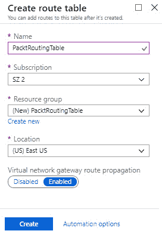
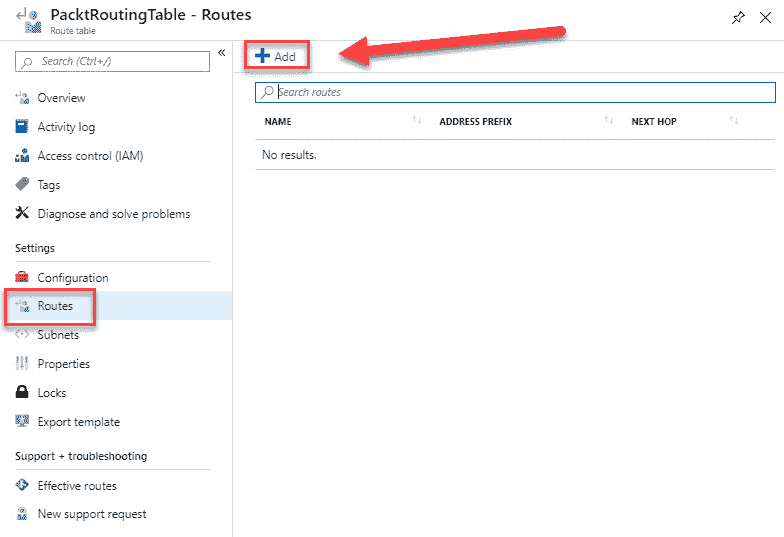
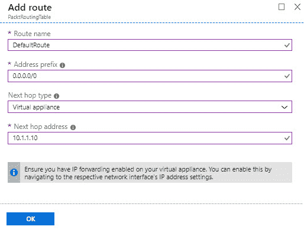
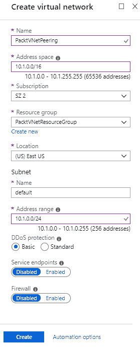
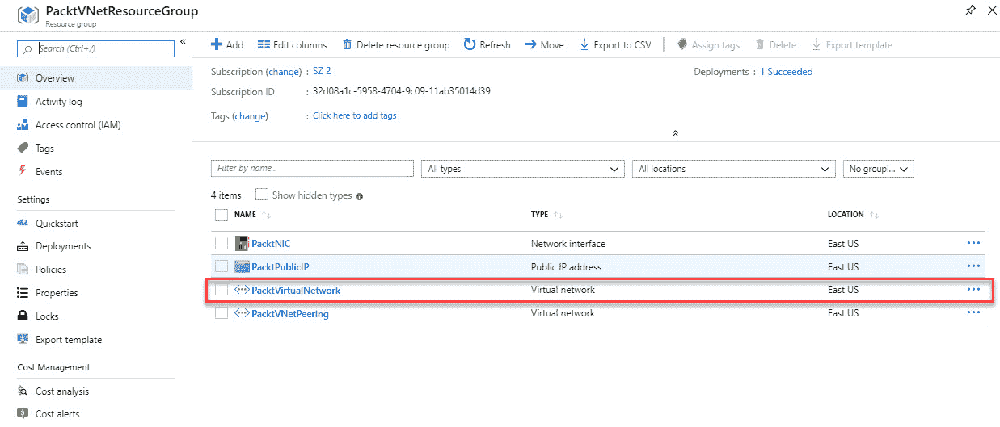
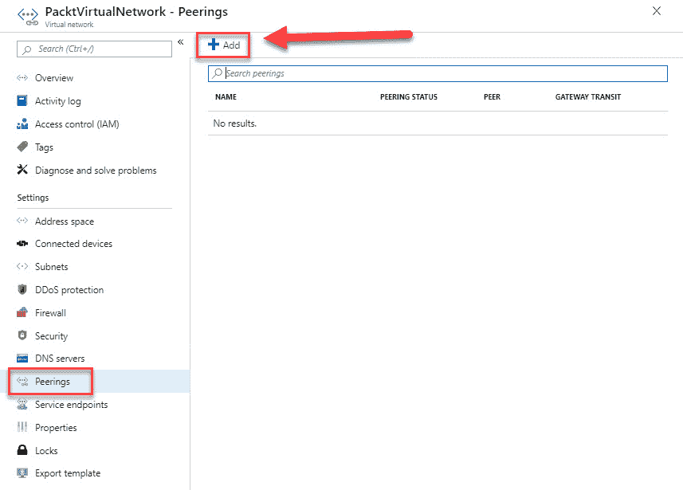
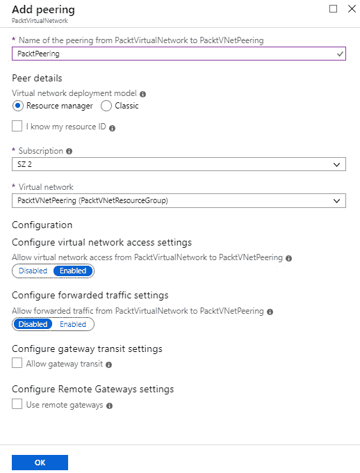

# 实施和管理虚拟网络

在上一章中，我们通过讲解如何管理 Azure 虚拟机和虚拟机备份，完成了*部署和管理虚拟机*目标的最后一部分。

本章介绍了新的目标，*部署和管理虚拟网络*。在本章中，我们将重点讲解 Azure 中的虚拟网络以及如何实施和管理它。你将了解 Azure 虚拟网络的基础知识，包括私有和公共 IP 地址，并学习如何配置子网、**虚拟网络**（**VNets**）以及公共和私有 IP 地址。为了完成本章内容，我们将配置 VNet 对等连接。

本章将涵盖以下主题：

+   Azure VNet

+   IP 地址

+   配置子网和 VNets

+   配置私有和公共 IP 地址

+   创建和配置 VNet 对等连接

# 技术要求

本章使用 Azure PowerShell 进行示例。有关更多详细信息，请访问[`docs.microsoft.com/en-us/powershell/azure/install-az-ps?view=azps-1.8.0`](https://docs.microsoft.com/en-us/powershell/azure/install-az-ps?view=azps-1.8.0)。

我们的示例应用程序的源代码可以从[`github.com/PacktPublishing/Microsoft-Azure-Administrator-Exam-Guide-AZ-103/tree/master/Chapter09`](https://github.com/PacktPublishing/Microsoft-Azure-Administrator-Exam-Guide-AZ-103/tree/master/Chapter09)下载。

# Azure VNet

Azure VNet 是传统网络的虚拟表示，托管在云中。它完全基于软件，而传统网络则使用电缆、路由器等。VNets 提供一个安全且隔离的环境，并将 Azure 资源相互连接。默认情况下，不同的资源无法从 VNet 外部访问。然而，你可以将多个 VNets 连接在一起，或者将 VNet 连接到本地网络。所有连接到同一 VNet 内的 Azure 资源必须位于同一地区和订阅中。

当你创建 VNet 时，系统会自动为你创建一个子网。你可以在同一个 VNet 中创建多个子网（每个 VNet 最多支持 1000 个子网）。连接多个 VNets 在一起称为 VNet 对等连接。每个 Azure 订阅最多允许 10 个对等连接。

Azure 中可以使用的最小子网是`/29`子网，它包含 8 个地址，最大的是`/8`子网，包含 1600 万个地址。

要了解更多关于子网划分的信息，可以参考*子网掩码备忘单*：[`www.aelius.com/njh/subnet_sheet.html`](https://www.aelius.com/njh/subnet_sheet.html)。

# IP 地址

Azure 中的 VNet 可以拥有私有和公共 IP 地址。私有 IP 地址只能从 VNet 内部访问，而公共 IP 地址也可以从互联网上访问。您可以通过 VPN 网关或 ExpressRoute 连接访问私有 IP 地址。私有和公共 IP 地址都可以是静态或动态的，但在创建新 VNet 时，IP 地址默认是静态的。您可以通过 Azure 门户、PowerShell 或 CLI 将 IP 地址更改为 *静态*。以下是 IP 地址的两种状态：

+   **动态**：动态 IP 地址由 Azure 自动分配，并从虚拟网络中配置的子网地址范围内选择，虚拟网络是 Azure 资源所在的位置。IP 地址在创建或启动时分配给 Azure 资源。当资源停止并释放（例如，在 Azure 门户中停止虚拟机时，虚拟机会自动释放）时，IP 地址将被释放，并被 Azure 添加回子网中可用地址池。

+   **静态**：静态 IP 地址（包括私有和公共）是预先分配的，并且在删除分配之前将保持不变。您可以手动选择一个静态私有 IP 地址。它们只能分配给非面向互联网的连接，例如内部负载均衡器。您可以将私有静态 IP 地址分配给您本地网络的连接或 ExpressRoute 电路。公共静态 IP 地址由 Azure 自动创建，可以分配给面向互联网的连接，例如外部负载均衡器。

# 公共 IP 地址

公共 IP 地址可以用于 Azure 服务之间的内部通信以及通过互联网进行的外部通信。您可以为公共 IP 地址使用 IPv4 和 IPv6，但对 IPv6 的支持是有限的。撰写本文时，您只能将 IPv6 地址分配给外部负载均衡器。

当 Azure 资源启动或创建时，Azure 会将公共 IP 地址分配给 VNet 的网络接口。当发起出站连接时，Azure 会将私有 IP 地址映射到公共 IP 地址，即 **源网络地址转换**（**SNAT**）。

Azure 会在 Azure 资源启动或创建时将公共 IP 地址分配给网络接口。当发起出站连接时，Azure 会将私有 IP 地址映射到公共 IP 地址（SNAT）。返回流量也会允许通过。公共 IP 地址通常用于虚拟机、面向互联网的负载均衡器、VPN 网关和应用程序网关。每个订阅最多可以有 60 个动态公共 IP 地址和 20 个静态公共 IP 地址。前五个静态 IP 地址免费使用。

# 私有 IP 地址

私有 IP 地址支持 IPv4 和 IPv6，但对 IPv6 的支持有限。它们只能动态分配，且 IPv6 地址在 VNet 内不能相互通信。使用 IPv6 地址的唯一方法是将其分配给面向互联网的负载均衡器，其中前端 IP 地址是 IPv4 地址，后端是 IPv6 地址。私有 IP 地址通常用于虚拟机、内部负载均衡器和应用程序网关。由于 VPN 始终面向互联网，它不能拥有私有 IP 地址。每个 VNet 最多可拥有 4,096 个私有 IP 地址。然而，您可以创建多个 VNets（每个订阅最多 50 个 VNet）。

这些限制基于以下页面的默认限制：[`docs.microsoft.com/en-us/azure/azure-subscription-service-limits?toc=%2fazure%2fvirtual-network%2ftoc.json#networking-limits`](https://docs.microsoft.com/en-us/azure/azure-subscription-service-limits?toc=%2fazure%2fvirtual-network%2ftoc.json#networking-limits)。您可以提交支持请求以提高这些限制。

现在，我们已经了解了 Azure 中各种网络方面的背景信息，接下来我们可以配置一个带子网的虚拟网络。

# 配置虚拟网络和子网

在本演示中，我们将从 Azure 门户创建和配置一个虚拟网络和一个子网。我们在之前的演示中已经创建了这两个内容，例如在创建虚拟机时。现在我们将更详细地讲解这个主题。

在下一个演示中，我们将使用 PowerShell 配置虚拟网络和子网。因此，我们需要按照以下步骤进行操作：

1.  首先，我们需要登录 Azure 帐户，如下所示：

```
Connect-AzAccount
```

1.  如有必要，请按照以下方式选择正确的订阅：

```
Select-AzSubscription -SubscriptionId "********-****-****-****-***********"
```

1.  为 VNet 创建一个资源组，如下所示：

```
New-AzResourceGroup -Name PacktVNetResourceGroup -Location EastUS
```

1.  接下来，我们可以按照以下方式创建 VNet：

```
$virtualNetwork = New-AzVirtualNetwork `
 -ResourceGroupName PacktVNetResourceGroup `
 -Location EastUS `
 -Name PacktVirtualNetwork `
 -AddressPrefix 10.0.0.0/16
```

1.  然后，创建子网，如下所示：

```
$subnetConfig = Add-AzVirtualNetworkSubnetConfig `
 -Name default `
 -AddressPrefix 10.0.0.0/24 `
 -VirtualNetwork $virtualNetwork
```

1.  最后，将子网与虚拟网络关联，如下所示：

```
$virtualNetwork | Set-AzVirtualNetwork
```

我们已经从 PowerShell 创建了一个 VNet 和子网。我们将在本章后续的演示中使用它。在下一部分，我们将使用 PowerShell 配置私有和公有 IP 地址，并将其与该 VNet 关联。

# 配置私有和公有 IP 地址

在本演示中，我们将配置一个私有和一个公有 IP 地址。当我们创建 VNet 时，Azure 已经为我们自动创建了一个私有 IP 地址。然而，在本演示中，我们将再创建一个，并将其与公有 IP 地址一起关联到 **网络接口卡**（**NIC**）。要从 PowerShell 配置私有和公有 IP 地址，您需要按照以下步骤进行操作：

1.  在相同的 PowerShell 窗口中，添加以下代码以检索 VNet 和子网配置：

```
$vnet = Get-AzVirtualNetwork -Name PacktVirtualNetwork -ResourceGroupName PacktVNetResourceGroup
$subnet = Get-AzVirtualNetworkSubnetConfig -Name default -VirtualNetwork $vnet
```

1.  接下来，创建一个私有和公有 IP 地址，并将它们分配给配置，如下所示：

```
$publicIP = New-AzPublicIpAddress `
 -Name PacktPublicIP `
 -ResourceGroupName PacktVNetResourceGroup `
 -AllocationMethod Dynamic `
 -Location EastUS

$IpConfig = New-AzNetworkInterfaceIpConfig `
 -Name PacktPrivateIP `
 -Subnet $subnet `
 -PrivateIpAddress 10.0.0.4 `
 -PublicIPAddress $publicIP `
 -Primary
```

1.  然后，创建一个网络接口并按如下配置进行分配：

```
$NIC = New-AzNetworkInterface `
 -Name PacktNIC `
 -ResourceGroupName PacktVNetResourceGroup `
 -Location EastUS `
 -IpConfiguration $IpConfig
```

我们现在已经配置了一个 NIC，一个公有 IP 地址和一个私有 IP 地址，并将它们与我们在之前示范中创建的 VNet 关联。

# 用户定义路由

当你创建子网时，Azure 会创建系统路由，以便子网中的所有资源可以相互通信。每个子网都有以下默认的系统路由表，其中包含最小的路由：

+   **本地 VNet**：这是一个用于 VNet 中资源的路由。对于这些路由，没有下一跳地址。如果目标 IP 地址包含本地 VNet 前缀，则流量会被路由到那里。

+   **本地网络**：这是一个定义了本地网络地址空间的路由。对于此路由，下一跳地址将是 VNet 网关。如果目标 IP 地址包含本地网络地址前缀，则流量会被路由到那里。

+   **互联网**：该路由用于所有通过公有互联网传输的流量，互联网网关总是下一跳地址。如果目标 IP 地址不包含 VNet 或本地网络前缀，则流量会通过**网络地址转换**（**NAT**）路由到互联网。

你可以通过创建**用户定义路由**（**UDRs**）来覆盖系统路由。通过这种方式，你可以强制流量按照特定的路由路径走。例如，你有一个由两个子网组成的网络，你想要添加一台作为**隔离区**（**DMZ**）的虚拟机，并在其上安装防火墙。你希望流量只能通过防火墙，而不能在两个子网之间流动。为了创建 UDR 并启用 IP 转发，你需要在 Azure 中创建一个路由表。当该路由表创建完毕且包含自定义路由时，Azure 会优先使用自定义路由而不是默认的系统路由。

# 创建用户定义路由

要创建**用户定义路由（UDRs）**，请按照以下步骤操作：

1.  打开[`portal.azure.com/`](https://portal.azure.com/)并导航至 Azure 门户。

1.  点击**创建资源**，在搜索框中输入`路由表`，并创建一个新的路由表。

1.  添加以下值，如下图所示：

    +   **名称**：`PacktRoutingTable`。

    +   **订阅**：选择一个订阅。

    +   **资源组**：创建一个新的资源组并命名为`PacktRoutingTable`。

    +   **位置**：东美国（East US）。



创建新的路由表

1.  点击**创建**。

1.  创建一个新的空路由表。创建后，打开路由表的概览面板。要添加自定义路由，请点击左侧菜单中的**路由**，如下所示：



添加新路由

1.  在这个示例中，我们希望所有互联网流量都通过防火墙。因此，添加以下值，如下图所示：

    +   **名称**：`DefaultRoute`。

    +   **地址前缀**：`0.0.0.0/0`。

    +   **下一跳类型**：虚拟设备；即防火墙。

    +   **下一跳地址**：`10.1.1.10`。这将是防火墙的内部 IP 地址。



向路由表添加路由

1.  点击**确定**。路由已为您创建。

若要获取有关如何创建 UDR 和虚拟设备的详细说明，您可以参考以下教程：[`docs.microsoft.com/en-us/azure/virtual-network/tutorial-create-route-table-portal`](https://docs.microsoft.com/en-us/azure/virtual-network/tutorial-create-route-table-portal)。

我们创建了一个自定义路由表，并向其中添加了一条路由，将所有流量路由到防火墙。在接下来的部分中，我们将讨论 VNet 对等连接。

# VNet 对等连接

VNet 对等连接是一种机制，通过 Azure 骨干基础设施无缝地连接同一区域中的两个 VNet。一旦对等连接，VNets 在连接性方面表现为一个，就像在同一 VNet 中创建的虚拟机之间的流量路由一样。驻留在对等 VNet 中的虚拟机使用私有 IP 地址进行相互通信。

Azure 支持以下两种不同类型的对等连接：

+   **VNet 对等连接**：用于连接同一 Azure 区域中的 VNets。

+   **全球 VNet 对等连接**：用于连接不同 Azure 区域的 VNet。

对等 VNet 之间的网络流量是私密的。流量完全保持在微软骨干网络中，因此无需使用任何额外的网关，也不需要通过公共互联网路由流量。对等 VNet 之间的通信也无需加密。它通过不同虚拟网络中的资源之间的低延迟、高带宽连接进行通信。

您可以使用 VNet 对等连接将通过资源管理器和经典部署模型创建的 VNets 连接在一起，它还提供跨 Azure 区域和 Azure 订阅传输数据的能力。

VNet 对等连接不同于使用 Azure VPN 网关将两个 VNet 连接在一起。当您使用 Azure VPN 网关将两个 VNet 连接在一起时，这叫做**VNet 到 VNet 连接**。这部分内容在第十章，*将本地网络与 Azure 虚拟网络集成*中有详细讲解。

# 创建和配置 VNet 对等连接

在下一个演示中，我们将从 Azure 门户创建并配置 VNet 对等连接。我们需要两个 VNet。我们将使用在第一个演示中创建的 VNet，并创建一个额外的 VNet，其地址空间与第一个 VNet 不同。在对等连接两个 VNet 时，地址空间不能重叠。

要从 Azure 门户创建 VNet 并设置 VNet 对等连接，请按照以下步骤操作：

1.  通过打开[`portal.azure.com/`](https://portal.azure.com/)导航到 Azure 门户。

1.  点击**创建资源** | **网络** | **虚拟网络**。创建一个新的 VNet。

1.  添加以下值：

    +   **名称**：`PacktVNetPeering`

    +   **地址空间**：`10.1.0.0/16`

    +   **订阅**：选择一个订阅

    +   **资源组**：`PacktVNetResourceGroup`

    +   **位置**：东部美国

    +   **子网**：`default`

    +   **地址范围**：`10.1.0.0/24`

这些值显示在以下截图中：



创建额外的 VNet

1.  点击**创建**。

1.  虚拟网络已为你创建。创建后，打开我们在本章首次演示中创建的虚拟网络的概述窗口，虚拟网络名为`PacktVirtualNetwork`，如下所示：



1.  然后，在**设置**下选择**对等连接**。点击顶部菜单中的**添加**，如下所示：



添加新的对等连接

1.  在添加对等连接窗口中，添加以下值：

    +   **从 PacktVirtualNetwork 到 PacktVNetPeering 的对等连接名称**：`PacktPeering`。

    +   **虚拟网络部署模型**：资源管理器。

    +   **订阅**：保持默认选项。

    +   **虚拟网络**：选择`PacktVNetPeering`。

这些值显示在以下截图中：



添加对等连接

1.  这里还有其他一些设置可以进行配置。第一个是**允许从 PacktVirtualNetwork 到 PacktVNetPeering 的转发流量**：这意味着你允许来自对等虚拟网络外部的流量。第二个是**配置网关传输设置**：这意味着对等网络使用此虚拟网络的网关来连接外部资源，例如本地环境。最后一个是**配置远程网关设置**：对于这个设置，你必须先启用前一个设置，通过启用此设置，你将使用另一个虚拟网络网关连接到虚拟网络外部的资源。

1.  点击**确定**，对等连接已创建。

我们现在已经通过 Azure 门户配置了 VNet 对等连接。本章到此结束。

有多种方法可以验证网络连接性。在第十一章，*监控和故障排除虚拟网络*，会有更详细的介绍。

# 总结

本章中，我们介绍了*部署和管理虚拟网络*目标的第一部分，重点讲解了 Azure 中的虚拟网络。我们已配置虚拟网络并创建了私有和公共 IP 地址。我们还通过 Azure 门户配置了 VNet 对等连接。

在下一章中，我们将继续本目标，介绍如何将本地网络与 Azure VNet 集成。

# 问题

请回答以下问题，测试你对本章内容的了解。你可以在本书结尾的*评估*部分找到答案。

1.  当你使用 VNet 对等连接时，是否需要创建 Azure VPN 网关将两个虚拟网络互联？

    +   是

    +   否

1.  你可以创建自定义路由表来调整虚拟网络内部不同资源之间的路由吗？

    +   是

    +   否

1.  你可以为所有 Azure 资源分配 IPv6 地址吗？

    +   是

    +   否

# 进一步阅读

你可以查看以下链接，了解本章涉及的更多信息：

+   *Azure 中的 IP 地址类型和分配方法*：[`docs.microsoft.com/en-us/azure/virtual-network/virtual-network-ip-addresses-overview-arm`](https://docs.microsoft.com/en-us/azure/virtual-network/virtual-network-ip-addresses-overview-arm)

+   *Azure 网络限制*：[`docs.microsoft.com/en-us/azure/azure-subscription-service-limits?toc=%2fazure%2fvirtual-network%2ftoc.json#networking-limits`](https://docs.microsoft.com/en-us/azure/azure-subscription-service-limits?toc=%2fazure%2fvirtual-network%2ftoc.json#networking-limits)

+   *快速入门：使用 Azure 门户创建虚拟网络*：[`docs.microsoft.com/en-us/azure/virtual-network/quick-create-portal`](https://docs.microsoft.com/en-us/azure/virtual-network/quick-create-portal)

+   *快速入门：使用 PowerShell 创建虚拟网络*：[`docs.microsoft.com/en-us/azure/virtual-network/quick-create-powershell`](https://docs.microsoft.com/en-us/azure/virtual-network/quick-create-powershell)

+   *快速入门：使用 Azure CLI 创建虚拟网络*：[`docs.microsoft.com/en-us/azure/virtual-network/quick-create-cli`](https://docs.microsoft.com/en-us/azure/virtual-network/quick-create-cli)

+   *为 Azure 网络接口添加、更改或删除 IP 地址*：[`docs.microsoft.com/en-us/azure/virtual-network/virtual-network-network-interface-addresses`](https://docs.microsoft.com/en-us/azure/virtual-network/virtual-network-network-interface-addresses)

+   *创建、更改或删除公共 IP 地址*：[`docs.microsoft.com/en-us/azure/virtual-network/virtual-network-public-ip-address`](https://docs.microsoft.com/en-us/azure/virtual-network/virtual-network-public-ip-address)

+   *教程：使用 Azure 门户通过路由表路由网络流量*：[`docs.microsoft.com/en-us/azure/virtual-network/tutorial-create-route-table-portal`](https://docs.microsoft.com/en-us/azure/virtual-network/tutorial-create-route-table-portal)

+   *虚拟网络对等连接*：[`docs.microsoft.com/en-us/azure/virtual-network/virtual-network-peering-overview`](https://docs.microsoft.com/en-us/azure/virtual-network/virtual-network-peering-overview)
