# 将本地网络与 Azure 虚拟网络集成

在上一章中，我们介绍了 *部署和管理虚拟网络* 目标的第一部分。我们讨论了 Azure 中的虚拟网络，并介绍了虚拟网络的基础知识，配置了私有和公共 IP 地址。我们还讨论了 VNet 对等连接。

本章继续本目标的内容，介绍如何将您的本地网络与 Azure 虚拟网络集成。在本章中，我们将重点讨论从本地环境到 Azure 的 VPN 连接以及 Azure 到 Azure 的 VPN 连接。您将学习如何创建 Azure VPN 网关，以及如何使用本地服务器和 Azure VPN 网关配置 **站点到站点**（**S2S**）VPN。章末，我们将介绍 VNet 到 VNet 的连接，并讨论它与 S2S VPN 的相似之处。

本章将涵盖以下主题：

+   Azure VPN 网关

+   创建和配置 Azure VPN 网关

+   创建和配置 S2S VPN

+   验证本地连接性

+   VNet 到 VNet

# 技术要求

本章使用 Azure PowerShell 进行示例：[`docs.microsoft.com/en-us/powershell/azure/install-az-ps?view=azps-1.8.0`](https://docs.microsoft.com/en-us/powershell/azure/install-az-ps?view=azps-1.8.0)。

本章的源代码可以从以下 GitHub 链接下载：[`github.com/PacktPublishing/Microsoft-Azure-Administrator-Exam-Guide-AZ-103/tree/master/Chapter10`](https://github.com/PacktPublishing/Microsoft-Azure-Administrator-Exam-Guide-AZ-103/tree/master/Chapter10)。

# Azure VPN 网关

Azure VPN 提供了一个安全网关，可以用于通过互联网在 Azure 虚拟网络和本地位置之间发送加密流量。此网关还可以用于在不同的 Azure 虚拟网络和 Microsoft 网络之间发送加密流量。

对于每个虚拟网络，您只能拥有一个 VPN 网关。但您可以创建多个连接到同一个 VPN 网关。当创建多个连接时，所有 VPN 隧道将共享可用的网关带宽。

**虚拟网络网关** 是通过部署在 **网关子网** 中的两个或多个虚拟机创建的。网关子网是为 VPN 连接创建的特定子网。部署在网关子网中的虚拟机是在虚拟网络网关创建时一起创建的。然后，这些虚拟机被配置为包含特定的网关服务和路由表，以连接到 Azure 中的网关。无法手动配置网关服务和路由表。

Azure VPN 网关提供以下定价层：

+   **基础**：该层提供最多 10 个 S2S/VNet 到 VNet 的隧道，并且最多支持 128 个 **点对站点**（**P2S**）连接。平均带宽为 100 Mbps。

+   **VpnGw1**：此层级提供最多 30 个 S2S/VNet 到 VNet 的隧道和最多 128 个 P2S 连接，平均带宽为 650 Mbps。

+   **VpnGw2**：此层级提供最多 30 个 S2S/VNet 到 VNet 的隧道和最多 128 个 P2S 连接，平均带宽为 1 Gbps。

+   **VpnGw3**：此层级提供最多 30 个 S2S/VNet 到 VNet 的隧道和最多 128 个 P2S 连接，平均带宽为 1.25 Gbps。

# S2S VPN

S2S VPN 网关连接是通过 IPsec/IKE（IKEv1 或 IKEv2）VPN 隧道建立的连接。这些连接可以用于混合配置和跨域配置。它旨在通过互联网在某个位置与虚拟网络之间建立安全连接。该位置可以是办公室。例如，一旦配置了 S2S VPN 连接，您就可以从该位置的每个设备连接到 Azure，使用相同的 VPN 位置。

S2S 连接需要一个位于本地的、与之分配了公网 IP 地址的兼容 VPN 设备。它不应位于 NAT 后面。

如需了解兼容的 VPN 设备，您可以参考以下文档：[`docs.microsoft.com/en-us/azure/vpn-gateway/vpn-gateway-vpn-faq#s2s`](https://docs.microsoft.com/en-us/azure/vpn-gateway/vpn-gateway-vpn-faq#s2s)。

以下图示显示了从本地环境到 Azure 的 S2S VPN 连接：

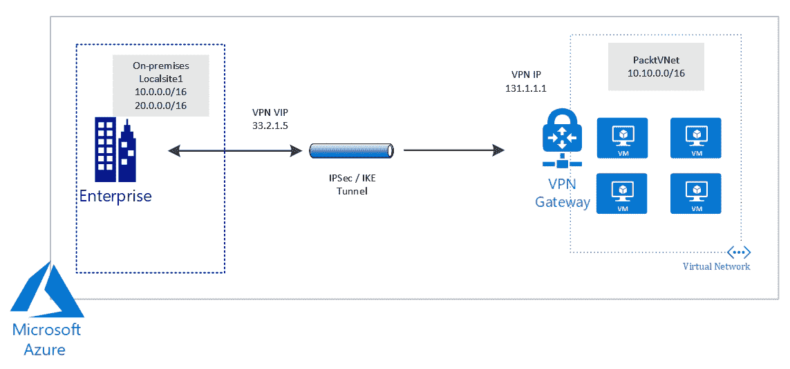

S2S VPN

在下一节中，我们将讨论**多站点 VPN**。

# 多站点 VPN

多站点 VPN 是 S2S 连接的一种变体。您可以使用这种连接类型通过虚拟网络网关连接到多个本地站点。多站点连接要求使用基于路由的 VPN 类型网关。所有通过网关的连接将共享可用带宽，因为每个虚拟网络只能有一个 VPN 网关。

以下图示显示了从本地环境到 Azure 的多站点 VPN 连接：

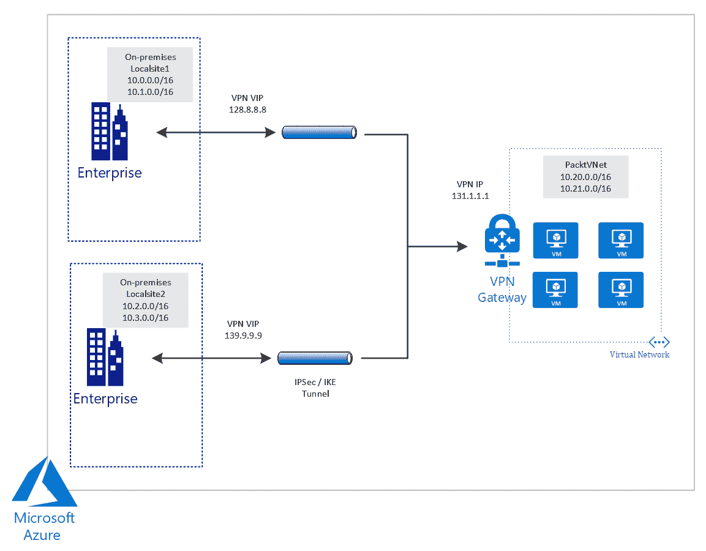

多站点 VPN

在下一节中，我们将讨论**点对站（P2S）**VPN。

# P2S VPN

P2S VPN 网关连接旨在通过互联网在客户端和虚拟网络之间建立安全连接。它是从客户端计算机建立的，适用于在不同位置工作的人，例如在家或酒店工作时。P2S VPN 也是如果您只有少数客户端需要连接到虚拟网络时的最佳解决方案。

P2S 连接不需要像 S2S VPN 连接那样拥有一个本地的、公开的 IP 地址。您可以将 P2S 连接与 S2S 连接一起使用，且都通过相同的 VPN 网关。您需要确保两种连接的配置要求是兼容的，以便能够在同一网关上使用这两种连接类型。

下图显示了从本地环境到 Azure 的 P2S VPN 连接：

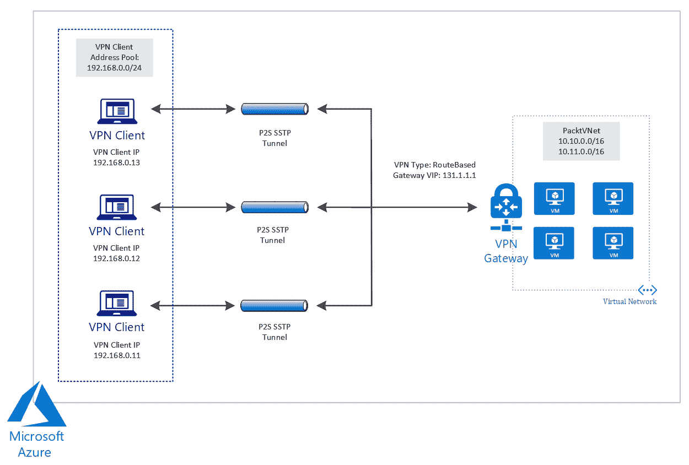

P2S VPN

在接下来的部分中，我们将讨论**ExpressRoute**。

# ExpressRoute

ExpressRoute 提供由连接提供商促成的私有连接。ExpressRoute 连接不会通过公共互联网传输，而是使用更可靠的连接。这些类型的连接提供比通过互联网传输的连接更低的延迟、更高的安全性和更快的速度。你可以使用它将本地网络扩展到 Azure 和 Office 365。连接可以通过任意对任意（IP VPN）网络、共置设施中的虚拟交叉连接或点对点以太网网络连接进行。

ExpressRoute 使用虚拟网络网关，并且配置了网关类型为`ExpressRoute`，而不是`VPN`。默认情况下，流量不会加密，但你可以创建一个解决方案来加密通过 ExpressRoute 电路传输的流量。

下图显示了从本地环境到 Azure 的 ExpressRoute 连接：

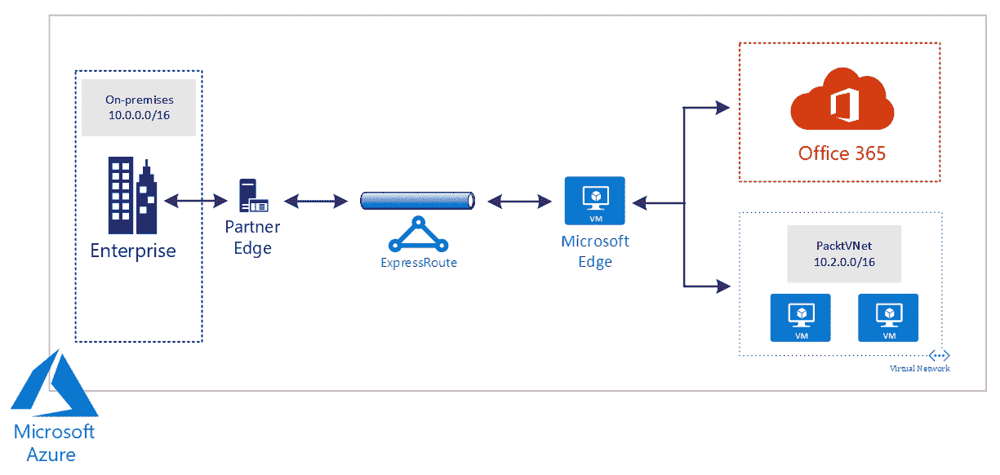

ExpressRoute

现在我们已经了解了可以配置的不同类型的 VPN 连接，接下来我们将创建并配置 Azure VPN 网关。

# 创建并配置 Azure VPN 网关

在接下来的部分中，我们将配置 Azure VPN 网关，配置 S2S VPN，并验证 Azure 与本地环境之间的连接性。

我们将使用启用了**路由与远程访问服务**（**RRAS**）的 Windows Server 2012，作为在本地环境中安装的兼容 VPN 设备。

# 创建并配置本地 VPN 设备

首先，我们将设置 Windows Server 2012，并在其上启用 RRAS 来设置 VPN。在本示范中，我已经在我的笔记本上创建了一台虚拟机，并在其上安装了 Windows Server 2012 R2。要启用 RRAS，请按照以下步骤操作：

确保网络适配器设置为桥接模式。Azure 中的 VPN 网关无法连接到 NAT 后面的 VPN。

1.  转到**服务器管理器**|**管理**|**添加角色和功能**来启用 RRAS：

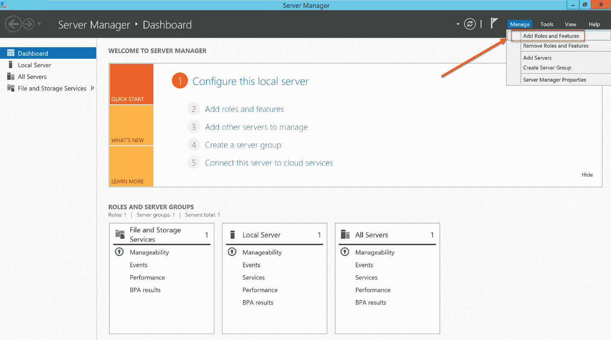

在 Windows Server 2012 上启用 RRAS

1.  在**添加角色和功能向导**的第一个屏幕上点击**下一步**。在下一个屏幕中，选择**基于角色或基于功能的安装**，然后点击**下一步**。选择服务器并点击**下一步**。在**服务器角色**屏幕上，选择**远程访问**并点击**下一步**：

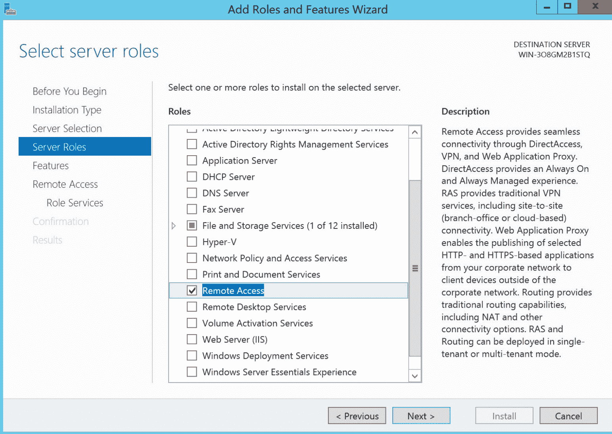

启用远程访问

1.  在**功能**屏幕上，我们可以直接点击**下一步**。在**远程访问**屏幕上，点击**下一步**：

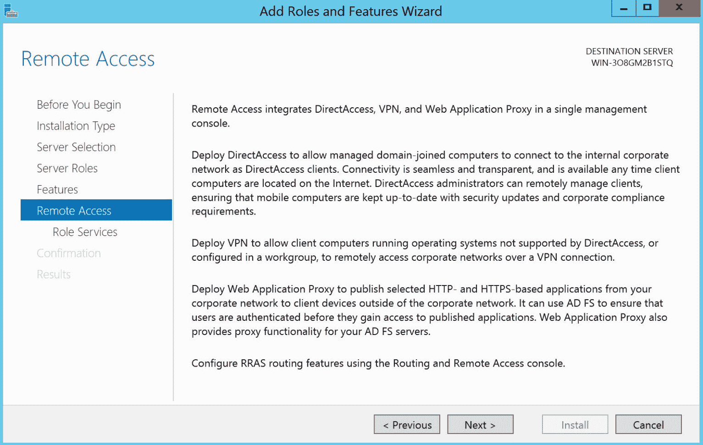

远程访问

1.  在**角色服务**界面，选择**DirectAccess 和 VPN (RAS)**。会弹出一个窗口，提示您添加所需的功能。点击**添加功能**，然后点击**下一步**：

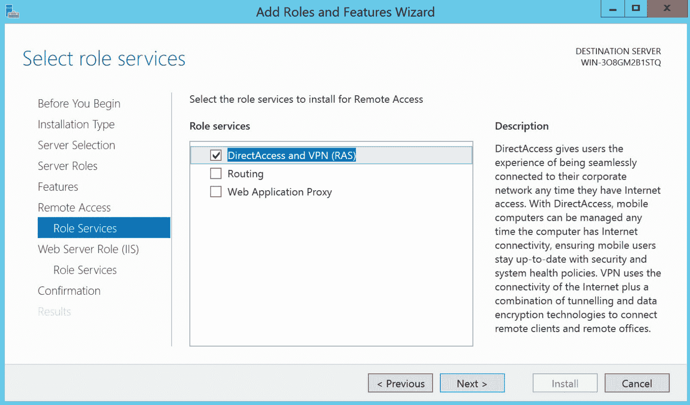

角色服务

1.  在**Web 服务器角色(IIS)**界面，点击下一步。在 IIS 角色服务界面，保持所有默认设置不变，然后再次点击**下一步**。在最后的界面，验证设置并点击**安装**按钮：

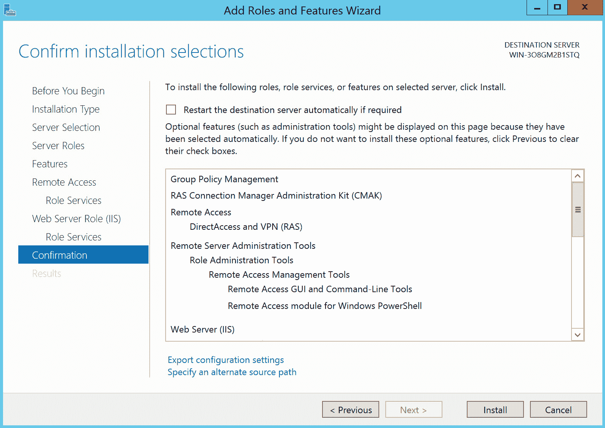

确认

下一步是配置 VNet。

# 创建虚拟网络

现在，我们已经完成了本地 VPN 设备的配置，接下来将创建一个 VNet。因此，执行以下步骤：

1.  通过打开[`portal.azure.com/`](https://portal.azure.com/)进入 Azure 门户。

1.  [选择**创建资源**，然后选择**网络**，接着选择**虚拟网络**。](https://portal.azure.com/)

1.  在**创建虚拟网络**界面，添加以下值：

    +   **名称**：`PacktVPNVNet`。

    +   **地址空间**：`172.17.0.0/16`。

    +   **资源组**：创建一个新的资源组，并将其命名为`PacktVPNResourceGroup`。

    +   **位置**：**东部美国**。

    +   **子网**：**前端**。

    +   **地址范围**：`172.17.0.0/24`：

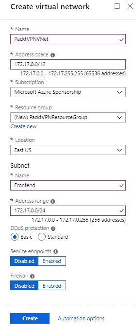

创建 VNet

1.  点击创建以创建 VNet。

1.  现在我们需要创建一个**网关子网**，该子网包含虚拟网络网关服务使用的保留 IP 地址。打开 VNet 资源，在**设置**下，点击子网，然后在顶部菜单中点击**+网关子网**：

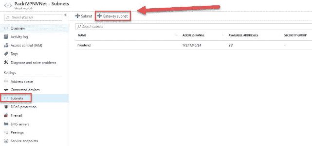

添加网关子网

1.  在“添加子网”界面，调整地址范围为`172.17.255.0/27`：

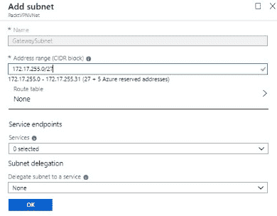

调整地址范围

1.  点击**确定**。

# 创建 Azure VPN 网关

接下来我们将配置 Azure VPN 网关。执行以下步骤：

1.  通过打开[`portal.azure.com/`](https://portal.azure.com/)进入 Azure 门户。

1.  在左侧菜单中，点击**创建资源**，并在搜索框中输入`虚拟网络网关`。

1.  在**创建虚拟网络网关**界面，添加以下值：

    +   **名称**：`PacktVnetGateway`。

    +   **网关类型**：VPN。

    +   **VPN 类型**：基于路由。

    +   **SKU**：`VpnGw1`。

    +   **位置**：东部美国。

    +   **虚拟网络**：点击**虚拟网络/选择一个虚拟**网络。选择`PacktVPNVNet`。

    +   **公共 IP 地址**：在这里，您设置与 VPN 网关关联的公共 IP 地址。Azure VPN 网关只支持动态分配的 IP 地址。

然而，一旦 IP 地址与 VPN 网关关联，它将不会改变。IP 地址只有在重新创建或删除 VPN 网关时才会更改。保持**创建新建**选中。将 IP 地址命名为`PacktVNetGWIP`：

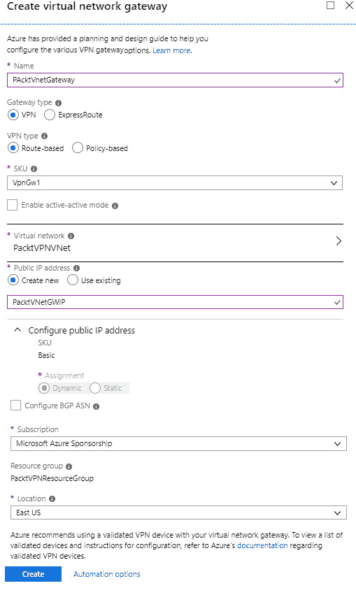

网关设置

1.  点击**创建**以创建 Azure VPN 网关。

1.  我们在此演示中稍后需要使用 VPN 网关的公共 IP 地址，因此在创建完 Azure VPN 网关后，进入其概览页面并将公共 IP 地址复制到记事本：

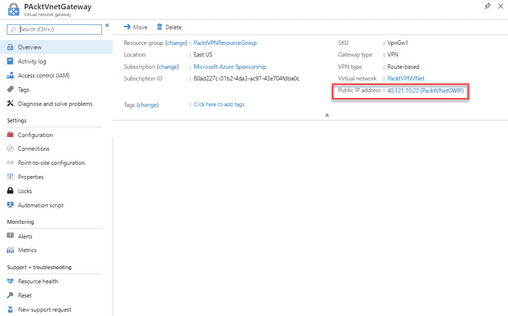

获取公共 IP 地址

1.  网关创建后，打开我们之前创建的 VNet 资源的**概览**页面。VPN 网关将显示在概览页面上：

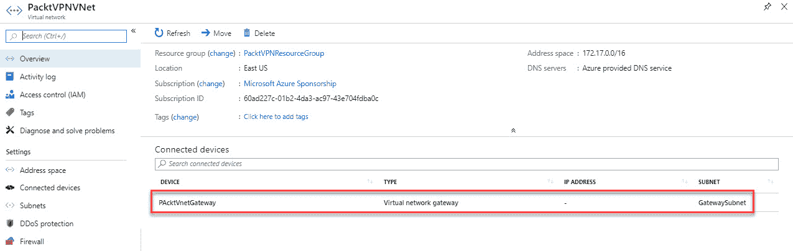

VNet 中的 VPN 网关

Azure VPN 网关已经创建完毕，因此我们现在可以设置与本地环境的 S2S VPN 连接。

# 创建和配置 S2S VPN

要创建 S2S VPN，我们将 VPN 网关与之前创建并启用了 RRAS 的本地环境连接起来。它将作为一个兼容的 VPN 设备。

为了完成这一步，我们需要本地环境的公共 IP 地址。在本次演示中，我使用了 VMware，并将其设置为桥接模式。这样，您的提供商的公共 IP 地址就会被使用。您可以使用多个工具查看公共 IP 地址，例如[`www.whatsmyip.org/`](https://www.whatsmyip.org/)。

# 创建本地网络网关

首先，我们需要创建本地网络网关。这是指我们安装了 Windows Server 2012 R2 并启用了 RRAS 的本地位置。

要创建本地网络网关，请执行以下步骤：

1.  通过打开[`portal.azure.com/`](https://portal.azure.com/)进入 Azure 门户。

1.  在左侧菜单中，点击**创建资源**并在搜索框中输入`Local network gateway`。从列表中选择**Local network gateway**并创建一个新的。

1.  在**创建本地网络网关**页面中，添加以下值：

    +   **名称**：`PacktOnPremisesGateway`。

    +   **IP 地址**：这里，您需要填写来自本地 VPN 设备的公共 IP 地址，Azure 需要连接到该设备。

    +   **地址空间**：`82.173.0.0/16`。这是本地网络的地址范围。你可以添加多个地址范围。

    +   **配置 BGP 设置**：不要选择此项。

    +   **订阅**：选择与之前示例中相同的订阅。

    +   **资源组**：选择我们已经创建的资源组，也就是`PacktVPNResourceGroup`。

    +   **位置**：选择与 VNet 所在位置相同的位置，也就是**东美国**：

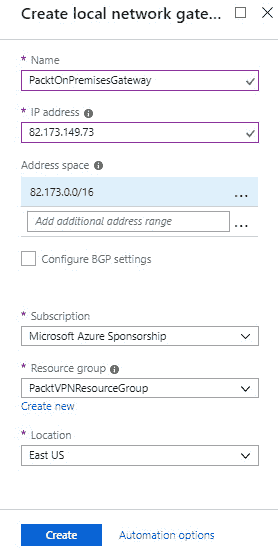

本地网络网关设置

1.  点击**创建**。

# 配置本地 VPN 设备

如前所述，S2S 连接需要一个兼容的 VPN 设备。我们已经在第一步中配置了这个。现在我们需要配置它，以便连接到 Azure VPN 网关。

要配置 RRAS 以便它们能够连接到 Azure，我们需要以下资源：

+   **共享密钥**：我们将创建一个共享密钥，用于连接到本地设备。

+   **Azure VPN 网关的公共 IP 地址**：这是我们在之前步骤中复制到记事本中的公共 IP 地址。

要创建新连接，请执行以下步骤：

1.  打开我们之前创建的本地网关，在“设置”下，选择“连接”。点击屏幕顶部的**添加**按钮：

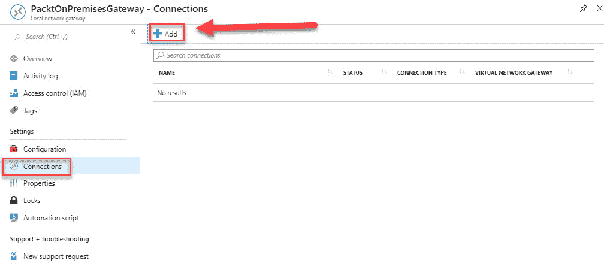

连接

1.  在**添加连接**面板中，添加以下值：

    +   **名称**：`PacktVNetToSite`。

    +   **连接类型**：站点到站点（IPSec）。

    +   **虚拟网络网关**：点击**选择本地网络网关**并选择`PacktVNetGateway`。

    +   **本地网络网关**：这是一个固定值。

    +   **共享密钥**：该值必须与本地设备上的共享密钥相同。请填写`Packt123`：

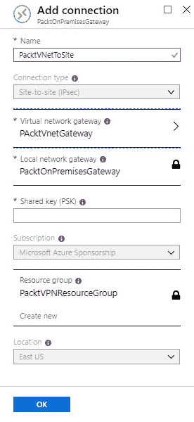

添加连接

1.  点击**确定**以创建连接。

1.  创建后，您可以从**连接**页面选择该连接。从那里，您可以下载配置包，用于配置本地 VPN 设备。点击顶部菜单中的**下载配置**：

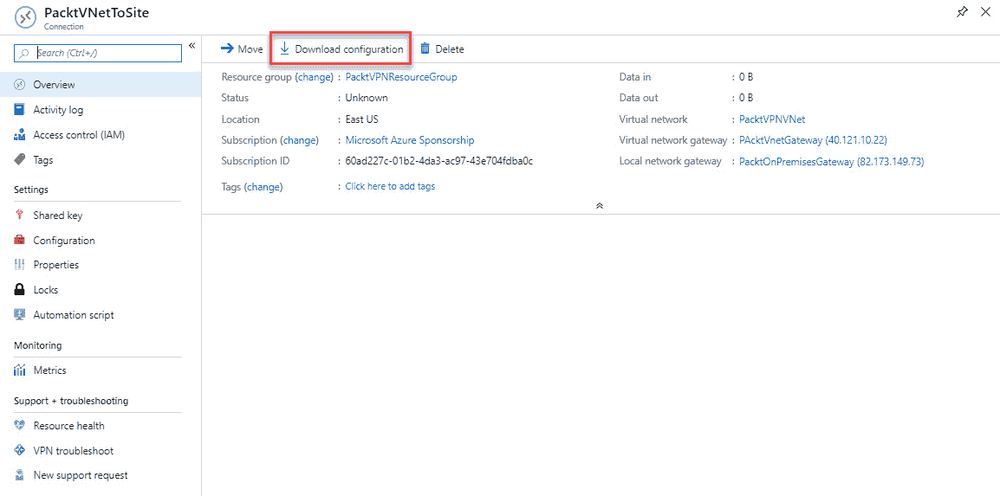

正在下载配置包

1.  由于我们使用的是 RRAS，它是 Windows Server 的一部分，因此我们需要选择以下值：

    +   **设备供应商**：通用样本。

    +   **设备类别**：设备参数。

    +   **固件版本**：1.0：

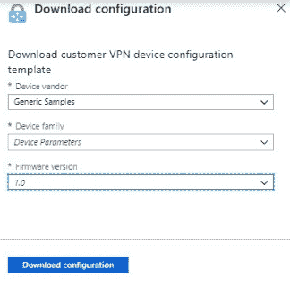

正在下载配置

1.  点击**下载配置**。

1.  配置包包含一个文本文件，文件中包含所有必要的配置值。

切换到启用了 RRAS 的 Windows Server 2012 R2 的本地 VM，并在 Azure VPN 网关的 VPN 设备上执行以下步骤：

1.  从 GitHub 下载脚本。该链接位于本章开头的*技术要求*部分。我们将使用此脚本来配置 RRAS。我们需要对脚本进行一些调整，以便添加 Azure VPN 网关和本地网络地址。您可以使用从下载的配置文件中获取的 IP 地址和子网地址作为输入。

1.  脚本的第一部分提供了一些关于脚本的附加信息，并创建了`Invoke-WindowsApi`函数：

```
# Windows Azure Virtual Network

# This configuration template applies to Microsoft RRAS running on Windows Server 2012 R2.
# It configures an IPSec VPN tunnel connecting your on-premise VPN device with the Azure gateway.

# !!! Please notice that we have the following restrictions in our support for RRAS:
# !!! 1\. Only IKEv2 is currently supported
# !!! 2\. Only route-based VPN configuration is supported.
# !!! 3\. Admin privileges are required in order to run this script

Function Invoke-WindowsApi( 
    [string] $dllName, 
    [Type] $returnType, 
    [string] $methodName, 
    [Type[]] $parameterTypes, 
    [Object[]] $parameters 
    )
```

1.  在下一部分中，我们将构建动态程序集并定义该方法：

```
{
  ## Begin to build the dynamic assembly 
  $domain = [AppDomain]::CurrentDomain 
  $name = New-Object Reflection.AssemblyName 'PInvokeAssembly' 
  $assembly = $domain.DefineDynamicAssembly($name, 'Run') 
  $module = $assembly.DefineDynamicModule('PInvokeModule') 
  $type = $module.DefineType('PInvokeType', "Public,BeforeFieldInit") 

  $inputParameters = @() 

  for($counter = 1; $counter -le $parameterTypes.Length; $counter++) 
  { 
     $inputParameters += $parameters[$counter - 1] 
  } 

  $method = $type.DefineMethod($methodName, 'Public,HideBySig,Static,PinvokeImpl',$returnType, $parameterTypes)
```

1.  接下来，我们需要应用`P/Invoke`构造函数，从而创建临时类型并调用方法：

```
 ## Apply the P/Invoke constructor 
  $ctor = [Runtime.InteropServices.DllImportAttribute].GetConstructor([string]) 
  $attr = New-Object Reflection.Emit.CustomAttributeBuilder $ctor, $dllName 
  $method.SetCustomAttribute($attr) 

  ## Create the temporary type, and invoke the method. 
  $realType = $type.CreateType() 

  $ret = $realType.InvokeMember($methodName, 'Public,Static,InvokeMethod', $null, $null, $inputParameters) 

  return $ret
}
```

1.  然后，我们将准备参数值并调用 API：

```
Function Set-PrivateProfileString( 
    $file, 
    $category, 
    $key, 
    $value) 
{
  ## Prepare the parameter types and parameter values for the Invoke-WindowsApi script 
  $parameterTypes = [string], [string], [string], [string] 
  $parameters = [string] $category, [string] $key, [string] $value, [string] $file 

  ## Invoke the API 
  [void] (Invoke-WindowsApi "kernel32.dll" ([UInt32]) "WritePrivateProfileString" $parameterTypes $parameters)
}
```

1.  现在我们将安装服务器上的 RRAS 角色：

```
# Install RRAS role
Import-Module ServerManager
Install-WindowsFeature RemoteAccess -IncludeManagementTools
Add-WindowsFeature -name Routing -IncludeManagementTools

# !!! NOTE: A reboot of the machine might be required here after which the script can be executed again.
```

1.  如我们所见，S2S VPN 从这里安装：

```
# Install S2S VPN
Import-Module RemoteAccess
if ((Get-RemoteAccess).VpnS2SStatus -ne "Installed")
{
  Install-RemoteAccess -VpnType VpnS2S
}
```

1.  接下来，我们需要添加并配置它：

```
# Add and configure S2S VPN interface

Add-VpnS2SInterface `
 -Protocol IKEv2 `
 -AuthenticationMethod PSKOnly `
 -NumberOfTries 3 `
 -ResponderAuthenticationMethod PSKOnly `
 -Name <IP address of your Azure gateway> `
 -Destination <IP address of your Azure gateway> `
 -IPv4Subnet @("<IP range of your subnet in Azure>:100") `
 -SharedSecret <shared key>

Set-VpnServerIPsecConfiguration `
 -EncryptionType MaximumEncryption

Set-VpnS2Sinterface `
 -Name <IP address of your Azure gateway> ` 
 -InitiateConfigPayload $false ` 
 -Force
```

1.  在脚本的最后部分，我们将设置连接为持久连接，重新启动 RRAS 服务器，并拨号连接到 Azure 网关：

```
# Set S2S VPN connection to be persistent by editing the router.pbk file (required admin privileges)
Set-PrivateProfileString $env:windir\System32\RRAS\router.pbk "<IP address of your Azure gateway>" "IdleDisconnectSeconds" "0"
Set-PrivateProfileString $env:windir\System32\RRAS\router.pbk "<IP address of your Azure gateway>" "RedialOnLinkFailure" "1"

# Restart the RRAS service
Restart-Service RemoteAccess

# Dial-in to Azure gateway
Connect-VpnS2SInterface ` 
 -Name <IP address of your Azure gateway>
```

本脚本还将启用服务器上的 RRAS。我们在前面的一节中手动进行了此操作，因此跳过了这部分。

我们已完成本地 VPN 设备的配置。在下一节中，我们将验证本地连接。

# 验证本地连接

有两种不同的方法可以验证本地连接。你可以使用本地的 RRAS 控制台，或者在 Azure 门户中执行此操作。

要使用 RRAS 控制台验证连接，打开 Windows 搜索并输入`远程访问管理`。然后，打开以下截图中显示的节点。如你所见，RRAS 已与 Azure VPN 网关连接：

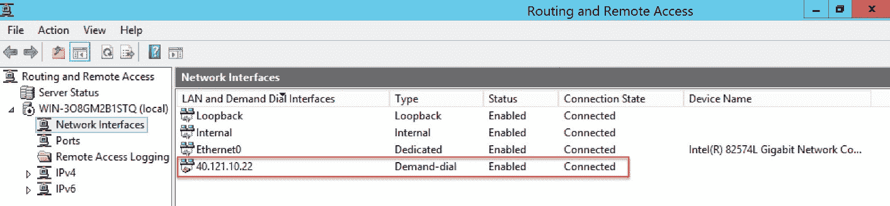

在 RRAS 控制台中验证连接

要通过 Azure 门户验证连接，请执行以下步骤：

1.  打开[`portal.azure.com/`](https://portal.azure.com/)并进入 Azure 门户。

1.  打开`PAcktVnetGateway`资源，在**设置**下选择连接：

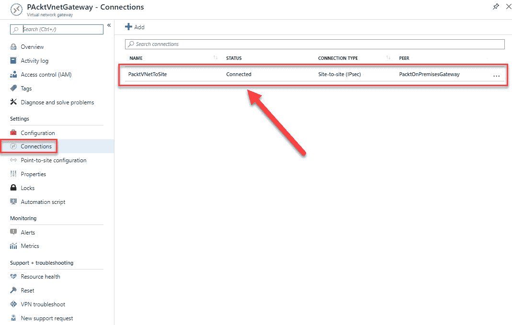

在 Azure 门户中验证连接

当你选择**连接**时，你将能够看到`PacktVNetToSite`连接已经连接，如上图所示。

# VNet 到 VNet

配置 VNet 到 VNet 的连接是连接 VNets 的简单方法。将虚拟网络连接到另一个虚拟网络类似于创建 S2S IPSec 连接到本地环境。两种连接类型都使用 Azure VPN 网关。VPN 网关提供了一个安全的隧道 IPsec/IKE，它们以相同的方式进行通信。区别在于本地网络网关的配置方式。

当你创建 VNet 到 VNet 的连接时，本地网络网关地址空间会自动创建并填充。如果你更新其中一个 VNet 的地址空间，另一个 VNet 会自动路由到更新后的地址空间。这使得创建 VNet 到 VNet 的连接比 S2S 连接更快、更简便。

若要从 Azure 门户创建 VNet 到 VNet 的连接，请参考以下教程：[`docs.microsoft.com/en-us/azure/vpn-gateway/vpn-gateway-howto-vnet-vnet-resource-manager-portal`](https://docs.microsoft.com/en-us/azure/vpn-gateway/vpn-gateway-howto-vnet-vnet-resource-manager-portal)。

# 摘要

在本章中，我们介绍了*部署和管理虚拟网络*目标的第二部分，涉及如何创建和配置 Azure VPN 网关，如何创建和配置 S2S VPN，以及如何验证本地与 Azure 的连接。

在下一章中，我们将继续*部署和管理虚拟网络*目标的第三部分，介绍如何监控和管理网络。

# 问题

回答以下问题，以测试你对本章内容的理解。你可以在本书末尾的*评估*部分找到答案：

1.  ExpressRoute 流量默认是加密的：

    +   是

    +   否

1.  你的组织要求员工从办公室以外的地点连接。你需要为此设置一个 P2S VPN 连接吗？

    +   是

    +   否

1.  当你为站点对站点（S2S）连接设置本地 VPN 设备时，服务器不能位于 NAT 后面：

    +   是

    +   否

# 深入阅读

你可以查看以下链接，了解本章涉及的主题的更多信息：

+   *Azure VPN 网关文档*：[`docs.microsoft.com/en-us/azure/vpn-gateway/`](https://docs.microsoft.com/en-us/azure/vpn-gateway/)

+   *关于点对站点 VPN*：[`docs.microsoft.com/en-us/azure/vpn-gateway/P2S-about`](https://docs.microsoft.com/en-us/azure/vpn-gateway/point-to-site-about)

+   *在 Azure 门户中创建站点对站点连接*：[`docs.microsoft.com/en-us/azure/vpn-gateway/vpn-gateway-howto-S2S-resource-manager-portal`](https://docs.microsoft.com/en-us/azure/vpn-gateway/vpn-gateway-howto-site-to-site-resource-manager-portal)

+   *使用 PowerShell 创建带有站点对站点 VPN 连接的虚拟网络*：[`docs.microsoft.com/en-us/azure/vpn-gateway/vpn-gateway-create-S2S-rm-powershell`](https://docs.microsoft.com/en-us/azure/vpn-gateway/vpn-gateway-create-site-to-site-rm-powershell)

+   *使用 CLI 创建带有站点对站点 VPN 连接的虚拟网络*：[`docs.microsoft.com/en-us/azure/vpn-gateway/vpn-gateway-howto-S2S-resource-manager-cli`](https://docs.microsoft.com/en-us/azure/vpn-gateway/vpn-gateway-howto-site-to-site-resource-manager-cli)

+   *ExpressRoute 概述*：[`docs.microsoft.com/en-us/azure/expressroute/expressroute-introduction`](https://docs.microsoft.com/en-us/azure/expressroute/expressroute-introduction)

+   *创建和修改 ExpressRoute 电路*：[`docs.microsoft.com/en-us/azure/expressroute/expressroute-howto-circuit-portal-resource-manager`](https://docs.microsoft.com/en-us/azure/expressroute/expressroute-howto-circuit-portal-resource-manager)

+   *通过 Azure 门户配置虚拟网络到虚拟网络的 VPN 网关连接*：[`docs.microsoft.com/en-us/azure/vpn-gateway/vpn-gateway-howto-vnet-vnet-resource-manager-portal`](https://docs.microsoft.com/en-us/azure/vpn-gateway/vpn-gateway-howto-vnet-vnet-resource-manager-portal)
