# 第十一章：监控和排除虚拟网络问题

在上一章中，我们讨论了*部署和管理虚拟网络*目标的第二部分。我们讨论了如何将本地网络与 Azure 虚拟网络集成。

本章覆盖了*部署和管理虚拟网络*目标的第三部分，涵盖了如何监视和排除虚拟网络的内容。在本章中，我们将重点介绍如何使用**Network Watcher**监视您的虚拟网络。您将学习如何管理虚拟网络连接以及如何监视和排除本地连接，以及如何使用 Network Watcher。我们将在本章结束时介绍如何管理外部网络。

本章将讨论以下主题：

+   Network Watcher

+   网络资源监控

+   管理虚拟网络连接

+   监控和故障排除本地连接

+   管理外部网络

# Network Watcher

Azure Network Watcher 是一个网络监控解决方案，提供诊断、监视和查看 Azure 虚拟网络中资源的指标和日志，包括应用程序网关流量、负载均衡器、ExpressRoute 回路等。

Azure Network Watcher 提供以下功能：

+   **监控**：连接监视器是一种云基础的混合网络监视解决方案，可以监视虚拟机和终端点之间的通信。终端点可以是另一个**虚拟机**（**VM**）、一个 URL、一个 IPv4 地址或者一个**完全限定域名**（**FQDN**）。网络通信会定期监控，收集虚拟机与终端点之间的延迟、网络拓扑变化以及可达性的信息。如果一个终端点变得不可访问，Network Watcher 将会通知用户出现错误。导致此问题的原因可能是虚拟机的内存或 CPU 问题、虚拟机的安全规则或自定义路由的跳数类型。还会监控延迟问题。连接监视器将提供随时间观察到的平均、最小和最大延迟。该监视解决方案能够监视网络基础设施中各个点之间的网络性能，并能生成警报和通知。

+   **诊断**：您可以诊断虚拟机的网络流量过滤。例如，由于安全规则，虚拟机可能无法与其他资源通信。

IP 流可以验证和测试通信，并告知您连接是成功还是失败。IP 流可以告诉您哪个安全规则允许或拒绝了连接和通信。Network Watcher 还可以诊断从虚拟机出现的网络路由问题。创建虚拟网络时，会为该虚拟网络创建几个默认的出站路由。所有部署在虚拟网络中的资源的出站流量都基于 Azure 的默认路由进行路由。

在需要覆盖默认路由规则或创建额外规则的情况下，**next hop**可以用于测试不同路由之间的通信。当通信失败时，你可以更改、添加或删除路由来解决问题。

使用 Azure Network Watcher，你可以诊断虚拟机的出站连接。你还可以诊断 Azure 虚拟网络网关和连接的问题，捕获虚拟机的进出数据包，查看网络接口的安全规则，并确定 Azure 区域和互联网服务提供商之间的相对延迟：

+   **指标**：网络订阅限制功能可以提供已在订阅或区域中部署的网络资源的摘要。如果达到了最大网络资源数量的限制，将提供一个摘要。

+   **日志**：**网络安全组**（**NSGs**）负责允许或拒绝虚拟机网络接口的入站和出站流量。NSG 流量日志功能可以记录端口、协议、流量是否被允许或拒绝，并记录源和 IP 地址。这些日志可以使用多种工具进行分析，例如流量分析功能和 Power BI。流量分析可以提供对写入 NSG 流量日志的数据的丰富可视化。

+   **自动启用**：当创建或更新新的虚拟网络时，Network Watcher 会自动启用。在订阅中启用 Network Watcher 没有额外费用。

在接下来的部分中，我们将看到 Network Watcher 的实际应用。

# 网络资源监控

在本演示中，我们将监控虚拟机上的网络。为了演示，我们将在同一虚拟网络内创建三个 Windows Server 2016 数据中心虚拟机。我们可以使用这些虚拟机进行监控。

在我们能够通过网络资源监控来监控网络之前，我们需要在三个虚拟机上安装 Network Watcher 代理。安装后，我们将检查网络流量。

# 安装 Network Watcher 代理

要在 Azure 中的虚拟机上安装 Network Watcher 代理，按照以下步骤操作：

1.  通过打开[`portal.azure.com/`](https://portal.azure.com/)访问 Azure 门户。

1.  打开虚拟机设置，在**设置**下选择**扩展**，然后点击**添加**按钮：

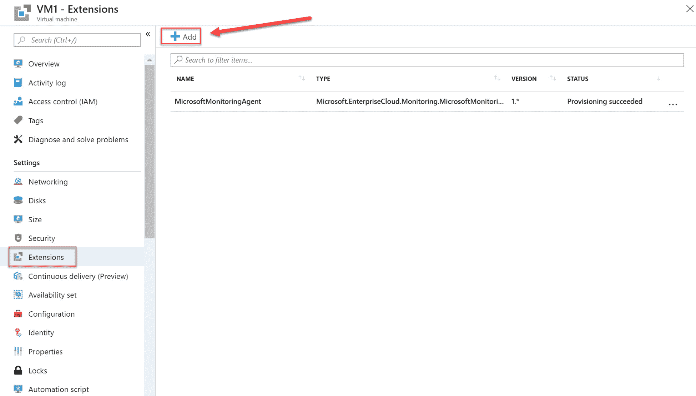

添加虚拟机扩展

1.  将**Network Watcher Agent for Windows**扩展添加到虚拟机（扩展也可以在创建虚拟机时安装），然后点击**创建**：

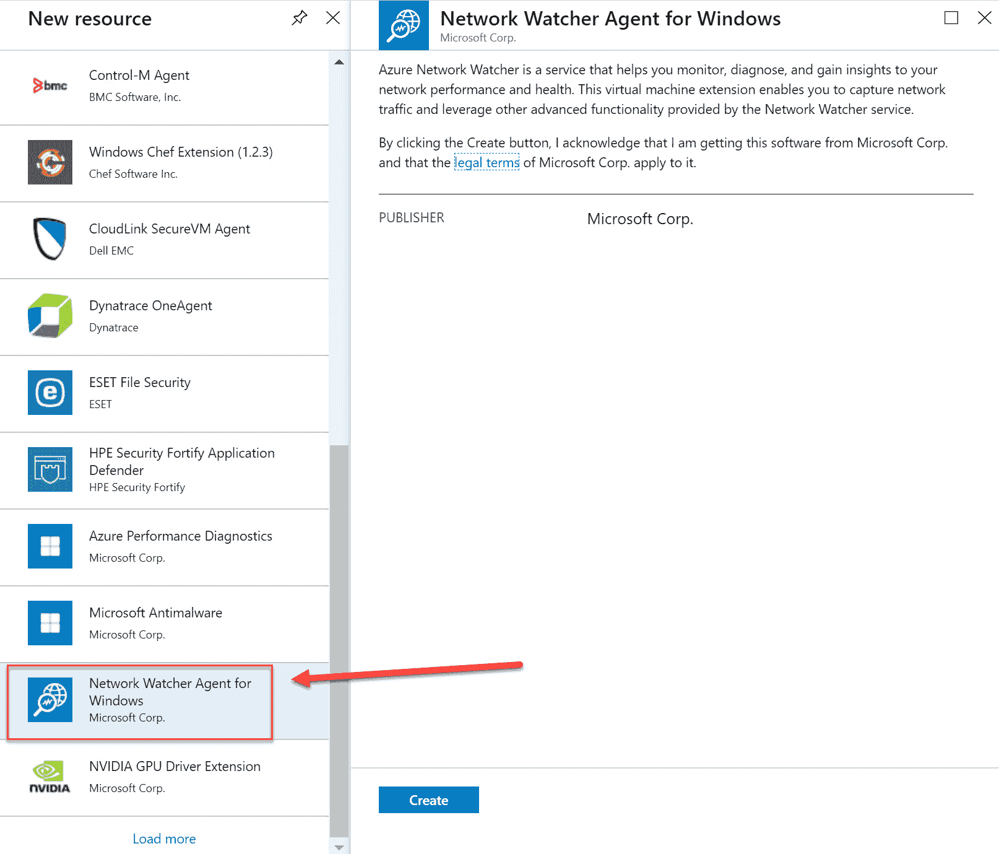

添加 Network Watcher Agent for Windows 扩展

1.  对其他两个虚拟机重复这些步骤，并在其上安装代理。

现在，**Network Watcher Agent for Windows**已安装在所有虚拟机上，我们可以在特定区域启用它。

# 启用 Network Watcher

要在特定区域启用 Network Watcher，按照以下步骤操作：

1.  通过打开[`portal.azure.com/`](https://portal.azure.com/)来导航到 Azure 门户。

1.  选择**所有服务**，然后在顶部菜单中输入`network watcher`：

打开 Network Watcher

1.  在**Network Watcher**概览页面中，选择虚拟机创建所在的订阅和区域。在我的例子中，这个区域是**美国东部**。然后点击三个点并为该区域启用 Network Watcher，如下所示：

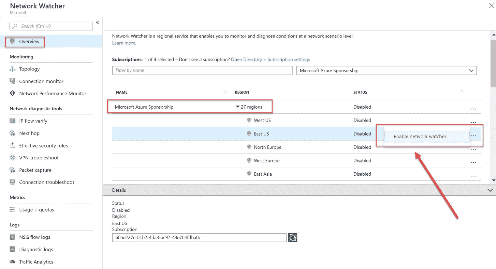

启用 Network Watcher

现在，Network Watcher 已启用，我们可以实际开始监控网络资源。

# 监视网络连接性

网络监视可以用来监控连接可达性、延迟以及网络拓扑变化。为此，您需要设置一个连接监视器实例。请按照以下步骤进行设置：

1.  在 Network Watcher 资源仍然打开的情况下，在**监视**下，选择**连接监视器**：

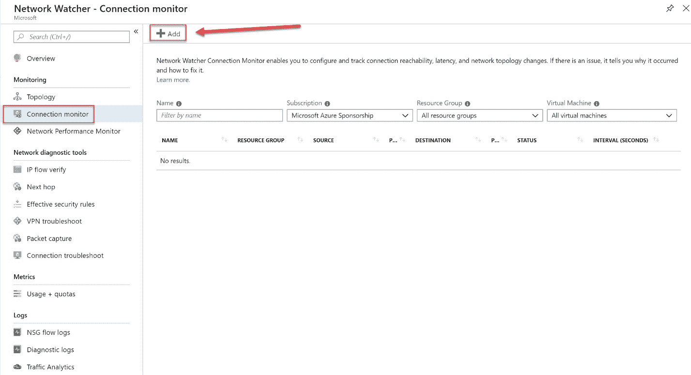

连接监视器

1.  我们将使用监视器资源来测试`VM1`和`VM2`之间的连接性。因此，添加以下值：

    +   **名称**：`VM1-VM2-Test`。

    +   **订阅**：选择虚拟机部署所在的订阅。

    +   **源虚拟机**：`VM1`。

    +   **目标虚拟机**：`VM2`。

    +   **端口**：`22`：

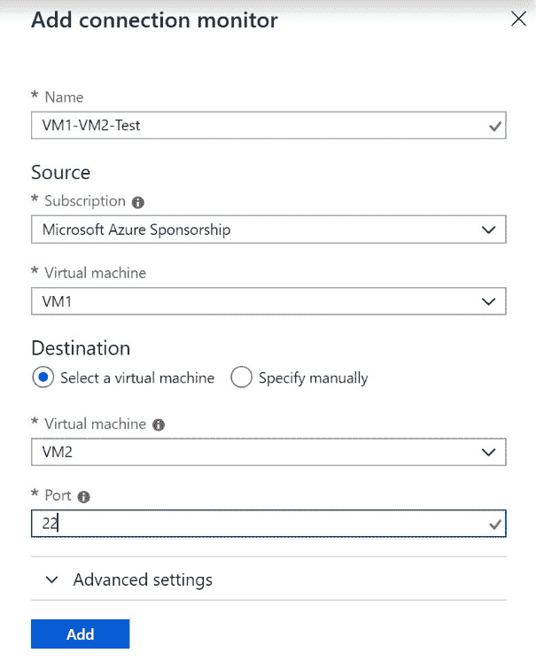

连接监视器设置

1.  点击**添加**。

现在我们可以监视网络连接性了。在接下来的部分中，我们将了解如何管理连接性。

# 管理虚拟网络连接性

您可以通过 Azure 门户管理虚拟网络连接性。在接下来的部分中，我们将了解 Azure 门户提供的管理虚拟网络连接性的各种功能。

# 网络拓扑

Azure 门户中的网络拓扑部分显示了 Azure 订阅和资源组内虚拟网络的概览。要进入网络拓扑部分，您需要执行以下步骤：

1.  通过打开[`portal.azure.com/`](https://portal.azure.com/)来导航到 Azure 门户。

1.  选择**所有**服务，然后在顶部菜单中再次输入`network watcher`。

1.  在**监视**下，选择**拓扑**。在此，您需要选择订阅、资源组，并在相关时选择虚拟网络，如下图所示：

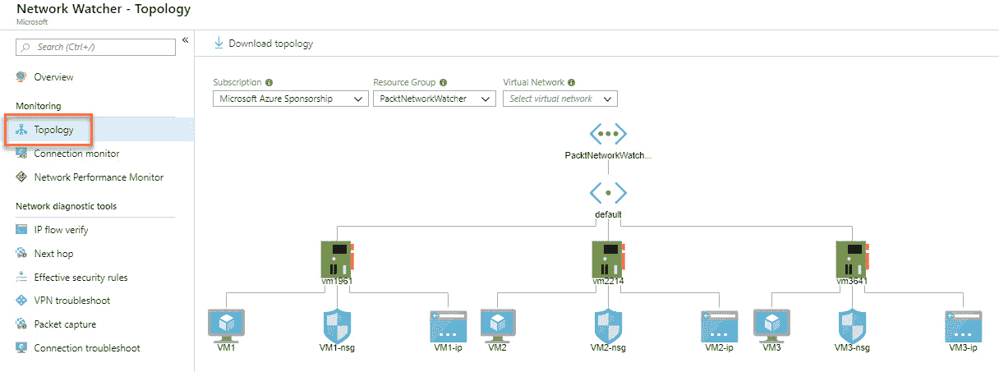

网络拓扑

1.  现在，您可以通过点击拓扑中的各个项目，深入查看网络的所有组件，如虚拟网络（VNet）、网络接口卡（NIC）、虚拟机（VM）、IP 地址等。这将带您进入不同资源的设置页面。

1.  您还可以通过点击顶部菜单中的**下载拓扑**按钮来下载拓扑，如下所示：

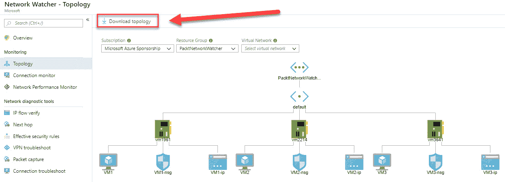

下载网络拓扑

除了监控 Azure 中的网络外，您还可以监控本地网络连接。我们将在下一部分中查看这一点。

# 监控和故障排除本地连接性

您也可以使用网络观察器监控本地连接性。它提供了两种不同的功能，**网络性能监控器**和**VPN 故障排除**，这些功能与其他功能一样，都可以从 Azure 门户访问。

# 网络性能监控器

**网络性能监控器**是一个混合网络监控解决方案。它可以监控本地和云网络的连接性，以及网络基础设施中各个点之间的连接。它能够检测路由错误和**黑洞**等问题。监控解决方案存储在 Azure 日志分析中。

网络性能监控器可以在出现网络性能错误时创建警报和通知，并能够将问题的源定位到特定的网络设备或段。

它提供以下功能：

+   **性能监控器**：性能监控器可以监控跨云部署和本地位置的网络连接。它还可以监控多个数据中心、分支办公室、多层应用程序和微服务之间的连接。

+   **服务连接监控器**：您可以识别网络基础设施中的网络瓶颈，并检测网络中问题的确切位置。您还可以监控用户与服务之间的连接。

+   **ExpressRoute 监控**：您可以监控本地位置与 Azure 之间的 ExpressRoute 连接。

# 下一跳

您可以使用**下一跳**功能来指定源和目标 IPv4 地址。然后测试这些地址之间的通信，并告知您使用了哪种下一跳来路由流量。当遇到路由错误或问题时，您可以添加、修改或删除路由来解决问题。

要查看此功能，请执行以下步骤：

1.  通过打开[`portal.azure.com/`](https://portal.azure.com/)导航到 Azure 门户。

1.  选择**所有**服务，在顶部菜单中输入`network watcher`。

1.  在**网络诊断工具**下，选择**下一跳**。

1.  在**设置**窗格中，添加以下值：

    +   **资源组**：`PacktNetworkWatcher`。

    +   **虚拟机**：`VM2`。

    +   **网络接口**：这会自动选择。

    +   **源 IP 地址**：这也会自动选择。

    +   **目标 IP 地址**：`13.107.21.200`（再次是 Bing 服务器）。

1.  选择**下一跳**。

1.  您将看到以下结果。在这种情况下，没有下一跳，因为连接直接访问互联网：

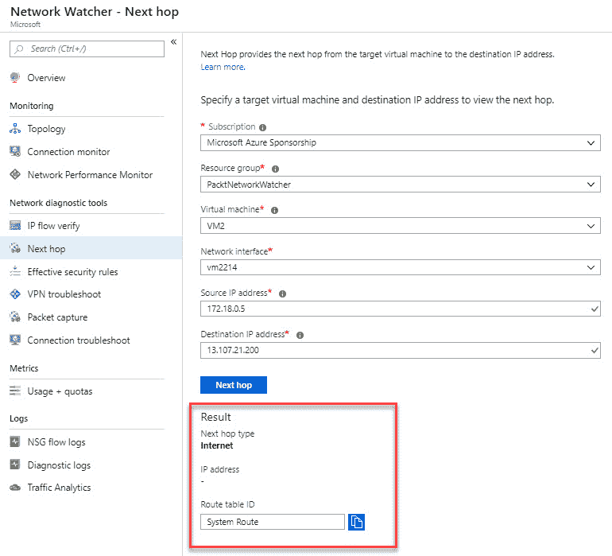

下一跳到互联网

1.  如果您将**目标 IP 地址**更改为其他虚拟机的 IP 地址，比如`172.18.0.6`，您将看到以下结果：

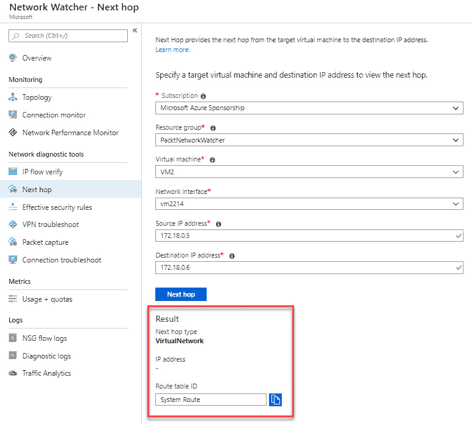

下一跳到另一台虚拟机

在下一部分，我们将介绍如何排查 VPN 连接问题。

# VPN 故障排除

在 VPN 故障排除演示中，我们将使用前一章节中创建的 VPN 连接。

您可以通过以下步骤诊断 VPN 连接：

1.  从**Network Watcher**面板中，选择**VPN 故障排除**。

1.  在**Network Watcher -** **VPN 故障排除**面板中，您可以通过选择订阅、资源组、位置以及以下复选框来诊断网关。您还需要选择或创建一个存储帐户来存储诊断信息。选择复选框后，您可以通过点击顶部菜单中的**开始故障排除**来启动故障排除过程，如下图所示：

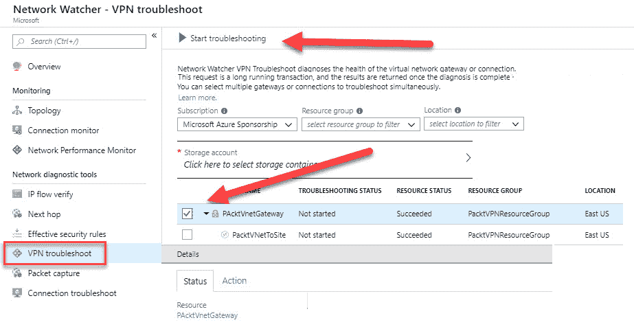

VPN 故障排除

1.  这将启动故障排除过程，在我的情况下，VPN 连接似乎不健康。您可以点击**操作**标签查看建议：

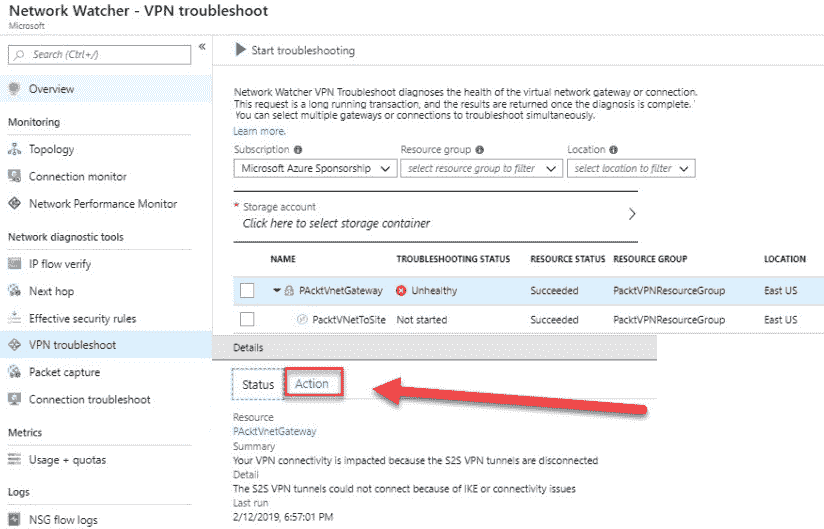

不健康的 VPN 连接

您还可以使用 Azure Network Watcher 管理外部网络。我们将在接下来的部分中介绍这一点。

# 管理外部网络

Azure Network Watcher 提供三种功能来监控和故障排除外部网络。它们的功能包括**IP 流验证**、**有效安全规则**和**连接故障排除**，这些将在接下来的章节中介绍。

# IP 流验证

使用**IP 流验证**，您可以检测是否允许或拒绝来自虚拟机网络接口的包。信息中包括协议、本地和远程 IP 地址、方向以及本地和远程端口。当一个包被拒绝时，返回拒绝包的路由规则名称。您可以利用这一点诊断从本地环境或外部网络到互联网的连接问题。您基本可以选择任何源或 IP 地址来验证连接。

要运行 IP 流验证，您需要在计划运行该工具的区域启用一个 Network Watcher 实例。这类似于本章前面**启用 Network Watcher**部分中的演示，我们在特定区域启用了 Network Watcher。

# 使用 IP 流验证

在本演示中，我们将使用 IP 流验证来测试在第一次演示中创建的两台虚拟机之间的连接。要使用 IP 流验证，请按照以下步骤操作：

1.  在 Network Watcher 资源面板内，选择**网络诊断工具**下的**IP 流验证**。

1.  在设置页面中，添加以下设置：

    +   **资源组**：`PacktNetworkWatcher`。

    +   **虚拟机**：`VM1`。

    +   **网络接口**：选择虚拟机后将自动填写。

    +   **协议**：TCP。

    +   **方向**：出站。

    +   **本地 IP 地址**：此项也会自动填写。

    +   **本地端口**：`60000`。

    +   **远程 IP 地址**：`13.107.21.200`（必应的地址）。

    +   **远程端口**：`80`。

1.  点击 **检查** 按钮：

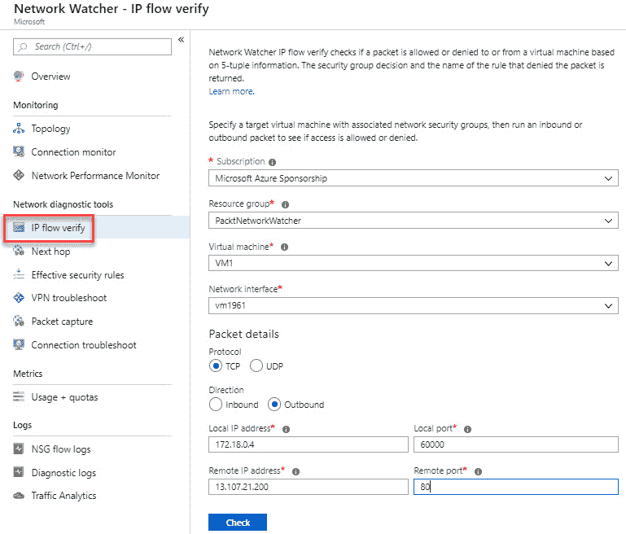

IP 流量验证

1.  请求执行后，它返回的结果将是允许访问，因为 `AllowInternetOutBound` 安全规则，如下图所示：

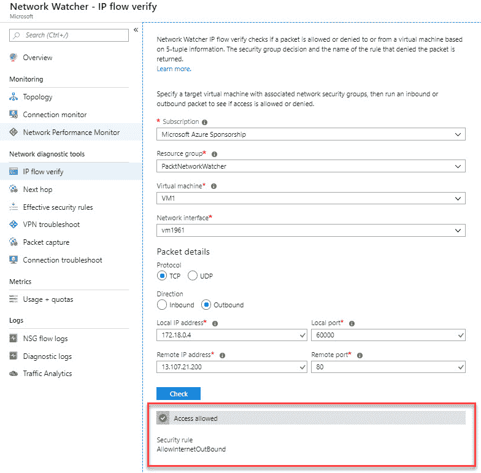

IP 流量验证访问允许

1.  重复前面的步骤，但将 **远程 IP 地址** 改为 `172.31.0.100`。这将导致访问被拒绝，因为 `DefaultOutboundDenyAll` 安全规则：

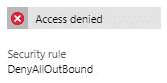

IP 流量验证访问被拒绝

1.  最后，再次重复该步骤，这次做出以下更改：

    +   **方向**：入站

    +   **本地端口**：`80`

    +   **远程端口**：`60000`

1.  这将导致以下结果：

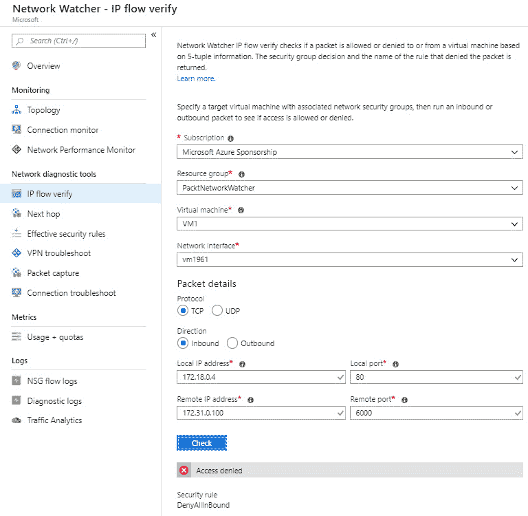

访问被拒绝

我们已经查看了如何使用 IP 流量验证来测试两个虚拟机之间的连接。在接下来的部分，我们将讨论有效的安全规则。

# 有效的安全规则

**有效的安全规则** 功能显示所有应用于网络接口及其所在子网的安全规则，并将两者合并。这样，你就能全面了解应用于网络接口的所有规则，并且可以修改、添加或删除规则。

你需要选择正确的订阅、资源组和虚拟机，以便查看应用的安全规则，具体请参考下图：

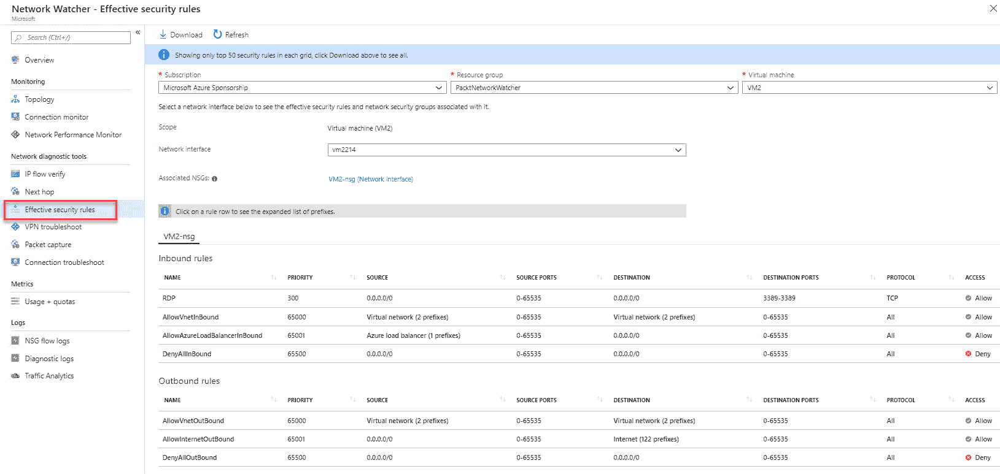

有效的安全规则

我们现在已经看到应用于网络接口的安全规则概览。在下一部分，我们将讨论连接故障排除。

# 连接故障排除

Azure 网络观察器连接故障排除使你能够排查 Azure 中的网络性能和连接问题。它提供从源到目标的逐跳路径的可视化，帮助识别可能影响网络性能和连接性的潜在问题。

Azure 网络观察器连接故障排除提供了以下功能和洞察：

+   从源到目标的图形化拓扑视图。

+   它检查源（虚拟机）和目标（虚拟机、URI、FQDN、IP）地址之间的连接性。

+   它提供逐跳延迟。

+   它能够识别影响可达性的配置问题。

+   它提供从源到目标的所有可能逐跳路径。

+   它检查源和目标之间的延迟，例如最小、最大和平均延迟。

+   在连接故障排除检查期间丢弃的包的数量。

连接故障排除要求源虚拟机安装**AzureNetworkWatcherExtension**虚拟机扩展。对于 Windows 虚拟机的扩展安装，你可以参考[`docs.microsoft.com/en-us/azure/virtual-machines/extensions/network-watcher-windows?toc=%2Fazure%2Fnetwork-watcher%2Ftoc.json`](https://docs.microsoft.com/en-us/azure/virtual-machines/extensions/network-watcher-windows?toc=%2Fazure%2Fnetwork-watcher%2Ftoc.json)，对于 Linux 虚拟机，你可以参考[`docs.microsoft.com/en-us/azure/virtual-machines/extensions/network-watcher-linux?toc=%2Fazure%2Fnetwork-watcher%2Ftoc.json`](https://docs.microsoft.com/en-us/azure/virtual-machines/extensions/network-watcher-linux?toc=%2Fazure%2Fnetwork-watcher%2Ftoc.json)。

要使用**连接故障排除**检查网络连接，你需要采取以下步骤：

1.  在 Azure 门户中的网络观察器概览页面，选择网络诊断工具下的**连接故障排除**。

1.  选择一个虚拟机并提供一个出站连接，如下所示：

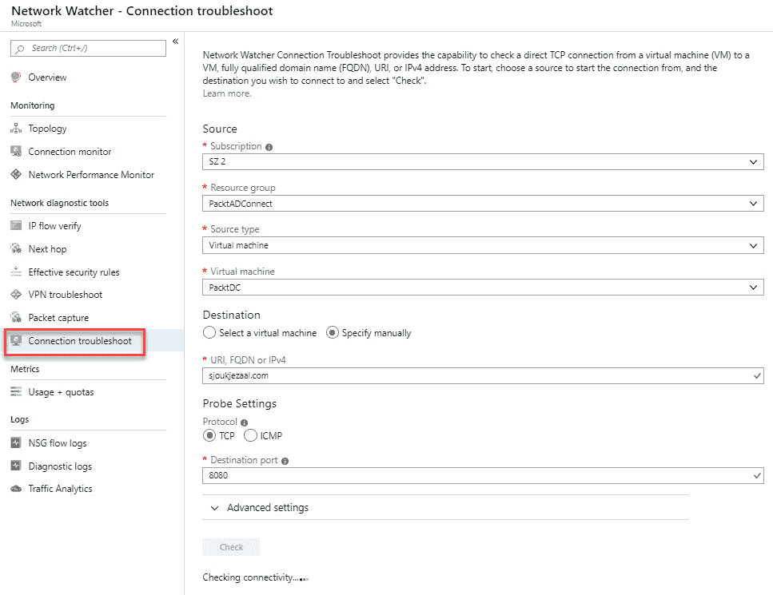

选择源和目标

1.  点击**检查**。

1.  当你点击检查按钮时，代理将自动安装到源机器上。

1.  检查后，结果将显示：

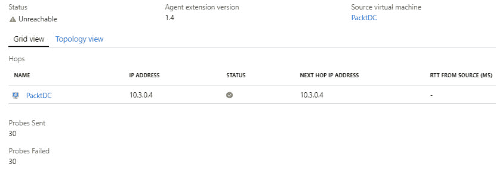

无法访问的端点

我们现在已经使用**连接故障排除**检查了一个虚拟机的出站连接。

# 总结

本章中，我们覆盖了*部署和管理虚拟网络*目标的第三部分，介绍了如何在 Azure 网络观察器中监控和故障排除网络流量。我们还涵盖了如何使用网络观察器监控和故障排除本地和外部网络连接。

在下一章中，我们将继续目标的第四部分，涵盖如何创建和配置 Azure 安全组和 Azure DNS。

# 问题

请回答以下问题，测试你对本章内容的理解。你可以在本书最后的*评估*部分找到答案：

1.  Azure 网络观察器仅用于监控和诊断 Azure 中的网络连接：

    +   正确

    +   错误

1.  你能使用 IP 流量验证来验证 Azure 中 VNet 的出站连接吗？

    +   是的

    +   否

1.  你能使用 IP 流量验证来验证 VNet 内两个不同虚拟机之间的连接吗？

    +   是的

    +   否

# 进一步阅读

你可以查看以下链接，获取更多关于本章内容的信息：

+   *什么是 Azure 网络观察器？*：[`docs.microsoft.com/en-us/azure/network-watcher/network-watcher-monitoring-overview`](https://docs.microsoft.com/en-us/azure/network-watcher/network-watcher-monitoring-overview)

+   *快速入门：使用 Azure 门户诊断虚拟机网络流量过滤问题*: [`docs.microsoft.com/en-us/azure/network-watcher/diagnose-vm-network-traffic-filtering-problem`](https://docs.microsoft.com/en-us/azure/network-watcher/diagnose-vm-network-traffic-filtering-problem)

+   *Azure 网络性能监视器解决方案*: [`docs.microsoft.com/en-us/azure/azure-monitor/insights/network-performance-monitor?toc=%2Fazure%2Fnetwork-watcher%2Ftoc.json`](https://docs.microsoft.com/en-us/azure/azure-monitor/insights/network-performance-monitor?toc=%2Fazure%2Fnetwork-watcher%2Ftoc.json)

+   *Azure 网络观察器中的 IP 流验证简介*: [`docs.microsoft.com/en-us/azure/network-watcher/network-watcher-ip-flow-verify-overview`](https://docs.microsoft.com/en-us/azure/network-watcher/network-watcher-ip-flow-verify-overview)

+   *教程：使用 Azure 门户诊断网络之间的通信问题*: [`docs.microsoft.com/en-us/azure/network-watcher/diagnose-communication-problem-between-networks`](https://docs.microsoft.com/en-us/azure/network-watcher/diagnose-communication-problem-between-networks)
