# 第十二章：Azure 安全组和 Azure DNS

在上一章中，我们介绍了*部署和管理虚拟网络*目标的第三部分，涵盖了如何在 Azure 网络监视器中监控和排除网络流量故障。我们已经介绍了如何使用 Azure 网络监视器来监控 Azure 内部的网络流量，以及如何监控本地和外部网络的流量。

在本章中，我们将首先聚焦于 Azure 中的**网络安全组**（**NSG**）。我们将介绍 NSG 的基础知识，如何使用它们来过滤网络流量，并且你将学习如何创建和配置它们。我们还将把 NSG 与子网或**网络接口**（**NIC**）关联，并创建和评估 NSG 的安全规则。在本章的第二部分，我们将介绍 Azure DNS。你将学习如何设置 Azure DNS，以及如何添加 DNS 区域和 DNS 记录。

本章将涵盖以下主题：

+   NSG

+   创建和配置 NSG

+   将 NSG 与子网或 NIC 关联

+   创建和评估安全规则

+   Azure DNS

+   配置私有和公共 DNS 区域

# 技术要求

我们示例应用程序的源代码可以从以下链接下载：[`github.com/PacktPublishing/Microsoft-Azure-Administrator-Exam-Guide-AZ-103/tree/master/Chapter12`](https://github.com/PacktPublishing/Microsoft-Azure-Administrator-Exam-Guide-AZ-103/tree/master/Chapter12)[.] (https://github.com/PacktPublishing/Microsoft-Azure-Administrator-Exam-Guide-AZ-103/tree/master/Chapter12)

# NSG

你可以使用 NSG 来过滤进出 Azure 资源的网络流量，这些资源驻留在 Azure 虚拟网络中。NSG 是 Azure 内部的访问控制列表，你可以在其中添加允许或拒绝来自多种资源类型的入站和出站安全规则。

当 VMS、VNets 或其他云服务之间建立连接时，会检查此列表，以确定是否允许或拒绝该连接。NSG 可以应用于一个或多个子网或单个 NIC。这意味着与该子网或 NIC 关联的所有资源将自动应用所有规则。NSG 规则按优先顺序处理，使用五元组信息（源、源端口、目标、目标端口和协议）来允许或拒绝流量。它们按优先级评估，较低的数字优先于较高的数字，可以应用于入站或出站流量。

每个 Azure 区域和订阅对每个 NSG 可以创建的规则数量有限制。有关详细信息，请参阅 Azure 限制文档：[`docs.microsoft.com/en-us/azure/azure-subscription-service-limits?toc=%2fazure%2fvirtual-network%2ftoc.json#azure-resource-manager-virtual-networking-limits`](https://docs.microsoft.com/en-us/azure/azure-subscription-service-limits?toc=%2fazure%2fvirtual-network%2ftoc.json#azure-resource-manager-virtual-networking-limits)。

# 服务标签

为了帮助减少安全规则创建的复杂性，Azure 提供了服务标签。它们表示一组 IP 地址前缀，您可以在创建安全规则时使用服务标签来代替特定的 IP 地址。这些服务标签不能手动创建；它们由 Azure 创建和管理。

Azure 提供了一个详尽的服务标签列表，例如以下内容：

+   **VirtualNetwork**：此标签包括虚拟网络地址空间、所有连接的本地地址空间、对等虚拟网络以及所有连接到虚拟网络网关的虚拟网络。

+   **AzureLoadBalancer**：此标签涵盖 Azure 负载均衡器。它对应于源自健康探测器的主机的虚拟 IP 地址。

+   **Internet**：此标签用于表示虚拟网络之外且可以从公共互联网访问的 IP 地址空间。

+   **AzureKeyVault**：此标签用于表示 Azure Key Vault 服务的地址前缀。如果将 `AzureKeyVault` 作为值进行指定，流量将被允许或拒绝访问 Azure Key Vault。您还可以仅在特定区域访问 Azure Key Vault。

要全面了解 Azure 提供的所有服务标签，您可以参考文档：[`docs.microsoft.com/en-us/azure/virtual-network/security-overview`](https://docs.microsoft.com/en-us/azure/virtual-network/security-overview)。

在接下来的演示中，我们将在 Azure 门户中创建并配置一个 NSG。

# 创建和配置一个 NSG

NSG 可以通过 Azure 门户、PowerShell 和 CLI 创建。在本次演示中，我们将从 Azure 门户创建一个 NSG 并进行配置。我们将把 NSG 与子网关联，并创建和评估安全规则。

要从 Azure 门户创建一个 NSG，请执行以下步骤：

1.  通过打开 [`portal.azure.com`](https://portal.azure.com) 来导航到 Azure 门户。

1.  在左侧菜单中点击 **创建资源**，并在搜索框中输入 `Network Security Group`。

1.  创建一个新的 NSG。

1.  添加以下设置：

    +   **名称**：`PacktNSG`。

    +   **订阅**：选择我们在第九章中用于创建 VNet 的订阅，*实施和管理虚拟网络*。

    +   **资源组**：选择我们在第九章中用于创建 VNet 的订阅，*实施和管理虚拟网络。* 在我的案例中，这是 `PacktVNetResourceGroup`。

    +   **位置**：(美国) 东部地区：

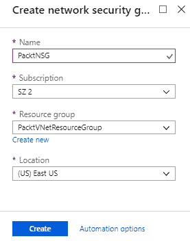

创建一个新的 NSG

1.  点击**创建**。

我们现在已经创建了一个新的 NSG，并将其添加到 `PacktVNetResourceGroup` 中。这个资源组与虚拟网络所在的资源组相同。在演示的下一部分，我们将把 NSG 与子网和 NIC 关联。

# 将 NSG 与子网或 NIC 关联

要将 NSG 与子网关联，您需要执行以下步骤：

1.  创建 NSG 后，进入其概述页面。

1.  在 **设置** 下，选择 **子网** 以将 NSG 与子网关联。在顶部菜单中点击 **关联**：

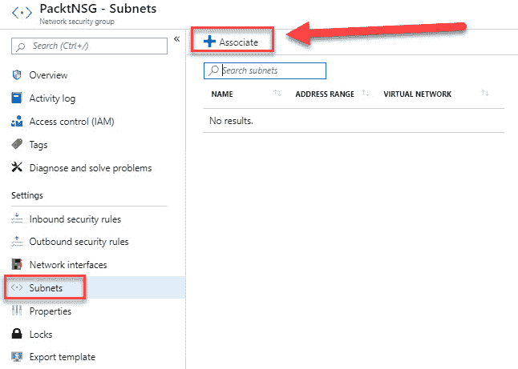

将 NSG 与子网关联

1.  首先，我们需要选择一个虚拟网络。选择 `PacktVNet`：

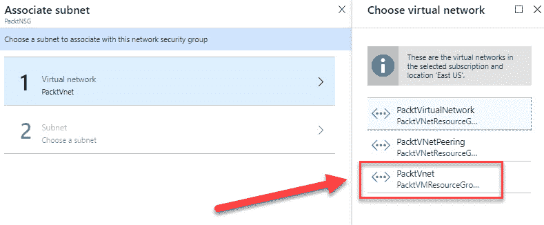

选择虚拟网络

1.  接下来，我们需要选择 **子网**：

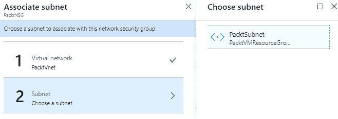

选择子网

1.  点击 **确定**。现在，NSG 将与子网关联。

1.  要将 NSG 与 NIC 关联，在 **设置** 下选择 **网络接口**。在顶部菜单中选择 **关联**：

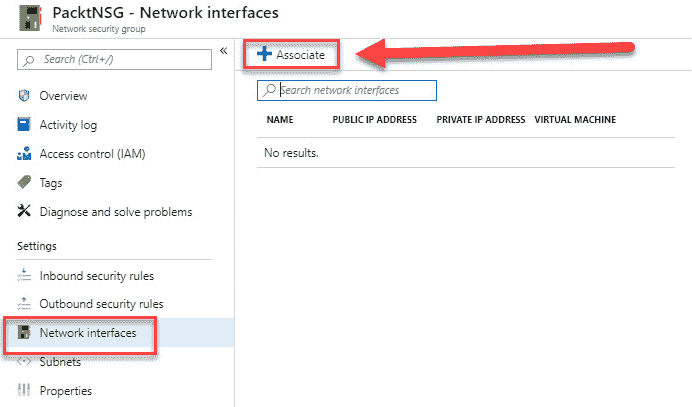

将 NSG 与 NIC 关联

1.  在这里，您可以选择一个与 NSG 所在地区相同的 NIC：

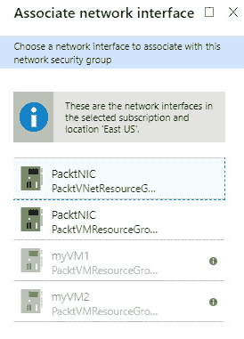

选择 NIC

1.  选择 NIC 后，NSG 会与其关联。

在这个演示中，我们已经介绍了如何将 NSG 与子网和 NIC 关联。在下一个演示中，我们将介绍如何创建和评估安全规则。

# 创建并评估安全规则

创建 NSG 时，会自动为您创建一些默认的入站和出站安全规则。这些默认规则的优先级较低。您也可以向其添加自定义规则。您可以创建入站和出站安全规则。在这个演示中，我们将创建一个拒绝 RDP 流量到关联子网的入站安全规则。因此，您需要执行以下步骤：

1.  首先，进入 NSG 的概述页面。在这里，您可以看到默认的入站和出站安全规则：

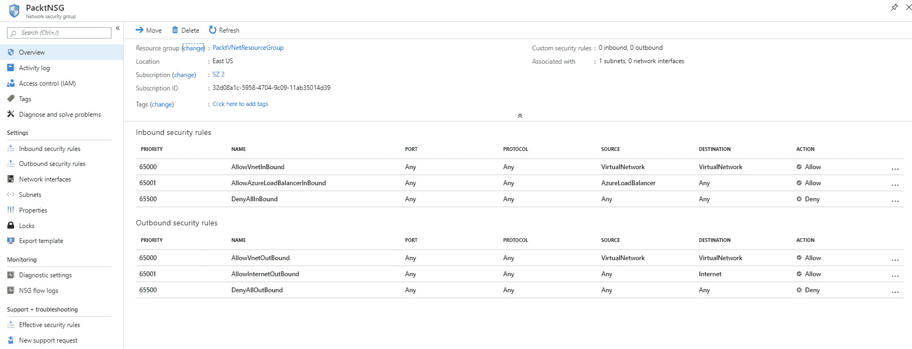

默认安全规则

1.  然后，在 **设置** 下，选择 **入站安全规则** 以添加自定义规则。接着点击顶部菜单中的 **添加**：

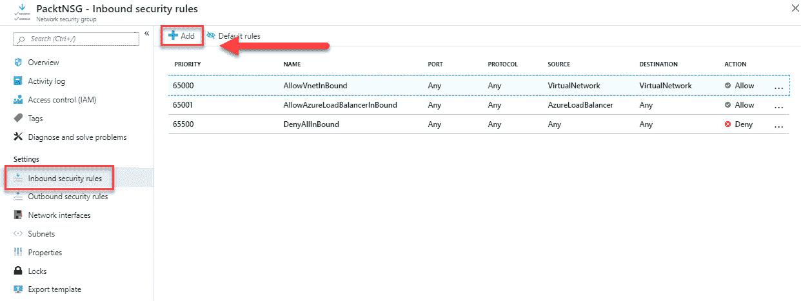

1.  我们将拒绝所有通过端口 `3389`（即 RDP 端口）的流量。因此，我们选择 **源的服务标签** 字段，并选择 **源的互联网** 服务标签，将目标设置为虚拟网络，并将目标端口范围设置为 `3389`，适用于任何协议。操作将设置为 **拒绝**。我们将优先级设置为 **100**，这是最高优先级：

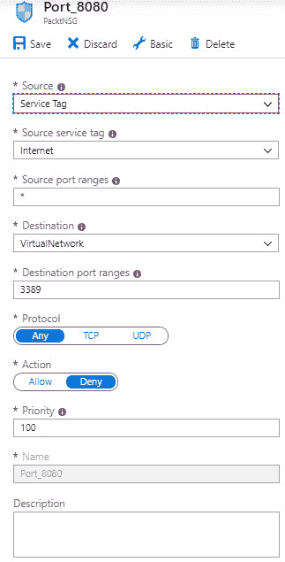

创建安全规则

1.  点击 **添加**。

1.  我们现在已经创建了一个拒绝所有 RDP 流量的入站安全规则。这个规则被绑定到子网，因为我们将这个 NSG 与一个子网关联了。

1.  为了评估这个安全规则，在此资源组、虚拟网络和子网内部署一个虚拟机（VM）。同时，启用 RDP 服务。部署后，尝试连接到该虚拟机。如果安全规则应用正确，您应该收到以下错误信息：

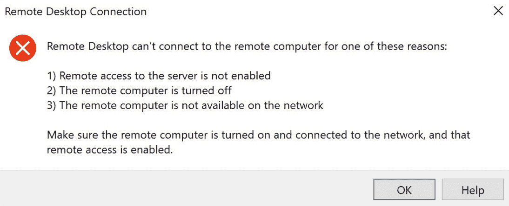

错误信息

本节结束后，我们将讨论 **Azure DNS**。

# Azure DNS

Azure DNS 是一个托管 DNS 域名的服务，可用于名称解析。名称解析的过程涉及将主机名（例如 `www.packt.com`）转换为 IP 地址（例如 `192.168.1.1`）。DNS 服务器消除了人类记住复杂 IP 地址的需求。在 Azure 中，您可以使用 Microsoft Azure 基础设施和与其他 Azure 资源相同的工具和计费来管理您的 DNS 记录。

Azure DNS 不能作为域名注册商使用，然而，您可以将域名托管在 Azure DNS 中进行记录管理，前提是该域名已经在其他地方注册（例如，第三方域名注册商）。然后，您必须将该域名委托给 Azure DNS，以便 DNS 查询能够到达 Azure DNS。

# 域名

DNS 由不同域名的层级结构组成。这些域名在全球的 DNS 服务器上分布。根域名简单地命名为 `.`。根域名下是顶级域名，如 `.com`、`.net`、`.org` 等。再往下是二级域名，如 `.org.uk`。

您可以从域名注册商购买域名。这将授予您控制该域名下 DNS 层级的权利，允许您执行诸如将域名重定向到自己的网站等操作。您可以让注册商在其名称服务器上托管该域名，或者您可以为您的域名指定其他名称服务器。Azure DNS 可以作为这种替代名称服务器，您可以在其中控制 DNS 层级。

# 公共 DNS 区域

要在 Azure DNS 中托管您的域名，您首先需要为您的域名创建一个 DNS 区域。该区域用于托管所有不同的 DNS 记录。例如，`www.packt.com` 域名可以包含多个 DNS 记录，如 `mail.packt.com` 用于邮件服务器，`www.packt.com` 用于公司网站。

当您在 Azure DNS 中创建 DNS 区域时，需要记住以下几点：

+   区域名称在资源组内必须唯一。该区域也不能已存在于该资源组中。

+   您可以在不同的资源组或不同的订阅中重用相同的区域。

+   当您在不同的资源组或订阅中有多个相同名称的区域时，每个实例必须包含不同的名称服务器地址。只能使用一组地址与域名注册商进行配置。

# 私有 DNS 区域

使用 **私有 DNS 区域**，您可以在虚拟网络中管理和解析域名，而无需添加自定义 DNS 解决方案。您可以使用自定义的 DNS 名称，而不是使用 Azure 提供的名称。您可以使用这些自定义域名来定制您的虚拟网络架构，以适应您组织的需求。

私有 DNS 区域为 VNet 内的虚拟机及不同 VNet 之间提供名称解析。你还可以配置共享私有和公共 DNS 区域的区域名称，以共享相同的名称。

要将私有 DNS 区域发布到 VNet，首先需要指定允许解析私有 DNS 区域内记录的虚拟网络列表。这些虚拟网络被称为**解析虚拟网络**。你还可以指定一个注册虚拟网络，然后 Azure DNS 将使用它在创建虚拟机时维护主机名记录。它也用于虚拟机的 IP 地址变化以及虚拟机删除时。

本书撰写时，Azure DNS 私有区域功能处于公开预览阶段。

# 记录类型

你在 DNS 区域内创建的每个 DNS 记录都有一个名称和类型。不同的记录根据它们包含的数据类型组织成不同的类型。例如，A 记录将域名映射到 IPv4 地址。另一个例子是 MX 记录，它将一个名称映射到邮件服务器。

有关不同记录类型的更多信息，请访问[`docs.microsoft.com/en-in/azure/dns/dns-zones-records`](https://docs.microsoft.com/en-in/azure/dns/dns-zones-records)。SPF 记录在 Azure DNS 中通过 TXT 记录表示：[`docs.microsoft.com/en-in/azure/dns/dns-zones-records#spf-records`](https://docs.microsoft.com/en-in/azure/dns/dns-zones-records#spf-records)。

你还可以在 Azure DNS 中创建记录集。这些记录集可以用于将同一名称和相同类型的不同记录在一个区域中组合在一起——例如，当你的公司网站托管在两个不同的 IP 地址上时：

```
www.packt.com. 3600 IN A 134.170.185.46
www.packt.com. 3600 IN A 134.170.188.221
```

当你在`packt.com`区域创建了指向第一个 IP 地址的 A 记录后，你可以将第二个记录添加到现有的记录集，而不是创建一个新的额外记录集。

在接下来的章节中，我们将配置 Azure DNS 中的私有和公共 DNS 区域。

# 配置公共 DNS 区域

要从 Azure 门户配置私有和公共 DNS 区域，您需要执行以下步骤：

1.  通过打开[`portal.azure.com`](https://portal.azure.com)访问 Azure 门户。

1.  在左侧菜单中点击**创建资源**，并在搜索栏中输入`DNS 区域`。创建一个新的 DNS 区域。

1.  添加以下值以创建一个新的 DNS 区域：

    +   **订阅**：选择一个订阅。

    +   **资源组**：创建一个新的资源组，并命名为`PacktDNSResourceGroup`。

    +   **名称**：`packtdns.com`。

    +   **资源组位置**：（美国）美国东部：

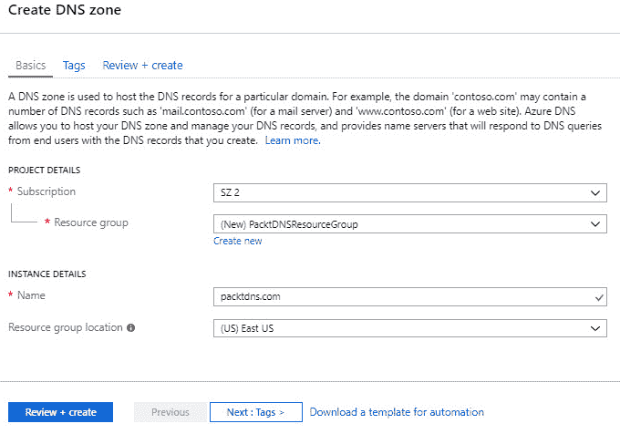

创建新的 DNS 区域

1.  点击**查看 + 创建**。

1.  当资源部署完成后，你可以向其添加 DNS 记录。在概览页面的顶部菜单中，选择+ 记录集：

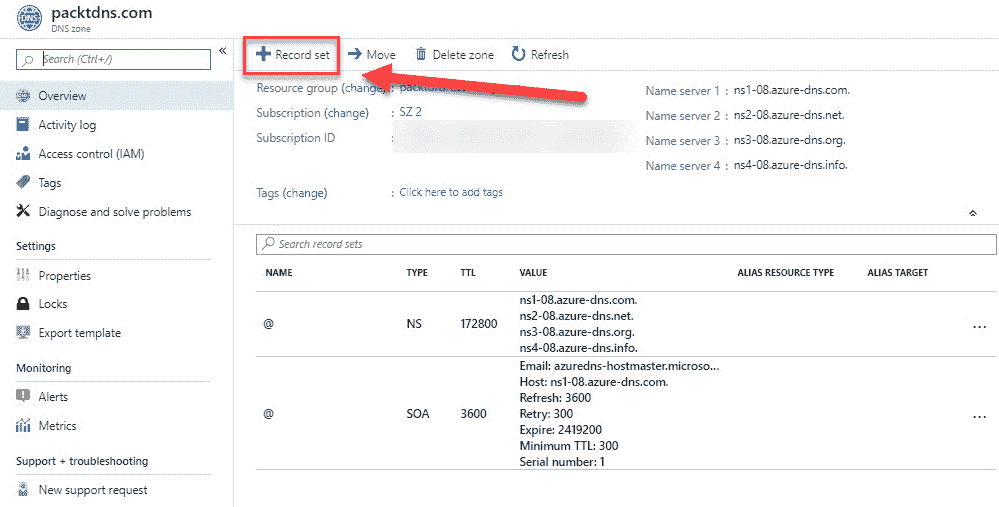

[添加新记录]

1.  要创建 A 记录，添加以下值：

    +   **名称**：`www`。

    +   **类型**：选择**A**。

    +   **TTL**：类型为 `1`。DNS 请求的**生存时间**（**TTL**）参数指定 DNS 服务器和客户端可以缓存响应的时间。

    +   **TTL 单位**：选择**小时**。这是**TTL**值的时间单位。

    +   **IP 地址**：`10.10.10.10`：

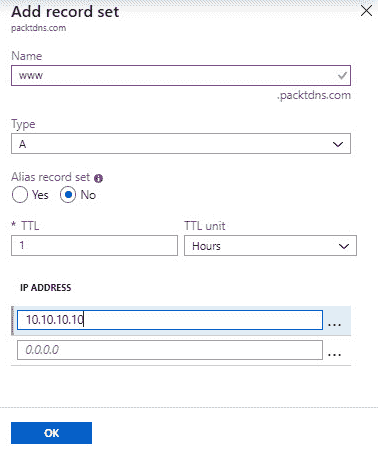

添加新记录

1.  点击**确定**。

1.  添加记录后，我们可以使用 `nslookup` 命令进行测试。首先，我们需要复制其中一个名称服务器：

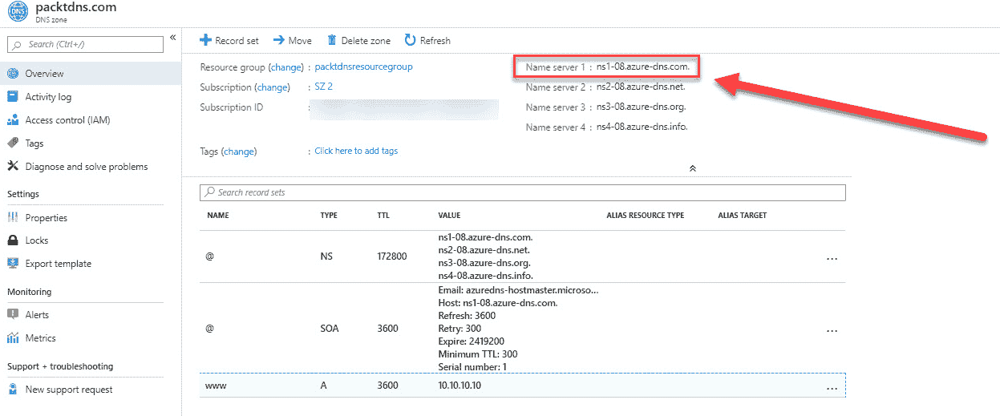

复制名称服务器值

1.  然后，打开命令提示符并输入以下命令：

```
nslookup www.packtdns.com ns1-08.azure-dns.com.
```

1.  您将看到类似以下的内容，这意味着名称解析工作正常：

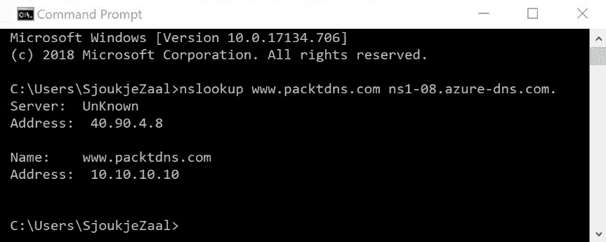

DNS 名称解析

在这个演示中，我们配置了一个公共 DNS 区域。在下一个演示中，我们将介绍如何使用 CLI 和 Azure Cloud Shell 配置一个私有 DNS 区域。

# 配置私有 DNS 区域

在这个演示中，我们将要在一个新的资源组中创建一个私有 DNS 区域。

要使用 Azure Cloud Shell 中的 CLI 配置私有 DNS 区域，您需要执行以下步骤：

1.  通过打开 [`portal.azure.com`](https://portal.azure.com) 访问 Azure 门户。

1.  在右上角的菜单中，选择 Azure Cloud Shell 图标。确保选择了**Bash**。

1.  首先，我们需要创建一个新的资源组。为此，请添加以下命令：

```
az group create --name PacktPrivateDNSResourceGroup --location "East US"
```

1.  然后，我们将创建一个新的虚拟网络（VNet）：

```
az network vnet create \
 --name PacktPrivateDNSVNet \
 --resource-group PacktPrivateDNSResourceGroup \
 --location eastus \
 --address-prefix 10.2.0.0/16 \
 --subnet-name backendSubnet \
 --subnet-prefixes 10.2.0.0/24
```

1.  接下来，我们需要创建私有 DNS 区域：

```
az network dns zone create -g PacktPrivateDNSResourceGroup \
 -n private.packtdns.com \
 --zone-type Private \
 --registration-vnets PacktPrivateDNSVNet
```

1.  现在，创建两个虚拟机来测试私有 DNS 区域。运行此命令时，您需要提供一个管理员密码：

```
az vm create \
 -n packtVM01 \
 --admin-username test-user \
 -g PacktPrivateDNSResourceGroup \
 -l eastus \
 --subnet backendSubnet \
 --vnet-name PacktPrivateDNSVNet \
 --image win2016datacenter

az vm create \
 -n packtVM02 \
 --admin-username test-user \
 -g PacktPrivateDNSResourceGroup \
 -l eastus \
 --subnet backendSubnet \
 --vnet-name PacktPrivateDNSVNet \
 --image win2016datacenter
```

1.  我们将在 `private.packtdns.com` DNS 区域中创建一个附加的 DNS。我们将在 `private.packt.com` DNS 区域中创建一个相对名称为 `db` 的记录。该记录集的完全限定名称是 `db.private.packtdns.com`。记录类型为 A，IP 地址为 `10.2.0.4`：

```
az network dns record-set a add-record \
 -g PacktPrivateDNSResourceGroup \
 -z private.packtdns.com \
 -n db \
 -a 10.2.0.4
```

1.  现在，我们可以测试私有区域的名称解析。我们将测试这两个虚拟机，因此需要为这两个虚拟机配置防火墙，以允许传入的 ICMP 数据包。使用 RDP 连接到这两个虚拟机，并以管理员权限打开 Windows PowerShell 窗口。输入以下命令：

```
New-NetFirewallRule –DisplayName “Allow ICMPv4-In” –Protocol ICMPv4
```

1.  配置完这两个虚拟机后，从 `PacktVM02` 输入以下命令在 PowerShell 中 ping `PacktVM01`：

```
ping PacktVM01.private.packtdns.com
```

您将看到类似以下截图的输出：

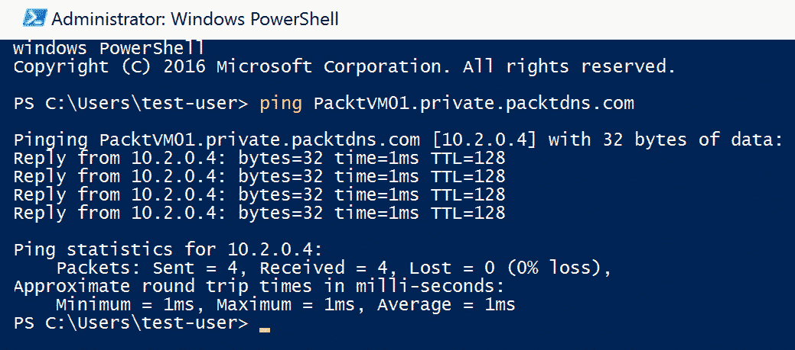

私有 DNS 输出

在这个演示中，我们使用 CLI 配置了一个私有 DNS 区域。

# 总结

在本章中，我们讲解了如何配置和管理 NSG 和 Azure DNS。我们介绍了 NSG 和 Azure DNS 的基础知识。您还学习了如何创建和配置 NSG。我们还讲解了如何使用 Azure DNS 创建公共和私有区域，以及如何向其添加 DNS 记录。

在下一章中，我们将通过讲解如何实现**Azure 负载均衡器**，来覆盖*部署和管理虚拟网络*目标的最后一部分。

# 问题

回答以下问题以测试你对本章内容的理解。你可以在本书最后的*评估*部分找到答案：

1.  你可以将 NSG 分配给子网和 NIC 吗？

    +   是

    +   否

1.  你可以使用 Azure DNS 购买域名并将其托管在那里吗？

    +   是

    +   否

1.  无法从 Azure 门户配置私有 DNS 区域。

    +   正确

    +   错误

# 深入阅读

你可以查看以下链接，了解更多本章涉及的主题：

+   *安全组*：[`docs.microsoft.com/en-us/azure/virtual-network/security-overview`](https://docs.microsoft.com/en-us/azure/virtual-network/security-overview)

+   *创建、修改或删除 NSG*：[`docs.microsoft.com/en-us/azure/virtual-network/manage-network-security-group`](https://docs.microsoft.com/en-us/azure/virtual-network/manage-network-security-group)

+   *什么是 Azure DNS？*：[`docs.microsoft.com/en-in/azure/dns/dns-overview`](https://docs.microsoft.com/en-in/azure/dns/dns-overview)

+   *DNS 区域和记录概述*：[`docs.microsoft.com/en-in/azure/dns/dns-zones-records`](https://docs.microsoft.com/en-in/azure/dns/dns-zones-records)

+   *快速入门：使用 Azure 门户创建 Azure DNS 区域和记录*：[`docs.microsoft.com/en-us/azure/dns/dns-getstarted-portal`](https://docs.microsoft.com/en-us/azure/dns/dns-getstarted-portal)

+   *使用 Azure DNS 进行私有域名管理*：[`docs.microsoft.com/en-us/azure/dns/private-dns-overview`](https://docs.microsoft.com/en-us/azure/dns/private-dns-overview)
