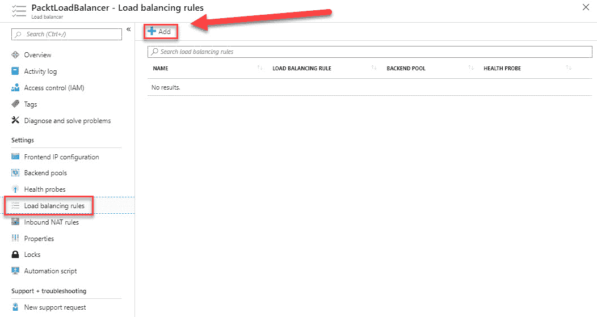

# 实施 Azure 负载均衡器

在上一章中，我们覆盖了 *部署和管理虚拟网络* 目标的第四部分。我们讲解了 **网络安全组**（**NSG**）和 Azure DNS。您还学习了如何创建和配置 NSG，以及如何设置和配置 Azure DNS。

本章涵盖了这一目标的第五部分，也是最后一部分，讲解了如何使用 **Azure 负载均衡器** 配置内外部负载均衡器。在本章中，我们将重点介绍 Azure 负载均衡器的特性和功能。您将学习如何配置内部负载均衡器，如何创建健康探针以及如何配置负载均衡规则。本章的最后部分将讲解如何配置公共负载均衡器。

本章将覆盖以下主题：

+   Azure 负载均衡器

+   配置内部负载均衡器

+   创建健康探针

+   创建负载均衡规则

+   配置公共负载均衡器

# 技术要求

本章的源代码可以从 GitHub 仓库下载，地址为 [`github.com/PacktPublishing/Microsoft-Azure-Administrator-Exam-Guide-AZ-103/tree/master/Chapter13`](https://github.com/PacktPublishing/Microsoft-Azure-Administrator-Exam-Guide-AZ-103/tree/master/Chapter13)。

# Azure 负载均衡器

Azure 负载均衡器是一个在传输层（OSI 网络参考模型的第四层）操作的负载均衡器。Azure 负载均衡器支持 **传输控制协议**（**TCP**）和 **用户数据报协议**（**UDP**），可用于负载均衡流量到您的虚拟机。它提供高吞吐量和低延迟，能够扩展到数百万个流，并支持各种入站和出站场景。

Azure 负载均衡器可以用于以下功能：

+   **公共负载均衡器**：传入的互联网流量会负载均衡到虚拟机。

+   **内部负载均衡器**：流量可以在虚拟网络中的虚拟机之间进行负载均衡。您还可以在混合场景中使用它，例如将流量引导到企业网络内部的负载均衡器。

+   **端口转发**：您可以通过入站 **网络地址转换**（**NAT**）规则将流量转发到特定虚拟机上的特定端口。

+   **出站连接**：您还可以通过在 Azure 负载均衡器上作为公共负载均衡器为虚拟网络中的虚拟机提供出站连接。

Azure 负载均衡器提供以下功能和能力：

+   **负载均衡**：流量可以通过规则从前端池分发到后端池。默认情况下，Azure 负载均衡器使用五元组哈希，该哈希由源 IP 地址、源端口、目标 IP 地址、目标端口和 IP 协议号组成，用于将流量映射到后端池中的可用服务器。

+   **端口转发**：可以创建入站 NAT 规则，将流量从负载均衡器前端 IP 地址的特定端口转发到 Azure 虚拟网络内部后端实例的特定端口。因此，采用与负载均衡相同的基于哈希的分配方式。这可用于远程桌面协议（**RDP**）和安全外壳协议（**SSH**）会话，连接到 VNet 内的虚拟机。多个内部端点可以映射到相同前端 IP 地址的不同端口。可以使用前端 IP 地址远程管理虚拟机，这样无需额外的跳板机。

+   **自动重新配置**：当实例规模扩大或缩小时，负载均衡器会自动重新配置自己。当虚拟机从后端池中添加或移除时，无需对负载均衡器进行额外操作。

+   **健康探针**：Azure 负载均衡器使用健康探针来判断后端池中虚拟机的健康状态。当探针未响应时，负载均衡器会停止向该实例发送新连接。为 HTTP、HTTPS 和 TCP 端点提供了不同的健康探针。

+   **出站连接**（**SNAT**）：出站连接会自动转换为负载均衡器的公共前端 IP 地址。

Azure 负载均衡器有两种不同的定价层：

+   **基础版**：基础版负载均衡器免费使用，具备以下功能：

    +   **后端池大小**：基础版支持最多 100 个实例在后端池内。

    +   **健康探针**：TCP 和 HTTP。

    +   **可用性区域**：不可用。

    +   **出站连接**：支持单一前端，当配置多个前端时，会随机选择一个。默认的**源网络地址转换**（**SNAT**）在只有内部负载均衡器服务虚拟机、虚拟机规模集或可用性集时使用。

    +   **出站规则**：不可用。

    +   **诊断**：仅支持公共负载均衡器的 Azure 日志分析，后端池健康计数和 SNAT 耗尽警报。

    +   **HA 端口**：不可用。

    +   **默认安全**：默认开放；NSG 是可选的。

    +   **空闲时 TCP 重置**：不可用。

    +   **多个前端**：不可用。

    +   **管理操作**：60-90+秒。

    +   **服务级别协议（SLA）**：不可用。

+   **标准版**：使用 Azure 负载均衡器的标准层会收费。费用依据规则数量和与资源相关的数据进行计算，这些数据包括传入和传出的流量：

    +   **后端池大小**：标准层支持最多 1,000 个实例在后端池内。

    +   **健康探针**：TCP、HTTP 和 HTTPS。

    +   **可用性区域**：支持用于入站和出站连接的区冗余和分区前端，并支持跨区负载均衡。

    +   **出站连接**：每个负载均衡规则的退出可以使用多个前端。基于池的出站 NAT 可以通过出站规则显式定义。出站场景必须显式创建，以便使用虚拟机、虚拟机规模集或可用性集的出站连接。虚拟网络服务端点可以在无需定义出站连接的情况下访问。公共 IP 地址和**平台即服务**（**PaaS**）必须通过出站连接来访问，若它们不可通过 VNet 服务端点访问。

    +   **出站规则**：需要使用公共 IP 地址、公共 IP 前缀或两者来定义出站 NAT 配置。你还可以配置出站空闲超时和自定义 SNAT 端口分配。

    +   **诊断**：Azure 负载均衡器支持 Azure Monitor，具有包括健康探测状态、出站连接健康（SNAT 成功和失败流量）、多维度度量以及活动数据平面测量等功能。

    +   **HA 端口**：仅适用于内部负载均衡器的高可用端口。

    +   **默认安全**：除非内部负载均衡器被 NSG 白名单列出，否则默认情况下，端点会对入站流量关闭。公共 IP 地址和负载均衡器端点也会被保护。

    +   **TCP 空闲重置**：可以在任何规则的空闲超时上启用此选项。

    +   **多个前端**：用于入站和出站连接。

    +   **管理操作**：大多数操作在 30 秒内完成。

    +   **SLA**：在两个健康虚拟机的情况下，数据路径的 SLA 为 99.99%。

# 配置内部负载均衡器

在此演示中，我们将通过 Azure 门户创建和配置一个负载均衡器。我们将通过一个基本的负载均衡器路由内部流量，将入站请求分发到多个虚拟机。对于这个演示，我们将创建一个负载均衡器、后端服务器以及基础定价层的网络资源。

# 创建 VNet

首先，我们将创建 VNet、后端服务器和测试虚拟机。为此，请按照以下步骤操作：

1.  打开[`portal.azure.com/`](https://portal.azure.com/)访问 Azure 门户。

1.  在左侧菜单中，选择创建资源|网络，然后选择虚拟网络。

1.  添加以下值：

    +   **名称**：`PacktLBVnet`

    +   **地址空间**：`172.16.0.0/16`

    +   **订阅**：选择一个订阅

    +   **资源组**：创建一个新的资源组并命名为**PacktLoadBalancer**。

    +   **位置**：东部美国

    +   **子网名称**：`PacktLBBackendSubnet`

    +   **子网地址范围**：`172.16.0.0/24`

    +   **DDoS 保护**：基本

    +   **服务端点**：禁用

    +   **防火墙**：禁用：


VNet 设置

1.  点击创建。

# 创建虚拟机

下一步是创建用于后端池和测试的虚拟机。为此，请按照以下步骤操作：

1.  创建虚拟机时，选择左侧菜单中的**创建资源**，然后选择计算，再选择 Windows Server 2016 Datacenter。

1.  在“创建虚拟机”面板的“基本”选项卡中，填写以下值：

    +   订阅：选择一个订阅

        资源组：`PacktLoadBalancer`（在上一步创建）。

    +   虚拟机名称：`PacktLBVM1`。

    +   区域：东部美国。

    +   可用性选项：选择可用性**集**并创建一个新的，命名为`PacktLBAvailabilitySet`。保持默认域并更新域设置。

    +   镜像：Windows Server 2016 Datacenter。

    +   大小：Standard DS1 v2。

    +   **凭据**：为虚拟机指定用户名和密码。

    +   公共入站端口：允许选择的端口|选择 RDP（3389）。

1.  选择“网络”选项卡，选择我们在上一步创建的虚拟网络及其子网，并填写以下值：

    +   NIC 网络安全组：选择**高级**并创建一个新的网络安全组。保持新网络安全组的默认名称。

1.  选择**管理**选项卡。在**监控**下，将**启动诊断**设置为**关闭**。

1.  点击“审核 + 创建”按钮以创建虚拟机。

1.  重复上述步骤，使用相同的设置创建第二个虚拟机`PacktLBVM2`和第三个虚拟机`PacktLBVMTest`，并将它们放置在相同的订阅、资源组、可用性集以及相同的网络安全组中。

# 创建负载均衡器

现在我们可以按照以下步骤创建负载均衡器：

1.  要创建基本负载均衡器，在顶部菜单中选择“创建资源”|“网络”|“负载均衡器”。

1.  添加以下值：

    +   **订阅**：选择一个订阅

    +   资源组：`PacktLoadBalancer`。

    +   名称：`PacktLoadBalancer`。

    +   区域：东部美国。

    +   类型：内部。

    +   SKU：基础版。

    +   虚拟网络：选择`PacktLBVNet`。

    +   子网：选择`PacktLBBackendSubnet`。

    +   IP 地址分配：静态。

    +   私有 IP 地址：提供一个属于虚拟网络和子网地址空间的 IP 地址，例如`172.16.0.7`。

1.  点击“审核 + 创建”。然后点击“创建”：


创建负载均衡器

# 创建后端地址池

现在，虚拟机和 Azure 负载均衡器实例已创建并且网络配置完成，接下来是创建后端池，负载均衡器将使用该池将流量分配到虚拟机。后端池由**网络接口卡**（**NICs**）的 IP 地址组成。

我们将创建一个包含`PacktLBVM1`和`PacktLBVM2`的后端池：

1.  打开在前一步中创建的负载均衡器资源，进入 Azure 门户。

1.  在设置中，选择“后端池”，然后点击“添加”按钮：


创建后端池

1.  添加以下值：

    +   名称：`PacktLBBackendPool`。

    +   关联到：选择**可用性集**。

    +   可用性集：选择`PacktLBAvailabilitySet`。

    +   选择“添加目标网络 IP 配置”，并将`PacktLBVM1`和`PacktLBVM2`添加到后端池。

1.  点击“确定”：


将虚拟机添加到后端池

# 创建健康探测

下一步是为负载均衡器创建健康探测。健康探测用于负载均衡器监控虚拟机的状态。根据健康检查的响应，探测将动态地添加或移除虚拟机，从负载均衡器的轮换中。

要创建健康探测，请执行以下步骤：

1.  再次打开负载均衡器资源。

1.  在“设置”下，选择“健康探测”，然后选择“添加”：


创建新健康探测

1.  添加以下值：

    +   名称：`PacktHealthProbe`。

    +   协议：HTTP。

    +   端口：`80`。

    +   路径：`*/*`**.**

    +   间隔：`15`——这是探测尝试之间的秒数。

    +   不健康阈值：`2`*—*该值是连续探测失败的次数，超过该次数后虚拟机被视为不健康。

1.  点击“确定”：


健康探测设置

# 创建负载均衡规则

负载均衡规则定义了流量如何分配到后端池中的虚拟机。当你创建一个新规则时，你需要定义传入流量的前端 IP 配置、接收流量的后端 IP 池以及所需的源和目标端口。

我们要创建的规则监听前端的 `80` 端口。该规则然后将网络流量发送到后端池，同样是端口 `80`。

要创建规则，请执行以下步骤：

1.  再次打开负载均衡器资源。

1.  在“设置”下，选择“负载均衡规则”，然后选择“添加”：



创建新规则

1.  添加以下值：

    +   名称：`PacktLoadBalancerRule`

    +   前端 IP 地址：`LoadBalancerFrontEnd`

    +   协议：TCP

    +   端口：`` `80` ``

    +   后端端口：`80`

    +   后端池：`PacktLBBackendPool`

    +   健康探测：`PacktHealthProbe`

1.  点击“确定”：


配置规则

# 测试负载均衡器

为了正确测试虚拟机，我们将使用 PowerShell 在 `PacktLBVM1` 和 `PacktLBVM2` 虚拟机上安装 **Internet 信息服务** (**IIS**)。然后，我们可以使用 `PacktLBVMTest` 虚拟机通过调用其私有 IP 地址来测试负载均衡器。

首先，我们需要获取负载均衡器的私有 IP 地址。执行以下步骤：

1.  在负载均衡器的概览页面中，复制私有 IP 地址，如下所示：


获取私有 IP 地址

1.  现在，我们需要使用 RDP 会话连接到 `PacktLBVM1` 和 `PacktLBVM2` 虚拟机，并在其上安装 IIS 和一个测试网页。连接到这两台虚拟机，打开 PowerShell 控制台，并提供以下 PowerShell 脚本：

```
# Install IIS
  Install-WindowsFeature -name Web-Server -IncludeManagementTools

# Remove default htm file
 remove-item C:\inetpub\wwwroot\iisstart.htm

#Add custom htm file
 Add-Content -Path "C:\inetpub\wwwroot\iisstart.htm" -Value $("Hello World from " + $env:computername)
```

1.  接下来，使用 RDP 连接到 `PacktLBVMTest` 虚拟机，打开浏览器会话，并导航到负载均衡器的私有 IP 地址。刷新浏览器几次，以查看负载均衡器将请求分配到两台虚拟机，如下图所示：


测试负载均衡器

# 配置公共负载均衡器

在本节中，我们将使用 Azure CLI 创建公共负载均衡器。您可以在 Azure 门户中访问 Azure Cloud Shell，并复制代码片段。

创建公共负载均衡器的完整脚本也可以从 GitHub 下载。请参考本章开头的*技术要求*部分中指定的位置。

# 创建负载均衡器

创建公共负载均衡器需要执行一系列步骤。在接下来的章节中，我们将创建包含所有必要组件的公共负载均衡器。

# 创建资源组

我们首先创建一个资源组，用于负载均衡器和其他资源，如下所示：

```
# Create a resource group
az group create \
 --name PacktResourceGroupSLB \
 --location eastus
```

# 创建公共 IP 地址

接下来，我们将为负载均衡器配置公共 IP 地址，以便从互联网访问它。标准负载均衡器只支持标准公共 IP 地址，如下所示的代码：

```
# Create a public IP address
az network public-ip create --resource-group PacktResourceGroupSLB --name PacktPublicIP --sku standard
```

# 创建负载均衡器

在接下来的章节中，我们将创建负载均衡器，并创建包括前端 IP 池、后端 IP 池、健康探针和负载均衡器规则等组件。

要创建负载均衡器，请添加以下代码：

```
# Create the Load Balancer
az network lb create \
 --resource-group PacktResourceGroupSLB \
 --name PacktLoadBalancer \
 --sku standard
 --public-ip-address PacktPublicIP \
 --frontend-ip-name PacktFrontEnd \
 --backend-pool-name PacktBackEndPool
```

# 创建健康探针

所有虚拟机实例都通过健康探针检查，以确定它们是否足够健康，可以向其发送网络流量。未通过健康检查的虚拟机实例会从负载均衡器中移除，直到探针检查表明它们已恢复健康。

要创建健康探针，请添加以下代码：

```
#Create the health probe
az network lb probe create \
 --resource-group PacktResourceGroupSLB \
 --lb-name PacktLoadBalancer \
 --name PacktHealthProbe \
 --protocol tcp \
 --port 80
```

# 创建负载均衡器规则

负载均衡器规则定义了传入流量的前端 IP 配置和接收流量的后端 IP 池，以及所需的源和目标端口，如下所示：

```
#Create the Load Balancer rule
az network lb rule create \
 --resource-group PacktResourceGroupSLB \
 --lb-name PacktLoadBalancer \
 --name PacktHTTPRule \
 --protocol tcp \
 --frontend-port 80 \
 --backend-port 80 \
 --frontend-ip-name PacktFrontEnd \
 --backend-pool-name PacktBackEndPool \
 --probe-name PacktHealthProbe
```

# 创建虚拟网络

现在，我们需要创建虚拟网络来部署虚拟机，使用以下代码：

```
#Create a virtual network
az network vnet create \
 --resource-group PacktResourceGroupSLB \
 --location eastus \
 --name PacktVnet \
 --subnet-name PacktSubnet
```

# 创建 NSG

接下来，我们将创建一个 NSG。标准负载均衡器要求后端的虚拟机具有放置在 NSG 中的网卡。我们需要创建 NSG 来定义虚拟网络的入站连接，如下所示：

```
az network nsg create \
 --resource-group PacktResourceGroupSLB \
 --name PacktNetworkSecurityGroup
```

# 创建一个 NSG 规则

要允许通过端口`80`的入站连接，请创建如下所示的 NSG 规则：

```
#Create a Network Security Group rule
az network nsg rule create \
 --resource-group PacktResourceGroupSLB \
 --nsg-name PacktNetworkSecurityGroup \
 --name PacktNetworkSecurityGroupRuleHTTP \
 --protocol tcp \
 --direction inbound \
 --source-address-prefix '*' \
 --source-port-range '*' \
 --destination-address-prefix '*' \
 --destination-port-range 80 \
 --access allow \
 --priority 200
```

# 创建网卡

我们需要创建两个网络接口，并将它们与 NSG 和公共 IP 地址关联，如下所示：

```
#Create NICs
for i in `seq 1 2`; do
 az network nic create \
 --resource-group PacktResourceGroupSLB \
 --name PacktNic$i \
 --vnet-name PacktVnet \
 --subnet PacktSubnet \
 --network-security-group PacktNetworkSecurityGroup \
 --lb-name PacktLoadBalancer \
 --lb-address-pools PacktBackEndPool
done
```

# 创建后端服务器

接下来是创建后端服务器。我们将创建两台虚拟机，作为负载均衡器的后端服务器。我们还将安装**NGINX**（一个开源的高性能 HTTP 服务器和反向代理）来测试负载均衡器。

# 创建可用性集

要创建可用性集，请添加以下代码：

```
#Create an Availability set
az vm availability-set create \
 --resource-group PacktResourceGroupSLB \
 --name PacktAvailabilitySet
```

# 创建两个虚拟机

我们将创建两台安装了 NGINX 的虚拟机，并在这些 Linux 虚拟机上创建一个`Hello World`的 Node.js 应用程序。为此，我们需要创建一个名为`cloud-init.txt`的文件，并将配置粘贴到其中。以下`cloud-init`配置将安装所有所需的软件包，然后创建`Hello World`应用程序，并启动该应用程序。要创建`cloud-init.txt`文件，请添加以下行：

```
sensible-editor cloud-init.txt
```

选择一个编辑器并粘贴以下配置。首先，添加软件包：

```
#cloud-config
package_upgrade: true
packages:
 - nginx
 - nodejs
 - npm
```

然后设置服务器：

```
write_files:
 - owner: www-data:www-data
 - path: /etc/nginx/sites-available/default
 content: |
 server {
 listen 80;
 location / {
 proxy_pass http://localhost:3000;
 proxy_http_version 1.1;
 proxy_set_header Upgrade $http_upgrade;
 proxy_set_header Connection keep-alive;
 proxy_set_header Host $host;
 proxy_cache_bypass $http_upgrade;
 }
 }
```

接下来，创建应用程序：

```
- owner: azureuser:azureuser
 - path: /home/azureuser/myapp/index.js
 content: |
 var express = require('express')
 var app = express()
 var os = require('os');
 app.get('/', function (req, res) {
 res.send('Hello World from host ' + os.hostname() + '!')
 })
 app.listen(3000, function () {
 console.log('Hello world app listening on port 3000!')
 })
```

最后，运行应用程序：

```
runcmd:
 - service nginx restart
 - cd "/home/azureuser/myapp"
 - npm init
 - npm install express -y
 - nodejs index.js
```

通过上述代码块，我们现在为虚拟机创建了`cloud-init.txt`文件。保存文件并退出编辑器。现在，我们可以继续创建两台虚拟机并应用配置，具体如下：

```
#Create two virtual machines 
for i in `seq 1 2`; do
 az vm create \
 --resource-group PacktResourceGroupSLB \
 --name myVM$i \
 --availability-set PacktAvailabilitySet \
 --nics PacktNic$i \
 --image UbuntuLTS \
 --generate-ssh-keys \
 --custom-data cloud-init.txt \
 --no-wait
done
```

# 测试负载均衡器

为了测试负载均衡器，我们需要获取其公共 IP 地址并将其粘贴到浏览器窗口中。等待虚拟机完全配置并运行。你可以在 Azure 门户中检查此状态。然后，要获取公共 IP 地址，请添加以下代码行：

```
#Obtain public IP address
az network public-ip show \
 --resource-group PacktResourceGroupSLB \
 --name PacktPublicIP \
 --query [ipAddress] \
 --output tsv
```

将此行代码的输出粘贴到浏览器窗口中，以查看 Azure 负载均衡器的实际操作：


测试公共负载均衡器

# 总结

在本章中，我们介绍了如何配置内部和外部负载均衡器。你还学会了如何配置负载均衡规则和健康探测。

在下一章中，我们将继续进行*部署和管理虚拟网络*目标的第五部分，讲解如何将本地网络与 Azure 虚拟网络集成。

# 问题

回答以下问题，以测试你对本章内容的理解。你可以在本书末尾的*评估*部分找到答案：

1.  基本负载均衡器只能通过 Azure 门户创建吗？

    +   是的

    +   不

1.  标准负载均衡器是否需要后端虚拟机中的网络接口卡（NIC）放置在 NSG 中才能正常工作？

    +   是的

    +   不

1.  标准负载均衡器是否需要标准的公共 IP 地址才能正常运行？

    +   是的

    +   不

# 深入阅读

你可以查看以下链接，了解本章涵盖的主题的更多信息：

+   *负载均衡器*：[`docs.microsoft.com/en-us/azure/load-balancer/`](https://docs.microsoft.com/en-us/azure/load-balancer/)

+   *快速入门：使用 Azure CLI 创建负载均衡器以平衡虚拟机负载*：[`docs.microsoft.com/en-us/azure/load-balancer/quickstart-create-basic-load-balancer-cli`](https://docs.microsoft.com/en-us/azure/load-balancer/quickstart-create-basic-load-balancer-cli)

+   *快速入门：使用 Azure PowerShell 创建公共负载均衡器*：[`docs.microsoft.com/en-us/azure/load-balancer/quickstart-create-basic-load-balancer-powershell`](https://docs.microsoft.com/en-us/azure/load-balancer/quickstart-create-basic-load-balancer-powershell)

+   *快速入门：使用 Azure 门户创建标准负载均衡器以负载均衡虚拟机*: [`docs.microsoft.com/en-us/azure/load-balancer/quickstart-load-balancer-standard-public-portal`](https://docs.microsoft.com/en-us/azure/load-balancer/quickstart-load-balancer-standard-public-portal)

+   *快速入门：使用 Azure PowerShell 创建标准负载均衡器*: [`docs.microsoft.com/en-us/azure/load-balancer/quickstart-create-standard-load-balancer-powershell`](https://docs.microsoft.com/en-us/azure/load-balancer/quickstart-create-standard-load-balancer-powershell)
