# 第十四章：管理 Azure Active Directory

在上一章中，我们讨论了如何使用 Azure 负载均衡器配置内部和外部负载均衡器。主要关注的是 Azure 负载均衡器的特性和功能，以及如何创建健康探测器和配置负载均衡规则。

本章介绍本书的最终目标：*管理身份* 目标*.* 在本章中，我们将介绍如何在 **Azure Active Directory**（**Azure AD**）中创建和管理用户和组。您将学习如何从 Azure 门户管理这些内容，以及如何在 Azure AD 租户中执行批量更新。您将学习如何为用户配置自助服务密码重置，以减少用户管理的工作量。我们还将介绍 Azure AD 加入以及如何管理已注册或加入 Azure AD 的设备。最后，我们将向 Azure AD 添加自定义域名。

本章将涵盖以下主题：

+   Azure AD

+   创建和管理用户和组

+   添加和管理来宾帐户

+   执行批量用户更新

+   配置自助服务密码重置

+   Azure AD 加入

+   管理设备设置

+   添加自定义域名

# Azure AD

Azure AD 提供了一个来自云端的目录和身份管理解决方案。它提供传统的用户名和密码身份管理，以及角色和权限管理。此外，它还提供了更多企业级解决方案，例如**多重身份验证**（**MFA**）和应用程序监控、解决方案监控和警报。Azure AD 可轻松集成到您的本地 Active Directory 中，以创建混合基础架构。

Azure AD 提供以下定价计划：

+   **免费**：提供最基本的功能，例如支持多达 500,000 个对象、**单点登录**（**SSO**）、Azure B2B 用于外部用户、支持 Azure AD Connect 同步、自助服务密码更改、组和标准安全报告。

+   **基础**：不设对象限制，SLA 达到 99.9%，自助服务密码重置，公司品牌特性以及应用程序代理支持。

+   **高级 P1**：提供高级报告、多重身份验证、条件访问、自动注册移动设备管理（MDM）、云应用发现和 Azure AD 连接健康。

+   **高级 P2**：提供身份保护和特权身份管理。

若要详细了解不同定价计划和每个计划提供的所有功能，请参阅以下定价页面：[`azure.microsoft.com/en-us/pricing/details/active-directory/`](https://azure.microsoft.com/en-us/pricing/details/active-directory/)。

请注意，Azure AD 高级版是企业移动性和安全套件的一部分。

在下一节中，我们将在 Azure AD 租户内创建和管理用户和组。

# 创建和管理用户和组

在本次演示中，我们将创建和管理 Azure 门户中的用户和组。你也可以使用 PowerShell 和 CLI 来创建用户。

我们在本次演示中不会创建 Azure AD 租户。我假设你已经有一个租户。如果你需要创建一个 Azure AD 租户，可以参考以下教程：[`docs.microsoft.com/en-us/azure/active-directory/develop/quickstart-create-new-tenant`](https://docs.microsoft.com/en-us/azure/active-directory/develop/quickstart-create-new-tenant)。

你也可以在一个订阅中创建多个 Azure AD 租户。这些目录可以用于开发和测试等目的。

# 在 Azure AD 中创建用户

我们将首先在 Azure 门户中从 Azure AD 租户中创建几个用户。因此，您需要执行以下步骤：

1.  通过打开[`portal.azure.com`](https://portal.azure.com)导航到 Azure 门户。

1.  在左侧菜单中，选择**Azure Active Directory**。

1.  在 Azure AD 的概览面板中，左侧菜单中选择 用户 | 所有用户。从顶部菜单中选择**+** **新用户**，如下所示：

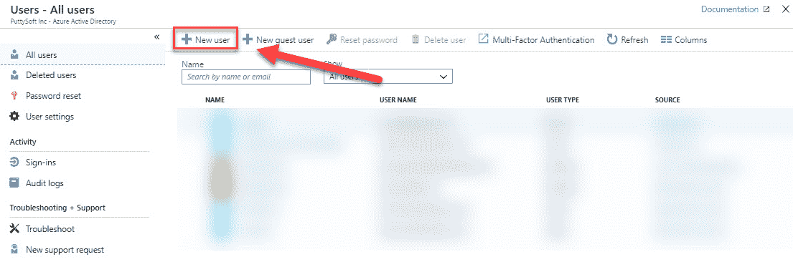

创建新用户

1.  我们将创建三个用户。添加以下值，如下截图所示：

    +   **名称**：`PacktUser1`。

    +   **用户名**：用户名是用户登录 Azure AD 时输入的标识符。使用配置的域名，并将其添加到用户名的末尾。在我的例子中，这个用户名是`PacktUser1@sjoukjezaal.com`。

    +   **个人资料**：在这里，你可以为用户创建一个新个人资料。添加名、姓、职位和部门。然后，点击**确定**，如下所示：

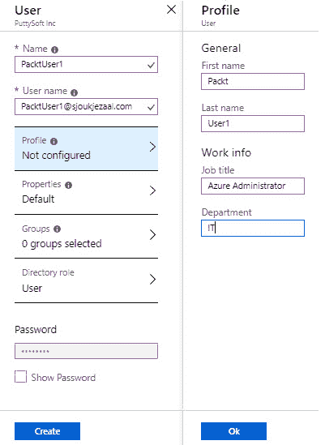

为你的用户创建个人资料

1.  +   **组**：你也可以从这里将用户添加到一个组中。我们将在接下来的演示中进行此操作，因此现在可以跳过这部分内容。

    +   **目录角色**：在这里，你可以将用户分配为**用户**、**全局管理员**或**有限管理员**角色。选择**用户**，如下所示：

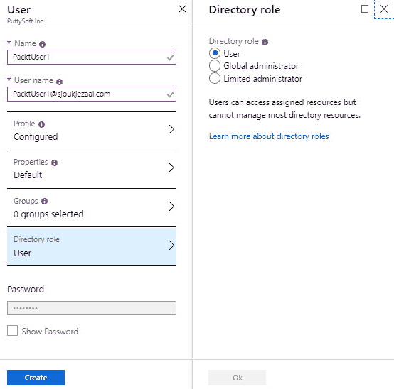

选择目录角色

1.  点击**创建**。

1.  重复这些步骤，创建`PackUser2`和`PacktUser3`。

现在，我们已经在 Azure AD 租户中创建了几个用户，可以将它们添加到 Azure AD 中的一个组。

# 在 Azure AD 中创建组

若要从 Azure AD 租户中创建和管理组，必须执行以下步骤：

1.  通过打开[`portal.azure.com`](https://portal.azure.com)导航到 Azure 门户。

1.  在左侧菜单中，选择**Azure Active Directory**。

1.  在 Azure AD 的概览面板中，左侧菜单中选择 组 | 所有组。从顶部菜单中选择**+** **新组**，如下所示：

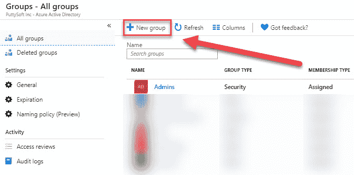

创建新组

1.  添加以下值以创建新组：

    +   **组类型**：安全组。

    +   **组名称**：`PacktGroup`。

    +   **成员类型**：在这里，您可以选择三种不同的值。第一种是**分配**，您手动将成员分配到该组；第二种是**动态用户**，该组成员资格基于某些用户属性来确定。动态组成员资格消除了添加和移除用户的管理开销。最后一种是**动态设备**，此时组成员资格基于某些设备属性来确定。选择第一个选项：**分配**。

1.  点击“成员”选项卡以向该组添加成员。选择我们在上一个演示中创建的三个用户账户，如下所示：

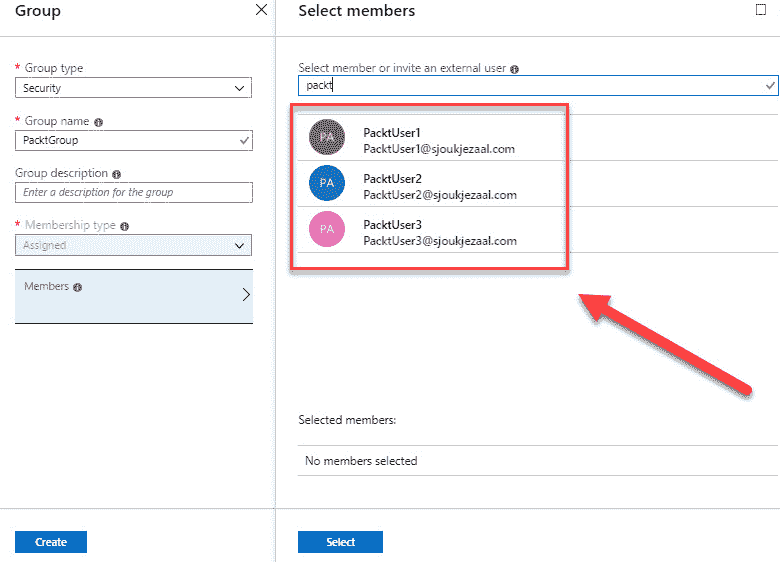

向组中添加用户

1.  点击**选择**以添加成员，然后点击**创建**来创建该组。

我们现在已经在 Azure AD 中创建了一个新组，并将我们在上一个演示中创建的用户账户添加到该组中。在接下来的部分，我们将讲解如何添加和管理外部账户。

# 添加和管理外部账户

您还可以使用 Azure AD **企业对企业**（**B2B**）功能添加外部用户账户。Azure AD B2B 是 Azure AD 上的一个功能，允许组织与外部用户安全地合作。要添加到 Azure B2B，外部用户不需要拥有已添加到现有 Azure AD 租户中的 Microsoft 工作或个人账户。各种账户都可以添加到 Azure B2B。

您无需在 Azure 门户中进行任何配置即可使用 B2B；此功能默认对所有 Azure AD 租户启用。执行以下步骤：

1.  向 Azure AD 租户添加外部用户与添加内部用户类似。当您进入用户概览页面时，可以在顶部菜单中选择**+ 新建外部用户**，如下所示：

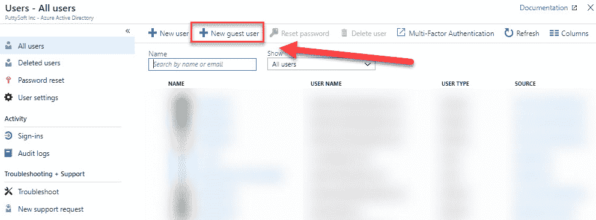

添加外部用户

1.  然后，您可以提供一个电子邮件地址和一条个人消息，该消息会发送到用户的收件箱。此个人消息包括一个登录您租户的链接：

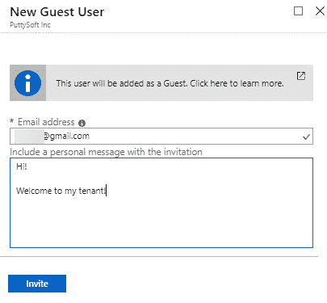

外部用户属性

1.  点击**邀请**以将用户添加到您的 Azure AD 租户，并将邀请发送到用户的收件箱。

1.  创建后，要管理外部用户，您可以从用户概览页面中选择它们。它们将具有一个**用户类型**，名为**外部用户**。只需选择列表中的用户，您将能够管理在顶部菜单中显示的该用户的设置，如下所示：

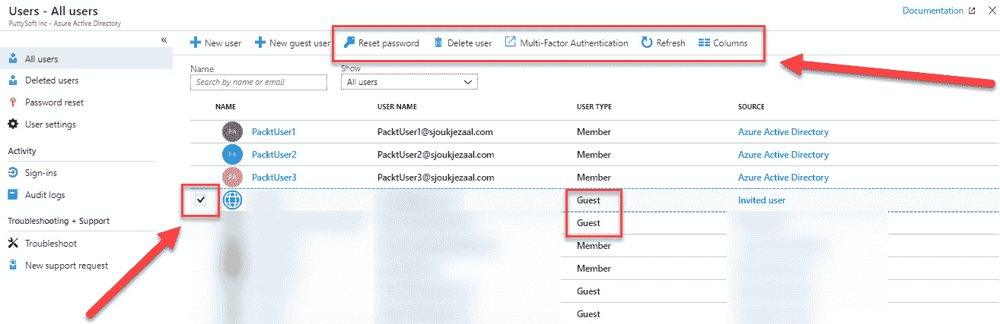

管理外部用户

在接下来的部分，我们将讲解如何通过 Azure 门户执行批量用户更新。

# 执行批量用户更新

执行批量用户更新与管理单个用户（内部和外部）类似。唯一不能为多个用户设置的属性是重置密码。这必须为单个用户执行。

要执行批量用户更新，您需要执行以下步骤：

1.  再次进入用户概览面板。

1.  你可以在概览面板中选择多个用户。从顶部菜单中，选择你想要配置的属性，如下所示：

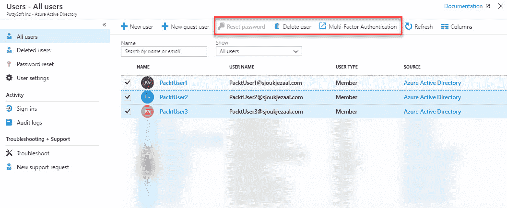

执行批量用户更新

这就是批量更新用户的演示部分。在下一部分，我们将讲解如何为用户配置自助密码重置。

# 配置自助密码重置

通过为用户启用自助密码重置，他们能够自动更改密码，而无需拨打帮助台电话。这大大减少了管理开销。

可以通过 Azure 门户轻松启用自助密码重置。因此，你需要执行以下步骤：

1.  通过打开[`portal.azure.com`](https://portal.azure.com)，进入 Azure 门户。

1.  在左侧菜单中，选择**Azure Active Directory**。

1.  在 Azure AD 概览面板中，在左侧菜单下的**管理**中，选择**密码重置**，如下所示：

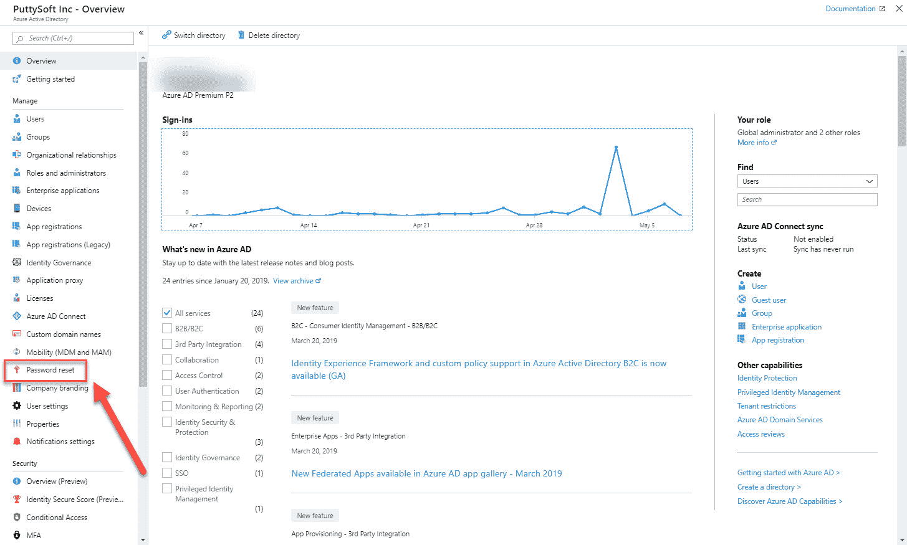

选择密码重置

1.  在密码重置概览面板中，你可以通过选择**全部**来为所有用户启用自助密码重置，或者通过选择**选定的**为特定用户和组启用。为了演示，启用所有用户并点击顶部菜单中的**保存**，如下所示：

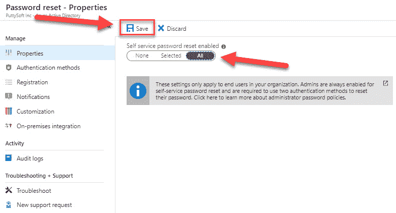

为所有用户启用自助密码重置

1.  接下来，我们需要为用户设置不同的认证方法。为此，在**管理**下，选择**认证方法**。

1.  在下一个面板中，我们可以设置重置密码所需的认证方法数量以及可供用户选择的认证方法，如下所示：

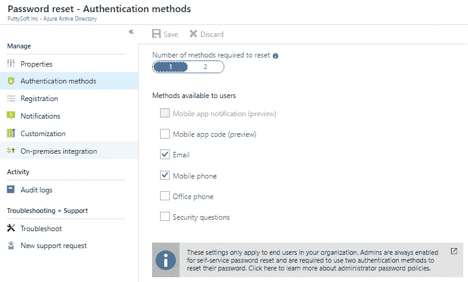

不同的认证方法

1.  进行选择并点击**保存**。

如果你想在配置后测试自助密码重置，请确保使用没有管理员权限的用户账户。

我们现在已经为所有用户配置了自助密码重置功能，位于我们的 Azure AD 租户中。在下一部分，我们将管理 Azure AD 中的设备设置。

# Azure AD Join

使用 Azure AD Join，你可以直接将设备加入 Azure AD，而无需将其加入本地的 Active Directory 来实现混合环境。虽然在某些场景下，混合 Azure AD Join 和本地 AD 仍然是优选方案，但 Azure AD Join 简化了设备添加，并使设备管理现代化。这有助于减少设备相关的 IT 成本。用户通过他们的设备访问公司资产。为了保护这些公司资产，你需要控制这些设备。这让管理员确保用户仅通过符合安全和合规标准的设备访问资源。

当你希望使用云设备管理解决方案来管理设备、现代化应用程序基础设施、简化地理分布用户的设备配置，并且你的公司正在采用 Microsoft 365 作为用户生产力套件时，Azure AD 加入是一个不错的解决方案。

# 管理设备设置

Azure AD 提供了确保用户从符合公司安全和合规标准的设备访问 Azure 资源的能力。设备管理是基于设备的条件访问的基础，通过它，你可以确保仅从已管理的设备访问你的环境中的资源。

设备设置可以从 Azure 门户进行管理。要管理设备设置，设备需要注册或加入 Azure AD。

要从 Azure 门户管理设备设置，必须执行以下步骤：

1.  通过打开[`portal.azure.com`](https://portal.azure.com)来导航到 Azure 门户。

1.  在左侧菜单中，选择**Azure Active Directory**。

1.  在 Azure AD 概述页面的“管理”下，选择“设备”，如下所示：

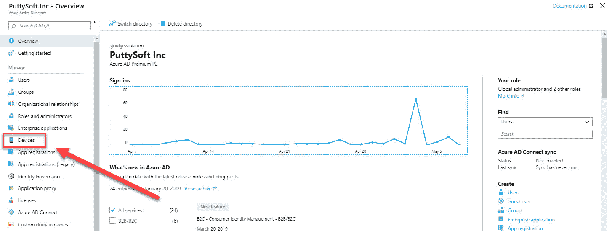

从菜单中选择设备

1.  设备管理页面将会打开。在这里，你可以配置设备管理设置、定位设备、执行设备管理任务，并查看与设备管理相关的审计日志。

1.  要配置设备设置，从左侧菜单中选择**设备设置**。在这里，你可以配置以下设置，如下图所示：

    +   **用户可以将设备加入 Azure AD**：在这里，你可以设置哪些用户可以将他们的设备加入 Azure AD。此设置仅适用于 Windows 10 上的 Azure AD 加入。

    +   **在加入 Azure AD 的设备上添加额外的本地管理员**：在这里，你可以选择哪些用户被授予设备的本地管理员权限。被选择的用户会自动被添加到 Azure AD 中设备管理员的角色。Azure AD 中的全局管理员和设备所有者默认被授予本地管理员权限（这是 Azure AD Premium 的选项）。

    +   **用户可以将他们的设备注册到 Azure AD**：此设置需要配置，以允许设备注册到 Azure AD。这里有两个选项：**无**，即当设备没有加入 Azure AD 或是混合 Azure AD 加入时，不允许注册；以及**所有**，即所有设备都可以注册。如果你配置了 Microsoft Intune 或 **移动设备管理**（**MDM**） for Office 365 服务，则选择**所有**，**无**将不可用。

    +   **要求使用多因素身份验证来加入设备**：在这里，你可以设置要求用户在注册设备时执行多因素身份验证。在启用此设置之前，必须为注册设备的用户配置多因素身份验证。

    +   **设备的最大数量**：此设置允许您选择用户在 Azure AD 中可以拥有的最大设备数量：

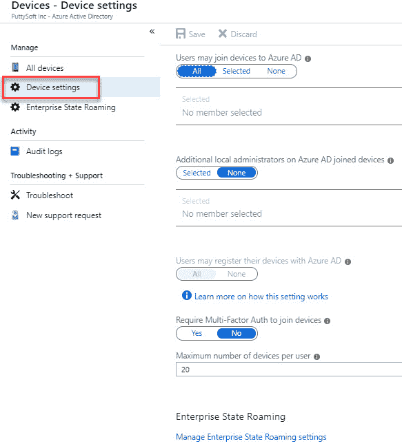

设备设置概述

1.  要查找您的设备，在**管理**下选择**所有设备**。在此概览中，您将看到所有已加入和已注册的设备，如下所示：

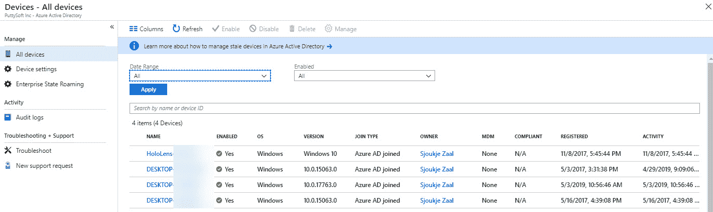

定位设备

1.  您还可以从列表中选择不同的设备，以获取有关设备的更详细信息。在此，全球管理员和云设备管理员可以**禁用**或**删除**设备，如下所示：

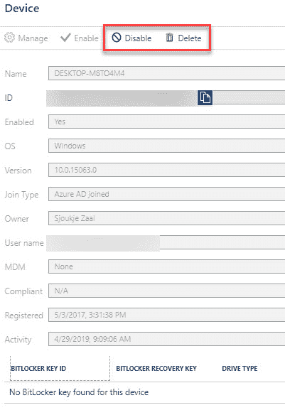

设备信息

1.  对于审计日志，在**活动**下，选择**审计日志**。从这里，您可以查看和下载不同的日志文件。您还可以创建过滤器以便在日志中进行搜索，如下所示：

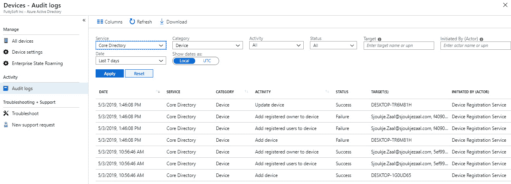

审计日志

我们现在已经查看了所有已注册或加入 Azure AD 的设备的不同管理和配置选项。在接下来的部分，我们将介绍如何将自定义域添加到 Azure AD。

# 添加自定义域名

Azure 为每个在订阅中创建的 Azure AD 租户创建初始域名。该域名由租户名称组成，后跟 `onmicrosoft.com`（例如，`packtpub.onmicrosoft.com`）。您无法更改或删除初始域名，但可以向您的 Azure AD 租户添加自定义域名。

该自定义域名可以在第三方域名注册商处注册，注册后，您可以将其添加到 Azure AD 租户中。

要从 Azure 门户向 Azure AD 添加自定义域，您必须执行以下步骤：

1.  打开 [`portal.azure.com`](https://portal.azure.com) 进入 Azure 门户。

1.  在左侧菜单中，选择**Azure Active Directory**。

1.  在 Azure AD 概览面板中，选择**管理**下的**自定义域名**。要添加自定义域名，请选择顶部菜单中的**+ 添加自定义域**按钮，如下所示：

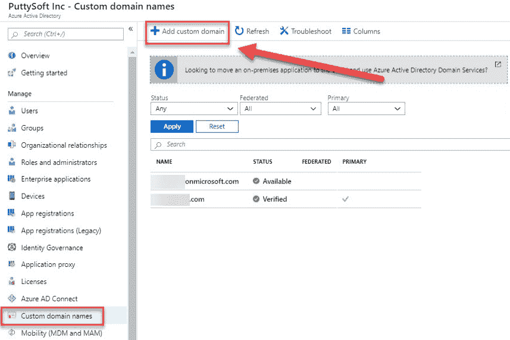

添加自定义域

1.  在自定义域名字段中输入自定义域名（例如，`packtpub.com`），然后选择**添加域名**，如下所示：

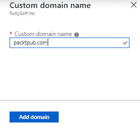

提供自定义域名

1.  将自定义域名添加到 Azure AD 后，您需要在域名注册商的 DNS 设置中创建一个 TXT 记录。前往您的域名注册商并添加从复制的 TXT 文件中获取的 Azure AD DNS 信息。为您的域名创建此 TXT 记录*验证*了您对该域名的所有权。创建 TXT 文件后，点击**验证**，如下所示：

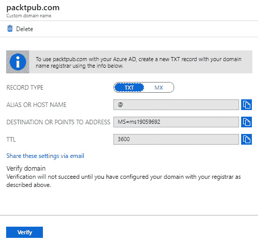

验证域名所有权

1.  在验证您的自定义域名后，您可以删除验证 TXT 或 MX 文件。

我们现在已经为我们的 Azure AD 租户配置了自定义域名。你的用户现在可以使用这个域名登录他们可以访问的各种 Azure 资源。

# 总结

在本章中，我们介绍了*管理身份*目标的第一部分。我们讲解了 Azure AD 的各个方面。你已经学习了如何添加用户和组，如何添加来宾用户，以及如何在 Azure AD 中管理设备。我们还介绍了如何从 Azure 门户向 Azure AD 租户添加自定义域名。

在下一章中，我们将介绍本考试目标的第二部分。在本章中，我们将讨论如何实施和管理混合身份。

# 问题

请回答以下问题，以测试你对本章内容的理解。你可以在本书最后的*评估*部分找到答案：

1.  如果你想使用 PowerShell 创建来宾用户，必须使用`New-AzureADMSInvitation`命令集。

    +   是的

    +   不是

1.  如果你希望使用 Azure AD 加入你的设备，首先需要在混合环境中配置本地 AD 环境，并与 Azure AD 配合使用。

    +   是的

    +   不是

1.  当你向 Azure AD 添加自定义域时，需要通过向你的域注册商的 DNS 设置中添加 TXT 记录来验证它。

    +   是的

    +   不是

# 进一步阅读

你可以查看以下链接，获取更多关于本章中介绍的主题的信息：

+   *Azure Active Directory 文档：* [`docs.microsoft.com/en-us/azure/active-directory/`](https://docs.microsoft.com/en-us/azure/active-directory/)

+   *使用 Azure Active Directory 添加或删除用户：* [`docs.microsoft.com/en-us/azure/active-directory/fundamentals/add-users-azure-active-directory`](https://docs.microsoft.com/en-us/azure/active-directory/fundamentals/add-users-azure-active-directory)

+   *Azure Active Directory 版本 2 命令集用于组管理：* [`docs.microsoft.com/en-us/azure/active-directory/users-groups-roles/groups-settings-v2-cmdlets`](https://docs.microsoft.com/en-us/azure/active-directory/users-groups-roles/groups-settings-v2-cmdlets)

+   *快速入门：使用 PowerShell 添加来宾用户：* [`docs.microsoft.com/en-us/azure/active-directory/b2b/b2b-quickstart-invite-powershell`](https://docs.microsoft.com/en-us/azure/active-directory/b2b/b2b-quickstart-invite-powershell)

+   *快速入门：自助密码重置：* [`docs.microsoft.com/en-us/azure/active-directory/authentication/quickstart-sspr`](https://docs.microsoft.com/en-us/azure/active-directory/authentication/quickstart-sspr)

+   *如何：规划你的 Azure Active Directory 加入实施：* [`docs.microsoft.com/en-us/azure/active-directory/devices/azureadjoin-plan`](https://docs.microsoft.com/en-us/azure/active-directory/devices/azureadjoin-plan)

+   *Azure Active Directory 中的设备管理是什么？* [`docs.microsoft.com/en-us/azure/active-directory/devices/overview`](https://docs.microsoft.com/en-us/azure/active-directory/devices/overview)

+   *使用 Azure Active Directory 门户添加您的自定义域名：* [`docs.microsoft.com/en-us/azure/active-directory/fundamentals/add-custom-domain`](https://docs.microsoft.com/en-us/azure/active-directory/fundamentals/add-custom-domain)
