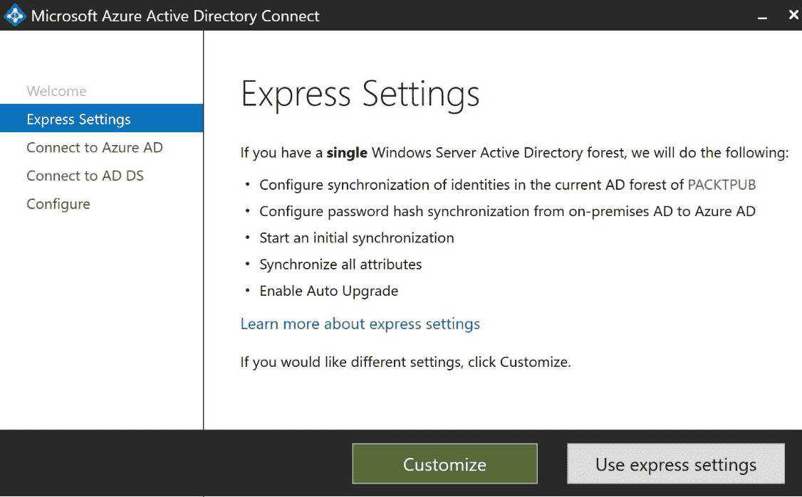

# 第十五章：实现和管理混合身份

在上一章中，我们介绍了如何管理 **Azure Active Directory** (**Azure AD**)。本章继续进行 *身份管理* 目标。在本章中，我们将介绍如何实施和管理混合身份。我们将安装和配置 Azure AD Connect，将本地 Active Directory 中的身份同步到 Azure AD。然后，您将学习如何管理 Azure AD Connect。在本章的最后部分，我们将深入探讨密码同步和密码回写。您将学习如何在 Azure AD Connect 和 Azure 门户中启用密码同步。最后，您将学习如何管理密码同步。

本章将涵盖以下主题：

+   Azure AD Connect

+   安装 Azure AD Connect

+   管理 Azure AD Connect

+   管理密码同步和密码回写

# Azure AD Connect

Azure AD Connect 是一个服务，您可以用它将本地 Active Directory 身份与 Azure 同步。这样，您可以使用相同的身份在本地环境和云端进行身份验证，还可以访问其他 **软件即服务** (**SaaS**) 应用程序。

Azure AD Connect 同步服务由两部分组成：Azure AD Connect 同步组件，它是安装在您本地环境中的独立服务器上的工具；以及 Azure AD Connect 同步服务，它是 Azure AD 的一部分。同步组件可以将数据从 Active Directory 和 SQL Server 同步到 Azure。此外，还有一个名为 **Active Directory 联合服务** (**ADFS**) 的第三个组件，可以在涉及 ADFS 的场景中使用。为了监控本地身份基础架构和不同的 Azure AD 组件，您可以使用名为 Azure AD Connect Health 的工具。下图展示了 Azure AD Connect 的架构：

Azure AD Connect 架构

Azure AD Connect 提供支持，让用户可以使用相同的密码登录本地和云端资源。它提供了三种不同的身份验证方法：密码哈希同步方法、通过身份验证方法和联合单点登录（SSO）方法（结合 ADFS 使用）。

# Azure AD 密码哈希同步

大多数组织仅需启用用户登录到 Office 365、SaaS 应用程序以及其他基于 Azure AD 的资源。密码哈希同步方法非常适合这些场景。

使用此方法时，用户密码的哈希值会在本地 Active Directory 和 Azure AD 之间同步。当用户的密码发生更改时，密码会立即同步，这样用户就能始终使用相同的凭据登录本地环境和 Azure。

这种身份验证方法还提供 Azure AD 无缝**单一登录**（**SSO**）。通过这种方式，用户在使用公司网络中的域加入设备时会自动登录。用户只需要在使用无缝 SSO 时输入用户名。要使用无缝 SSO，您无需在本地网络上安装额外的软件或组件。您可以通过组策略将此功能推送给用户。

# Azure AD 通行身份验证

Azure AD 通行身份验证提供与 Azure AD 密码哈希同步相同的功能。用户可以使用相同的凭据登录 Azure 资源以及本地资源。不同之处在于，使用通行身份验证时，密码不会与 Azure AD 同步。密码是通过本地的 Active Directory 进行验证的，完全不会存储在 Azure AD 中。

这种方法适用于具有安全性和合规性限制的组织，且不允许将用户名和密码发送到本地网络以外的地方。通行身份验证要求在域加入的 Windows 服务器上安装代理，该服务器位于本地环境内。然后，代理监听密码验证请求，并仅从网络内部进行出站连接。它还支持**多重身份验证**（**MFA**）和 Azure AD 条件访问策略。

Azure AD 通行身份验证也提供 Azure AD 无缝 SSO。

在下一节中，我们将安装 Azure AD Connect 并将一些本地用户同步到 Azure。

# 安装 Azure AD Connect

Azure AD Connect 安装在安装并配置了 Active Directory 的本地服务器上。第一步是下载 Azure AD Connect。下载后，我们可以将其安装到域控制器上。

在本演示中，我已经在 Azure 中部署了一个 Windows Server 2016 虚拟机，并在其上安装并配置了 Active Directory。配置 Active Directory 超出了考试和本书的范围。确保在配置 Active Directory 域服务时，林名称与 Azure AD 中现有的已验证自定义域之一匹配。否则，当你在域控制器上安装 Azure AD Connect 时，会收到一条警告信息，提示未为用户启用 SSO。要在 Windows Server 2016 机器上安装 Active Directory，请参阅以下网站：[`blogs.technet.microsoft.com/canitpro/2017/02/22/step-by-step-setting-up-active-directory-in-windows-server-2016/`](https://blogs.technet.microsoft.com/canitpro/2017/02/22/step-by-step-setting-up-active-directory-in-windows-server-2016/)。

因此，请按照以下步骤操作：

1.  在下载 Azure AD Connect 之前，至少向本地 Active Directory 添加一个用户。

1.  要下载 Azure AD Connect，您可以参考以下网站：[`www.microsoft.com/en-us/download/details.aspx?id=47594`](https://www.microsoft.com/en-us/download/details.aspx?id=47594)。下载后将其存储在您的域控制器的本地磁盘上，并运行`AzureADConnect.msi`。

1.  安装向导以欢迎屏幕开始。选中复选框以同意许可条款：

Azure AD Connect 欢迎屏幕

1.  在下一个屏幕中选择**使用快速设置**：

使用快速设置安装 Azure AD Connect

1.  在下一个屏幕上，提供 Azure AD 的全局管理员帐户的用户名和密码（此帐户必须是学校或组织帐户，不能是 Microsoft 帐户或其他类型的帐户），然后点击**下一步**：

提供全局管理员凭据

1.  在连接到 AD DS 屏幕上，输入企业管理员帐户的用户名和密码，并点击**下一步**，如下所示：

输入企业管理员帐户

最后一屏将概述将要安装的内容，如下所示：

准备配置

1.  点击**安装**。

1.  这将把 Azure AD Connect 安装到您的域控制器上。配置后，用户帐户同步到 Azure AD 的过程将自动开始。

1.  配置成功后，您将看到以下结果：

配置完成

1.  点击**退出**关闭安装程序。

在本演示中，我们在本地域控制器上安装了 Azure AD Connect。在接下来的部分，我们将从 Azure 门户管理它。

# 管理 Azure AD Connect

在本地域控制器上安装和配置后，可以通过 Azure 门户管理 Azure AD Connect。要管理它，您需要按照以下步骤操作：

1.  通过打开 [`portal.azure.com`](https://portal.azure.com) 导航到 Azure 门户。

1.  在左侧菜单中，选择**Azure Active Directory**。

1.  在**管理**下，选择**Azure AD Connect**。在 Azure AD Connect 面板中，如下图所示，您可以看到同步已启用，最后一次同步发生在不到一小时之前，并且密码哈希同步已启用：

Azure AD Connect 设置

1.  您还可以在**用户登录**下设置三种身份验证方法。在这里，您可以将身份验证方法设置为**联合身份验证**、**无缝单点登录**或**直通身份验证**。您可以在**健康状况和分析**下监控本地基础设施和同步服务的健康状态。

1.  要检查用户是否已同步，您可以进入用户概览面板。在这里，您会看到已同步的用户，如下截图所示：

已同步的用户

Azure AD Connect 同步通过调度程序同步本地目录中的更改。有两个调度程序进程，一个用于密码同步，另一个用于对象/属性同步和维护任务。有关如何配置此功能或使用 PowerShell 创建自定义调度程序的更多信息，请参阅以下教程：[`docs.microsoft.com/en-us/azure/active-directory/hybrid/how-to-connect-sync-feature-scheduler`](https://docs.microsoft.com/en-us/azure/active-directory/hybrid/how-to-connect-sync-feature-scheduler)。

在本次演示中，我们从 Azure 门户管理了 Azure AD Connect。在接下来的部分中，我们将详细介绍如何管理密码回写。

# 密码回写

密码回写用于将 Azure AD 中的密码更改同步回本地 Active Directory 环境。此设置作为 Azure AD Connect 的一部分启用，并提供了一种安全的机制，将密码更改从 Azure AD 发送回本地 Active Directory。

它提供以下功能和能力：

+   **强制实施本地 Active Directory 密码策略**：当用户重置密码时，会检查本地 Active Directory 策略，以确保密码满足密码要求后才会提交到目录。它会检查密码的复杂性、历史记录、密码过滤器、密码年龄以及本地 Active Directory 中定义的其他密码限制。

+   **零延迟反馈**：如果用户更改密码后，其密码不符合本地 Active Directory 策略要求，系统会立即通知用户。这是一个同步操作。

+   **支持管理员从 Azure 门户重置密码时的密码回写**：当管理员在 Azure 门户中重置密码时，密码会被写回到本地 Active Directory（当用户是联合身份认证或密码哈希同步时）。此功能不适用于 Office 管理门户。

+   **无需任何入站防火墙规则**：密码回写通过 Azure 服务总线与本地 Active Directory 通信，因此无需打开防火墙。所有通信均为出站，并通过 `443` 端口进行。

+   **支持通过访问面板和 Office 365 更改密码**：当联合身份认证或密码哈希同步用户更改密码时，这些密码也会回写到本地 Active Directory。

在接下来的演示中，我们将启用密码回写。

# 管理密码回写

要启用密码回写，我们需要对本地域控制器上的 Azure AD Connect 配置以及 Azure 门户进行一些更改。

# 在 Azure AD Connect 中启用密码回写

要在 Azure AD Connect 中启用密码回写，我们需要执行以下步骤：

1.  使用**远程桌面**（**RDP**）登录到本地域控制器，并再次启动 Azure AD Connect 向导。

1.  在**欢迎使用 Azure AD Connect**页面上，选择**配置**，如下所示：

欢迎屏幕

1.  在额外任务屏幕上，选择**自定义同步** **选项**，并选择**下一步**，如下所示：

额外任务屏幕

1.  提供 Azure AD 全局管理员凭据，并选择**下一步**，如下所示：

提供管理员凭据

1.  在**连接你的目录**屏幕上，选择**下一步**，如下所示：

连接你的目录

1.  在“域和 OU 筛选”屏幕上，再次选择**下一步**，如下所示：

域和 OU 筛选屏幕

1.  在**可选功能**屏幕上，选中**密码回写**旁边的框，并选择**下一步**，如下所示：

启用密码回写

1.  在**准备配置**页面上，选择**配置**。

1.  配置完成后，选择**退出**。

我们现在已在域控制器上启用了密码回写。在接下来的部分中，我们也将在 Azure 门户中启用它。

# 在 Azure 门户中启用密码回写

要在 Azure 门户中启用密码回写，我们需要执行以下步骤：

1.  通过打开 [`portal.azure.com`](https://portal.azure.com) 导航到 Azure 门户。

1.  在左侧菜单中，选择**Azure Active Directory**。

1.  在**管理**下，选择**密码重置**，如下所示：

在 Azure 门户中重置密码

1.  在密码重置窗格中，选择**管理**下的**本地集成**。将**是否将密码回写到本地目录？**选项设置为**是**，并将**是否允许用户在不重置密码的情况下解锁账户？**选项设置为**是**，如下所示：

启用密码回写

1.  点击**保存**。

我们现在已经完全配置了 Azure AD Connect 和 Azure 门户中的密码回写。在接下来的部分中，我们将讨论如何管理密码同步。

# 密码同步

在本章的最后部分，我们将讨论密码同步。我们使用**快速设置**选项安装了 Azure AD Connect。如果使用此选项，则会自动启用密码哈希同步。

如果你使用自定义设置安装 Azure AD Connect，密码哈希同步将在用户登录屏幕上提供，并且你可以在此处启用，如下图所示：

在安装过程中启用密码哈希同步

# 概述

在本章中，我们涵盖了 *管理身份* 目标的第二部分。我们讲解了 Azure AD Connect，你已经学会了如何安装和管理它。此外，我们还讨论了如何启用密码回写和密码哈希同步。

在下一章中，我们将讨论本考试目标的第三部分也是最后一部分。本章将介绍如何在 Azure 中实现 **多因素身份验证** (**MFA**)。

# 问题

请回答以下问题，以测试你对本章信息的理解。你可以在本书末尾的 *评估* 部分找到答案：

1.  如果你在安装 Azure AD Connect 时使用快速设置，密码哈希同步默认是禁用的。

    +   是的

    +   不是

1.  当你想启用密码同步时，只需在 Azure 门户内进行设置。

    +   是的

    +   不是

1.  如果本地 Forest 名称与任何 Azure AD 自定义域名不匹配，则无法安装 Azure AD Connect。

    +   是的

    +   不是

# 进一步阅读

你可以查看以下链接，获取关于本章所涉及主题的更多信息：

+   *什么是与 Azure Active Directory 的混合身份？*：[`docs.microsoft.com/en-us/azure/active-directory/hybrid/whatis-hybrid-identity`](https://docs.microsoft.com/en-us/azure/active-directory/hybrid/whatis-hybrid-identity)

+   *什么是与 Azure AD 的联合身份？*：[`docs.microsoft.com/en-us/azure/active-directory/hybrid/whatis-fed`](https://docs.microsoft.com/en-us/azure/active-directory/hybrid/whatis-fed)

+   *什么是与 Azure AD 的密码哈希同步？*：[`docs.microsoft.com/en-us/azure/active-directory/hybrid/whatis-phs`](https://docs.microsoft.com/en-us/azure/active-directory/hybrid/whatis-phs)

+   *使用 Azure Active Directory 传递身份验证进行用户登录*：[`docs.microsoft.com/en-us/azure/active-directory/hybrid/how-to-connect-pta`](https://docs.microsoft.com/en-us/azure/active-directory/hybrid/how-to-connect-pta)

+   *Azure AD Connect 同步：了解和自定义同步*：[`docs.microsoft.com/en-us/azure/active-directory/hybrid/how-to-connect-sync-whatis`](https://docs.microsoft.com/en-us/azure/active-directory/hybrid/how-to-connect-sync-whatis)

+   *Azure AD Connect 用户登录选项*：[`docs.microsoft.com/en-us/azure/active-directory/hybrid/plan-connect-user-signin`](https://docs.microsoft.com/en-us/azure/active-directory/hybrid/plan-connect-user-signin)

+   *教程：启用密码回写*：[`docs.microsoft.com/en-us/azure/active-directory/authentication/tutorial-enable-writeback`](https://docs.microsoft.com/en-us/azure/active-directory/authentication/tutorial-enable-writeback)

+   *通过 Azure AD Connect 同步实现密码哈希同步*: [`docs.microsoft.com/en-us/azure/active-directory/hybrid/how-to-connect-password-hash-synchronization`](https://docs.microsoft.com/en-us/azure/active-directory/hybrid/how-to-connect-password-hash-synchronization)
