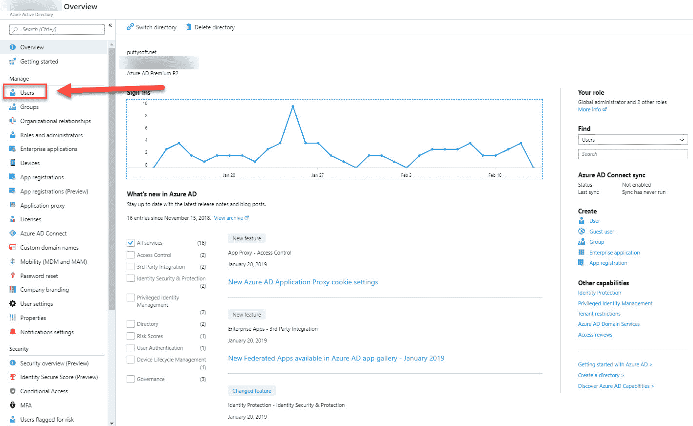
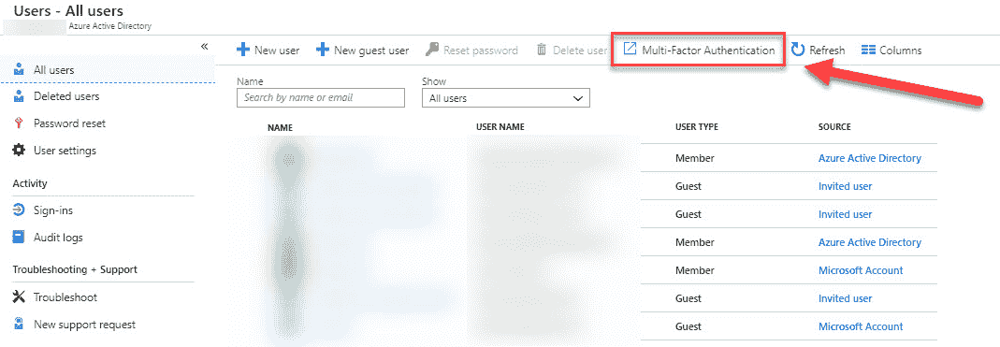
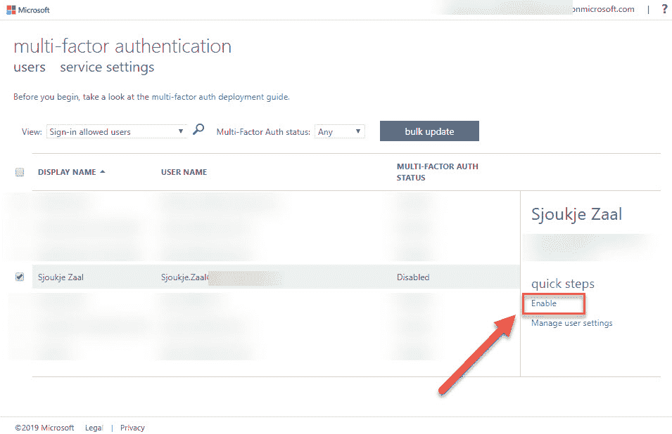
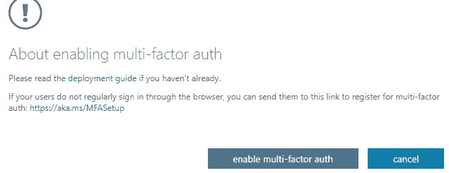
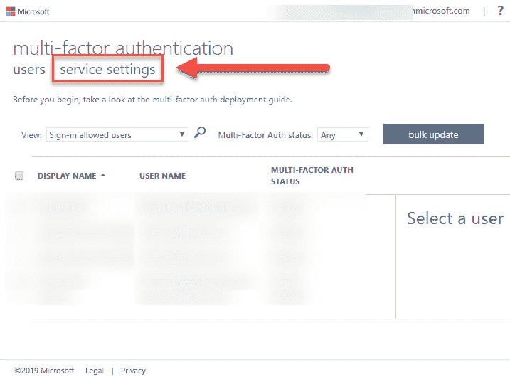
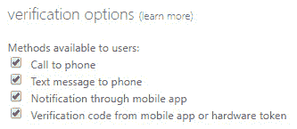
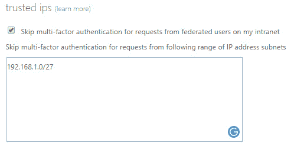
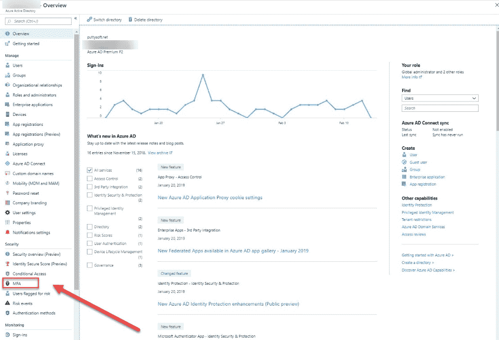
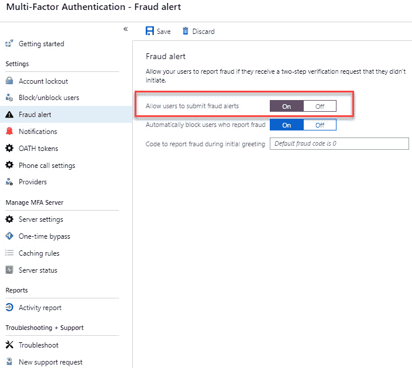
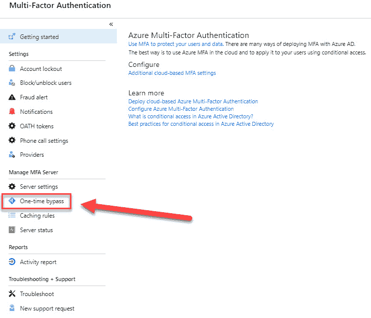

# 第十六章：实施多重身份验证

在上一章中，我们介绍了*身份管理*目标的第二部分。您已经学习了如何安装 Azure AD Connect 并如何进行管理。

本章涵盖了本目标的最后一部分，也是本书的最后一章。在本章中，我们将重点介绍 Azure 中的**多重身份验证 (MFA)**，以便您可以为 Azure 资源的注册和登录体验添加第二层安全性。我们将探讨不同的验证方法以及如何进行配置。我们还将配置欺诈警报，以便用户可以报告尝试欺诈访问其资源的行为。最后，我们将配置受信任的 IP 地址，以绕过 MFA。

本章将覆盖以下主题：

+   Azure MFA

+   配置 MFA 用户账户

+   配置验证方法

+   配置欺诈警报

+   配置绕过选项

+   配置受信任的 IP 地址

# Azure MFA

MFA 是一种安全功能，需要多种身份验证方法。您可以使用它为用户登录添加额外的安全层。它启用了两步验证，用户首先使用他们知道的东西（如密码）登录，然后使用他们拥有的东西（如智能手机）或某些人体特征（如生物识别）进行验证。

Azure MFA 保持了用户的简便性，同时通过要求第二种身份验证形式提供额外的安全性，帮助保护数据和应用程序。它提供了管理员可以配置的多种方法，管理员可以决定是否对用户进行 MFA 挑战。

Azure MFA 是以下产品的一部分：

+   **Azure Active Directory Premium 许可证**：通过此许可证，您可以使用 Azure MFA 服务（云端）和 Azure MFA 服务器（本地）。后者更适用于已安装**Active Directory 联邦服务**（**ADFS**）的组织，并需要管理基础设施组件。

+   **Azure Active Directory 全局管理员**：MFA 功能的一个子集适用于 Azure 中的管理员账户。

+   **Office 365 的 MFA**：Office 365 用户可以使用 MFA 功能的一个子集。

使用 Azure MFA，您可以使用以下验证方法：

| **验证方法** | **描述** |
| --- | --- |
| 语音电话 | 向用户的注册电话拨打电话，用户需要输入 PIN 码进行验证。 |
| 短信 | 向用户的手机发送包含六位数验证码的短信。用户需要在登录页面填写此验证码。 |
| 移动应用通知 | 向用户的智能手机发送验证请求。必要时，用户将输入 PIN 码并选择**验证**。 |
| 移动应用验证代码 | 用户的智能手机上的移动应用将显示一个验证代码，每 30 秒刷新一次。用户将选择最新的代码并输入登录页面。 |
| 第三方令牌 | Azure MFA 服务器可以配置为接受第三方安全令牌。 |

在接下来的部分中，我们将为 Azure AD 租户启用 MFA，配置用户帐户、配置欺诈警报，并配置绕过选项。

本章中的演示将使用 Azure Active Directory Premium P2 许可证。

# 为 Azure AD 租户启用 MFA

以下是为你的用户、数据和应用程序启用 MFA 的三种不同选项：

+   **使用条件访问策略**：你可以使用条件访问策略来启用 MFA。可以在用户或应用程序级别启用此功能。你还可以使用条件访问策略为安全组或所有外部用户启用 MFA。此功能适用于高级 Azure AD 许可证。

+   **在用户级别**：此选项将在本章的下一部分中详细介绍。这是启用 MFA 的传统方法。使用此方法，用户每次登录时都需要执行 MFA。当设置了条件访问策略时，此方法会覆盖它们。

+   **使用 Azure AD 身份保护**：使用此选项，你将基于所有云应用程序的登录风险创建一个 Azure AD 身份保护风险策略。如果已创建条件访问策略，它也会被覆盖。此选项需要 Azure Active Directory P2 许可证。

# 为 MFA 配置用户帐户

Azure MFA 在 Azure AD 的用户级别启用。要为 Azure AD 中的用户帐户启用 MFA，请执行以下步骤：

1.  通过打开[`portal.azure.com/`](https://portal.azure.com/)导航到 Azure 门户。

1.  转到“所有服务”，然后输入`Azure Active Directory`并打开 Azure AD 资源。

1.  在 Azure AD 面板中，选择“管理”下的“用户”，如下所示：

Azure AD 用户设置

1.  在“所有用户”面板中，在顶部菜单选择“多重身份验证”，如下所示：

选择多重身份验证

1.  然后你将被重定向到多重身份验证门户。在那里，选择一个用户并点击屏幕右侧的“启用”，如下所示：

为用户启用 MFA

1.  点击链接后，你将收到以下警告：

警告窗口

1.  点击启用多重身份验证以激活此用户的 MFA。

现在我们已经为用户启用 MFA，我们可以查看如何配置验证方法。

# 配置验证方法

验证方法也在 Azure MFA 门户中配置，就像你在上一步为用户帐户启用 MFA 一样。请按以下步骤操作：

1.  在仍然打开 MFA 门户的情况下，从顶部菜单中选择 服务设置，如下所示：

MFA 门户服务设置

1.  在 验证选项 下，您可以选择希望为用户启用的方法。默认情况下，启用了所有验证选项，如下所示：

MFA 验证选项

1.  如果您希望禁用某些选项，请取消勾选相应的复选框并单击 保存 按钮。

我们已经了解了如何配置用户在 Azure 中使用 MFA 时可以使用的验证方法。在接下来的部分中，我们将介绍如何配置受信任的 IP 地址。

# 配置受信任的 IP 地址

受信任的 IP 地址由 Azure AD 租户的管理员使用。此选项将为从受信任的 IP 地址（例如公司内网）登录的用户跳过 MFA。

受信任的 IP 地址可以通过 MFA 门户中的服务设置页面进行配置。按照以下步骤操作：

1.  在前一个演示中仍保持服务器设置页面打开，在 受信任的 IP 地址 下，勾选名为 “跳过来自联合用户在我的内网的多重身份验证请求” 的复选框。然后，在列表中添加一个 IP 地址或一系列 IP 地址，如下所示：

受信任的 IP 地址设置

1.  单击 保存 按钮以保存您的设置。

在接下来的部分中，我们将讲解如何在 Azure 门户中配置欺诈警报。

# 配置欺诈警报

使用欺诈警报功能，用户可以通过电话或移动应用报告欺诈性尝试访问其资源。这是 MFA 服务器（本地）功能。

欺诈警报通过 Azure 门户进行配置，在 Azure Active Directory 设置中。按照以下步骤操作：

1.  通过打开 [`portal.azure.com`](https://portal.azure.com) 来导航到 Azure 门户。

1.  选择 所有服务，然后在搜索框中输入 `Azure Active Directory` 并打开设置。

1.  在 安全性 下，选择 MFA，如下所示：

Azure AD 中的 MFA

1.  开始使用面板会自动打开。在 设置 下，选择 欺诈警报。

1.  打开 欺诈警报 设置页面。在这里，您可以启用用户提交欺诈警报，如下所示：

启用提交欺诈警报

1.  单击 保存 按钮以保存设置。

我们现在已经了解了如何允许用户提交欺诈警报。在接下来的部分中，我们将讲解如何配置跳过选项。

# 配置跳过选项

使用一次性跳过功能，用户可以进行一次身份验证并跳过 MFA。此设置是 临时 的，在指定的秒数后将自动过期。这可以在手机或移动应用无法接听电话或接收通知的情况下作为解决方案。

此设置也可以通过以下方式在 Azure 门户中的 Azure Active Directory 设置中配置：

1.  通过打开 [`portal.azure.com`](https://portal.azure.com) 导航到 Azure 门户。

1.  选择“所有服务”，然后在搜索框中输入`Azure Active Directory`并打开设置。

1.  在“管理 MFA 服务器”下，选择“一次性绕过”，如下所示：

一次性绕过

1.  在设置页面中，输入用户名，包括完整的域名，例如`username@domain.com`。指定绕过应持续的秒数以及绕过的原因。

1.  点击“添加”按钮。时间限制将立即生效。

我们现在已经讲解了如何进行一次身份验证并通过一次性绕过功能绕过 MFA。

# 总结

在本章中，我们讲解了如何通过配置 Azure 中的用户帐户来管理身份这一目标的最后部分。我们讨论了不同的身份验证方法，并为我们的用户启用了它。最后，我们查看了绕过 MFA 的多种方式，例如受信任的 IP 地址。

通过本章所学的知识，你应该能够通过 AZ-103 考试。不要忘了查看每章末尾的*进一步阅读*部分，因为那里有很多额外信息，考试中也可能涉及。

# 问题

回答以下问题，以测试你对本章内容的理解。你可以在本书末尾的*评估*部分找到答案：

1.  你可以为特定的 IP 地址添加受信任的 IP 地址，以绕过 MFA 启用吗？

    +   是的

    +   不是

1.  不能使用条件访问策略启用 MFA。

    +   是的

    +   不是

1.  欺诈警报是否是 MFA 服务器（本地）功能的一部分？

    +   是的

    +   不是

# 进一步阅读

你可以查看以下链接，获取更多关于本章涉及主题的信息：

+   *工作原理：Azure 多重身份验证*：**[`docs.microsoft.com/en-us/azure/active-directory/authentication/concept-mfa-howitworks`](https://docs.microsoft.com/en-us/azure/active-directory/authentication/concept-mfa-howitworks)

+   *规划基于云的 Azure 多重身份验证部署*：[`docs.microsoft.com/en-us/azure/active-directory/authentication/howto-mfa-getstarted`](https://docs.microsoft.com/en-us/azure/active-directory/authentication/howto-mfa-getstarted)

+   *配置 Azure 多重身份验证设置*：[`docs.microsoft.com/en-us/azure/active-directory/authentication/howto-mfa-mfasettings`](https://docs.microsoft.com/en-us/azure/active-directory/authentication/howto-mfa-mfasettings)

+   *什么是 Azure Active Directory 中的条件访问？*：[`docs.microsoft.com/en-us/azu`](https://docs.microsoft.com/en-us/azure/active-directory/conditional-access/overview)[re/active-directory/conditional-access/overview](https://docs.microsoft.com/en-us/azure/active-directory/conditional-access/overview)

+   *快速入门：使用 Azure Active Directory 条件访问要求特定应用启用 MFA*：[`docs.microsoft.com/en-us/azure/active-directory/conditional-access/app-based-mfa`](https://docs.microsoft.com/en-us/azure/active-directory/conditional-access/app-based-mfa)
