# 第一章。开始使用 OpenShift

本章展示了多个教程，向你展示如何使用 Web 控制台和`rhc`命令行客户端开始使用 OpenShift。你将学习如何通过点击按钮托管自己的 WordPress 博客，如何进行源代码更改并部署它们，以及如何使用`rhc`命令行客户端执行基本操作。本章的具体教程包括：

+   创建 OpenShift Online 账户

+   使用 Web 控制台创建 OpenShift 域

+   使用 Web 控制台创建 WordPress 应用程序

+   使用 Web 控制台上传 SSH 密钥

+   使用 SSH 密钥密码短语

+   将应用程序克隆到本地机器

+   部署你的首次变更

+   检查应用程序的 gear 配额和限制

+   安装 OpenShift rhc 命令行客户端

+   使用 rhc 设置 OpenShift 账户

+   在 rhc 命令行客户端中启用自动完成功能

+   使用 rhc 查看账户详情

+   指定不同的 OpenShift 服务器主机名

+   更新 rhc

# OpenShift 简要介绍

几年前，我想写一个 Web 应用程序，处理关于一部电影的推文流，并输出整体情感分析。这可以帮助我决定是否应该观看一部电影。所以，我研究了一个托管服务提供商，发现我可以从 Amazon 租用几台虚拟机来托管我的 Web 应用程序。这是我进入云计算世界的开始。云计算允许访问共享池的计算资源（包括硬件和软件），这些资源通过网络作为服务提供，采用按需付费、弹性扩展（即可以上下调整规模）和按需使用的模式。云计算有三种交付模型：

+   **基础设施即服务（IaaS）**：这是最基本的交付模型，用户可以配置计算、存储和其他资源（如网络）来运行应用程序，但用户必须安装并管理运行该应用程序所需的应用程序堆栈。IaaS 的例子包括 Amazon EC2、Google Compute Engine 和 Rackspace。

+   **平台即服务（PaaS）**：PaaS 为开发者提供一个应用程序开发平台，帮助他们利用平台提供的运行时、工具、库和服务来构建应用程序。PaaS 的例子包括 OpenShift、Cloud Foundry 和 Heroku。

+   **软件即服务（SaaS）**：SaaS 是一组在云端运行的应用程序（或软件），作为服务提供给用户。SaaS 的例子包括 Google Apps 和 Microsoft Office 365。

作为开发者，我喜欢 PaaS 的概念，因为它使我能够将技能集中于应用程序代码，只需关注代码编写，其他的如应用程序堆栈和基础设施管理则交给他人处理。

OpenShift 是一个开源的、多语言支持的、可扩展的 PaaS 平台，由 Red Hat 提供。撰写本书时，OpenShift 官方支持 Java、Ruby、Python、Node.js、PHP 和 Perl 编程语言运行时，支持 MySQL、PostgreSQL 和 MongoDB 数据库，并提供众多其他功能。除了所有支持的服务，OpenShift 用户还可以通过市场（[`marketplace.openshift.com/home`](https://marketplace.openshift.com/home)）尝试并使用由不同合作伙伴管理的其他云服务。合作伙伴支持的服务包括数据库服务，如可扩展的 PostgreSQL 作为服务（ElephantSQL），以及 SendGrid 的电子邮件服务。

OpenShift 是一个涵盖三个子项目的大平台，这三个子项目以不同的方式将 OpenShift 技术交付给用户、开发者和社区成员。每个子项目的描述如下：

+   **OpenShift Origin**：OpenShift Origin 是一个开源项目，采用 Apache License 2.0 协议，并由社区支持，它是 OpenShift 的上游源项目，供 OpenShift Online 和 OpenShift Enterprise 使用。该项目可在 GitHub 上找到，网址为[`github.com/openshift`](https://github.com/openshift)。

+   **OpenShift Online**：OpenShift Online 是 OpenShift 的公共管理版本。它运行在 Amazon EC2 上，使用经过硬化和稳定的 OpenShift Origin 版本。每个 OpenShift Online 用户都可以享受一个免费计划，该计划允许用户访问三台小型实例，配备 512 MB 的 RAM 和 1 GB 的磁盘空间。OpenShift Online 还可以通过 Bronze 和 Silver 计划作为商业服务提供。商业计划允许用户获得更多资源、存储空间和 Red Hat 专业支持。你可以在[`www.openshift.com/products/pricing`](https://www.openshift.com/products/pricing)了解 OpenShift Online 的定价。

+   **OpenShift Enterprise**：OpenShift Enterprise 是由 Red Hat 全面支持的私有 PaaS 解决方案，可以运行在企业硬件上。OpenShift Enterprise 可以帮助企业提高敏捷性，满足其业务应用需求。

本书将主要聚焦于 OpenShift Online，但所有的操作示例适用于这三个版本。

作为开发者，你可以通过以下四种方式与 OpenShift 进行交互：

+   **Web 控制台**：这是使用 OpenShift 的最简单方式，因为它不要求你在机器上安装任何软件。你可以登录 Web 控制台并开始创建应用程序。在撰写本书时，Web 控制台缺少命令行工具中的所有功能。

+   **rhc 命令行工具**：这是一个与 OpenShift 交互的命令行工具，作为 Ruby gem 提供。它是与 OpenShift 交互的最强大方式，因为它暴露了所有 OpenShift 的功能。

+   **IDE 集成**：如果你是一个喜欢在 IDE 中进行大部分编码的开发人员，那么你会很高兴地知道 OpenShift 与多种 IDE（如 Eclipse、IntelliJ IDEA、Zend Studio 和 Titanium Studio）有着一流的集成。

+   **REST API**：你可以使用 OpenShift REST API 编写自己的客户端。你可以使用此 API 为 IDE（如 NetBeans）编写插件，或编写另一个命令行客户端。你可以在[`access.redhat.com/knowledge/docs/en-US/OpenShift/2.0/html-single/REST_API_Guide/index.html`](https://access.redhat.com/knowledge/docs/en-US/OpenShift/2.0/html-single/REST_API_Guide/index.html)查看 REST API 文档。

重要的 OpenShift 组件如下图所示：

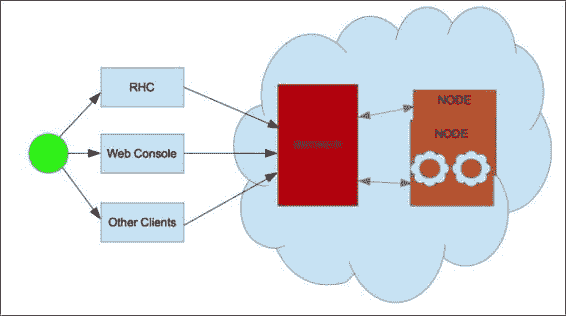

如上图所示，开发人员通过其中一个客户端接口与 OpenShift 进行交互，即 Web 控制台、`rhc`命令行客户端或 IDE 支持。OpenShift 有以下三个主要组件：

+   **Broker**：所有客户端通过代理使用一个定义明确的 REST 接口与代理进行交互。代理负责所有的应用管理活动。它是一个基于 Ruby on Rails 的应用程序，负责管理用户登录、DNS 管理和一般的应用编排。

+   **Node**：这是一组 RHEL 实例，提供多租户环境以供最终用户应用使用。

+   **Gear**：Gear 是一个在节点内部运行的安全容器，用于托管用户应用。它受到 CPU、磁盘空间和内存的限制。

### 注意

代理和节点使用 ActiveMQ 消息队列进行通信。它们都安装了 MCollective 客户端，以便互相发送指令。

现在你已经了解了 OpenShift 是什么，以及如何使用它，接下来让我们开始第一章。本章提供了一系列教程，帮助你快速掌握必要的知识，使用 OpenShift 创建云应用。你将学习如何通过 Web 控制台创建第一个 OpenShift 应用，使用 Git 克隆应用，进行第一次源代码修改，并最终将该修改部署到 OpenShift。如果这是你第一次使用 OpenShift，你会惊讶于在 OpenShift 上创建和部署应用的速度。本章还将介绍如何安装`rhc`命令行客户端，并使用它执行一些基本操作。

# 创建 OpenShift Online 账户

在本教程中，你将学习如何创建一个 OpenShift Online 账户。你可以免费注册 OpenShift Online 账户；所需的只是一个有效的电子邮件地址。

## 准备工作

创建 OpenShift Online 账户时，你需要一个 Web 浏览器和一个有效的电子邮件地址。

## 如何操作…

按照以下步骤创建 OpenShift Online 账户：

1.  打开一个网页浏览器，访问注册页面 [`www.openshift.com/app/account/new`](https://www.openshift.com/app/account/new)。

1.  输入创建新账户所需的详细信息，然后提交表单。

1.  注册后，你将收到一封包含验证链接的电子邮件。点击验证链接以验证你的电子邮件地址。这将会将浏览器重定向到一个网页，要求你接受使用 OpenShift Online 的法律条款，如下所示的截图所示：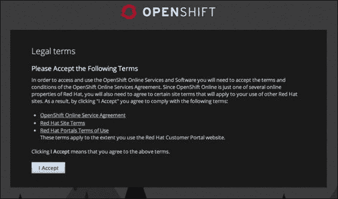

1.  点击 **我接受** 按钮，浏览器将重定向到入门网页。

    ### 注意

    如果你没有收到验证电子邮件，请确保检查你的 `垃圾邮件` 文件夹。

## 如何工作…

在本配方中，你学习了如何创建一个 OpenShift Online 账户。从用户的角度来看，OpenShift Online 是开始使用 OpenShift 最简单的方式，因为你无需部署和管理自己的 OpenShift 安装。

当你注册 OpenShift Online 时，你将与一个免费计划关联。写本书时，Red Hat 会给每个用户提供三个免费硬件资源，用于运行应用程序。硬件资源提供了一个受限的容器来运行一个或多个应用程序模块。应用程序模块提供了运行应用程序所需的实际功能。OpenShift Online 当前支持许多应用程序模块，如 JBoss、Tomcat、PHP、Ruby、Python、MongoDB、MySQL 等。硬件资源为应用程序模块提供内存和磁盘空间。写本书时，每个硬件资源有 512 MB 的内存和 1 GB 的磁盘空间。用户可以升级到 Bronze 或 Silver 计划，以获取更多和更大的资源。你可以参考 [`www.openshift.com/products/pricing for up to date information`](https://www.openshift.com/products/pricing%20for%20up%20to%20date%20information) 来获取最新的定价信息。

## 另见

+   *使用 Web 控制台创建 OpenShift 域* 配方

+   *使用 Web 控制台创建 WordPress 应用程序* 配方

# 使用 Web 控制台创建 OpenShift 域

创建 OpenShift Online 账户后，第一步是创建一个域。域或命名空间是应用程序的逻辑容器。它是应用程序 URL 的一部分，并且在一个账户中是唯一的。在本配方中，你将学习如何使用 Web 控制台创建一个域。

## 准备工作

打开 OpenShift Online 登录页面 [`openshift.redhat.com/app/login`](https://openshift.redhat.com/app/login) 在你喜欢的网页浏览器中，然后使用你的 OpenShift Online 凭证登录。

## 如何操作…

1.  要创建一个域或命名空间，请访问账户设置网页 [`openshift.redhat.com/app/console/settings`](https://openshift.redhat.com/app/console/settings)，并输入一个唯一的名称。域或命名空间在所有用户中应该是唯一的。这意味着你不能使用 `osbook` 作为域名，因为与本书相关联的 OpenShift 账户已经使用了 `osbook`。

    点击**保存**按钮以创建一个新域名，如下截图所示：

    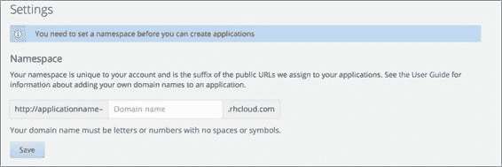

1.  在域名创建后，你会看到屏幕上显示一条消息，**域名 'osbook' 已创建**。其中的 `osbook` 会被替换为你的域名。

## 它是如何工作的……

OpenShift 要求你在创建应用程序之前先拥有一个域名。域名是 OpenShift 帐户下应用程序的逻辑容器。所有 OpenShift 应用程序必须属于一个域名。每个域名在所有 OpenShift 用户中都是唯一的，并且是应用程序 URL 的一部分。例如，如果你的应用程序名称是`myapp`，域名是`osbook`，那么你的应用程序 URL 将是`http://myapp-osbook.rhcloud.com`。一个域名最多可以包含 16 个字母数字字符，不能包含空格或符号。有时它也被称为命名空间。

用户可以加入其他 OpenShift 用户创建的域名。这允许用户以团队的方式工作。根据 OpenShift 计划或配置，用户可以创建多个域名。免费计划不允许用户创建多个域名，但你仍然可以加入其他域名。我们将在第二章中详细讨论域名，*管理域名*。

你可以在应用程序设置网页上查看创建的域名，网址为[`openshift.redhat.com/app/console/settings`](https://openshift.redhat.com/app/console/settings)。如下截图所示：


## 还有更多内容…

在这个配方中，你学会了如何使用网页控制台创建域名。你可以通过点击域名链接查看域名的详细信息。以下截图展示了域名的详细信息：

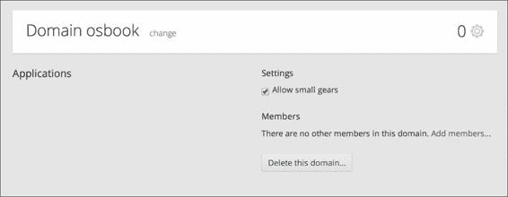

在前面的截图中，你可以看到没有任何应用程序与此域名关联。根据免费计划配置，你只能使用小型设备。如果你取消选中**允许小型设备**复选框，那么你将无法创建任何应用程序。你还可以通过点击**添加成员…**链接邀请其他用户加入你的域名。团队协作将在第二章中详细讲解，*管理域名*。你也可以通过点击**删除此域名…**按钮来删除域名。

## 另见

+   第二章中的*使用 rhc 创建域名*配方，*管理域名*

+   第二章中的*使用 rhc 查看域名详细信息*配方，*管理域名*

+   第二章中的*使用 rhc 将编辑成员添加到域名*配方，*管理域名*

# 使用网页控制台创建 WordPress 应用

在本食谱中，您将通过网页控制台创建您的第一个 OpenShift 应用程序。如*简介*部分所述，网页控制台是 OpenShift 的一个 Web 界面，开发者可以利用它快速创建和管理应用程序。您将使用 OpenShift 的 WordPress 快速启动来创建一个完全配置的应用程序。如果您还没有博客，现在是时候为自己创建一个免费的个人博客了。

## 准备工作

在您喜欢的网页浏览器中打开[`openshift.redhat.com/app/login`](https://openshift.redhat.com/app/login)的登录网页，并使用您的 OpenShift 凭证登录。

## 如何操作…

按照以下步骤通过网页控制台创建 WordPress 应用程序：

1.  访问[`openshift.redhat.com/app/console/applications`](https://openshift.redhat.com/app/console/applications)的应用程序网页，并点击**立即创建您的第一个应用程序**链接。

1.  在**即时应用**部分，点击**WordPress 3.9**即时应用。本文书写时，WordPress 的版本是 3.9，如下图所示：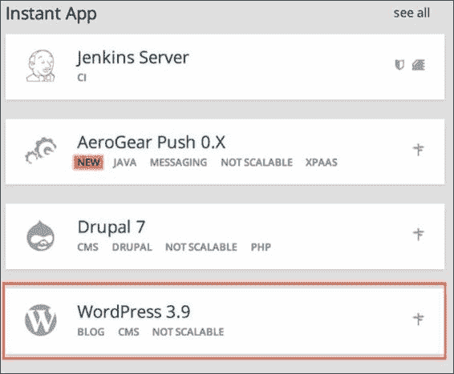

1.  输入博客名称并点击**创建应用程序**按钮。我使用`blog`作为 WordPress 应用程序的名称，如下图所示：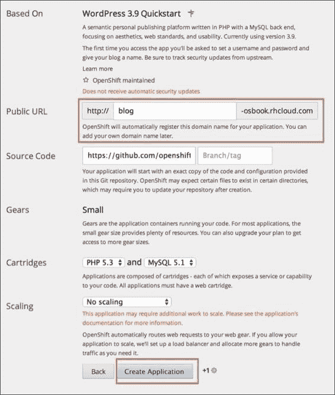

1.  应用程序创建完成后，您将被引导到一个页面，展示 MySQL 连接的详细信息。您可以通过点击**继续查看应用程序概览页面**来查看新创建的应用程序详情。

1.  您的 WordPress 博客现在可以在`http://blog-{domain-name}.rhcloud.com/`运行。将`{domain-name}`替换为您的 OpenShift 账户域名。

## 它是如何工作的…

快速启动是一个预配置的 OpenShift 应用程序，它提供了一种可重复的方式，通过源代码和依赖项（如数据库）快速创建一个应用程序。您可以在[`www.openshift.com/quickstarts`](https://www.openshift.com/quickstarts)查看积极维护的快速启动列表。请注意，OpenShift 团队不支持这些快速启动。它们仅帮助您在 OpenShift 上运行您喜爱的项目（主要是开源项目）。在本食谱中，您使用 WordPress 快速启动来快速搭建一个 WordPress 应用程序。您在网页控制台中选择了 WordPress 3.x 快速启动并给它起了个名字。应用程序名称最多可以包含 32 个字母数字字符。WordPress 快速启动使用一个公共的 Git 仓库，该仓库安装 WordPress 应用程序。它还定义了所使用的组件。WordPress 快速启动使用 PHP 5.3 和 MySQL 5.1 组件。

要创建一个应用程序，点击**创建应用程序**按钮。这将为我们创建一个名为 gear 的应用程序容器，并设置所有必要的 SELinux 策略和 cgroups 配置。OpenShift 还将使用 quickstart 公共 Git 仓库来设置一个私有 Git 仓库。它将在应用程序 gear 上安装 MySQL 数据库。quickstart 源代码通过环境变量引用 MySQL 数据库。你将在第三章，*创建和管理应用程序*中学习有关 OpenShift 应用程序的详细信息。

最后，OpenShift 将传播 DNS 到外部世界。该应用程序将可以通过`http://blog-{domain-name}.rhcloud.com/`访问。将`{domain-name}`部分替换为你自己独特的 OpenShift 域名，通常也称为命名空间。在你最喜欢的浏览器中打开`http://blog-{domain-name}.rhcloud.com/`链接并设置你的 WordPress 安装。设置完成后，你将拥有自己的 WordPress 博客并可以开始写博客。

## 还有更多…

在本教程中，你学习了如何使用 OpenShift Web 控制台创建一个 WordPress 应用程序。你还可以通过转到**应用程序**标签并点击应用程序来查看应用程序的详细信息，如下图所示：

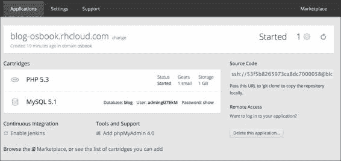

在前面的截图中，你可以看到应用程序的状态，即**已启动**。你可以通过点击**已启动**旁边的重启按钮来重新启动应用程序。该应用程序使用的是 PHP 5.3 和 MySQL 5.1 卡带。要查看数据库密码，可以点击**显示**网页链接。要添加 phpMyAdmin 4.0 MySQL Web 客户端，请点击**添加 phpMyAdmin 4.0**网页链接。接下来，点击**添加卡带**按钮来添加 phpMyAdmin 4.0 卡带。

该卡带将可通过`https://blog-{domain-name}.rhcloud.com/phpmyadmin/`访问。phpMyAdmin 的凭据与数据库凭据相同。

## 另见

+   *使用 Web 控制台上传 SSH 密钥* 这篇教程

+   *将应用程序克隆到本地机器* 这篇教程

+   *部署你的第一次更改* 这篇教程

# 使用 Web 控制台上传 SSH 密钥

**安全外壳协议**（**SSH**）是一种网络协议，它保证了两台通过不安全网络连接的计算机之间的强大身份验证、数据加密和数据完整性。它采用客户端-服务器架构，并透明地加密客户端和服务器之间的数据。SSH 客户端通过加密的网络连接与 SSH 服务器通信。市面上有许多免费和商业产品实现了 SSH 协议。SSH 有多种身份验证机制，其中 OpenShift 使用的是公钥-私钥对认证机制。其他 SSH 认证方法，如密码认证和基于主机的认证，不在本书的范围内。

在此配方中，你将学习如何创建公私密钥对，并将公钥上传到你的 OpenShift 账户。OpenShift 使用 SSH 用于以下目的：

+   提供你机器与应用设备之间的安全加密连接

+   允许远程访问你的应用设备

+   使用你的应用 Git 仓库并将代码部署到 OpenShift

+   端口转发，允许用户从自己的机器连接到 OpenShift 服务，如数据库等

## 准备工作

为了完成此配方，你需要在机器上安装 OpenSSH SSH 连接工具。这些工具在大多数 Linux 安装、Macintosh OS X 和几乎所有 Unix 衍生操作系统中都很常见。微软 Windows 也有许多免费的和商业的 SSH 客户端，具体可以参考[`www.openssh.com/windows.html`](http://www.openssh.com/windows.html)。此外，如果你在 Windows 机器上使用 PuTTY，可以参考[`www.openshift.com/developers/install-and-setup-putty-ssh-client-for-windows`](https://www.openshift.com/developers/install-and-setup-putty-ssh-client-for-windows)上的官方文档。

为了验证是否安装了 OpenSSH 客户端工具，运行以下命令：

```
$ ssh -V
OpenSSH_6.2p2, OpenSSL 1.0.1e-fips 11 Feb 2013

```

### 注意

前述命令的输出将取决于你的操作系统和你机器上安装的 OpenSSH 版本。如果出现`ssh: command not found`，则表示工具没有安装在你的机器上。

此配方将使用前述配方中创建的 WordPress 应用程序。

## 如何操作…

执行以下步骤：

1.  运行`ssh-keygen`命令生成一对新的 SSH 密钥。`ssh-keygen`命令是 OpenSSH 安装的 SSH 工具之一。该命令将在用户的主目录下的`.ssh`文件夹中生成一个密钥对：

    ```
    $ ssh-keygen -t rsa -b 2048 -C 'SSH keys to connect with OpenShift'

    ```

1.  访问[`openshift.redhat.com/app/console/settings`](https://openshift.redhat.com/app/console/settings)的**设置**网页，并粘贴公钥内容。公钥是扩展名为`.pub`的密钥。粘贴公钥内容后，点击**保存**按钮。

1.  访问[`openshift.redhat.com/app/console/applications`](https://openshift.redhat.com/app/console/applications)的**应用程序**网页，并点击应用程序查看详情，如下图所示：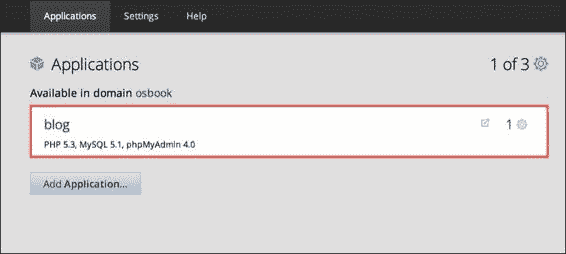

1.  接下来，通过点击**想要登录到你的应用程序吗？**来查看应用程序的 SSH 详情，如下图所示：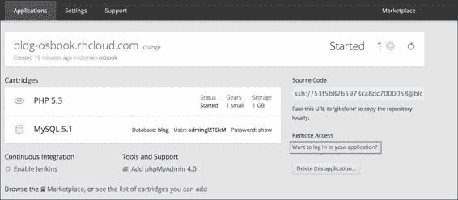

1.  复制以下截图所示的应用程序 SSH 信息：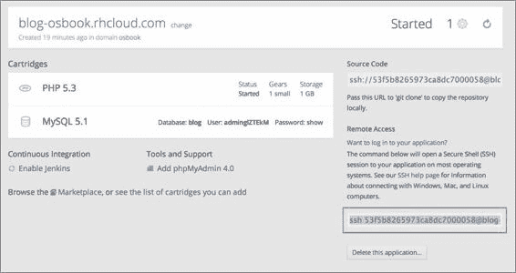

1.  在你的本地机器上打开一个新的命令行终端，并运行以下命令。在这里，你将列出应用程序设备主文件夹中的目录。将 SSH 信息替换为你应用程序的 SSH 信息。

    ```
    $ ssh 52b823b34382ec52670003f6@blog-osbook.rhcloud.com ls
    app-deployments
    app-root
    git
    mysql
    php
    phpmyadmin

    ```

## 它是如何工作的…

首先，让我们尝试理解你在上一部分中做了什么。在第一步中，你创建了一对新的 SSH 密钥。`ssh-keygen` 工具可以使用多个选项。以下是使用的三个选项之一：

+   `-t` 选项用于指定密钥的类型。可以选择 RSA 或 DSA 类型，在本例中使用的是 RSA 密钥类型。请注意，OpenShift 支持 RSA 和 DSA 两种密钥类型。

+   `-b` 选项用于指定密钥的位数。对于 RSA 密钥，最小大小为 768 位，默认大小为 2048 位。通常，2048 位被认为足够。

+   `-C` 选项用于提供注释，这对于标识密钥非常有用。该注释会附加到公钥中。

`ssh-keygen` 命令会提示用户回答几个问题，如下所示：

```
$ ssh-keygen -t rsa -b 2048 -C 'SSH keys to connect with OpenShift'
Generating public/private rsa key pair.
Enter file in which to save the key (/home/vagrant/.ssh/id_rsa):
Enter passphrase (empty for no passphrase):
Enter same passphrase again:
Your identification has been saved in /home/vagrant/.ssh/id_rsa.
Your public key has been saved in /home/vagrant/.ssh/id_rsa.pub.
The key fingerprint is:
ad:59:8a:02:e6:94:35:92:a3:b9:94:93:c8:9a:30:47 SSH keys to connect with OpenShift
The key's randomart image is:
+--[ RSA 2048]----+
|                 |
|   .             |
|  E o            |
|o+o= .   .       |
|***     S o      |
|+O..   . =       |
|+ . . . +        |
|     .           |
|                 |
+-----------------+

```

首先，这个命令会要求用户提供 SSH 密钥文件名及其位置。RSA 密钥的默认文件名为 `id_rsa`（私钥）和 `id_rsa.pub`（公钥）。默认存储这些密钥的位置是用户 `home` 目录下的 `.ssh` 文件夹。

其次，它要求用户提供一个密码短语。如果不想使用密码短语，只需按两次 *Enter* 键。密码短语用于保护私钥。如果输入了密码短语，每次执行需要 SSH 的操作时，都将提示输入密码短语。在下一篇教程中，你将学习如何在不每次输入密码短语的情况下使用它。

当你运行任何 SSH 客户端（如 `ssh`）连接到 SSH 服务器时，客户端使用私钥来证明你的身份，而服务器使用公钥进行认证。如果认证成功，连接将继续进行。否则，你将收到错误消息。

在第二步中，你将公钥上传到 OpenShift 账户。OpenShift 会将公钥复制到应用程序装备上的授权文件 `~/.ssh/authorized_keys` 中。之后，当 SSH 客户端请求连接到应用程序装备时，应用程序装备上运行的 SSH 服务器会查阅 `authorized_keys` 文件以查找匹配的公钥。

从第 3 步到第 5 步，你学习了如何使用 Web 控制台查找应用程序的 SSH 信息。在第 6 步，你通过在应用程序装备上执行 `ls` 命令来测试 SSH 连接。第一次连接到 SSH 服务器时，系统会询问是否要连接到该服务器。这是因为客户端不认识该服务器。SSH 客户端会查阅 `~/.ssh/known_hosts` 文件以获取服务器信息。如果该文件中没有条目，它会要求确认，如下所示：

```
$ ssh 52b823b34382ec52670003f6@blog-osbook.rhcloud.com ls

The authenticity of host 'blog-osbook.rhcloud.com (54.221.64.115)' can't be established.
RSA key fingerprint is cf:ee:77:cb:0e:fc:02:d7:72:7e:ae:80:c0:90:88:a7.
Are you sure you want to continue connecting (yes/no)? yes

Warning: Permanently added 'blog-osbook.rhcloud.com,54.221.64.115' (RSA) to the list of known hosts.

app-deployments
app-root
git
mysql
php
phpmyadmin

```

在输入 `yes` 后，一个新条目将添加到 `~/.ssh/known_hosts` 文件中。`known_hosts` 文件在 `~/.ssh/known_hosts` 中充当数据库，客户端会在每次请求时检查此文件中的服务器条目。

### 注意

OpenShift 的 `rhc` 命令行客户端也提供了多种命令来操作 SSH 密钥。一旦安装了 `rhc` 客户端，你可以运行 `rhc sshkey` 命令查看所有支持的操作。

## 还有更多…

你可以选择为 SSH 密钥对使用其他名称或位置。你可以使用 `ssh-keygen` 工具创建另一个 SSH 密钥。这次，将密钥命名为 `openshift_key`：

```
$ ssh-keygen
Generating public/private rsa key pair.
Enter file in which to save the key (/home/vagrant/.ssh/id_rsa): /home/vagrant/.ssh/openshift_key

```

访问 OpenShift 账户设置网页 [`openshift.redhat.com/app/console/settings`](https://openshift.redhat.com/app/console/settings)，并删除现有的密钥，如下图所示：

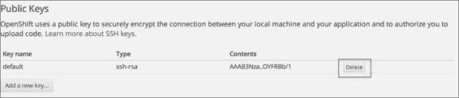

现在，按照之前的讨论，将 `openshift_key.pub` SSH 密钥上传到 OpenShift 账户。

再次运行 `ssh` 命令。这次你会遇到一个错误，因为 SSH 客户端使用默认密钥与 SSH 服务器连接。默认密钥名称为 `id_rsa`。现在，让我们尝试在应用 gear 上运行 `ls` 命令，以确认是否遇到 `Permission denied` 错误：

```
$ ssh 52b823b34382ec52670003f6@blog-osbook.rhcloud.com ls
Permission denied (publickey,gssapi-keyex,gssapi-with-mic).

```

### 提示

若要获取调试信息，请使用以下命令：

```
ssh -v 52b823b34382ec52670003f6@blog-osbook.rhcloud.com ls

```

若要获取更多调试信息，请使用以下命令：

```
ssh -v -v -v 52b823b34382ec52670003f6@blog-osbook.rhcloud.com ls

```

上述命令中的 `–v` 选项数量定义了输出的详细程度。

若要连接应用 gear，必须使用 `openshift_key` 进行连接。要使用其他密钥，请运行以下命令：

```
$ ssh -i /home/vagrant/.ssh/openshift_key 52b823b34382ec52670003f6@blog-osbook.rhcloud.com ls

```

`-i` 选项用于告诉 SSH 客户端选择不同的 SSH 密钥。

## 另见

+   *使用 SSH 密钥密码短语* 配方

# 使用 SSH 密钥密码短语

在 *通过网页控制台上传 SSH 密钥* 配方中，你学会了如何创建一个新的 SSH 密钥对并将其上传到 OpenShift 账户。此 SSH 密钥对是使用空密码短语创建的。密码短语是用来保护私钥的密码。空密码短语避免了每次使用密钥时都需要重新输入密码，但可能会带来一些安全隐患。本配方将引导你完成保护 SSH 密钥的过程，同时避免每次使用密钥时都需要重新输入密码短语。

## 准备工作

要执行本配方，您需要在计算机上安装 OpenSSH SSH 连接工具。

为确保已安装 OpenSSH 客户端工具，请运行以下命令：

```
$ ssh -V
OpenSSH_6.2p2, OpenSSL 1.0.1e-fips 11 Feb 2013

```

上述命令的输出将取决于你计算机上安装的操作系统和 OpenSSH 版本。如果出现 `ssh: command not found`，说明你的计算机上未安装 OpenSSH 工具。

本配方将使用在 *通过网页控制台上传 SSH 密钥* 配方中创建的 WordPress 应用。

## 如何操作…

执行以下步骤以使用 SSH 密钥密码短语：

1.  密码短语可以在创建密钥时添加，也可以添加到现有密钥中，而无需重新生成新的密钥对。由于你已经在*使用 web 控制台上传 SSH 密钥*的教程中创建了密钥对，我们将重用这个密钥对。你将使用`ssh-keygen`将密钥对添加到现有密钥中：

    ```
    $ ssh-keygen -p
    Enter file in which the key is (/home/vagrant/.ssh/id_rsa):
    Key has comment '/home/vagrant/.ssh/id_rsa'
    Enter new passphrase (empty for no passphrase): <Enter passphrase>
    Enter same passphrase again: <Enter passphrase again>
    Your identification has been saved with the new passphrase.

    ```

1.  现在，如果你尝试 SSH 连接到应用程序设备，将会被要求输入密码短语。

1.  接下来，运行 `ssh-agent` 命令。`ssh-agent` 命令是 OpenSSH 工具集的一部分，它用于安全地存储你的密码短语，以便你无需重新输入密码短语。你可以通过输入以下命令来运行 `ssh-agent`：

    ```
    $ ssh-agent $SHELL

    ```

1.  要添加密码短语，请运行 `ssh-add` 工具：

    ```
    $ ssh-add
    Enter passphrase for /home/vagrant/.ssh/id_rsa: <Enter passphrase>
    Identity added: /home/vagrant/.ssh/id_rsa (/home/vagrant/.ssh/id_rsa)

    ```

1.  连接到应用程序设备以查看 SSH 代理的运行。你会注意到此时不再要求输入密码短语：

    ```
    $ ssh 52b823b34382ec52670003f6@blog-osbook.rhcloud.com ls
    app-deployments
    app-root
    git
    mysql
    php
    phpmyadmin

    ```

1.  退出 shell 以结束 `ssh-agent` 会话。如果你现在尝试连接到应用程序设备，将会被要求输入密码短语：

    ```
    $ ssh 52b823b34382ec52670003f6@blog-osbook.rhcloud.com ls
    Enter passphrase for key '/home/vagrant/.ssh/id_rsa':

    ```

## 工作原理…

`ssh-agent` 工具将 SSH 密钥存储在内存中。它缓存私钥，并响应 SSH 客户端的认证查询。`ssh-add` 工具用于向 `ssh-agent` 中添加和移除密钥。在步骤 1 中，你已经将密码短语添加到了现有密钥中。默认情况下，它将使用 `.ssh` 文件夹中的默认密钥 `id_rsa`，但你也可以使用 `-i` 选项提供另一个 SSH 密钥文件。现在，SSH 连接到应用程序设备时，将会要求你输入密码短语：

```
$ ssh 52b823b34382ec52670003f6@blog-osbook.rhcloud.com ls
Enter passphrase for key '/home/vagrant/.ssh/id_rsa':

```

步骤 2 通过分叉现有 shell 启动代理。它设置了 SSH 代理所需的一些环境变量。接下来，在步骤 3 中，你将 SSH 密钥添加到代理中。它会要求输入密码短语以解密私钥。解密后，它将私钥添加到代理的缓存中。

最后，在步骤 4 中，你通过 `ssh` 客户端连接到应用程序设备。这次你不会被要求输入密码短语，因为代理已经缓存了私钥。

你可以终止代理或从 shell 中注销来结束会话。

## 另见

+   *使用 web 控制台上传 SSH 密钥*的教程

# 将应用程序克隆到本地机器

每个 OpenShift 应用程序都有一个私有 Git 仓库，用于存储应用程序的源代码。OpenShift 使用 Git 不仅作为版本控制系统，还利用 Git 的操作钩子来构建和部署应用程序。在本教程中，你将学习如何在本地机器上获取 OpenShift 应用程序的源代码。

## 准备工作

在进行此教程之前，你需要确保操作系统上已安装 Git。对于基于 Debian 的 Linux 发行版，你可以作为 root 用户通过 `apt-get install git` 安装 Git。如果你使用的是 Fedora 或其他基于 Red Hat 的系统，可以通过 `yum install git-core` 作为 root 用户安装 Git。Mac 和 Windows 用户可以从官方下载站点下载 Git 包：[`git-scm.com/downloads`](http://git-scm.com/downloads)。

本步骤将使用在*通过 Web 控制台创建 WordPress 应用程序*步骤中创建的 WordPress 应用程序。

## 如何操作…

执行以下步骤以克隆仓库：

1.  进入 Web 控制台的**应用程序**标签，在[`openshift.redhat.com/app/console/applications`](https://openshift.redhat.com/app/console/applications)中点击应用程序查看其详细信息，如下截图所示：

1.  复制应用程序详情网页上提到的 Git 仓库 URL，如下截图所示：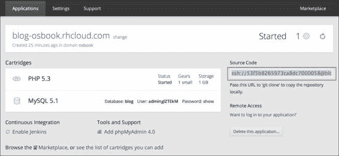

1.  打开命令行终端，进入你机器上的一个方便位置，执行`git clone`命令。将仓库 URL 替换为你的应用程序 Git URL：

    ```
    $ git clone ssh://52b823b34382ec52670003f6@blog-osbook.rhcloud.com/~/git/blog.git/

    ```

## 它是如何工作的…

第一步和第二步帮助我们找到了应用程序的 Git 仓库 URL。如前一部分所述，OpenShift 使用 Git 作为版本控制和源代码管理系统。每个应用程序都有一个私有 Git 仓库。Git 仓库包含所有保持和管理项目修订和历史所需的信息。OpenShift 使用 SSH 传输协议与 Git 仓库协作。为了在本地机器和应用程序设备之间创建安全的通信通道，Git 使用在*通过 Web 控制台上传 SSH 密钥*步骤中讨论的 SSH 密钥设置。除非你将他们的公钥添加到你的账户中，否则没人能够克隆你的应用程序仓库。

在第 3 步中，你通过`clone`命令克隆了应用程序的 Git 仓库。`git clone`命令基于原始应用程序仓库 URL 创建了一个新的 Git 仓库。Git 与其他版本控制系统的区别在于，Git 不仅克隆了工作副本，还克隆了仓库中所有文件的完整副本。`clone`命令将在你的本地文件系统上创建一个与应用程序同名的新目录。

## 还有更多…

你还可以通过`git clone`命令指定不同的文件夹名称。假设你想将应用程序克隆到`myapp`文件夹中。为此，请执行以下命令：

```
$ git clone ssh://52b823b34382ec52670003f6@blog-osbook.rhcloud.com/~/git/blog.git/ myapp

```

如果你想允许任何朋友或团队成员克隆你的仓库，只需将他们的公钥添加到你的账户中。请按照*通过 Web 控制台上传 SSH 密钥*的步骤上传公钥。我们将在第二章中详细讨论团队协作，*管理域*。

## 另见

+   *部署你的第一次更改*步骤

# 部署你的第一次更改

在*将应用程序克隆到本地机器*的步骤中，你学习了如何使用`git clone`命令克隆 OpenShift 应用程序的 Git 仓库。克隆仓库后的下一个逻辑步骤是做出更改，提交更改，最后部署它。在本节中，你将学习如何将源代码更改部署到 OpenShift 应用程序。

## 准备工作

要按照本节操作，你需要在本地机器上安装 Git。

## 如何操作…

执行以下步骤来部署你的第一次更改：

1.  访问 OpenShift Web 控制台，转到 PHP 5.4 应用程序创建页面：[`openshift.redhat.com/app/console/application_type/cart!php-5.4`](https://openshift.redhat.com/app/console/application_type/cart!php-5.4)。

1.  输入应用程序的名称。我使用了`myapp`作为应用程序名称。

1.  点击**创建应用程序**按钮来创建一个新应用程序。

1.  通过按照*将应用程序克隆到本地机器*的步骤，克隆应用程序的 Git 仓库到你的本地机器。

1.  打开应用程序源代码根目录中的`index.php`文件。然后在`index.php`中找到以下那行代码：

    ```
    <h1>Welcome to your PHP application on OpenShift</h1>
    ```

    用这个替换前面的那行代码：

    ```
    <h1>Updated the application</h1>
    ```

1.  使用 Git 将更改提交到本地仓库：

    ```
    $ git commit -am 'modified index.php'

    ```

1.  使用以下 Git 命令将更改推送到托管在 OpenShift 应用程序齿轮上的远程仓库：

    ```
    $ git push origin master

    ```

1.  在`git push`成功完成后，在你喜欢的浏览器中打开`http://myapp-{domain-name}.rhcloud.com/`应用程序。你将看到你第一次的更改。

## 它是如何工作的…

OpenShift 的部署过程基于 Git。从第 1 步到第 4 步，你使用 Web 控制台创建了一个 PHP 5.4 应用程序并将其克隆到本地机器。在第 5 步，你对`index.php`文件做了一个简单的更改，但这个更改尚未提交到本地仓库。Git 作为一个分布式版本控制系统，有本地仓库和远程仓库的概念。你可以继续在本地机器上进行工作（修改和提交），直到你准备好再将更改推送到远程 Git 仓库。

在第 6 步中，你使用`git commit`命令将更改提交到本地 Git 仓库。你使用了`-a`和`-m`选项。`-a`选项告诉`git`命令自动暂存已修改和已删除的文件，但不会处理新文件。要提交一个新文件，你必须先使用`git add`命令将文件暂存，然后再提交：

```
$ git add test.html
$ git commit -m 'new html file'

```

第 7 步将本地提交推送到远程仓库。当你克隆一个仓库时，克隆的仓库会通过名为`origin`的远程保持与其父仓库的连接。远程仓库是对另一个 Git 仓库的引用或标识。远程信息保存在`.git`文件夹下的一个名为`config`的配置文件中。你可以打开`.git/config`文件，查看`origin`远程信息，如下所示：

```
[remote 'origin']
  url = ssh://52bbf209e0b8cd707000018a@myapp-osbook.rhcloud.com/~/git/blog.git/
  fetch = +refs/heads/*:refs/remotes/origin/*
```

如前面的代码所示，远程由两个不同的部分组成。`url` 部分是以 URL 形式表示的远程仓库名称。`fetch` 部分指定了如何将引用从一个仓库的命名空间映射到另一个仓库的命名空间。  

`git push` 命令的输出如下所示：  

```
$ git push origin master
Counting objects: 7, done.
Compressing objects: 100% (4/4), done.
Writing objects: 100% (4/4), 404 bytes | 0 bytes/s, done.
Total 4 (delta 3), reused 0 (delta 0)
remote: Stopping PHP cartridge
remote: Waiting for stop to finish
remote: Stopping MySQL cartridge
remote: Stopping PHPMyAdmin cartridge
remote: Waiting for stop to finish
remote: Building git ref 'master', commit 3933f99
remote: Building PHP cartridge
remote: Preparing build for deployment
remote: Deployment id is b78e5efd
remote: Activating deployment
remote: Starting MySQL cartridge
remote: Starting PHPMyAdmin cartridge
remote: Database already configured.
remote: Starting PHP cartridge
remote: Result: success
remote: Activation status: success
remote: Deployment completed with status: success
To ssh://52bbf209e0b8cd707000018a@blog-osbook.rhcloud.com/~/git/blog.git/
 e83c2a7..3933f99  master -> master

```

这是这个过程的工作方式：  

1.  Git 会获取 `master` 分支的更改，对其进行压缩，并将所有缺失的对象从本地仓库传输到名为 `origin` 的远程仓库。  

1.  接下来，在应用程序 gear 上调用 pre-receive 动作钩子。Git 钩子是自定义脚本，Git 会在特定事件（如 `push`）发生时运行它们。你可以使用 bash、Perl、Python、Ruby 或任何你熟悉的语言编写脚本。pre-receive 钩子会接收所有（新的或旧的）需要更新的 refs 列表。应用程序 gear Git 仓库中的 pre-receive 动作钩子会停止 PHP 和其他 cartridge，检查部署的完整性，并配置部署元数据。

1.  最后，在应用程序 gear 上调用 postreceive 动作钩子。它接收所有已更新的 refs 列表。应用程序 gear Git 仓库中的 postreceive 动作钩子将应用程序仓库归档，构建应用程序，启动 PHP 和其他 cartridge，然后最终部署应用程序。  

## 还有更多…  

你可以使用 `git push` 命令，而不是 `git push origin master` 命令。`origin` 部分是默认远程仓库，`master` 是默认分支，所以这两个部分不是必须的。  

## 另见  

+   *将应用程序克隆到本地机器*配方  

# 检查应用程序的配额和限制  

在这个配方中，你将学习如何检查应用程序的资源限制。  

## 准备工作  

要逐步完成这个配方，你需要在你的机器上安装 OpenSSH SSH 连接工具。这个配方将使用*通过 Web 控制台创建 WordPress 应用程序*配方中创建的 WordPress 应用程序。  

## 如何操作…  

要检查应用程序消耗的资源，请运行以下命令。在这里，你需要将 SSH URL 替换为你的应用程序 SSH URL。要查找你的应用程序的 SSH URL，请参考*使用 Web 控制台上传 SSH 密钥*配方。  

```
$ ssh 52bbf209e0b8cd707000018a@blog-osbook.rhcloud.com quota -s

```

## 工作原理…  

OpenShift 应用程序运行在资源有限的 gears 中。每个 gear 根据其大小有一定的资源。可以使用 `quota -s` 命令来检查应用程序消耗的资源以及施加在 gear 上的限制。  

`quota -s` 命令的输出如下所示：  

```
Disk quotas for user 52bbf209e0b8cd707000018a (uid 2187):
 Filesystem  blocks   quota   limit   grace   files   quota   limit   grace
/dev/mapper/EBSStore01-user_home01
 124M       0   1024M            2898       0   80000

```

第一列是启用了配额的文件系统名称。第二列显示当前用户使用的块数。第四列告诉我们存储限制。免费套餐中的 Gear 访问 1 GB 的磁盘存储空间。第六列显示应用程序创建的文件数量。第八列显示用户可以创建的最大文件数。Gear 最多可以创建 80,000 个文件。Gear 还限制了 RAM 内存。小型 Gear 具有 512 MB 的 RAM，中型 Gear 具有 1 GB 的 RAM，大型 Gear 具有 2 GB 的 RAM。中型和大型 Gear 仅在 Bronze 和 Silver 商业计划中提供。

## 还有更多内容……

您还可以通过运行 `***du***` 命令来查看 Gear 使用了多少磁盘空间：

```
$ ssh 52bbf209e0b8cd707000018a@blog-osbook.rhcloud.com 'du -sh *'

17M	app-deployments

```

# 安装 OpenShift rhc 命令行客户端

`rhc` 客户端是功能最强大、最丰富的命令行客户端工具，用户可以用它与 OpenShift 进行交互。它是使用 Ruby 编程语言构建的，并作为 Ruby gem 包装。`rhc` 的源代码可以在 GitHub 上找到：[`github.com/openshift/rhc`](https://github.com/openshift/rhc)。

## 准备工作

要安装 `rhc`，您需要确保您的机器上安装了 Ruby 1.8.7 或更高版本。您可以通过运行以下命令检查是否已安装 Ruby：

```
$ ruby --version
ruby 2.0.0p247 (2013-06-27 revision 41674) [x86_64-linux]

```

上述命令的输出将取决于您机器上安装的操作系统和 Ruby 版本。如果收到 `ruby: command not found` 的消息，说明您的机器上未安装 Ruby。请在您的操作系统上安装 Ruby。您可以从官方网站 [`www.ruby-lang.org/en/downloads/`](https://www.ruby-lang.org/en/downloads/) 下载适用于您的操作系统的安装包。

## 如何操作……

打开一个新的命令行终端并运行以下命令：

```
$ gem install rhc

```

此命令将安装与 OpenShift 配合使用所需的 `rhc` gem。

## 工作原理……

OpenShift 将 `rhc` 命令行工具打包为 gem。Gem 是一段可重用的代码或命令行工具，帮助自动化任务。`RubyGems` 是 Ruby 编程语言的包管理器，它提供了分发 Ruby 程序和库的标准格式。该软件允许开发者在他们的机器上下载、安装和使用软件包。`gem` 命令使您能够使用 `RubyGems`。

当您运行 `gem install` 命令时，`gem` 命令行工具会从中央仓库获取包及其依赖项并安装它们。中央 gem 仓库可以通过 [`rubygems.org`](http://rubygems.org) 访问。

命令成功执行后，您可以使用以下命令检查 `rhc` 的版本：

```
$ rhc --version
rhc 1.27.4

```

## 还有更多内容……

`gem install` 命令还会生成已安装包的文档。您可以使用 Ruby `ri` 命令行工具离线查看文档。例如，如果您想列出所有 `ri` 可以显示文档的类，请运行以下命令：

```
$ ri --list

```

此命令将列出所有类及其方法，你可以查看相关文档。要查看 `RHC` 类的 `CLI` 类方法的文档，请执行以下命令：

```
$ ri RHC::CLI

```

输出将是 `CLI` 方法的文档，如下所示：

```
= RHC::CLI
(from gem rhc-1.27.4)
------------------------------------------------------------------------------
Run and execute a command line session with the RHC tools.

You can invoke the CLI with:
 bundle exec ruby -e 'require 'rhc/cli'; RHC::CLI.start(ARGV);' -- <arguments>

```

你可以通过使用以下命令禁用文档生成：

```
$ gem install rhc --no-document

```

## 参见

+   *使用 rhc 设置 OpenShift 账户* 教程

+   *更新 rhc* 教程

# 使用 rhc 设置 OpenShift 账户

在*安装 OpenShift rhc 命令行客户端*这一教程中，你学习了如何安装`rhc`命令行客户端。安装完成后，你需要执行的第一步操作是设置 OpenShift 账户。在本教程中，你将学习如何使用`rhc`设置账户。

## 准备工作

完成本教程之前，你需要在你的机器上安装 `rhc`。有关安装说明，请参见*安装 OpenShift rhc 命令行客户端*教程。

## 如何操作…

要设置 OpenShift 账户，请打开命令行终端并运行以下命令：

```
$ rhc setup

```

## 它是如何工作的…

在你能够使用 `rhc` 客户端与 OpenShift 配合使用之前，你必须先设置账户。

`setup`命令执行以下操作：

1.  它首先会要求你提供 OpenShift 凭证，以便认证到 [openshift.redhat.com](http://openshift.redhat.com)。

1.  在成功认证后，`rhc` 会询问是否创建授权令牌。授权令牌使你无需在每次执行命令时输入密码即可访问 OpenShift 服务器。它将令牌存储在用户 `home` 目录下的 `.openshift` 文件夹中。默认情况下，令牌的有效期为 30 天，过期后需要重新认证。

1.  接下来，`setup`命令将在用户的 `home` 目录下的 `.openshift` 文件夹中创建一个名为 `express.conf` 的文件。`express.conf` 文件存储了 `rhc` 所需的基本配置，例如 OpenShift 服务器的位置、你的 OpenShift 用户名，以及是否创建并使用授权令牌。

1.  如果 `~/.ssh` 文件夹中没有 SSH 密钥，则 `rhc` 的 `setup` 命令将使用 `ssh-keygen` 工具生成一个新的密钥对。

1.  在生成新的 SSH 密钥对后，`rhc`会将公钥上传到 OpenShift 服务器。OpenShift 将公钥复制到应用程序硬件上的授权文件 `authorized_keys` 中，路径为 `~/.ssh/authorized_keys`。在*使用 Web 控制台上传 SSH 密钥*这一教程中，你已经使用 Web 控制台上传了公钥。系统会提示你提供密钥名称，或者使用 `setup` 命令生成的默认名称。

1.  接下来，`rhc` 会检查 Git 是否已安装。`rhc setup` 命令会对本地配置和凭据进行简单检查，以确认配置已完成。它还会运行一系列测试，检查 `ssh` 是否已正确配置，以及您的系统是否可以与 OpenShift 服务器通信。

1.  最后，如果用户尚未创建域，`rhc` 会提示用户创建一个。在 *使用 Web 控制台创建 OpenShift 域* 配方中，您通过 Web 控制台创建了该域。

## 还有更多……

在使用 OpenShift 时，您可以随时运行 `rhc` `setup` 命令。每次运行 `rhc` `setup` 命令时，它将使用在 `express.conf` 文件中定义的配置属性。如果您想生成一个新的干净配置，可以使用 `--clean` 选项。这样会重新运行 `setup` 命令，忽略 `express.conf` 中存储的任何已保存的配置选项：

```
$ rhc setup --clean

```

## 另请参见

+   *启用 rhc 命令行客户端的自动完成功能* 配方

+   *使用 rhc 查看帐户详细信息* 配方

+   *指定不同的 OpenShift 服务器主机名* 配方

# 启用 rhc 命令行客户端的自动完成功能

`rhc` 命令行工具支持自动补全功能。这意味着 `rhc` 可以预测用户想要输入的命令，而用户无需完全输入。这对那些不熟悉 `rhc` 支持的所有命令的新用户非常有帮助。在本配方中，您将学习如何为 `rhc` 命令行客户端启用自动补全功能。

### 注意

自动完成功能不适用于 Windows Terminal。

## 准备工作

要按步骤操作此配方，您需要在计算机上安装 `rhc`。有关安装说明，请参阅 *安装 OpenShift rhc 命令行客户端* 配方。

## 如何操作……

要启用自动补全功能，请执行以下步骤：

1.  再次运行 `rhc setup` 命令，并使用 `autocomplete` 选项：

    ```
    $ rhc setup --autocomplete

    ```

1.  上一步将生成一个名为 `bash_autocomplete` 的文件，位于 `~/.openshift` 文件夹中。要启用自动补全，您必须将 `~/.openshift/bash_autocomplete` 这一行添加到您用户主目录下的 `.bashrc` 或 `.bash_profile` 文件中。我在 Fedora 系统上的 `.bashrc` 文件如下所示：

    ```
    # .bashrc
    . ~/.openshift/bash_autocomplete
    # Source global definitions
    if [ -f /etc/bashrc ]; then
    . /etc/bashrc
    fi
    # User specific aliases and functions

    ```

1.  请注意，在 Mac OS X 上，您必须将 `~/.openshift/bash_autocomplete` 添加到 `~/.bash_profile` 文件中。在 Mac OS X 上，新打开的终端窗口和标签始终被视为登录 Shell，因此这是 OS X 用户必须执行的必要步骤。

1.  重新加载或重新启动 Shell 以使这些更改生效。

## 工作原理……

你应该理解前面章节中你所做的操作。在步骤 1 中，你使用`autocomplete`选项运行了`setup`命令。这在`~/.openshift`文件夹中生成了一个名为`bash_autocomplete`的 bash 脚本。这个 bash 脚本定义了一个名为`_rhc`的自定义补全函数，用于`rhc`命令行客户端。当你在提示符下输入`rhc`并按下 Tab 键时，Bash 会执行这个函数，并显示可能的补全项。

在步骤 2 中，你通过将`~/.openshift/bash_autocomplete`添加到`.bashrc`脚本中来加载`bash_autocomplete`文件。这将确保在每个 shell 中都能使用自动补全功能。

最后，在步骤 3 中，你重新启动了 shell 以加载`_rhc`函数。现在，如果你输入`rhc`并按下*Tab*键，它会显示所有`rhc`命令：

```
$ rhc
account                   app-tidy                  deployment-list  member-list // removed all commands for brevity

```

## 还有更多…

大多数`rhc`命令都有可用的选项，你可以提供这些选项。要查看命令的所有选项，可以输入`--`并按*Tab*键。例如，要查看`rhc setup`命令的所有选项，输入`rhc setup --`并按*Tab*键：

```
$ rhc setup --
--autocomplete     --clean            --create-token     --no-create-token  --server

```

## 另请参见

+   *使用 rhc 设置 OpenShift 账户*配方

# 使用 rhc 查看账户详情

在本配方中，你将学习如何使用`rhc`查看账户详情。

## 准备工作

要完成本配方，你需要在你的机器上安装`rhc`。请参考*安装 OpenShift rhc 命令行客户端*配方获取安装说明。

## 如何操作…

要查看账户详情，请运行以下命令`rhc account`：

```
$ rhc account

```

这就是查看账户详情所需做的全部操作。

## 如何工作…

`rhc account`命令显示当前登录用户的详细信息。当你运行该命令时，它会使用在`rhc setup`过程中生成的认证令牌，向 OpenShift REST API 发出 REST 调用。REST API 返回一个 JSON 响应，`rhc`会以易于阅读的格式显示出来：

```
$ rhc account
Login openshift.cookbook@gmail.com on openshift.redhat.com
----------------------------------------------------------
 ID:                 52b8112ae0b8cdc308000018
 Plan:               Free
 Gears Used:         0
 Gears Allowed:      3
 Domains Allowed:    1
 Allowed Gear Sizes: small
 SSL Certificates:   no

```

账户详情包括当前登录用户信息、连接的 OpenShift 服务器、OpenShift 用户 ID、使用的 OpenShift 计划、使用的和允许的 gear 数量及其大小、允许的域名数量以及是否可以使用 SSL 证书等信息。

你还可以通过访问[`openshift.redhat.com/app/account`](https://openshift.redhat.com/app/account)在 Web 控制台中查看账户详情。

## 还有更多…

你还可以通过传递`-l`或`--rhlogin`选项来查看其他 OpenShift 账户的详情。`-l`或`--rhlogin`选项是每个命令都可以使用的全局选项。当你使用`-l`或`--rhlogin`时，会强制`rhc`客户端使用用户指定的登录信息：

```
$ rhc account --rhlogin user@example.com

```

你可以通过使用`rhc account-logout`命令退出当前会话，这将结束用户的当前会话并删除`~/.openshift`文件夹中的授权令牌文件：

```
$ rhc account-logout

```

你也可以使用`rhc logout`作为`rhc account-logout`的简短替代命令。

## 另请参见

+   *使用 rhc 设置 OpenShift 账户*食谱

# 指定一个不同的 OpenShift 服务器主机名

本食谱介绍了如何配置一个不同的 OpenShift 服务器主机名。默认情况下，当你使用`rhc setup`命令设置 OpenShift 账户时，`rhc`会被配置为与公开的 OpenShift PaaS（托管在[openshift.redhat.com](http://openshift.redhat.com)上）一起使用。然而，也可以使用一个不同的 OpenShift 安装版本，这可以是 OpenShift Enterprise 或 OpenShift Origin 的安装。

## 准备工作

要按照本食谱操作，你需要在机器上安装`rhc`。请参考*安装 OpenShift rhc 命令行客户端*食谱中的说明。

## 如何操作…

打开命令行终端，运行以下命令来使用不同的 OpenShift 服务器主机名：

```
$ rhc setup --server <My OpenShift Installation Hostname>

```

将`<My OpenShift Installation Hostname>`替换为 OpenShift 服务器的主机名。

## 它是如何工作的…

`rhc setup`命令有一个选项`--server`，允许用户指定服务器的主机名。当你运行带有新服务器位置的`rhc setup`命令时，`setup`命令将执行所有必要的操作来配置你的 OpenShift 账户，以便与新服务器一起使用。`setup`命令将用新的服务器主机名覆盖`~/.openshift`中的`express.conf`文件。`rhc`客户端将被配置为与新的 OpenShift 服务器一起使用。

## 还有更多…

你还可以通过直接编辑`~/.openshift/express.conf`中的`express.conf`文件来配置服务器。`libra_server`属性如下：

```
# The OpenShift server to connect to
libra_server=openshift.redhat.com
```

将上面的代码更改为新的服务器主机名：

```
# The OpenShift server to connect to
libra_server=<Your OpenShift Installation>
```

## 另请参见

+   *使用 rhc 设置 OpenShift 账户*食谱

+   *使用 rhc 查看账户详情*食谱

# 更新 rhc

OpenShift 命令行工具`rhc`是与 OpenShift 交互的最强大、最流行的方式。在本食谱中，你将学习如何将`rhc`更新到最新版本。OpenShift Online 有一个三周的发布周期，通常情况下，`rhc`客户端工具也会被更新，以支持新特性或修复漏洞。因此，始终使用最新版本的`rhc`会有所帮助。

## 准备工作

为了准备本食谱，你需要一个已经安装好的`rhc`。不需要其他先决条件。

## 如何操作…

要更新`rhc` gem，运行`gem update`命令：

```
$ gem update rhc

```

这就是你需要做的，来将`rhc`命令行更新到最新版本。

## 它是如何工作的…

`rhc`是一个 Ruby gem，而`RubyGems`是一个包管理器，类似于其他许多包管理器。它使用一个中央仓库来托管可安装的软件包。当你运行`gem update`命令时，这个命令行工具会从中央仓库获取最新的软件包并进行安装。

## 还有更多…

当你开始使用`rhc`时，你很快会在你的机器上安装多个版本的`rhc` gem。你可以使用`cleanup`命令卸载所有先前的版本。该命令将卸载本地仓库中已安装的旧版本 gem：

```
$ gem cleanup rhc

```

## 另请参阅

+   *安装 OpenShift rhc 命令行客户端* 配方
