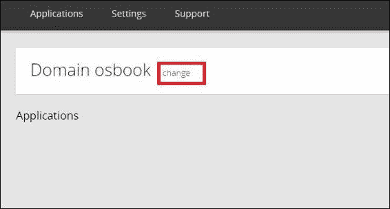
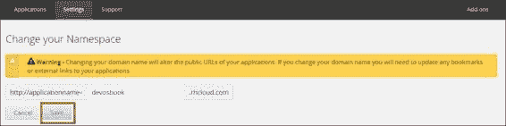
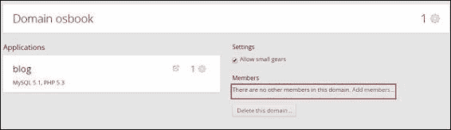
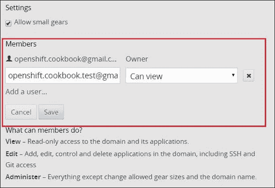
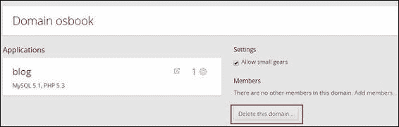

# 第二章：管理域

本章介绍了一些示例，展示了如何开始创建和管理域。你还将学习到域如何帮助你作为团队成员合作并共同完成项目。本章的具体示例包括：

+   使用 rhc 创建一个域

+   使用 rhc 重命名域

+   使用 rhc 查看域的详细信息

+   使用 rhc 将查看成员添加到域中

+   使用 rhc 将编辑成员添加到域中

+   使用 rhc 将管理员成员添加到域中

+   使用 rhc 查看域中的所有成员

+   使用 rhc 从域中移除成员

+   使用 rhc 限制域的 gear 大小

+   使用 rhc 离开一个域

+   使用 rhc 删除域

# 介绍

**域**代表每个用户的唯一名称，每个用户的应用程序必须存在于此域中。OpenShift 用户在拥有有效域之前无法创建应用程序。域名成为应用程序 URL 的一部分。例如，如果你的域名是`foo`，而你的应用程序名是`bar`，则应用程序的 URL 将是`http://bar-foo.rhcloud.com`。每个 OpenShift 账户必须至少与一个域关联。OpenShift Online 的免费套餐不允许用户创建多个域，但付费套餐允许创建多个域。域使用户可以为其应用程序选择任何有效的名称。它们还允许两个或更多用户为他们的应用程序使用相同的名称。例如，用户 A 可以在域`foo`中拥有名为`bar`的应用程序，同样，用户 B 也可以在域`test`中拥有名为`bar`的应用程序。一旦用户拥有有效的域，他们就可以为应用程序使用任何有效的名称。

团队协作是现代软件开发中的核心特性之一。无论你是在做开源项目还是企业项目，你都需要与他人合作。一个团队可能会共同努力，帮助软件项目成功。域使得团队协作成为可能，因为你可以将其他用户添加到你的域中，赋予他们与应用程序协作的权限。这让不同的用户在项目上协作变得非常容易。你可以将用户添加到你的域中，权限可以是查看者、编辑者或管理员。本章的第 4 到第 6 个示例将详细介绍这些内容。

域还帮助我们在应用程序中融入环境的概念。你可以为不同的环境创建不同的域。一个可以用作开发环境，另一个作为质量保证环境，第三个则用于生产环境。这让你可以为不同的人分配不同的访问权限。你的开发人员可以访问开发和质量保证域，但无法访问生产域。

# 使用 rhc 创建一个域

在 第一章中的 *使用 Web 控制台创建 OpenShift 域名* 配方里，你学习了如何使用 Web 控制台创建域名。在本配方中，你将学习如何使用 rhc 命令行创建域名。

## 准备工作

要完成这个配方，你需要在机器上安装 rhc。请参阅 第一章中的 *安装 OpenShift rhc 命令行客户端* 配方，*开始使用 OpenShift*，获取安装说明。如果你使用的是 OpenShift 的免费计划，你必须先删除在 第一章中 *使用 Web 控制台创建 OpenShift 域名* 配方里创建的域名，然后才能继续本配方。这是因为在 OpenShift 的免费计划中，你不能拥有多个域名。要删除一个域名，请运行如下命令。这个命令在本章的 *使用 rhc 删除域名* 配方中有详细说明：

```
$ rhc delete-domain <domain_name> --force

```

## 如何操作…

要创建域名，请打开一个新的命令行终端，并运行以下命令。请提供一个唯一的域名。

```
$ rhc create-domain --namespace <unique_domain_ame>

```

### 注意

如果你在运行此命令时收到 `You may not have more than 1 domain` 错误，删除与你账户关联的现有域名。在免费套餐中，你不能创建多个域名。

## 它是如何工作的…

你可以使用 `rhc domain-create` 或 `rhc create-domain` 命令来创建一个新的域名。创建域名时唯一需要的参数是一个唯一的字母数字名称。请注意，一个域名最多只能包含 16 个字母数字字符，且不能包含空格或符号。

`rhc create-domain` 命令的输出如下所示：

```
$ rhc create-domain --namespace osbook
Creating domain 'osbook' ... done
You may now create an application using the 'rhc create-app' command

```

你可以通过输入以下命令来避免使用 `--namespace` 选项。`rhc` 命令行客户端非常智能，会自动识别你仅提供了必要的参数：

```
$ rhc domain-create osbook

```

## 还有更多…

所有 OpenShift 命令都有帮助文档。要了解 `rhc create-domain` 命令的使用方法以及其所有可用选项，你可以使用 `-h` 或 `--help` 选项。我们将在后续的配方中详细讲解其他选项。

```
$ rhc create-domain --help
Usage: rhc domain-create <namespace>

```

## 另请参见

+   第一章中的 *使用 Web 控制台创建 OpenShift 域名* 配方，*开始使用 OpenShift*

+   *使用 rhc 重命名域名* 配方

+   *使用 rhc 查看域名详情* 配方

+   *使用 rhc 删除域名* 配方

# 使用 rhc 重命名域名

在创建完域名后，你可能需要重命名它。假设你想重命名现有的名称，以反映其环境。例如，你可以将 `osbook` 域名重命名为 `devosbook`，以便表示 `devosbook` 为你的开发环境。

## 准备工作

要完成此教程，你需要在你的机器上安装 rhc。请参考第一章中的*安装 OpenShift rhc 命令行客户端*教程，了解详细步骤，*开始使用 OpenShift*。

## 如何操作…

要重命名一个域，打开一个新的命令行终端，并运行以下命令。你需要提供一个唯一的新域名：

```
$ rhc rename-domain <old_domain_name> <new_domain_name>

```

## 它是如何工作的…

要重命名域，你必须首先确保没有与该域关联的应用程序。如果域上有任何应用程序，你必须先删除它们。要了解如何删除应用程序，请参考第三章中的*删除应用程序*教程，*创建和管理应用程序*。`rename-domain`命令首先删除旧域，然后使用新域名创建一个新域。要将`osbook`域重命名为`devosbook`，你需要运行以下命令：

```
$ rhc domain-rename osbook devosbook
Renaming domain 'osbook' to 'devosbook' ... done

```

## 更多内容…

你也可以通过 Web 控制台重命名域。访问你的域网页 [`openshift.redhat.com/app/console/domain/{domain-name}`](https://openshift.redhat.com/app/console/domain/%7Bdomain-name%7D) 并点击**更改**，如以下截图所示。请将`{domain-name}`替换为你的 OpenShift 账户的域名。



这将引导你进入另一个网页，你可以在其中输入新的域名，正如下面的截图所示。输入新的域名并点击**保存**。



## 另见

+   第一章中的*使用 Web 控制台创建 OpenShift 域*教程，*开始使用 OpenShift*

+   *使用 rhc 重命名域*教程

+   *使用 rhc 查看域详细信息*教程

+   *使用 rhc 删除域*教程

# 使用 rhc 查看域详细信息

在本教程中，你将学习如何查看与域相关的详细信息。

## 准备工作

要完成此教程，你需要在你的机器上安装 rhc。请参考第一章中的*安装 OpenShift rhc 命令行客户端*教程，了解详细步骤，*开始使用 OpenShift*。

此外，你还需要一个有效的域与您的账户相关联。请参考本章中的*使用 rhc 创建域*教程，了解如何创建一个新的域。

## 如何操作...

要查看域的详细信息，打开一个新的命令行终端，并运行以下命令：

```
$ rhc show-domain --namespace <your domain name>

```

## 它是如何工作的...

`rhc show-domain`命令返回一个域及其应用程序的详细信息。命令的输出如下所示。详细信息包括域名、所有者的电子邮件 ID、其他域成员以及该域内所有应用程序的信息：

```
$ rhc show-domain --namespace devosbook
Domain devosbook (owned by openshift.cookbook@gmail.com)
--------------------------------------------------------
Created: 9:49 AM
Allowed Gear Sizes: small
Members: shekhar.redhat@gmail.com (edit)

blog @ http://blog-devosbook.rhcloud.com/ (uuid: 52d56620e0b8cd9911000166)
--------------------------------------------------------------------------
Domain: devosbook
Created: 11:30 AM
Gears: 1 (defaults to small)
Git URL: ssh://52d56620e0b8cd9911000166@blog-devosbook.rhcloud.com/~/git/blog.git/
Initial Git URL: git://github.com/openshift/wordpress-example.git
SSH: 52d56620e0b8cd9911000166@blog-devosbook.rhcloud.com
Deployment: auto (on git push)

php-5.3 (PHP 5.3)
-----------------
Gears: Located with mysql-5.1

mysql-5.1 (MySQL 5.1)
---------------------
Gears: Located with php-5.3
Connection URL: mysql://$OPENSHIFT_MYSQL_DB_HOST:$OPENSHIFT_MYSQL_DB_PORT/
Database Name: blog
Password: teic7xz7JUFv
Username: adminiabcAWU

You have 1 application in your domain.

```

`--namespace` 选项是可选的。如果您不指定 `--namespace` 选项，OpenShift 将首先尝试从当前目录中的 Git 仓库配置文件中查找域名。它将您运行命令的目录视为 OpenShift 应用程序的 Git 仓库。它使用 `git config --get rhc.domain-name` 命令来查找域名。由于我们没有在 OpenShift 应用程序的 Git 仓库中运行命令，OpenShift 将发出一个 `GET` REST API 请求来获取与用户相关的所有域。用户的详细信息和授权令牌信息将从 `~/.openshift` 文件夹中获取。在找到与用户相关的所有域后，将进行一次 `GET` REST API 调用，以获取每个域的详细信息。最后，结果将显示给用户。

## 还有更多…

您还可以通过运行 `rhc list-domain` 命令查看您有权限访问的所有域：

```
$ rhc list-domain
Domain devosbook (owned by openshift.cookbook@gmail.com)
--------------------------------------------------------
Created: 9:49 AM
Allowed Gear Sizes: small
Members: shekhar.redhat@gmail.com (edit)

Domain ndtv123 (owned by shekhar.redhat@gmail.com)
--------------------------------------------------
Created: 12:08 PM
Allowed Gear Sizes: small
Members: openshift.cookbook@gmail.com (view)

```

如您所见，`openshift.cookbook@gmail.com` 用户可以访问两个域。`openshift.cookbook@gmail.com` 用户拥有 `devosbook` 域，但它是 `ndtv123` 域的唯一成员。

如果用户只想查看自己的域，他/她可以使用 `--mine` 参数，如以下命令行输出所示。要查看命令的所有可用选项，可以传递 `--help` 选项：

```
$ rhc list-domain --mine
Domain devosbook (owned by openshift.cookbook@gmail.com)
--------------------------------------------------------
Created: 9:49 AM
Allowed Gear Sizes: small
Members: shekhar.redhat@gmail.com (edit)

You have access to 1 domain.

```

## 另请参见

+   *使用 rhc 创建域* 配方

+   *使用 rhc 查看域详细信息* 配方

+   *使用 rhc 删除域* 配方

# 使用 rhc 向域添加查看者成员

假设您是组织的系统管理员，您的工作是确保所有生产应用程序都能顺利运行。理想情况下，您不希望组织中的所有开发人员都能访问生产环境。让每个人都能访问生产环境，就是在等待不可避免的事情发生。您应该记住的是，您可以为不同的环境创建不同的域。与生产部署相关的域将由系统管理员而非开发人员进行控制。OpenShift 允许您为不同的人群设置不同的访问级别。您和其他系统管理员可以享有生产域的管理员权限，而开发人员则只能在需要时享有查看者权限。开发人员将以只读模式被添加到生产域。他们可以查看有关该域及其应用程序的信息，但无法进行任何更改。他们也不能使用 Git 克隆源代码或部署更改。查看者也不允许通过 SSH 访问应用程序的运行环境。

## 准备就绪

要完成此配方，您需要在您的机器上安装 rhc。请参阅第一章中的*安装 OpenShift rhc 命令行客户端*配方，*开始使用 OpenShift*，以获取安装说明。

您需要两个 OpenShift 帐户来完成此步骤。有关 OpenShift 帐户注册的说明，请参考第一章中的*创建 OpenShift Online 帐户*一节，*开始使用 OpenShift*。

## 如何操作…

假设我们有两个 OpenShift 用户，`openshift.cookbook@gmail.com`和`openshift.cookbook.test@gmail.com`。您可能想要将`openshift.cookbook.test@gmail.com`添加为`openshift.cookbook@gmail.com`的`prodosbook`域的查看者。`prodosbook`域对应于您应用程序的生产环境。为此，请执行以下命令：

```
$ rhc add-member openshift.cookbook.test@gmail.com --namespace prodosbook --role view

```

## 如何操作…

`add-member`命令允许您向您的域中添加成员。用户可以被添加到三种角色中的一种：`view`（查看）、`edit`（编辑）或`admin`（管理员）。在本步骤中，我们可能希望将`openshift.cookbook.test@gmail.com`添加为查看者，因此我们使用`--role`选项为该用户分配查看角色。

`rhc add-member`命令的语法如下所示：

```
$ rhc add-member <login> --namespace <namespace> --role <role>

```

命令的解析如下：

+   `login`：这是您要添加为成员的 OpenShift 帐户的电子邮件 ID 或简称。

+   `namespace`：这是您希望添加成员的域名。

+   `role`：指的是您希望赋予成员的访问级别。

您可以通过查看域详细信息来查看已添加的用户：

```
$ rhc show-domain

Domain prodosbook (owned by openshift.cookbook@gmail.com)
-----------------------------------------------------
Created: Jan 14 9:49 AM
Allowed Gear Sizes: small
Members: openshift.cookbook.test@gmail.com (view)

blog @ http://blog-prodosbook.rhcloud.com/ (uuid: 52d681815973ca43d600009a)
-----------------------------------------------------------------------
// app details .. removed for brevity
You have 1 application in your domain.

```

如果`openshift.cookbook.test@gmail.com`用户尝试将应用程序克隆到本地计算机，他们将收到如下所示的权限拒绝错误：

```
$ rhc git-clone blog -l openshift.cookbook.test@gmail.com
Cloning into 'blog'...
Permission denied (publickey,gssapi-keyex,gssapi-with-mic).
fatal: The remote end hung up unexpectedly
Unable to clone your repository. Called Git with: git clone
ssh://52d681815973ca43d600009a@blog-prodosbook.rhcloud.com/~/git/blog.git/ "blog"
You can also use the OpenShift account user id instead of the OpenShift login.
$ rhc add-member --ids 52d6784e5004462a80000235 --namespace prodosbook --role view
To get the id for an OpenShift account, you can use the rhc account command.
$ rhc account
Login openshift.cookbook.test@gmail.com on openshift.redhat.com
---------------------------------------------------------------
ID: 52d6784e5004462a80000235
Plan: Free
Gears Used: 0
Gears Allowed: 3
Domains Allowed: 1
Allowed Gear Sizes: small
SSL Certificates: no

```

您还可以一次性将多个成员添加到您的域中，如下所示：

```
$ rhc add-member openshift.cookbook.test@gmail.com shekhar.redhat@gmail.com --namespace prodosbook --role view

```

这同样适用于 OpenShift 帐户 ID，只需输入以下命令：

```
$ rhc member-add --ids 52d6784e5004462a80000235 52d6784e5004462a80000236 --namespace prodosbook --role view

```

## 还有更多内容…

OpenShift 网页控制台也允许用户添加成员。您可以通过访问[`openshift.redhat.com/app/console/domain/{domain-name}`](https://openshift.redhat.com/app/console/domain/%7Bdomain-name%7D)并将`{domain-name}`替换为您的帐户域名来进行此操作。然后，点击**添加成员…**的网页链接：



在点击**保存**之前，输入用户登录信息以及您想分配给用户的角色：



## 参见

+   *使用 rhc 向域中添加编辑成员*的步骤

+   *使用 rhc 向域中添加管理员成员*的步骤

+   *使用 rhc 查看域中所有成员*的步骤

# 使用 rhc 向域中添加编辑成员

假设您是一个使用 OpenShift 进行开发的软件开发团队的领导者。在开发过程中，您希望团队中的所有开发人员都能够创建、删除、推送或甚至 SSH 到应用程序的 gear 中。然而，您不希望用户重命名或删除域，因为这可能会影响团队中其他开发人员或其他团队。另一个不希望发生的情况是，允许开发人员更改 gear 的大小。您可以限制开发域仅使用小型 gear 来节省成本。在这种情况下，您将给予开发人员一个编辑者角色，使他们可以自由地操作应用程序，但不能操作域。

## 准备工作

要完成此食谱，您需要在计算机上安装 rhc。请参考第一章中的*安装 OpenShift rhc 命令行客户端*食谱，了解相关的安装说明。

您将需要两个 OpenShift 账户来完成此食谱。请参考第一章中的*创建 OpenShift 在线账户*食谱，了解 OpenShift 账户注册的详细说明。

## 如何操作……

要将`openshift.cookbook.test@gmail.com`用户作为编辑者添加到`openshift.cookbook@gmail.com`的`devosbook`域中，请运行以下命令：

```
$ rhc add-member openshift.cookbook.test@gmail.com --namespace devosbook --role edit

```

## 工作原理……

编辑角色允许用户对域执行以下操作：

+   用户可以在域下创建应用程序

+   用户可以删除域下的应用程序

+   用户可以查看应用程序的日志

+   用户可以执行其他与应用程序相关的操作，例如启动、停止和重启

+   用户可以使用 Git 推送源代码

+   用户可以使用 SSH 进入应用程序 gear

当您使用编辑角色运行`rhc add-member`命令时，OpenShift 将首先为域添加一个具有编辑角色的新成员，然后将用户的公钥 SSH 密钥复制到 OpenShift gear 的`~/.ssh/authorized_keys`文件中。这样，编辑者可以执行与 SSH 相关的操作，如通过 Git 和 SSH 将代码部署到应用程序 gear 中。

要检查编辑者是否已成功添加，您可以查看域的详细信息：

```
$ rhc show-domain
Domain devosbook (owned by openshift.cookbook@gmail.com)
-----------------------------------------------------
Created: Jan 14 9:49 AM
Allowed Gear Sizes: small
Members: openshift.cookbook.test@gmail.com (edit)

```

## 还有更多……

您也可以使用 Web 控制台将编辑者添加到您的应用程序中。只需按照本章中*使用 rhc 将查看者成员添加到域中*食谱中提到的步骤操作。

## 另请参见

+   *使用 rhc 将查看者成员添加到域中的*食谱

+   *使用 rhc 将管理员成员添加到域中*食谱

+   *使用 rhc 查看域中所有成员*食谱

# 使用 rhc 将管理员成员添加到域中

假设一个新的系统管理员加入您的团队。由于新的系统管理员也负责确保您的生产应用程序运行顺利，因此您希望将该新系统管理员添加为管理员。您可以通过赋予新用户管理员角色来实现这一点。

## 准备工作

要完成这个配方，你需要在你的机器上安装 rhc。请参阅第一章中的*安装 OpenShift rhc 命令行客户端*配方，获取安装说明。

你需要两个 OpenShift 账户才能执行本配方。请参阅第一章中的*创建 OpenShift Online 账户*配方，获取 OpenShift 账户注册的说明。

## 如何操作…

要将`openshift.cookbook.test@gmail.com`用户作为管理员添加到`<openshift.cookbook@gmail.com>`域的`prodosbook`中，请运行以下命令：

```
$ rhc add-member openshift.cookbook.test@gmail.com --namespace osbook --role admin

```

## 它是如何工作的…

管理员角色允许用户在域上执行以下操作：

+   编辑者可以执行的所有操作，如与应用程序相关的操作

+   对域执行操作，如将成员添加到域中

当你使用管理员角色运行`rhc add-member`命令时，OpenShift 将以管理员角色将新成员添加到域，并将公钥复制到 OpenShift gear 的`~/.ssh/authorized_keys`文件中。这样，编辑者就可以执行与 SSH 相关的操作。

要检查管理员是否已成功添加，可以通过插入以下命令查看域的详细信息：

```
$ rhc domain-show

Domain prodosbook (owned by openshift.cookbook@gmail.com)
-----------------------------------------------------
Created: Jan 14 9:49 AM
Allowed Gear Sizes: small
Members: openshift.cookbook+test@gmail.com (admin)

```

## 还有更多…

你也可以使用 Web 控制台将编辑器添加到你的应用程序中。只需按照本章中*使用 rhc 将查看者成员添加到域*配方中提到的步骤操作。

## 另请参见

+   *使用 rhc 将查看者成员添加到域*配方

+   *使用 rhc 将管理员成员添加到域*配方

+   *使用 rhc 查看域中的所有成员*配方

# 使用 rhc 查看域中的所有成员

可能会有一种情况，你想查看域中的所有成员。如果是这样，你应该遵循这个配方。

## 准备工作

要完成这个配方，你需要在你的机器上安装 rhc。请参阅第一章中的*安装 OpenShift rhc 命令行客户端*配方，获取安装说明。

你需要两个 OpenShift 账户才能执行本配方。请参阅第一章中的*创建 OpenShift Online 账户*配方，获取 OpenShift 账户注册的说明。

## 如何操作…

要查看添加到`osbook`域的所有成员，请运行以下命令：

```
$ rhc list-member --namespace osbook

```

## 它是如何工作的…

`rhc list-member`命令的结果如下所示：

```
Login Role
--------------------------------- -------------
openshift.cookbook@gmail.com admin (owner)
openshift.cookbook.test@gmail.com admin

```

`rhc list-member`命令发起一个`GET`请求，获取`osbook`域的所有信息。然后，rhc 客户端解析**JSON**响应并将相关信息展示给用户。

## 还有更多…

你也可以使用快捷命令来获取域中的所有成员：

```
$ rhc members --namespace osbook

```

## 另见

+   *使用 rhc 向域添加查看者成员* 配方

+   *使用 rhc 向域添加管理员成员* 配方

+   *使用 rhc 查看域中的所有成员* 配方

# 使用 rhc 从域中移除成员

假设你是系统管理员，突然你的应用程序开始出现异常。你查看了日志，但无法理解其中的内容。为了修复这个问题，你需要给开发人员访问权限查看日志。开发人员能够理解问题所在，现在你想要移除该开发人员的会员身份。

## 准备工作

完成此配方前，你需要在你的机器上安装 rhc。请参考 第一章，*OpenShift 入门* 中的 *安装 OpenShift rhc 命令行客户端* 配方，获取安装说明。

完成此配方，你将需要两个 OpenShift 账户。请参考 第一章，*OpenShift 入门* 中的 *创建 OpenShift Online 账户* 配方，获取 OpenShift 账户注册说明。

## 如何操作…

要从 `<openshift.cookbook@gmail.com>` 的 `osbook` 域中移除 `openshift.cookbook.test@gmail.com` 用户，请运行以下命令：

```
$ rhc remove-member openshift.cookbook.test@gmail.com --namespace osbook

```

## 它是如何工作的…

`rhc member-remove` 命令执行两个操作：

+   它将 `openshift.cookbook.test@gmail.com` 的公共 SSH 密钥从授权密钥注册表中移除，以便 `openshift.cookbook.test@gmail.com` 无法执行如 `git clone` 和 SSH 进入应用程序 gear 的 SSH 操作。

+   它将 `openshift.cookbooktest@gmail.com` 成员从 `osbook` 域中移除。

你可以通过插入以下命令来验证 `openshift.cookbook.test@gmail.com` 是否已从成员列表中移除：

```
$ rhc members --namespace osbook
Login Role
---------------------------- -------------
openshift.cookbook@gmail.com admin (owner)

```

## 还有更多内容…

你可以使用 `--all` 标志来移除域中的所有成员：

```
$ rhc remove-member --all --namespace osbook

```

## 另见

+   *使用 rhc 向域添加查看者成员* 配方

+   *使用 rhc 向域添加管理员成员* 配方

+   *使用 rhc 查看域中的所有成员* 配方

# 使用 rhc 限制域的 gear 大小

随着你开始为不同的环境使用不同的域，你可能会感到需要为不同的域限制 gear 大小。特别是，你可能希望为开发环境使用小的 gear，为生产环境使用大的 gear。当你创建应用程序时，你可以为该应用程序指定 gear 大小。然而，这并不太有用，因为它仅适用于该应用程序。为了避免在开发中使用大 gear，你可能希望将开发域仅限制为小的 gear。

## 准备工作

要完成此操作，您需要在您的计算机上安装 rhc。请参阅第一章，*开始使用 OpenShift*中的*安装 OpenShift rhc 命令行客户端*食谱以获取详细说明。

## 如何操作……

要将`devosbook`域限制为仅使用小齿轮，请运行以下命令：

```
$ rhc configure-domain --allowed-gear-sizes small --namespace devosbook

```

## 它是如何工作的……

默认情况下，当您创建一个新域时，它会获得您帐户可用的所有齿轮大小的访问权限。当您注册免费帐户时，您只会获得小齿轮的访问权限，这意味着您的操作是有限的。然而，在商业版中，您可以访问更大的齿轮大小。`rhc configure-domain`命令允许您将一个域限制为特定的齿轮大小。

`rhc configure-domain`命令要求您指定要在域中允许的齿轮大小列表。命名空间是可选的。如果您不指定域名，则会配置与`~/.openshift/express.conf`中指定的用户关联的域。您还可以指定多个齿轮大小：

```
$ rhc configure-domain --allowed-gear-sizes small,medium --namespace devosbook

```

## 还有更多……

您还可以通过使用`--no-allowed-gear-sizes`选项配置一个域，以不允许任何应用程序创建。您将使用此选项来禁止为某个域创建应用程序，或阻止将来使用某个域名。例如，我可以为本书的第二版创建另一个域`osbook2`，并使用`--no-allowed-gear-sizes`选项进行配置：

```
$ rhc configure-domain --no-allowed-gear-sizes --namespace osbook

```

## 另见

+   *使用 rhc 向域添加查看员成员*食谱

+   *使用 rhc 向域添加管理员成员*食谱

+   *使用 rhc 查看域中所有成员*食谱

# 使用 rhc 退出域

现在，您已成为对应于生产环境的域的成员。您已完成工作，现在想要退出生产域。

## 准备工作

要完成此操作，您需要在您的计算机上安装 rhc。请参阅第一章，*开始使用 OpenShift*中的*安装 OpenShift rhc 命令行客户端*食谱以获取详细说明。

## 如何操作……

要退出一个域，您应该运行以下命令。所有用户都被允许退出他们所在的域：

```
$ rhc leave-domain --namespace prodosbook -l openshift.cookbook.test@gmail.com

```

## 它是如何工作的……

`rhc leave-domain`命令只需要一个必需的参数，即`--namespace`，即您要退出的命名空间。然后它会将用户从该域成员中移除。rhc 客户端会发出 REST 删除请求，将成员从命名空间中移除。

## 另见

+   *使用 rhc 向域添加查看员成员*食谱

+   *使用 rhc 向域添加管理员成员*食谱

+   *使用 rhc 查看域中所有成员*食谱

# 使用 rhc 删除域

您为测试创建了一个域，现在您不再需要它。自然，您想要删除该域。

## 准备工作

要完成本食谱中的步骤，你需要在你的机器上安装 rhc。

## 如何操作…

你应该运行以下命令来删除一个域：

```
$ rhc delete-domain --namespace testosbook

```

### 注意

一旦域被删除，就无法撤销。所以，请谨慎使用此命令。

## 它是如何工作的…

`rhc delete-domain`命令通过向 OpenShift 服务发出 REST 删除请求来删除域。如果你的域中包含应用程序，你将无法删除该域。相反，你将收到一条错误消息：

```
$ rhc delete-domain --namespace testosbook
Deleting domain 'testosbook' ... Domain contains applications. Delete applications first or set force to true.

```

因此，要通过应用程序删除一个域，你必须传递一个`–force`标志。这将删除该域及其所有相关的应用程序。

## 更多内容…

OpenShift Web 控制台也允许你从域中删除成员。访问[`openshift.redhat.com/app/console/domain/{domain-name}`](https://openshift.redhat.com/app/console/domain/%7Bdomain-name%7D)，并将`{domain-name}`替换为你要删除成员的域名。点击**删除此域…**按钮来删除它。以下截图展示了这一过程：



## 另见

+   *使用 rhc 重命名域*食谱
