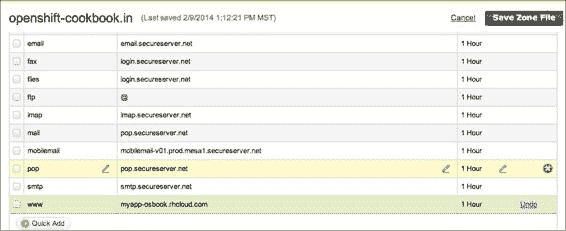
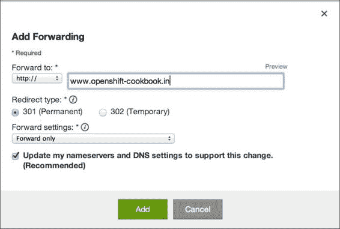

# 第三章：创建与管理应用程序

本章介绍了一些示例，向你展示如何使用 rhc 命令行客户端开始应用程序开发。你将学习如何通过单个命令创建自己的 OpenShift 应用程序，如何使用应用程序管理操作（如启动、停止和删除），如何为应用程序设置自己的域名，以及如何跟踪和回滚部署。

本章中的具体示例包括：

+   使用 rhc 命令行客户端创建 OpenShift 应用程序

+   指定自己的模板 Git 仓库 URL

+   启动/停止/重启应用程序

+   添加和管理附加插件

+   向应用程序添加 cron 插件

+   使用可下载的插件与 OpenShift 应用程序集成

+   查看应用程序详情

+   使用 rhc 克隆应用程序的 Git 仓库

+   使用 rhc 通过 SSH 连接到应用程序设备

+   使用 rhc 在应用程序的 SSH 会话中运行命令

+   设置应用程序特定的环境变量

+   执行应用程序备份与恢复

+   跟踪和回滚应用程序部署

+   配置默认的 Git 分支进行部署

+   执行手动部署

+   配置并执行二进制部署

+   使用自定义域名

+   清理应用程序

+   删除应用程序

# 介绍

OpenShift（或任何其他**平台即服务**（**PaaS**））基于一个核心原则，即它应该简化应用程序生命周期管理，包括应用程序的扩展，帮助开发人员更快地构建他们的业务应用程序。这些平台通过为开发人员提供基础设施和应用堆栈的配置、管理和扩展，帮助他们提高生产力。它使软件开发人员能够将自己的创意付诸实践，在本地机器上编写代码，然后在几分钟内将应用程序部署到云端。PaaS 可以在不需要大量工作下，提供一个坚实的基础，帮助你实现下一个商业创意。PaaS 还可以在应用程序从一开始就帮助执行最佳实践，如持续集成。此外，PaaS 还可以帮助你从客户那里获取快速反馈，进而加快迭代速度。

OpenShift 为应用程序开发人员提供了开发和部署应用程序所需的所有服务和工具。运行在 OpenShift 上的应用程序可以利用它们的托管堆栈，并且不需要系统管理员来管理底层平台，从而确保应用程序的安全性和可靠性。OpenShift 提供了可以帮助应用程序开发人员定期备份其应用程序的命令。要了解应用程序开发人员如何备份应用程序，请参考*应用程序备份与恢复*这一示例。

`rhc` 命令行工具提供了所有与应用程序相关的命令。要查看所有应用程序相关的命令，请打开命令行终端并运行以下命令：

```
$ rhc app -h
Usage: rhc app <action>
Creates and controls an OpenShift application. To see the list of all applications use the rhc domain show command. Note that
delete is not reversible and will stop your application and then remove the application and repo from the remote server. No
local changes are made.

```

我们将在本章中介绍所有这些命令，请继续关注！

每个 OpenShift 应用程序都运行在一个 gear 中，gear 是一个使用 SELinux、Control Groups 和 pam_namespace Linux 技术构建的容器。让我们一一了解这些技术：

+   **SELinux**：**SELinux**（**Security Enhanced Linux**）是一个由美国国家安全局（NSA）最初开发的 Linux 内核安全模块。OpenShift 使用 SELinux 来实现 gear 隔离并在 gear 周围建立一个加固的安全层。这限制了应用程序 gear 访问它们不应访问的系统部分，比如低层次系统和同一节点上运行的其他应用程序 gear。在多租户环境中，例如 OpenShift，这种行为对于确保在同一基础设施上运行多个应用程序时的安全性和可靠性非常重要。

+   **Control Groups**：OpenShift 使用 **Control Groups**（**cgroups**），这是 Linux 内核的一个特性，用于在进程组之间分配资源，如 CPU 时间、内存、带宽，或者这些资源的组合。一个 gear 分配的 RAM 和磁盘空间取决于 gear 的大小。在免费层级中，你只能使用小型 gear，它们有 512 MB 的 RAM 和 1 GB 的磁盘空间。我们将在 *使用 rhc 命令行客户端创建 OpenShift 应用程序* 食谱中介绍 gear 的大小。

+   **pam_namespace**：pam_namespace 用于允许每个用户或会话维护自己的目录结构命名空间，防止他们查看或干扰其他用户的命名空间。通过使用这个功能，OpenShift 能够为每个 gear 提供 `/tmp` 目录。

一个 gear 运行你应用程序的不同软件组件（或 cartridge）。cartridge 是使 gear 有用的东西，它提供应用程序可能需要的软件组件。每个 OpenShift 应用程序都需要一个 web cartridge，并且可以有零个或多个附加和可下载的 cartridge。cartridge 有三种类型：

+   **Web cartridge**：这些用于处理网页请求。你不能在没有 Web cartridge 的情况下创建 OpenShift 应用程序。你必须在应用程序创建时指定 Web cartridge。它们支持 Java、PHP、Python、Ruby、Node.js 和 Perl，你可以通过运行以下命令列出所有 Web cartridge：

    ```
    $ rhc cartridges|grep web
    jbossas-7           JBoss Application Server 7              web
    jbosseap-6 (*)      JBoss Enterprise Application Platform 6 web
    jenkins-1           Jenkins Server                          web
    nodejs-0.10         Node.js 0.10                            web
    nodejs-0.6          Node.js 0.6                             web
    perl-5.10           Perl 5.10                               web
    php-5.3             PHP 5.3                                 web
    zend-5.6            PHP 5.3 with Zend Server 5.6            web
    php-5.4             PHP 5.4                                 web
    zend-6.1            PHP 5.4 with Zend Server 6.1            web
    python-2.6          Python 2.6                              web
    python-2.7          Python 2.7                              web
    python-3.3          Python 3.3                              web
    ruby-1.8            Ruby 1.8                                web
    ruby-1.9            Ruby 1.9                                web
    jbossews-1.0        Tomcat 6 (JBoss EWS 1.0)                web
    jbossews-2.0        Tomcat 7 (JBoss EWS 2.0)                web
    diy-0.1             Do-It-Yourself 0.1                      web

    ```

+   **Add-on cartridge**：这些是 OpenShift 提供的附加 cartridge。你可以根据需要添加它们，也就是说，如果你的应用程序需要数据库，你将需要添加 MySQL、PostgreSQL 或 MongoDB 附加 cartridge。你可以通过运行以下命令列出所有附加的 cartridge：

    ```
    $ rhc cartridges|grep addon
    10gen-mms-agent-0.1 10gen Mongo Monitoring Service Agent    addon
    cron-1.4            Cron 1.4                                addon
    jenkins-client-1    Jenkins Client                          addon
    mongodb-2.2         MongoDB 2.2                             addon
    mysql-5.1           MySQL 5.1                               addon
    mysql-5.5           MySQL 5.5                               addon
    metrics-0.1         OpenShift Metrics 0.1                   addon
    phpmyadmin-4        phpMyAdmin 4.0                          addon
    postgresql-8.4      PostgreSQL 8.4                          addon
    postgresql-9.2      PostgreSQL 9.2                          addon
    rockmongo-1.1       RockMongo 1.1                           addon
    switchyard-0        SwitchYard 0.8.0                        addon
    haproxy-1.4         Web Load Balancer                       addon

    ```

+   **Downloadable cartridge**：这使开发人员能够编写自己的 cartridge。开发人员可以编写自己的 cartridge 并通过公共 Git 仓库发布。然后，可以使用 rhc add-cartridge 命令安装它们。我们将在本章的 *使用可下载的 cartridge 与 OpenShift 应用程序* 食谱中讨论这些内容。

每个 OpenShift 应用程序至少有一个私有 Git 仓库和一个 Web cartridge。它可能有零个或多个附加 cartridge，且可能有零个或多个可下载的 cartridge。一个 OpenShift 应用程序内建支持 Git 版本控制系统、自动化依赖管理、用于文件上传或存储其他文件的持久化数据目录，以及部署回滚。

一个应用程序可以是可扩展的或不可扩展的。**可扩展**应用程序运行在多个 gear 上，并根据并发用户数水平扩展。我们将在第十一章，*日志记录与 OpenShift 应用程序扩展*中讨论可扩展应用程序。本章我们将介绍不可扩展应用程序。**不可扩展应用程序**运行在单个 gear 内，所有的 cartridges 都添加到该 gear 中。这些应用程序适合开发用途，但对于生产环境中的高流量应用程序，你应该考虑使用可扩展应用程序。

# 使用 rhc 命令行客户端创建 OpenShift 应用程序

在这个教程中，你将学习如何使用 rhc 创建一个 OpenShift 应用程序。我们将创建一个 PHP 5.4 应用程序仅供演示使用。本章将不依赖于特定语言，仅涵盖所有应用程序类型通用的概念。后续章节会介绍 OpenShift 支持的不同编程语言。

## 准备工作

要逐步执行此教程，你需要在计算机上安装 rhc 命令行客户端。有关详细信息，请参阅第一章，*OpenShift 入门*中的 *安装 OpenShift rhc 命令行客户端* 章节。此外，你还应该通过 rhc 设置 OpenShift 账户，具体操作请参考第一章，*OpenShift 入门*中的 *使用 rhc 设置 OpenShift 账户* 章节。

## 如何实现…

要创建一个名为 `myapp` 的 PHP 5.4 OpenShift 应用程序，打开一个新的命令行终端并运行以下命令：

```
$ rhc create-app --app myapp --type php-5.4

```

你也可以避免输入 `--app` 和 `--type` 选项，因为 OpenShift 会自动推断它们，如下所示：

```
$ rhc create-app myapp php-5.4

```

你也可以这样写命令：

```
$ rhc app-create myapp php-5.4

```

所有的 rhc 命令都可以使用 `rhc <名词>-<动词>` 或 `rhc <动词>-<名词>` 的形式。

## 工作原理……

让我们逐步了解 `rhc create-app` 命令所执行的所有步骤：

1.  `rhc create-app` 命令需要两个必选选项：`--app` 和 `--type`。虽然不要求你在命令中传递这些选项，但你需要提供其值，如 `rhc create-app myapp php-5.4` 命令所示。这两个选项指定了应用程序名称和应用程序将使用的 Web 组件。OpenShift 服务器将检查应用程序名称和 Web 组件名称是否正确。有效的应用程序名称必须仅包含字母数字字符，且长度最多为 32 个字符。你可以使用以下命令查看所有可用的 Web 组件：

    ```
    $ rhc cartridges|grep web

    ```

1.  确认应用程序名称和 Web 组件名称正确后，它将检查你的域名中是否有足够的资源来创建应用程序。在免费套餐中，你只能使用三个 gear，因此，如果你尝试在已用完三个 gear 后创建应用程序，你将收到错误响应。例如，如果你已经创建了三个应用程序，并尝试创建第四个应用程序，你将收到错误响应 `user has already reached the gear limit of 3`。

1.  如果你有足够的资源来创建应用程序，rhc 将发出一个 `HTTP POST` 请求来创建应用程序。rhc 命令行客户端是 OpenShift REST API 的封装器。OpenShift 服务器将接收到该 POST 请求，并为你的应用程序分配一个 gear。gear 分配的内存和磁盘空间取决于 gear 的大小。在免费套餐中，你只能使用小型 gear，它有 512 MB 的 RAM 和 1 GB 的磁盘空间。如果你在付费套餐中，你可以通过 `--gear` 选项指定更大的 gear 大小。根据编写时的情况，`--gear` 的有效值为 small、medium 和 large。

1.  接下来，OpenShift 将安装你的应用程序所需的 Web 组件。在之前创建的应用程序中，它将安装 PHP 5.4 语言运行时和 Apache Web 服务器来处理你的 Web 请求并执行所需的配置。

1.  OpenShift 服务器还将为你的应用程序创建一个私有的 Git 仓库。该 Git 仓库将根据 Web 组件类型提供一个模板应用程序。你可以使用 `--from-code` 指定自己的模板应用程序。有关内容，请参见下一个配方。

1.  一旦应用程序创建了所有必需的组件，OpenShift 服务器将为你的应用程序创建一个公共 URL，并将其注册到 DNS 中。公共 URL 是应用程序名称和域名的组合。对于之前创建的应用程序，URL 将是 `http://myapp-osbook.rhcloud.com`。其中，`myapp` 是应用程序名称，`osbook` 是域名。你也可以使用你自己的自定义域名与 OpenShift 应用程序一起使用。有关内容，请参见 *使用自定义域名* 配方。

1.  在应用程序的 DNS 名称可用后，rhc 将使用 Git 命令行工具在你的本地机器上克隆应用程序的 Git 仓库。

1.  最后，你将看到应用程序的详细信息。你可以在`http://myapp-{domain-name}.rhcloud.com/`查看运行中的应用程序。请将`{domain-name}`替换为你的账户域名。以下是一个示例：

    ```
    Your application 'myapp' is now available.

     URL:        http://myapp-osbook.rhcloud.com/
     SSH to:     52ef686d4382ec39f500001a@myapp-osbook.rhcloud.com
     Git remote: ssh://52ef686d4382ec39f500001a@myapp-osbook.rhcloud.com/~/git/myapp.git/
     Cloned to:  /home/vagrant/dev/apps/myapp

    ```

让我们看一下本地计算机上的`myapp`应用程序目录。应用程序创建后，本地计算机会创建一个与应用程序名称相同的目录，其中包含 OpenShift 创建的模板应用程序的源代码，如下所示：

```
$ ls -a
.git  .openshift index.php

```

让我们逐一查看这些组件，如下所示：

1.  `.git`目录存储`myapp`应用程序的 Git 版本库。该目录包含版本库的完整历史记录。`.git/config`文件包含版本库的配置。rhc 命令行工具还会将应用程序特定的元数据添加到`.git/config`文件中。应用程序特定的元数据位于 rhc 部分：

    ```
    [rhc]
    app-id = 52ef686d4382ec39f500001a
    app-name = myapp
    domain-name = osbook

    ```

1.  `.openshift`目录存储 OpenShift 特定的文件。`.openshift`目录下有三个子目录——`action_hooks`、`cron`和`markers`：

    +   `action_hooks`目录存储可执行脚本，为应用程序开发人员提供了进入各种应用程序和平台生命周期操作的入口点。使用 action hook 的一个例子是，在应用程序部署后发送电子邮件。

    +   `cron`目录存储可执行脚本，可以按计划定期运行。我们将在本章稍后的*向应用程序添加 cron 模块*配方中详细讲解。

    +   `markers`目录允许用户指定设置，例如热部署、调试和要使用的 Java 版本。由于这些设置特定于 Web 模块，我们将在专门讲解 Web 模块的章节中详细说明它们。

1.  `index.php`文件包含一个简单的 PHP 应用程序，当你访问应用程序 URL 时会看到它。

    ### 注意

    在撰写本书时，免费层级中的应用程序在 24 小时不活跃后将会空闲。空闲意味着没有来自外部设备对你的应用程序 URL 的 HTTP 请求。当空闲时，设备需要几秒钟才能唤醒并开始处理 Web 请求。

## 还有更多

如果应用程序创建时间超过 120 秒，`rhc`命令行工具将抛出异常。为了解决与超时相关的错误，你可以指定`--timeout`选项，如下所示的代码所示。超时值为秒：

```
$ rhc app-create myapp php-5.4 --timeout 300

```

你也可以在`~/.openshift/express.conf`文件中配置超时设置，如下所示的代码所示。这将适用于所有命令：

```
# The default timeout for network operations
timeout=300

```

## 另见

+   第一章中的*使用 Web 控制台创建 WordPress 应用程序* 配方，*开始使用 OpenShift*

+   *指定你自己的模板 Git 仓库 URL* 配方

+   *向应用程序添加 cron 模块* 配方

+   *查看应用程序详情* 配方

+   *使用自定义域名*配方

# 指定自己的模板 Git 仓库 URL

在*使用 rhc 命令行客户端创建 OpenShift 应用*配方中，我们创建了一个使用 OpenShift 提供的模板源代码的应用。假设你希望 OpenShift 使用你的 Git 仓库来填充应用的初始内容。这可以通过在创建应用时使用`--from-code`选项来实现。

## 准备工作

要完成此配方，你需要在机器上安装 rhc 命令行客户端。有关详细信息，请参阅第一章中的*安装 OpenShift rhc 命令行客户端*配方，*OpenShift 入门*。你还应该通过按照第一章中的*使用 rhc 设置 OpenShift 账户*配方来完成 OpenShift 账户的设置。

## 操作步骤……

若要创建一个使用自己 Git 仓库初始内容的应用，请使用`--from-code`选项：

```
$ rhc create-app javaapp jbosseap-6 --from-code https://github.com/OpenShift-Cookbook/chapter3-recipe2.git

```

### 注意

Git 仓库 URL 应该是一个公开的 Git 仓库；否则，应用创建将失败，因为 OpenShift 无法访问该仓库。

## 工作原理……

当你使用`--from-code`选项创建 OpenShift 应用时，OpenShift 服务器将首先克隆提供的 Git 仓库，并使用该仓库的源代码填充应用的初始内容。Git 仓库 URL 应该是一个公开的 Git 仓库；否则，OpenShift 将无法克隆该仓库，且会抛出异常。接下来，OpenShift 将构建源代码，创建一个工件，并将该工件部署到服务器上。工件是软件开发过程中产生的副产品，例如，在 Java 应用中，它可能是**Java 归档文件**（**JAR**）、**Web 归档文件**（**WAR**）或**企业归档文件**（**EAR**）文件。

在前面的命令中，我们创建了一个使用公开 Git 仓库 URL 作为初始代码的 JBoss EAP 应用。应用成功创建后，你可以在`http://javaapp-{domain-name}.rhcloud.com/`查看该应用。该应用是一个简单的演示，展示了名为 Boilerpipe 的文章提取库（你可以访问[`code.google.com/p/boilerpipe/`](https://code.google.com/p/boilerpipe/)）。它接受一个 URL 并提取该 URL 的标题和相关文本。

## 另见

+   *使用 Web 控制台创建 WordPress 应用*配方，见第一章，*OpenShift 入门*

+   *使用 rhc 命令行客户端创建 OpenShift 应用*配方

# 启动/停止/重启应用

rhc 命令行客户端提供了启动、停止和重启应用程序的命令。在本配方中，你将学习如何使用 rhc 执行这些命令。

## 准备工作

要按照本配方逐步操作，你需要在机器上安装 rhc。此外，我们将使用 *使用 rhc 命令行客户端创建 OpenShift 应用程序* 配方中创建的 OpenShift 应用程序。

## 如何操作…

要启动应用程序，请运行以下命令：

```
rhc start-app --app myapp

```

要停止应用程序，请运行以下命令：

```
rhc stop-app --app myapp

```

要重启应用程序，请运行以下命令：

```
rhc restart-app –-app myapp

```

如果你在应用程序的 Git 仓库中运行命令，则 `--app` 选项不是必需的。当你在仓库中运行命令时，rhc 会从 `.git/config` Git 仓库配置文件中找到域名和应用程序名称。它使用 `git config --get rhc.domain-name` 命令来找到域名，使用 `git config --get rhc.app-name` 来找到应用程序名称。

## 它是如何工作的…

rhc 启动/停止/重启应用程序的命令让你可以使用 rhc 管理应用程序。rhc 客户端发出一个 POST HTTP 请求来停止应用程序，从而停止 Web 插件和附加插件。每个 OpenShift gear 上都有一个可执行文件叫做 `gear`。当服务器接收到 POST 请求时，它会执行 `gear stop` 命令来停止 PHP 5.4 插件。在应用程序成功停止后，向应用程序 URL 发出的 `curl` 请求将返回 503 错误：

```
$ curl http://myapp-osbook.rhcloud.com
<!DOCTYPE HTML PUBLIC "-//IETF//DTD HTML 2.0//EN">
<html><head>
<title>503 Service Temporarily Unavailable</title>
</head><body>
<h1>Service Temporarily Unavailable</h1>
<p>The server is temporarily unable to service your
request due to maintenance downtime or capacity
problems. Please try again later.</p>
<hr>
<address>Apache/2.2.22 (Red Hat Enterprise Web Server) Server at myapp-osbook.rhcloud.com Port 80</address>
</body></html>

```

`rhc start-app` 命令会发出一个 POST HTTP 请求来启动应用程序。OpenShift 服务器接收到 POST 请求后，会在应用程序 gear 上调用 `gear start` 命令。`gear start` 命令会首先启动所有附加插件，然后才启动 Web 插件。

`rhc restart-app` 命令首先通过在应用程序 gear 上调用 `gear stop` 命令来停止应用程序，然后通过在应用程序 gear 上调用 `gear start` 命令来启动应用程序。

## 还有更多…

`rhc stop-app` 命令仅停止 Web 插件和附加插件进程，但如果你想终止应用程序 gear 中运行的所有进程，你应该使用 `rhc force-stop-app` 命令。这个命令会终止 gear 中运行的所有进程。当有人在应用程序中运行自己的进程时，这个命令非常有用。在这种情况下，rhc app-stop 命令无法起作用：

```
$ rhc force-stop-app --app myapp

```

## 另见

+   *使用 rhc 命令行客户端创建 OpenShift 应用程序* 配方

+   *查看应用程序详细信息* 配方

# 添加和管理附加插件

在 *使用 rhc 命令行客户端创建 OpenShift 应用程序* 配方中，你学习了如何使用 Web 插件创建一个新的 OpenShift 应用程序。除了 Web 插件，OpenShift 还支持多种附加插件。这些插件提供了数据库、监控、定时任务、数据库 Web 客户端等功能。

在此配方中，您将学习如何将 MySQL 5.5 插件安装到您在 *使用 rhc 命令行客户端创建 OpenShift 应用程序* 配方中创建的 PHP 5.4 应用程序上。

## 准备就绪

要完成此配方，您需要在您的机器上安装 rhc。同时，我们将使用在 *使用 rhc 命令行客户端创建 OpenShift 应用程序* 配方中创建的 OpenShift 应用程序。

## 如何操作…

要将 MySQL 5.5 插件添加到我们的应用程序，请运行以下命令：

```
$ rhc cartridge-add --app myapp --cartridge mysql-5.5

```

如果您想启动插件，请运行以下命令：

```
$ rhc cartridge-start --app myapp --cartridge mysql-5.5

```

要停止一个插件，请运行以下命令：

```
$ rhc cartridge-stop --app myapp --cartridge mysql-5.5

```

要重启一个插件，请运行以下命令：

```
$ rhc cartridge-restart --app myapp --cartridge mysql-5.5

```

您还可以使用以下命令查看插件状态：

```
$ rhc cartridge-status --app myapp --cartridge mysql-5.5

```

最后，要移除插件，请运行以下命令：

```
$ rhc cartridge-remove --app myapp --cartridge mysql-5.5 --confirm

```

`--confirm` 选项用于确认插件移除。如果您没有指定 `--confirm` 选项，OpenShift 会要求您确认操作。

## 它是如何工作的…

所有与插件相关的命令都可以在 `rhc cartridge` 下找到。要查看您可以在插件上执行的所有操作，请运行以下命令：

```
$ rhc cartridge -h
List of Actions
 add           Add a cartridge to your application
 list          List available cartridges
 reload        Reload the cartridge's configuration
 remove        Remove a cartridge from your application
 restart       Restart a cartridge
 scale         Set the scale range for a cartridge
 show          Show useful information about a cartridge
 start         Start a cartridge
 status        Get current the status of a cartridge
 stop          Stop a cartridge
 storage       View/manipulate storage on a cartridge

```

`rhc` `cartridge-add` 命令发出一个 HTTP POST 请求，将 MySQL 5.5 插件添加到 `myapp` 应用程序中。该命令行工具在当前命令行目录的上下文中运行，并与 OpenShift REST API 进行交互。这样可以避免在每个命令中都使用 `--app` 选项指定应用程序名称。服务器接收到 POST 请求并在应用程序的 gear 上安装 MySQL 二进制文件。成功创建应用程序后，您将收到以下结果：

```
mysql-5.5 (MySQL 5.5)
---------------------
 Gears:          Located with php-5.4
 Connection URL: mysql://$OPENSHIFT_MYSQL_DB_HOST:$OPENSHIFT_MYSQL_DB_PORT/
 Database Name:  myapp
 Password:       2L5FIzuyZrXa
 Username:       adminyEY1pty

Added mysql-5.5 to application myapp
MySQL 5.5 database added.  Please make note of these credentials:
 Root User: adminyEY1pty
 Root Password: 2L5FIzuyZrXa
 Database Name: myapp

Connection URL: mysql://$OPENSHIFT_MYSQL_DB_HOST:$OPENSHIFT_MYSQL_DB_PORT/

You can manage your new MySQL database by also embedding phpmyadmin.
The phpmyadmin username and password will be the same as the MySQL credentials above.

```

剩余的命令不言自明，因此不需要太多讨论。

### 注意

请注意，`rhc remove-cartridge` 命令是不可逆操作，且您在移除插件后 *无法* 恢复数据。

## 还有更多…

您还可以使用 `rhc cartridge` 命令查看插件的详细信息：

```
$ rhc show-cartridge mysql –-app myapp
Using mysql-5.5 (MySQL 5.5) for 'mysql'
mysql-5.5 (MySQL 5.5)
---------------------
 Gears:          Located with php-5.4
 Connection URL: mysql://$OPENSHIFT_MYSQL_DB_HOST:$OPENSHIFT_MYSQL_DB_PORT/
 Database Name:  myapp
 Password:       2L5FIzuyZrXa
 Username:       adminyEY1pty

```

## 查看更多

+   *使用 rhc 命令行客户端创建 OpenShift 应用程序* 配方

+   *查看应用程序详情* 配方

+   *向应用程序添加 cron 插件* 配方

# 向应用程序添加 cron 插件

在这个配方中，您将学习如何将 cron 插件添加到您的应用程序中。cron 插件将每小时将 `quota` 命令的输出写入文件。数据库和其他插件将在本书后续部分进行讲解。

## 准备就绪

为了准备此配方，您需要在您的机器上安装 rhc。同时，我们将使用在 *使用 rhc 命令行客户端创建 OpenShift 应用程序* 配方中创建的 OpenShift 应用程序。

## 如何操作…

执行以下步骤将 cron 插件添加到您的应用程序：

1.  打开一个新的命令行终端并运行以下命令：

    ```
    $ rhc add-cartridge --cartridge cron --app myapp

    ```

1.  在应用程序根目录下创建一个新的 `quota.txt` 文件，并用以下代码填充它。在 *nix 系统上，你可以使用 `cat` 命令，如以下命令行所示：

    ```
    $ echo "# Quote File" >> quota.txt

    ```

    在 Windows 系统上，你可以使用文件资源管理器创建新文件。创建文件后，写入 `# Quota File`。

1.  添加 cron 插件后，在 `.openshift/cron/hourly` 文件夹中创建一个名为 `quota.sh` 的新文件，并将以下内容添加到其中：

    ```
    #!/bin/bash
    date >> $OPENSHIFT_REPO_DIR/quota.txt
    quota -s >> $OPENSHIFT_REPO_DIR/quota.txt
    echo "**********************************************************************************************" >> $OPENSHIFT_REPO_DIR/quota.txt
    ```

1.  通过运行以下命令使 `quota.sh` 脚本可执行。在 *nix 系统上，你可以运行以下命令：

    ```
    $ chmod +x .openshift/cron/hourly/quota.sh

    ```

    在 Windows 系统上，由于没有 chmod 命令，你必须使用以下命令：

    ```
    $ git update-index --add --chmod=+x .openshift/cron/hourly/quota.sh

    ```

1.  将 `quota.sh` 脚本添加到 Git 仓库中，然后将更改提交到本地 Git 仓库：

    ```
    $ git add .
    $ git commit -am "added hourly script to output quota limits"

    ```

1.  将更改推送到 OpenShift 服务：

    ```
    $ git push

    ```

1.  部署更改后，你将在 `http://myapp-{domain-name}.rhcloud.com/quota.txt` 查看配额信息。

## 工作原理…

每个 OpenShift 应用程序在 `.openshift` 目录下都有一个 cron 目录。这个目录用于定义每分钟、每小时、每天、每周或每月运行的作业。在你使用 `rhc add-cartridge` 命令将 cron 插件添加到应用程序之前，cron 作业不会被触发。它们非常适用于定期在后台自动执行任务。你可以用它们来执行数据库备份、清理日志文件、发送电子邮件等等。

在第 1 步中，你已将 cron 插件添加到 `myapp` 应用程序中。接下来，在第 3 步中，你定义了一个每小时运行的 `quota.sh` bash 脚本。`quota.sh` 脚本会将日期和配额信息附加到 OpenShift 仓库位置下 `php` 目录中的 `quota.txt` 文件中。`$OPENSHIFT_REPO_DIR` 是一个环境变量，指向应用程序源代码目录的位置。在第 4 步中，你使 `quota.sh` 脚本可执行，若没有此步骤，OpenShift 服务将无法执行该脚本。在接下来的三步中，你将更改提交到本地 Git 仓库，然后将更改推送到托管在 OpenShift 应用程序 gear 上的应用程序 Git 仓库。OpenShift 会先停止整个插件，构建应用程序，将其部署到 Apache 服务器上，然后最后启动所有插件。cron 插件启动后，它将每小时写入 `quota.txt` 文件。你可以通过访问 `http://myapp-{domain-name}.rhcloud.com/quota.txt` 查看配额详情：

```
Tue Feb  4 02:57:14 EST 2014 Disk quotas for user 52f08f184382ecb8e9000239 (uid 2675):       Filesystem  blocks   quota   limit   grace   files   quota   limit   grace /dev/mapper/EBSStore01-user_home01                    9760       0   1024M             359       0   80000         ********************************************************************************************** Tue Feb  4 03:57:14 EST 2014 Disk quotas for user 52f08f184382ecb8e9000239 (uid 2675):       Filesystem  blocks   quota   limit   grace   files   quota   limit   grace /dev/mapper/EBSStore01-user_home01                    9760       0   1024M             359       0   80000         **********************************************************************************************

```

### 注意

默认情况下，cron 作业的超时时间为 5 分钟，这意味着你的作业应该在 5 分钟内完成，否则将被终止。

你可以使用 `nohup` 在后台运行更长时间的作业：

```
nohup /path-to/script > $OPENSHIFT_LOG_DIR/logfile 2>&1 &

```

## 还有更多内容…

OpenShift 当前只支持每分钟、每小时、每天、每周或每月间隔调度任务。如果你希望在特定时间或特定间隔运行任务，例如在每天晚上 8:30 运行一个任务，你可以创建一个每分钟运行的任务，然后添加以下代码。该任务只有在 8:30 PM 时才会执行：

```
#!/bin/bash
if [ `date +%H:%M` == "20:30" ]
then
    date >> $OPENSHIFT_REPO_DIR/quota_20h_30m.txt
quota -s >> $OPENSHIFT_REPO_DIR/quota_20h_30m.txt
echo "********************************">> $OPENSHIFT_REPO_DIR/quota_20h_30m.txt
fi
```

## 另请参见

+   *使用 rhc 命令行客户端创建 OpenShift 应用程序* 这篇教程

# 使用可下载插件与 OpenShift 应用程序

在这个教程中，你将学习如何将第三方可下载插件与 OpenShift 应用程序一起使用。

## 准备工作

要按照本教程进行操作，你需要在你的机器上安装 rhc。同时，我们将使用在 *使用 rhc 命令行客户端创建 OpenShift 应用程序* 这篇教程中创建的 OpenShift 应用程序。

## 操作步骤…

要添加 Monit 可下载插件，请使用如下命令中的 `rhc add-cartridge` 命令。请将 `email@address.com` 替换为你有效的电子邮件地址：

```
$ rhc cartridge-add --app myapp https://raw.githubusercontent.com/openshift-cartridges/openshift-origin-cartridge-monit/master/metadata/manifest.yml --env MONIT_ALERT_EMAIL=email@address.com

```

`--env` 选项用于设置此插件所需的环境变量。该插件需要 `MONIT_ALERT_EMAIL` 环境变量，用于配置将用于发送警报通知的电子邮件。环境变量将在 *设置应用程序特定环境变量* 这篇教程中详细介绍。

## 工作原理…

要将一个第三方可下载的插件安装到你的应用程序中，你需要提供 `rhc` 命令行客户端该插件清单文件的 URL，该文件名为 `manifest.yml`。此文件位于插件源代码库中的 `metadata` 目录下，并包含一个指向插件实际内容的 URL。可以在 [`www.openshift.com/developers/download-cartridges`](https://www.openshift.com/developers/download-cartridges) 找到一个积极维护的第三方插件列表。另一种寻找可下载插件的好方法是搜索 GitHub ([`github.com/search?q=%22openshift+cartridge%22`](https://github.com/search?q=%22openshift+cartridge%22))，因为大多数插件托管在 GitHub 上。

你可以稍后通过运行 `rhc remove-cartridge` 命令来移除插件：

```
$ rhc remove-cartridge monit --confirm

```

## 另请参见

+   *使用 rhc 命令行客户端创建 OpenShift 应用程序* 这篇教程

+   *添加和管理附加插件* 这篇教程

+   *将 cron 插件添加到应用程序* 这篇教程

# 查看应用程序详细信息

在这个教程中，你将学习如何查看与应用程序相关的所有详细信息。

## 准备工作

要按照本教程进行操作，你需要在你的机器上安装 rhc。同时，我们将使用在 *使用 rhc 命令行客户端创建 OpenShift 应用程序* 这篇教程中创建的 OpenShift 应用程序。

## 操作步骤…

`rhc show-app` 命令可以用来查看应用程序的详细信息，操作如下：

```
$ rhc show-app --app myapp

```

如果你在应用程序 Git 仓库内运行命令，则不需要 `--app` 选项。

## 工作原理…

`rhc show-app`命令返回应用程序的所有详细信息。命令的输出如下所示。详细信息包括应用程序的创建时间、应用程序名称、公共 URL、Git 仓库 URL、SSH URL 以及所有 cartridge 的详细信息：

```
rhc show-app --app myapp
myapp @ http://myapp-osbook.rhcloud.com/ (uuid: 52f08f184382ecb8e9000239)
-------------------------------------------------------------------------
 Domain:     osbook
 Created:    1:56 AM
 Gears:      1 (defaults to small)
 Git URL:    ssh://52f08f184382ecb8e9000239@myapp-osbook.rhcloud.com/~/git/myapp.git/
 SSH:        52f08f184382ecb8e9000239@myapp-osbook.rhcloud.com
 Deployment: auto (on git push)

 php-5.4 (PHP 5.4)
 -----------------
 Gears: Located with cron-1.4

 cron-1.4 (Cron 1.4)
 -------------------
 Gears: Located with php-5.4

```

你还可以通过传入`--state`选项来查看应用程序的状态，如下所示的命令。有效的应用程序状态包括`started`（启动）、`stopped`（停止）和`building`（构建中）：

```
$ rhc show-app --app myapp --state
Cartridge php-5.4, cron-1.4 is started

```

如果你只想查看应用程序中所有 gear 的 SSH 信息和状态，可以使用`--gears`选项与`rhc app-show`命令一起：

```
$ rhc show-app--app --gears
ID                       State   Cartridges       Size  SSH URL
------------------------ ------- ---------------- ----- -------------------------------------------------
52f08f184382ecb8e9000239 started php-5.4 cron-1.4 small 52f08f184382ecb8e9000239@myapp-osbook.rhcloud.com

```

上述命令在处理可扩展应用程序时非常有用，因为它通过单个命令提供了所有应用程序 gear 的信息。

## 查看更多

+   *使用 rhc 命令行客户端创建 OpenShift 应用程序*配方

+   *使用 rhc 克隆应用程序 Git 仓库*配方

# 使用 rhc 克隆应用程序 Git 仓库

在第一章中，*将应用程序克隆到本地机器*配方，*开始使用 OpenShift*，你学习了如何使用 Git 命令行工具克隆 Git 仓库。这个配方有几个步骤——首先，从 Web 控制台复制 Git 仓库的 URL，然后使用`git-clone`命令克隆 Git 仓库。rhc 命令行工具可以帮助你节省一些按键。在这个配方中，你将学习如何使用 rhc 来克隆 Git 仓库。

## 准备工作

要完成这个配方，你需要在你的机器上安装 rhc。此外，我们将使用在*使用 rhc 命令行客户端创建 OpenShift 应用程序*配方中创建的 OpenShift 应用程序。

## 如何操作…

要使用 rhc 在本地机器上克隆`myapp`应用程序，运行以下命令：

```
rhc git-clone --app myapp

```

## 它是如何工作的…

`rhc git-clone`命令首先发送一个 HTTP GET 请求以获取关于`myapp`应用程序的详细信息。应用程序的详细信息包括 Git 仓库 URL。然后，`rhc git-clone`命令使用`git clone <GIT_REPOSITORY_URL>`命令来克隆该应用程序。

### 注意

`rhc git-clone`命令需要在你的机器上安装 Git 才能正常工作。

## 还有更多内容…

你还可以告诉`rhc git-clone`命令使用`--repo`选项将仓库克隆到特定目录。以下命令将在`tmp/myapp`文件夹中克隆仓库：

```
$ rhc git-clone --app myapp --repo ../tmp/myapp

```

## 查看更多

+   *使用 rhc 命令行客户端创建 OpenShift 应用程序*配方

+   在第一章中，*将应用程序克隆到本地机器*配方，*开始使用 OpenShift*。

# 使用 rhc 通过 SSH 连接到应用程序的 gear

在这个配方中，你将学习如何使用 rhc 通过 SSH 连接到应用程序的 gear。

## 准备工作

为了完成本食谱，你需要在你的机器上安装 rhc。此外，你还需要使用在 *使用 rhc 命令行客户端创建 OpenShift 应用程序* 食谱中创建的 OpenShift 应用程序。

## 如何操作…

要 SSH 登录到应用程序 gear，请打开一个新的命令行终端并运行以下命令：

```
$ rhc ssh --app myapp

```

如果你在应用程序 Git 仓库中运行命令，则无需使用 `--app` 选项。

## 它是如何工作的…

每个 OpenShift 应用程序 gear 都像一个虚拟服务器，你可以通过 SSH 访问它。每个 gear 都会分配一个唯一的用户 ID，并与 SELinux 上下文相关联。当你运行 `rhc ssh` 命令时，会在托管 gear 的节点与本地机器之间打开一个安全通信通道，并在环境中提供一个有限的 shell，如下所示的命令。我已简化部分输出：

```
Connecting to 52f08f184382ecb8e9000239@myapp-osbook.rhcloud.com ...

 Welcome to OpenShift shell
This shell will assist you in managing OpenShift applications.

 !!! IMPORTANT !!! IMPORTANT !!! IMPORTANT !!!
 Shell access is quite powerful and it is possible for you to
 accidentally damage your application.  Proceed with care!
 If worse comes to worst, destroy your application with "rhc app delete"
 and recreate it
 !!! IMPORTANT !!! IMPORTANT !!! IMPORTANT !!!

 Type "help" for more info.
[myapp-osbook.rhcloud.com 52f08f184382ecb8e9000239]\>

```

如果你运行 `ls` 命令，你将只看到应用程序用户主目录下所有可用的目录：

```
[myapp-osbook.rhcloud.com 52f08f184382ecb8e9000239]\> ls
app-deployments  app-root  cron  git  php

```

## 还有更多…

默认情况下，SSH 连接将在 5 分钟的非活动后超时，你将被注销出 SSH 会话。你可以通过取消设置 TMOUT 环境变量来关闭连接超时：

```
[myapp-osbook.rhcloud.com 52f08f184382ecb8e9000239]\> unset TMOUT

```

### 注意

如果其他人访问你的机器，而你不希望他们仅通过输入 `rhc ssh` 命令来访问你的 OpenShift 应用程序，我建议你使用 SSH 密钥密码短语来限制访问。我们在 第一章 的 *使用 SSH 密钥密码短语* 食谱中讨论了 SSH 密钥密码短语，*开始使用 OpenShift*。

## 查看更多

+   *使用 rhc 命令行客户端创建 OpenShift 应用程序* 食谱

+   第一章 中的 *通过 Web 控制台上传 SSH 密钥* 食谱，*开始使用 OpenShift*

+   在 第一章 的 *使用 SSH 密钥密码短语* 食谱中，*开始使用 OpenShift*

# 在应用程序的 SSH 会话中使用 rhc 运行命令

在本食谱中，你将学习如何在不使用 rhc 执行 SSH 登录服务器的情况下查看 gear 目录列表。

## 准备工作

要执行此食谱，你需要在你的机器上安装 rhc。此外，我们将使用在 *使用 rhc 命令行客户端创建 OpenShift 应用程序* 食谱中创建的 OpenShift 应用程序。

## 如何操作…

要在不执行 SSH 登录到应用程序服务器的情况下运行 `ls` 命令，你应该运行以下命令：

```
$ rhc app-ssh --app myapp --command ls

```

`rhc ssh` 命令是 `rhc app-ssh` 的简写。这两个命令都允许你 SSH 登录到应用程序 gear。

## 它是如何工作的…

`rhc app-ssh` 命令内部使用 SSH 命令行客户端连接到应用程序 gear。通过 SSH 命令行客户端，你可以指定命令：

```
$ ssh username@server.com command

```

`rhc` 命令行客户端提供了一个 `--command` 选项，允许你指定要在服务器上运行的命令：

```
$ rhc app-ssh --app myapp --command ls
app-deployments
app-root
cron
git
php

```

## 还有更多…

如果你希望在应用的所有 gears 上运行命令，应该在 `rhc app-ssh` 命令中使用 `--gears` 选项。当处理可扩展应用时，这将非常有用。看看以下命令：

```
$ rhc app-ssh --app myapp --gears --command ls

```

## 查看更多

+   *使用 rhc 命令行客户端创建 OpenShift 应用* 配方

+   *使用 rhc SSH 连接到应用 gear* 配方

# 设置特定于应用的环境变量

很常见的情况是人们将他们的应用部署到多个环境中，如测试、预发布和生产环境。通常，这些环境之间的配置会有所不同，以确保在正确的环境中使用正确的服务。考虑一个例子：你想在应用中发送电子邮件。在生产环境中，你可能希望使用云邮件服务，如 Sendmail（可通过 [`www.sendmail.com/`](https://www.sendmail.com/) 访问），而在开发环境中，你可能希望使用开源版本的 Sendmail。环境变量为这些问题提供了与编程语言和操作系统无关的解决方案。

将配置值硬编码在源代码中永远不是一个好主意，因为这会导致你的代码和这些值之间的强耦合，若代码落入不法之手，还会危及应用的安全性。环境变量让你可以在不同环境中使用相同的应用代码，从而实现可移植的代码。

OpenShift 还暴露了一些你应该在应用程序中使用的环境变量，而不是将其值硬编码。例如，如果你想在 OpenShift 应用中写入文件，你应该使用 `OPENSHIFT_DATA_DIR` 环境变量来访问持久目录的位置。每个 OpenShift 卡带也会暴露自己的环境变量。例如，PostgreSQL 卡带暴露了用于用户名、密码、主机、端口等的环境变量。你不应将数据库配置属性硬编码在源代码中，而应利用环境变量。你可以通过运行以下命令查看所有 OpenShift 和特定卡带的环境变量。`rhc ssh` 命令是 `rhc app-ssh` 的简写。这两个命令都允许你通过 SSH 连接到应用的 gear：

```
$ rhc ssh --command env
MANPATH=/opt/rh/php54/root/usr/share/man:
OPENSHIFT_PHP_IDENT=redhat:php:5.4:0.0.10
OPENSHIFT_GEAR_MEMORY_MB=512
SELINUX_ROLE_REQUESTED=
GEM_HOME=/var/lib/openshift/52f08f184382ecb8e9000239/.gem
OPENSHIFT_DEPLOYMENT_TYPE=git
SHELL=/usr/bin/oo-trap-user
TMPDIR=/tmp/
SSH_CLIENT=117.207.187.145 15958 22
OPENSHIFT_DEPLOYMENTS_DIR=/var/lib/openshift/52f08f184382ecb8e9000239/app-deployments/
OPENSHIFT_TMP_DIR=/tmp/
SELINUX_USE_CURRENT_RANGE=
OPENSHIFT_REPO_DIR=/var/lib/openshift/52f08f184382ecb8e9000239/app-root/runtime/repo/
OPENSHIFT_HOMEDIR=/var/lib/openshift/52f08f184382ecb8e9000239/
OPENSHIFT_GEAR_NAME=myapp
PHPRC=/var/lib/openshift/52f08f184382ecb8e9000239/php//configuration/etc/php.ini
OPENSHIFT_PYPI_MIRROR_URL=http://mirror1.ops.rhcloud.com/mirror/python/web/simple
OPENSHIFT_CRON_DIR=/var/lib/openshift/52f08f184382ecb8e9000239/cron/
OPENSHIFT_APP_SSH_PUBLIC_KEY=/var/lib/openshift/52f08f184382ecb8e9000239/.openshift_ssh/id_rsa.pub
OPENSHIFT_CLOUD_DOMAIN=rhcloud.com
USER=52f08f184382ecb8e9000239
..// Removed for brevity

```

正如你在前一个命令的结果中看到的，列表中还包括我们在上一个配方中添加的 cron 卡带的特定环境变量。

在本配方中，你将学习如何创建特定于应用的环境变量。

## 准备就绪

要完成此配方，你需要在机器上安装 rhc。此外，你还需要使用在 *使用 rhc 命令行客户端创建 OpenShift 应用* 配方中创建的 OpenShift 应用。

## 如何操作…

执行以下步骤来设置特定于应用程序的环境变量：

1.  要创建一个特定于应用程序的环境变量，打开一个新的命令行终端并运行以下命令：

    ```
    rhc env-set --app myapp --env MY_APP_ENV="Hello OpenShift Environment Variables"

    ```

1.  要测试环境变量，打开 `myapp` 文件夹中的 `index.php` 文件，如下所示：

    ```
    <hgroup>
    <h1>Welcome to your PHP application on OpenShift</h1>
    </hgroup>
    ```

    然后，在文件中进行以下更改：

    ```
    <hgroup>
    <h1>
    <?php
    echo($_ENV["MY_APP_ENV"]);
    ?>
    ```

    ```
    </h1>
    </hgroup>
    ```

1.  最后，提交更改并将其推送到应用程序 gear：

    ```
    git commit –am "added environment variable in index.php"
    git push

    ```

1.  成功推送后，访问 `http://myapp-osbook.rhcloud.com/` 来查看更改。

## 它是如何工作的…

`rhc env-set` 命令允许开发者设置特定于应用程序的环境变量。运行 `rhc env-set` 命令时，会发生以下操作：

1.  `rhc` 命令行客户端会发出一个 HTTP POST 请求，环境变量数据包含在请求体中。

1.  OpenShift 经纪人接收到请求并进行一些验证。如果验证失败，用户将看到错误消息。

1.  通过验证检查后，经纪人将创建任务来更新所有应用程序 gear 的新环境变量。

1.  完成后，用户将看到成功消息：

    ```
    Setting environment variable(s) ... done

    ```

### 注意

环境变量在你重新启动应用程序之前是不可用的。因此，在设置环境变量后，使用 `rhc app-restart` 命令重启应用程序。

你不仅可以一次设置一个环境变量，还可以一次设置多个环境变量：

```
rhc env-set –app myapp –env MY_APP_ENV1=test1 MY_APP_ENV2=test2

```

设置多个环境变量的另一种替代方法是使用文件存储环境变量，并将该文件传递给 `rhc env-set` 命令。你应该创建一个名为 `envs.txt` 的新文件，并在每一行输入一个环境变量：

```
MY_APP_ENV1=test
MY_APP_ENV2=

```

现在，你可以将 `envs.txt` 文件传递给 `rhc env-set` 命令，如下所示：

```
rhc env-set –app myapp envs.txt

```

如果你想查看所有应用程序特定的环境变量，可以运行以下命令：

```
rhc env-list –app myapp

```

## 还有更多…

要更新环境变量的值，你应该运行 `rhc env-set` 命令并提供新值，如下所示：

```
rhc env-set --app myapp --env MY_APP_ENV="Hello World"

```

要删除环境变量，运行以下命令：

```
$ rhc env-remove --env MY_APP_ENV –confirm

```

## 查看更多

+   *使用 rhc 命令行客户端创建 OpenShift 应用程序* 教程

+   *查看应用程序详细信息* 教程

# 备份和恢复应用程序

在现实世界中，事情随时可能出错，你应该始终备份整个应用程序，以便在出现问题时可以恢复应用程序到正常状态。一个 OpenShift 应用程序由 Git 仓库、一个或多个数据库、环境变量和一个你应该备份的持久化数据目录组成。你可以使用命令行工具，如 `mysqldump`、`pg_dump` 和 `mongoexport` 来进行数据库备份，但这些工具仅备份各自的数据库。我们将在后面的章节中讨论数据库备份。在本教程中，你将学习如何使用 rhc 进行备份和恢复。

## 准备工作

为了准备这个配方，你需要在你的机器上安装 rhc。同时，你还需要利用在 *使用 rhc 命令行客户端创建 OpenShift 应用* 配方中创建的应用。

## 如何操作…

1.  要为应用创建备份，请打开命令行终端并运行以下命令：

    ```
    $ rhc snapshot-save --app myapp --filepath myapp-backup.tar.gz

    ```

1.  更改 `php` 目录下的 `index.php`，将标题更改为以下内容：

    ```
    <h1>
       Welcome to your PHP application running on OpenShift
    </h1>
    ```

1.  将更改提交到本地仓库，并将更改推送到应用的远程 Git 仓库以部署更改，如下所示：

    ```
    $ git commit -am "updated header in index.php"
    $ git push

    ```

1.  访问 `http://myapp-{domain-name}.rhcloud.com/` 查看你的更改。

1.  要从备份中恢复应用，运行以下命令：

    ```
    $ rhc restore-snapshot --filepath myapp-backup.tar.gz

    ```

1.  现在，在应用备份后，如果你访问 `http://myapp-{domain-name}.rhcloud.com/`，你会注意到我们所做的更改已被恢复，因为我们应用了在第 2 步更改之前所拍摄的快照。

## 它是如何工作的…

现在让我们来了解你在前面部分提到的步骤中做了什么。在第 1 步，你运行了 `rhc snapshot-save` 命令来创建应用备份。`rhc` 工具首先通过向 OpenShift 经纪人发送 HTTP GET 请求来获取应用的详细信息。应用详细信息包括应用的 SSH URL。获取 SSH URL 后，`rhc` 命令行客户端执行了 `ssh <application_ssh_url>'snapshot'>../backup/myapp-backup.tar.gz` 命令来备份应用。这使用了 SSH 命令行功能在远程服务器上运行命令。快照命令的输出会写入本地机器上的 `myapp-backup.tar.gz` 文件。该 `rhc snapshot-save` 命令不需要 `--filepath` 选项，默认会创建一个与应用同名的 TAR 文件，并写入当前目录。该命令首先停止应用，然后创建应用 Gear 主目录下所有目录的备份。这包括应用 Git 仓库、数据目录、所有 cartridge 及其数据以及环境变量。你可以使用以下命令列出 `tar.gz` 文件的内容：

```
$ tar -ztf myapp-backup.tar.gz

```

通过前面列表中的第 2 步到第 4 步，你在 `index.php` 中做了一些小更改，将更改推送到应用的 Gear 上，然后通过访问应用 URL 查看更改。这是为了测试恢复功能。

第 5 步使用`rhc snapshot-restore`命令恢复了你在第 1 步中制作的应用备份。rhc 命令行客户端首先发出 HTTP GET 请求以获取应用的 SSH URL。获取到 SSH URL 后，rhc 命令行客户端执行`cat '../backup/myapp-backup.tar.gz' | ssh <application_ssh_url>'restore INCLUDE_GIT'`命令来恢复备份。该命令将`cat`命令的标准输出通过管道传输到 SSH 命令的标准输入。恢复命令会在替换应用服务器主目录中的所有目录之前停止应用程序。

最后，在第 6 步中，你验证了第 2 步所做的更改已经被撤销，因为你应用了一个不包含第 2 步更改的备份。

### 注意

`rhc snapshot`命令会停止应用程序，然后运行`save`或`restore`命令。

## 还有更多内容…

`rhc snapshot`命令还可以接受另一个选项`--ssh`。该选项可以用来指定不同的 SSH 客户端和/或传递 SSH 选项。假设你想打印 SSH 调试信息，你可以使用 SSH 客户端的`-v`选项：

```
rhc snapshot-save --app myapp --filepath ../backup/myapp-backup.tar.gz --ssh 'ssh -v'

```

这将打印所有 SSH 调试信息。为了简洁起见，我只展示了部分输出：

```
Creating and sending tar.gz
debug1: client_input_channel_req: channel 0 rtype exit-status reply 0
debug1: client_input_channel_req: channel 0 rtype eow@openssh.com reply 0
debug1: channel 0: free: client-session, nchannels 1
debug1: fd 1 clearing O_NONBLOCK
Transferred: sent 2688, received 207872 bytes, in 19.0 seconds
Bytes per second: sent 141.2, received 10915.6
debug1: Exit status 0
RESULT:
Success

```

## 另请参见

+   *使用 rhc 命令行客户端创建 OpenShift 应用*教程

+   *跟踪和回滚应用部署*教程

# 跟踪和回滚应用部署

当你使用`git push`部署源代码时，OpenShift 会执行一个新的构建，创建一个部署，将其部署到相应的服务器上，然后启动你的应用容器。默认情况下，它只会跟踪你应用的最后一次部署，这意味着你无法回滚到以前的部署。在这个教程中，你将学习如何配置你的应用来跟踪多个部署并回滚到某个特定的部署。

## 准备工作

要完成这个教程，你需要在机器上安装 rhc。

## 如何操作…

执行以下步骤以学习如何配置应用程序来跟踪多个部署并回滚到以前的版本：

1.  创建一个新的 PHP 5.4 应用，就像我们在*使用 rhc 命令行客户端创建 OpenShift 应用*教程中创建的那样，步骤如下：

    ```
    $ rhc create-app–-app myapp php-5.4

    ```

1.  要让一个 OpenShift 应用程序跟踪 10 个部署（例如），你应该运行以下命令：

    ```
    $ rhc configure-app --app myapp --keep-deployments 10

    ```

1.  在应用目录中对`index.php`进行更改：

    ```
    <h1>
       Configured the application to track 10 deployments
    </h1>
    ```

1.  提交更改并将更改推送到应用服务器，步骤如下：

    ```
    $ git commit -am "enabled deployment tracking"
    $ git push

    ```

1.  在`http://myapp-{domai``n-name}.rhcloud.com`查看更改。

1.  通过运行以下命令列出所有由应用跟踪的部署：

    ```
    $ rhc deployment-list --app myapp

    7:42 PM, deployment fbaa7582
    7:47 PM, deployment ac5d6f39

    ```

1.  要回滚到部署 ID 为`fbaa7582`的版本，运行以下命令：

    ```
    $ rhc deployment-activate --app myapp --id fbaa7582

    ```

1.  你可以通过再次运行`rhc deployment-list`命令来验证回滚是否发生：

    ```
    $ rhc deployment-list --app myapp
    7:42 PM, deployment fbaa7582
    7:47 PM, deployment ac5d6f39 (rolled back)
    7:50 PM, deployment fbaa7582 (rollback to 7:42 PM)

    ```

## 它是如何工作的…

在步骤 1 中，你创建了一个新的 PHP 5.4 应用程序，然后在步骤 2 中，你配置了该应用程序以使用`rhc app-configure`命令跟踪 10 次部署。然后，从步骤 2 到步骤 5，你在`index.php`中进行了简单的更改，并将该更改部署到应用程序 gear。当你将代码推送到应用程序 gear 时，会创建一个新的部署，ID 为`ac5d6f39`，并存储在`app-deployments`文件夹中，位于应用程序 gear 的主目录下。你可以通过以下命令查看存储在`app-deployments`目录中的部署。每个部署都存储在一个以当前时间戳命名的目录中。当前活动的部署存储在当前目录下：

```
$ rhc ssh --command "ls  ~/app-deployments"
2014-02-09_09-11-31.636
2014-02-09_09-17-22.896
by-id
current

```

在步骤 6 中，你列出了所有的部署，使用了`rhc deployment-list`命令。`rhc deployment-list`命令列出了所有跟踪的部署。ID 为`fbaa7582`的第一个部署是在你创建应用程序时发生的初始部署。ID 为`ac5d6f39`的第二个部署是在对`index.php`进行更改后发生的部署。

步骤 7 涉及使用`rhc deployment-activate`命令将代码回滚到 ID 为`fbaa7582`的部署。在幕后，`rhc deployment-activate`命令在应用程序 gear 上运行`ssh <application_ssh_url> 'gear activate --all fbaa7582'`命令来激活该部署。

最后，在步骤 8 中，你运行了`rhc deployment-list`命令来查看在步骤 7 中发生的回滚信息。

## 还有更多…

你还可以在应用程序创建过程中启用部署跟踪，方法如下：

```
$ rhc create-app myapp php-5.4 --keep-deployments 10

```

你还可以使用`rhc show-app`命令查看应用程序的配置信息：

```
$ rhc show-app --app myapp --configuration
myapp @ http://myapp-osbook.rhcloud.com/ (uuid: 52f78c895973ca4cbc000113)
-------------------------------------------------------------------------
 Deployment:        auto (on git push)
 Keep Deployments:  10
 Deployment Type:   git
 Deployment Branch: master

```

## 另见

+   *使用 rhc 命令行客户端创建 OpenShift 应用程序*教程

+   *应用程序备份与恢复*教程

# 配置默认的 Git 分支用于部署

每个 OpenShift 应用程序都有一个关联的远程 Git 仓库。当你使用`git push`将源代码推送到应用程序 gear 时，你实际上是将源代码推送到名为`origin`的 Git 远程仓库，并且分支是`master`。每个应用程序都配置为在将代码推送到远程 origin 上的 master 分支时自动部署。但是，有时你可能希望使用 master 分支进行开发，而使用生产分支进行部署。在本教程中，你将学习如何配置一个 OpenShift 应用程序，在该应用程序中，你将使用名为`production`的分支进行部署，使用`master`分支进行开发。

## 准备就绪

为了完成此教程，你需要在机器上安装 rhc。同时，你还需要使用*使用 rhc 命令行客户端创建 OpenShift 应用程序*这篇教程中创建的 OpenShift 应用程序。

## 如何操作…

执行以下步骤以配置不同的分支用于部署：

1.  打开命令行终端，并将目录更改为`myapp`应用程序所在的位置。

1.  使用 Git 命令行客户端创建一个名为`production`的新分支：

    ```
    $ git branch production

    ```

1.  配置`myapp` OpenShift 应用程序使用`production`分支进行部署：

    ```
    $ rhc configure-app --deployment-branch production

    ```

1.  打开应用程序目录中的`index.php`文件，并将头部更改为以下内容：

    ```
    <h1>
    Configured the 'production' branch for auto-deployment
    </h1>
    ```

1.  提交更改到本地仓库，然后将更改推送到主分支。由于我们已配置应用程序在部署生产分支时进行部署，所以只会推送代码，因此不会触发自动部署：

    ```
    $ git commit -am "updated index.php"
    $ git push

    ```

1.  接下来，检出生产分支，并合并主分支的更改：

    ```
    $ git checkout production
    $ git merge master

    ```

1.  现在，推送更改到应用程序 gear，变更将被部署：

    ```
    $ git push origin production

    ```

1.  现在，如果你访问`http://myapp-{domain-name}.rhcloud.com`，你将看到在第 4 步中所做的更改。

## 它是如何工作的……

OpenShift 利用 Git 动作钩子进行应用程序部署。默认情况下，每次将源代码推送到主分支时，都会发生部署。在第 1 步中，你将目录更改为`myapp`应用程序所在的位置。第 2 步帮助你创建了一个名为`production`的新分支用于将来的部署。你可以使用`git branch`命令列出 Git 仓库中的所有分支：

```
$ git branch
* master
 production

```

在第 3 步中，你配置了应用程序使用生产分支进行应用程序部署。命令成功完成后，你将看到以下输出：

```
Configuring application 'myapp' ... done
myapp @ http://myapp-osbook.rhcloud.com/ (uuid: 52f78c895973ca4cbc000113)
-------------------------------------------------------------------------
 Deployment:        auto (on git push)
 Keep Deployments:  10
 Deployment Type:   git
 Deployment Branch: production

Your application 'myapp' is now configured as listed above.

```

输出显示部署分支已更改为`production`。

在第 4 步中，你更改了`index.php`，并在第 5 步中提交并推送了更改到主分支。你会注意到，`git push`命令只将数据推送到应用程序的 gear 上，但不会触发部署。应用程序部署不会发生，因为在第 3 步中，你已配置应用程序在推送到生产分支时进行部署。`git push`命令的输出如下：

```
Counting objects: 7, done.
Delta compression using up to 8 threads.
Compressing objects: 100% (4/4), done.
Writing objects: 100% (4/4), 427 bytes, done.
Total 4 (delta 2), reused 0 (delta 0)
To ssh://52f78c895973ca4cbc000113@myapp-osbook.rhcloud.com/~/git/myapp.git/
 8252402..9e4ac48  master -> master

```

在第 6 步中，你检出了生产分支，并合并了在主分支中所做的更改。你在第 7 步中将更改推送到生产分支，这将触发自动部署，变更将被部署到应用程序。`git push origin production`命令如下所示：

```
$ git push origin production
Total 0 (delta 0), reused 0 (delta 0)
remote: Stopping PHP 5.4 cartridge (Apache+mod_php)
remote: Waiting for stop to finish
remote: Building git ref 'production', commit 9e4ac48
remote: Checking deplist.txt for PEAR dependency..
remote: Preparing build for deployment
remote: Deployment id is 8c2a41a8
remote: Activating deployment
remote: Starting PHP 5.4 cartridge (Apache+mod_php)
remote: -------------------------
remote: Git Post-Receive Result: success
remote: Activation status: success
remote: Deployment completed with status: success
To ssh://52f78c895973ca4cbc000113@myapp-osbook.rhcloud.com/~/git/myapp.git/
 * [new branch]      production -> production

```

最后，你通过访问应用程序确认更改已经被部署。

## 还有更多……

如果你想完全关闭自动部署，也就是说，如果你即使在生产分支上也不想进行部署，可以使用`--no-auto-deploy`选项来实现：

```
$ rhc configure-app --app myapp --no-auto-deploy

```

这将关闭自动部署，且只会将代码推送到托管在应用程序 gear 上的 Git 仓库。如果你想部署代码，你必须手动部署，如*手动部署*食谱所示。

## 另见

+   *使用 rhc 命令行客户端创建 OpenShift 应用程序*食谱

+   *跟踪和回滚应用程序部署*食谱

+   *进行手动部署*食谱

# 进行手动部署

在*为部署配置默认 Git 分支*食谱中的*更多...*部分，我们查看了如何使用`--no-auto-deploy`选项通过`rhc app-configure`命令关闭自动部署。如果你关闭了自动部署，想要部署应用程序该怎么办？一种解决方案是通过运行`rhc app-configure –auto-deploy`命令重新配置应用程序以进行自动部署。如果你希望从现在起进行自动部署，这个解决方案很好，但如果你想自己管理部署，`--auto-deploy`选项就不是一个解决方案。在这个食谱中，你将学习如何手动将应用程序部署到 OpenShift。

## 做好准备

要完成这个食谱，你需要在你的机器上安装 rhc。此外，你还需要在*使用 rhc 命令行客户端创建 OpenShift 应用程序*食谱中创建的应用程序。

## 如何操作……

执行以下步骤进行手动部署：

1.  打开命令行终端并将目录更改为`myapp`应用程序。

1.  使用带有`--no-auto-deploy`选项的`rhc configure-app`命令禁用应用程序的自动部署：

    ```
    $ rhc configure-app --app myapp --no-auto-deploy

    ```

1.  对应用程序的`index.php`进行更改：

    ```
    <h1>
    Application configured with no-auto-deploy
    </h1>
    ```

1.  提交更改并将其推送到应用程序插槽。由于禁用了自动部署，代码不会被部署：

    ```
    $ git commit –am "updated index.php"
    $ git push

    ```

1.  若要手动部署更改，请使用`rhc deploy`命令部署主分支：

    ```
    $ rhc deploy --app --ref master

    ```

1.  访问`http://myapp-{domain-name}.rhcloud.com`来查看更改。

## 它是如何工作的……

在第 1 步中，你将目录更改为`myapp`应用程序的位置。为了禁用自动部署，你使用了带有`--no-auto-deploy`选项的`rhc configure-app`命令。你可以通过运行带有`--configuration`选项的`rhc show-app`命令来查看应用程序的详细信息：

```
$ rhc show-app --configuration 
myapp @ http://myapp-osbook.rhcloud.com/ (uuid: 52f78c895973ca4cbc000113)
-------------------------------------------------------------------------
 Deployment:        manual (use 'rhc deploy')
 Keep Deployments:  10
 Deployment Type:   git
 Deployment Branch: master

```

如前一个命令所示，部署已设置为手动。在步骤 3 和 4 中，你在`index.php`中进行了更改，然后提交并推送更改到应用程序插槽。由于我们在第 2 步中禁用了自动部署，自动部署不会启动。`git push`命令的输出如下所示：

```
$ git push
Counting objects: 7, done.
Delta compression using up to 8 threads.
Compressing objects: 100% (4/4), done.
Writing objects: 100% (4/4), 421 bytes, done.
Total 4 (delta 2), reused 0 (delta 0)
To ssh://52f78c895973ca4cbc000113@myapp-osbook.rhcloud.com/~/git/myapp.git/
 9e4ac48..75ea3dc  master -> master

```

在第 5 步中，你使用`rhc deploy`命令手动部署了更改。`rhc deploy`命令需要一个引用，可以是 Git 标签、Git 提交 ID 或 Git 分支名称。此步骤使用了主分支进行部署。`rhc deploy`命令在底层执行了`gear deploy master`命令。第 5 步的输出如下所示：

```
$ rhc deploy --ref master
Deployment of git ref 'master' in progress for application myapp ...
Stopping PHP 5.4 cartridge (Apache+mod_php)
Waiting for stop to finish
Building git ref 'master', commit 75ea3dc
Checking deplist.txt for PEAR dependency..
Preparing build for deployment
Deployment id is c36cde4a
Activating deployment
Starting PHP 5.4 cartridge (Apache+mod_php)
Success

```

如前一个命令所示，首先停止了插槽，然后使用 Git 主分支的最新提交 ID 构建应用程序，最后部署更改。

最后，你可以查看已部署的应用程序并验证更改是否已部署。

## 还有更多……

除了使用分支名称，您还可以在 `rhc deploy` 命令中使用 Git 提交 ID 或 Git 标签。您可以查看如何在 `rhc deploy` 命令中使用提交 ID：

```
$ rhc deploy --ref 9e4ac482d87fdbcf82546afb5a58910be0b9ef19

```

## 另请参见

+   *使用 rhc 命令行客户端创建 OpenShift 应用程序* 配方

+   *查看应用程序详情* 配方

# 配置和执行二进制部署

到目前为止，我们已经了解了如何在 OpenShift 中轻松执行基于 Git 的部署，您只需执行 `git push` 命令，OpenShift 会构建并部署应用程序。如果您想执行基于源代码的部署，这非常理想。可能您希望 OpenShift 也通过 Git 来管理您的源代码。但有些情况下，开发人员不希望将源代码推送到 OpenShift 服务器。在这种情况下，您可以使用二进制部署来部署二进制工件。当您希望部署二进制工件（如 `.war` 文件）时，这种方法特别理想，因为 Git 并不是存储二进制文件的高效方式。

## 准备就绪

要执行本教程，您需要在机器上安装 rhc。

## 如何操作…

执行以下步骤进行二进制部署：

1.  打开命令行终端，切换到适当的位置。然后，使用 rhc 创建一个新的 JBoss EAP 6 应用程序，如下所示的命令。注意，我们使用了 `--no-git` 选项，因为我们不想使用 Git：

    ```
    $ rhc create-app javaapp jbosseap --no-git

    ```

1.  配置应用程序使用二进制部署。同时，关闭自动部署，并配置应用程序存储两个部署版本。这将有助于我们以后回滚到先前的版本。请查看以下命令：

    ```
    $ rhc configure-app --app javaapp --no-auto-deploy --keep-deployments 2 --deployment-type binary

    ```

1.  创建一个目录结构，如下所示的命令：

    ```
    $ mkdir javaapp-binary-deployment
    $ cd javaapp-binary-deployment/
    $ mkdir -p build-dependencies/.m2 repo/deployments dependencies/jbosseap/deployments

    ```

1.  下载或复制 WAR 文件到 `repo/deployments` 文件夹：

    ```
    $ cd repo/deployments
    $ wget https://github.com/OpenShift-Cookbook/chapter3-recipe15/raw/master/ROOT.war --no check-certificate

    ```

1.  将文件夹结构打包成归档文件。您可以使用 ZIP、TAR、tar.gz 或 tar.bz 格式：

    ```
    $ cd ../../
    $ tar -czvf ../javaapp-archive.tar.gz ./

    ```

1.  使用 `rhc deploy` 命令部署新的二进制工件：

    ```
    rhc deploy --app javaapp --ref ../javaapp-archive.tar.gz

    ```

## 如何工作…

在第 1 步中，您创建了一个名为 `javaapp` 的 JBoss EAP 6 应用程序。您还使用了 `--no-git` 选项与 `rhc app-create` 命令，因为我们不希望将 Git 仓库克隆到本地机器。接下来，在第 2 步中，您配置了应用程序使用二进制部署。OpenShift 支持两种部署类型——Git 和二进制。Git 部署类型是默认的部署类型，通过 `git push` 命令触发。当您使用此方式时，系统会构建一个部署工件，并将其部署到服务器上。

使用二进制部署类型时，您需要提供部署归档文件，因为 OpenShift 环境不会负责构建部署。二进制部署需要一个符合指定目录格式的归档文件。在步骤 3 中，您创建了一个特定于 JBoss EAP 6 应用程序类型的目录结构。请查看以下命令：

```
$ tree -a
.
├── build-dependencies
│   └── .m2
├── dependencies
│   └── jbosseap
│       └── deployments
└── repo
 └── deployments

7 directories, 0 files

```

由于我们正在执行二进制部署，你刚刚将 WAR 文件下载到了 `repo/deployments` 文件夹。接下来，在第 5 步，你创建了一个带有仓库结构的 `tar.gz` 存档。最后，在第 6 步，你使用 `rhc deploy` 命令部署了二进制构件。你也可以使用 HTTP URL 来代替本地文件路径，如以下代码所示：

```
$ rhc deploy --app javaapp --ref https://github.com/OpenShift-Cookbook/chapter3-recipe15/raw/master/javaapp-archive.tar.gz

```

## 还有更多…

你可以随时使用 `rhc snapshot-save` 命令保存一个部署快照：

```
$ rhc snapshot-save --app javaapp --deployment

```

这将把一个 `javaapp.tar.gz` 存档保存到本地计算机。然后，你可以随时使用 `rhc deploy` 命令部署这个构件。

## 另请参见

+   *使用 rhc 命令行客户端创建 OpenShift 应用程序* 配方

+   *查看应用程序详细信息* 配方

# 使用你自己的自定义域名

默认情况下，OpenShift 创建的所有应用程序都是 [rhcloud.com](http://rhcloud.com) 的子域。在本配方中，你将学习如何将自己创建的 `myapp` 应用程序与 *使用 rhc 命令行客户端创建 OpenShift 应用程序* 配方中的自定义域名结合使用。

## 准备工作

要完成本配方，你需要在机器上安装 rhc。同时，我们将使用 *使用 rhc 命令行客户端创建 OpenShift 应用程序* 配方中创建的 OpenShift 应用程序。

## 如何操作…

1.  第一步是从域名注册提供商处购买一个域名。我将使用 GoDaddy，因为我在那有一些域名，但你也可以选择其他域名提供商。我已购买了 `openshift-cookbook.in` 域名用于此次演示。

1.  打开你的域名注册提供商的 DNS 管理控制台，添加一个 `CNAME` 记录。`CNAME` 记录允许你将一个域名指向另一个域名。你可以创建一个新的 `CNAME` 记录，将其指向 `www.subdomain to myapp-osbook.rhcloud.com`，如下图所示：

1.  在创建 `CNAME` 记录后，你需要将 OpenShift 应用程序与自定义名称关联。这是通过 `rhc alias` 命令完成的。要为 `www.openshift-cookbook.in` 创建别名，请运行以下命令。请使用你自己的域名与 `rhc alias` 命令。请看以下命令：

    ```
    $ rhc alias-add --app myapp www.openshift-cookbook.in

    ```

## 它是如何工作的…

在第 2 步，你为 `www` 子域创建了一个新的 `CNAME` 条目。OpenShift 通过将 **规范名称** (**CNAME**) 条目指向你的 DNS 提供商的设置来允许你这样做，从而为你的域名提供别名。`CNAME` 指定该域名是另一个域名的别名。在前面的示例中，`www.openshift-cookbook.com` 成为 `http://myapp-osbook.rhcloud.com` 的别名。在第 3 步，你运行了 `rhc alias` 命令，允许你使用自己的域名来运行应用程序。从技术上讲，OpenShift 在后台所做的工作是设置了 Apache 中的 Vhost 来处理 URL。

现在，如果你访问你的自定义域名，比如`http://www.openshift-cookbook.in`，你将看到你的 OpenShift 应用程序首页。

如果使用`www`子域，这个配置可以正常工作，但如果从`openshift-cookbook.in`的 URL 中去除`www`，则无法正常工作。开发人员通常需要同时支持根域和`www`域名。为了让它正常工作，你必须使用域名转发，这样当请求到达`openshift-cookbook.in`时，它会被转发到`www.openshift-cookbook.in`。打开 DNS 提供商的 Web 控制台并进入**转发**标签。将请求从`openshift-cookbook.in`转发到`http://www.openshift-cookbook.in`，如下所示：



反映转发更改大约需要 30 分钟。更改传播后，访问`openshift-cookbook.in`，你将被重定向到`http://www.openshift-cookbook.in`。

## 还有更多…

你也可以使用 OpenShift Web 控制台设置别名。有关更多信息，请参考 OpenShift 博客：[`www.openshift.com/blogs/how-to-configure-custom-domain-names-and-ssl-in-the-openshift-web-console`](https://www.openshift.com/blogs/how-to-configure-custom-domain-names-and-ssl-in-the-openshift-web-console)。

## 另见

+   *使用 rhc 命令行客户端创建 OpenShift 应用程序*食谱

+   *查看应用程序详情*食谱

# 清理应用程序

当你开始使用 OpenShift 进行应用程序开发时，构成应用程序的不同组件，如 Git 和 cartridge 日志目录，将开始消耗磁盘空间。在 OpenShift Online 免费套餐中，应用程序仅分配 1 GB 的磁盘空间，因此有效利用磁盘空间变得至关重要，以避免磁盘配额错误。在这个食谱中，你将学习如何定期清理你的应用程序，以避免磁盘配额错误。

## 准备就绪

要执行此步骤，你需要在机器上安装 rhc。同时，我们将使用*使用 rhc 命令行客户端创建 OpenShift 应用程序*中的 OpenShift 应用程序。

## 如何操作…

要清理应用程序，请打开命令行终端并运行以下命令：

```
$ rhc tidy-app --app myapp

```

## 它是如何工作的…

`rhc tidy-app`命令有助于管理应用程序的磁盘空间。底层执行了三个操作：

1.  首先，`rhc tidy-app`命令停止应用程序。

1.  接下来，它会清除应用程序的`tmp`目录。`tmp`目录的位置可以通过获取`OPENSHIFT_TMP_DIR`环境变量找到。

1.  接下来，它会清除每个 cartridge 的日志目录。

1.  然后，它清理服务器上的应用程序 Git 仓库。使用两个 Git 命令完成 Git 仓库清理：`git prune`命令从 Git 仓库对象数据库中删除所有不可访问的对象。`git gc --aggressive`命令删除任何松散的对象，并压缩对象以更有效地使用磁盘空间。

1.  最后，它启动应用程序。即使`rhc tidy`命令出现任何异常，应用程序也会启动。

## 还有更多内容…

您还可以创建一个每日或每周运行`git gc`的定时任务，以定期处理应用程序的工作载荷。为此，请将定时任务插件添加到应用程序中。参考*将定时任务插件添加到应用程序*说明。在添加插件后，在`.openshift/cron/daily`目录下创建一个名为`gc_cleanup.sh`的新 shell 脚本，并将以下内容添加到其中：

```
#!/bin/bash
cd ~/git/$OPENSHIFT_APP_NAME.git
git prune
git gc --aggressive
echo "Ran Git cleanup at $(date)">> $OPENSHIFT_REPO_DIR/php/git-gc.txt

```

提交文件并将其推送到应用程序工作载荷。每天的定时任务将执行 Git 清理操作。

## 另请参阅

+   *使用 rhc 命令行客户端创建 OpenShift 应用程序*说明

+   *查看应用程序详细信息*说明

# 删除应用程序

在此说明中，您将学习如何删除 OpenShift 应用程序。

## 准备工作

要按照此步骤进行操作，您需要在您的计算机上安装 rhc。此外，您将使用*使用 rhc 命令行客户端创建 OpenShift 应用程序*说明中创建的应用程序。

## 如何操作…

要删除一个应用程序，请打开命令行终端并运行以下命令：

```
$ rhc delete-app --app myapp --confirm

```

## 工作原理…

rhc `-delete`命令会删除应用程序及其在 OpenShift 服务器上的所有数据。您无法撤销此命令，因此请谨慎使用。在幕后，`rhc -delete`命令会发送 HTTP DELETE 请求以删除应用程序。

## 另请参阅

+   *使用 rhc 命令行客户端创建 OpenShift 应用程序*说明

+   *查看应用程序详细信息*说明
