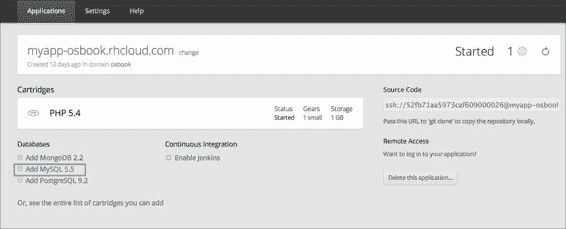
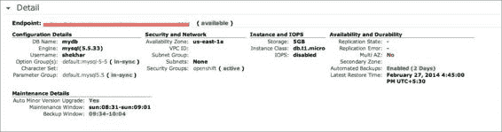

# 第四章. 在 OpenShift 应用程序中使用 MySQL

本章展示了一些教程，向你展示如何开始使用 OpenShift MySQL 数据库卡带。你将学习如何添加和管理 MySQL 卡带，如何进行 MySQL 数据库备份，以及如何在 OpenShift 应用程序中使用 Amazon RDS MySQL 支持。本章中的具体教程包括：

+   向应用程序添加 MySQL 卡带

+   向应用程序添加 phpMyAdmin 卡带

+   从本地机器访问 MySQL 数据库

+   使用 MySQL Workbench 从本地机器连接到 MySQL 卡带

+   更新 MySQL 最大连接数设置

+   更新 MySQL 配置设置

+   执行定期的 MySQL 数据库备份

+   使用 Amazon RDS MySQL 数据库实例与 OpenShift 配合使用

# 介绍

每个典型的 Web 应用程序都需要某种形式的持久数据存储在后台。OpenShift 支持多种存储选项，包括几个第三方提供商，这些提供商解放你免于处理硬件配置和数据库管理。在编写本书时，OpenShift 官方支持 MySQL、PostgreSQL 和 MongoDB 数据存储。除了这些受支持的数据库，还有可供下载的第三方数据库卡带，如 Redis 和 MariaDB。Red Hat 不支持这些可下载的卡带，因此你需要自行承担使用风险。本章将详细介绍 MySQL 卡带。第五章，*在 OpenShift 应用程序中使用 PostgreSQL*，以及第六章，*在 OpenShift 应用程序中使用 MongoDB 和第三方数据库卡带*，将分别介绍 PostgreSQL 和 MongoDB 卡带。

本章将使用我们在第三章，*创建与管理应用程序*中创建的 PHP 5.4 应用程序。如果你没有运行任何 OpenShift 应用程序，可以通过运行以下命令创建一个新的 OpenShift 应用程序：

```
$ rhc create-app myapp php-5.4

```

在前面的命令中，我们创建了一个不可扩展的应用程序，因为我们没有使用`–s`选项。如果应用程序是不可扩展的，则数据库卡带安装在与主应用程序卡带相同的设备上。如果你创建了一个可扩展的应用程序，则数据库卡带将安装在其专用设备上。这使得数据库可以使用所有可用的 RAM 和磁盘空间。我们将在第十一章中讨论可扩展的应用程序，*记录与扩展你的 OpenShift 应用程序*。

OpenShift 还提供了一个持久化数据目录来存储您的数据。该持久化数据目录不可扩展，因此不应与可扩展应用程序一起使用。对于可扩展应用程序，您应该使用像 Amazon S3 这样的第三方服务。

OpenShift 支持标准化的、经过安全加固的 MySQL、PostgreSQL 和 MongoDB 数据库版本。如果出现问题，OpenShift 运维团队可帮助解决操作问题。而且，由于您使用的是标准版本的数据库，您不会被 OpenShift 锁定，如果需要，您可以轻松迁移数据。在本章中，我们将介绍如何定期备份数据库插件，以确保在出现问题时您始终可以保留数据。

如果在 OpenShift 中运行数据库不可行，或者您已经投资了第三方服务，您还可以使用第三方数据库服务，如 Amazon RDS。另一个您可能选择使用第三方数据库服务的原因是，OpenShift 的数据库插件不具备可扩展性。因此，对于需要水平可扩展、高可用数据库的应用程序，您可以使用本章涵盖的任何第三方数据库服务。本章将介绍如何将 Amazon RDS 与 OpenShift 应用程序结合使用。第五章 *与 OpenShift 应用程序一起使用 PostgreSQL* 和第六章 *与 OpenShift 应用程序一起使用 MongoDB 和第三方数据库插件* 将介绍第三方 PostgreSQL 和 MongoDB 云数据库服务。

# 将 MySQL 插件添加到您的应用程序中

在写作本文时，OpenShift 支持两种版本的 MySQL 数据库。您可以通过运行以下命令查看支持的 MySQL 版本：

```
$ rhc cartridges|grep mysql
mysql-5.1           MySQL 5.1                               addon
mysql-5.5           MySQL 5.5                               addon

```

## 准备工作

为了准备本操作，您需要在机器上安装 `rhc` 命令行客户端。请参阅第一章 *安装 OpenShift rhc 命令行客户端* 章节，获取更多详细信息。此外，我们将在第三章 *使用 rhc 命令行客户端创建 OpenShift 应用程序* 章节中使用创建的应用程序。

## 如何操作…

按照以下步骤将 MySQL 数据库插件添加到您的 OpenShift 应用程序并进行管理：

1.  要将 MySQL 5.5 插件添加到 `myapp` 应用程序中，打开一个新的命令行终端，将目录切换到 `myapp` 目录位置，并执行以下命令：

    ```
    $ rhc add-cartridge -c mysql-5.5 --app myapp

    ```

1.  这将会在你的应用程序 gear 上安装一个新的 MySQL 数据库实例。`-c` 选项用于指定 Cartridge 名称，`--app` 选项用于指定应用程序名称。如果你从应用程序目录中运行命令，则 `--app` 选项不是必需的。`-c` 选项是必需的，但你可以省略 `-c`，因为 `rhc` 命令行客户端足够智能，可以推断出 `mysql-5.5` 是 Cartridge 名称。以下命令可以看出：

    ```
    $ rhc cartridge-add mysql-5.5

    ```

1.  你可以使用 `rhc show-cartridge` 命令查看 Cartridge 详情，如下命令行所示：

    ```
    $ rhc show-cartridge mysql
    Using mysql-5.5 (MySQL 5.5) for 'mysql'
    mysql-5.5 (MySQL 5.5)
    ---------------------
     Gears:          Located with php-5.4
     Connection URL: mysql://$OPENSHIFT_MYSQL_DB_HOST:$OPENSHIFT_MYSQL_DB_PORT/
     Database Name:  myapp
     Password:       lQkran3E1a4K
     Username:       adminjL3VBAM

    ```

1.  要停止 MySQL 数据库 Cartridge，请使用如下命令中的 `stop` 命令：

    ```
    $ rhc stop-cartridge mysql

    ```

1.  要重新启动 MySQL 数据库 Cartridge，请使用如下命令中的 `restart` 命令：

    ```
    $ rhc restart-cartridge mysql

    ```

1.  最后，如果你想从应用程序中删除 MySQL 数据库，可以使用如下命令中的 `remove` 命令：

    ```
    $ rhc remove-cartridge mysql --confirm

    ```

## 它是如何工作的…

当你运行 `rhc cartridge-add` 命令时，`rhc` 会向 OpenShift 服务器发送一个 HTTP POST 请求。OpenShift 服务器接收请求后，会为你的应用程序实例化一个新的 MySQL 服务器。MySQL 服务器配置完成后，`rhc` 客户端会在命令行终端显示数据库详情，如下所示：

```
Adding mysql-5.5 to application 'myapp' ... done

mysql-5.5 (MySQL 5.5)
---------------------
 Gears:          Located with php-5.4
 Connection URL: mysql://$OPENSHIFT_MYSQL_DB_HOST:$OPENSHIFT_MYSQL_DB_PORT/
 Database Name:  myapp
 Password:       lQkran3E1a4K
 Username:       adminjL3VBAM

MySQL 5.5 database added.  Please make note of these credentials:

 Root User: adminjL3VBAM
 Root Password: lQkran3E1a4K
 Database Name: myapp

Connection URL: mysql://$OPENSHIFT_MYSQL_DB_HOST:$OPENSHIFT_MYSQL_DB_PORT/

```

你可以通过 SSH 登录到你的应用程序 gear 来查看 MySQL 安装：

```
$ rhc ssh --app myapp 

```

然后运行 `ls` 命令查看 gear 目录结构：

```
[myapp-osbook.rhcloud.com 52fb71aa5973caf609000026]\> ls -p
app-deployments/  app-root/  git/  mysql/  php/

```

`mysql` 目录托管了你的 `mysql` 安装。MySQL 数据库不与任何其他 OpenShift 应用程序或用户共享。它仅供你的应用程序使用，只有你的应用程序可以访问它。

你可以使用 `mysql` 命令行客户端连接到 `mysql` 目录并访问你的 MySQL 数据库，如下命令所示：

```
[myapp-osbook.rhcloud.com 52fb71aa5973caf609000026]\> mysql
Welcome to the MySQL monitor.  Commands end with ; or \g.
Your MySQL connection id is 3
Server version: 5.5.32 MySQL Community Server (GPL)

Type 'help;' or '\h' for help. Type '\c' to clear the current input statement.

mysql>

```

现在，你可以对 MySQL 服务器运行 SQL 命令。要查看所有数据库，运行以下命令：

```
mysql> SHOW DATABASES;
+--------------------+
| Database           |
+--------------------+
| information_schema |
| myapp              |
| mysql              |
| performance_schema |
+--------------------+
4 rows in set (0.00 sec)

```

`myapp` 数据库对应于你的应用程序数据库。你可以使用此数据库为你的应用程序服务，或者使用 `CREATE DATABASE` 命令创建一个新数据库。要查看 MySQL 数据库的运行时间，尝试运行以下命令：

```
mysql> SHOW STATUS LIKE 'Uptime';
+---------------+-------+
| Variable_name | Value |
+---------------+-------+
| Uptime        | 2573  |
+---------------+-------+
1 row in set (0.00 sec)

```

输出显示 MySQL 服务器已启动 `2573` 秒。

你可以通过输入 `mysql` 并按两次 *Tab* 键，查看 gear 上所有可用的 MySQL 命令行工具：

```
[myapp-osbook.rhcloud.com 52fb71aa5973caf609000026]\> mysql
mysql                       mysql_convert_table_format  mysql_fix_privilege_tables  mysqlslap
mysqlaccess                 mysqld_multi                mysqlhotcopy  mysqltest
mysqladmin                  mysqld_safe                 mysqlimport   mysql_tzinfo_to_sql
mysqlbinlog                 mysqldump                   mysql_install_db            mysql_upgrade
mysqlbug                    mysqldumpslow               mysql_secure_installation   mysql_waitpid
mysqlcheck                  mysql_find_rows             mysql_setpermission         mysql_zap
mysql_config                mysql_fix_extensions        mysqlshow

```

## 还有更多…

你还可以通过 OpenShift Web 控制台添加 MySQL Cartridge。访问 [`openshift.redhat.com/app/console/applications`](https://openshift.redhat.com/app/console/applications)，然后点击 `myapp` 应用程序以查看详情。在 `myapp` 应用程序详情页面上，你将看到添加 MySQL 数据库的选项，如下图所示。点击 **Add MySQL 5.5** 链接以添加 MySQL 5.5 Cartridge。



接下来，点击 **Add Cartridge** 按钮，将 MySQL 5.5 Cartridge 添加到你的应用程序中，如下图所示：


安装 MySQL 卡带后，您将看到以下 MySQL 数据库详细信息：


## 另请参见

+   第三章中的 *使用 rhc 命令行客户端创建 OpenShift 应用程序* 配方，*创建与管理应用程序*

+   *将 phpMyAdmin 卡带添加到您的应用程序* 配方

+   从本地机器访问 MySQL 数据库的配方

# 将 phpMyAdmin 卡带添加到您的应用程序

phpMyAdmin（您可以访问 [`www.phpmyadmin.net/`](http://www.phpmyadmin.net/)）是一个免费的开源工具，使用 PHP 编程语言编写，旨在通过 Web 浏览器管理 MySQL 数据库。在本配方中，您将学习如何将 phpMyAdmin 卡带安装到您的应用程序中。

## 准备工作

要完成此配方，您需要一个带有 MySQL 卡带的应用程序。请参考本章中的 *将 MySQL 卡带添加到您的应用程序* 配方，了解如何添加 MySQL 卡带。

## 如何操作…

本配方将引导您完成将 phpMyAdmin 卡带添加到 OpenShift 应用程序所需的所有步骤：

1.  要将 phpMyAdmin 卡带安装到 `myapp` 应用程序，请打开一个新的命令行终端，切换到 `myapp` 目录位置，然后执行以下命令：

    ```
    $ rhc add-cartridge phpmyadmin-4

    ```

1.  注意 `rhc add-cartridge` 命令返回的用户名和密码。您将需要这些凭据才能登录到 phpMyAdmin。phpMyAdmin 的凭据与 MySQL 数据库的凭据相同，您可以随时通过执行 `rhc show-app` 命令查看它们。

1.  使用步骤 1 中获得的凭据登录到 phpMyAdmin，网址为 `https://myapp-{domain-name}.rhcloud.com/phpmyadmin/`。

## 它是如何工作的…

当您运行 `rhc cartridge-add` 命令时，`rhc` 客户端会向 OpenShift 服务器发出 HTTP POST 请求。OpenShift 服务器接收到请求后，会在应用程序硬件上安装 phpMyAdmin 卡带。phpMyAdmin 卡带适用于所有支持的应用程序类型（Java、Python、Node.js、Ruby、Perl 和 PHP）。您无需创建 PHP 应用程序即可使用 phpMyAdmin 卡带。OpenShift 将启动一个 Apache 进程来运行 phpMyAdmin 应用程序。

### 注意

只有在将 MySQL 卡带添加到应用程序后，您才能添加 phpMyAdmin 卡带。如果在添加 MySQL 卡带之前尝试添加 phpMyAdmin 卡带，您将遇到错误，`Cartridge 'phpmyadmin-4' cannot be added without mysql`。依赖项 `mysql` 可以通过 `mysql-5.5` 或 `mysql-5.1` 来满足。

## 还有更多内容…

您还可以从 OpenShift Web 控制台添加 phpMyAdmin 卡带。请访问 [`openshift.redhat.com/app/console/applications`](https://openshift.redhat.com/app/console/applications)，并添加 phpMyAdmin 卡带。

## 另请参见

+   *将 MySQL 卡带添加到您的应用程序* 配方

+   *从本地计算机访问 MySQL 数据库*配方

# 从本地计算机访问 MySQL 数据库

在本章的*将 MySQL 载体添加到您的应用程序*配方中，您学会了通过在应用程序齿轮上执行 SSH 来访问 MySQL 数据库。在此配方中，您将学习如何从本地计算机连接到 MySQL 数据库。

## 准备工作

要完成此配方，您需要一个带有 MySQL 载体的应用程序。请参阅*将 MySQL 载体添加到您的应用程序*配方，了解如何安装 MySQL 载体。此外，您需要在您的计算机上安装`mysql`命令行客户端。您可以从官方网站[`dev.mysql.com/downloads/mysql/`](http://dev.mysql.com/downloads/mysql/)下载包含`mysql`命令行客户端的 MySQL 社区服务器。

## 如何做到…

按照以下步骤从本地计算机访问 MySQL 载体：

1.  打开命令行终端，并将目录更改为`myapp`应用程序目录。执行以下命令将远程端口转发到本地计算机：

    ```
    $ rhc port-forward --app myapp

    ```

1.  上述命令的输出将列出您可以从本地计算机连接的端口及其服务。输出如下：

    ```
    Service Local               OpenShift
    ------- -------------- ---- -------------------
    httpd   127.0.0.1:8080  =>  127.12.123.129:8080
    mysql   127.0.0.1:3306  =>  127.12.123.130:3306
    Press CTRL-C to terminate port forwarding

    ```

1.  按照以下命令从本地`mysql`命令行客户端连接到 MySQL 服务器。您可以使用`rhc show-app`或`rhc cartridge-show mysql`命令获取 MySQL 载体的用户名和密码。主机名和端口在`rhc port-forward`命令的输出中可用。

    ```
    $ mysql --user=<user> --password=<password> --host 127.0.0.1 --port 3306

    ```

1.  连接到 MySQL 服务器后，您可以按如下方式运行任何有效的 SQL 命令：

    ```
    mysql> SHOW DATABASES;
    +--------------------+
    | Database           |
    +--------------------+
    | information_schema |
    | myapp              |
    | mysql              |
    | performance_schema |
    +--------------------+
    4 rows in set (0.38 sec)

    ```

## 工作原理…

在步骤 1 中，您使用`rhc port-forward`命令将所有远程端口转发到本地计算机。`rhc port-forward`命令是 SSH 端口的包装器。转发使得远程计算机上的端口在本地计算机上可用。远程计算机上本来无法访问的端口，您可以像访问本地计算机上的端口一样使用。以下命令返回您可以从本地计算机连接的端口列表：

```
$ rhc port-forward --app myapp
Checking available ports ... done
Forwarding ports ...

To connect to a service running on OpenShift, use the Local address

Service Local               OpenShift
------- -------------- ---- ------------------
httpd   127.0.0.1:8080  =>  127.9.255.129:8080
mysql   127.0.0.1:3306  =>  127.9.255.130:3306

Press CTRL-C to terminate port forwarding

```

正如您从上述输出中看到的，MySQL 进程在`127.0.0.1`主机的端口`3306`上可用。

在步骤 2 中，您从本地计算机连接到 MySQL 服务器，传入数据库的用户名、密码、主机和端口。连接成功后，在步骤 3 中运行了一个 SQL 命令。

要终止端口转发，请在运行`rhc port-forward`命令的命令行终端上按下*Ctrl* + *C*。

## 参见

+   *将 MySQL 载体添加到您的应用程序*配方

+   *使用 MySQL Workbench 从本地计算机连接到 MySQL 载体*配方

# 使用 MySQL Workbench 从本地计算机连接到 MySQL 载体

在*从本地机器访问 MySQL 数据库*配方中，我们向你展示了如何通过本地机器使用端口转发，从`mysql`命令行连接到 MySQL 数据库。在本配方中，你将学习如何通过 MySQL Workbench 连接到 MySQL 数据库。MySQL Workbench 是一个可视化的数据库设计工具，将 SQL 开发、管理、数据库设计、创建和维护集成到一个统一的开发环境中，用于 MySQL 数据库系统。

## 准备工作

完成此配方，你需要一个带有 MySQL 插件的应用程序。请参考本章的*将 MySQL 插件添加到你的应用程序*配方，学习如何安装 MySQL 插件。此外，你还需要在本地机器上安装 MySQL Workbench。你可以从 MySQL 官方网站下载 MySQL Workbench：[`dev.mysql.com/downloads/tools/workbench/`](http://dev.mysql.com/downloads/tools/workbench/)。

## 如何操作…

按照以下步骤，通过在本地机器上运行的 MySQL Workbench 连接到 MySQL 插件：

1.  打开命令行终端，切换到`myapp`应用程序目录。执行以下命令将远程端口转发到本地机器：

    ```
    $ rhc port-forward --app myapp

    ```

1.  启动 MySQL Workbench 应用程序，你将看到以下截图。点击加号按钮添加一个新的 MySQL 连接。

1.  通过输入 MySQL 数据库的详细信息设置新连接。你可以通过`rhc show-app`或`rhc cartridge-show` `mysql`命令获取 MySQL 插件的用户名和密码。主机名和端口可在`rhc port-forward`命令的输出中找到。以下截图显示了**设置新连接**页面：

1.  接下来，点击**测试连接**按钮以测试连接。连接成功后，你将看到以下对话框，并显示消息**连接参数正确**：

1.  通过点击**确定**按钮连接到 MySQL 插件。你将在 MySQL Workbench 界面上看到新的连接列表，点击该连接以打开 SQL 编辑器。

1.  现在，你可以在 SQL 编辑器中运行任何合法的 SQL 查询，如下图所示：

## 它是如何工作的…

在步骤 1 中，你使用了`rhc port-forward`命令将所有远程端口转发到本地机器。这使得能够连接到你应用程序内运行的 MySQL 数据库。从步骤 2 到步骤 6，你创建了一个新的 MySQL 连接，并通过 MySQL Workbench 连接到 MySQL 插件。在步骤 7 中，你通过 SQL 编辑器执行了一个 SQL 查询，以检查该连接是否正在从安装在`myapp`应用程序中的 MySQL 插件获取数据。

## 另见

+   *将 MySQL 插件添加到你的应用程序*配方

+   *从本地计算机访问 MySQL 数据库*的配方

# 更新 MySQL 最大连接数设置

当所有可用连接都被其他客户端占用时，MySQL 数据库将开始产生过多的连接错误。在此配方中，您将学习如何更新 MySQL 卡带的最大连接数设置。

## 准备工作

要完成此配方，您需要一个带有 MySQL 卡带的应用程序。请参考本章的*将 MySQL 卡带添加到你的应用程序*配方，了解如何安装 MySQL 卡带。

## 如何做到…

按照以下步骤更新 MySQL 最大连接数设置：

1.  要将最大连接数设置为`200`，请打开命令行终端，并运行以下命令：

    ```
    $ rhc env-set OPENSHIFT_MYSQL_MAX_CONNECTIONS=200 --app myapp

    ```

1.  设置环境变量后，必须使用以下命令重启 MySQL 卡带，才能使更改生效：

    ```
    $ rhc cartridge-restart mysql --app myapp

    ```

## 它是如何工作的…

MySQL 数据库支持的连接数由 `max_connections` 系统变量控制。`max_connections` 的默认值是 `151`。您可以通过运行以下 SQL 查询来查看当前值。要查看 OpenShift 应用程序的 `max_connections`，请 SSH 进入应用程序 gear，并运行以下命令：

```
mysql> show variables like 'max_connections';
+-----------------+-------+
| Variable_name   | Value |
+-----------------+-------+
| max_connections | 151   |
+-----------------+-------+

```

配置 `max_connections` 系统变量的一种方法是在 `my.cnf` MySQL 配置文件中的 `[mysqld]` 部分添加 `max_connections = 200`。此方案在 OpenShift 中不起作用，因为 `my.cnf` 文件是只读的。为了允许用户更改 `max_connections` 值，OpenShift 提供了一个名为 `OPENSHIFT_MYSQL_MAX_CONNECTIONS` 的环境变量，可以用来设置 `max_connections` 系统变量。在第 1 步中，您将 `OPENSHIFT_MYSQL_MAX_CONNECTIONS` 环境变量设置为 `200`。MySQL 服务器不会读取新值，除非您重启数据库。因此，在第 2 步中，您通过 `rhc cartridge-restart` 命令重启了数据库。要验证 `max_connections` 值是否更新，您可以再次运行以下 SQL 命令：

```
mysql> show variables like 'max_connections';
+-----------------+-------+
| Variable_name   | Value |
+-----------------+-------+
| max_connections | 200   |
+-----------------+-------+

```

这是更新 MySQL `max_connections` 系统变量值的推荐方式。此方法的唯一缺点是您必须重启 MySQL 数据库，根据情况，这可能不是理想的方式。您还可以通过执行以下 SQL 命令来更新 `max_connections` 系统变量：

```
mysql> set global max_connections = 200;

```

这将立即生效，并且无需重启。但是，一旦 MySQL 数据库重启，此值将会丢失。

最佳方案是将两种方法结合起来。首先运行 `set global max_connections = 200;` SQL 命令，确保 `max_connections` 被即时更新，然后使用 `rhc env-set` 命令创建一个新的环境变量。这意味着下次启动 MySQL 数据库时，它将从环境变量中获取该值。

## 另请参见

+   *将 MySQL 卡带添加到你的应用程序*的配方

+   *更新 MySQL 配置设置* 配方

# 更新 MySQL 配置设置

MySQL 数据库将其配置设置存储在 `my.cnf` 文件中。该文件位于 MySQL 插件安装目录下的 `conf` 文件夹中。如前所述，OpenShift 不允许用户更新 `my.cnf` 配置文件。解决方法是使用一组环境变量来配置 MySQL 数据库的各种设置。

在撰写本书时，你可以通过环境变量配置以下 MySQL 设置：

| MySQL 设置 | OpenShift 环境变量 |
| --- | --- |
| `lower_case_table_names` | `OPENSHIFT_MYSQL_LOWER_CASE_TABLE_NAMES` |
| `default-storage-engine` | `OPENSHIFT_MYSQL_DEFAULT_STORAGE_ENGINE` |
| `max_connections` | `OPENSHIFT_MYSQL_MAX_CONNECTIONS` |
| `ft_min_word_len` | `OPENSHIFT_MYSQL_FT_MIN_WORD_LEN` |
| `ft_max_word_len` | `OPENSHIFT_MYSQL_FT_MAX_WORD_LEN` |
| `innodb_use_native_aio` | `OPENSHIFT_MYSQL_AIO` |
| `default-time-zone` | `OPENSHIFT_MYSQL_TIMEZONE` |
| `table_open_cache` | `OPENSHIFT_MYSQL_TABLE_OPEN_CACHE` |

## 准备工作

要完成这个配方，你需要一个包含 MySQL 插件的应用程序。请参考本章的 *将 MySQL 插件添加到你的应用程序* 配方，学习如何将 MySQL 插件添加到你的应用程序中。

## 如何操作…

按照以下步骤更新 MySQL 的 `lower_case_table_names` 配置：

1.  要设置 `lower_case_table_names` 设置，你应该输入以下命令：

    ```
    $ rhc env-set OPENSHIFT_MYSQL_LOWER_CASE_TABLE_NAMES=1 --app myapp

    ```

1.  设置环境变量后，你需要使用以下命令重启 MySQL 插件，以使更改生效：

    ```
    $ rhc cartridge-restart mysql --app myapp

    ```

## 它的工作原理…

它的工作原理是，OpenShift 提供了一组环境变量，你可以设置这些变量来配置 MySQL 的配置设置。在设置好环境变量后，你需要重启 MySQL 数据库，以便它能使用新的配置值。

## 另见

+   *将 MySQL 插件添加到你的应用程序* 配方

+   *更新 MySQL 最大连接数设置* 配方

# 执行定期 MySQL 数据库备份

在这个配方中，你将学习如何执行 MySQL 数据库的定期备份并将其上传到 Amazon S3。

## 准备工作

要完成这个配方，你需要一个包含 MySQL 插件的应用程序。请参考本章的 *将 MySQL 插件添加到你的应用程序* 配方，学习如何安装 MySQL 插件。另外，你需要一个 Amazon AWS 账户。访问 [`aws.amazon.com/`](http://aws.amazon.com/)，如果你还没有账户，请注册一个新的账户。

## 如何操作…

按照以下步骤设置 MySQL 插件的每日备份：

1.  访问 [`console.aws.amazon.com/s3/home`](https://console.aws.amazon.com/s3/home)，并创建一个新的存储桶来存储你的数据库备份。

1.  通过运行以下命令向你的应用程序添加一个 `cron` 插件：

    ```
    $ rhc add-cartridge cron --app myapp

    ```

1.  SSH 进入应用服务器，并在`$OPENSHIFT_DATA_DIR`下载`s3-bash`工具。然后，运行以下命令将其解压到`s3-bash`目录：

    ```
    $ rhc ssh --app myapp
    $ cd $OPENSHIFT_DATA_DIR
    $ wget http://s3-bash.googlecode.com/files/s3-bash.0.02.tar.gz
    $ mkdir s3-bash
    $ tar -xf s3-bash.0.02.tar.gz -C s3-bash

    ```

1.  在`$OPENSHIFT_DATA_DIR/s3-bash`目录中创建一个名为`AWSSecretAccessKeyIdFile`的新文件，并将你的 Amazon 访问密钥秘密存储其中。这是`s3-bash`与 Amazon S3 通信所必需的。

1.  在你的本地机器上创建一个位于`.openshift/cron/minutely`的脚本，名为`database_backup.sh`，并将以下内容添加到该脚本中：

    ```
    #!/bin/bash
    if [ `date +%H:%M` == "23:50" ]
    then
        FILE_NAME=$(date +"%Y%m%d%H%M")
        mysqldump --user $OPENSHIFT_MYSQL_DB_USERNAME -p$OPENSHIFT_MYSQL_DB_PASSWORD --host $OPENSHIFT_MYSQL_DB_HOST $BACKUP_DATABASE_NAME > $OPENSHIFT_DATA_DIR/$FILE_NAME.sql
        echo "Took MySQL Dump" >> $OPENSHIFT_CRON_DIR/log/backup.log
        $OPENSHIFT_DATA_DIR/s3-bash/s3-put -k $AWS_ACCESS_KEY_ID -s $OPENSHIFT_DATA_DIR/s3-bash/AWSSecretAccessKeyIdFile -T $OPENSHIFT_DATA_DIR/$FILE_NAME.sql /$AWS_S3_BUCKET/$FILE_NAME.sql
        echo "Uploaded dump to Amazon S3" >> $OPENSHIFT_CRON_DIR/log/backup.log
        rm -f $OPENSHIFT_DATA_DIR/$FILE_NAME.sql
    fi
    ```

1.  上述脚本将每天`23:50`运行，并执行`mysqldump`命令生成数据转储文件。然后，使用`s3-bash` API 将该文件传输到 Amazon S3。最后，上传文件后，它会从应用服务器删除 SQL 转储文件。

1.  创建以下环境变量。请参考 Amazon EC2 文档，了解如何创建访问密钥和`S3 桶`的详细步骤。然后，运行以下命令：

    ```
    $ rhc env-set AWS_ACCESS_KEY_ID=< Your Amazon ACCESS_KEY_ID>
    $ rhc env-set BACKUP_DATABASE_NAME=<Database you want to take backup off>
    $ rhc env-set AWS_S3_BUCKET=<Amazon S3 bucket name >

    ```

1.  接下来，提交代码并将其推送到 OpenShift 应用服务器。该计划任务将在每晚`23:50`（11:50 pm）执行，以进行数据库备份，并将备份上传到 Amazon S3：

    ```
    $ git commit –am "database backup script added"
    $ git push

    ```

## 它是如何工作的……

在第 1 步中，你创建了一个新的 Amazon S3 桶来存储 MySQL 数据库备份。Amazon S3 被广泛用于存储静态文件，是进行此任务的理想选择。接下来，在第 2 步中，你为应用添加了`cron`插件。`cron`插件将用于在特定时间执行每日备份。

Amazon S3 提供其 REST 服务，用户可以使用这些服务对 S3 桶执行操作。Amazon 为多个编程语言提供了围绕其 REST API 的封装，方便开发者将其集成到应用中。为了保持本食谱的语言无关性，我们使用了 Amazon 的`S3-bash`包装器。尽管 Amazon 官方并不支持此包装器，但它仍然能够很好地工作。在第 3 步中，你使用`wget`工具下载了`s3-bash`包装器。`tar.gz`文件被存储在`$OPENSHIFT_DATA_DIR`中，然后你将其解压到`s3-bash`目录。

在第 4 步中，你创建了一个名为`AWSSecretAccessKeyIdFile`的文件来存储 Amazon 访问密钥的秘密。`s3-bash`包装器使用此文件来获取 AWS 的秘密访问密钥 ID，从而确保它不会出现在使用`ps`命令查看的运行进程列表中。

在第 5 步中，你创建了一个 bash 脚本，该脚本将在每晚 11:50 pm 执行。该脚本首先使用`mysqldump`命令进行数据库备份，然后将文件上传到 Amazon S3。文件名为当前的时间戳。最后，上传备份到 S3 后，脚本会删除备份文件以节省磁盘空间。如果你的 MySQL 数据库较大，可能希望压缩`mysqldump`的输出。你只需更新第 5 步中的`mysqldump`命令，使用以下命令所示的方式：

```
mysqldump --user $OPENSHIFT_MYSQL_DB_USERNAME -p$OPENSHIFT_MYSQL_DB_PASSWORD --host $OPENSHIFT_MYSQL_DB_HOST $BACKUP_DATABASE_NAME | gzip -9 > $OPENSHIFT_DATA_DIR/$FILE_NAME.gz

```

在上述命令中，我们使用了`gzip`，一种流行的数据压缩程序，来压缩`mysqldump`输出。

在第 6 步中，你创建了备份脚本所需的三个环境变量。最后，在第 7 步中，你提交了更改并将其推送到 OpenShift 应用程序配置。

## 另请参见

+   *将 MySQL 卡片添加到你的应用程序*配方

# 使用 Amazon RDS MySQL DB 实例与 OpenShift

**Amazon 关系型数据库服务**（**Amazon RDS**）是一个 Web 服务，它使你可以轻松地在 Amazon EC2 上设置、操作和扩展关系型数据库。它提供了对 MySQL、Oracle、PostgreSQL 和 Microsoft SQL Server 数据库引擎的访问。除了标准的数据库功能外，RDS 还提供以下功能：

+   自动数据库补丁

+   自动备份

+   时间点恢复

+   通过单个 API 调用进行数据库实例的垂直扩展

在本配方中，你将学习如何在 OpenShift 应用程序中使用 Amazon RDS MySQL 数据库服务。

## 准备工作

要完成此配方，你需要一个带有 MySQL 卡片的应用程序。请参考本章的*将 MySQL 卡片添加到你的应用程序*配方，学习如何安装 MySQL 卡片。另外，你需要有一个 Amazon AWS 账户。如果你还没有，请访问 [`aws.amazon.com/`](http://aws.amazon.com/)，并注册一个新账户。

## 如何操作…

按照以下步骤，了解如何在 OpenShift 应用程序中使用 Amazon RDS MySQL 数据库：

1.  访问 [`console.aws.amazon.com/rds/home`](https://console.aws.amazon.com/rds/home)，然后点击**安全组**，如下面的截图所示：

1.  点击**创建 DB 安全组**选项以创建一个新的安全组，然后在点击**添加**按钮之前，输入新安全组的详细信息（如下图所示）：

1.  新的安全组将显示在安全组列表中。点击详情图标查看安全组详情。

1.  接下来，配置安全组以允许来自所有 IP 的流量。输入 CIDR 值`0.0.0.0/0`后，点击**添加**按钮，如下图所示：

1.  几秒钟后，新创建的 CIDR 连接类型将在**安全组详情**下显示：

1.  点击左侧导航栏中的**实例**选项，然后点击**启动 DB 实例**：

1.  接下来，你需要选择你想要使用的数据库引擎。选择**使用 MySQL 数据库**选项。

1.  接下来，你需要选择是否将这个数据库用于生产还是开发目的。我们选择**否**，但对于生产环境，建议选择**是**。

1.  然后，输入数据库的详细信息，包括 MySQL 版本、数据库标识符、用户名和连接 MySQL 数据库的密码等，具体内容如下图所示：

1.  在**附加配置**页面，你需要提供 RDS 启动 MySQL 数据库所需的附加信息。你需要指定数据库名称、端口、可用区、数据库安全组等。数据库安全组非常重要，因为我们希望使用在第 3 步中创建的安全组。输入详细信息后点击**下一步**。请看以下截图：

1.  接下来，在**管理选项**页面，你可以指定数据库实例的备份和维护选项，如以下截图所示：

1.  最后，你可以在**审核**页面查看你的数据库实例的详细信息。

1.  新 MySQL 数据库实例的创建和配置大约需要一分钟左右，完成后，它将出现在数据库实例列表中，正如以下截图所示：

1.  在你能够连接到 Amazon RDS MySQL 数据库实例之前，你需要了解新创建实例的详细信息。可以通过点击数据库实例列表中的详细信息图标来查看 MySQL 数据库实例的详细信息，正如以下截图所示：

1.  点击详细信息页面图标后，你可以查看到可以连接的 MySQL 主机名。主机信息位于**Endpoint**旁边，且它将是`*.rds.amazonaws.com`的子域名，如以下截图所示：

1.  若要连接到 MySQL 数据库实例，你需要在 Gear 上安装 MySQL 命令行客户端。每个 OpenShift 应用 Gear 已经预装了`mysql`命令行代理，所以你无需做任何额外操作。只需使用`rhc ssh`命令 SSH 连接到应用 Gear，然后运行以下命令：

    ### 提示

    用户名和密码对应你在第 10 步中创建的内容。

    ```
    $ mysql --host <host_endpoint>.rds.amazonaws.com --port 3306 -u <username> -p<password> <database_name>

    ```

1.  一旦连接成功，你可以执行任何 SQL 命令。要检查 MySQL 数据库的运行时，你可以运行以下命令：

    ```
    Welcome to the MySQL monitor.  Commands end with ; or \g.
    Your MySQL connection id is 12
    Server version: 5.5.33-log Source distribution

    Copyright (c) 2000, 2011, Oracle and/or its affiliates. All rights reserved.

    Type 'help;' or '\h' for help. Type '\c' to clear the current input statement.

    mysql> SHOW STATUS like 'Uptime';
    +---------------+-------+
    | Variable_name | Value |
    +---------------+-------+
    | Uptime        | 2227  |
    +---------------+-------+
    1 row in set (0.33 sec)

    mysql>

    ```

## 它是如何工作的…

每个 Amazon RDS 实例都有一个防火墙，防止任何外部访问。因此，在你创建 Amazon RDS 实例之前，你应该创建一个新的数据库安全组，允许某个 IP 范围的访问。从第 1 步到第 6 步，你已经创建了一个新的安全组，允许所有 IP 地址连接到你的 Amazon MySQL 数据库实例。`0.0.0.0/0`值允许所有 IP 访问数据库实例。这在如 OpenShift 等不提供静态 IP 的环境中尤为重要。

第 7 步到第 14 步帮助你创建了一个新的 Amazon RDS MySQL 数据库实例。你需要提供与数据库实例相关的详细信息，Amazon RDS 会根据你输入的详细信息来配置数据库实例。在第 14 步时，你已经有了一个可以从外部世界连接的 MySQL 数据库实例。你可以从本地机器或者 OpenShift 应用 Gear 连接到它。

步骤 15 和步骤 16 帮助你查看了 MySQL 数据库实例的详细信息。最重要的细节是 MySQL 数据库实例所托管的主机名。在步骤 17 中，你使用这些详细信息通过 `mysql` 命令行客户端连接到 Amazon RDS MySQL 数据库实例。在步骤 18 中，你运行了一个简单的 SQL 查询以检查数据库的运行时间。

## 还有更多…

你可以通过配置 RDS 实例只接受来自授权用户的 SSL 加密连接来使 MySQL 数据库连接更加安全。要配置 SSL，请执行以下 SQL 命令。请将用户名替换为你的 MySQL 数据库实例的用户名：

```
mysql> GRANT USAGE ON *.* TO 'username'@'%' REQUIRE SSL;

```

现在，如果你退出连接并尝试使用步骤 5 中提到的 `mysql` 命令重新登录，你将会遇到访问被拒绝的错误：

```
[myapp-osbook.rhcloud.com 530f227e50044604f9000060]\> mysql --host <host_endpoint>.rds.amazonaws.com --port 3306 -u <username> -p<password> <db_name>
ERROR 1045 (28000): Access denied for user 'username'@'ip-10-181-217-44.ec2.internal' (using password: YES)

```

要连接到 MySQL 数据库实例，首先需要下载 Amazon RDS CA 证书。请前往 `$OPENSHIFT_DATA_DIR`，然后运行以下 `wget` 命令：

```
[myapp-osbook.rhcloud.com]\> cd $OPENSHIFT_DATA_DIR
[myapp-osbook.rhcloud.com data]\> wget https://s3.amazonaws.com/rds-downloads/mysql-ssl-ca-cert.pem
Next, connect to RDS instance using mysql command-line as shown below. Please note the use of ssl_ca parameter to reference the public key.
 [myapp-osbook.rhcloud.com data]\> mysql --host <host_endpoint>.rds.amazonaws.com --port 3306 -u <username> -p<password> <db_name> --ssl_ca=mysql-ssl-ca-cert.pem 
Welcome to the MySQL monitor.  Commands end with ; or \g.
Your MySQL connection id is 20
Server version: 5.5.33-log Source distribution
mysql> 

```

## 参见

+   *将 MySQL 扩展包添加到应用程序* 配方
