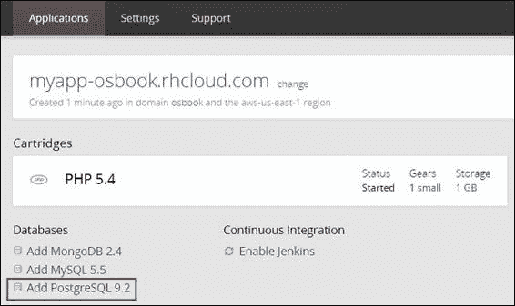
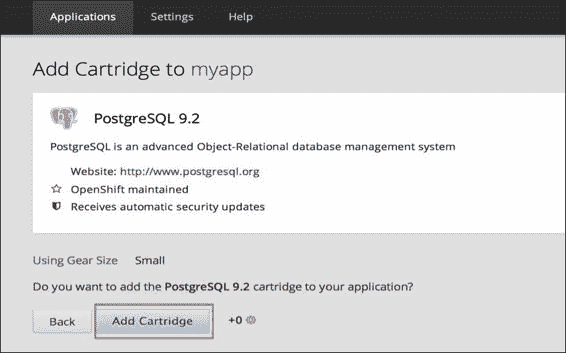
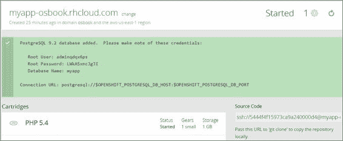
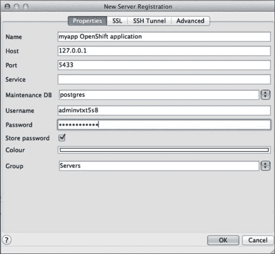
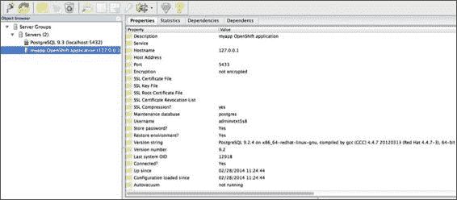
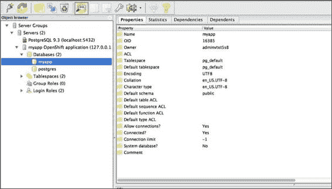

# 第五章：使用 PostgreSQL 与 OpenShift 应用程序

本章介绍了一些教程，展示了如何开始使用 OpenShift PostgreSQL 数据库扩展模块。您将学习如何添加和管理 PostgreSQL 扩展模块，如何备份 PostgreSQL 数据库，如何列出并安装 PostgreSQL 扩展，如何与 OpenShift 应用程序一起使用 EnterpriseDB PostgreSQL Cloud Database 服务。本章中的具体教程包括：

+   将 PostgreSQL 扩展模块添加到您的应用程序

+   从本地计算机访问 PostgreSQL 扩展模块

+   从本地计算机使用 pgAdmin 连接 PostgreSQL 扩展模块

+   更新 PostgreSQL 的 max_connections 设置

+   使用 .psqlrc 配置文件来配置 OpenShift 应用程序的 psql shell

+   执行定期的 PostgreSQL 数据库备份

+   在 OpenShift 中使用 EnterpriseDB PostgreSQL Cloud Database

+   安装 PostgreSQL 扩展

# 介绍

PostgreSQL 是一个流行的开源关系型数据库，全球许多 Web 应用程序都在使用它。OpenShift 支持一个标准化的、经过安全强化的 PostgreSQL 数据库版本。由于您使用的是标准版本的数据库，因此不会被限制在 OpenShift 内，并且在需要时可以轻松地迁移您的数据。

本章将使用我们在第三章中创建的 PHP 5.4 应用程序，*创建与管理应用程序*。如果您没有运行任何 OpenShift 应用程序，可以通过运行以下命令来创建一个新的 OpenShift 应用程序：

```
$ rhc create-app myapp php-5.4

```

如果在 OpenShift 中运行数据库不可行，或者您已经投资于第三方服务，您还可以使用第三方数据库服务，如 EnterpriseDB Cloud Database。另一个您可能想使用第三方数据库服务的原因是，OpenShift PostgreSQL 扩展模块不具备可扩展性。因此，对于需要水平可扩展且高度可用的 PostgreSQL 服务的应用程序，您可以使用第三方提供商（如 EnterpriseDB）与您的应用程序一起使用。

# 将 PostgreSQL 扩展模块添加到您的应用程序

在撰写本书时，OpenShift 支持两种版本的 PostgreSQL 数据库。您可以通过运行以下命令查看所有支持的 PostgreSQL 版本：

```
$ rhc cartridges|grep postgresql
postgresql-8.4      PostgreSQL 8.4                          addon
postgresql-9.2      PostgreSQL 9.2                          addon

```

在本教程中，您将学习如何将 PostgreSQL 9.2 扩展模块添加到您的 OpenShift 应用程序中。

## 准备工作

要完成此步骤，您需要在机器上安装 rhc 命令行客户端。有关详细信息，请参阅第一章，*开始使用 OpenShift*中关于*安装 OpenShift rhc 命令行客户端*的配方。另外，我们将使用在第三章，*创建和管理应用程序*中，*使用 rhc 命令行客户端创建 OpenShift 应用程序*配方中创建的应用程序。

## 如何操作……

要将 PostgreSQL 9.2 载荷安装到`myapp`应用程序中，请打开一个新的命令行终端，切换到`myapp`目录位置，然后执行以下命令：

```
$ rhc add-cartridge --app myapp -c postgresql-9.2

```

这将会在您的应用程序服务器上安装一个新的 PostgreSQL 服务器实例。`-c`选项用于指定载荷名称，`--app`选项用于指定应用程序名称。如果您在应用程序目录内运行命令，`--app`选项不是必需的。`-c`选项是必需的，但您可以省略`-c`，因为 rhc 命令行客户端足够智能，能够推断出 PostgreSQL 9.2 是载荷名称。命令可以简化为如下：

```
$ rhc cartridge-add postgresql-9

```

您可以使用`rhc show-cartridge`命令如下查看载荷详细信息：

```
$ rhc cartridge-show postgresql
Using postgresql-9.2 (PostgreSQL 9.2) for 'postgresql'
postgresql-9.2 (PostgreSQL 9.2)
-------------------------------
 Gears:          Located with php-5.4
 Connection URL: postgresql://$OPENSHIFT_POSTGRESQL_DB_HOST:$OPENSHIFT_POSTGRESQL_DB_PORT
 Database Name:  myapp
 Password:       dPLehGi-UGQi
 Username:       admin8awrwrc

```

您可以使用`stop`命令如下停止 PostgreSQL 服务器：

```
$ rhc cartridge-stop postgresql

```

您可以使用`restart`命令如下重启 PostgreSQL 服务器：

```
$ rhc cartridge-restart postgresql

```

如果您想从应用程序中移除 PostgreSQL 服务器，可以使用`remove`命令如下：

```
$ rhc cartridge-remove postgresql –-confirm

```

## 如何工作……

当您运行`rhc cartridge-add`命令时，rhc 将向 OpenShift 服务器发出一个 HTTP POST 请求。OpenShift 服务器将接收请求并在您的应用程序服务器上安装一个新的 PostgreSQL 数据库实例。在 Provision PostgreSQL 服务器之后，rhc 客户端将在命令行终端显示数据库详细信息，如下所示：

```
Adding postgresql-9.2 to application 'myapp' ... done

postgresql-9.2 (PostgreSQL 9.2)
-------------------------------
 Gears:          Located with php-5.4
 Connection URL: postgresql://$OPENSHIFT_POSTGRESQL_DB_HOST:$OPENSHIFT_POSTGRESQL_DB_PORT
 Database Name:  myapp
 Password:       dPLehGi-UGQi
 Username:       admin8awrwrc

PostgreSQL 9.2 database added.  Please make note of these credentials:

 Root User: admin8awrwrc
 Root Password: dPLehGi-UGQi
 Database Name: myapp

Connection URL: postgresql://$OPENSHIFT_POSTGRESQL_DB_HOST:$OPENSHIFT_POSTGRESQL_DB_PORT

```

您可以通过 SSH 连接到应用程序服务器，查看 PostgreSQL 安装情况：

```
$ rhc ssh --app myapp

```

然后，运行`ls`命令查看服务器目录结构，您将看到`postgresql`目录：

```
[myapp-osbook.rhcloud.com 531069cd5973cad58c0000b6]\> ls -p
app-deployments/  app-root/  git/  php/  postgresql/

```

`postgresql`目录是您 PostgreSQL 安装的位置，且不会与任何其他 OpenShift 应用程序或用户共享。它仅供您的应用程序使用，只有您的应用程序可以访问它。

您还可以使用`psql`命令行客户端连接到您的 PostgreSQL 服务器：

```
[myapp-osbook.rhcloud.com 531069cd5973cad58c0000b6]\> psql
psql (9.2.4)
Type "help" for help.

myapp=# 

```

现在，您可以对 PostgreSQL 服务器运行 SQL 命令。要查看所有数据库，请运行以下命令：

```
myapp=# \list
 List of databases
 Name    |    Owner     | Encoding |   Collate   |    Ctype    |   Access privileges 
-----------+--------------+----------+-------------+-------------+-----------------------
 myapp     | admin8awrwrc | UTF8     | en_US.UTF-8 | en_US.UTF-8 | 
 postgres  | postgres     | UTF8     | en_US.UTF-8 | en_US.UTF-8 | 
 template0 | postgres     | UTF8     | en_US.UTF-8 | en_US.UTF-8 | =c/postgres          +
 |              |          |             |             | postgres=CTc/postgres
 template1 | postgres     | UTF8     | en_US.UTF-8 | en_US.UTF-8 | =c/postgres          +
 |              |          |             |             | postgres=CTc/postgres
(4 rows)

myapp=#

```

`myapp`数据库对应您的应用程序数据库。您可以使用此数据库来支持您的应用程序，或者使用`CREATE DATABASE`命令创建一个新数据库。要查看 PostgreSQL 服务器的运行时间，请运行以下命令：

```
myapp=# select date_trunc('minute',current_timestamp - pg_postmaster_start_time()) as "postgresql_uptime";
 postgresql_uptime 
-------------------
 00:12:00
(1 row)

```

输出显示 PostgreSQL 服务器已运行了 12 分钟。

您可以查看所有可用的 PostgreSQL 命令行实用程序，通过输入 `pg_` 然后按 *Tab* 键。 *Tab* 键启用命令行自动完成功能，允许命令行程序自动填写命令的剩余部分：

```
[myapp-osbook.rhcloud.com 531069cd5973cad58c0000b6]\> pg_
pg_archivecleanup  pg_controldata     pg_dumpall         pg_resetxlog       pg_test_fsync 
pg_basebackup      pg_ctl             pg_filedump        pg_restore         pg_test_timing 
pg_config          pg_dump            pg_receivexlog     pg_standby

```

## 还有更多内容…

您也可以从 OpenShift Web 控制台添加 PostgreSQL 数据库。转到 [`openshift.redhat.com/app/console/applications`](https://openshift.redhat.com/app/console/applications)，并点击 `myapp` 应用程序查看详细信息。在 `myapp` 应用程序详细信息页面上，您将看到添加 PostgreSQL 数据库的选项，如下截图所示。点击 **Add PostgreSQL 9.2** 添加 PostgreSQL 9.2 配置。



接下来，您将被引导到页面以添加 PostgreSQL 配置。点击 **Add Cartridge** 添加 PostgreSQL 数据库到您的应用程序。查看以下截图：



安装 PostgreSQL 配置后，将显示 PostgreSQL 数据库详细信息，如下：



## 另请参阅

+   使用本地机器访问 PostgreSQL 配置的方法

# 使用本地机器访问 PostgreSQL 配置

在 *将 PostgreSQL 配置添加到您的应用程序* 配方中，您学习了如何通过执行 SSH 到应用程序配置获取 PostgreSQL 数据库。在本配方中，您将学习如何从本地机器连接到 PostgreSQL 数据库。

## 准备工作

要完成此配方，您需要一个带有 PostgreSQL 配置的应用程序。请参考本章的 *将 PostgreSQL 配置添加到您的应用程序* 配方，了解如何安装 PostgreSQL 配置。此外，您还需要在您的机器上安装 `psql` 命令行客户端。您可以从官方网站 [`www.postgresql.org/download/`](http://www.postgresql.org/download/) 下载 PostgreSQL 服务器。

## 如何实现…

执行以下步骤访问本地机器上的 PostgreSQL 配置：

1.  打开命令行终端，并切换到 `myapp` 应用程序目录。执行以下命令将远程端口转发到本地机器：

    ```
    $ rhc port-forward 
    Checking available ports ... done
    Forwarding ports ...
    Address already in use - bind(2) while forwarding port 5432\. Trying local port 5433

    To connect to a service running on OpenShift, use the Local address

    Service    Local               OpenShift
    ---------- -------------- ---- -----------------
    httpd      127.0.0.1:8080  =>  127.6.76.129:8080
    postgresql 127.0.0.1:5433  =>  127.6.76.130:5432

    ```

1.  使用 `psql` 命令行客户端从本地机器连接到 PostgreSQL 服务器，操作如下：

    ```
    $ psql --host <host> --port <port> --username <username> myapp

    ```

    请将 `<username>` 替换为您的 PostgreSQL 配置用户名和密码。主机和端口值可以在 `rhc port-forward` 命令的输出中找到。如步骤 1 所示，PostgreSQL 在 `127.0.0.1` 主机和端口 5433 上可用。您可以通过运行 `rhc show-app` 或 `rhc cartridge-show postgresql` 命令查看用户名和密码。

1.  连接后，您可以运行任何有效的 SQL 命令。`\list` 命令显示可用数据库列表：

    ```
    adminvtxt5s8@127.0.0.1:5433 myapp#\list
     List of databases
     Name    |    Owner     | Encoding |   Collate   |    Ctype    |   Access privileges 
    -----------+--------------+----------+-------------+-------------+-------
    ----------------
     myapp     | adminvtxt5s8 | UTF8     | en_US.UTF-8 | en_US.UTF-8 | 
     postgres  | postgres     | UTF8     | en_US.UTF-8 | en_US.UTF-8 | 
     template0 | postgres     | UTF8     | en_US.UTF-8 | en_US.UTF-8 | =c/postgres          +
     |              |          |             |             | postgres=CTc/postgres
     template1 | postgres     | UTF8     | en_US.UTF-8 | en_US.UTF-8 | =c/postgres          +
     |              |          |             |             | postgres=CTc/postgres
    (4 rows)

    ```

## 工作原理…

在第 1 步中，你使用了`rhc port-forward`命令将所有远程端口转发到本地机器。`rhc port-forward`命令是 SSH 端口转发的一个封装，使远程机器上的端口可以在本地机器上使用。一个本来对你不可用的远程机器端口，可以像本地端口一样使用。该命令返回你可以从本地机器连接的端口列表。

如第 1 步所示，`postgresql`进程在`127.0.0.1`主机的 5433 端口上可用。

在第 2 步中，你从本地机器连接到 PostgreSQL，传递了数据库的用户名、密码、主机和端口。成功连接后，你在第 3 步运行了 SQL 命令。

要终止端口转发，只需在运行`rhc port-forward`命令的命令行终端上按*Ctrl* + *C*。

## 另见

+   *将 PostgreSQL 卡片添加到应用程序*的食谱

+   *从本地机器通过 pgAdmin 连接到 PostgreSQL 卡片*的食谱

# 从本地机器通过 pgAdmin 连接到 PostgreSQL 卡片

在*从本地机器访问 PostgreSQL 卡片*的食谱中，你学会了如何使用端口转发从本地机器的`psql`命令行客户端连接到 PostgreSQL 卡片。在本食谱中，你将学习如何使用 pgAdmin 从本地机器连接到 PostgreSQL 卡片。pgAdmin 是一个综合性的 PostgreSQL 数据库设计与管理系统，适用于 Unix 和 Windows 系统。

## 准备工作

要完成本食谱，你需要一个包含 PostgreSQL 卡片的应用程序。请参考本章中的*将 PostgreSQL 卡片添加到应用程序*食谱，了解如何将 PostgreSQL 卡片添加到应用程序中。此外，你还需要在本地机器上安装 pgAdmin。你可以从官方网站下载 pgAdmin，[`www.pgadmin.org/download/`](http://www.pgadmin.org/download/)。

## 操作方法…

执行以下步骤，通过 pgAdmin 客户端连接 PostgreSQL 卡片：

1.  打开命令行终端，并将目录更改为`myapp`应用程序目录。执行以下命令，将远程端口转发到本地机器：

    ```
    $ rhc port-forward --app myapp

    ```

1.  启动 pgAdmin 应用程序，然后点击套接字图标以创建新的连接。

1.  通过输入 PostgreSQL 数据库的详细信息来设置新连接。你可以使用`rhc show-app`或`rhc cartridge-show mysql`命令获取 PostgreSQL 卡片的用户名和密码。请查看以下截图：

1.  通过点击**确定**按钮连接到 PostgreSQL 卡片。

1.  你会在左侧导航窗格中看到一个连接，如下图所示：

1.  接下来，首先点击`myapp`数据库，然后点击 SQL 图标以打开 SQL 编辑器。请看以下截图：

1.  在 SQL 编辑器中运行以下 SQL 查询以检查数据库的运行时间：

    ```
    select date_trunc('minute',current_timestamp – pg_postmaster_start_time()) as "postgresql_uptime";

    ```

## 它是如何工作的…

在步骤 1 中，您使用了`rhc port-forward`命令将所有远程端口转发到本地机器。这使得可以连接到运行在应用程序服务器中的 PostgreSQL 数据库。步骤 2 到步骤 6 中，您创建了一个新的 PostgreSQL 连接，并通过 pgAdmin 连接到 PostgreSQL 卡片。在步骤 7 中，您使用 SQL 编辑器执行 SQL 查询，以验证连接是否正在从您在`myapp`应用程序中安装的 PostgreSQL 卡片获取数据。

## 另请参阅

+   *将 PostgreSQL 卡片添加到应用程序*配方

+   *从本地机器访问 PostgreSQL 卡片*配方

# 更新 PostgreSQL `max_connections` 设置

OpenShift PostgreSQL 卡片配置为最多允许 100 个客户端连接。如果连接到 PostgreSQL 服务器的客户端数量超过此阈值，PostgreSQL 将开始给出`FATAL too many connections`错误。在此配方中，你将学习如何更新 PostgreSQL 卡片的`max_connections`设置。

最大连接数由`postgresql.conf`配置文件中的`max_connections`设置决定。OpenShift 不允许用户修改`postgresql.conf`配置文件。更改`max_connections`设置的推荐方法是通过设置环境变量。

## 准备工作

要完成此配方，您需要一个安装了 PostgreSQL 卡片的应用程序。请参阅本章中的*将 PostgreSQL 卡片添加到应用程序*配方，了解如何安装 PostgreSQL 卡片。

## 如何操作…

执行以下步骤来更新 PostgreSQL `max_connections` 设置：

1.  要将最大连接数设置为`200`，请打开命令行终端并运行以下命令：

    ```
    $ rhc env-set OPENSHIFT_POSTGRESQL_MAX_CONNECTIONS=200 --app myapp

    ```

1.  设置环境变量后，必须重启 PostgreSQL 卡片才能使更改生效，步骤如下：

    ```
    $ rhc cartridge-restart postgresql --app myapp

    ```

## 它是如何工作的…

PostgreSQL 数据库将其配置保存在安装目录`conf`中的`postgresql.conf`文件中。`max_connections`配置设置控制了 PostgreSQL 服务器允许的最大客户端连接数。你可以通过对 PostgreSQL 数据库运行查询来查看`max_connections`设置。要查看 OpenShift PostgreSQL 卡片的`max_connections`，请通过 SSH 连接到应用程序服务器，并运行以下命令：

```
myapp=# show max_connections;
 max_connections 
-----------------
 100
(1 row)

```

OpenShift 出于安全原因不允许用户修改 `postgresql.conf` 文件。为了允许用户修改 `max_connections` 设置，OpenShift 提供了一个名为 `OPENSHIFT_POSTGRESQL_MAX_CONNECTIONS` 的环境变量，可以用来设置 `max_connections` 系统变量。在第 1 步中，你将 `OPENSHIFT_POSTGRESQL_MAX_CONNECTIONS` 环境变量设置为 `200`。除非你重新启动数据库，否则 PostgreSQL 服务器不会读取新值。因此，在第 2 步中，你使用 `rhc cartridge-restart` 命令重新启动了数据库。为了验证 `max_connections` 值是否更新，你可以按照如下方式再次运行 SQL 命令：

```
myapp=# show max_connections;
 max_connections 
-----------------
 200
(1 row)

```

## 还有更多内容…

`OPENSHIFT_POSTGRESQL_MAX_CONNECTIONS` 变量并不是 PostgreSQL 插件支持的唯一配置属性。你可以使用环境变量设置以下属性。要了解这些设置，请参考以下文档：[`wiki.postgresql.org/wiki/Tuning_Your_PostgreSQL_Server`](https://wiki.postgresql.org/wiki/Tuning_Your_PostgreSQL_Server)。

| 属性 | 环境变量 |
| --- | --- |
| `shared_buffers` | `OPENSHIFT_POSTGRESQL_SHARED_BUFFERS` |
| `datestyle` | `OPENSHIFT_POSTGRESQL_DATESTYLE` |
| `ssl` | `OPENSHIFT_POSTGRESQL_SSL_ENABLED` |
| `lc_messages` | `OPENSHIFT_POSTGRESQL_LOCALE` |
| `lc_monetary` | `OPENSHIFT_POSTGRESQL_LOCALE` |
| `lc_numeric` | `OPENSHIFT_POSTGRESQL_LOCALE` |
| `lc_time` | `OPENSHIFT_POSTGRESQL_LOCALE` |

## 另见

+   *使用 .psqlrc 配置文件配置 OpenShift 应用程序的 psql shell* 配方

+   *从本地机器访问 PostgreSQL 插件* 配方

# 使用 .psqlrc 配置文件配置 OpenShift 应用程序的 psql shell

PostgreSQL 提供了一个名为 `.psqrc` 的启动文件，它决定了 `psql` 交互式命令行客户端的行为。就像 `bashrc` 一样，psql 客户端实用程序会在启动时尝试读取并执行系统范围的 psqlrc 文件和用户的 `~/.psqlrc` 文件中的命令。在这个配方中，你将学习如何使用自己的 `.psqlrc` 配置文件来配置你的 OpenShift 应用程序 psql shell。

## 准备工作

要完成这个配方，你需要一个包含 PostgreSQL 插件的应用程序。请参考本章中的 *将 PostgreSQL 插件添加到你的应用程序* 配方，了解如何安装 PostgreSQL 插件。

## 如何操作…

执行以下步骤配置 psql shell：

1.  更改目录到 `myapp`，然后通过 SSH 进入应用程序的 gear：

    ```
    $ rhc ssh --app myapp

    ```

1.  在 `$OPENSHIFT_DATA_DIR` 中创建一个名为 `.psqlrc` 的新文件：

    ```
    [myapp-osbook.rhcloud.com 531069cd5973cad58c0000b6]\> touch $OPENSHIFT_DATA_DIR/.psqlrc

    ```

1.  现在，让我们配置 psql shell，以便存储你输入过的命令的历史记录，这样你就可以再次运行它们。这是通过设置 `HISTFILE` 位置来实现的，如以下命令所示。`:DBNAME` 变量允许 psql 为每个数据库存储不同的历史记录。我们还将启用 psql 打印每个命令的执行时间。通过使用 `\timing` 选项来完成。要自定义 psql shell，请将以下内容添加到 `.psqrc` 文件中：

    ```
    \set HISTFILE ~/app-root/data/.psql_history- :DBNAME
    \timing on

    ```

1.  注销 SSH 会话，并创建一个新的环境变量 `PSQLRC`，指向新的 `.psqlrc` 文件位置：

    ```
    $ rhc env-set PSQLRC<OPENSHIFT_DATA_DIR>data/.psqlrc

    ```

    请将 `OPENSHIFT_DATA_DIR` 替换为你的 `OPENSHIFT_DATA_DIR` 位置。你可以通过运行以下命令来获取该位置：

    ```
    $ rhc ssh --app myapp --command 'cd $OPENSHIFT_DATA_DIR && pwd'

    ```

1.  再次使用 `rhc ssh` 命令 SSH 登录到应用程序服务器，然后运行 `psql` 命令。执行查询后，你将看到查询的执行时间：

    ```
    adminvtxt5s8:myapp#SELECT pid, usename from pg_stat_activity;
     pid   |   usename 
    --------+--------------
     354468 | adminvtx
    t5s8
    (1 row)

    Time: 85.372 ms

    ```

## 工作原理...

当 psql 启动时，它会查找一个名为 `psqlrc` 的文件，并运行文件中的任何命令以初始化环境。在 *nix 系统上，这个文件被称为 `.psqlrc`，通常位于用户的主目录下。从第 1 步到第 3 步，你在 `$OPENSHIFT_DATA_DIR` 下创建了一个新的 `.psqlrc` 文件。我们在 `.psqlrc` 文件中添加了一些配置。第一个配置确保 SQL 命令历史记录被保存在名为 `.psql_history` 的文件中，该文件位于 `$OPENSHIFT_DATA_DIR` 下。第二个配置指示 psql 为每个查询输出查询执行时间。

在第 4 步中，你创建了一个名为 `PSQLRC` 的新环境变量，该变量指向 `.psqlrc` 文件的位置。最后，在第 5 步中，你登录到 psql 客户端并运行了一个查询。查询执行后，psql 客户端还显示了执行查询所花费的时间。如上所示的命令行输出所示，查询大约花费了 86 毫秒。

## 另见

+   *将 PostgreSQL 插件添加到你的应用程序* 配方

+   *从本地机器访问 PostgreSQL 插件* 配方

# 执行定期的 PostgreSQL 数据库备份

在本配方中，你将学习如何执行 PostgreSQL 数据库的定期备份并将其上传到 Amazon S3。

## 准备工作

要完成本配方，你需要一个带有 PostgreSQL 插件的应用程序。请参阅本章中的 *将 PostgreSQL 插件添加到你的应用程序* 配方，了解如何添加 PostgreSQL 插件。同时，你需要拥有一个 Amazon AWS 账户。如果你还没有账户，请访问 [`aws.amazon.com/`](http://aws.amazon.com/) 并注册一个新账户。

## 如何操作...

以下是执行每日定期备份 PostgreSQL 数据库的步骤：

1.  访问 [`console.aws.amazon.com/s3/home`](https://console.aws.amazon.com/s3/home)，并创建一个新桶以存储你的数据库备份。

1.  通过运行以下命令，将 cron 插件添加到你的应用程序：

    ```
    $ rhc add-cartridge cron --app myapp

    ```

1.  使用 SSH 进入应用程序 gear，并将 `s3-bash` 工具下载到 `$OPENSHIFT_DATA_DIR`。解压缩它到 `s3-bash` 目录中。请查看以下命令：

    ```
    $ rhc ssh --app myapp
    $ cd $OPENSHIFT_DATA_DIR
    $ wget http://s3-bash.googlecode.com/files/s3-bash.0.02.tar.gz
    $ mkdir s3-bash
    $ tar -xf s3-bash.0.02.tar.gz -C s3-bash

    ```

1.  在 `$OPENSHIFT_DATA_DIR/s3-bash` 目录下创建一个名为 `AWSSecretAccessKeyIdFile` 的新文件，并将你的 Amazon 密钥访问秘钥存储在其中。`s3-bash` 与 Amazon S3 通信时需要这个文件。

1.  在本地机器上，在 `.openshift/cron/minutely` 目录下创建一个名为 `database_backup.sh` 的脚本，并添加以下内容：

    ```
    #!/bin/bash
    if [ `date +%H:%M` == "23:50" ]
    then
        FILE_NAME=$(date +"%Y%m%d%H%M")
        pg_dump --username=$OPENSHIFT_POSTGRESQL_DB_USERNAME --no-password --host=$OPENSHIFT_POSTGRESQL_DB_HOST $BACKUP_DATABASE_NAME > $OPENSHIFT_DATA_DIR/$FILE_NAME.sql
        echo "Took PostgreSQL Dump" >> $OPENSHIFT_CRON_DIR/log/backup.log
        $OPENSHIFT_DATA_DIR/s3-bash/s3-put -k $AWS_ACCESS_KEY_ID -s $OPENSHIFT_DATA_DIR/s3-bash/AWSSecretAccessKeyIdFile -T $OPENSHIFT_DATA_DIR/$FILE_NAME.sql /$AWS_S3_BUCKET/$FILE_NAME.sql
        echo "Uploaded dump to Amazon S3" >> $OPENSHIFT_CRON_DIR/log/backup.log
        rm -f $OPENSHIFT_DATA_DIR/$FILE_NAME.sql
    fi
    ```

    上述脚本将在每天的 23:50 执行，并运行 `pg_dump` 命令生成数据转储文件。然后，使用 s3-bash API 将文件传输到 Amazon S3。最后，上传文件后，它会从应用程序 gear 中删除 SQL 转储文件。

1.  现在，我们需要设置环境变量，以便脚本能够与 Amazon S3 通信，具体操作如下所示。如果你不确定如何访问你的安全凭证，请参考文档 [`docs.aws.amazon.com/general/latest/gr/getting-aws-sec-creds.html`](http://docs.aws.amazon.com/general/latest/gr/getting-aws-sec-creds.html)。请查看以下命令：

    ```
    $ rhc env-set AWS_ACCESS_KEY_ID=< Your Amazon ACCESS_KEY_ID>
    $ rhc env-set BACKUP_DATABASE_NAME=<Database you want to take backup off>
    $ rhc env-set AWS_S3_BUCKET=<Amazon S3 bucket name >

    ```

1.  提交代码并将代码推送到 OpenShift gear。每晚 23:50，数据库备份将会执行，备份文件将上传到 Amazon S3：

    ```
    $ git commit –am "database backup script added"
    $ git push

    ```

## 它是如何工作的…

在前面的步骤中，你启用了 PostgreSQL 数据库 cartridge 的每日备份。该配方使用 cron cartridge 将数据库转储上传到 Amazon S3。

在第 1 步中，你创建了一个新的 Amazon S3 桶来存储 PostgreSQL 数据库备份。Amazon S3 被广泛用于存储静态文件，是此任务的理想选择。接下来，你将 cron cartridge 添加到应用程序中。cron cartridge 将用于在特定时间执行每日备份。

Amazon S3 提供了一个 REST 服务，用户可以用它对 S3 桶进行操作。亚马逊为多种编程语言提供了其 REST API 的封装，方便开发者将其集成到应用中。为了保持此配方与语言无关，我们使用了 Amazon S3 的 bash 封装器。虽然 Amazon 官方并不支持这个封装器，但它运行得非常好。在第 3 步中，你通过 `wget` 下载了 `s3-bash`。`tar.gz` 文件被存储在 `$OPENSHIFT_DATA_DIR` 中。接着，你将 `tar.gz` 解压到 `s3-bash` 目录中。

接下来，在第 4 步中，你创建了一个名为 `AWSSecretAccessKeyIdFile` 的文件，用于存储 Amazon 访问密钥秘钥。`s3-bash` 封装器使用该文件存储 AWS Secret Access Key ID，以避免其出现在正在运行的进程列表中（通过 ps 命令查看）。

在第 5 步中，你创建了一个将在每晚 23:50 执行的 bash 脚本。该脚本首先使用 `pg_dump` 命令备份数据库，然后将文件上传到 Amazon S3。文件名使用当前时间戳。最后，在将备份上传到 S3 后，脚本会删除备份文件以节省磁盘空间。

在第 6 步中，你创建了备份脚本所需的三个环境变量。最后，在第 7 步中，你提交了更改并将它们推送到 OpenShift 应用程序。

## 另见

+   *将 PostgreSQL 卡片添加到你的应用程序*配方

# 使用 EnterpriseDB PostgreSQL Cloud Database 与 OpenShift

在这个配方中，你将学习如何将 EnterpriseDB PostgreSQL Cloud Database 与 OpenShift 应用程序集成。你还可以像我们使用 Amazon RDS MySQL 数据库实例一样，使用 Amazon RDS PostgreSQL 数据库实例。EnterpriseDB Cloud Database 允许你在 Amazon EC2 或 HP Cloud 服务上设置一个复制、分片且高度可用的 PostgreSQL 集群。你可以定期备份数据，并在不需要任何管理技能的情况下水平扩展。

## 准备工作

要完成这个配方，你需要一个 OpenShift 应用程序。有关更多信息，请参考第三章，*创建和管理应用程序*章节中的*使用 rhc 命令行客户端创建 OpenShift 应用程序*配方。

## 如何操作…

执行以下步骤，学习如何将 OpenShift 应用程序连接到 EnterpriseDB PostgreSQL 数据库：

1.  访问[`www.enterprisedb.com/cloud-database/amazon`](http://www.enterprisedb.com/cloud-database/amazon)，并点击免费试用部分的**立即开始**按钮。

1.  接下来，你将被引导到注册页面。输入有效信息后，点击提交按钮。

1.  注册成功后，你将被重定向到仪表板控制台，如下图所示。在这里，你可以启动一个数据库集群，查看你正在使用的资源，或者查看服务的状态更新。在仪表板底部，有关于 PostgreSQL CloudDB 的教程和文档链接。

1.  现在，我们将通过点击**启动数据库集群**来创建第一个 EnterpriseDB Cloud 数据库集群。这将弹出一个窗口，在其中你需要提供集群的详细信息，如下图所示。详细信息包括集群名称、PostgreSQL 版本、Amazon 实例大小、节点数量以及主用户名和密码。如何操作…

1.  输入集群详情后，你可以选择保留多少个备份，并决定何时进行备份。使用默认选项即可。

1.  最后，点击**启动**按钮。这将启动创建复制数据库集群的过程，如下图所示。启动集群需要几分钟时间，请耐心等待。在**集群**标签页中，你可以查看你拥有的数据库集群信息。在**详情**标签页中，你可以看到主节点和副本节点的地址。如何操作…

    创建一个复制的数据库集群

1.  要连接到 EnterpriseDB PostgreSQL Cloud DB，请通过 SSH 登录到应用程序设备，并使用`psql`命令连接到 Cloud DB。每个应用程序设备上都安装了 psql。主机地址是你可以从第 6 步获得的主机地址。

    ```
    $ psql -h host_address.compute-1.amazonaws.com -p 9999 -U postgres -W postgres

    ```

## 它是如何工作的……

第 1 步到第 6 步帮助你创建了一个新的 EnterpriseDB PostgreSQL Cloud DB 实例。你需要提供与数据库实例相关的详细信息，EnterpriseDB 将根据你输入的详细信息配置一个 PostgreSQL 数据库实例。在第 6 步时，你已经拥有了一个可以从外部连接的运行中的 PostgreSQL 数据库实例。你可以从本地机器或 OpenShift 应用程序设备连接到它。

在第 7 步中，你使用数据库详细信息通过 psql 命令行客户端连接到 EnterpriseDB PostgreSQL 实例。

## 另见

+   *将 PostgreSQL 组件添加到你的应用程序*教程

# 安装 PostgreSQL 扩展

扩展是你可以安装到 PostgreSQL 数据库中的插件，用于扩展其基本功能。你可以在 PostgreSQL 扩展网络网站上找到可用的 PostgreSQL 扩展列表，[`www.pgxn.org/`](http://www.pgxn.org/)。OpenShift PostgreSQL 组件包中附带了一份扩展列表。这些扩展默认并未安装，但如果你需要，可以使用它们。在本教程中，你将学习如何在 OpenShift PostgreSQL 组件中安装扩展。

## 准备工作

要完成本教程，你需要一个带有 PostgreSQL 组件的应用程序。请参考本章中的*将 PostgreSQL 组件添加到你的应用程序*教程，学习如何将 PostgreSQL 组件添加到应用程序中。

## 如何操作……

执行以下步骤以安装扩展：

1.  打开一个新的命令行终端，并使用`rhc ssh`命令 SSH 登录到应用程序设备。登录后，运行 psql 命令行工具连接到 PostgreSQL 组件。

1.  在 psql shell 中，运行以下命令以查看所有可用的扩展：

    ```
    # select * from pg_available_extensions;

    ```

1.  接下来，执行以下 SQL 命令来安装`fuzzystrmatch`扩展：

    ```
    # create extension fuzzystrmatch;

    ```

1.  你可以通过运行`\dx`命令查看所有已安装的扩展：

    ```
    #\dx 
     List of installed extensions
     Name      | Version |   Schema   |                     Description 
    ---------------+---------+------------+-----------------------------------------------------
     fuzzystrmatch | 1.0     | public     | determine similarities and distance between strings
     plpgsql       | 1.0     | pg_catalog | PL/pgSQL procedural language
    (2 rows)

    ```

1.  你可以通过运行以下 SQL 命令从 psql 组件中删除扩展：

    ```
    # drop extension fuzzystrmatch;

    ```

## 它是如何工作的……

每个 OpenShift PostgreSQL 组件都可以访问扩展列表。这些扩展默认不会安装，因为并非所有应用程序都需要这些扩展。要查看所有可用的扩展，你可以使用第 2 步中所示的`select * from pg_available_extensions` SQL 命令。在撰写本书时，PostgreSQL 组件预先打包了 51 个扩展。这些扩展可以通过运行`CREATE EXTENSION SQL`命令来安装，如第 2 步所示。`CREATE EXTENSION`命令会编译并安装扩展。在第 3 步中，你安装了`fuzzystrmatch`扩展。

`fuzzystrmatch` 扩展提供了多个函数，用于确定字符串之间的相似性和差异性。要查看 `fuzzystrmatch` 扩展的详细信息，你可以运行以下命令：

```
\dx+ fuzzystrmatch
 Objects in extension "fuzzystrmatch"
 Object Description 
----------------------------------------------------------------------------
 function difference(text,text)
 function dmetaphone_alt(text)
 function dmetaphone(text)
 function levenshtein_less_equal(text,text,integer)
 function levenshtein_less_equal(text,text,integer,integer,integer,integer)
 function levenshtein(text,text)
 function levenshtein(text,text,integer,integer,integer)
 function metaphone(text,integer)
 function soundex(text)
 function text_soundex(text)
(10 rows)
To find the levenshtein distance between Hello and Hallo, you can run command shown below.
select levenshtein('Hello','Hallo');
 levenshtein 
-------------
 1
(1 row)

```

你可以使用 `DROP EXTENSION` 命令删除一个扩展。

## 另请参见

+   *将 PostgreSQL 插件添加到你的应用程序* 配方
