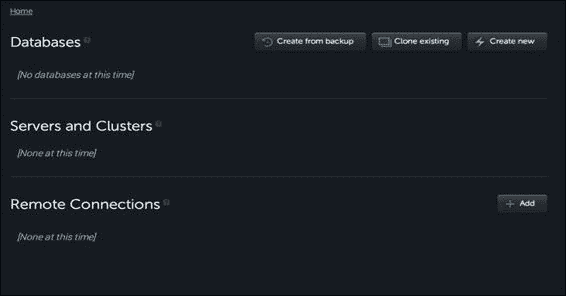

# 第六章. 使用 MongoDB 和第三方数据库扩展包与 OpenShift 应用程序一起使用

本章节提供了多个教程，向您展示如何开始使用 OpenShift MongoDB 扩展包。我们还将介绍如何使用可下载的 MariaDB 和 **远程字典服务器**（**Redis**）扩展包。本章节中的具体教程包括：

+   将 MongoDB 扩展包添加到您的应用程序

+   将 RockMongo 扩展包添加到您的应用程序

+   从本地机器访问 MongoDB 扩展包

+   使用 Robomongo 从本地机器连接到 MongoDB 扩展包

+   启用 MongoDB 扩展包的 REST 接口

+   执行定期的 MongoDB 数据库备份

+   使用 MongoLab MongoDB-as-a-Service 与 OpenShift 配合使用

+   将 MariaDB 扩展包添加到您的应用程序

+   将 Redis 扩展包添加到您的应用程序

# 介绍

MongoDB 是一个流行的开源面向文档的 NoSQL 数据存储。它设计用于可扩展性，并将复杂的对象图存储在单个文档中。它支持动态查询、二级索引、快速的原子更新、聚合以及内建的复制和分片支持。

本章节将使用我们在第三章，*创建和管理应用程序*中创建的 PHP 5.4 应用程序。如果您没有正在运行的 OpenShift 应用程序，则可以通过运行以下命令创建一个新的 OpenShift 应用程序：

```
$ rhc create-app myapp php-5.4

```

# 将 MongoDB 扩展包添加到您的应用程序

在本教程中，您将学习如何将 MongoDB 扩展包添加到您的 OpenShift 应用程序。MongoDB 是一个面向文档的、水平可扩展的 NoSQL 数据存储。

## 准备工作

为了执行这个教程，您需要在机器上安装 `rhc` 命令行客户端。有关详细信息，请参考第一章，*OpenShift 入门*中的 *安装 OpenShift rhc 命令行客户端* 章节。另外，我们将使用在第三章，*创建和管理应用程序*中创建的应用程序。

## 如何操作…

要将 MongoDB 扩展包安装到 `myapp` 应用程序中，请按照以下步骤操作：

1.  打开一个新的命令行终端，切换到 `myapp` 目录位置并执行以下命令：

    ```
    $ rhc cartridge-add c mongodb-2.4 --app myapp

    ```

    这将会在您的应用程序服务器上安装一个新的 MongoDB 实例。`-c` 选项用于指定扩展包名称，`--app` 选项用于指定应用程序名称。

1.  您可以使用 `rhc show-cartridge` 命令查看扩展包的详细信息：

    ```
    $ rhc show-cartridge mongodb --app myapp
    Using mongodb-2.4 (MongoDB 2.4) for 'mongodb'
    mongodb-2.4 (MongoDB 2.4)
    -------------------------
     Gears:          Located with php-5.4
     Connection URL: mongodb://$OPENSHIFT_MONGODB_DB_HOST:$OPENSHIFT_MONGODB_DB_PORT/
     Database Name:  myapp
     Password:       DSdIxMVY8kd4
     Username:       admin

    ```

1.  您还可以使用 `stop` 命令停止 MongoDB 服务器：

    ```
    $ rhc stop-cartridge mongodb

    ```

    您可以使用 `restart` 命令重启 MongoDB 服务器：

    ```
    $ rhc cartridge-restart mongodb

    ```

1.  如果您想从应用程序中移除 MongoDB 服务器，可以使用 `remove` 命令：

    ```
    $ rhc cartridge-remove mongodb –-confirm

    ```

## 它是如何工作的…

当你运行`rhc add-cartridge`命令时，`rhc`会向 OpenShift 服务器发出一个 HTTP POST 请求。OpenShift 服务器将接收该请求，并为你的应用程序创建一个新的 MongoDB 数据库实例。在创建完 MongoDB 数据库后，`rhc`客户端将在命令行终端上显示数据库的详细信息。

你可以通过执行 SSH 连接到你的应用程序 gear 来查看 MongoDB 的安装情况：

```
$ rhc ssh --app myapp 

```

然后，运行`ls`命令查看 gear 的目录结构，你将看到`mongodb`目录：

```
[myapp-osbook.rhcloud.com 52fb71aa5973caf609000026]\> ls -p
app-deployments/  app-root/  git/  mongodb/  php/

```

`mongodb`目录是你的`mongodb`安装，它不会与其他 OpenShift 应用程序或用户共享。它仅供你的应用程序使用，只有你的应用程序可以访问它。

你也可以使用`mongo`命令行客户端连接到 MongoDB 数据库，如下所示。*从本地计算机访问 MongoDB 插件*配方将讲解如何从本地计算机连接到 MongoDB：

```
[myapp-osbook.rhcloud.com 52fb71aa5973caf609000026]\> mongo
MongoDB shell version: 2.4.6
connecting to: 127.2.34.2:27017/admin
Welcome to the MongoDB shell.
For interactive help, type "help".
For more comprehensive documentation, see
 http://docs.mongodb.org/
Questions? Try the support group
 http://groups.google.com/group/mongodb-user
>

```

现在，你可以对 MongoDB 数据库运行命令。要查看所有数据库，请运行以下命令：

```
> show databases;
admin  0.03125GB
local  0.03125GB
myapp  0.03125GB

```

`myapp`数据库对应的是你的应用程序数据库。

你可以通过输入`mongo`并按*Tab*键两次来查看 gear 上所有可用的 MongoDB 命令行工具：

```
[myapp-osbook.rhcloud.com 52fb71aa5973caf609000026]\> mongo
mongo          mongod         mongoexport    mongoimport    mongoperf mongos         mongostat 
mongo_console  mongodump      mongofiles     mongooplog     mongorestore   mongosniff     mongotop

```

## 还有更多…

你也可以通过 OpenShift 网页控制台添加 MongoDB 数据库。访问[`openshift.redhat.com/app/console/applications`](https://openshift.redhat.com/app/console/applications)，点击**myapp**应用程序查看详细信息。在`myapp`应用程序的详细网页上，你将看到一个添加 MongoDB 数据库的选项。点击**Add MongoDB 2.4**选项来添加 MongoDB 2.4 插件。

## 另见

+   *将 RockMongo 插件添加到你的应用程序*配方

# 将 RockMongo 插件添加到你的应用程序

RockMongo ([`rockmongo.com/`](http://rockmongo.com/))是一个免费的开源流行工具，使用 PHP 编程语言编写，通过网页浏览器管理 MongoDB 数据库。作为一个 Web 应用程序，RockMongo 使得无需在本地计算机上安装，即可轻松管理 MongoDB 服务器。在本配方中，你将学习如何在应用程序上安装 RockMongo 插件。

## 准备工作

要完成这个配方，你需要一个包含 MongoDB 插件的应用程序。参考*将 MongoDB 插件添加到你的应用程序*配方，了解如何安装 MongoDB 插件。

## 如何操作…

添加 RockMongo 插件的步骤如下：

1.  要在`myapp`应用程序上安装 RockMongo 插件，请打开一个新的命令行终端，然后将目录切换到`myapp`所在的目录，并执行以下命令：

    ```
    $ rhc add-cartridge rockmongo --app myapp

    ```

1.  记下`rhc cartridge-add`命令返回的用户名和密码。你将需要这些凭据来登录 RockMongo。RockMongo 凭据与 MongoDB 数据库凭据相同，你可以随时通过执行`rhc show-app`或`rhc cartridge-show mongodb-2.4`命令查看它们。

1.  使用第一步中的凭据登录到 RockMongo（`https://myapp-{domain-name}.rhcloud.com/rockmongo/`）。

## 工作原理……

当你运行`rhc add-cartridge`命令时，`rhc`客户端会向 OpenShift 服务器发送一个 HTTP POST 请求。OpenShift 服务器收到请求后，会在应用程序 Gear 上安装 RockMongo Cartridge。RockMongo Cartridge 支持所有受支持的应用程序类型（Java、Python、Node.js、Ruby、Perl 和 PHP）。你不需要创建 PHP 应用程序就能使用 RockMongo Cartridge。OpenShift 将启动一个 Apache 进程来运行 RockMongo 应用程序。

### 注意

只有在向应用程序添加了 MongoDB Cartridge 之后，你才能添加 RockMongo Cartridge。如果在添加 MongoDB Cartridge 之前尝试添加 RockMongo，系统会显示`Cartridge 'rockmongo-1.1' can not be added without mongodb`错误。

## 还有更多……

你还可以通过 OpenShift Web 控制台添加 RockMongo Cartridge。访问[`openshift.redhat.com/app/console/applications`](https://openshift.redhat.com/app/console/applications)，然后点击`myapp`应用程序。要安装 RockMongo Cartridge，点击**Add RockMongo 1.1**网页链接。

## 另见

+   *从本地机器访问 MongoDB Cartridge* 这一篇

+   *使用 Robomongo 从本地机器连接到 MongoDB Cartridge*这一篇

# 从本地机器访问 MongoDB Cartridge

在*将 MongoDB Cartridge 添加到你的应用程序*这一篇中，你学习了如何通过 SSH 访问应用程序 Gear 中的 MongoDB 数据库。在本篇中，你将学习如何从本地机器连接到 MongoDB 数据库。

## 准备工作

要完成本教程，你需要一个带有 MongoDB Cartridge 的应用程序。请参考本章中的*将 MongoDB Cartridge 添加到你的应用程序*一节，了解如何添加 MongoDB Cartridge。此外，你的机器上还需要安装`mongo`命令行客户端。你可以从官方网站下载 MongoDB 数据库：[`www.mongodb.org/downloads/`](http://www.mongodb.org/downloads/)。

## 如何操作……

执行以下步骤，从本地机器连接到 MongoDB Cartridge：

1.  打开命令行终端，并将目录切换到`myapp`应用程序目录。执行以下命令将远程端口转发到本地机器：

    ```
    $ rhc port-forward --app myapp
    Checking available ports ... done
    Forwarding ports ...
    Address already in use - bind(2) while forwarding port 8080\. Trying local port 8081

    To connect to a service running on OpenShift, use the Local address

    Service Local                OpenShift
    ------- --------------- ---- ----------------
    httpd   127.0.0.1:8080   =>  127.2.34.1:8080
    httpd   127.0.0.1:8081   =>  127.2.34.3:8080
    mongodb 127.0.0.1:27017  =>  127.2.34.2:27017

    Press CTRL-C to terminate port forwarding

    ```

1.  打开另一个命令行终端，并使用以下命令从本地机器的`mongo`命令行客户端连接到 MongoDB 数据库：

    ```
    $ mongo --username <username> --password <password> <host>:<port>/admin

    ```

1.  将 `<username>` 和 `<password>` 替换为您的 MongoDB 插件的用户名和密码。主机和端口值可以在 `rhc port-forward` 命令的输出中找到。如步骤 1 所示，`MongoDB` 数据库在 `127.0.0.1` 主机和 `27017` 端口上可用。您可以通过运行 `rhc show-app` 或 `rhc cartridge-show mongodb-2.4` 命令查看用户名和密码。

1.  连接到 MongoDB 数据库后，您可以执行任何合法命令，如下所示：

    ```
    > show databases
    admin  0.03125GB
    local  0.03125GB
    myap  (empty)
    myapp  0.03125GB
    test  0.03125GB

    ```

## 它是如何工作的……

在步骤 1 中，您使用了 `rhc port-forward` 命令将所有远程端口转发到本地机器。`rhc port-forward` 命令是 SSH 端口转发的封装器，它使得远程机器上的端口在本地机器上可用。原本无法访问的远程机器上的端口，您可以像访问本地机器上的端口一样使用。该命令返回一个可以从本地机器连接的端口列表，如步骤 1 所示。

如输出所示，`mongod` 进程可在 `27017` 端口和 `127.0.0.1` 主机上访问。

在步骤 2 中，您从本地机器连接到 MongoDB 数据库，传入数据库的用户名、密码、主机和端口。成功连接后，您在步骤 3 中执行了一个命令。

要终止端口转发，只需在运行 `rhc port-forward` 命令的命令行终端中按下 *Ctrl* + *C*。

## 另见

+   *从本地机器使用 Robomongo 连接到 MongoDB 插件*的教程

+   *将 MongoDB 插件添加到您的应用程序*的教程

# 从本地机器使用 Robomongo 连接到 MongoDB 插件

在 *从本地机器访问 MongoDB 插件* 教程中，您学习了如何使用 `mongo` 命令行客户端从本地机器连接到 MongoDB 插件。在本教程中，您将学习如何使用 RoboMongo 从本地机器连接到 MongoDB 插件。RoboMongo ([`robomongo.org/`](http://robomongo.org/)) 是一个开源、跨平台的 MongoDB 图形化管理工具。我们使用 RoboMongo 因为它在所有操作系统上都有支持，并且您可以在 RoboMongo 中输入在 mongo shell 中输入的所有命令。对于习惯使用 mongo shell 的开发者来说，它非常自然。

## 准备工作

为了完成这个教程，您需要一个带有 MongoDB 插件的应用程序。请参考本章中的 *将 MongoDB 插件添加到您的应用程序* 教程，了解如何添加 MongoDB 插件。此外，您还需要在本地机器上安装 RoboMongo 工具。您可以从其网站 [`robomongo.org/`](http://robomongo.org/) 下载 RoboMongo 工具。

## 如何操作……

执行以下步骤，通过 RoboMongo 连接到您的 MongoDB 插件：

1.  打开命令行终端，并切换到 `myapp` 应用程序目录。执行以下命令，将远程端口转发到本地机器：

    ```
    $ rhc port-forward --app myapp

    ```

1.  启动 RoboMongo 应用程序，你将看到以下截图。点击左上角的连接图标：

1.  点击连接图标后，你将看到一个新窗口，提供创建新连接的选项。点击**创建**链接以创建新连接：

1.  输入 MongoDB 数据库的详细信息，设置一个新连接。主机和端口可以在第 1 步中`rhc port-forward`命令的输出中找到，如以下截图所示：

1.  点击**身份验证**标签，输入连接 MongoDB cartridge 所需的用户名和密码。你可以使用`rhc show-app`或`rhc cartridge-show mongodb-2.4`命令查看 MongoDB cartridge 的详细信息。以下截图展示了**身份验证**标签的详情：

1.  点击**保存**按钮，你将看到新连接在**MongoDB 连接**窗口中列出：

1.  点击**连接**按钮，你将连接到 MongoDB cartridge。

1.  连接到 MongoDB cartridge 后，你可以点击任何数据库并查看其所有集合。当你双击一个集合时，你可以查看其中的前 50 个文档。以下截图展示了`msgs`集合中的文档：

## 它是如何工作的…

在步骤 1 中，你使用了`rhc port-forward`命令将所有远程端口转发到本地机器。这将使得你能够连接到运行在应用程序 gear 中的 MongoDB 数据库。在步骤 2 到 7 中，你创建了一个新的 MongoDB 连接，并从 RoboMongo 内部连接到了 MongoDB cartridge。在步骤 8 中，你导航到了**test**数据库中的**msgs**集合。

## 另见

+   *从本地机器访问 MongoDB cartridge*教程

+   *启用 MongoDB cartridge REST 接口*教程

# 启用 MongoDB cartridge REST 接口

MongoDB 提供了一个最小化的 REST 接口，允许用户查询集合。该接口不暴露插入、更新或删除文档的操作。在本教程中，你将学习如何启用 MongoDB cartridge 的 REST 接口。

## 准备工作

要完成本教程，你需要一个包含 MongoDB cartridge 的应用程序。请参考本章中的*将 MongoDB cartridge 添加到应用程序*教程，了解如何添加一个 MongoDB cartridge。

## 如何操作…

按照以下步骤启用 MongoDB REST 接口：

1.  打开一个新的命令行终端，使用`ssh`命令 SSH 进入`myapp`应用程序 gear：

    ```
    $ rhc ssh --app myapp

    ```

1.  进入应用程序 gear 后，切换到`mongodb/conf`目录，并使用 Vim 编辑`mongodb.conf`文件。

1.  现在，我们需要将`nohttpinterface`属性值更新为`false`，以便 MongoDB 在`28017`端口启用 HTTP 前端。要启用 REST 接口，您需要添加一个新属性`rest`，并将其值设置为`true`，如下所示：

    ```
    nohttpinterface = false
    rest = true
    ```

1.  退出 SSH 会话并重启 MongoDB 组件，以使更改生效：

    ```
    $ rhc cartridge-restart –app mongodb-2.4

    ```

1.  在本地机器上执行`rhc port-forward`命令以启用端口转发。这将列出您可以从本地机器连接的所有应用程序。REST 接口将在`28017`端口暴露：

    ```
    $ rhc port-forward 
    Checking available ports ... done
    Forwarding ports ...
    Address already in use - bind(2) while forwarding port 8080\. Trying local port 8081

    To connect to a service running on OpenShift, use the Local address

    Service Local                OpenShift
    ------- --------------- ---- ----------------
    httpd   127.0.0.1:8080   =>  127.2.34.1:8080
    httpd   127.0.0.1:8081   =>  127.2.34.3:8080
    mongod  127.0.0.1:28017  =>  127.2.34.2:28017
    mongodb 127.0.0.1:27017  =>  127.2.34.2:27017

    Press CTRL-C to terminate port forwarding

    ```

1.  在浏览器中打开`http://127.0.0.1:28017/`。您需要使用 MongoDB 组件的凭证进行身份验证。它使用 HTTP 基本身份验证。

1.  然后，要查看`test`文档中`msgs`集合的所有文档，可以访问`http://127.0.0.1:28017/test/msgs/`。这将列出一个包含`msgs`集合中所有消息的 JSON 文档。

## 工作原理……

默认情况下，MongoDB 禁用了 REST 接口。要启用 REST 接口，您需要更新`mongodb.conf` MongoDB 配置文件。在第 3 步中，您更新了`mongodb.conf`文件以启用 REST API。然后，在第 4 步中，您重启了 MongoDB 组件以重新加载配置。为了从本地机器连接到 REST 接口，您在第 5 步启用了端口转发。`rhc port-forward`命令列出了您可以从本地机器连接的所有远程服务。MongoDB 的 REST 接口可在`28017`端口访问。在第 7 步中，您通过在浏览器中打开`http://127.0.0.1:28017/test/msgs/`来查看`test`数据库中`msgs`集合的详细信息。

## 另见

+   *将 MongoLab MongoDB 即服务与 OpenShift 结合使用*教程

+   *执行定时 MongoDB 数据库备份*教程

# 执行定时 MongoDB 数据库备份

在本教程中，您将学习如何执行 MongoDB 数据库的定时备份，并将备份上传到 Amazon S3。

## 准备工作

要完成本教程，您需要一个包含 MongoDB 组件的应用程序。请参阅本章中的*将 MongoDB 组件添加到应用程序*教程，了解如何安装该组件。同时，您还需要拥有一个 Amazon AWS 账户。如果没有，请访问[`aws.amazon.com/`](http://aws.amazon.com/)并注册一个新账户。

## 如何做……

执行以下步骤以启用 MongoDB 组件的每日定时备份：

1.  访问[`console.aws.amazon.com/s3/home`](https://console.aws.amazon.com/s3/home)，并创建一个新的存储桶来存储您的数据库备份。

1.  通过运行以下命令，将`cron`组件添加到您的应用程序中：

    ```
    $ rhc cartridge-add cron --app myapp

    ```

1.  使用 SSH 连接到应用程序节点，并在`$OPENSHIFT_DATA_DIR`中下载`s3-bash`工具。使用以下命令将其解压到`s3-bash`目录：

    ```
    $ rhc ssh --app myapp
    $ cd $OPENSHIFT_DATA_DIR
    $ wget http://s3-bash.googlecode.com/files/s3-bash.0.02.tar.gz
    $ mkdir s3-bash
    $ tar -xf s3-bash.0.02.tar.gz -C s3-bash

    ```

1.  在`$OPENSHIFT_DATA_DIR/s3-bash`目录中创建一个名为`AWSSecretAccessKeyIdFile`的新文件，并将你的 Amazon 密钥访问秘钥存储到其中。这是`s3-bash`与 Amazon S3 通信所需的。

1.  在本地机器上创建一个脚本，路径为`.openshift/cron/minutely/database_backup.sh`，并将以下内容添加到其中：

    ```
    #!/bin/bash
    function load_env {
        [ -z "$1" ] && return 1
        [ -f "$1" ] || return 0

        local key=$(basename $1)
        export $key="$(< $1)"
    }

    for f in ~/.env/mongodb/*
    do
      load_env $f
    done

    set -x
    if [ 'date +%H:%M' == "23:50" ]
    then
      FILE_NAME=$(date +"%Y%m%d%H%M")
      mongodump --host $OPENSHIFT_MONGODB_DB_HOST --port  $OPENSHIFT_MONGODB_DB_PORT --username $OPENSHIFT_MONGODB_DB_USERNAME --password $OPENSHIFT_MONGODB_DB_PASSWORD --db $OPENSHIFT_APP_NAME --out $OPENSHIFT_DATA_DIR/$FILE_NAME
      cd $OPENSHIFT_DATA_DIR
      zip -r $FILE_NAME.zip $FILE_NAME
      echo "Took MongoDB Dump" >> $OPENSHIFT_CRON_DIR/log/backup.log
      $OPENSHIFT_DATA_DIR/s3-bash/s3-put -k $AWS_ACCESS_KEY_ID -s $OPENSHIFT_DATA_DIR/s3-bash/AWSSecretAccessKeyIdFile -T $OPENSHIFT_DATA_DIR/$FILE_NAME.zip /$AWS_S3_BUCKET/$FILE_NAME.zip
      echo "Uploaded dump to Amazon S3" >> $OPENSHIFT_CRON_DIR/log/backup.log
      rm -f $OPENSHIFT_DATA_DIR/$FILE_NAME.zip
      rm -rf $OPENSHIFT_DATA_DIR/$FILE_NAME
    fi
    ```

1.  上述脚本将每天在 23:50（11:50 p.m.）运行，并执行`mongodump`命令以创建数据库备份文件。然后，使用`s3-bash` API 将文件传输到 Amazon S3。最后，在上传文件后，脚本会从应用程序设备中删除数据库转储文件。

1.  现在，我们需要设置环境变量，以便脚本能够与 Amazon S3 进行通信。如果你不确定如何访问你的安全凭证，可以参考文档：[`docs.aws.amazon.com/general/latest/gr/getting-aws-sec-creds.html`](http://docs.aws.amazon.com/general/latest/gr/getting-aws-sec-creds.html)。我们运行以下命令：

    ```
    $ rhc env-set AWS_ACCESS_KEY_ID=< Your Amazon ACCESS_KEY_ID>
    $ rhc env-set AWS_S3_BUCKET=<Amazon S3 bucket name >

    ```

1.  提交代码并推送到 OpenShift 应用。每晚 23:50（11:50 p.m.）时，将进行数据库备份，并将备份文件上传到 Amazon S3。

## 它是如何工作的……

在第 1 步中，你创建了一个新的 Amazon S3 存储桶，用于存储 MongoDB 数据库备份。Amazon S3 广泛用于存储静态文件，是此任务的理想选择。接下来，你将`cron`组件添加到应用程序中。`cron`组件将用于在特定时间执行每日备份。

Amazon S3 暴露了其 REST 服务，用户可以利用这些服务对 S3 存储桶进行操作。Amazon 为多种编程语言提供了包装的 REST API，简化了开发者与应用程序的集成。由于我们希望保持本配方的语言中立，我们使用了 Amazon S3 的 bash 包装器。虽然 Amazon 并未正式支持该包装器，但它的运行效果非常好。在第 3 步中，你通过`wget`下载了`s3-bash`工具。`tar.gz`文件存储在`$OPENSHIFT_DATA_DIR`中。然后，你解压了该`tar.gz`文件到`s3-bash`目录。

接下来，在第 4 步中，你创建了一个名为`AWSSecretAccessKeyIdFile`的文件，用于存储 Amazon 访问密钥密钥。`s3-bash`包装器使用该文件作为 AWS 密钥访问秘钥 ID，以避免它出现在使用`ps`命令查看的运行进程列表中。

在第 5 步中，你创建了一个 bash 脚本，该脚本将在每晚 23:50（11:50 p.m.）执行。脚本首先使用`mongodump`命令进行数据库备份，然后将文件上传到 Amazon S3。文件名为当前的时间戳。最后，在将备份上传到 S3 后，脚本会删除备份文件，以节省磁盘空间。

第 6 步创建了备份脚本所需的两个环境变量。最后，在第 7 步中，你将代码推送到应用程序设备。

## 另见

+   *使用 MongoLab MongoDB-as-a-Service 与 OpenShift* 配方

# 使用 MongoLab MongoDB-as-a-Service 与 OpenShift

MongoLab ([`mongolab.com`](https://mongolab.com)) 的 MongoDB 服务使你能够轻松地在各种云提供商上设置、操作和扩展 MongoDB 数据库。除了标准的 MongoDB 功能外，MongoLab 还提供以下功能：

+   在所有主要云提供商上运行 MongoDB，如 Amazon、Google、Rackspace 等

+   高可用 MongoDB

+   自动备份

+   监控支持

在本教程中，你将学习如何将 MongoLab 的 MongoDB 服务与 OpenShift 应用一起使用。

## 准备开始

要完成这个操作，你需要一个 OpenShift 应用。此外，你还需要一个 MongoLab 账户。如果你还没有账户，请访问 [`mongolab.com/`](https://mongolab.com/) 并注册一个新账户。

## 如何操作…

执行以下步骤，以便从 OpenShift 应用连接到 MongoLab MongoDB 服务器：

1.  创建 MongoLab 账户后，你将看到一个页面，用于创建你的第一个数据库。点击 **创建新数据库** 按钮：

1.  输入你的 MongoDB 实例的详细信息。在以下截图中，数据库名称为 `myapp`，而 Amazon EC2 是云托管提供商。我们选择了美国东海岸的数据中心，因为 OpenShift Online 应用实例位于此处。这有助于最小化 OpenShift 应用与数据库实例之间的延迟：

1.  数据库成功创建后，你会看到它被列出，如以下截图所示：

1.  点击 **myapp** 数据库，你将看到数据库的详细信息：

1.  在你可以连接到数据库之前，你需要创建一个数据库用户。点击 **点击这里** 链接以创建一个新的数据库用户，如以下截图所示：

1.  这将弹出一个窗口，如以下截图所示，你需要在此输入新数据库用户的用户名和密码：

1.  创建后，数据库用户将在数据库详情页的 **用户** 标签下显示。

1.  要连接到 MongoLab MongoDB 实例，你需要在 gear 上安装 `mongo` 命令行客户端。每个 OpenShift 应用 gear 都已安装了 `mongo` 命令行客户端，因此你无需执行任何操作。只需使用 `rhc ssh` 命令 SSH 进入应用 gear，然后输入以下命令。用户名和密码对应于你在第 6 步中创建的凭据。主机、端口和数据库名称对应于第 4 步中找到的信息：

    ```
    $ mongo --host <host> --port <port> --username <username> --password <password> <database_name>

    ```

1.  一旦连接到 MongoLab MongoDB 实例，你就可以运行任何有效的 MongoDB 命令，如下所示：

    ```
    > show collections
    system.indexes
    system.users
    > db.msgs.insert({msg:"hello"})
    > 
    > db.msgs.findOne()
    { "_id" : ObjectId("5315aa28317c39c58ecd4f04"), "msg" : "hello" }

    ```

## 它是如何工作的…

第 1 至第 4 步帮助你创建了一个新的 MongoLab MongoDB 数据库实例。你需要提供与数据库实例相关的详细信息，MongoLab 将根据你输入的详细信息配置一个 MongoDB 数据库实例。从第 5 步到第 7 步，你创建了一个新的数据库用户，使你能够从外部世界连接到 MongoDB 数据库实例。

在第 8 步中，你使用数据库详细信息通过 `mongo` 命令行客户端连接到 MongoDB 实例，从 OpenShift 应用程序装备进行连接。最后，你在已连接的 MongoLab MongoDB 数据库实例上运行了一些 Mongo 命令。要了解如何使用 PHP 代码连接到 MongoLab，你可以参考 OpenShift 官方博客：[`www.openshift.com/blogs/getting-started-with-mongodb-mongolab-php-and-openshift`](https://www.openshift.com/blogs/getting-started-with-mongodb-mongolab-php-and-openshift)。

## 另请参见

+   *将 MongoDB 卡带添加到你的应用程序* 章节

# 将 MariaDB 卡带添加到你的应用程序

在本节中，你将学习如何将 MariaDB 可下载卡带添加到你的 OpenShift 应用程序。MariaDB ([`mariadb.org/`](https://mariadb.org/)) 是 MySQL 数据库的社区分支，旨在作为 MySQL 数据库的直接替代。

## 准备工作

要执行此操作步骤，你需要在你的机器上安装 `rhc` 命令行客户端。有关详细信息，请参阅 第一章 中的 *安装 OpenShift rhc 命令行客户端* 章节，*OpenShift 入门*。另外，我们将使用在 第三章 中 *使用 rhc 命令行客户端创建 OpenShift 应用程序* 章节中创建的应用程序，*创建与管理应用程序*。

## 如何操作…

要在 `myapp` 应用程序上安装 MariaDB 5.5 可下载卡带，打开一个新的命令行终端，然后将目录更改为 `myapp` 目录的位置，并执行以下命令：

```
$ rhc cartridge-add https://raw.github.com/openshift-cartridges/mariadb-cartridge/master/metadata/manifest.yml --app myapp

```

上述命令将会在你的应用程序装备上安装一个新的 MariaDB 服务器实例。

你可以使用 `rhc cartridge-s` `how` 命令查看卡带的详细信息：

```
$ rhc cartridge-show mariadb
developercorey-mariadb-5.5 (MariaDB 5.5)
----------------------------------------
 From:           https://raw.github.com/openshift-cartridges/mariadb-cartridge/master/metadata/manifest.yml
 Gears:          Located with php-5.4, cron-1.4
 Connection URL: mysql://$OPENSHIFT_MARIADB_DB_HOST:$OPENSHIFT_MARIADB_DB_PORT/
 Database Name:  myapp
 Password:       wPG6vvBy6_L9
 Username:       admin7H6WdQN

```

你还可以使用`stop`命令停止 MariaDB 服务器：

```
$ rhc cartridge-stop mariadb

```

你可以使用`restart`命令重启 MariaDB 服务器：

```
$ rhc cartridge-restart mariadb

```

如果你想从应用程序中移除 MariaDB 服务器，可以使用 `remove` 命令：

```
$ rhc cartridge-remove mariadb –-confirm

```

## 它是如何工作的…

当你运行`rhc cartridge-add`命令时，`rhc`将向 OpenShift 服务器发送一个 HTTP POST 请求。OpenShift 服务器将接收该请求，并使用清单文件为你的应用程序实例化一个新的 MariaDB 服务器实例。在配置好 MariaDB 服务器后，`rhc` 客户端会在命令行终端显示数据库的详细信息。

你可以通过 SSH 连接到你的应用程序装备，查看 MariaDB 的安装情况：

```
$ rhc ssh --app myapp 

```

然后，运行 `ls` 命令查看 gear 目录结构，你将看到 `mariadb` 目录：

```
[myapp-osbook.rhcloud.com 52fb71aa5973caf609000026]\> ls -p
app-deployments/  app-root/  cron/  git/  mariadb/  php/

```

`mariadb` 目录是你的 `mariadb` 安装目录，它不会与任何其他 OpenShift 应用程序或用户共享。它仅供你的应用程序使用，只有你的应用程序可以访问它。

你也可以使用 `mysql` 命令行客户端连接到你的 MariaDB 服务器。我们使用 `mysql` 客户端，因为它已安装并与 MariaDB 兼容。

现在，你可以对 MariaDB 服务器运行 SQL 命令。要查看所有数据库，运行以下命令：

```
mysql> SHOW DATABASES;
+--------------------+
| Database           |
+--------------------+
| information_schema |
| myapp              |
| mysql              |
+--------------------+
3 rows in set (0.00 sec)

```

`myapp` 数据库对应于你的应用程序数据库。

## 另见

+   *将 MongoDB 组件添加到你的应用程序* 的教程

# 将 Redis 组件添加到你的应用程序

在这个教程中，你将学习如何将 Redis 可下载的组件添加到你的 OpenShift 应用程序中。Redis 是一个开源的先进 NoSQL 键值数据存储系统，使用 ANSI C 编程语言编写。它是一个内存数据存储，但也会写入磁盘以保证数据持久性。

## 准备就绪

为了执行这个教程，你需要在你的机器上安装 `rhc` 命令行客户端。有关详细信息，请参考 第一章 中的 *安装 OpenShift rhc 命令行客户端* 教程，*开始使用 OpenShift*。另外，我们将使用在 第三章 中 *使用 rhc 命令行客户端创建 OpenShift 应用程序* 教程中创建的应用程序，*创建和管理应用程序*。

## 如何操作…

要将 Redis 可下载的组件安装到 `myapp` 应用程序中，打开一个新的命令行终端，然后切换到 `myapp` 目录位置，并执行以下命令：

```
$ rhc cartridge-add http://cartreflect-claytondev.rhcloud.com/reflect?github=smarterclayton/openshift-redis-cart --app myapp

```

这将在你的应用程序 gear 上安装一个新的 Redis 服务器实例。

你可以使用 `rhc cartridge-show` 命令查看组件详情。

你也可以使用 `stop` 命令停止 Redis 服务器：

```
$ rhc cartridge-stop redis

```

你可以使用 `restart` 命令重新启动 Redis 服务器：

```
$ rhc cartridge-restart redis

```

如果你想从应用程序中移除 Redis 服务器，可以使用 `remove` 命令：

```
$ rhc cartridge-remove redis –-confirm

```

## 它是如何工作的…

当你运行 `rhc cartridge-add` 命令时，`rhc` 会向 OpenShift 服务器发出 HTTP POST 请求。OpenShift 服务器会接收请求，并根据清单文件为你的应用程序实例化一个新的 Redis 服务器实例。在为 Redis 服务器配置完成后，`rhc` 客户端将在命令行终端显示数据库详情，如下所示：

```
Adding http://cartreflect-claytondev.rhcloud.com/reflect?githubgithub=smarterclayton/openshift-redis-cart to application 'myapp' ... done

smarterclayton-redis-2.6 (Redis)
--------------------------------
 From:  http://cartreflect-claytondev.rhcloud.com/reflect?github=smarterclayton/openshift-redis-cart
 Gears: Located with php-5.4

Redis is now configured with a default password ZTNiMGM0NDI5OGZjMWMxNDlhZmJmNGM4OTk2ZmI5
You can configure various Redis scaling and persistence modes by setting
environment variables - consult the cartridge README for more info.

```

你可以通过 SSH 登录到你的应用程序 gear 来查看 Redis 的安装情况：

```
$ rhc ssh --app myapp 

```

然后，运行 `ls` 命令查看 gear 目录结构，你将看到 `redis` 目录：

```
[myapp-osbook.rhcloud.com 52fb71aa5973caf609000026]\> ls -p
app-deployments/  app-root/  git/  php/  redis/

```

`redis` 目录是你的 `redis` 安装目录，它不会与任何其他 OpenShift 应用程序或用户共享。它仅供你的应用程序使用，只有你的应用程序可以访问它。

你也可以使用 `redis-cli` 命令行客户端连接到你的 Redis 服务器：

```
[myapp-osbook.rhcloud.com 53121c645973ca7acf000018]\> redis-cli $REDIS_CLI 
redis 127.2.34.2:16379> 

```

现在，你可以对 Redis 服务器执行命令。要查看有关你的 Redis 安装的详细信息，可以运行 `INFO` 命令：

```
redis 127.2.34.2:16379> INFO
# Server
redis_version:2.6.13
redis_git_sha1:00000000
redis_git_dirty:0
redis_mode:standalone
os:Linux 2.6.32-431.5.1.el6oso.bz844450.x86_64 x86_64
arch_bits:64
multiplexing_api:epoll
tcp_port:16379
uptime_in_seconds:874
uptime_in_days:0
hz:10
lru_clock:957695
// removed for brevity

```

## 这还不是全部…

想了解如何在 Java 应用程序中使用 Redis，可以阅读我在 [`www.openshift.com/blogs/build-cloud-enabled-java-redis-applications-with-spring-on-openshift`](https://www.openshift.com/blogs/build-cloud-enabled-java-redis-applications-with-spring-on-openshift) 的博客。

## 另见

+   *将 MariaDB 载入你的应用程序* 的方法
