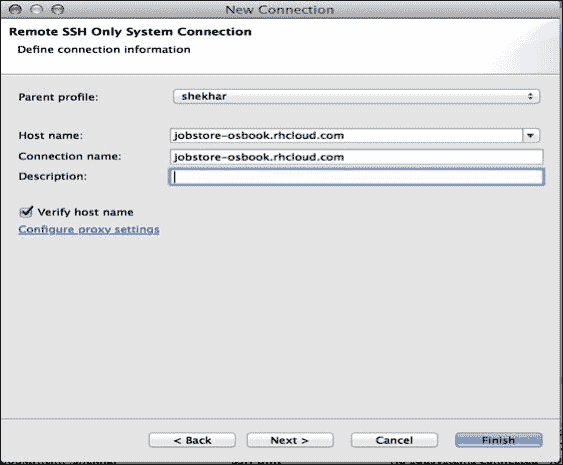
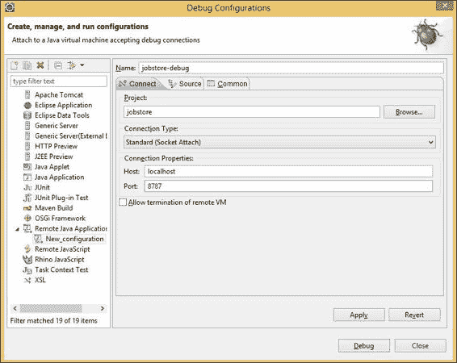

# 第七章：OpenShift for Java 开发者

本章介绍了一些示例，展示如何在 OpenShift 上开始 Java Web 应用程序开发。你将学习如何使用 JBoss EAP 6 和 JBoss AS 7 应用程序服务器组件，在 OpenShift 上创建和部署**Java 企业版** (**Java EE**) 应用程序。本章还将涵盖如何在 Tomcat 服务器上开发和托管 Spring 框架应用程序。本章的具体示例如下：

+   使用 JBoss EAP 和 PostgreSQL 9.2 组件创建并部署 Java EE 6 应用程序

+   通过在 standalone.xml 中定义数据库登录模块来配置应用程序安全性

+   使用 JBoss 组件安装模块

+   使用管理 Web 界面和 CLI 管理 JBoss 组件

+   使用 Tomcat 7 组件创建并部署 Spring 应用程序

+   获取 Java 组件的线程转储

+   在 Java 6 和 Java 7 之间进行选择

+   为 Java 应用程序启用热部署

+   跳过 Maven 构建

+   强制进行干净的 Maven 构建

+   重写默认的 Maven 构建命令

+   安装在 Maven 中央仓库中没有的 JAR 文件

+   使用 Eclipse 开发 OpenShift Java 应用程序

+   使用 Eclipse 系统资源管理器通过 SSH 连接到应用程序设备

+   在云中调试 Java 应用程序

# 简介

本章将探讨 Java 开发者如何使用 OpenShift 开始开发 Java EE 或 Spring 应用程序。Java 通常被认为是事实上的开源企业编程语言。OpenShift 支持 JBoss 应用程序服务器，这是 Java EE 6 开发的认证平台。作为 OpenShift Online 用户，你可以免费使用 JBoss 社区版和商业版 JBoss EAP 6。*使用 JBoss EAP 和 PostgreSQL 9.2 组件创建并部署 Java EE 6 应用程序* 的示例将展示如何在 OpenShift 上开发和部署 Java EE 6 应用程序。此外，OpenShift 还支持 WildFly 组件，这是一个认证的 Java EE 7 应用程序服务器，你可以使用它来部署 Java EE 7 应用程序。本章不会讨论 WildFly 组件。

一个流行的 Java EE 开发替代方案是 Spring 框架。Spring 开发者通常使用 Apache Tomcat 来托管他们的应用程序。OpenShift 支持两个版本的 Tomcat：Apache Tomcat 6 和 Apache Tomcat 7。*使用 Tomcat 7 组件创建并部署 Spring 应用程序* 的示例将展示如何开发一个 Spring 应用程序并将其部署到 OpenShift。同时，OpenShift 也可以运行 Apache Tomcat 8（目前处于测试阶段）。你可以阅读我的博客，了解如何在 OpenShift 上部署 Apache Tomcat 8，链接：[`www.openshift.com/blogs/how-to-run-apache-tomcat-8-on-openshift`](https://www.openshift.com/blogs/how-to-run-apache-tomcat-8-on-openshift)。

OpenShift 使用 Apache Maven 来管理依赖并构建你的 OpenShift 应用程序。所有 OpenShift Java 应用程序都是基于 Maven 的应用程序。本章假设你已熟悉 Apache Maven。如果你对 Maven 不太熟悉，请参考[`maven.apache.org/guides/getting-started/index.html`](http://maven.apache.org/guides/getting-started/index.html)的文档。本章将涉及使用 Apache Maven 与 OpenShift 配合的各个方面，例如如何将你自己的 JAR（非托管于 Maven 中央仓库）与 OpenShift 一起使用等。OpenShift 还允许你使用其他构建工具，如 Apache Ant 和 Gradle。请参考我的博客，了解如何将 Apache Ant（[`www.openshift.com/blogs/running-ant-builds-on-openshift`](https://www.openshift.com/blogs/running-ant-builds-on-openshift)）和 Gradle（[`www.openshift.com/blogs/run-gradle-builds-on-openshift`](https://www.openshift.com/blogs/run-gradle-builds-on-openshift)）与 OpenShift 应用程序一起使用。

几乎所有的 Java 开发者都会使用 IDE 来构建他们的应用程序。OpenShift 对 Eclipse IDE 提供了一流的支持。*使用 Eclipse 开发 OpenShift Java 应用程序*这一章节将带你逐步完成从 Eclipse 内创建和管理应用程序的过程。你甚至可以直接从 Eclipse 内 SSH 连接到应用程序的 Gear 中。这将在*使用 Eclipse 系统资源管理器通过 SSH 连接到应用程序 Gear*的章节中进行讲解。

如果你想在本地机器上运行示例，请安装 Java 7、Apache Maven 和 Eclipse。你可以在[`www.java.com/en/download/help/download_options.xml`](http://www.java.com/en/download/help/download_options.xml)找到针对你的操作系统安装 Java 的说明。接下来，关于安装 Apache Maven 的说明可以在此找到：[`maven.apache.org/download.cgi#Installation`](http://maven.apache.org/download.cgi#Installation)。最后，你可以按照此处的说明安装 Eclipse：[`wiki.eclipse.org/Eclipse/Installation`](http://wiki.eclipse.org/Eclipse/Installation)。

本章节假设你已经了解 OpenShift 应用程序开发和数据库 Cartridge 的基础。如果你对这些基础不太熟悉，建议你先阅读第三章，*创建与管理应用程序*，然后阅读第六章，*使用 MongoDB 和第三方数据库 Cartridge 与 OpenShift 应用程序*，再继续本章内容。

在本章中，我们将开发一个简单的职位门户应用程序，允许用户为公司发布职位空缺。用户可以创建公司并为该公司发布职位。所有源代码都可以在 GitHub 组织的 *OpenShift-Cookbook* 仓库中找到，地址是 [`github.com/OpenShift-Cookbook`](https://github.com/OpenShift-Cookbook)。

# 使用 JBoss EAP 和 PostgreSQL 9.2 cartridge 创建和部署 Java EE 6 应用程序

曾几何时，Java EE 或 J2EE（在过去的日子里是这么称呼的）被视为邪恶的存在。如今，Java EE 提供了一个非常高效的环境来构建 Web 应用程序。Java EE 已经拥抱了“约定优于配置”和注解，这意味着你不再需要维护 XML 来配置每一个组件。在本篇教程中，你将学习如何构建一个 Java EE 6 应用程序，并将其部署到 OpenShift。此教程假定你具备 Java 和 Java EE 6 的基础知识。如果你对 Java EE 6 不熟悉，请阅读官方教程，网址是 [`docs.oracle.com/javaee/6/tutorial/doc/`](http://docs.oracle.com/javaee/6/tutorial/doc/)。

在本教程中，你将构建一个简单的职位门户，允许用户发布职位空缺，并查看系统中所有已保存职位的列表。这两个功能将通过两个 REST 端点暴露出来。

本教程中创建的应用程序的源代码可在 GitHub 上找到，地址是 [`github.com/OpenShift-Cookbook/chapter7-jobstore-javaee6-simple`](https://github.com/OpenShift-Cookbook/chapter7-jobstore-javaee6-simple)。你将在本教程中构建的示例应用程序是 `jobstore` 应用程序的简化版本，只有一个域类，并且没有任何应用程序界面。你也可以在 GitHub 上找到完整的 `jobstore` 应用程序源代码，地址是 [`github.com/OpenShift-Cookbook/chapter7-jobstore-javaee6`](https://github.com/OpenShift-Cookbook/chapter7-jobstore-javaee6)。

## 准备工作

为了完成本教程，你需要在机器上安装 `rhc` 命令行客户端。有关详细信息，请参阅 第一章 中的 *安装 OpenShift rhc 命令行客户端* 教程，标题为 *开始使用 OpenShift*。此外，你还需要一个 IDE 来处理应用程序代码。推荐使用的 IDE 是 Eclipse Luna，但你也可以使用其他 IDE，如 IntelliJ Idea 和 NetBeans。从官方网站下载并安装适用于 Java EE 开发者的 Eclipse IDE，网址是 [`www.eclipse.org/downloads/`](https://www.eclipse.org/downloads/)。

## 操作步骤...

执行以下步骤以创建 `jobstore` 应用程序：

1.  打开一个新的命令行终端，并进入一个方便的位置。通过执行以下命令创建一个新的 JBoss EAP 应用程序：

    ```
    $ rhc create-app jobstore jbosseap-6

    ```

1.  上述命令将创建一个 Maven 项目并将其克隆到你的本地机器。

1.  将目录更改为`jobstore`，然后执行以下命令将 PostgreSQL 9.2 cartridge 添加到应用程序中：

    ```
    $ rhc cartridge-add postgresql-9.2

    ```

1.  打开 Eclipse 并导航到项目工作空间。然后，将步骤 1 中创建的应用程序作为 Maven 项目导入。要导入现有的 Maven 项目，请导航至**文件**|**导入**|**Maven**|**现有的 Maven 项目**。然后，导航到您在步骤 1 中创建的 OpenShift Maven 应用程序的位置。

1.  接下来，更新`pom.xml`以使用 Java 7。OpenShift 创建的 Maven 项目配置为使用 JDK 6。请使用以下代码替换属性：

    ```
    <maven.compiler.source>1.7</maven.compiler.source>
    <maven.compiler.target>1.7</maven.compiler.target>
    ```

1.  更新 Maven 项目以使更改生效。可以右键单击项目，然后导航至**Maven**|**更新项目**。

1.  现在，让我们编写应用程序的领域类。Java EE 使用 JPA 定义数据模型并管理实体。应用程序有一个领域类：`Job`。创建一个名为`org.osbook.jobstore.domain`的新包，然后在其中创建一个名为`Job`的新 Java 类。请查看以下代码：

    ```
    @Entity
    public class Job {

    @Id
    @GeneratedValue(strategy = GenerationType.AUTO)
    private Long id;

    @NotNull
    private String title;

    @NotNull
    @Size(max = 4000)
    private String description;

    @Column(updatable = false)
    @Temporal(TemporalType.DATE)
    @NotNull
    private Date postedAt = new Date();

    @NotNull
    private String company;

    //setters and getters removed for brevity

    }
    ```

1.  在`src/main/resources`下创建一个`META-INF`文件夹，然后创建一个名为`persistence.xml`的文件，其中包含以下代码：

    ```
    <?xml version="1.0" encoding="UTF-8"?>
    <persistence 
    xsi:schemaLocation="http://java.sun.com/xml/ns/persistence http://java.sun.com/xml/ns/persistence/persistence_2_0.xsd"
    version="2.0">

    <persistence-unit name="jobstore" transaction-type="JTA">
    <provider>org.hibernate.ejb.HibernatePersistence</provider>
    <jta-data-source>java:jboss/datasources/PostgreSQLDS</jta-data-source>

    <exclude-unlisted-classes>false</exclude-unlisted-classes>

    <properties>
    <property name="hibernate.show_sql" value="true" />
    <property name="hibernate.hbm2ddl.auto"value="update" />
    </properties>
    </persistence-unit>

    </persistence>
    ```

1.  现在，我们将创建`JobService`类，该类将使用 JPA `EntityManager` API 与数据库交互。创建一个名为`org.osbook.jobstore.services`的新包，并创建一个新的 Java 类，如下所示。它定义了`Job`实体上的`save`和`findAll`操作。

    ```
    @Stateless
    public class JobService {

    @PersistenceContext(unitName = "jobstore")
    private EntityManager entityManager;

    public Job save(Job job) {
    entityManager.persist(job);
    return job;
    }

    public List<Job> findAll() {
    return entityManager
    .createQuery("SELECT j from org.osbook.jobstore.domain.Job j order by j.postedAt desc", Job.class)
    .getResultList();
    }
    }
    ```

1.  接下来，在`jobstore`应用程序中通过在`src/main/webapp/WEB-INF`目录下创建一个名为`beans.xml`的文件来启用**上下文和依赖注入**（**CDI**），如下所示：

    ```
    <?xml version="1.0"?>
    <beans 
     xsi:schemaLocation="http://java.sun.com/xml/ns/javaee http://jboss.org/schema/cdi/beans_1_0.xsd"/>
    ```

1.  `jobstore`应用程序将公开 REST JSON web 服务。在编写 JAX-RS 资源之前，您必须在应用程序中配置 JAX-RS。创建一个名为`org.osbook.jobstore.rest`的新包和一个名为`RestConfig`的新类，如下所示：

    ```
    @ApplicationPath("/api/v1")
    public class RestConfig extends Application {
    }
    ```

1.  创建 JAX-RS 资源以暴露`JobService`的`create`和`findAll`操作作为 REST 端点，如下所示：

    ```
    @Path("/jobs")
    public class JobResource {

    @Inject
    private JobService jobService;

    @POST
    @Consumes(MediaType.APPLICATION_JSON)
    public Response createNewJob(@Valid Job job) {
    job = jobService.save(job);
    return Response.status(Status.CREATED).build();
    }

    @GET
    @Produces(MediaType.APPLICATION_JSON)
    public List<Job> showAll() {
    return jobService.findAll();
    }
    }
    ```

1.  如下所示提交代码，并将其推送到 OpenShift 应用程序中：

    ```
    $ git add .
    $ git commit -am "jobstore application created"
    $ git push

    ```

1.  构建成功完成后，应用程序将在`http://jobstore-{domain-name}.rhcloud.com`上访问。请将`domain-name`替换为您自己的域名。

1.  要测试 REST 端点，可以使用`curl`。`curl`是一个用于跨各种协议传输数据的命令行工具。我们将使用它来测试我们的 REST 端点。要创建一个新作业，您将运行以下`curl`命令：

    ```
    $ curl -i -X POST -H "Content-Type: application/json" -H "Accept: application/json" -d '{"title":"OpenShift Evangelist","description":"OpenShift Evangelist","company":"Red Hat"}'http://jobstore-{domain-name}.rhcloud.com/api/v1/jobs

    ```

1.  要查看所有作业，可以运行以下`curl`命令：

    ```
    $ curl http://jobstore-{domain-name}.rhcloud.com/api/v1/jobs

    ```

## 工作原理...

在前面的步骤中，我们创建了一个 Java EE 应用程序并将其部署到 OpenShift。在步骤 1 中，你使用`rhc create-app`命令创建了一个 JBoss EAP Web 卡片应用程序。`rhc`命令行工具向 OpenShift 代理发出请求，要求它使用 JBoss EAP 卡片创建一个新应用程序。应用程序创建的结构在第三章的*使用 rhc 命令行客户端创建 OpenShift 应用程序*一节中进行了说明，*创建和管理应用程序*。每个 OpenShift Web 卡片都会指定一个模板应用程序，用作应用程序的默认源代码。对于 Java Web 卡片（JBoss EAP、JBoss AS7、Tomcat 6 和 Tomcat 7），模板是一个基于 Maven 的应用程序。应用程序创建后，它会通过 Git 克隆到本地机器。应用程序的目录结构如下所示：

```
$ ls -a
.git .openshift README.md pom.xml deployments src

```

正如在前面的命令中所看到的，除了`.git`和`.openshift`目录外，这看起来像一个标准的 Maven 项目。OpenShift 使用 Maven 来管理应用程序的依赖关系并构建你的 Java 应用程序。

让我们看一下`jobstore`目录中的内容，以更好地了解应用程序的布局：

+   **src 目录**：该目录包含由 OpenShift 生成的模板应用程序的源代码。你需要在这里添加你的应用程序源代码。`src`文件夹有助于按照标准 Maven 目录约定实现源代码的部署。

+   **pom.xml 文件**：由 OpenShift 创建的 Java 应用程序是基于 Maven 的项目。因此，在 OpenShift 上进行源代码部署时需要一个`pom.xml`文件。此`pom.xml`文件有一个名为`openshift`的配置文件，当你将代码推送到 OpenShift 时，将执行此配置文件，如以下代码所示。此配置文件将基于你的应用程序源代码创建一个`ROOT` WAR 文件。

    ```
    <profiles>
    <profile>
    <id>openshift</id>
    <build>
    <finalName>jobstore</finalName>
    <plugins>
    <plugin>
    <artifactId>maven-war-plugin</artifactId>
    <version>2.1.1</version>
    <configuration>
    <outputDirectory>deployments</outputDirectory>
    <warName>ROOT</warName>
    </configuration>
    </plugin>
    </plugins>
    </build>
    </profile>
    </profiles>
    ```

+   **deployments 目录**：如果你想在 OpenShift 上进行二进制部署，即直接部署 WAR 或 EAR 文件而不是推送源代码，你应该使用此目录。

+   **.git 目录**：这是一个本地 Git 仓库。该目录包含仓库的完整历史记录。`.git/`中的`config`文件包含仓库的配置。它定义了指向 OpenShift 应用程序齿轮 SSH URL 的 Git 远程源。这确保了当你执行`git push`时，源代码会被推送到托管在应用程序齿轮上的远程 Git 仓库。你可以通过执行以下命令查看远程 Git 源的详细信息：

    ```
    $ git remote show origin

    ```

+   **.openshift 目录**：这是一个 OpenShift 特有的目录，可以用于以下目的：

    +   `action_hooks`子目录下的文件允许你挂钩到应用程序生命周期中。

    +   `config`子目录下的文件允许你对 JBoss EAP 配置进行更改。该目录包含 JBoss EAP 特定的配置文件`standalone.xml`。

    +   `cron`子目录下的文件在你将 cron 卡带添加到应用程序时使用。这使得你可以定期运行脚本或作业。

    +   `markers`子目录下的文件允许你指定是否使用 Java 6 或 Java 7，或者你是否希望进行热部署或调试在云端运行的应用程序等操作。

在第 2 步中，你使用`rhc cartridge-add`命令将 PostgreSQL 9.2 卡带添加到应用程序中。我们将使用 PostgreSQL 数据库来存储`jobstore`应用程序的数据。接着，在第 3 步中，你将项目作为 Maven 项目导入到 Eclipse IDE 中。Eclipse Kepler 内置对 Maven 应用程序的支持，这使得使用基于 Maven 的应用程序更加方便。

从第 3 步到第 5 步，你更新了项目，以使用 JDK 1.7 作为 Maven 编译插件的编译器。所有的 OpenShift Java 应用程序都使用 OpenJDK 7，因此更新应用程序以使用 JDK 1.7 进行编译是合乎逻辑的。

在第 6 步中，你创建了`job`领域类并使用 JPA 注解对其进行了标注。`@Entity`注解将该类标记为 JPA 实体类。实体类表示关系型数据库中的一张表，每个实体实例对应表中的一行。实体类的字段表示实体的持久化状态。你可以通过阅读[`docs.oracle.com/javaee/6/tutorial/doc/bnbpz.html`](http://docs.oracle.com/javaee/6/tutorial/doc/bnbpz.html)上的官方文档，了解更多关于 JPA 的内容。

`@NotNull`和`@Size`注解是 Bean 验证注解。Bean 验证是 Java EE 6 平台中的一种新验证模型。`@NotNull`注解添加了一个约束，要求字段的值不能为空。如果值为 null，则会引发异常。`@Size`注解添加了一个约束，要求值符合指定的最小值和最大值边界。你可以通过阅读[`docs.oracle.com/javaee/6/tutorial/doc/gircz.html`](http://docs.oracle.com/javaee/6/tutorial/doc/gircz.html)上的官方文档，了解更多关于 Bean 验证的内容。

在 JPA 中，实体在持久化上下文中进行管理。在持久化上下文中，实体管理器管理实体。实体管理器的配置在一个标准的配置 XML 文件 `persistence.xml` 中定义。在第 7 步中，你创建了 `persistence.xml` 文件。最重要的配置选项是 `jta-datasource-source` 配置标签，它指向 `java:jboss/datasources/PostgreSQLDS`。当用户创建 JBoss EAP 6 应用程序时，OpenShift 会在 `standalone.xml` 文件中定义一个 PostgreSQL 数据源。`standalone.xml` 文件是一个 JBoss 配置文件，包含 Java EE 6 完整规范所需的技术以及 Java Connector 1.6 架构、Java XML API 用于 RESTful Web 服务和 OSGi。开发人员可以通过更改应用程序目录中 `.openshift/config` 位置的 `standalone.xml` 文件来覆盖配置。因此，如果你在你喜欢的编辑器中打开 `.openshift/config/` 中的 `standalone.xml` 文件，你会发现以下 PostgreSQL 数据源配置：

```
<datasource jndi-name="java:jboss/datasources/PostgreSQLDS"
enabled="${postgresql.enabled}" use-java-context="true" pool-name="PostgreSQLDS"
use-ccm="true">
<connection-url>jdbc:postgresql://${env.OPENSHIFT_POSTGRESQL_DB_HOST}:${env.OPENSHIFT_POSTGRESQL_DB_PORT}/${env.OPENSHIFT_APP_NAME}
</connection-url>
<driver>postgresql</driver>
<security>
<user-name>${env.OPENSHIFT_POSTGRESQL_DB_USERNAME}</user-name>
<password>${env.OPENSHIFT_POSTGRESQL_DB_PASSWORD}</password>
</security>
<validation>
<check-valid-connection-sql>SELECT 1</check-valid-connection-sql>
<background-validation>true</background-validation>
<background-validation-millis>60000</background-validation-millis>
<!--<validate-on-match>true</validate-on-match> -->
</validation>
<pool>
<flush-strategy>IdleConnections</flush-strategy>
<allow-multiple-users />
</pool>
</datasource>
```

在第 8 步中，你为我们的应用程序服务层创建了无状态的 **企业 JavaBeans** (**EJBs**)。服务类通过 `EntityManager` API 对 `Job` 实体进行操作。

在第 9 步中，你通过在 `src/main/webapp/WEB-INF` 目录下创建 `beans.xml` 文件来配置 CDI。我们在应用程序中使用 CDI，以便能够使用依赖注入，而不是手动创建对象。CDI 容器将管理 bean 的生命周期，开发人员只需编写业务逻辑。为了让 JBoss 应用服务器知道我们在使用 CDI，我们需要在 `WEB-INF` 目录下创建一个名为 `beans.xml` 的文件。该文件可以完全为空，但它的存在告诉容器需要加载 CDI 框架。

在第 10 步和第 11 步中，你配置了 JAX-RS 并定义了 `Job` 实体的 REST 资源。你通过创建一个扩展 `javax.ws.rs.ApplicationPath` 的类来激活 JAX-RS。你需要指定一个基本 URL，供你的 Web 服务使用。你通过为 `RestConfig` 类添加 `ApplicationPath` 注解来完成此操作。你使用 `/api/v1` 作为应用程序路径。

在第 12 步中，你将更改添加并提交到本地仓库，然后将更改推送到应用程序 gear。位文件推送后，OpenShift 会停止所有卡带，然后调用 `mvn -e clean package -Popenshift -DskipTests` 命令来构建项目。Maven 会构建一个 `ROOT.war` 文件，并将其复制到 JBoss EAP 的 `deployments` 文件夹。构建成功完成后，所有卡带都会启动。然后，新的更新的 `ROOT.war` 文件将被部署。你可以通过 `http://jobstore-{domain-name}.rhcloud.com` 查看运行中的应用程序。请将 `{domain-name}` 替换为你的账户域名。

最后，您在第 14 步使用 `curl` 测试了 REST 端点。

## 更多内容…

您可以通过以下单个命令执行上述所有步骤：

```
$ rhc create-app jobstore jbosseap postgresql-9.2 --from-code https://github.com/OpenShift-Cookbook/chapter7-jobstore-javaee6-simple.git --timeout 180

```

## 另请参见

+   *通过在 standalone.xml 中定义数据库登录模块配置应用安全性* 配方

+   *使用管理 Web 界面和 CLI 管理 JBoss 套件* 配方

# 通过在 standalone.xml 中定义数据库登录模块配置应用安全性

在 *使用 JBoss EAP 和 PostgreSQL 9.2 套件创建和部署 Java EE 6 应用* 配方中，您学会了如何在 OpenShift 上开发 Java EE 6 应用。该应用允许您创建公司实体并为其分配职位。此应用的问题在于它没有安全设置。Java EE 规范定义了一种简单的基于角色的安全模型，用于 EJB 和 Web 组件。JBoss 安全性是应用服务器的扩展，并默认包含在 OpenShift JBoss 应用中。您可以在 JBoss `standalone.xml` 配置文件中查看该扩展。`standalone.xml` 文件位于 `.openshift/config` 位置。以下代码展示了该扩展：

```
<extension module="org.jboss.as.security" />
```

OpenShift 允许开发人员更新 `standalone.xml` 配置文件以满足其应用需求。您修改 `standalone.xml` 配置文件后，将更改提交到本地 Git 仓库，并将更改推送到 OpenShift 应用服务器。然后，在成功构建后，OpenShift 会用您更新的配置文件替换现有的 `standalone.xml` 文件，并最终启动服务器。但请确保您的更改是有效的，否则应用将无法启动。

在本配方中，您将学习如何在 `standalone.xml` 中定义数据库登录模块，以便在用户进行任何操作之前对其进行身份验证。

本配方中创建的应用的源代码可以在 GitHub 上找到：[`github.com/OpenShift-Cookbook/chapter7-jobstore-security`](https://github.com/OpenShift-Cookbook/chapter7-jobstore-security)。

## 准备就绪

此配方基于 *使用 JBoss EAP 和 PostgreSQL 9.2 套件创建和部署 Java EE 6 应用* 配方中的应用。请在继续此配方之前参考该配方。

## 如何操作…

执行以下步骤为您的 Web 应用添加安全性：

1.  使用以下命令创建 *使用 JBoss EAP 和 PostgreSQL 9.2 套件创建和部署 Java EE 6 应用* 配方中的 OpenShift 应用：

    ```
    $ rhc create-app jobstore jbosseap postgresql-9.2 --from-code https://github.com/OpenShift-Cookbook/chapter7-jobstore-javaee6-simple.git --timeout 180

    ```

1.  创建应用后，使用 SSH 进入应用服务器，并通过 `psql` 客户端连接 PostgreSQL 数据库。然后，创建以下表格并插入测试数据：

    ```
    $ rhc ssh
    $ psql
    jobstore=# CREATE TABLE USERS(email VARCHAR(64) PRIMARY KEY, password VARCHAR(64));
    jobstore=# CREATE TABLE USER_ROLES(email VARCHAR(64), role VARCHAR(32));
    jobstore=# INSERT into USERS values('admin@jobstore.com', 'ISMvKXpXpadDiUoOSoAfww==');
    jobstore=# INSERT into USER_ROLES values('admin@jobstore.com', 'admin');

    ```

1.  退出 SSH shell，打开 `.openshift/config` 目录中的 `standalone.xml` 文件。使用以下代码更新安全域：

    ```
    <security-domain name="other" cache-type="default">
    <authentication>
    <login-module code="Remoting" flag="optional">
    <module-option name="password-stacking"value="useFirstPass" />
    </login-module>
    <login-module code="Database" flag="required">
    <module-option name="dsJndiName"
    value="java:jboss/datasources/PostgreSQLDS" />
    <module-option name="principalsQuery"
    value="select password from USERS where email=?" />
    <module-option name="rolesQuery"
    value="select role, 'Roles' from USER_ROLES where email=?" />
    <module-option name="hashAlgorithm" value="MD5" />
    <module-option name="hashEncoding" value="base64" />
    </login-module>
    </authentication>
    </security-domain>
    ```

1.  在`src/main/webapp/WEB-INF`文件夹中创建 web 部署描述符（即`web.xml`）。将以下内容添加到该文件中：

    ```
    <?xml version="1.0" encoding="UTF-8"?>
    <web-app version="3.0"

    xsi:schemaLocation="http://java.sun.com/xml/ns/javaee http://java.sun.com/xml/ns/javaee/web-app_3_0.xsd">

    <security-constraint>
    <web-resource-collection>
    <web-resource-name>WebAuth</web-resource-name>
    <description>application security constraints
    </description>
    <url-pattern>/*</url-pattern>
    <http-method>GET</http-method>
    <http-method>POST</http-method>
    </web-resource-collection>
    <auth-constraint>
    <role-name>admin</role-name>
    </auth-constraint>
    </security-constraint>
    <login-config>
    <auth-method>FORM</auth-method>
    <realm-name>jdbcRealm</realm-name>
    <form-login-config>
    <form-login-page>/login.html</form-login-page>
    <form-error-page>/error.html</form-error-page>
    </form-login-config>
    </login-config>
    <security-role>
    <role-name>admin</role-name>
    </security-role>

    </web-app>
    ```

1.  在`src/main/webapp`目录中创建`login.html`文件。`login.html`页面将用于用户身份验证。以下代码显示了该文件的内容：

    ```
    <!DOCTYPE html>
    <html>
    <head>
    <meta charset="UTF-8">
    <title>Login</title>
    <link href="//cdnjs.cloudflare.com/ajax/libs/twitter-bootstrap/3.1.1/css/bootstrap.css" rel="stylesheet">
    </head>
    <body>
    <div class="container">
    <form class="form-signin" role="form" method="post"action="j_security_check">
    <h2 class="form-signin-heading">Please sign in</h2>
    <input type="text" id="j_username"name="j_username" class="form-control" placeholder="Email address" required autofocus>
    <input type="password" id="j_password"name="j_password" class="form-control"placeholder="Password" required>
    <button class="btn btn-lg btn-primary btn-block"type="submit">Sign in</button>
    </form>
    </div>
    </body>
    </html>
    ```

1.  在`src/main/webapp`目录中创建一个`error.html`文件。`error.html`页面将在身份验证失败后显示。以下代码显示了该文件的内容：

    ```
    <!DOCTYPE html>
    <html>
    <head>
    <meta charset="US-ASCII">
    <title>Error page</title>
    </head>
    <body>
    <h2>Incorrect username/password</h2>
    </body>
    </html>
    ```

1.  提交更改并将其推送到 OpenShift 应用程序 Gear：

    ```
    $ git add .
    $ git commit –am "enabled security"
    $ git push

    ```

1.  访问应用程序页面`http://jobstore-{domain-name}.rhcloud.com`，系统会要求您登录才能查看应用程序。使用`admin@jobstore.com/admin`作为用户名-密码组合登录应用程序。

## 它是如何工作的…

现在让我们理解您在前面步骤中做了什么。在第 1 步中，您重新创建了我们在*使用 JBoss EAP 和 PostgreSQL 9.2 Cartridge 创建和部署 Java EE 6 应用程序*配方中开发的`jobstore`应用程序。接下来，在第 2 步中，您通过 SSH 连接到应用程序 Gear，并创建了`USERS`和`USER_ROLES`表。这些表将由 JBoss 数据库登录模块用于身份验证。由于我们的应用程序没有用户注册功能，我们为该应用程序创建了一个默认用户。以明文字符串存储密码是一个不好的做法，因此我们存储了密码的 MD5 哈希值。`admin`密码的 MD5 哈希值是`ISMvKXpXpadDiUoOSoAfww==`。如果您想在应用程序中生成哈希密码，我已经包含了一个简单的 Java 类，使用`org.jboss.crypto.CryptoUtil`生成任意字符串的 MD5 哈希值。`CryptoUtil`类是`picketbox`库的一部分。以下代码展示了这一点：

```
import org.jboss.crypto.CryptoUtil;

public class PasswordHash {

public static String getPasswordHash(String password) {
return CryptoUtil.createPasswordHash("MD5", CryptoUtil.BASE64_ENCODING,
null, null, password);
}

public static void main(String[] args) throws Exception {
System.out.println(getPasswordHash("admin"));
}
}
```

在第 3 步中，您退出了 SSH 会话，并更新了`standalone.xml` JBoss 配置文件，加入了数据库登录模块的配置。现成的有多个登录模块实现。本书只会讨论数据库登录模块，其他模块的讨论超出了本书的范围。您可以在[`docs.jboss.org/author/display/AS7/Security+subsystem+configuration`](https://docs.jboss.org/author/display/AS7/Security+subsystem+configuration)查看所有登录模块的文档。数据库登录模块会将用户凭证与关系数据库进行比对。为了配置数据库登录模块，您需要指定一些配置选项。`dsJndiName`选项用于指定应用程序的数据源。由于我们为应用程序配置了 PostgreSQL 数据源，因此您指定了相同的`dsJndiName`选项值。接下来，您需要指定用于获取用户及其角色的 SQL 查询。然后，您指定密码将通过 MD5 哈希算法进行加密，这可以通过指定`hashAlgorithm`配置来实现。

在第 4 步中，你通过在`web.xml`中定义安全约束，将数据库登录模块应用到`jobstore`应用程序中。此配置将对应用程序的所有 Web 资源添加安全约束，限制只有具有 admin 角色的已认证用户才能访问。你还配置了应用程序使用基于表单的认证。这将确保当未认证的用户访问网站时，他们会被重定向到第 5 步中创建的`login.html`页面。如果用户输入错误的电子邮件/密码组合，则会被重定向到第 6 步中创建的`error.html`页面。

最后，在第 7 步中，你将更改提交到本地 Git 仓库，并将更改推送到应用程序设备。OpenShift 将确保 JBoss EAP 应用服务器使用更新后的`standalone.xml`配置文件。现在，用户将被要求进行身份验证，然后才能使用该应用程序。

## 另见

+   *使用 JBoss EAP 和 PostgreSQL 9.2 cartridges 创建和部署 Java EE 6 应用程序*食谱

+   *使用 JBoss cartridges 安装模块*食谱

+   *使用管理 Web 界面和 CLI 管理 JBoss cartridges*食谱

# 使用 JBoss cartridges 安装模块

从 JBoss 应用服务器 7 版本开始，类加载基于 JBoss Modules 项目。在此食谱中，你将学习如何在 JBoss EAP 6 cartridge 上将`Twitter4J`库作为模块安装。JBoss 服务器主目录下的`modules`目录包含了所有安装在应用服务器上的模块。

本食谱中创建的应用程序的源代码托管在 GitHub 上，链接为[`github.com/OpenShift-Cookbook/chapter7-recipe4`](https://github.com/OpenShift-Cookbook/chapter7-recipe4)。

## 准备工作

本食谱基于*使用 JBoss EAP 和 PostgreSQL 9.2 cartridges 创建和部署 Java EE 6 应用程序*食谱中创建的应用程序。因此，请在继续本食谱之前，先参考该食谱。

## 如何操作……

执行以下步骤，将`Twitter4J`库作为模块安装：

1.  使用以下命令创建在*使用 JBoss EAP 和 PostgreSQL 9.2 cartridges 创建和部署 Java EE 6 应用程序*食谱中创建的 OpenShift 应用程序：

    ```
    $ rhc app-create jobstore jbosseap postgresql-9.2 --from-code https://github.com/OpenShift-Cookbook/chapter5-jobstore-javaee6.git --timeout 180

    ```

1.  要安装新模块，必须在`.openshift/config/modules`目录下创建模块路径，如下所示：

    ```
    $ mkdir –p .openshift/config/modules/org/twitter4j/main

    ```

1.  从[`mvnrepository.com/artifact/org.twitter4j/twitter4j-core/3.0.5`](http://mvnrepository.com/artifact/org.twitter4j/twitter4j-core/3.0.5)下载`twitter4j-core`库，并将其放置在`.openshift/config/modules/org/twitter4j/main`目录下。

1.  现在，在`main`文件夹中，添加一个名为`module.xml`的文件。该文件包含实际的模块定义，如下所示：

    ```
    <module  name="org.twitter4j">
    <resources>
    <resource-root path="twitter4j-core-3.0.5.jar" />
    </resources>
    <dependencies>
    <module name="javax.api"/>
    </dependencies>
    </module>
    ```

1.  现在，要在你的应用程序中使用这个模块，首先必须在`pom.xml`文件中添加它的依赖。确保作用域为 provided，因为服务器已经拥有这个依赖，因为你是将其作为模块添加的：

    ```
    <dependency>
    <groupId>org.twitter4j</groupId>
    <artifactId>twitter4j-core</artifactId>
    <version>3.0.5</version>
    <scope>provided</scope>
    </dependency>
    ```

1.  其次，你需要通过在`META-INF/MANIFEST.MF`位置添加`org.twitter4j`模块依赖来更新 Maven WAR 插件配置：

    ```
    <plugin>
    <artifactId>maven-war-plugin</artifactId>
    <version>2.4</version>
    <configuration>
    <archive>
    <manifestEntries>
    <Dependencies>org.twitter4j</Dependencies>
    </manifestEntries>
    </archive>
    <outputDirectory>deployments</outputDirectory>
    <warName>ROOT</warName>
    <failOnMissingWebXml>false</failOnMissingWebXml>
    </configuration>
    </plugin>
    ```

1.  最后，提交更改并将其推送到应用程序 gear。现在，服务器重启后，JBoss 将把`twitter4j`库作为模块加载。

## 它是如何工作的…

在前面的步骤中，你学习了如何将第三方库安装为模块。使用第三方库的替代方法是，在`pom.xml`中添加一个编译作用域的依赖，然后在应用程序中使用`twitter4j`库。使用模块的优势在于你不需要将 JAR 文件与应用程序归档一起打包。如果你在单个服务器实例上部署多个应用程序，那么服务器只需要一个 JAR 文件的副本。

在第一步创建应用程序后，你在第二步创建了所需的目录结构，以在`.openshift/config`目录中定义一个模块。这个目录被添加到与你的 OpenShift 应用程序关联的 JBoss EAP 服务器的模块路径中。它与标准的 JBoss EAP `modules`目录结构相同。在`org.twitter4j.main`目录中，你在第三步放置了`twitter4j-core-3.0.5.jar`文件。在第四步，你在`org.twitter4j.main`目录中创建了一个名为`module.xml`的文件。`module.xml`文件用于定义一个模块及其依赖关系。模块名称`org.twitter4j`对应于你将在应用程序清单中定义的模块属性。接下来，你需要声明`twitter4j-core`库的路径，最后是它的依赖关系。

接下来，在第五步，你将`twitter4j-core`库添加为提供作用域的依赖。提供作用域表示你期望应用程序容器在运行时提供该依赖。此外，提供的依赖不会与 Web 应用程序一起打包。这确保了应用程序归档的体积更小，应用程序的部署速度更快。此外，在第五步，你更新了 Maven WAR 插件配置，以将对`org.twitter4j`模块的依赖添加到应用程序归档的`META-INF/MANIFEST.MF`文件中。

在第六步，你提交了更改并将其推送到应用程序 gear。

在这个食谱中，我没有涉及如何使用`Twitter4J`库。如果您想看到`Twitter4J`的实际操作，我为您创建了一个应用程序，它将在每次发布职位后发送一条推文。要使用该应用程序，您首先需要创建一个 Twitter 应用程序。请访问[`dev.twitter.com`](https://dev.twitter.com)，并创建一个新的 Twitter 应用程序。为应用程序提供读写权限。完成后，运行以下命令创建一个新的 OpenShift 应用程序。请将环境变量的值替换为您自己 Twitter 应用程序的值。您可以在 Twitter 应用程序的**API Keys**部分找到这些值。

```
$ rhc create-app jobstore jbosseap postgresql-9.2 --env TWITTER_CONSUMER_KEY=$TWITTER_CONSUMER_KEY TWITTER_CONSUMER_SECRET=$TWITTER_CONSUMER_SECRET TWITTER_ACCESS_TOKEN_KEY=$TWITTER_ACCESS_TOKEN_KEY TWITTER_ACCESS_TOKEN_SECRET=$TWITTER_ACCESS_TOKEN_SECRET --from-code https://github.com/OpenShift-Cookbook/chapter7-recipe4.git

```

在应用程序成功创建后，每次发布职位都会发送一条推文。

## 另见

+   *使用 JBoss EAP 和 PostgreSQL 9.2 插件创建和部署 Java EE 6 应用程序*食谱

+   *使用管理 Web 界面和 CLI 管理 JBoss 插件*食谱

# 使用管理 Web 界面和 CLI 管理 JBoss 插件

JBoss 提供了三种不同的方式来管理服务器：Web 界面、命令行客户端和 XML 配置文件。在这个食谱中，您将学习如何使用 Web 管理界面和 JBoss CLI 将 WAR 文件部署到您的 JBoss 插件。

## 准备工作

要完成这个食谱，您需要在本地计算机上拥有 JBoss 应用服务器二进制文件。这是通过`jboss-cli`连接 JBoss 插件所必需的。您可以从官方网站下载 JBoss AS7 二进制文件，网址是[`www.jboss.org/jbossas/downloads`](http://www.jboss.org/jbossas/downloads)。解压 ZIP 文件，您将找到`jboss-cli`脚本文件，它位于`bin`文件夹中。

在这个食谱中，我们将使用在*使用 JBoss EAP 和 PostgreSQL 9.2 插件创建和部署 Java EE 6 应用程序*食谱中创建的`jobstore`应用程序。

## 如何操作……

执行以下步骤：

1.  打开一个新的命令行终端，并导航到`jobstore`应用程序所在的目录。运行`rhc port-forward`命令以将远程端口转发到本地计算机：

    ```
    $ rhc port-forward --app myapp
    To connect to a service running on OpenShift, use the Local address

    Service    Local               OpenShift
    ---------- -------------- ---- ------------------
    java       127.0.0.1:3528  =>  127.8.104.129:3528
    java       127.0.0.1:4447  =>  127.8.104.129:4447
    java       127.0.0.1:5445  =>  127.8.104.129:5445
    java       127.0.0.1:8080  =>  127.8.104.129:8080
    java       127.0.0.1:9990  =>  127.8.104.129:9990
    java       127.0.0.1:9999  =>  127.8.104.129:9999
    postgresql 127.0.0.1:5433  =>  127.8.104.130:5432

    Press CTRL-C to terminate port forwarding

    ```

1.  打开您喜欢的 Web 浏览器，访问`http://127.0.0.1:9990`的管理界面。此信息可以在`rhc port-forward`命令的输出中找到。

1.  在这个食谱中，我们将使用 JBoss 管理界面部署我们在*使用 JBoss EAP 和 PostgreSQL 9.2 插件创建和部署 Java EE 6 应用程序*食谱中创建的应用程序的 WAR 文件。将 WAR 文件从[`github.com/OpenShift-Cookbook/chapter7-recipe5/raw/master/ROOT.war`](https://github.com/OpenShift-Cookbook/chapter7-recipe5/raw/master/ROOT.war)下载到您的本地计算机。

1.  下载 WAR 文件后，转到**运行时** | **管理部署**，通过点击**删除**按钮删除现有的`ROOT.war`文件，如下截图所示。系统会要求你确认删除操作，你可以点击**确定**按钮。请查看以下截图：

1.  要部署 WAR 文件，点击**添加**按钮，然后从本地计算机上传`ROOT.war`文件。上传 WAR 文件后，系统会要求你验证部署名称。选择默认值，并点击**保存**按钮，如下截图所示：

1.  上传 WAR 文件并不会启动部署。你必须点击**启用/禁用**按钮来启动部署。系统会要求你确认决策。点击**确认**按钮，如下截图所示：

1.  现在，如果你访问`http://myapp-{domain-name}.rhcloud.com`，你会看到已部署的应用程序。

1.  部署应用程序的另一种方式是通过`jboss-cli`命令行接口。你可以在本地下载的 JBoss 压缩包的`bin`文件夹中找到`jboss-cli`脚本。启动`jboss-cli`客户端，你会看到如下命令显示的消息：

    ```
    $ ~/ jboss-eap-6.2/bin/jboss-cli.sh 
    You are disconnected at the moment. Type 'connect' to connect to the server or 'help' for the list of supported commands.
    [disconnected /]

    ```

1.  要连接到 JBoss 卡带，请输入如下的`connect`命令：

    ```
    [disconnected /] connect 
    [standalone@localhost:9999 /]

    ```

1.  现在，你可以使用`deploy`命令检查已部署的应用程序。输入`deploy`，然后按*Enter*：

    ```
    [standalone@localhost:9999 /] deploy 

    ROOT.war

    ```

1.  如你在前面的命令中看到的，`ROOT.war`当前已部署。这个 WAR 文件是通过网页界面部署的。要撤销这个 WAR 文件的部署，输入`undeploy`命令：

    ```
    [standalone@localhost:9999 /] undeploy ROOT.war

    ```

1.  现在，如果你访问`http://myapp-{domain-name}.rhcloud.com`，你会遇到 404 错误，因为应用程序尚未部署。

1.  要使用`jboss-cli`部署应用程序，你可以使用如下命令行中的`deploy`命令。请确保你已经按照第 3 步讨论的内容下载了应用程序的`ROOT.war`文件。请查看以下命令：

    ```
    [standalone@localhost:9999 /] deploy ~/chapter5/recipe8/jobstore/ROOT.war
    [standalone@localhost:9999 /]

    ```

1.  最后，你可以在`http://myapp-{domain-name}.rhcloud.com`查看正在运行的应用程序。

## 它是如何工作的…

在前面的步骤中，你学习了如何通过 JBoss 网页管理和命令行界面管理应用程序部署。在第 1 步中，你运行了`rhc port-forward`命令来启用 SSH 端口转发。`rhc port-forward`命令将应用程序设备上运行的所有远程端口转发到你的本地计算机。在`rhc port-forward`命令的输出中，你可以看到管理界面暴露在`9090`端口。

从第 3 步到第 5 步，你已经了解如何从本地机器连接到 Web 界面并撤销现有的`ROOT.war`文件。Web 界面是一个**Google Web Toolkit**（**GWT**）应用，可以通过端口`9090`访问。Google Web Toolkit 是一个开源工具集，允许 Java 开发人员用 Java 编写复杂的基于 JavaScript 的 Web 应用程序。OpenShift 只暴露端口`8080`到外部，所有其他端口仅在应用程序 gear 内部可用，并且只能通过端口转发连接。这是一种安全的设置，因为外部无法连接到你的应用程序 Web 管理界面，因为`rhc port-forward`命令只有在上传了 SSH 密钥的情况下才有效。Web 控制台分为两个主要标签：**配置文件**和**运行时**标签。**配置文件**标签提供对所有子系统配置的访问权限。你可以在不修改 XML 的情况下编辑配置。例如，你可以访问`http://127.0.0.1:9990/console/App.html#datasources`来编辑`datasource`配置。**运行时**标签可用于管理应用程序部署，你在第 5 步中使用它来撤销 WAR 文件的部署。你可以通过[`docs.jboss.org/author/display/AS7/Admin+Guide`](https://docs.jboss.org/author/display/AS7/Admin+Guide)了解更多关于管理界面的文档。

在第 6 步中，你将`ROOT.war`文件上传到你的 JBoss cartridge。上传后，部署会出现在**部署**表格中。WAR 文件默认不会自动部署；你需要点击**启用/禁用**按钮来启用应用程序的部署，正如你在第 7 步中所做的那样。

另一种部署应用的方法是使用`jboss-cli`命令行界面。在第 9 步中，你启动了`jboss-cli`脚本。`jboss-cli`控制台提供了内建的自动完成功能，可以使用*Tab*键。任何时候，你都可以通过按*Tab*键列出所有可用的命令，如以下命令所示。为了简洁，下面只显示部分输出：

```
[standalone@localhost:9999 /] 
alias               connection-factory  help                ls       read-operation      version…. 

```

在第 9 步中，你使用`undeploy`命令撤销了现有的`ROOT.war`文件。`undeploy`命令将已部署的应用程序作为参数。最后，在第 10 步中，你使用`deploy`命令将`ROOT.war`文件从本地机器部署到运行在 OpenShift 上的 JBoss cartridge。

## 参见

+   *通过在 standalone.xml 中定义数据库登录模块配置应用程序安全性*的配方

+   *使用 JBoss cartridges 安装模块*的配方

# 使用 Tomcat 7 cartridge 创建和部署 Spring 应用

Spring Framework 是一种非常流行的 Java EE Web 开发替代方案。全球的 Java 开发者都使用 Spring Framework 来构建他们的企业应用程序。Spring Framework 通常被认为是 Java EE 的轻量级替代品，Java 开发者通常使用轻量级 Web 容器，如 Apache Tomcat，进行部署。在撰写本文时，OpenShift 支持两个版本的 Apache Tomcat：Apache Tomcat 6 和 Apache Tomcat 7。它们可以通过以下命令显示：

```
$ rhc cartridges|grep Tomcat
jbossews-1.0        Tomcat 6 (JBoss EWS 1.0)                web
jbossews-2.0        Tomcat 7 (JBoss EWS 2.0)                web

```

在本教程中，您将学习如何从头开始使用 OpenShift 的 Tomcat 7 插件开发一个简单的 Spring Framework 应用程序。该应用程序公开一个 REST 接口。当用户向 `/api/v1/ping` 发送 HTTP 请求时，应用程序将返回一个包含消息 `It works` 的 JSON 响应。

本教程中创建的应用程序源代码托管在 GitHub 上，网址为 [`github.com/OpenShift-Cookbook/chapter7-jobstore-spring`](https://github.com/OpenShift-Cookbook/chapter7-jobstore-spring)。

## 准备工作

要完成本教程，您需要在机器上安装 `rhc` 命令行客户端。请参考第一章中的 *安装 OpenShift rhc 命令行客户端* 章节，了解详细信息。

## 如何实现……

执行以下步骤以使用 Spring Framework 创建一个应用程序：

1.  打开一个新的命令行终端，并前往一个方便的位置。通过执行以下命令创建一个新的 Tomcat 7 和 MySQL 5.5 应用程序：

    ```
    $ rhc create-appmyapp tomcat-7

    ```

    上述命令将创建一个基于 Maven 的项目并将其克隆到本地机器。

1.  打开 Eclipse 并导航到项目工作空间。然后，将步骤 1 中创建的应用程序作为 Maven 应用程序导入。要导入现有的 Maven 项目，导航至 **File**|**Import**|**Maven**|**Existing Maven Projects**。然后浏览到步骤 1 中创建的 OpenShift Maven 应用程序的位置。

1.  接下来，更新 `pom.xml` 以使用 Java 7。OpenShift 创建的 Maven 项目默认配置为使用 JDK 6。将属性替换为以下代码所示的内容：

    ```
    <maven.compiler.source>1.7</maven.compiler.source>
    <maven.compiler.target>1.7</maven.compiler.target>
    ```

1.  更新 Maven 项目以使更改生效。您可以通过右键单击项目并导航至 **Maven**|**Update Project** 来更新 Maven 项目。

1.  将 Spring Maven 依赖项添加到 `pom.xml` 文件中。这些是您使用 Spring Framework 编写 REST JSON Web 服务所需的最低依赖项。代码如下：

    ```
    <dependency>
    <groupId>org.springframework</groupId>
    <artifactId>spring-webmvc</artifactId>
    <version>4.0.3.RELEASE</version>
    </dependency>
    <dependency>
    <groupId>javax.servlet</groupId>
    <artifactId>javax.servlet-api</artifactId>
    <version>3.1.0</version>
    <scope>provided</scope>
    </dependency>
    <dependency>
    <groupId>com.fasterxml.jackson.core</groupId>
    <artifactId>jackson-databind</artifactId>
    <version>2.3.1</version>
    </dependency>
    ```

1.  创建一个名为 `org.myapp.config` 的新包，并创建一个名为 `WebMvcConfig` 的新类：

    ```
    @EnableWebMvc
    @ComponentScan(basePackageClasses = PingResource.class)
    @Configuration
    public class WebMvcConfig extends WebMvcConfigurerAdapter {

        @Bean
        public MappingJackson2JsonView jsonView() {
            MappingJackson2JsonView jsonView = new MappingJackson2JsonView();
            jsonView.setPrefixJson(true);
            return jsonView;
        }
    }
    ```

1.  在 `org.myapp.config` 包中创建另一个配置类。此 `@Configuration` 类将用于定义应用程序 Bean，例如 `datasource` 等。稍后将在本教程中介绍。代码如下：

    ```
    import org.springframework.context.annotation.Configuration;

    @Configuration
    public class ApplicationConfig {
    }
    ```

1.  从 Servlet 3.0 开始，`web.xml`部署描述符变为可选。在 Servlet 3.0 之前，我们在`web.xml`中配置了 Spring MVC 调度器 Servlet，但现在我们可以通过`WebApplicationInitializer`进行编程配置。创建一个名为`JobStoreWebApplicationInitializer`的新类，并将其放置在`org.myapp.config`包中，具体代码如下：

    ```
    public class JobStoreWebApplicationInitializer implements WebApplicationInitializer {
        @Override
        public void onStartup(ServletContext servletContext) throws ServletException {
            AnnotationConfigWebApplicationContext webApplicationContext = new AnnotationConfigWebApplicationContext();
            webApplicationContext.register(ApplicationConfig.class, WebMvcConfig.class);

            Dynamic dynamc = servletContext.addServlet("dispatcherServlet", new DispatcherServlet(webApplicationContext));
            dynamc.addMapping("/api/v1/*");
            dynamc.setLoadOnStartup(1);
        }

    }
    ```

1.  现在，我们将创建一个名为`PingResource`的简单 REST 资源。当请求访问`/api/v1/ping`时，`PingResource`将被调用并以 JSON 消息做出响应。创建一个新的类`PingResource`，并将其放置在`org.myapp.rest`包中。查看以下代码：

    ```
    @Controller
    @RequestMapping("/ping")
    public class PingResource {

    @RequestMapping(method=RequestMethod.GET,produces=MediaType.APPLICATION_JSON_VALUE)
    public @ResponseBody PingResponse ping(){
    return new PingResponse("It works!!");
    }
    }
    ```

1.  同时，创建另一个名为`PingResponse`的类，如下所示的代码所示：

    ```
    public class PingResponse {

    private String message;

    public PingResponse(String message) {
    this.message = message;
    }

    public String getMessage() {
    return message;
    }
    }
    ```

1.  提交更改并将其推送到 OpenShift 应用程序设备，具体步骤如下：

    ```
    $ git add .
    $ git commit -am "Spring 4 application"
    $ git push

    ```

1.  你可以使用命令行工具（如`curl`）或在浏览器中打开`http://myapp-{domain-name}.rhcloud.com/api/v1/ping`来测试`PingResource`。你应该会看到以下 JSON 消息：

    ```
    $ curl http://myapp-osbook.rhcloud.com/api/v1/ping

    {"message":"It works!!"}

    ```

## 它是如何工作的……

在前面的步骤中，我们创建了一个 Spring 应用并将其部署到 OpenShift。在第 1 步中，你使用`rhc create-app`命令创建了 Apache Tomcat 7 和 MySQL 5.5 的应用。每个 OpenShift Web Cartridge 都指定了一个模板应用，它将作为应用的默认源代码。对于基于 Java 的 Web Cartridge（如 JBoss EAP、JBoss AS7、Tomcat 6 和 Tomcat 7），模板是基于 Maven 的应用程序。创建应用后，模板应用会通过 Git 克隆到本地机器。应用的目录结构如下所示：

```
$ ls -a
.git .openshift README.md pom.xml webapps src

```

如前面命令行输出所示，除了`.git`和`.openshift`目录外，这看起来像一个标准的 Maven 项目。OpenShift 使用 Maven 来管理应用程序依赖关系并构建 Java 应用程序。

目录结构在*使用 JBoss EAP 和 PostgreSQL 9.2 Cartridge 创建和部署 Java EE 6 应用程序*一文中进行了说明。请参阅该文档以了解目录结构。

从第 3 步到第 5 步，你对`pom.xml`做了一些修改。你更新了项目，使其使用 JDK 1.7 作为 Maven 编译插件的 JDK 版本。所有的 OpenShift Java 应用都使用 OpenJDK 7，因此将应用程序更新为使用 JDK 1.7 进行编译是合适的。你对`pom.xml`的另一个修改是更新了 Maven WAR 插件配置，以便在找不到`web.xml`时不会导致构建失败。接下来，你向`pom.xml`中添加了 Spring Web MVC 依赖。Servlet 3.1.0 已提供，因为它应该存在于 Apache Tomcat 7 中。`jackson-databind`依赖被添加进来，用于将 Java 对象转换为 JSON。

从第 6 步到第 8 步，您以编程方式配置了 Spring Web MVC 框架。通常情况下，我们在`web.xml`中配置 Spring Web MVC 调度程序 Servlet，但现在我们可以使用`WebApplicationInitializer`进行程序化配置。从 Spring 3.1 开始，Spring 提供了一个`ServletContainerInitializer`接口的实现称为`SpringServletContainerInitializer`。`SpringServletContainerInitializer`类委托给您提供的`org.springframework.web.WebApplicationInitializer`的实现。您只需要实现一个方法：`WebApplicationInitializer#onStartup(ServletContext)`。您将获得需要初始化的`ServletContext`参数。

从第 9 步到第 11 步，您使用 Spring MVC 创建了一个简单的 REST JSON 资源`PingResource`。使用`@RequestMapping`注解将`PingResource`定义为`/api/v1/ping`URL 可用。

## 还有更多…

您可以仅使用以下单个命令执行所有前述步骤：

```
$ rhc create-app jobstore tomcat-7 mysql-5.5 --from-code https://github.com/OpenShift-Cookbook/chapter7-spring-recipe.git --timeout 180

```

## 参见

+   *获取 Java 载体的线程转储*食谱

# 获取 Java 载体的线程转储

在此食谱中，您将学习如何获取 Java 载体应用程序的线程转储。线程转储列出了当前在**Java 虚拟机**（**JVM**）中活动的所有 Java 线程。它可以帮助您了解 JVM 中每个线程在特定时间点的状态。它为您提供了在某个时间点正在执行的确切快照。线程转储对于调试死锁条件或了解资源使用非常有用。

### 注意

该命令适用于所有四种支持的 Java 载体（Apache Tomcat 6、Apache Tomcat 7、JBoss AS7 和 JBoss EAP）。

## 准备工作

该食谱将请求创建和部署 Java EE 6 应用程序使用 JBoss EAP 和 PostgreSQL 9.2 载体中的应用程序的线程转储。因此，请在继续本食谱之前参考上述食谱。

## 如何操作…

执行以下步骤获取 Java 应用程序的线程转储：

1.  打开一个新的命令行终端，并导航到`jobstore`应用程序所在的目录。

1.  要获取`jobstore`应用程序的线程转储，请运行以下命令：

    ```
    $ rhc threaddump --app jobstore

    ```

## 工作原理…

运行`rhc threaddump`命令时，JBoss EAP 载体会初始化一个线程转储。首先获取 JBoss 应用服务器的进程 ID，然后运行`kill -3 <process id>`命令。`kill -3`命令向 Java 进程发送`HUP`或`BREAK`信号。线程转储日志将放置在`$OPENSHIFT_LOG_DIR/`中的`jbosseap.log`文件中，您可以下载到本地机器进行分析。您还可以使用`rhc tail`命令查看日志文件，如下命令输出中所述：

```
$ rhc tail -f app-root/logs/jbosseap.log -o '-n 250'

```

要在本地机器上下载线程转储文件，你可以使用`rhc scp`命令。`rhc scp`命令可以用来通过 SCP（[`en.wikipedia.org/wiki/Secure_copy`](http://en.wikipedia.org/wiki/Secure_copy)）传输文件到应用程序和从应用程序传输文件。运行以下命令以下载`jbosseap.log`文件：

```
$ rhc scp jobstore download ./ app-root/logs/jbosseap.log

```

现在，你可以使用工具，如 samurai（[`yusuke.homeip.net/samurai/en/index.html`](http://yusuke.homeip.net/samurai/en/index.html)），在本地机器上分析线程转储。

## 还有更多内容…

你还可以使用`jps`和`jstack` JVM 工具获取 Java 应用程序的线程转储。要执行此操作，请按照以下步骤进行：

1.  打开命令行终端，然后使用 SSH 连接到`jobstore`应用程序 gear，如下所示：

    ```
    $ rhc ssh --app jobstore

    ```

1.  进入应用程序 gear 后，运行`jps`工具列出所有可用的 Java 进程，如下所示：

    ```
    $ jps –l

    ```

1.  `jps`工具随 JDK 一起提供，用于列出所有 Java 进程 ID。

1.  `jps -l`命令的输出如下：

    ```
    59850 sun.tools.jps.Jps
    157027 /var/lib/openshift/541ecec35004466ec000007f/jbosseap/jboss-modules.jar

    ```

1.  现在，要获取 ID 为`157027`的 Java 进程的线程转储，运行以下命令：

    ```
    $ jstack 157027 >> /tmp/threaddump.log

    ```

1.  `jstack`工具也是 JDK 的一部分，用于获取 Java 进程的线程转储。

## 参见

+   *在 Java 6 和 Java 7 之间的选择*配方

+   *为 Java 应用程序启用热部署*配方

+   *使用 JBoss EAP 和 PostgreSQL 9.2 cartridge 创建和部署 Java EE 6 应用程序*配方

# 在 Java 6 和 Java 7 之间的选择

OpenShift 支持 Java 6 和 Java 7 来运行你的应用程序。默认情况下，所有 Java 应用程序使用 OpenJDK 7，但你也可以配置应用程序使用 OpenJDK 6。要获取 Java 安装的确切版本，你可以通过 SSH 连接到应用程序 gear 并运行`java -version`命令，或运行以下命令：

```
$ rhc ssh --app jobstore --command "java -version"

```

在本配方中，你将学习如何在不同的支持的 Java 版本中进行选择。

### 注意

这个配方适用于所有四种支持的 Java cartridge（Apache Tomcat 6，Apache Tomcat 7，JBoss AS7 和 JBoss EAP）。

## 如何操作…

执行以下步骤以切换到 OpenJDK 6：

1.  通过运行以下命令创建一个新的 JBoss AS 7 应用程序。如果你已经在 OpenShift 上部署了 Java 应用程序，则可以使用该应用程序。

    ```
    $ rhc create-app myapp jbossas-7

    ```

1.  一旦应用程序创建完成，你可以通过在应用程序 gear 上运行`java -version`命令来检查默认的 Java 版本，如以下命令所示：

    ```
    $ rhc ssh --command "java -version"
    java version "1.7.0_51"
    OpenJDK Runtime Environment (rhel-2.4.4.1.el6_5-i386 u51-b02)
    OpenJDK Server VM (build 24.45-b08, mixed mode)

    ```

1.  要配置应用程序使用 Java 6，删除位于`.openshift/markers`目录中的名为`java7`的标记文件，如下所示：

    ```
    $ rm –f .openshift/markers/java7

    ```

1.  提交更改并将其推送到应用程序 gear，如下所示：

    ```
    $ git commit –am "switched to Java 6"
    $ git push

    ```

1.  在成功构建后，再次运行`java -version`命令以验证你现在使用的是 Java 6，如下所示：

    ```
    $ rhc ssh --command "java -version"
    java version "1.6.0_30"
    OpenJDK Runtime Environment (IcedTea6 1.13.1) (rhel-3.1.13.1.el6_5-i386)
    OpenJDK Server VM (build 23.25-b01, mixed mode)

    ```

## 它是如何工作的…

OpenShift 使用标记文件来配置应用程序的各种方面，例如 Java 版本、热部署、调试等。在`.openshift/markers`位置存在标记文件告诉 OpenShift 你想要启用的功能。例如，每个 OpenShift 应用程序在`.openshift/markers`目录中都有一个`java7`标记文件，告诉 OpenShift 在应用程序部署时使用 Java 7。当你使用`git push`进行代码部署时，OpenShift 会根据你在应用程序中想要使用的 Java 版本设置`JAVA_HOME`环境变量。

要使用 Java 6，你只需删除`java7`标记文件。这会通知 OpenShift 应该回退到 Java 6。从现在开始，你的应用程序将使用 Java 6。

## 参见

+   *获取 Java cartridges 线程转储*的步骤

+   *为 Java 应用程序启用热部署*的步骤

# 为 Java 应用程序启用热部署

每次进行更改并将其推送到 OpenShift 应用程序齿轮时，OpenShift 会停止你的齿轮（即所有的 cartridges），从你的应用程序 Git 仓库复制源代码到`app-root/runtime/repo`，执行构建，准备构件，最后启动你的齿轮（即所有的 cartridges）。这个过程需要时间，不适合快速开发。为了实现快速开发和更快的部署，OpenShift 支持热部署。热部署意味着你可以在不需要重新启动所有应用程序 cartridges 的情况下部署你的更改。

### 注意

此步骤适用于所有四种支持的 Java cartridges（Apache Tomcat 6、Apache Tomcat 7、JBoss AS7 和 JBoss EAP）。

## 如何操作…

执行以下步骤以启用热部署：

1.  打开一个新的命令行终端，并导航到你想创建应用程序的目录。要创建一个新的 JBoss EAP 应用程序，请执行以下命令。如果你已经有一个 OpenShift Java 应用程序，那么你也可以使用它。看看以下命令：

    ```
    $ rhc create-app myapp jbosseap

    ```

1.  要启用热部署，请在`.openshift/markers`目录下创建一个名为`hot_deploy`的新文件。在*nix 机器上，你可以使用`touch`命令创建一个新文件，如下所示的命令。在 Windows 机器上，你可以使用文件浏览器创建一个新文件。看看以下代码：

    ```
    $ touch .openshift/markers/hot_deploy

    ```

1.  将新文件添加到 Git 仓库索引中，提交到本地仓库，然后将更改推送到应用程序的远程 Git 仓库：

    ```
    $ git add .openshift/markers/hot_deploy
    $ git commit –am "enabled hot deployment"
    $ git push

    ```

1.  在`git push`日志中，你会看到一个消息，说明 cartridges 没有停止，因为已启用热部署，如下所示：

    ```
    remote: Not stopping cartridge jbosseap because hot deploy is enabled

    ```

## 工作原理…

`hot_deploy` 标记文件的存在会通知 OpenShift 你希望进行热部署。在停止和启动应用程序卡带之前，OpenShift 会检查 `hot_deploy` 标记文件是否存在。对于 JBoss 卡带，热部署是通过使用 JBoss 部署扫描器来实现的。扫描器每 5 秒钟检查一次 `deployments` 目录，查看是否存在 WAR 文件。如果 WAR 文件存在，它会卸载现有的 WAR 文件并部署新的 WAR 文件。你可以在 `.openshift/config/standalone.xml` 中配置部署扫描器的 `scan-interval` 选项：

```
<subsystem >
<deployment-scanner path="deployments" relative-to="jboss.server.base.dir"
scan-interval="5000" deployment-timeout="300" />
</subsystem>
```

当你的应用使用热部署时，应用程序将会有一段停机时间，停机开始于 JBoss 部署扫描器识别到新的 WAR 文件，卸载旧的文件并部署新的文件。应用程序将在新的文件部署完成后恢复上线。

热部署非常适合开发，我建议在开发过程中始终使用它。

### 注意

如果你在启用热部署的情况下设置了新的环境变量，那么你必须重新启动应用程序，以便服务器能够识别新的环境变量。

## 另见

+   *获取 Java 卡带的线程转储* 这个教程

+   *在 Java 6 和 Java 7 之间选择* 这个教程

# 跳过 Maven 构建

每个 OpenShift Java 应用都是基于 Maven 的应用。每当你运行 `git push` 命令时，都会执行一个 Maven 构建，生成的归档文件（WAR 或 EAR）会被部署。有些场景下，你可能不希望在每次推送到 Gear 时都执行 Maven 构建。这些场景包括 WAR 部署或仅执行动作钩子。在本教程中，你将学习如何在部署过程中跳过 Maven 构建步骤。

### 注意

本教程适用于所有四个支持的 Java 卡带（Apache Tomcat 6、Apache Tomcat 7、JBoss AS7 和 JBoss EAP）。

## 准备工作

要完成本教程，你需要在 *使用 JBoss EAP 和 PostgreSQL 9.2 卡带创建并部署 Java EE 6 应用程序* 中创建的 `jobstore` 应用。如果你没有正在运行的 OpenShift 应用，请参考该教程。

## 如何操作…

执行以下步骤以跳过 Maven 构建：

1.  打开一个新的命令行终端，导航到 `jobstore` 应用所在的目录。如果你没有 Java OpenShift 应用，可以按照 *使用 JBoss EAP 和 PostgreSQL 9.2 卡带创建并部署 Java EE 6 应用程序* 中的步骤重新创建一个新应用。

1.  要在部署过程中跳过 Maven 构建，请在 `.openshift/markers` 目录下创建一个名为 `skip_maven_build` 的标记文件。在 *nix 系统上，你可以使用如下命令中的 `touch` 命令。在 Windows 系统上，你可以使用文件资源管理器。请参考以下代码：

    ```
    $ touch .openshift/markers/skip_maven_build

    ```

1.  将新文件添加到 Git 仓库索引，提交到本地仓库，然后将更改推送到应用程序的远程 Git 仓库，如下所示：

    ```
    $ git add .openshift/markers/skip_maven_build
    $ git commit –am "skipmaven build"
    $ git push

    ```

## 它是如何工作的……

`skip_maven_build` 标记的存在通知 OpenShift 不需要构建应用程序。在 `git push` 命令的输出中，你会看到由于存在 `skip_maven_build` 标记文件，Maven 构建被跳过：

```
remote: skip_maven_build marker found; build will be skipped

```

## 还有更多……

另一种跳过 Maven 构建的方法是删除 `pom.xml` 文件。如果没有 `pom.xml` 文件，OpenShift 就不会尝试构建应用程序。

## 另见

+   *强制进行干净的 Maven 构建* 配方

+   *安装不在 Maven 中央仓库中的 JAR 文件* 配方

+   *覆盖默认 Maven 构建命令* 配方

# 强制进行干净的 Maven 构建

第一次将更改推送到应用程序 gear 时，Maven 会下载所有依赖项并将这些依赖项存储在应用程序 gear 主目录下的 `.m2` 目录中。第一次推送后，OpenShift 将重用 `.m2` 仓库中的所有依赖项，只会下载新的依赖项。这可以节省构建时间并加快应用程序部署。但也有一些情况你需要进行干净的构建。一种情况是你希望下载所有最新的 Maven 依赖项。在此配方中，你将学习如何通知 OpenShift 执行干净的构建。

### 注意

此配方适用于所有四个支持的 Java 套件（Apache Tomcat 6、Apache Tomcat 7、JBoss AS7 和 JBoss EAP）。

## 准备工作

要完成此配方，你需要在 *使用 JBoss EAP 和 PostgreSQL 9.2 套件创建并部署 Java EE 6 应用程序* 配方中创建的 `jobstore` 应用程序。如果你没有正在运行的 OpenShift 应用程序，请参考此配方。

## 如何操作……

执行以下步骤以强制进行 Java 应用程序的干净 Maven 构建：

1.  打开一个新的命令行终端，导航到 `jobstore` 应用程序所在的目录。如果你没有 Java OpenShift 应用程序，可以按照 *使用 JBoss EAP 和 PostgreSQL 9.2 套件创建并部署 Java EE 6 应用程序* 配方中的步骤重新创建一个新的应用程序。

1.  在部署期间强制进行干净的 Maven 构建，请在应用程序的 `.openshift/markers` 目录中创建一个名为 `force_clean_build` 的标记文件。在 *nix 系统上，可以使用以下命令中的 `touch` 命令。对于 Windows 系统，可以使用文件资源管理器。请查看以下截图：

    ```
    $ touch .openshift/markers/force_clean_build

    ```

1.  将新文件添加到 Git 仓库索引，提交到本地仓库，然后将更改推送到应用程序的远程 Git 仓库，如下所示：

    ```
    $ git add .openshift/markers/force_clean_build
    $ git commit –am "force_clean_buildmarker added"
    $ git push

    ```

## 它是如何工作的……

`force_clean_build`标记文件的存在告诉 OpenShift 你想进行一个干净的构建。当你运行`git push`命令时，OpenShift 将首先删除`.m2`目录，然后通过调用`mvn clean package -Popenshift -DskipTests`命令来启动构建过程。Maven 现在会重新下载所有的依赖项。你会在`git push`命令输出中看到以下日志信息。请查看以下命令：

```
remote: Force clean build enabled - cleaning dependencies

```

## 另见

+   *强制进行干净的 Maven 构建*配方

+   *安装不在 Maven 中央仓库中的 JAR 文件*配方

+   *覆盖默认的 Maven 构建命令*配方

# 覆盖默认的 Maven 构建命令

默认情况下，OpenShift 将执行`mvn -e clean package -Popenshift -DskipTests`命令来构建项目。如果你不想使用 OpenShift Maven 配置文件，或者希望运行测试，那么你必须告诉 OpenShift 运行一个不同的命令。在本配方中，你将学习如何告诉 OpenShift 使用不同的命令。

## 准备工作

要完成本配方，你需要使用*创建和部署 Java EE 6 应用程序，使用 JBoss EAP 和 PostgreSQL 9.2 cartridge*配方中创建的`jobstore`应用程序。如果你没有正在运行的 OpenShift 应用程序，请参考该配方。

## 如何执行…

执行以下步骤来覆盖默认的 Maven 构建命令：

1.  打开一个新的命令行终端，并导航到`jobstore`应用程序所在的目录。

1.  要配置 OpenShift 使用不同的构建命令，请创建一个名为`MAVEN_ARGS`的新环境变量。`MAVEN_ARGS`环境变量的值是你希望运行的 Maven 构建阶段，如以下命令所示：

    ```
    $ rhc env-set MAVEN_ARGS="clean install"

    ```

## 它是如何工作的…

在运行构建之前，OpenShift 首先检查名为`MAVEN_ARGS`的环境变量是否已设置。它使用该环境变量中定义的阶段和目标来创建一个 Maven 命令，用于构建项目。如果`MAVEN_ARGS`未设置，则会设置默认值，即`clean package -Popenshift -DskipTests`，否则将使用`MAVEN_ARGS`环境变量的值。

现在，当你运行`git push`命令时，你将在`git push`日志中看到一条记录，如以下命令输出所示：

```
remote: Found pom.xml... attempting to build with 'mvn -e clean install'

```

## 另见

+   *强制进行干净的 Maven 构建*配方

+   *安装不在 Maven 中央仓库中的 JAR 文件*配方

+   *跳过 Maven 构建*配方

# 安装不在 Maven 中央仓库中的 JAR 文件

OpenShift 将从你`pom.xml`文件中指定的 Maven 中央仓库下载所有的依赖项。有时候，你的应用程序依赖于在任何公共 Maven 仓库中都不存在的库。在本配方中，你将学习如何使用 OpenShift 的操作钩子来安装本地 JAR 文件。

## 准备工作

要完成此方案，你需要在*使用 JBoss EAP 和 PostgreSQL 9.2 插件创建和部署 Java EE 6 应用程序* 方案中创建的`jobstore`应用程序。如果你没有正在运行的 OpenShift 应用程序，请参考此方案。

## 如何操作……

执行以下步骤以安装未出现在配置的 Maven 仓库中的 JAR 文件：

1.  打开一个新的命令行终端，并导航到`jobstore`应用程序所在的目录。

1.  在应用程序目录的根目录中创建一个`lib`目录，并将本地 JAR 文件添加到这里。为了演示这个方案，我创建了一个简单的库，你可以从[`github.com/OpenShift-Cookbook/chapter7-recipe14/raw/master/lib/simplelogger-0.0.1.jar`](https://github.com/OpenShift-Cookbook/chapter7-recipe14/raw/master/lib/simplelogger-0.0.1.jar)下载。

1.  在`.openshift/action_hooks`目录中创建一个`pre_build`操作钩子，并将以下内容添加到其中：

    ```
    #!/bin/bash
    ```

    以下命令将把 JAR 文件安装到位于应用程序 gear 上的本地 Maven 仓库：

    ```
    mvn install:install-file -Dfile=$OPENSHIFT_REPO_DIR/lib/simplelogger-0.0.1.jar -DgroupId=org.osbook -DartifactId=simplelogger -Dversion=0.0.1 -Dpackaging=jar

    ```

1.  确保`pre_build`操作钩子是可执行的。你可以通过运行以下命令来使`pre_build`操作钩子脚本可执行：

    ```
    $ chmod +x .openshift/action_hooks/pre_build

    ```

1.  将依赖项添加到应用程序的`pom.xml`文件中，以便你的应用程序可以在应用程序源代码中使用该库，如下所示：

    ```
    <dependency>
    <groupId>org.osbook</groupId>
    <artifactId>simplelogger</artifactId>
    <version>0.0.1</version>
    </dependency>
    ```

## 它是如何工作的……

在步骤 2 中，你在应用程序源代码的根目录内创建了一个`lib`目录。你下载了`simplelogging`库并将其放置在`lib`目录中。接下来，在步骤 2 中，你创建了一个`pre_build`操作钩子，它将`simplelogging-0.0.1.jar`文件安装到应用程序 gear 的`.m2`仓库中。`pre_build`脚本在构建步骤之前执行。这意味着你的库在构建过程中将可用。

### 注意

在 Windows 上，操作钩子的执行权限会在`git push`过程中丢失。你可以通过运行以下命令来解决这个问题：

```
git update-index --chmod=+x .openshift/action_hooks/*

```

最后，你将库作为依赖项添加到应用程序的`pom.xml`文件中，这样就可以在应用程序中使用该库。

## 另请参阅

+   *强制进行清理的 Maven 构建* 方案

+   *覆盖默认 Maven 构建命令* 方案

+   *跳过 Maven 构建* 方案

# 使用 Eclipse 开发 OpenShift Java 应用程序

你可以直接在 Eclipse IDE 内使用 JBoss Tools OpenShift 插件来构建、部署和管理 OpenShift Java 应用程序。这个方案将引导你完成安装、设置、应用程序创建以及在 Eclipse 中管理应用程序的过程。在这个方案中，你将开发一个 Java EE 6 PostgreSQL 9.2 应用程序，并将其部署在运行 OpenShift 的 JBoss EAP 6 应用服务器上，所有操作都在 Eclipse 内完成。

## 准备工作

从官方 Eclipse 网站下载适合您操作系统的最新 Eclipse 包，网址为[`www.eclipse.org/downloads/`](http://www.eclipse.org/downloads/)。在撰写本文时，最新的 Eclipse 包是 Kepler 版本。

安装 Eclipse 非常简单，只需解压下载的包即可完成。在 Linux 和 Mac 系统上，打开一个新的命令行终端，并输入以下命令：

```
$ tar -xzvf eclipse-jee-kepler-R-*.tar.gz 

```

在 Windows 系统上，您可以使用 WinZip 或 7-zip（[`www.7-zip.org/download.html`](http://www.7-zip.org/download.html)）或任何其他软件来解压 ZIP 文件。

提取 Eclipse 文件后，在我们提取 Eclipse 的目录中会有一个名为`*eclipse*`的文件夹。我们可以选择性地创建一个快捷方式指向可执行文件。

### 注意

建议您使用最新版本的 Eclipse，即 Kepler，来与 OpenShift 配合使用。早期版本不再支持，甚至可能无法正常工作。

## 操作步骤…

执行以下步骤，使用 OpenShift Eclipse 工具创建 OpenShift 应用程序：

1.  下载并解压 Eclipse Kepler IDE for Java EE 后，打开 Eclipse，进入项目工作区。导航到**帮助**|**Eclipse 市场**。

1.  在搜索框中输入`jboss tools`，然后点击**前往**按钮。点击**前往**按钮后，我们会看到**JBoss Tools (Kepler)**作为第一个结果。现在点击**安装**按钮。请查看以下截图：

1.  点击**安装**按钮后，您将看到可以安装的插件列表。由于本食谱的目的是演示 OpenShift Eclipse 的支持，我们只会从列表中选择**JBoss OpenShift Tools**。选择**JBoss OpenShift Tools**后，点击**确认**按钮。请查看以下截图：

1.  通过点击**我接受许可协议的条款**单选按钮来接受许可协议，然后点击**完成**按钮。

1.  由于 JBoss Tools OpenShift 插件没有签名，您会收到安全提示。点击**确定**按钮，重新启动 Eclipse 以应用更改。

1.  现在您已经安装了 OpenShift Eclipse 插件，您拥有了构建应用程序所需的一切。通过导航到**文件**|**新建**|**其他**|**OpenShift 应用程序**来创建一个新的 OpenShift 应用程序：

1.  点击**下一步**按钮，您将被要求提供您的 OpenShift 账户凭证。如果您没有 OpenShift 账户，可以点击向导中的**在这里注册**链接创建一个新的 OpenShift 账户。请查看以下截图：

1.  输入您的 OpenShift 账户信息。同时，勾选**保存密码**复选框，这样我们就不需要在每次命令时都输入密码。点击**下一步**按钮。请查看以下截图：

1.  点击**下一步**按钮后，系统将要求您输入密码恢复的附加信息。我选择**否**，但您也可以选择**是**。

1.  接下来，如果您的账户尚未关联域名，系统将要求您创建一个新的 OpenShift 域名。域名是唯一的命名空间，所有用户应用程序都将在该命名空间下存在。以下截图展示了此内容：

1.  接下来，系统会要求您将公钥 SSH 上传至 OpenShift，如下所示截图所示：

1.  您可以上传现有的 SSH 密钥，也可以通过点击**新建**按钮创建一个新的 SSH 密钥。我们通过点击**新建**按钮来创建一个新的密钥。我们需要为密钥提供一个名称，以及为私钥和公钥文件指定文件名。我使用了我的名字作为密钥名称和文件名。请查看以下截图：

1.  现在，您将进入应用程序创建向导，在此您需要输入应用程序的详细信息。这些详细信息包括应用程序的名称、应用程序类型、实例配置（您希望使用小型、中型还是大型实例；在免费层中，您仅能使用小型实例）、是否希望应用程序可扩展，是否希望嵌入任何或多个插件，例如 MySQL、PostgreSQL、MongoDB 等。对于我们的应用程序，我们将选择 JBoss EAP 和 PostgreSQL 插件。我们将把应用程序命名为 `jobstore`，如下所示的截图所示：

1.  接下来，您需要设置一个`jobstore`应用程序并配置服务器适配器设置。选择默认设置并点击**下一步**。

1.  下一屏幕会要求我们指定克隆 Git 仓库的位置和 Git 远程的名称。请查看以下截图：

1.  最后，点击**完成**按钮以启动应用程序创建过程。这将为我们创建一个名为 gear 的应用程序容器，并设置所有必要的 SELinux 策略和 cgroup 配置。OpenShift 会在应用程序 gear 上安装 PostgreSQL 插件，并且 JBoss Tools OpenShift 插件将显示一个包含 PostgreSQL 详细信息的消息框。

1.  最后，项目以 Maven 项目的形式导入到 Eclipse 工作区。导入应用程序到 Eclipse 后，系统会询问你是否要发布未提交的更改。你可能会开始怀疑为什么它会要求你发布更改。原因是，当一个项目导入到 Eclipse 时，JBoss Tools 会在`.settings`目录下创建一个新的文件`.jsdtscope`。由于该文件没有被忽略，OpenShift Eclipse 插件会要求你进行部署。你可以轻松忽略该文件，通过导航到**Git Staging**视图来完成。要打开**Git Staging**视图，导航到**窗口**|**显示视图**|**其他**|**Git**|**Git Staging**。请看下面的截图：

1.  在**Git Staging**视图下，右键点击`.jsdtscope`文件，然后选择**忽略**。请看下面的截图：

1.  接下来，打开**OpenShift Explorer**视图。导航至**窗口**|**显示视图**|**其他**|**JBoss 工具**|**OpenShift Explorer**。这将打开一个新视图，如下图所示：

1.  现在，右键点击应用程序，然后点击**在 Web 浏览器中显示**选项。这将会在默认浏览器中打开模板应用程序。

## 如何操作…

上述步骤帮助你通过 Eclipse 创建 OpenShift Java 应用程序。在此示例中，我使用了 JBoss EAP cartridge，但你也可以使用 Tomcat 或 JBoss AS7 cartridge 做同样的操作。前面的步骤不需要进一步解释，下面我将向你说明如何进行开发工作流。与 OpenShift Eclipse 工具的推荐工作方式分为两个步骤，具体如下：

1.  编写功能代码，然后通过**Git Staging**视图将代码提交到 Git 本地仓库。**Git Staging**视图提供了图形化界面来查看更改，您可以轻松地比较并查看我们所修改的所有文件。

1.  在**Git Staging**视图中，你有两个选项。你可以选择将更改提交到本地仓库，或者同时执行提交和推送。当你同时执行`git commit`和`push`时，代码会推送到名为`origin`的 Git 远程仓库。`origin`远程指向 OpenShift 创建的私人 Git 仓库。当代码推送到远程仓库时，OpenShift 会启动构建。**Git Staging**视图中的**提交并推送**按钮的问题是，你将无法监控应用程序的构建日志。为了查看应用程序的构建日志，应该使用服务器视图的发布机制。我们将使用为`jobstore` OpenShift 应用程序配置的服务器。要发布更改，右键点击服务器，然后点击**发布**。这将执行`git push`。这种方式的优点是，它会打开一个新的控制台视图，我们可以在其中监控应用程序的构建进度。

让我们对应用程序做一个小的更改，以便更好地理解前一部分中讨论的开发工作流。打开`index.html`文件，并考虑以下代码：

```
<h1>
    Welcome to OpenShift, JBossEAP6.0 Cartridge
</h1>
```

然后将其更改为：

```
<h1>
Welcome to JobStore application
</h1>
```

转到**Git Staging**视图，你将看到以下截图所示的更改：


接下来，将更改拖动到**Staged Changes**，并写入提交信息。请查看以下截图：


通过点击**Commit**按钮提交更改。如前所述，切勿使用**Commit and Push**，因为那样会触发应用程序部署，并且不会显示构建日志。构建日志在构建失败时非常有用。

转到**Servers**视图，你将看到为`jobstore`应用程序配置的服务器。

右键点击应用程序服务器，然后点击**Publish**。请查看以下截图：


你将得到一个对话框，需要确认是否发布更改。点击**Yes**，这将打开一个新的**Console**视图，我们可以在其中跟踪构建进度。请查看以下截图：


要查看 JBoss EAP 应用程序服务器的日志文件，请转到**OpenShift Explorer**视图，右键点击应用程序。点击**Tail files…**。请查看以下截图：


接下来，你将配置仅跟踪 JBoss EAP 的`server.log`文件。默认情况下，它将跟踪所有日志文件，包括数据库日志文件，如下图所示：


这将打开另一个控制台视图，届时它将仅跟踪 JBoss EAP 的`server.log`文件。

最后，我们可以通过右键点击**jobstore**服务器，然后导航到**Show In**|**Web Browser**来在浏览器中查看更改。这将打开默认的 Web 浏览器，我们可以查看在`index.html`中所做的更改。

## 还有更多…

你可以使用 OpenShift Eclipse 插件做更多的事情。为了加快开发速度，你应该启用热部署。OpenShift Eclipse 插件使启用热部署变得非常简单。要启用热部署，右键点击项目，然后导航到**OpenShift**|**Configure Markers**。请查看以下截图：


然后，你将看到一个视图，在其中可以配置你希望为应用程序启用的 OpenShift 标记。选择**Hot Deploy**标记。请查看以下截图：


这将创建一个名为`hot_deploy`的新空文件，位于`.openshift/markers`目录中。你可以通过进入**Git Staging**视图提交更改。进入**Servers**视图，发布此更改。构建日志将显示热部署已启用，因此卡片没有停止。请查看以下构建日志：

```
Not stopping cartridge jbosseap because hot deploy is enabled
Not stopping cartridge postgresql because hot deploy is enabled

```

## 另见

+   *使用 Eclipse 系统资源管理器 SSH 进入应用程序设备* 教程

+   *在云中调试 Java 应用程序* 教程

# 使用 Eclipse 系统资源管理器 SSH 进入应用程序设备

在本教程中，您将学习如何通过 Eclipse SSH 进入应用程序设备。

## 准备工作

本教程要求您安装带有 JBoss Tools OpenShift 插件的 Eclipse。更多信息，请参考 *使用 Eclipse 开发 OpenShift Java 应用程序* 教程。

## 如何操作……

执行以下步骤，了解如何通过 Eclipse SSH 进入应用程序设备：

1.  使用 OpenShift Eclipse 插件创建一个新应用程序。有关说明，请参考 *使用 Eclipse 开发 OpenShift Java 应用程序* 教程。

1.  导航至 **Window**|**Open Perspective**|**Other**|**Remote System Explorer** 打开 **Remote System Explorer** 视图。请查看以下截图：

1.  转到 **OpenShift Explorer** 并复制 SSH 连接详细信息，如下图所示：

1.  复制 SSH 详细信息，如下图所示：

1.  返回到 **Remote System Explorer** 视图，并定义一个新的远程系统连接，如下图所示：

1.  接下来，系统会要求您选择远程系统类型。选择 **仅 SSH** 选项，如下图所示：

1.  接下来，您将被要求输入新连接的详细信息。请输入您的应用程序主机名，如下图所示：

1.  点击 **Finish** 按钮以创建新连接。连接将列在左侧栏中。

1.  要打开 SSH 终端，请按照以下步骤导航到 **Ssh Terminals**|**Launch Terminal**：

1.  接下来，系统会要求您输入要连接的用户 ID。用户 ID 是 SSH 连接 URL 中的 `UUID` 部分。点击 **OK**。请查看以下截图：

1.  再次启动终端，您将看到如下所示的 SSH 终端：

## 它的工作原理是……

在前面的步骤中，您使用了 Eclipse 的 Remote System Explorer 来 SSH 进入 OpenShift 应用程序设备。Remote System Explorer 已随 Eclipse Kepler for Java EE 打包。Remote System Explorer 允许您连接并与各种远程系统进行交互。要了解有关 Remote System Explorer 的更多信息，您可以参考文档：[`help.eclipse.org/kepler/index.jsp?nav=%2F56`](http://help.eclipse.org/kepler/index.jsp?nav=%2F56)。

## 另见

+   *使用 Eclipse 开发 OpenShift Java 应用程序* 教程

+   *在云中调试 Java 应用程序* 教程

# 在云中调试 Java 应用程序

在本食谱中，你将学习如何调试运行在 OpenShift 上的 Java 应用程序。

## 准备就绪

此食谱要求你安装带有 JBoss Tools OpenShift 插件的 Eclipse。有关更多信息，请参考*使用 Eclipse 开发 OpenShift Java 应用程序*食谱。

## 操作步骤…

执行以下步骤，学习如何调试 Java 应用程序：

1.  在*使用 Eclipse 开发 OpenShift Java 应用程序*的食谱中，你学习了如何使用 Eclipse 插件创建 Java 应用程序。我们开发的应用程序使用了 OpenShift 模板应用程序作为起点。如你所知，在`rhc`命令行中，你可以使用`--from-code`选项来指定自己的模板应用程序。现在，让我们创建一个新的 Java 应用程序，使用 Eclipse，并使用在*使用 JBoss EAP 和 PostgreSQL 9.2 组件创建和部署 Java EE 6 应用程序*食谱中创建的应用程序。通过导航到**文件**|**新建**|**其他**|**OpenShift 应用程序**来创建新的 OpenShift 应用程序。验证你的账户后，会出现一个屏幕，要求你输入应用程序的详细信息。请选择**JBoss EAP**和**PostgreSQL 9.2**组件。为了指定 Git 仓库，点击**高级**按钮，然后取消勾选**使用默认源代码**复选框。

    在输入框中，指定 Git 仓库的 URL，如下图所示：

    

1.  接下来，你需要设置一个`jobstore`应用程序并配置服务器适配器设置。选择默认设置，然后点击**下一步**。

1.  下一屏幕将要求你指定克隆 Git 仓库的位置以及 Git 远程的名称。指定一个可写目录，然后点击**完成**。

1.  现在，将使用所选的组件和 Git 仓库创建一个新的应用程序实例。最后，项目将作为 Maven 项目导入到 Eclipse 中。

1.  为了启用调试，你必须在`.openshift/markers`目录中创建一个名为`enable_jpda`的新标记文件。Eclipse 插件可以帮助我们创建这个文件。右键点击项目，导航到**OpenShift** | **配置标记…**。

1.  这将打开一个对话框，你可以在其中选择标记文件。选择**启用 JPDA**标记，如下图所示。这将在`.openshift/markers`目录下创建一个名为`enable_jpda`的新文件。

1.  进入**Git Staging**视图，并提交更改。请查看以下截图：

1.  提交更改后，进入**服务器**视图，发布你的更改。这将启动带有 JPDA 启用的服务器。

1.  现在，启用端口转发，以便你可以连接到 JPDA 端口。进入**OpenShift Explorer**视图，右键点击项目以启用端口转发。请查看以下截图：

1.  这将打开一个对话框，你可以在其中配置端口转发。点击**全部启动**按钮以启用端口转发。端口`8787`用于调试。如以下截图所示：

1.  现在，我们将在`CompanyResource`类的第 32 行添加断点。设置完调试点后，通过右键单击调试点，依次选择**调试配置**|**远程 Java 应用程序**|**新建**并为其命名，输入端口`8787`，如下图所示：

1.  输入所有信息后，点击**调试**按钮。打开调试视角，你将看到远程调试器正在运行。请注意，启用远程调试需要一些时间，请耐心等待。如下图所示：

1.  现在，访问`http://jobstore-{domain-name}.rhcloud.com/#companies/new`并创建一个新公司。这将触发下图所示的断点：

## 它是如何工作的……

上述步骤使 Java 开发人员能够调试其 OpenShift Java 应用程序。为了启用调试，你在`.openshift/markers`目录下使用 Eclipse 插件创建了一个标记文件。该文件已提交，并将更改推送到 OpenShift 应用程序 gear。在推送后，JBoss 服务器会停止并重新启动。JBoss cartridge 会检查是否存在`enable_jpda`文件。如果`enable_jpda`标记文件存在，则服务器会以调试模式启动。JBoss 提供的调试基于**Java 平台调试架构**(**JPDA**)。为了启用调试，JBoss 服务器会使用以下代码中显示的值设置`JAVA_OPTS`环境变量来启动：

```
JAVA_OPTS="-Xdebug -Xrunjdwp:transport=dt_socket,address=${OPENSHIFT_JBOSSEAP_IP}:8787,server=y,suspend=n ${JAVA_OPTS}"
```

由于端口`8787`无法对外访问，因此你必须启用端口转发。启用端口转发后，你创建了一个新的远程 Java 应用程序，将连接到以调试模式运行的 JBoss EAP cartridge。

## 另见

+   *使用 Eclipse 开发 OpenShift Java 应用程序* 配方

+   *使用 Eclipse 系统资源管理器通过 SSH 连接到应用程序 gear* 配方
